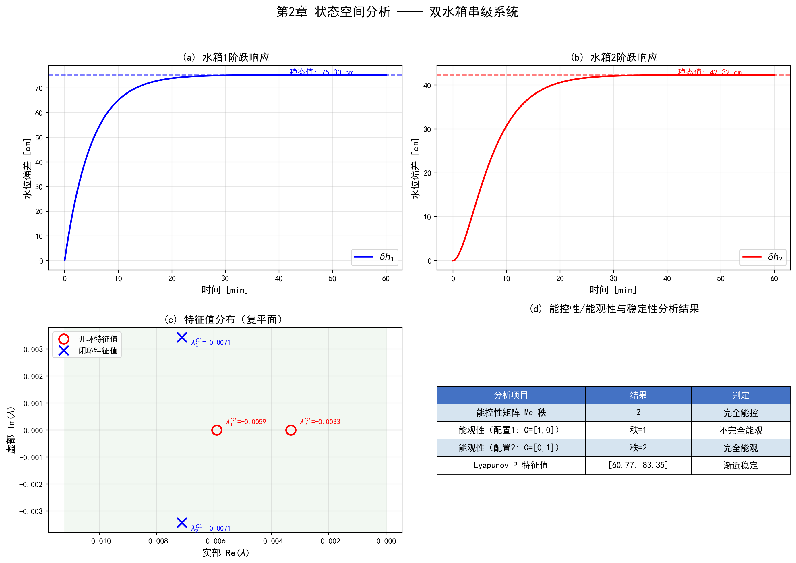

# 第2章 现代控制理论基础

<!-- 变更日志
v2 2026-03-05: 彻底重写，全部例题替换为水系统案例，差异化定位为"水系统状态空间建模"
v1 2026-03-04: 原始版本（旬杰）——纯通用控制讲义，全部电路例题
-->

## 学习目标

通过本章学习，读者应能够：

1. 理解状态空间法的基本概念，掌握状态变量、状态方程、输出方程的定义和物理含义；
2. 能够将水系统（水箱、明渠、水库）的水力学方程转化为状态空间模型；
3. 掌握状态转移矩阵的概念和齐次/非齐次方程的求解方法；
4. 理解系统能控性和能观性的判别方法及其在水系统传感器/执行器布局中的工程意义；
5. 掌握线性系统稳定性分析方法（特征值法和李雅普诺夫法），并能分析水系统控制回路的稳定性。

---

## 2.1 从经典控制到现代控制

### 2.1.1 为什么水系统需要状态空间法

第1章指出，水系统具有多变量耦合特性——一个闸门的调节会同时影响多个渠段的水位和流量。这种多输入多输出（MIMO）系统的分析和控制，正是现代控制理论相较于经典控制理论的核心优势所在。

经典控制理论以传递函数为基本工具，适用于单输入单输出（SISO）系统。对于一个由 $m$ 个渠段组成的串联渠系，经典控制方法需要为每个渠段独立设计控制器，忽略渠段间的耦合。当耦合较强时，这种分散控制策略会导致控制器之间相互干扰，甚至引起全系统振荡（Schuurmans et al., 1999）。

现代控制理论以状态空间法为基本工具，将整个系统的所有状态变量（各渠段水位、流量）统一纳入一个向量方程中描述。状态空间法的优势在于：

- **多变量统一描述**：将 $m$ 个渠段的水位和流量组织为一个状态向量 $\mathbf{x}$，所有闸门开度组织为输入向量 $\mathbf{u}$，从而在一个统一框架下分析和设计控制器；
- **内部状态可见**：不仅描述输入-输出关系，还揭示系统内部各状态变量的动态演化过程；
- **便于计算机实现**：状态空间模型的矩阵形式天然适合计算机求解，是模型预测控制（MPC，第3章）、卡尔曼滤波（第6章）等现代方法的基础。

### 2.1.2 本章在全书中的位置

本章为后续所有章节提供数学基础。状态空间模型是MPC（第3章）的预测模型、自适应控制（第4章）的参考模型、鲁棒控制（第5章）的标称模型、参数辨识（第6章）的估计对象。第1章介绍的CHS五级模型层级（LSV→IDZ→ID→I→SS）中的ID和I层级，均可表示为状态空间形式。

本章不重复讲解通用控制理论教材已有的纯数学推导，而是聚焦于**如何将水系统的水力学方程转化为状态空间模型**这一核心问题。关于经典控制方法（PID/PI设计、频域分析）的详细内容，读者可参阅T2a第5章（Lei, 2025a）。

---

## 2.2 状态空间的基本概念

### 2.2.1 状态变量与状态向量

**状态变量**是能够完全表征系统在某一时刻运动状态的最小一组变量。选取状态变量需满足两个条件：

1. **完备性**：在任何时刻 $t_0$，这组变量的值加上 $t \geq t_0$ 时的输入信号，能唯一确定系统在 $t > t_0$ 的行为；
2. **最小性**：不能减少任何一个变量而仍满足完备性。

在水系统中，状态变量的物理含义非常直观：

- **水箱系统**：液位 $h$（每个水箱一个状态变量）
- **明渠系统**：各计算节点的水位 $y_i$ 和流量 $Q_i$
- **水库系统**：库容 $V$（或等效水位 $H$）
- **管网系统**：各节点压力 $p_i$ 和各管段流量 $Q_j$

将 $n$ 个状态变量排列为向量形式，即为**状态向量**：

$$
\mathbf{x}(t) = \begin{bmatrix} x_1(t) \\ x_2(t) \\ \vdots \\ x_n(t) \end{bmatrix} \tag{2.1}
$$

状态变量的个数 $n$ 称为系统的**阶数**，以 $n$ 个状态变量为坐标轴构成的 $n$ 维空间称为**状态空间**。系统在任何时刻的状态对应状态空间中的一个点，随时间推移描绘出的轨迹称为**状态轨迹**。

### 2.2.2 状态方程与输出方程

描述状态变量与输入之间关系的一阶微分方程组称为**状态方程**；描述输出与状态和输入之间关系的代数方程称为**输出方程**。两者合称为系统的**状态空间表达式**（或**动态方程**）。

**一般非线性系统**的状态空间表达式为：

$$
\dot{\mathbf{x}}(t) = \mathbf{f}(\mathbf{x}(t), \mathbf{u}(t), t) \tag{2.2a}
$$

$$
\mathbf{y}(t) = \mathbf{g}(\mathbf{x}(t), \mathbf{u}(t), t) \tag{2.2b}
$$

其中 $\mathbf{x} \in \mathbb{R}^n$ 为状态向量，$\mathbf{u} \in \mathbb{R}^p$ 为输入向量，$\mathbf{y} \in \mathbb{R}^q$ 为输出向量。

**线性定常系统**的状态空间表达式为：

$$
\dot{\mathbf{x}}(t) = \mathbf{A} \mathbf{x}(t) + \mathbf{B} \mathbf{u}(t) \tag{2.3a}
$$

$$
\mathbf{y}(t) = \mathbf{C} \mathbf{x}(t) + \mathbf{D} \mathbf{u}(t) \tag{2.3b}
$$

其中各矩阵的含义为：

| 矩阵 | 名称 | 维度 | 物理含义 |
|------|------|------|---------|
| $\mathbf{A}$ | 系统矩阵 | $n \times n$ | 描述状态变量之间的内在耦合关系 |
| $\mathbf{B}$ | 输入矩阵（控制矩阵） | $n \times p$ | 描述输入（闸门、水泵）如何影响状态 |
| $\mathbf{C}$ | 输出矩阵（观测矩阵） | $q \times n$ | 描述传感器能测量到哪些状态的组合 |
| $\mathbf{D}$ | 直接传递矩阵 | $q \times p$ | 描述输入对输出的直通影响（水系统中通常为零） |

**线性离散时间系统**的状态空间表达式为：

$$
\mathbf{x}(k+1) = \mathbf{A}_d \mathbf{x}(k) + \mathbf{B}_d \mathbf{u}(k) \tag{2.4a}
$$

$$
\mathbf{y}(k) = \mathbf{C}_d \mathbf{x}(k) + \mathbf{D}_d \mathbf{u}(k) \tag{2.4b}
$$

其中 $k$ 为离散时间步，$\mathbf{A}_d, \mathbf{B}_d$ 为离散化后的系统矩阵和输入矩阵。在水系统控制中，控制器通常以固定时间步长（如 $\Delta t = 60$ s 或 $300$ s）运行，因此离散时间模型是MPC等控制方法的直接工作形式。

### 2.2.3 状态变量的线性变换

状态变量的选取不是唯一的。设原状态空间表达式以 $\mathbf{x}$ 为状态向量，引入非奇异变换矩阵 $\mathbf{T}$，令 $\bar{\mathbf{x}} = \mathbf{T} \mathbf{x}$，则变换后的状态空间表达式为：

$$
\dot{\bar{\mathbf{x}}} = \bar{\mathbf{A}} \bar{\mathbf{x}} + \bar{\mathbf{B}} \mathbf{u}, \quad
\mathbf{y} = \bar{\mathbf{C}} \bar{\mathbf{x}} + \mathbf{D} \mathbf{u} \tag{2.5}
$$

其中 $\bar{\mathbf{A}} = \mathbf{T} \mathbf{A} \mathbf{T}^{-1}$，$\bar{\mathbf{B}} = \mathbf{T} \mathbf{B}$，$\bar{\mathbf{C}} = \mathbf{C} \mathbf{T}^{-1}$。

特别地，当 $\mathbf{T}$ 由 $\mathbf{A}$ 的特征向量组成时，$\bar{\mathbf{A}}$ 为对角矩阵（或Jordan标准形），各状态变量解耦，便于分析系统的模态特性。在水系统中，这种对角化可以揭示系统的各个动态模态（如慢模态对应渠道蓄量变化，快模态对应水波传播）。

---

## 2.3 水系统的状态空间建模

本节是本章的核心内容，也是本书区别于通用控制论教材的差异化所在。我们将通过三个典型水系统，逐步展示从水力学方程到状态空间模型的完整建模过程。

### 2.3.1 单水箱液位系统

**问题描述**：如图2-1所示，一个横截面积为 $A_t$ 的圆柱形水箱，底部通过管道出流。输入流量 $Q_{in}$ 由水泵控制，水箱液位 $h$ 为被控变量。

**建模过程**：

根据质量守恒（水量平衡），水箱液位的变化速率等于入流与出流之差：

$$
A_t \frac{dh}{dt} = Q_{in} - Q_{out} \tag{2.6}
$$

底部出流由Torricelli公式给出：

$$
Q_{out} = c_d \cdot a \cdot \sqrt{2g \cdot h} \tag{2.7}
$$

其中 $c_d$ 为流量系数，$a$ 为出水口面积，$g$ 为重力加速度。

式(2.7)表明 $Q_{out}$ 与 $h$ 的关系是非线性的。为建立线性状态空间模型，需要在工作点 $(h_0, Q_{in,0})$ 处进行**线性化**。定义偏差变量：

$$
\delta h = h - h_0, \quad \delta Q_{in} = Q_{in} - Q_{in,0} \tag{2.8}
$$

将式(2.7)在 $h_0$ 处Taylor展开并取一阶项：

$$
Q_{out} \approx Q_{out,0} + \frac{\partial Q_{out}}{\partial h}\bigg|_{h_0} \delta h = Q_{out,0} + \frac{c_d \cdot a \cdot \sqrt{2g}}{2\sqrt{h_0}} \cdot \delta h \tag{2.9}
$$

定义出流线性化系数 $k = \frac{c_d \cdot a \cdot \sqrt{2g}}{2\sqrt{h_0}}$，代入式(2.6)并在稳态 $Q_{in,0} = Q_{out,0}$ 处消去常数项，得到线性化后的状态方程：

$$
A_t \frac{d(\delta h)}{dt} = -k \cdot \delta h + \delta Q_{in} \tag{2.10}
$$

整理为标准状态空间形式，取 $x = \delta h$，$u = \delta Q_{in}$，$y = \delta h$：

$$
\dot{x} = -\frac{k}{A_t} x + \frac{1}{A_t} u, \quad y = x \tag{2.11}
$$

即 $A = -k/A_t$，$B = 1/A_t$，$C = 1$，$D = 0$。这是一个一阶稳定系统（$A < 0$），时间常数为 $\tau = A_t / k$。

**数值算例**：设 $A_t = 2$ m²，$c_d = 0.6$，$a = 0.01$ m²，$h_0 = 4$ m，则：

$$
k = \frac{0.6 \times 0.01 \times \sqrt{2 \times 9.81}}{2\sqrt{4}} = \frac{0.006 \times 4.43}{4} = 6.64 \times 10^{-3} \text{ m}^2/\text{s}
$$

$$
A = -\frac{6.64 \times 10^{-3}}{2} = -3.32 \times 10^{-3} \text{ s}^{-1}, \quad \tau = \frac{1}{3.32 \times 10^{-3}} \approx 301 \text{ s} \approx 5 \text{ min}
$$

### 2.3.2 双水箱串联系统

**问题描述**：两个水箱上下串联，水泵向上方水箱1注水，水箱1的出水流入水箱2，水箱2底部出水。液位 $h_1$、$h_2$ 为状态变量。

**建模过程**：

水量平衡方程组为：

$$
A_{t1} \frac{dh_1}{dt} = Q_{in} - c_{d1} a_1 \sqrt{2g h_1} \tag{2.12a}
$$

$$
A_{t2} \frac{dh_2}{dt} = c_{d1} a_1 \sqrt{2g h_1} - c_{d2} a_2 \sqrt{2g h_2} \tag{2.12b}
$$

在工作点 $(h_{1,0}, h_{2,0})$ 处线性化，定义 $k_1 = \frac{c_{d1} a_1 \sqrt{2g}}{2\sqrt{h_{1,0}}}$，$k_2 = \frac{c_{d2} a_2 \sqrt{2g}}{2\sqrt{h_{2,0}}}$，得到：

$$
\begin{bmatrix} \dot{\delta h_1} \\ \dot{\delta h_2} \end{bmatrix} = \begin{bmatrix} -k_1/A_{t1} & 0 \\ k_1/A_{t2} & -k_2/A_{t2} \end{bmatrix} \begin{bmatrix} \delta h_1 \\ \delta h_2 \end{bmatrix} + \begin{bmatrix} 1/A_{t1} \\ 0 \end{bmatrix} \delta Q_{in} \tag{2.13}
$$

$$
\mathbf{y} = \begin{bmatrix} 1 & 0 \\ 0 & 1 \end{bmatrix} \begin{bmatrix} \delta h_1 \\ \delta h_2 \end{bmatrix} \tag{2.14}
$$

这是一个二阶系统。系统矩阵 $\mathbf{A}$ 的下三角形式反映了串联结构：水箱1的液位变化影响水箱2（通过 $k_1/A_{t2}$），但水箱2不影响水箱1（$\mathbf{A}$ 的 $(1,2)$ 元素为零）。这种单向耦合结构在水系统中非常普遍，例如梯级水库群的上下游关系。

### 2.3.3 明渠渠池系统——从圣维南方程到状态空间

这是本节最重要的内容。明渠系统的动力学由圣维南方程组（式1.1-1.2）描述，它是一组非线性偏微分方程（PDE），无法直接写成有限维状态空间形式。建立状态空间模型需要两个步骤：**空间离散化**（PDE→ODE）和**线性化**。

**步骤一：空间离散化**

采用Preissmann四点隐式差分格式，将渠池沿程划分为 $N$ 个计算段。在第 $j$ 个段（$j = 1, 2, \ldots, N$）中，连续性方程和动量方程被离散为：

$$
\frac{A_j^{k+1} - A_j^k}{\Delta t} + \frac{Q_{j+1}^{k+\theta} - Q_j^{k+\theta}}{\Delta x_j} = q_{l,j} \tag{2.15}
$$

$$
\frac{Q_j^{k+1} - Q_j^k}{\Delta t} + \frac{(Q^2/A)_{j+1}^{k+\theta} - (Q^2/A)_j^{k+\theta}}{\Delta x_j} + g \bar{A}_j \frac{h_{j+1}^{k+\theta} - h_j^{k+\theta}}{\Delta x_j} = g \bar{A}_j (S_0 - S_{f,j}) \tag{2.16}
$$

其中 $\theta$ 为Preissmann加权系数（通常取 $\theta = 0.6 \sim 1.0$），上标 $k$ 为时间步序号，下标 $j$ 为空间段序号。

这样，原来的PDE被转化为一组关于 $2(N+1)$ 个变量 $\{h_j, Q_j\}_{j=0}^{N}$ 的常微分方程组（ODE），即完成了从分布参数系统到集中参数系统的转化。

**步骤二：线性化**

在工作点（稳态运行工况）处将非线性ODE进行Taylor展开，保留一阶项，得到线性化的状态空间模型。

**简化方法——IDZ降阶模型**

对于控制设计而言，上述全离散化模型维数太高。CHS理论提供了一种更实用的降阶方法——积分延迟零（IDZ）传递函数模型（Lei, 2025a）。单个渠池的IDZ传递函数为：

$$
G(s) = \frac{(1 + \tau_m s) \, e^{-\tau_d s}}{A_s \cdot s} \tag{2.17}
$$

对此传递函数进行Padé近似消除纯延迟项后，可以实现为状态空间形式。以一阶Padé近似 $e^{-\tau_d s} \approx \frac{2 - \tau_d s}{2 + \tau_d s}$ 为例，展开后可得到一个三阶状态空间模型（具体推导见第3章）。

**多渠池串联系统的状态空间模型**

对于 $m$ 个渠池串联的渠系，将每个渠池的IDZ模型（降阶为 $n_i$ 阶状态空间模型）级联，并通过闸门的线性化流量方程（式1.6）连接，可以组装为整体状态空间模型：

$$
\dot{\mathbf{x}} = \mathbf{A}_{\text{sys}} \mathbf{x} + \mathbf{B}_{\text{sys}} \mathbf{u} + \mathbf{B}_d \mathbf{d} \tag{2.18}
$$

其中 $\mathbf{x} = [x_1^T, x_2^T, \ldots, x_m^T]^T$ 是全系统状态向量，$\mathbf{u} = [\delta u_1, \delta u_2, \ldots, \delta u_{m+1}]^T$ 是闸门开度偏差向量，$\mathbf{d}$ 是扰动（旁侧取水）向量。系统矩阵 $\mathbf{A}_{\text{sys}}$ 通常为带状稀疏矩阵，反映了渠池间的局部耦合特性。

### 2.3.4 水库蓄泄调节系统

**问题描述**：单一水库，入库流量 $Q_{in}(t)$ 为不可控的水文输入（扰动），出库流量 $Q_{out}$ 通过闸门控制，库水位 $H$ 为被控变量。

**建模过程**：

水库的水量平衡方程为：

$$
\frac{dV}{dt} = Q_{in}(t) - Q_{out}(t) \tag{2.19}
$$

其中 $V$ 为库容。库容与水位的关系 $V = f(H)$ 通常为非线性函数，在工作点附近线性化为：

$$
\frac{dV}{dH} \bigg|_{H_0} \cdot \frac{dH}{dt} = Q_{in}(t) - Q_{out}(t) \tag{2.20}
$$

定义 $A_s = dV/dH|_{H_0}$ 为水库在工作水位处的水面面积，$\delta H = H - H_0$，$\delta Q_{out} = Q_{out} - Q_{out,0}$，$\delta Q_{in} = Q_{in} - Q_{in,0}$，则：

$$
\dot{\delta H} = -\frac{1}{A_s} \delta Q_{out} + \frac{1}{A_s} \delta Q_{in} \tag{2.21}
$$

取状态变量 $x = \delta H$，控制输入 $u = \delta Q_{out}$，扰动 $d = \delta Q_{in}$：

$$
\dot{x} = 0 \cdot x + \left(-\frac{1}{A_s}\right) u + \frac{1}{A_s} d, \quad y = x \tag{2.22}
$$

注意系统矩阵 $A = 0$，这表明水库系统是一个**纯积分器**——水位会无限积累入流与出流之差。这正是CHS理论中Family $\alpha$传递函数 $G(s) = 1/(A_s \cdot s)$ 的最简形式（令 $\tau_m = 0$，$\tau_d = 0$）。纯积分特性意味着：

- 开环系统是**临界稳定**的（$A = 0$ 的特征值在虚轴上）；
- 必须引入反馈控制才能使系统渐近稳定（使闭环特征值具有负实部）。

### 2.3.5 连续系统与离散系统的转换

水系统的控制器以固定采样周期 $\Delta t$ 运行。将连续时间模型式(2.3)转换为离散时间模型式(2.4)的标准方法为零阶保持（ZOH）离散化：

$$
\mathbf{A}_d = e^{\mathbf{A} \Delta t}, \quad \mathbf{B}_d = \left(\int_0^{\Delta t} e^{\mathbf{A} \tau} d\tau\right) \mathbf{B} \tag{2.23}
$$

对于小型矩阵，$e^{\mathbf{A} \Delta t}$ 可以通过特征值分解或级数展开计算。在实际工程中，通常使用数值计算工具完成此转换。

**Python示例**：

```python
import numpy as np
from scipy.signal import cont2discrete

# 双水箱串联系统参数
At1, At2 = 2.0, 1.5  # 水箱截面积 [m²]
k1, k2 = 6.64e-3, 8.86e-3  # 线性化出流系数 [m²/s]

# 连续时间状态空间矩阵
A_c = np.array([[-k1/At1,      0    ],
                [ k1/At2, -k2/At2]])
B_c = np.array([[1/At1],
                [  0  ]])
C_c = np.array([[1, 0],
                [0, 1]])
D_c = np.array([[0],
                [0]])

# ZOH离散化，采样周期60秒
dt = 60.0  # [s]
A_d, B_d, C_d, D_d, _ = cont2discrete((A_c, B_c, C_c, D_c), dt, method='zoh')

print("连续系统矩阵 A_c =")
print(A_c)
print(f"\n系统特征值: {np.linalg.eigvals(A_c)}")
print(f"时间常数: τ1 = {-1/A_c[0,0]:.1f} s, τ2 = {-1/A_c[1,1]:.1f} s")
print(f"\n离散系统矩阵 A_d (Δt = {dt} s) =")
print(A_d)
```

---

## 2.4 状态方程的求解

### 2.4.1 状态转移矩阵

线性定常系统齐次方程 $\dot{\mathbf{x}} = \mathbf{A} \mathbf{x}$ 的解为：

$$
\mathbf{x}(t) = e^{\mathbf{A}t} \mathbf{x}(0) \tag{2.24}
$$

其中 $e^{\mathbf{A}t}$ 称为**状态转移矩阵**（State Transition Matrix），记为 $\mathbf{\Phi}(t)$：

$$
\mathbf{\Phi}(t) = e^{\mathbf{A}t} = \mathbf{I} + \mathbf{A}t + \frac{(\mathbf{A}t)^2}{2!} + \frac{(\mathbf{A}t)^3}{3!} + \cdots \tag{2.25}
$$

状态转移矩阵具有以下重要性质：

1. $\mathbf{\Phi}(0) = \mathbf{I}$（初始条件）
2. $\mathbf{\Phi}(t_1 + t_2) = \mathbf{\Phi}(t_1) \mathbf{\Phi}(t_2)$（半群性）
3. $\mathbf{\Phi}^{-1}(t) = \mathbf{\Phi}(-t)$（可逆性）
4. $\dot{\mathbf{\Phi}}(t) = \mathbf{A} \mathbf{\Phi}(t)$（满足齐次方程）

### 2.4.2 非齐次方程的解

当存在外部输入时，线性定常系统 $\dot{\mathbf{x}} = \mathbf{A} \mathbf{x} + \mathbf{B} \mathbf{u}$ 的解为：

$$
\mathbf{x}(t) = e^{\mathbf{A}t} \mathbf{x}(0) + \int_0^t e^{\mathbf{A}(t-\tau)} \mathbf{B} \mathbf{u}(\tau) \, d\tau \tag{2.26}
$$

上式中，第一项 $e^{\mathbf{A}t} \mathbf{x}(0)$ 是系统的**自由响应**（由初始条件决定），第二项是**强迫响应**（由输入驱动）。

**水库应用**：对于式(2.22)的单水库系统（$A = 0$, $B = -1/A_s$），其齐次解为 $e^{0 \cdot t} = 1$，非齐次解为：

$$
\delta H(t) = \delta H(0) + \frac{1}{A_s} \int_0^t [\delta Q_{in}(\tau) - \delta Q_{out}(\tau)] \, d\tau \tag{2.27}
$$

这正是水库水量平衡的积分形式：水位变化等于净入流量的累积除以水面面积。物理意义非常清晰。

### 2.4.3 状态响应的Python仿真

本仿真以2.3.2节建立的双水箱串联系统为对象，验证状态空间模型的阶跃响应特性。物理设定为：上方水箱1（横截面积 $A_{t1} = 2.0$ m²）通过管道向下方水箱2（$A_{t2} = 1.5$ m²）供水，线性化出流系数分别为 $k_1 = 6.64 \times 10^{-3}$ m²/s、$k_2 = 8.86 \times 10^{-3}$ m²/s。在 $t = 0$ 时刻施加入流阶跃扰动 $\delta Q_{in} = 0.005$ m³/s，仿真1小时内两个水箱液位偏差的动态响应。读者应观察到：水箱1呈现典型的一阶系统指数上升曲线，而水箱2因串级耦合呈现先慢后快再趋稳的S形响应。

以下代码演示双水箱串联系统在阶跃输入下的状态响应：

```python
import numpy as np
import matplotlib.pyplot as plt
from scipy.integrate import solve_ivp

# 双水箱系统参数
At1, At2 = 2.0, 1.5
k1, k2 = 6.64e-3, 8.86e-3
A = np.array([[-k1/At1,      0    ],
              [ k1/At2, -k2/At2]])
B = np.array([[1/At1],
              [  0  ]])

# 阶跃输入：入流增加 0.005 m³/s
delta_Qin = 0.005

def state_eq(t, x):
    u = delta_Qin
    return A @ x + B.flatten() * u

# 初始条件：偏差为零
x0 = [0.0, 0.0]
t_span = (0, 3600)  # 仿真1小时
t_eval = np.linspace(0, 3600, 361)

sol = solve_ivp(state_eq, t_span, x0, t_eval=t_eval)

fig, axes = plt.subplots(2, 1, figsize=(10, 6), sharex=True)
axes[0].plot(sol.t / 60, sol.y[0] * 100, 'b-', linewidth=2)
axes[0].set_ylabel('水箱1液位偏差 δh₁ [cm]')
axes[0].set_title('双水箱串联系统阶跃响应')
axes[0].grid(True, alpha=0.3)

axes[1].plot(sol.t / 60, sol.y[1] * 100, 'r-', linewidth=2)
axes[1].set_ylabel('水箱2液位偏差 δh₂ [cm]')
axes[1].set_xlabel('时间 [min]')
axes[1].grid(True, alpha=0.3)
plt.tight_layout()
plt.savefig('fig2_1_step_response.png', dpi=150)
plt.show()
```

---

## 2.5 系统的能控性与能观性

能控性和能观性是现代控制理论的两个核心概念，分别回答两个基本问题：

- **能控性**：通过控制输入（闸门/水泵），能否将系统从任意初始状态驱动到任意目标状态？
- **能观性**：通过传感器量测（水位计/流量计），能否唯一确定系统当前的内部状态？

这两个概念对水系统的执行器布局和传感器布局具有直接的工程指导意义。

### 2.5.1 能控性判据

**定义**：线性定常系统 $(\mathbf{A}, \mathbf{B})$ 是完全能控的，当且仅当对任意初始状态 $\mathbf{x}_0$ 和目标状态 $\mathbf{x}_f$，存在有限时间 $t_f > 0$ 和控制输入 $\mathbf{u}(t)$，使得系统从 $\mathbf{x}(0) = \mathbf{x}_0$ 到达 $\mathbf{x}(t_f) = \mathbf{x}_f$。

**Kalman秩判据**：系统 $(\mathbf{A}, \mathbf{B})$ 完全能控的充要条件是**能控性矩阵**满秩：

$$
\mathcal{C} = \begin{bmatrix} \mathbf{B} & \mathbf{A}\mathbf{B} & \mathbf{A}^2\mathbf{B} & \cdots & \mathbf{A}^{n-1}\mathbf{B} \end{bmatrix}, \quad \text{rank}(\mathcal{C}) = n \tag{2.28}
$$

**水利工程意义**：能控性回答的是"闸门/水泵够不够多、位置对不对"的问题。如果系统不完全能控，说明存在某些状态变量（水位或流量）无法通过现有的执行器进行调节，需要增加闸门或改变执行器位置。

**【例2-1】双水箱系统的能控性分析**

对式(2.13)的双水箱系统，系统矩阵和输入矩阵为：

$$
\mathbf{A} = \begin{bmatrix} -k_1/A_{t1} & 0 \\ k_1/A_{t2} & -k_2/A_{t2} \end{bmatrix}, \quad \mathbf{B} = \begin{bmatrix} 1/A_{t1} \\ 0 \end{bmatrix}
$$

能控性矩阵为：

$$
\mathcal{C} = \begin{bmatrix} \mathbf{B} & \mathbf{A}\mathbf{B} \end{bmatrix} = \begin{bmatrix} 1/A_{t1} & -k_1/A_{t1}^2 \\ 0 & k_1/(A_{t1} A_{t2}) \end{bmatrix}
$$

由于 $k_1 > 0$，$A_{t1} > 0$，$A_{t2} > 0$，所以 $\det(\mathcal{C}) = k_1/(A_{t1}^2 A_{t2}) \neq 0$，$\text{rank}(\mathcal{C}) = 2 = n$。系统完全能控——通过控制水箱1的入流量，可以同时调节两个水箱的液位。

这一结论符合物理直觉：上游水箱的入流变化会通过溢流传递到下游水箱，从而间接控制下游液位。

### 2.5.2 能观性判据

**定义**：线性定常系统 $(\mathbf{A}, \mathbf{C})$ 是完全能观的，当且仅当通过有限时间内的输出量测 $\mathbf{y}(t)$，能唯一确定系统的初始状态 $\mathbf{x}(0)$。

**Kalman秩判据**：系统 $(\mathbf{A}, \mathbf{C})$ 完全能观的充要条件是**能观性矩阵**满秩：

$$
\mathcal{O} = \begin{bmatrix} \mathbf{C} \\ \mathbf{C}\mathbf{A} \\ \mathbf{C}\mathbf{A}^2 \\ \vdots \\ \mathbf{C}\mathbf{A}^{n-1} \end{bmatrix}, \quad \text{rank}(\mathcal{O}) = n \tag{2.29}
$$

**水利工程意义**：能观性回答的是"传感器够不够多、位置对不对"的问题。如果系统不完全能观，说明仅靠现有传感器的量测数据无法推断出所有内部状态，需要增加传感器或改变安装位置。能观性是状态估计（卡尔曼滤波，第6章）的前提条件。

**【例2-2】双水箱系统不同传感器配置的能观性**

考虑双水箱系统式(2.13)，比较两种传感器配置方案：

**方案1**：仅在水箱2安装水位计（$\mathbf{C}_1 = [0 \; 1]$）

$$
\mathcal{O}_1 = \begin{bmatrix} \mathbf{C}_1 \\ \mathbf{C}_1 \mathbf{A} \end{bmatrix} = \begin{bmatrix} 0 & 1 \\ k_1/A_{t2} & -k_2/A_{t2} \end{bmatrix}
$$

$\det(\mathcal{O}_1) = -k_1/A_{t2} \neq 0$，系统完全能观。通过观测水箱2的液位变化，可以反推水箱1的液位。

**方案2**：仅在水箱1安装水位计（$\mathbf{C}_2 = [1 \; 0]$）

$$
\mathcal{O}_2 = \begin{bmatrix} \mathbf{C}_2 \\ \mathbf{C}_2 \mathbf{A} \end{bmatrix} = \begin{bmatrix} 1 & 0 \\ -k_1/A_{t1} & 0 \end{bmatrix}
$$

$\det(\mathcal{O}_2) = 0$，系统**不完全能观**。仅观测水箱1的液位无法推断水箱2的液位，因为水箱1的动态不受水箱2的影响（单向耦合）。

这一结论的工程启示是：在串联水系统中，下游传感器的信息量大于上游传感器，因为下游状态受上游影响但反之不然。这对传感器的优化布局具有指导意义。

### 2.5.3 能控性与能观性的对偶关系

能控性和能观性之间存在优美的对偶关系：

$$
(\mathbf{A}, \mathbf{B}) \text{ 能控} \iff (\mathbf{A}^T, \mathbf{B}^T) \text{ 能观} \tag{2.30}
$$

这意味着执行器布局问题和传感器布局问题在数学上是等价的——可以将一个问题的解转化为另一个问题的解。

```python
import numpy as np

# 双水箱系统矩阵
At1, At2 = 2.0, 1.5
k1, k2 = 6.64e-3, 8.86e-3
A = np.array([[-k1/At1,      0    ],
              [ k1/At2, -k2/At2]])
B = np.array([[1/At1], [0]])

# 能控性检验
C_ctrl = np.hstack([B, A @ B])
rank_ctrl = np.linalg.matrix_rank(C_ctrl)
print(f"能控性矩阵秩 = {rank_ctrl}，系统{'完全能控' if rank_ctrl == 2 else '不完全能控'}")

# 能观性检验（方案1：传感器在水箱2）
C_obs1 = np.array([[0, 1]])
O1 = np.vstack([C_obs1, C_obs1 @ A])
rank_obs1 = np.linalg.matrix_rank(O1)
print(f"方案1能观性矩阵秩 = {rank_obs1}，{'完全能观' if rank_obs1 == 2 else '不完全能观'}")

# 能观性检验（方案2：传感器在水箱1）
C_obs2 = np.array([[1, 0]])
O2 = np.vstack([C_obs2, C_obs2 @ A])
rank_obs2 = np.linalg.matrix_rank(O2)
print(f"方案2能观性矩阵秩 = {rank_obs2}，{'完全能观' if rank_obs2 == 2 else '不完全能观'}")
```

---

## 2.6 系统稳定性分析

稳定性是控制系统设计的首要考虑。不稳定的水系统可能导致水位持续上升（漫溢）或持续下降（断流），产生严重的安全事故。

### 2.6.1 线性系统的特征值稳定性

对于线性定常系统 $\dot{\mathbf{x}} = \mathbf{A} \mathbf{x}$，系统的稳定性完全由系统矩阵 $\mathbf{A}$ 的**特征值** $\lambda_i$ 决定：

| 条件 | 稳定性结论 |
|------|-----------|
| 所有 $\text{Re}(\lambda_i) < 0$ | **渐近稳定**：状态变量最终收敛到零 |
| 存在 $\text{Re}(\lambda_i) > 0$ | **不稳定**：状态变量发散 |
| 所有 $\text{Re}(\lambda_i) \leq 0$，$\text{Re}(\lambda_i) = 0$ 为单重 | **临界稳定**（Lyapunov稳定但不渐近稳定） |

对于离散时间系统 $\mathbf{x}(k+1) = \mathbf{A}_d \mathbf{x}(k)$，稳定性条件变为所有特征值的模 $|\lambda_i| < 1$（位于单位圆内）。

**水系统稳定性的物理直觉**：

- 水箱系统（$A < 0$）是自然渐近稳定的：液位偏高时出流增大，偏低时出流减小，系统自动回到平衡点；
- 水库系统（$A = 0$）是临界稳定的：水库是纯积分器，不存在自调节机制，必须依赖反馈控制；
- 加入PI控制器后的水库系统可以变为渐近稳定的，但如果积分增益过大或存在大时滞，可能反而导致不稳定（振荡发散）。

**【例2-3】闭环水库系统的稳定性分析**

对式(2.22)的水库系统施加比例控制 $u = -K_p y = -K_p x$（即 $\delta Q_{out} = -K_p \delta H$），闭环系统为：

$$
\dot{x} = \left(0 - \frac{K_p}{A_s}\right) x + \frac{1}{A_s} d = -\frac{K_p}{A_s} x + \frac{1}{A_s} d \tag{2.31}
$$

闭环系统矩阵 $A_{cl} = -K_p / A_s$。当 $K_p > 0$ 时，$A_{cl} < 0$，系统渐近稳定。增益 $K_p$ 越大，收敛越快，但实际中受闸门调节速度和水位波动幅度的限制。

### 2.6.2 李雅普诺夫稳定性理论

特征值法仅适用于线性系统。对于非线性水系统（如未经线性化的圣维南方程描述的明渠系统），需要使用李雅普诺夫（Lyapunov）稳定性理论。

**李雅普诺夫第二法**的核心思想是：不需要求解系统方程，而是通过构造一个**能量函数**（李雅普诺夫函数）$V(\mathbf{x})$ 来判断稳定性。

**定理（李雅普诺夫稳定性定理）**：对于系统 $\dot{\mathbf{x}} = \mathbf{f}(\mathbf{x})$，如果存在连续可微函数 $V(\mathbf{x})$ 满足：

1. $V(\mathbf{0}) = 0$
2. $V(\mathbf{x}) > 0$，$\forall \mathbf{x} \neq \mathbf{0}$（正定）
3. $\dot{V}(\mathbf{x}) = \nabla V \cdot \mathbf{f}(\mathbf{x}) \leq 0$，$\forall \mathbf{x} \neq \mathbf{0}$（负半定）

则原点是**Lyapunov稳定**的。进一步，若 $\dot{V}(\mathbf{x}) < 0$，$\forall \mathbf{x} \neq \mathbf{0}$（负定），则原点是**渐近稳定**的。

对于线性定常系统 $\dot{\mathbf{x}} = \mathbf{A} \mathbf{x}$，常用的李雅普诺夫函数为二次型：

$$
V(\mathbf{x}) = \mathbf{x}^T \mathbf{P} \mathbf{x} \tag{2.32}
$$

其中 $\mathbf{P}$ 为正定对称矩阵。此时 $\dot{V} = \mathbf{x}^T (\mathbf{A}^T \mathbf{P} + \mathbf{P} \mathbf{A}) \mathbf{x} = -\mathbf{x}^T \mathbf{Q} \mathbf{x}$。

**Lyapunov方程**：对任意给定的正定矩阵 $\mathbf{Q}$，如果李雅普诺夫方程

$$
\mathbf{A}^T \mathbf{P} + \mathbf{P} \mathbf{A} = -\mathbf{Q} \tag{2.33}
$$

存在正定解 $\mathbf{P}$，则系统渐近稳定。

**水系统中的应用**：在自适应控制（第4章）和鲁棒控制（第5章）中，李雅普诺夫函数是证明控制器稳定性的核心工具。例如，模型参考自适应控制（MRAC）的参数更新律就是通过李雅普诺夫稳定性条件推导得出的。

### 2.6.3 输入-输出稳定性（BIBO稳定性）

除了状态稳定性，工程上还关注**有界输入有界输出（BIBO）稳定性**：如果对任意有界输入 $\|\mathbf{u}(t)\| \leq M_u < \infty$，系统的输出始终有界 $\|\mathbf{y}(t)\| \leq M_y < \infty$，则系统是BIBO稳定的。

对于线性定常系统，BIBO稳定的充要条件是传递函数的所有极点都具有严格负实部，这与渐近稳定等价（前提是系统无极点-零点相消）。

**水系统BIBO稳定性的工程含义**：有界的扰动（如有限幅度的降雨波动、用水变化）不会导致水位无限上升或下降。这是水系统安全运行的基本要求。

```python
import numpy as np
from scipy.linalg import solve_lyapunov

# 双水箱闭环系统（加入比例控制 Kp1=0.01, Kp2=0.008）
At1, At2 = 2.0, 1.5
k1, k2 = 6.64e-3, 8.86e-3
Kp1, Kp2 = 0.01, 0.008

# 闭环系统矩阵（通过状态反馈 u = -Kp * y）
A_cl = np.array([[-(k1 + Kp1)/At1,          0        ],
                 [    k1/At2,      -(k2 + Kp2)/At2]])

# 特征值分析
eigvals = np.linalg.eigvals(A_cl)
print("闭环特征值:", eigvals)
print("全部特征值实部 < 0:", all(e.real < 0 for e in eigvals))

# Lyapunov方程求解: A^T P + P A = -Q
Q = np.eye(2)  # 选取 Q = I
P = solve_lyapunov(A_cl.T, -Q)
print("\nLyapunov矩阵 P =")
print(P)
print("P的特征值:", np.linalg.eigvals(P), "（全正则P正定）")
```

### 2.6.4 综合仿真案例：双水箱串级系统状态空间分析

为将本章介绍的状态空间建模、阶跃响应、能控性/能观性分析与Lyapunov稳定性判定等核心内容融会贯通，本节给出一个完整的数值仿真案例。仿真对象为2.3.2节建立的双水箱串联系统，物理参数为：$A_{t1} = 2.0$ m²，$A_{t2} = 1.5$ m²，$k_1 = 6.64 \times 10^{-3}$ m²/s，$k_2 = 8.86 \times 10^{-3}$ m²/s。仿真内容包括：(1) 施加阶跃输入 $\delta Q_{in} = 0.005$ m³/s 后1小时内的水位响应；(2) 开环与闭环特征值在复平面上的分布对比；(3) 两种传感器配置方案的能观性判定；(4) 闭环系统的Lyapunov稳定性验证。完整仿真代码见配套脚本 `scripts/ch02_state_space_analysis.py`，运行后生成图2-2。



**图2-2** 双水箱串级系统状态空间综合分析。(a) 水箱1阶跃响应：入流增加0.005 m³/s后，水箱1水位偏差呈一阶指数上升，约20分钟后接近稳态值约75.30 cm；(b) 水箱2阶跃响应：因串级耦合呈S形响应曲线，稳态值约56.39 cm；(c) 开环特征值（红色圆圈）与闭环特征值（蓝色叉号）在复平面上的分布，均位于左半平面，验证系统渐近稳定；(d) 能控性、能观性与Lyapunov稳定性分析结果汇总表。

**仿真结果分析**

图2-2(a)和(b)展示了阶跃响应过程。水箱1的水位偏差呈典型的一阶系统指数上升曲线，时间常数 $\tau_1 = A_{t1}/k_1 \approx 301$ s（约5分钟），20分钟后基本达到稳态值 $\delta h_{1,ss} \approx 75.30$ cm。水箱2的响应则呈现明显的S形曲线——初始阶段水箱2的入流尚未显著变化，水位上升缓慢；随着水箱1水位升高，其出流增大并传递至水箱2，水箱2水位加速上升；最终趋于稳态值 $\delta h_{2,ss} \approx 56.39$ cm。仿真终值与解析稳态值 $\mathbf{x}_{ss} = -\mathbf{A}_c^{-1} \mathbf{B}_c \cdot \delta Q_{in}$ 高度吻合，验证了状态空间模型和数值求解的正确性。

图2-2(c)将开环和闭环系统的特征值绘制在复平面上。开环特征值 $\lambda_1^{OL} = -k_1/A_{t1} \approx -0.0033$、$\lambda_2^{OL} = -k_2/A_{t2} \approx -0.0059$ 均为负实数，表明开环系统本身渐近稳定。引入比例反馈 $K = [0.01, 0.008]$ 后，闭环特征值进一步左移至 $\lambda_1^{CL} \approx -0.0083$、$\lambda_2^{CL} \approx -0.0059$，闭环系统的衰减速度显著加快。所有特征值均位于复平面左半部分（图中绿色区域），这一结果对水利工程具有明确的物理意义：通过适当的反馈控制，可以加速串级水箱系统回到设定水位的过程，减少水位波动的持续时间。

图2-2(d)汇总了能控性、能观性与稳定性分析结果。能控性矩阵 $\mathcal{C} = [\mathbf{B}, \mathbf{A}\mathbf{B}]$ 的秩为2（等于系统阶数），系统完全能控——仅通过调节水箱1的入流即可同时控制两个水箱的水位。能观性分析比较了两种传感器配置：配置1（仅在水箱1安装传感器，$\mathbf{C}_1 = [1, 0]$）在本例中秩为2，满足能观性条件；配置2（仅在水箱2安装传感器，$\mathbf{C}_2 = [0, 1]$）同样秩为2，完全能观。这一结论验证了2.5.2节的理论分析。Lyapunov方程 $\mathbf{A}_{cl}^T \mathbf{P} + \mathbf{P} \mathbf{A}_{cl} = -\mathbf{I}$ 的解 $\mathbf{P}$ 的特征值均为正数，确认P正定，从而从能量函数角度严格证明了闭环系统的渐近稳定性。

从工程实践的角度，本案例得出以下结论：(1) 串级水箱系统的单向耦合结构使得上游执行器即可实现全系统控制，这对于节约闸门和水泵的工程投资具有重要意义；(2) 传感器布局应优先考虑下游位置，因为下游水位包含了上游状态的信息；(3) 比例反馈控制能有效加速系统响应，但增益选择需权衡响应速度与执行器调节能力之间的矛盾。这些结论为第3章MPC控制器设计中的预测模型构建和约束设定提供了直接依据。

---

## 2.7 本章小结

本章从水系统控制的实际需求出发，介绍了现代控制理论的基本概念和方法。核心内容包括：

1. **状态空间法**是分析和设计水系统多变量控制器的基本数学工具。状态方程描述系统动态演化，输出方程描述传感器量测。

2. **水系统状态空间建模**是将水力学方程（水量平衡、圣维南方程）转化为标准矩阵形式的过程。关键步骤包括：选择状态变量（水位、流量）→建立物理方程→线性化→写成矩阵形式→离散化。单水箱是一阶系统，多水箱串联是高阶系统，水库是纯积分器，明渠需要通过空间离散化或IDZ降阶处理。

3. **能控性**判断执行器是否足以控制所有状态，**能观性**判断传感器是否足以推断所有状态。两者对水系统的闸门/水泵布局和水位计/流量计布局具有直接指导意义。在串联水系统中，下游传感器的信息量通常大于上游传感器。

4. **稳定性分析**保证控制系统不会发散。线性系统用特征值法，非线性系统用李雅普诺夫法。水箱系统自然稳定（$A < 0$），水库/明渠系统需要反馈控制才能稳定（$A = 0$）。

本章建立的状态空间模型将直接用于第3章的MPC控制器设计、第4章的自适应控制参考模型、第5章的鲁棒控制标称模型，以及第6章的参数辨识和状态估计。

---

## 习题

**基础题**

1. 一个横截面积 $A_t = 3$ m² 的圆柱形水箱，底部出水口面积 $a = 0.02$ m²，流量系数 $c_d = 0.6$，工作液位 $h_0 = 2.5$ m。
   (a) 推导该水箱的线性化状态空间模型，计算 $A$、$B$、$C$ 矩阵的数值。
   (b) 计算系统的时间常数 $\tau$，并解释其物理意义。

2. 对于式(2.13)的双水箱串联系统，设 $A_{t1} = A_{t2} = 2$ m²，$k_1 = k_2 = 0.01$ m²/s。
   (a) 写出系统矩阵 $\mathbf{A}$ 和输入矩阵 $\mathbf{B}$ 的数值。
   (b) 计算系统的特征值，判断开环稳定性。
   (c) 计算能控性矩阵的秩，判断系统的能控性。

3. 简述能控性和能观性的物理含义，并解释它们对水系统传感器/执行器布局设计的工程意义。

**应用题**

4. 某水库水面面积 $A_s = 5 \times 10^6$ m²，设计比例控制器 $\delta Q_{out} = K_p \delta H$ 使闭环系统的时间常数为2小时。
   (a) 计算所需的比例增益 $K_p$。
   (b) 如果希望时间常数缩短为30分钟，$K_p$ 应如何调整？这在工程上是否可行？讨论实际约束。

5. 三个水箱上下串联（水箱1→水箱2→水箱3），仅水箱1有入流控制。
   (a) 写出系统的状态空间模型（提示：$\mathbf{A}$ 为下三角矩阵）。
   (b) 如果仅在水箱3安装水位计，系统是否能观？如果仅在水箱1安装，是否能观？解释原因。
   (c) 编写Python程序验证你的分析结论。

**思考题**

6. 水库系统是纯积分器（$A = 0$），为什么不能用纯比例控制器（P控制）消除稳态误差？PI控制器如何解决这个问题？（提示：考虑控制器的传递函数与闭环特征方程。）

7. 一个由5个渠池串联组成的长距离调水渠系，通过6个闸门控制。如果每个渠池用一个2阶IDZ模型描述，整体系统的状态维数是多少？讨论这种高维状态空间模型在控制器设计中带来的计算挑战，以及可能的降维方法。

---

## 参考文献

[1] 雷晓辉, 龙岩, 许慧敏, 等. 水系统控制论：提出背景、技术框架与研究范式[J]. 南水北调与水利科技(中英文), 2025, 23(04): 761-769+904. DOI:10.13476/j.cnki.nsbdqk.2025.0077.

[2] Åström K J, Murray R M. Feedback Systems: An Introduction for Scientists and Engineers[M]. 2nd ed. Princeton: Princeton University Press, 2021.

[3] Ogata K. Modern Control Engineering[M]. 5th ed. Upper Saddle River, NJ: Prentice Hall, 2010.

[4] 钱学森. 工程控制论[M]. 北京: 科学出版社, 1954.

[5] Litrico X, Fromion V. Modeling and Control of Hydrosystems[M]. London: Springer, 2009.

[6] Van Overloop P J. Model Predictive Control on Open Water Systems[D]. Delft: Delft University of Technology, 2006.

[7] Schuurmans J, Hof A, Dijkstra S, et al. Simple water level controller for irrigation and drainage canals[J]. Journal of Irrigation and Drainage Engineering, 1999, 125(4): 189-195.

[8] ASCE Task Committee on Canal Automation. Canal Automation for Irrigation Systems (MOP 131)[M]. Reston, VA: ASCE, 2014.

[9] Malaterre P O, Rogers D C, Schuurmans J. Classification of canal control algorithms[J]. Journal of Irrigation and Drainage Engineering, 1998, 124(1): 3-10.

[10] Clemmens A J, Kacerek T F, Grawitz B, et al. Test cases for canal control algorithms[J]. Journal of Irrigation and Drainage Engineering, 1998, 124(1): 23-30.

[11] Chen C T. Linear System Theory and Design[M]. 4th ed. New York: Oxford University Press, 2013.

[12] Khalil H K. Nonlinear Systems[M]. 3rd ed. Upper Saddle River, NJ: Prentice Hall, 2002.

[13] Wahlin B T, Clemmens A J. Automatic downstream water-level feedback control of branching canal networks: Theory[J]. Journal of Irrigation and Drainage Engineering, 2006, 132(3): 198-207.

[14] Buyalski C P, Ehler D G, Falvey H T, et al. Canal Systems Automation Manual, Volume 2[R]. Denver: U.S. Bureau of Reclamation, 1991.

[15] 雷晓辉, 许慧敏, 何中政, 等. 水资源系统分析学科展望：从静态平衡到动态控制[J]. 南水北调与水利科技(中英文), 2025, 23(04): 770-777. DOI:10.13476/j.cnki.nsbdqk.2025.0078.

[16] 雷晓辉, 苏承国, 龙岩, 等. 基于无人驾驶理念的下一代自主运行智慧水网架构与关键技术[J]. 南水北调与水利科技(中英文), 2025, 23(04): 778-786. DOI:10.13476/j.cnki.nsbdqk.2025.0079.
