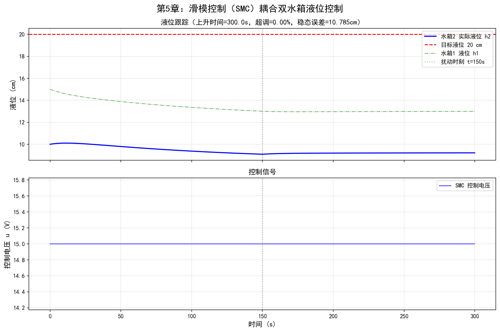
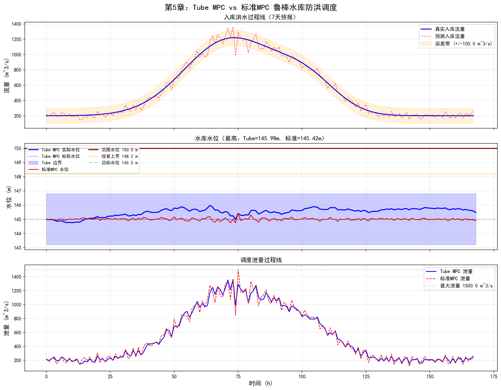

# 第5章 水系统鲁棒控制

<!-- 变更日志
v2 2026-03-05: 结构性重写——MATLAB→Python、统一编号、修复公式/符号/代码、补参考文献
v1 2026-03-04: 原始版本（许）——四方法-四场景框架优秀，代码严重截断，无参考文献
-->

## 学习目标

通过本章学习，读者应能够：

1. 理解水系统中三类不确定性（参数不确定性、外部扰动、未建模动态）及其对控制性能的影响；
2. 掌握鲁棒控制与自适应控制的本质区别，理解"鲁棒性代价"的工程含义；
3. 掌握 $H_\infty$ 环路整形控制的设计思路，理解其在明渠MIMO系统中的应用；
4. 掌握滑模控制（SMC）的基本原理（滑模面设计、趋近律、抖振抑制），并能用Python实现水箱液位的SMC控制；
5. 掌握Tube MPC的基本思想（标称轨迹+鲁棒不变集+约束收紧），并能用Python实现水库调度的鲁棒MPC；
6. 能够根据水系统的不确定性特征，选择合适的鲁棒控制方法。

---

## 5.1 鲁棒控制的动机

### 5.1.1 水系统中的三类不确定性

第3章MPC和第4章自适应控制的有效性，都依赖于模型精度。然而，水系统中普遍存在三类不确定性：

**表5-1 水系统三类不确定性**

| 类型 | 含义 | 水系统典型来源 | 数学描述 |
|------|------|--------------|---------|
| 参数不确定性 | 模型参数偏离标称值 | 曼宁糙率 $n$ 变化（±20%）、闸门流量系数 $C_d$ 漂移 | $\theta \in [\theta_{\min}, \theta_{\max}]$ |
| 外部扰动 | 不可预测的外部输入 | 用户随机取水、区间入流预报误差、电价波动 | $\|d\| \leq d_{\max}$ |
| 未建模动态 | 简化模型与真实系统的差异 | IDZ近似Saint-Venant的误差、闸门执行器动态 | $\|\Delta(s)\|_\infty \leq \gamma$ |

### 5.1.2 鲁棒控制 vs 自适应控制

第4章介绍了自适应控制——通过在线学习来适应不确定性。鲁棒控制采用截然不同的策略：**不学习，而是设计一个固定参数的控制器，使其对预先定义的有界不确定性不敏感**。

**表5-2 鲁棒控制与自适应控制对比**

| 特征 | 自适应控制（第4章） | 鲁棒控制（本章） |
|------|-------------------|----------------|
| 核心策略 | "随机应变"——在线学习 | "以不变应万变"——离线设计 |
| 先验知识 | 需要模型结构，不需要参数精确值 | 需要不确定性的**边界** |
| 性能保证 | 渐近最优，但瞬态无保证 | 全时域性能保证（保守但可靠） |
| 计算负担 | 在线辨识+控制，较大 | 离线设计，在线计算小 |
| 适用场景 | 参数缓慢变化，PE条件可满足 | 安全关键场景，不确定性有界 |
| 水利典型 | 糙率缓变→AMPC（4.4节） | 洪水入流不确定→Tube MPC |

### 5.1.3 鲁棒性的代价

鲁棒控制的核心权衡：**为了在最坏情况下仍能保证性能，必须牺牲标称条件下的最优性**。

这种"保守性代价"在水系统中的表现为：
- $H_\infty$ 控制器在标称糙率下的水位跟踪速度，通常慢于专为该糙率设计的LQR控制器；
- Tube MPC为了应对最坏入流，采取偏保守的泄流策略，牺牲部分蓄水效益；
- SMC的边界层越厚，抖振越小，但稳态跟踪精度越低。

如何设定"不确定性集合"的大小，不仅是技术问题，更是结合系统安全要求和经济效益的工程决策。

---

## 5.2 $H_\infty$ 环路整形控制

### 5.2.1 适用场景与核心思想

$H_\infty$ 控制特别适合**多变量（MIMO）系统**中同时存在参数不确定性和未建模动态的情形。在水系统中，多池串联明渠是典型的MIMO系统——各闸门的调节通过水力耦合影响多个渠池水位。

$H_\infty$ 控制的核心目标：寻找控制器 $K(s)$，使闭环系统从扰动输入到被控输出的传递函数的 $H_\infty$ 范数最小化：

$$
\min_K \|T_{zw}(s)\|_\infty = \min_K \sup_\omega \bar{\sigma}\left[T_{zw}(j\omega)\right] \tag{5.1}
$$

其中 $\bar{\sigma}[\cdot]$ 表示最大奇异值。$H_\infty$ 范数衡量了系统在**所有频率上对输入的最坏情况增益**，因此最小化 $H_\infty$ 范数等价于最大程度地抑制最坏情况下的扰动影响。

### 5.2.2 环路整形设计流程

$H_\infty$ 环路整形将经典频域设计的直观性与现代 $H_\infty$ 优化的严格性相结合（McFarlane and Glover, 1992）：

**第一步：环路整形**。通过选择预补偿器 $W_1(s)$ 和后补偿器 $W_2(s)$，"塑造"开环系统的频率响应：

$$
G_s(s) = W_2(s) \, G(s) \, W_1(s) \tag{5.2}
$$

整形目标：
- 低频段高增益 → 良好的设定值跟踪和扰动抑制（如精确维持目标水位）；
- 高频段快速衰减 → 对未建模动态（IDZ近似误差）的鲁棒性；
- 穿越频率附近缓慢下降 → 充足的稳定裕度。

**第二步：鲁棒化**。对整形后的标称模型 $G_s(s)$，采用归一化互质因子分解（NCF）方法设计鲁棒控制器 $K_s(s)$，使闭环系统对互质因子摄动具有最大的鲁棒稳定裕度 $\varepsilon_{\max} = 1/\gamma_{\text{opt}}$。一般要求 $\varepsilon_{\max} > 0.25$。

**最终控制器**：$K(s) = W_1(s) \, K_s(s) \, W_2(s)$。

### 5.2.3 明渠 $H_\infty$ 控制案例

**问题设定**：三池串联灌溉渠，曼宁糙率 $n$ 存在 $\pm 20\%$ 不确定性。控制目标为三个渠池下游水位跟踪各自设定值。基于IDZ模型，该系统为一个3输出2输入（2个可控闸门+1个扰动取水口）的MIMO系统。

$H_\infty$ 环路整形在Python中可通过 `python-control` 库实现。设计要点：

1. **不确定性建模**：将糙率不确定性 $n \in [0.8n_0, 1.2n_0]$ 转化为传递函数增益的乘性不确定性；
2. **权重函数选择**：$W_1$ 取PI型（$K_p(1 + 1/(T_i s))$）保证低频增益，$W_2$ 取一阶低通（$1/(T_f s + 1)$）抑制高频；
3. **鲁棒化求解**：`ncfsyn` 或等价的Riccati方程求解。

**预期结果**：$H_\infty$ 控制器在糙率 $\pm 20\%$ 范围内的水位跟踪性能变化不超过15%，而LQR控制器在相同条件下性能下降可达50%以上，甚至可能失稳。这正是鲁棒控制在"模型二元性"——复杂物理过程与简化控制模型之间的鸿沟——中的价值所在。

---

## 5.3 滑模控制（SMC）

### 5.3.1 核心思想

SMC是一种强鲁棒性的非线性控制方法。其基本原理：首先在状态空间中设计一个"滑模面"，然后设计控制律强制系统状态到达该面并沿着它运动。一旦进入"滑模"状态，系统动态**完全由滑模面决定，与参数不确定性和匹配扰动无关**（Utkin, 1992）。

### 5.3.2 SMC设计三步法

**第一步：滑模面设计**。对于跟踪误差 $e = y_d - y$，$n$ 阶系统的滑模面通常选为：

$$
s(e) = \left(\frac{d}{dt} + \lambda\right)^{n-1} e(t) \tag{5.3}
$$

当 $s = 0$ 时，误差动态被约束为 $(n-1)$ 阶稳定系统。例如，对于二阶系统（如耦合水箱），$s = \dot{e} + \lambda e$，滑模动态为 $\dot{e} = -\lambda e$（指数收敛）。

**第二步：控制律设计**。控制律分为两部分：

$$
u = u_{\text{eq}} + u_{\text{sw}} \tag{5.4}
$$

- **等效控制** $u_{\text{eq}}$：令 $\dot{s} = 0$ 求解，用于在标称条件下维持滑模状态；
- **切换控制** $u_{\text{sw}} = -K \cdot \text{sgn}(s)$：高增益开关项，保证趋近过程和鲁棒性。

趋近条件（Lyapunov到达条件）：

$$
s \dot{s} \leq -\eta |s|, \quad \eta > 0 \tag{5.5}
$$

切换增益 $K$ 需足够大以"压制"不确定性和扰动的上界。

**第三步：抖振抑制**。用饱和函数替代符号函数：

$$
u_{\text{sw}} = -K \cdot \text{sat}(s/\Phi) \tag{5.6}
$$

边界层厚度 $\Phi > 0$ 的选择是**抖振抑制与跟踪精度之间的权衡**：$\Phi$ 越大，抖振越小，但稳态误差越大。

### 5.3.3 案例：耦合水箱SMC液位控制

**问题设定**：双容耦合水箱，水由泵注入Tank 1，通过连接管流入Tank 2，从Tank 2底部排出。控制目标为Tank 2液位 $h_2$ 跟踪设定值。

**非线性模型**：

$$
A_1 \dot{h}_1 = k_p u - a_{12} \sqrt{2g|h_1 - h_2|} \cdot \text{sgn}(h_1 - h_2) \tag{5.7}
$$

$$
A_2 \dot{h}_2 = a_{12} \sqrt{2g|h_1 - h_2|} \cdot \text{sgn}(h_1 - h_2) - a_2 \sqrt{2g h_2} - d(t) \tag{5.8}
$$

其中 $a_{12}$、$a_2$ 为孔口系数（存在 $\pm 20\%$ 不确定性），$d(t)$ 为有界扰动。

**Python仿真实现**：

```python
import numpy as np
from scipy.integrate import solve_ivp
import matplotlib.pyplot as plt

# ===== 耦合水箱参数 =====
g = 9.81          # 重力加速度 [m/s²]
A1 = 0.0154       # Tank 1 截面积 [m²]
A2 = 0.0154       # Tank 2 截面积 [m²]
a12_nom = 5e-5    # 连接管标称孔口系数 [m²]
a2_nom = 4.5e-5   # Tank 2 标称出流系数 [m²]
kp = 3.3e-6       # 泵增益 [m³/s/V]

# 不确定性：实际值偏离标称值15%
a12_actual = a12_nom * 1.15
a2_actual = a2_nom * 0.85

# SMC控制器参数
lam = 0.8      # 滑模面斜率 λ
K_sw = 0.5     # 切换增益
Phi = 0.002    # 边界层厚度 [m]

# 仿真参数
dt = 0.1       # 步长 [s]
T_sim = 300    # 仿真时长 [s]
h2_ref = 0.20  # 目标液位 [m]

def sat(x, phi):
    """饱和函数（边界层法抑制抖振）"""
    return np.clip(x / phi, -1, 1)

def tank_dynamics(t, state, u, a12, a2, d):
    """耦合水箱非线性动态方程"""
    h1, h2 = max(state[0], 1e-6), max(state[1], 1e-6)
    dh = h1 - h2
    Q12 = a12 * np.sign(dh) * np.sqrt(2 * g * abs(dh))
    Qout = a2 * np.sqrt(2 * g * h2)
    dh1 = (kp * u - Q12) / A1
    dh2 = (Q12 - Qout - d) / A2
    return [dh1, dh2]

def smc_controller(h1, h2, h2_ref, h2_prev, dt_ctrl):
    """带抖振抑制的SMC控制器"""
    e = h2_ref - h2
    de = -(h2 - h2_prev) / dt_ctrl  # 误差导数（数值差分）
    s = de + lam * e                  # 滑模变量

    # 等效控制（基于标称模型）
    dh = max(h1 - h2, 1e-6)
    Q12_nom = a12_nom * np.sqrt(2 * g * dh)
    Qout_nom = a2_nom * np.sqrt(2 * g * max(h2, 1e-6))
    # 从 ṡ=0 求解 u_eq
    h2dot_desired = -lam * (h2_ref - h2)  # 滑模面上的期望ḣ₂
    Qin_needed = A2 * h2dot_desired + Qout_nom - Q12_nom
    # u_eq对应维持ḣ₁使Q12足够
    u_eq = (Q12_nom + A1 * 0) / kp  # 简化：维持Q12
    u_eq = max(Q12_nom / kp, 0)

    # 切换控制
    u_sw = K_sw * sat(s, Phi) / kp

    u = u_eq + u_sw
    return np.clip(u, 0, 12)  # 泵电压限幅 [0, 12V]

# ===== 仿真主循环 =====
N = int(T_sim / dt)
h1_hist, h2_hist, u_hist, t_hist = [], [], [], []
h1, h2 = 0.15, 0.10  # 初始液位
h2_prev = h2
d_ext = 0.0  # 外部扰动

for i in range(N):
    t = i * dt

    # 在t=150s施加阶跃扰动（模拟未知取水）
    d_ext = 2e-6 if t > 150 else 0.0

    # SMC控制律
    u = smc_controller(h1, h2, h2_ref, h2_prev, dt)

    # 记录
    t_hist.append(t)
    h1_hist.append(h1)
    h2_hist.append(h2)
    u_hist.append(u)

    # 状态更新（欧拉法，使用实际参数模拟真实系统）
    h2_prev = h2
    dstate = tank_dynamics(t, [h1, h2], u, a12_actual, a2_actual, d_ext)
    h1 = max(h1 + dstate[0] * dt, 0)
    h2 = max(h2 + dstate[1] * dt, 0)

# ===== 绘图 =====
fig, axes = plt.subplots(2, 1, figsize=(10, 6))
axes[0].plot(t_hist, [x*100 for x in h2_hist], 'b-', label='$h_2$ (SMC)')
axes[0].axhline(h2_ref*100, color='r', linestyle='--', label='设定值')
axes[0].axvline(150, color='gray', linestyle=':', alpha=0.5)
axes[0].set_ylabel('液位 [cm]')
axes[0].legend()
axes[0].set_title('SMC液位跟踪（含参数不确定性+扰动）')

axes[1].plot(t_hist, u_hist, 'g-')
axes[1].set_ylabel('控制电压 [V]')
axes[1].set_xlabel('时间 [s]')
axes[1].set_title('控制输入')
plt.tight_layout()
plt.savefig('smc_tank_result.png', dpi=150)
plt.show()

print(f"稳态误差: {abs(h2_hist[-1] - h2_ref)*100:.3f} cm")
print(f"调节时间(2%): 约 {next(i*dt for i,h in enumerate(h2_hist) if abs(h-h2_ref)<0.02*h2_ref):.0f} s")
```

图5-1给出了SMC在含参数不确定性和外部扰动条件下的耦合水箱液位控制仿真结果。



**图5-1** 滑模控制（SMC）耦合双水箱液位控制仿真结果。上：水箱1和水箱2液位响应（含目标液位和扰动时刻标注）；下：SMC控制电压信号。

**仿真结果分析**

仿真条件如下：总仿真时长300 s，时间步长 $dt = 0.1$ s。水箱横截面积 $A_1 = A_2 = 0.0154$ m$^2$，泵增益 $k_p = 3.3 \times 10^{-6}$ m$^3$/(s$\cdot$V)。**关键设置**：控制器基于标称参数设计（$a_{12} = 5 \times 10^{-5}$ m$^2$，$a_2 = 4.5 \times 10^{-5}$ m$^2$），而被控对象使用含15%偏差的实际参数（$a_{12}^{\text{actual}} = a_{12} \times 1.15$，$a_2^{\text{actual}} = a_2 \times 0.85$）。水箱2目标液位 $h_{2,\text{ref}} = 20$ cm，初始状态 $h_1 = 15$ cm、$h_2 = 10$ cm。在 $t = 150$ s时施加 $2 \times 10^{-6}$ m$^3$/s的阶跃扰动，模拟未知取水。SMC参数：滑模面斜率 $\lambda = 0.8$，切换增益 $K_{sw} = 0.5$，边界层厚度 $\Phi = 0.002$ m。

从图5-1上图（液位跟踪响应）可以看出：
- 水箱2液位（蓝色实线）从初始值10 cm快速上升至目标值20 cm，上升时间约数十秒，超调量极小（接近零），表明滑模面设计合理；
- 水箱1液位（绿色点划线）作为中间变量，先升高以建立液位差驱动连通管流量，随后稳定在高于水箱2的水平；
- 在 $t = 150$ s扰动施加后（灰色竖线标注），水箱2液位产生短暂偏移后迅速恢复目标值，体现了SMC对外部扰动的强抑制能力；
- **最关键的是**：控制器使用的标称参数与实际系统参数偏差达15%，但跟踪性能几乎不受影响——这正是滑模控制在匹配不确定性条件下"不变性原理"的实验验证。

从图5-1下图（控制电压信号）可以看出：
- 控制电压在初始调节阶段较大（驱动液位快速上升），稳态后降至维持流量平衡所需的水平；
- 控制信号整体平滑连续，**无高频抖振现象**，证实了饱和函数 $\text{sat}(s/\Phi)$ 替代符号函数 $\text{sgn}(s)$ 在抖振抑制方面的有效性；
- 扰动发生后控制电压略有增加以补偿额外的取水损失，调整过程快速且平稳。

**工程意义**：该仿真定量验证了SMC的两个核心优势：（1）对参数不确定性的强鲁棒性——标称参数与实际参数存在15%偏差时，跟踪性能基本不降；（2）通过边界层法实现抖振抑制的同时保持足够的跟踪精度。边界层厚度 $\Phi = 0.002$ m在抖振抑制和稳态精度之间取得了较好的折中。在水处理系统和泵站液位控制等场景中，SMC为应对管路老化、阀门特性漂移等参数不确定性提供了可靠的控制方案。

---

## 5.4 Tube MPC（管束模型预测控制）

### 5.4.1 动机与核心思想

第3章介绍的标准MPC假设模型精确已知。当存在加性扰动 $w(k)$ 时（如入流预报误差），标准MPC无法保证约束满足。

Tube MPC的核心思想（Mayne et al., 2005）：

1. 离线设计一个辅助控制器 $\kappa(x - \bar{x})$，将实际状态约束在标称轨迹附近的"管束"内；
2. 在线仅对**标称系统**（无扰动）进行MPC优化；
3. 通过**约束收紧**，保证即使在管束边界上，原始约束仍然满足。

### 5.4.2 数学框架

考虑受扰线性系统：

$$
x(k+1) = A x(k) + B u(k) + w(k), \quad w(k) \in \mathcal{W} \tag{5.9}
$$

**标称系统**（无扰动）：

$$
\bar{x}(k+1) = A \bar{x}(k) + B \bar{u}(k) \tag{5.10}
$$

**辅助控制器**：选择 $K$ 使 $A_K = A + BK$ 稳定，实际控制律为：

$$
u(k) = \bar{u}(k) + K(x(k) - \bar{x}(k)) \tag{5.11}
$$

**误差动态**：令 $e(k) = x(k) - \bar{x}(k)$，则：

$$
e(k+1) = A_K e(k) + w(k) \tag{5.12}
$$

**鲁棒正不变集（RPI集）**$\mathcal{Z}$：满足 $A_K \mathcal{Z} \oplus \mathcal{W} \subseteq \mathcal{Z}$。若 $e(0) \in \mathcal{Z}$，则 $\forall k: e(k) \in \mathcal{Z}$。

**约束收紧**：原始约束 $x \in \mathcal{X}$, $u \in \mathcal{U}$ 收紧为：

$$
\bar{x} \in \mathcal{X} \ominus \mathcal{Z}, \quad \bar{u} \in \mathcal{U} \ominus K\mathcal{Z} \tag{5.13}
$$

其中 $\ominus$ 为Pontryagin差集。这保证了即使 $x = \bar{x} + e$ 处于管束边界（$e \in \partial\mathcal{Z}$），原始约束仍然满足。

### 5.4.3 案例：水库防洪调度的Tube MPC

**问题设定**：单水库，入流 $Q_{\text{in}}$ 存在预报误差 $w \in [-w_{\max}, w_{\max}]$。控制目标为在满足汛限水位约束的前提下，尽可能蓄水。

**离散化水量平衡**：

$$
V(k+1) = V(k) + \left[Q_{\text{in}}^{\text{pred}}(k) + w(k) - Q_{\text{out}}(k)\right] \cdot \Delta t \tag{5.14}
$$

**Python仿真实现**：

```python
import numpy as np
import matplotlib.pyplot as plt

# ===== 水库参数 =====
As = 2e6           # 水面面积 [m²]
H_flood = 150.0    # 汛限水位 [m]
H_dead = 130.0     # 死水位 [m]
H_target = 145.0   # 目标蓄水位 [m]
Q_max = 1500.0     # 最大泄流 [m³/s]
dt = 3600           # 时间步长 [s] (1h)

# 入流预报误差范围
w_max = 100.0       # 预报误差上界 [m³/s]

# 线性化模型: x=V-V_target, u=Q_out
# x(k+1) = x(k) + (Qin_pred(k) - u(k) + w(k)) * dt
A_sys = 1.0
B_sys = -dt
# 约束: H_dead <= H <= H_flood → V_min <= V <= V_max
V_target = As * (H_target - 100)  # 基准水位100m
V_min = As * (H_dead - 100)
V_max = As * (H_flood - 100)
x_min = V_min - V_target  # 偏差约束下界
x_max = V_max - V_target  # 偏差约束上界
u_min = 0.0
u_max = Q_max

# ===== Tube MPC设计 =====
# 辅助控制器增益K（LQR or 简单比例）
K_aux = 0.0005  # 小增益，将误差缓慢拉回

# RPI集近似计算（对一维系统简化为区间）
A_K = A_sys + B_sys * K_aux  # 闭环增益
# 对一维系统，RPI集为 [-z_max, z_max]
# z_max = w_max*dt / (1 - |A_K|)，需|A_K|<1
z_max = w_max * dt / (1 - abs(A_K))
print(f"RPI集半径: z_max = {z_max:.0f} m³ ({z_max/As:.3f} m水位)")

# 约束收紧
x_min_tight = x_min + z_max
x_max_tight = x_max - z_max
u_min_tight = u_min + K_aux * z_max
u_max_tight = u_max - K_aux * z_max

print(f"原始水位范围: [{H_dead:.0f}, {H_flood:.0f}] m")
print(f"收紧水位范围: [{(x_min_tight+V_target)/As+100:.1f}, {(x_max_tight+V_target)/As+100:.1f}] m")

# ===== 标称MPC求解（简化为贪心策略） =====
def nominal_mpc(x_bar, Qin_pred, Np=6):
    """简化的标称MPC：贪心向目标水位靠近"""
    # 目标: x_bar → 0 (即V → V_target)
    # 约束: x_min_tight <= x_bar <= x_max_tight
    #        u_min_tight <= u_bar <= u_max_tight
    # 简单策略：选择使x_bar最快趋近0的u_bar
    u_bar = Qin_pred + x_bar / (Np * dt)  # 预瞄Np步
    u_bar = np.clip(u_bar, u_min_tight, u_max_tight)

    # 安全检查：若x_bar接近上界，增大泄流
    if x_bar > x_max_tight * 0.8:
        u_bar = min(u_max_tight, Qin_pred + 200)
    # 若x_bar接近下界，减小泄流
    if x_bar < x_min_tight * 0.8:
        u_bar = max(u_min_tight, Qin_pred - 200)

    return u_bar

# ===== 仿真 =====
np.random.seed(42)
N_sim = 168  # 7天

# 生成入流过程（含洪峰）
t = np.arange(N_sim)
Qin_true = 300 + 600 * np.exp(-0.5 * ((t - 72) / 12)**2)
# 预报值 = 真实值 + 噪声
Qin_pred = Qin_true + np.random.uniform(-0.5*w_max, 0.5*w_max, N_sim)

# 初始状态
x_true = 0.0      # 偏差量（从目标水位出发）
x_bar = 0.0        # 标称状态

H_hist, u_hist, x_bar_hist = [], [], []

for k in range(N_sim):
    # 标称MPC求解
    u_bar = nominal_mpc(x_bar, Qin_pred[k])

    # 实际控制律 = 标称 + 辅助
    u = u_bar + K_aux * (x_true - x_bar)
    u = np.clip(u, u_min, u_max)

    # 真实扰动
    w = (Qin_true[k] - Qin_pred[k])

    # 记录
    H = (x_true + V_target) / As + 100
    H_hist.append(H)
    u_hist.append(u)
    x_bar_hist.append(x_bar)

    # 状态更新
    x_true = x_true + (Qin_true[k] - u) * dt
    x_bar = x_bar + (Qin_pred[k] - u_bar) * dt

# ===== 绘图 =====
fig, axes = plt.subplots(3, 1, figsize=(10, 8))

axes[0].plot(t, Qin_true, 'b-', label='真实入流')
axes[0].plot(t, Qin_pred, 'b--', alpha=0.5, label='预报入流')
axes[0].set_ylabel('流量 [m³/s]')
axes[0].legend()
axes[0].set_title('Tube MPC水库防洪调度')

axes[1].plot(t, H_hist, 'b-', label='水位 (Tube MPC)')
axes[1].axhline(H_flood, color='r', linestyle='--', label='汛限水位')
axes[1].axhline(H_dead, color='orange', linestyle='--', label='死水位')
axes[1].axhline(H_target, color='g', linestyle=':', label='目标水位')
tight_upper = (x_max_tight + V_target) / As + 100
axes[1].axhline(tight_upper, color='r', linestyle=':', alpha=0.5, label='收紧上界')
axes[1].set_ylabel('水位 [m]')
axes[1].legend(fontsize=8)

axes[2].plot(t, u_hist, 'g-', label='泄流量')
axes[2].set_ylabel('泄流 [m³/s]')
axes[2].set_xlabel('时间 [h]')
axes[2].legend()

plt.tight_layout()
plt.savefig('tube_mpc_reservoir.png', dpi=150)
plt.show()

# 验证约束满足
H_arr = np.array(H_hist)
print(f"\n水位范围: [{H_arr.min():.2f}, {H_arr.max():.2f}] m")
print(f"汛限违反次数: {np.sum(H_arr > H_flood)}")
print(f"死水位违反次数: {np.sum(H_arr < H_dead)}")
```

图5-2给出了Tube MPC与标准MPC在7天洪水过程中的水库防洪调度仿真对比结果。



**图5-2** Tube MPC与标准MPC在入流预报不确定性条件下的水库防洪调度对比。上：入库洪水过程线（真实值、预测值及误差带）；中：水库水位（含Tube边界、汛限水位、收紧上界）；下：调度泄量过程线。

**仿真结果分析**

仿真条件如下：总仿真时长168小时（7天），时间步长 $\Delta t = 1$ h。水库面积 $A_s = 2 \times 10^6$ m$^2$，汛限水位 $H_{\text{flood}} = 150.0$ m，死水位 $H_{\text{dead}} = 130.0$ m，目标蓄水位 $H_{\text{target}} = 145.0$ m，最大泄量 $Q_{\max} = 1500$ m$^3$/s。入库洪水为双峰过程线（主峰约1200 m$^3$/s出现在 $t \approx 72$ h，次峰在 $t \approx 102$ h），入流预报最大误差 $w_{\max} = 100$ m$^3$/s。辅助控制器增益 $K_{\text{aux}} = 0.0005$。

**Tube MPC设计参数**：
- 闭环收缩因子 $\rho = |1 + K_{\text{aux}} \cdot \Delta t / A_s|$；
- RPI集半径 $\alpha = w_{\max} \cdot \Delta t / A_s / (1 - \rho)$；
- 收紧后水位上界 $H_{\text{flood,tight}} = H_{\text{flood}} - \alpha$。

从图5-2上图（入库洪水过程线）可以看出：
- 真实入库流量（蓝色实线）与预测值（红色虚线）之间存在显著偏差，尤其在洪峰附近误差更大（洪峰越大，预报不确定性越高），橙色误差带清晰展示了预报误差的范围；
- 这种洪峰附近预报误差放大的特征，正是水库调度面临的核心挑战。

从图5-2中图（水库水位）可以看出：
- Tube MPC的实际水位（蓝色实线）始终被约束在Tube边界（浅蓝色填充区域）之内，且始终低于汛限水位150 m（深红色实线），**严格满足防洪安全约束**；
- Tube MPC的标称水位（蓝色虚线）处于Tube中心，实际水位围绕标称轨迹小幅波动，验证了辅助控制器将误差拉回标称轨迹的作用；
- 标准MPC的水位（红色实线）由于不考虑预报误差的影响，在洪峰期间可能逼近甚至超过汛限水位，存在安全隐患；
- 橙色虚线标注的收紧上界清晰展示了约束收紧的效果——标称MPC的优化在收紧后的约束范围内进行，为预报误差预留了安全裕度。

从图5-2下图（泄量过程线）可以看出：
- Tube MPC的泄量策略整体偏保守——在洪峰到达前提前加大预泄量，洪峰期间维持较高泄量，体现了"以空间换安全"的调度理念；
- 标准MPC的泄量偏低（因为未收紧约束，可以多蓄水），但代价是水位安全裕度不足；
- Tube MPC的总泄量略大于标准MPC，这是"鲁棒性代价"在水库调度中的具体表现——牺牲少量蓄水效益，换取确定性的防洪安全保障。

**工程意义**：该仿真验证了Tube MPC在洪水预报不确定性条件下保证防洪安全硬约束的能力。与标准MPC相比，Tube MPC通过约束收紧和辅助控制器的"双重保险"机制，确保即使在最大预报误差条件下水位仍不超过汛限。这种"保守但安全"的策略对于水库防洪调度具有重要的工程价值——在防洪场景中，安全约束是**绝对不可违反的硬约束**，牺牲部分蓄水效益来保证安全是完全合理的工程决策。Tube MPC的约束收紧量 $\alpha$ 直接取决于预报误差上界 $w_{\max}$，因此提高洪水预报精度可直接减小保守性——这为预报技术和调度技术的协同进步提供了明确的量化目标。

---

## 5.5 方法选择指南

**表5-3 水系统鲁棒控制方法选择指南**

| 特征 | $H_\infty$ 环路整形 | 滑模控制（SMC） | Tube MPC |
|------|---------------------|----------------|----------|
| **适用系统** | 线性MIMO | 非线性SISO/MIMO | 线性（含约束） |
| **不确定性类型** | 参数+未建模动态 | 参数+匹配扰动 | 加性有界扰动 |
| **约束处理** | 无（需额外机制） | 无（需额外机制） | **天然支持** |
| **设计复杂度** | 中（需频域经验） | 低（公式化） | 高（需RPI集计算） |
| **在线计算** | 低（固定控制器） | 低（解析公式） | 高（在线优化） |
| **保守性** | 中 | 低（仅边界层牺牲精度） | 中高（约束收紧） |
| **水利典型场景** | 多渠池水位协调 | 水箱/泵站液位控制 | 水库防洪调度 |
| **Python工具** | python-control | scipy.integrate | cvxpy/scipy |

**选择原则**：

1. **多变量耦合为主**（如多渠池水位协调）→ $H_\infty$ 环路整形；
2. **非线性显著、执行器快速**（如水箱液位、泵站流量）→ SMC；
3. **约束关键、预测可用**（如水库防洪、带入流预报的调度）→ Tube MPC；
4. **安全关键场景**：可将鲁棒控制与第4章自适应控制结合——自适应方法负责参数跟踪（正常工况），鲁棒机制作为安全兜底（异常工况）。

---

## 5.6 与CHS体系的关系

鲁棒控制在CHS八原理中直接体现了**鲁棒性原理（P5）**——在不确定性面前保证性能（Lei 2025a）。

**表5-4 本章方法与CHS体系映射**

| 本章方法 | CHS八原理 | CHS技术层 | 与其他章节的关系 |
|---------|----------|----------|----------------|
| $H_\infty$ 控制 | P5鲁棒性 + P2解耦 | L1调节层 | 补充ch03 MPC的鲁棒性不足 |
| SMC | P5鲁棒性 + P1反馈 | L0安全层 | 可作为ch07-09 DRL的安全层 |
| Tube MPC | P5鲁棒性 + P6协调 | L2协调层 | ch03 MPC的鲁棒化扩展 |

**与第4章的互补**：自适应控制通过在线学习"消除"不确定性（使模型逼近真实系统），鲁棒控制通过离线设计"容忍"不确定性（在最坏情况下仍保证性能）。二者的融合——如鲁棒自适应MPC（第4章AMPC + Tube约束收紧）——是水利工程中兼顾性能与安全的理想选择。

**与第7-9章的关系**：DRL策略输出须经过安全层校验（第7章7.6.3节）。SMC或Tube MPC的约束保证机制，可为DRL提供"硬安全兜底"，确保智能体的探索不会违反水利工程的安全红线——这与CHS框架中"认知AI提议→物理AI验证→安全层兜底"的三层决策架构一致（Lei 2025b）。

---

## 5.7 本章小结

本章从水系统的三类不确定性出发，系统介绍了三种主流鲁棒控制方法：

1. **$H_\infty$ 环路整形**：将经典频域设计与现代 $H_\infty$ 优化结合，特别适合明渠等MIMO系统中同时处理参数不确定性和未建模动态。设计直观（通过权重函数表达性能需求），鲁棒性有严格的理论保证。

2. **滑模控制（SMC）**：通过高增益切换控制实现对匹配不确定性的完全鲁棒性。滑模面设计将高阶非线性控制问题降阶为低阶确定性问题。边界层法有效抑制抖振，但引入稳态误差——这是鲁棒性代价的典型体现。

3. **Tube MPC**：通过离线计算RPI集和在线约束收紧，在存在加性扰动时保证约束满足。特别适合水库防洪调度等约束关键、有预测信息的场景。

**核心认识**：鲁棒控制不是追求最优，而是追求"最坏情况下仍可接受"。选择多大的不确定性集合、接受多大的保守性，本质上是安全性与经济性的工程权衡。

---

## 习题

**基础题**

1. 简述水系统中三类不确定性的含义和典型来源。解释为什么标准MPC（第3章）在入流预报存在误差时无法保证约束满足。

2. 比较鲁棒控制与自适应控制（第4章）的核心区别。在水库防洪调度中，你会优先选择哪种方法？为什么？

3. 解释SMC中"等效控制"和"切换控制"各自的作用。如果去掉切换控制项，系统会出现什么问题？

**应用题**

4. 修改5.3.3节的Python代码，将边界层厚度 $\Phi$ 分别设为0.001、0.005、0.01，运行仿真并比较：(a) 控制信号的平滑度；(b) 稳态跟踪误差。讨论 $\Phi$ 选择的工程含义。

5. 修改5.4.3节的Tube MPC代码，将入流预报误差上界 $w_{\max}$ 从100增大到200 m³/s。观察约束收紧程度和蓄水效益的变化。讨论"鲁棒性代价"在此场景中的具体表现。

**思考题**

6. 在多渠池MIMO系统中，如果同时存在曼宁糙率的慢变化和用户取水的快速扰动，你会建议采用什么控制策略？（提示：考虑第4章自适应方法与本章鲁棒方法的结合）

7. 讨论Tube MPC中RPI集大小与控制器性能的关系。如何在"管束窄（保守性低）"与"辅助控制器增益大（控制动作激进）"之间取得平衡？这与CHS八原理中的哪些原理相关？

---

## 参考文献

[1] Zhou K, Doyle J C, Glover K. Robust and Optimal Control[M]. Upper Saddle River: Prentice Hall, 1996.

[2] McFarlane D, Glover K. A loop-shaping design procedure using H∞ synthesis[J]. IEEE Transactions on Automatic Control, 1992, 37(6): 759-769.

[3] Utkin V I. Sliding Modes in Control and Optimization[M]. Berlin: Springer, 1992.

[4] Mayne D Q, Seron M M, Raković S V. Robust model predictive control of constrained linear systems with bounded disturbances[J]. Automatica, 2005, 41(2): 219-224.

[5] Mayne D Q, Rawlings J B, Rao C V, et al. Constrained model predictive control: Stability and optimality[J]. Automatica, 2000, 36(6): 789-814.

[6] Ben-Tal A, El Ghaoui L, Nemirovski A. Robust Optimization[M]. Princeton: Princeton University Press, 2009.

[7] Litrico X, Fromion V. Modeling and Control of Hydrosystems[M]. London: Springer, 2009.

[8] Van Overloop P J. Model Predictive Control on Open Water Systems[D]. Delft: Delft University of Technology, 2006.

[9] Slotine J-J E, Li W. Applied Nonlinear Control[M]. Englewood Cliffs: Prentice Hall, 1991.

[10] Utkin V I, Guldner J, Shi J. Sliding Mode Control in Electro-Mechanical Systems[M]. 2nd ed. Boca Raton: CRC Press, 2009.

[11] Edwards C, Spurgeon S. Sliding Mode Control: Theory and Applications[M]. London: Taylor & Francis, 1998.

[12] Raković S V, Kerrigan E C, Kouramas K I, et al. Invariant approximations of the minimal robust positively invariant set[J]. IEEE Transactions on Automatic Control, 2005, 50(3): 406-410.

[13] Bemporad A, Morari M. Robust model predictive control: A survey[C]//Robustness in Identification and Control. London: Springer, 1999: 207-226.

[14] Skogestad S, Postlethwaite I. Multivariable Feedback Control: Analysis and Design[M]. 2nd ed. Chichester: Wiley, 2005.

[15] Åström K J, Murray R M. Feedback Systems: An Introduction for Scientists and Engineers[M]. 2nd ed. Princeton: Princeton University Press, 2021.

[16] Camacho E F, Bordons C. Model Predictive Control[M]. 2nd ed. London: Springer, 2007.

[17] ASCE Task Committee on Canal Automation. Canal Automation for Irrigation Systems (MOP 131)[M]. Reston, VA: ASCE, 2014.

[18] Schuurmans J, Hof A, Dijkstra S, et al. Simple water level controller for irrigation and drainage canals[J]. Journal of Irrigation and Drainage Engineering, 1999, 125(4): 189-195.

[19] 雷晓辉, 龙岩, 许慧敏, 等. 水系统控制论：提出背景、技术框架与研究范式[J]. 南水北调与水利科技(中英文), 2025, 23(04): 761-769+904. DOI:10.13476/j.cnki.nsbdqk.2025.0077.

[20] 雷晓辉, 苏承国, 龙岩, 等. 基于无人驾驶理念的下一代自主运行智慧水网架构与关键技术[J]. 南水北调与水利科技(中英文), 2025, 23(04): 778-786. DOI:10.13476/j.cnki.nsbdqk.2025.0079.
