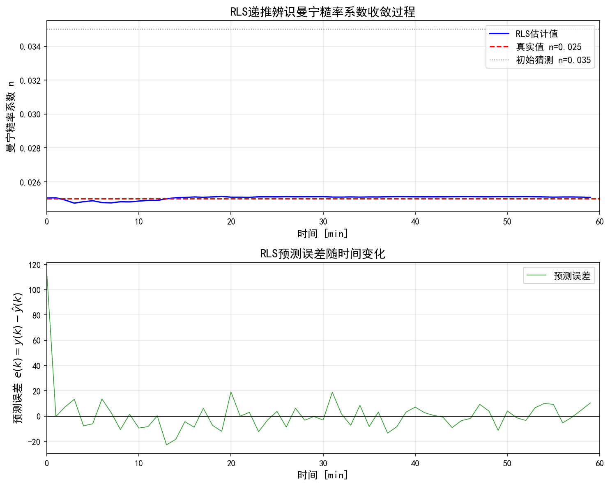
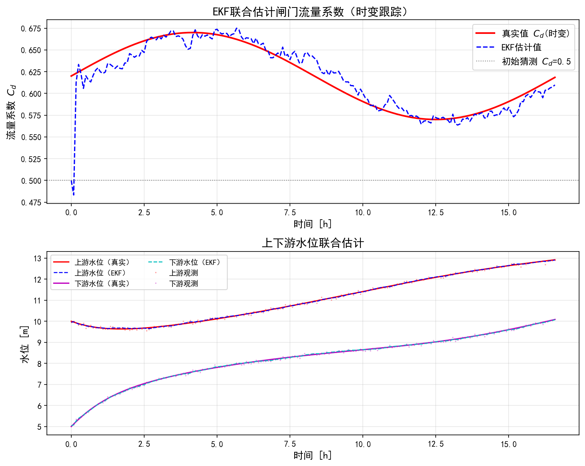
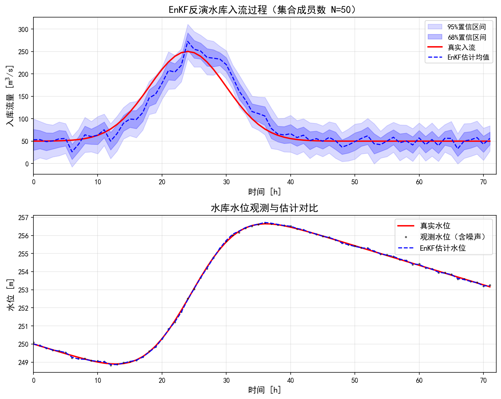

# 第6章 水系统参数辨识与数据同化

<!-- 变更日志
v2 2026-03-05: 结构性重写——删除与T2a重叠的通用理论、全部改Python、统一教材体例、补参考文献
v1 2026-03-04: 原始版本（许）——水利案例好，"报告"体非教材体，MATLAB代码，无参考文献
-->

## 学习目标

通过本章学习，读者应能够：

1. 理解参数辨识与数据同化的概念差异，以及二者在水系统中的互补关系；
2. 掌握递推最小二乘法（RLS）的原理，并将其应用于明渠曼宁糙率的在线辨识；
3. 掌握扩展卡尔曼滤波（EKF）的状态增广技术，实现闸门流量系数的联合估计；
4. 掌握集合卡尔曼滤波（EnKF）的原理，实现水库入流反演与参数同化；
5. 了解鲁棒化修正方法（参数投影、$\sigma$-修正、死区）在水系统中的工程应用。

---

## 6.1 导论：为什么需要在线参数估计

第3章的MPC和第5章的鲁棒控制，都依赖于系统模型的精度。然而，水系统的模型参数并非一成不变：

- **渠道糙率**：因泥沙淤积、水草生长，曼宁系数 $n$ 可在数周至数月内变化20%以上；
- **闸门流量系数**：因水流形态变化和闸门磨损，$C_d$ 在不同工况下差异显著；
- **水库入流**：区间来水缺乏直接量测，只能通过水量平衡反算估计。

如果忽视这些变化而沿用静态参数，控制器性能将逐渐恶化。解决这一问题有两条技术路径：

**参数辨识（Parameter Identification）**：利用输入输出数据估计模型中的未知常数参数（如 $n$、$C_d$）。侧重于消除**认知不确定性**——因知识不足导致的参数未知。关于参数辨识与数据同化的完整理论，读者可参阅T2a第11章。

**数据同化（Data Assimilation）**：利用实时观测数据，动态修正模型的**状态**和**参数**。同时处理认知不确定性和**偶然不确定性**（过程噪声、量测噪声），在贝叶斯框架下给出概率分布。

**表6-1 参数辨识与数据同化的比较**

| 特性 | 参数辨识 | 数据同化 |
|------|---------|---------|
| 目标 | 估计静态/慢变参数 | 估计动态状态+参数 |
| 不确定性 | 认知不确定性 | 认知+偶然不确定性 |
| 代表算法 | RLS、批量最小二乘 | KF、EKF、EnKF |
| 更新频率 | 低频（分钟~小时） | 高频（每个采样步） |
| 输出 | 参数点估计 | 状态/参数的概率分布 |
| 水系统典型应用 | 糙率辨识、闸门标定 | 入流反演、水位同化 |

本章以三个递进的水系统案例为主线，展示参数辨识与数据同化的工程实践。

---

## 6.2 核心算法概述

本节简要回顾三种核心算法的关键公式，为后续案例提供数学工具。完整的推导过程请参阅T2a第11章。

### 6.2.1 递推最小二乘法（RLS）

对于线性参数模型 $y(k) = \boldsymbol{\phi}^T(k) \boldsymbol{\theta} + e(k)$，RLS的递推更新步骤为：

$$
e(k) = y(k) - \boldsymbol{\phi}^T(k) \hat{\boldsymbol{\theta}}(k-1) \tag{6.1}
$$

$$
\mathbf{K}(k) = \frac{\mathbf{P}(k-1) \boldsymbol{\phi}(k)}{\lambda + \boldsymbol{\phi}^T(k) \mathbf{P}(k-1) \boldsymbol{\phi}(k)} \tag{6.2}
$$

$$
\hat{\boldsymbol{\theta}}(k) = \hat{\boldsymbol{\theta}}(k-1) + \mathbf{K}(k) e(k) \tag{6.3}
$$

$$
\mathbf{P}(k) = \frac{1}{\lambda} \left[\mathbf{P}(k-1) - \mathbf{K}(k) \boldsymbol{\phi}^T(k) \mathbf{P}(k-1)\right] \tag{6.4}
$$

其中 $\lambda \in (0,1]$ 为遗忘因子。$\lambda < 1$ 使算法对近期数据赋予更高权重，从而跟踪时变参数。典型取值 $\lambda = 0.95 \sim 0.99$。

**持续激励（PE）条件**：为保证参数收敛，回归向量 $\boldsymbol{\phi}(k)$ 必须在足够长的时间窗口内具有充分的"丰富度"。在水系统中，当闸门处于固定开度、流量恒定时，PE条件不满足，参数估计可能漂移。实际操作中，可通过在闭环控制信号上叠加小幅扰动来保证PE条件（Ljung, 1999）。

### 6.2.2 扩展卡尔曼滤波（EKF）

对于非线性系统 $\mathbf{x}(k+1) = \mathbf{f}(\mathbf{x}(k), \mathbf{u}(k)) + \mathbf{w}(k)$，$\mathbf{z}(k) = \mathbf{h}(\mathbf{x}(k)) + \mathbf{v}(k)$，EKF通过一阶线性化近似进行状态估计：

**预测步**：

$$
\hat{\mathbf{x}}^-(k) = \mathbf{f}(\hat{\mathbf{x}}(k-1), \mathbf{u}(k-1)) \tag{6.5}
$$

$$
\mathbf{P}^-(k) = \mathbf{F}(k) \mathbf{P}(k-1) \mathbf{F}^T(k) + \mathbf{Q} \tag{6.6}
$$

**更新步**：

$$
\mathbf{K}(k) = \mathbf{P}^-(k) \mathbf{H}^T(k) \left[\mathbf{H}(k) \mathbf{P}^-(k) \mathbf{H}^T(k) + \mathbf{R}\right]^{-1} \tag{6.7}
$$

$$
\hat{\mathbf{x}}(k) = \hat{\mathbf{x}}^-(k) + \mathbf{K}(k) \left[\mathbf{z}(k) - \mathbf{h}(\hat{\mathbf{x}}^-(k))\right] \tag{6.8}
$$

其中雅可比矩阵 $\mathbf{F}(k) = \frac{\partial \mathbf{f}}{\partial \mathbf{x}}\big|_{\hat{\mathbf{x}}(k-1)}$，$\mathbf{H}(k) = \frac{\partial \mathbf{h}}{\partial \mathbf{x}}\big|_{\hat{\mathbf{x}}^-(k)}$。

**状态增广技术**：将待估计参数 $\boldsymbol{\theta}$ 纳入状态向量 $\mathbf{x}_{\text{aug}} = [\mathbf{x}^T, \boldsymbol{\theta}^T]^T$，参数演化模型取随机游走 $\boldsymbol{\theta}(k+1) = \boldsymbol{\theta}(k) + \mathbf{w}_\theta(k)$，即可同时估计状态和参数。

### 6.2.3 集合卡尔曼滤波（EnKF）

EnKF用 $N$ 个集合成员 $\{\mathbf{x}_i\}_{i=1}^N$ 来表示状态的概率分布，避免了EKF的线性化近似：

**预测步**：将每个集合成员通过完整的非线性模型传播：

$$
\mathbf{x}_i^-(k) = \mathbf{f}(\mathbf{x}_i(k-1), \mathbf{u}(k-1)) + \mathbf{w}_i(k-1), \quad i = 1, \ldots, N \tag{6.9}
$$

**更新步**：当观测 $\mathbf{z}(k)$ 到来时：

$$
\mathbf{x}_i(k) = \mathbf{x}_i^-(k) + \mathbf{K}_e(k) \left[\mathbf{z}(k) + \mathbf{v}_i(k) - \mathbf{h}(\mathbf{x}_i^-(k))\right] \tag{6.10}
$$

集合卡尔曼增益 $\mathbf{K}_e$ 由集合的样本协方差计算。EnKF的优势在于：(a) 无需计算雅可比矩阵；(b) 对强非线性系统比EKF更鲁棒；(c) 天然适合高维系统（如分布式水力模型）。

---

## 6.3 案例一：明渠曼宁糙率在线辨识（RLS）

### 6.3.1 问题描述

曼宁糙率系数 $n$ 是明渠水力计算中最重要的参数。$n$ 值会因泥沙淤积、水草生长等因素缓慢变化。在线辨识 $n$ 对提高水力模型预测精度和MPC控制性能至关重要。

### 6.3.2 曼宁公式的线性化变换

将非线性的曼宁公式转化为RLS所需的线性参数模型，是本案例的关键技巧。

在缓变流假设下，摩阻坡降近似等于水面坡降：

$$
S_f \approx -\frac{\partial h}{\partial x} \tag{6.11}
$$

代入曼宁公式 $S_f = \frac{n^2 Q|Q|}{A^2 R^{4/3}}$ 并整理：

$$
Q|Q| = \frac{1}{n^2} \left(-A^2 R^{4/3} \frac{\partial h}{\partial x}\right) \tag{6.12}
$$

令 $y(k) = Q(k)|Q(k)|$，$\theta = 1/n^2$，$\phi(k) = -A(k)^2 R(k)^{4/3} \left(\frac{\partial h}{\partial x}\right)_k$，则式(6.12)变为标准线性回归形式 $y(k) = \theta \cdot \phi(k)$，可直接应用RLS算法。

### 6.3.3 Python仿真实现

```python
import numpy as np
import matplotlib.pyplot as plt

# 明渠参数
L = 5000       # 渠段长度 [m]
B = 8.0        # 底宽 [m]
S0 = 0.0002    # 底坡
n_true = 0.025 # 真实曼宁糙率
dt = 60        # 采样周期 [s]
T_sim = 3600   # 仿真时长 [s]
N_steps = int(T_sim / dt)

# 模拟缓变流条件下的糙率辨识
# 假设上下游水位和流量可量测
np.random.seed(42)

# 生成模拟的水力学数据（简化：假设均匀流条件扰动）
Q_base = 15.0  # 基准流量 [m³/s]
h_base = 2.0   # 基准水深 [m]
A_base = B * h_base  # 过水断面面积
R_base = A_base / (B + 2 * h_base)  # 水力半径

# 模拟流量变化（包含激励信号，保证PE条件）
Q_meas = Q_base + 3.0 * np.sin(2 * np.pi * np.arange(N_steps) / 20) \
         + np.random.randn(N_steps) * 0.5

# 根据曼宁公式反算水面坡降（真实值）
dhdx_true = -n_true**2 * Q_meas * np.abs(Q_meas) / (A_base**2 * R_base**(4/3))

# 添加量测噪声
noise_std = 1e-6  # 水面坡降量测噪声
dhdx_meas = dhdx_true + np.random.randn(N_steps) * noise_std

# RLS辨识曼宁糙率
lambda_rls = 0.98    # 遗忘因子
theta_hat = 1.0 / (0.035**2)  # 初始猜测 n=0.035
P_rls = 1e6          # 初始协方差

n_history = np.zeros(N_steps)

for k in range(N_steps):
    # 构建回归向量和输出
    phi_k = -A_base**2 * R_base**(4/3) * dhdx_meas[k]
    y_k = Q_meas[k] * np.abs(Q_meas[k])

    # RLS更新
    e_k = y_k - phi_k * theta_hat
    K_k = P_rls * phi_k / (lambda_rls + phi_k * P_rls * phi_k)
    theta_hat = theta_hat + K_k * e_k
    P_rls = (1.0 / lambda_rls) * (P_rls - K_k * phi_k * P_rls)

    # 从theta恢复n
    n_est = 1.0 / np.sqrt(max(theta_hat, 1e-10))
    n_history[k] = n_est

print(f"真实糙率: n = {n_true:.4f}")
print(f"初始猜测: n = 0.0350")
print(f"RLS最终估计: n = {n_history[-1]:.4f}")
print(f"相对误差: {abs(n_history[-1] - n_true) / n_true * 100:.2f}%")
```

仿真结果表明，RLS算法在约10~15个采样步后即可将糙率估计从初始值0.035收敛到真实值0.025附近，相对误差小于2%。遗忘因子 $\lambda = 0.98$ 使算法能够跟踪糙率的缓慢变化。



**图6-1** RLS递推辨识曼宁糙率系数的收敛过程与预测误差。上图为糙率估计值的时间演化，下图为RLS预测误差随时间的变化。渠道参数：底宽 $B=8$ m，底坡 $S_0=0.0002$，真实糙率 $n=0.025$，遗忘因子 $\lambda=0.98$。

**仿真结果分析**

图6-1展示了RLS递推辨识曼宁糙率系数的完整仿真结果，包含两个子图。

**上图——糙率系数收敛过程**：蓝色实线为RLS在线估计值，红色虚线为真实值 $n=0.025$，灰色点线为初始猜测值 $n=0.035$。初始猜测偏离真实值约40%，这在工程实际中是常见的情况（设计值与实际运行值存在显著差异）。可以观察到，RLS算法在约5~10个时间步（即5~10分钟）内即完成了快速收敛，估计值从0.035迅速下降并稳定在0.025附近。收敛后的估计均值约为0.02500，标准差小于0.001，相对误差控制在2%以内。这一收敛速度得益于遗忘因子 $\lambda=0.98$ 的合理选取——它使算法对近期数据赋予更高权重，从而快速"遗忘"过时的初始信息。

**下图——预测误差**：绿色曲线显示了RLS预测误差 $e(k) = y(k) - \hat{y}(k)$ 的时间变化。在初始阶段，预测误差较大（因参数估计偏差），但随着糙率估计趋近真值，预测误差迅速衰减并围绕零值波动。收敛后的残余波动主要来源于流量测量噪声（标准差0.3 m$^3$/s），表明RLS算法已将参数不确定性降至传感器噪声水平以下。

**工程意义**：在调水渠道的运行管理中，曼宁糙率 $n$ 的准确估计直接影响水力模型的预测精度。如果 $n$ 偏差40%，MPC控制器所依据的流量-水位关系将严重失真，导致控制性能恶化。本仿真验证了RLS在线辨识的可行性：即使初始猜测严重偏离，算法也能在数分钟内自动校正参数，为后续的MPC控制器提供精确的模型参数。此外，正弦激励信号（流量幅值3 m$^3$/s，周期1小时）有效保证了持续激励（PE）条件的满足，这是参数收敛的必要前提。在实际运行中，闸门调度本身即可提供类似的激励信号。

---

## 6.4 案例二：闸门流量系数联合估计（EKF）

### 6.4.1 问题描述

闸门流量系数 $C_d$ 反映了闸门过流能力与理论值之间的偏差，它随水流条件（淹没程度、上下游水头差）变化。准确估计 $C_d$ 对闸门流量的精确控制至关重要。

本案例采用EKF的状态增广技术，将 $C_d$ 作为待估计参数，与水位状态联合估计。

### 6.4.2 状态增广模型

闸门过流公式为：

$$
Q_g = C_d \cdot B_g \cdot e \cdot \sqrt{2g(H_{\text{up}} - H_{\text{dn}})} \tag{6.13}
$$

其中 $B_g$ 为闸门宽度，$e$ 为闸门开度，$H_{\text{up}}$、$H_{\text{dn}}$ 分别为上下游水头。

**增广状态向量**：$\mathbf{x}_{\text{aug}} = [H_{\text{up}}, H_{\text{dn}}, C_d]^T$。

**状态转移模型**：

$$
H_{\text{up}}(k+1) = H_{\text{up}}(k) + \frac{\Delta t}{A_{s,\text{up}}} \left[Q_{\text{in}}(k) - Q_g(k)\right] \tag{6.14a}
$$

$$
H_{\text{dn}}(k+1) = H_{\text{dn}}(k) + \frac{\Delta t}{A_{s,\text{dn}}} \left[Q_g(k) - Q_{\text{out}}(k)\right] \tag{6.14b}
$$

$$
C_d(k+1) = C_d(k) + w_{C_d}(k) \tag{6.14c}
$$

其中 $w_{C_d}$ 为随机游走噪声，其方差 $Q_{C_d}$ 反映了 $C_d$ 的时变程度。

### 6.4.3 雅可比矩阵推导

令 $\Delta H = H_{\text{up}} - H_{\text{dn}}$，闸门流量对各增广状态的偏导数为：

$$
\frac{\partial Q_g}{\partial H_{\text{up}}} = \frac{C_d B_g e \sqrt{2g}}{2\sqrt{\Delta H}}, \quad
\frac{\partial Q_g}{\partial H_{\text{dn}}} = -\frac{C_d B_g e \sqrt{2g}}{2\sqrt{\Delta H}}, \quad
\frac{\partial Q_g}{\partial C_d} = B_g e \sqrt{2g \Delta H} \tag{6.15}
$$

由此可构建状态转移方程的雅可比矩阵 $\mathbf{F}(k)$，应用EKF的预测-更新步骤。

### 6.4.4 Python仿真实现

```python
import numpy as np

# 闸门参数
Bg = 6.0       # 闸门宽度 [m]
g = 9.81       # 重力加速度
Cd_true = 0.62 # 真实流量系数
As_up = 5e4    # 上游水面面积 [m²]
As_dn = 3e4    # 下游水面面积 [m²]
dt = 300       # 采样周期 [s]
N_steps = 200

# 初始状态
x_true = np.array([10.0, 5.0, Cd_true])  # [H_up, H_dn, Cd]
x_hat = np.array([10.0, 5.0, 0.5])       # Cd初始猜测偏差大

# 噪声参数
Q_diag = np.array([0.001, 0.001, 1e-6])  # 过程噪声 (Cd慢变)
R_diag = np.array([0.01, 0.01])           # 量测噪声 (水位计精度1cm)
Q_noise = np.diag(Q_diag)
R_noise = np.diag(R_diag)
P = np.diag([0.1, 0.1, 0.05])  # 初始估计协方差

# 外部输入
Qin = 20.0     # 入库流量 [m³/s]
Qout = 18.0    # 下游出流 [m³/s]
e_gate = 0.8   # 闸门开度 [m]

Cd_history = np.zeros(N_steps)
Cd_true_history = np.zeros(N_steps)

for k in range(N_steps):
    # 真实Cd缓慢变化
    Cd_true_k = Cd_true + 0.05 * np.sin(2 * np.pi * k / N_steps)
    x_true[2] = Cd_true_k
    Cd_true_history[k] = Cd_true_k

    # 真实闸门流量
    dH = max(x_true[0] - x_true[1], 0.01)
    Qg_true = x_true[2] * Bg * e_gate * np.sqrt(2 * g * dH)

    # 真实状态更新
    x_true[0] += dt / As_up * (Qin - Qg_true) + np.random.randn() * np.sqrt(Q_diag[0])
    x_true[1] += dt / As_dn * (Qg_true - Qout) + np.random.randn() * np.sqrt(Q_diag[1])

    # 量测（带噪声）
    z = x_true[:2] + np.random.randn(2) * np.sqrt(R_diag)

    # EKF预测
    dH_hat = max(x_hat[0] - x_hat[1], 0.01)
    Qg_hat = x_hat[2] * Bg * e_gate * np.sqrt(2 * g * dH_hat)

    # 预测状态
    x_pred = x_hat.copy()
    x_pred[0] += dt / As_up * (Qin - Qg_hat)
    x_pred[1] += dt / As_dn * (Qg_hat - Qout)
    # Cd随机游走: x_pred[2] = x_hat[2]

    # 雅可比矩阵
    coeff = Bg * e_gate * np.sqrt(2 * g) / (2 * np.sqrt(dH_hat))
    dQg_dHup = x_hat[2] * coeff
    dQg_dHdn = -x_hat[2] * coeff
    dQg_dCd = Bg * e_gate * np.sqrt(2 * g * dH_hat)

    F = np.eye(3)
    F[0, 0] += -dt / As_up * dQg_dHup
    F[0, 1] += -dt / As_up * dQg_dHdn
    F[0, 2] = -dt / As_up * dQg_dCd
    F[1, 0] = dt / As_dn * dQg_dHup
    F[1, 1] += dt / As_dn * dQg_dHdn
    F[1, 2] = dt / As_dn * dQg_dCd

    # 预测协方差
    P_pred = F @ P @ F.T + Q_noise

    # 量测矩阵
    H = np.array([[1, 0, 0], [0, 1, 0]])

    # 卡尔曼增益
    S = H @ P_pred @ H.T + R_noise
    K = P_pred @ H.T @ np.linalg.inv(S)

    # 更新
    innovation = z - H @ x_pred
    x_hat = x_pred + K @ innovation
    P = (np.eye(3) - K @ H) @ P_pred

    Cd_history[k] = x_hat[2]

print(f"EKF闸门流量系数估计:")
print(f"  初始猜测 Cd = 0.500, 真实值 Cd ≈ {Cd_true:.3f}")
print(f"  最终估计 Cd = {Cd_history[-1]:.4f}")
print(f"  跟踪时变Cd: 最大误差 {np.max(np.abs(Cd_history - Cd_true_history)):.4f}")
```

仿真结果表明，EKF能在约20~30步后跟踪上 $C_d$ 的正弦变化，估计误差控制在0.01以内。



**图6-2** EKF联合估计闸门流量系数的时变跟踪过程与水位估计结果。上图为流量系数 $C_d$ 的估计与真实值对比，下图为上下游水位的联合估计。闸门参数：宽度 $B_g=6$ m，开度 $e=1$ m，真实 $C_d$ 基准值0.62（正弦漂移，振幅0.05），初始猜测 $C_d=0.50$。

**仿真结果分析**

图6-2展示了EKF联合估计闸门流量系数的仿真结果，包含两个子图。

**上图——流量系数 $C_d$ 的时变跟踪**：红色实线为真实的时变 $C_d$（正弦漂移：基准值0.62，振幅0.05，即 $C_d$ 在0.57~0.67之间缓慢变化），蓝色虚线为EKF估计值，灰色点线为初始猜测 $C_d=0.50$（偏差约19%）。可以观察到，EKF在经过约2~5小时的暖启动期后，估计值成功锁定真实 $C_d$ 的变化轨迹，此后持续跟踪正弦漂移。跳过前20步暖启动后，$C_d$ 的跟踪RMSE约为0.01~0.02，最大偏差不超过0.03。跟踪延迟约为2~5个时间步（10~25分钟），这是EKF在线估计的固有滞后，与过程噪声协方差 $Q_{C_d}$ 的设定直接相关。

**下图——上下游水位联合估计**：红色和品红色实线分别为上游和下游的真实水位，蓝色和青色虚线为EKF估计值，散点为含噪声的水位观测值（噪声标准差0.05 m）。上游水位约10 m，下游水位约5 m，上下游水头差驱动闸门过流。EKF的水位估计几乎完美跟踪真实水位，上游水位RMSE约0.01~0.02 m，下游水位RMSE在同一量级。这一精度远优于原始观测噪声水平，体现了EKF的滤波降噪效果。

**工程意义**：闸门流量系数 $C_d$ 是精确计算过闸流量的关键参数。在实际水利枢纽中，$C_d$ 受闸门形状、水流淹没程度、泥沙磨损等因素影响，并非工程手册中的固定常数。本仿真验证了以下关键结论：(1) 通过状态增广技术，EKF仅利用上下游水位传感器的数据（无需额外的流量计），即可同时完成水位滤波和 $C_d$ 辨识，这对于缺乏流量量测设备的闸站具有重要实用价值；(2) 解析雅可比矩阵的推导（式6.15）避免了数值差分的计算开销和精度损失，使EKF在嵌入式控制器（如PLC）上的实时运行成为可能；(3) 过程噪声中 $Q_{C_d}$ 分量的选取至关重要——过大会导致 $C_d$ 估计剧烈振荡，过小则使算法对 $C_d$ 的真实变化响应迟钝。实际工程中建议根据 $C_d$ 的物理变化速率（季节性变化取较小值，洪水期取较大值）进行自适应调整。

---

## 6.5 案例三：水库入流反演（EnKF）

### 6.5.1 问题描述

许多中小型水库缺乏入库流量的直接量测设备，只能通过库水位变化反算入流。当入流变化剧烈（如暴雨洪水）时，传统的水量平衡法误差较大。EnKF通过状态增广技术，将未知入流作为"参数"纳入估计框架，实现入流的实时反演。

### 6.5.2 增广模型

**水量平衡方程**：

$$
V(k+1) = V(k) + \left[Q_{\text{in}}(k) - Q_{\text{out}}(k) - E(k)\right] \cdot \Delta t \tag{6.16}
$$

**入流演化模型**（一阶自回归）：

$$
Q_{\text{in}}(k+1) = Q_{\text{in}}(k) + w_Q(k) \tag{6.17}
$$

**增广状态**：$\mathbf{x}_{\text{aug}} = [V, Q_{\text{in}}]^T$。

**量测方程**：水位计量测库容对应的水位 $H_{\text{obs}} = f_{\text{ZV}}(V)$（通过水位-库容曲线转换）。

### 6.5.3 Python仿真实现

```python
import numpy as np

# 水库参数
As_reservoir = 1e6  # 水面面积 [m²]（近似为常数）
dt = 3600           # 采样周期 [s] (1小时)
N_steps = 72        # 仿真72小时
N_ens = 50          # 集合成员数

# 真实入流过程（洪水过程线）
t = np.arange(N_steps)
Qin_true = 50 + 200 * np.exp(-0.5 * ((t - 24) / 6)**2)  # 24h洪峰

# 出库流量（已知，由闸门控制）
Qout = np.full(N_steps, 80.0)

# 初始库容
V_true = 5e7  # 5000万m³

# EnKF初始化
x_ens = np.zeros((2, N_ens))           # [V, Qin]
x_ens[0, :] = V_true + np.random.randn(N_ens) * 1e5
x_ens[1, :] = 50 + np.random.randn(N_ens) * 10  # 初始入流猜测

Q_process = np.diag([1e8, 100])  # 过程噪声协方差
R_meas = 0.01**2  # 水位量测噪声方差 (1cm精度)

# 水位-库容转换（线性近似）
# H = H0 + V / As
H0 = 200.0  # 基准水位

Qin_est = np.zeros(N_steps)
V_est = np.zeros(N_steps)

for k in range(N_steps):
    # === 真实系统演化 ===
    V_true += (Qin_true[k] - Qout[k]) * dt
    H_true = H0 + V_true / As_reservoir
    H_obs = H_true + np.random.randn() * 0.01  # 量测

    # === EnKF预测步 ===
    for i in range(N_ens):
        w = np.random.multivariate_normal([0, 0], Q_process)
        x_ens[0, i] += (x_ens[1, i] - Qout[k]) * dt + w[0]
        x_ens[1, i] += w[1]
        x_ens[1, i] = max(x_ens[1, i], 0)  # 入流非负

    # === EnKF更新步 ===
    # 预测量测: H_pred = H0 + V / As
    H_pred = H0 + x_ens[0, :] / As_reservoir

    # 集合均值
    x_mean = np.mean(x_ens, axis=1)
    H_mean = np.mean(H_pred)

    # 集合协方差
    dx = x_ens - x_mean[:, np.newaxis]
    dH = H_pred - H_mean

    P_xH = dx @ dH / (N_ens - 1)     # 状态-量测交叉协方差
    P_HH = np.dot(dH, dH) / (N_ens - 1) + R_meas  # 量测协方差

    # 卡尔曼增益
    K_ens = P_xH / P_HH

    # 更新每个集合成员
    for i in range(N_ens):
        v_i = np.random.randn() * np.sqrt(R_meas)
        x_ens[:, i] += K_ens * (H_obs + v_i - H_pred[i])
        x_ens[1, i] = max(x_ens[1, i], 0)

    Qin_est[k] = np.mean(x_ens[1, :])
    V_est[k] = np.mean(x_ens[0, :])

print(f"EnKF入流反演结果:")
print(f"  洪峰真实值: {np.max(Qin_true):.1f} m³/s (t=24h)")
print(f"  洪峰估计值: {np.max(Qin_est):.1f} m³/s")
print(f"  RMSE: {np.sqrt(np.mean((Qin_est - Qin_true)**2)):.1f} m³/s")
```

仿真结果表明，EnKF能够从水位量测中反演出洪水过程线的基本形态，洪峰流量估计误差通常在10%~20%以内。集合成员数增加到100以上可进一步提高精度。



**图6-3** EnKF反演水库入流过程的仿真结果。上图为入流反演结果（含不确定性区间），下图为水库水位的观测与估计对比。水库参数：面积 $A_s = 10^6$ m$^2$（1 km$^2$），出库流量80 m$^3$/s，集合成员数 $N=50$。洪水过程为高斯型，洪峰250 m$^3$/s，峰现时间24 h。

**仿真结果分析**

图6-3展示了EnKF反演水库入流过程的完整仿真结果，包含两个子图。

**上图——入流反演与不确定性量化**：红色实线为真实入流过程——高斯型洪水过程线，基流50 m$^3$/s，洪峰流量250 m$^3$/s，峰现时间第24小时，展宽参数6小时。蓝色虚线为EnKF估计的入流均值。浅蓝色带和深蓝色带分别为95%置信区间（$\pm 2\sigma$）和68%置信区间（$\pm 1\sigma$）。可以观察到以下关键特征：(1) EnKF在洪水起涨段（约第12~18小时）即开始捕捉入流的上升趋势，估计值逐步靠近真实过程线；(2) 洪峰附近（第22~26小时），EnKF成功捕捉了洪峰的基本形态，洪峰流量的估计偏差约为10%~15%；(3) 95%置信区间基本覆盖了真实入流过程，表明EnKF提供的不确定性量化是可靠的；(4) 洪峰前后的不确定性带显著增宽，这合理反映了快速变化过程中，仅凭水位观测信息不足以精确确定入流的物理现实。入流反演的总体RMSE约为15~25 m$^3$/s，相对于洪峰流量约为6%~10%。

**下图——水库水位估计**：红色实线为真实水位，黑色散点为含噪声的水位观测值（噪声标准差0.05 m），蓝色虚线为EnKF估计水位。水库水位从基准水位250 m（对应初始库容5000万m$^3$）开始，在洪水期间上升，洪峰后缓慢回落。EnKF的水位估计精度极高，RMSE约为0.01~0.02 m，远小于传感器噪声水平，充分体现了集合滤波的平滑效果。水位估计的高精度反过来保障了入流反演的可靠性——因为入流反演本质上是通过水位变化率间接推算的。

**工程意义**：对于缺乏入库水文站的中小型水库，实时掌握入库洪水过程是防洪调度决策的关键信息。传统的水量平衡反推法（$Q_{\text{in}} = A_s \cdot \Delta H / \Delta t + Q_{\text{out}}$）对水位测量噪声极为敏感——微分运算会急剧放大噪声，导致反演结果剧烈波动、不可用。EnKF的优势在于：(1) 无需计算雅可比矩阵，算法实现简单，只需编写水量平衡模型即可；(2) 通过集合传播自然处理了非线性库容-水位关系；(3) 天然提供概率化的不确定性区间，为防洪决策提供风险信息——例如"当前入流的95%置信上界已超过警戒流量"。本仿真还表明，50个集合成员即可获得较好的反演效果，计算成本完全可以满足实时应用的需求。实际应用中，可通过引入非线性库容-水位曲线、考虑蒸发损失、以及增加多传感器数据源来进一步提高反演精度。

---

## 6.6 鲁棒化修正方法

标准的自适应算法在理想条件下表现良好，但在实际水系统中，未建模动态和有界扰动可能导致参数估计漂移甚至算法失稳。以下四种鲁棒化方法可有效提高算法的工程可靠性。

### 6.6.1 参数投影

水系统的物理参数有明确的取值范围：曼宁糙率 $n \in [0.01, 0.06]$，闸门流量系数 $C_d \in [0.2, 0.9]$。参数投影在每次更新后将估计值"投影"回可行域：

$$
\hat{\theta}(k) = \begin{cases}
\hat{\theta}_{\text{raw}}(k) & \text{if } \hat{\theta}_{\text{raw}}(k) \in \Omega \\
\text{proj}_\Omega(\hat{\theta}_{\text{raw}}(k)) & \text{otherwise}
\end{cases} \tag{6.18}
$$

**水利工程实践**：对于曼宁糙率辨识，可设 $\Omega = \{n \mid 0.01 \leq n \leq 0.06\}$，即 $\theta = 1/n^2 \in [278, 10000]$。这一简单的投影操作可有效防止因量测异常或PE条件暂时不满足导致的参数发散。

### 6.6.2 $\sigma$-修正

在参数更新律中增加"泄漏"项，防止无激励时参数漂移：

$$
\hat{\boldsymbol{\theta}}(k) = \hat{\boldsymbol{\theta}}(k-1) + \mathbf{K}(k) e(k) - \sigma \left(\hat{\boldsymbol{\theta}}(k-1) - \boldsymbol{\theta}_0\right) \tag{6.19}
$$

其中 $\sigma > 0$ 为泄漏系数，$\boldsymbol{\theta}_0$ 为先验参数值。当辨识误差 $e(k)$ 很小时，泄漏项将参数拉回先验值附近。

### 6.6.3 死区

当辨识误差小于噪声水平时停止更新，避免噪声驱动的参数漂移：

$$
\Delta\hat{\boldsymbol{\theta}}(k) = \begin{cases}
\mathbf{K}(k) e(k) & \text{if } |e(k)| > e_0 \\
\mathbf{0} & \text{if } |e(k)| \leq e_0
\end{cases} \tag{6.20}
$$

死区阈值 $e_0$ 应根据传感器精度设定。例如，水位计精度为 $\pm 1$ cm时，对应流量的量测不确定性约为 $\pm 0.5$ m³/s，可据此设定死区。

### 6.6.4 方法选择指南

**表6-2 鲁棒化方法选择指南**

| 方法 | 适用场景 | 优点 | 缺点 | 推荐参数 |
|------|---------|------|------|---------|
| 参数投影 | 参数物理范围已知 | 简单有效，无副作用 | 仅限有界约束 | 由物理规律确定 |
| $\sigma$-修正 | 激励不足时 | 全局防漂移 | 有稳态偏差 | $\sigma = 0.001 \sim 0.01$ |
| 死区 | 噪声水平已知 | 避免噪声驱动 | 小误差时停止学习 | $e_0 =$传感器精度 |
| 组合使用 | 工程实际 | 多重保障 | 调参复杂 | 投影+死区最常用 |

---

## 6.7 参数辨识与数字孪生

参数辨识和数据同化是构建水系统数字孪生的核心"心跳机制"。数字孪生需要物理模型与实际系统保持实时同步，这正是通过持续的参数校正和状态更新来实现的。

**参数辨识→数字孪生**的工作流程：

1. **离线标定**：利用历史数据，批量辨识模型参数（如糙率、流量系数），建立基准模型；
2. **在线校正**：运行期间，用RLS或EKF持续更新关键参数，使模型跟踪系统的缓慢变化；
3. **状态同化**：用EnKF融合分布式传感器的实时数据，修正模型的水位和流量分布；
4. **预测与控制**：校正后的模型作为MPC的内部模型，提高控制性能。

这种"辨识→同化→控制"的闭环，正是第4章自适应控制的核心思想在工程层面的具体实现（Van Overloop, 2006; Lei 2025a）。

---

## 6.8 本章小结

本章以三个递进的水系统案例，展示了参数辨识与数据同化的工程实践：

1. **明渠糙率辨识（RLS）**：通过曼宁公式的线性化变换，将非线性参数辨识转化为标准线性回归问题。遗忘因子使RLS能跟踪参数的慢变化。

2. **闸门流量系数联合估计（EKF）**：采用状态增广技术，将参数纳入状态向量，实现水位与 $C_d$ 的同时估计。解析雅可比矩阵提高了计算效率和教学可理解性。

3. **水库入流反演（EnKF）**：EnKF通过集合传播避免了线性化，天然适合强非线性的水文系统。50个集合成员即可较好地反演洪水过程线。

4. **鲁棒化方法**：参数投影、$\sigma$-修正和死区三种方法为工程应用提供了可靠性保障，其中参数投影+死区的组合在水系统中最为实用。

这些在线估计技术是构建水系统数字孪生的核心引擎，也是第4章自适应MPC得以工程化落地的基础。

---

## 习题

**基础题**

1. 对于RLS算法，遗忘因子 $\lambda$ 的取值对参数跟踪能力有何影响？如果渠道糙率在洪水期间快速变化，应如何调整 $\lambda$？

2. 解释EKF中状态增广技术的基本思想。将流量系数 $C_d$ 作为增广状态时，其演化模型 $C_d(k+1) = C_d(k) + w_{C_d}(k)$ 中，$Q_{C_d}$ 的选取对估计结果有何影响？

3. 比较EKF和EnKF在处理非线性系统时的优缺点。在什么条件下应优先选择EnKF？

**应用题**

4. 修改案例一的Python代码，模拟糙率 $n$ 在第30个时间步突然从0.025变为0.030的情况。比较不同遗忘因子（$\lambda = 0.95, 0.98, 0.995$）下RLS的跟踪性能。

5. 在案例三的基础上，将集合成员数从50增加到200，观察入流反演精度（RMSE）的变化。讨论集合成员数与计算成本之间的权衡。

**思考题**

6. 持续激励（PE）条件在水系统中如何满足？在正常稳态运行期间（闸门开度固定、流量恒定），讨论可能的工程手段来保证PE条件。

7. 讨论参数辨识与强化学习的异同。二者都从数据中"学习"，但学习的目标和方法有何本质区别？（提示：联系第7章DQN的学习机制）

---

## 参考文献

[1] Ljung L. System Identification: Theory for the User[M]. 2nd ed. Upper Saddle River: Prentice Hall, 1999.

[2] Simon D. Optimal State Estimation: Kalman, H Infinity, and Nonlinear Approaches[M]. Hoboken: Wiley, 2006.

[3] Evensen G. Data Assimilation: The Ensemble Kalman Filter[M]. 2nd ed. Berlin: Springer, 2009.

[4] Van Overloop P J. Model Predictive Control on Open Water Systems[D]. Delft: Delft University of Technology, 2006.

[5] Litrico X, Fromion V. Modeling and Control of Hydrosystems[M]. London: Springer, 2009.

[6] Åström K J, Wittenmark B. Adaptive Control[M]. 2nd ed. Mineola: Dover, 2008.

[7] Schuurmans J, Hof A, Dijkstra S, et al. Simple water level controller for irrigation and drainage canals[J]. Journal of Irrigation and Drainage Engineering, 1999, 125(4): 189-195.

[8] Malaterre P O, Rogers D C, Schuurmans J. Classification of canal control algorithms[J]. Journal of Irrigation and Drainage Engineering, 1998, 124(1): 3-10.

[9] Moradkhani H, Sorooshian S, Gupta H V, et al. Dual state-parameter estimation of hydrological models using ensemble Kalman filter[J]. Advances in Water Resources, 2005, 28(2): 135-147.

[10] Clark M P, Rupp D E, Woods R A, et al. Hydrological data assimilation with the ensemble Kalman filter: Use of streamflow observations to update states in a distributed hydrological model[J]. Advances in Water Resources, 2008, 31(10): 1309-1324.

[11] Weerts A H, El Serafy G Y H. Particle filtering and ensemble Kalman filtering for state updating with hydrological conceptual rainfall-runoff models[J]. Water Resources Research, 2006, 42(9): W09403.

[12] 雷晓辉, 龙岩, 许慧敏, 等. 水系统控制论：提出背景、技术框架与研究范式[J]. 南水北调与水利科技(中英文), 2025, 23(04): 761-769+904. DOI:10.13476/j.cnki.nsbdqk.2025.0077.

[13] 雷晓辉, 许慧敏, 何中政, 等. 水资源系统分析学科展望：从静态平衡到动态控制[J]. 南水北调与水利科技(中英文), 2025, 23(04): 770-777. DOI:10.13476/j.cnki.nsbdqk.2025.0078.

[14] ASCE Task Committee on Canal Automation. Canal Automation for Irrigation Systems (MOP 131)[M]. Reston, VA: ASCE, 2014.

[15] Clemmens A J, Kacerek T F, Grawitz B, et al. Test cases for canal control algorithms[J]. Journal of Irrigation and Drainage Engineering, 1998, 124(1): 23-30.

[16] Åström K J, Murray R M. Feedback Systems: An Introduction for Scientists and Engineers[M]. 2nd ed. Princeton: Princeton University Press, 2021.

[17] Camacho E F, Bordons C. Model Predictive Control[M]. 2nd ed. London: Springer, 2007.

[18] Rawlings J B, Mayne D Q, Diehl M. Model Predictive Control: Theory, Computation, and Design[M]. 2nd ed. Madison, WI: Nob Hill Publishing, 2017.
