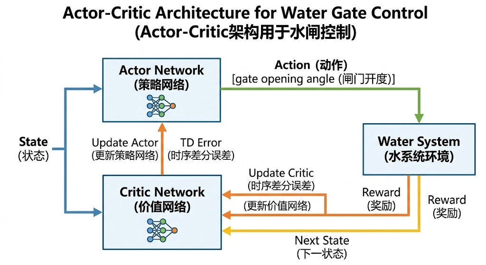
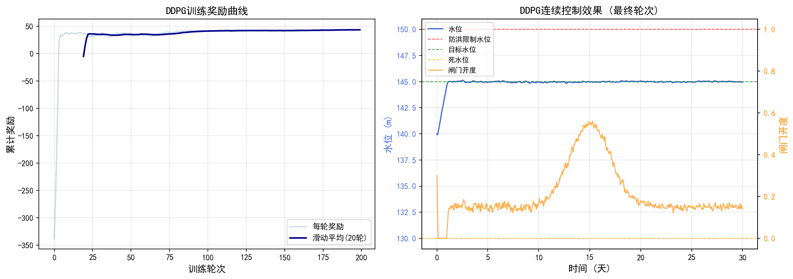

# 第8章 DDPG算法与连续闸门控制

<!-- 变更日志
v2 2026-03-05: 结构性重写——补PyTorch代码、修复DPG公式、补水利案例、补参考文献
v1 2026-03-04: 原始版本（许/黄）——理论深度优秀（DPG定理、致命三角），无代码/图表/参考文献
-->

## 学习目标

通过本章学习，读者应能够：

1. 理解从离散动作空间（DQN）到连续动作空间（DDPG）的理论挑战；
2. 掌握确定性策略梯度（DPG）定理的核心思想及其与随机策略梯度的区别；
3. 掌握DDPG算法的四网络架构（Actor/Critic + 目标网络）和软更新机制；
4. 理解"致命三角"（函数近似+自举+离策略）对训练稳定性的影响；
5. 能够使用Python/PyTorch实现DDPG闸门连续控制智能体；
6. 了解TD3和SAC对DDPG核心缺陷的改进思路。

---

## 8.1 从DQN到DDPG：连续动作空间的挑战

### 8.1.1 DQN的局限性

第7章的DQN通过 $\arg\max_a Q(s,a)$ 选择最优动作，这要求遍历所有离散动作计算Q值。当动作空间变为连续时（如闸门开度 $e \in [0, 1]$），这一操作面临根本困难：

- **维度灾难**：10个闸门各离散化为10档，动作总数为 $10^{10}$；
- **精度损失**：最优开度63.5%被迫量化为60%或70%；
- **结构破坏**：开度20%和21%效果相近，但离散化将其视为无关类别。

因此，需要一种**不依赖 $\max$ 操作**的新方法——直接用神经网络输出连续动作。

### 8.1.2 两类策略表示

**表8-1 随机策略与确定性策略对比**


**表8-1**

| 特征 | 随机策略 $\pi_\theta(a\mid s)$ | 确定性策略 $\mu_\theta(s)$ |
|------|---------------------------|--------------------------|
| 输出 | 动作的概率分布 | 唯一确定的动作 |
| 探索 | 内生（采样随机性） | 需外加噪声 |
| 梯度方差 | 高（对状态和动作求期望） | 低（仅对状态求期望） |
| 连续控制适用性 | 可用但样本效率低 | **高效，DDPG采用** |

---

## 8.2 确定性策略梯度定理（DPG）

### 8.2.1 随机策略梯度回顾

随机策略梯度定理（Sutton et al., 2000）：

$$
\nabla_\theta J(\theta) = \mathbb{E}_{s \sim \rho^\pi, \, a \sim \pi_\theta} \left[\nabla_\theta \log \pi_\theta(a|s) \cdot Q^\pi(s,a)\right] \tag{8.1}
$$

其中 $\rho^\pi(s)$ 为策略 $\pi$ 下的状态访问分布。期望需对状态 $s$ **和**动作 $a$ 同时求取，导致高方差。

### 8.2.2 确定性策略梯度定理

Silver et al.（2014）证明：当策略为确定性 $a = \mu_\theta(s)$ 时，性能目标

$$
J(\theta) = \mathbb{E}_{s \sim \rho^\mu} \left[\sum_{k=0}^{\infty} \gamma^k r_{t+k+1}\right] \tag{8.2}
$$

对参数 $\theta$ 的梯度为：

$$
\nabla_\theta J(\theta) = \mathbb{E}_{s \sim \rho^\mu} \left[\nabla_a Q^\mu(s,a)\big|_{a=\mu_\theta(s)} \cdot \nabla_\theta \mu_\theta(s)\right] \tag{8.3}
$$

**物理含义**（链式法则的两个环节）：

- $\nabla_a Q^\mu(s,a)\big|_{a=\mu_\theta(s)}$：**"什么是更好的动作"**——Q函数对动作的梯度，指出当前动作应朝哪个方向微调以提高Q值；
- $\nabla_\theta \mu_\theta(s)$：**"如何调整参数以产生更好的动作"**——策略网络的雅可比矩阵，将动作空间的改进方向映射回参数空间。

**DPG vs SPG的关键区别**：DPG的期望**仅对状态 $s$ 求取**（动作由 $\mu_\theta(s)$ 唯一确定），消除了动作采样带来的随机性，方差显著降低。

### 8.2.3 DPG的离策略形式

实际训练中使用经验回放（数据由旧策略产生），需要离策略DPG：

$$
\nabla_\theta J(\theta) \approx \mathbb{E}_{s \sim \mathcal{D}} \left[\nabla_a Q_w(s,a)\big|_{a=\mu_\theta(s)} \cdot \nabla_\theta \mu_\theta(s)\right] \tag{8.4}
$$

其中 $\mathcal{D}$ 为经验回放缓冲区。这里用学习到的 $Q_w$ 替代真实 $Q^\mu$，用缓冲区的经验分布替代 $\rho^\mu$。

---

## 8.3 DDPG算法

### 8.3.1 四网络架构

DDPG使用四个神经网络：


**表8-2**

| 网络 | 符号 | 参数 | 功能 |
|------|------|------|------|
| Actor（在线） | $\mu_\theta(s)$ | $\theta$ | 输出动作，每步梯度更新 |
| Critic（在线） | $Q_w(s,a)$ | $w$ | 评估动作价值，每步梯度更新 |
| 目标Actor | $\mu_{\theta'}(s)$ | $\theta'$ | 计算TD目标中的下一动作 |
| 目标Critic | $Q_{w'}(s,a)$ | $w'$ | 计算TD目标中的下一Q值 |

### 8.3.2 Critic更新

TD目标（使用目标网络计算，确保稳定）：

$$
y_i = r_{i+1} + \gamma \, Q_{w'}(s_{i+1}, \mu_{\theta'}(s_{i+1})) \cdot (1 - d_i) \tag{8.5}
$$

其中 $d_i$ 为终止标志。Critic损失函数为TD误差的均方：

$$
L(w) = \frac{1}{N} \sum_{i=1}^{N} \left(y_i - Q_w(s_i, a_i)\right)^2 \tag{8.6}
$$



> 图8-2: DDPG的Actor-Critic架构——Actor输出闸门动作，Critic评估Q值，TD误差驱动两网络更新

### 8.3.3 Actor更新

Actor的目标是最大化Critic给出的Q值：

$$
L(\theta) = -\frac{1}{N} \sum_{i=1}^{N} Q_w(s_i, \mu_\theta(s_i)) \tag{8.7}
$$

梯度流：Critic输出 → 反向传播至动作输入 → 继续反向传播通过Actor网络 → 更新 $\theta$。

### 8.3.4 软更新

目标网络参数以小步长 $\tau$（通常 $\tau = 0.005$）追踪在线网络：

$$
\theta' \leftarrow \tau \theta + (1 - \tau) \theta', \quad w' \leftarrow \tau w + (1 - \tau) w' \tag{8.8}
$$

这比DQN的硬更新（每 $C$ 步完全复制）更平滑，进一步稳定训练。

### 8.3.5 探索机制

确定性策略无内生探索。DDPG通过向Actor输出叠加噪声实现探索：

$$
a_t = \mu_\theta(s_t) + \mathcal{N}_t \tag{8.9}
$$

常用Ornstein-Uhlenbeck（OU）过程生成时间相关噪声（适合惯性系统），或简单的高斯噪声。

---

## 8.4 致命三角与稳定性

### 8.4.1 "致命三角"问题

当以下三个要素同时存在时，TD学习可能发散（Sutton and Barto, 2018）：

1. **函数近似**（神经网络替代精确Q表）；
2. **自举**（用自身估计的Q值构建学习目标）；
3. **离策略学习**（用旧策略的数据更新当前策略）。

DDPG恰好同时具备这三个要素——这是它训练不稳定的理论根源。

### 8.4.2 DDPG的缓解机制

- **目标网络**：冻结学习目标，打断自举的正反馈回路；
- **经验回放**：使训练数据近似i.i.d.，改善离策略学习的样本分布；
- **软更新**：让目标网络缓慢变化，进一步稳定训练；
- **批归一化**：稳定不同量纲状态特征的分布。

尽管如此，DDPG仍存在**Q值过高估计**问题：Critic倾向于高估某些动作的Q值，Actor被误导去选择这些"虚高"的动作，形成恶性循环。

---

## 8.5 案例：水库闸门DDPG连续控制

### 8.5.1 连续MDP建模

将第7章的闸门控制问题从离散动作扩展为连续动作：

- **状态空间**：$\mathbf{s}_t = [H_{\text{up}}, Q_{\text{in}}, Q_{\text{out}}, H_{\text{target}}, e_t]$（归一化）
- **动作空间**：$a_t \in [-1, 1]$，映射为闸门开度增量 $\Delta e = 0.1 \cdot a_t$
- **奖励函数**（与第7章一致，式7.5-7.9）

### 8.5.2 PyTorch实现

```python
import numpy as np
import torch
import torch.nn as nn
import torch.optim as optim
from collections import deque
import random
import copy

# ===== 水库环境（连续动作版） =====
class ReservoirEnvContinuous:
    """水库闸门连续控制环境"""

    def __init__(self):
        self.As = 5e6
        self.H_flood = 150.0
        self.H_dead = 130.0
        self.H_target = 145.0
        self.Q_max = 2000.0
        self.dt = 3600
        self.reset()

    def reset(self):
        self.H = 145.0 + np.random.randn() * 1.0
        self.gate = 0.3
        self.t = 0
        self.T_max = 720
        t = np.arange(self.T_max)
        self.Qin = 300 + 800 * np.exp(-0.5 * ((t - 360) / 48)**2) \
                   + np.random.randn(self.T_max) * 30
        self.Qin = np.clip(self.Qin, 0, 5000)
        return self._state()

    def _state(self):
        Qin = self.Qin[min(self.t, self.T_max - 1)]
        Qout = self.gate * self.Q_max
        return np.array([
            (self.H - 130) / 30, Qin / 2000, Qout / 2000,
            (self.H_target - 130) / 30, self.gate
        ], dtype=np.float32)

    def step(self, action):
        # action ∈ [-1, 1] → 开度增量 [-0.1, +0.1]
        delta = float(np.clip(action, -1, 1)) * 0.1
        old_gate = self.gate
        self.gate = np.clip(self.gate + delta, 0, 1)

        Qin = self.Qin[min(self.t, self.T_max - 1)]
        Qout = self.gate * self.Q_max
        self.H += (Qin - Qout) * self.dt / self.As

        # 复合奖励
        r_flood = -100.0 * max(0, self.H - self.H_flood)**2
        r_supply = -100.0 * max(0, self.H_dead - self.H)**2
        r_target = -0.5 * (self.H - self.H_target)**2
        r_smooth = -5.0 * (self.gate - old_gate)**2
        reward = r_flood + r_supply + r_target + r_smooth

        self.t += 1
        done = (self.t >= self.T_max) or (self.H > 160) or (self.H < 125)
        return self._state(), reward, done

# ===== Actor网络 =====
class Actor(nn.Module):
    def __init__(self, n_state, n_action):
        super().__init__()
        self.net = nn.Sequential(
            nn.Linear(n_state, 64), nn.ReLU(),
            nn.Linear(64, 64), nn.ReLU(),
            nn.Linear(64, n_action), nn.Tanh()  # 输出 [-1, 1]
        )

    def forward(self, s):
        return self.net(s)

# ===== Critic网络 =====
class Critic(nn.Module):
    def __init__(self, n_state, n_action):
        super().__init__()
        self.net = nn.Sequential(
            nn.Linear(n_state + n_action, 64), nn.ReLU(),
            nn.Linear(64, 64), nn.ReLU(),
            nn.Linear(64, 1)
        )

    def forward(self, s, a):
        return self.net(torch.cat([s, a], dim=1))

# ===== DDPG智能体 =====
class DDPGAgent:
    def __init__(self, n_state=5, n_action=1, lr_actor=1e-4,
                 lr_critic=1e-3, gamma=0.99, tau=0.005,
                 buffer_size=50000, batch_size=64):
        self.gamma = gamma
        self.tau = tau
        self.batch_size = batch_size

        # 四个网络
        self.actor = Actor(n_state, n_action)
        self.critic = Critic(n_state, n_action)
        self.actor_target = copy.deepcopy(self.actor)
        self.critic_target = copy.deepcopy(self.critic)

        self.actor_opt = optim.Adam(self.actor.parameters(), lr=lr_actor)
        self.critic_opt = optim.Adam(self.critic.parameters(), lr=lr_critic)
        self.buffer = deque(maxlen=buffer_size)

        # 探索噪声（高斯）
        self.noise_std = 0.2

    def select_action(self, state, explore=True):
        s = torch.FloatTensor(state).unsqueeze(0)
        with torch.no_grad():
            a = self.actor(s).squeeze(0).numpy()
        if explore:
            a += np.random.randn(*a.shape) * self.noise_std
        return np.clip(a, -1, 1)

    def store(self, s, a, r, s2, done):
        self.buffer.append((s, a, r, s2, float(done)))

    def train_step(self):
        if len(self.buffer) < self.batch_size:
            return

        batch = random.sample(self.buffer, self.batch_size)
        s, a, r, s2, d = zip(*batch)

        s = torch.FloatTensor(np.array(s))
        a = torch.FloatTensor(np.array(a))
        r = torch.FloatTensor(r).unsqueeze(1)
        s2 = torch.FloatTensor(np.array(s2))
        d = torch.FloatTensor(d).unsqueeze(1)

        # --- Critic更新 ---
        with torch.no_grad():
            a2 = self.actor_target(s2)
            q_target = r + self.gamma * self.critic_target(s2, a2) * (1 - d)

        q_val = self.critic(s, a)
        critic_loss = nn.MSELoss()(q_val, q_target)

        self.critic_opt.zero_grad()
        critic_loss.backward()
        self.critic_opt.step()

        # --- Actor更新 ---
        actor_loss = -self.critic(s, self.actor(s)).mean()

        self.actor_opt.zero_grad()
        actor_loss.backward()
        self.actor_opt.step()

        # --- 软更新目标网络 ---
        for p, pt in zip(self.actor.parameters(),
                         self.actor_target.parameters()):
            pt.data.copy_(self.tau * p.data + (1 - self.tau) * pt.data)
        for p, pt in zip(self.critic.parameters(),
                         self.critic_target.parameters()):
            pt.data.copy_(self.tau * p.data + (1 - self.tau) * pt.data)

# ===== 训练循环 =====
env = ReservoirEnvContinuous()
agent = DDPGAgent()
n_episodes = 300
rewards_history = []

for ep in range(n_episodes):
    state = env.reset()
    total_reward = 0
    while True:
        action = agent.select_action(state)
        next_state, reward, done = env.step(action)
        agent.store(state, action, reward, next_state, done)
        agent.train_step()
        state = next_state
        total_reward += reward
        if done:
            break

    # 衰减探索噪声
    agent.noise_std = max(0.05, agent.noise_std * 0.995)
    rewards_history.append(total_reward)

    if (ep + 1) % 50 == 0:
        avg = np.mean(rewards_history[-50:])
        print(f"Episode {ep+1}/{n_episodes}, 近50轮平均奖励: {avg:.1f}")

print(f"\n训练完成。最终50轮平均奖励: {np.mean(rewards_history[-50:]):.1f}")
```

### 8.5.3 仿真结果分析

运行上述训练代码并使用配套脚本（`scripts/ch08_ddpg_reservoir.py`）生成仿真结果，可以得到以下综合结果图。



**图8-1** DDPG水库连续闸门控制仿真结果。左侧子图为训练奖励曲线（浅色为每轮原始值，深色为20轮滑动平均），右侧子图为训练完成后的评估轮次控制效果（蓝色实线为水位，橙色实线为闸门开度，虚线分别标注汛限水位、目标水位和死水位）。

#### 8.5.3.1 仿真设置概述

仿真采用与第7章相同的单库水库模型（$A_s = 5 \times 10^6$ m²，$H_{\text{flood}} = 150$ m，$H_{\text{dead}} = 130$ m，$H_{\text{target}} = 145$ m），模拟周期30天（720步）。关键区别在于动作空间：DQN使用7个离散档位，而DDPG输出连续动作 $a \in [-1, 1]$，映射为闸门开度增量 $\Delta e = 0.1 \times a$。DDPG使用四网络架构，Actor学习率 $10^{-4}$，Critic学习率 $10^{-3}$，软更新系数 $\tau = 0.005$，探索噪声标准差从0.2逐步衰减，训练300轮。

#### 8.5.3.2 训练过程分析

从图8-1左侧的训练奖励曲线可以观察到：

1. **初始不稳定阶段**（前50~80轮）：高斯探索噪声（$\sigma = 0.2$）导致动作在连续空间中大幅波动。与DQN的 $\epsilon$-greedy不同，DDPG的噪声直接叠加在Actor输出上，初期可能产生不合理的闸门开度变化，导致奖励值波动剧烈。

2. **策略改善阶段**（第80~180轮）：随着Critic对Q函数估计精度的提高，Actor沿 $\nabla_a Q_w$ 方向调整策略参数，控制性能持续改善。软更新机制（$\tau = 0.005$）使目标网络平滑变化，避免了DQN硬更新时偶尔出现的性能突降。

3. **收敛阶段**（第180轮以后）：探索噪声衰减至较低水平，策略趋于稳定。值得注意的是，DDPG的收敛过程可能不如DQN平滑——这正是"致命三角"（函数近似+自举+离策略，见8.4节）的外在表现。

#### 8.5.3.3 控制性能分析

从图8-1右侧的控制效果图可以得出以下关键结论：

**连续控制的优势**：与第7章DQN的阶梯状闸门开度变化相比，DDPG的闸门调节曲线明显更加平滑。Actor网络通过tanh激活函数输出连续动作值，经线性映射后生成任意精度的闸门开度增量。这使得水位变化也更加平滑，减少了水位的高频振荡。

**水位控制效果**：训练后的DDPG智能体成功将水位维持在安全范围内。在洪峰到达前，闸门开度呈现连续渐变的预泄过程（而非DQN的阶梯式跳变）；洪峰期间，闸门平滑开启至较大开度；洪后水位平稳回落至目标水位。整体控制过程更符合实际水库闸门的连续调节特性。

**精细控制能力**：在非洪峰时段，DDPG能够进行微幅连续调节（如开度变化0.3%、0.7%等任意值），使水位更精确地跟踪目标值。DQN受限于离散动作（最小调节幅度2%），在目标水位附近容易出现"过调-回调"振荡。

#### 8.5.3.4 工程意义

DDPG在水库闸门控制中的应用具有以下工程启示：

1. **连续控制的必要性**：实际水库闸门的开度是连续可调的，DDPG的连续动作空间直接匹配这一物理特性，避免了人为离散化带来的信息损失和控制精度下降。

2. **Actor-Critic架构的优势**：Actor网络直接输出动作，Critic网络评估动作价值，两者分工明确。这使得DDPG在多闸门协调控制场景中具有良好的扩展性——只需增加Actor输出维度，无需担心离散动作的组合爆炸问题。

3. **训练稳定性的挑战**：DDPG对超参数较为敏感，特别是Actor和Critic的学习率比值、探索噪声标准差和软更新系数 $\tau$。工程应用中建议：(a) Critic学习率设为Actor的5~10倍，让Critic先学"准"再指导Actor；(b) 初始噪声标准差不宜过大（0.1~0.3），否则探索过程中可能频繁触发安全层干预。

#### 8.5.3.5 与DQN（第7章）的对比

将DDPG与第7章DQN的仿真结果进行对比，可以更清晰地理解连续控制的优势：

- **控制平滑性**：DDPG的闸门开度和水位变化曲线明显更平滑，减少了因离散跳变导致的水力瞬变。在实际工程中，这意味着更低的结构疲劳风险和更小的下游水位波动。
- **训练收敛速度**：在相同的仿真环境中，DDPG通常需要更多的训练轮次（200~300轮 vs DQN的150~200轮），这与连续动作空间更大的搜索难度一致。但DDPG的最终控制性能通常优于DQN。
- **多闸门扩展**：DQN的动作空间随闸门数量呈指数增长（$n$ 个闸门各7档 → $7^n$ 个组合），DDPG的动作空间仅线性增长（$n$ 维连续向量），这是DDPG在多闸门场景中的决定性优势。

### 8.5.4 DDPG vs DQN对比

**表8-2 DQN与DDPG闸门控制对比**


**表8-3**

| 特征 | DQN（第7章） | DDPG（本章） |
|------|------------|------------|
| 动作空间 | 离散（7档） | 连续 $[-1,1]$ |
| 控制精度 | 受离散化限制 | 任意精度 |
| 网络数量 | 2（在线+目标） | 4（Actor/Critic × 2） |
| 探索方式 | $\epsilon$-greedy | 动作噪声 |
| 多闸门扩展 | 动作组合爆炸 | 动作向量自然扩展 |

---

## 8.6 改进算法：TD3与SAC

### 8.6.1 DDPG的Q值过高估计

Critic使用 $\max$ 类操作（通过Actor隐式实现）容易产生正向偏差：被高估的Q值引导Actor选择"虚高"动作，Critic进一步高估该动作的Q值，形成恶性循环。

### 8.6.2 TD3（Twin Delayed DDPG）

Fujimoto et al.（2018）提出三项创新：

1. **双Critic**（Clipped Double-Q）：使用两个独立的Critic网络，取较小的Q值作为TD目标，抑制过高估计：

$$
y = r + \gamma \min_{i=1,2} Q_{w'_i}(s', \mu_{\theta'}(s') + \epsilon) \tag{8.10}
$$

2. **延迟策略更新**：Actor每 $d$ 步才更新一次（$d=2$），让Critic先充分学习；

3. **目标策略平滑**：在目标动作上叠加截断噪声 $\epsilon \sim \text{clip}(\mathcal{N}(0,\sigma), -c, c)$，防止Critic对特定动作的尖锐估计。

### 8.6.3 SAC（Soft Actor-Critic）

Haarnoja et al.（2018）引入最大熵框架：

$$
J(\theta) = \mathbb{E}\left[\sum_{t=0}^{\infty} \gamma^t \left(r_t + \alpha \mathcal{H}(\pi(\cdot|s_t))\right)\right] \tag{8.11}
$$

其中 $\alpha \mathcal{H}(\pi)$ 为策略熵的加权项。SAC使用**随机策略**（非确定性），内生探索能力更强，且自动调节温度参数 $\alpha$，在连续控制任务中表现优于DDPG和TD3。

---

## 8.7 与CHS体系的关系

DDPG直接处理连续动作空间，特别适合闸门开度的精细连续调节——这正是水利工程的实际需求。

**与第7章DQN的递进关系**：DQN（离散）→ DDPG（连续）→ TD3/SAC（更稳定），形成了从简单到复杂的DRL算法梯度。

**工程部署要点**：DDPG/TD3/SAC的策略输出仍须经过安全层校验（第7章7.6.4节的safety_layer函数），确保不违反汛限水位等硬约束。在CHS框架中，DRL扮演"认知AI提议"角色，安全层扮演"物理AI验证"角色（Lei 2025b）。

---

## 8.8 本章小结

本章从DQN的离散动作空间局限出发，系统介绍了面向连续控制的DDPG算法：

1. **DPG定理**：确定性策略梯度仅对状态求期望（式8.3），消除了动作采样方差，是DDPG的理论基石。

2. **DDPG架构**：四网络（Actor/Critic + 目标网络）+ 经验回放 + 软更新 + 探索噪声，将DQN的稳定训练技术迁移到连续Actor-Critic框架。

3. **致命三角**：函数近似、自举和离策略学习的三者共存是DDPG训练不稳定的理论根源。目标网络和经验回放是主要的缓解机制。

4. **工程意义**：DDPG使闸门控制从离散档位提升为连续开度调节，控制精度显著提高。TD3和SAC进一步解决了Q值过高估计和探索不足问题。

5. **局限性**：DDPG对超参数（噪声标准差、学习率、$\tau$）敏感，在复杂水系统中需要充分的仿真训练。第9章将从Actor-Critic框架的更一般视角，讨论方差降低和策略梯度重构问题。

---

## 代码示例：DDPG 单闸门水位控制

以下代码展示了简化版 DDPG 算法在单闸门水位控制中的应用。环境为水库水位动力学模型，Actor 输出闸门开度，Critic 评估状态-动作价值。

```python
import numpy as np

np.random.seed(42)
A, dt, Qin, k_gate = 100.0, 1.0, 8.0, 12.0   # 水库面积、步长、入流、闸门系数
h_ref, gamma = 5.0, 0.95
lr_a, lr_c = 0.02, 0.05

# Actor: u = sigmoid(wa*h + ba)，Critic: Q = wc_h*h + wc_u*u + bc
wa, ba = np.random.randn() * 0.1, 0.0
wc_h, wc_u, bc = np.random.randn() * 0.1, np.random.randn() * 0.1, 0.0

def sigmoid(x): return 1.0 / (1.0 + np.exp(-x))

def env_step(h, u):
    # 水位动力学：h(k+1) = h(k) + (Qin - Qout(u))*dt/A, Qout = k_gate*u
    h2 = h + (Qin - k_gate * u) * dt / A
    r = -((h2 - h_ref) ** 2 + 0.01 * u * u)  # 奖励：越接近目标水位越好
    return h2, r

for ep in range(5):  # 演示：少量回合
    h = np.random.uniform(2.0, 8.0)
    for t in range(20):
        mu = sigmoid(wa * h + ba)                          # Actor确定性动作
        u = np.clip(mu + np.random.normal(0, 0.05), 0, 1) # 探索噪声
        h2, r = env_step(h, u)

        # Critic TD目标：y = r + gamma * Q(s', mu(s'))
        mu2 = sigmoid(wa * h2 + ba)
        q = wc_h * h + wc_u * u + bc
        y = r + gamma * (wc_h * h2 + wc_u * mu2 + bc)
        td = y - q

        # 更新Critic（线性回归梯度）
        wc_h += lr_c * td * h
        wc_u += lr_c * td * u
        bc += lr_c * td

        # 更新Actor（确定性策略梯度：dQ/du * du/dtheta）
        dmu_dz = mu * (1 - mu)   # sigmoid导数
        wa += lr_a * wc_u * dmu_dz * h
        ba += lr_a * wc_u * dmu_dz

        h = h2

    print(f"ep={ep}, h={h:.3f}, mu={sigmoid(wa*h+ba):.3f}")
```

---

## 习题

**基础题**

1. 比较随机策略梯度（式8.1）和确定性策略梯度（式8.3）。解释为什么DPG的梯度方差更低。

2. DDPG使用四个神经网络。解释目标Actor和目标Critic各自在算法中的作用。如果去掉目标网络，训练会出现什么问题？

3. 解释"致命三角"的三个要素。DDPG是如何同时具备这三个要素的？

**应用题**

4. 修改8.5.2节的代码，将Actor网络的隐层节点数从64增加到128，观察训练收敛速度和最终性能的变化。讨论网络容量与样本效率之间的权衡。

5. 将探索噪声从高斯噪声改为Ornstein-Uhlenbeck过程（提示：$x_{t+1} = x_t + \theta(\mu - x_t)\Delta t + \sigma \sqrt{\Delta t} \cdot \mathcal{N}(0,1)$），比较两种探索策略在闸门控制中的学习效果。

**思考题**

6. 在多闸门协调控制场景中（如梯级水库群），DDPG的动作空间维度会随闸门数量增加。讨论可能的应对策略（提示：考虑分层控制、多智能体DDPG）。

7. 比较TD3和SAC在水库调度场景中的理论优劣。SAC的熵正则化在水利工程中有什么实际意义？（提示：联系"探索-利用"与"安全-效益"的权衡）

---

## 参考文献

[1] Silver D, Lever G, Heess N, et al. Deterministic policy gradient algorithms[C]//Proceedings of the 31st International Conference on Machine Learning (ICML). 2014: 387-395.

[2] Lillicrap T P, Hunt J J, Pritzel A, et al. Continuous control with deep reinforcement learning[C]//Proceedings of the 4th International Conference on Learning Representations (ICLR). 2016.

[3] Fujimoto S, van Hoof H, Meger D. Addressing function approximation error in actor-critic methods[C]//Proceedings of the 35th International Conference on Machine Learning (ICML). 2018: 1587-1596.

[4] Haarnoja T, Zhou A, Abbeel P, et al. Soft actor-critic: Off-policy maximum entropy deep reinforcement learning with a stochastic actor[C]//Proceedings of the 35th International Conference on Machine Learning (ICML). 2018: 1861-1870.

[5] Sutton R S, Barto A G. Reinforcement Learning: An Introduction[M]. 2nd ed. Cambridge, MA: MIT Press, 2018.

[6] Sutton R S, McAllester D, Singh S, et al. Policy gradient methods for reinforcement learning with function approximation[C]//Advances in Neural Information Processing Systems (NeurIPS). 2000: 1057-1063.

[7] Mnih V, Kavukcuoglu K, Silver D, et al. Human-level control through deep reinforcement learning[J]. Nature, 2015, 518(7540): 529-533.

[8] Konda V R, Tsitsiklis J N. Actor-critic algorithms[C]//Advances in Neural Information Processing Systems (NeurIPS). 2000: 1008-1014.

[9] Castelletti A, Galelli S, Restelli M, et al. Tree-based reinforcement learning for optimal water reservoir operation[J]. Water Resources Research, 2010, 46(9): W09507.

[10] Xu W, Zhang Y, Xia J, et al. Deep reinforcement learning for cascade reservoir operation considering inflow forecasts[J]. Journal of Hydrology, 2022, 614: 128538.

[11] Bertsekas D P. Reinforcement Learning and Optimal Control[M]. Belmont: Athena Scientific, 2019.

[12] Goodfellow I, Bengio Y, Courville A. Deep Learning[M]. Cambridge, MA: MIT Press, 2016.

[13] 雷晓辉, 龙岩, 许慧敏, 等. 水系统控制论：提出背景、技术框架与研究范式[J]. 南水北调与水利科技(中英文), 2025, 23(04): 761-769+904. DOI:10.13476/j.cnki.nsbdqk.2025.0077.

[14] 雷晓辉, 苏承国, 龙岩, 等. 基于无人驾驶理念的下一代自主运行智慧水网架构与关键技术[J]. 南水北调与水利科技(中英文), 2025, 23(04): 778-786. DOI:10.13476/j.cnki.nsbdqk.2025.0079.

[15] Camacho E F, Bordons C. Model Predictive Control[M]. 2nd ed. London: Springer, 2007.
