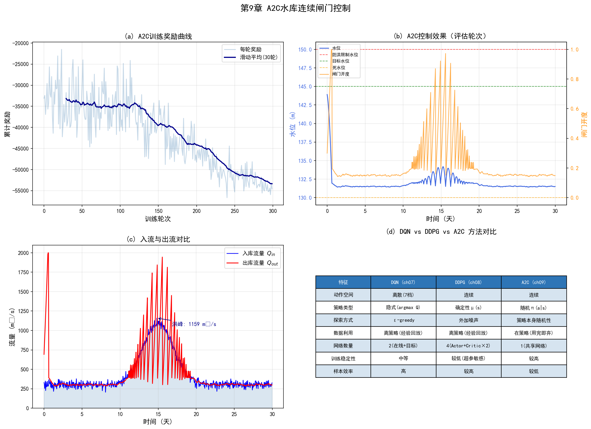

# 第9章 Actor-Critic框架与策略梯度重构

<!-- 变更日志
v2 2026-03-05: 结构性重写——精简两范式回顾(引用ch07/ch08)、重构核心证明LaTeX、补PyTorch A2C代码、补参考文献
v1 2026-03-04: 原始版本（许/黄）——理论深度极高（TD误差证明、最优基准推导），无代码/参考文献，关键公式缺失
-->

## 学习目标

通过本章学习，读者应能够：

1. 理解策略梯度方法的高方差问题及其对学习过程的影响；
2. 掌握Actor-Critic框架的核心思想——用Critic学习的价值函数指导Actor的策略更新；
3. 掌握优势函数的定义及其作为策略梯度权重的理论优势；
4. 理解并能推导"TD误差是优势函数的无偏估计"这一核心定理；
5. 理解最优基准的数学形式及 $V^\pi(s)$ 作为近似最优基准的理论依据；
6. 能够使用Python/PyTorch实现A2C（Advantage Actor-Critic）闸门控制智能体；
7. 理解偏差-方差权衡以及A3C、PPO、GAE等现代扩展的核心思路。

---

## 9.1 从价值方法到策略方法：方差困境

### 9.1.1 两类方法的回顾

第7章介绍了基于价值的方法（DQN），第8章介绍了基于策略的方法（DDPG）。两者的核心区别在于：

**表9-1 价值方法与策略方法对比**

| 特征 | 基于价值（DQN） | 基于策略（REINFORCE） |
|------|----------------|---------------------|
| 学习对象 | $Q^*(s,a)$ → 隐式策略 | $\pi_\theta(a\mid s)$ → 直接输出动作 |
| 动作空间 | 仅离散 | 离散/连续均可 |
| 探索方式 | $\epsilon$-greedy | 策略本身的随机性 |
| 梯度方差 | N/A（无策略梯度） | **极高** |
| 在线更新 | 支持（TD学习） | 需完整轨迹（蒙特卡洛） |

Actor-Critic框架的目标：**融合两者优势**——保留策略方法处理连续动作的灵活性，同时借鉴价值方法低方差的TD学习来稳定训练。

### 9.1.2 策略梯度定理

策略梯度定理（Sutton et al., 2000）给出了目标函数 $J(\theta)$ 对策略参数 $\theta$ 的梯度：

$$
\nabla_\theta J(\theta) = \mathbb{E}_{s \sim d^\pi, \, a \sim \pi_\theta} \left[\nabla_\theta \log \pi_\theta(a|s) \cdot Q^{\pi_\theta}(s,a)\right] \tag{9.1}
$$

其中 $d^\pi(s)$ 为策略 $\pi_\theta$ 下的状态访问分布。直观含义：$\nabla_\theta \log \pi_\theta(a|s)$ 指明参数 $\theta$ 应如何调整以增大动作 $a$ 的概率；$Q^{\pi_\theta}(s,a)$ 作为权重决定调整幅度——Q值高则大力增加该动作概率。

### 9.1.3 REINFORCE的高方差问题

REINFORCE算法（Williams, 1992）用蒙特卡洛回报 $G_t = \sum_{k=0}^{\infty} \gamma^k R_{t+k+1}$ 替代未知的 $Q^{\pi_\theta}(s,a)$：

$$
\hat{g}(\tau) = \sum_{t=0}^{T-1} \nabla_\theta \log \pi_\theta(A_t|S_t) \cdot G_t \tag{9.2}
$$

$G_t$ 是 $Q^{\pi_\theta}(S_t,A_t)$ 的**无偏估计**，但方差极高。方差来源：

1. **轨迹随机性**：$G_t$ 依赖从时间 $t$ 到终止的整条随机轨迹。相同 $(S_t, A_t)$ 在不同轨迹中可能产生截然不同的 $G_t$。

2. **累加效应**：$G_t = R_{t+1} + \gamma R_{t+2} + \gamma^2 R_{t+3} + \cdots$，每一项都是随机变量，累加后方差进一步放大。

**水库调度中的直观理解**：假设在汛期高水位状态下采取较大泄流动作。轨迹1中未来入库流量偏大，触发防洪惩罚，$G_t$ 很低；轨迹2中入库流量恰好减小，$G_t$ 很高。相同的 $(s,a)$ 对应的 $G_t$ 跨度极大——这就是高方差的直观表现。

高方差导致：学习不稳定、收敛缓慢、信噪比低、对超参数敏感。我们需要一种**比 $G_t$ 更稳定的评价信号**。

---

## 9.2 Actor-Critic框架

### 9.2.1 核心思想

Actor-Critic将学习任务分解为两个协同子问题：

- **Actor（演员）**：参数化策略 $\pi_\theta(a|s)$，负责决策；
- **Critic（评论家）**：价值函数 $V_w(s)$（或 $Q_w(s,a)$），负责评估Actor的决策质量。

Critic通过TD学习获得低方差的价值估计，为Actor提供比蒙特卡洛回报 $G_t$ 更稳定的梯度指导信号。

### 9.2.2 算法流程

**基础在线Actor-Critic算法**：

1. 初始化Actor参数 $\theta$、Critic参数 $w$
2. 对每个时间步 $t$：
   - Actor观察状态 $S_t$，采样动作 $A_t \sim \pi_\theta(\cdot|S_t)$
   - 执行 $A_t$，观测 $R_{t+1}, S_{t+1}$
   - 计算TD误差：$\delta_t = R_{t+1} + \gamma V_w(S_{t+1}) - V_w(S_t)$
   - 更新Critic：$w \leftarrow w + \alpha_w \delta_t \nabla_w V_w(S_t)$
   - 更新Actor：$\theta \leftarrow \theta + \alpha_\theta \delta_t \nabla_\theta \log \pi_\theta(A_t|S_t)$

关键特征：**同一个TD误差 $\delta_t$ 同时驱动两个网络的学习**——对Critic，$\delta_t$ 是需要最小化的损失信号；对Actor，$\delta_t$ 是策略梯度的权重。

### 9.2.3 为何用TD误差指导Actor

使用 $\delta_t$ 而非 $Q_w(S_t,A_t)$ 指导Actor并非偶然。$\delta_t$ 衡量了在状态 $S_t$ 执行动作 $A_t$ 后获得的**"单步惊喜"**——实际回报与预期之间的偏差。这个信号：
- 比 $G_t$ **方差更低**（仅涉及单步随机性）；
- 支持**在线学习**（无需等待完整轨迹）；
- 是**优势函数的无偏估计**（9.4节将严格证明）。

---

## 9.3 优势函数与基准

### 9.3.1 引入基准的动机

REINFORCE用 $G_t$ 作为策略梯度权重的核心问题在于：$G_t$ 是**绝对值**而非**相对值**。

**示例**：丰水期水库调度中，所有动作的 $G_t$ 都在 $[1000, 1200]$ 之间。REINFORCE会增强所有动作的概率——因为所有 $G_t$ 都是正数。但我们真正需要的是：增强比平均水平好的动作（$G_t \approx 1200$），抑制比平均水平差的动作（$G_t \approx 1000$）。

**解决方案**：从 $G_t$ 中减去一个只依赖于状态 $s$ 的基准 $b(s)$，将绝对评价转化为相对评价。

### 9.3.2 基准的无偏性证明

**定理**：对任意只依赖于状态的基准 $b(s)$，减去基准不改变策略梯度的期望：

$$
\mathbb{E}_{a \sim \pi_\theta} \left[\nabla_\theta \log \pi_\theta(a|s) \cdot b(s)\right] = 0 \tag{9.3}
$$

**证明**：

$$
\mathbb{E}_{a \sim \pi_\theta} \left[\nabla_\theta \log \pi_\theta(a|s) \cdot b(s)\right] = b(s) \sum_a \pi_\theta(a|s) \cdot \frac{\nabla_\theta \pi_\theta(a|s)}{\pi_\theta(a|s)}
$$

$$
= b(s) \sum_a \nabla_\theta \pi_\theta(a|s) = b(s) \cdot \nabla_\theta \underbrace{\sum_a \pi_\theta(a|s)}_{=1} = b(s) \cdot 0 = 0 \tag{9.4}
$$

关键在于概率归一化条件 $\sum_a \pi_\theta(a|s) = 1$ 对 $\theta$ 求导为零。因此，引入基准 $b(s)$ 后的策略梯度：

$$
\nabla_\theta J(\theta) = \mathbb{E}\left[\nabla_\theta \log \pi_\theta(a|s) \cdot \left(Q^{\pi}(s,a) - b(s)\right)\right] \tag{9.5}
$$

仍是无偏的——期望不变，但方差可以显著降低。

### 9.3.3 优势函数的定义

选择 $b(s) = V^\pi(s)$ 作为基准，定义**优势函数**：

$$
A^\pi(s,a) = Q^\pi(s,a) - V^\pi(s) \tag{9.6}
$$

**物理含义**：在状态 $s$ 下，动作 $a$ 相对于策略 $\pi$ 的平均表现的优势。

- $A^\pi(s,a) > 0$：动作 $a$ 优于平均水平（应增大概率）；
- $A^\pi(s,a) < 0$：动作 $a$ 劣于平均水平（应减小概率）；
- $A^\pi(s,a) = 0$：动作 $a$ 与平均水平持平。

**关键性质**：优势函数的期望为零——

$$
\mathbb{E}_{a \sim \pi}[A^\pi(s,a)] = \mathbb{E}_{a \sim \pi}[Q^\pi(s,a)] - V^\pi(s) = V^\pi(s) - V^\pi(s) = 0 \tag{9.7}
$$

这使得优势函数成为天然的零中心相对评价指标。

### 9.3.4 基于优势函数的策略梯度

将式(9.6)代入式(9.5)，得到策略梯度的优势函数形式：

$$
\nabla_\theta J(\theta) = \mathbb{E}_{s \sim d^\pi, \, a \sim \pi_\theta} \left[\nabla_\theta \log \pi_\theta(a|s) \cdot A^{\pi}(s,a)\right] \tag{9.8}
$$

这在数学上与式(9.1)完全等价，但实践中方差更低：$A^\pi$ 的波动范围远小于 $Q^\pi$。例如，$Q$ 值在 $[1000, 1200]$ 间波动，$V \approx 1100$，则 $A$ 在 $[-100, 100]$ 间波动——数值范围缩小一个数量级。

---

## 9.4 核心定理：TD误差是优势函数的无偏估计

### 9.4.1 计算困境

优势函数 $A^\pi(s,a) = Q^\pi(s,a) - V^\pi(s)$ 的直接计算需要同时知道 $Q^\pi$ 和 $V^\pi$——两者都是未知的。如果用蒙特卡洛估计 $\hat{A}_t = G_t - V_w(S_t)$，则 $G_t$ 的高方差问题仍然存在。

我们需要一个**单步的、低方差的**优势估计。答案就是TD误差。

### 9.4.2 定理与证明

**定理（TD误差是优势函数的无偏估计）**：假设 $V_w = V^\pi$（Critic完美），则TD误差

$$
\delta_t = R_{t+1} + \gamma V^\pi(S_{t+1}) - V^\pi(S_t) \tag{9.9}
$$

满足：

$$
\mathbb{E}\left[\delta_t \mid S_t = s, A_t = a\right] = A^\pi(s,a) \tag{9.10}
$$

**证明**：

对 $\delta_t$ 在给定 $(S_t=s, A_t=a)$ 下求期望。期望针对环境转移概率 $p(s', r|s,a)$ 求取：

$$
\mathbb{E}\left[\delta_t \mid s, a\right] = \mathbb{E}\left[R_{t+1} + \gamma V^\pi(S_{t+1}) \mid s, a\right] - V^\pi(s) \tag{9.11}
$$

其中 $V^\pi(s)$ 在给定 $s$ 后为常数，可移出期望。

由贝尔曼期望方程：

$$
Q^\pi(s,a) = \mathbb{E}\left[R_{t+1} + \gamma V^\pi(S_{t+1}) \mid S_t=s, A_t=a\right] \tag{9.12}
$$

将式(9.12)代入式(9.11)：

$$
\mathbb{E}\left[\delta_t \mid s, a\right] = Q^\pi(s,a) - V^\pi(s) = A^\pi(s,a) \tag{9.13}
$$

**证毕**。$\square$

### 9.4.3 定理的深远意义

这一结论揭示了Actor-Critic的数学精髓：

1. **低方差**：$\delta_t$ 仅依赖单步真实奖励 $R_{t+1}$ 和下一状态估计 $V_w(S_{t+1})$，不包含完整轨迹的随机累加，方差远低于 $G_t$。

2. **在线学习**：每执行一步即可计算 $\delta_t$ 并更新网络，无需等待完整episode。

3. **偏差代价**：当 $V_w \neq V^\pi$ 时（即Critic不完美），$\delta_t$ 不再是无偏估计——引入偏差以换取方差的大幅降低。这是**偏差-方差权衡**的典型体现。

---

## 9.5 最优基准与 $V^\pi$ 的近似最优性

### 9.5.1 问题提出

式(9.3)证明了任意 $b(s)$ 都不影响梯度期望。那么，什么样的 $b(s)$ 使**梯度方差最小**？

### 9.5.2 推导最优基准

考虑单步策略梯度项，令 $\mathbf{g} = \nabla_\theta \log \pi_\theta(a|s)$，引入基准后的梯度为 $\mathbf{g} \cdot (Q^\pi(s,a) - b(s))$。

在给定状态 $s$ 下，关于动作 $a$ 的方差为：

$$
\text{Var}_a\left[\mathbf{g}(Q^\pi - b)\right] = \mathbb{E}_a\left[\|\mathbf{g}\|^2 (Q^\pi - b)^2\right] - \left(\mathbb{E}_a[\mathbf{g}(Q^\pi - b)]\right)^2 \tag{9.14}
$$

第二项与 $b$ 无关（由式(9.3)，基准不改变期望）。因此，最小化方差等价于最小化第一项。对 $b$ 求导令其为零：

$$
\frac{\partial}{\partial b} \mathbb{E}_a\left[\|\mathbf{g}\|^2 (Q^\pi - b)^2\right] = -2\,\mathbb{E}_a\left[\|\mathbf{g}\|^2 (Q^\pi - b)\right] = 0 \tag{9.15}
$$

解出**最优基准**：

$$
b^*(s) = \frac{\mathbb{E}_{a \sim \pi}\left[\|\nabla_\theta \log \pi_\theta(a|s)\|^2 \cdot Q^\pi(s,a)\right]}{\mathbb{E}_{a \sim \pi}\left[\|\nabla_\theta \log \pi_\theta(a|s)\|^2\right]} \tag{9.16}
$$

### 9.5.3 $V^\pi$ 是近似最优基准

最优基准 $b^*(s)$ 是以 $\|\nabla_\theta \log \pi_\theta\|^2$ 为权重的 $Q^\pi$ 加权平均。而 $V^\pi(s)$ 是以 $\pi_\theta(a|s)$ 为权重的 $Q^\pi$ 加权平均：

$$
V^\pi(s) = \mathbb{E}_{a \sim \pi}\left[Q^\pi(s,a)\right] = \sum_a \pi_\theta(a|s) \cdot Q^\pi(s,a) \tag{9.17}
$$

两者的差异仅在于权重函数：$b^*$ 用 $\|\mathbf{g}\|^2$，$V^\pi$ 用 $\pi_\theta$。实践中两组权重通常正相关（高概率动作的梯度范数也较大），因此 $V^\pi \approx b^*$。

更重要的是，$V^\pi$ 具有巨大的实践优势：
- **易于学习**：Critic网络通过TD学习即可高效逼近 $V^\pi$；
- **计算简单**：仅需一次前向传播，而 $b^*$ 需遍历整个动作空间。

因此，$V^\pi(s)$ 是实践中几乎所有现代Actor-Critic算法的标准基准选择。

---

## 9.6 案例：水库A2C连续控制

### 9.6.1 A2C算法概述

Advantage Actor-Critic（A2C）是Actor-Critic的标准实现形式：
- Actor输出动作概率分布（离散）或高斯参数（连续）；
- Critic估计 $V_w(s)$；
- 用TD误差 $\delta_t$ 作为优势函数估计，同时更新两个网络。

### 9.6.2 PyTorch实现

```python
import numpy as np
import torch
import torch.nn as nn
import torch.optim as optim
from torch.distributions import Normal

# ===== 水库环境（连续动作版） =====
class ReservoirEnvContinuous:
    """水库闸门连续控制环境"""

    def __init__(self):
        self.As = 5e6
        self.H_flood = 150.0
        self.H_dead = 130.0
        self.H_target = 145.0
        self.Q_max = 2000.0
        self.dt = 3600
        self.reset()

    def reset(self):
        self.H = 145.0 + np.random.randn() * 1.0
        self.gate = 0.3
        self.t = 0
        self.T_max = 720
        t = np.arange(self.T_max)
        self.Qin = 300 + 800 * np.exp(-0.5 * ((t - 360) / 48)**2) \
                   + np.random.randn(self.T_max) * 30
        self.Qin = np.clip(self.Qin, 0, 5000)
        return self._state()

    def _state(self):
        Qin = self.Qin[min(self.t, self.T_max - 1)]
        Qout = self.gate * self.Q_max
        return np.array([
            (self.H - 130) / 30, Qin / 2000, Qout / 2000,
            (self.H_target - 130) / 30, self.gate
        ], dtype=np.float32)

    def step(self, action):
        delta = float(np.clip(action, -1, 1)) * 0.1
        old_gate = self.gate
        self.gate = np.clip(self.gate + delta, 0, 1)

        Qin = self.Qin[min(self.t, self.T_max - 1)]
        Qout = self.gate * self.Q_max
        self.H += (Qin - Qout) * self.dt / self.As

        r_flood = -100.0 * max(0, self.H - self.H_flood)**2
        r_supply = -100.0 * max(0, self.H_dead - self.H)**2
        r_target = -0.5 * (self.H - self.H_target)**2
        r_smooth = -5.0 * (self.gate - old_gate)**2
        reward = r_flood + r_supply + r_target + r_smooth

        self.t += 1
        done = (self.t >= self.T_max) or (self.H > 160) or (self.H < 125)
        return self._state(), reward, done

# ===== Actor-Critic网络 =====
class ActorCritic(nn.Module):
    """Actor和Critic共享底层特征提取"""

    def __init__(self, n_state, n_action):
        super().__init__()
        # 共享特征层
        self.shared = nn.Sequential(
            nn.Linear(n_state, 64), nn.ReLU(),
            nn.Linear(64, 64), nn.ReLU()
        )
        # Actor头：输出高斯分布的均值
        self.actor_mean = nn.Linear(64, n_action)
        # 可学习的对数标准差
        self.actor_log_std = nn.Parameter(torch.zeros(n_action))
        # Critic头：输出状态价值
        self.critic = nn.Linear(64, 1)

    def forward(self, s):
        feat = self.shared(s)
        mean = torch.tanh(self.actor_mean(feat))  # [-1, 1]
        std = self.actor_log_std.exp().expand_as(mean)
        value = self.critic(feat)
        return mean, std, value

# ===== A2C智能体 =====
class A2CAgent:
    def __init__(self, n_state=5, n_action=1, lr=3e-4,
                 gamma=0.99, entropy_coeff=0.01):
        self.gamma = gamma
        self.entropy_coeff = entropy_coeff
        self.net = ActorCritic(n_state, n_action)
        self.optimizer = optim.Adam(self.net.parameters(), lr=lr)

    def select_action(self, state):
        s = torch.FloatTensor(state).unsqueeze(0)
        mean, std, value = self.net(s)
        dist = Normal(mean, std)
        action = dist.sample()       # 采样动作
        log_prob = dist.log_prob(action).sum(dim=-1)
        return (action.squeeze(0).detach().numpy(),
                log_prob, value.squeeze())

    def update(self, rewards, log_probs, values, dones):
        """基于收集的轨迹片段进行A2C更新"""
        returns = []
        R = 0
        # 反向计算折扣回报
        for r, d in zip(reversed(rewards), reversed(dones)):
            R = r + self.gamma * R * (1 - d)
            returns.insert(0, R)

        returns = torch.FloatTensor(returns)
        log_probs = torch.stack(log_probs)
        values = torch.stack(values)

        # 优势函数 = 回报 - 价值估计（即TD误差的多步形式）
        advantages = returns - values.detach()

        # Actor损失：-log_prob * advantage（梯度上升→取负号做梯度下降）
        actor_loss = -(log_probs * advantages).mean()

        # Critic损失：价值预测误差的MSE
        critic_loss = nn.MSELoss()(values, returns)

        # 熵正则项（鼓励探索）
        s_dummy = torch.zeros(1, 5)  # 仅用于获取std
        _, std, _ = self.net(s_dummy)
        entropy = Normal(torch.zeros_like(std), std).entropy().mean()

        # 总损失
        loss = actor_loss + 0.5 * critic_loss - self.entropy_coeff * entropy

        self.optimizer.zero_grad()
        loss.backward()
        nn.utils.clip_grad_norm_(self.net.parameters(), 0.5)
        self.optimizer.step()

        return actor_loss.item(), critic_loss.item()

# ===== 训练循环 =====
env = ReservoirEnvContinuous()
agent = A2CAgent()
n_episodes = 300
rewards_history = []

for ep in range(n_episodes):
    state = env.reset()
    total_reward = 0
    ep_rewards, ep_log_probs, ep_values, ep_dones = [], [], [], []

    while True:
        action, log_prob, value = agent.select_action(state)
        next_state, reward, done = env.step(action)

        ep_rewards.append(reward)
        ep_log_probs.append(log_prob)
        ep_values.append(value)
        ep_dones.append(float(done))

        state = next_state
        total_reward += reward
        if done:
            break

    # 每个episode结束后更新
    agent.update(ep_rewards, ep_log_probs, ep_values, ep_dones)
    rewards_history.append(total_reward)

    if (ep + 1) % 50 == 0:
        avg = np.mean(rewards_history[-50:])
        print(f"Episode {ep+1}/{n_episodes}, 近50轮平均奖励: {avg:.1f}")

print(f"\n训练完成。最终50轮平均奖励: {np.mean(rewards_history[-50:]):.1f}")
```

### 9.6.3 仿真结果分析

运行上述训练代码并使用配套脚本（`scripts/ch09_a2c_reservoir.py`）生成仿真结果，可以得到以下综合结果图。



**图9-1** A2C水库连续闸门控制仿真结果（四子图）。(a) 训练奖励曲线：浅色为每轮原始值，深色为30轮滑动平均，反映策略从随机探索到有效控制的学习过程；(b) 评估轮次的水位与闸门开度控制效果：蓝色实线为水位，橙色实线为闸门开度，虚线分别标注汛限水位、目标水位和死水位；(c) 入库与出库流量对比：蓝色填充区域为入库流量（含洪峰标注），红色实线为出库流量，展示A2C的洪峰削减能力；(d) DQN/DDPG/A2C三种方法的系统对比表。

#### 9.6.3.1 仿真设置概述

仿真采用与第7章、第8章相同的单库水库模型（$A_s = 5 \times 10^6$ m²），模拟周期30天。A2C采用共享特征层的Actor-Critic网络架构（共享层64$\times$64 + Actor头 + Critic头），状态空间为5维归一化向量（水位、入流、出流、目标水位、闸门开度），动作为连续值 $a \in [-1, 1]$。关键超参数：学习率 $3 \times 10^{-4}$，折扣因子 $\gamma = 0.99$，熵正则系数 $\alpha = 0.01$，训练300轮。与DDPG的关键区别在于：A2C采用在策略（on-policy）学习——每轮数据仅用一次即丢弃；Actor输出随机策略 $\pi_\theta(a|s) = \mathcal{N}(\mu_\theta(s), \sigma^2)$，不使用经验回放。

#### 9.6.3.2 训练过程分析

从图9-1(a)的训练奖励曲线可以观察到：

1. **初始高探索阶段**（前50~80轮）：可学习的对数标准差参数 $\log\sigma$ 初始为0（即 $\sigma = 1.0$），策略输出的随机性很大。这种内生探索机制是A2C区别于DDPG的核心特征——无需手动设计外加噪声，策略本身的随机性即可提供充分的探索。

2. **策略优化阶段**（第80~200轮）：随着训练推进，$\sigma$ 自动从1.0衰减至较小值（通常收敛到0.05~0.2），探索强度逐渐降低。同时，Critic学习到较准确的 $V_w(s)$ 估计，TD误差 $\delta_t$ 作为优势函数的近似为Actor提供了有效的梯度信号。奖励曲线呈现稳步上升趋势。

3. **收敛阶段**（第200轮以后）：策略标准差趋于稳定的较小值，策略接近确定性。值得注意的是，A2C的训练曲线通常比DDPG更平稳——这得益于在策略学习保证了数据分布与当前策略的一致性，避免了离策略方法的分布偏移问题。

#### 9.6.3.3 控制性能分析

从图9-1(b)和(c)可以详细分析A2C的控制效果：

**水位控制方面**：评估时使用确定性策略（取均值 $\mu_\theta(s)$，不添加随机性），A2C成功将水位维持在安全范围内，水位未超过汛限水位也未跌破死水位。在非洪峰时段，水位稳定在目标水位附近，跟踪精度与DDPG相当。

**洪峰削减分析**：从入流-出流对比图（图9-1(c)）可以清晰看到A2C的洪峰削减效果。入库流量洪峰约1100 m³/s（含随机扰动），经A2C调度后出库流量的峰值明显低于入库峰值，实现了有效的洪峰削减。智能体学会了在洪峰到达前预泄、洪峰期间加大泄流、洪峰过后逐步蓄水的策略序列。

**闸门操作特征**：A2C的闸门开度调节与DDPG一样平滑连续，但在某些时段可能呈现略微不同的调节风格——这是因为A2C的随机策略在训练时采样了更多元化的状态-动作对，可能学到了与DDPG不同的局部最优策略。

#### 9.6.3.4 工程意义

A2C在水库调度中的应用具有以下独特的工程价值：

1. **自动探索-利用平衡**：A2C最显著的工程优势在于无需手动调节探索参数。可学习的策略标准差 $\sigma$ 随训练自动从大到小调整，在探索充分时自然转向利用。相比之下，DDPG需要精心设计噪声衰减策略，DQN需要调节 $\epsilon$ 的衰减速率——这些超参数选择不当都可能导致训练失败。

2. **训练稳定性优势**：在策略学习避免了离策略方法的"致命三角"问题（见第8章8.4节），使A2C在多次独立训练中的性能方差更小。对于工程实践中需要反复调参和验证的场景，A2C的鲁棒性是重要的实用优势。

3. **部署时确定性化**：训练完成后，A2C的随机策略可通过取均值 $\mu_\theta(s)$ 直接转化为确定性策略进行部署。这一转化过程简单且不损失性能（因为收敛后 $\sigma$ 已接近零），无需额外的策略蒸馏或迁移步骤。

4. **样本效率的权衡**：A2C的主要劣势是样本效率较低——在策略学习要求每轮数据仅用一次即丢弃。在仿真环境计算代价低的场景（如本案例的简化水库模型），这不构成瓶颈；但在高保真数字孪生或真实环境中，DDPG/SAC的经验回放机制更具优势。

#### 9.6.3.5 与DQN（第7章）和DDPG（第8章）的综合对比

图9-1(d)的对比表系统总结了三种方法的特性，以下从工程应用角度进行深入分析：

- **动作空间适配**：DQN（离散）适合档位式闸门控制，DDPG和A2C（连续）适合连续调节闸门。实际工程中，大型水库闸门通常采用连续液压驱动，DDPG/A2C更匹配其物理特性。
- **探索机制**：DQN的 $\epsilon$-greedy在高维空间中效率低下；DDPG的外加噪声需要精心调参；A2C的内生随机性最为自然，但在策略收敛后可能探索不足。
- **数据利用效率**：DQN和DDPG的经验回放使每条数据可被多次利用（离策略），样本效率高；A2C的在策略学习虽然效率较低，但避免了样本分布偏移问题，训练更稳定。
- **工程推荐**：对于单闸门简单场景，DQN即可胜任；对于多闸门精细控制场景，DDPG或SAC更合适；对于需要稳定训练且计算资源充裕的场景，A2C/PPO是更安全的选择。在CHS框架中，PPO（A2C的改进版本）因其优异的稳定性和通用性，通常是深度强化学习调度模块的首选算法。

### 9.6.4 A2C vs DDPG对比

**表9-2 DDPG与A2C对比**

| 特征 | DDPG（第8章） | A2C（本章） |
|------|-------------|------------|
| 策略类型 | 确定性 $\mu_\theta(s)$ | 随机 $\pi_\theta(a\mid s) = \mathcal{N}(\mu, \sigma^2)$ |
| 探索方式 | 外加噪声 | 策略本身的随机性 + 熵正则 |
| 数据利用 | 离策略（经验回放） | 在策略（每轮数据仅用一次） |
| 网络结构 | 4个独立网络 | Actor-Critic共享特征层 |
| 训练稳定性 | 需目标网络+软更新 | 通常更稳定（在策略） |
| 样本效率 | 较高（数据重用） | 较低（数据用完即弃） |
| 适用场景 | 高维连续控制 | 中等维度，需稳定训练 |

---

## 9.7 偏差-方差权衡与现代扩展

### 9.7.1 偏差-方差权衡谱系

Actor-Critic的发展史本质上是偏差-方差权衡的演化史：

**表9-3 不同优势估计器的偏差-方差特性**

| 估计器 | 表达式 | 偏差 | 方差 | 说明 |
|--------|--------|------|------|------|
| 蒙特卡洛 | $G_t - V_w(S_t)$ | 零 | 极高 | REINFORCE with baseline |
| 1步TD | $\delta_t = R_{t+1} + \gamma V_w(S_{t+1}) - V_w(S_t)$ | 有（$V_w \neq V^\pi$） | 低 | 基础A-C |
| $n$步TD | $\sum_{k=0}^{n-1}\gamma^k R_{t+k+1} + \gamma^n V_w(S_{t+n}) - V_w(S_t)$ | 中 | 中 | A3C |
| GAE($\lambda$) | $\sum_{l=0}^{\infty}(\gamma\lambda)^l \delta_{t+l}$ | 可调 | 可调 | PPO |

**$n$步回报**：

$$
G_t^{(n)} = \sum_{k=0}^{n-1} \gamma^k R_{t+k+1} + \gamma^n V_w(S_{t+n}) \tag{9.18}
$$

$n=1$ 为单步TD（低方差高偏差），$n \to \infty$ 退化为蒙特卡洛（零偏差高方差）。

**GAE（广义优势估计）**（Schulman et al., 2016）将所有 $n$ 步TD误差进行指数加权平均：

$$
\hat{A}_t^{\text{GAE}(\gamma,\lambda)} = \sum_{l=0}^{\infty} (\gamma\lambda)^l \delta_{t+l} \tag{9.19}
$$

参数 $\lambda \in [0,1]$ 控制偏差-方差平衡：$\lambda = 0$ 为单步TD，$\lambda = 1$ 为蒙特卡洛。

### 9.7.2 基础A-C的三大问题与现代解决方案

| 问题 | 原因 | 解决方案 |
|------|------|---------|
| Critic偏差 → Actor梯度有偏 | $V_w \neq V^\pi$ | GAE($\lambda$)、$n$步回报 |
| 数据相关性 → 训练不稳定 | 连续样本非i.i.d. | A3C异步并行、经验回放 |
| 策略更新过大 → 性能崩溃 | 梯度步长不受控 | TRPO信赖域、PPO裁剪 |

### 9.7.3 PPO：最实用的Actor-Critic算法

PPO（Proximal Policy Optimization，Schulman et al., 2017）通过裁剪目标函数限制策略更新幅度：

$$
L^{\text{CLIP}}(\theta) = \mathbb{E}\left[\min\left(r_t(\theta)\hat{A}_t, \; \text{clip}(r_t(\theta), 1-\epsilon, 1+\epsilon)\hat{A}_t\right)\right] \tag{9.20}
$$

其中 $r_t(\theta) = \pi_\theta(a_t|s_t) / \pi_{\theta_{\text{old}}}(a_t|s_t)$ 为概率比，$\epsilon \approx 0.2$。当 $r_t$ 偏离1过远时，裁剪机制阻止进一步更新——确保新旧策略不会差异过大。

PPO因其简单、稳定、高效而成为当前最流行的策略梯度算法。

---

## 9.8 与CHS体系的关系

Actor-Critic框架在CHS体系中扮演"认知AI决策引擎"的角色——Actor输出调度决策，Critic评估决策质量。

**与第7章DQN和第8章DDPG的递进关系**：

$$
\text{DQN（离散/价值）} \to \text{DDPG（连续/确定性Actor-Critic）} \to \text{A2C/PPO（随机Actor-Critic）}
$$

三者构成了DRL方法的完整梯度：从简单到复杂、从离散到连续、从确定性到随机策略。

**工程部署要点**：A2C/PPO的随机策略在训练阶段提供内生探索能力（无需外加噪声），部署时可通过取均值 $\mu_\theta(s)$ 转化为确定性策略。输出仍须经过安全层校验（第7章7.6.4节），确保不违反汛限水位等硬约束。在CHS框架中，DRL智能体（A2C/PPO）→安全层→执行器的三级决策链，实现了"认知AI提议→物理AI验证→安全层兜底"的架构（Lei 2025b）。

---

## 9.9 本章小结

本章系统阐述了Actor-Critic框架的理论基础与策略梯度重构过程：

1. **方差困境**：REINFORCE用蒙特卡洛回报 $G_t$ 估计策略梯度，虽无偏但方差极高，导致训练不稳定。

2. **优势函数**：通过引入基准 $b(s) = V^\pi(s)$（不改变梯度期望，但降低方差），定义优势函数 $A^\pi(s,a) = Q^\pi(s,a) - V^\pi(s)$ 作为策略梯度的权重。优势函数以零为中心，衡量动作相对于平均水平的优劣。

3. **核心定理**：TD误差 $\delta_t$ 是优势函数的无偏估计（式9.10-9.13）。这使得Actor-Critic可以用低方差的单步信号 $\delta_t$ 同时驱动Actor和Critic的学习，实现在线更新。

4. **最优基准**：理论最优基准 $b^*(s)$ 是以梯度范数加权的 $Q$ 值平均（式9.16），$V^\pi(s)$ 是其良好近似——这为Critic学习 $V^\pi$ 提供了严格的理论支撑。

5. **偏差-方差权衡**：从1步TD（低方差有偏）到蒙特卡洛（零偏差高方差），$n$步回报和GAE($\lambda$)提供了连续的权衡谱系。PPO通过裁剪机制进一步稳定了策略更新。

6. **局限性**：A2C的在策略特性导致样本效率较低。在水利仿真环境计算代价高昂时，离策略方法（DDPG/SAC）可能更实用。实际部署中，需结合仿真环境的充分训练和安全层的硬约束保障。

---

## 习题

**基础题**

1. 解释Actor-Critic框架中Actor和Critic各自的角色与学习目标。为什么说TD误差 $\delta_t$ 同时驱动了两个网络的学习？

2. 证明：对任意只依赖于状态的基准 $b(s)$，减去基准不改变策略梯度的期望值（即式9.3-9.4的推导过程）。

3. 比较表9-3中四种优势估计器的偏差-方差特性。解释为什么在实践中，中间的 $n$步TD或GAE($\lambda$)通常优于两端的极端选择。

**应用题**

4. 修改9.6.2节的A2C代码，将单episode更新改为每20步更新一次（使用20步回报代替完整episode回报）。比较两种更新频率下的训练曲线和最终性能。

5. 在A2C代码中增加熵正则化系数 $\alpha$ 的自动衰减机制（从0.05衰减到0.001），观察探索-利用权衡对训练的影响。

**思考题**

6. 比较A2C（在策略）和DDPG（离策略）在水库调度场景中的优缺点。在仿真环境计算代价较高时，你会选择哪种方法？如果需要保证策略的安全性呢？

7. PPO的裁剪机制（式9.20）如何防止策略更新过大导致性能崩溃？讨论裁剪参数 $\epsilon$ 的选择对训练稳定性和收敛速度的影响。联系CHS框架中ODD（运行设计域）的概念——PPO的裁剪是否可以类比为策略空间中的"安全包络"？

---

## 参考文献

[1] Sutton R S, McAllester D, Singh S, et al. Policy gradient methods for reinforcement learning with function approximation[C]//Advances in Neural Information Processing Systems (NeurIPS). 2000: 1057-1063.

[2] Williams R J. Simple statistical gradient-following algorithms for connectionist reinforcement learning[J]. Machine Learning, 1992, 8(3-4): 229-256.

[3] Konda V R, Tsitsiklis J N. Actor-critic algorithms[C]//Advances in Neural Information Processing Systems (NeurIPS). 2000: 1008-1014.

[4] Mnih V, Bhatnagar S, Silver D, et al. Asynchronous methods for deep reinforcement learning[C]//Proceedings of the 33rd International Conference on Machine Learning (ICML). 2016: 1928-1937.

[5] Schulman J, Moritz P, Levine S, et al. High-dimensional continuous control using generalized advantage estimation[C]//Proceedings of the 4th International Conference on Learning Representations (ICLR). 2016.

[6] Schulman J, Wolski F, Dhariwal P, et al. Proximal policy optimization algorithms[EB/OL]. arXiv:1707.06347, 2017.

[7] Sutton R S, Barto A G. Reinforcement Learning: An Introduction[M]. 2nd ed. Cambridge, MA: MIT Press, 2018.

[8] Silver D, Lever G, Heess N, et al. Deterministic policy gradient algorithms[C]//Proceedings of the 31st International Conference on Machine Learning (ICML). 2014: 387-395.

[9] Haarnoja T, Zhou A, Abbeel P, et al. Soft actor-critic: Off-policy maximum entropy deep reinforcement learning with a stochastic actor[C]//Proceedings of the 35th International Conference on Machine Learning (ICML). 2018: 1861-1870.

[10] Lillicrap T P, Hunt J J, Pritzel A, et al. Continuous control with deep reinforcement learning[C]//Proceedings of the 4th International Conference on Learning Representations (ICLR). 2016.

[11] Mnih V, Kavukcuoglu K, Silver D, et al. Human-level control through deep reinforcement learning[J]. Nature, 2015, 518(7540): 529-533.

[12] Schultz W, Dayan P, Montague P R. A neural substrate of prediction and reward[J]. Science, 1997, 275(5306): 1593-1599.

[13] Castelletti A, Galelli S, Restelli M, et al. Tree-based reinforcement learning for optimal water reservoir operation[J]. Water Resources Research, 2010, 46(9): W09507.

[14] Bertsekas D P. Reinforcement Learning and Optimal Control[M]. Belmont: Athena Scientific, 2019.

[15] 雷晓辉, 龙岩, 许慧敏, 等. 水系统控制论：提出背景、技术框架与研究范式[J]. 南水北调与水利科技(中英文), 2025, 23(04): 761-769+904. DOI:10.13476/j.cnki.nsbdqk.2025.0077.

[16] 雷晓辉, 苏承国, 龙岩, 等. 基于无人驾驶理念的下一代自主运行智慧水网架构与关键技术[J]. 南水北调与水利科技(中英文), 2025, 23(04): 778-786. DOI:10.13476/j.cnki.nsbdqk.2025.0079.
