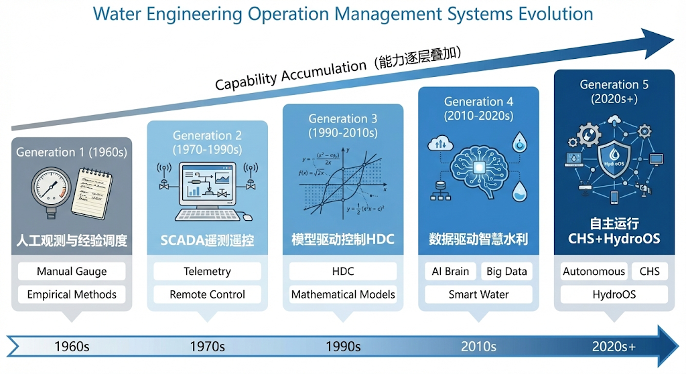
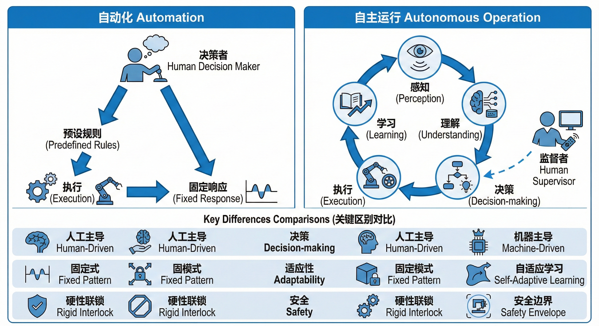
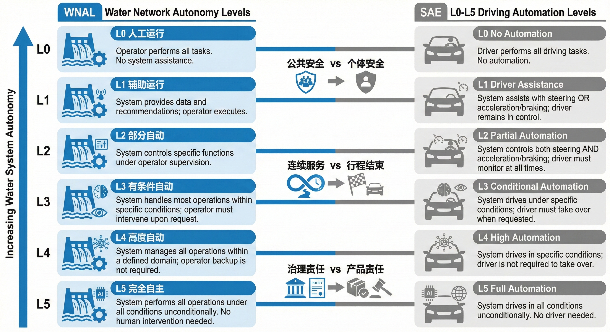
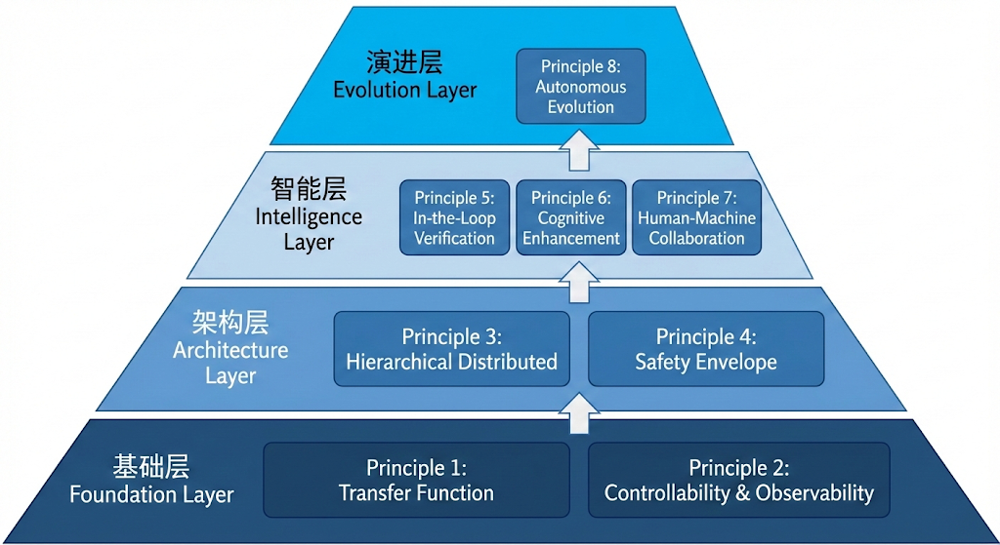
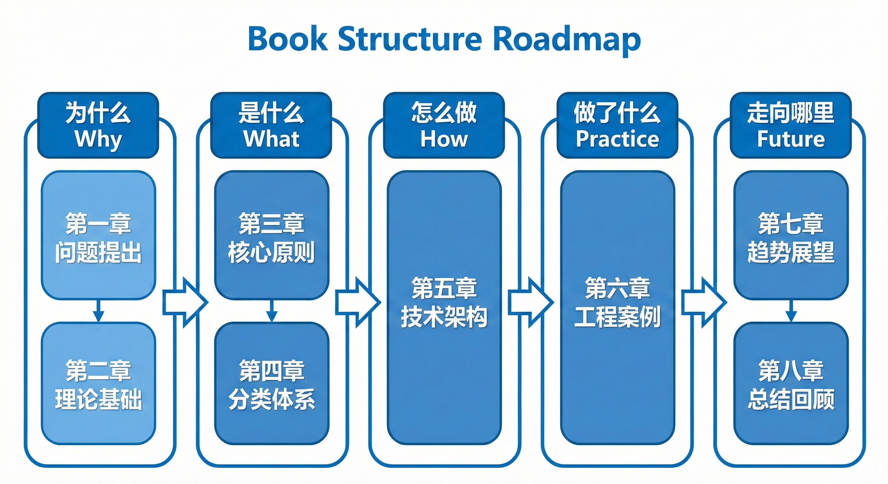

# 第一章 绪论：水系统面临的控制挑战

---

> **引导案例**
>
> 设想这样一个场景：汛期某夜，一条数百千米长的跨流域调水干线遭遇区间暴雨与上游来水叠加。调度中心值班的十余名调度员面对大屏上数百个闸门和泵站的实时数据，需要在数小时内做出上千个调度决策——哪些闸门开多大？哪些泵站关停？各断面水位控制在什么范围？每一个决策都牵动下游数十千米的水位变化，而水波传播的时滞意味着当前操作的效果要半小时甚至更久才能显现。雨还在下，来水还在涨，人工调度方案总是跟不上水情变化的速度。这并非某一次事件的特写，而是全球水利工程运行中反复出现的共性困局：系统规模越来越大、工况变化越来越快、人工决策越来越力不从心。如何让水利工程从"人盯人"的被动运行走向智能化、自主化的主动运行？这正是本书要回答的核心问题。


> **本章阅读指引**
> 
> **适合读者**：所有读者（第一章是全书基础）
> 
> **与后章的关系**：本章的 WNAL、ODD 概念贯穿全书；CHS 八原理在第三章概览、第七章详述；HydroOS 架构在第十三章介绍；第十五章概览理论验证并对全书作结。
> 
> **核心概念**（5 个）：
> - 水系统控制论（CHS）：研究水利工程自主运行的交叉学科
> - 水网自主等级（WNAL）：L0-L5 六级，类似自动驾驶 SAE 分级
> - 运行设计域（ODD）：系统可以自主运行的条件范围
> - 分层分布式控制（HDC）：将大系统分解为多层级、多区域
> - 五代演进：人工观测→SCADA→模型驱动→数据驱动→自主运行
> 
> **直觉类比**：如果把水网比作交通系统，WNAL 相当于驾照分级（L0=无驾照，L5=完全自动驾驶），ODD 相当于"你可以自己开的路况条件"。
> 
> **可略读部分**（如已熟悉）：
> - §1.2 水利工程运行管理演进（如已了解 SCADA、HDC 可略读）
> - §1.5 CHS 学科定位（管理者可略读，研究生建议细读）

**本章目标**：帮助读者理解水利工程走向自主运行的必然性和紧迫性，建立对水系统控制论（CHS）的全局认知框架。本章从全球水利基础设施的现状出发，回顾运行管理系统的五代演进，阐明从人工调度到自主运行的范式转变逻辑，最终引出CHS的学科定位和理论框架。读完本章，读者应能回答三个问题：为什么水利工程需要自主运行？什么是水系统控制论？本书的知识路径是什么？

---


> **[合规说明]**：关于工程落地、测试覆盖率量化指标与合规审查的详细要求，请参阅本丛书 **T3 卷《标准与工程治理》**。

## 1.1 全球水利基础设施现状

### 1.1.1 水利工程：人类文明的基础支撑

水是生命之源，水利工程则是人类文明发展的基础支撑。从古代美索不达米亚的灌溉渠系，到罗马帝国的引水渠，再到中国的都江堰（Dujiangyan Irrigation System，建于公元前 256 年，至今仍在使用）和大运河（the Grand Canal，世界上最长的人工运河，全长 1,794 km），水利工程伴随人类文明走过了数千年。进入现代社会，水利工程的规模和复杂度达到了空前的高度。

当今世界拥有约58,000座大坝（坝高15米以上，据国际大坝委员会ICOLD统计 [1-9]），总库容超过8,000立方千米。全球灌溉面积约3.4亿公顷，灌溉渠系总长度超过数百万千米。跨流域调水工程遍布各大洲：南非的莱索托高地调水工程、美国的加州中央谷地引水工程、印度的河流互联计划，以及中国的南水北调工程（South-to-North Water Diversion, SNWD，世界上最大的跨流域调水工程）——这些工程构成了人类改造自然、保障发展的宏大基础设施网络。

在供水领域，全球城市供水管网总长度估计超过1,200万千米，服务约45亿城市人口。水力发电贡献了全球约16%的电力供应，全球水电装机容量超过1,400吉瓦。防洪工程方面，仅中国就拥有堤防总长约33万千米，各类水库约9.8万座。

这些数字描绘了一幅壮观的图景：水利基础设施构成了现代社会运转不可或缺的"血脉系统"。然而，联合国世界水发展报告多次指出，全球水资源管理正面临日益严峻的复杂局面。在这些宏伟工程的背后，一个日益严峻的问题正在浮现——我们如何有效地运行和管理如此庞大而复杂的系统？

### 1.1.2 中国水利工程的规模与特征

中国是世界上水利基础设施规模最大的国家。截至2024年底，中国已建成各类水库约9.8万座，总库容超过9,000亿立方米；建成堤防约33万千米，保护人口6.7亿；建成大中型灌区约2,200处，有效灌溉面积约6,900万公顷 [1-15]。

中国的跨流域调水工程更是举世瞩目。南水北调工程（South-to-North Water Diversion, SNWD）是世界上最大的跨流域调水工程，由东线、中线和西线三部分组成。其中，东线工程全长1,156千米，利用京杭大运河及与其平行的河道逐级提水北送；中线工程全长1,432千米，从丹江口水库自流引水至北京、天津。截至2024年底，南水北调中线和东线工程累计调水约700亿立方米，惠及沿线1.76亿人口。此外，引黄济青（Yellow River-to-Qingdao Water Transfer）、引滦入津、胶东调水（Jiaodong Water Transfer Project，山东半岛水网骨干工程）、引江济淮等工程构成了中国庞大的跨区域水资源配置网络。

中国水利工程有几个突出的特征值得关注：

| **特征** | 具体表现 | 带来的运行挑战 |
|------|---------|-------------|
| **规模巨大** | 单条调水线路可达上千千米，涉及数百个控制节点 | 信息传输延迟大，协调困难 |
| **系统复杂** | 多水源、多用户、多目标，供水/发电/防洪/生态多功能耦合 | 目标冲突，调度优化困难 |
| **工况多变** | 洪水、冰期、检修、突发污染等非常规工况频发 | 需要快速响应和在线决策能力 |
| **时空尺度跨度大** | 从秒级的闸门控制到季节级的水资源配置 | 多时间尺度调度的协调 |
| **基础设施老化** | 相当数量的水库和渠道建于20世纪50-70年代 | 安全风险高，运行约束多 |

这些特征意味着，中国的水利工程运行管理面临着世界上最为复杂的挑战，也为探索水利工程自主运行提供了最为丰富的应用场景。王浩和雷晓辉团队在对南水北调中线工程智能调控与应急调度关键技术的研究中指出[1-17]，长距离调水工程的规模和复杂度要求发展系统性的智能调控技术框架，以满足多工况、多约束条件下的安全高效运行需求。

### 1.1.3 全球共性挑战：气候变化与老化基础设施

放眼全球，水利基础设施正面临双重压力。Loucks和van Beek [1-27] 在其水资源系统规划与管理经典教材中系统论述了这些挑战的复杂性和系统性。

第一重压力来自气候变化。政府间气候变化专门委员会（IPCC）第六次评估报告指出，全球变暖导致水循环加剧，极端降水事件的频率和强度显著增加，干旱的范围和持续时间也在扩大 [1-10]。这意味着水利工程面临的来水条件越来越偏离设计假设——工程设计时依据的"百年一遇"洪水，在气候变化背景下可能变成"五十年一遇"甚至更高频率。Milly等 [1-18] 在《Science》上发表的经典论文中明确提出"水文平稳性已死"（Stationarity is dead），指出传统基于历史水文统计的调度规则正在失去其可靠性基础。

第二重压力来自基础设施老化。美国土木工程师学会（ASCE）在其《2021年基础设施报告卡》中给美国的水坝评分为D级（差），全美约90,000座大坝的平均年龄已超过50年 [1-11]。欧洲的情况类似，许多水利设施建于二战后的基础设施建设高潮期，如今正步入生命周期的后半段。中国同样面临这一问题：大量水库建于"大跃进"和"农业学大寨"时期，设计标准偏低，年久失修。

在这种双重压力下，传统的运行管理模式——依赖经验丰富的调度员手动操作——正变得越来越力不从心。一方面，极端事件的不确定性超出了人工经验的覆盖范围；另一方面，老化设施的安全余量在减小，运行约束更加苛刻，对调度精度的要求反而在提高。面对变化环境，水系统规划与运行需要从追求"最优"转向追求"稳健"——即在多种可能的未来情景下均能维持可接受的性能水平 [1-18]。Hashimoto等 [1-25] 早在1982年就提出了水资源系统的可靠性-恢复性-脆弱性（reliability-resiliency-vulnerability）三维评价框架，为衡量水系统在不确定性条件下的运行韧性奠定了理论基础。

这就引出了一个根本性的问题：**水利工程的运行管理能否从根本上实现变革——从依赖人工经验的被动运行，转向依托智能技术的自主运行？**

---

## 1.2 水利工程运行管理的演进

### 1.2.1 运行管理系统的五代框架

要理解当前的挑战和未来的方向，我们需要回顾水利工程运行管理系统的演进历史。参照国内外水利工程运行管理技术的发展脉络，水利工程运行管理系统的演进可以概括为以下五个阶段（见图1-1）：

| **代次** | 时代 | 核心特征 | 代表技术/系统 | 典型应用 |
|------|------|---------|-------------|---------|
| **第一代** | 1960年代前 | 人工观测+经验调度 | 水尺、雨量筒、电话 | 早期水库调度 |
| **第二代** | 1960-1990年代 | 遥测遥控+集中监控 | SCADA系统 | 大型灌区自动化 |
| **第三代** | 1990-2010年代 | 模型驱动+优化调度 | 水动力模型+优化算法 | 分层分布式控制(HDC) |
| **第四代** | 2010-2020年代 | 数据驱动+智能决策 | 机器学习+数字孪生 | 智慧水利 |
| **第五代** | 2020年代起 | 自主运行+人机共融 | CHS+HydroOS | 水网自主等级L3-L5 |



> 图1-1: 水利工程运行管理系统五代演进图

表中的第五代系统，正是本书的核心主题——水系统控制论（CHS）所倡导的新一代运行管理范式。CHS提供理论框架，HydroOS作为其软件载体实现落地。关于CHS和HydroOS的详细介绍，将分别在本章§1.5和第十三章展开。

需要指出的是，这五代演进并非简单的技术替代，而是能力的逐层叠加。第五代系统并不抛弃前四代的成果，而是在其基础上实现质的飞跃。这一点类似于生物演化中的"涌现"——新的能力建立在已有能力之上，但整体表现出前四代所不具备的新特征。

### 1.2.2 第一代：人工观测与经验调度

在现代水文仪器和通信技术出现之前，水利工程的运行完全依赖人工。值守人员通过水尺观测水位，用雨量筒测量降雨，然后通过电话或电报向上级汇报。调度决策依赖调度员的个人经验和简单的调度规程（通常是一张纸质的调度表）。

这种模式在小型、单一功能的水利工程中尚可运行，但面对大型复杂系统则捉襟见肘。信息传递慢、决策链条长、响应速度低，是这一时期的突出问题。以20世纪50年代的三门峡水库为例，每次调度决策需要经过"现场观测→电话汇报→会商决策→电话下达→人工执行"的完整链条，从发现水情变化到执行调度动作，往往需要数小时甚至更长时间。

然而，这一时期积累的大量运行经验，特别是老一辈调度员的"直觉"——他们对水情变化规律的深刻感知——至今仍是宝贵的知识财富。一位在黄河上工作了30年的老调度员曾说："看河水的颜色和声音，我就知道明天的水位。"这种基于长期经验的隐性知识，虽然难以用数学模型完全描述，但正是后续智能化系统需要继承和超越的目标。第五代系统中的"认知增强"原理（见第七章），正是试图将这类隐性知识通过大语言模型和知识图谱等技术进行显性化和可计算化。

### 1.2.3 第二代：SCADA系统与集中监控

20世纪60—70年代，随着传感器技术和通信技术的发展，数据采集与监控系统（Supervisory Control and Data Acquisition, SCADA）开始进入水利行业。SCADA系统实现了远程数据采集和远程控制，调度员可以在中控室内实时监测整个系统的运行状态，并远程操控闸门、泵站等设备。

SCADA的引入是水利运行管理的一次革命。以美国垦务局（USBR）为例，其在1991年出版的《渠道系统自动化手册》[1-3] 系统总结了SCADA在灌溉渠系中的应用经验，为后来的全球推广奠定了实践基础。该手册至今仍是灌溉渠系自动化的重要参考文献。中国从20世纪90年代开始大规模引入SCADA技术，如今全国主要的大中型水利工程基本都配备了不同程度的SCADA系统。

SCADA系统的核心价值可以用四个字概括："看得见，够得着"。"看得见"是指调度员可以在中控室实时看到全系统的运行状态——水位、流量、闸门开度、泵站运行状态等数千个参数一目了然；"够得着"是指调度员可以远程操控设备，不必派人到现场手动操作。这两个能力的叠加，使得一个调度中心就能管理数百千米的调水线路，大大提高了管理效率。

然而，随着SCADA系统接入互联网和物联网，其安全性和可靠性也面临新的挑战。Amin等 [1-24] 系统分析了水利SCADA系统面临的网络安全威胁，指出保障关键基础设施的信息安全是实现更高级自动化的前提条件。此外，传统SCADA系统本质上是一个"监"和"控"的工具——它帮助人看得更远、手伸得更长，但并不帮助人做决策。调度决策仍然完全依赖人的判断。当系统规模增大、工况变化加快时，SCADA提供的海量实时数据反而可能让调度员"信息过载"，形成"看得见但管不过来"的困境。以南水北调中线为例，全线有数百个监测断面，每分钟产生数万条数据，值班调度员面对满屏闪烁的数字和曲线，要从中识别出真正需要关注的异常信号并做出正确决策，挑战极大。

### 1.2.4 第三代：模型驱动与分层分布式控制

20世纪90年代到21世纪初，以水动力学模型和优化算法为核心的第三代系统开始出现。这一阶段的标志性成就是分层分布式控制（Hierarchical Distributed Control, HDC）理论和方法的建立。

HDC的核心思想是：将复杂的大系统分解为多个层级和多个局部控制器，通过协调机制实现全局优化。在水利系统中，典型的HDC架构通常包括四个层级：

- **第0层（本地控制层，Layer 0）**：单个闸门或泵站的本地自动控制，响应速度在秒级。
- **第1层（渠段/区域控制层，Layer 1）**：多个闸门的协调控制，响应速度在分钟级。
- **第2层（全系统调度层，Layer 2）**：全系统优化调度，响应速度在小时级。
- **第3层（计划调度层，Layer 3）**：负责日—年尺度的优化调度与资源配置，为下层提供目标参考轨迹。

这一时期涌现了一批奠基性的学术成果。Wylie [1-7] 早在1969年就开创了明渠非恒定流控制的研究方向。Malaterre等 [1-8] 于1998年对灌溉渠系的控制算法进行了系统分类，提出了影响深远的"上游控制—下游控制—容积控制"三类框架。Litrico和Fromion [1-4] 在其经典著作《水力系统的建模与控制》中，系统建立了明渠水力系统的传递函数模型和频域控制设计方法，为水利工程运用经典控制理论奠定了数学基础。Van Overloop [1-5] 则将模型预测控制（Model Predictive Control, MPC）引入开放水道系统，证明了MPC在处理多约束、多变量水利调度问题上的独特优势。

HDC方法在国际上取得了良好的应用效果。法国Canal de Provence灌区、美国中央亚利桑那调水工程（Maricopa-Stanfield灌区）等均采用了分层分布式控制方案。Cantoni等 [1-16] 在《Proceedings of the IEEE》上发表了大规模灌溉网络控制的综述论文，系统梳理了国际灌区控制的理论与实践进展。美国土木工程师学会（ASCE）于2014年出版的《MOP 131: 灌溉系统渠道自动化》[1-6] 系统总结了HDC在灌区中的应用实践，标志着这一技术的成熟。在中国，王浩和雷晓辉团队针对南水北调中线工程，研发了智能调控与应急调度关键技术 [1-17]；在胶东调水工程中，基于模型预测控制方法实现了梯级泵站明渠系统的自动化控制 [1-19]；在梯级水库调度领域，系统回顾了联合调度关键技术的发展历程并提出了未来方向 [1-20]。这些工程实践验证了HDC方法在中国大型水利工程中的可行性和有效性。

然而，HDC方法也有其局限：它高度依赖精确的数学模型，而水利系统的模型参数往往随工况变化（如糙率随水深变化、泵效率随使用时间衰减）；它在处理突发事件和非常规工况时灵活性不足，因为突发事件往往超出模型的有效范围；它的优化范围局限于已建模的部分，难以处理模型之外的不确定性。Litrico和Fromion [1-4] 指出，降阶Saint-Venant模型在长距离渠道中的精度随传播距离的增加而下降，这对基于模型的控制策略构成了本质性的挑战。

### 1.2.5 第四代：数据驱动与智慧水利

2010年代以来，大数据、云计算和人工智能技术的蓬勃发展催生了"智慧水利"浪潮。"智慧水利"强调利用物联网、大数据和人工智能技术提升水利管理的智能化水平。

在这一阶段，机器学习方法被广泛应用于水文预报、需水预测、管网漏损检测、水质预警等领域，数据驱动方法在预测任务上展现了强大能力。数字孪生（Digital Twin）概念被引入水利行业，试图构建水利工程的虚拟镜像，实现"以虚映实、以虚控实"。中国水利部在2022年提出了"数字孪生流域"建设的战略部署，一批数字孪生试点项目随之启动。

数据驱动方法的优势在于其灵活性——它不需要精确的物理模型，能够从数据中自动学习规律。然而，纯数据驱动方法也有显著不足：缺乏物理可解释性、对训练数据之外的工况泛化能力差、难以保证安全约束的满足。特别是在水利这种攸关公共安全的领域，"黑箱"模型的可信度一直受到质疑。近年来兴起的物理信息神经网络（Physics-Informed Neural Networks, PINN）[1-26] 试图将物理定律嵌入神经网络的训练过程，在一定程度上缓解了这一矛盾，但距离在高风险水利场景中的可信应用仍有距离。

此外，"智慧水利"在实践中常常陷入"重感知、轻控制"的误区——大量投资用于建设传感器网络和数据平台，但在运行决策和闭环控制方面进展有限。许多"智慧水利"项目最终变成了功能更多的SCADA升级版，并未从根本上改变"人工决策"的运行模式。这一现象的深层原因在于：缺乏一个统一的理论框架来指导"感知之后如何决策、决策之后如何执行、执行之后如何验证"的完整闭环。

### 1.2.6 第五代：自主运行——下一个范式

第五代运行管理系统的目标是实现水利工程的自主运行（Autonomous Operation）。所谓自主运行，不是简单的"自动化"——自动化是按预设规则执行，而自主运行是系统具备感知、理解、决策和执行的闭环能力，能够在复杂多变的环境中自主地做出正确决策（见图1-2）。

> 图1-2：自动化与自主运行对比示意图

自主运行的核心特征如下：

| **特征** | 自动化 | 自主运行 |
|------|-------|---------|
| **决策主体** | 人制定规则，机器执行 | 机器感知、理解、决策，人监督 |
| **应对能力** | 仅处理预设工况 | 能应对未预见的新情况 |
| **学习能力** | 无 | 能从运行经验中持续学习 |
| **安全保障** | 依赖预设的安全联锁 | 具备安全包络和最小风险状态机制 |
| **人机关系** | 人在回路中（in-the-loop） | 人在回路上（on-the-loop）或回路外（out-of-the-loop） |
| **异常处理** | 触发报警后等待人工处理 | 自动降级并在安全包络内维持运行 |

从自动化到自主化的跨越，类似于从"计算器"到"计算机"的跨越——计算器能快速完成指定运算，但不能自己判断该做什么运算；计算机则具备操作系统和应用软件的完整生态，能够根据环境和需求自主调度资源、执行任务。水利工程的自主运行同样需要一个"操作系统"——这正是HydroOS的设计初衷。

这一跨越需要系统性的理论创新和技术突破。这正是水系统控制论（Cybernetics of Hydro Systems, CHS）应运而生的背景 [1-13]。

---

## 1.3 从人工调度到自主运行的范式转变

> **概念速览：WNAL 是什么？**
>
> 想象你在学开车：
> - L0：你完全不会开车，需要别人开（手动运行）
> - L2：你可以在高速公路上用自适应巡航，但手不能离开方向盘（条件自动化）
> - L5：你上车说"去机场"，车自己开，你可以在后座睡觉（完全自主）
>
> 水网也一样：
> - L0：调度员手动操作每一个闸门
> - L2：系统在正常工况下自动维持水位，调度员监督
> - L5：系统在所有工况下自主运行，调度员只做战略决策
>
> WNAL 的核心是：**明确系统能力的边界**，边界内自主，边界外人工。

> **概念速览：ODD 是什么？**
>
> 继续开车的类比：
> - 晴天、城市道路、时速 0-60 km/h → 你可以自己开（这是你的 ODD）
> - 暴雨、高速公路、夜间 → 你需要教练指导（超出你的 ODD）
>
> 水网也一样：
> - 常规工况（流量正常、水位正常）→ 系统自主运行（在 ODD 内）
> - 极端工况（暴雨、设备故障）→ 调度员接管（超出 ODD）
>
> ODD 的核心是：**明确系统能力的边界**，边界内自主，边界外人工。


### 1.3.1 一个类比：从人工驾驶到自动驾驶

理解水利工程从人工调度到自主运行的范式转变，可以借助一个有益的类比——汽车从人工驾驶到自动驾驶的演进。

美国汽车工程师学会（SAE）将自动驾驶分为L0到L5六个等级 [1-12]：从L0（无自动化、完全人工驾驶）到L5（完全自动驾驶、无需任何人工干预）。这一分级体系为自动驾驶技术的发展提供了清晰的路线图，也为政策制定、标准规范和社会接受度提供了共同的话语框架。

水利工程的运行管理同样需要这样一个分级体系。事实上，水利系统的"驾驶"比汽车更加复杂——它涉及多个相互耦合的子系统、多种相互矛盾的目标、更长的时间尺度和更大的空间范围。但其核心逻辑是一致的：从"人做所有决策"逐步过渡到"机器做大部分决策、人做最终监督"。

当然，这个类比也有其局限性。水利系统与汽车系统存在本质差异（见图1-3）：

> 图1-3: WNAL L0-L5与SAE自动驾驶等级对比图

| 比较维度 | 自动驾驶汽车 | 自主运行水网 |
|---------|------------|------------|
| **系统规模** | 单车 | 跨越数百至上千千米的网络 |
| **失效后果** | 车祸（局部） | 洪水/断水（区域性公共事件） |
| **时间尺度** | 毫秒-秒级响应 | 秒-小时-季节级多尺度 |
| **环境不确定性** | 交通流、天气 | 来水不确定性、需求变化、设施老化 |
| **公众感知** | 高度关注 | 相对"隐形"但后果严重 |
| **监管框架** | SAE J3016等成熟标准 | 尚未建立 |
| **服务连续性** | 行程结束即终止 | 7×24全天候不间断 |
| **责任属性** | 产品责任为主 | 公共服务责任为主 |

正是因为这些差异，水利工程的自主运行不能简单照搬自动驾驶的技术路线，而需要发展一套专门的理论体系和技术方案。

### 1.3.2 水网自主等级（WNAL）

基于上述考虑，雷晓辉团队借鉴无人驾驶理念，提出了面向下一代自主运行智慧水网的整体架构与关键技术路线[1-13][1-22]，并在此基础上构建了水网自主等级（Water Network Autonomy Levels, WNAL）分级体系，将水网运行的自主化程度分为L0到L5六个等级：

| **等级** | 名称 | 描述 | 人机关系 |
|------|------|------|---------|
| **L0** | 手动运行 | 完全人工观测、人工决策、人工操作 | 人在回路中执行一切 |
| **L1** | 规则自动化 | SCADA提供监测信息，人工决策和操作，部分本地自动控制 | 人决策，机器辅助信息 |
| **L2** | 条件自动化 | 系统在正常工况下可自动运行特定任务，人监督并随时接管 | 人监督，机器执行常规 |
| **L3** | 条件自主 | 系统在定义的运行设计域（ODD）内可自主运行，超出ODD时请求人工接管 | 人待命，机器自主运行 |
| **L4** | 高度自主 | 系统在更广泛的ODD内自主运行，能自动处理多数异常情况，仅在极端情况下需要人工干预 | 人远程监督 |
| **L5** | 完全自主 | 系统在所有工况下自主运行，无需人工干预 | 人仅做战略决策 |

需要特别指出的是，WNAL中的"运行设计域"（Operational Design Domain, ODD）是一个关键概念。ODD定义了系统可以自主运行的条件范围——包括水文条件（如流量范围、水位范围）、气象条件（如是否冰期）、设备状态（如哪些闸门可用）和安全约束（如最高/最低水位）。系统只在ODD范围内自主运行；一旦超出ODD，系统会自动进入"最小风险状态"（Minimum Risk Condition, MRC）并请求人工接管。ODD和MRC的详细定义将在第十章展开。

**L2与L3的区分实例。** 为帮助读者直观理解L2和L3的区别，以一个灌区渠道的闸门控制为例：在L2（条件自动化）水平下，系统可以在稳定供水期自动维持各闸门的水位设定值，但一旦遇到降雨导致渠道来水增大，调度员需要手动介入调整各闸门策略；在L3（条件自主）水平下，系统对"降雨导致来水增大"这一工况有明确的应对方案，能够自动协调多个闸门重新分配流量，只有当降雨强度超出系统预定义的ODD范围（如超过设计暴雨重现期）时，才会请求调度员接管。换言之，L2的自主能力局限于"按既定设定值执行"，L3则具备"在定义的工况范围内自主应变"的能力。

当前，全球大多数水利工程处于WNAL L1至L2水平。少数先进的系统达到了L2至L3水平，如胶东调水工程已具备L2运行能力，正在积累面向L3的技术基础，其模型预测控制方案和在环测试体系的技术积累已在相关文献 [1-14] 中报告。国际上，美国中央亚利桑那调水工程（CAP）和法国Canal de Provence灌区的先进控制系统同样达到了L2至L3水平。达到L4及以上水平，是水系统控制论的长期目标。

### 1.3.3 范式转变的驱动力

水利工程从人工调度到自主运行的范式转变，并非技术爱好者的异想天开，而是被多重驱动力推动的必然趋势。

**驱动力一：极端事件的应对需求。** 气候变化导致的极端水文事件越来越频繁。2021年郑州"7·20"特大暴雨、2022年巴基斯坦洪灾、2023年利比亚德尔纳水库溃坝（暴雨导致两座大坝接连溃决，洪水吞没下游城市，造成超过11,000人遇难）——这些灾难性事件暴露了传统人工调度在极端工况下的脆弱性。极端事件发生时，信息不完整、时间紧迫、决策链条长，人工调度几乎不可能做到全局最优。自主运行系统的第0层（安全保护层）能够在毫秒到秒级时间内做出安全响应，而多层协调控制则在分钟到小时级实现全局优化，整体响应能力远超人工决策的速度。

**驱动力二：系统复杂度的持续增长。** 随着水资源配置网络的不断扩展，系统的复杂度在指数增长。以中国为例，南水北调工程与沿线省市的供水系统、灌溉系统、排水系统相互连接，形成了一个巨大的水网。水资源系统分析领域的研究指出，现代水资源系统的管理复杂度已经远超任何单个决策者的认知能力，必须借助系统化的分析工具和智能决策支持。雷晓辉等[1-21]进一步从学科发展角度论证了水资源系统分析正经历从"静态水量平衡"到"动态运行控制"的范式转变，指出传统以年/月为时间尺度的配置优化已无法满足实时运行需求，水系统控制论正是在这一转变中应运而生。

**驱动力三：人力资源的结构性短缺。** 水利行业面临着专业人才流失的问题。经验丰富的老调度员陆续退休，年轻一代更倾向于选择互联网等"热门"行业。在许多基层水管单位，值班调度岗位长期招不到合格人员。自主运行技术可以将专家知识固化到系统中，降低对个人经验的依赖。这不是要"替代人"，而是要让系统"记住"几十年积累的运行智慧，避免因人员更替而出现能力断层。

**驱动力四：精细化管理的需求。** 水资源日益紧缺的背景下，"粗放式"运行管理已不可持续。节水型社会建设要求水利工程在运行中实现精确计量、精准调度、精细管控。全球水资源供需研究表明，全球水资源供需矛盾将在未来几十年持续加剧，这对水利工程的运行效率提出了更高要求。这种精细化管理所需要的实时优化计算量，远超人工能力，必须依靠智能系统实现。

**驱动力五：新兴技术的赋能。** 传感器技术、5G/北斗通信、边缘计算、大语言模型等新兴技术的成熟，为水利工程自主运行提供了技术基础。特别是近年来大语言模型的突破性发展，使得"认知智能"——系统理解自然语言指令、进行推理和解释的能力——变得可行，这为实现更高级别的人机共融提供了新路径。

### 1.3.4 范式转变中的核心挑战

然而，从人工调度到自主运行的转变绝非一帆风顺。这一范式转变面临着几个核心挑战：

**挑战一：模型精度与计算效率的矛盾。** 精确的水动力学模型（如完整的Saint-Venant方程组）计算量大，难以满足在线控制的实时性要求；而简化的降阶模型虽然快，但精度有限。如何在精度和效率之间取得平衡，是自主运行系统需要解决的基础性问题。CHS的原理一"传递函数化"正是针对这一挑战提出的（见第七章）。

**挑战二：安全保障问题。** 水利工程的运行涉及公共安全，任何控制失误都可能造成严重后果。系统安全工程领域的研究指出，复杂系统的安全问题不能仅靠组件可靠性来保证，而需要系统层面的安全架构设计。自主运行系统必须具备严格的安全保障机制——这不仅仅是"不出事"的底线思维，更需要一套系统化的安全理论框架，确保系统在各种工况下都不会突破安全包络。CHS的原理四"安全包络"专门回应这一挑战。

**挑战三：不确定性处理。** 水文过程的不确定性是本质性的——我们永远无法完全准确地预报明天的降雨、下游的用水需求、设备的故障时间。约束模型预测控制领域的经典研究表明，在不确定性条件下保证系统安全和性能，是控制理论的核心难题之一。自主运行系统必须能够在不确定性条件下做出稳健的决策。

**挑战四：异常工况的处理。** 系统不仅要在正常工况下运行良好，还要能够处理冰期、检修、突发污染、地震等异常工况。这些异常工况往往缺乏充足的历史数据和运行经验，是自主运行系统最薄弱的环节。CHS通过"四态机"（正常→受限→降级→接管）框架来系统化地处理这一问题（见第十一章）。

**挑战五：人的信任与接受。** 即使技术成熟，让水利管理者和公众接受"机器做主"的运行模式也需要时间。这需要建立透明的验证体系和渐进式的部署策略，逐步建立信任。CHS的原理五"在环验证"和原理七"人机共融"正是为解决这一挑战而设计的。

这些挑战的系统性解决，需要一个新的理论框架——这就是水系统控制论。

### 1.3.5 范式转变的工程案例：从三个工程看运行演进

为了更具体地理解从人工调度到自主运行的范式转变，本节通过三个典型工程案例，展示不同自主等级下的运行模式差异。这三个案例分别代表了 L1（规则自动化）、L2（条件自动化）和 L3（条件自主）三个等级，形成一条清晰的演进路径。

**案例一：某大型灌区——L1 级规则自动化（2018 年）**

该灌区设计灌溉面积 50 万亩，干渠总长 120 km，设有 35 个节制闸和 28 个分水闸。2018 年实施自动化改造前，灌溉季需要 45 名值班人员三班倒，手动操作闸门。

改造方案：安装电动执行机构和 PLC 控制器，部署 SCADA 系统，实现闸门开度的远程手动控制。同时，编写了 12 条"如果 - 那么"规则，例如：
- "如果上游水位超过警戒线，那么开启泄洪闸"
- "如果渠道流量低于设计值 20%，那么关闭下游分水闸"

运行效果：值班人员减少至 15 人（减少 67%），闸门操作时间从平均 30 分钟缩短至 5 分钟。但问题依然存在：规则无法覆盖所有工况，遇到规则之外的情况仍需人工判断；规则之间有时冲突（如上游要蓄水、下游要放水），需要人工协调；系统无法预测未来水情，只能被动响应。

自主等级评估：L1（规则自动化）——SCADA提供监测信息并支持远程操作和简单规则执行，但无法处理规则之外的情况，所有决策仍需人工制定。

**案例二：某城市供水管网——L2 级条件自动化（2021 年）**

该供水管网服务人口 200 万，日供水量 80 万 $\text{m}^3$，设有 12 座加压泵站、150 个压力监测点、8 个流量监测点。2021 年实施智能化改造。

改造方案：在 SCADA 系统基础上，部署模型预测控制（MPC）系统。MPC 基于管网水力模型，每 15 分钟滚动优化一次泵站启停组合和频率设定。系统定义了运行设计域（ODD）：
- 正常工况：管网压力 0.3-0.6 MPa，用水量在历史均值±20% 范围内
- 异常工况：压力超出正常范围，或用水量突变超过 30%
- 极端工况：爆管、泵站故障、水源污染

在正常工况下，系统自主优化泵站运行；在异常工况下，系统降级为规则控制并告警；在极端工况下，系统切换至人工接管模式。

运行效果：能耗降低 18%，管网压力合格率从 85% 提升至 96%，爆管响应时间从 2 小时缩短至 20 分钟。值班人员减少至 8 人，但需要 2 名专职算法工程师维护 MPC 模型。

自主等级评估：L2（条件自动化）——系统在定义的 ODD 范围内可以自主优化，但 ODD 范围有限（仅覆盖正常工况），超出 ODD 后需要人工接管。

**案例三：某跨流域调水工程——L3 级条件自主（近年，综合多工程原型）**

以下案例基于多个实际工程原型（含胶东调水工程等）的技术积累进行综合描述，展示 L3 级条件自主的典型能力特征。该工程全长 300 km，设计年调水量 15 亿 $\text{m}^3$，设有 8 级泵站、50 个闸站、200 个监测断面。近年实施自主运行系统建设。

改造方案：部署 HydroOS 水网操作系统，包含三层架构：
- 设备抽象层（DAL）：统一接入 50 个闸站的 PLC 控制器，支持 Modbus、OPC UA 等多种协议
- 调度与智能层（SIL）：集成一维/二维耦合水动力模型、MPC 控制器、安全包络模块等物理AI算法
- 服务与应用层（SAL）：集成面向水利调度的领域大语言模型、工程知识图谱、多智能体协调模块等认知AI服务

系统定义了完整的 ODD，覆盖常规供水、冰期输水、汛期排空、检修隔离等 12 类工况。系统具备四态机状态管理：
- 正常态：所有监测参数在安全包络绿区内，系统完全自主运行
- 受限态：部分参数进入黄区，系统自动收紧安全约束，降低优化目标优先级
- 降级态：部分参数进入红区或关键设备故障，系统切换至保守控制策略
- 接管态：严重异常或超出 ODD，系统进入最小风险状态（MRC）并请求人工接管

运行效果：全线值班人员减少至 12 人（原 60 人），供水保证率从95%提升至97%以上，能耗降低约15%—25%（与改造前人工调度对比），异常工况响应时间从 30 分钟缩短至 5 分钟。在定义的常规工况下（约占全年85%以上的时间），系统实现自主运行，无需人工干预。

自主等级评估：L3（条件自主）——系统在定义的 ODD 内自主运行，覆盖绝大部分工况，超出 ODD 时自动进入最小风险状态并请求人工接管。系统具备状态感知、自主决策、安全降级和认知解释能力。

**三个案例的对比启示**

| 对比维度 | 案例一（L1 规则自动化） | 案例二（L2 条件自动化） | 案例三（L3 条件自主） |
|---------|------------|------------|------------|
| **决策主体** | 人制定规则，机器执行 | 人在 ODD 外，机器在 ODD 内 | 机器自主，人监督 |
| **工况覆盖** | 12 条固定规则 | 正常工况（约 70%） | 12 类工况（约 95%） |
| **异常处理** | 无法处理，等待人工 | 降级为规则控制 | 自主降级 + 安全接管 |
| **人员配置** | 15 人 +0 算法工程师 | 8 人 +2 算法工程师 | 12 人 +3 算法工程师 |
| **能耗优化** | 无 | -18% | -15%—25% |
| **响应时间** | 30 分钟 | 20 分钟 | 5 分钟 |
| **核心局限** | 规则无法覆盖所有工况 | ODD 范围有限 | 极端工况仍需人工 |

从这三个案例可以看出，自主等级的提升不是简单的"机器替代人"，而是"人机职责重构"：
- L1 阶段（规则自动化）：机器执行重复性操作，人制定规则和处理例外
- L2 阶段（条件自动化）：机器在限定范围内自主优化，人定义 ODD 和处理异常
- L3 阶段（条件自主）：机器在 ODD 内覆盖绝大部分工况，人监督系统状态和处理极端情况

这种重构带来的不是人员的简单减少，而是人员能力的升级——从"操作型"转向"监督型"和"决策型"。

---

## 1.4 设计锁定效应：为什么运行能力必须前置验证

### 1.4.1 什么是设计锁定效应

水利行业长期存在一个深层矛盾：传统设计体系保障了"**建得成、坏不了**"，但对系统级运行能力——即"**调得动、运得好、适应得了变化**"——缺乏设计阶段的标准化验证手段。

这一矛盾在大型水利工程中尤为突出。工程建成后，物理参数基本固化（隧洞断面、调压室容积、水轮机型号等），但运行需求必然持续变化（功能调整、气候变化、电网演进等）。这种"硬件刚性 vs 需求柔性"的矛盾，被称为**设计锁定效应**（Design Lock-in Effect）。

设计锁定效应体现在三个维度：

| 维度 | 锁定内容 | 后果 | 典型案例 |
|------|---------|------|---------|
| **物理层** | 隧洞断面、调压室容积、水轮机型号 | 隧洞不能扩径、调压室不能加高 | 所有混凝土工程 |
| **信息层** | 传感器点位、通信链路、采集频率 | 衬砌完成后无法补装 | 所有深埋工程 |
| **社会层** | 多主体权责、调度优先级、冲突消解 | 投运后"逻辑失配"风险 | 所有多主体工程 |

**这不是某个工程独有的问题，是所有大型水利工程的共性矛盾！**

### 1.4.2 设计锁定效应的深层矛盾

设计锁定效应的本质是三个深层矛盾：

**矛盾一：物理刚性 vs 需求柔性**。混凝土工程一旦建成，核心物理参数（如隧洞断面、调压室容积）基本不可更改。但运行需求必然随时间变化——气候变化导致来水模式改变、电网演进导致调度策略调整、功能拓展导致新的运行要求。这种"刚性的物理系统"与"柔性的运行需求"之间的矛盾，是设计锁定效应的根本来源。

**矛盾二：建设周期 vs 技术迭代**。大型水利工程的建设周期往往长达 5-15 年，而信息技术、自动化技术的迭代周期只有 2-3 年。这意味着工程建成时，设计阶段选用的技术可能已经落后 2-3 代。如何在长建设周期中保持技术的前瞻性和可扩展性，是设计锁定效应带来的严峻挑战。

**矛盾三：单点优化 vs 系统协同**。传统设计模式是"分专业、分标段"的串行设计——水工专业设计断面、机电专业选型设备、自动化专业配置传感器。这种模式容易导致"单点最优、系统失配"——每个专业的设计都符合规范，但系统集成后运行能力不足。例如，传感器布设位置便于施工但不利于状态估计，通信链路满足规约要求但时延过大无法支撑实时控制。

### 1.4.3 解决思路：在设计阶段"先运行一遍"

设计锁定效应的解决思路是：**在设计阶段，用模型把工程"先运行一遍"，提前发现并解决运行能力问题，避免"建成即落后"。**

这一思路的核心是 MBD（Model-Based Design，基于模型的设计）方法。MBD方法在航空（DO-178C）和汽车（ISO 26262）行业已有成熟实践，本书针对水利系统的大空间尺度和自主运行需求，提出了扩展的MBD框架。MBD 不是某个工程独有的技术路线，而是适用于**所有**大型水利工程的普适性方法论。MBD 的核心框架是"四层一闭环"：

| **层级** | 内容 | 核心问题 |
|------|------|---------|
| **第一层：ODD 定义层** | 物理/信息/社会三维度边界表达 | 系统可以在什么范围内自主运行？ |
| **第二层：模型与决策层** | PBM 物理模型+MAS 多智能体决策 | 如何构建数字孪生体支持仿真推演？ |
| **第三层：在环验证层** | MIL→SIL→HIL 三级验证 | 如何确保控制策略在上线前经过充分测试？ |
| **第四层：闭环迭代层** | 设计→验证→反馈→再设计 | 如何持续优化模型和策略？ |

**四层一闭环**的价值在于：在设计阶段就构建可延续的模型资产，确保设计模型可以直接用于运行阶段的数字孪生；通过逐级验证确保控制策略的安全可靠；建立闭环迭代机制支持持续优化。

### 1.4.4 全生命周期价值：一次投入、四重产出

避免设计锁定效应的核心是追求全生命周期价值，实现"一次投入、四重产出"：

| **阶段** | 产出 | 说明 |
|------|------|------|
| **设计阶段** | 运行能力验证报告 + 设计优化建议 | 在设计阶段发现并修正运行能力缺陷 |
| **建设阶段** | 设备联调和系统集成仿真预演 | 缩短现场调试周期，降低调试风险 |
| **运行阶段** | 数字孪生 + 智能调度 + 数智化运行能力 | 设计模型直接用于运行，避免重复建模 |
| **全周期** | 持续演练与策略迭代平台 | 支持模型校准、策略优化、人员培训 |

全生命周期价值还体现在避免三个"断裂"：

**仿真模型断裂**：设计模型→运行数字孪生的无缝衔接。传统模式下，设计阶段构建的水力模型在工程建成后往往被废弃，运行单位需要重新建模。MBD 方法要求设计模型采用标准化的格式和接口，可以直接用于运行阶段的数字孪生，避免重复建模。

**BIM 断裂**：设计 BIM→施工→运行资产模型的编码规则统一。传统模式下，设计、施工、运行三阶段使用不同的编码体系，导致信息丢失和混淆。MBD 方法要求全生命周期使用同一套编码体系，确保信息的连续性和可追溯性。

**数据标准断裂**：设计、施工、运行三阶段的数据标准统一。传统模式下，三阶段的数据格式、命名规则、质量标准各不相同，形成"数据孤岛"。MBD 方法要求在三阶段采用统一的数据标准，实现数据的持续积累和复用。

### 1.4.5 关键类比：水锤计算是 MBD 的雏形

水利工程师对水锤计算并不陌生。水锤计算的本质是：在设计阶段，模拟阀门快速关闭时的压力波传播，校核管道强度是否满足要求。这实际上是 MBD 的雏形——用模型提前验证系统行为。

MBD 与水锤计算的关系，可以类比为"全科体检"与"单一专业校核"的关系：

| 维度 | 水锤计算 | MBD 框架 |
|------|---------|---------|
| **对象** | 单一水力过程 | 全系统（水力 + 控制 + 信息 + 社会） |
| **目标** | 校核管道强度 | 验证运行能力 |
| **方法** | 偏微分方程求解 | 四层一闭环 |
| **覆盖** | 正常工况 | 正常 + 异常 + 极端工况 |

这个类比说明：MBD 不是凭空引入的外来概念，而是水利行业已有实践的自然延伸。水锤计算是 MBD 在单一水力过程校核中的早期应用，而 MBD 将这一思路扩展到全系统的运行能力验证。

### 1.4.6 本节小结

设计锁定效应是所有大型水利工程面临的共性挑战，体现在物理层、信息层和社会层三个维度。解决设计锁定效应的核心思路是：在设计阶段用模型把工程"先运行一遍"，提前发现并解决运行能力问题。

MBD 四层一闭环框架（ODD 定义→模型与决策→在环验证→闭环迭代）提供了普适性的方法论。追求全生命周期价值（一次投入、四重产出）和避免三个断裂（仿真模型、BIM、数据标准）是避免设计锁定效应的关键。

**与八原理的关系**：本节内容是第七章原理八（自主演进）的问题驱动——设计锁定效应是"为什么需要全生命周期自主演进"的根本原因。同时，MBD 框架与原理一（传递函数化）、原理四（安全包络）、原理五（在环验证）形成互补关系。

---

## 1.5 水系统控制论的学科定位

### 1.5.1 什么是水系统控制论

水系统控制论（Cybernetics of Hydro Systems, CHS）是一门研究水利基础设施系统的感知、建模、控制、智能与自主运行的交叉学科。它以控制论为理论根基，以水利工程为应用对象，融合了现代控制理论、人工智能、计算机科学和水利工程学的知识体系。

CHS的"Cybernetics"一词，直接继承了维纳（Wiener, 1948）[1-1] 开创的控制论（Cybernetics）和钱学森（1954）[1-2] 发展的工程控制论（Engineering Cybernetics）的学术传统。现代反馈控制理论的系统阐述可参见Åström和Murray [1-23] 的经典教材。维纳将控制论定义为"关于动物和机器中控制和通信的科学"；钱学森将其发展为"研究受控系统的行为及对其施加控制的科学"，并特别强调控制论在工程系统中的应用。CHS将这一思想引入水利领域，研究的核心问题是：**如何对水利基础设施系统施加有效的控制，使其在复杂多变的环境中安全、高效、自主地运行？**

需要强调的是，CHS不是对已有学科的简单重命名或包装。它有自己独特的研究对象、理论体系和方法论：

- **研究对象**：由水利基础设施（渠道、管网、水库、闸门、泵站等）、传感器与执行器（SCADA系统）、信息处理与决策系统（控制器、优化器、AI引擎）和人（调度员、管理者）共同构成的人-机-水耦合系统。
- **理论基础**：以控制论的反馈思想为核心，发展适用于水力系统特性（大时滞、强耦合、强约束、强不确定、人机共治——详见第二章§2.3）的建模、控制、优化和智能化理论。
- **方法论特征**：物理模型与数据驱动相结合（物理AI）；控制优化与认知推理相结合（认知AI）；自动控制与人工监督相结合（人机共融）。

### 1.5.2 CHS八原理

CHS的理论框架可以概括为八个基本原理。这八个原理构成了CHS的理论基石，贯穿本书的所有章节（详细阐述见第七章）。此处先做简要介绍：

| 序号 | 原理名称 | 核心思想 |
|------|---------|---------|
| 原理一 | 传递函数化 | 将水力系统抽象为输入-输出传递函数，建立统一的系统描述语言 |
| 原理二 | 可控可观性 | 分析水力系统的可控性和可观性，为传感器和执行器的布局提供理论依据 |
| 原理三 | 分层分布式 | 将复杂水网分解为多层级、多区域的控制架构，实现局部自治与全局协调 |
| 原理四 | 安全包络 | 为水网运行定义安全包络（红/黄/绿三区间），确保系统始终在安全包络内运行 |
| 原理五 | 在环验证 | 通过模型在环(MIL)→软件在环(SIL)→硬件在环(HIL)的逐级验证管线，确保控制策略的安全可靠 |
| 原理六 | 认知增强 | 利用大语言模型和知识图谱等认知AI技术，增强系统的理解、推理和解释能力 |
| 原理七 | 人机共融 | 根据WNAL等级定义人与机器的职责分配，实现从"人在回路中"到"人在回路上"的平滑过渡 |
| 原理八 | 自主演进 | 系统具备从运行经验中持续学习的能力，逐步提升自主等级 |

这八个原理之间并非孤立的，而是构成了一个有机的整体，呈现出清晰的层次结构（图1-4）：



> 图1-4: CHS八原理层次关系图

具体而言：原理一和原理二是**基础层**——没有精确的系统描述和可控可观性保证，就谈不上控制；原理三和原理四是**架构层**——定义了系统"怎么组织"和"安全底线在哪里"；原理五是**验证层**——确保一切可靠；原理六和原理七是**智能层**——让系统从"能控制"升级到"会思考、会协作"；原理八是**演进层**——确保系统不断进步，但演进过程本身也受到安全包络（原理四）的约束。

这种层次关系意味着八原理必须联合实施：缺少底层的原理一/二，上层的智能和演进就失去了根基；缺少中间的原理四（安全包络），系统越"智能"反而越危险。

### 1.5.3 CHS与相邻学科的关系

CHS是一门典型的交叉学科，它与多个现有学科存在密切的关系，但又有自己独特的定位。下面通过对比表来厘清CHS与相邻学科的关系：

| **学科** | 研究对象 | 核心方法 | 与CHS的关系 |
|------|---------|---------|-----------|
| **经典控制论 [1-1] [1-2]** | 一般动力系统 | 反馈、传递函数、状态空间 | CHS的理论根基，CHS针对水力系统特性做了专门化发展 |
| **水利水电工程** | 水利基础设施 | 水文学、水力学、结构力学 | CHS的应用领域，为CHS提供物理背景和工程约束 |
| **过程控制** | 工业过程（化工、制造） | PID、MPC、DCS | CHS借鉴其方法，但水力系统有其独特的分布参数、长延时特性 |
| **自动驾驶 [1-12]** | 车辆系统 | 感知、决策、规划 | CHS借鉴其自主等级分级思想和安全验证理念，但水网的规模、时间尺度和公共责任属性不同 |
| **水资源系统分析** | 水资源规划与管理 | 系统分析、优化、模拟 | CHS聚焦于实时运行控制层面，水资源系统分析偏重规划层面；两者互补 |
| **人工智能** | 智能行为 | 机器学习、深度学习、NLP | CHS利用AI作为工具，但以控制论为理论框架，不是纯AI应用 |
| **物联网/智慧水利** | 信息感知与传输 | 传感器网络、云平台 | CHS将物联网作为信息基础设施，但更关注"感知之后怎么决策" |

从上表可以看出，CHS的独特之处在于：它不是某一个学科的简单应用，而是以"水利工程自主运行"为牵引，将多个学科的知识整合到一个统一的理论框架中。如果用一句话概括CHS的学科定位，那就是：**CHS是研究水利基础设施如何从"被人操控的工具"升级为"能自主运行的智能系统"的科学。**

### 1.5.4 CHS的技术架构简介

CHS的技术架构围绕水网操作系统HydroOS（Water Network Operating System）展开。HydroOS采用三层架构（详见第十三章；T2b第九章从软件工程视角给出了更完整的技术规格）：

- **设备抽象层（Device Abstraction Layer, DAL）**：将各种异构的水利设备（闸门、泵站、传感器、SCADA系统）统一抽象为标准化的接口，屏蔽硬件差异。这一层的作用类似于计算机操作系统中的设备驱动层——无论底层是什么型号的闸门或传感器，上层的控制算法看到的都是统一的"设备对象"。
- **调度与智能层（Scheduling & Intelligence Layer, SIL）**：整合水动力学模型、降阶模型、模型预测控制（MPC）、安全包络等基于物理机理的算法（即物理AI引擎），以及多策略融合、Skill/Agent运行时等智能调度能力。该层是系统的"计算与决策核心"——它基于物理定律和多策略协同运行，保证控制策略不违反物理约束和安全包络。
- **服务与应用层（Service & Application Layer, SAL）**：通过认知API网关整合大语言模型、知识图谱、多智能体系统（MAS）等认知智能技术，以"感知-认知-决策-控制"四维分类框架向用户和外部系统提供统一服务接口。该层是系统的"服务窗口"——它让系统不仅能控制，还能"理解"、"解释"和"学习"。

SIL层中的物理AI能力和SAL层中的认知AI能力的结合，构成了SCADA+MAS融合架构——SCADA负责底层的实时数据采集和设备控制，MAS负责上层的智能协调和认知决策。这种架构是CHS区别于传统水利自动化的核心技术特征。它既避免了纯物理模型方法的僵化，又避免了纯AI方法的"黑箱"风险，实现了"物理保底、认知增强"的工程哲学。三层架构的层间关系可概括为：**DAL解决"接什么"，SIL解决"算什么"，SAL解决"给谁用"**。

> **术语说明**：本书在讨论HydroOS架构时，有时也使用"物理AI引擎"指代SIL层中的物理机理计算能力，使用"认知AI引擎"指代SAL层中的认知智能服务能力，以便从能力视角理解架构分工。T2b第九章给出了从软件工程视角的完整规格描述。

HydroOS和瀚铎水网大模型的详细架构将在第十三章中深入介绍，此处仅做概念性引入。

### 1.5.5 本书的核心贡献

本书的核心学术贡献可概括为以下三个方面：

**贡献一：提出水系统控制论（CHS）理论框架与八原理体系。** 以控制论为学术根基，系统构建了面向水利基础设施自主运行的理论框架。八原理（传递函数化、可控可观性、分层分布式、安全包络、在环验证、认知增强、人机共融、自主演进）形成了五层依赖结构，为水利工程从经验驱动向模型-数据-规则协同驱动的转型提供了统一的理论基座。（第三章概览，第七章详述）

**贡献二：建立水网自主等级（WNAL L0-L5）分级框架。** 借鉴自动驾驶SAE J3016分级思想，结合水利系统的物理特性和治理需求，定义了从手动运行（L0）到完全自主（L5）的六级渐进路径。每个等级配有明确的运行设计域（ODD）、准入门槛和评估方法，为工程实施提供可操作的路线图。（第十章详述）

**贡献三：设计水网操作系统（HydroOS）三层技术架构。** 提出设备抽象层（DAL）-调度与智能层（SIL）-服务与应用层（SAL）的三层架构，实现"物理保底、认知增强"的工程哲学。通过三个不同尺度的工程案例（沙坪水电站-点、大渡河梯级-链、胶东调水-网）验证了该架构的工程可行性（第十三章架构，第十五章验证概览；完整案例详见本丛书工程实践分册）。

---

## 1.6 本书导读与阅读指南

### 1.6.1 全书结构概览

本书共十五章，分为五个部分，按照"提出问题→建立基础→阐述原理→介绍架构→验证展望"的逻辑展开（见图1-5）。


> 图1-5: 本书结构导读图

全书分为五个部分、十五章，逻辑递进如下：

**第一部分　基础理论（第一至三章）**

**第一章（本章）绪论：水系统面临的控制挑战。** 介绍全球水利基础设施现状，回顾运行管理系统的五代演进，阐明从人工调度到自主运行的范式转变的必要性，引出水系统控制论（CHS）的学科定位。

**第二章 控制论视角下的水系统。** 用控制论的语言重新审视水利系统：水系统作为被控对象有哪些特性？反馈、前馈、多变量控制如何应用于水网？本章为理解CHS的理论基础做铺垫。

**第三章 水系统控制论概览。** 概览CHS八原理的核心思想，建立全书的理论导航图。

**第二部分　形式化与分析（第四至六章）**

**第四章 水系统形式化描述。** 建立水系统的数学表达——状态空间模型、运行设计域（ODD）、约束体系和模型预测控制（MPC）框架。

**第五章 水系统高级建模技术。** 深入介绍面向控制的水系统建模方法——圣维南方程降阶、积分延迟模型（IDZ）、数据驱动建模与物理-数据融合建模。

**第六章 可控可观性与传感器布局。** 从可控可观性理论出发，回答"这个系统能控制吗？需要测量什么？"的基本问题，给出传感器优化布局的工程方法。

**第三部分　核心理论（第七至十二章）**

**第七章 水系统控制论八原理。** 逐一详细阐述CHS的八个基本原理：传递函数化、可控可观性、分层分布式、安全包络、在环验证、认知增强、人机共融、全生命周期自主演进。

**第八章 CPSS框架：水电站控制的统一理论。** 将信息-物理-社会系统（CPSS）框架引入水电站控制，建立Physical-Cyber-Social三层统一模型，发展多时间尺度分层控制策略。

**第九章 统一传递函数族：从经典控制到现代控制。** 系统推导水力系统的统一传递函数族（Family α积分型与Family β自调节型），建立Muskingum–IDZ对偶性，统一经典与现代控制方法。

**第十章 水网自主等级（WNAL L0–L5）。** 详细定义水网自主等级的六个级别，包括技术要求、ODD定义、最小风险状态和等级跃迁条件，与自动驾驶SAE分级进行系统对比。

**第十一章 安全包络与在环验证。** 展开原理四（安全包络）和原理五（在环验证）的工程实现——安全三区划分、四态机降级运行、MIL/SIL/HIL三级验证体系。

**第十二章 基于模型的定义（MBD）方法论。** 阐述从设计到运行全生命周期的模型驱动方法论——四类模型、四层一闭环架构、五元组证据链。

**第四部分　技术架构（第十三至十四章）**

**第十三章 HydroOS三层架构。** 介绍水网操作系统HydroOS的DAL—SIL—SAL三层架构、策略门禁、审计链和MAS智能体框架。

**第十四章 物理AI与认知AI。** 深入PAI（物理AI引擎）和CAI（认知AI引擎）的核心算法——水动力学建模、MPC控制、知识图谱、大语言模型辅助调度。

**第五部分　验证、展望与结语（第十五章）**

**第十五章 理论验证、研究展望与结语。** 以"点—链—网"三类工程案例（沙坪水电站、大渡河梯级、胶东调水）检验CHS八原理的普适性，展望PAI-CAI演进路线和WNAL L2→L3关键跨越，对全书作结。（完整工程案例详见本丛书工程实践分册）

各部分之间的逻辑关系可以概括为：第一部分（第一至三章）是"为什么"——阐明水利工程走向自主运行的必要性和理论概览；第二部分（第四至六章）是"怎么描述"——建立形式化数学基础和可控可观性分析；第三部分（第七至十二章）是"怎么控制"——定义CHS的核心理论框架，包括八原理、CPSS统一框架、传递函数族、自主等级、安全验证和MBD方法论；第四部分（第十三至十四章）是"怎么实现"——介绍技术架构和AI引擎；第五部分（第十五章）是"验证与展望"——以三类工程案例的原理映射检验理论，并对学科前沿作出展望。

本书力求做到：行业工程师读完能理解CHS的核心理念和实践意义；研究生读完能建立对CHS学科的全面认知，为深入学习后续教材（《水系统控制论：建模与控制》《水系统控制论：智能与自主》）做好准备；管理者读完能认识到水利工程智能化的战略价值和发展方向。

---


本书是一门交叉学科著作，涉及水力学、控制论、人工智能、计算机科学等多个领域。我们理解，读者可能来自不同背景——可能是水利工程师，可能是控制理论研究者，也可能是 AI 工程师或管理者。因此，我们设计了多条阅读路径，帮助你高效学习。

### 1.6.2 读者分类与推荐路径

**快速分流表**：请根据你的身份，在下表中找到推荐的起点章节和核心章节：

| **读者类型** | 起点 | 核心章节 | 可略读 |
|---------|------|---------|-------|
| **水利工程师** | 第一章→第三章 | 第七、十、十五章 | 第四章§4.4数学推导 |
| **控制论研究者** | 第一章→第二章 | 第四至六、八、九、十二章 | 第四章§4.2水力学基础 |
| **AI/计算机工程师** | 第一章→第十四章 | 第十三、十四章 | 第四章（了解结论即可） |
| **管理者/决策者** | 第一章→第三章 | 第十章 | 第二、四、五章 |
| **研究生/博士生** | 全书顺序阅读 | 全部 | 无 |

以下对每条路径做进一步说明：

**路径 A：水利工程背景**
- **你的优势**：理解水力学、工程约束、运行场景
- **你的挑战**：控制论、AI 概念可能陌生
- **推荐顺序**：第一章 → 第三章 → 第七章 → 第十章 → 第十五章 → 第二章 → 第四章
- **重点章节**：第三章（八原理概览）、第十章（WNAL 分级）、第十五章（理论验证与展望）
- **可略读**：第四章§4.4（圣维南方程线性化数学推导）

**路径 B：控制论背景**
- **你的优势**：理解状态空间、传递函数、模型预测控制
- **你的挑战**：水系统特性、工程约束可能陌生
- **推荐顺序**：第一章 → 第二章 → 第四章 → 第五章 → 第六章 → 第八章 → 第九章 → 第十二章 → 第十三章
- **重点章节**：第四章（形式化描述）、第八至九章（CPSS与传递函数族）、第十三章（HydroOS 架构）
- **可略读**：第四章§4.2（水力学基础，如已熟悉可略读）

**路径 C：AI/计算机背景**
- **你的优势**：理解大语言模型、计算机视觉、云边协同
- **你的挑战**：物理 AI、水力学概念可能陌生
- **推荐顺序**：第一章 → 第十四章 → 第三章 → 第十三章 → 第十章 → 第十五章
- **重点章节**：第十四章（物理 AI + 认知 AI）、第十三章（HydroOS）
- **可略读**：第四章（数学推导较多，了解结论即可）

**路径 D：管理者/决策者**
- **你的目标**：理解自主运行的价值、实施路径、风险评估
- **推荐顺序**：第一章 → 第三章 → 第十章 → 第十五章（选读）
- **重点章节**：第一章（范式转变）、第十章（WNAL 分级）
- **可略读**：第二章、第四至六章、第十二章（技术细节较多）

**路径 E：研究生/博士生**
- **你的目标**：全面掌握 CHS 理论体系，开展研究
- **推荐顺序**：全部章节顺序阅读
- **重点章节**：全部
- **补充阅读**：各章末尾的参考文献

### 1.6.3 核心概念速查表

| **概念** | 英文 | 首次出现 | 简要说明 |
|------|------|---------|---------|
| **水系统控制论** | CHS | §1.5 | 研究水利工程自主运行的交叉学科 |
| **水网自主等级** | WNAL | §1.3 | L0-L5 六级，类似自动驾驶 SAE 分级 |
| **运行设计域** | ODD | §1.3 | 系统可以自主运行的条件范围 |
| **最小风险状态** | MRC | §1.3 | 超出 ODD 时系统进入的保守安全状态 |
| **分层分布式控制** | HDC | §1.2 | 将大系统分解为多层级、多区域控制 |
| **安全包络** | Safety Envelope | 第三章 | 红/黄/绿三区安全包络 |
| **在环验证** | xIL Testing | 第三章 | MIL→SIL→HIL三级验证体系 |
| **水网操作系统** | HydroOS | §1.5.4 | 水网操作系统，三层架构（DAL-SIL-SAL），详见第十三章 |
| **物理 AI 引擎** | PAI / SIL | §1.5.4 | 基于物理机理的预测、控制与优化（对应SIL层），详见第十四章 |
| **认知 AI 引擎** | CAI / SAL | §1.5.4 | 基于大模型的理解决策和人机交互（对应SAL层），详见第十四章 |

### 1.6.4 章节依赖关系

下文的树状图展示了本书各章节的依赖关系，箭头（→）表示"需要先阅读"。

```
第一部分：导论
  第一章（绪论）→ 第二章（控制论视角）→ 第三章（CHS概览）

第二部分：形式化与分析
  第四章（形式化描述）→ 第五章（高级建模）→ 第六章（可控可观性）

第三部分：核心理论
  第七章（八原理）→ 第十章（WNAL 分级）
  第八章（CPSS框架）→ 第九章（统一传递函数族）
  第十一章（安全包络与在环验证）
  第十二章（MBD 方法论）

第四部分：技术架构
  第十三章（HydroOS）→ 第十四章（物理AI与认知AI）

第五部分：验证、展望与结语
  第十五章（理论验证：点—链—网 → 研究展望 → 结语）
```

**说明**：
- 第一章是基础，所有读者都应先阅读
- 第二章和第三章可并行阅读（无严格依赖）
- 第七章需要第三章的基础（八原理概览是详述的前提）
- 第八章（CPSS）和第九章（传递函数族）需要第四至六章的形式化基础
- 第十章需要第七章的基础（八原理是 WNAL 的理论支撑）
- 第十三章需要第七章、第十一章和第十二章的基础（HydroOS 实现八原理，需要安全包络保证和 MBD 支持）
- 第十五章需要前十四章的理论基础（验证概览与展望）

### 1.6.5 阅读建议

1. **不要卡在数学推导**：第四章的数学推导较多，如感到困难，可先了解结论，后续通过案例理解
2. **善用"概念速览"框**：每章都有直觉类比框，帮助快速理解抽象概念
3. **先读案例再读理论**：如理论部分难以理解，可先跳读第十五章验证概览及本丛书工程实践分册案例，再回头读理论
4. **做笔记**：建议在阅读时记录"这个概念在我的工程中对应什么"
5. **加入讨论**：CHS 是新兴学科，欢迎通过 IAHR 水系统运行工作组等平台参与讨论


## 本章小结

本章作为全书的绪论，着重阐明了以下核心观点：

第一，全球水利基础设施规模庞大、系统复杂，正面临气候变化和设施老化的双重压力，传统的人工调度模式已难以适应日益增长的运行管理需求。

第二，水利工程运行管理系统经历了五代演进——从人工观测、SCADA监控、模型驱动控制（HDC）、数据驱动智能，到正在兴起的自主运行。每一代都在前代基础上实现了能力的飞跃，但前四代均未从根本上改变"人做最终决策"的模式。

第三，从人工调度到自主运行的范式转变，是由极端事件应对、系统复杂度增长、人力资源短缺、精细化管理需求和新兴技术赋能等多重驱动力共同推动的必然趋势。

第四，水网自主等级（WNAL L0-L5）提供了一个清晰的分级框架，定义了水网从手动运行到完全自主运行的渐进路径。运行设计域（ODD）概念确保了自主运行的安全包络。

第五，水系统控制论（CHS）作为一门新兴交叉学科，以控制论为理论根基、以水利工程为应用对象，通过八个基本原理构建了水利工程自主运行的理论框架。CHS不是已有学科的简单重命名，而是面向"水利工程自主运行"这一新需求的系统性理论创新。

下一章，我们将用控制论的语言重新审视水利系统，为理解CHS的理论体系奠定基础。

---

## 本章练习与思考题

**L1 概念理解**

1. 用自己的语言解释"自动化"与"自主运行"的核心区别。为什么拥有完善的SCADA系统不等于实现了自主运行？

2. 简述WNAL六个等级的主要特征，并说明"运行设计域（ODD）"在WNAL分级中的作用。

**L2 分析比较**

3. 对比CHS五代演进框架中第三代（模型驱动HDC）与第四代（数据驱动智慧水利）的优缺点。为什么第五代需要将两者融合？结合"物理AI"和"认知AI"的概念进行分析。

4. 选择一个你熟悉的水利工程（或参考本章提到的南水北调中线工程），评估其当前处于WNAL的哪个等级，并说明判断依据。

**L3 综合应用**

5. 假设你负责一条100千米长的跨区域调水渠道的运行管理升级。当前系统处于WNAL L1水平（已有SCADA，但所有调度决策依赖人工）。请结合本章介绍的五个"范式转变驱动力"，撰写一份500字以内的"升级必要性论证"，说服管理层支持向L2-L3的升级。

6. 本章提到了水利系统与自动驾驶系统的类比和差异。请从"失效后果"和"时间尺度"两个维度，分析这些差异对安全保障机制设计的具体影响。提示：考虑水利系统"失效后果是区域性公共事件"和"时间尺度跨越秒到季节"这两个特点，分别对应什么样的安全设计要求。

---

## 本章术语表

| **术语** | 英文 | 定义 | 首次出现 |
|------|------|------|----------|
| **CHS** | Cybernetics of Hydro Systems | 水系统控制论，融合控制理论、水利工程和人工智能的交叉学科 | §1.5.1 |
| **WNAL** | Water Network Autonomy Levels | 水网自主等级，L0–L5六级分类框架 | §1.3.2 |
| **ODD** | Operational Design Domain | 运行设计域，定义自主控制系统的适用边界条件 | §1.3.2 |
| **MRC** | Minimal Risk Condition | 最小风险状态，超出ODD时系统应达到的安全状态 | §1.3.2 |
| **HydroOS** | Water Network Operating System (HydroOS) | 水网操作系统，CHS的软件架构实现 | §1.5.4 |
| **SCADA** | Supervisory Control and Data Acquisition | 数据采集与监控系统 | §1.2.3 |
| **HDC** | Hierarchical Distributed Control | 分层分布式控制 | §1.2.4 |
| **MPC** | Model Predictive Control | 模型预测控制 | §1.2.4 |
| 设计锁定效应 | Design Lock-in Effect | 物理/信息/社会三维度参数建成后难以修改的工程矛盾 | §1.4.1 |
| 八原理 | Eight Principles of CHS | CHS的理论基座：传递函数化、可控可观性、分层分布式、安全包络、在环验证、认知增强、人机共融、全生命周期自主演进 | §1.5.2 |

---

## 本章参考文献

[1-1] Wiener N. Cybernetics: or Control and Communication in the Animal and the Machine [M]. Cambridge: MIT Press, 1948.

[1-2] 钱学森. 工程控制论 [M]. 北京: 科学出版社, 1954.

[1-3] Buyalski C P, Ehler D G, Falvey H T, Rogers D C, Serfozo E A. Canal Systems Automation Manual, Volume 1 [M]. Denver: U.S. Department of the Interior, Bureau of Reclamation, 1991.

[1-4] Litrico X, Fromion V. Modeling and Control of Hydrosystems [M]. London: Springer, 2009.

[1-5] Van Overloop P J. Model Predictive Control on Open Water Systems [D]. Delft: Delft University of Technology, 2006.

[1-6] ASCE Task Committee on Recent Advances in Canal Automation. Canal Automation for Irrigation Systems: ASCE Manuals and Reports on Engineering Practice No. 131 [M]. Wahlin B, Zimbelman D, eds. Reston: ASCE, 2014.

[1-7] Wylie E B. Control of transient free-surface flow [J]. Journal of the Hydraulics Division, ASCE, 1969, 95(1): 347-361.

[1-8] Malaterre P O, Rogers D C, Schuurmans J. Classification of canal control algorithms [J]. Journal of Irrigation and Drainage Engineering, 1998, 124(1): 3-10.

[1-9] ICOLD (International Commission on Large Dams). World Register of Dams [DB/OL]. Paris: ICOLD, 2023. https://www.icold-cigb.org/GB/world_register/world_register_of_dams.asp

[1-10] IPCC. Climate Change 2021: The Physical Science Basis. Contribution of Working Group I to the Sixth Assessment Report of the Intergovernmental Panel on Climate Change [R]. Masson-Delmotte V, Zhai P, Pirani A, et al., eds. Cambridge, UK and New York, NY, USA: Cambridge University Press, 2021.

[1-11] ASCE. 2021 Report Card for America's Infrastructure [R]. Reston: ASCE, 2021.

[1-12] SAE International. Taxonomy and Definitions for Terms Related to Driving Automation Systems for On-Road Motor Vehicles: SAE J3016 [S]. Warrendale: SAE International, 2021.

[1-13] 雷晓辉, 龙岩, 许慧敏, 等. 水系统控制论：提出背景、技术框架与研究范式[J]. 南水北调与水利科技(中英文), 2025, 23(04): 761-769+904.

[1-14] 雷晓辉, 张峥, 苏承国, 等. 自主运行智能水网的在环测试体系[J]. 南水北调与水利科技(中英文), 2025, 23(04): 787-793.

[1-15] 中华人民共和国水利部. 中国水利统计年鉴2022 [M]. 北京: 中国水利水电出版社, 2023.

[1-16] Cantoni M, Weyer E, Li Y, et al. Control of large-scale irrigation networks [J]. Proceedings of the IEEE, 2007, 95(1): 75-91.

[1-17] 王浩, 雷晓辉, 尚毅枫. 南水北调中线工程智能调控与应急调度关键技术 [J]. 南水北调与水利科技(中英文), 2017, 15(2): 1-8.

[1-18] Milly P C D, Betancourt J, Falkenmark M, et al. Stationarity is dead: whither water management? [J]. Science, 2008, 319(5863): 573-574.

[1-19] Kong L, Lei X, Wang H, et al. A model predictive water-level difference control method for automatic control of irrigation canals [J]. Water, 2019, 11(4): 762. DOI:10.3390/w11040762.

[1-20] 王浩, 王旭, 雷晓辉, 等. 梯级水库群联合调度关键技术发展历程与展望 [J]. 水利学报, 2019, 50(1): 25-37.

[1-21] 雷晓辉, 许慧敏, 何中政, 等. 水资源系统分析学科展望：从静态平衡到动态控制[J]. 南水北调与水利科技(中英文), 2025, 23(04): 770-777.

[1-22] 雷晓辉, 苏承国, 龙岩, 等. 基于无人驾驶理念的下一代自主运行智慧水网架构与关键技术[J]. 南水北调与水利科技(中英文), 2025, 23(04): 778-786.

[1-23] Åström K J, Murray R M. Feedback Systems: An Introduction for Scientists and Engineers [M]. Princeton: Princeton University Press, 2008.

[1-24] Amin S, Litrico X, Sastry S S, Bayen A M. Cyber security of water SCADA systems — Part I: Analysis and experimentation of stealthy deception attacks [J]. IEEE Transactions on Control Systems Technology, 2013, 21(5): 1963-1970.

[1-25] Hashimoto T, Stedinger J R, Loucks D P. Reliability, resiliency, and vulnerability criteria for water resource system performance evaluation [J]. Water Resources Research, 1982, 18(1): 14-20.

[1-26] Raissi M, Perdikaris P, Karniadakis G E. Physics-informed neural networks: A deep learning framework for solving forward and inverse problems involving nonlinear partial differential equations [J]. Journal of Computational Physics, 2019, 378: 686-707.

[1-27] Loucks D P, van Beek E. Water Resource Systems Planning and Management: An Introduction to Methods, Models, and Applications [M]. Cham: Springer, 2017.
