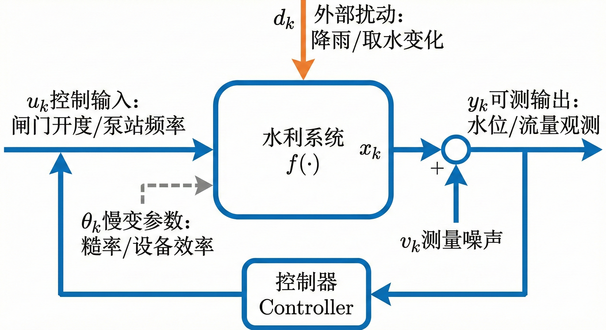
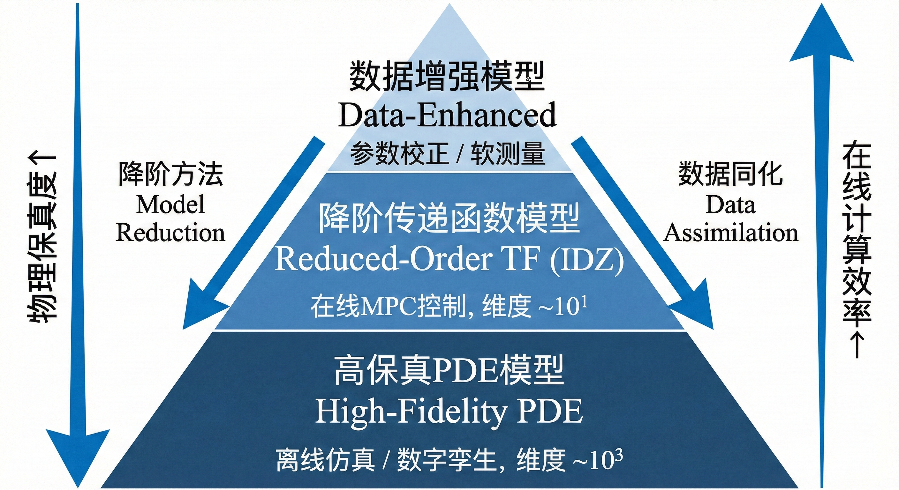
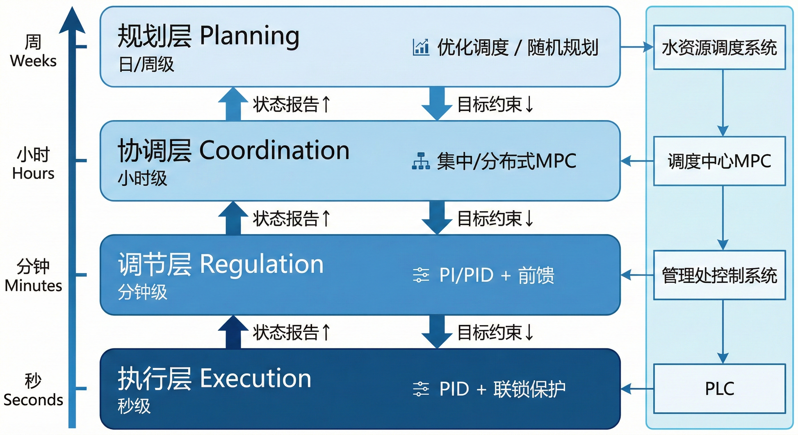
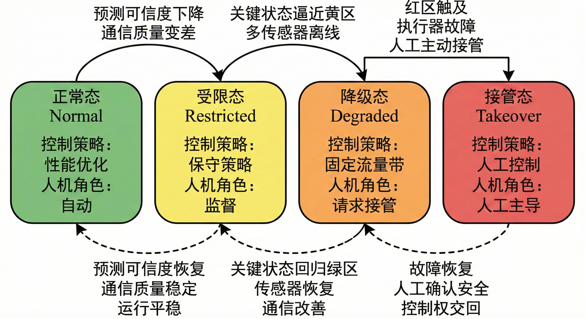
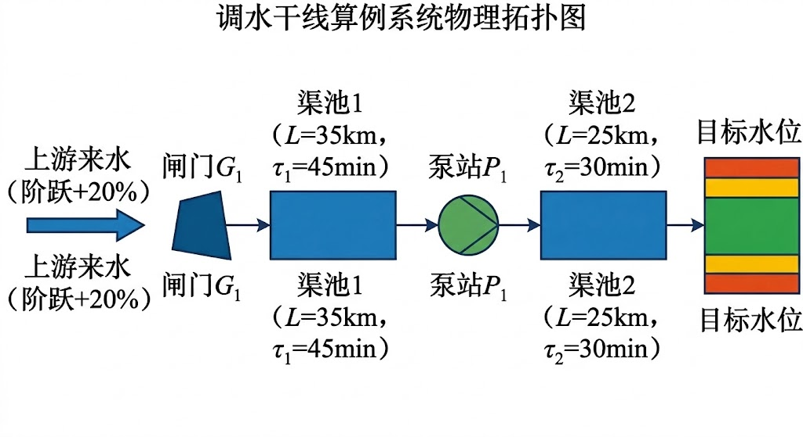
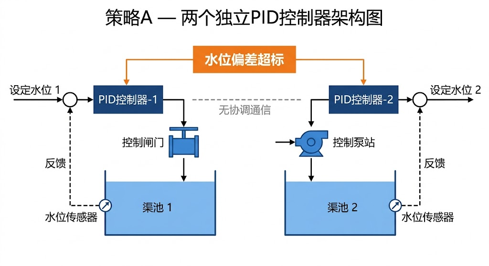
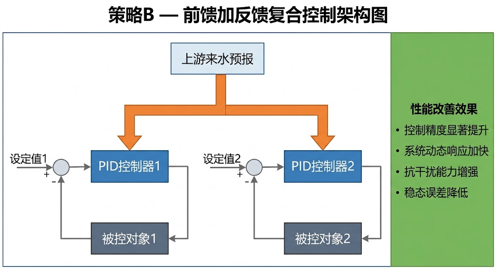
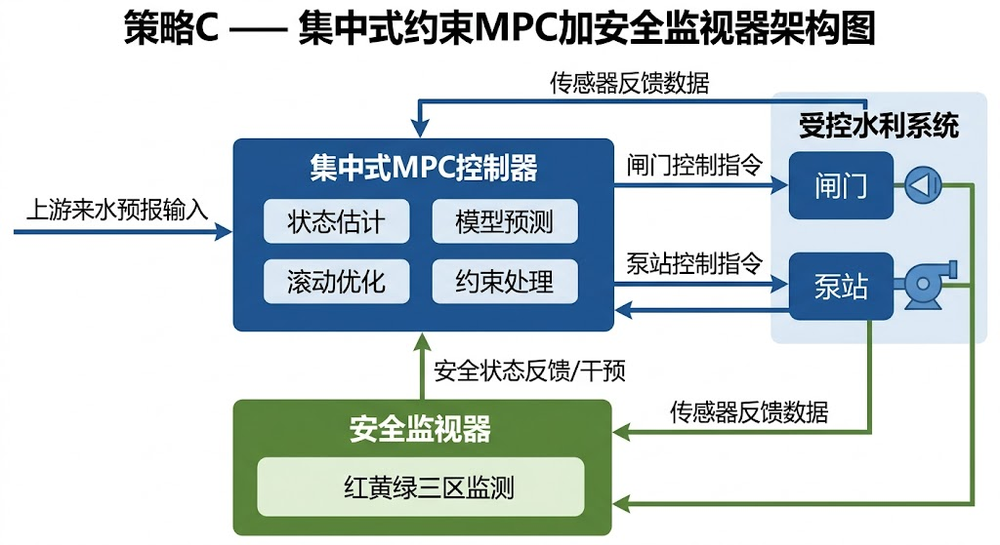

<!-- 变更日志
v9 2026-02-20: 恢复LaTeX公式源码+生成PDF渲染版本——GitHub仓库数学渲染不可用,md保留LaTeX作为源码,pdf为公式正确渲染的阅读版
v9 2026-02-20: 恢复LaTeX公式(`$ $`符号)+图占位符修复([图→>图)+docx渲染版
v8 2026-02-20: 去指向性处理——引导案例去除季节/地理/人物指纹(春季→高峰时段、融雪→天气变化、资深调度员→复盘会); §2.7四态机实例去除工程名称(胶东调水→某梯级泵站); §2.10去除"北方"; 引导案例明确标注"多工程综合提炼"
v7 2026-02-20: 二轮评审改进——(1)补增经典文献Wylie 1969[2-19]+Malaterre 1998[2-22]; (2)§2.5/§2.3.3/§2.2.4/§2.7增加"直觉铺垫"类比(暖气阀门/飞行包络/新手司机/电梯); (3)§2.6.4新增PINN/LLM前沿展望; (4)§2.6引入Malaterre分类法; (5)图2-1~2-4占位符升级为详细描述; (6)IDZ/四态机增加概念速览框; (7)术语表补充PINN/LLM
v6 2026-02-20: 四角色评审后修改——(1)修复跨章引用§1.3.2→§1.3.3; (2)修复Cantoni文献编号[2-16]→[2-19]; (3)全章引导案例回指(§2.3各节+§2.8+§2.10); (4)§2.7增加四态机工程实例; (5)§2.2.2增加IDZ概念速览框; (6)§2.4.3增加南水北调四层控制链工程映射; (7)§2.8算例对齐引导案例参数; (8)增加推荐阅读; (9)新增参考文献[2-19][2-22]; (10)Manning糙率段落拆分
v5 2026-02-20: 参照ch01_final质量标准全面重写——深化引导案例、补充控制论学科溯源(Wiener/钱学森/CHS)、强化工程数据支撑、统一跨章接口、完善参考文献体系
-->

# 第二章 控制论视角下的水系统

---

> **引导案例：一次"看得见风险、来不及控制"的联调失效**
>
> 这是一个由多条长距离调水干线的真实运行事件综合提炼的典型场景。某长距离调水干线遭遇"多工况叠加"考验：白天，沿线城市的取水进入高峰时段；夜间，下游灌区启动集中补水；与此同时，上游来水因天气变化呈现日内大幅波动。调度中心的SCADA大屏上，各监测断面的水位曲线、数十座闸门的开度数据、多座泵站的运行参数实时刷新——数据"齐全到位"。
>
> 然而，当天的联合调度仍然出现了三类问题。**第一，超调**——上游超前加大放水后，数十千米外的某下游断面在数小时后出现水位超调，峰值偏差逼近渠道设计超高的较高比例。**第二，振荡**——为抑制超调，调度员回调上游闸门，但由于水波传播时滞，回调效果尚未到达时下游已启动反向补偿，导致中游渠段水位出现持续数小时的往复振荡。**第三，设备疲劳**——为维持泵站出口水位稳定，部分泵站在一个工作班次内启停次数远超设计规范，综合能耗显著上升。
>
> 事后复盘揭示了一个关键事实：问题既不在"无人值守"——当班调度员全程在岗；也不在"设备不智能"——SCADA系统运行正常。真正的症结在于**系统缺乏统一的控制语言**。监测系统能回答"发生了什么"，但没有任何子系统能稳定回答"为什么会发生""当前动作何时生效、生效后偏移多少""下一步各节点应如何协同动作"。调度员只能凭经验反复试探，形成"动作—等待—观察—再动作"的开环模式。用复盘会上的话说："我们不缺数据，缺的是一套从数据到动作的翻译系统。"
>
> 上述场景并非个例。类似的"多工况叠加→多节点失协→系统性能恶化"模式，在国内外多个长距离调水、灌区配水和城市供水系统中反复出现。它揭示了一个贯穿全球水利工程运行的基本矛盾：**监测能力再强，若不转化为控制能力，系统依然是"睁眼盲飞"。** 本章的任务，正是要把水系统从"设备集合"转化为"可分析、可综合、可验证、可治理"的控制对象——用控制论的语言，为水利工程建立从"看得见"到"管得住"的理论桥梁。

**本章目标**：帮助读者建立用控制论语言分析水利系统的基本能力。本章从控制论的学科源流出发，将水利系统形式化为标准的控制对象，揭示水系统区别于一般工业过程的五个控制本质，阐述经典控制框架在水系统中的工程映射，并建立从控制方法选型到异常工况处置的完整工程框架。读完本章，读者应能回答三个问题：水系统作为控制对象有哪些独特特性？经典控制论的核心思想如何映射到水利工程？CHS在控制论学科谱系中处于什么位置？

---

> **本章阅读指引**
> 
> **适合读者**：控制论背景、水利工程背景、研究生
> 
> **与前章的关系**：本章基于第一章的"五代演进"和"范式转变"概念，用控制论语言重新审视水利系统。
> 
> **与后章的关系**：本章的形式化方法（状态空间、传递函数）是第三章八原理概览、第四章形式化描述和第十三章 HydroOS 的数学基础。
> 
> **核心概念**（5 个）：
> - 状态空间：x-u-d-y 四元组，描述系统动态
> - 传递函数：输入 - 输出关系的频域描述
> - 可控可观性：传感器和执行器布局的理论依据
> - IDZ 模型：积分延迟零点模型，渠道控制的降阶模型
> - 降阶路径：从圣维南方程到控制模型的两种方法
> 
> **直觉类比**：如果把水网比作交通系统，本章的状态空间相当于"车流密度 - 车速 - 入口匝道 - 出口匝道"的关系模型。
> 
> **可略读部分**（如已熟悉）：
> - §2.2.2：圣维南方程推导（水力学背景读者可略读）
> - §2.4：数学证明（了解结论即可）

---

> **[合规说明]**：关于工程落地、测试覆盖率量化指标与合规审查的详细要求，请参阅本丛书 **T3 卷《标准与工程治理》**。

## 2.1 控制论的学科源流与CHS的定位

### 2.1.1 从维纳到钱学森：控制论的两条主线

理解CHS的理论根基，需要回到控制论的两位奠基人。

1948年，诺伯特·维纳（Norbert Wiener）出版《控制论：或关于在动物和机器中控制和通信的科学》[2-1]，开创了控制论学科。维纳的核心洞见是：无论是生物神经系统、机器伺服系统还是社会组织，"通过反馈实现目标追踪"这一机制是共通的。维纳控制论的遗产是一套通用的数学语言——传递函数、反馈环路、稳定性判据——它使得不同领域的控制问题可以在同一框架下讨论。

1954年，钱学森出版《工程控制论》[2-2]，将控制论从纯理论推向工程实践。钱学森的独特贡献在于：他不是简单地将维纳的理论应用于工程，而是从工程系统的特殊性出发，发展了一套面向复杂工程系统的控制方法论。钱学森特别强调了三点：其一，工程系统的"被控对象"往往是非线性、时变、多变量的，不能简单套用线性理论；其二，工程控制必须考虑约束——物理极限、安全包络、经济成本——而非在无约束条件下追求理论最优；其三，大系统的控制必须分层——底层快速响应、上层全局协调——因为单一控制器无法同时兼顾速度和全局性。

这两条主线——维纳的"通用控制论"和钱学森的"工程控制论"——构成了CHS的双重理论根基。

### 2.1.2 CHS：面向水利基础设施的领域控制论

控制论诞生七十余年来，已在航空航天、化工过程、电力系统、机器人等领域催生了成熟的分支学科。航空航天领域的飞行控制理论、化工领域的过程控制理论、电力领域的电力系统自动化——每一个分支都是将通用控制论与特定领域的物理特性和工程需求相结合的产物。

然而，水利领域长期缺席这一进程。下表对比了控制论在各工程领域的发展情况：

**表2-1**

| **工程领域** | 控制论分支 | 发展标志 | 被控对象特征 |
|---------|-----------|---------|------------|
| **航空航天** | 飞行控制论 | 1950年代起 | 高速、强非线性、严格安全要求 |
| **化工过程** | 过程控制论 | 1960年代起 | 多变量、多约束、连续生产 |
| **电力系统** | 电力系统控制 | 1970年代起 | 大规模互联、实时平衡、高可靠性 |
| **机器人** | 机器人控制论 | 1980年代起 | 多自由度、人机交互、环境感知 |
| **自动驾驶** | 车辆自主控制 | 2010年代起 | 复杂环境感知、分级自主、安全验证 |
| **水利工程** | **CHS（水系统控制论）** | **2020年代起** | **大时滞、强耦合、强约束、公共安全属性** |

水利领域控制论发展滞后并非偶然。早在1969年，Wylie [2-19] 就率先将水锤瞬变分析中的特征线法（Method of Characteristics）引入明渠水流控制，这是水利控制领域的开创性工作。此后三十年间，Malaterre等 [2-22] 在1998年系统梳理了渠道控制算法的分类体系，成为后续研究的重要基准。然而，正如Litrico和Fromion [2-5] 在其经典著作《水力系统的建模与控制》中指出的，水力系统的分布参数特性（由偏微分方程描述）、长距离传播时滞和复杂的边界条件，使得经典控制理论的直接套用面临根本性困难。Cantoni等 [2-24] 在《Proceedings of the IEEE》上的综述也表明，直到21世纪初，国际灌溉渠道控制领域仍在努力解决"如何将经典控制方法适配到明渠系统"的基础问题。

CHS的定位是：**不是给水利"加一个算法层"，而是建立水利基础设施自主运行的领域控制论** [2-21]。它继承维纳控制论的数学语言（传递函数、反馈、稳定性），发扬钱学森工程控制论的系统方法（分层、约束、大系统分解），并针对水利系统的独特特性——大时滞、强耦合、强约束、公共安全属性——发展专门化的理论和方法。雷晓辉团队 [2-21] 进一步借鉴自动驾驶理念，系统提出了自主水网的概念、分层架构与关键技术路线 [2-25]。如果用一句话概括CHS与前辈学科的关系：**维纳给出了"反馈"的通用语言，钱学森给出了"工程系统"的控制方法论，CHS则将这两者具体化为"水利基础设施如何自主运行"的完整理论体系。**

### 2.1.3 从"建设优先"到"运行优先"：认知范式的转变

过去数十年，中国水利工程的发展主线是"建设优先、运行补齐"：先解决有没有，再解决好不好。这一战略在基础设施短缺时期是正确的——中国已建成各类水库约9.8万座、堤防约33万千米、有效灌溉面积约6,900万公顷 [2-3]，南水北调东中线、引江济淮、胶东调水等大型跨流域调水工程相继建成运行。工程规模世界领先，但运行管理水平与之不匹配——正如第一章所述，这一差距已成为制约水利现代化的核心瓶颈。

随着基础设施建设趋于成熟，认知范式必须转变：从"建设优先"转向"运行优先"。这一转变的驱动力，第一章已从宏观层面做了阐述（§1.3.3五重驱动力）。本节从微观的控制论视角，进一步揭示运行管理系统遭遇的四重瓶颈——引导案例中的调度失效正是这四重瓶颈的集中体现：

**目标多元化。** 供水、防洪、发电、生态、航运目标并存，且常常冲突。南水北调中线总干渠同时承担向沿线城市供水、向地下水超采区补水和维持生态基流的任务 [2-4]；梯级水电站在汛期面临发电效益与泄洪安全的尖锐矛盾，已有系统性研究回顾了梯级水库群联合调度的关键技术及其发展方向 [2-20]。传统的单目标调度规程无法处理这种多目标权衡——它需要一个能够同时表达和优化多个目标的数学框架。

**运行高频化。** 从传统的"班次调度"（每8小时一次决策）转向"分钟级滚动调度"。以长距离调水干线为例，梯级泵站每15分钟更新一次水位目标，闸门调节频率达到每5分钟一次。这意味着调度决策的时间窗口极大压缩，人工凭经验做出最优决策的能力受到根本挑战——它需要能够快速求解的自动控制算法。

**风险耦合化。** 极端天气事件频发、老旧设备退化与人为误操作叠加，形成复合风险。一个泵站的跳闸可能引发上游渠道水位急升，进而触发相邻闸门的连锁保护动作。这种"多米诺效应"在单体设备层面是不可见的——它需要从系统层面建立耦合模型才能预判和预防。

**责任显性化。** 监管要求从"结果合规"走向"过程可审计"。水利部近年推行的标准化管理体系要求调度决策有据可查、过程可追溯。这意味着不仅要知道"做了什么"，还要解释"为什么这样做""不这样做会怎样"——只有在控制论框架下才能系统地回答这些问题。

这四重瓶颈共同指向一个结论：水系统运行方法必须从经验驱动走向"模型—数据—规则"协同驱动。雷晓辉等 [2-23] 从水资源系统分析学科展望的角度，系统阐述了从静态平衡到动态控制的范式转变，为这一认知转型提供了学科层面的理论支撑。控制论为此提供的不是"一个算法"，而是一整套运行组织方法：首先，把复杂对象统一抽象为标准的数学结构，使得不同类型的水系统可以用同一套语言讨论；其次，把不确定过程纳入闭环反馈，使系统具备自动纠偏能力；最后，把安全包络内嵌到控制决策过程中，而非事后报警。

> 图2-1: 水系统状态—输入—输出—扰动框图。图示内容：中央方框标注"水利系统 $f(\cdot)$"，左侧输入箭头标注"$u_k$：闸门/泵站控制"，上方输入箭头标注"$d_k$：降雨/取水扰动"，右侧输出箭头标注"$y_k$：水位/流量观测"，底部虚线箭头标注"$\theta_k$：慢变参数（糙率/效率）"，输出端叠加噪声"$v_k$"。反馈回路从输出端经"控制器"方框返回输入端。整体布局采用经典控制框图风格。

---
## 2.2 水系统控制对象的形式化描述

### 2.2.1 状态—输入—输出—扰动四元组

控制论研究的第一步是将被控对象形式化。将水网表示为离散时间非线性系统：$$x_{k+1} = f(x_k, u_k, d_k, \theta_k) \tag{2-1a}$$

$$y_k = g(x_k, u_k) + v_k \tag{2-1b}$$

其中各变量的物理含义如下：

**表2-2**

| 符号 | 维度 | 物理含义 | 水利工程中的典型实例 |
|------|------|---------|-------------------|
| **$x_k$** |$\mathbb{R}^n$| 系统状态 | 库容、断面水位、管段流量、设备运行状态 |
| **$u_k$** |$\mathbb{R}^m$| 控制输入 | 闸门开度、泵组频率、阀位、调度指令 |
| **$d_k$** |$\mathbb{R}^p$| 外部扰动 | 降雨径流、来水变化、需求波动、突发取水 |
| **$\theta_k$** |$\mathbb{R}^q$| 慢变参数 | 渠道糙率、设备效率曲线、管道阻力系数 |
| **$y_k$** |$\mathbb{R}^l$| 可测输出 | 测站水位、超声波流量、泵站功率 |
| **$v_k$** | — | 测量噪声 | 传感器误差、通信丢包、数据畸变 |

以一段长距离明渠为例，若将渠道离散为 $N$ 个计算断面，则状态向量包含各断面的水位 $h_i$ 和流量 $Q_i$，维度为 $2N$。南水北调中线总干渠全长1,432千米，若按每千米一个计算断面离散，状态向量维度可达约2,800——这是一个远超常规工业控制系统的高维问题。相比之下，典型化工过程的状态维度在10到100之间，电力系统节点通常在数百量级。状态空间描述的完整形式化处理见第四章§4.2。

式(2-1)的核心意义在于：**把"运行经验"映射为"可计算结构"**。经验并不被否定，而是被形式化并进入可验证流程。一个调度员说"上游放水后，下游大约4个小时才有反应"，这句经验在控制论框架下对应着传递函数中的时滞参数 $\tau$。一位老调度员说"这个季节糙率会偏大，闸门要多开一些"，对应着慢变参数 $\theta_k$ 的季节性漂移和相应的控制增益补偿。形式化不是否定经验，而是让经验变得可传承、可验证、可计算。

### 2.2.2 从圣维南方程到控制模型：两条降阶路径

水系统形式化的物理基础是水力学基本方程。以明渠流为例，其动力学行为由一维圣维南方程（Saint-Venant equations）描述 [2-7]：$$\frac{\partial A}{\partial t} + \frac{\partial Q}{\partial x} = q_l \tag{2-2a}$$

$$\frac{\partial Q}{\partial t} + \frac{\partial}{\partial x}\left(\frac{Q^2}{A}\right) + gA\frac{\partial h}{\partial x} = gA(S_0 - S_f) + q_l v_l \tag{2-2b}$$

其中 $A$ 为过水断面面积，$Q$ 为流量，$h$ 为水深（注意：式(2-2b)中 $\partial h/\partial x$ 项配合右端 $S_0$ 项使用，此处 $h$ 严格指水深而非水面高程；若用水面高程 $z_s = z_b + h$，则 $\partial z_s/\partial x = S_0 + \partial h/\partial x$，底坡项已隐含），$q_l$ 为侧向入流，$S_0$ 为底坡，$S_f$ 为摩阻坡降。摩阻坡降通常由Manning公式计算：$$S_f = \frac{n^2 Q^2}{A^2 R^{4/3}}$$其中 $n$ 为Manning糙率系数，$R$ 为水力半径。糙率系数 $n$ 是一个看似简单但工程影响巨大的参数——它随水深、季节（水草生长）、淤积程度和衬砌老化而变化，正是§2.2.1中慢变参数 $\theta_k$ 的典型代表。

式(2-2)是双曲型偏微分方程(PDE)，精确求解需要沿空间和时间两个维度离散化，计算量巨大。以南水北调中线总干渠为例，若空间步长取100 m、时间步长取10 s，一次24小时仿真需要求解约14,320个空间节点×8,640个时间步的方程组——这对于离线仿真尚可接受，但对于需要在分钟级给出控制决策的在线控制系统而言，计算量过大。工程中通常采用两种路径将PDE转化为适合控制设计的低阶模型。

**路径一：空间离散化（高保真仿真模型）。** 将渠道沿程离散为若干"渠池"（pool，两个相邻控制闸之间的渠段），每个渠池用Preissmann四点隐式格式或有限体积法离散后成为一组常微分方程（ODE），即式(2-1)中状态转移函数 $f$ 的具体形式。这一路径保留了非线性特性和空间分布特性，适合高精度仿真，是构建数字孪生和SIL/HIL验证平台的基础（见第十一章）。其代价是维度高、在线计算量大，不宜直接用于实时控制。

**路径二：线性化降阶（控制设计模型）。

** 在稳态运行点附近将式(2-2)线性化，得到传递函数模型。Litrico和Fromion [2-5] 系统建立了明渠系统的积分延迟零点（Integrator-Delay-Zero, IDZ）传递函数模型：$$G(s) = \frac{Y(s)}{U(s)} = \frac{(1 + \tau_m s) \, e^{-\tau_d s}}{A_s \cdot s} \tag{2-3}$$

其中 $A_s$ 为回水区蓄水面积($\text{m}^2$)（反映渠池的蓄量效应——$A_s$ 越大，同等流量偏差引起的水位变化速率越慢，系统惯性越大），$\tau_d$ 为传输延迟（水流传播时间——上游调节后多久下游才开始响应），$\tau_m$ 为回水时间（反映初始逆响应特性——有些渠池在正向响应到达之前会先出现短暂的反向偏移）。这三个参数可以从渠池的几何尺寸（长度、底宽、边坡系数）、底坡和设计流量通过解析公式计算，无需试凑或反复整定。

IDZ模型在工程控制中具有极高的降维优势：它将一个渠池从成百上千维的PDE降阶为仅一维或两维的状态空间模型，使得模型预测控制（MPC）的在线求解成为可能。南水北调中线工程的自动控制策略 [2-4] 以及国内学者在灌溉渠道水位差预测控制 [2-6] 中的实践均以IDZ类传递函数为核心模型。Van Overloop [2-8] 在荷兰水系统中的大量实践进一步证实了IDZ模型在实际工程中的适用性。

> **概念速览：IDZ传递函数的三个参数**
>
> 对于非水利专业读者，IDZ模型可以用一个生活化的类比来理解。想象你站在一条很长的河流上游扔一块石头：$A_s$（回水区蓄水面积）对应"水塘有多大"——水塘越大，同一块石头溅起的水花越小，水位变化越慢；$\tau_d$（传输延迟）对应"波浪传到下游要多久"——河越长、流越慢，等待时间越长；$\tau_m$（回水时间）对应"波浪到达前水面是否先轻微下凹"——某些渠池几何形状会导致正向波到达前出现短暂的反向偏移。这三个参数完全由渠池的物理尺寸决定，不需要反复实验调整。

**可控模型族。

** 水系统不存在"一个模型打天下"的可能。高保真PDE模型适合离线仿真和场景验证，低阶传递函数模型适合在线控制，数据驱动模型适合参数校正和软测量。CHS提倡建立层次化的"可控模型族"（Controllable Model Family）：以高保真模型为根，通过严格的降阶方法派生控制模型，再用在线数据持续校准——形成"物理根模型→控制降阶模型→数据增强模型"的三层体系（见图2-2）。第十四章物理AI与认知AI引擎将详细阐述这一技术架构。

> 图2-2: 可控模型族的三层体系。图示内容：金字塔形三层结构。底层"高保真PDE模型"（标注：离线仿真/数字孪生，维度 $\sim 10^3$）；中层"降阶传递函数模型（IDZ等）"（标注：在线MPC控制，维度~10¹）；顶层"数据增强模型"（标注：参数校正/软测量）。层间用双向箭头连接，左侧标注"降阶方法"（下→中），右侧标注"数据同化"（上→中）。旁注：物理根保真度自下而上递减，在线计算效率自下而上递增。

### 2.2.3 三类约束：物理约束、操作约束、治理约束

水系统控制与一般工业控制的重要区别之一是约束的丰富性和刚性。CHS将约束分为三类，强调三类约束必须同构建模、同步处理（见表2-1）。

| **约束类型** | 来源 | 违反后果 | 工程实例 | 约束性质 |
|---------|------|---------|---------|---------|
| **物理约束** | 系统物理极限 | 不可逆后果 | 水位上下限（南水北调中线渠道设计超高仅0.6 m [2-4]）；流速边界（冲刷/淤积）；库容极限；闸门行程 | 刚性，不可松弛 |
| **操作约束** | 设备维护与运行安全 | 设备损伤或加速老化 | 泵组最小启停间隔（通常20-30分钟）；闸门每日调节次数上限；检修窗口期设备不可用 | 半刚性，特殊工况可临时放宽 |
| **治理约束** | 法律法规、协议、公共利益 | 违法或违约 | 生态下泄红线；供水服务协议（流量和水质承诺）；调度权限边界（省/地分权） | 刚性，不因经济优化而松弛 |

[表2-1: 水系统三类约束体系]

在传统工程实践中，前两类约束常被纳入优化器的硬约束或软约束，第三类则停留在制度文本中，由调度员"心中有数"但不进入算法。CHS强调三类约束同构建模：治理约束同样必须形式化为数学不等式并进入MPC的约束集。否则就会出现"算法最优但制度不可执行"的尴尬局面——控制器给出的"最优方案"被调度员否决，系统实质上退回到人工决策模式。引导案例中泵站频繁启停的问题，正是因为控制策略未将操作约束（启停次数上限）纳入优化器的显式约束。约束体系的完整分类和形式化处理见第四章§4.2.6。

### 2.2.4 运行设计域（ODD）在水系统中的定义

日常生活中有一个直觉类比：一个优秀的新手司机在白天的城市道路上可以安全驾驶，但你不会让他在暴风雪中走山路——不是因为他技术差，而是因为那超出了他经过训练和验证的"工作条件范围"。水系统的ODD正是这个意思：明确界定自主控制系统"在什么条件下可以放心工作"。

自动驾驶领域使用"运行设计域"（Operational Design Domain, ODD）来界定自动驾驶系统可以安全运行的条件范围 [2-9]。CHS将这一概念移植到水系统。参照WNAL分级框架，水系统ODD定义为五元组（形式化定义见第四章§4.2.7）：$$\text{ODD}=\{\mathcal{H},\mathcal{I},\mathcal{E},\mathcal{R},\mathcal{C}\} \tag{2-4}$$

**表2-4**

| **元素** | 含义 | 定义内容 | 工程实例 |
|------|------|---------|---------|
| **$\mathcal{H}$** | 水文气象范围 | 来水流量上下限、降雨强度、气温区间 | "适用于来水50-350 $\text{m}^3$/s、气温-5°C以上" |
| **$\mathcal{I}$** | 基础设施可用性 | 设备健康度、传感器在线率、通信可达率 | "SCADA传感器在线率≥95%，通信丢包率<5%" |
| **$\mathcal{E}$** | 外部需求环境 | 供水需求模式、灌溉季节、电网负荷 | "城市日供水量波动在±20%以内" |
| **$\mathcal{R}$** | 风险边界 | 风险等级、应急响应等级 | "非汛期、上游水库无泄洪风险" |
| **$\mathcal{C}$** | 控制能力边界 | 模型精度、算力资源、人工值守等级 | "IDZ模型经当前工况验证，控制周期<60s" |

ODD不是"附件说明"，而是自主运行的责任边界。超出ODD，系统必须降级或请求人工接管（详见§2.7四态机和第十章ODD形式化定义 [2-9]）。

---

## 2.3 水系统的五个控制本质

水系统作为控制对象，具有不同于一般工业过程的特殊性。这些特殊性不是"困难列表"，而是控制策略设计的出发点。理解它们，是选择正确控制方法的前提。下表给出了五个控制本质的概览，后续逐一展开。

**表2-5**

| 控制本质 | 核心描述 | 对控制策略的根本要求 | 关联CHS原理 |
|---------|---------|-------------------|-----------|
| 大时滞 | 决策有效性与响应可见性不同步 | 预测补偿，禁止基于当前偏差的冲动调节 | 原理一（传递函数化） |
| 强耦合 | 局部最优常导致全局次优 | 协调层设计，分布式优化 | 原理三（分层分布式） |
| 强约束 | 安全包络优先于性能最优 | 约束显式处理，安全一票否决 | 原理四（安全包络） |
| 强不确定 | 稳健性优先于单场景极值 | 鲁棒/自适应策略，安全裕度 | 原理五（在环验证） |
| 人机共治 | 技术正确不等于治理有效 | 可解释性，人机权限分配 | 原理七（人机共融） |

### 2.3.1 大时滞：决策有效性与响应可见性不同步

"时滞"是水系统控制面临的首要挑战，也是水系统区别于大多数工业控制系统的最显著特征。在长距离明渠中，上游闸门调节后，水位变化以明渠波速传播到下游，传播时间从数十分钟到数小时不等。南水北调中线总干渠全长1,432千米，从陶岔渠首到北京团城湖终端，水流传播时间约15天 [2-4]。即使是单个渠池（两个相邻控制闸之间的渠段），时滞也通常在30分钟到4小时之间。作为对比，化工过程的典型时滞在秒到分钟级，电力系统的频率调节时滞在秒级。

时滞的工程后果是严重的——引导案例中的三个问题，追根溯源都与时滞有关。当调度员根据当前水位偏差调整闸门后，效果不会立即显现。如果调度员在效果到达之前因"看不到变化"而追加调节量，就会形成"二次补偿过度"，导致目标断面出现大幅超调（引导案例中的"超调"问题）。超调又触发反向调节，形成持续振荡（引导案例中的"振荡"问题）。而振荡期间为维持泵站出口水位，泵组被迫频繁启停（引导案例中的"设备疲劳"问题），能耗显著上升。

在控制理论中，时滞系统的稳定性远比无时滞系统严苛。对于具有纯时滞 $\tau_d$ 的一阶积分系统 $G(s) = e^{-\tau_d s}/(A_s \cdot s)$，若采用比例控制，由Nyquist判据可得闭环稳定的充分必要条件是控制增益 $K < \frac{\pi A_s}{2\tau_d}$（其中 $A_s$ 为回水区蓄水面积）。这意味着时滞越大、蓄水面积越小，允许的控制增益越小，系统响应越慢。这解释了一个工程直觉：长渠道的水位控制"既不能太猛、也不能太慢"——太猛就振荡，太慢就跟不上扰动。

工程应对策略包括三种互补手段。第一是**预测补偿**——利用模型预测未来若干步的系统状态，将控制动作提前发出。MPC天然具备这一能力：它在每个控制周期内求解一个有限时域优化问题，预测时域覆盖时滞长度，从而"看见"当前动作的未来效果。Van Overloop [2-8] 在荷兰水系统中的实践表明，MPC相比纯反馈控制可将水位偏差减小60%以上。第二是**时滞在线辨识**——时滞参数并非固定不变（大流量时波速快、时滞短），在线辨识时滞变化并更新控制器参数是保持控制品质的关键。第三是**分段前馈**——在多闸联控系统中，将上游闸门的动作信息作为前馈信号传递给下游控制器，使下游提前"预知"上游的调节意图，缩短等效时滞。

### 2.3.2 强耦合：局部最优常导致全局次优

水系统本质上是多输入多输出（MIMO）系统：多个闸门、泵站、阀组共同作用于一个互联的水力网络。一个节点的控制动作会通过水力连接传播到相邻甚至远方的节点。引导案例中，上游闸门回调后下游泵站反向补偿导致中游振荡，正是耦合效应的典型表现——每个节点各自"合理"的响应叠加后，系统整体行为却失控。

以三个串联渠池为例，每池一个下游控制闸。若中间渠池为了稳定本池水位而关小闸门，则上游渠池水位将因流量受阻而升高，下游渠池水位将因来水减少而降低。三个渠池各自独立控制时，每个控制器都在"正确地"追踪本地目标，但系统整体出现"水位此升彼降"的振荡——Schuurmans等 [2-10] 最早系统分析了这一现象，将其命名为"交互不稳定"（interaction instability）。

交互不稳定的本质是信息不对称：每个局部控制器只看到自己渠池的状态，不知道相邻控制器在做什么。当所有控制器同时响应各自的偏差信号时，它们的动作在水力层面相互叠加、相互干扰，形成"你关我开、我关你开"的对抗循环。

解决耦合问题的核心思路是引入协调层。在分层控制架构（§2.4.3）中，协调层接收各局部控制器的状态信息，计算跨区域的流量分配方案，再下发给各局部控制器作为约束或参考轨迹。分布式模型预测控制（DMPC）是实现这一协调的有效工具：各局部MPC控制器通过信息交换实现协商，在保持分布式计算效率的同时逼近集中式优化的性能 [2-12]。

### 2.3.3 强约束：安全包络优先于性能最优

与许多工业过程控制不同，水系统控制的第一目标不是"更优"，而是"不越界"。水位越过堤顶就是漫溢事故，低于最低运行水位就可能导致气蚀或断流，流量低于生态红线就是违法行为。这些约束是硬约束——不允许以"平均意义上满足"来妥协，也不允许以"概率足够小"来辩解。引导案例中，水位超调峰值逼近渠道设计超高的较高比例，距离漫溢事故仅一步之遥——这说明现有的控制方式缺乏对安全包络的主动感知和预防机制。

CHS引入"安全包络"（Safety Envelope）概念（原理四，详见第七章§7.5），其设计灵感来自航空领域的"飞行包络保护"——民航客机的飞行控制系统会自动防止飞行员做出超出飞机结构强度或气动极限的操作，即使飞行员用力拉杆，飞机也不会超过允许的迎角。类似地，水系统安全包络将运行空间划分为三个区域：**绿区**（正常运行，性能优先）、**黄区**（接近边界，保守策略）和**红区**（触及极限，强制保护）。控制器的设计必须显式处理这三个区域。在绿区内，控制器追求性能最优（水位偏差最小、能耗最低）；进入黄区后，控制器自动收缩可操作域，采用更保守的参数；一旦触及红区，控制器切换到最小风险策略（固定流量带、保底水位带），无需等待人工确认。

这一设计哲学的工程含义简洁而深刻：**控制器不是"尽力而为"，而是"先保安全、再求最优"。** 在MPC框架中，这体现为将安全约束作为硬约束、性能目标作为目标函数——当二者冲突时，安全约束永远优先。

### 2.3.4 强不确定：稳健性优先于单场景极值

来水预报有误差，需求预测不准确，设备可能突发故障，传感器可能给出错误读数。水系统运行面对的不确定性是全方位的。

传统调度优化常以"典型年"或"设计工况"为基础，追求在特定场景下的最优解。这种做法的问题在于：最优解往往是"尖锐"的——它恰好利用了特定场景的所有信息，但对场景的偏离非常敏感。Milly等 [2-13] 在《Science》上的经典论文明确指出"水文平稳性已死"，传统基于历史水文统计的调度规则正在失去可靠性基础。一个在"50年一遇"来水条件下精心优化的调度方案，在实际遇到"30年一遇"来水时可能表现很差。

CHS强调控制性能评价应关注**跨场景稳定达标**，而非单次指标"最好看"。相应的控制策略形成一个方法梯度：鲁棒MPC在约束中考虑参数不确定范围，确保最坏情况下仍满足约束，代价是名义性能下降 [2-14]；随机MPC将不确定性建模为概率分布，在期望意义上优化性能，以概率约束保证安全；在线自适应通过递推最小二乘、卡尔曼滤波 [2-15] 等方法持续更新模型参数，使控制器适应变化工况。

工程选择准则是：不确定性可量化且有限时，优先采用鲁棒MPC；不确定性可建模为概率分布时，考虑随机MPC；不确定性来源不明时，依赖在线自适应并保持充分安全裕度。

### 2.3.5 人机共治：技术正确不等于治理有效

水系统是公共基础设施，其运行不仅是技术问题，也是治理问题。一个控制方案即使在数学上最优，如果调度员不理解、不信任、不愿执行，它就是无效的。引导案例复盘中的那句总结——"我们不缺数据，缺的是一套从数据到动作的翻译系统"——恰恰揭示了人机接口的缺失：系统没有将监测数据"翻译"为调度员能理解的控制建议。

这一特性要求水系统控制器具备"可解释性"（Explainability）：系统必须能够解释"为何建议此动作、风险在哪里、何时应接管"。CHS将此作为系统设计的内在要求（原理七"人机共融"），而非事后附加的"解释模块"。

人机共治在控制架构中体现为三个层次。第一是**信息层**——系统将关键状态、预测结果和约束余量以直观方式呈现给调度员，使其能够"一眼看懂"当前局势。第二是**建议层**——系统给出控制建议，并附带"如果不采纳会怎样"的对比分析，调度员可以选择接受、修改或否决。第三是**权限层**——明确哪些决策可以自动执行、哪些需要人工确认、哪些场景下人工可以否决自动系统。这一权限分配与WNAL等级直接相关：L2需要持续人工监控，L3仅在超出ODD时需要人工介入。

人机共治决定了CHS不仅是控制理论问题，也是运行治理问题。它要求控制系统设计者不仅懂算法，还懂制度设计和人因工程。

---
## 2.4 经典控制框架在水系统中的工程映射

### 2.4.1 开环、闭环与监督闭环

控制论中最基本的概念区分是开环控制与闭环控制。在水系统语境下，这一区分有着直接的工程含义。

**开环控制**指按预定规程操作，不根据实时反馈调整。典型场景是"按时间表放水"：早8点开闸至30%开度、午12点调至50%、晚8点关闸。这种方式适用于低波动、低风险、高度重复的简单任务，如固定灌溉轮次的渠道配水。其优势是实施简单、不依赖传感器，劣势是完全无法应对扰动——如果来水量变了、需水量变了、渠道工况变了，开环方案照样执行，结果可能是漫溢或断流。第一章§1.2.2描述的第一代"人工观测+经验调度"模式，本质上就是低频率的开环控制。

**闭环控制**引入传感器反馈，根据实际水位与目标水位的偏差自动调整控制动作。绝大多数现代水利自动化系统至少具备这一层能力。闭环控制的核心优势是"自动纠偏"——无论扰动来自何方，只要偏差产生，控制器就会做出相应的补偿动作。这使得系统能够在一定范围内应对预见和未预见的扰动。但闭环控制的一个隐患是：当控制器本身出现错误（如模型失准、参数漂移、软件缺陷）时，闭环反馈可能加速失稳——因为错误的控制动作产生错误的效果，错误的效果又被反馈给控制器，形成正反馈循环。

**监督闭环**是在闭环控制之外增加一个独立的"安全监视器"（Safety Monitor），持续评估闭环控制器的行为是否合理。如果监视器检测到异常（如控制器输出剧烈振荡、状态轨迹逼近红区、控制动作不合常理），它有权覆盖控制器的输出，强制切换到安全策略或请求人工接管。这一层对应CHS原理四"安全包络"和§2.7中的"四态机"。安全监视器的独立性至关重要：它不依赖于主控制器的模型和算法，而是基于独立的安全规则运行，类似于航空领域中"飞行包络保护"系统的设计哲学。

水系统的现实升级路径不是"开环→闭环"的一次跳变，而是"闭环+监督"的体系化升级。第十三章HydroOS架构中的"策略门禁+四态机"模块正是监督闭环的工程实现。

### 2.4.2 前馈—反馈—约束协同

在实际水系统控制中，前馈、反馈和约束处理通常需要协同工作，三者缺一不可。

**前馈**解决"提前量"问题。当扰动可以提前预知——通过来水预报或上游测量值传递——前馈控制器可以在偏差尚未出现之前就发出补偿动作。在水系统中，前馈的典型应用包括：将上游闸门调节信息传递给下游控制器（解耦前馈）、将气象或水文预报信息注入控制器（预报前馈）。前馈的优势是"先发制人"，劣势是完全依赖预报精度——预报不准时反而引入额外偏差。

**反馈**解决"偏差纠正"问题。无论前馈多么精确，模型误差和未预见的扰动总会导致实际状态偏离目标。反馈控制器根据偏差信号持续修正，保证系统最终收敛到目标。反馈的优势是"兜底"——不需要知道扰动的来源和大小，只要偏差存在就纠正。劣势是被动——必须等到偏差产生后才开始行动，在大时滞系统中响应滞后。

**约束处理**确保"不可逾越边界"。在MPC框架中，约束被直接纳入优化问题的求解过程：$$\min_{u_k, \ldots, u_{k+N-1}} \sum_{i=0}^{N-1} \left[ \|y_{k+i}-r_{k+i}\|_Q^2 + \|\Delta u_{k+i}\|_R^2 \right] \tag{2-5a}$$

约束条件：$$x_{k+i+1} = f(x_{k+i}, u_{k+i}, d_{k+i}), \quad x_{k+i} \in \mathcal{X}, \quad u_{k+i} \in \mathcal{U} \tag{2-5b}$$

其中 $r$ 为参考轨迹，$Q$ 和 $R$ 为权重矩阵，$\Delta u$ 为控制增量（引入增量惩罚可抑制控制动作的剧烈变化），$\mathcal{X}$ 和 $\mathcal{U}$ 为状态和输入的允许集合（包含§2.2.3中定义的三类约束）。

三者的协同关系可以概括为：前馈提供"先手"，反馈提供"兜底"，约束提供"护栏"。仅反馈将被时滞拖累；仅前馈受预测误差放大；无约束处理则性能看似好但安全不可托底——优化器可能给出越界的"最优"方案。三者缺一不可，共同构成完整的控制策略。

### 2.4.3 多时间尺度分层控制链

水系统的控制任务跨越从秒到周的多个时间尺度。试图用一个控制器同时处理所有时间尺度的任务是不现实的：秒级保护动作需要极低延迟，不能等待远程通信和全局优化；周级资源配置需要全局视野和大量计算，不能被秒级信号打断。解决方案是建立分层控制链，将任务分配到合适的层级。

CHS定义四层控制链，每层的职责、时间尺度、典型方法和关键接口如下表所示：

**表2-6**

| **层级** | 时间尺度 | 职责 | 典型控制方法 | 上下行接口 |
|------|---------|------|-----------|-----------|
| **执行层** | 秒级 | 设备闭环控制与保护联锁 | PID、限幅保护、急停联锁 | ↑报告设备状态；↓接收目标设定值 |
| **调节层** | 分钟级 | 单渠段/单泵站组的水位流量稳定 | PI/PID、小范围前馈 | ↑报告水位偏差；↓接收水位/流量目标 |
| **协调层** | 亚小时至小时级 | 跨区域流量分配与多目标平衡 | 集中/分布式MPC | ↑报告区域状态；↓接收流量分配方案 |
| **规划层** | 日/周级 | 水资源配置、检修计划、策略更新 | 优化调度、随机规划 | ↑汇总运行绩效；↓下发配置计划 |

> 图2-3: 多时间尺度分层控制链。图示内容：四层水平带状结构，自上而下为规划层（日/周级，浅蓝）→协调层（小时级，蓝）→调节层（分钟级，深蓝）→执行层（秒级，藏蓝）。各层之间用上行（状态报告↑）和下行（目标约束↓）箭头连接。每层右侧标注典型方法：规划层"优化调度/随机规划"、协调层"集中/分布式MPC"、调节层"PI/PID+前馈"、执行层"PID+联锁保护"。左侧时间轴从秒→周。最右侧以南水北调中线为例标注：执行层=PLC、调节层=管理处控制系统、协调层=调度中心MPC、规划层=水资源调度系统。

分层的核心价值是"把问题放到合适时间尺度求解"。上层向下层下发目标和约束（如"本渠段今日流量目标为XX $\text{m}^3$/s，水位上限为XX m"），下层向上层报告状态（如"当前水位XX m，偏差XX cm，设备健康"）。各层独立运行，通过目标-约束接口耦合，形成层级协调而非层级替代的关系。这一架构直接对应CHS原理三"分层分布式"（第七章§7.4将详细阐述）。

以南水北调中线工程为例说明四层控制链的工程映射：执行层由各闸站的PLC实现，负责闸门位置PID控制和泵组转速闭环，响应周期1-5秒；调节层由各管理处控制系统实现，负责管辖渠段内5-10个闸门的水位稳定，决策周期5-15分钟；协调层由调度中心MPC系统实现，负责全线64座节制闸的协调调度和1,432千米渠道的流量分配，决策周期15分钟至1小时 [2-4]；规划层由水资源调度系统实现，负责年度/月度供水计划编制和检修窗口编排，决策周期以日/周计。

实际工程中，分层架构的最大挑战不是单层设计，而是层间接口的一致性。如果协调层下发的流量分配方案超出了调节层控制器的能力范围（如要求的水位变化速率超过闸门物理调节速度），系统就会出现"上层理想化、下层做不到"的脱节。CHS要求层间接口必须包含"可行性约束"——上层在优化时必须考虑下层的物理能力边界。

---

## 2.5 可控可观性的工程判据

### 2.5.1 从理论判据到工程判据

在日常生活中，我们凭直觉理解"可控"和"可观"：如果你能通过调节暖气阀门来改变房间温度，那么温度对你而言是"可控"的；如果你能通过温度计读数知道当前温度，那么温度对你而言是"可观"的。但如果暖气管道堵了（阀门调了但温度不变），可控性就丧失了；如果温度计坏了（温度变了但你看不到），可观性就丧失了。水系统的可控可观性判断远比这个例子复杂，但本质是相同的：**在行动之前，必须确认"我调得动"（可控）和"我看得到"（可观）。**

可控性和可观性是控制系统设计的前提条件。Kalman [2-16] 在1960年给出了线性系统的经典可控可观性判据：系统可控当且仅当可控性矩阵满秩，可观当且仅当可观性矩阵满秩。这一判据在理论上是完美的，但在水利工程中面临两个现实困难。

第一，理论上"可控"不等于工程上"可实施"。一个状态在理论上可控，但如果需要将闸门开度调到极端位置（如从全关到全开）或需要数天才能完成控制——这种"可控性"在工程上是无意义的。第二，水利系统通常是非线性的，Kalman的线性判据只能在局部线性化意义上使用，且有效性随偏离线性化点的距离增大而下降。

CHS将可控可观性从理论判据扩展为工程实施判据，提出"可布设、可维护、可负担"三原则，并给出具体的工程规则。

### 2.5.2 可观性最低配置判据

关键断面与关键状态至少具备"双通道观测"之一：

**直接测量通道**——在关键断面部署在线水位计、流量计或压力传感器，实时获取状态值。这是最可靠的方式，但受限于传感器成本（一套高精度超声波流量计的安装成本约15-30万元）、安装条件（部分断面地形复杂不具备安装条件）和长期维护能力。

**模型估计通道**——通过状态估计器（如扩展卡尔曼滤波EKF或集合卡尔曼滤波EnKF [2-15]），利用邻近断面的测量值和水力模型推算未量测断面的状态。这种方式可以大幅减少传感器数量，但依赖模型精度，需要周期性校验。以南水北调中线为例，若全部关键断面均部署直接传感器，成本极高；通过在关键控制点（约每5-10千米一处）部署高精度传感器，辅以模型估计覆盖中间断面，可在保证可观性的同时将传感器成本降低约60%。

**工程硬规则**：若关键状态既不可直接测量又不可通过已验证模型估计，系统不得进入高等级自主运行（WNAL L3及以上）。这一规则将可观性判据与WNAL等级跃迁门槛直接关联——传感器覆盖率和模型验证范围是L2→L3跃迁的硬性前提。

### 2.5.3 可控性有效作用判据

每个关键控制目标必须对应至少一个"有效执行器路径"：从执行器动作到目标状态变化，存在明确的因果传递链路，且动作效果可在可接受时延内传导至目标状态。

**工程硬规则**：对于每个控制目标断面，需验证三项条件——(a) 存在至少一个上游执行器可以有效调节该断面水位或流量；(b) 从执行器到目标断面的传递时间在预测时域的可接受范围内（通常不超过预测时域的1/3，即留出2/3的时域用于观察效果和做出后续调整）；(c) 若控制路径存在单点失效风险（如唯一的控制闸门故障），应配备冗余路径或预置降级策略。

### 2.5.4 可验证性闭环判据

可验证性判据直接对接第七章原理五"在环验证"（详见第十一章）。任何控制策略上线运行前，至少完成三级验证：

**表2-7**

| **验证级别** | 名称 | 验证内容 | 环境要求 | 典型发现的问题 |
|---------|------|---------|---------|-------------|
| **MIL** | 模型在环 | 控制逻辑正确性 | 纯数学仿真 | 算法收敛性、约束处理错误、参数配置错误 |
| **SIL** | 软件在环 | 软件实现一致性 | 实际代码+高保真仿真器 | 代码缺陷、数值精度、通信接口错误 |
| **HIL** | 硬件在环 | 时序与接口可靠性 | 实际控制器硬件+实时仿真平台 | 控制周期不满足实时性、信号采集异常、应急联锁未触发 |

三级验证的核心价值不在于"证明控制器能工作"，而在于"系统地发现控制器在何种条件下会失效"。通过构建覆盖正常、异常和极端工况的场景库，在虚拟环境中暴露问题，远比在真实工程中"试错"安全和经济。雷晓辉团队 [2-21] 在胶东调水工程和南水北调中线工程中建立了完整的三级在环测试体系，并系统阐述了从MIL到PiL的在环验证方法论 [2-26]，为WNAL等级评估提供了可操作的验证方法。

---

## 2.6 控制方法族：选型原则与适用边界

水系统控制不存在"万能方法"。不同的控制方法有不同的适用范围、优势和局限。Malaterre等 [2-22] 在1998年提出了渠道控制算法的经典分类体系，按照控制变量（水位/流量）、反馈方向（上游/下游/远程）和控制逻辑（PID/最优/预测）三个维度对已有方法进行了系统梳理。CHS在此基础上进一步提倡根据任务特性、系统层级和运维能力选择合适的方法，并明确指出方法的边界条件。下表给出了主要控制方法的定位概览，后续逐一展开。

**表2-8**

| **方法** | 适用层级 | 核心优势 | 关键局限 | 典型应用场景 |
|------|---------|---------|---------|-----------|
| **PID** | 执行层、调节层 | 简单可靠，调试直观 | 不能处理耦合和约束，无前瞻能力 | 单闸门水位控制 |
| **LQR/LQG** | 调节层、协调层（基线） | 全局最优（线性二次），结构清晰 | 不能处理硬约束，线性假设 | 多渠池基线设计 |
| **MPC** | 协调层（主力） | 显式约束处理，多步预测，多目标 | 依赖模型精度，计算量大 | 跨区域多目标调度 |
| **数据驱动（RL/DL）** | 辅助层 | 灵活，不需精确模型 | 泛化边界不清，不可证安全 | 预报修正、软测量 |

### 2.6.1 PID：执行层的"稳态器"

PID控制器结构简单、参数直观、对模型依赖低，至今仍是全球绝大多数水利自动化系统的基础控制器。美国垦务局（USBR）在1991年的《渠道系统自动化手册》[2-17] 中详细记录了PID在灌溉渠道中的应用经验，该手册至今仍是灌区控制实践的重要参考。

PID的合理定位是**执行层和调节层**的"稳态器"：用于单闸门位置控制、单渠池水位稳定等局部单回路任务 [2-10]。在这些场景下，PID的快速响应和高可靠性是突出优势。然而，PID不宜承担跨区域多目标调度任务，原因有三：(a) PID是单输入单输出（SISO）结构，无法处理MIMO耦合；(b) PID不能显式处理约束——当水位接近上限时，PID不会主动减速，只能靠外部限幅保护来防止越界；(c) PID缺乏前瞻能力，无法补偿时滞。

### 2.6.2 状态空间与LQR/LQG

线性二次调节器（LQR）和线性二次高斯（LQG）控制基于状态空间模型设计，结构清晰、理论完备。在水系统中，LQR/LQG的典型应用是对线性化后的多渠池系统进行集中式控制器设计。Clemmens等 [2-11] 牵头制定了渠道控制算法的ASCE标准测试案例，为LQR等多种控制算法在水系统中的性能评价提供了基准平台。ASCE在2014年出版的《MOP 131》[2-18] 中系统总结了包括LQR在内的多种控制方法在灌区中的应用。

LQR/LQG的价值在于提供"控制器基线版本"——作为后续高级策略（如MPC）的性能参照基准。其局限是对非线性特性和硬约束处理能力不足：当系统偏离线性化点较远时，LQR的最优性保证丧失；当约束被激活时，LQR无法保证约束满足。

### 2.6.3 MPC：多约束、多目标、多变量任务的主力

模型预测控制（MPC）是当前水系统自动控制领域的主力方法 [2-14]。自Van Overloop [2-8] 将MPC系统应用于荷兰水系统以来，MPC已在相关文献、胶东调水 [2-6]、澳大利亚Murray-Darling流域等多项工程中得到验证。

MPC的核心优势在于三点。其一，**显式约束处理**——三类约束直接进入优化问题，控制器在"约束内最优"而非"无约束最优后截断"。这对于运行裕度小的水利系统（如南水北调中线渠道设计超高仅0.6 m）至关重要。其二，**多步预测**——通过模型预测未来若干步的系统行为，天然补偿时滞。预测时域的选择通常覆盖最大渠池时滞的1.5-2倍，确保控制器能够"看见"当前动作的全部影响。其三，**多目标权衡**——通过调整权重矩阵 $Q$ 和 $R$，灵活平衡安全、稳定、经济等多个目标。

MPC的局限也同样明确：(a) 依赖控制模型精度——模型失准时控制性能下降，严重失准可能导致约束违反；(b) 在线计算量大——特别是非线性MPC和大规模系统，需要高效的优化求解器；(c) 参数整定复杂——预测时域、控制时域、权重矩阵等参数需要工程经验和调试。需要特别说明的是，预测时域 $N_p$ 决定前瞻长度，控制时域 $N_c$（$N_c \leq N_p$）决定优化变量维度。二者功能不同：$N_p$ 应覆盖系统最大时滞以保证控制器能"看到"动作效果，$N_c$ 则通过限制自由度降低在线计算量并抑制控制动作的远期不确定性。

### 2.6.4 数据驱动方法：用于补偿，不宜替代安全主回路

近年来，强化学习（RL）、深度学习等数据驱动方法在水系统控制中受到关注。数据模型可用于：来水预报（LSTM等时序模型）、偏差修正（残差学习）、软测量（用间接测量推算难以直测的变量）。这些都是物理模型的有益补充。

两个值得关注的前沿方向是：物理信息神经网络（Physics-Informed Neural Networks, PINN）将物理方程嵌入神经网络的损失函数，使数据模型在满足物理规律的同时拟合观测数据——这在水力学模型参数校正和缺测区域状态估计中展现出潜力；大语言模型（LLM）在认知层面提供了新的可能性，如自然语言调度指令解析、运行日志智能分析和调度预案自动生成——这些能力与CHS原理七"人机共融"中的可解释性需求高度契合，第十四章将在"认知AI引擎"框架下进一步讨论。

但在当前技术成熟度下，CHS明确建议：**数据驱动方法应定位为"物理模型的增强层"，而非替代安全主回路。

** 原因有三：(a) 数据模型的泛化边界不清——训练数据覆盖的工况之外，模型行为不可预测，在高风险的水利场景中这是不可接受的；(b) 缺乏可证安全性——无法像MPC那样通过数学证明确保约束始终满足；(c) 可解释性不足——当前的"黑箱"模型难以满足人机共治和监管审计的要求（尽管PINN和LLM在可解释性上较传统黑箱模型有所改善，但尚未达到安全关键系统所需的严格标准）。

CHS推荐的"机理保底+数据增强"架构是：物理模型MPC作为主控制器保障安全基线，数据模型用于在线校正物理模型参数或提供辅助预报信息。第十四章物理AI与认知AI引擎的分层设计，正是这一思想的工程实现。

### 2.6.5 何时不应用复杂算法

工程最优不是"算法最先进"，而是"全寿命周期综合最优"。满足以下条件时，优先采用简化方案：目标单一且工况稳定（单闸门恒定水位控制，PID足矣）；运维团队能力不足以长期维护复杂模型（MPC需要定期校准模型参数和更新约束集）；算法收益不足以覆盖维护成本与风险暴露（PID已满足运行要求时，MPC的边际改善不抵模型维护的长期成本）。

这一原则体现了CHS"分级推进"的哲学：并非所有系统都需要达到L3自主运行。对于简单、低风险的子系统，L1（规则自动化）可能就是全寿命周期最优选择。

---
## 2.7 异常工况与降级运行：从"自动化"走向"可信自主"

自主运行系统区别于简单自动化系统的关键标志之一，是对异常工况的处理能力。一个形象的类比：自动扶梯只在正常工况下运行，一旦有人跌倒，它不会"自己想办法"——只能靠旁人按紧急停止按钮。而电梯则不同：它能检测超载、检测门夹物、在停电时自动平层开门——它具备"感知异常并安全应对"的能力。水系统的自主运行更接近后者：**系统必须知道自己的能力边界，能够在能力不足时主动降级，而非盲目坚持或突然崩溃。**本章引导案例中，调度系统在多工况叠加下表现失常，其深层原因正是系统缺乏"知道自己不行"的自我评估能力和"不行就降级"的安全退化机制。

CHS采用四态机（Four-State Machine）描述系统的运行模式迁移（见图2-4）。

> **概念速览：四态机的核心逻辑**
>
> 四态机回答一个根本问题：当自主系统遇到"超出预期"的情况时，应该怎么办？答案是四步有序退让——先缩小操作空间（受限态），再退守保底策略（降级态），最后交给人类（接管态）。每一步都有明确的触发条件和恢复条件，确保退让是"有序的"而非"崩溃的"。与此对应，恢复也是逐级的——不允许从接管态直接跳回正常态，必须逐级验证后恢复。

> 图2-4: 异常工况四态机状态迁移图。图示内容：四个圆角矩形状态节点——正常态（绿色）、受限态（黄色）、降级态（橙色）、接管态（红色）。迁移箭头及触发条件：正常→受限（预测可信度下降/通信质量变差）、受限→降级（关键状态逼近黄区/多传感器离线）、降级→接管（红区触及/执行器故障/人工主动接管）。恢复箭头（虚线）：接管→降级→受限→正常，各标注恢复条件。每个状态框内标注：控制策略（性能优化/保守策略/固定流量带/人工控制）和人机关系（自动/监督/请求接管/人工主导）。

**正常态（Normal）。** 在ODD内运行，控制器按最优策略滚动控制。所有传感器正常、模型预测可信度高（预测偏差在历史统计的95%置信区间内）、执行器响应正常。此时系统追求性能最优——水位偏差最小化、能耗最低化、多目标均衡。

**受限态（Restricted）。

** 触发条件包括：预测可信度下降（如来水预报与实际偏差连续3个周期超过阈值）、通信质量变差（SCADA丢包率上升至3%以上）、个别非关键传感器离线。系统自动收缩可操作域：降低控制增益（减小25-50%，避免过激反应）、增大安全裕度（黄区边界内移10-20%）、缩短预测时域（降低对模型远期预测的依赖）。这一状态的目标是"保持可控，等待恢复"。

**降级态（Degraded）。

** 触发条件包括：关键状态逼近黄区或红区边界（如水位距上限不足20 cm）、多个关键传感器同时离线（可观性低于最低配置要求）、控制器输出异常（如连续两个周期的控制动作超出合理范围）。系统切换到预设的保守策略：采用固定流量带（flow band，在基准流量±5%范围内稳定运行）、保底水位带，停止优化求解，仅维持基本安全。同时向调度员发出明确的接管请求，并在界面上显示"降级原因""建议动作""预计恢复条件"。

**接管态（Takeover）。

** 触发条件包括：人工主动接管（调度员按下接管按钮）、红区边界被触及（水位触及安全极限）、执行器硬件故障（闸门卡死、泵组跳闸）。人工接管关键动作，系统退为监测、告警和建议角色。控制权完全移交给调度员，但系统仍然持续提供状态显示、趋势预测和建议方案——接管态是"控制权移交"，而非"系统关机"。

四态机的设计遵循三条关键原则。第一，**每次迁移都必须有明确的触发条件和完整记录**。不允许"模糊降级"——系统必须能够解释"为什么从正常态切换到受限态"，记录触发时间、触发指标、当时的系统状态。这些记录构成监管审计和事后复盘的基础。第二，**迁移是可逆的**。从降级态恢复到受限态、从受限态恢复到正常态都有明确的恢复条件（如"模型预测偏差连续5个周期小于阈值且传感器全部恢复在线"）。系统不应"一旦降级就永不恢复"。第三，**接管态是设计好的安全机制，而非"系统失败"**。正如航空领域的"人工接管"是飞行安全的正常组成部分，水利系统的接管态也是自主运行能力的体现——它说明系统具备识别自身能力边界并主动退让的"自知之明"。

为防止状态抖动（即系统在两个相邻状态之间频繁来回切换），状态转换需满足两项防抖规则：其一，**滞回条件**——触发阈值与恢复阈值之间保留裕度 $\delta_h$，例如从正常态迁入受限态的触发阈值为预报偏差 $>15\%$，而从受限态恢复到正常态的恢复阈值为预报偏差 $<10\%$，二者之间的 $5\%$ 裕度即为 $\delta_h$；其二，**最小驻留时间**——系统进入某一状态后，必须驻留至少 $\Delta t_{\min} \geq 2T_s$（$T_s$ 为控制周期）方可迁移到相邻状态，防止单次瞬态扰动触发不必要的状态切换。

**四态机工程实例。** 为帮助读者直观理解四态迁移，以某梯级泵站调水系统的控制实践为例说明。该系统正常运行时，MPC控制器以15分钟为周期滚动优化泵站调度方案（正常态）。某日下午，上游来水预报系统因数据传输故障导致预报值连续3个周期偏差超过15%，系统自动将控制增益降低30%、安全裕度扩大，并在操作界面标注"预报可信度下降"（迁移至受限态）。30分钟后，预报偏差进一步增大至25%，且一个关键水位传感器同时报告通信超时，系统切换到保守固定流量带策略并向调度员发出接管请求（迁移至降级态）。调度员确认接管后（接管态），手动稳定泵站运行。1小时后传感器恢复在线、预报系统修复，系统经5个周期的"预测偏差<阈值"验证后，依次从接管态→降级态→受限态→正常态逐级恢复。全过程中，每次状态迁移的触发条件、时间戳和系统快照均被自动记录，供事后审计使用。

---

## 2.8 算例：单干线双断面协同控制的三种策略对比

为使上述理论具体化，以一个简化但典型的算例说明不同控制策略的效果差异。该算例保留长距离调水系统的核心特征（串联渠池、泵站联控、上游来水突变），通过定量对比揭示控制策略选择对系统行为的决定性影响。

> **算例性质声明**：本算例中的工程参数（渠池长度、时滞、控制精度等）和性能数据（偏差峰值、启停次数、能耗比例等）均为**说明性设定**，旨在揭示三种控制策略的典型行为差异，不对应特定工程的实测数据。参数量级参照多个调水工程的公开文献设定，具有工程合理性但不可直接引用为实测依据。

**场景设定。

** 某调水干线有两个串联渠池，上游闸门 $G_1$ 控制第一渠池出流，中游泵站 $P_1$ 位于第二渠池入口。渠池1长度35千米，渠池2长度25千米。控制目标为：(1) 下游断面水位跟踪误差最小（$|h - h_{ref}|  \lt  0.1$ m）；(2) 水位不越安全包络（$h_{min} \leq h \leq h_{max}$，安全裕度0.5 m）；(3) 泵组最小启停间隔不低于30分钟，且每8小时累计启停不超过6次（操作约束）；(4) 能耗最小。扰动场景为：上游来水在 $t=2$ h时阶跃增加20%。两渠池的传递时滞分别为 $\tau_1 = 45$ min和 $\tau_2 = 30$ min（由IDZ模型计算得到）。

> 纯物理结构图。上游来水（t=2h阶跃+20%）→ 闸门G1 → 渠池1（L=35km，τ₁=45min）→ 泵站P1 → 渠池2（L=25km，τ₂=30min）→ 下游断面（目标：$h_{\text{ref}}$±0.1m，安全包络：±0.5m）。

---

### 策略A：纯反馈（局部PID）

> 两个独立的PID控制器：PID-1（控制G1）和 PID-2（控制P1）。各自根据本地下游水位偏差独立调节，无协调。特点：部署简单，但响应滞后、易振荡。$G_1$ 和 $P_1$ 各配一个独立PID控制器，分别根据本地下游水位偏差调节。PID参数按Ziegler-Nichols法整定。

**表2-9**

| 性能指标 | 结果 | 评价 |
|---------|------|------|
| **水位偏差峰值** | 0.25 m | **超标2.5倍**（目标<0.1 m） |
| **振荡衰减时间** | 约4个周期（~6小时） | 偏长 |
| **泵组启停次数** | P1启停8次/8小时 | **超出操作约束**（限值6次） |
| **能耗偏高** | +30%（较正常工况） | 频繁调速导致 |
| **安全裕度最小值** | 0.25 m | 进入黄区 |

策略A的优势是部署快、维护简单、无模型依赖。适合作为系统降级态的保底策略——当MPC不可用时退回PID，至少保证不失控。

### 策略B：前馈+反馈

> 在策略A基础上增加前馈路径。上游来水预报信号分别前馈到 PID-1 和 PID-2，提前补偿扰动。特点：利用来水预报，响应更快，但依赖预报精度。

在策略A的基础上，将上游来水变化作为前馈信号注入 $G_1$ 和 $P_1$ 的控制器，前馈增益根据IDZ模型的稳态流量—水位关系设计：由于IDZ传递函数含积分环节 $1/s$，不存在有限静态增益，前馈补偿量按"单位阶跃流量扰动在预测时域内引起的水位变化量"整定，即 $\Delta u_{ff} = -\Delta Q_d / \alpha$，其中前馈增益 $\alpha$ 为执行器开度-流量特性的局部斜率（参见第四章引理4-1），即 $\alpha = \partial Q / \partial u |_{u_0}$，单位为 $\text{m}^3/\text{s}$ 每单位开度。

**表2-10**

| 性能指标 | 结果 | 较策略A改善 |
|---------|------|-----------|
| **水位偏差峰值** | 0.12 m | 降低52% |
| **振荡衰减时间** | 约2个周期（~3小时） | 缩短50% |
| **泵组启停次数** | P1启停5次/8小时 | 减少37% |
| **能耗偏高** | +12% | 改善18个百分点 |
| **安全裕度最小值** | 0.38 m | 始终在绿区 |

策略B响应显著改善。但当来水预报偏差大于15%时，前馈反而可能引入额外扰动，出现短时越界风险——前馈的有效性严重依赖预报精度。

### 策略C：约束MPC+安全监视器

> 一个集中式MPC控制器同时接收两个渠池的水位反馈和上游来水预报，协调控制 G1 和 P1。预测时域2小时，包含约束处理和安全监视器。特点：全局协调、预测控制、最优性能。

采用集中式MPC，同时控制 $G_1$ 和 $P_1$，预测时域覆盖2小时（大于最大时滞 $\tau_1 + \tau_2 = 75$ min），约束集包含水位上下限、泵组最小启停间隔（30 min）且每8小时累计不超过6次、以及闸门调节速率限制。安全监视器独立运行，监测水位轨迹与安全包络的距离，在逼近黄区时自动收紧约束。

**表2-11**

| 性能指标 | 结果 | 较策略A改善 |
|---------|------|-----------|
| **水位偏差峰值** | 0.06 m | 降低76% |
| **振荡** | 无振荡 | 根本消除 |
| **泵组启停次数** | P1启停2次/8小时 | 减少75% |
| **能耗偏高** | +3% | 改善27个百分点 |
| **安全裕度最小值** | 0.44 m | 始终在绿区深处 |
| **安全监视器触发** | 未触发 | — |

策略C在所有指标上均优。MPC通过预测模型"看到"来水增加后未来2小时的水位变化趋势，协同调节 $G_1$ 和 $P_1$ ，提前发出平滑的补偿动作，避免了事后追赶导致的超调和振荡。泵组调速平滑，启停次数大幅减少，设备寿命得到保护。代价是需要维护渠池传递函数模型、在线求解优化问题（计算周期约3秒）和配置安全监视器参数。

**工程结论。** 若任务风险等级高（如供水干线），应优先选择策略C（约束MPC+安全监视器），其初始投入虽高，但长期运行的安全性和经济性最优。若任务简单稳定且运维能力有限，策略B（前馈+反馈）配合人工值守是务实选择。策略A（纯PID）适合作为执行层的基础控制器和降级态的保底方案。三种策略不是相互排斥，而是在分层架构中各有定位——正如§2.6.5所述，关键是"把方法放到合适的位置"。

**对照引导案例。

** 引导案例中的调度系统实质上采用的是"策略A+"——有SCADA但无协调层MPC，有人工经验但无模型预测，有报警但无安全包络。从算例对比可见，策略A的典型表现（超调显著、持续振荡、启停频繁、能耗偏高）与引导案例中实际观察到的三类问题在模式上高度一致。差异在于引导案例的多工况叠加比算例更严峻，因此实际恶化程度更大。这一对比说明：引导案例的失效不是"运气差"，而是缺乏正确控制策略的必然结果。

---

## 2.9 控制绩效评价体系：从"精度"扩展到"治理"

传统的控制性能评价聚焦于"精度"（水位偏差、流量误差），但这只是评价的一个维度。一个水位控制精度很高但频繁触发泵站启停的系统，在设备寿命和能耗方面可能表现很差；一个各项技术指标达标但调度员看不懂、审计查不清的系统，在治理维度上是不合格的。CHS提出五维评价体系，将技术性能与运行治理统一到一个框架内（见表2-2）。

| 维度 | 关键指标 | 工程含义 | 权重逻辑 |
|------|---------|---------|---------|
| **安全** | 越界次数、最小安全裕度、红区停留时长 | 系统是否守住底线 | **一票否决**——安全不达标则整体不达标 |
| **稳定** | 超调量、恢复时间、振荡次数 | 系统是否稳态可控 | 基本要求——稳定是性能优化的前提 |
| **经济** | 单位输水能耗、启停频次、维护工时 | 系统是否可持续运行 | 在安全前提下优化 |
| **服务** | 供水达标率、生态下泄达标率 | 是否满足公共目标 | 刚性约束——对应治理约束 |
| **治理** | 告警有效率、接管响应时长、审计完整性 | 是否可监管可追责 | 自主等级越高，要求越严 |

[表2-2: CHS五维控制绩效评价体系]

该体系与WNAL等级绑定，形成"等级—能力—指标—责任"闭环。例如：L2级系统的安全指标要求为"红区停留时长零容忍，黄区停留时长<5%运行时间"，治理指标要求为"所有控制动作均有日志记录"。L3级系统在此基础上增加"ODD内自动恢复时间<30分钟""降级迁移记录完整率100%""调度员接管响应时长<2分钟"等要求。

五维评价不仅用于系统上线后的性能监测，也是SIL/HIL验证的评判标准（第七章原理五）和WNAL等级跃迁的考核依据（第十章）。回到本章算例：策略A在"安全"维度勉强达标（进入黄区但未越界），在"经济"维度不达标（能耗偏高30%、启停频繁），在"稳定"维度不达标（振荡6小时）；策略C在五个维度全部达标，且各维度均有充分余量。

---
## 2.10 本章小结与后续章节衔接

回到引导案例：那条调水干线的联调失效，用本章的框架可以给出精确的诊断——系统缺乏传递函数模型（无法预判时滞效应，导致超调和振荡）、缺乏耦合协调层（各节点独立响应导致交互不稳定）、缺乏约束显式处理（操作约束未进入控制逻辑，导致泵站过度启停）、缺乏四态机（系统在性能恶化时无法自动降级，只能依赖人工试探）。如果该系统配备了§2.8策略C所描述的约束MPC+安全监视器架构，引导案例中的三类问题均可避免或大幅缓解。

本章完成了三件事。

第一，将水系统形式化为可计算控制对象。通过式(2-1)至式(2-4)，建立了状态—输入—输出—扰动四元组、三类约束体系和ODD五元组，为后续所有控制策略设计提供了统一的数学语言。特别阐述了从圣维南方程到IDZ传递函数的两条降阶路径，解决了"高保真模型无法在线求解"的工程矛盾，并提出了"可控模型族"的层次化建模思想。

第二，揭示了水系统的五个控制本质——大时滞、强耦合、强约束、强不确定、人机共治——并给出了每个本质对应的控制策略设计指导。这五个本质不是"困难清单"，而是CHS理论设计的出发点。同时，通过追溯维纳控制论和钱学森工程控制论的学科源流，明确了CHS在控制论学科谱系中的定位：面向水利基础设施自主运行的领域控制论。

第三，建立了从开环/闭环/监督闭环的控制架构、前馈—反馈—约束协同的控制策略、多时间尺度四层控制链、控制方法族选型准则、异常工况四态机到五维绩效评价的完整工程框架。通过算例定量对比了三种策略的效果差异，给出了方法选型的工程准则。

本章的理论框架与第七章八原理的对应关系如下：

**表2-13**

| 本章内容 | 对应CHS原理 | 衔接说明 |
|---------|-----------|---------|
| §2.2.2 IDZ传递函数与可控模型族 | 原理一"传递函数化" | 第七章将给出传递函数化的完整工程规则和验收标准 |
| §2.5 可控可观性工程判据 | 原理二"可控可观性" | 第七章将扩展为包含冗余设计的完整判据体系 |
| §2.4.3 多时间尺度分层控制链 | 原理三"分层分布式" | 第七章将给出层间接口规范和协调协议 |
| §2.3.3 安全包络与§2.7 四态机 | 原理四"安全包络" | 第七章将详细定义绿/黄/红三区的数学边界 |
| §2.5.4 MIL/SIL/HIL三级验证 | 原理五"在环验证" | 第七章将建立场景库构建方法和通过准则 |
| §2.6.4 数据驱动方法的定位 | 原理六"认知增强" | 第七章将阐述认知AI与物理AI的融合架构 |
| §2.3.5 人机共治与可解释性 | 原理七"人机共融" | 第七章将定义各WNAL等级的人机权限分配 |
| §2.9 五维绩效评价驱动持续改进 | 原理八"自主演进" | 第七章将给出绩效评价驱动ODD扩展的方法 |

下一章将逐条展开八原理，给出从理论主张到工程规则的可复用模板。

---

## 思考题

**L1（概念理解）**

1. 解释水系统控制中"三类约束"（物理约束、操作约束、治理约束）的区别，并各举一个工程实例。为什么CHS强调三类约束必须"同构建模"？试结合引导案例中泵站频繁启停的问题进行分析。

2. 运行设计域（ODD）的五个组成元素是什么？试选择一个你熟悉的水利工程场景（如某灌溉渠道或城市供水管网），为其定义一个具体的ODD。提示：需要给出每个元素的具体数值或范围。

**L2（分析比较）**

3. 对比开环控制、闭环控制和监督闭环的适用场景与局限性。为什么水系统的升级路径是"闭环+监督"而非简单的"开环→闭环"？试从安全性角度解释监督闭环中安全监视器"独立性"的必要性。

4. 对于一条全长200 km、最大渠池时滞约6小时的调水干线，分析PID控制器和MPC控制器各自的优劣势。该系统的最低WNAL等级需要达到多少才适合采用MPC？你的判断依据是什么？

**L3（综合设计）**

5. 某城市供水系统包含3座水源水库、5座泵站和覆盖市区的管网。试设计该系统的四层控制链（执行层、调节层、协调层、规划层），并说明每层的控制对象、控制方法、决策周期和关键接口。进一步分析：如果5号泵站突发故障，四态机应如何响应？从哪个状态迁移到哪个状态？恢复条件是什么？

6. 本章§2.8的算例中，策略C（约束MPC+安全监视器）在所有指标上优于策略A（纯PID）和策略B（前馈+反馈）。但假设运维团队只有2名技术人员，且不具备模型校准能力。在此约束下，你会推荐哪种策略组合？请说明理由，并给出向策略C升级的前置条件清单。

---

## 本章术语清单（与全书统一）

**表2-14**

| **术语** | 英文 | 定义 | 首次出现 |
|------|------|------|---------|
| **被控对象** | Plant | 控制系统中被施加控制作用的物理系统 | §2.2.1 |
| **状态向量** | State Vector | 描述系统当前状况的最小信息集合 | §2.2.1 |
| **圣维南方程** | Saint-Venant Equations | 描述一维非恒定明渠流的偏微分方程组 | §2.2.2 |
| **IDZ模型** | Integrator-Delay-Zero Model | 明渠渠池的低阶传递函数模型 | §2.2.2 |
| **可控模型族** | Controllable Model Family | 层次化的模型体系：高保真→降阶→数据增强 | §2.2.2 |
| **三类约束** | Three-Category Constraints | 物理约束、操作约束、治理约束的统称 | §2.2.3 |
| **ODD** | Operational Design Domain | 自主运行系统可以安全工作的条件范围 | §2.2.4 |
| **安全包络** | Safety Envelope | 将运行空间划分为绿/黄/红三区的边界体系 | §2.3.3 |
| **四态机** | Four-State Machine | 正常→受限→降级→接管的运行模式迁移机制 | §2.7 |
| **MPC** | Model Predictive Control | 基于模型预测的滚动优化控制方法 | §2.6.3 |
| **DMPC** | Distributed MPC | 分布式模型预测控制 | §2.3.2 |
| **MIL/SIL/HIL** | Model/Software/Hardware-in-the-Loop | 三级在环验证方法 | §2.5.4 |
| **WNAL** | Water Network Autonomy Level | 水网自主等级（L0-L5） | §2.2.4 |
| **物理AI** | Physical AI | 机理模型主导的智能控制能力 | §2.6.4 |
| **认知AI** | Cognitive AI | 语义理解、推理与解释能力 | §2.6.4 |
| **PINN** | Physics-Informed Neural Networks | 将物理方程嵌入神经网络训练的混合建模方法 | §2.6.4 |
| **LLM** | Large Language Model | 大语言模型，用于认知推理与人机交互 | §2.6.4 |
| **五维评价** | Five-Dimension Evaluation | 安全/稳定/经济/服务/治理的绩效评价框架 | §2.9 |

---

## 推荐阅读

**控制论基础**：维纳的《控制论》[2-1] 和钱学森的《工程控制论》[2-2] 是控制论学科的两部奠基之作。对于希望系统学习经典控制理论的读者，Camacho和Bordons的《Model Predictive Control》[2-14] 提供了MPC方法的完整理论框架。

**水力系统控制**：Litrico和Fromion的《Modeling and Control of Hydrosystems》[2-5] 是水力系统控制领域最重要的专著，系统建立了从圣维南方程到传递函数模型的数学框架。ASCE的《MOP 131: Canal Automation for Irrigation Systems》[2-18] 则是灌溉渠系控制工程实践的权威指南。

**CHS理论体系**：雷晓辉团队 [2-21] 提出了CHS的理论框架和研究范式。本书的后续教材——《水系统控制论：建模与控制》和《水系统控制论：智能与自主》——将分别深入展开物理AI引擎和认知AI引擎的理论与实践。

---

## 本章参考文献

[2-1] Wiener N. Cybernetics: or Control and Communication in the Animal and the Machine [M]. Cambridge: MIT Press, 1948.

[2-2] 钱学森. 工程控制论 [M]. 北京: 科学出版社, 1954.

[2-3] 中华人民共和国水利部. 中国水利统计年鉴 2022 [M]. 北京: 中国水利水电出版社, 2023.

[2-4] 王浩, 雷晓辉, 尚毅梓. 南水北调中线工程智能调控与应急调度关键技术 [J]. 南水北调与水利科技(中英文), 2017, 15(2): 1-8.

[2-5] Litrico X, Fromion V. Modeling and Control of Hydrosystems [M]. London: Springer, 2009.

[2-6] Kong L, Lei X, Wang H, et al. A model predictive water-level difference control method for automatic control of irrigation canals [J]. Water, 2019, 11(4): 762. DOI:10.3390/w11040762.

[2-7] Chaudhry M H. Open-Channel Flow [M]. 2nd ed. New York: Springer, 2008.

[2-8] Van Overloop P J. Model Predictive Control on Open Water Systems [D]. Delft: Delft University of Technology, 2006.

[2-9] SAE International. Taxonomy and Definitions for Terms Related to Driving Automation Systems for On-Road Motor Vehicles: SAE J3016 [S]. Warrendale: SAE International, 2021.

[2-10] Schuurmans J, Hof A, Dijkstra S, et al. Simple water level controller for irrigation and drainage canals [J]. Journal of Irrigation and Drainage Engineering, 1999, 125(4): 189-195.

[2-11] Clemmens A J, Kacerek T F, Grawitz B, et al. Test cases for canal control algorithms [J]. Journal of Irrigation and Drainage Engineering, 1998, 124(1): 23-30.

[2-12] Negenborn R R, Van Overloop P J, Keviczky T, et al. Distributed model predictive control of irrigation canals [J]. Networks and Heterogeneous Media, 2009, 4(2): 359-380.

[2-13] Milly P C D, Betancourt J, Falkenmark M, et al. Stationarity is dead: whither water management? [J]. Science, 2008, 319(5863): 573-574.

[2-14] Camacho E F, Bordons C. Model Predictive Control [M]. 2nd ed. London: Springer, 2007.

[2-15] Evensen G. Data Assimilation: The Ensemble Kalman Filter [M]. 2nd ed. Berlin: Springer, 2009.

[2-16] Kalman R E. On the general theory of control systems [C]//Proceedings of the First International Congress on Automatic Control. Moscow, 1960: 481-492.

[2-17] Buyalski C P, Ehler D G, Falvey H T, Rogers D C, Serfozo E A. Canal Systems Automation Manual, Volume 1 [M]. Denver: U.S. Department of the Interior, Bureau of Reclamation, 1991.

[2-18] ASCE Task Committee on Recent Advances in Canal Automation. Canal Automation for Irrigation Systems: ASCE Manuals and Reports on Engineering Practice No. 131 [M]. Wahlin B, Zimbelman D, eds. Reston: ASCE, 2014.

[2-19] Wylie E B. Control of transient free-surface flow [J]. Journal of the Hydraulics Division, ASCE, 1969, 95(1): 347-361.

[2-20] 王浩, 王旭, 雷晓辉, 等. 梯级水库群联合调度关键技术发展历程与展望 [J]. 水利学报, 2019, 50(1): 25-37.

[2-21] 雷晓辉, 龙岩, 许慧敏, 等. 水系统控制论：提出背景、技术框架与研究范式[J]. 南水北调与水利科技(中英文), 2025, 23(04): 761-769+904.

[2-22] Malaterre P O, Rogers D C, Schuurmans J. Classification of canal control algorithms [J]. Journal of Irrigation and Drainage Engineering, 1998, 124(1): 3-10.

[2-23] 雷晓辉, 许慧敏, 何中政, 等. 水资源系统分析学科展望：从静态平衡到动态控制[J]. 南水北调与水利科技(中英文), 2025, 23(04): 770-777.

[2-24] Cantoni M, Weyer E, Li Y, et al. Control of large-scale irrigation networks [J]. Proceedings of the IEEE, 2007, 95(1): 75-91.

[2-25] 雷晓辉, 苏承国, 龙岩, 等. 基于无人驾驶理念的下一代自主运行智慧水网架构与关键技术[J]. 南水北调与水利科技(中英文), 2025, 23(04): 778-786.

[2-26] 雷晓辉, 张峥, 苏承国, 等. 自主运行智能水网的在环测试体系[J]. 南水北调与水利科技(中英文), 2025, 23(04): 787-793.

## 本章小结

本章从控制论视角重新审视水系统，揭示了水系统与经典控制论之间的深层映射关系，主要介绍了以下内容：

- 水系统可被抽象为状态空间模型，渠道水位、流量等物理量对应于系统状态变量，闸门开度、泵站转速对应于控制输入
- IDZ（积分时滞）模型是描述长距离输水渠道动态特性的核心工具，将分布参数圣维南方程转化为适合控制器设计的集总参数传递函数
- 四态机框架（正常态、预警态、应急态、恢复态）为水系统的运行模态管理提供了形式化描述，是WNAL分级的理论基础
- 水系统的控制挑战根源在于大时滞、分布参数、强非线性与多扰动输入的共同作用，传统单站闭环无法满足全网协同需求
- 建立统一控制语言——从"数据到动作的翻译系统"——是解决多工况叠加问题的根本途径

## 习题

1. 试用状态空间方程 $\dot{x} = Ax + Bu$ 描述一段明渠的水力过程，说明状态变量、控制输入和扰动输入分别对应的物理量，并分析矩阵 $A$ 的物理意义。

2. IDZ模型将渠道的分布参数特性近似为积分加时滞环节 $G(s) = \frac{K e^{-\tau s}}{s}$。试推导参数 $K$（增益）和 $\tau$（时滞）与渠道物理参数（长度、正常水深、底坡、糙率）之间的近似关系，并分析其适用条件。

3. 某长距离调水干线由5段渠道串联组成，每段均可用IDZ模型描述，各段时滞分别为 $\tau_1, \tau_2, ..., \tau_5$。若上游突然增加放水量 $\Delta Q$，试分析该扰动到达最下游断面的传播过程，并说明为何不能采用简单的"逐站反馈"策略来控制各断面水位。

4. 根据四态机框架，若某渠道系统当前处于"预警态"（水位超出绿区但未进入红区），试设计一套状态转移判据：包括向"正常态"回退的条件和向"应急态"升级的条件，并说明各判据背后的工程逻辑。

5. 引导案例中的联调失效揭示了三类问题：超调、振荡、设备疲劳。试从控制论角度分析这三类问题的根本成因，并针对每类问题提出一种基于现代控制理论的改进措施。

6. 比较"数据驱动"与"模型驱动"两种控制策略在水系统中的适用场景、优缺点及互补关系，结合本章的IDZ模型与机器学习预测，讨论两者融合的可能途径。

## 参考文献

[1] CHAUDHRY M H. Open-channel flow[M]. 2nd ed. New York: Springer, 2008. (DOI: 10.1007/978-0-387-68648-6)

[2] CUNGE J A, HOLLY F M, VERWEY A. Practical aspects of computational river hydraulics[M]. Boston: Pitman Advanced Publishing Program, 1980.

[3] ABBOTT M B, IONESCU F. On the numerical computation of nearly horizontal flows[J]. Journal of Hydraulic Research, 1967, 5(2): 97-117. (DOI: 10.1080/00221686709500195)

[4] 吴持恭. 水力学(上册)[M]. 4版. 北京: 高等教育出版社, 2008.

[5] 赵振兴, 何建京, 王忖. 水力学[M]. 3版. 北京: 清华大学出版社, 2021.
