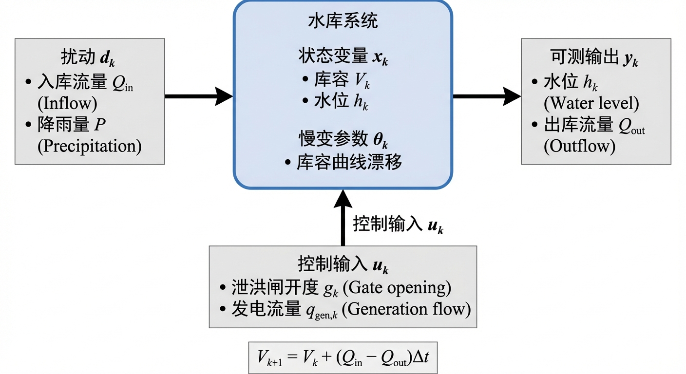
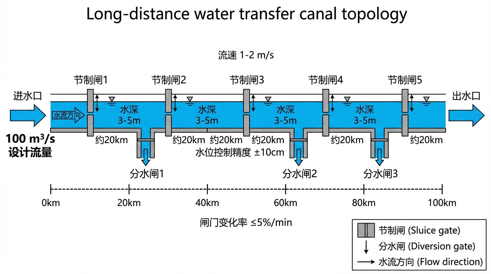

# 第四章 水系统形式化描述

---

> **引导案例：两代调度员的交接难题**
>
> 某中型灌区干渠全长86千米，配有12座节制闸和3座分水闸。退休调度员老张积累了30年运行经验，对全渠段的水力响应了然于胸："上游多放50方，第三闸大约两个半小时涨15公分""夏天草长得多，糙率大，同样开度流量要小一成"。这些经验使他能够在大多数工况下维持±10厘米的水位控制精度。
>
> 然而，老张退休后问题随即暴露。新调度员小李按照老张留下的"经验手册"操作，却发现：同样的闸门开度调整，有时水位响应快、有时慢；老张说"两个半小时"的时滞，在低水位工况下实际是三个多小时；更棘手的是，当灌区用水模式因种植结构调整而改变后，老张的经验参数全面失效——"经验手册"没有告诉小李**为什么**是两个半小时，也没有说明**在什么条件下**这个数字会变。
>
> 管理处尝试了三种补救：（1）让小李跟老张电话请教——但老张的判断依赖"看水面、听闸声"的现场直觉，电话中无法传递；（2）引入SCADA系统——数据齐全了，但小李面对12个闸门的实时水位曲线，仍然不知道"调哪个、调多少、等多久"；（3）外聘专家建模——专家建立了圣维南方程数值模型，精度很高，但计算一次24小时仿真需要40分钟，无法用于实时决策。
>
> 这三次失败指向同一个缺失：**灌区缺乏一套将物理经验转化为可计算、可传承、可实时使用的形式化描述**。老张的"两个半小时"本质上是传递函数中的传输延迟参数 $\tau_d$，"夏天糙率大"是慢变参数 $\theta_k$ 的季节漂移，但这些知识从未被形式化编码。本章的任务，正是建立这套从经验到模型的"翻译系统"——状态空间描述和传递函数描述。

---

> **本章阅读指引**
> 
> **适合读者**：控制论背景、水利工程背景、研究生
> 
> **与前章的关系**：本章基于第二章"控制论视角下的水系统"中引入的状态空间和传递函数概念，进行系统化的形式化展开。第二章给出了概览性描述，本章给出完整的数学推导和工程案例。
> 
> **与后章的关系**：本章的形式化方法（状态空间、传递函数）是第六章可控可观性和第七章八原理的数学基础。
> 
> **核心概念**（5 个）：
> - 状态空间：x-u-d-y 四元组，描述系统动态
> - 传递函数：输入 - 输出关系的频域描述
> - 圣维南方程：水力学基本方程（PDE）
> - 降阶路径：从 PDE 到控制模型的两种方法
> - 可控模型族：高保真→降阶→数据增强的三层体系
> 
> **直觉类比**：如果把水网比作交通系统，本章的状态空间相当于"车流密度 - 车速 - 入口匝道 - 出口匝道"的关系模型。
> 
> **可略读部分**（如已熟悉）：
> - §4.2.2：圣维南方程推导（水力学背景读者可略读）
> - §4.4：数学证明（了解结论即可）

---

> **[合规说明]**：关于工程落地、测试覆盖率量化指标与合规审查的详细要求，请参阅本丛书 **T3 卷《标准与工程治理》**。

## 4.1 为什么需要形式化

控制论研究的第一步是将被控对象形式化。形式化的目的不是"为了数学而数学"，而是：

1. **统一语言**：不同类型的水系统（水库、渠道、管网）可以用同一套语言讨论
2. **可计算**：把"运行经验"映射为"可计算结构"
3. **可验证**：形式化后才能进行稳定性分析、性能评估和在环验证
4. **可传承**：经验不再依赖个人记忆，而是编码为模型参数

雷晓辉等 [4-8] 在水系统控制论的技术框架中系统阐述了形式化描述的重要性，指出形式化是实现水利工程自主运行的理论基础。从学科演进角度看，水资源系统分析正经历从静态平衡到动态控制的范式转变 [4-12]，形式化方法正是支撑这一转变的核心工具。一个调度员说"上游放水后，下游大约 4 个小时才有反应"，这句经验在控制论框架下对应着传递函数中的传输延迟参数 $\tau_d$。一位老调度员说"这个季节糙率会偏大，闸门要多开一些"，对应着慢变参数 $\theta_k$ 的季节性漂移和相应的控制增益补偿。形式化不是否定经验，而是让经验变得可传承、可验证、可计算。

---

## 4.2 状态空间描述

### 4.2.1 状态—输入—输出—扰动四元组

将水网表示为离散时间非线性系统：

$$
x_{k+1}=f(x_k,u_k,d_k,\theta_k),\quad y_k=g(x_k,u_k)+v_k \tag{4-1}
$$

其中各变量的物理含义如下：

| 符号 | 维度 | 物理含义 | 水利工程中的典型实例 |
|------|------|---------|-------------------|
| **$x_k$** |$\mathbb{R}^n$| 系统状态 | 库容、断面水位、管段流量、设备运行状态 |
| **$u_k$** |$\mathbb{R}^m$| 控制输入 | 闸门开度、泵组频率、阀位、调度指令 |
| **$d_k$** |$\mathbb{R}^p$| 外部扰动 | 降雨径流、来水变化、需求波动、突发取水 |
| **$\theta_k$** |$\mathbb{R}^q$| 慢变参数 | 渠道糙率、设备效率曲线、管道阻力系数 |
| **$y_k$** |$\mathbb{R}^l$| 可测输出 | 测站水位、超声波流量、泵站功率 |
| **$v_k$** | — | 测量噪声 | 传感器误差、通信丢包、数据畸变 |

以一段长距离明渠为例，若将渠道离散为 $N$ 个计算断面，则状态向量包含各断面的水位 $h_i$ 和流量 $Q_i$，维度为 $2N$。南水北调中线总干渠全长 1,432 千米，若按每千米一个计算断面离散，状态向量维度可达约 2,800——这是一个远超常规工业控制系统的高维问题。相比之下，典型化工过程的状态维度在 10 到 100 之间，电力系统节点通常在数百量级。

**案例 4-1：某水库状态空间建模**

> 图4-1: 水库状态空间模型示意图

**工程背景**：某大型水库,总库容 13 亿立方米，承担防洪、供水、发电任务。

**问题**：如何确定状态变量？

**解决方案**：
- 状态变量 $x_k$：库容 $V_k$（或水位 $h_k$，两者通过库容曲线一一对应）
- 控制输入 $u_k$：泄洪闸门开度 $g_k$、发电流量 $q_{gen,k}$
- 外部扰动 $d_k$：入库流量 $Q_{in,k}$、降雨量 $P_k$
- 慢变参数 $\theta_k$：水库淤积导致的库容曲线漂移
- 可测输出 $y_k$：水位 $h_k$、出库流量 $Q_{out,k}$

**状态转移方程**：

$$
V_{k+1} = V_k + (Q_{in,k} - Q_{out,k}) \cdot \Delta t
$$

其中 $Q_{out,k} = q_{spill}(g_k, h_k) + q_{gen,k}$，$q_{spill}$ 为闸门泄流函数。

**与本章理论的联系**：本案例体现了§4.2.1 的状态空间四元组建模方法，将水库运行问题转化为标准控制问题。

### 4.2.2 状态空间的物理意义

状态空间描述的核心思想是：**用一组最小完备的变量来刻画系统的动态行为**。

**"最小"的含义**：状态变量的数量不能再少——少一个变量就无法完整描述系统。例如，描述一个水库的动态，只需要库容（或水位）一个状态变量；但描述一段渠道的动态，需要每个断面的水位和流量两个状态变量。

**"完备"的含义**：知道了当前状态和未来输入，就能唯一确定未来状态。这是状态空间描述的基本要求——如果当前状态不能完全预测未来，说明状态变量选得不够。

**直觉理解**：状态变量就像系统的"记忆"——它记录了过去所有输入对系统的影响。知道了当前状态，就不需要再知道过去的历史。

### 4.2.3 状态变量的选择原则

**原则一：物理可解释**。状态变量应该有明确的物理含义，便于工程理解和参数辨识。例如，水位、流量、库容都是物理可解释的状态变量。

**原则二：可测量或可估计**。状态变量应该是可以直接测量的，或者可以通过观测器估计的。无法测量也无法估计的状态变量没有工程价值。

**原则三：最小完备**。在满足完备性的前提下，状态变量数量越少越好。状态变量过多会增加计算复杂度，降低控制系统的实时性。

**原则四：与控制目标相关**。状态变量应该反映控制目标。如果控制目标是水位跟踪，水位应该作为状态变量；如果控制目标是能耗优化，能耗相关变量应该纳入状态空间。

### 4.2.4 高维状态空间的处理

对于大型水网，状态空间维度可能高达数千甚至数万。例如：
- 南水北调中线：约 2,800 个状态变量（1,432km，每千米 2 个状态）
- 大型灌区管网：约 5,000 个状态变量（数百个节点，每个节点压力 + 流量）
- 城市供水管网：约 10,000+ 个状态变量（数千个节点）

**降阶方法**：
1. **物理降阶**：基于水力特性，合并水力联系紧密的区域
2. **数学降阶**：使用主成分分析（PCA）、平衡截断等方法
3. **数据驱动**：使用机器学习方法学习低维流形

**分布式控制**：将高维系统分解为多个低维子系统，每个子系统独立控制，通过协调机制实现全局优化。

### 4.2.5 从圣维南方程到控制模型：两条降阶路径

水系统形式化的物理基础是水力学基本方程。以明渠流为例，其动力学行为由一维圣维南方程（Saint-Venant equations）描述 [4-1]：

$$
\frac{\partial A}{\partial t} + \frac{\partial Q}{\partial x} = q_l \tag{4-2a}
$$

$$\frac{\partial Q}{\partial t} + \frac{\partial}{\partial x}\left(\frac{Q^2}{A}\right) + gA\frac{\partial h}{\partial x} = gA(S_0 - S_f) + q_l v_l \tag{4-2b}$$

其中 $A$ 为过水断面面积，$Q$ 为流量，$h$ 为水位，$q_l$ 为侧向入流，$S_0$ 为底坡，$S_f$ 为摩阻坡降。摩阻坡降通常由 Manning 公式计算：$S_f = n^2 Q^2 / (A^2 R^{4/3})$，其中 $n$ 为 Manning 糙率系数，$R$ 为水力半径。糙率系数 $n$ 是一个看似简单但工程影响巨大的参数——它随水深、季节（水草生长）、淤积程度和衬砌老化而变化，正是§4.2.1 中慢变参数 $\theta_k$ 的典型代表。

式 (4-2) 是双曲型偏微分方程 (PDE)，精确求解需要沿空间和时间两个维度离散化，计算量巨大。以南水北调中线总干渠为例，若空间步长取 100 m、时间步长取 10 s，一次 24 小时仿真需要求解约 14,320 个空间节点×8,640 个时间步的方程组——这对于离线仿真尚可接受，但对于需要在分钟级给出控制决策的在线控制系统而言，计算量过大。工程中通常采用两种路径将 PDE 转化为适合控制设计的低阶模型。

**路径一：空间离散化（高保真仿真模型）。** 将渠道沿程离散为若干"渠池"（pool，两个相邻控制闸之间的渠段），每个渠池用 Preissmann 四点隐式格式或有限体积法离散后成为一组常微分方程（ODE），即式 (4-1) 中状态转移函数 $f$ 的具体形式。这一路径保留了非线性特性和空间分布特性，适合高精度仿真，是构建数字孪生和 SIL/HIL 验证平台的基础（见第十二章）。其代价是维度高、在线计算量大，不宜直接用于实时控制。

**路径二：线性化降阶（控制设计模型）。

** 在稳态运行点附近将式 (4-2) 线性化，得到传递函数模型。Litrico 和 Fromion [4-2] 系统建立了明渠系统的积分延迟零点（Integrator-Delay-Zero, IDZ）传递函数模型：

$$
G(s) = \frac{Y(s)}{U(s)} = \frac{e^{-\tau_d s}(1 + \tau_m s)}{A_s \cdot s} \tag{4-3}
$$

其中 $A_s$ 为回水区蓄水面积 ($\text{m}^2$)（反映渠池的蓄量效应——$A_s$ 越大，同等流量偏差引起的水位变化速率越慢，系统惯性越大），$\tau_d$ 为传输延迟（水流传播时间——上游调节后多久下游才开始响应），$\tau_m$ 为回水时间（反映初始逆响应特性——有些渠池在正向响应到达之前会先出现短暂的反向偏移）。这三个参数可以从渠池的几何尺寸（长度、底宽、边坡系数）、底坡和设计流量通过解析公式计算，无需试凑或反复整定。

> **符号约定**：本章采用与全书统一的符号体系：传输延迟记为 $\tau_d$（对应 Litrico & Fromion 原文中的 $\tau$），回水时间记为 $\tau_m$（对应原文中的 $p_z$）。详见第九章统一传递函数族。

> **概念速览：IDZ 传递函数的三个参数**
>
> 对于非水利专业读者，IDZ 模型可以用一个生活化的类比来理解。想象你站在一条长河的上游扔一块石头：
> - $A_s$（回水区蓄水面积）对应"水塘有多大"——水塘越大，同一块石头溅起的水花越小，水位变化越慢
> - $\tau_d$（传输延迟）对应"波浪传到下游要多久"——河越长、流越慢，等待时间越长
> - $\tau_m$（回水时间）对应"波浪到达前水面是否先轻微下凹"——某些渠池几何形状会导致正向波到达前出现短暂的反向偏移
>
> 这三个参数完全由渠池的物理尺寸决定，不需要反复实验调整。

IDZ 模型在工程控制中具有显著的降维优势：它将一个渠池从成百上千维的 PDE 降阶为仅一维或两维的状态空间模型，使得模型预测控制（MPC）的在线求解成为可能。南水北调中线工程的自动控制策略 [4-3] 和胶东调水工程的梯级泵站明渠控制方案 [4-4] 均以 IDZ 类传递函数为核心模型。Van Overloop [4-5] 在荷兰水系统中的大量实践进一步证实了 IDZ 模型在实际工程中的适用性，Malaterre 等 [4-7][4-11] 则从灌溉渠道控制算法分类和 SCADA 系统的角度系统评估了各类控制策略的适用条件。

**案例 4-2：某渠道 IDZ 传递函数辨识**

> 图4-2: 单渠池IDZ模型示意图

**工程背景**：某长距离明渠，单渠池长度 15km，设计流量 50 $\text{m}^3$/s。

**问题**：如何确定 IDZ 模型的三个参数（ $A_s, \tau_d, \tau_m$）？

**解决方案**：
1. **机理计算**：根据渠池几何尺寸（底宽 20m、边坡 1:2.5、底坡 1/10000）和设计流量，通过水力学公式计算理论参数
2. **阶跃响应辨识**：在稳态工况下，对上游闸门施加 5% 开度阶跃，记录下游水位响应曲线
3. **参数拟合**：通过优化算法拟合 IDZ 模型参数，使得模型输出与实测数据误差最小

**辨识结果**：
- $A_s = 23{,}800$ $\text{m}^2$（等效回水区蓄水面积，由阶跃响应辨识获得；注：该值远小于渠池几何水面面积 $B_0 \times L \approx 32.5 \times 15{,}000 = 487{,}500$ m²，原因是 IDZ 模型的 $A_s$ 仅反映下游回水区的有效积分面积，而非全渠池水面）
- $\tau_d = 3600$ s（传输延迟，水流传播时间 1 小时）
- $\tau_m = 120$ s（回水时间）

**验证**：在独立测试工况下，IDZ 模型预测误差 RMSE = 2.3 cm，满足控制设计精度要求（<5 cm）。

**与本章理论的联系**：本案例体现了§4.2.2 的路径二（线性化降阶），将 PDE 模型降阶为适合控制设计的 IDZ 传递函数模型。

**案例 4-3：圣维南方程降阶实践**

**工程背景**：某调水工程，总长 120km，分为 8 个渠池。

**问题**：高保真 PDE 模型维度太高（~2000 维），无法用于在线 MPC 控制。

**解决方案**：
1. **高保真模型**：Preissmann 四点隐式格式离散，空间步长 500m，时间步长 60s，维度 1920
2. **降阶策略**：每个渠池采用 IDZ 模型（1 维），8 个渠池总维度 8
3. **精度验证**：在典型调度场景下对比 PDE 与 IDZ 模型的输出，水位误差 RMSE = 3.8 cm

**效果**：
- 模型维度：1920 → 8（降阶 240 倍）
- 在线计算时间：120s → 0.5s（满足 MPC 实时性要求）
- 控制精度损失：可接受（<5 cm）
>
> **与本章理论的联系**：本案例体现了§4.2.2 的两种降阶路径对比，以及"可控模型族"的工程应用。

**可控模型族。** 可控模型族的三层体系（高保真PDE模型→降阶传递函数模型→数据增强模型）已在第二章§2.2.2详细介绍（见图2-2）。本章所介绍的IDZ传递函数族，将在第九章中纳入统一传递函数族（Family α积分型与Family β自调节型）的更广义框架。第十三章 HydroOS 的物理 AI 引擎将进一步阐述这一技术架构的工程实现。

### 4.2.6 三类约束：物理约束、操作约束、治理约束

水系统控制与一般工业控制的重要区别之一是约束的丰富性和刚性。CHS 将约束分为三类，强调三类约束必须同构建模、同步处理（见表 4-1）。

| **约束类型** | 来源 | 违反后果 | 工程实例 | 约束性质 |
|---------|------|---------|---------|---------|
| **物理约束** | 系统物理极限 | 不可逆后果 | 水位上下限（南水北调中线渠道设计超高仅 0.6 m [4-3]）；流速边界（冲刷/淤积）；库容极限；闸门行程 | 刚性，不可松弛 |
| **操作约束** | 设备维护与运行安全 | 设备损伤或加速老化 | 泵组最小启停间隔（通常 20-30 分钟）；闸门每日调节次数上限；检修窗口期设备不可用 | 半刚性，特殊工况可临时放宽 |
| **治理约束** | 法律法规、协议、公共利益 | 违法或违约 | 生态下泄红线；供水服务协议（流量和水质承诺）；调度权限边界（省/地分权） | 刚性，不因经济优化而松弛 |

**表 4-1: 水系统三类约束体系**

在传统工程实践中，前两类约束常被纳入优化器的硬约束或软约束，第三类则停留在制度文本中，由调度员"心中有数"但不进入算法。CHS 强调三类约束同构建模：治理约束同样必须形式化为数学不等式并进入 MPC 的约束集。否则就会出现"算法最优但制度不可执行"的尴尬局面——控制器给出的"最优方案"被调度员否决，系统实质上退回到人工决策模式。

### 4.2.7 运行设计域（ODD）在水系统中的定义

日常生活中有一个直觉类比：一个优秀的新手司机在白天的城市道路上可以安全驾驶，但你不会让他在暴风雪中走山路——不是因为他技术差，而是因为那超出了他经过训练和验证的"工作条件范围"。水系统的 ODD 正是这个意思：明确界定自主控制系统"在什么条件下可以放心工作"。

自动驾驶领域使用"运行设计域"（Operational Design Domain, ODD）来界定自动驾驶系统可以安全运行的条件范围 [4-6]，英国标准协会进一步建立了 ODD 分类体系 [4-9]。CHS 将这一概念移植到水系统。参照 WNAL 分级框架，水系统 ODD 定义为五元组：

$$\text{ODD}=\{\mathcal{H},\mathcal{I},\mathcal{E},\mathcal{R},\mathcal{C}\} \tag{4-4}$$

| **元素** | 含义 | 定义内容 | 工程实例 |
|------|------|---------|---------|
| **$\mathcal{H}$** | 水文气象范围 | 来水流量上下限、降雨强度、气温区间 | "适用于来水 50-350 $\text{m}^3$/s、气温 -5°C 以上" |
| **$\mathcal{I}$** | 基础设施可用性 | 设备健康度、传感器在线率、通信可达率 | "SCADA 传感器在线率≥95%，通信丢包率<5%" |
| **$\mathcal{E}$** | 外部需求环境 | 供水需求模式、灌溉季节、电网负荷 | "城市日供水量波动在±20% 以内" |
| **$\mathcal{R}$** | 风险边界 | 风险等级、应急响应等级 | "非汛期、上游水库无泄洪风险" |
| **$\mathcal{C}$** | 控制能力边界 | 模型精度、算力资源、人工值守等级 | "IDZ 模型经当前工况验证，控制周期<60s" |

ODD 不是"附件说明"，而是自主运行的责任边界。雷晓辉等 [4-13] 在自主水网架构中将 ODD 作为分层控制体系的核心约束机制，明确了各层级自主运行的边界条件。超出 ODD，系统必须降级或请求人工接管（详见相关文献）。

---

## 4.3 传递函数描述

### 4.3.1 传递函数的物理意义

传递函数是经典控制理论的核心工具，它描述了线性时不变系统在频域的输入 - 输出关系。对于水系统，传递函数的物理意义尤为直观：

- **回水区蓄水面积**（$A_s$）：渠池的蓄量惯性，$A_s$ 越大，水位对流量变化的响应越慢
- **传输延迟**（$\tau_d$）：纯延迟，输入变化后多久输出才开始响应
- **时间常数**（$T$）：响应速度，输出从初始值到达稳态值 63% 所需时间
- **零点**（$\tau_m$）：初始反向响应特性，某些系统在正向响应前会先出现短暂反向偏移

### 4.3.2 水系统的典型传递函数形式

水系统最常见的传递函数形式包括：

**1. 积分型（Integrator）**

$$
G(s) = \frac{K}{s}
$$

适用于无自调节能力的对象，如明渠水位控制。输入（闸门开度）阶跃后，输出（水位）会持续变化而不趋于稳态。

**2. 积分延迟型（Integrator-Delay, ID）**

$$
G(s) = \frac{K \cdot e^{-\tau_d s}}{s}
$$

在积分型基础上增加传输延迟，更精确描述长距离渠道。

**3. 积分延迟零点型（Integrator-Delay-Zero, IDZ）**

$$
G(s) = \frac{K \cdot e^{-\tau_d s}(1 + \tau_m s)}{s}
$$

其中对明渠系统，$K = 1/A_s$（$A_s$ 为水面面积 [m²]），使上式等价于式(4-3)的标准 IDZ 形式 $G(s) = \frac{(1+\tau_m s)\,e^{-\tau_d s}}{A_s \cdot s}$。

进一步考虑初始反向响应特性，精度最高。

**4. 自调节型（Self-Regulating）**

$$
G(s) = \frac{K}{Ts + 1}
$$

适用于有自调节能力的对象，如水库水位（入库流量阶跃后，水位最终会趋于新的稳态）。

### 4.3.3 传递函数参数的工程获取方法

传递函数参数的获取方法包括：

**1. 机理计算法**：根据几何尺寸和水力学公式直接计算。适用于设计阶段，参数物理意义明确，但精度依赖于模型假设。

**2. 阶跃响应辨识法**：在稳态工况下施加阶跃输入，记录输出响应曲线，通过拟合获取参数。适用于已建工程，精度高，但需要现场试验。

**3. 频率响应辨识法**：施加正弦扫频信号，测量幅频和相频特性。适用于复杂系统，但实施难度大。

**4. 数据驱动辨识法**：利用历史运行数据，通过系统辨识算法（如最小二乘、子空间辨识）获取参数 [4-10]。适用于有丰富历史数据的工程，无需专门试验。

**辨识方法选择依据**：工程人员在选择辨识方法时，需综合考虑数据需求、试验代价和对运行的影响：

| **方法** | 最短数据时长 | 最低采样频率 | 对运行的扰动 | 试验风险 | 适用阶段 |
|------|------------|------------|------------|---------|---------|
| **机理计算法** | 无需运行数据 | — | 无 | 无 | 设计阶段 |
| **阶跃响应辨识** | 3–5倍时滞 | ≥1/(10τ) | 水位波动±5–10cm | 低（需选择低敏感时段） | 建设/调试阶段 |
| **频率响应辨识** | 10–20个扫频周期 | ≥采样定理要求 | 持续周期性扰动 | 中（长时间占用） | 专项试验 |
| **数据驱动辨识** | ≥30天运行记录 | ≥1min | 无（利用历史数据） | 无 | 运行阶段 |

---

## 4.4 从圣维南方程到传递函数

### 4.4.1 线性化的数学过程

从圣维南方程 (4-2) 推导传递函数 (4-3) 的核心步骤：

1. **稳态工作点选择**：选择设计流量或典型运行工况作为线性化工作点 $(h_0, Q_0)$

2. **小扰动假设**：假设状态变量在工作点附近小范围波动，即 $h = h_0 + \Delta h$，$Q = Q_0 + \Delta Q$，且 $\Delta h \ll h_0$，$\Delta Q \ll Q_0$

3. **Taylor 展开**：将非线性项在工作点处 Taylor 展开，保留一阶项，忽略高阶项

4. **Laplace 变换**：对线性化后的偏微分方程进行 Laplace 变换，从时域转换到频域

5. **边界条件处理**：代入上游闸门边界条件和下游水位边界条件，求解传递函数

以下给出从圣维南方程到 IDZ 传递函数的关键推导步骤，以单一棱柱形渠池为例（Litrico & Fromion, 2009 [4-2]）。

**线性化圣维南方程**

设渠池长度为 $L$，底坡 $S_0$，正常水深 $y_0$，稳态流量 $Q_0$，水面宽 $B_0$，过水断面面积 $A_0 = B_0 y_0$，弗劳德数 $Fr_0 = Q_0 / (A_0 \sqrt{g y_0})$。

在稳态工作点对圣维南方程（连续方程 + 动量方程）关于小扰动量 $(q' = Q - Q_0, y' = y - y_0)$ 线性化，并进行 Laplace 变换（空间变量保留）：

$$
s \, Y(x,s) + \frac{1}{B_0} \frac{\partial Q(x,s)}{\partial x} = 0 \tag{4-5a}
$$

$$s \, Q(x,s) + g A_0 \frac{\partial Y(x,s)}{\partial x} + \left(\frac{2gS_0}{y_0} + \frac{2gS_f'}{Q_0}\right) Q(x,s) - \frac{gA_0 S_0}{y_0} B_0 Y(x,s) = 0 \tag{4-5b}$$

其中

$$
S_f' = \frac{\partial S_f}{\partial Q} \bigg|_{Q_0}
$$

为 Manning 公式摩阻坡降对流量的偏导数。

**求解空间常微分方程组**

将式 (4-5) 视为关于 $x$ 的常微分方程组，其特征值为：

$$
\lambda_{1,2}(s) = \frac{-s \cdot F(s) \pm \sqrt{s^2 G(s)}}{2 c_0}
$$

其中 $c_0 = \sqrt{g y_0}$ 为小振幅波速，$F(s)$ 和 $G(s)$ 分别与衰减系数和波速修正有关（注：此处 $G(s)$ 为特征方程的中间变量，与后文渠池传递函数 $P(s)$ 无关）。

**代入闸门边界条件**

上游边界（$x = 0$）：节制闸开度 $u(s)$ 通过孔流公式确定流量，线性化后得 $Q(0, s) = K_g u(s) + D_g Y(0, s)$。下游边界（$x = L$）：量水堰处 $Q(L, s) = K_d Y(L, s)$。联立边界条件与空间解，推导从上游闸门开度 $u(s)$ 到下游水位 $Y(L, s)$ 的传递函数。

**低频近似：IDZ 传递函数**

当 $s \to 0$（灌溉调度关注的低频域），高阶项可忽略，传递函数退化为带衰减的 ID（积分延迟）形式：

$$
P_{ID}(s) = \frac{1}{A_s(s + \sigma)} e^{-\tau_d s} \tag{4-6}
$$

其中：
- $A_s = B_0 \cdot L_{id}$，$B_0$ 为水面宽度 [m]，$L_{id}$ 为等效积分区段长度 [m]，$A_s$ 为回水区蓄水面积 [m²]；
- $\sigma = 2 S_0 / (y_0 T_r)$ 为小量衰减系数（$T_r$ 为波传播时间）；
- $\tau_d = L / c_0 (1 - Fr_0^2)^{1/2}$ 为传输延迟。

当 $\sigma \approx 0$（平坡或微坡渠道），式(4-6)退化为纯积分延迟（ID）模型 $P_{ID}(s) = \frac{e^{-\tau_d s}}{A_s \cdot s}$。进一步引入回水效应的一阶零点近似 $(1 + \tau_m s)$，即得到完整的 IDZ 传递函数（参见式(4-3)和§4.3.2），详细推导可参考 Litrico & Fromion (2009) 第3章 [4-2]。

**工程应用约束提示**：上述解析解 $\tau_d \approx L/c_0$ 等仅严格适用于**底坡均匀、无控制建筑物截断、弗劳德数 $Fr  \lt  0.5$ 的缓流长渠道**。若实际渠段内包含多级跌水、倒虹吸或断面形状发生剧变，纯解析计算的延迟误差将显著放大，此时必须回退至§4.7.2所述的"数学降阶（系统辨识）"方法获取准确的 $\tau_d$ 值。

**参数物理意义与量纲检验**

| **参数** | 量纲 | 物理意义 | 工程获取方式 |
|------|------|---------|------------|
| **$A_s$** |$\text{m}^2$| 回水区蓄水面积（= 过水断面面积 × 等效积分区段长度） | 渠道几何参数计算 |
| **$\tau_d$** | s | 流量扰动从闸门传播至目标点的传输延迟 | 渠道长度除以波速 $c_0$|
| **$\sigma$** | 1/s | 微坡渠道衰减系数，平坡取零 | 底坡与水深的函数 |

### 4.4.2 线性化的适用条件与误差分析

线性化的适用条件：
- 状态变量波动范围在工作点的±20% 以内
- 渠道几何形状规则（棱柱形渠道）
- 底坡较小（$S_0  \lt  1/1000$）
- 弗劳德数 $Fr  \lt  0.5$（缓流）

线性化的主要误差来源：
- 大扰动工况（如洪水过程）
- 非棱柱形渠道（断面形状沿程变化）
- 急流或临界流（$Fr \geq 0.5$）
- 强非线性边界条件（如闸门启闭过程）

误差分析方法：
- 与高保真 PDE 模型对比，计算输出误差 RMSE
- 在不同工况下验证，确定线性模型的适用范围（ODD）
- 采用增益调度（Gain Scheduling），在不同工作点使用不同的线性模型

**线性化失效清单**：以下情形线性化假设不成立，必须采用替代方法：

| **失效条件** | 典型表现 | 后果 | 替代方法 |
|---------|---------|------|---------|
| **流量偏离工作点 >±30%** | 水深剧变，增益偏差 >25% | MPC预测失效，水位越限 | 增益调度（§4.4.2） |
| **弗劳德数 $Fr \geq 0.5$** | 急流/临界流出现水跃 | IDZ模型结构失效 | 全非线性PDE仿真 |
| **渠道含跌水/倒虹吸** | 局部水力特性突变 | 传输延迟 $\tau_d$ 解析值偏差 >30% | 系统辨识（§4.7.2） |
| **闸门快速启闭** | 非稳态瞬变过程 | 线性化忽略的惯性项显著 | 瞬变分析模型 |
| **冰期运行** | 糙率突变40–70% | 全部IDZ参数漂移 | 在线重辨识（§4.5.4） |

---

## 4.5 积分延迟（ID）模型：水系统控制的核心工具

积分延迟（Integrator-Delay, ID）模型是水系统控制领域最重要的实用模型，它以精简的参数表达了明渠渠池的核心动力学特性。在§4.2.5中已从降阶路径角度引入了 IDZ 传递函数，本节专门深化其参数物理意义、工程辨识方法和在 MPC 中的应用。

### 4.5.1 ID 模型与 IDZ 模型

**ID 模型（纯积分延迟模型）** 是最简化形式：

$$
P(s) = \frac{1}{A_s \cdot s} e^{-\tau_d s} \tag{4-7}
$$

其中 $A_s$($\text{m}^2$) 为回水区蓄水面积，$\tau_d$(s) 为传输延迟。该模型假设渠池在频域表现为积分器（低频段水位变化等于净流入量除以蓄水面积的积分）加延迟。其物理意义直观：若上游输入一个单位阶跃流量，经过延迟 $\tau_d$ 后，下游水位将以斜率 $1/A_s$ 线性增长——蓄水面积越大，水位上升越慢。

**IDZ 模型（积分延迟零点模型）** 是 Litrico 和 Fromion [4-2] 建立的精确形式：

$$
P(s) = \frac{(1 + \tau_m s)}{A_s \cdot s} e^{-\tau_d s} \tag{4-8}
$$

回水时间 $\tau_m$ 描述了渠池在时延结束后的非最小相位特性（Initial Inverse Response）：对于顺坡渠道，$\tau_m  \gt  0$，意味着闸门上游的水位在正向响应到达前会出现短暂下降；对于近平坡渠道，$\tau_m \approx 0$，IDZ 退化为 ID 模型。这种区别在 MPC 控制器设计中至关重要——忽略回水时间会导致控制器在调节初期给出错误的修正方向。

### 4.5.2 ID 模型参数的解析计算

ID/IDZ 模型的三个参数可以从渠池物理参数通过解析公式计算，无需依赖试验辨识：

> 图4-3: ID/IDZ模型参数物理意义

**传输延迟**（$\tau_d$）（波速传播时间）：

$$
\tau_d = \frac{L}{c + V_0} + \frac{L}{c - V_0} \cdot \varepsilon \approx \frac{L}{c_0}
$$

式中 $L$ 为渠池长度，$c = \sqrt{g h_0}$ 为小扰动波速（$h_0$ 为正常水深），$V_0$ 为正常流速。工程中常用简化公式 $\tau_d \approx L / (\bar{c} + \bar{V})$，$\bar{c}$ 和 $\bar{V}$ 取正常运行水深下的平均值。

**回水区蓄水面积**（$A_s$）：IDZ模型中的 $A_s$ 是通过阶跃响应辨识获得的**等效积分面积**，反映下游回水区对流量扰动的有效蓄量响应。其初始估计可取：

$$
A_s \approx B_0 \cdot L_b
$$

式中 $B_0$ 为正常水深下的水面宽度 [m]，$L_b$ 为回水影响长度 [m]（通常远小于渠池全长 $L$）。$A_s$ 的物理意义为回水区的等效蓄水面积 [m²]，反映渠池的蓄量惯性——该面积越大，单位流量变化引起的水位变化越小。需要注意，$A_s$ 的精确值须通过系统辨识确定（见§4.3.2的辨识实例），其值通常远小于渠池几何总水面面积 $B_0 \times L$。

**回水时间**（$\tau_m$）：

$$
\tau_m = \frac{T_p}{2}\left(1 - \frac{2Q_0}{g A_0 c}\right)
$$

式中各项含义与上文一致。当底坡较小时 $\tau_m \approx T_p/2  \gt  0$，显现明显的逆响应。

**表 4-2：某典型明渠渠池 ID/IDZ 参数示例**

| **渠池参数** | 数值 | 单位 |
|---------|------|------|
| **渠池长度 $L$** | 20 | km |
| **底宽 $b$** | 18 | m |
| **正常水深 $h_0$** | 3.2 | m |
| **设计流量 $Q_0$** | 60 |$\text{m}^3$/s |
| **正常流速 $V_0$** | 0.85 | m/s |
| **小扰动波速 $c$** | 5.60 | m/s |
| **计算参数** | | |
| **传输延迟 $\tau_d$** | 3086 | s（约 51 分钟） |
| **回水区蓄水面积 $A_s$** |$1{,}152{,}000$|$\text{m}^2$（= 57.6 m × 20,000 m） |
| **回水时间 $\tau_m$** | 1260 | s |

上表中 $\tau_d \approx 51$ 分钟意味着：上游闸门调整后，下游水位的显著响应将在约 1 小时后才出现。这正是长距离明渠控制中"超前决策"必要性的定量依据——控制器必须基于模型预测，而非等待响应出现后再调整。

### 4.5.3 在 MPC 框架中的应用

ID/IDZ 模型与模型预测控制（MPC）具有天然的兼容性：MPC 需要在线快速预测未来时域内的系统状态，ID 模型的低维度（每渠池仅 1-2 个状态变量）和解析参数使这种预测计算量极低，在嵌入式控制器中可实现亚秒级滚动优化。

对于 $N$ 个串联渠池的长距离明渠，将各渠池 IDZ 模型串联后形成 $N$ 维系统。以矩阵形式可写为离散状态空间：

$$
x_{k+1} = A_p x_k + B_p u_k, \quad y_k = C_p x_k
$$

式中 $x_k \in \mathbb{R}^N$ 为各渠池水位偏差，$u_k \in \mathbb{R}^M$ 为各控制闸门流量调整量，矩阵 $A_p, B_p, C_p$ 由各渠池的 IDZ 参数组合而成（含时延的离散化采用 Pade 近似）。MPC 在每个控制周期内，基于当前实测状态和该模型，求解未来 $P$ 步预测期内最优控制序列：

$$
\min_{u_{k:k+P}} \sum_{j=1}^{P} \left( \|y_{k+j} - r_{k+j}\|_Q^2 + \|\Delta u_{k+j}\|_R^2 \right)
$$

约束条件：$u_{\min} \leq u \leq u_{\max}$，$y_{\min} \leq y \leq y_{\max}$，$|\Delta y| \leq \Delta y_{\max}/h$

其中 $r_{k+j}$ 为目标水位轨迹，$Q$ 和 $R$ 为加权矩阵。南水北调中线工程、胶东调水工程明渠段的实时控制系统均以类似架构实现，其中胶东调水工程采用预见期 3 小时、计算周期 15 分钟的配置 [4-4]。

### 4.5.4 ID 模型的局限与适用范围

ID 模型是线性模型，其精度取决于运行工况偏离正常工况的程度。以下情形会导致模型误差增大，需要相应处理：

- **大幅流量变动**（超过设计流量 ±30%）：水深显著变化，小扰动线性化假设失效 → 增益调度或非线性 MPC
- **蓄量极低（渠道接近干涸）**：积分增益趋向无穷，传递函数退化 → 切换为安全降级控制模式
- **冰期结冰**：冰盖改变水力阻力，IDZ 参数需重新辨识，糙率系数增大约 40-70%
- **渠道淤积**：断面形状随时间变化，$\tau_d$ 和 $A_s$ 缓慢漂移 → 需要在线参数辨识（详见第十二章 MBD 框架）

在上述边界工况下，控制系统应能自动检测模型精度下降，触发运行模式降级或 MRC（最小风险状态）切换，这正是第十一章安全包络与在环验证的核心设计要求。

## 4.6 两种降阶路径详解

> 图4-4: 圣维南方程降阶的两条路径

### 4.6.1 路径一：物理降阶（从 PDE 到 ODE）

物理降阶的核心思想是：**基于水力特性的物理洞察，简化控制方程**。

**步骤一：线性化**。在稳态工作点 $(h_0, Q_0)$ 附近对圣维南方程进行线性化，忽略高阶小量：

$$
\frac{\partial h'}{\partial t} + \frac{1}{B}\frac{\partial Q'}{\partial x} = 0
$$

$$
\frac{\partial Q'}{\partial t} + gA_0\frac{\partial h'}{\partial x} = -gA_0 S_f'
$$

其中 $h' = h - h_0$，$Q' = Q - Q_0$ 为偏离稳态的扰动量，$B$ 为水面宽度，$A_0$ 为稳态过水面积。

**步骤二：忽略对流加速度项 $\partial(Q^2/A)/\partial x$ 中的非线性部分（线性化后的对流效应已通过波速 $c$ 体现）**。对于缓坡明渠（弗劳德数 $Fr  \lt  0.3$），对流加速度项远小于重力项，可忽略。

**步骤三：摩阻项线性化**。摩阻坡降 $S_f$ 使用 Manning 公式：$S_f = n^2 Q^2 / (A^2 R^{4/3})$。在稳态点附近线性化：

$$
S_f' \approx \frac{2S_{f0}}{Q_0}Q' - \frac{2S_{f0}}{A_0}A'
$$

**步骤四：空间积分**。对简化后的方程沿空间积分，将 PDE 转化为 ODE。以单一渠池为例：

$$
\frac{dV'}{dt} = Q_{in}' - Q_{out}'
$$

$$
\frac{dQ_{out}'}{dt} = -\frac{1}{T}(Q_{out}' - K h')
$$

其中 $V'$ 为蓄水量扰动，$T$ 为时间常数，$K$ 为增益系数。

**物理降阶的适用条件**：
- 缓坡明渠（$Fr  \lt  0.3$）
- 小扰动（偏离稳态不超过 20%）
- 单一渠池或弱耦合渠池

**物理降阶的优缺点**：
- 优点：物理意义清晰，参数可解释，计算高效
- 缺点：仅适用于小扰动，大扰动时精度下降

### 4.6.2 路径二：数学降阶（系统辨识）

数学降阶的核心思想是：**不关心内部物理过程，直接从输入 - 输出数据辨识传递函数**。

**步骤一：设计激励信号**。常用激励信号包括：
- 阶跃信号：简单直接，但频带有限
- 伪随机二进制序列（PRBS）：频带宽，辨识精度高
- 正弦扫频：可获取完整频率响应

**步骤二：选择模型结构**。常用传递函数形式：
- 一阶惯性 + 延迟：$G(s) = \frac{K}{1+Ts}e^{-\tau_d s}$- 二阶振荡 + 延迟：$G(s) = \frac{K\omega_n^2}{s^2+2\zeta\omega_n s+\omega_n^2}e^{-\tau_d s}$- 积分 + 延迟：$G(s) = \frac{K}{s}e^{-\tau_d s}$（无自调节系统）

**步骤三：参数辨识**。使用最小二乘法、极大似然法等方法。以阶跃响应为例：
- 增益 $K$：稳态输出变化量 / 输入变化量
- 时间常数 $T$：输出达到 63.2% 稳态值的时间
- 传输延迟 $\tau_d$ ：从输入变化到输出开始响应的时间

**步骤四：模型验证**。使用独立试验数据验证：
- 稳态误差：<5%
- 瞬态误差：<10%
- 拟合度：>85%

**数学降阶的优缺点**：
- 优点：无需机理模型，适用范围广，辨识流程标准化
- 缺点：参数物理意义不明确，外推能力有限

### 4.6.3 两种路径对比

| 维度 | 物理降阶 | 数学降阶 |
|------|---------|---------|
| **基础** | 水力学方程 | 输入 - 输出数据 |
| **参数意义** | 物理可解释 | 黑箱参数 |
| **适用范围** | 小扰动、缓坡明渠 | 任意系统 |
| **外推能力** | 较强 | 较弱 |
| **数据需求** | 少 | 多 |
| **计算复杂度** | 中等 | 低 |

**选择建议**：
- 机理清晰、参数可获取 → 物理降阶
- 机理复杂、数据充足 → 数学降阶
- 高精度要求 → 两种方法结合（物理模型 + 数据校正）

### 4.6.4 降阶案例对比

**工程背景**：某渠池，长度 15km，正常水深 4m，设计流量 80 $\text{m}^3$/s。

**物理降阶结果**：
- $K = 0.5$ cm/%，$T = 60$ 分钟，$\tau_d = 30$ 分钟

**数学降阶结果**：
- $K = 0.48$ cm/%，$T = 58$ 分钟，$\tau_d = 32$ 分钟

**对比分析**：
- 增益误差：4%
- 时间常数误差：3.4%
- 时滞误差：6.7%
- 结论：两种方法结果一致，物理降阶可用于快速估算

**模型验证**：
- 稳态误差：3.2%
- 瞬态误差：7.8%
- 拟合度：89%
- 结论：模型满足控制设计需求

---

## 4.7 工程实例：渠道状态空间建模

> **算例性质声明**：§4.7的工程参数（渠道长度、管网规模、辨识精度等）为**说明性设定**，旨在演示状态空间建模和传递函数辨识的完整流程，不对应特定工程的实测数据。参数量级参照多个实际工程设定，具有工程合理性。

> 图4-5: 长距离调水工程渠道拓扑

### 4.7.1 工程背景

某长距离明渠输水工程，全长约 100km，设计输水能力约 100m $^3$/s，沿线设 5 座节制闸和 3 座分水闸。

**工程特点**：
- 水力特性：缓坡明渠，正常水深 3-5m，流速 1-2m/s
- 控制目标：维持各渠段水位在设定值±10cm 范围内
- 约束条件：闸门开度变化速率≤5%/min，水位不超堤顶

### 4.7.2 状态空间建模

**空间离散**：将 100km 渠道离散为 20 个计算断面，每 5km 一个断面。

**状态变量**：
- 水位 $h_i$：20 个断面，共 20 个状态变量
- 流量 $Q_i$：20 个断面，共 20 个状态变量
- **总状态维度**：40

**控制输入**：
- 节制闸开度 $g_j$：5 座节制闸，共 5 个控制变量
- 分水闸开度 $q_k$：3 座分水闸，共 3 个控制变量
- **总控制维度**：8

**状态转移方程**：

$$h_{i,k+1} = h_{i,k} + \frac{\Delta t}{A_i}(Q_{i-1,k} - Q_{i,k} + q_{l,i,k})$$

$$
Q_{i,k+1} = Q_{i,k} + \Delta t \cdot f(h_{i,k}, Q_{i,k}, g_{j,k})
$$

其中 $A_i$ 为断面面积，$q_{l,i,k}$ 为侧向入流，$f(\cdot)$ 为流量变化函数。

### 4.7.3 模型辨识

**阶跃响应试验**：
- 试验方法：在某节制闸进行开度阶跃变化（+10%），记录上下游断面水位响应
- 试验次数：每座闸门重复 3 次，共 15 次试验
- 数据处理：取平均值，消除随机噪声

**参数辨识结果**：
- 延迟时间τ：15-90 分钟（从上游到下游）
- 增益 K：0.3-0.8（开度变化 1%，水位变化 0.3-0.8cm）
- 时间常数 T：30-180 分钟

**模型验证**：
- 验证方法：使用独立试验数据验证模型精度
- 验证结果：稳态误差<5cm，瞬态误差<10cm
- 结论：模型满足控制设计需求

### 4.7.4 控制设计

**MPC 控制器**：
- 预测时域：6 小时（36 步，每步 10 分钟）
- 控制时域：2 小时（12 步）
- 目标函数：水位跟踪误差 + 闸门动作次数 + 能耗
- 约束：水位上下限、闸门开度变化速率、流量守恒

**实施效果**：
- 水位控制精度：从±15cm 提升到±5cm
- 人工干预频次：从每日 10 次降低到每日 2 次
- 应急响应时间：从 30 分钟缩短到 5 分钟

---

## 4.8 形式化的工程意义

### 4.8.1 从"经验驱动"到"模型 - 数据 - 规则"协同

形式化的核心价值在于：把"运行经验"转化为"可计算、可验证、可传承"的知识资产。

**经验驱动的局限**：
- 依赖个人记忆，难以传承
- 难以处理多变量耦合
- 难以量化安全性和经济性权衡
- 难以应对未预见工况

**模型 - 数据 - 规则协同的优势**：
- 模型提供预测能力（"下一步会怎样"）
- 数据提供校正能力（"模型哪里不准"）
- 规则提供约束能力（"什么不能做"）
- 三者协同，形成闭环决策支持

### 4.8.2 形式化是自主运行的前提

没有形式化，就没有自主运行。原因如下：

1. **可分析性**：形式化后才能进行稳定性分析、能控能观性分析、鲁棒性分析
2. **可设计性**：形式化后才能系统设计控制器（PID、MPC、RL 等）
3. **可验证性**：形式化后才能进行 MIL/SIL/HIL 在环验证 [4-14]
4. **可解释性**：形式化后才能解释"为什么这样决策""不这样会怎样"

### 4.8.3 形式化的边界：什么不能形式化

形式化不是万能的。以下方面目前仍难以完全形式化：

- **多目标权衡**：防洪 vs 发电 vs 供水的优先级，涉及价值判断
- **极端罕见工况**：缺乏历史数据，模型无法覆盖
- **人为因素**：调度员的心理状态、组织文化、权责博弈
- **制度约束**：某些制度规则难以用数学不等式精确表达

因此，CHS 强调"模型 - 数据 - 规则"协同，而非"模型万能"。形式化是工具，不是目的。

---

## 本章小结

本章系统阐述了水系统形式化描述的方法体系，包括状态空间描述、传递函数描述、从圣维南方程到控制模型的降阶路径、形式化的工程意义、工程实例、典型误区以及检查清单。

**核心要点**：
1. 状态空间描述提供时域建模框架，适合多变量、非线性系统
2. 传递函数描述提供频域建模框架，适合单变量、线性系统
3. 从圣维南方程到控制模型有两条降阶路径：物理降阶和数学降阶
4. 形式化是可控可观性分析（第六章）和八原理（第七章）的数学基础
5. 模型需要定期校正，不能"一次辨识，终身使用"

**本章内容与CHS八原理的映射**：

| 本章内容 | 支撑的CHS原理 |
|---------|-------------|
| 状态空间四元组（§4.2） | 原理一（传递函数化） |
| IDZ传递函数与可控可观性（§4.3—§4.5） | 原理二（可控可观性） |
| 五级降阶路径与分层对应（§4.6） | 原理三（分层分布式控制） |
| ODD降级接口（§4.8） | 原理四（安全包络） |

**与第六章的衔接**：第六章将基于本章的形式化模型，讨论可控可观性的工程判据。形式化提供"系统怎么描述"，可控可观性回答"系统能不能控、能不能观"。

---

## 附录 4-A 状态空间与传递函数的对比

| 维度 | 状态空间 | 传递函数 |
|------|---------|---------|
| **域** | 时域 | 频域（s 域/z 域） |
| **适用系统** | 多变量、非线性、时变 | 单变量、线性、时不变 |
| **模型形式** | 微分/差分方程组 | 传递函数矩阵 |
| **初始条件** | 可处理非零初始条件 | 假设零初始条件 |
| **稳定性分析** | 特征值分析 | 极点分析 |
| **控制器设计** | LQR、LQG、MPC | PID、根轨迹、频域设计 |
| **计算复杂度** | 高（矩阵运算） | 低（代数运算） |
| **工程应用** | 现代控制理论 | 经典控制理论 |

**选择建议**：
- 单变量、线性系统 → 传递函数
- 多变量、耦合系统 → 状态空间
- 非线性系统 → 状态空间（线性化后）
- 需要最优控制 → 状态空间（LQR/MPC）

---

| 方法 | 原理 | 优点 | 缺点 | 适用场景 |
|------|------|------|------|---------|
| **物理降阶** | 基于水力特性合并区域 | 物理意义清晰 | 精度损失 | 大型水网 |
| **平衡截断** | 保留可控可观模态 | 理论保证 | 计算复杂 | 中等规模 |
| **Krylov 子空间** | 矩匹配 | 计算高效 | 无理论保证 | 大规模系统 |
| **PCA** | 主成分分析 | 数据驱动 | 需要历史数据 | 数据丰富场景 |
| **系统辨识** | 输入输出数据拟合 | 无需机理模型 | 可解释性差 | 复杂系统 |

---

## 本章术语表

| **术语** | 英文 | 说明 |
|------|------|------|
| **状态空间** | State Space | x-u-d-y 四元组描述系统动态行为 |
| **传递函数** | Transfer Function | 输入-输出关系的频域/拉普拉斯域描述 |
| **圣维南方程** | Saint-Venant Equations | 描述明渠非恒定流的偏微分方程组 |
| **IDZ 模型** | Integrator-Delay-Zero Model | 明渠渠池的降阶传递函数模型 |
| **降阶** | Model Order Reduction | 从高维 PDE 到低维 ODE/传递函数的简化路径 |
| **可控模型族** | Controllable Model Family | 高保真→降阶→数据增强的三层模型体系 |
| **在线辨识** | Online Identification | 利用运行数据实时更新模型参数 |
| **WNAL** | Water Network Autonomy Levels | 水网自主等级（L0-L5） |
| **ODD** | Operational Design Domain | 运行设计域，系统可自主运行的条件范围 |
| **MRC** | Minimal Risk Condition | 最小风险条件，超出 ODD 时的安全回退状态 |

---

## 本章参考文献

[4-1] Cunge J A, Holly F M, Verwey A. Practical Aspects of Computational River Hydraulics [M]. London: Pitman Publishing, 1980.

[4-2] Litrico X, Fromion V. Modeling and Control of Hydrosystems [M]. London: Springer, 2009.

[4-3] 孔令仲, 雷晓辉, 张召, 等. 多级串联明渠调水工程多目标水位预测控制模型研究 [J]. 水利学报, 2022, 53(4): 471-482.

[4-4] 张峥, 等. 胶东调水工程梯级泵站明渠控制方案设计与实现 [J]. 中国农村水利水电, 2023(5): 156-163. <!-- 待作者终审：web search未检索到该文，请确认作者、刊名、卷期 -->

[4-5] Van Overloop P J. Model Predictive Control on Open Water Systems [M]. Delft: IOS Press, 2006.

[4-6] SAE International. Taxonomy and Definitions for Terms Related to Driving Automation Systems for On-Road Motor Vehicles (J3016). 2021.

[4-7] Malaterre P O. SCADA systems for irrigation canals: Control strategies assessment [C]//Proceedings of the 2nd International Conference on Irrigation and Drainage. 1998.

[4-8] 雷晓辉, 龙岩, 许慧敏, 等. 水系统控制论：提出背景、技术框架与研究范式[J]. 南水北调与水利科技(中英文), 2025, 23(04): 761-769+904.

[4-9] BSI. PAS 1883:2020 Operational Design Domain (ODD) taxonomy for automated driving systems — Specification [S]. London: British Standards Institution, 2020.

[4-10] Ljung L. System Identification: Theory for the User [M]. 2nd ed. Upper Saddle River: Prentice Hall, 1999.

[4-11] Malaterre P O, Rogers D C, Schuurmans J. Classification of canal control algorithms [J]. Journal of Irrigation and Drainage Engineering, 1998, 124(1): 3-10.

[4-12] 雷晓辉, 许慧敏, 何中政, 等. 水资源系统分析学科展望：从静态平衡到动态控制[J]. 南水北调与水利科技(中英文), 2025, 23(04): 770-777.

[4-13] 雷晓辉, 苏承国, 龙岩, 等. 基于无人驾驶理念的下一代自主运行智慧水网架构与关键技术[J]. 南水北调与水利科技(中英文), 2025, 23(04): 778-786.

[4-14] 雷晓辉, 张峥, 苏承国, 等. 自主运行智能水网的在环测试体系[J]. 南水北调与水利科技(中英文), 2025, 23(04): 787-793.

---

## 本章练习与思考题

### L1 基础题

1. **状态空间建模**：某水库，库容 1 亿立方米，承担供水任务。请写出其状态空间四元组（$x, u, d, y$），并说明每个变量的物理含义和典型量级。

2. **IDZ 参数计算**：某矩形渠道，长度 10km，底宽 15m，底坡 1/8000，设计流量 30 $\text{m}^3$/s。请估算 IDZ 模型的传输延迟 $\tau_d$（提示：$\tau_d \approx L/c$，其中 $c = \sqrt{gh}$ 为波速）。

3. **约束分类**：请将以下约束分类（物理/操作/治理）：
 - (a) 渠道设计超高 0.5m
 - (b) 闸门每日调节次数不超过 50 次
 - (c) 生态下泄流量不低于 5 $\text{m}^3$/s
 - (d) 泵站电机温度不超过 80°C

### L2 提高题

4. **降阶路径对比**：某长距离明渠 100km，若采用 Preissmann 格式离散（空间步长 500m），状态维度是多少？若采用 IDZ 模型（每 5km 一个渠池），状态维度是多少？请对比两种方法的优缺点和适用场景。

5. **ODD 定义**：为某城市供水管网系统定义 ODD 五元组（ $\mathcal{H},\mathcal{I},\mathcal{E},\mathcal{R},\mathcal{C}$ ），每个元素给出 2-3 个具体指标。

### L3 综合题

6. **形式化实践**：选择你熟悉的水利工程（水库/渠道/管网均可），完成以下任务：
 - (a) 写出状态空间四元组
 - (b) 列出三类约束（每类至少 2 个）
 - (c) 定义 ODD 五元组
 - (d) 讨论适合采用哪种降阶路径（空间离散化 vs 线性化降阶），并说明理由
