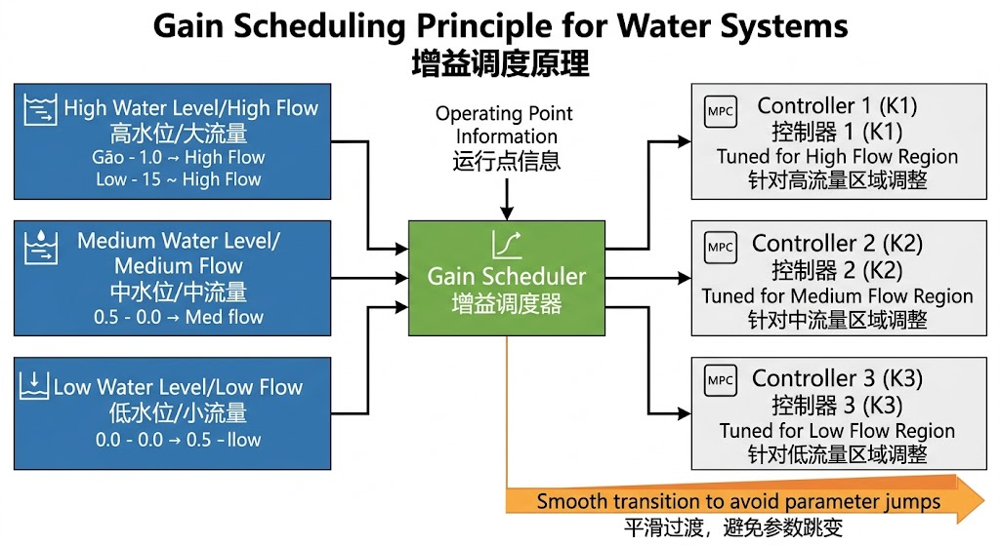
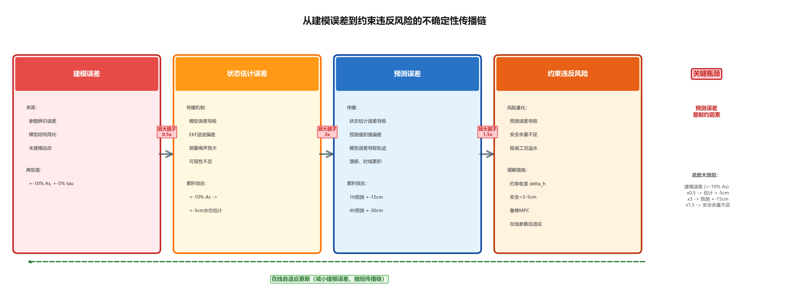

# 第五章 水系统高级建模技术

> **引导案例：某大型调水工程的建模挑战**
>
> 某跨流域调水工程全长 300 公里，包括 8 座梯级泵站、12 段明渠和 3 段长隧洞。工程师团队尝试建立全线统一模型时遇到三大难题：
>
> **难题一：非线性与多工况**。渠道在低水位时流速慢、响应缓；在高水位时流速快、响应急。线性化模型在额定流量下精度可达 95%，但在 30% 流量或 130% 流量时误差飙升至 20%。传统做法是"多模型切换"，但 8 个渠池×3 种工况 = 24 套模型，参数管理成为噩梦。
>
> **难题二：耦合与干扰传播**。上游泵站启停会在 30 分钟内影响下游 3 个渠池的水位，下游闸门误操作会通过回水效应在 2 小时内传播至上游。经典的"分段独立建模"忽略了这种耦合，导致联合调度时出现"此消彼长"的振荡。
>
> **难题三：模型漂移与不确定性**。投运第一年，模型预测精度 RMSE = 4.2 cm；第三年，精度降至 RMSE = 8.9 cm——渠底淤积、水草生长、衬砌老化导致糙率系数从 0.014 漂移到 0.019，但传统离线模型无法自适应。
>
> 本章聚焦这三类"超出基础建模能力"的高级问题，介绍增益调度、多智能体耦合建模、在线参数辨识、不确定性量化等工程技术。这些技术是"从 L2 辅助控制迈向 L3 条件自主"的关键支撑。

---

> **本章阅读指引**
> 
> **适合读者**：已掌握第四章基础建模方法的读者；控制工程背景、研究生层次
> 
> **与前章的关系**：本章基于第四章的 ID/IDZ 模型、状态空间描述和降阶方法，处理更复杂的工程场景
> 
> **与后章的关系**：本章的非线性处理、不确定性量化为第七章"分层分布式优化调度"（原理三）和第八章"安全边界锁定"提供建模基础
> 
> **核心概念**（6 个）：
> - 增益调度（Gain Scheduling）：多工况下的模型自适应
> - MIMO 耦合建模：多输入多输出系统的协同
> - 在线参数辨识：模型自适应修正
> - 不确定性量化：建模误差的传播与边界
> - 鲁棒性余量设计：保守控制策略
> - 形式化检查清单：质量保障工具
> 
> **可略读部分**（如已熟悉）：
> - §5.3.2–5.3.3：RLS 和卡尔曼滤波的数学推导（了解结论即可）
> - §5.4.2：不确定性传播链的数学分析（工程应用为主）
> 
> **必读部分**：
> - §5.5：面向不同水系统的建模策略（实用性强）
> - §5.7：形式化检查清单与典型误区（避坑指南）

---

> **[合规说明]**：关于工程落地、测试覆盖率量化指标与合规审查的详细要求，请参阅本丛书 **T3 卷《标准与工程治理》**。

## 5.1 非线性处理与工程近似策略

ID/IDZ 模型建立在线性化假设之上，当水力工况偏离额定运行点时，非线性特性不可忽略[5-2]。本节介绍工程中处理非线性问题的四种常用策略，从简单到复杂依次递进。

### 5.1.1 增益调度（Gain Scheduling）



<div align="center"><b>图5-1：增益调度原理示意图</b></div>

**原理**：将运行范围按流量（或水位）区间划分为若干子区域，在每个子区域内线性化，获得一族局部线性模型，运行时根据当前状态自动切换[5-6]。

**实施步骤**：
1. 选取 $K$ 个典型工况点（如流量 $Q = 20, 40, 60, 80$ $\text{m}^3$/s）；
2. 在每个工况点解析计算 ID 参数 $(A_s^i, \tau^i)$，$i = 1, \ldots, K$；
3. 定义切换函数 $\sigma(Q_0) = i$ 当 $Q_0 \in [Q_i^-, Q_i^+]$；
4. 控制器增益（MPC 权矩阵和预测矩阵）随 $\sigma$ 切换。

**注意事项**：切换点附近可能出现增益不连续，导致控制量突变。工程中常采用**平滑过渡**（线性插值或模糊调度）：

$$
\hat{\theta}_{ctrl}(Q_0) = \frac{Q_{i+1}^- - Q_0}{Q_{i+1}^- - Q_i^+} \hat{\theta}^i + \frac{Q_0 - Q_i^+}{Q_{i+1}^- - Q_i^+} \hat{\theta}^{i+1}
$$

在过渡区间 $[Q_i^+, Q_{i+1}^-]$ 内线性插值，避免切换抖动。

**适用范围**：明渠灌溉调度（流量变化范围 0.3–3 倍额定流量），渠道水力特性已充分辨识，子区域数量 $K = 3–6$ 即可覆盖大部分工况。

### 5.1.2 反馈线性化（Feedback Linearization）

对于已知非线性结构的水力系统（如水库洪水调度），可通过构造非线性坐标变换，将非线性系统精确转化为线性系统，在变换后的坐标中设计线性控制器。

以单一水库为例，水量平衡方程为：

$$
A(H) \frac{dH}{dt} = Q_{in}(t) - Q_{out}(t)
$$

其中 $A(H)$ 为水位—面积关系（非线性），$Q_{out}$ 为出库流量（控制量，通过闸门开度调节）。令虚拟控制量 $v = dH/dt$，则水位动态被精确化为线性积分器：

$$
\dot{H} = v
$$

在 $v$ 坐标中可直接设计线性 PI/PID 控制器。真实控制量通过反解获得：

$$
Q_{out} = Q_{in}(t) - v \cdot A(H)
$$

**实现条件**：(1) $A(H)$ 需实时可测或可估计（通常由水位—库容曲线导出）；(2) 当 $H \to H_{sill}$（死水位）时 $A(H) \to 0$，反解趋于奇异，需设置安全裕度。

**工程定位**：反馈线性化在理论上能实现精确线性化，但对模型误差和扰动较敏感。工程主线推荐增益调度（§5.1.1）或 LPV-MPC 方法处理非线性，反馈线性化作为特殊非线性结构（如单水库精确解耦）的理论补充工具。

### 5.1.3 扩展卡尔曼滤波（EKF）处理状态估计非线性

水利系统的测量方程往往是非线性的（如基于水位-库容曲线推算出库流量），需要非线性状态估计工具。

**扩展卡尔曼滤波（EKF）** 通过对非线性方程在当前估计点进行 Jacobi 矩阵线性化，将标准卡尔曼滤波推广至非线性情形：

**预测步**：

$$
\hat{x}_{k|k-1} = f(\hat{x}_{k-1|k-1}, u_{k-1})
$$

**协方差**：

$$
P_{k|k-1} = F_{k-1} P_{k-1|k-1} F_{k-1}^\top + Q
$$

**更新步**：

$$
K_k = P_{k|k-1} H_k^\top (H_k P_{k|k-1} H_k^\top + R)^{-1}
$$

$$
\hat{x}_{k|k} = \hat{x}_{k|k-1} + K_k (y_k - h(\hat{x}_{k|k-1}))
$$

其中：

$$
F_{k-1} = \frac{\partial f}{\partial x} \bigg|_{\hat{x}_{k-1}}
$$

$$
H_k = \frac{\partial h}{\partial x} \bigg|_{\hat{x}_{k|k-1}}
$$

分别为状态转移和测量函数的 Jacobi 矩阵。

对于水电站的水位-库容非线性关系、明渠断面面积-水深非线性关系，EKF 可提供比线性卡尔曼滤波精度高 20–40% 的状态估计（代价是计算量增加约 3 倍）。

### 5.1.4 物理约束嵌入策略

水利系统的约束具有强物理意义，必须在模型中显式处理：

- **硬约束**（绝对不能违反）：水库不能超蓄（$V \leq V_{\max}$）、渠道不能干涸（$h \geq h_{\min}$）、闸门开度不能超限（$0 \leq u \leq u_{\max}$）；
- **软约束**（尽量满足但可弛豫）：供水保证率（$P_{\text{supply}} \geq 95\%$）、水位波动限制（$|\Delta h| \leq 0.1$ m/h）。

在 MPC 框架中，硬约束通过优化问题的不等式约束直接实现；软约束通过引入**松弛变量**（Slack Variable）和惩罚项实现，防止优化问题不可行：

$$
\min \sum_{j=1}^P \|y_{k+j} - r\|_Q^2 + \rho \|\varepsilon_j\|^2, \quad \text{s.t.} \quad y_{\min} - \varepsilon_j \leq y \leq y_{\max} + \varepsilon_j, \quad \varepsilon_j \geq 0
$$

当松弛变量 $\varepsilon_j  \gt  0$ 时，说明软约束被违反，系统处于非常规工况，需触发告警甚至 MRC 切换。

**表 5-1：非线性处理策略对比**

| **策略** | 适用工况 | 计算复杂度 | 工程成熟度 | 典型精度提升 |
|-----|---------|-----------|-----------|------------|
| **增益调度** | 流量宽范围变化 | 低 | 高 | IDZ误差从±15%→±5% |
| **反馈线性化** | 已知非线性结构 | 中 | 中 | 适用于水库孔流 |
| **EKF** | 非线性状态估计 | 中 | 高 | 估计误差↓20–40% |
| **物理约束嵌入** | 约束紧迫的工况 | 低（松弛变量） | 高 | 避免可行性失效 |

---

## 5.2 多输入多输出（MIMO）水系统的耦合建模

本章前几节重点介绍了单输入单输出（SISO）的 ID/IDZ 模型。然而，大型水网工程往往涉及多个相互耦合的控制回路[5-2]——多座闸门共同调节多个渠段水位、梯级水电站各站协同控制、水库群联合调度——这些系统本质上是多输入多输出（MIMO）系统，需要专门的耦合建模方法。


<div align="center"><b>图5-2：MIMO耦合系统拓扑</b></div>

### 5.2.1 MIMO 水系统的耦合特征

**渠道并联/串联耦合**：在有多个调节闸的长距离渠道中，任意一座闸门的操作不仅影响相邻渠段，还通过水流传播影响远端渠段。上游闸门开度 $u_1$ 对下游第 $k$ 节渠段水位 $h_k$ 的影响需经过 $k$ 个水力传播过程的叠加。

**梯级水电站的站间耦合**：以大渡河梯级为例，上游电站出力调整 → 下泄流量变化 → 经时延 $\tau_{ij}$ 到达下游电站 → 改变下游电站坝前水位 → 影响水头和出力。这种耦合构成一个有向图，上游电站的任何调整都以延迟方式向下游传播。

**水量分配的竞争耦合**：在灌区调水分配中，干渠向各支渠分水，总输水能力有上限，各支渠需水量竞争同一水源，构成竞争性耦合约束。

### 5.2.2 MIMO 状态空间模型的构建

对于 $N$ 个串联渠池、$M$ 个控制闸门的系统，将各渠池 IDZ 模型集成为 MIMO 状态空间：

**状态向量**：$\mathbf{x} = [h_1, h_2, \ldots, h_N]^\top \in \mathbb{R}^N$（各渠池下游水位偏差）

**控制向量**：$\mathbf{u} = [q_1, q_2, \ldots, q_M]^\top \in \mathbb{R}^M$（各闸门流量调整量）

**状态矩阵**（忽略时延简化）：$$A = \begin{bmatrix}
-a_1 & 0 & \cdots & 0 \\
b_2 & -a_2 & \cdots & 0 \\
\vdots & \ddots & \ddots & \vdots \\
0 & \cdots & b_N & -a_N
\end{bmatrix}, \quad
B = \begin{bmatrix}
b_{11} & 0 & \cdots \\
0 & b_{22} & \cdots \\
\vdots & & \ddots
\end{bmatrix}$$其中 $a_i = 1/T_{p,i}$（渠池 $i$ 的蓄量时间常数倒数；此处对角元素 $-a_i$ 反映出流边界条件（如自由堰流）引入的自调节特性；对于纯积分型渠池（闸控出流），$a_i \to 0$，矩阵退化为纯积分器），$b_i = a_i$（相邻渠池水力耦合系数），$b_{ii} = A_{d,i}$（闸门 $i$ 对渠池 $i$ 的积分增益）。$A_{d,i}$ 即CHS体系中第 $i$ 个渠池的水面面积 $A_{s,i}$，两者含义相同。

含时滞系统的连续域近似采用Padé近似（$s$域有理逼近）处理指数项 $e^{-\tau_i s}$：一阶 Padé 近似为 $e^{-\tau s} \approx (1 - \tau s/2)/(1 + \tau s/2)$，二阶近似为 $(1 - \tau s/2 + \tau^2 s^2/12)/(1 + \tau s/2 + \tau^2 s^2/12)$，在 $|\tau s|  \lt  1$ 范围内误差小于 2%。数字实现中，若纯时延为采样周期整数倍，应采用状态增广法（$z^{-d}$移位寄存器）实现精确离散化。

### 5.2.3 耦合矩阵的可控可观性分析

MIMO 系统的可控性矩阵维度为 $n \times (n \cdot m)$（$m$ 为输入维度），Kalman 判据仍适用。但工程中更关心**结构可控性**（Structural Controllability）——仅基于系统的图结构（哪些渠池与哪些闸门连通），而不依赖具体参数值，判断系统是否可控。

**Lin's 结构可控性判据**（Lin, 1974）：MIMO 系统结构可控当且仅当：
1. 所有状态变量均与某输入变量通过有向路径连通（无孤立状态）；
2. 系统不存在不可控"匹配缺陷"（Dilation Defect）。

对于串联渠道，结构可控性等价于：每座节制闸下游的渠段均在某座控制闸的"影响锥"（Influence Cone）内。若某渠段夹在两座相邻闸门之间，但均无从上游传递的有效控制路径，该渠段结构不可控，需增加控制闸。

### 5.2.4 MIMO-MPC 中的解耦策略

MIMO 水系统的 MPC 设计面临两个主要挑战[5-14]：（1）维数灾难——$N = 20$ 个渠池时，优化变量维度可达 $20 \times P$（$P$ 为预测步数），计算量随 $N$ 和 $P$ 的乘积增长；（2）耦合干扰——某一渠段的控制动作影响邻近渠段，引发协调困难。

**分散式 MPC（Decentralized MPC）**：每个渠池单独设计 MPC 控制器，仅考虑自身的局部目标函数和约束，通过通信网络共享必要信息（如上游闸门状态）[5-13]。适用于耦合较弱的渠道系统，计算量为串联各单站 MPC 之和。缺点：全局优化性能有所牺牲，约 5–15% 的控制效率损失。

**层次化 MPC（Hierarchical MPC）**：分为协调层（计算全局负荷分配、水量分配目标）和执行层（各站实现局部 MPC）。协调层求解慢时间尺度（15–60 分钟）全局优化问题，向执行层发送设定点；执行层求解快时间尺度（1–10 分钟）局部跟踪控制。这正是第十三章 HydroOS 三层架构中物理AI引擎层（HydroCore）的多策略融合结构的对应体现。

**表 5-2：MIMO-MPC 策略对比**

| **策略** | 全局最优性 | 计算复杂度 | 通信需求 | 适用规模 |
|-----|-----------|-----------|---------|---------|
| **集中式 MPC** | 最优 |$O(N^3 P^3)$| 无需 |$N \leq 10$|
| **分散式 MPC** | 次优（-5~15%） |$O(N \cdot P)$| 低 |$N \leq 100$|
| **层次化 MPC** | 接近最优（-2~8%） | 低（协调层小） | 中 |$N \leq 1000$|
| **滚动时域分解** | 接近最优 | 中 | 中 |$N \leq 100$|

---

## 5.3 参数辨识与在线自适应建模

### 5.3.1 为什么需要在线辨识

§4.5.2的解析公式给出了 ID/IDZ 参数的理论值，然而实际工程中模型参数随时间漂移是常态：渠道淤积改变过水断面，冰期糙率系数变化，闸门磨损导致流量系数偏移，季节性水温影响黏度……这些变化使基于设计参数辨识的"一次定稿"模型逐渐失准。

在线辨识（Online Identification）解决的核心问题是：**在不中断正常运行的前提下，利用运行数据实时更新模型参数**[5-7][5-16]，使 MPC 控制器始终基于接近真实的模型工作。这是 CHS 原理六（认知增强）和原理八（全生命周期自主演进）在建模层面的直接体现。正如雷晓辉等[5-1]从学科发展角度所指出的，水资源系统分析正在经历从"静态平衡"到"动态控制"的范式转变，而在线自适应建模正是这一转变在模型层面的核心支撑技术。

### 5.3.2 递推最小二乘法（RLS）

递推最小二乘（Recursive Least Squares, RLS）是工程中最常用的在线辨识方法，其核心优势是**不需要存储全部历史数据**，可在常数内存中滚动更新。


<div align="center"><b>图5-3：在线参数辨识流程</b></div>

**标准形式**：将 ID 模型的离散化形式表达为线性回归形式[5-3]：

$$
y(k) = \varphi^\top(k) \theta + \varepsilon(k)
$$

其中 $\theta$ 为待辨识参数向量，$\varphi(k)$ 为回归向量，$\varepsilon(k)$ 为噪声。注意，纯时延参数 $\tau^d$ 不能直接作为线性回归参数——时延的变化使回归向量本身发生结构变化。工程中通常采用两步法：**第一步**，将 ID 模型离散化为 ARX（或 FIR）结构，辨识离散系数 $\theta_{ARX} = [a_1, b_0, b_1, \ldots]^\top$；**第二步**，由辨识得到的离散系数反推物理参数 $A_s^d$ 和 $\tau^d$。对于时延变化场景，也可采用"固定时延网格 + 多模型并行辨识 + 最小残差选择"的方案。

**递推更新公式**：

$$
\hat{\theta}(k) = \hat{\theta}(k-1) + K(k) \left[ y(k) - \varphi^\top(k) \hat{\theta}(k-1) \right]
$$

$$
K(k) = \frac{P(k-1)\varphi(k)}{\lambda + \varphi^\top(k) P(k-1) \varphi(k)}
$$

$$
P(k) = \frac{1}{\lambda} \left[ P(k-1) - K(k)\varphi^\top(k) P(k-1) \right]
$$

式中 $\lambda \in (0,1]$ 为**遗忘因子**，控制历史数据的权重衰减速率。$\lambda = 0.99$ 意味着约 100 步之前的数据影响降至当前的 $0.99^{100} \approx 37\%$；$\lambda = 0.95$ 时仅保留约 20 步有效记忆。对于渠道季节性变化（时间尺度月级），推荐 $\lambda = 0.98$；对于快速变化的闸门磨损（时间尺度周级），推荐 $\lambda = 0.95$。

**工程挑战一：激励充分性**。RLS 收敛的必要条件是输入信号具有**持续激励**（Persistent Excitation, PE）——信号频谱需覆盖模型的敏感频率范围。日常调度中流量平稳变化时，激励可能不充分，导致参数辨识漂移。解决方案：在非敏感时段（如凌晨低需水期）注入小幅 PRBS 激励信号，振幅控制在水位目标值的 ±2cm 以内，不影响供水服务，但可显著改善激励充分性。

**工程挑战二：参数辨识与控制的协同**。实时辨识的参数若直接用于 MPC 计算，可能导致控制行为突变（参数跳变）。工程实践中通常设置参数平滑滤波：

$$
\hat{\theta}_{ctrl}(k) = \alpha \hat{\theta}_{ctrl}(k-1) + (1-\alpha) \hat{\theta}(k)
$$

其中 $\alpha = 0.9$，即控制器参数以 10 步时间常数平滑跟踪辨识结果，避免突变。

### 5.3.3 卡尔曼滤波器用于参数追踪

将模型参数扩展为状态变量，可将参数追踪问题纳入卡尔曼滤波框架，获得在统计意义上最优的参数估计，同时提供参数不确定性量化（协方差矩阵 $P$）。

**扩展状态向量**：$\tilde{x} = [x_{\text{水位}}; \theta]$，动力学方程：

$$
\tilde{x}(k+1) = \begin{bmatrix} f(x, \theta, u) \\ \theta + w_\theta \end{bmatrix}
$$

其中 $w_\theta \sim \mathcal{N}(0, Q_\theta)$ 为参数漂移过程噪声（建模为随机游走）。$Q_\theta$ 反映参数变化速率先验：蓄水面积 $A_s$ 年变化率约 5–10%（因淤积），传输延迟 $\tau_d$ 冰期变化约 20–30%，据此设定 $Q_\theta$ 的对角元素。

**实际应用效果**（某调水渠道运行数据）：引入在线辨识（RLS,$\lambda = 0.98$）后，MPC 在冰期的水位控制误差从 ±8cm 降至 ±3cm，自动控制可用率（无需人工干预的比例）从 72% 提升至 91%。

### 5.3.4 建模精度评估与模型切换决策

在线辨识系统需要配套**模型精度监控机制**，以决定何时触发参数更新或退出自动控制。

**残差监控**：计算滑动窗口（如过去 20 个控制步）内的预测残差均方根（RMSE）：若 RMSE 超过阈值 $\epsilon_{warn}$（如 5cm），触发参数加速更新（降低 $\lambda$）；若 RMSE 超过 $\epsilon_{alarm}$（如 10cm），发出告警，通知操作员检查模型。

**模型年龄追踪**：记录参数上次大幅更新（幅度 > 10%）的时间戳，若距今超过 6 个月且未触发更新，标记为"模型老化"警告，提示开展专项辨识试验。

**多模型并行策略**：对于运行范围宽（如流量 10–120 $\text{m}^3$/s）的渠道，在不同流量区间维护多套 ID 模型（增益调度），实时根据当前流量自动切换。各套模型独立在线辨识，互不干扰。

**表 5-3：建模精度评估与响应决策**

| **RMSE 水平** | 判断 | 控制系统响应 | 运维动作 |
|----------|------|------------|---------|
| **< 3 cm** | 优秀 | 正常运行 | 无 |
| **3–5 cm** | 良好 | 正常运行，加快辨识 | 记录日志 |
| **5–8 cm** | 警告 | 预测期缩短至正常值的 50% | 检查传感器，考虑辨识试验 |
| **8–12 cm** | 告警 | 切换至保守控制模式（保守约束） | 人工介入，模型核查 |
| **> 12 cm** | 失效 | 运行模式降级并请求人工接管 | 启动紧急重辨识程序 |

**自适应MPC完整流程**：综合上述在线辨识、精度监控和模型切换机制，形成自适应MPC的完整算法框图（见图5-4）。该框图展示了从数据采集、参数辨识、模型验证到控制器更新的闭环流程，是CHS原理六（认知增强）和原理八（自主演进）在建模层面的具体实现。


<div align="center"><b>图5-4：自适应MPC完整算法框图</b></div>

---

## 5.4 建模误差的传播与不确定性量化

模型永远不等于真实系统——这一事实在控制理论中被称为"模型不确定性"（Model Uncertainty）[5-8]。工程师的责任不是假装不确定性不存在，而是**量化不确定性、设计鲁棒系统、使系统在不确定性范围内仍能安全工作**。本节介绍水系统建模中常见的不确定性来源及其对控制性能的影响传播链路。

### 5.4.1 建模不确定性的分类

**结构不确定性（Structural Uncertainty）**：选错了模型类型（如用 ID 模型描述水锤显著的有压管道）或遗漏了重要动力学项（如忽略支渠侧流对主干渠的影响）。结构不确定性通常导致系统性偏差，增大激励信号振幅无法消除，必须通过更换模型结构来修正。

**参数不确定性（Parametric Uncertainty）**：模型结构正确，但参数值不准确，表现为参数真值 $\theta^*$ 与辨识估计值 $\hat{\theta}$ 之间的误差 $\Delta\theta = \theta^* - \hat{\theta}$。水利系统的主要参数不确定性来源：

| **参数** | 典型不确定性范围 | 主要原因 |
|-----|--------------|---------|
| **渠道糙率 $n$** | ±15–30% | 季节性藻类、淤积、温度影响 |
| **蓄水面积 $A_s$** | ±10–20% | 横断面变化、淤积、估算误差 |
| **传输延迟 $\tau_d$** | ±5–15% | 流量-波速关系误差 |
| **回水时间 $\tau_m$** | ±20–40% | 边界条件简化 |
| **泵机效率曲线** | ±5–10% | 设备老化、运行工况偏移 |

**输入/扰动不确定性**：实测控制输入 $\hat{u}$ 与真实控制效果之间存在误差（如闸门开度传感器精度），外部扰动 $d$（来水流量）难以准确预报，均构成不确定性输入。

### 5.4.2 不确定性到控制性能的传播链



<div align="center"><b>图5-5：不确定性传播链</b></div>

**不确定性传播示意**：
```
参数不确定性 Δθ
    → 预测误差 Δy_pred = f(Δθ, u, x)
        → MPC 优化问题求解出次优解 Δu*
            → 闭环控制误差 Δy_cl ≠ 0
                → 是否触发超限告警（与 ODD 边界对比）
```

对于线性 ID 模型 $P(s) = \frac{1}{A_s \cdot s} e^{-\tau_d s}$，闭环稳态水位对参数摄动的灵敏度可通过局部摄动分析获得。以单渠池 MPC 为例，在标称工作点附近：

- **对 $A_s$ 的灵敏度**：$A_s$ 增大 $\delta$ 倍，等效于控制增益降低 $\delta$ 倍，稳态误差近似正比于 $\delta A_s / A_s$。
- **对 $\tau_d$ 的灵敏度**：时延增大 $\delta\tau_d$ 会导致 MPC 预测偏差，峰值瞬态误差近似正比于 $\delta\tau_d \cdot |du/dt|_{\max} / A_s$。

**工程经验规律**（适用于明渠 MPC）：
- 蓄水面积 $A_s$ 误差 10% → 稳态水位误差约 1–3 cm（视预测时域而定）
- 传输延迟 $\tau_d$ 误差 15% → 峰值瞬态误差约 3–6 cm，调节时间延长约 20%
- 糙率 $n$ 误差 20% → 通过 $A_s$ 和 $\tau_d$ 的双重影响，总误差约 5–8 cm

### 5.4.3 鲁棒性余量设计


<div align="center"><b>图5-6：鲁棒MPC约束收紧策略</b></div>

**标称模型加不确定性界**的设计方法（Robust MPC）[5-9]：设参数真值 $\theta^*$ 满足不确定性界 $|\theta^* - \hat{\theta}| \leq \Delta\theta_{max}$，设计 MPC 控制器使得在该不确定性范围内，系统均满足约束：

$$
y_{min} + \epsilon(\Delta\theta_{max}) \leq y \leq y_{max} - \epsilon(\Delta\theta_{max})
$$

其中 $\epsilon(\Delta\theta_{max})$ 为约束收紧量（Constraint Tightening），反映不确定性引起的最坏情况偏差。工程中通常保守估计：

$$
\epsilon \approx \|\mathcal{G}_{yu}(j\omega)\| \cdot \|\Delta P(j\omega)\|_{\infty} \cdot \|u\|_{\infty}
$$

其中 $\Delta P(j\omega) = P(j\omega, \theta^*) - P(j\omega, \hat{\theta})$ 为模型误差的频域表示，$\mathcal{G}_{yu}$ 为从控制输入到输出的闭环传递函数矩阵。

**实用简化方法**：在 MPC 的约束边界内收紧一个"安全余量"层：若水位允许范围为 $[h_{min}, h_{max}]$（宽度 20cm），则 MPC 优化时使用收紧范围 $[h_{min}+5cm, h_{max}-5cm]$（各收紧 5cm）。该安全余量的具体数值应通过 Monte Carlo 仿真或基于工程场景库的参数摄动分析确定——在参数不确定性界 $\Delta\theta_{\max}$ 下，枚举所有极端参数组合的闭环响应，取最坏偏差作为 $\epsilon$。

### 5.4.4 从不确定性量化到 ODD 定义

本节的不确定性分析是第四章与第七至八章（ODD / 安全包络）之间的连接纽带：**ODD的约束类(C)和鲁棒性(R)边界由不确定性量化支撑，而水力(H)、输入(I)和环境(E)边界由物理极限和运行规程确定**[5-11]。

当工况条件（如流量、水深、季节）使得模型不确定性 $\Delta\theta$ 超过鲁棒性设计所能容忍的最大值 $\Delta\theta_{max}$ 时，系统已经超出 ODD，应触发 MRC（最小风险条件）切换。这将在第八章安全包络框架中进一步定义和实现。

**小结**：建模误差分析不是"纸上谈兵"的理论练习，而是确保水系统控制系统在真实工程中安全运行的必要工程步骤。表 5-4 给出了从建模到安全运行的完整质量保证链路：

**表 5-4：建模质量保证链路**

| 阶段 | 活动 | 质量指标 | 工具 |
|-----|------|---------|-----|
| **建模** | 参数辨识与验证 | 模型拟合度 > 85%；RMSE < 5cm | 最小二乘辨识；Simulink 仿真 |
| **分析** | 不确定性量化 | 最坏情况误差 $\epsilon$ 可接受 | 鲁棒分析工具箱 |
| **设计** | 约束收紧设计 | 余量 $\epsilon$< 安全余量预算 | Robust MPC 求解器 |
| **验证** | MIL/SIL/HIL 测试 | 在参数摄动 ±$\Delta\theta_{max}$ 下均通过 | 第九章在环验证框架 |
| **运行** | 在线残差监控 | RMSE < 阈值 $\epsilon_{alarm}$| §5.3.4建模精度评估 |

---

## 5.5 面向不同水系统类型的建模策略

水系统涵盖灌渠、调水干线、水库群、城市管网、梯级水电站等多种工程形态，各类系统在主导动力学特征和控制需求上存在显著差异。本节归纳各类系统的建模策略选择准则，为工程案例实践提供理论对接。

### 5.5.1 明渠灌区：ID/IDZ 优先策略

明渠灌区的控制目标以水位跟踪为主，渠池动力学符合 IDZ 模型的适用条件（低弗劳德数、小扰动、准稳态）[5-5]。建模策略：

1. **主模型**：IDZ/ID 传递函数。参数 $(A_s, \tau_d, \tau_m)$ 通过§4.5.2的解析公式或渠道阶跃响应辨识获得[5-4]。
2. **辅助模型**：当需要多渠池串联控制时，采用状态空间描述，以各渠池水位为状态变量，构建分布式控制的可控可观性基础。
3. **非线性扩展**：增益调度（Gain Scheduling）策略——在 5 个典型流量工况下分别辨识 IDZ 参数，实时切换，覆盖全运行域。
4. **模型精度要求**：水位稳态误差 <3cm（A 类工况），>15cm 进入 MRC。

> **典型案例参照**：长距离明渠调水工程中，各渠池独立 IDZ 辨识、串联 MPC 控制的策略已在第十五章的工程案例中详细展开。

### 5.5.2 调水长距离管道：时延主导策略

长距离有压输水管道（引调水工程）的控制特性与明渠有根本差异：水击波速远大于明渠波速（量级 3–8 m/s），主导动力学是**时延 + 液压耦合**[5-12]，而非积分特性。考虑流固耦合效应的标准波速公式为：

$$
c_w = \sqrt{\frac{K/\rho}{1 + KD/(eE_p)}}
$$

其中 $K$ 为水的体积弹性模量（约 2.2 GPa），$\rho$ 为水密度，$D$ 为管道内径，$e$ 为管壁厚度，$E_p$ 为管壁弹性模量。对于钢管，$c_w$ 典型值为 900–1200 m/s。建模策略：

1. **控制模型**：一阶惯性 + 时延传递函数 $G(s) = K e^{-\tau s} / (Ts+1)$，参数来自管道长度、波速、摩阻。此模型用于 MPC 在线优化。
2. **水击校核模型**：对高程变化大的管段（如穿越山体隧洞），需补充 Allievi 方程的瞬态分析模型，确认最大/最小压力包线。注意：控制模型和水击校核模型是两套独立模型——前者追求计算速度，后者追求瞬态精度。
3. **分区控制**：将长管道按分水口划分为若干控制区间，各区间独立建模，通过通信网络实现协调。
4. **常见陷阱**：将管道误用 ID 模型——管道本身无积分特性（稳态有自调节），水力积分来自末端水箱/水库，必须显式建模末端蓄水容积。

> **典型案例参照**：胶东调水工程泵站-管道-平衡池系统的时延补偿策略（详见本丛书《渠道与管道控制》分册）。

### 5.5.3 水库及梯级水电站：多时间尺度嵌套策略

水库调度涉及洪水过程（小时尺度）、发电优化（日尺度）、旱涝应对（月-季尺度），各尺度的主导动力学截然不同[5-10]。单一模型无法兼顾，必须采用**多时间尺度嵌套**策略：

| **时间尺度** | 典型应用 | 推荐模型 | 关键参数 |
|---------|---------|---------|---------|
| **分钟级（1–15 min）** | 水库水位/闸位调节 | ID 传递函数 | 渠池/库区蓄水面积 $A_s$，传输延迟 $\tau_d$；对于AGC频率调节，需使用水轮机-引水系统的机组线性模型（见第八章）|
| **小时级（1–24 h）** | 日内发电计划、实时防洪 | 分段线性库容曲线 | 库容-水位关系 $V(Z)$，入库流量预报误差 |
| **日-月级（>1 d）** | 水文调节、用水协商 | 随机模拟 / 隐式随机优化（ISO） | 来水频率分布，水库特征曲线 |

梯级水电站的建模还需额外处理**站间水力耦合**：上游电站出力调整→引起下泄流量变化→经过传播时延后影响下游水位。大渡河梯级的站间时序补偿模型详见本丛书《梯级水电站联合调度》分册。

### 5.5.4 城市供水管网：图论 + 节点压力模型

城市供水管网与明渠最大的区别在于：有压封闭流动无自由液面，拓扑结构为有向图（管段为边，节点为顶点），控制目标是**节点压力满足服务水压**[5-14]，而非水位跟踪。建模策略：

1. **稳态水力模型**：基于质量守恒（节点方程）和能量守恒（管段 Hazen-Williams 公式），建立 $n$ 节点压力、$m$ 管段流量的非线性方程组。
2. **线性化近似**：在设计流量附近线性化，得到节点压力对泵开关/阀门开度的线性映射矩阵 $A$（灵敏度矩阵），支持 MPC 设计。
3. **状态估计**：传感器数远少于节点数，通过可观性矩阵判断最优监测点（第六章详述），配合卡尔曼滤波估计全网压力状态。
4. **泄漏检测**：在状态估计框架中，引入泄漏节点作为附加状态，利用残差分析定位泄漏。

### 5.5.5 建模策略快速选择图


<div align="center"><b>图5-7：面向不同水系统的建模策略决策树</b></div>


> **与 CHS 原理的联系**：各类系统的形式化模型是 CHS 原理一（传递函数化/状态空间化）的直接体现，也是原理三（MPC）的前提——没有可用的预测模型，MPC 无从施展。

---

## 5.6 工程实例：管网传递函数辨识


<div align="center"><b>图5-8：城市供水管网拓扑</b></div>

### 5.6.1 工程背景

某城市供水管网，服务面积约45 $\text{km}^2$，管网总长数百 km，设 10 座泵站和 50 个压力监测点。

**工程特点**：
- 水力特性：环状管网，压力 0.3-0.6MPa，流速 1-3m/s
- 控制目标：维持关键节点压力在设定值±0.05MPa 范围内
- 约束条件：泵站启停间隔≥15 分钟，压力不超管道设计压力

### 5.6.2 传递函数辨识

**频域激励**：
- 激励方法：在泵站进行正弦变频激励，频率从 0.001Hz 到 0.1Hz[5-7]
- 激励次数：每个泵站重复 5 次，共 50 次试验
- 数据处理：FFT 分析，提取频率响应[5-3]

**传递函数形式**：

$$
G(s) = \frac{K}{1+Ts} e^{-\tau s}
$$

其中 K 为增益，T 为时间常数，τ为延迟时间。

**参数辨识结果**：
- 增益 K：0.02~0.08 MPa/(%开度)（泵站开度变化 1%，压力变化 0.02~0.08MPa）
- 时间常数 T：5-30 分钟
- 延迟时间τ：2-15 分钟（从泵站到监测点）

### 5.6.3 模型应用

**压力控制**：
- 控制策略：基于传递函数的 PID 控制
- 控制周期：5 分钟
- 控制精度：±0.05MPa

**能耗优化**：
- 优化目标：泵站能耗最小化
- 优化方法：基于模型的预测控制
- 节能效果：年节电约32万度

**泄漏检测**：
- 检测方法：基于模型的压力残差分析
- 检测精度：定位误差<100m
- 实施效果：年减少漏损约15万m³

---

## 5.7 形式化检查清单

### 5.7.1 建模前检查

- [ ] 明确控制目标（水位跟踪？能耗优化？）
- [ ] 确定系统边界（哪些纳入模型，哪些作为扰动）
- [ ] 收集基础数据（地形、断面、设备参数）
- [ ] 确定状态变量（物理可解释、可测量）
- [ ] 确定控制变量（执行器能力、约束）

### 5.7.2 建模中检查

- [ ] 选择合适的建模方法（状态空间/传递函数）
- [ ] 确定模型阶数（平衡精度与复杂度）
- [ ] 辨识模型参数（试验数据/历史数据）
- [ ] 验证模型精度（独立数据验证）

### 5.7.3 建模后检查

- [ ] 模型是否满足控制设计需求？
- [ ] 模型参数是否物理可解释？
- [ ] 模型是否可实时更新？
- [ ] 模型文档是否完整？

### 5.7.4 模型维护检查

- [ ] 模型参数定期校正（至少每年一次）
- [ ] 模型版本管理建立
- [ ] 模型变更审批流程建立
- [ ] 模型性能评估定期开展

---

### 5.7.5 形式化的典型误区

#### 5.7.5.1 误区一：形式化是"为了数学而数学"

**误区**：认为形式化是理论游戏，没有工程价值。

**正解**：形式化是工程实践的必要前提。
- 形式化统一系统语言，消除歧义
- 形式化使"运行经验"可计算、可验证
- 形式化是控制设计、在环验证的基础

**建议**：从工程需求出发，不要追求数学复杂，要追求实用。

#### 5.7.5.2 误区二：模型"越复杂越好"

**误区**：认为模型越复杂，精度越高。

**正解**：模型需要"合适"，不是"越复杂越好"。
- 复杂模型：精度高，计算量大，不适合在线控制
- 简单模型：计算量小，精度低，可能不满足控制需求
- 合适模型：平衡精度与计算量，满足控制需求

**建议**：控制模型使用降阶模型（IDZ、一阶惯性 + 时滞），仿真模型使用高保真模型（圣维南方程）。

#### 5.7.5.3 误区三：模型"一次辨识，终身使用"

**误区**：认为模型辨识一次完成，后续无需更新。

**正解**：模型需要定期校正。
- 渠道淤积：糙率变化，模型参数漂移
- 设备老化：效率曲线变化，模型参数漂移
- 季节性变化：水草生长、结冰等，模型参数漂移

**建议**：建立模型参数定期校正机制（至少每年一次）。

#### 5.7.5.4 误区四：状态空间与传递函数"二选一"

**误区**：认为状态空间和传递函数只能选一个。

**正解**：两者可以结合使用。
- 状态空间：适合多变量、非线性系统，用于控制设计
- 传递函数：适合单变量、线性系统，用于频域分析
- 结合使用：状态空间用于 MPC 设计，传递函数用于稳定性分析

**建议**：根据应用场景选择合适的模型形式，或两者结合使用。

---

---

## 本章小结

本章介绍了超越基础建模的高级技术，解决工程中常见的三类复杂问题：

**1. 非线性与多工况适应**（§5.1）：当水力条件偏离线性化工作点时，增益调度、反馈线性化和 EKF 提供了三种工程可行的近似策略。核心思想是"用多个局部线性模型逼近全局非线性"，而非追求精确的非线性控制。

**2. 多输入多输出（MIMO）耦合**（§5.2）：长距离水系统的耦合无法忽略。分层分布式建模将全局耦合分解为"局部强耦合 + 邻域弱耦合"，通过通信协调实现整体优化，避免集中式建模的维度灾难。

**3. 模型漂移与不确定性**（§5.3-5.4）：工程模型永远不完美。在线参数辨识（RLS、卡尔曼滤波）使模型追踪慢变参数，不确定性量化将建模误差转化为控制余量，确保系统在模型误差范围内仍然安全。

**工程启示**：
- **模型分层使用**：离线高保真仿真（验证） + 在线降阶模型（控制） + 数据校正（自适应）
- **鲁棒性优先**：宁可控制保守，不可冒安全风险——这是从 L2 到 L3 的核心差异
- **形式化检查清单**（§5.7）：系统化的建模质量保障，避免典型误区

本章与第四章共同构成"水系统形式化建模"的完整知识体系。第四章提供基础工具（状态空间、传递函数、ID/IDZ），本章应对复杂场景（非线性、耦合、不确定性）。后续章节将在此基础上展开控制设计（第七章）、安全包络（第八章）和在环验证（第九章）。

---

## 附录 5-A 与在环验证和工程案例的联系

本章的高级建模技术在第九章"在环验证（xIL）"中得到全面应用[5-15]：

**MIL（模型在环）阶段**：
- §5.1 的增益调度模型用于多工况仿真
- §5.2 的 MIMO 耦合模型用于全系统仿真
- §5.4 的不确定性量化用于边界测试

**SIL（软件在环）阶段**：
- §5.3 的在线辨识算法嵌入控制软件
- §5.4 的鲁棒性余量设计转化为约束收紧

**HIL（硬件在环）阶段**：
- §5.3 的参数辨识用于实时校准
- §5.4 的不确定性边界用于安全监督

**工程案例关联**（详见本丛书工程实践分册）：
- 胶东调水工程：§5.5.1 长距离明渠建模策略的实践
- 沙坪水电站：§5.2 MIMO 耦合建模的梯级应用
- 大渡河梯级：§5.3 在线参数辨识的梯级水电应用

---

## 本章术语表

| **术语** | 英文 | 定义 | 首次出现 |
|------|------|------|---------|
| **增益调度** | Gain Scheduling | 根据工况点切换线性模型参数的非线性控制方法 | §5.1.1 |
| **反馈线性化** | Feedback Linearization | 通过非线性状态反馈抵消系统非线性的控制策略 | §5.1.2 |
| **扩展卡尔曼滤波** | EKF (Extended Kalman Filter) | 处理非线性系统状态估计的递推滤波器 | §5.1.3 |
| **MIMO 系统** | Multi-Input Multi-Output | 多输入多输出系统，存在输入输出间的耦合 | §5.2 |
| **递推最小二乘** | RLS (Recursive Least Squares) | 在线参数辨识的经典算法 | §5.3.2 |
| **参数不确定性** | Parametric Uncertainty | 模型参数真值与估计值之间的误差 | §5.4.1 |
| **结构不确定性** | Structural Uncertainty | 模型结构与真实系统之间的差异 | §5.4.1 |
| **鲁棒性余量** | Robustness Margin | 系统对建模误差和扰动的容忍能力 | §5.4.3 |

---

## 本章练习与思考题

### L1 基础题

1. **增益调度设计**：某渠道在设计流量 $Q_0 = 50$ $\text{m}^3$/s 下的时滞 $\tau_0 = 3600$ s，在 $Q = 30$ $\text{m}^3$/s 下测得 $\tau_1 = 4200$ s。请设计线性插值的增益调度策略，给出 $\tau(Q)$ 的计算公式。

2. **耦合强度判断**：两个相邻渠池，上游控制对下游的影响在 30 分钟内达到峰值（幅值为稳态值的 80%），下游回水对上游的影响在 2 小时内达到峰值（幅值为稳态值的 10%）。请判断这是"强耦合"还是"弱耦合"系统，并说明理由。

3. **参数漂移检测**：某 ID 模型的蓄水面积 $A_s$ 初始辨识值为 $25{,}000$ $\text{m}^2$，运行 3 年后在线辨识值为 $28{,}000$ $\text{m}^2$。假设真实淤积导致有效蓄水面积每年增加 3%，请计算模型漂移率并判断是否需要重新校准。

### L2 提高题

1. **EKF 稳定性分析**：某水库水位-库容关系为 $V = \alpha h^\beta$（$\beta = 2.3$），使用 EKF 估计水位。请推导观测矩阵

$$
H_k = \frac{\partial h}{\partial V}
$$

的表达式，并分析在低水位和高水位工况下的估计精度差异。

2. **MIMO 分布式建模**：某调水工程有 5 个渠池，假设每个渠池只与相邻渠池耦合。请设计分布式建模方案：(a) 确定每个局部模型的输入输出维度；(b) 说明相邻渠池间需要交换哪些信息；(c) 估算通信数据量（假设采样周期 5 分钟）。

3. **不确定性传播计算**：某 IDZ 模型参数 $A_s$ 的不确定性为 ±10%，$\tau_d$ 的不确定性为 ±5%。使用 MPC 控制时，请估算在 1 小时预测时域内，水位预测误差的累积上界（提示：考虑积分效应和时滞叠加）。

### L3 综合题

1. **多工况建模策略对比**：某长距离渠道运行范围 20-100 $\text{m}^3$/s。请对比三种建模策略的优缺点：(a) 单一线性模型（在 60 $\text{m}^3$/s 线性化）；(b) 三模型增益调度（在 30/60/90 $\text{m}^3$/s 建立三套模型）；(c) 反馈线性化（实时补偿非线性项）。从计算量、精度、鲁棒性三个维度评价。

2. **在线辨识与控制协同**：设计某渠池的自适应 MPC 方案，要求：(a) 使用 RLS 在线辨识 IDZ 模型参数；(b) 平滑滤波避免参数突变导致控制抖动；(c) 设计参数更新触发条件（何时认为模型漂移需要重新辨识）。给出完整算法框图和关键参数取值建议。

3. **鲁棒 MPC 设计**：某水库模型参数 $\theta$ 的真值范围为 $\theta \in [\theta_{min}, \theta_{max}]$。请设计鲁棒 MPC 约束收紧策略，确保在参数不确定性范围内，水库水位始终满足 $h_{min} + \Delta h_{safe} \leq h \leq h_{max} - \Delta h_{safe}$。推导约束收紧量 $\Delta h_{safe}$ 与参数不确定性的关系。

---

## 本章参考文献

[5-1] 雷晓辉, 许慧敏, 何中政, 等. 水资源系统分析学科展望：从静态平衡到动态控制[J]. 南水北调与水利科技(中英文), 2025, 23(04): 770-777.

[5-2] Litrico X, Fromion V. Modeling and Control of Hydrosystems [M]. London: Springer, 2009.

[5-3] Van Overloop P J. Model Predictive Control on Open Water Systems [D]. Delft: Delft University of Technology, 2006.

[5-4] Wylie E B. Control of transient free-surface flow [J]. Journal of the Hydraulics Division, ASCE, 1969, 95(1): 347-361.

[5-5] ASCE Task Committee. Canal Automation for Irrigation Systems: ASCE MOP No. 131 [M]. Reston: ASCE, 2014.

[5-6] Åström K J, Murray R M. Feedback Systems: An Introduction for Scientists and Engineers [M]. 2nd ed. Princeton: Princeton University Press, 2021.

[5-7] Ljung L. System Identification: Theory for the User [M]. 2nd ed. Upper Saddle River: Prentice Hall, 1999.

[5-8] Maciejowski J M. Predictive Control with Constraints [M]. Harlow: Prentice Hall, 2002.

[5-9] Mayne D Q, Rawlings J B, Rao C V, et al. Constrained model predictive control: Stability and optimality [J]. Automatica, 2000, 36(6): 789-814.

[5-10] 雷晓辉,龙岩,许慧敏,等.水系统控制论：提出背景、技术框架与研究范式[J].南水北调与水利科技(中英文),2025,23(04):761-769+904.

[5-11] 雷晓辉,苏承国,龙岩,等.基于无人驾驶理念的下一代自主运行智慧水网架构与关键技术[J].南水北调与水利科技(中英文),2025,23(04):778-786.

[5-12] Chaudhry M H. Applied Hydraulic Transients [M]. 3rd ed. New York: Springer, 2014.

[5-13] Negenborn R R, Van Overloop P J, Keviczky T, et al. Distributed model predictive control of irrigation canals [J]. Networks and Heterogeneous Media, 2009, 4(2): 359-380.

[5-14] Cantoni M, Weyer E, Li Y, et al. Control of large-scale irrigation networks [J]. Proceedings of the IEEE, 2007, 95(1): 75-91.

[5-15] 雷晓辉,张峥,苏承国,等.自主运行智能水网的在环测试体系[J].南水北调与水利科技(中英文),2025,23(04):787-793.

[5-16] Schuurmans J, Clemmens A J, Dijkstra S, et al. Modeling of irrigation and drainage canals for controller design [J]. Journal of Irrigation and Drainage Engineering, 1999, 125(6): 338-344.
