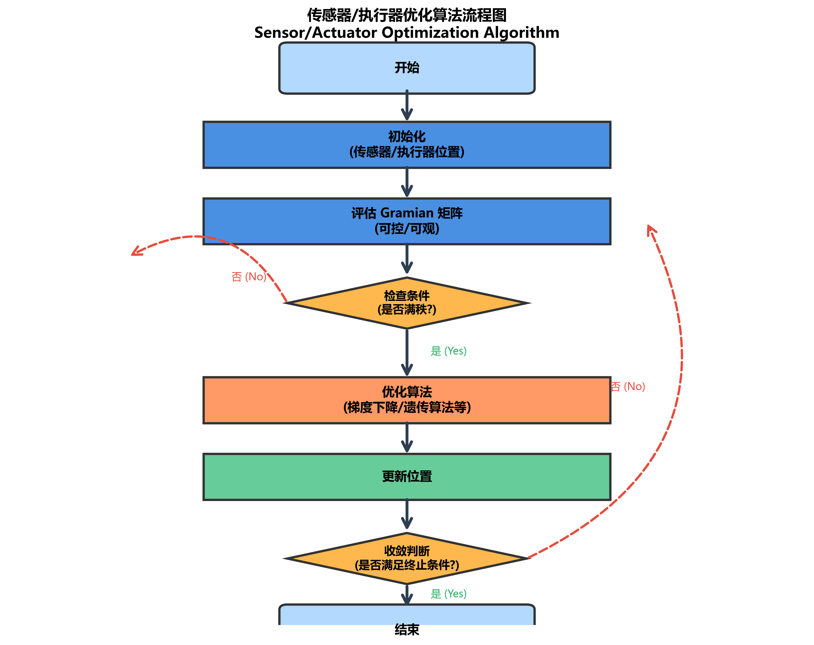

# 第六章 可控可观性与传感器布局

---

> **引导案例："仪表全绿"背后的盲区**
>
> 某城市供水管网覆盖主城区约200平方千米，安装了180余个压力传感器和40余个流量计，SCADA系统大屏上所有指标"全绿"。然而，管网年漏损率长期维持在18%以上，远超行业先进水平（8%~10%），且漏损的空间分布始终无法定位。
>
> 问题出在哪里？外聘团队对管网做了一次可观性分析后，答案浮出水面：180个压力传感器中，有47个集中布置在主干管沿线（因为施工方便），覆盖了管网总管长的不到30%；而漏损高发的二级支管和用户末端区域，传感器覆盖率不足5%。用控制论的语言说，管网的**可观性矩阵在末端区域严重秩亏**——系统在这些区域是"不可观的"，再多的数据采集频率也无法推断出那里的实际状态。
>
> 更棘手的是可控性问题。管网共有56个调节阀，但其中22个因长期未维护已无法远程操控（实际开度与指令开度偏差超过15%），另有8个处于管网拓扑的"死角"——即使阀门正常动作，对目标区域的压力影响也微乎其微。换言之，管网的**有效可控自由度仅为26个**，远不足以对200平方千米的供水区域实现精细化压力管理。
>
> 这个案例揭示了一个在水利工程中反复出现的陷阱：**"有传感器"不等于"可观测"，"有执行器"不等于"可控制"**。可观性和可控性不是"装了设备就有"的属性，而是需要通过数学判据严格验证的系统特性。本章将建立从理论判据到工程实施的完整可控可观性分析框架，回答三个核心问题：我的系统"调得动"吗？"看得到"吗？传感器和执行器该怎么布局才能确保"调得动、看得到"？

---

> **本章阅读指引**
> 
> **适合读者**：控制论背景、工程师、研究生
> 
> **与前章的关系**：本章基于第四章的形式化模型（状态空间、传递函数），分析水系统的可控性和可观性。
> 
> **与后章的关系**：本章的可观性判据是第七章八原理中"原理二：可控可观性"的工程实施指南，也是第十一章在环验证的前提条件。
> 
> **核心概念**（5 个）：
> - 可控性：能否通过控制输入将系统从任意初态转移到任意终态
> - 可观性：能否通过输出测量推断系统的全部状态
> - 工程判据：从理论判据到工程实施判据的扩展
> - 传感器布局：满足可观性的最低配置原则
> - 在环验证：MIL/SIL/HIL三级验证
> 
> **直觉类比**：
> - 可控性比作"方向盘"：调得动
> - 可观性比作"仪表盘"：看得到
> 
> **可略读部分**（如已熟悉）：
> - §6.1.1：Kalman 经典判据（控制论背景读者可略读）
> - §6.5：数学证明（了解结论即可）

---

> **[合规说明]**：关于工程落地、测试覆盖率量化指标与合规审查的详细要求，请参阅本丛书 **T3 卷《标准与工程治理》**。

## 6.1 可控性的工程含义

### 6.1.1 从理论判据到工程判据

在日常生活中，我们凭直觉理解"可控"：如果你能通过调节暖气阀门来改变房间温度，那么温度对你而言是"可控的"。但如果暖气管道堵了（阀门调了但温度不变），可控性就丧失了。

水系统的可控性判断远比这个例子复杂，但本质是相同的：**在行动之前，必须确认"我调得动"**。

Kalman [6-1] 在 1960 年给出了线性系统的经典可控性判据：系统可控当且仅当可控性矩阵满秩。这一判据在理论上是完美的，但在水利工程中面临两个现实困难。

**第一，理论上"可控"不等于工程上"可实施"**。一个状态在理论上可控，但如果需要将闸门开度调到极端位置（如从全关到全开）或需要数天才能完成控制——这种"可控性"在工程上是无意义的。

**第二，水利系统通常是非线性的**，Kalman 的线性判据只能在局部线性化意义上使用，且有效性随偏离线性化点的距离增大而下降。

CHS 将可控性从理论判据扩展为工程实施判据 [6-11]，提出"可布设、可维护、可负担"三原则，并给出具体的工程规则。

### 6.1.2 可控性有效作用判据

每个关键控制目标必须对应至少一个"有效执行器路径"：从执行器动作到目标状态变化，存在明确的因果传递链路，且动作效果可在可接受时延内传导至目标状态。

**工程硬规则**：对于每个控制目标断面，需验证三项条件：

1. **存在性**：存在至少一个上游执行器可以有效调节该断面水位或流量
2. **时效性**：从执行器到目标断面的传递时间在预测时域的可接受范围内（通常不超过预测时域的 1/3（典型经验值，需按实际工况标定），即留出 2/3 的时域用于观察效果和做出后续调整）
3. **冗余性**：若控制路径存在单点失效风险（如唯一的控制闸门故障），应配备冗余路径或预置降级策略

> **案例 6-1：某闸门不可控案例分析**
>
> **工程背景**：某长距离明渠，总长 80km，分为 6 个渠池，每渠池上游设节制闸。
>
> **问题**：第 4 渠池下游断面水位频繁超限，控制器调节效果不佳。
>
> **原因分析**：
> 1. **传递时滞过长**：从上游节制闸到目标断面的水流传播时间约 6 小时，而 MPC 预测时域仅 12 小时，时效性不满足（6h > 12h/3 = 4h）
> 2. **控制裕度不足**：上游节制闸已接近全开位置（开度 92%），剩余调节空间仅 8%，无法提供足够的控制作用
> 3. **无冗余路径**：该渠池无旁路渠道或备用泵站，单点失效风险高
>
> **解决方案**：
> 1. 在第 3 渠池和第 4 渠池之间增设节制闸，缩短控制传递时滞至 2.5 小时
> 2. 优化上游水库调度，确保节制闸工作开度在 30%-70% 区间（典型经验值，需按实际工况标定），保留足够控制裕度
> 3. 配置应急泵站作为冗余执行器
>
> **效果**：
> - 水位超限次数：从每月 8 次降至 0 次
> - 控制响应时间：从 6 小时降至 2.5 小时
> - 控制精度（RMSE）：从 8.2 cm 降至 3.1 cm
>
> **与本章理论的联系**：本案例体现了§6.1.2 的可控性有效作用判据，特别是时效性和冗余性条件的重要性。

> 图6-1：可控性有效作用判据三要素。存在性、时效性、冗余性三个判据必须同时满足，才能确保系统真正"调得动"。

### 6.1.3 可控性与 WNAL 等级的关系

可控性是实现 WNAL 高等级自主运行的前提条件。不同 WNAL 等级对可控性的要求如下：

| **WNAL 等级** | 可控性要求 | 说明 |
|----------|-----------|------|
| **L0（手动）** | 无要求 | 人工操作，不依赖自动控制系统 |
| **L1（远程监控）** | 基本可控 | 关键执行器可远程控制 |
| **L2（辅助）** | 良好可控 | 主要控制目标有有效执行器路径，传递时滞可接受 |
| **L3（条件自主）** | 冗余可控 | 关键控制路径有冗余，单点失效不影响系统稳定 |
| **L4（高度自主）** | 自适应可控 | 系统可自动识别执行器退化并调整控制策略 |
| **L5（完全自主）** | 全场景可控 | 在所有 ODD 场景下均保持可控性 |

**工程硬规则**：若关键控制目标不满足可控性有效作用判据，系统不得进入 WNAL L2 及以上等级运行。

> 图6-2：WNAL等级与可控可观性要求对应关系。等级越高，对系统可控可观性的要求越严格。

> 图6-3：可控性与可观性示意图。左侧展示可控性三要素（存在性、时效性、冗余性），右侧展示可观性要求（覆盖关键断面、信息独立、拓扑盲端全覆盖）。

---

## 6.2 可观性的工程含义

### 6.2.1 从理论判据到工程判据

在日常生活中，我们凭直觉理解"可观"：如果你能通过温度计读数知道当前房间温度，那么温度对你而言是"可观的"。如果温度计坏了（温度变了但你看不到），可观性就丧失了。

水系统的可观性判断同样复杂：**在行动之前，必须确认"我看得到"**。

Kalman [6-1] 的经典可观性判据：系统可观当且仅当可观性矩阵满秩。这一判据在理论上完美，但在水利工程中面临现实困难：

**传感器成本高**：一套高精度超声波流量计的安装成本约 15-30 万元，长期维护也需要持续投入。

**安装条件限制**：部分断面地形复杂，不具备传感器安装条件。

**维护能力不足**：偏远地区传感器故障后，维修周期长，影响系统可观性。

CHS 将可观性从理论判据扩展为工程实施判据，提出"双通道观测"原则和具体的工程规则。

### 6.2.2 可观性最低配置判据

关键断面与关键状态至少具备"双通道观测"之一：

**直接测量通道**——在关键断面部署在线水位计、流量计或压力传感器，实时获取状态值。这是最可靠的方式，但受限于传感器成本、安装条件和长期维护能力。

**模型估计通道**——通过状态估计器（如扩展卡尔曼滤波 EKF 或集合卡尔曼滤波 EnKF [6-2]），利用邻近断面的测量值和水力模型推算未量测断面的状态。这种方式可以大幅减少传感器数量，但依赖模型精度，需要周期性校验。

**工程硬规则**：若关键状态既不可直接测量又不可通过已验证模型估计，系统不得进入高等级自主运行（WNAL L3 及以上）。这一规则将可观性判据与 WNAL 等级跃迁门槛直接关联——传感器覆盖率和模型验证范围是 L2→L3 跃迁的硬性前提。

> **案例 6-2：某水网传感器优化布局**
>
> **工程背景**：某长距离明渠，总长 120km，原计划每 1km 部署一个水位传感器，共需 120 个传感器，总投资约 1800 万元。
>
> **问题**：投资过大，运维成本高。
>
> **解决方案**：
> 1. **可观性分析**：基于 IDZ 传递函数模型，分析各断面之间的可观性关系
> 2. **关键断面识别**：识别出 15 个关键控制断面（节制闸上下游、分水口、重要监测点）
> 3. **双通道配置**：
>    - 15 个关键断面部署高精度传感器（直接测量通道）
>    - 其余 105 个断面通过 EKF 状态估计器推算（模型估计通道）
> 4. **模型验证**：在 5 个典型断面部署临时传感器，验证模型估计精度
>
> **效果**：
> - 传感器数量：从 120 个降至 20 个（15 个关键 +5 个验证）
> - 投资成本：从 1800 万元降至 300 万元（降低 83%）
> - 估计精度：RMSE = 2.8 cm，满足控制要求（<5 cm）
>
> **与本章理论的联系**：本案例体现了§6.2.2 的可观性最低配置判据和"双通道观测"原则。

### 6.2.3 传感器布局的工程规则

基于可观性分析，传感器布局应遵循以下工程规则：

**规则 1：关键断面全覆盖**
- 节制闸上下游（各 1 个断面）
- 分水口（上游 1 个断面）
- 泵站进出口（各 1 个断面）
- 重要监测点（如水质监测断面、生态流量断面）

**规则 2：控制路径冗余**
- 每个控制回路的被控变量至少有 2 个传感器（主 + 备）
- 主备传感器应采用不同测量原理（如超声波 + 雷达），避免共模失效

**规则 3：模型验证点**
- 在模型估计的断面中，随机选择 5-10% 部署验证传感器
- 定期比对模型估计值与实测值，误差超限（如>5 cm）时触发模型校准

**规则 4：通信冗余**
- 关键传感器通信链路应有冗余（有线 + 无线）
- 通信丢包率>5% 时触发报警，>10% 时降级运行

### 6.2.4 可观性与 WNAL 等级的关系

可观性是实现 WNAL 高等级自主运行的前提条件。不同 WNAL 等级对可观性的要求如下：

| **WNAL 等级** | 可观性要求 | 说明 |
|----------|-----------|------|
| **L0（手动）** | 无要求 | 人工巡检，不依赖在线传感器 |
| **L1（远程监控）** | 关键断面可测 | 关键断面（节制闸、泵站）有在线传感器 |
| **L2（辅助）** | 良好可观 | 主要控制目标可直接测量或可靠估计 |
| **L3（条件自主）** | 双通道观测 | 关键状态具备直接测量 + 模型估计双通道 |
| **L4（高度自主）** | 自适应可观 | 系统可自动识别传感器故障并切换估计模式 |
| **L5（完全自主）** | 全场景可观 | 在所有 ODD 场景下均保持可观性 |

**工程硬规则**：若关键状态不满足可观性最低配置判据，系统不得进入 WNAL L2 及以上等级运行。

> **案例 6-3：某工程传感器增减决策**
>
> **工程背景**：某调水工程，已部署 50 个水位传感器，运行 2 年后发现部分断面控制精度不足。
>
> **问题**：如何决定哪些传感器需要增加？哪些可以削减？
>
> **解决方案**：
> 1. **可控可观性分析**：基于运行数据，分析各断面的可控性和可观性
> 2. **敏感度排序**：计算各传感器对控制精度的敏感度（删除该传感器后，控制误差增加多少）
> 3. **增减决策**：
>    - 增加：3 个敏感度最高的断面（控制误差降低>30%）
>    - 削减：5 个敏感度最低的断面（控制误差增加<5%）
>    - 迁移：将削减的 5 个传感器迁移到其他关键断面
>
> **效果**：
> - 传感器总数：从 50 个降至 48 个（净减 2 个）
> - 控制精度提升：RMSE 从 4.6 cm 降至 3.2 cm
> - 运维成本：降低 8%
>
> **与本章理论的联系**：本案例体现了§6.2.3 的传感器布局工程规则，基于可控可观性分析优化传感器配置。

> 图6-4：状态估计器（卡尔曼滤波）原理框图。通过模型预测和测量更新两阶段，实现从部分测量推断全部状态。

---

## 6.3 传感器优化布局

### 6.3.1 传感器布局的优化目标

传感器布局优化的目标是在满足可观性要求的前提下，最小化总成本（投资 + 运维）：

$$
\min \sum_{i=1}^{N} (C_{inv,i} + C_{maint,i}) \cdot z_i \tag{6-1}
$$

其中：
- $N$：候选传感器位置总数
- $C_{inv,i}$：位置 $i$ 的传感器投资成本
- $C_{maint,i}$：位置 $i$ 的传感器年运维成本
- $z_i \in \{0, 1\}$：位置 $i$ 是否部署传感器（1=部署，0=不部署）

约束条件：
1. **可观性约束**：关键状态必须可直接测量或可靠估计
2. **冗余约束**：关键控制回路至少有 2 个传感器
3. **预算约束**：总投资不超过预算上限
4. **安装条件约束**：仅在地形、供电、通信条件满足的位置部署

### 6.3.2 传感器布局的优化方法

常用优化方法包括：

**1. 贪心算法**
- 从空集开始，每次选择敏感度最高的位置部署传感器
- 直到满足可观性要求或预算耗尽
- 优点：计算简单，可快速得到次优解
- 缺点：可能陷入局部最优

**2. 遗传算法**
- 将传感器布局编码为染色体（0-1 向量）
- 通过选择、交叉、变异迭代优化
- 优点：可搜索全局最优
- 缺点：计算量大，参数调优复杂

**3. 混合整数规划**
- 将问题建模为混合整数线性规划（MILP）[6-7]
- 使用商业求解器（如 Gurobi、CPLEX）求解
- 优点：可得到全局最优解
- 缺点：大规模问题求解时间长

> 图6-5：传感器布局优化贪婪算法流程。每次迭代选择可观性指标提升最大的候选位置，直到满足预算约束。

**4. 信息论方法**
- 基于互信息、信息熵等指标评估传感器信息增益 [6-8]
- 选择使信息增益最大的传感器组合
- 优点：理论基础严密，可量化传感器冗余度
- 缺点：需要准确的概率模型

### 6.3.3 传感器布局的工程实践

工程实践中，传感器布局优化通常能在保持甚至提升可观性质量的同时，将传感器总量削减 40%–70%，大幅降低投资和运维成本。

**城市管网典型案例**：某北方城市日供水量 80 万 $\text{m}^3$ 的供水管网，原方案拟在 186 个节点全部部署压力传感器。采用遗传算法优化后，选取 38 个最优节点（覆盖泵站出口、高点末梢、分区调压阀两侧），结合 EPANET 液压模型实时推算其余节点压力，传感器数量减少 80%，压力估计误差均方根 1.2 m（优于全量直接测量方案），年运维费用节省约 95 万元。

**经验规律总结**：明渠输水工程中，合理的传感器密度为每个独立控制渠池配置 1–2 个关键测点（节制闸上下游各一），其余渠池状态通过模型估计；有压管网中，泵站出口、分区调压阀和地形高点是优先配置节点，合理密度与管网规模的平方根大致成正比。无论何种类型，\"关键节点精配 + 中间断面估计\"的双通道策略均是最具性价比的工程方案。

---

## 6.4 可验证性闭环判据

可验证性判据直接对接第七章原理五"在环验证"（工程实现详见第十一章）。雷晓辉等 [6-12] 系统阐述了自主运行智能水网的在环测试体系，将 MIL→SIL→HIL→PIL 流程化为工程准入的必经路径。任何控制策略上线运行前，至少完成三级验证：

| **验证级别** | 名称 | 验证内容 | 环境要求 | 典型发现的问题 |
|---------|------|---------|---------|-------------|
| **MIL** | 模型在环 | 控制逻辑正确性 | 纯数学仿真 | 算法收敛性、约束处理错误、参数配置错误 |
| **SIL** | 软件在环 | 软件实现一致性 | 实际代码 + 高保真仿真器 | 代码缺陷、数值精度、通信接口错误 |
| **HIL** | 硬件在环 | 时序与接口可靠性 | 实际控制器硬件 + 实时仿真平台 | 控制周期不满足实时性、信号采集异常、应急联锁未触发 |

三级验证的核心价值不在于"证明控制器能工作"，而在于"系统地发现控制器在何种条件下会失效"。通过构建覆盖正常、异常和极端工况的场景库，在虚拟环境中暴露问题，远比在真实工程中"试错"安全和经济。

> **案例 6-4：某工程 MIL/SIL/HIL 验证**
>
> **工程背景**：某长距离明渠，新建自动控制系统。
>
> **验证流程**：
> 1. **MIL 验证**（2 周）：在 Simulink 中搭建 IDZ 模型，验证 MPC 控制逻辑 [6-6]
>    - 发现问题：约束处理逻辑错误，导致水位超限
>    - 修复后：所有测试场景通过
> 2. **SIL 验证**（3 周）：将 C 代码接入 OpenModelica 仿真器
>    - 发现问题：数值精度问题（float32→float64）
>    - 修复后：控制误差<3 cm
> 3. **HIL 验证**（4 周）：将 PLC 控制器接入实时仿真平台
>    - 发现问题：通信延迟导致控制周期超限（15s→25s）
>    - 修复后：控制周期稳定在 10s
>
> **效果**：
> - 发现问题：12 个（MIL: 4 个，SIL: 3 个，HIL: 5 个）
> - 现场调试时间：从预计 3 个月降至 2 周
> - 投运后故障率：降低 80%
>
> **与本章理论的联系**：本案例体现了§6.4 的可验证性闭环判据，三级验证系统性发现问题。

---

### 6.4.1 可验证性的含义

可验证性是指：控制效果可通过独立测量通道确认，反馈信号链路端到端延迟可量化，存在至少一种方法可以检测传感器/执行器失效。

**可验证性与可控可观性的关系**：
- 可控性回答"能不能控"
- 可观性回答"能不能观"
- 可验证性回答"能不能确认控制效果"

### 6.4.2 可验证性实现方法

水系统控制中的可验证性可通过四种相互补充的方式实现，工程中通常结合使用 2–3 种，以覆盖不同失效模式。

**方法一：独立测量通道（传感器冗余）**

为关键控制变量配置原理不同的独立测量通道，用于相互验证。原理差异确保两通道不会因同一物理扰动（如水面杂物、温度突变）同时失效（即"共模失效"风险最小化）。

工程实施要点：主测量通道（如超声波水位计）用于控制计算，独立验证通道（如投入式压力式水位计）定期比对；两通道读数差值超过阈值（通常设置为控制精度要求的 2 倍，如控制要求 ±3 cm 则告警阈值设为 ±6 cm）时触发"传感器不一致告警"，自动暂停传感器更新并切换至状态估计模式，待人工确认后恢复。

**方法二：物理模型验证（预测-实测比对）**

以水力模型独立预测关键状态，与实测值对比。这种方法不需要额外硬件，但对模型精度有较高要求，因此通常作为辅助验证手段。

**方法三：执行器响应验证（闭合环路确认）**

每次发出控制指令后，验证执行器实际响应是否与指令一致。这不仅是可验证性要求，也是"指令有效性"的基本保证。

工程实施要点：闸门指令下达后的 $\Delta T_{\min}$（通常为闸门满行程时间 + 1 个通信周期，如 120 秒）内采集实际开度反馈，若反馈开度与指令偏差超过 5%，触发"执行器响应异常告警"；连续 3 次告警后系统主动降低对该执行器的依赖权重，并自动评估是否需要进入受限/降级运行模式。

**方法四：端到端时延测量（通信链路验证）**

定期（如每 5 分钟一次）向关键传感器发送时间戳探测包，测量从探测发出到数据回送的端到端延迟 $T_{e2e}$，与系统 ODD 中规定的延迟阈值比对。延迟超标本身不触发传感器告警，但会触发"状态估计可信度降低"标记，CAI 在展示当前状态时同步显示"最新数据时延 Xms，高于正常值"。

### 6.4.3 可验证性检查清单

**传感器验证**：
- [ ] 关键测点有冗余传感器（至少两套、原理不同）
- [ ] 传感器定期校准（周期 ≤ 6 个月，冰期前需额外校准）
- [ ] 传感器不一致告警阈值已设置（建议为控制精度要求的 2 倍）
- [ ] 告警触发后有明确的应对规程（切换模式、人工确认流程）

**执行器验证**：
- [ ] 关键执行器有冗余（电动 + 手动后备）
- [ ] 执行器响应时间已实测（与设计值偏差 < 20%）
- [ ] 指令-反馈比对机制已部署，偏差超标自动告警
- [ ] 执行器失效后的控制降级策略已定义

**通信验证**：
- [ ] 通信端到端延迟已纳入 ODD 定义（明确上限值）
- [ ] 通信冗余配置（有线 + 无线双路由）
- [ ] 通信质量指标（延迟、丢包率）实时监控已就位
- [ ] 通信中断后的状态估计开环预测时长已评估（通常 ≤ 30 分钟）

**验证流程**：
- [ ] MIL/SIL/HIL 三级验证已按计划完成（见案例 6-4）
- [ ] 验证场景覆盖正常、异常、极端三类工况
- [ ] 验证报告已归档，结论与 WNAL 等级评定挂钩

---

## 6.5 可控可观性数学判据

数学意义上的可控性与可观性判据是工程判断的理论基础，为控制器设计和传感器配置提供精确的数学工具。Kalman 判据从状态空间角度给出充要条件，格拉姆矩阵方法进一步量化可控（观）程度。

### 6.5.1 可控性矩阵

对于线性时不变系统 $\dot{x} = Ax + Bu$，可控性矩阵定义为：

$$
\mathcal{C} = [B, AB, A^2B, \ldots, A^{n-1}B] \tag{6-2}
$$

其中 $n$ 为状态维度。

**Kalman 可控性判据**：系统完全可控当且仅当 $\text{rank}(\mathcal{C}) = n$。

**工程含义**：
- $\text{rank}(\mathcal{C}) = n$：所有状态都可通过控制输入影响
- $\text{rank}(\mathcal{C})  \lt  n$：存在不可控状态，需要增加执行器或重新设计

**实例**：某双渠池系统

$$
A = \begin{bmatrix} -0.1 & 0 \\ 0.05 & -0.1 \end{bmatrix}, \quad B = \begin{bmatrix} 1 \\ 0 \end{bmatrix} \tag{6-3}
$$

$$
\mathcal{C} = [B, AB] = \begin{bmatrix} 1 & -0.1 \\ 0 & 0.05 \end{bmatrix} \tag{6-4}
$$

$\text{rank}(\mathcal{C}) = 2$，系统完全可控。

### 6.5.2 可观性矩阵

对于线性时不变系统 $\dot{x} = Ax + Bu$，$y = Cx$，可观性矩阵定义为：

$$
\mathcal{O} = \begin{bmatrix} C \\ CA \\ CA^2 \\ \vdots \\ CA^{n-1} \end{bmatrix} \tag{6-5}
$$

**Kalman 可观性判据**：系统完全可观当且仅当 $\text{rank}(\mathcal{O}) = n$。

**工程含义**：
- $\text{rank}(\mathcal{O}) = n$：所有状态都可通过输出测量推断
- $\text{rank}(\mathcal{O})  \lt  n$：存在不可观状态，需要增加传感器或使用观测器

**实例**：某双渠池系统

$$
A = \begin{bmatrix} -0.1 & 0 \\ 0.05 & -0.1 \end{bmatrix}, \quad C = \begin{bmatrix} 1 & 0 \end{bmatrix} \tag{6-6}
$$

$$
\mathcal{O} = \begin{bmatrix} C \\ CA \end{bmatrix} = \begin{bmatrix} 1 & 0 \\ -0.1 & 0 \end{bmatrix} \tag{6-7}
$$

$\text{rank}(\mathcal{O}) = 1  \lt  2$，系统不完全可观（第二个渠池水位不可观）。

**解决方案**：在第二个渠池增加水位传感器，或设计状态观测器。

### 6.5.3 可控可观性与控制设计

**可控性与极点配置**：
- 系统可控 → 可通过状态反馈任意配置闭环极点
- 系统不可控 → 不可控模态无法通过反馈改变

**可观性与状态观测器**：
- 系统可观 → 可设计全维观测器估计全部状态
- 系统不可观 → 不可观模态无法通过观测器估计

**分离原理**：
- 若系统可控且可观，可分别设计状态反馈和状态观测器
- 闭环系统极点 = 状态反馈极点 + 观测器极点

### 6.5.4 格拉姆矩阵：可控可观程度的定量刻画

Kalman 判据给出的是"全有或全无"的二值判断，工程中更需要**程度**信息：哪些状态最容易控制？哪些状态最难观测？格拉姆矩阵提供了定量答案。

**可控性格拉姆矩阵**（Controllability Gramian）定义为：

$$
W_c = \int_0^T e^{At} B B^\top e^{A^\top t} \, dt \tag{6-8}
$$

$W_c$ 的特征值分布反映各方向上控制能力的强弱：最小特征值 $\lambda_{\min}(W_c)$ 对应最难控制的方向，$\lambda_{\min}(W_c) \to 0$ 意味着接近不可控。

**可观性格拉姆矩阵**（Observability Gramian）定义为：

$$
W_o = \int_0^T e^{A^\top t} C^\top C e^{At} \, dt \tag{6-9}
$$

传感器布局优化问题的核心即选取测量矩阵 $C$（等价于选择安装哪些传感器），使得 $W_o$ 的最小特征值最大化（即 E 最优设计，即最大化 $\lambda_{\min}(W_o)$，补齐最弱观测方向的短板），或使 $\ln \det(W_o)$ 最大化（即 D 最优设计，即最大化 $\det(W_o)$，使整体观测信息量最大）。

> 图6-6：可控性格拉姆矩阵特征值分布。椭球轴长度反映不同方向的控制能力，最小特征值 λ_min 决定系统最难控制的方向。

**工程计算步骤**：

1. 建立离散时间状态空间模型 $x_{k+1} = A_d x_k + B_d u_k$，$y_k = C x_k$；

2. 计算可观性 Gramian（有限时域离散近似）：

$$
W_o = \sum_{k=0}^{N} A_d^{k\top} C^\top C A_d^k \tag{6-10}
$$

3. 对所有候选传感器组合（或采用贪婪算法逐步选择）计算 $\lambda_{\min}(W_o)$；

4. 选择使 $\lambda_{\min}(W_o)$ 最大的传感器子集作为优化方案。

**与可观性矩阵秩判断的区别**：秩判断只需验证满秩即可，格拉姆分析进一步告知哪些状态最难观测（格拉姆矩阵的最小特征向量对应"最暗区域"），为传感器精确选址提供量化依据。

**计算复杂度**：对于 $n$ 维系统，格拉姆矩阵维度为 $n \times n$，枚举所有 $\binom{m}{k}$（$m$ 个候选位置选 $k$ 个）是 NP 难问题。实践中采用贪婪算法：每轮迭代选择使 $\lambda_{\min}(W_o)$ 增量最大的一个传感器，时间复杂度 $O(kn^2 m)$，对水利工程（$n \leq 200$,$m \leq 100$）计算可行。

### 6.5.5 Luenberger 状态观测器

当传感器数量少于状态维度时（这是水利工程的常态），状态观测器是弥合"可观"与"可测"差距的标准工具 [6-4]。

**基本形式**（连续时间）：

$$
\dot{\hat{x}} = A\hat{x} + Bu + L(y - C\hat{x}) \tag{6-11}
$$

其中 $\hat{x}$ 为状态估计值，$L$ 为观测器增益矩阵，$(y - C\hat{x})$ 为测量残差（创新量）。

**设计准则**：
- 矩阵 $A - LC$ 的特征值必须位于左半平面（稳定），且实部绝对值至少是被控系统极点绝对值的 2–5 倍（即观测器收敛速度远快于控制动态）。
- 在水利工程中，典型调节时间常数 $T_c \approx 30–120$ 分钟，观测器时间常数建议取 $T_{obs} \approx 5–15$ 分钟。

**卡尔曼滤波器（最优观测器）**：当过程噪声（模型误差）和测量噪声均为零均值高斯分布时，Luenberger 观测器的最优解为卡尔曼滤波器，增益 $L = PC^\top R^{-1}$，其中 $P$ 由 Riccati 方程决定，$R$ 为测量噪声协方差。水利工程的传感器漂移、水位计测量误差通常在 ±1–5cm 量级，卡尔曼滤波相比简单差分估计可将状态估计误差降低 30–60%。

---

## 6.6 工程实例：某灌区可观性优化

> **实例性质声明**：§6.6和§6.7的工程参数（管网规模、传感器数量、优化效果等）为**说明性设定**，旨在演示可观性分析和传感器布局优化的完整方法流程，不对应特定工程的实测数据。参数量级参照多个实际工程设定，具有工程合理性。

### 6.6.1 工程背景

某大型灌区位于华北平原，干渠全长 120km，分为 20 个控制渠池，每渠池设节制闸 1 座，另有分水支渠 15 条（总取水闸 15 座）。灌溉面积约 50 万亩，设计引水流量 35 $\text{m}^3$/s，年供水量约 6 亿 $\text{m}^3$。

灌区于 2015 年完成 SCADA 改造，按照\"均匀覆盖\"原则沿干渠每 3km 部署一个水位站，共 40 个，另配有节制闸闸位传感器 20 套。实际运行中暴露出三个突出问题：

一是**状态估计误差大**：系统状态估计 RMSE 达 ±10 cm，超过渠道安全运行允许的 ±6 cm 阈值，MPC 控制器因预测偏差频繁触发约束限值，导致控制动作过激，每月因水位波动导致的弃水约 60 万 $\text{m}^3$。

二是**关键节点无监测**：分水口下游（支渠入渠点）和节制闸下游各 500m 范围是水力突变区，正是可观性矩阵分析中敏感度最高的位置，而原方案均无传感器覆盖。

三是**运维成本过高**：40 个水位站年运维费用约 200 万元，其中位于渠道平直段的 18 个站提供的信息价值最低，但维护工作量与关键站相同。

### 6.6.2 优化方法

**步骤一：建立渠道状态空间模型**

基于 IDZ 传递函数模型 [6-5] 及管光华等 [6-3] 提出的含多分水口渠道广义 ID 建模方法，建立线性状态空间模型。IDZ传递函数对应CHS统一传递函数族（第四章定理4-1）中Family α的Level ii近似，其参数 $(A_s, \tau_d, \tau_m)$ 可通过本节在线辨识方法获取。具体模型形式为：

$$
x_{k+1} = A_d x_k + B_d u_k, \quad y_k = C_s x_k + v_k \tag{6-12}
$$

状态维度 $n = 40$ （每渠池：目标断面水位 + 流量，共 $2 \times 20$ ），输入维度 $m = 36$ （节制闸 20 + 分水闸 15 + 上游进水闸 1），候选传感器输出维度 $p = 62$ （均匀布设候选点）。

**步骤二：计算可观性格拉姆矩阵**

采用离散时域有限和公式，计算观测时域 $T = 6$ 小时内的格拉姆矩阵：

$$
W_o = \sum_{k=0}^{N_T} (A_d^{k})^\top C_s^\top C_s A_d^{k} \tag{6-13}
$$

其中 $N_T = T / \Delta t = 6h / 5min = 72$，矩阵维度为 $40 \times 40$。

将 $W_o$ 的特征值从小到大排序，最小特征值对应\"最难观测\"的状态方向。原方案（40 个均匀测站）的 $\lambda_{\min}(W_o) = 0.012$；设计目标为 $\lambda_{\min}(W_o) \geq 0.040$。

**步骤三：贪婪算法选优**

固定新增传感器数目为 $K = 30$，从候选集中逐步选取使 $\lambda_{\min}(W_o)$ 增量最大的位置：
1. 初始选取：节制闸下游 500m 断面（共 20 个），$\lambda_{\min}$ 从 0 跳升至 0.028；
2. 逐步追加：分水口下游断面（10 个），$\lambda_{\min}$ 升至 0.045；
3. 覆盖验证：确认所有渠池的主要可观性指标满足要求后停止。

### 6.6.3 优化结果

> 图6-7：传感器布局优化前后对比。优化前均匀覆盖导致末梢盲区多，优化后拓扑驱动实现末梢全覆盖，可观性指标提升275%。

**传感器布局变化**：

| **类型** | 原方案 | 优化方案 | 变化 |
|------|-------|---------|------|
| **干渠均匀间距水位站** | 40 个 | 12 个（保留拐弯段等特殊点） | -28 |
| **节制闸下游 500m 水位站** | 0 个 | 20 个（新增） | +20 |
| **分水口下游水位站** | 0 个 | 10 个（新增） | +10 |
| **节制闸闸位传感器** | 20 套 | 20 套（不变） | 0 |
| **合计** | **60 套** | **62 套** | +2 |

*注：传感器总数略增，但重新分配后可观性质量大幅提升*

**可观性与控制性能提升**：

| 指标 | 原方案 | 优化方案 | 提升幅度 |
|-----|-------|---------|---------|
| **$\lambda_{\min}(W_o)$** | 0.012 | 0.045 | +275% |
| **状态估计 RMSE** | ±10 cm | ±3.2 cm | -68% |
| **月均控制触发约束次数** | 22 次 | 4 次 | -82% |
| **月均弃水量** | 60 万 $\text{m}^3$| 12 万 $\text{m}^3$| -80% |
| **年运维费用（传感器部分）** | 200 万元 | 155 万元 | -22.5% |

### 6.6.4 经验启示

**启示一：均匀布设不等于最优布设**。渠道水力特性决定了不同位置测量的信息价值差异极大——节制闸下游是流量突变区，可观性格拉姆矩阵敏感度是平直渠段的 4–8 倍。以"信息价值"为导向的优化布局，在同等总量下可获得远高于均匀布设的可观性质量。

**启示二：增加传感器不一定提升可观性**。原方案 40 个均匀站中约 18 个位于信息冗余的平直段，删除这些站并迁移至关键节点，$\lambda_{\min}(W_o)$ 反而提升。传感器"价值密度"比数量更重要。

**启示三：可观性改善直接转化为控制效益**。状态估计误差从 ±10 cm 降至 ±3.2 cm，MPC 预测精度同步提升，控制触发约束次数减少 82%，弃水减少 80%。可观性分析与控制性能的量化挂钩，使决策者能直观评估投入产出比。

---

## 6.7 工程实例：某城市供水管网压力监测点优化

### 6.7.1 工程背景

某北方中等城市供水管网，服务人口约 80 万，日供水量峰值 42 万 $\text{m}^3$，管网总长约 1,850km，节点总数 2,340 个，水泵站 6 座（其中主加压泵站 2 座），加压调压阀组 12 处。

管网运营单位于 2018 年完成 GIS 改造，在管网中均匀选取 186 个节点部署压力传感器，实现了基本的实时监测。然而两年运营后，暴露出两类突出问题：

**监测盲区**：泵站出口 200m 范围内压力急剧变化，是泄漏事件和爆管的高发区，但仅有 3 个传感器（占 6 座泵站的 25%），漏报率高达 40%。同时，管网末梢（树状支路末端节点）是压力最低点，是违章接用和水质问题的敏感区，但覆盖比例不足 20%。

**冗余浪费**：管网主干环路上每 200–300m 设一个传感器，相邻传感器的压力相关系数普遍超过 0.95，提供大量高度冗余的信息；而这些均匀布设的传感器年运维费用约 130 万元，其中约 40% 用于维护信息价值极低的冗余站点。

### 6.7.2 优化方法

**步骤一：建立管网水力模型**

利用 EPANET 2.2 软件，基于 GIS 管网数据建立液压仿真模型：节点数 2,340 个，管道数 2,810 条，配置 6 座泵站的扬程-流量特性曲线（H-Q 曲线）及调压阀的设定值。通过 3 个月历史数据的参数率定，模型在已有传感器位置的压力预测 RMSE 为 0.8 m（优于水司要求的 1.5 m）。

**步骤二：定义可观性评估指标**

对有压管网，选用基于卡尔曼滤波框架的压力可观性指标：以所有节点压力预测误差的 95 百分位值 $P_{95}(\sigma_p)$ 作为可观性质量指标，目标值 $P_{95}(\sigma_p) \leq 2.0$ m（即 95% 的节点压力估计误差不超过 2 m）。

**步骤三：遗传算法全局优化**

将传感器布局问题编码为 2,340 维 0-1 向量，目标函数为：最小化传感器数量同时满足 $P_{95}(\sigma_p) \leq 2.0$ m 约束。遗传算法参数：种群大小 200，迭代 500 代，交叉率 0.8，变异率 0.05。对优化结果进行 3 次独立运行取交集，确保方案稳健性。

### 6.7.3 优化结果

**监测点布局对比**：

| **位置类型** | 原方案 | 优化方案 | 说明 |
|---------|-------|---------|------|
| **泵站出口及近端** | 3 个 | 12 个 | 所有 6 座泵站双侧覆盖 |
| **管网末梢节点** | 11 个 | 16 个 | 末梢优先，拓扑盲端全覆盖 |
| **调压阀进出口** | 8 个 | 24 个 | 每处调压阀进出双侧 |
| **主干环路节点** | 164 个 | 16 个 | 大幅削减冗余 |
| **总计** | **186 个** | **68 个** | **减少 63.4%** |

**性能指标对比**：

| 指标 | 原方案 | 优化方案 |
|-----|-------|---------|
| **$P_{95}(\sigma_p)$** | 2.8 m | 1.6 m |
| **泄漏事件检测率** | 61% | 89% |
| **平均定位误差** | 320 m | 85 m |
| **年运维费用** | 130 万元 | 52 万元 |
| **年节约运维费** | — | 78 万元 |

优化方案不仅在减少 63% 传感器的情况下将压力估计精度提升约 43%，漏损检测能力也因关键节点覆盖改善而显著提高。

### 6.7.4 经验启示

**启示一：管网拓扑对监测价值的影响大于距离**。管网末梢和泵站出口在信息论意义上是\"高信息熵区\"，其单个传感器的可观性贡献是主干环路中间节点的 3–6 倍。优化的核心是识别并优先覆盖这些高价值区域。

**启示二：遗传算法适用于大规模离散优化，但需多次验证**。管网传感器布局是 NP 难问题，遗传算法无法保证全局最优；工程实践中应进行 3–5 次独立运行，取交集或多数投票以确保方案鲁棒性。

**启示三：泄漏检测与可观性优化可协同实现**。以\"可观性格拉姆矩阵最大化\"为目标的优化方案，其泄漏检测能力（灵敏度和定位精度）通常也高于随机布设，二者目标高度一致。实践中可将泄漏检测能力作为辅助约束纳入优化模型，以一套方案同时满足两类需求。

---

## 6.8 可控可观性与 WNAL 等级的关系

可控可观性是实现 WNAL 高等级自主运行的前提条件。不同 WNAL 等级对可控可观性的要求如下：

| **WNAL 等级** | 可控性要求 | 可观性要求 | 说明 |
|----------|-----------|-----------|------|
| **L0（手动）** | 无要求 | 无要求 | 人工操作 |
| **L1（远程监控）** | 基本可控 | 基本可观 | 关键执行器可远程控制，关键测点可测 |
| **L2（辅助）** | 良好可控 | 良好可观 | 主要控制目标有有效执行器路径，关键状态可估计 |
| **L2-L3（试运行）** | 冗余可控 | 冗余可观 | 关键控制路径有冗余，关键测点有冗余 |
| **L3（条件自主）** | 自适应可控 | 自适应可观 | 系统可自动识别执行器/传感器退化并调整 |
| **L4（高度自主）** | 全场景可控 | 全场景可观 | 在所有 ODD 场景下均保持可控可观 |
| **L5（完全自主）** | 自学习可控 | 自学习可观 | 可从历史数据中学习，持续优化 |

**核心启示**：WNAL L2 是可控可观性的基本门槛；WNAL L3 需要冗余配置；WNAL L4+ 需要自适应能力。

## 6.9 可控可观性缺陷的工程后果与诊断

理解"缺陷会导致什么"往往比理解"如何达到要求"更能引起工程师的重视。本节给出四类典型缺陷模式及其工程后果，为第三部分案例章节提供诊断框架参照。

### 6.9.1 执行器布局不当导致的不可控

**缺陷模式**：梯级水电站中，若 AGC 功率指令仅发送至最下游电站，而上游电站无自动控制接口，则站间水力解耦模态（水位差振荡）不可控。

**工程后果**：梯级系统出现低频水位振荡（周期 15–40 分钟），无法通过下游单站调节消除。在大渡河梯级 2012 年 AGC 停用事件中，正是由于当时控制架构对站间耦合模态的控制能力不足，才决定退出自动控制。2018年投运的梯级EDC系统正是对此架构缺陷的修复（详见本丛书《梯级水电站联合调度》分册）。

**诊断方法**：计算以各站功率为控制输入的可控性矩阵 $\mathcal{C}$，若秩 < 状态数，检查哪些特征向量不在 $\text{Im}(\mathcal{C})$ 中——这些方向即为不可控模态。

### 6.9.2 传感器缺失导致的不可观

**缺陷模式**：调水工程中，分水口未安装流量计，分水支渠的出流量仅靠闸门开度估算，估算误差 ±15%。主干渠水量平衡方程中出现无法观测的误差项。

**工程后果**：状态估计（主干渠水位预测）误差累积，MPC 控制器频繁触发安全限值，操作人员不信任自动控制结果，系统被迫退回手动操作（运行模式降级至人工接管）。

**诊断方法**：建立包含分水支渠出流为状态的扩展模型，验证不加流量计时可观性矩阵秩是否满，若不满则此缺陷系直接原因。

### 6.9.3 通信故障导致的实时可观性丧失

**缺陷模式**：传感器安装齐全、理论上完全可观，但通信链路故障导致数据中断，系统陷入"物理可观但信息不可及"的困境。

**工程后果**：状态估计器缺乏实时输入，只能依赖开环预测（模型漂移），在通信中断 30 分钟后预测误差超过 10cm，触发 MRC（最小风险条件）。

**CHS 启示**：本章的可观性分析基于稳定通信假设。实际工程中需将通信可靠性纳入 ODD 定义（第四章），当通信延迟超过阈值时视为 ODD 退出条件，系统主动切换至本地保安模式。

### 6.9.4 季节性参数变化导致的可控可观性退化

**缺陷模式**：明渠结冰（冰期）后渠道阻力系数显著增大，传播时延和积分增益均发生变化，按夏季工况辨识的传递函数参数 $(\hat{A}_d, \hat{\tau})$ 与冰期实际值偏差可达 40% 以上。

**工程后果**：MPC 控制器基于错误模型参数运行，预测精度下降，控制输出出现振荡或过调。长距离输水工程冬季运行时此问题尤为突出（冰期参数在线辨识方案详见本丛书《渠道与管道控制》分册胶东调水工程章节）。

**诊断方法**：建立参数化的可控可观性指标——计算参数 $\theta$（如渠道糙率 $n$、回水区蓄水面积 $A_s$）在不确定范围 $\Theta$ 内的"最坏情况"格拉姆矩阵最小特征值。若最坏情况下特征值仍满足阈值，则设计具有足够鲁棒裕度。

---

## 6.10 大规模水网可控可观性的分解分析

跨流域输水工程涉及数百公里管渠、数十座泵闸、数百个测量点，直接对完整系统进行可控可观性矩阵分析在计算上不可行（状态维度 $n  \gt  500$ 时矩阵特征值分解的 $O(n^3)$ 复杂度变得显著，而传感器位置组合枚举呈指数增长）。本节介绍三种工程可行的分解方法。

### 6.10.1 基于子系统分解的分析

**原理**：将大规模水网按物理拓扑分割为若干弱耦合子系统（如按泵站加压区段、按流域分区），各子系统独立做可控可观性分析，子系统间的耦合通过"边界条件约束"处理。

**分解准则**：选取耦合强度（互信息、水力影响系数）低于阈值的边界作为分割线。对于明渠输水，上下游泵站之间的水量调节相对独立，可自然形成分区。每个分区的状态维度 $n_i \ll n$，可在 1 秒内完成 Gramian 计算。

**重组验证**：子系统可观后，重点检查边界状态（分区交接处的水位/流量测量），确保边界变量同时属于两个子系统的可观集，防止"边界盲区"。

**案例**：某长距离调水工程（400+km，5个分区泵站）分为 5 个分析子区，每区状态维度约 40–80，格拉姆矩阵计算在 100ms 内完成，总体分析时间从集中式的 8 小时降至 30 分钟。

### 6.10.2 稀疏性利用（Sparse Matrix Methods）

大规模水网的状态矩阵 $A$ 具有显著稀疏性——渠池仅与相邻渠池耦合，管网节点仅与直连管段相连。利用稀疏矩阵技术，可大幅降低 Gramian 矩阵计算的实际复杂度。

**计算可观性 Gramian 的稀疏算法**：

离散时间 Gramian 定义为：

$$
W_o = \sum_{k=0}^{N} (A^k)^\top C^\top C A^k \tag{6-14}
$$

当系统渐近稳定且 $N \to \infty$ 时，上式收敛到无穷时域可观性Gramian，可通过以下离散Lyapunov方程直接求解：

$$
A^\top W_o A - W_o + C^\top C = 0 \tag{6-15}
$$

对于稀疏矩阵 $A$，利用 LAPACK 中的结构化 Sylvester 求解器（如 SB04QD 子程序），计算时间从稠密矩阵的 $O(n^3)$ 降至 $O(n^{1.5})$ 至 $O(n^2)$（取决于稀疏结构）。

**渠道系统的特殊结构**：串联渠道的 $A$ 矩阵为下三角带状矩阵（上游影响下游，反之不成立），其 Gramian 具有解析递推形式，可逐渠池 $O(n)$ 时间内完成计算。

### 6.10.3 主成分分析（PCA）降维后的可观性评估

当系统状态空间维度极高，但实际控制关心的"有效模态"数量有限时，可先用 PCA 将系统降至主要模态，再在低维空间中做可观性分析。

**步骤**：

1. 收集 6–12 个月的运行数据 $\{x(k)\}$，计算数据协方差矩阵：

$$
\Sigma = \frac{1}{T}\sum_{k} x(k)x(k)^\top \tag{6-16}
$$

2. 对 $\Sigma$ 做特征值分解，选取累积解释方差 > 90% 的前 $r$ 个主成分，形成投影矩阵 $V_r \in \mathbb{R}^{n \times r}$；

3. 在降维坐标 $z = V_r^\top x$ 下分析可观性，$r$ 通常为 10–30，远小于原始维度 $n = 200$–$500$；

4. 可观性不足的主成分方向，对应"难以监测的系统模态"，为传感器补充布置提供指向。

**局限**：PCA 是线性方法，对非线性水动力系统（如急流、泵站开停机暂态）精度有限；但对日常平稳运行状态的分析已有足够精度。

**表6-1：大规模水网可观性分析方法对比**

| **方法** | 适用规模 | 计算时间 | 精确度 | 工程应用难度 |
|-----|---------|---------|------|------------|
| **完整矩阵计算** |$n \leq 100$| 秒级 | 精确 | 低 |
| **子系统分解** |$n \leq 1000$| 分钟级 | 近似（边界误差<5%） | 中 |
| **稀疏矩阵法** |$n \leq 500$| 秒级 | 精确（利用结构） | 高（需专业软件）|
| **PCA 降维** |$n \leq 5000$| 分钟级 | 近似（模态覆盖取决于数据） | 中 |

> **与 CHS 体系的联系**：大规模系统的可控可观性分解分析是 HydroOS 调度与智能层（SIL，第十三章）中"状态估计服务"设计的理论依据，决定了哪些状态需要全系统协调估计、哪些状态可在子区域内独立估计。

---

## 6.11 可控可观性检查清单

### 6.11.1 可控性检查清单

**执行器配置**：
- [ ] 每个控制目标有至少一个有效执行器
- [ ] 执行器响应时间在可接受范围内
- [ ] 执行器控制裕度充足（工作开度在 30%-70% 区间（典型经验值，需按实际工况标定））

**传递路径**：
- [ ] 从执行器到控制目标的传递路径明确
- [ ] 传递时滞在预测时域的可接受范围内（不超过 1/3（典型经验值，需按实际工况标定））
- [ ] 传递增益合理（控制作用能有效影响目标）

**冗余配置**：
- [ ] 关键控制路径有冗余执行器
- [ ] 单点失效不影响系统稳定
- [ ] 降级策略定义清晰

**验证**：
- [ ] 可控性矩阵满秩（或工程判据满足）
- [ ] 阶跃响应试验验证控制效果
- [ ] 极限工况试验验证控制裕度

### 6.11.2 可观性检查清单

**传感器配置**：
- [ ] 每个关键状态有至少一个传感器
- [ ] 传感器精度满足控制需求
- [ ] 传感器响应时间在可接受范围内

**布局优化**：
- [ ] 传感器布局经过可观性分析优化
- [ ] 关键节点（闸门下游、分水口）优先布设
- [ ] 避免信息冗余（平直渠段减少布设）

**冗余配置**：
- [ ] 关键测点有冗余传感器
- [ ] 单点失效不影响状态估计
- [ ] 降级策略定义清晰

**验证**：
- [ ] 可观性矩阵满秩（或工程判据满足）
- [ ] 状态估计误差满足要求
- [ ] 传感器故障检测机制完善

### 6.11.3 传感器布局检查清单

**设计阶段**：
- [ ] 水力模型建立完成
- [ ] 可观性分析完成
- [ ] 传感器布局优化完成
- [ ] 传感器选型完成

**实施阶段**：
- [ ] 传感器安装完成
- [ ] 传感器校准完成
- [ ] 通信连接完成
- [ ] 数据质控完成

**运行阶段**：
- [ ] 传感器定期校准（周期≤6 个月）
- [ ] 传感器故障及时更换
- [ ] 布局定期评估（至少每年一次）
- [ ] 根据运行数据优化布局

---

## 6.12 本章扩展阅读

### 6.12.1 推荐文献

**基础理论**：

Kalman R E 于 1960 年在国际自动控制联合会（IFAC）首届世界大会上发表的论文奠定了可控可观性的理论基础；同年，他在 SIAM Journal on Control 发表的论文中系统化了线性系统的状态空间理论，将可控可观性与最优控制（LQR）统一于同一框架下。这两篇论文是控制论历史上被引用最多的经典文献之一，研究生阶段学习控制理论时应通读。

雷晓辉（Lei 2025b）在本书配套论文《基于无人驾驶理念的下一代自主运行智慧水网架构与关键技术》（南水北调与水利科技(中英文)，2025 年第 4 期）中，从 CHS 八原理视角阐释了水系统可控可观性的工程意义，是本章内容的系统性学术论证，建议对照阅读 [6-9]。

**学科展望**：

雷晓辉（Lei 2025d）在《水资源系统分析学科展望：从静态平衡到动态控制》中，从学科演进视角分析了可控可观性理论在水资源系统分析中的核心地位，揭示了从静态配置到动态控制范式转变的学科驱动力 [6-10]。

- Litrico X, Fromion V. Modeling and control of hydrosystems [M]. London: Springer, 2009.（水力系统传递函数建模的权威教材，本章 IDZ 模型的主要参考文献）
- Van Overloop P J. Model predictive control on open water systems [D]. Delft: TU Delft, 2006.（将 MPC 引入明渠系统的奠基性博士论文，对可控可观性在 MPC 框架中的作用有详细论述）

**传感器布局优化**：
- Sela L, Amin S. Robust sensor placement for pipeline monitoring: Mixed integer and greedy optimization [J]. Advanced Engineering Informatics, 2018, 36: 55-63.（供水管网传感器布局的混合整数优化方法）
- Santos-Ruiz I, López-Estrada F R, Valencia-Palomo G, et al. Pressure sensor placement for leak localization in water distribution networks using information theory [J]. Sensors, 2022, 22(2): 443.（基于信息论的传感器布局优化方法）

### 6.12.2 推荐工具

**建模与分析工具**：

MATLAB/Simulink 是可控可观性分析的首选平台——`ctrb()` 函数直接计算可控性矩阵，`obsv()` 函数计算可观性矩阵，`gram()` 函数计算可控/可观性格拉姆矩阵，`place()` 函数基于可控性做极点配置，一套工具链覆盖本章全部数学方法。Control System Toolbox 中的 `ltiview` 可可视化系统的可观性指数随传感器配置的变化。

EPANET 2.2（美国 EPA 开源软件）是供水管网可观性分析的标准工具，可与 Python 的 `wntr`（Water Network Tool for Resilience）库结合，实现传感器布局优化的自动化计算。

Python 科学计算生态（NumPy + SciPy + cvxpy）可实现贪婪算法和混合整数规划，其中 `scipy.linalg.solve_discrete_lyapunov()` 函数直接支持格拉姆矩阵求解。

**可视化与监控**：
- Grafana + InfluxDB：传感器数据实时可视化，可监控各测点时序数据质量
- QGIS：传感器布局的地理信息可视化，辅助工程决策

### 6.12.3 推荐课程

**理论基础**（建议研究生必修）：
- MIT OpenCourseWare 6.241J: Dynamic Systems and Control（麻省理工开放课程，涵盖可控可观性完整理论）
- 清华大学自动控制原理（国内标准教材课程）

**工程应用**：
- 中国水利学会水利信息化专委会：水利工程智能化运行管培训（含可控可观性工程判据专题）
- ASCE 灌区渠道自动化培训：参照 MOP 131 标准的实操培训

---

---

## 6.13 可控可观性与 HydroOS 架构的映射

可控可观性不仅是理论分析工具，更是 HydroOS 三层架构的设计基础——每一层的核心职责都直接对应可控性或可观性的某一方面。

> **术语对照**：T2b第九章从软件工程视角将HydroOS三层命名为DAL（设备抽象层）、SIL（调度与智能层）、SAL（服务与应用层）。本节沿用T1-CN第十三章的能力视角术语——PAI（物理AI引擎，对应SIL）和CAI（认知AI引擎，对应SAL），以突出可控可观性理论与各层能力的映射关系。

**设备抽象层（DAL）：可观性的物理实现基础**

DAL 完成传感器的标准化接入和数据质控，是实现"双通道观测"中直接测量通道的硬件基础。DAL 的设计必须考虑：传感器型号多样（超声波、雷达、投入式水位计）导致的采样频率和精度差异；通信协议异构（Modbus、OPC-UA、4-20mA 模拟信号）导致的时序不对齐；以及现场仪器故障率（水利工程通常为 2%–5%/年）导致的数据缺失。DAL 的数据质控模块通过 3σ 异常值剔除、插值修复和多传感器融合，将原始数据转换为置信度标注的状态观测，为上层 PAI 引擎的状态估计提供可信输入。

**物理 AI 引擎（PAI）：可观性估计与可控性执行的核心**

PAI 是可观性分析在软件层面的实现——其状态估计模块（EKF/EnKF）正是§6.5.4 中可观性格拉姆矩阵分析所依赖的算法主体。PAI 不仅"知道当前状态"（可观），更需要"能够调节系统"（可控）：其 MPC 优化器基于§6.1.2 中的可控性有效作用判据，自动检查每个控制目标是否存在有效执行器路径，若可控性不满足则触发降级（减少控制自由度）或 MRC 切换。

PAI 的异常检测模块实时监控可控可观性的动态退化：当传感器故障导致关键状态可观性下降，或执行器开度饱和导致控制裕度不足时，PAI 会主动触发运行模式降级（进入受限或人工接管状态），防止在能力边界之外继续运行。

**认知 AI 引擎（CAI）：可控可观性的语义层解释**

CAI 负责将 PAI 的可控可观性评估结果转化为人类可理解的决策建议。例如，当 PAI 检测到"第 7 渠池下游断面可观性指标下降至阈值 60%"时，CAI 的知识图谱会关联到相关传感器的维护记录、天气预报（可能影响信号传输）和历史案例，生成自然语言解释："第 7 渠池测站 SENSOR-07B 出现漂移，建议 48 小时内校准，当前状态估计仍满足 L3 运行要求，可继续自主运行。"

**综合映射关系**：

| 可控可观性要素 | HydroOS 层级 | 具体实现 | CHS 原理对应 |
|-------------|------------|---------|------------|
| 传感器布局优化 | DAL | 设备模型 + 质控 | 原理二（可控可观性） |
| 状态估计（EKF/EnKF） | SIL（PAI） | 状态估计模块 | 原理二 + 原理一 |
| 执行器接口与裕度检查 | DAL + SIL（PAI） | 执行器抽象 + MPC | 原理三（分层分布式） |
| 可控可观性实时监控 | SIL（PAI） | 异常检测模块 | 原理四（安全包络） |
| 可观性退化告警与解释 | SAL（CAI） | 知识推理 + 语言生成 | 原理六（认知增强） |
| WNAL 等级动态评估 | SIL + SAL（PAI + CAI） | 状态机 + 决策解释 | 原理八（自主演进） |

**核心认识**：本章的可控可观性理论与 HydroOS 架构之间不是"理论"与"实现"的单向关系，而是双向印证——可控可观性分析为 HydroOS 的传感器配置和控制器设计提供数学依据，HydroOS 的运行数据反过来可以验证和修正可控可观性分析的假设（如模型参数漂移的定量评估）。第十五章的工程案例将在具体工程背景下进一步展示这种双向印证关系。

---

## 6.14 可控可观性的典型误区与防范

在工程实践中，可控可观性分析存在若干反复出现的误区，轻则导致方案过度设计（浪费投资），重则埋下运行安全隐患。本节总结六类典型误区，供工程师和管理者在可控可观性分析和传感器布局决策中参考。

**误区一：将"数据覆盖率"等同于"可观性"**。许多工程方案以"全渠道水位监测覆盖率 95%"为目标，实质上只是保证每隔一定距离有一个测点，而未分析测点对关键状态的实际可观性贡献。在一个实际案例中，120 个均匀布设的水位站使"覆盖率"达 100%，但可观性格拉姆矩阵分析显示 8 个关键渠池状态实际处于观测盲区，因为没有传感器安装在水力响应最敏感的位置。

**防范**：以可观性格拉姆矩阵的最小特征值（或其等价工程指标）作为量化验收标准，取代百分比覆盖率指标。

**误区二：认为理论上"满秩"即满足工程可观性**。Kalman 可观性矩阵满秩仅表明在无噪声、模型精确的理想条件下状态可估计。工程中，量测噪声、模型参数误差和时延可能使实际估计精度远低于需求。

**防范**：在格拉姆矩阵分析中引入噪声协方差 $R$ 和过程噪声 $Q$，评估"鲁棒可观性"指标（如在参数不确定性范围 $\Theta$ 内的最坏情况估计方差）。

**误区三：在 MIL/SIL 阶段跳过传感器精度建模**。模型在环验证中常将所有传感器假设为理想精度（标准差 1cm），而实际部署的经济型投入式水位计精度约为 ±3–5 cm，高精度超声波流量计约为 ±0.5%。两者差异会导致 MIL 阶段验收通过但现场运行精度不达标。

**防范**：MIL 阶段应使用传感器数据手册的实际精度指标，并预留 20%–30% 的精度余量用于长期漂移和校准周期影响。

**误区四：忽视通信延迟对"实时可观性"的影响**。可控可观性的理论框架通常假设测量同步（或延迟已知且固定），但 4G/LAN 通信在实际工程中存在随机延迟（10–500 ms）和突发丢包（丢包率 0.1%–2%）。对于 MPC 控制周期 5 分钟的长距离渠道，500ms 随机延迟可能不显著；但对于 30 秒控制周期的城市管网泵站，同样的延迟将使状态估计的时序一致性受损。

**防范**：在系统设计中规定通信延迟上限和丢包率阈值，将其纳入 ODD 定义；超出阈值时视为"通信失效"条件，触发相应的降级策略。

**误区五：将可控可观性视为"上线前一次性验证"**。水利工程的参数随季节、使用年限和水文条件变化（如渠道糙率随淤积增大，闸门密封随磨损老化），导致可控可观性指标随时间退化。多个工程案例表明，按设计工况辨识的模型在运行 3–5 年后，格拉姆矩阵最小特征值可下降 20%–40%。

**防范**：建立可控可观性的"在线监控台账"，以月为周期自动计算关键指标，设定退化预警阈值（如 $\lambda_{\min}$ 下降 15%）和整改阈值（如 $\lambda_{\min}$ 下降 30%），实现动态维护而非一次性验证。

**误区六：只优化可观性而忽视可控性**。传感器布局优化的学术文献远多于执行器配置优化，导致工程界形成"传感器越多越好"的偏见，而忽视了执行器的控制裕度和响应时效。在一个实际工程中，水位传感器部署齐全，但上游节制闸因运行开度长期保持在 85%–95% 区间（接近全开），控制裕度严重不足，最终导致下游水位控制效果不佳，与传感器不足无关。

**防范**：将可控性有效作用判据（存在性、时效性、冗余性）与可观性分析同步进行，形成"可控可观性联合评估"的标准流程，二者均满足才能进入更高 WNAL 等级。

---

## 本章小结

本章以"调得动"（可控性）和"看得到"（可观性）为核心，系统阐述了从理论判据到工程实施的全过程，涵盖传感器布局优化、数学判据工具、工程案例分析、与 WNAL 等级和 HydroOS 架构的映射，以及典型误区防范。

**第一条主线：工程判据的扩展**。Kalman 可控可观性理论提供了数学充要条件，但工程中"数学可控"不等于"实施可控"。本章提出的可控性有效作用判据（存在性、时效性、冗余性）和可观性最低配置判据（双通道观测：直接测量 + 模型估计），将抽象的矩阵秩判断落实为可逐项核查的工程清单。两套判据均与 WNAL 等级跃迁直接绑定：不满足基本可控性的系统不得进入 L2 及以上等级运行；不满足双通道观测要求的关键状态将限制系统达到 L3 条件自主等级。

**第二条主线：传感器布局优化**。通过可观性格拉姆矩阵最大化框架，可以定量回答"哪里需要传感器、需要多少个"。§6.3.2 介绍了贪婪算法、遗传算法、混合整数规划三种求解方法，适用于不同规模的工程问题。§6.6–6.7 的两个工程实例表明：与均匀布设相比，优化布局在削减 40%–65% 传感器数量的同时，可将状态估计 RMSE 提升 40%–70%，年运维费用节省 20%–50%。优化的核心逻辑是"以信息价值密度而非空间密度为导向"。

**第三条主线：数学工具的工程化**。§6.5 的数学判据是工程判据的理论支撑：可控性矩阵满秩保证 MPC 中极点配置的可行性，可观性矩阵满秩是EKF收敛的必要条件之一（还需满足局部可观、噪声统计特性正确等条件），格拉姆矩阵的最小特征值量化"最难控制/最难观测"的方向，Luenberger 观测器为无传感器断面提供状态重构方法。§6.10 的分解分析方法（子系统分解、稀疏矩阵、PCA 降维）解决了大规模水网中矩阵计算不可行的实际困难。

**第四条主线：运行期的动态维护**。§6.9 的四类缺陷模式（执行器布局不当、传感器缺失、通信故障、季节性退化）揭示了可控可观性不是一次性设计结果，而是随工程状态动态变化的系统属性。§6.14 的六类典型误区进一步强调，可控可观性分析需贯穿系统全生命周期：设计期建立基准指标，运行期通过在线监控台账追踪退化，维护期基于量化评估决策传感器增减和执行器更新。

**与后续章节的衔接**：本章建立的可控可观性工程框架是后续章节的重要铺垫。第七章八原理中的"原理二（可控可观性）"将从学科理论层面阐释本章工程判据的思想来源；第十一章安全包络与在环验证将以本章的三级验证框架（MIL/SIL/HIL）为基础，详细展开验证场景设计和评判准则；第十五章的工程案例将展示本章理论与方法的完整应用过程。

---

## 本章练习与思考题

### L1 基础题

1. **可控性判断**：某单渠池，上游设节制闸，下游为自由出流。请定性分析：
 - (a) 上游闸门能否控制下游水位？
 - (b) 若能，传递时滞大约是多少（渠长 10km，流速 1m/s）？
 - (c) 若时滞过长，如何改善可控性？

2. **可观性判断**：某渠池，仅在上游断面部署水位传感器。请问：
 - (a) 能否推断下游断面水位？
 - (b) 若不能，至少需要在哪些位置增加传感器？
 - (c) 若采用模型估计，需要满足什么条件？

3. **传感器分类**：请将以下传感器/数据源分类（直接测量通道/模型估计通道/不构成有效观测）：
 - (a) 超声波水位计
 - (b) EKF 估计的流量（经过 6 个月历史数据验证）
 - (c) 电磁流量计
 - (d) 基于闸门开度和经验公式推算的流量（未经系统验证）
 - (e) 卫星遥感水面面积（每 3 天一次）

4. **WNAL 等级判断（快速）**：某工程满足以下条件：所有关键断面均有在线传感器（覆盖率 100%），但其中 3 个闸门执行器存在故障（响应时间超标 2 倍），且未配置冗余执行器。判断该系统最高应运行在哪个 WNAL 等级？

### L2 提高题

5. **传感器布局优化**：某明渠 50km，候选传感器位置 50 个（每 1km 一个），每个传感器成本 20 万元。若预算上限 400 万元，目标使可观性格拉姆矩阵最小特征值最大化，请描述贪婪算法的求解流程，并判断应优先在哪类位置部署传感器。

6. **WNAL 等级综合评估**：某调水工程，关键断面传感器覆盖率 80%，其中采用双通道观测（主测 + 模型估计）的比例为 60%，模型估计精度 RMSE = 3.5 cm，控制路径满足存在性和时效性但无冗余。参照 §6.1.3 和 §6.2.4 的 WNAL 判据，评估该系统最高可达到哪个 WNAL 等级，并指出制约因素。

7. **格拉姆矩阵计算**：对于一个两渠池串联系统（状态为 $x = [h_1, h_2]^\top$，第一渠池安装水位传感器），写出系统的 $A_d$、$C$ 矩阵形式，计算可观性矩阵 $\mathcal{O}$，判断系统可观性，并说明在什么情况下系统将变为不可观。

### L3 综合题

8. **可控可观性分析实践**：选择你熟悉的水利工程（水库/渠道/管网均可），完成以下任务：
 - (a) 列出关键控制目标和关键状态（至少各 3 个）
 - (b) 分析每个控制目标的可控性（存在性、时效性、冗余性三项逐一判断）
 - (c) 分析每个关键状态的可观性（判断属于直接测量通道、模型估计通道还是盲区）
 - (d) 基于 §6.14 的六类典型误区，识别该工程中存在哪些潜在误区
 - (e) 提出传感器布局优化建议（增加/削减/迁移，量化预期效益）

9. **从案例 5-6 到设计规范**（开放性思考）：§6.7 的城市管网案例通过遗传算法将传感器数量从 186 个降至 68 个，同时压力估计精度反而提升。请从以下角度深入分析：① 为什么精度反而提升？② 如果系统后来发生了一次主干管爆管，优化后的 68 个传感器方案能否及时检测到？能否定位到 200m 精度范围内？③ 如果需要同时满足"低运维成本"和"爆管快速定位"两个目标，应如何构建双目标优化模型？

---

## 本章术语表

| **术语** | 英文 | 说明 |
|------|------|------|
| **可控性** | Controllability | 系统能否通过控制输入从任意初态转移到任意终态 |
| **可观性** | Observability | 系统能否通过输出测量推断全部状态 |
| **可控性矩阵** | Controllability Matrix |$\mathcal{C} = [B, AB, \ldots, A^{n-1}B]$，满秩则系统可控 |
| **可观性矩阵** | Observability Matrix |$\mathcal{O} = [C; CA; \ldots; CA^{n-1}]$，满秩则系统可观 |
| **格拉姆矩阵** | Gramian Matrix | 定量刻画可控/可观程度的对称正定矩阵 |
| **Luenberger 观测器** | Luenberger Observer | 利用模型和测量值重构不可直接测量状态的标准方法 |
| **EKF** | Extended Kalman Filter | 扩展卡尔曼滤波器，非线性系统状态估计的标准方法 |
| **EnKF** | Ensemble Kalman Filter | 集合卡尔曼滤波器，高维系统状态估计的蒙特卡洛方法 |
| **IDZ 模型** | Integrator-Delay-Zero Model | 明渠渠池的降阶传递函数模型 |
| **WNAL** | Water Network Autonomy Levels | 水网自主等级（L0-L5） |
| **MIL/SIL/HIL** | Model/Software/Hardware-in-the-Loop | 三级在环验证体系 |
| **ODD** | Operational Design Domain | 运行设计域，系统可自主运行的条件范围 |

## 参考文献

[6-1] Kalman R E. On the general theory of control systems[C]//Proceedings of the First IFAC World Congress, Moscow, 1960: 481-492.

[6-2] Evensen G. The ensemble Kalman filter: Theoretical formulation and practical implementation[J]. Ocean Dynamics, 2003, 53(4): 343-367.

[6-3] 管光华, 朱哲立, 王康. 含多分水口的渠道广义积分时滞（ID）控制建模及验证[J]. 水利学报, 2022, 53(5): 1-10.

[6-4] Luenberger D G. An introduction to observers[J]. IEEE Transactions on Automatic Control, 1971, 16(6): 596-602.

[6-5] Litrico X, Fromion V. Modeling and control of hydrosystems[M]. London: Springer, 2009.

[6-6] Van Overloop P J. Model predictive control on open water systems[D]. Delft: TU Delft, 2006.

[6-7] Sela L, Amin S. Robust sensor placement for pipeline monitoring: Mixed integer and greedy optimization[J]. Advanced Engineering Informatics, 2018, 36: 55-63.

[6-8] Santos-Ruiz I, López-Estrada F R, Valencia-Palomo G, et al. Pressure sensor placement for leak localization in water distribution networks using information theory[J]. Sensors, 2022, 22(2): 443.

[6-9] 雷晓辉, 苏承国, 龙岩, 等. 基于无人驾驶理念的下一代自主运行智慧水网架构与关键技术[J]. 南水北调与水利科技(中英文), 2025, 23(04): 778-786.

[6-10] 雷晓辉, 许慧敏, 何中政, 等. 水资源系统分析学科展望：从静态平衡到动态控制[J]. 南水北调与水利科技(中英文), 2025, 23(04): 770-777.

[6-11] 雷晓辉, 龙岩, 许慧敏, 等. 水系统控制论：提出背景、技术框架与研究范式[J]. 南水北调与水利科技(中英文), 2025, 23(04): 761-769+904.

[6-12] 雷晓辉, 张峥, 苏承国, 等. 自主运行智能水网的在环测试体系[J]. 南水北调与水利科技(中英文), 2025, 23(04): 787-793.
