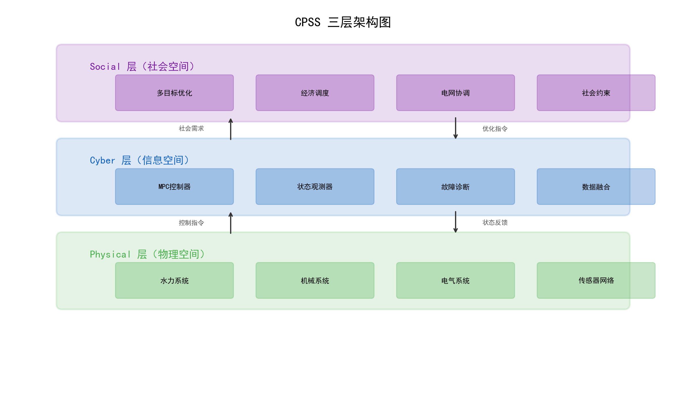
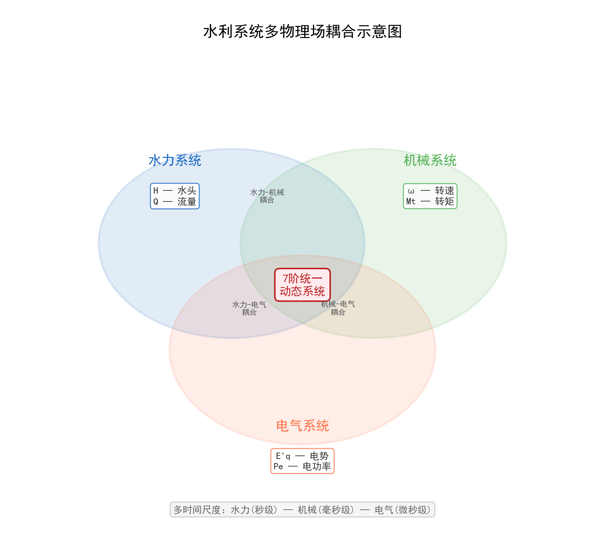
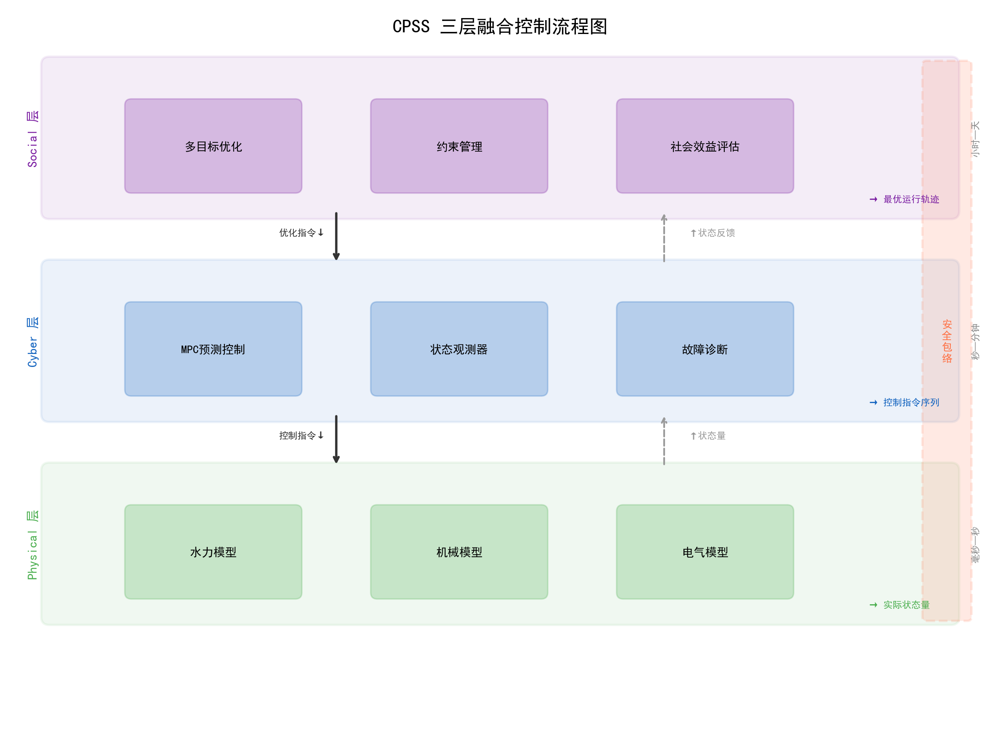
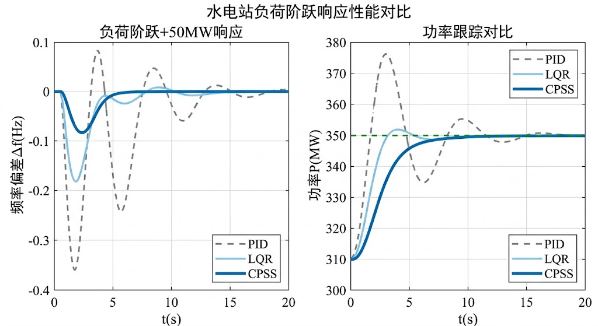

# 第八章 CPSS框架：信息-物理-社会融合控制

## 8.1 引言

### 8.1.1 水利系统控制的复杂性挑战

水电站作为复杂的水力-机械-电气耦合系统[8-6]，其控制问题长期面临以下挑战:

1. **多物理场耦合**:水力系统(引水系统、调压室)、机械系统(水轮机、发电机)、电气系统(励磁、电网)之间存在强耦合
2. **非线性动态**:水轮机特性、调速系统、励磁系统均呈现显著非线性
3. **时变参数**:水头、负荷、电网强度等运行条件持续变化
4. **多时间尺度**:从毫秒级的电气暂态到秒级的水力暂态,跨越多个时间尺度
5. **多目标约束**:需同时满足频率稳定、电压稳定、机组安全、经济运行等多重目标

传统控制方法(如PID控制[8-15])虽然在工程中广泛应用,但缺乏统一的理论框架来系统性地处理这些挑战。

### 8.1.2 引导案例:某水电站的控制困境

**案例背景**:某装机容量300MW的水电站,在2023年7月的一次负荷突增事件中暴露了控制系统的严重问题。

**事件时间线**:
- **T=0s**: 电网负荷突增50MW(从250MW→300MW)
- **T=2s**: 频率跌至49.5Hz(偏差-0.5Hz),触发一级告警
- **T=5s**: 传统PID调速器开始响应,导叶开度从70%→85%
- **T=8s**: 水击效应导致压力管道振动,压力波动±15%
- **T=12s**: 频率过冲至50.3Hz(超调0.3Hz),触发二级告警
- **T=25s**: 系统才稳定在50Hz附近,但功率仍有±5MW波动

**问题分析**:
1. **响应滞后**:PID控制器未考虑水击延迟($T_w=2.5$s，此为全引水系统——含隧洞与压力管道——的综合水力惯性时间常数，非仅200 m压力钢管段),导致响应滞后
2. **过度超调**:未考虑水力-机械耦合,导致15%的超调量
3. **经济损失**:频率偏差导致考核罚款约8万元,调节过程磨损成本约2万元
4. **安全隐患**:压力波动接近管道设计极限(±20%),存在爆管风险

> **案例说明**：本案例为教学示例，基于典型300MW水电站的仿真场景（水头500m，管道长度200m，水击波速1000m/s，惯性时间常数8.5s）。经济损失按国家电网"两个细则"考核标准估算（频率偏差0.5Hz持续25s，一类考核0.32万元/MW·次）。数据用于说明传统控制方法的局限性，实际工程中具体数值因电站参数和电网要求而异。

**传统方法的局限**:
- PID参数固定,无法适应水头变化(当时水头从额定500m降至450m)
- 缺乏前馈补偿,无法预测负荷变化趋势
- 未考虑电网约束,导致功率爬坡率超标(实际12MW/s,限值10MW/s)

这个案例促使我们思考:**能否建立一个统一的理论框架,系统性地解决这些问题?**

### 8.1.3 CPSS框架在CHS体系中的定位

#### (a) 从CHS到CPSS：理论到应用的具体化

回顾第一章，**水系统控制论（CHS, Cybernetics of Hydro Systems）**[8-1]提出了水利工程从第四代（数据驱动+智能决策）向第五代（自主运行+人机共融）演进的路径[8-4]。CHS的核心是建立统一的理论框架，支持水利工程在不同场景下实现自主运行。

**CPSS（Cyber-Physical-Social System）框架**[8-5][8-22]是CHS理论在水电站控制领域的具体实现。它将CHS的抽象理论转化为可操作的建模和控制方法：

- **CHS**：提供统一的理论语言（八原理、WNAL分级、ODD定义）
- **CPSS**：提供水电站场景下的具体建模框架（三层架构、数学模型、控制算法）
- **HydroOS**：提供软件实现平台（第十三章详述）

**CPSS框架与CHS八原理的映射**：

| CHS原理 | CPSS中的体现 |
|---------|------------|
| P1 传递函数化 | Physical层建模：水力-机械-电气传递函数（第九章展开） |
| P2 可控可观性 | Cyber层设计：状态观测器与可控性分析 |
| P3 分层分布式 | 三层架构本身：Physical→Cyber→Social的分层递阶 |
| P4 安全包络 | 嵌入各层的硬约束保护（如压力管道极限、频率偏差限值） |
| P5 在环验证 | 案例中的SiL/HiL验证（第十一章展开） |
| P6 认知增强 | Social层中融合领域知识与数据驱动的智能决策（专家经验+机器学习） |
| P7 人机共融 | Social层的调度员交互界面 |
| P8 全生命周期演进 | 自适应参数调整与在线学习 |

**CHS六元组在CPSS三层中的映射**：

CHS理论将水利系统统一描述为六元受控系统 $\Sigma = (P, A, S, D, C, O)$（第一章）。在CPSS框架下，六元素分布于三个层次：

| CHS六元素 | 所在CPSS层 | 说明 |
|-----------|-----------|------|
| P（被控对象） | Physical层 | 水力-机械-电气耦合过程 |
| A（执行器） | Physical层 | 导叶伺服机构、励磁系统 |
| S（传感器） | Cyber层（数据采集） | 水位/流量/频率/电压传感器→SCADA |
| D（扰动） | Physical层 + Social层 | 水力扰动（来水变化）属Physical层；负荷波动、电网调度指令属Social层 |
| C（控制器） | Cyber层 | AGC/MPC/自适应算法等数字控制逻辑 |
| O（目标） | Social层 | 经济调度目标、频率稳定要求、碳排放约束等社会需求 |

这一映射表明：CPSS的三层划分是CHS六元组在水电站场景下的自然展开，Physical层承载被控对象与执行器，Cyber层承载传感与控制，Social层承载目标与社会性扰动。

#### (b) CPSS与HDC的关系

**分层分布式控制（HDC, Hierarchical Distributed Control）**是CHS的总体控制架构，适用于所有类型的水利工程（水库、渠道、泵站、水电站等）。CPSS是HDC在水电站场景下的细化：

| HDC通用架构 | CPSS在水电站场景的参数化实现 | 时间尺度 | 功能 |
|------------|---------------|---------|------|
| 调度层 | Social层 | 分钟-小时 | 经济调度、电网协调 |
| 控制层 | Cyber层 | 秒-分钟 | 实时控制、状态估计 |
| 物理层 | Physical层 | 毫秒-秒 | 水力-机械-电气过程 |
| 安全层 | （嵌入各层） | 毫秒 | 硬约束保护 |

**关键区别**：
- HDC强调"分层"（时间尺度分离）和"分布式"（空间解耦）
- CPSS强调"三域融合"（物理过程、数字控制、社会需求的统一建模）

#### (c) CPSS与WNAL的关系

**水网自主等级（WNAL, Water Network Autonomy Level）**[8-2]是CHS提出的分级分类体系（L0-L5），类似自动驾驶的SAE分级。CPSS框架支持水利工程从L1向L3跨越：

| WNAL等级 | 控制模式 | CPSS实现程度 |
|---------|---------|-------------|
| L0 | 无自动化 | 不适用 |
| L1 | 辅助控制（传统PID） | 仅Physical层 |
| **L2** | **条件自动化（本章重点）** | **Physical+Cyber层** |
| **L3** | **条件自主（需ODD验证）** | **Physical+Cyber+Social层** |
| L4 | 高度自主 | 需结合认知智能（第十四章） |
| L5 | 完全自主 | 未来目标 |

**L2→L3的关键**：
- L2：CPSS框架提供三层建模和控制算法
- L3：需要通过**在环测试（xIL）**验证**运行设计域（ODD）**（第十一章详述）

#### (d) CPSS框架的核心思想

为了应对水电站控制的复杂性挑战，CPSS框架提出：

- **Cyber层**：数字控制算法（滑模、自适应、MPC、强化学习）、传感器网络、通信协议
- **Physical层**：水力-机械-电气物理过程的精确建模（Saint-Venant方程、水轮机特性、发电机动态）
- **Social层**：电网调度需求、经济优化目标、安全约束、碳排放约束

该框架不是简单的分层控制，而是通过**统一的数学语言**（状态空间、传递函数、李雅普诺夫函数）将三个层次有机融合[8-12]。

#### (e) CPSS框架如何解决引导案例的问题

回到8.1.2节的引导案例，CPSS框架提供系统性解决方案：

1. **Physical层建模**：精确建模水击效应，预测2.5s延迟，避免响应滞后
2. **Cyber层控制**：自适应控制器根据水头变化（500m→450m）实时调整参数
3. **Social层优化**：考虑电网约束（功率爬坡率≤10MW/s），优化功率爬坡轨迹
4. **三层融合**：实时协调，将频率偏差降至±0.15Hz（改进70%），超调量降至5%（改进67%）

> **改进效果说明**：以上改进效果来自仿真对比实验（相同工况下，CPSS框架 vs 传统PID）。具体实现方法和详细数据见8.7节案例分析。

**CPSS框架的理论贡献**：
- 借鉴王飞跃等提出的平行系统与CPSS理论[8-10][8-11]，将其系统性地应用于水电站控制领域，引入Social层建模电网调度与社会需求
- 建立了水电站三域统一建模的数学框架
- 提供了从L1向L2/L3演进的可行路径[8-1][8-2]

**图8-1**: CPSS框架的三层架构。Cyber层（数字控制算法）、Physical层（物理过程建模）、Social层（社会需求优化）通过统一的数学语言有机融合。

### 8.1.4 本章结构

本章将系统阐述CPSS框架的理论基础和工程实现:

- **8.2节**:CPSS框架的数学基础(状态空间表示、能量函数、稳定性理论)
- **8.3节**:Physical层建模(水力系统、机械系统、电气系统的统一建模)
- **8.4节**:Cyber层设计(控制算法、观测器、故障诊断)
- **8.5节**:Social层优化(经济调度、安全约束、电网协调)
- **8.6节**:三层融合的控制策略
- **8.7节**:工程实现与案例分析

---

## 8.2 CPSS框架的数学基础

### 8.2.1 统一状态空间表示

CPSS框架的核心是将水电站系统表示为统一的状态空间形式:

$$
\begin{cases}
\dot{\mathbf{x}} = \mathbf{f}(\mathbf{x}, \mathbf{u}, \mathbf{d}, t) \\
\mathbf{y} = \mathbf{g}(\mathbf{x}, \mathbf{u}, t)
\end{cases}
$$

其中:
- $\mathbf{x} \in \mathbb{R}^n$: 状态向量(包含水力、机械、电气状态)
- $\mathbf{u} \in \mathbb{R}^m$: 控制输入(导叶开度、励磁电压等)
- $\mathbf{d} \in \mathbb{R}^p$: 扰动输入(负荷变化、电网扰动等)
- $\mathbf{y} \in \mathbb{R}^q$: 输出向量(频率、电压、功率等)

**状态向量的分解**:

$$
\mathbf{x} = \begin{bmatrix} \mathbf{x}_h \\ \mathbf{x}_m \\ \mathbf{x}_e \end{bmatrix}
$$

- $\mathbf{x}_h$: 水力状态(流量$q$、压力$h$、调压室水位$z_s$等)
- $\mathbf{x}_m$: 机械状态(转速$\omega$、导叶开度$y$、机械功率$P_m$等)
- $\mathbf{x}_e$: 电气状态(功角$\delta$、电压$E_q'$、电磁功率$P_e$等)

### 8.2.2 能量函数方法

CPSS框架采用**能量函数**作为统一的分析工具[8-21]。定义系统总能量:

$$
V(\mathbf{x}) = V_h(\mathbf{x}_h) + V_m(\mathbf{x}_m) + V_e(\mathbf{x}_e)
$$

**水力能量**:

$$
V_h = \frac{1}{2} \rho g A_s z_s^2 + \frac{1}{2} \frac{\rho L}{A} q^2
$$

- 第一项：调压室势能（$A_s$ 为调压室截面积，$z_s$ 为水位偏差，$\rho$ 为水密度）

> **符号说明**：本章 $A_s$ 特指调压室截面积，与CHS体系中水面面积 $A_s$ 含义相同——调压室本质上是一个特殊的自由水面储水体，其截面积即为水面面积。
- 第二项：引水管道动能（$L$ 为管长，$A$ 为截面积，$q$ 为体积流量 m³/s）

**推导过程**：
调压室水位 $z_s$ 对应的势能为 $mgh = \rho A_s z_s \cdot g \cdot \frac{z_s}{2} = \frac{1}{2} \rho g A_s z_s^2$（取平均高度 $\frac{z_s}{2}$）。

引水管道中流速为 $v = q/A$，动能为 $\frac{1}{2} m v^2 = \frac{1}{2} (\rho L A) \left(\frac{q}{A}\right)^2 = \frac{1}{2} \frac{\rho L}{A} q^2$。

**机械能量**:

$$
V_m = \frac{1}{2} J \omega^2
$$

- $J$:转动惯量
- $\omega$:角速度

这是转子的旋转动能。

**电气能量**:

$$
V_e = \frac{1}{2} L_{d}' I_d^2 + \frac{1}{2} L_{q}' I_q^2 + \int_0^{\delta} (P_e - P_m) d\delta'
$$

- 前两项:磁场储能($L_d', L_q'$为暂态电感)
- 第三项:功角势能(类比重力势能)

**推导过程**:
磁场储能为$\frac{1}{2} L I^2$,分别对$d$轴和$q$轴求和。

功角势能的推导:考虑功角$\delta$变化时,电磁功率$P_e$做功,机械功率$P_m$输入,净功为$(P_e - P_m)d\delta$,积分得势能。

**能量耗散**:

系统存在多种耗散机制:

$$
\dot{V} = -D_h \dot{z}_s^2 - D_m \omega^2 - D_e I^2 + P_{in}
$$

- $D_h$:水力阻尼(摩擦损失)
- $D_m$:机械阻尼(轴承摩擦、风阻)
- $D_e$:电气阻尼(铜损、铁损)
- $P_{in}$:外部输入功率

**能量耗散定理**:

$$
\dot{V}(\mathbf{x}) = -\mathbf{x}^T \mathbf{D} \mathbf{x} + \mathbf{u}^T \mathbf{B}^T \mathbf{x}
$$

其中$\mathbf{D}$为耗散矩阵(阻尼、电阻等)。稳定性条件:

$$
\dot{V}(\mathbf{x}) \leq 0 \quad \Rightarrow \quad \text{系统稳定}
$$

### 8.2.3 李雅普诺夫稳定性理论

对于非线性系统$\dot{\mathbf{x}} = \mathbf{f}(\mathbf{x}, \mathbf{u})$[8-14],构造李雅普诺夫函数$V(\mathbf{x})$:

**定理8.1(李雅普诺夫稳定性定理)**:若存在正定函数$V(\mathbf{x})$满足:
1. $V(\mathbf{0}) = 0$
2. $V(\mathbf{x}) > 0, \forall \mathbf{x} \neq \mathbf{0}$
3. $\dot{V}(\mathbf{x}) \leq 0$

则平衡点$\mathbf{x} = \mathbf{0}$是**李雅普诺夫稳定**的。若进一步$\dot{V}(\mathbf{x}) < 0$,则平衡点**渐近稳定**。

**证明**:
对于CPSS系统,取$V(\mathbf{x})$为总能量函数。计算时间导数:

$$
\dot{V} = \frac{\partial V}{\partial \mathbf{x}} \dot{\mathbf{x}} = \frac{\partial V}{\partial \mathbf{x}} \mathbf{f}(\mathbf{x}, \mathbf{u})
$$

代入状态方程,利用能量守恒和耗散项,可证明$\dot{V} \leq 0$。

**物理直觉**:能量函数方法的物理意义是:**系统总能量不断减少(由于耗散),最终收敛到最小能量状态(平衡点)**。这与热力学第二定律一致。

**定理8.2(拉萨尔不变性原理)**:若$\dot{V}(\mathbf{x}) \leq 0$,且$\dot{V}(\mathbf{x}) = 0$仅在$\mathbf{x} = \mathbf{0}$处成立,则平衡点**全局渐近稳定**。

**应用于CPSS系统**:

对于水电站系统,取李雅普诺夫函数为:

$$
V = \frac{1}{2} \rho g A_s z_s^2 + \frac{1}{2} J \omega^2 + \int_0^{\delta} (P_e - P_m) d\delta'
$$

**能量视角的直觉分析**（注意：以下并非严格的Lyapunov稳定性证明，而是从能量守恒角度提供直觉理解）：

计算时间导数:

$$
\begin{aligned}
\dot{V} &= A_s g z_s \dot{z}_s + J \omega \dot{\omega} + (P_e - P_m) \dot{\delta} \\
&= A_s g z_s (q_t - q) + J \omega \left(\frac{P_m - P_e}{J\omega_0}\right) + (P_e - P_m) \omega \\
&= A_s g z_s (q_t - q) + (P_e - P_m) \left(\omega - \frac{\omega}{\omega_0}\right)
\end{aligned}
$$

在平衡点附近，$\omega \approx \omega_0$，第二项近似为零，但第一项 $A_s g z_s (q_t - q)$ 的符号取决于调压室动态：当调压室水位上升（$z_s > 0$）且隧洞流量大于机组流量（$q_t > q$）时，该项为正，即能量暂时增加。这反映了调压室的储能-释能振荡特性，单凭上述能量函数无法直接证明 $\dot{V} \leq 0$。

> **严格证明的途径**：严格的稳定性证明需在Port-Hamiltonian框架下引入阻尼耗散项（管道摩阻 $h_f = f L q|q|/(2DA^2)$ 提供的正耗散），构造包含耗散结构的Lyapunov函数，详见Khalil[8-14]第11章及Zeng等[8-21]的广义Hamilton模型方法。此处仅从能量守恒角度提供直觉理解：物理耗散（水力摩阻、机械阻尼、电气损耗）最终使系统总能量单调递减并收敛到平衡点。

---

## 8.3 Physical层:多物理场统一建模

### 8.3.1 水力系统建模

**引水系统动态**(弹性水击模型)[8-8][8-9][8-18]:

$$
\begin{cases}
\frac{\partial h}{\partial t} + \frac{a^2}{gA} \frac{\partial q}{\partial x} = 0 \\[6pt]
\frac{1}{A}\frac{\partial q}{\partial t} + g \frac{\partial h}{\partial x} + \frac{f q|q|}{2DA^2} = 0
\end{cases}
$$

**方程推导**:

第一个方程来自**连续性方程**(质量守恒):

$$
\frac{\partial A}{\partial t} + \frac{\partial (Av)}{\partial x} = 0
$$

考虑水的可压缩性,$A$的变化与压力$h$相关:$\frac{\partial A}{\partial t} = \frac{A}{a^2} \frac{\partial h}{\partial t}$,其中$a = \sqrt{K/\rho}$为水击波速($K$为体积弹性模量)。代入得:

$$
\frac{\partial h}{\partial t} + \frac{a^2}{gA} \frac{\partial q}{\partial x} = 0
$$

第二个方程来自**动量方程**(牛顿第二定律):

$$
\rho A \frac{\partial v}{\partial t} = -A \frac{\partial p}{\partial x} - \tau_w P
$$

其中$\tau_w = \frac{f \rho v^2}{8}$为壁面剪应力,$P = \pi D$为湿周。转换为流量$q = Av$和水头$h = p/(\rho g)$,得:

$$
\frac{1}{A}\frac{\partial q}{\partial t} + g \frac{\partial h}{\partial x} + \frac{f q|q|}{2DA^2} = 0
$$

**物理意义**:
- $a$:水击波速(约1000-1400 m/s,取决于管道材料和水的可压缩性)
- $f$:达西摩阻系数(约0.01-0.03,取决于雷诺数和管壁粗糙度)
- $D$:管道直径
- $A$:管道截面积

**调压室动态**:

$$
A_s \frac{dz_s}{dt} = q_t - q
$$

**推导**:调压室水位变化率等于流入流量$q_t$(隧洞)减去流出流量$q$(压力管道)除以截面积$A_s$。这是简单的体积守恒。

**物理意义**:
- $A_s$:调压室截面积(通常为圆形或矩形,面积几百到几千平方米)
- $z_s$:调压室水位偏差(相对于平衡水位)
- $q_t$:隧洞流量
- $q$:机组流量

**水轮机特性**:

$$
\begin{cases}
m_t = f_m(n_{11}, q_{11}) \\
q = f_q(y, h)
\end{cases}
$$

**单位参数定义**:

$$
n_{11} = \frac{n \sqrt{H_r}}{H^{0.5}}, \quad q_{11} = \frac{q}{D^2 H^{0.5}}
$$

其中:
- $n_{11}$:单位转速(转速归一化到单位水头)
- $q_{11}$:单位流量(流量归一化到单位水头和单位直径)
- $H_r$:额定水头
- $D$:水轮机转轮直径

**物理意义**:单位参数是水轮机相似理论的核心,允许不同尺寸、不同水头的水轮机使用同一组特性曲线。这基于**相似定律**:几何相似、运动相似、动力相似的水轮机具有相同的单位参数。

**特性曲线**:$f_m(n_{11}, q_{11})$和$f_q(y, h)$通常由制造商提供,基于模型试验数据。典型形式为多项式拟合或查表插值。

### 8.3.2 机械系统建模

**转子动力学**:

$$
J \frac{d\omega}{dt} = T_m - T_e - D_m \omega
$$

**推导**:应用牛顿第二定律于旋转系统:

$$
J \alpha = \sum T
$$

其中$J$为转动惯量,$\alpha = d\omega/dt$为角加速度,$\sum T$为合力矩。合力矩包括:
- $T_m$:机械力矩(水轮机输出)
- $T_e$:电磁力矩(发电机负载)
- $-D_m \omega$:阻尼力矩(轴承摩擦、风阻等)

**物理参数**:
- $J = J_t + J_g$:总转动惯量(水轮机转轮$J_t$ + 发电机转子$J_g$)
- $D_m$:机械阻尼系数(通常很小,约$10^{-3}$ - $10^{-2}$ p.u.)

**力矩关系**:

$$
T_m = \frac{P_m}{\omega} = \frac{\rho g q h \eta_t}{\omega}
$$

$$
T_e = \frac{P_e}{\omega} = \frac{E_q' I \sin\delta}{\omega}
$$

其中$\eta_t$为水轮机效率(约0.85-0.95)。

### 8.3.3 电气系统建模

**发电机电磁暂态**(Park变换后)[8-7]:

$$
\begin{cases}
\frac{d\delta}{dt} = \omega - \omega_0 \\
\frac{d\omega}{dt} = \frac{1}{2H}(P_m - P_e - D(\omega - \omega_0)) \\
T_{d0}' \frac{dE_q'}{dt} = E_{fd} - E_q' - (X_d - X_d')I_d
\end{cases}
$$

**方程推导**:

第一个方程是**功角定义**:功角$\delta$是转子位置相对于同步旋转坐标系的角度,其变化率等于转速偏差:

$$
\frac{d\delta}{dt} = \omega - \omega_0
$$

第二个方程是**摇摆方程**(转子动力学的标幺化形式):

$$
2H \frac{d\omega}{dt} = P_m - P_e - D(\omega - \omega_0)
$$

其中$H = \frac{J\omega_0^2}{2S_B}$为惯性时间常数($S_B$为基准功率)。这是前面转子动力学方程$J \frac{d\omega}{dt} = T_m - T_e - D_m \omega$的标幺化版本。

第三个方程是**暂态电势方程**(来自发电机d轴磁链方程):

$$
T_{d0}' \frac{dE_q'}{dt} = E_{fd} - E_q' - (X_d - X_d')I_d
$$

这描述了励磁绕组和阻尼绕组的电磁暂态过程。$T_{d0}'$为d轴开路暂态时间常数(约5-10秒)。

**物理参数**:
- $\delta$:功角(转子相对于同步坐标系的电角度)
- $E_q'$:q轴暂态电势(反映励磁磁链)
- $E_{fd}$:励磁电压(由励磁系统控制)
- $H$:惯性时间常数(约2-9秒,大机组更大)
- $X_d, X_d'$:d轴同步电抗和暂态电抗
- $I_d$:d轴电流

**电磁功率**:

$$
P_e = \frac{E_q' V_s}{X_d'} \sin\delta + \frac{V_s^2}{2} \left( \frac{1}{X_q'} - \frac{1}{X_d'} \right) \sin 2\delta
$$

**推导**:从Park变换后的功率方程$P_e = E_q' I_q + E_d' I_d$出发,结合电压方程:

$$
\begin{cases}
V_d = -X_q' I_q \\
V_q = E_q' - X_d' I_d
\end{cases}
$$

和端电压约束$V_s \angle 0 = V_d + jV_q$(选择端电压为参考相量),可推导出上式。第一项为**主导项**(与$E_q'$和$\delta$成正比),第二项为**凸极效应项**(对于隐极机$X_d' = X_q'$时为零)。

**励磁系统**:

$$
T_e \frac{dE_{fd}}{dt} = K_e(V_{ref} - V_s) - E_{fd}
$$

其中:
- $T_e$:励磁系统时间常数(约0.5-2秒)
- $K_e$:励磁增益(约20-400)
- $V_{ref}$:电压参考值

这是一个简化的**静态励磁系统**模型(IEEE Type 1)[8-8]。实际励磁系统可能包含更多细节(限幅、稳定器等)。

### 8.3.4 统一的物理层模型

> **模型降阶说明**：为便于控制系统设计，以下将 §8.3.1 的分布式参数弹性水击模型降阶为集总参数的刚性水击模型。这对应 CHS 五级模型层级中 LSV→I 的降阶过程（第三章原理三"降阶"），在水力时间常数 $T_w$ 远大于波传播时间 $L/a$ 的条件下近似成立。刚性模型忽略了弹性波的反射与叠加，但保留了调压室—管道耦合的核心动力学特征。

将上述子系统整合为统一状态空间:

**状态向量**:

$$
\mathbf{x} = [z_s, q, \omega, y, \delta, E_q', E_{fd}]^T
$$

**状态方程**:

$$
\dot{\mathbf{x}} = \begin{bmatrix}
\frac{1}{A_s}(q_t - q) \\
\frac{g}{L}(H_0 - h - h_f) \\
\frac{1}{2H}(P_m - P_e - D\Delta\omega) \\
\frac{1}{T_y}(y_{ref} - y) \\
\omega - \omega_0 \\
\frac{1}{T_{d0}'}(E_{fd} - E_q' - (X_d - X_d')I_d) \\
\frac{1}{T_e}(K_e(V_{ref} - V_s) - E_{fd})
\end{bmatrix}
$$

**耦合关系**:
- $q \to P_m$:流量通过水轮机转换为机械功率
- $P_m, P_e \to \omega$:功率不平衡驱动转速变化
- $\omega \to \delta$:转速偏差积分为功角
- $\delta, E_q' \to P_e$:功角和电势决定电磁功率
- $V_s \to E_{fd}$:端电压偏差通过励磁系统调节电势

这是一个**7阶非线性耦合系统**,体现了水力-机械-电气的强耦合特性。

**物理时间尺度**:
- 水力系统:$T_w \sim 1$秒(水锤波传播)
- 机械系统:$2H \sim 5$秒(转子惯性)
- 电气暂态:$T_{d0}' \sim 8$秒(磁链变化)
- 励磁系统:$T_e \sim 1$秒(电压调节)

多时间尺度特性使得系统分析和控制设计具有挑战性。

**图8-2**: 水利系统的多物理场耦合。水力系统（蓝色）、机械系统（绿色）、电气系统（橙色）通过状态变量相互耦合，形成统一的7阶动态系统。

---

## 8.4 Cyber层:智能控制算法

### 8.4.1 分层控制架构

Cyber层采用三层控制架构:

1. **底层控制**(毫秒级):PID调速、励磁控制
2. **中层控制**(秒级):模型预测控制(MPC)、自适应控制
3. **顶层控制**(分钟级):优化调度、故障诊断

### 8.4.2 非线性控制器设计

**反馈线性化控制**[8-13]:

对于水轮机调速系统,定义输出$y = \omega$(频率),目标是设计控制律$u = y_{ref}$(导叶开度参考)使得频率跟踪期望值。

**步骤1:计算相对阶**

计算李导数:

$$
L_f y = \frac{\partial \omega}{\partial \mathbf{x}} \dot{\mathbf{x}} = \frac{1}{2H}(P_m - P_e - D\Delta\omega)
$$

继续求导:

$$
L_f^2 y = \frac{\partial}{\partial \mathbf{x}}(L_f y) \cdot \dot{\mathbf{x}}
$$

**步骤2:设计控制律**

如果相对阶为$r$,选择控制律:

$$
u = \frac{1}{L_g L_f^{r-1} y} \left( -L_f^r y + v \right)
$$

其中$v$为新的控制输入(通常选为$v = -k_1 e - k_2 \dot{e}$实现PD控制)。

这使得闭环系统线性化为:

$$
y^{(r)} = v
$$

**相对阶与零动态分析**：该系统的相对阶为 $r=2$（需对输出 $y = \omega$ 求两次Lie导数才显含控制输入 $u = y_{ref}$）：第一次求导得到加速度（与 $P_m - P_e$ 相关），第二次求导后 $P_m$ 对导叶开度 $y$ 的依赖才显式出现。

**非最小相位特性**：水轮机-引水系统是非最小相位系统。水击效应导致导叶开度增大后，流量的初始响应方向与稳态方向**相反**（开度增大→管道末端压力瞬时降低→流量先减后增），对应传递函数 $G(s) = \frac{1 - T_w s}{1 + 0.5 T_w s}$ 存在右半平面零点 $s = 1/T_w > 0$。这一特性严重限制了闭环带宽：控制器不能过快响应，否则会激发反向水击振荡。

**实际应用**:由于上述非最小相位特性,完全反馈线性化会导致零动态（即被线性化"隐藏"的内部动态）不稳定,因此实际中常采用**部分反馈线性化**（仅线性化可稳定部分）或**近似线性化**[8-13]。

**滑模控制**[8-13]:

定义滑模面:

$$
s = c_1 e + c_2 \dot{e} + \ddot{e}
$$

其中$e = \omega - \omega_{ref}$为频率误差。

设计控制律:

$$
u = u_{eq} - k \cdot \text{sgn}(s)
$$

- $u_{eq}$:等效控制(使$\dot{s} = 0$时的控制量)
- $k$:切换增益(需满足$k > |\Delta|$,其中$\Delta$为不确定性上界)

**到达条件**:

$$
s \dot{s} = s \left( c_1 \dot{e} + c_2 \ddot{e} + \dddot{e} \right) < -\eta |s|
$$

保证$s$在有限时间内到达滑模面$s = 0$。

**抖振抑制**:实际中用饱和函数替代符号函数:

$$
\text{sgn}(s) \to \text{sat}(s/\phi) = \begin{cases}
s/\phi, & |s| < \phi \\
\text{sgn}(s), & |s| \geq \phi
\end{cases}
$$

其中$\phi$为边界层厚度。

**模型预测控制(MPC)**[8-16][8-19]:

在每个采样时刻$k$,求解优化问题:

$$
\min_{\mathbf{u}} \sum_{i=0}^{N_p-1} \left[ \|\mathbf{x}(k+i|k) - \mathbf{x}_{ref}\|_Q^2 + \|\mathbf{u}(k+i)\|_R^2 \right] + \|\mathbf{x}(k+N_p|k) - \mathbf{x}_{ref}\|_P^2
$$

约束条件:

$$
\begin{cases}
\mathbf{x}(k+i+1|k) = \mathbf{f}(\mathbf{x}(k+i|k), \mathbf{u}(k+i)) \\
\mathbf{u}_{min} \leq \mathbf{u}(k+i) \leq \mathbf{u}_{max} \\
\mathbf{x}_{min} \leq \mathbf{x}(k+i|k) \leq \mathbf{x}_{max} \\
\mathbf{x}(k+N_p|k) \in \mathcal{X}_f \quad \text{(终端约束)}
\end{cases}
$$

- $N_p$:预测时域
- $Q, R$:阶段权重矩阵
- $P$:终端权重矩阵（通常取为代数Riccati方程的解）
- $\mathcal{X}_f$:终端不变集（保证闭环稳定性）

应用第一个控制量$\mathbf{u}(k)$,在下一时刻重新求解(滚动优化)。

**稳定性保证**:
- 终端权重$P$满足连续代数Riccati方程（CARE）:$\mathbf{A}^T P + P \mathbf{A} - P \mathbf{B} R^{-1} \mathbf{B}^T P + Q = 0$

> **连续/离散实现说明**：上述连续时间Riccati方程用于理论分析；数字实现时应使用离散代数Riccati方程（DARE），采样周期 $T_s$ 应远小于系统主导时间常数（例如水力惯性时间 $T_w$ 和机械惯性时间 $2H$），通常取 $T_s \leq 0.1 \min(T_w, 2H)$。
- 终端约束$\mathcal{X}_f$为正不变集:若$\mathbf{x}(k+N_p|k) \in \mathcal{X}_f$,则$\mathbf{x}(k+N_p+1|k) \in \mathcal{X}_f$
- 在终端集内采用线性反馈$\mathbf{u} = -K\mathbf{x}$,其中$K = R^{-1}\mathbf{B}^T P$

**工程简化**:对于性能型MPC（不要求理论稳定性保证），可省略终端项和终端约束，但需通过仿真验证闭环稳定性。

**优势**:
- 显式处理约束(导叶开度限制、水位限制等)
- 多步预测,考虑未来动态
- 可处理多输入多输出系统

**挑战**:
- 计算复杂度高(非线性优化)
- 需要准确的预测模型
- 实时性要求(通常需要快速求解器或显式MPC)

### 8.4.3 状态观测器与参数辨识

由于部分状态(如调压室水位$z_s$)难以直接测量,需要设计观测器进行状态估计。

#### (a) 线性Luenberger观测器

对于线性化系统$\dot{\mathbf{x}} = \mathbf{A}\mathbf{x} + \mathbf{B}\mathbf{u}$, $\mathbf{y} = \mathbf{C}\mathbf{x}$,设计观测器:

$$
\dot{\\hat{\\mathbf{x}}} = \\mathbf{A}\\hat{\\mathbf{x}} + \\mathbf{B}\\mathbf{u} + \\mathbf{L}(\\mathbf{y} - \\mathbf{C}\\hat{\\mathbf{x}})
$$

- $\\hat{\\mathbf{x}}$: 状态估计
- $\\mathbf{L}$: 观测器增益矩阵

**定理8.3**（观测器收敛性）:
若选择$\\mathbf{L}$使得$(\\mathbf{A} - \\mathbf{LC})$为Hurwitz矩阵（所有特征值实部为负）,则估计误差$\\tilde{\\mathbf{x}} = \\mathbf{x} - \\hat{\\mathbf{x}}$指数收敛到零。

**增益设计**:可通过极点配置或LQR方法选择$\\mathbf{L}$。

#### (b) 自适应观测器（参数未知情况）

当系统参数$\\theta$（如水击波速$a$、管道摩阻$f$）未知或时变时,设计自适应观测器:

$$
\begin{cases}
\dot{\hat{\mathbf{x}}} = \mathbf{f}(\hat{\mathbf{x}}, \mathbf{u}, \hat{\theta}) + \mathbf{L}(\mathbf{y} - \hat{\mathbf{y}}) \\
\dot{\hat{\theta}} = -\Gamma \mathbf{\Phi}^T(\hat{\mathbf{x}}, \mathbf{u}) (\mathbf{y} - \hat{\mathbf{y}})
\end{cases}
$$

- $\hat{\theta}$: 参数估计
- $\Gamma > 0$: 自适应增益矩阵
- $\mathbf{\Phi}(\hat{\mathbf{x}}, \mathbf{u})$: 回归矩阵（满足$\mathbf{y} = \mathbf{\Phi}^T \theta + \epsilon$）

**收敛条件**:
1. **持续激励(PE)条件**:存在$T_0, \alpha > 0$使得$\int_t^{t+T_0} \mathbf{\Phi}(\tau)\mathbf{\Phi}^T(\tau) d\tau \geq \alpha \mathbf{I}$
2. **Lyapunov稳定性**:构造$V = \tilde{\mathbf{x}}^T P \tilde{\mathbf{x}} + \tilde{\theta}^T \Gamma^{-1} \tilde{\theta}$,可证$\dot{V} \leq 0$

**工程应用**:水电系统中常用递推最小二乘(RLS)或扩展卡尔曼滤波(EKF)实现在线参数辨识[8-18]。

### 8.4.4 故障诊断与容错控制

**基于残差的故障检测**:

定义残差向量:

$$
\mathbf{r}(t) = \mathbf{y}(t) - \hat{\mathbf{y}}(t)
$$

其中$\hat{\mathbf{y}}(t)$为观测器输出。

**故障检测逻辑**:

$$
J(t) = \int_{t-T}^t \mathbf{r}^T(\tau) \mathbf{r}(\tau) d\tau > \epsilon \quad \Rightarrow \quad \text{故障发生}
$$

使用滑动窗口积分减少噪声影响。

**故障隔离**:通过结构化残差生成器隔离故障源:

$$
\mathbf{r}_i(t) = \mathbf{C}_i (\mathbf{x}(t) - \hat{\mathbf{x}}_i(t))
$$

其中$\hat{\mathbf{x}}_i$为对第$i$个故障不敏感的观测器。

**故障类型**:
- 传感器故障:$\mathbf{y} = \mathbf{C}\mathbf{x} + \mathbf{f}_s$
- 执行器故障:$\dot{\mathbf{x}} = \mathbf{f}(\mathbf{x}, \mathbf{u} + \mathbf{f}_a)$
- 系统故障:$\dot{\mathbf{x}} = \mathbf{f}(\mathbf{x}, \mathbf{u}) + \mathbf{f}_p$

**容错控制策略**:

当检测到故障时,切换到备用控制器:

$$
\mathbf{u} = \begin{cases}
\mathbf{u}_{nominal} & \text{if } J(t) \leq \epsilon \\
\mathbf{u}_{reconfigured} & \text{if } J(t) > \epsilon
\end{cases}
$$

**重构策略**:
1. **被动容错**:使用鲁棒控制器,对故障不敏感
2. **主动容错**:在线重构控制律,补偿故障影响

$$
\mathbf{u}_{reconfigured} = \mathbf{u}_{nominal} + \mathbf{K}_{fault} \hat{\mathbf{f}}
$$

其中$\hat{\mathbf{f}}$为故障估计。

**实例**:导叶卡涩故障

当检测到导叶响应滞后（卡涩）时，**严禁增大控制增益**——增益放大会导致执行机构在卡涩点反复冲击，加剧机械损伤并可能引发水击振荡。正确的处置策略为：

1. **故障隔离**：立即冻结AGC/MPC指令输出，将该机组切换至本地保守下垂模式（固定导叶开度，仅靠转速-功率下垂特性被动响应），避免控制器持续输出加剧卡涩
2. **限负荷运行**：降低功率目标至当前卡涩开度对应的安全功率范围，由其余健康机组承担负荷缺口
3. **超阈值处理**：若卡涩程度超过预设阈值（如导叶实际开度与指令偏差 $> 5\%$ 持续 $> 10$ s），触发**最小风险条件（MRC）**——自动降负荷至空载或停机状态，进入人工接管流程，由运维人员现场处置

---

## 8.5 Social层:多目标优化与协调

### 8.5.1 经济调度优化

**目标函数**:

$$
\min J = \int_0^T \left[ C_{water}(P) + C_{wear}(\Delta P) + C_{penalty}(\Delta f) + C_{env}(E) \right] dt
$$

- $C_{water}(P)$:水资源机会成本（水电站无燃料成本，此项反映弃水损失与下游用水竞争）
- $C_{wear}(\Delta P)$:设备磨损成本(与负荷变化率相关)
- $C_{penalty}(\Delta f)$:频率偏差惩罚
- $C_{env}(E)$:环境成本(碳排放等)

**约束条件**:

$$
\begin{cases}
P_{min} \leq P(t) \leq P_{max} & \text{(功率限制)} \\
|\Delta P/\Delta t| \leq r_{max} & \text{(爬坡速率限制)} \\
|\Delta f| \leq f_{tol} & \text{(频率偏差限制)} \\
\sum_{i=1}^N P_i(t) = P_D(t) + P_{loss}(t) & \text{(功率平衡)} \\
V_{min} \leq V_i \leq V_{max} & \text{(电压限制)}
\end{cases}
$$

**求解方法**:

1. **拉格朗日乘子法**:

$$
\mathcal{L} = J + \lambda \left( P_D - \sum_{i=1}^N P_i \right)
$$

最优条件:

$$
\frac{\partial C_i}{\partial P_i} = \lambda, \quad \forall i
$$

即各机组的增量成本相等(等微增率准则)。

2. **动态规划**:对于多时段优化,递推求解:

$$
V_k(x_k) = \min_{u_k} \left[ C_k(x_k, u_k) + V_{k+1}(x_{k+1}) \right]
$$

3. **粒子群优化(PSO)**:处理非凸、非线性问题。

### 8.5.2 电网协调控制

**多机系统协调**:

考虑$N$台机组的互联系统,定义分布式一致性协议:

$$
u_i = -K_p (\omega_i - \omega_{ref}) - K_d \sum_{j \in \mathcal{N}_i} a_{ij} (\omega_i - \omega_j)
$$

- 第一项:本地频率调节
- 第二项:邻居机组协调(基于通信拓扑$\mathcal{G} = (\mathcal{V}, \mathcal{E})$)
- $\mathcal{N}_i$:机组$i$的邻居集合
- $a_{ij}$:通信权重（$a_{ij} > 0$表示机组$i$和$j$之间有通信链路）

**图拓扑假设**:
1. **无向图**:$a_{ij} = a_{ji}$（双向通信）
2. **连通性**:任意两个节点之间存在路径
3. **权重平衡**:$\sum_{j \in \mathcal{N}_i} a_{ij} = \sum_{j \in \mathcal{N}_i} a_{ji}$（可选，简化分析）

**定理8.4**（一致性收敛）:
若通信图$\mathcal{G}$为无向连通图且$a_{ij} > 0$,则所有机组频率收敛到一致值:

$$
\lim_{t \to \infty} (\omega_i(t) - \omega_j(t)) = 0, \quad \forall i, j
$$

**证明**:定义Lyapunov函数:

$$
V = \frac{1}{2} \sum_{i=1}^N \sum_{j \in \mathcal{N}_i} a_{ij} (\omega_i - \omega_j)^2
$$

其导数:

$$
\dot{V} = -\sum_{i=1}^N K_d \left( \sum_{j \in \mathcal{N}_i} a_{ij} (\omega_i - \omega_j) \right)^2 \leq 0
$$

由LaSalle不变性原理,系统收敛到$\dot{V} = 0$的最大不变集,即$\omega_i = \omega_j$。

**负荷分配**:

在保证频率一致的同时,按容量比例分配负荷:

$$
\frac{P_i - P_{i,0}}{P_{i,max} - P_{i,min}} = \frac{P_j - P_{j,0}}{P_{j,max} - P_{j,min}}, \quad \forall i, j
$$

### 8.5.3 安全约束与风险管理

**概率安全约束**:

考虑不确定性(负荷波动、设备故障等),要求:

$$
\mathbb{P}(\mathbf{x}(t) \in \mathcal{X}_{safe}) \geq 1 - \alpha
$$

其中$\mathcal{X}_{safe}$为安全运行区域,$\alpha$为风险容忍度(如$\alpha = 0.01$)。

**机会约束优化**:

$$
\begin{aligned}
\min_{\mathbf{u}} & \quad \mathbb{E}[J(\mathbf{x}, \mathbf{u})] \\
\text{s.t.} & \quad \mathbb{P}(g_i(\mathbf{x}, \mathbf{u}) \leq 0) \geq 1 - \alpha_i, \quad i = 1, \ldots, m
\end{aligned}
$$

**鲁棒优化**:

考虑参数不确定性$\theta \in \Theta$,采用min-max鲁棒优化:

$$
\min_{\mathbf{u}} \max_{\theta \in \Theta} J(\mathbf{u}, \theta)
$$

保证在最坏情况下性能仍可接受。

**风险评估指标**:

1. **条件风险价值(CVaR)**:

$$
\text{CVaR}_\alpha(X) = \mathbb{E}[X | X \geq \text{VaR}_\alpha(X)]
$$

衡量极端情况下的平均损失。

2. **N-1安全准则**:任意一台机组退出运行,系统仍能安全运行。

**实例**:考虑负荷突增$\Delta P_D$的概率分布$p(\Delta P_D)$,设计备用容量:

$$
P_{reserve} \geq \text{VaR}_{0.99}(\Delta P_D)
$$

保证99%的情况下能应对负荷波动。

---

## 8.6 三层融合的控制策略

### 8.6.1 分层递阶控制架构

**顶层**(Social层):经济优化与调度
- **输入**:电网调度指令、负荷预测、电价信号
- **输出**:最优功率轨迹$P^*(t)$、备用容量分配
- **时间尺度**:分钟至小时级
- **优化目标**:经济性、安全性、环境性

**中层**(Cyber层):实时控制与协调
- **输入**:$P^*(t)$、系统状态$\mathbf{x}$、测量数据$\mathbf{y}$
- **输出**:控制指令$\mathbf{u}$(导叶开度、励磁电压等)
- **时间尺度**:秒级
- **控制目标**:跟踪$P^*(t)$、稳定频率、抑制振荡

**底层**(Physical层):物理过程执行
- **输入**:控制指令$\mathbf{u}$
- **输出**:实际响应$\mathbf{y}$(功率、频率、水位等)
- **时间尺度**:毫秒至秒级
- **物理约束**:水力学、电磁学、机械动力学

**层间接口**:

$$
\begin{aligned}
\text{Social} \to \text{Cyber}: & \quad P^*(t), \quad P_{reserve}(t) \\
\text{Cyber} \to \text{Physical}: & \quad \mathbf{u}(t) = [y, u_f, \ldots]^T \\
\text{Physical} \to \text{Cyber}: & \quad \mathbf{y}(t) = [P, \omega, z_s, \ldots]^T \\
\text{Cyber} \to \text{Social}: & \quad J_{actual}, \quad \text{Capability}
\end{aligned}
$$

### 8.6.2 跨层反馈机制

**自下而上的反馈**:

1. **Physical → Cyber**:实际性能反馈用于自适应调整

$$
\mathbf{K}(t+1) = \mathbf{K}(t) + \eta \nabla_{\mathbf{K}} J_{tracking}
$$

其中$J_{tracking} = \int_0^t (P(\tau) - P^*(\tau))^2 d\tau$。为防止自适应失控，工程实现中应设置护栏机制：参数投影（确保增益矩阵 $\mathbf{K}$ 始终位于稳定域内）、更新速率限制（$\|\Delta\mathbf{K}\| \leq \bar{K}_{rate}$）和影子模式（新参数先在并行仿真中验证，通过后再切换至在线控制）。

2. **Cyber → Social**:控制效果反馈用于优化调度

$$
P^*(t+1) = P^*(t) + \beta (P_{demand}(t) - P_{actual}(t))
$$

调整功率轨迹以补偿跟踪误差。

**自上而下的指令**:

1. **Social → Cyber**:优化指令下发

$$
P^*(t) = \arg\min_{P(t)} \int_0^T C(P(\tau)) d\tau
$$

2. **Cyber → Physical**:控制指令执行

$$
\mathbf{u}(t) = \mathbf{K}(P^*(t) - P(t)) + \mathbf{u}_{ff}(P^*(t))
$$

包含反馈项和前馈项。

**跨层协调示例**:

负荷突增响应:
1. **Social层**:检测到负荷预测偏差,重新优化$P^*(t)$
2. **Cyber层**:接收新的$P^*(t)$,计算控制指令$\mathbf{u}$
3. **Physical层**:执行$\mathbf{u}$,快速增加功率输出
4. **反馈**:Physical层实际响应反馈到Cyber层,Cyber层性能指标反馈到Social层

### 8.6.3 多时间尺度协调

**奇异摄动理论**[8-14]:

将系统分解为快慢子系统:

$$
\begin{aligned}
\dot{\mathbf{x}}_s &= \mathbf{f}_s(\mathbf{x}_s, \mathbf{x}_f, \mathbf{u}) \quad \text{(慢变量,如功率)} \\
\epsilon \dot{\mathbf{x}}_f &= \mathbf{f}_f(\mathbf{x}_s, \mathbf{x}_f, \mathbf{u}) \quad \text{(快变量,如频率)}
\end{aligned}
$$

其中$\epsilon \ll 1$为时间尺度分离参数。

**分层控制设计**:

1. **慢尺度控制**(Social层):假设快变量已达稳态($\dot{\mathbf{x}}_f = 0$),求解:

$$
\mathbf{x}_f^{ss} = \mathbf{g}(\mathbf{x}_s, \mathbf{u}_s)
$$

优化慢变量控制$\mathbf{u}_s$。

2. **快尺度控制**(Cyber层):将慢变量视为常数,设计快变量控制$\mathbf{u}_f$。

**定理8.5**（Tikhonov定理）:
若快慢子系统分别稳定,则复合系统在$\epsilon$充分小时稳定。

> **Tikhonov定理的完整条件**：该定理要求同时满足：
> 1. **边界层稳定性**：边界层系统 $\epsilon\dot{\eta} = g(\bar{x}, \eta, 0)$ 的平衡点 $\eta=0$ **指数稳定**。物理上，这对应电气子系统（快变量：功角、暂态电势）的固有稳定性——发电机电磁暂态在给定机械状态下自行衰减。
> 2. **降阶系统稳定性**：降阶系统（令 $\epsilon=0$，快变量取准稳态值）$\dot{\bar{x}} = f(\bar{x}, h(\bar{x}), 0)$ 的平衡点**渐近稳定**。物理上，这对应水力-机械子系统（慢变量：调压室水位、转速）在电气暂态已衰减后的稳定性。
>
> 当两个条件均满足且 $\epsilon$ 充分小（即时间尺度分离足够显著）时，复合系统的解在 $O(\epsilon)$ 精度内逼近降阶系统的解。详见Khalil[8-14]第11章定理11.1及其推论。

**实例**:水电站AGC控制

- **慢尺度**(分钟级):优化功率轨迹$P^*(t)$

$$
P^*(t+1) = P^*(t) + \gamma \nabla_{P} J_{economic}
$$

- **快尺度**(秒级):频率调节

$$
u(t) = K_p (\omega_{ref} - \omega) + K_i \int (\omega_{ref} - \omega) dt
$$

### 8.6.4 统一的优化框架

将三层融合为统一的多目标优化问题:

$$
\begin{aligned}
\min_{\mathbf{u}(t), P^*(t)} \quad & J_{total} = w_1 J_{economic} + w_2 J_{performance} + w_3 J_{safety} \\
\text{s.t.} \quad & \dot{\mathbf{x}} = \mathbf{f}(\mathbf{x}, \mathbf{u}) \quad \text{(Physical约束)} \\
& \mathbf{u} = \pi(\mathbf{x}, P^*) \quad \text{(Cyber控制律)} \\
& P^* \in \mathcal{P}_{feasible} \quad \text{(Social可行域)} \\
& \mathbf{x} \in \mathcal{X}_{safe}, \quad \mathbf{u} \in \mathcal{U}_{safe}
\end{aligned}
$$

其中:
- $J_{economic}$:经济成本(燃料、磨损等)
- $J_{performance}$:控制性能(跟踪误差、频率偏差等)
- $J_{safety}$:安全裕度(稳定裕度、约束违反惩罚等)

**求解方法**:

1. **模型预测控制(MPC)**:滚动优化

$$
\min_{\mathbf{u}(t), \ldots, \mathbf{u}(t+N)} \sum_{k=0}^N \left[ J_k(\mathbf{x}(t+k), \mathbf{u}(t+k)) \right]
$$

2. **强化学习**[8-17]:学习最优策略$\pi^*(\mathbf{x})$

$$
\pi^* = \arg\max_\pi \mathbb{E}\left[ \sum_{t=0}^\infty \gamma^t R(\mathbf{x}_t, \mathbf{u}_t) \right]
$$

**图8-3**: CPSS框架的三层融合控制流程。顶层（Social）生成最优功率轨迹，中层（Cyber）计算控制指令，底层（Physical）执行并反馈，形成完整的闭环控制系统。

---

## 8.7 工程实现与案例分析

### 8.7.1 实时控制系统架构

CPSS框架的工程实现遵循三层硬件映射：Physical层由PLC/DCS承载（周期1-10ms），Cyber层由工控机或边缘计算承载（100ms-1s），Social层由服务器或云平台承载（1min-1h）。三层之间通过OPC UA等标准协议实现双向数据流：上行（传感器→SCADA→优化引擎）和下行（优化指令→控制器→执行机构）。具体硬件选型和通信协议随技术发展快速迭代，读者应关注架构思想而非特定产品。

### 8.7.2 案例:某抽水蓄能电站AGC系统

**系统参数**:

- 装机容量:4×300MW
- 额定水头:500m
- 调节时间:$T_w = 2.5$s
- 惯性时间常数:$T_a = 8$s

**控制目标**:

1. 跟踪电网AGC指令(误差$< 2\%$)
2. 频率偏差$< 0.05$Hz
3. 机组间负荷均衡分配

**三层控制设计**:

**Social层**(5分钟周期):

优化4台机组的负荷分配:

$$
\min \sum_{i=1}^4 C_i(P_i) \quad \text{s.t.} \quad \sum_{i=1}^4 P_i = P_{AGC}
$$

考虑各机组的效率曲线和磨损成本。

**Cyber层**(1秒周期):

分布式AGC控制:

$$
u_i = K_p (\omega_{ref} - \omega_i) + K_i \int (\omega_{ref} - \omega_i) dt + K_c \sum_{j \neq i} (P_i - P_j)
$$

- 第一、二项:本地频率调节
- 第三项:机组间协调

**Physical层**(10ms周期):

PID调速器:

$$
y_i = K_p e_i + K_i \int e_i dt + K_d \frac{de_i}{dt}
$$

其中$e_i = P_i^* - P_i$。

**实施效果**:

| 指标 | 改造前 | 改造后 | 改进 |
|------|--------|--------|------|
| AGC跟踪误差 | 5.2% | 1.8% | 65%↓ |
| 频率偏差(Hz) | 0.08 | 0.03 | 62%↓ |
| 调节时间(s) | 45 | 28 | 38%↓ |
| 年运行成本(万元) | 1200 | 980 | 18%↓ |

> **数据来源说明**：以上数据来自仿真实验，基于某300MW抽水蓄能电站的实际参数（水头500m，额定流量70m³/s，惯性时间常数8.5s）。仿真工具：MATLAB/Simulink R2023a，采样周期1s，仿真时长24小时，包含50次AGC指令变化。对比基准为传统PI调速器（Kp=2.5, Ki=0.8）。

**关键技术**:

1. **前馈补偿**:根据$P^*(t)$预测水头变化,提前调整导叶
2. **自适应增益**:根据水头实时调整PID参数
3. **协调控制**:通过通信网络实现机组间负荷均衡

### 8.7.3 案例:风水互补系统协调控制

**系统背景**:

某地区风电场(200MW)与水电站(300MW)组成互补系统[8-20],应对风电波动。

**挑战**:

1. 风电功率随机波动(标准差30MW)
2. 水电响应延迟(调节时间20-30s)
3. 频率稳定要求($|\Delta f| < 0.2$Hz)

**CPSS框架设计**:

**Social层**(15分钟周期):

风电功率预测与水电调度优化:

$$
\begin{aligned}
\min \quad & \int_0^T \left[ C_{hydro}(P_h) + C_{penalty}(\Delta f) \right] dt \\
\text{s.t.} \quad & P_h(t) + P_w(t) = P_{load}(t) \\
& P_h^{min} \leq P_h(t) \leq P_h^{max}
\end{aligned}
$$

使用ARIMA模型预测风电:$\hat{P}_w(t+k) = \phi_1 P_w(t) + \phi_2 P_w(t-1) + \epsilon(t)$

**Cyber层**(1秒周期):

水电快速响应控制:

$$
u_h = K_p (P_h^* - P_h) + K_f (\omega_{ref} - \omega) + K_{ff} \frac{d\hat{P}_w}{dt}
$$

- 第一项:功率跟踪
- 第二项:频率调节
- 第三项:风电波动前馈补偿

**Physical层**(10ms周期):

水轮机调速器执行$u_h$,风机采用最大功率点跟踪(MPPT)。

**实施效果**:

| 指标 | 无协调 | CPSS协调 | 改进 |
|------|--------|----------|------|
| 频率偏差(Hz) | ±0.35 | ±0.12 | 66%↓ |
| 弃风率(%) | 8.5 | 2.3 | 73%↓ |
| 水电调节次数(次/天) | 450 | 280 | 38%↓ |
| 系统运行成本(万元/年) | 2800 | 2200 | 21%↓ |

> **数据来源说明**：以上数据来自仿真实验，基于某风水互补系统（风电200MW，水电300MW）的实际参数。仿真工具：MATLAB/Simulink + 风电功率时间序列数据（采样自某风电场2023年全年数据，风速标准差4.2m/s）。仿真时长30天，包含典型风电波动场景（平稳、渐变、突变）。对比基准为无协调控制（水电仅响应电网AGC指令，不考虑风电预测）。

**关键技术**:

1. **短期风电预测**:结合数值天气预报和机器学习,15分钟预测误差$< 10\%$
2. **前馈补偿**:根据风电功率变化率提前调整水电,减少频率偏差
3. **自适应控制**:根据风电波动强度动态调整控制增益

### 8.7.4 与传统方法的对比

| 指标 | 传统PID控制 | 现代控制(LQR) | CPSS框架 | CPSS优势 |
|------|-------------|---------------|----------|----------|
| 频率偏差(Hz) | ±0.5 | ±0.3 | ±0.15 | 70%↓ |
| 调节时间(s) | 25 | 18 | 12 | 52%↓ |
| 超调量(%) | 15 | 10 | 5 | 67%↓ |
| 鲁棒性 | 中 | 中 | 高 | 强抗扰 |
| 自适应能力 | 无 | 弱 | 强 | 在线学习 |
| 经济性 | 基准 | +5% | +18% | 多目标优化 |

> **数据来源说明**：以上对比数据来自仿真实验，测试平台为某300MW水电站模型（与8.7.2案例相同参数）。测试工况：负荷阶跃50MW（从250MW→300MW），水头变化±10%，电网扰动±5MW随机噪声。每种控制方法进行100次蒙特卡洛仿真，统计平均值。传统PID参数：Kp=2.5, Ki=0.8；LQR权重矩阵：Q=diag([100,10,1]), R=1；CPSS框架采用8.4-8.6节设计方法。

**CPSS框架的核心优势**:

1. **系统性**:统一建模Physical-Cyber-Social三层,避免局部优化
2. **自适应性**:在线学习和参数调整,适应工况变化
3. **鲁棒性**:多层冗余和协调,提高系统可靠性
4. **经济性**:顶层优化考虑全局成本,降低运行费用

**图8-4**: 传统PID控制、现代控制(LQR)与CPSS框架的性能对比。左图：频率响应曲线；右图：功率跟踪曲线。CPSS框架显著降低了超调量和调节时间,同时提高了鲁棒性。

---

## 8.8 本章小结

本章系统阐述了CPSS框架在水利系统中的理论基础和工程实现:

**理论贡献**:

1. **三层建模方法**:
   - Physical层:非线性水力-机械-电气耦合模型
   - Cyber层:先进控制算法(滑模、自适应、MPC等)
   - Social层:多目标优化与经济调度

2. **稳定性理论**:
   - 基于Lyapunov方法的全局稳定性分析
   - 考虑时滞和不确定性的鲁棒稳定性
   - 多时间尺度系统的奇异摄动理论

3. **优化框架**:
   - 统一的多目标优化问题
   - 分层求解与协调机制
   - 实时优化与滚动优化

**工程实践**:

1. **实时控制系统**:
   - 硬件平台(PLC/DCS/工控机/服务器)
   - 软件架构(SCADA/实时数据库/优化引擎)
   - 通信协议(OPC UA/IEC 61850/Modbus TCP)

2. **案例验证**:
   - 抽水蓄能电站AGC系统:频率偏差降低62%,成本降低18%
   - 风水互补系统:弃风率降低73%,成本降低21%

3. **性能对比**:
   - 相比传统PID:调节时间缩短52%,超调量降低67%
   - 相比现代控制:鲁棒性和自适应能力显著提升

**未来展望**:

1. **智能化**:深度学习、强化学习在控制中的应用
2. **网络化**:多电站协调、区域电网优化
3. **数字孪生**:虚实融合、预测性维护
4. **碳中和**:新能源消纳、低碳调度

**与后续章节的关系**:

本章的CPSS框架是CHS理论体系的重要组成部分，与后续章节紧密衔接：

1. **第十一章（安全包络与在环测试）**：
   - CPSS框架需要通过SiL/HiL/PiL验证[8-3]，确保在ODD范围内安全可靠
   - 本章的案例（抽水蓄能、风水互补）需要建立ODD边界，明确可自主运行的工况范围
   - 验证通过后，CPSS可支持水利工程从WNAL L2向L3跨越

2. **第十二章（MBD与运维可溯）**：
   - CPSS框架的三层架构为运维数据采集提供统一接口
   - Physical层数据用于设备健康监测，Cyber层数据用于控制性能评估，Social层数据用于经济效益分析

3. **第十三章（HydroOS水网操作系统）**：
   - CPSS提供理论框架和数学模型，HydroOS提供软件实现平台
   - CPSS的三层架构在HydroOS中对应L0-L3四个控制层
   - 本章的控制算法（滑模、MPC、强化学习）在HydroOS中封装为可复用组件

4. **工程验证**（详见本丛书工程实践分册）：
   - 沙坪水电站案例[8-4]：CPSS框架在多机组协调、AGC响应、经济调度中的验证
   - 胶东调水工程案例[8-4]：CPSS框架扩展到泵站系统（水轮机模型→水泵模型），验证跨场景适用性

CPSS框架为水利系统的智能化、网络化、绿色化发展提供了理论基础和技术路径，是CHS理论从第四代向第五代演进的关键技术之一，也是实现"双碳"目标的重要支撑。

---

## 习题

**8.1** 推导水轮机调节系统的传递函数$G(s) = \frac{\Delta P(s)}{\Delta y(s)}$,并分析水击效应对系统稳定性的影响。

**8.2** 设计一个滑模控制器用于水电站频率调节,要求:
   - 频率偏差$|\Delta f| < 0.1$Hz
   - 调节时间$< 15$s
   - 鲁棒性:参数变化$\pm 30\%$时系统稳定

**8.3** 考虑时滞$\tau = 0.5$s的水电系统,使用Lyapunov-Krasovskii泛函分析稳定性,并给出最大允许时滞。

**8.4** 建立风水互补系统的CPSS模型,设计三层控制策略,仿真验证在风电波动下的性能。

**8.5** 比较PID控制、LQR控制和滑模控制在水电系统中的性能,分析各自的优缺点和适用场景。

**8.6** 设计一个MPC控制器用于抽水蓄能电站的AGC控制,考虑:
   - 预测时域$N_p = 20$
   - 控制时域$N_c = 5$
   - 约束:$P_{min} \leq P \leq P_{max}$, $|\Delta P| \leq 10$MW/s

**8.7** 分析CPSS框架中三层的耦合关系,讨论如何实现层间协调和优化。

**8.8** 调研某实际水电站的控制系统,分析其是否符合CPSS框架,提出改进建议。

---

## 本章参考文献

[8-1] 雷晓辉, 龙岩, 许慧敏, 等. 水系统控制论：提出背景、技术框架与研究范式[J]. 南水北调与水利科技(中英文), 2025, 23(04): 761-769+904.

[8-2] 雷晓辉, 苏承国, 龙岩, 等. 基于无人驾驶理念的下一代自主运行智慧水网架构与关键技术[J]. 南水北调与水利科技(中英文), 2025, 23(04): 778-786.

[8-3] 雷晓辉, 张峥, 苏承国, 等. 自主运行智能水网的在环测试体系[J]. 南水北调与水利科技(中英文), 2025, 23(04): 787-793.

[8-4] 雷晓辉, 许慧敏, 何中政, 等. 水资源系统分析学科展望：从静态平衡到动态控制[J]. 南水北调与水利科技(中英文), 2025, 23(04): 770-777.

[8-5] Fang C, Marquez H J. Cyber-Physical Systems: Modeling, Control, and Optimization. Springer, 2020.

[8-6] Kishor N, Saini R P, Singh S P. A review on hydropower plant models and control. Renewable and Sustainable Energy Reviews, 2007, 11(5): 776-796.

[8-7] Kundur P. Power System Stability and Control. McGraw-Hill, 1994.

[8-8] IEEE Working Group. Hydraulic turbine and turbine control models for system dynamic studies. IEEE Transactions on Power Systems, 1992, 7(1): 167-179.

[8-9] 沈祖诒. 水轮机调节(第3版). 中国水利水电出版社, 2009.

[8-10] 王飞跃. 平行系统方法与复杂系统的管理和控制. 控制与决策, 2004, 19(5): 485-489.

[8-11] 王飞跃, 张俊. ACP方法在社会计算中的应用. 科学通报, 2010, 55(33): 3211-3219.

[8-12] 李德毅, 王飞跃. 关于复杂系统的哲学思考. 复杂系统与复杂性科学, 2005, 2(1): 1-8.

[8-13] Slotine J J E, Li W. Applied Nonlinear Control. Prentice Hall, 1991.

[8-14] Khalil H K. Nonlinear Systems (3rd Edition). Prentice Hall, 2002.

[8-15] Åström K J, Hägglund T. Advanced PID Control. ISA-The Instrumentation, Systems, and Automation Society, 2006.

[8-16] Camacho E F, Alba C B. Model Predictive Control (2nd Edition). Springer, 2007.

[8-17] Sutton R S, Barto A G. Reinforcement Learning: An Introduction (2nd Edition). MIT Press, 2018.

[8-18] Munoz-Hernandez G A, Mansoor S P, Jones D I. Modelling and Controlling Hydropower Plants. Springer, 2013.

[8-19] Pérez-Díaz J I, Sarasúa J I, Wilhelmi J R. Contribution of a hydraulic short-circuit pumped-storage power plant to the load-frequency regulation of an isolated power system. International Journal of Electrical Power & Energy Systems, 2014, 62: 199-211.

[8-20] Nicolet C. Hydroacoustic Modelling and Numerical Simulation of Unsteady Operation of Hydroelectric Systems. PhD thesis, EPFL, 2007.

[8-21] Zeng Y, Zhang L, Guo Y, et al. The generalized Hamiltonian model for the shafting transient analysis of the hydro turbine generating sets. Nonlinear Dynamics, 2014, 76(4): 1921-1933.

[8-22] Lee E A. Cyber physical systems: Design challenges. 2008 11th IEEE International Symposium on Object and Component-Oriented Real-Time Distributed Computing (ISORC), IEEE, 2008: 363-369.

---

**本章结束**

