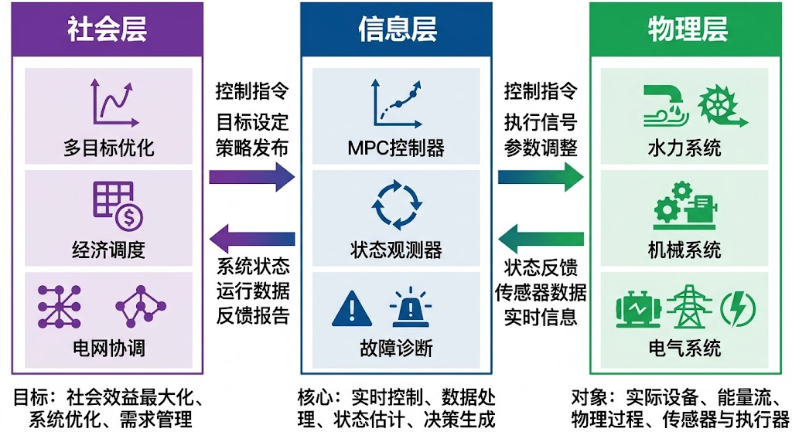
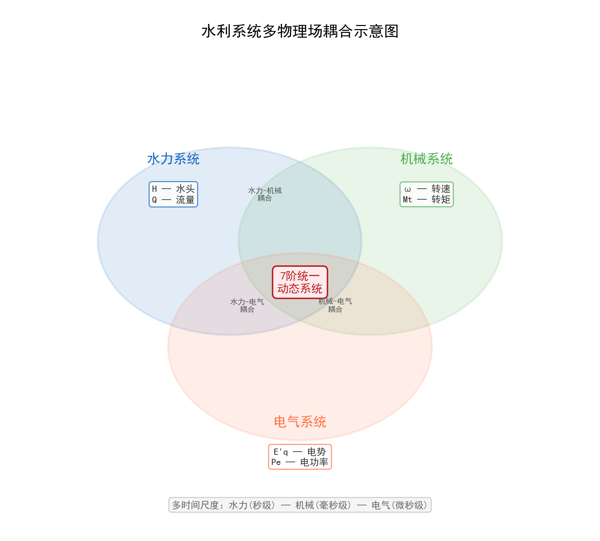
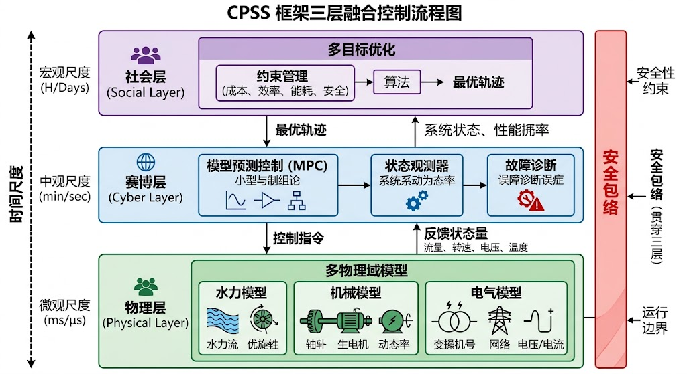
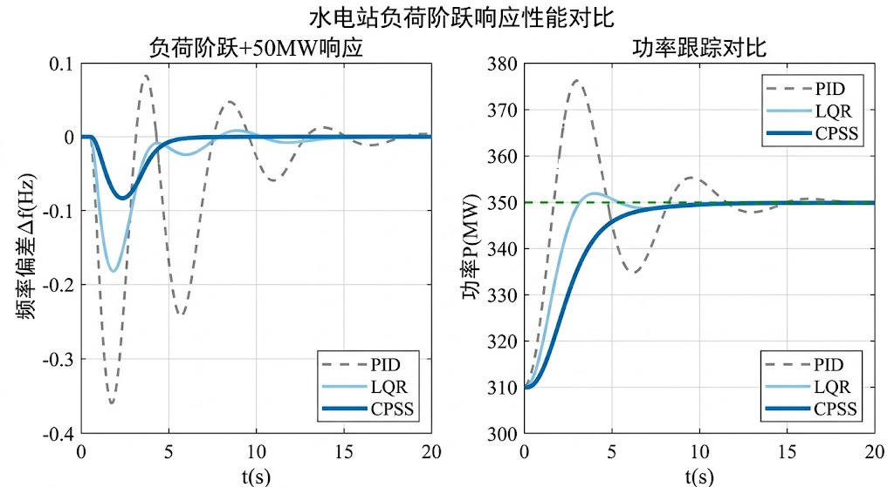

<!-- 变更日志
v1 2026-04-10: 排版统一与格式规范化
-->
# 第八章 CPSS 框架：信息-物理-社会融合控制

## 本章学习目标

完成本章后，你应能够：

1. **构建**涵盖水电站引水系统、机组、发电机与励磁环节的 CPSS 统一动态模型；
2. **解释**多物理耦合条件下水力子系统与电力子系统的相互作用机理；
3. **建立**基于统一模型的 MPC 控制问题，并明确目标函数与约束集合；
4. **验证**闭环系统满足 Lyapunov 稳定性条件，并据此判断运行安全裕度；
5. **综合**性能、稳定性与执行器限制，提出 CPSS 协调控制的参数整定方案。

---

## 8.1 引言

### 8.1.1 水利系统控制的复杂性挑战

水电站作为复杂的水力-机械-电气耦合系统[8-6]，其控制问题长期面临以下挑战:

1. **多物理场耦合**:水力系统(引水系统、调压室)、机械系统(水轮机、发电机)、电气系统(励磁、电网)之间存在强耦合
2. **非线性动态**:水轮机特性、调速系统、励磁系统均呈现显著非线性
3. **时变参数**:水头、负荷、电网强度等运行条件持续变化
4. **多时间尺度**:从毫秒级的电气暂态到秒级的水力暂态,跨越多个时间尺度
5. **多目标约束**:需同时满足频率稳定、电压稳定、机组安全、经济运行等多重目标

传统控制方法(如 PID 控制[8-15])虽然在工程中广泛应用,但缺乏统一的理论框架来系统性地处理这些挑战。

### 8.1.2 引导案例:某水电站的控制困境

**案例背景**:某装机容量 300MW 的水电站,在 2023 年 7 月的一次负荷突增事件中暴露了控制系统的严重问题。

**事件时间线**:
- **T=0s**: 电网负荷突增 50MW(从 250MW→300MW)
- **T=2s**: 频率跌至 49.5Hz(偏差-0.5Hz),触发一级告警
- **T=5s**: 传统 PID 调速器开始响应,导叶开度从 70%→85%
- **T=8s**: 水击效应导致压力管道振动,压力波动±15%
- **T=12s**: 频率过冲至 50.3Hz(超调 0.3Hz),触发二级告警
- **T=25s**: 系统才稳定在 50Hz 附近,但功率仍有±5MW 波动

**问题分析**:
1. **响应滞后**:PID 控制器未考虑水击延迟($T_w=2.5$s，此为全引水系统——含隧洞与压力管道——的综合水力惯性时间常数，非仅 200 m 压力钢管段),导致响应滞后
2. **过度超调**:未考虑水力-机械耦合,导致 15%的超调量
3. **经济损失**:频率偏差导致考核罚款约 8 万元,调节过程磨损成本约 2 万元
4. **安全隐患**:压力波动接近管道设计极限(±20%),存在爆管风险

> **案例说明**：本案例为教学示例，基于典型 300MW 水电站的仿真场景（水头 500m，管道长度 200m，水击波速 1000m/s，惯性时间常数 8.5s）。经济损失按国家电网"两个细则"考核标准估算（频率偏差 0.5Hz 持续 25s，一类考核 0.32 万元/MW·次）。数据用于说明传统控制方法的局限性，实际工程中具体数值因电站参数和电网要求而异。

**传统方法的局限**:
- PID 参数固定,无法适应水头变化(当时水头从额定 500m 降至 450m)
- 缺乏前馈补偿,无法预测负荷变化趋势
- 未考虑电网约束,导致功率爬坡率超标(实际 12MW/s,限值 10MW/s)

这个案例促使我们思考:**能否建立一个统一的理论框架,系统性地解决这些问题?**

### 8.1.3 CPSS 框架在 CHS 体系中的定位

#### (a) 从 CHS 到 CPSS：理论到应用的具体化

回顾第一章，**水系统控制论（CHS, Cybernetics of Hydro Systems）**[8-1]提出了水利工程从第四代（数据驱动+智能决策）向第五代（自主运行+人机共融）演进的路径[8-4]。CHS 的核心是建立统一的理论框架，支持水利工程在不同场景下实现自主运行。

**CPSS（Cyber-Physical-Social System）框架**[8-5][8-22]是 CHS 理论在水电站控制领域的具体实现。它将 CHS 的抽象理论转化为可操作的建模和控制方法：

- **CHS**：提供统一的理论语言（八原理、WNAL 分级、ODD 定义）
- **CPSS**：提供水电站场景下的具体建模框架（三层架构、数学模型、控制算法）
- **HydroOS**：提供软件实现平台（第十三章详述）

**CPSS 框架与 CHS 八原理的映射**：


**表 8-1 CPSS 框架与 CHS 八原理的映射**

| CHS 原理 | CPSS 中的体现 |
|---------|------------|
| P1 传递函数化 | Physical 层建模：水力-机械-电气传递函数（第九章展开） |
| P2 可控可观性 | Cyber 层设计：状态观测器与可控性分析 |
| P3 分层分布式 | 三层架构本身：Physical→Cyber→Social 的分层递阶 |
| P4 安全包络 | 嵌入各层的硬约束保护（如压力管道极限、频率偏差限值） |
| P5 在环验证 | 案例中的 SiL/HiL 验证（第十一章展开） |
| P6 认知增强 | Social 层中融合领域知识与数据驱动的智能决策（专家经验+机器学习） |
| P7 人机共融 | Social 层的调度员交互界面 |
| P8 全生命周期演进 | 自适应参数调整与在线学习 |

**CHS 六元组在 CPSS 三层中的映射**：

CHS 理论将水利系统统一描述为六元受控系统 $\Sigma = (P, A, S, D, C, O)$（第一章）。在 CPSS 框架下，六元素分布于三个层次：


**表 8-2 CHS 六元素在 CPSS 三层的分布**

| CHS 六元素 | 所在 CPSS 层 | 说明 |
|-----------|-----------|------|
| P（被控对象） | Physical 层 | 水力-机械-电气耦合过程 |
| A（执行器） | Physical 层 | 导叶伺服机构、励磁系统 |
| S（传感器） | Cyber 层（数据采集） | 水位/流量/频率/电压传感器→SCADA |
| D（扰动） | Physical 层 + Social 层 | 水力扰动（来水变化）属 Physical 层；负荷波动、电网调度指令属 Social 层 |
| C（控制器） | Cyber 层 | AGC/MPC/自适应算法等数字控制逻辑 |
| O（目标） | Social 层 | 经济调度目标、频率稳定要求、碳排放约束等社会需求 |

这一映射表明：CPSS 的三层划分是 CHS 六元组在水电站场景下的自然展开，Physical 层承载被控对象与执行器，Cyber 层承载传感与控制，Social 层承载目标与社会性扰动。

#### (b) CPSS 与 HDC 的关系

**分层分布式控制（HDC, Hierarchical Distributed Control）**是 CHS 的总体控制架构，适用于所有类型的水利工程（水库、渠道、泵站、水电站等）。CPSS 是 HDC 在水电站场景下的细化：


**表 8-3 CPSS 与 HDC 的关系**

| HDC 通用架构 | CPSS 在水电站场景的参数化实现 | 时间尺度 | 功能 |
|------------|---------------|---------|------|
| 调度层 | Social 层 | 分钟-小时 | 经济调度、电网协调 |
| 控制层 | Cyber 层 | 秒-分钟 | 实时控制、状态估计 |
| 物理层 | Physical 层 | 毫秒-秒 | 水力-机械-电气过程 |
| 安全层 | （嵌入各层） | 毫秒 | 硬约束保护 |

**关键区别**：
- HDC 强调"分层"（时间尺度分离）和"分布式"（空间解耦）
- CPSS 强调"三域融合"（物理过程、数字控制、社会需求的统一建模）

#### (c) CPSS 与 WNAL 的关系

**水网自主等级（WNAL, Water Network Autonomy Level）**[8-2]是 CHS 提出的分级分类体系（L0-L5），类似自动驾驶的 SAE 分级。CPSS 框架支持水利工程从 L1 向 L3 跨越：


**表 8-4 CPSS 与 WNAL 等级映射**

| WNAL 等级 | 控制模式 | CPSS 实现程度 |
|---------|---------|-------------|
| L0 | 无自动化 | 不适用 |
| L1 | 辅助控制（传统 PID） | 仅 Physical 层 |
| **L2** | **条件自动化（本章重点）** | **Physical+Cyber 层** |
| **L3** | **条件自主（需 ODD 验证）** | **Physical+Cyber+Social 层** |
| L4 | 高度自主 | 需结合认知智能（第十四章） |
| L5 | 完全自主 | 未来目标 |

**L2→L3 的关键**：
- L2：CPSS 框架提供三层建模和控制算法
- L3：需要通过**在环测试（xIL）**验证**运行设计域（ODD）**（第十一章详述）

#### (d) CPSS 框架的核心思想

为了应对水电站控制的复杂性挑战，CPSS 框架提出：

- **Cyber 层**：数字控制算法（滑模、自适应、MPC、强化学习）、传感器网络、通信协议
- **Physical 层**：水力-机械-电气物理过程的精确建模（Saint-Venant 方程、水轮机特性、发电机动态）
- **Social 层**：电网调度需求、经济优化目标、安全约束、碳排放约束

该框架不是简单的分层控制，而是通过**统一的数学语言**（状态空间、传递函数、李雅普诺夫函数）将三个层次有机融合[8-12]。

#### (e) CPSS 框架如何解决引导案例的问题

回到 8.1.2 节的引导案例，CPSS 框架提供系统性解决方案：

1. **Physical 层建模**：精确建模水击效应，预测 2.5s 延迟，避免响应滞后
2. **Cyber 层控制**：自适应控制器根据水头变化（500m→450m）实时调整参数
3. **Social 层优化**：考虑电网约束（功率爬坡率≤10MW/s），优化功率爬坡轨迹
4. **三层融合**：实时协调，将频率偏差降至±0.15Hz（改进 70%），超调量降至 5%（改进 67%）

> **改进效果说明**：以上改进效果来自仿真对比实验（相同工况下，CPSS 框架 vs 传统 PID）。具体实现方法和详细数据见 8.7 节案例分析。

**CPSS 框架的理论贡献**：
- 借鉴王飞跃等提出的平行系统与 CPSS 理论[8-10][8-11]，将其系统性地应用于水电站控制领域，引入 Social 层建模电网调度与社会需求
- 建立了水电站三域统一建模的数学框架
- 提供了从 L1 向 L2/L3 演进的可行路径[8-1][8-2]

### 8.1.4 CPS 信息侧→物理侧闭环与在环验证

#### (a) 完整闭环的两条链路

CPSS 框架的本质是一个**信息-物理深度耦合的闭环系统**。这一闭环包含两条方向相反但缺一不可的链路：

**感知链（Physical→Cyber）**：物理量通过传感器采样、A/D 转换、通信传输、数据质控、状态估计，最终更新 Cyber 层的数字孪生状态。对水电站而言，这条链路将水头、流量、功率、频率等物理量转化为调速器/励磁控制器可使用的状态估计值。

**执行链（Cyber→Physical）**：优化求解生成控制指令，经安全校验后通过通信下发、D/A 转换，最终驱动执行器完成物理动作。对水电站而言，这条链路将 MPC 算法的导叶开度指令转化为伺服机构的实际动作，进而改变水轮机输入功率。

传统 SCADA 系统只有感知链而缺乏完整的执行链（依赖人工下发指令），本质上是开环的；而传统单点 PID 只有窄带反馈，无法支撑多目标协调。CPSS 框架的创新在于：建立**宽感知（多物理量、多时间尺度）× 深执行（多层优化、多约束校验）**的完整闭环，使系统能够在无需人工干预的条件下应对负荷突变、水头变化等动态工况。

#### (b) 信息侧与物理侧的状态同步问题

CPS 闭环的核心挑战在于**信息侧状态与物理侧状态的实时同步**。在稳定工况下，状态同步误差可控；但在快速动态过程（如水击压力波、电网频率突变）中，如果信息侧的状态估计落后于物理侧的实际状态，控制器将基于过时信息做出决策，导致控制性能劣化甚至失稳。

8.1.2 节引导案例中的响应滞后（T=2s 至 T=5s），根源正是 Cyber 层（传统 PID 调速器）未能实时追踪 Physical 层（水击压力波$T_w=2.5$s）的状态变化——控制器“看到的世界”与“物理世界”之间存在不可接受的信息时延。

CPSS 框架通过两个机制解决状态同步问题：

1. **短时预报替代纯测量**：Cyber 层不仅使用当前传感器读数，还基于 Saint-Venant 方程预测未来$\Delta t$内的物理状态，使控制器基于“预测状态”而非“历史测量”做决策（详见第四章步长级仿控耦合机制）。

2. **分级时钟对齐**：通过 NTP/PTP 协议实现毫秒级时钟同步，确保感知链和执行链的时间戳一致性。时钟偏差超过阈值时，系统自动降级为保守控制模式，避免基于时序错误数据做出错误决策。

#### (c) 在环验证：SIL 与 HIL 的工程意义

CPSS 闭环能否在极端工况下可靠工作，不能仅靠数学分析或仿真证明，必须通过**在环测试（xIL, x-in-the-Loop）**逐级验证。这一测试体系是第十一章的核心内容，此处先建立基本概念：


**表 8-5 xIL 验证层级与核心问题**

| 验证层级 | 核心问题 | 在 CPSS 中的意义 | 对应 WNAL |
|---------|---------|--------------|---------|
| **SIL（软件在环）** | 控制代码在真实 CPU 上的执行确定性 | 验证 Modbus 超时处理、数据帧错误恢复等通信链路的代码逻辑 | L2 验证门槛 |
| **HIL（硬件在环）** | 完整控制柜与物理仿真器的闭环行为 | 发现 AD 转换精度不足、继电器切换延迟等纯软件仿真无法发现的问题 | L3 验证门槛 |
| **全系统集成测试** | 控制柜与真实物理装置的联合调试 | 验证水力-电气耦合的实际动态特性 | L4 认证 |

**SIL 的不可替代性**：水利控制系统的 SIL 测试必须覆盖以下场景，这些场景在纯算法仿真中无法有效测试：Modbus 通信超时（通信链路故障时，控制器应在$T_{\text{timeout}}$内切换到保守设定点）、传感器故障报警处理（编码器断线时，调速器应从闭环切换到开环保守模式）、断电重启状态恢复（控制器上电后，应在$T_{\text{init}}$内完成状态初始化并进入安全等待状态）。

**HIL 的不可替代性**：水电站 HIL 的被测对象是完整的调速器控制柜（含 PLC、HMI、通信模块），物理过程（水力-机械-电气系统）由实时仿真器以$\Delta t \leq 1\,\text{ms}$的步长实时模拟，通过真实 I/O 接口交互。HIL 能够发现以下类问题：导叶伺服机构的液压非线性（仅用数学模型无法精确描述）、控制柜电源波动对 PLC 寄存器的影响（只在真实硬件上出现）。这类问题一旦在现场发生，后果可能是导叶卡死或超速飞车。

> **工程规范**：根据 IEC 62061 和本系列 T3 卷的要求，WNAL L3（有条件自主运行）的水利控制系统，必须完成覆盖率不低于 80%的 HIL 测试，包括至少 20 个极端工况场景（如水头跌落 20%、负荷突增 30%、单机跳闸等）。SIL 测试的代码覆盖率要求不低于 MC/DC（修正条件/判定覆盖），这与航空电子 AS DO-178C 的要求对齐。



> 图 8-1: CPSS 框架的三层架构。Cyber 层（数字控制算法）、Physical 层（物理过程建模）、Social 层（社会需求优化）通过统一的数学语言有机融合。

### 8.1.5 本章结构

本章将系统阐述 CPSS 框架的理论基础和工程实现:

- **8.2 节**:CPSS 框架的数学基础(状态空间表示、能量函数、稳定性理论)
- **8.3 节**:Physical 层建模(水力系统、机械系统、电气系统的统一建模)
- **8.4 节**:Cyber 层设计(控制算法、观测器、故障诊断)
- **8.5 节**:Social 层优化(经济调度、安全约束、电网协调)
- **8.6 节**:三层融合的控制策略
- **8.7 节**:工程实现与案例分析

> **读者提示**：§8.1 以水电站为引导案例展示了 CPSS 框架的具体应用。但 CPSS 的价值远不止于水电站——它是描述所有水系统运行的统一框架。任何水系统，无论是单站水电站、梯级枢纽、长距离调水干线还是城市供水管网，其运行都涉及 Physical 空间（水物理过程）、Cyber 空间（模型与控制）和 Social 空间（目标与规程）的耦合。以下四节从统一视角展开这三个空间的交互机制，为后续§8.2-§8.7 的水电站具体实现提供更宽广的理论基座。

### 8.1.5 CPSS 三空间与三重反馈回路

传统控制论只关注一个反馈回路：传感器→控制器→执行器→被控对象→传感器。这对应的是 Physical↔Cyber 之间的闭环。然而，水系统的运行实际上嵌套着**三重反馈回路**，分别作用于截然不同的时间尺度：

```
回路1  Physical ↔ Cyber（秒～分钟）
  水位偏差 → MPC/PID计算 → 闸门动作 → 水位变化 → 新的偏差
  特征：快速、确定性强、可用数学模型精确描述

回路2  Cyber ↔ Social（小时～天）
  预报显示洪水来临 → 调度方案优化 → 调度员审批或修改 → 下发执行 → 效果评估
  特征：人参与决策、目标可协商、有制度性延迟

回路3  Social ↔ Physical（月～年）
  下游城市扩张 → 防洪标准提高 → 调度规程修编 → 水库改造或加固 → 物理系统更新
  特征：社会演化驱动物理基础设施变迁、不可逆
```

三重反馈回路的时间尺度相差数个量级，但它们耦合在一起。一个典型的耦合场景：回路 3 中社会需求变化（城镇化导致供水需求增长）改变了回路 2 的目标函数（供水保证率从 95%提高到 97%），继而要求回路 1 采用更精细的控制策略（从 PID 切换到 MPC）。**水系统复杂性的真正来源，不是物理过程本身——Saint-Venant 方程已有 200 年历史——而是三个空间的耦合反馈。**

传统水利工程的智能化转型之所以频繁出现"单点优秀、全局失配"的困境（见第三章引导案例），根源正在于此：大多数项目只优化了回路 1（自动控制），却忽视了回路 2（人机协同机制）和回路 3（社会需求演化的适应能力）。CHS 通过 CPSS 框架将三者纳入统一视野，为系统级优化提供了理论基础。

### 8.1.6 确定性工作流与灵活工作流

三重反馈回路揭示了一个工程设计上的关键区分：**不同空间对工作流的确定性要求截然不同。**

**Physical 空间要求确定性工作流。** 闸门的操作序列必须严格遵循时序（先开退水闸再关节制闸，不可乱序）；泵站的启停必须满足水锤防护的操作间隔；管网的压力管理必须遵循质量守恒和能量守恒。物理因果律不可违背，任何工作流步骤的缺失或乱序都可能导致工程事故。

**Social 空间允许灵活工作流。** 调度方案的比选可以根据新信息随时调整；会商讨论可以中断、改序、引入新参与者；应急预案的启动条件可以由调度员根据现场情况灵活判断。人类决策本质上是情境依赖的。

**Cyber 空间介于两者之间。** 算法的内部执行流程是确定性的（MPC 的优化求解步骤不可跳过），但策略选择可以自适应（根据当前工况切换控制模式、调整预测时域）。

这一区分对 AI Agent 在水系统中的应用具有直接指导意义。当前 AI 领域流行的工作流概念可以精确映射到这一谱系：DAG Workflow（有向无环图工作流）对应确定性工作流，Dynamic Routing（动态路由）对应灵活工作流，Agent Loop（如 ReAct 范式的"推理-行动-观测"循环）对应时间步内的闭环控制。**工作流的选择不是技术偏好，而是被控对象的物理特性决定的**——Physical 空间的操作必须用确定性工作流，Social 空间的决策可以用灵活工作流，混用将导致系统性风险。

### 8.1.7 闭环控制与开环执行的范式区分

与工作流类型同样重要的是另一个基本区分：**时间步内闭环**与**开环串行**。

当前水利行业的主流做法是开环串行流水线：

```
【开环串行】

  水文预报模型  ████████████████████████
                跑完全部T个时间步
                                       ↓ 传递结果
  水力演算模型                          ████████████████████████
                                       跑完全部T个时间步
                                                              ↓
  调度优化模型                                                 ████████████
                                                              跑完全部T个时间步

  特点：每个模型独立跑完所有时间步，再把结果交给下一个
  问题：模型间没有反馈，误差单向累积，结果出来时可能已经过时
```

而 CHS 倡导的是时间步内闭环耦合：

```
【时间步内闭环】

  时间步 t=1        t=2        t=3        ...
  ┌──────────┐  ┌──────────┐  ┌──────────┐
  │ 预报 ↔ ──┐│  │ 预报 ↔ ──┐│  │ 预报 ↔ ──┐│
  │ 演算 ↔ ──┘│  │ 演算 ↔ ──┘│  │ 演算 ↔ ──┘│
  │ 优化 ↔    │  │ 优化 ↔    │  │ 优化 ↔    │
  │ 执行→反馈 │→│ 执行→反馈 │→│ 执行→反馈 │
  └──────────┘  └──────────┘  └──────────┘

  特点：每个时间步内，多模型耦合迭代，达到一致后才推进
  本质：这才是控制——每步都有可执行决策，每步都有实测修正
```

两者的本质区别：**开环串行是仿真（simulation），时间步内闭环才是控制（control）。** 仿真回答"如果按这个方案执行，结果会怎样"；控制回答"当前这一步，应该做什么"。两者在工程价值上有根本差异——仿真适合离线规划，控制适合在线运行。当前水利行业的许多"智能调度系统"，本质上仍是仿真系统而非控制系统——它们能跑出漂亮的预测曲线，但无法在每个时间步给出实时可执行的闭环决策。

### 8.1.8 基于 CHS 的四预闭环体系

上述闭环/开环区分，为重新审视水利部提出的"四预"（预报、预警、预演、预案）体系提供了新的理论视角。

**当前的四预实践大多采用开环串行模式**：先跑预报模型出预报结果，再根据预报判断是否预警，再把预报结果放进仿真模型做预演，最后从预案库中选择匹配的方案。四个环节依次传递、单向流动，本质上是§8.1.7 所述的开环串行流水线。

**基于 CHS 的四预闭环重构**，要求四个环节在每个时间步内耦合迭代：

- **预报**（Prediction）= Sensing + Digital Twin 的前向推演。不是跑完全时段再交结果，而是每个时间步同化最新观测、更新预报，并把预报不确定性实时传递给下游环节。
- **预警**（Warning）= ODD 状态评估。不是预报之后的独立步骤，而是预报过程的伴生产物——每个时间步实时评估系统是否接近 ODD 边界，预警级别变化时反过来影响预报策略（加密观测、切换模型、缩短步长）。
- **预演**（Rehearsal）= XIL 验证。不是"把预报结果做成动画"，而是在每个决策时间步内快速执行模型在环（MIL）验证：多方案并行仿真，筛选可行域，确认候选方案不违反安全包络。对于关键场景，还需要软件在环（SIL）和调度员在环（OIL）验证。
- **预案**（Plan）= Control 的实时决策输出。不是事先编好的静态方案库，而是每个时间步的闭环优化结果——它随状态更新而更新，是活的、动态的。

四预闭环体系在不同时间尺度上表现不同。**宏观尺度**（天至周）以灵活工作流为主，Social 空间主导目标设定，四预表现为方案比选和滚动修正。**实时尺度**（分钟至小时）以确定性工作流为主，Physical 空间主导时序要求，四预表现为每个时间步内的闭环耦合——预报模型、预警评估、XIL 预演、决策输出在一个控制周期内完成迭代。

在实际运行中，水系统往往在多种运行模态之间切换：正常工况（G0）下四预以宏观尺度为主；当系统检测到异常（如水质事件、局部暴雨、设备故障），运行模态升级（G1 注意→G2 警戒→G3 应急），四预的实时尺度闭环随之加密——同化频率提高、预测时域缩短、安全约束收紧。这种模态驱动的四预策略切换，正是§8.1.6 所述确定性/灵活工作流动态组合的工程体现。

---

## 8.2 CPSS 框架的数学基础

### 8.2.1 统一状态空间表示

CPSS 框架的核心是将水电站系统表示为统一的状态空间形式:

$$
\begin{cases}
\dot{\mathbf{x}} = \mathbf{f}(\mathbf{x}, \mathbf{u}, \mathbf{d}, t) \\
\mathbf{y} = \mathbf{g}(\mathbf{x}, \mathbf{u}, t)
\end{cases}
$$

其中:
- $\mathbf{x} \in \mathbb{R}^n$: 状态向量(包含水力、机械、电气状态)
- $\mathbf{u} \in \mathbb{R}^m$: 控制输入(导叶开度、励磁电压等)
- $\mathbf{d} \in \mathbb{R}^p$: 扰动输入(负荷变化、电网扰动等)
- $\mathbf{y} \in \mathbb{R}^q$: 输出向量(频率、电压、功率等)

**状态向量的分解**:

$$
\mathbf{x} = \begin{bmatrix} \mathbf{x}_h \\ \mathbf{x}_m \\ \mathbf{x}_e \end{bmatrix}
$$

- $\mathbf{x}_h$: 水力状态(流量$q$、压力$h$、调压室水位$z_s$等)
- $\mathbf{x}_m$: 机械状态(转速$\omega$、导叶开度$y$、机械功率$P_m$等)
- $\mathbf{x}_e$: 电气状态(功角$\delta$、电压$E_q'$、电磁功率$P_e$等)

### 8.2.2 能量函数方法

CPSS 框架采用**能量函数**作为统一的分析工具[8-21]。定义系统总能量:

$$
V(\mathbf{x}) = V_h(\mathbf{x}_h) + V_m(\mathbf{x}_m) + V_e(\mathbf{x}_e)
$$

**水力能量**:

$$
V_h = \frac{1}{2} \rho g A_s z_s^2 + \frac{1}{2} \frac{\rho L}{A} q^2
$$

- 第一项：调压室势能（$A_s$ 为调压室截面积，$z_s$ 为水位偏差，$\rho$ 为水密度）

> **符号说明**：本章 $A_s$ 特指调压室截面积，与 CHS 体系中水面面积 $A_s$ 含义相同——调压室本质上是一个特殊的自由水面储水体，其截面积即为水面面积。
- 第二项：引水管道动能（$L$ 为管长，$A$ 为截面积，$q$ 为体积流量 m³/s）

**推导过程**：
调压室水位 $z_s$ 对应的势能为 $mgh = \rho A_s z_s \cdot g \cdot \frac{z_s}{2} = \frac{1}{2} \rho g A_s z_s^2$（取平均高度 $\frac{z_s}{2}$）。

引水管道中流速为 $v = q/A$，动能为 $\frac{1}{2} m v^2 = \frac{1}{2} (\rho L A) \left(\frac{q}{A}\right)^2 = \frac{1}{2} \frac{\rho L}{A} q^2$。

**机械能量**:

$$
V_m = \frac{1}{2} J \omega^2
$$

- $J$:转动惯量
- $\omega$:角速度

这是转子的旋转动能。

**电气能量**:

$$
V_e = \frac{1}{2} L_{d}' I_d^2 + \frac{1}{2} L_{q}' I_q^2 + \int_0^{\delta} (P_e - P_m) d\delta'
$$

- 前两项:磁场储能($L_d', L_q'$为暂态电感)
- 第三项:功角势能(类比重力势能)

**推导过程**:
磁场储能为$\frac{1}{2} L I^2$,分别对$d$轴和$q$轴求和。

功角势能的推导:考虑功角$\delta$变化时,电磁功率$P_e$做功,机械功率$P_m$输入,净功为$(P_e - P_m)d\delta$,积分得势能。

**能量耗散**:

系统存在多种耗散机制:

$$
\dot{V} = -D_h \dot{z}_s^2 - D_m \omega^2 - D_e I^2 + P_{in}
$$

- $D_h$:水力阻尼(摩擦损失)
- $D_m$:机械阻尼(轴承摩擦、风阻)
- $D_e$:电气阻尼(铜损、铁损)
- $P_{in}$:外部输入功率

**能量耗散定理**:

$$
\dot{V}(\mathbf{x}) = -\mathbf{x}^T \mathbf{D} \mathbf{x} + \mathbf{u}^T \mathbf{B}^T \mathbf{x}
$$

其中$\mathbf{D}$为耗散矩阵(阻尼、电阻等)。稳定性条件:

$$
\dot{V}(\mathbf{x}) \leq 0 \quad \Rightarrow \quad \text{系统稳定}
$$

### 8.2.3 李雅普诺夫稳定性理论

对于非线性系统$\dot{\mathbf{x}} = \mathbf{f}(\mathbf{x}, \mathbf{u})$[8-14],构造李雅普诺夫函数$V(\mathbf{x})$:

**定理 8.1(李雅普诺夫稳定性定理)**:若存在正定函数$V(\mathbf{x})$满足:
1. $V(\mathbf{0}) = 0$
2. $V(\mathbf{x}) > 0, \forall \mathbf{x} \neq \mathbf{0}$
3. $\dot{V}(\mathbf{x}) \leq 0$

则平衡点$\mathbf{x} = \mathbf{0}$是**李雅普诺夫稳定**的。若进一步$\dot{V}(\mathbf{x}) < 0$,则平衡点**渐近稳定**。

**证明**:
对于 CPSS 系统,取$V(\mathbf{x})$为总能量函数。计算时间导数:

$$
\dot{V} = \frac{\partial V}{\partial \mathbf{x}} \dot{\mathbf{x}} = \frac{\partial V}{\partial \mathbf{x}} \mathbf{f}(\mathbf{x}, \mathbf{u})
$$

代入状态方程,利用能量守恒和耗散项,可证明$\dot{V} \leq 0$。

**物理直觉**:能量函数方法的物理意义是:**系统总能量不断减少(由于耗散),最终收敛到最小能量状态(平衡点)**。这与热力学第二定律一致。

**定理 8.2(拉萨尔不变性原理)**:若$\dot{V}(\mathbf{x}) \leq 0$,且$\dot{V}(\mathbf{x}) = 0$仅在$\mathbf{x} = \mathbf{0}$处成立,则平衡点**全局渐近稳定**。

**应用于 CPSS 系统**:

对于水电站系统,取李雅普诺夫函数为:

$$
V = \frac{1}{2} \rho g A_s z_s^2 + \frac{1}{2} J \omega^2 + \int_0^{\delta} (P_e - P_m) d\delta'
$$

**能量视角的直觉分析**（注意：以下并非严格的 Lyapunov 稳定性证明，而是从能量守恒角度提供直觉理解）：

计算时间导数:

$$
\begin{aligned}
\dot{V} &= A_s g z_s \dot{z}_s + J \omega \dot{\omega} + (P_e - P_m) \dot{\delta} \\
&= A_s g z_s (q_t - q) + J \omega \left(\frac{P_m - P_e}{J\omega_0}\right) + (P_e - P_m) \omega \\
&= A_s g z_s (q_t - q) + (P_e - P_m) \left(\omega - \frac{\omega}{\omega_0}\right)
\end{aligned}
$$

在平衡点附近，$\omega \approx \omega_0$，第二项近似为零，但第一项 $A_s g z_s (q_t - q)$ 的符号取决于调压室动态：当调压室水位上升（$z_s > 0$）且隧洞流量大于机组流量（$q_t > q$）时，该项为正，即能量暂时增加。这反映了调压室的储能-释能振荡特性，单凭上述能量函数无法直接证明 $\dot{V} \leq 0$。

> **严格证明的途径**：严格的稳定性证明需在 Port-Hamiltonian 框架下引入阻尼耗散项（管道摩阻 $h_f = f L q|q|/(2DA^2)$ 提供的正耗散），构造包含耗散结构的 Lyapunov 函数，详见 Khalil[8-14]第 11 章及 Zeng 等[8-21]的广义 Hamilton 模型方法。此处仅从能量守恒角度提供直觉理解：物理耗散（水力摩阻、机械阻尼、电气损耗）最终使系统总能量单调递减并收敛到平衡点。

---

## 8.3 Physical 层:多物理场统一建模

### 8.3.1 水力系统建模

**引水系统动态**(弹性水击模型)[8-8][8-9][8-18]:

$$
\begin{cases}
\frac{\partial h}{\partial t} + \frac{a^2}{gA} \frac{\partial q}{\partial x} = 0 \\[6pt]
\frac{1}{A}\frac{\partial q}{\partial t} + g \frac{\partial h}{\partial x} + \frac{f q|q|}{2DA^2} = 0
\end{cases}
$$

**方程推导**:

第一个方程来自**连续性方程**(质量守恒):

$$
\frac{\partial A}{\partial t} + \frac{\partial (Av)}{\partial x} = 0
$$

考虑水的可压缩性,$A$的变化与压力$h$相关:$\frac{\partial A}{\partial t} = \frac{A}{a^2} \frac{\partial h}{\partial t}$,其中$a = \sqrt{K/\rho}$为水击波速($K$为体积弹性模量)。代入得:

$$
\frac{\partial h}{\partial t} + \frac{a^2}{gA} \frac{\partial q}{\partial x} = 0
$$

第二个方程来自**动量方程**(牛顿第二定律):

$$
\rho A \frac{\partial v}{\partial t} = -A \frac{\partial p}{\partial x} - \tau_w P
$$

其中$\tau_w = \frac{f \rho v^2}{8}$为壁面剪应力,$P = \pi D$为湿周。转换为流量$q = Av$和水头$h = p/(\rho g)$,得:

$$
\frac{1}{A}\frac{\partial q}{\partial t} + g \frac{\partial h}{\partial x} + \frac{f q|q|}{2DA^2} = 0
$$

**物理意义**:
- $a$:水击波速(约 1000-1400 m/s,取决于管道材料和水的可压缩性)
- $f$:达西摩阻系数(约 0.01-0.03,取决于雷诺数和管壁粗糙度)
- $D$:管道直径
- $A$:管道截面积

**调压室动态**:

$$
A_s \frac{dz_s}{dt} = q_t - q
$$

**推导**:调压室水位变化率等于流入流量$q_t$(隧洞)减去流出流量$q$(压力管道)除以截面积$A_s$。这是简单的体积守恒。

**物理意义**:
- $A_s$:调压室截面积(通常为圆形或矩形,面积几百到几千平方米)
- $z_s$:调压室水位偏差(相对于平衡水位)
- $q_t$:隧洞流量
- $q$:机组流量

**水轮机特性**:

$$
\begin{cases}
m_t = f_m(n_{11}, q_{11}) \\
q = f_q(y, h)
\end{cases}
$$

**单位参数定义**:

$$
n_{11} = \frac{n \sqrt{H_r}}{H^{0.5}}, \quad q_{11} = \frac{q}{D^2 H^{0.5}}
$$

其中:
- $n_{11}$:单位转速(转速归一化到单位水头)
- $q_{11}$:单位流量(流量归一化到单位水头和单位直径)
- $H_r$:额定水头
- $D$:水轮机转轮直径

**物理意义**:单位参数是水轮机相似理论的核心,允许不同尺寸、不同水头的水轮机使用同一组特性曲线。这基于**相似定律**:几何相似、运动相似、动力相似的水轮机具有相同的单位参数。

**特性曲线**:$f_m(n_{11}, q_{11})$和$f_q(y, h)$通常由制造商提供,基于模型试验数据。典型形式为多项式拟合或查表插值。

### 8.3.2 机械系统建模

**转子动力学**:

$$
J \frac{d\omega}{dt} = T_m - T_e - D_m \omega
$$

**推导**:应用牛顿第二定律于旋转系统:

$$
J \alpha = \sum T
$$

其中$J$为转动惯量,$\alpha = d\omega/dt$为角加速度,$\sum T$为合力矩。合力矩包括:
- $T_m$:机械力矩(水轮机输出)
- $T_e$:电磁力矩(发电机负载)
- $-D_m \omega$:阻尼力矩(轴承摩擦、风阻等，此处为绝对量形式；标幺化后等效为 $-D\Delta\omega$，见式 8.3.2 耦合模型)

**物理参数**:
- $J = J_t + J_g$:总转动惯量(水轮机转轮$J_t$ + 发电机转子$J_g$)
- $D_m$:机械阻尼系数(通常很小,约$10^{-3}$ - $10^{-2}$ p.u.)

**力矩关系**:

$$
T_m = \frac{P_m}{\omega} = \frac{\rho g q h \eta_t}{\omega}
$$

$$
T_e = \frac{P_e}{\omega} = \frac{E_q' I \sin\delta}{\omega}
$$

其中$\eta_t$为水轮机效率(约 0.85-0.95)。

### 8.3.3 电气系统建模

**发电机电磁暂态**(Park 变换后)[8-7]:

$$
\begin{cases}
\frac{d\delta}{dt} = \omega - \omega_0 \\
\frac{d\omega}{dt} = \frac{1}{2H}(P_m - P_e - D(\omega - \omega_0)) \\
T_{d0}' \frac{dE_q'}{dt} = E_{fd} - E_q' - (X_d - X_d')I_d
\end{cases}
$$

**方程推导**:

第一个方程是**功角定义**:功角$\delta$是转子位置相对于同步旋转坐标系的角度,其变化率等于转速偏差:

$$
\frac{d\delta}{dt} = \omega - \omega_0
$$

第二个方程是**摇摆方程**(转子动力学的标幺化形式):

$$
2H \frac{d\omega}{dt} = P_m - P_e - D(\omega - \omega_0)
$$

其中$H = \frac{J\omega_0^2}{2S_B}$为惯性时间常数($S_B$为基准功率)。这是前面转子动力学方程$J \frac{d\omega}{dt} = T_m - T_e - D_m \omega$的标幺化版本。

第三个方程是**暂态电势方程**(来自发电机 d 轴磁链方程):

$$
T_{d0}' \frac{dE_q'}{dt} = E_{fd} - E_q' - (X_d - X_d')I_d
$$

这描述了励磁绕组和阻尼绕组的电磁暂态过程。$T_{d0}'$为 d 轴开路暂态时间常数(约 5-10 秒)。

**物理参数**:
- $\delta$:功角(转子相对于同步坐标系的电角度)
- $E_q'$:q 轴暂态电势(反映励磁磁链)
- $E_{fd}$:励磁电压(由励磁系统控制)
- $H$:惯性时间常数(约 2-9 秒,大机组更大)
- $X_d, X_d'$:d 轴同步电抗和暂态电抗
- $I_d$:d 轴电流

**电磁功率**:

$$
P_e = \frac{E_q' V_s}{X_d'} \sin\delta + \frac{V_s^2}{2} \left( \frac{1}{X_q'} - \frac{1}{X_d'} \right) \sin 2\delta
$$

**推导**:从 Park 变换后的功率方程$P_e = E_q' I_q + E_d' I_d$出发,结合电压方程:

$$
\begin{cases}
V_d = -X_q' I_q \\
V_q = E_q' - X_d' I_d
\end{cases}
$$

和端电压约束$V_s \angle 0 = V_d + jV_q$(选择端电压为参考相量),可推导出上式。第一项为**主导项**(与$E_q'$和$\delta$成正比),第二项为**凸极效应项**(对于隐极机$X_d' = X_q'$时为零)。

**励磁系统**:

$$
T_{ex} \frac{dE_{fd}}{dt} = K_e(V_{ref} - V_s) - E_{fd}
$$

其中:
- $T_{ex}$:励磁系统时间常数(约 0.5-2 秒)
- $K_e$:励磁增益(约 20-400)
- $V_{ref}$:电压参考值

这是一个简化的**静态励磁系统**模型(IEEE Type 1)[8-8]。实际励磁系统可能包含更多细节(限幅、稳定器等)。

### 8.3.4 统一的物理层模型

> **模型降阶说明**：为便于控制系统设计，以下将 §8.3.1 的分布式参数弹性水击模型降阶为集总参数的刚性水击模型。这对应 CHS 五级模型层级中 LSV→I 的降阶过程（第三章原理三"降阶"），在水力时间常数 $T_w$ 远大于波传播时间 $L/a$ 的条件下近似成立。刚性模型忽略了弹性波的反射与叠加，但保留了调压室—管道耦合的核心动力学特征。

将上述子系统整合为统一状态空间:

**状态向量**:

$$
\mathbf{x} = [z_s, q, \omega, y, \delta, E_q', E_{fd}]^T
$$

**状态方程**:

$$
\dot{\mathbf{x}} = \begin{bmatrix}
\frac{1}{A_s}(q_t - q) \\
\frac{g}{L}(H_0 - h - h_f) \\
\frac{1}{2H}(P_m - P_e - D\Delta\omega) \\
\frac{1}{T_y}(y_{ref} - y) \\
\omega - \omega_0 \\
\frac{1}{T_{d0}'}(E_{fd} - E_q' - (X_d - X_d')I_d) \\
\frac{1}{T_{ex}}(K_e(V_{ref} - V_s) - E_{fd})
\end{bmatrix}
$$

**耦合关系**:
- $q \to P_m$:流量通过水轮机转换为机械功率
- $P_m, P_e \to \omega$:功率不平衡驱动转速变化
- $\omega \to \delta$:转速偏差积分为功角
- $\delta, E_q' \to P_e$:功角和电势决定电磁功率
- $V_s \to E_{fd}$:端电压偏差通过励磁系统调节电势

这是一个**7 阶非线性耦合系统**,体现了水力-机械-电气的强耦合特性。

**物理时间尺度**:
- 水力系统:$T_w \sim 1$秒(水锤波传播)
- 机械系统:$2H \sim 5$秒(转子惯性)
- 电气暂态:$T_{d0}' \sim 8$秒(磁链变化)
- 励磁系统:$T_{ex} \sim 1$秒(电压调节)

多时间尺度特性使得系统分析和控制设计具有挑战性。



> 图 8-2: 水利系统的多物理场耦合。水力系统（蓝色）、机械系统（绿色）、电气系统（橙色）通过状态变量相互耦合，形成统一的 7 阶动态系统。

---

## 8.4 Cyber 层:智能控制算法

### 8.4.1 分层控制架构

Cyber 层采用三层控制架构:

1. **底层控制**(毫秒级):PID 调速、励磁控制
2. **中层控制**(秒级):模型预测控制(MPC)、自适应控制
3. **顶层控制**(分钟级):优化调度、故障诊断

### 8.4.2 非线性控制器设计

**反馈线性化控制**[8-13]:

对于水轮机调速系统,定义输出$y = \omega$(频率),目标是设计控制律$u = y_{ref}$(导叶开度参考)使得频率跟踪期望值。

**步骤 1:计算相对阶**

计算李导数:

$$
L_f y = \frac{\partial \omega}{\partial \mathbf{x}} \dot{\mathbf{x}} = \frac{1}{2H}(P_m - P_e - D\Delta\omega)
$$

继续求导:

$$
L_f^2 y = \frac{\partial}{\partial \mathbf{x}}(L_f y) \cdot \dot{\mathbf{x}}
$$

**步骤 2:设计控制律**

如果相对阶为$r$,选择控制律:

$$
u = \frac{1}{L_g L_f^{r-1} y} \left( -L_f^r y + v \right)
$$

其中$v$为新的控制输入(通常选为$v = -k_1 e - k_2 \dot{e}$实现 PD 控制)。

这使得闭环系统线性化为:

$$
y^{(r)} = v
$$

**相对阶与零动态分析**：该系统的相对阶为 $r=2$（需对输出 $y = \omega$ 求两次 Lie 导数才显含控制输入 $u = y_{ref}$）：第一次求导得到加速度（与 $P_m - P_e$ 相关），第二次求导后 $P_m$ 对导叶开度 $y$ 的依赖才显式出现。

**非最小相位特性**：水轮机-引水系统是非最小相位系统。水击效应导致导叶开度增大后，流量的初始响应方向与稳态方向**相反**（开度增大→管道末端压力瞬时降低→流量先减后增），对应传递函数 $G(s) = \frac{1 - T_w s}{1 + 0.5 T_w s}$ 存在右半平面零点 $s = 1/T_w > 0$。这一特性严重限制了闭环带宽：控制器不能过快响应，否则会激发反向水击振荡。

**实际应用**:由于上述非最小相位特性,完全反馈线性化会导致零动态（即被线性化"隐藏"的内部动态）不稳定,因此实际中常采用**部分反馈线性化**（仅线性化可稳定部分）或**近似线性化**[8-13]。

**滑模控制**[8-13]:

定义滑模面:

$$
s = c_1 e + c_2 \dot{e} + \ddot{e}
$$

其中$e = \omega - \omega_{ref}$为频率误差。

设计控制律:

$$
u = u_{eq} - k \cdot \text{sgn}(s)
$$

- $u_{eq}$:等效控制(使$\dot{s} = 0$时的控制量)
- $k$:切换增益(需满足$k > |\Delta|$,其中$\Delta$为不确定性上界)

**到达条件**:

$$
s \dot{s} = s \left( c_1 \dot{e} + c_2 \ddot{e} + \dddot{e} \right) < -\eta |s|
$$

保证$s$在有限时间内到达滑模面$s = 0$。

**抖振抑制**:实际中用饱和函数替代符号函数:

$$
\text{sgn}(s) \to \text{sat}(s/\phi) = \begin{cases}
s/\phi, & |s| < \phi \\
\text{sgn}(s), & |s| \geq \phi
\end{cases}
$$

其中$\phi$为边界层厚度。

**模型预测控制(MPC)**[8-16][8-19]:

在每个采样时刻$k$,求解优化问题:

$$
\min_{\mathbf{u}} \sum_{i=0}^{N_p-1} \left[ \|\mathbf{x}(k+i|k) - \mathbf{x}_{ref}\|_Q^2 + \|\mathbf{u}(k+i)\|_R^2 \right] + \|\mathbf{x}(k+N_p|k) - \mathbf{x}_{ref}\|_P^2
$$

约束条件:

$$
\begin{cases}
\mathbf{x}(k+i+1|k) = \mathbf{f}(\mathbf{x}(k+i|k), \mathbf{u}(k+i)) \\
\mathbf{u}_{min} \leq \mathbf{u}(k+i) \leq \mathbf{u}_{max} \\
\mathbf{x}_{min} \leq \mathbf{x}(k+i|k) \leq \mathbf{x}_{max} \\
\mathbf{x}(k+N_p|k) \in \mathcal{X}_f \quad \text{(终端约束)}
\end{cases}
$$

- $N_p$:预测时域
- $Q, R$:阶段权重矩阵
- $P$:终端权重矩阵（通常取为代数 Riccati 方程的解）
- $\mathcal{X}_f$:终端不变集（保证闭环稳定性）

应用第一个控制量$\mathbf{u}(k)$,在下一时刻重新求解(滚动优化)。

**稳定性保证**:
- 终端权重$P$满足连续代数 Riccati 方程（CARE）:$\mathbf{A}^T P + P \mathbf{A} - P \mathbf{B} R^{-1} \mathbf{B}^T P + Q = 0$

> **连续/离散实现说明**：上述连续时间 Riccati 方程用于理论分析；数字实现时应使用离散代数 Riccati 方程（DARE），采样周期 $T_s$ 应远小于系统主导时间常数（例如水力惯性时间 $T_w$ 和机械惯性时间 $2H$），通常取 $T_s \leq 0.1 \min(T_w, 2H)$。
- 终端约束$\mathcal{X}_f$为正不变集:若$\mathbf{x}(k+N_p|k) \in \mathcal{X}_f$,则$\mathbf{x}(k+N_p+1|k) \in \mathcal{X}_f$
- 在终端集内采用线性反馈$\mathbf{u} = -K\mathbf{x}$,其中$K = R^{-1}\mathbf{B}^T P$

**工程简化**:对于性能型 MPC（不要求理论稳定性保证），可省略终端项和终端约束，但需通过仿真验证闭环稳定性。

**优势**:
- 显式处理约束(导叶开度限制、水位限制等)
- 多步预测,考虑未来动态
- 可处理多输入多输出系统

**挑战**:
- 计算复杂度高(非线性优化)
- 需要准确的预测模型
- 实时性要求(通常需要快速求解器或显式 MPC)

### 8.4.3 状态观测器与参数辨识

由于部分状态(如调压室水位$z_s$)难以直接测量,需要设计观测器进行状态估计。

#### (a) 线性 Luenberger 观测器

对于线性化系统$\dot{\mathbf{x}} = \mathbf{A}\mathbf{x} + \mathbf{B}\mathbf{u}$, $\mathbf{y} = \mathbf{C}\mathbf{x}$,设计观测器:

$$
\dot{\hat{\mathbf{x}}} = \mathbf{A}\hat{\mathbf{x}} + \mathbf{B}\mathbf{u} + \mathbf{L}(\mathbf{y} - \mathbf{C}\hat{\mathbf{x}})
$$

- $\hat{\mathbf{x}}$: 状态估计
- $\mathbf{L}$: 观测器增益矩阵

**定理 8.3**（观测器收敛性）:
若选择$\mathbf{L}$使得$(\mathbf{A} - \mathbf{LC})$为 Hurwitz 矩阵（所有特征值实部为负）,则估计误差$\tilde{\mathbf{x}} = \mathbf{x} - \hat{\mathbf{x}}$指数收敛到零。

**增益设计**:可通过极点配置或 LQR 方法选择$\mathbf{L}$。

#### (b) 自适应观测器（参数未知情况）

当系统参数$\theta$（如水击波速$a$、管道摩阻$f$）未知或时变时,设计自适应观测器:

$$
\begin{cases}
\dot{\hat{\mathbf{x}}} = \mathbf{f}(\hat{\mathbf{x}}, \mathbf{u}, \hat{\theta}) + \mathbf{L}(\mathbf{y} - \hat{\mathbf{y}}) \\
\dot{\hat{\theta}} = -\Gamma \boldsymbol{\Phi}^T(\hat{\mathbf{x}}, \mathbf{u}) (\mathbf{y} - \hat{\mathbf{y}})
\end{cases}
$$

- $\hat{\theta}$: 参数估计
- $\Gamma > 0$: 自适应增益矩阵
- $\boldsymbol{\Phi}(\hat{\mathbf{x}}, \mathbf{u})$: 回归矩阵（满足$\mathbf{y} = \boldsymbol{\Phi}^T \theta + \epsilon$）

**收敛条件**:
1. **持续激励(PE)条件**:存在$T_0, \alpha > 0$使得$\int_t^{t+T_0} \boldsymbol{\Phi}(\tau)\boldsymbol{\Phi}^T(\tau) d\tau \geq \alpha \mathbf{I}$
2. **Lyapunov 稳定性**:构造$V = \tilde{\mathbf{x}}^T P \tilde{\mathbf{x}} + \tilde{\theta}^T \Gamma^{-1} \tilde{\theta}$,可证$\dot{V} \leq 0$

**工程应用**:水电系统中常用递推最小二乘(RLS)或扩展卡尔曼滤波(EKF)实现在线参数辨识[8-18]。

### 8.4.4 故障诊断与容错控制

**基于残差的故障检测**:

定义残差向量:

$$
\mathbf{r}(t) = \mathbf{y}(t) - \hat{\mathbf{y}}(t)
$$

其中$\hat{\mathbf{y}}(t)$为观测器输出。

**故障检测逻辑**:

$$
J(t) = \int_{t-T}^t \mathbf{r}^T(\tau) \mathbf{r}(\tau) d\tau > \epsilon \quad \Rightarrow \quad \text{故障发生}
$$

使用滑动窗口积分减少噪声影响。

**故障隔离**:通过结构化残差生成器隔离故障源:

$$
\mathbf{r}_i(t) = \mathbf{C}_i (\mathbf{x}(t) - \hat{\mathbf{x}}_i(t))
$$

其中$\hat{\mathbf{x}}_i$为对第$i$个故障不敏感的观测器。

**故障类型**:
- 传感器故障:$\mathbf{y} = \mathbf{C}\mathbf{x} + \mathbf{f}_s$
- 执行器故障:$\dot{\mathbf{x}} = \mathbf{f}(\mathbf{x}, \mathbf{u} + \mathbf{f}_a)$
- 系统故障:$\dot{\mathbf{x}} = \mathbf{f}(\mathbf{x}, \mathbf{u}) + \mathbf{f}_p$

**容错控制策略**:

当检测到故障时,切换到备用控制器:

$$
\mathbf{u} = \begin{cases}
\mathbf{u}_{nominal} & \text{if } J(t) \leq \epsilon \\
\mathbf{u}_{reconfigured} & \text{if } J(t) > \epsilon
\end{cases}
$$

**重构策略**:
1. **被动容错**:使用鲁棒控制器,对故障不敏感
2. **主动容错**:在线重构控制律,补偿故障影响

$$
\mathbf{u}_{reconfigured} = \mathbf{u}_{nominal} + \mathbf{K}_{fault} \hat{\mathbf{f}}
$$

其中$\hat{\mathbf{f}}$为故障估计。

**实例**:导叶卡涩故障

当检测到导叶响应滞后（卡涩）时，**严禁增大控制增益**——增益放大会导致执行机构在卡涩点反复冲击，加剧机械损伤并可能引发水击振荡。正确的处置策略为：

1. **故障隔离**：立即冻结 AGC/MPC 指令输出，将该机组切换至本地保守下垂模式（固定导叶开度，仅靠转速-功率下垂特性被动响应），避免控制器持续输出加剧卡涩
2. **限负荷运行**：降低功率目标至当前卡涩开度对应的安全功率范围，由其余健康机组承担负荷缺口
3. **超阈值处理**：若卡涩程度超过预设阈值（如导叶实际开度与指令偏差 $> 5\%$ 持续 $> 10$ s），触发**最小风险条件（MRC）**——自动降负荷至空载或停机状态，进入人工接管流程，由运维人员现场处置

---

## 8.5 Social 层:多目标优化与协调

### 8.5.1 经济调度优化

**目标函数**:

$$
\min J = \int_0^T \left[ C_{water}(P) + C_{wear}(\Delta P) + C_{penalty}(\Delta f) + C_{env}(E) \right] dt
$$

- $C_{water}(P)$:水资源机会成本（水电站无燃料成本，此项反映弃水损失与下游用水竞争）
- $C_{wear}(\Delta P)$:设备磨损成本(与负荷变化率相关)
- $C_{penalty}(\Delta f)$:频率偏差惩罚
- $C_{env}(E)$:环境成本(碳排放等)

**约束条件**:

$$
\begin{cases}
P_{min} \leq P(t) \leq P_{max} & \text{(功率限制)} \\

**表 8-6**

|\Delta P/\Delta t| \leq r_{max} & \text{(爬坡速率限制)} \\
|\Delta f| \leq f_{tol} & \text{(频率偏差限制)} \\
\sum_{i=1}^N P_i(t) = P_D(t) + P_{loss}(t) & \text{(功率平衡)} \\
V_{min} \leq V_i \leq V_{max} & \text{(电压限制)}
\end{cases}
$$

**求解方法**:

1. **拉格朗日乘子法**:

$$
\mathcal{L} = J + \lambda \left( P_D - \sum_{i=1}^N P_i \right)
$$

最优条件:

$$
\frac{\partial C_i}{\partial P_i} = \lambda, \quad \forall i
$$

即各机组的增量成本相等(等微增率准则)。

2. **动态规划**:对于多时段优化,递推求解:

$$
V_k(x_k) = \min_{u_k} \left[ C_k(x_k, u_k) + V_{k+1}(x_{k+1}) \right]
$$

3. **粒子群优化(PSO)**:处理非凸、非线性问题。

### 8.5.2 电网协调控制

**多机系统协调**:

考虑$N$台机组的互联系统,定义分布式一致性协议:

$$
u_i = -K_p (\omega_i - \omega_{ref}) - K_d \sum_{j \in \mathcal{N}_i} a_{ij} (\omega_i - \omega_j)
$$

- 第一项:本地频率调节
- 第二项:邻居机组协调(基于通信拓扑$\mathcal{G} = (\mathcal{V}, \mathcal{E})$)
- $\mathcal{N}_i$:机组$i$的邻居集合
- $a_{ij}$:通信权重（$a_{ij} > 0$表示机组$i$和$j$之间有通信链路）

**图拓扑假设**:
1. **无向图**:$a_{ij} = a_{ji}$（双向通信）
2. **连通性**:任意两个节点之间存在路径
3. **权重平衡**:$\sum_{j \in \mathcal{N}_i} a_{ij} = \sum_{j \in \mathcal{N}_i} a_{ji}$（可选，简化分析）

**定理 8.4**（一致性收敛）:
若通信图$\mathcal{G}$为无向连通图且$a_{ij} > 0$,则所有机组频率收敛到一致值:

$$
\lim_{t \to \infty} (\omega_i(t) - \omega_j(t)) = 0, \quad \forall i, j
$$

**证明**:定义 Lyapunov 函数:

$$
V = \frac{1}{2} \sum_{i=1}^N \sum_{j \in \mathcal{N}_i} a_{ij} (\omega_i - \omega_j)^2
$$

其导数:

$$
\dot{V} = -\sum_{i=1}^N K_d \left( \sum_{j \in \mathcal{N}_i} a_{ij} (\omega_i - \omega_j) \right)^2 \leq 0
$$

由 LaSalle 不变性原理,系统收敛到$\dot{V} = 0$的最大不变集,即$\omega_i = \omega_j$。

**负荷分配**:

在保证频率一致的同时,按容量比例分配负荷:

$$
\frac{P_i - P_{i,0}}{P_{i,max} - P_{i,min}} = \frac{P_j - P_{j,0}}{P_{j,max} - P_{j,min}}, \quad \forall i, j
$$

### 8.5.3 安全约束与风险管理

**概率安全约束**:

考虑不确定性(负荷波动、设备故障等),要求:

$$
\mathbb{P}(\mathbf{x}(t) \in \mathcal{X}_{safe}) \geq 1 - \alpha
$$

其中$\mathcal{X}_{safe}$为安全运行区域,$\alpha$为风险容忍度(如$\alpha = 0.01$)。

**机会约束优化**:

$$
\begin{aligned}
\min_{\mathbf{u}} & \quad \mathbb{E}[J(\mathbf{x}, \mathbf{u})] \\
\text{s.t.} & \quad \mathbb{P}(g_i(\mathbf{x}, \mathbf{u}) \leq 0) \geq 1 - \alpha_i, \quad i = 1, \ldots, m
\end{aligned}
$$

**鲁棒优化**:

考虑参数不确定性$\theta \in \Theta$,采用 min-max 鲁棒优化:

$$
\min_{\mathbf{u}} \max_{\theta \in \Theta} J(\mathbf{u}, \theta)
$$

保证在最坏情况下性能仍可接受。

**风险评估指标**:

1. **条件风险价值(CVaR)**:

$$
\text{CVaR}_\alpha(X) = \mathbb{E}[X | X \geq \text{VaR}_\alpha(X)]
$$

衡量极端情况下的平均损失。

2. **N-1 安全准则**:任意一台机组退出运行,系统仍能安全运行。

**实例**:考虑负荷突增$\Delta P_D$的概率分布$p(\Delta P_D)$,设计备用容量:

$$
P_{reserve} \geq \text{VaR}_{0.99}(\Delta P_D)
$$

保证 99%的情况下能应对负荷波动。

---

## 8.6 三层融合的控制策略

### 8.6.1 分层递阶控制架构

**顶层**(Social 层):经济优化与调度
- **输入**:电网调度指令、负荷预测、电价信号
- **输出**:最优功率轨迹$P^*(t)$、备用容量分配
- **时间尺度**:分钟至小时级
- **优化目标**:经济性、安全性、环境性

**中层**(Cyber 层):实时控制与协调
- **输入**:$P^*(t)$、系统状态$\mathbf{x}$、测量数据$\mathbf{y}$
- **输出**:控制指令$\mathbf{u}$(导叶开度、励磁电压等)
- **时间尺度**:秒级
- **控制目标**:跟踪$P^*(t)$、稳定频率、抑制振荡

**底层**(Physical 层):物理过程执行
- **输入**:控制指令$\mathbf{u}$
- **输出**:实际响应$\mathbf{y}$(功率、频率、水位等)
- **时间尺度**:毫秒至秒级
- **物理约束**:水力学、电磁学、机械动力学

**层间接口**:

$$
\begin{aligned}
\text{Social} \to \text{Cyber}: & \quad P^*(t), \quad P_{reserve}(t) \\
\text{Cyber} \to \text{Physical}: & \quad \mathbf{u}(t) = [y, u_f, \ldots]^T \\
\text{Physical} \to \text{Cyber}: & \quad \mathbf{y}(t) = [P, \omega, z_s, \ldots]^T \\
\text{Cyber} \to \text{Social}: & \quad J_{actual}, \quad \text{Capability}
\end{aligned}
$$

### 8.6.2 跨层反馈机制

**自下而上的反馈**:

1. **Physical → Cyber**:实际性能反馈用于自适应调整

$$
\mathbf{K}(t+1) = \mathbf{K}(t) + \eta \nabla_{\mathbf{K}} J_{tracking}
$$

其中$J_{tracking} = \int_0^t (P(\tau) - P^*(\tau))^2 d\tau$。为防止自适应失控，工程实现中应设置护栏机制：参数投影（确保增益矩阵 $\mathbf{K}$ 始终位于稳定域内）、更新速率限制（$\|\Delta\mathbf{K}\| \leq \bar{K}_{rate}$）和影子模式（新参数先在并行仿真中验证，通过后再切换至在线控制）。

2. **Cyber → Social**:控制效果反馈用于优化调度

$$
P^*(t+1) = P^*(t) + \beta (P_{demand}(t) - P_{actual}(t))
$$

调整功率轨迹以补偿跟踪误差。

**自上而下的指令**:

1. **Social → Cyber**:优化指令下发

$$
P^*(t) = \arg\min_{P(t)} \int_0^T C(P(\tau)) d\tau
$$

2. **Cyber → Physical**:控制指令执行

$$
\mathbf{u}(t) = \mathbf{K}(P^*(t) - P(t)) + \mathbf{u}_{ff}(P^*(t))
$$

包含反馈项和前馈项。

**跨层协调示例**:

负荷突增响应:
1. **Social 层**:检测到负荷预测偏差,重新优化$P^*(t)$
2. **Cyber 层**:接收新的$P^*(t)$,计算控制指令$\mathbf{u}$
3. **Physical 层**:执行$\mathbf{u}$,快速增加功率输出
4. **反馈**:Physical 层实际响应反馈到 Cyber 层,Cyber 层性能指标反馈到 Social 层

### 8.6.3 多时间尺度协调

**奇异摄动理论**[8-14]:

将系统分解为快慢子系统:

$$
\begin{aligned}
\dot{\mathbf{x}}_s &= \mathbf{f}_s(\mathbf{x}_s, \mathbf{x}_f, \mathbf{u}) \quad \text{(慢变量,如功率)} \\
\epsilon \dot{\mathbf{x}}_f &= \mathbf{f}_f(\mathbf{x}_s, \mathbf{x}_f, \mathbf{u}) \quad \text{(快变量,如频率)}
\end{aligned}
$$

其中$\epsilon \ll 1$为时间尺度分离参数。

**分层控制设计**:

1. **慢尺度控制**(Social 层):假设快变量已达稳态($\dot{\mathbf{x}}_f = 0$),求解:

$$
\mathbf{x}_f^{ss} = \mathbf{g}(\mathbf{x}_s, \mathbf{u}_s)
$$

优化慢变量控制$\mathbf{u}_s$。

2. **快尺度控制**(Cyber 层):将慢变量视为常数,设计快变量控制$\mathbf{u}_f$。

**定理 8.5**（Tikhonov 定理）:
若快慢子系统分别稳定,则复合系统在$\epsilon$充分小时稳定。

> **Tikhonov 定理的完整条件**：该定理要求同时满足：
> 1. **边界层稳定性**：边界层系统 $\epsilon\dot{\eta} = g(\bar{x}, \eta, 0)$ 的平衡点 $\eta=0$ **指数稳定**。物理上，这对应电气子系统（快变量：功角、暂态电势）的固有稳定性——发电机电磁暂态在给定机械状态下自行衰减。
> 2. **降阶系统稳定性**：降阶系统（令 $\epsilon=0$，快变量取准稳态值）$\dot{\bar{x}} = f(\bar{x}, h(\bar{x}), 0)$ 的平衡点**渐近稳定**。物理上，这对应水力-机械子系统（慢变量：调压室水位、转速）在电气暂态已衰减后的稳定性。
>
> 当两个条件均满足且 $\epsilon$ 充分小（即时间尺度分离足够显著）时，复合系统的解在 $O(\epsilon)$ 精度内逼近降阶系统的解。详见 Khalil[8-14]第 11 章定理 11.1 及其推论。

**实例**:水电站 AGC 控制

- **慢尺度**(分钟级):优化功率轨迹$P^*(t)$

$$
P^*(t+1) = P^*(t) + \gamma \nabla_{P} J_{economic}
$$

- **快尺度**(秒级):频率调节

$$
u(t) = K_p (\omega_{ref} - \omega) + K_i \int (\omega_{ref} - \omega) dt
$$

### 8.6.4 统一的优化框架

将三层融合为统一的多目标优化问题:

$$
\begin{aligned}
\min_{\mathbf{u}(t), P^*(t)} \quad & J_{total} = w_1 J_{economic} + w_2 J_{performance} + w_3 J_{safety} \\
\text{s.t.} \quad & \dot{\mathbf{x}} = \mathbf{f}(\mathbf{x}, \mathbf{u}) \quad \text{(Physical 约束)} \\
& \mathbf{u} = \pi(\mathbf{x}, P^*) \quad \text{(Cyber 控制律)} \\
& P^* \in \mathcal{P}_{feasible} \quad \text{(Social 可行域)} \\
& \mathbf{x} \in \mathcal{X}_{safe}, \quad \mathbf{u} \in \mathcal{U}_{safe}
\end{aligned}
$$

其中:
- $J_{economic}$:经济成本(燃料、磨损等)
- $J_{performance}$:控制性能(跟踪误差、频率偏差等)
- $J_{safety}$:安全裕度(稳定裕度、约束违反惩罚等)

**求解方法**:

1. **模型预测控制(MPC)**:滚动优化

$$
\min_{\mathbf{u}(t), \ldots, \mathbf{u}(t+N)} \sum_{k=0}^N \left[ J_k(\mathbf{x}(t+k), \mathbf{u}(t+k)) \right]
$$

2. **强化学习**[8-17]:学习最优策略$\pi^*(\mathbf{x})$

$$
\pi^* = \arg\max_\pi \mathbb{E}\left[ \sum_{t=0}^\infty \gamma^t R(\mathbf{x}_t, \mathbf{u}_t) \right]
$$



> 图 8-3: CPSS 框架的三层融合控制流程。顶层（Social）生成最优功率轨迹，中层（Cyber）计算控制指令，底层（Physical）执行并反馈，形成完整的闭环控制系统。

---

## 8.7 工程实现与案例分析

### 8.7.1 实时控制系统架构

CPSS 框架的工程实现遵循三层硬件映射：Physical 层由 PLC/DCS 承载（周期 1-10ms），Cyber 层由工控机或边缘计算承载（100ms-1s），Social 层由服务器或云平台承载（1min-1h）。三层之间通过 OPC UA 等标准协议实现双向数据流：上行（传感器→SCADA→优化引擎）和下行（优化指令→控制器→执行机构）。具体硬件选型和通信协议随技术发展快速迭代，读者应关注架构思想而非特定产品。

### 8.7.2 案例:某抽水蓄能电站 AGC 系统

**系统参数**:

- 装机容量:4×300MW
- 额定水头:500m
- 调节时间:$T_w = 2.5$s
- 惯性时间常数:$T_a = 8$s

**控制目标**:

1. 跟踪电网 AGC 指令(误差$< 2\%$)
2. 频率偏差$< 0.05$Hz
3. 机组间负荷均衡分配

**三层控制设计**:

**Social 层**(5 分钟周期):

优化 4 台机组的负荷分配:

$$
\min \sum_{i=1}^4 C_i(P_i) \quad \text{s.t.} \quad \sum_{i=1}^4 P_i = P_{AGC}
$$

考虑各机组的效率曲线和磨损成本。

**Cyber 层**(1 秒周期):

分布式 AGC 控制:

$$
u_i = K_p (\omega_{ref} - \omega_i) + K_i \int (\omega_{ref} - \omega_i) dt + K_c \sum_{j \neq i} (P_i - P_j)
$$

- 第一、二项:本地频率调节
- 第三项:机组间协调

**Physical 层**(10ms 周期):

PID 调速器:

$$
y_i = K_p e_i + K_i \int e_i dt + K_d \frac{de_i}{dt}
$$

其中$e_i = P_i^* - P_i$。

**实施效果**:


**表 8-7 实施效果**

| 指标 | 改造前 | 改造后 | 改进 |
|------|--------|--------|------|
| AGC 跟踪误差 | 5.2% | 1.8% | 65%↓ |
| 频率偏差(Hz) | 0.08 | 0.03 | 62%↓ |
| 调节时间(s) | 45 | 28 | 38%↓ |
| 年运行成本(万元) | 1200 | 980 | 18%↓ |

> **数据来源说明**：以上数据来自仿真实验，基于某 300MW 抽水蓄能电站的实际参数（水头 500m，额定流量 70m³/s，惯性时间常数 8.5s）。仿真工具：MATLAB/Simulink R2023a，采样周期 1s，仿真时长 24 小时，包含 50 次 AGC 指令变化。对比基准为传统 PI 调速器（Kp=2.5, Ki=0.8）。

**关键技术**:

1. **前馈补偿**:根据$P^*(t)$预测水头变化,提前调整导叶
2. **自适应增益**:根据水头实时调整 PID 参数
3. **协调控制**:通过通信网络实现机组间负荷均衡

### 8.7.3 案例:风水互补系统协调控制

**系统背景**:

某地区风电场(200MW)与水电站(300MW)组成互补系统[8-20],应对风电波动。

**挑战**:

1. 风电功率随机波动(标准差 30MW)
2. 水电响应延迟(调节时间 20-30s)
3. 频率稳定要求($|\Delta f| < 0.2$Hz)

**CPSS 框架设计**:

**Social 层**(15 分钟周期):

风电功率预测与水电调度优化:

$$
\begin{aligned}
\min \quad & \int_0^T \left[ C_{hydro}(P_h) + C_{penalty}(\Delta f) \right] dt \\
\text{s.t.} \quad & P_h(t) + P_w(t) = P_{load}(t) \\
& P_h^{min} \leq P_h(t) \leq P_h^{max}
\end{aligned}
$$

使用 ARIMA 模型预测风电:$\hat{P}_w(t+k) = \phi_1 P_w(t) + \phi_2 P_w(t-1) + \epsilon(t)$

**Cyber 层**(1 秒周期):

水电快速响应控制:

$$
u_h = K_p (P_h^* - P_h) + K_f (\omega_{ref} - \omega) + K_{ff} \frac{d\hat{P}_w}{dt}
$$

- 第一项:功率跟踪
- 第二项:频率调节
- 第三项:风电波动前馈补偿

**Physical 层**(10ms 周期):

水轮机调速器执行$u_h$,风机采用最大功率点跟踪(MPPT)。

**实施效果**:


**表 8-8 实施效果**

| 指标 | 无协调 | CPSS 协调 | 改进 |
|------|--------|----------|------|
| 频率偏差(Hz) | ±0.35 | ±0.12 | 66%↓ |
| 弃风率(%) | 8.5 | 2.3 | 73%↓ |
| 水电调节次数(次/天) | 450 | 280 | 38%↓ |
| 系统运行成本(万元/年) | 2800 | 2200 | 21%↓ |

> **数据来源说明**：以上数据来自仿真实验，基于某风水互补系统（风电 200MW，水电 300MW）的实际参数。仿真工具：MATLAB/Simulink + 风电功率时间序列数据（采样自某风电场 2023 年全年数据，风速标准差 4.2m/s）。仿真时长 30 天，包含典型风电波动场景（平稳、渐变、突变）。对比基准为无协调控制（水电仅响应电网 AGC 指令，不考虑风电预测）。

**关键技术**:

1. **短期风电预测**:结合数值天气预报和机器学习,15 分钟预测误差$< 10\%$
2. **前馈补偿**:根据风电功率变化率提前调整水电,减少频率偏差
3. **自适应控制**:根据风电波动强度动态调整控制增益

### 8.7.4 与传统方法的对比


**表 8-9 与传统方法的对比**

| 指标 | 传统 PID 控制 | 现代控制(LQR) | CPSS 框架 | CPSS 优势 |
|------|-------------|---------------|----------|----------|
| 频率偏差(Hz) | ±0.5 | ±0.3 | ±0.15 | 70%↓ |
| 调节时间(s) | 25 | 18 | 12 | 52%↓ |
| 超调量(%) | 15 | 10 | 5 | 67%↓ |
| 鲁棒性 | 中 | 中 | 高 | 强抗扰 |
| 自适应能力 | 无 | 弱 | 强 | 在线学习 |
| 经济性 | 基准 | +5% | +18% | 多目标优化 |

> **数据来源说明**：以上对比数据来自仿真实验，测试平台为某 300MW 水电站模型（与 8.7.2 案例相同参数）。测试工况：负荷阶跃 50MW（从 250MW→300MW），水头变化±10%，电网扰动±5MW 随机噪声。每种控制方法进行 100 次蒙特卡洛仿真，统计平均值。传统 PID 参数：Kp=2.5, Ki=0.8；LQR 权重矩阵：Q=diag([100,10,1]), R=1；CPSS 框架采用 8.4-8.6 节设计方法。

**CPSS 框架的核心优势**:

1. **系统性**:统一建模 Physical-Cyber-Social 三层,避免局部优化
2. **自适应性**:在线学习和参数调整,适应工况变化
3. **鲁棒性**:多层冗余和协调,提高系统可靠性
4. **经济性**:顶层优化考虑全局成本,降低运行费用



> 图 8-4: 传统 PID 控制、现代控制(LQR)与 CPSS 框架的性能对比。左图：频率响应曲线；右图：功率跟踪曲线。CPSS 框架显著降低了超调量和调节时间,同时提高了鲁棒性。

---

## 8.8 本章小结

本章系统阐述了 CPSS 框架在水利系统中的理论基础和工程实现:

**理论贡献**:

1. **三层建模方法**:
   - Physical 层:非线性水力-机械-电气耦合模型
   - Cyber 层:先进控制算法(滑模、自适应、MPC 等)
   - Social 层:多目标优化与经济调度

2. **稳定性理论**:
   - 基于 Lyapunov 方法的全局稳定性分析
   - 考虑时滞和不确定性的鲁棒稳定性
   - 多时间尺度系统的奇异摄动理论

3. **优化框架**:
   - 统一的多目标优化问题
   - 分层求解与协调机制
   - 实时优化与滚动优化

**工程实践**:

1. **实时控制系统**:
   - 硬件平台(PLC/DCS/工控机/服务器)
   - 软件架构(SCADA/实时数据库/优化引擎)
   - 通信协议(OPC UA/IEC 61850/Modbus TCP)

2. **案例验证**:
   - 抽水蓄能电站 AGC 系统:频率偏差降低 62%,成本降低 18%
   - 风水互补系统:弃风率降低 73%,成本降低 21%

3. **性能对比**:
   - 相比传统 PID:调节时间缩短 52%,超调量降低 67%
   - 相比现代控制:鲁棒性和自适应能力显著提升

**未来展望**:

1. **智能化**:深度学习、强化学习在控制中的应用
2. **网络化**:多电站协调、区域电网优化
3. **数字孪生**:虚实融合、预测性维护
4. **碳中和**:新能源消纳、低碳调度

**与后续章节的关系**:

本章的 CPSS 框架是 CHS 理论体系的重要组成部分，与后续章节紧密衔接：

1. **第十一章（安全包络与在环测试）**：
   - CPSS 框架需要通过 SiL/HiL/PiL 验证[8-3]，确保在 ODD 范围内安全可靠
   - 本章的案例（抽水蓄能、风水互补）需要建立 ODD 边界，明确可自主运行的工况范围
   - 验证通过后，CPSS 可支持水利工程从 WNAL L2 向 L3 跨越

2. **第十二章（MBD 与运维可溯）**：
   - CPSS 框架的三层架构为运维数据采集提供统一接口
   - Physical 层数据用于设备健康监测，Cyber 层数据用于控制性能评估，Social 层数据用于经济效益分析

3. **第十三章（HydroOS 水网操作系统）**：
   - CPSS 提供理论框架和数学模型，HydroOS 提供软件实现平台
   - CPSS 的三层架构在 HydroOS 中对应 L0-L3 四个控制层
   - 本章的控制算法（滑模、MPC、强化学习）在 HydroOS 中封装为可复用组件

4. **工程验证**（详见本丛书工程实践分册）：
   - 沙坪水电站案例[8-4]：CPSS 框架在多机组协调、AGC 响应、经济调度中的验证
   - 胶东调水工程案例[8-4]：CPSS 框架扩展到泵站系统（水轮机模型→水泵模型），验证跨场景适用性

CPSS 框架为水利系统的智能化、网络化、绿色化发展提供了理论基础和技术路径，是 CHS 理论从第四代向第五代演进的关键技术之一，也是实现"双碳"目标的重要支撑。

---

## 习题

**8.1** 推导水轮机调节系统的传递函数$G(s) = \frac{\Delta P(s)}{\Delta y(s)}$,并分析水击效应对系统稳定性的影响。

**8.2** 设计一个滑模控制器用于水电站频率调节,要求:
   - 频率偏差$|\Delta f| < 0.1$Hz
   - 调节时间$< 15$s
   - 鲁棒性:参数变化$\pm 30\%$时系统稳定

**8.3** 考虑时滞$\tau = 0.5$s 的水电系统,使用 Lyapunov-Krasovskii 泛函分析稳定性,并给出最大允许时滞。

**8.4** 建立风水互补系统的 CPSS 模型,设计三层控制策略,仿真验证在风电波动下的性能。

**8.5** 比较 PID 控制、LQR 控制和滑模控制在水电系统中的性能,分析各自的优缺点和适用场景。

**8.6** 设计一个 MPC 控制器用于抽水蓄能电站的 AGC 控制,考虑:
   - 预测时域$N_p = 20$
   - 控制时域$N_c = 5$
   - 约束:$P_{min} \leq P \leq P_{max}$, $|\Delta P| \leq 10$MW/s

**8.7** 分析 CPSS 框架中三层的耦合关系,讨论如何实现层间协调和优化。

**8.8** 调研某实际水电站的控制系统,分析其是否符合 CPSS 框架,提出改进建议。

---

## 本章参考文献

[8-1] 雷晓辉, 龙岩, 许慧敏, 等. 水系统控制论：提出背景、技术框架与研究范式[J]. 南水北调与水利科技(中英文), 2025, 23(04): 761-769+904.

[8-2] 雷晓辉, 苏承国, 龙岩, 等. 基于无人驾驶理念的下一代自主运行智慧水网架构与关键技术[J]. 南水北调与水利科技(中英文), 2025, 23(04): 778-786.

[8-3] 雷晓辉, 张峥, 苏承国, 等. 自主运行智能水网的在环测试体系[J]. 南水北调与水利科技(中英文), 2025, 23(04): 787-793.

[8-4] 雷晓辉, 许慧敏, 何中政, 等. 水资源系统分析学科展望：从静态平衡到动态控制[J]. 南水北调与水利科技(中英文), 2025, 23(04): 770-777.

[8-5] Fang C, Marquez H J. Cyber-Physical Systems: Modeling, Control, and Optimization. Springer, 2020.

[8-6] Kishor N, Saini R P, Singh S P. A review on hydropower plant models and control. Renewable and Sustainable Energy Reviews, 2007, 11(5): 776-796.

[8-7] Kundur P. Power System Stability and Control. McGraw-Hill, 1994.

[8-8] IEEE Working Group. Hydraulic turbine and turbine control models for system dynamic studies. IEEE Transactions on Power Systems, 1992, 7(1): 167-179.

[8-9] 沈祖诒. 水轮机调节(第 3 版). 中国水利水电出版社, 2009.

[8-10] 王飞跃. 平行系统方法与复杂系统的管理和控制. 控制与决策, 2004, 19(5): 485-489.

[8-11] 王飞跃, 张俊. ACP 方法在社会计算中的应用. 科学通报, 2010, 55(33): 3211-3219.

[8-12] 李德毅, 王飞跃. 关于复杂系统的哲学思考. 复杂系统与复杂性科学, 2005, 2(1): 1-8.

[8-13] Slotine J J E, Li W. Applied Nonlinear Control. Prentice Hall, 1991.

[8-14] Khalil H K. Nonlinear Systems (3rd Edition). Prentice Hall, 2002.

[8-15] Åström K J, Hägglund T. Advanced PID Control. ISA-The Instrumentation, Systems, and Automation Society, 2006.

[8-16] Camacho E F, Alba C B. Model Predictive Control (2nd Edition). Springer, 2007.

[8-17] Sutton R S, Barto A G. Reinforcement Learning: An Introduction (2nd Edition). MIT Press, 2018.

[8-18] Munoz-Hernandez G A, Mansoor S P, Jones D I. Modelling and Controlling Hydropower Plants. Springer, 2013.

[8-19] Pérez-Díaz J I, Sarasúa J I, Wilhelmi J R. Contribution of a hydraulic short-circuit pumped-storage power plant to the load-frequency regulation of an isolated power system. International Journal of Electrical Power & Energy Systems, 2014, 62: 199-211.

[8-20] Nicolet C. Hydroacoustic Modelling and Numerical Simulation of Unsteady Operation of Hydroelectric Systems. PhD thesis, EPFL, 2007.

[8-21] Zeng Y, Zhang L, Guo Y, et al. The generalized Hamiltonian model for the shafting transient analysis of the hydro turbine generating sets. Nonlinear Dynamics, 2014, 76(4): 1921-1933.

[8-22] Lee E A. Cyber physical systems: Design challenges. 2008 11th IEEE International Symposium on Object and Component-Oriented Real-Time Distributed Computing (ISORC), IEEE, 2008: 363-369.

---

**本章结束**


## 本章小结

本章以水电站为核心场景，阐述了信息-物理-社会融合控制（CPSS）框架在多物理场耦合系统中的应用，主要包括以下内容：

- 水电站控制系统面临水力-机械-电气三域强耦合、多时间尺度跨越（毫秒级电气暂态至秒级水力暂态）和多目标约束的三重挑战，传统单域 PID 无法满足全局最优需求
- CPSS 框架将信息系统（SCADA/传感器网络）、物理系统（水轮机-发电机组）和社会系统（调度规程、运行人员）整合为统一的控制闭环，三层之间通过标准化接口实现双向交互
- 调速系统的传递函数分析揭示了引水系统刚性水击效应与机组转速响应之间的相位关系，是 PID 参数整定的理论依据
- 励磁控制中的电压稳定性与有功-无功协调问题须在 PSS（电力系统稳定器）框架下统一处理
- CPSS 框架下的层级控制策略（机组级-站级-电网级）实现了从毫秒响应到分钟调度的全尺度协同控制

## 参考文献

[1] CHAUDHRY M H. Open-channel flow[M]. 2nd ed. New York: Springer, 2008. (DOI: 10.1007/978-0-387-68648-6)

[2] CUNGE J A, HOLLY F M, VERWEY A. Practical aspects of computational river hydraulics[M]. Boston: Pitman Advanced Publishing Program, 1980.

[3] ABBOTT M B, IONESCU F. On the numerical computation of nearly horizontal flows[J]. Journal of Hydraulic Research, 1967, 5(2): 97-117. (DOI: 10.1080/00221686709500195)

[4] 吴持恭. 水力学(上册)[M]. 4 版. 北京: 高等教育出版社, 2008.
