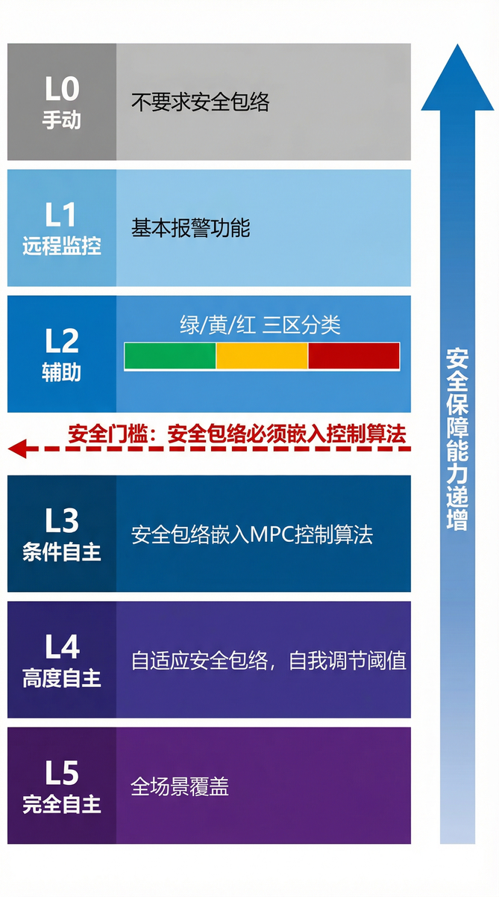
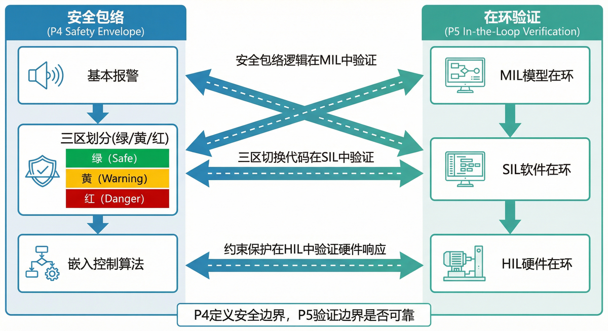
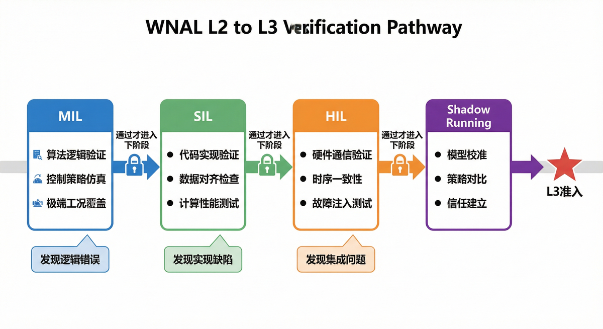
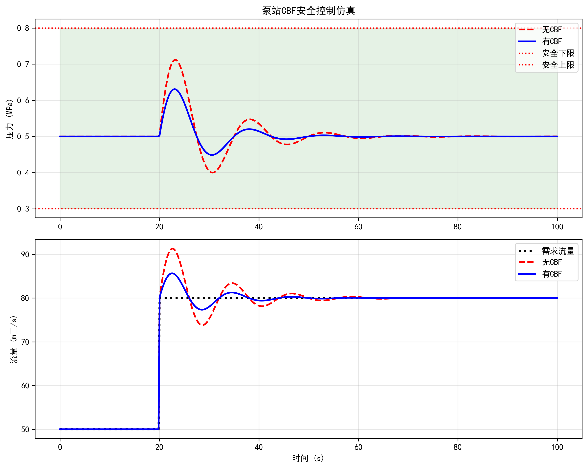

<!-- 变更日志
v1 2026-02-23: 从 ch03/ch06 提取安全包络和在环验证内容，新增三区划分和三级验证详细说明
-->

# 第十一章 安全包络与在环验证

---

> **引导案例：一次成功避免的"跳闸"事故**
>
> 2025 年 8 月，胶东调水工程某泵站（装机容量3×5 MW，设计扬程120 m，额定流量4.5 m³/s）经历了一次潜在的重大事故——如果不是安全包络系统在关键时刻介入。当时，2 号泵组正在以 85% 负荷运行，控制系统收到"增大出流 15%"的调度指令。MPC 控制器计算出的最优策略是"2 号泵组增至 95% 负荷，同时开启 3 号泵组"。然而，安全包络约束器在约束检查阶段发现：2 号泵组已连续运行 72 小时，轴承温度接近预警阈值（正常运行<60°C，当前58°C，预警阈值65°C，保护阈值70°C），若继续增载可能触发过温保护跳闸。安全包络系统否决了 MPC 的原方案，改为"2 号泵组维持 85%，3 号泵组启动至 60%"的保守策略。事后分析表明，原方案若执行，2 号泵组存在高风险在 30 分钟内跳闸（基于历史故障数据统计），导致供水中断。
>
> 这个案例展示了安全包络的核心价值：**在事故发生之前，用预定义的约束阻止危险策略的执行**。安全包络不是"事后报警"，而是"事前预防"——它将安全约束从"报警系统"前移为"控制系统的内生边界"。
>
> 而在环验证的价值在于：安全包络的三区阈值、门禁检查逻辑、降级策略等关键参数，在上线前都经过了 MIL→SIL→HIL 的逐级验证，确保它们在真实工况下能够正确动作。没有经过在环验证的安全包络，就像没有经过碰撞测试的汽车安全气囊——理论上应该工作，但没人敢保证它在关键时刻真的可靠。

**本章目标**：帮助读者理解安全包络的设计方法和在环验证的实施流程。读完本章，读者应能回答三个问题：红/黄/绿三区如何划分和标定？MIL/SIL/HIL 三级验证各回答什么问题？水利行业的在环验证面临哪些特殊挑战？

---

>**[合规说明]**：关于工程落地、测试覆盖率量化指标与合规审查的详细要求，请参阅本丛书**T3 卷《标准与工程治理》**。

## 11.1 安全包络概念

### 11.1.1 核心命题

**为每类关键变量定义安全运行区间（红/黄/绿三区），把安全约束从"报警系统"前移为"控制系统的内生边界"。**

传统水利自动化中，安全保护通常以报警 + 人工干预的形式实现：当水位超过阈值时报警，由值班人员判断是否采取行动。这种模式在 WNAL L0-L1 级是合理的，但在更高自主等级下，安全约束必须嵌入控制算法内部，成为优化问题的硬约束而非事后检查。

安全包络这个概念借鉴自航空领域的"飞行包线"（flight envelope）——飞机在设计时就被定义了安全的速度、高度、过载范围，飞行控制系统会阻止飞行员做出超出包线的动作 [11-3]。水利系统的安全包络做同样的事情：为水位、流量、压力、闸门开度等关键变量定义安全运行区间，控制系统在区间内自主优化，但绝不越界。在可靠性工程的经典分类中，这种"内生化安全约束"属于故障预防（fault prevention）与故障容忍（fault tolerance）的融合策略 [11-5]。

### 11.1.2 安全包络与第七章原理的关系

安全包络对应第七章原理四（安全包络——先安全，后最优），是八原理中承上启下的关键一环：

- **与原理一/二的关系**：安全包络的三区阈值需要依据传递函数（原理一）计算——上游最大扰动在什么条件下会导致下游进入黄区或红区？没有定量映射，安全包络只能凭经验设定。
- **与原理三的关系**：安全包络的约束传播需要分层分布式架构（原理三）支持——当上游水位进入黄区时，下游闸门的安全裕度应自动收紧。
- **与原理五的关系**：安全包络的参数和逻辑必须经过在环验证（原理五）测试，确保在真实工况下正确动作。
- **与原理八的关系**：安全包络对自主演进（原理八）施加硬约束——任何学习结果都不得突破安全包络。

### 11.1.3 安全包络的设计流程

安全包络的设计遵循"自顶向下、逐级细化"的流程：

**第一步：识别关键变量**。不是所有变量都需要安全包络保护。关键变量的选择标准是：(1) 越限后可能导致安全事故（如水位超限导致溢坝）；(2) 越限后可能导致设备损坏（如泵机过温）；(3) 越限后可能导致服务中断（如管网压力过低导致断供）。典型的关键变量包括：渠道水位、管道压力、闸门开度、泵站出力、水质指标等。

**第二步：确定三区阈值**。对每个关键变量，定义绿区（正常运行域）、黄区（预警运行域）、红区（紧急保护域）的上下限。阈值确定需要综合考虑：设计标准（如渠道堤顶超高）、设备参数（如泵机允许过载时间）、运行经验（如历史最高/最低水位）、法规要求（如生态流量下限）。

**三区的数学定义**：设关键变量为 $x$，设计运行范围为 $[x_{\min}, x_{\max}]$，安全裕度为 $\delta$（通常取设计范围的5-15%），则三区定义为：

$$
\begin{cases}
\text{绿区（Green Zone）:} & x \in [x_{\min}+\delta, x_{\max}-\delta] \\
\text{黄区（Yellow Zone）:} & x \in [x_{\min}, x_{\min}+\delta) \cup (x_{\max}-\delta, x_{\max}] \\
\text{红区（Red Zone）:} & x \notin [x_{\min}, x_{\max}]
\end{cases}
\tag{11-1}
$$

**阈值计算示例**：某渠道设计水位范围 $[2.0, 3.6]$ m，历史最高水位3.8 m，堤顶超高0.5 m（即绝对上限4.1 m）。取安全裕度 $\delta = 0.2$ m（约为设计范围的12.5%），则：

- 绿区：$[2.2, 3.4]$ m（正常运行，MPC自由优化）
- 黄区下限：$[2.0, 2.2)$ m（接近低水位，收紧下游闸门调节幅度）
- 黄区上限：$(3.4, 3.6]$ m（接近高水位，增大泄流权重）
- 红区下限：$< 2.0$ m（触发低水位保护，强制关闭下游闸门）
- 红区上限：$> 3.6$ m（触发高水位保护，强制开启泄洪闸）

**安全裕度 $\delta$ 的确定方法**：
1. **基于扰动分析**：$\delta \geq \max\{|\Delta x_{\text{disturbance}}|\}$，其中 $\Delta x_{\text{disturbance}}$ 为最大预期扰动引起的水位变化（可通过传递函数计算）
2. **基于历史数据**：$\delta = k \cdot \sigma_x$，其中 $\sigma_x$ 为历史水位标准差，$k=2\sim3$（对应95-99.7%置信区间）
3. **基于响应时间**：$\delta \geq v_{\max} \cdot T_{\text{response}}$，其中 $v_{\max}$ 为最大水位变化速率，$T_{\text{response}}$ 为控制系统响应时间

**第三步：定义区间的控制策略**。绿区内按性能优先策略运行（带约束的 MPC 自由优化 [11-4][11-11]）；黄区内切换为保守策略（收缩控制域、增大安全权重）；红区内触发确定性保护动作（紧急关闸、强制启泵）。

**第四步：验证与标定**。通过水力模型仿真 [11-7] 和历史数据回放，验证三区阈值的合理性。必要时进行现场试验（如闸门阶跃响应试验），标定安全包络参数。

---

## 11.2 红/黄/绿三区划分

### 11.2.1 三区定义与切换逻辑

> 图11-1: 安全包络红黄绿三区示意图

**绿区（正常运行域）**：所有关键变量都在安全阈值内，控制系统按性能优先策略运行。优化算法拥有最大自由度，可以在节能、平稳、响应速度等多目标之间自由权衡。

**黄区（预警运行域）**：某些关键变量接近安全包络。控制策略自动切换为保守模式：收缩控制域、降低优化目标、增加安全裕度权重。黄区的设计原则是：

**在不需要人工干预的情况下，用算法本身的能力把状态拉回绿区。**

**红区（紧急保护域）**：关键变量已达到安全上下限。控制系统不再执行优化，而是触发预定义的确定性保护动作。红区动作无需等待人工审批，但必须全程记录并在事后审计。

表11-1 三区运行规则对比

|**特征**| 绿区 | 黄区 | 红区 |
| :--- | :--- | :--- | :--- |
|**变量状态**| 全部在安全阈值内 | 部分接近安全包络 | 已达到安全上下限 |
|**控制策略**| 性能优先（MPC 自由优化） | 安全优先（保守模式） | 确定性保护（预定义动作） |
|**优化目标**| 多目标自由权衡 | 收缩控制域、增大安全权重 | 不优化，直接执行保护 |
|**人工干预**| 不需要（HotL 监督） | 不需要（系统自恢复） | 强制通知、评估接管 |
|**响应速度**| 正常（控制周期） | 加快（缩短预测时域） | 最快（立即执行） |
|**日志级别**| 标准 | 增强 | 全量记录 |

### 11.2.2 三区阈值的标定方法

三区阈值的标定是安全包络设计的核心环节。标定不当会导致两种极端：阈值过宽（安全包络失去保护意义）或阈值过窄（系统频繁进入黄区/红区，运行效率低下）。

**绿区→黄区阈值（预警阈值）**：通常设定为安全上限的 80%—90%。例如，某渠道的设计最高水位为 5.0 m，则黄区下限可设定为 4.5 m（90%）。预警阈值的确定需要考虑：(1) 水波传播时间——从黄区到红区的时间窗口应不小于控制系统的响应时间；(2) 控制动作的生效延迟——闸门开度变化到下游水位响应的延迟可能长达数小时；(3) 扰动幅度——历史最大扰动（如百年一遇暴雨）导致的水位变化幅度。

**黄区→红区阈值（保护阈值）**：通常设定为安全上限的 95%—100%，或略低于设计极限值。例如，某渠道的堤顶高程为 5.2 m，考虑 0.2 m 的波浪爬高和安全超高，红区阈值可设定为 5.0 m。保护阈值的确定需要预留"缓冲带"——从黄区进入红区后，系统应有足够的时间执行保护动作，避免"来不及反应"。

**工程经验法则**：对于明渠输水系统，绿区→黄区的时间窗口建议不小于 30 分钟（从预警到保护的最短响应时间），黄区→红区的时间窗口建议不小于 15 分钟（保护动作的执行时间）。对于管网系统，由于水锤效应的快速传播，时间窗口应缩短至 5—10 分钟。

### 11.2.3 多变量安全包络的协调约束

实际工程中的安全包络往往涉及多个变量的协调约束。例如，一个闸站群的安全包络可能同时包含：

- 每个蓄水池的水位上下限
- 闸门开度变化速率限制（如≤3%/min）
- 上下游水位差约束（防止闸门两侧压差过大）
- 总流量守恒约束（入流=出流 + 蓄变量）
- 设备运行时长累积限制（如泵机连续运行≤72 小时）

这些约束之间可能存在冲突——为了满足一个约束可能需要违反另一个。安全包络的设计必须预先定义约束之间的优先级：

**第一优先级（结构安全）**：不溢不溃（水位不超堤顶、管道不超设计压力）、不空不枯（渠道不抽空、水库不枯竭）。这类约束涉及工程结构安全，具有最高优先级，任何情况下不得违反。这一优先级原则与 IEC 61508 功能安全标准中的安全完整性等级（SIL）分级思路一脉相承 [11-10]。

**第二优先级（服务安全）**：不断供（管网压力不低于最低服务压力）、不污染（水质指标不超标）。这类约束涉及公共服务，优先级次之。

**第三优先级（效率约束）**：能耗最优、设备磨损最小、运行成本最低。这类约束涉及运行绩效，优先级最低，在安全约束面前可以牺牲。

### 11.2.4 约束传播与级联响应

多变量安全包络的另一个挑战是**约束传播**。当系统中某一个变量进入黄区时，相关联的变量的安全裕度也应相应收紧。例如：

- 上游水位偏高进入黄区 → 下游闸门的最大开度自动限制，防止下游水位也进入黄区
- 某泵组轴承温度接近预警 → 该泵组的最大出力限制下调 20%，同时相邻泵组的备用容量要求提高
- 某渠段流速过快 → 该区段闸门开度变化速率限制收紧（从 3%/min 降至 1%/min），防止水锤效应

这种"安全约束的级联传播"需要在分层架构中得到支持：区域层负责本区域内的约束传播，全局层负责跨区域的约束协调。

### 11.2.5 安全包络的治理价值

安全包络不仅是技术机制，更是**治理工具**。它把"安全责任"从抽象的管理要求转化为可计算、可审计、可追责的对象：

- 三区阈值由谁设定？→ 设计单位提出，运行单位确认，主管部门审批
- 依据什么标准？→ 设计标准、设备参数、运行经验、法规要求
- 何时更新？→ 工程改造后、运行规程修订后、事故发生后
- 更新需要谁审批？→ 设计单位复核，运行单位测试，主管部门备案

这些问题一旦形式化，就为自主运行提供了可追溯的责任链条 [11-8]。当事故发生后，审计员可以追溯：安全包络阈值是否合理？系统是否正确执行了黄区/红区策略？人为干预是否突破了安全包络约束？——这些问题的答案都记录在安全包络的审计日志中。在自主运行架构中，安全包络与故障诊断和容错控制 [11-6] 构成互补的双重保障：安全包络侧重"预防"，容错控制侧重"应对"。

### 11.2.6 反面案例：缺失安全包络的代价

**案例背景**：2023年某城市供水管网改造工程，引入了基于MPC的压力优化控制系统，目标是降低管网漏损率和能耗。系统在实验室测试中表现优异，节能效果达到15%。然而，在正式上线后的第三天，发生了一次严重的供水中断事故。

**事故经过**：
- **T+0分钟**：夜间用水低谷期，MPC系统为节能将泵站出口压力降至0.25 MPa（设计最低压力0.30 MPa，但系统认为"还有裕度"）
- **T+15分钟**：某高层小区突发火灾，消防栓大量取水，局部管网压力骤降
- **T+18分钟**：MPC系统检测到压力下降，计算出"增大泵站出力20%"的最优策略
- **T+20分钟**：泵站执行增压指令，但由于初始压力过低，泵机启动时发生气蚀（cavitation），2台泵组自动保护停机
- **T+25分钟**：仅剩1台泵组运行，管网压力进一步下降至0.15 MPa，部分区域断水
- **T+40分钟**：人工接管，紧急启动备用泵站，供水逐步恢复
- **影响**：约5000户居民断水40分钟，消防用水受影响，直接经济损失约50万元

**事故原因分析**：
1. **安全包络缺失**：系统没有定义压力的"黄区"和"红区"。当压力降至0.25 MPa时（已接近设计下限），系统仍然按"性能优先"策略运行，继续追求节能目标
2. **约束检查不足**：MPC约束仅包含"压力≥0.20 MPa"（绝对下限），没有考虑"安全裕度"和"扰动响应能力"
3. **未经在环验证**：系统在实验室测试时仅覆盖了正常工况和小扰动工况，未测试"低压+突发大流量"的极端组合工况
4. **降级机制缺失**：当压力进入危险区域时，系统没有自动切换到"保守模式"（如强制提高压力裕度、限制优化幅度）

**如果有安全包络**：
- **绿区**：压力0.35-0.50 MPa，MPC自由优化节能
- **黄区下限**：压力0.30-0.35 MPa，切换保守模式（压力权重×2，节能权重×0.5）
- **红区下限**：压力<0.30 MPa，触发保护动作（强制泵站全开，禁止优化）

如果有这样的安全包络，事故可以避免：
- T+0分钟时，压力0.25 MPa已进入红区，系统会强制提高压力至0.35 MPa以上
- T+15分钟火灾发生时，系统有足够的压力裕度应对突发流量
- 即使压力下降，也不会触发泵机气蚀

**教训总结**：
1. **安全包络不是"可选项"**：任何自主优化系统都必须有安全包络保护，否则"最优"可能变成"最危险"
2. **阈值设置需要工程经验**：0.30 MPa的设计下限不等于0.30 MPa的安全运行下限，必须预留安全裕度
3. **在环验证必须覆盖极端工况**：实验室测试不能只测"正常+小扰动"，必须测试"边界+大扰动"的组合
4. **节能与安全的权衡**：节能15%的价值远低于一次供水中断的损失，安全必须是第一优先级

---

## 11.3 在环验证概念

### 11.3.1 核心命题

**任何上线策略都必须经过模型在环（MIL）→软件在环（SIL）→硬件在环（HIL）的逐级验证，缺失任何一环都不应进入高等级自主运行。**

在环验证这个概念借鉴自航空航天和汽车工业的 V 模型开发流程 [11-1][11-2]。水利行业传统上依赖"设计—施工—调试—运行"的线性开发模式，缺乏系统化的策略验证环节。当自主等级提高后，控制策略的复杂度和相互耦合急剧增加，"调试时改几个参数"的方法不再可行。

在环验证的本质是"在可控环境中模拟真实运行，提前发现问题"。它不是要替代现场调试，而是要在现场调试之前，用更低的成本、更小的风险、更高的效率完成策略验证 [11-9]。在渠道自动化领域，ASCE 的灌溉渠系自动化手册 [11-12] 最早系统总结了这一实践，而水利行业的在环测试体系将其推广到更广泛的水网系统。

**MIL/SIL/HIL三级验证对比**：表11-1总结了三级验证的核心差异和递进关系。

表11-1 MIL/SIL/HIL三级验证对比

| 维度 | MIL（模型在环） | SIL（软件在环） | HIL（硬件在环） |
|------|----------------|----------------|----------------|
| **定义** | 在数学模型环境中验证控制逻辑 | 在软件环境中验证代码实现 | 在真实硬件环境中验证系统集成 |
| **测试对象** | 控制算法（模型/伪代码） | 实际部署的代码（C/C++/Python） | 真实控制器硬件+代码 |
| **测试环境** | 高级语言（MATLAB/Python） | 目标平台软件环境 | 真实PLC/服务器+模拟对象 |
| **测试目的** | 验证逻辑正确性、工况覆盖 | 验证代码正确性、数值稳定性 | 验证集成正确性、时序鲁棒性 |
| **典型工具** | MATLAB/Simulink、Python+NumPy | dSPACE ControlDesk、NI VeriStand | OPAL-RT、Typhoon HIL、dSPACE Simulator |
| **通过标准** | 场景覆盖率≥95%，性能指标达标 | 代码覆盖率≥90%，与MIL误差<5% | 通信延迟<100ms，故障注入测试通过 |
| **成本估算** | 50-100万元（软件+人力） | 100-200万元（平台+集成） | 200-500万元（硬件+系统） |
| **验证周期** | 3-6个月 | 6-12个月 | 12-18个月 |
| **WNAL要求** | L2建议，L3必须 | L2建议，L3必须 | L3必须，L4强化 |
| **对应标准** | ISO 26262 软件单元测试 | ISO 26262 软件集成测试 | ISO 26262 硬件-软件集成测试 |

**关键洞察**：
1. **逐级逼近真实**：MIL验证"设计正确"，SIL验证"实现正确"，HIL验证"集成正确"
2. **成本递增**：MIL发现问题成本~100元，SIL~1000元，HIL~10000元，现场~100000元
3. **不可跳级**：跳过任何一级都会在后续阶段暴露更多问题，总成本反而更高
4. **水利特殊性**：水系统物理过程不可加速，HIL验证需要真实时间窗口（数小时至数天）

### 11.3.2 三层验证的目标与输出

> 图11-2: 在环验证深度与 WNAL 等级对应图

**MIL（模型在环，Model-in-the-Loop）**：在数学模型环境中检验控制逻辑的正确性与工况覆盖。

- **回答的问题**："在理想条件下，这个策略能否完成任务？覆盖了多少种工况？"
- **验证环境**：Matlab/Simulink、Python 等高级语言，使用降阶模型或高保真模型
- **典型输出**：MIL 测试报告、场景覆盖率统计、控制性能指标（如水位跟踪误差、能耗）
- **WNAL要求**：L2 级建议完成，L3 级必须完成（场景覆盖率满足标准要求）

**SIL（软件在环，Software-in-the-Loop）**：在接近真实的软件环境中检验代码实现的正确性与数值稳定性。

- **回答的问题**："代码实现忠实于设计意图吗？数值稳不稳定？"
- **验证环境**：实际部署的代码（C/C++/Python），运行在目标服务器或嵌入式平台上
- **典型输出**：SIL 测试报告、代码覆盖率、数值稳定性分析、时序测试结果
- **WNAL要求**：L2 级建议完成，L3 级必须通过

**HIL（硬件在环，Hardware-in-the-Loop）**：在包含真实硬件控制器和模拟对象的环境中检验接口时序、通信鲁棒性和故障响应。

- **回答的问题**："在真实硬件时序和通信环境下还能正常工作吗？"
- **验证环境**：真实 PLC/RTU 控制器 + 实时仿真机（如 dSPACE SCALEXIO），被控对象为水力模型
- **典型输出**：HIL 测试报告、通信延迟统计、故障注入测试结果、保护动作验证记录
- **WNAL要求**：L2 级建议完成关键回路，L3 级必须完成关键回路

> **概念速览框 9-A | 在环验证要回答的三个问题**
>
> MIL："逻辑对不对？覆盖了多少工况？"
> SIL："代码实现忠实于设计意图吗？数值稳不稳定？"
> HIL："在真实硬件时序和通信环境下还能正常工作吗？"
> 三层验证逐层筛除不同层面的风险，不可省略或跳过。

### 11.3.3 三层验证的关系

三层验证是"逐层递进、不可跳过"的关系：

- **MIL 是基础**：如果控制逻辑在模型层面就不正确，代码实现和硬件集成做得再好也无济于事。
- **SIL 是桥梁**：MIL 通过仅表明"设计正确"，SIL 验证"实现正确"——两者之间的转换可能引入误差（如数值精度损失、时序错误）。
- **HIL 是门槛**：SIL 通过仅表明"软件正确"，HIL 验证"集成正确"——硬件延迟、通信丢包、接口兼容性等问题只有在 HIL 阶段才能暴露。

工程实践中常见的误区是"跳过 MIL 直接做 SIL"或"用大量 SIL 测试替代 HIL"。这种做法的风险在于：不同层面的风险需要不同层面的验证来筛除，跳过任何一层都会留下隐患。

---

## 11.4 MIL/SIL/HIL 三级验证详解

### 11.4.1 MIL（模型在环）验证流程

MIL 验证的核心是"场景覆盖"——用尽可能多的工况测试控制策略，确保它在各种情况下都能正确动作。

**场景分类**（见表11-2）：

表11-2 在环验证场景分类

|**场景类型**| 描述 | 覆盖率要求（L3） |
| :--- | :--- | :--- |
|**正常工况**| 设计范围内的常规运行（如日调节、周调节） | 100% |
|**异常工况**| 设备故障、通信中断、传感器漂移 | 100% |
|**极端工况**| 百年一遇洪水、极端干旱、多故障叠加 | ≥80% |
|**边界工况**| 绿区→黄区→红区的切换边界 | 100% |

**MIL 验证步骤**：

1. **搭建仿真环境**：配置水力模型（降阶模型用于快速仿真，高保真模型用于精度验证）、设置初始条件、定义输入输出接口。

2. **设计测试用例**：基于场景分类，设计覆盖正常/异常/极端/边界工况的测试用例。每个用例包含：初始状态、输入扰动、预期输出、通过标准。

3. **执行仿真测试**：批量运行测试用例，记录控制策略的响应过程。典型测试量：L2 级≥50 个用例，L3 级≥200 个用例。

4. **分析测试结果**：统计通过率、场景覆盖率、控制性能指标。不通过的用例需要分析原因（设计缺陷？参数不当？场景定义错误？）。

5. **迭代优化**：根据测试结果修改控制策略，重新执行测试，直至通过标准满足。

**MIL 通过标准（L3 准入）**：
- 正常工况通过率 100%
- 异常工况通过率 100%
- 极端工况通过率≥80%
- **场景覆盖率≥95%**（定义见下文）
- 控制性能指标满足设计要求（如水位跟踪误差±5 cm）

**场景覆盖率的定义与计算**：

场景覆盖率衡量测试用例对系统运行空间的覆盖程度。对于水利系统，场景覆盖率包括三个维度：

1. **状态空间覆盖率**：
   $$
   C_{\text{state}} = \frac{N_{\text{tested states}}}{N_{\text{total states}}} \times 100\%
   $$
   其中，$N_{\text{tested states}}$ 为测试覆盖的状态组合数，$N_{\text{total states}}$ 为理论上所有可能的状态组合数。对于连续状态空间，采用网格划分法：将每个状态变量的范围划分为若干区间（如水位划分为10个区间），状态空间覆盖率为测试覆盖的网格点数占总网格点数的比例。

2. **边界覆盖率**：
   $$
   C_{\text{boundary}} = \frac{N_{\text{tested boundaries}}}{N_{\text{total boundaries}}} \times 100\%
   $$
   边界包括：安全包络边界（绿/黄/红区边界）、物理约束边界（最大/最小流量、水位）、操作约束边界（闸门开度限制、泵机启停次数）。L3准入要求所有关键边界都有测试用例覆盖。

3. **故障模式覆盖率**：
   $$
   C_{\text{fault}} = \frac{N_{\text{tested faults}}}{N_{\text{total faults}}} \times 100\%
   $$
   故障模式包括：传感器故障（漂移、卡死、断线）、执行器故障（卡死、响应慢）、通信故障（延迟、丢包）、外部扰动（暴雨、设备故障）。L3准入要求覆盖所有单点故障和常见的双点故障组合。

**综合场景覆盖率**：
$$
C_{\text{total}} = w_1 C_{\text{state}} + w_2 C_{\text{boundary}} + w_3 C_{\text{fault}}
$$
其中，权重 $w_1=0.4, w_2=0.3, w_3=0.3$（可根据工程特点调整）。L3准入要求 $C_{\text{total}} \geq 95\%$。

**测试用例设计方法**：
- **边界值分析**：针对每个约束边界设计测试用例（如水位刚好达到黄区下限）
- **等价类划分**：将状态空间划分为若干等价类，每类选取代表性测试点
- **正交试验设计**：对于多变量系统，使用正交表减少测试用例数量
- **故障树分析**：基于故障树识别关键故障模式，设计故障注入测试

### 11.4.2 SIL（软件在环）验证流程

SIL 验证的核心是"代码正确性"——确保从模型到代码的转换没有引入错误。

**SIL 验证重点**（见表11-3）：

表11-3 软件在环(SIL)验证重点

|**验证内容**| 描述 | 典型问题 |
| :--- | :--- | :--- |
|**代码转换正确性**| 模型自动生成的代码或手写代码是否忠实于设计 | 公式抄错、边界条件遗漏 |
|**数值稳定性**| 浮点运算是否产生溢出、舍入误差是否累积 | 除以零、矩阵奇异 |
|**时序正确性**| 任务调度、中断响应、数据刷新是否满足时序要求 | 任务死锁、数据不同步 |
|**接口一致性**| 模块间接口、外部 API 调用是否符合规范 | 参数类型不匹配、单位错误 |

**SIL 验证步骤**：

1. **代码静态检查**：使用静态分析工具（如 PC-lint、SonarQube）检查代码规范、潜在 bug、安全漏洞。

2. **单元测试**：对每个函数/模块进行独立测试，验证输入输出是否符合预期。典型测试量：每千行代码≥50 个测试用例。

3. **集成测试**：将多个模块组合测试，验证模块间接口和协作逻辑。

4. **数值压力测试**：注入极端数值（如极大值、极小值、NaN、Inf），验证代码的鲁棒性。

5. **时序测试**：在目标硬件或仿真平台上运行代码，测量任务执行时间、响应延迟、数据刷新率。

**SIL 通过标准（L3 准入）**：
- 代码静态检查无严重警告
- 单元测试覆盖率≥90%
- 集成测试通过率 100%
- 数值压力测试无崩溃、无溢出
- 时序测试满足实时性要求（如控制周期 30 秒，任务执行时间≤5 秒）

### 11.4.3 HIL（硬件在环）验证流程

HIL 验证的核心是"集成正确性"——在包含真实硬件的环境中验证系统的整体行为。

**HIL 测试平台组成**（见表11-4）：

表11-4 硬件在环(HIL)测试平台组件

|**组件**| 说明 | 典型配置 |
| :--- | :--- | :--- |
|**真实控制器**| 实际部署的 PLC/RTU/工控机 | Siemens S7-1500、Rockwell ControlLogix |
|**实时仿真机**| 运行水力模型的实时计算机 | dSPACE SCALEXIO、NI PXIe |
|**I/O 接口**| 控制器与仿真机之间的信号连接 | 模拟量（4-20mA）、数字量（24VDC） |
|**监控软件**| 测试执行、数据记录、结果分析 | dSPACE ControlDesk、LabVIEW |

**HIL 验证重点**（见表11-5）：

表11-5 硬件在环(HIL)验证重点

|**验证内容**| 描述 | 典型问题 |
| :--- | :--- | :--- |
|**接口时序**| 信号采集、控制输出的时序是否匹配 | 采样延迟、执行滞后 |
|**通信鲁棒性**| 通信中断、丢包、延迟下的系统行为 | 通信超时后未进入安全状态 |
|**故障响应**| 传感器故障、执行器卡死、控制器宕机的处理 | 故障检测延迟、保护动作错误 |
|**保护动作**| 红区触发时的紧急关闸、强制启泵等动作 | 保护逻辑错误、动作延迟 |

**HIL 验证步骤**：

1. **平台搭建**：连接真实控制器与实时仿真机，配置 I/O 通道，校准信号量程。

2. **基础功能测试**：验证数据采集、控制输出、通信链路的基础功能正常。

3. **闭环控制测试**：运行完整的控制回路，验证水位跟踪、流量调节等核心功能。

4. **故障注入测试**：人为注入故障（如传感器断线、通信中断、执行器卡死），验证系统的故障检测和保护动作。

5. **边界工况测试**：模拟绿区→黄区→红区的切换过程，验证安全包络的正确动作。

6. **长时间运行测试**：连续运行 72 小时以上，验证系统的稳定性和无内存泄漏。

**HIL 通过标准（L3 准入）**：
- 基础功能测试通过率 100%
- 闭环控制测试性能满足设计要求
- 故障注入测试保护动作正确率 100%
- 边界工况测试安全包络动作正确率 100%
- 长时间运行测试无崩溃、无性能退化

---

## 11.5 类比说明：SIL/HIL 是"不同逼真度的试车"

### 11.5.1 直觉类比

为了让水利工程师快速理解在环验证的价值，可以用"试车"来类比：

**MIL = 图上推演**：像在军事指挥室的沙盘上推演战役——用模型和图纸模拟作战过程，验证战略战术的逻辑正确性。成本低、速度快，但无法暴露所有问题。对应到水利系统，MIL 是在电脑上跑仿真，验证控制策略的数学逻辑。

**SIL = 模拟器训练**：像飞行员在飞行模拟器上训练——使用真实的飞行控制软件，但被控对象（飞机）是数学模型。可以暴露软件层面的问题（如控制律实现错误、界面交互问题），但不涉及真实硬件。对应到水利系统，SIL 是用实际部署的控制代码跑仿真，验证代码实现的正确性。

**HIL = 实车测试**：像汽车在试车场上路试——使用真实的发动机、变速箱、刹车系统，但测试环境是受控的（试车场而非公共道路）。可以暴露硬件集成问题（如传感器延迟、执行器响应、电磁兼容）。对应到水利系统，HIL 是用真实 PLC 控制器连接水力模型仿真机，验证硬件集成的正确性。

表11-6 SIL/HIL 与试车类比对照

| 维度 | MIL（图上推演） | SIL（模拟器） | HIL（实车测试） |
| :--- | :--- | :--- | :--- |
|**被控对象**| 数学模型 | 数学模型 | 数学模型 |
|**控制器**| 模型（Matlab/Python） | 实际代码 | 真实硬件（PLC） |
|**逼真度**| 低（逻辑层面） | 中（软件层面） | 高（硬件层面） |
|**成本**| 最低 | 中等 | 最高 |
|**风险**| 最低 | 低 | 低（模拟对象） |
|**暴露问题**| 设计缺陷 | 代码错误 | 集成问题 |
|**水利类比**| 电脑仿真 | 代码仿真 | PLC+ 仿真机 |

### 11.5.2 为什么需要逐级验证？

一个自然的问题是：既然 HIL 最逼真，为什么不直接做 HIL，跳过 MIL 和 SIL？

答案是**成本效率**和**问题定位**：

- **成本效率**：MIL 发现并修复一个设计缺陷的成本约为 100 元（修改模型、重新仿真）；SIL 发现并修复一个代码错误的成本约为 1,000 元（修改代码、重新编译部署）；HIL 发现并修复一个集成问题的成本约为 10,000 元（可能需要更换硬件、重新接线、现场调试）。越早发现问题，修复成本越低。

- **问题定位**：如果直接做 HIL，当测试失败时，很难判断问题是出在设计层面（控制逻辑错误）、代码层面（实现错误）还是集成层面（硬件问题）。而逐级验证可以逐层排除：MIL 通过说明设计正确，SIL 通过说明代码正确，HIL 失败则问题一定在集成层面。

**工程经验法则**：一个成熟的控制系统，MIL 阶段应发现并修复约 70% 的缺陷，SIL 阶段发现并修复约 20% 的缺陷，HIL 阶段发现并修复约 8% 的缺陷，剩余 2% 的缺陷在现场调试中暴露。这个比例反映了"问题越早发现，修复成本越低"的工程智慧。

### 11.5.3 水利行业在环验证的特殊挑战

水利系统的在环验证面临若干特有挑战，与汽车、航空等行业相比：

**物理过程不可加速**：汽车行业可以在 HIL 台架上以 10 倍速运行模拟（模拟 1 小时行驶只需 6 分钟），但水系统中的传播时滞是物理真实的——一个闸门动作的下游响应可能需要数小时才能完成，这意味着 HIL 验证的每个场景都需要真实的时间窗口。应对策略：采用降阶模型加速仿真（实时因子可达 0.001），或使用"时间缩放"技术（但需注意物理意义的保持）。

**边界条件不可完全复现**：来水流量、气象条件、用户需求等外部扰动难以在实验室中精确模拟。应对策略：采用历史数据回放（使用真实运行记录作为输入）、蒙特卡洛扰动注入（随机生成符合统计特征的扰动）、极端工况包络（覆盖最不利边界条件）。

**失效后果不可逆**：汽车的 HIL 测试失败至多损坏测试设备，但水利系统的控制失误可能导致实际的水淹或断供。应对策略：HIL 阶段必须使用模拟对象（水力模型）而非真实水工建筑物；安全包络保护在 HIL 测试中必须启用；关键测试需在"双轨模式"下进行（新策略与旧策略并行，仅当一致时才执行）。

### 11.5.4 在环验证与 WNAL 等级的关系

验证要求随 WNAL 等级递增（见表11-7）：

表11-7 WNAL各等级对在环验证的要求

|**WNAL 等级**| MIL 要求 | SIL 要求 | HIL 要求 |
| :--- | :--- | :--- | :--- |
|**L0（手动）**| 不要求 | 不要求 | 不要求 |
|**L1（远程监控）**| 建议完成基本测试 | 不要求 | 不要求 |
|**L2（辅助优化）**| 必须完成（典型工况覆盖） | 必须完成 | 必须完成关键回路 |
|**L3（条件自主）**|**必须完成（全工况覆盖，含极端场景）**|**必须完成（全覆盖）**|**必须完成（全系统完整 HIL）**|
|**L4（高度自主）**| 引入对抗性与演进测试 | 动态边界持续验证 | 在线 HIL / 影子运行 |
|**L5（完全自主）**| 涵盖未知不安全场景 | 涵盖未知不安全场景 | 全域全天候自适应验证 |

**L2 向 L3 跃迁是分水岭**：目前水利行业在 L1-L2 阶段通常只做 MIL（且仅限于典型工况测试），但这远不足以支撑高等级自主运行。从 L2 开始，完整的 xIL 测试（MIL/SIL/HIL）就应成为标配；到了 L3 级及以上，不仅要求 xIL 环节完整，更对场景覆盖率（特别是极端和故障工况）提出了极其严苛的强制性准入标准。没有完成全工况在环验证的系统，无论其 AI 模型多么精密，都不可能通过 L3 准入评估。

---

## 11.6 安全包络工程实施

### 11.6.1 三区划分方法

安全包络的核心是将系统运行状态划分为绿/黄/红三区，每区对应不同的控制策略和人机职责。

**绿区（正常域）定义**：
- 状态变量在正常范围内（如水位±10cm）
- 设备参数在正常范围内（如振动、温度正常）
- 外部条件在 ODD 正常域内
- 控制策略：MPC 自主优化

**黄区（受限域）定义**：
- 状态变量接近边界（如水位±10-20cm）
- 设备参数预警（如振动、温度接近限值）
- 外部条件在 ODD 受限域内
- 控制策略：降级为保守控制（如 PID），告警

**红区（禁行域）定义**：
- 状态变量超过安全限值（如水位>±20cm）
- 设备参数超限（如振动、温度超限）
- 外部条件在 ODD 禁行域内
- 控制策略：MRC（最小风险状态）+ 人工接管

### 11.6.2 阈值标定方法

三区阈值标定是安全包络实施的关键，建议采用"理论计算 + 试验验证 + 运行优化"三步法：

**步骤一：理论计算**

基于水力学公式、设备规范、设计文件等，计算理论阈值：
- 水位阈值：基于堤顶高程、设计洪水位、死水位等
- 流量阈值：基于设计流量、最大过流能力等
- 设备阈值：基于设备规范、厂家建议等

**步骤二：试验验证**

通过现场试验验证理论阈值的合理性：
- 阶跃响应试验：测试系统对不同扰动的响应
- 极限工况试验：测试系统在边界条件下的行为
- 故障注入试验：测试系统在故障条件下的安全性

**步骤三：运行优化**

根据实际运行数据优化阈值：
- 统计正常工况下的状态变量分布
- 分析历史事故/事件的阈值越限情况
- 定期（至少每年）评估和调整阈值

**阈值标定原则**：
- **宁宽勿窄**：初期阈值适当放宽，上线后逐步优化
- **季节性调整**：考虑季节性变化（如汛期/枯水期）
- **设备老化**：考虑设备老化导致的性能下降
- **保守起步**：安全优先，效率其次

### 11.6.3 安全包络与 ODD 的关系

ODD（运行设计域）定义系统自主运行的边界条件，安全包络定义系统运行状态的安全包络。两者关系如下（见表11-8）：

表11-8 ODD与安全包络的维度对比

| 维度 | ODD | 安全包络 |
| :--- | :--- | :--- |
|**定义对象**| 外部条件（来水、降雨、需求等） | 内部状态（水位、流量、设备参数等） |
|**作用**| 界定自主运行的"有效范围" | 界定系统运行的"安全包络" |
|**划分**| 正常域/受限域/禁行域 | 绿区/黄区/红区 |
|**关系**| ODD 禁行域 → 安全包络红区 | 安全包络红区 → 人工接管 |

**协同机制**：
- ODD 正常域 + 安全包络绿区 → MPC 自主优化
- ODD 受限域 + 安全包络黄区 → 降级控制 + 告警
- ODD 禁行域 + 安全包络红区 → MRC + 人工接管

### 11.6.4 安全包络检查清单

**设计阶段**：
- [ ] 三区阈值理论计算完成
- [ ] 阈值与 ODD 定义协调一致
- [ ] 控制策略（MPC/降级/MRC）定义清晰
- [ ] 人机职责边界明确

**验证阶段**：
- [ ] 阶跃响应试验验证阈值合理性
- [ ] 极限工况试验验证边界行为
- [ ] 故障注入试验验证安全性
- [ ] 三级验证（MIL/SIL/HIL）通过

**运行阶段**：
- [ ] 阈值定期评估（至少每年一次）
- [ ] 季节性调整机制建立
- [ ] 设备老化补偿机制建立
- [ ] 阈值越限事件记录和分析

---

## 11.7 在环验证工程实施

### 11.7.1 MIL/SIL/HIL 对比

三层验证平台的对比如表11-9所示：

表11-9 MIL/SIL/HIL三层验证平台对比

| 维度 | MIL（模型在环） | SIL（软件在环） | HIL（硬件在环） |
| :--- | :--- | :--- | :--- |
|**验证对象**| 控制逻辑（模型） | 代码实现 | 硬件集成 |
|**模型**| 理想模型（连续时间） | 离散化模型 | 实时仿真模型 |
|**控制器**| 理想控制器（无延迟） | 实际代码 | 实际硬件（PLC/工控机） |
|**通信**| 无延迟 | 模拟延迟 | 真实通信 |
|**计算速度**| 离线（不限时） | 近实时 | 实时（硬实时） |
|**成本**| 低 | 中 | 高 |
|**保真度**| 低 | 中 | 高 |
|**适用阶段**| 早期设计 | 中期开发 | 后期集成 |

### 11.7.2 MIL 验证实施

**目标**：验证控制逻辑的正确性。

**推荐工具**：
- **MATLAB/Simulink**（商业，推荐）：功能最全面，工具链成熟，支持自动代码生成。适合复杂控制算法开发。许可费用约50万元/年。
- **Python + NumPy/SciPy**（开源）：灵活性高，适合快速原型开发和算法验证。免费，但需要自行搭建工具链。
- **OpenModelica**（开源）：支持Modelica标准，适合物理系统建模。免费，社区活跃。
- **Scilab/Xcos**（开源）：类似MATLAB的开源替代品，适合教学和小型项目。免费。

**流程**：
1. 建立被控对象模型（水力模型、设备模型）
2. 设计控制器模型（MPC、PID 等）
3. 设计测试用例（正常/异常/极端工况）
4. 运行仿真，分析结果
5. 修改控制逻辑，迭代优化

**验收标准**：
- 测试用例覆盖率：>90%
- 控制性能指标：满足设计要求
- 稳定性：无振荡、无发散

**投资估算**：
- 软件许可：约 50 万元（MATLAB/Simulink）或 0 元（开源方案）
- 人员培训：约 10 万元
- 实施周期：2-3 个月

### 11.7.3 SIL 验证实施

**目标**：验证代码实现的正确性。

**推荐工具**：
- **dSPACE ControlDesk**（商业，推荐）：业界标准SIL平台，支持实时仿真和自动测试。适合大型项目。许可费用约100-150万元。
- **NI VeriStand**（商业）：National Instruments的实时测试平台，硬件集成度高。许可费用约80-120万元。
- **Simulink Coder + Simulink Real-Time**（商业）：MATLAB工具链的一部分，无缝集成。许可费用约30-50万元。
- **QEMU + Python**（开源）：使用虚拟机模拟目标平台，适合预算有限的项目。免费，但需要较强的技术能力。

**流程**：
1. 从模型自动生成代码（C/C++）
2. 在 PC 或工控机上编译运行
3. 设计测试用例（与 MIL 一致）
4. 运行测试，对比 MIL 结果
5. 修改代码，迭代优化

**验收标准**：
- 代码与模型一致性：>95%
- 数值稳定性：无溢出、无奇点
- 实时性：满足控制周期要求

**投资估算**：
- 代码生成工具：约 30 万元
- 工控机：约 20 万元
- 实施周期：2-3 个月

### 11.7.4 HIL 验证实施

**目标**：验证硬件集成的正确性。

**推荐工具**：
- **OPAL-RT OP5700/ePHASORsim**（商业，推荐）：专业级实时仿真器，支持微秒级时间步长，适合电力和水利系统。许可费用约200-400万元。
- **dSPACE SCALEXIO**（商业）：汽车行业标准HIL平台，可靠性高，工具链完善。许可费用约300-500万元。
- **Typhoon HIL**（商业）：性价比较高的HIL平台，适合中小型项目。许可费用约100-200万元。
- **NI PXI + LabVIEW Real-Time**（商业）：模块化硬件平台，灵活性高，适合定制化需求。许可费用约150-300万元。
- **Raspberry Pi + Simulink Real-Time**（低成本方案）：适合教学和概念验证，不适合工程级应用。成本约5-10万元。

**流程**：
1. 建立实时仿真模型（被控对象）
2. 连接实际硬件（PLC、工控机）
3. 连接真实通信网络
4. 设计测试用例（与 MIL/SIL 一致）
5. 运行测试，分析结果
6. 修改硬件配置/参数，迭代优化

**验收标准**：
- 硬件与模型一致性：>90%
- 通信延迟：满足设计要求
- 实时性：硬实时（无丢包、无超时）
- 安全性：故障注入测试通过

**投资估算**：
- 实时仿真平台：约 200-500 万元（根据规模和精度要求）
- 实际硬件：约 50-100 万元
- 实施周期：4-6 个月

### 11.7.5 在环验证用例设计

**正常工况用例**：
- 设定点跟踪：水位/流量设定值阶跃变化
- 扰动抑制：来水波动、需求变化
- 多目标协同：水位跟踪 + 能耗优化

**异常工况用例**：
- 传感器故障：读数漂移、丢包、畸变
- 执行器故障：响应延迟、卡死、误动作
- 通信故障：延迟、丢包、中断

**极端工况用例**：
- 洪水工况：来水远超设计标准
- 干旱工况：来水远低于设计标准
- 设备故障：关键设备（泵、闸）失效
- 通信中断：与调度中心通信中断

**验收标准**：
- 正常工况：控制性能满足设计要求
- 异常工况：系统可检测并安全降级
- 极端工况：系统可进入 MRC（最小风险状态）

### 11.7.6 在环验证检查清单

**MIL 验证**：
- [ ] 被控对象模型建立完成
- [ ] 控制器模型设计完成
- [ ] 测试用例设计完成（正常/异常/极端）
- [ ] 仿真结果分析完成
- [ ] 控制逻辑迭代优化完成

**SIL 验证**：
- [ ] 代码自动生成完成
- [ ] 代码编译通过
- [ ] 测试用例执行完成
- [ ] MIL/SIL 结果对比完成
- [ ] 代码迭代优化完成

**HIL 验证**：
- [ ] 实时仿真模型建立完成
- [ ] 实际硬件连接完成
- [ ] 通信网络连接完成
- [ ] 测试用例执行完成
- [ ] SIL/HIL 结果对比完成
- [ ] 硬件配置/参数迭代优化完成

---

## 11.8 工程实例：某水电站安全包络与在环验证

### 11.8.1 工程背景

某大型水电站，装机容量 1000MW，承担发电、防洪、航运等综合任务。电站原采用常规 SCADA 系统，计划升级到 WNAL L2 级（辅助优化）。

**核心挑战**：
- 安全约束复杂（水位、流量、压力、振动等）
- 控制策略验证困难
- 人机职责边界模糊

### 11.8.2 安全包络实施

**三区划分**：
- 绿区：水位 365-372m，流量 1000-12000 $\text{m}^3$/s —— MPC 自主优化
- 黄区：水位 363-365m 或 372-375m —— 降级为 PID，告警
- 红区：水位<363m 或>375m —— MRC + 人工接管

**阈值标定**：
- 理论计算：基于设计文件、设备规范
- 试验验证：阶跃响应、极限工况、故障注入
- 运行优化：根据实际运行数据调整

**实施效果**：

### 11.8.3 在环验证实施

**MIL 验证**：
- 工具：Matlab/Simulink
- 测试用例：30 个（正常 15 个、异常 10 个、极端 5 个）
- 结果：控制逻辑正确，性能满足设计要求

**SIL 验证**：
- 工具：Simulink Coder + 工控机
- 测试用例：与 MIL 一致
- 结果：代码与模型一致性 96%，数值稳定

**HIL 验证**：
- 工具：dSPACE 实时仿真平台 + 实际 PLC
- 测试用例：与 MIL/SIL 一致
- 结果：硬件集成正确，通信延迟满足要求

**实施效果**：
- 策略验证周期：从 2 周缩短到 3 天
- 上线故障数：从多次降至零重大

### 11.8.4 经验启示

**启示一：安全包络阈值需要保守起步**。工程初期，黄区阈值设定得偏紧，导致系统频繁进入黄区。后续根据实际运行数据适当放宽阈值，在安全和效率之间取得更好平衡。

**启示二：HIL 验证平台值得投资**。虽然 HIL 平台建设需要一次性投入（约 300 万元），但它发现并修复的问题如果留到现场调试阶段，修复成本会高出一个数量级。

**启示三：在环验证用例需要覆盖全面**。正常工况、异常工况、极端工况都需要设计测试用例，特别是故障注入测试，可提前发现潜在问题。

---

## 11.9 安全包络与 WNAL 等级的关系

安全包络是实现 WNAL 高等级自主运行的前提条件。图11-3 展示了安全包络在 WNAL L0-L5 各等级中的演进路径——从 L0 的无安全机制，到 L2 的三区划分，再到 L3+ 的嵌入式约束与自适应扩展，安全包络的复杂度和自主性同步递增。

> 图11-3: 安全包络随 WNAL 等级的演进路径。L0-L1 阶段安全由人工负责；L2 引入红/黄/绿三区划分；L3 将安全约束嵌入 MPC 控制算法；L4+ 实现安全包络的自适应调整与 ODD 动态扩展。

不同 WNAL 等级对安全包络的要求如下（见表11-10）：

表11-10 WNAL各等级对安全包络的要求

|**WNAL 等级**| 安全包络要求 | 说明 |
| :--- | :--- | :--- |
|**L0（手动）**| 无要求 | 人工操作，安全由人负责 |
|**L1（远程监控）**| 基本报警 | 越限报警，人工处置 |
|**L2（辅助）**| 三区划分 | 绿/黄/红三区定义清晰，降级策略明确 |
|**L2-L3（试运行）**| 完整安全包络 | 三区 + ODD 联动，MRC 定义清晰 |
|**L3（条件自主）**| 安全包络嵌入控制 | 安全约束作为硬约束嵌入 MPC |
|**L4（高度自主）**| 自适应安全包络 | 阈值可自适应调整 |
|**L5（完全自主）**| 全场景安全包络 | 所有 ODD 场景下均保持安全 |

**核心启示**：
1. WNAL L2 是安全包络的基本门槛（三区划分）
2. WNAL L3 需要安全包络嵌入控制算法
3. WNAL L4+ 需要自适应安全包络

从更宏观的视角来看，安全包络（原理四）与在环验证（原理五）构成了 WNAL 等级跃迁的"双保险"机制。图11-4 展示了这两大原理的协同关系——安全包络定义"允许做什么"，在环验证确认"能否可靠地做到"，两者缺一不可。

> 图11-4: 安全包络（P4）与在环验证（P5）的协同机制。P4 通过红/黄/绿三区定义运行边界，P5 通过 MIL→SIL→HIL 逐级验证系统在边界内的可靠性。两者的协同是 L2→L3 跃迁的核心技术保障。

---

## 11.10 在环验证与 WNAL 等级的关系

在环验证是确保 WNAL 高等级自主运行可信的最低门槛。不同 WNAL 等级对在环验证的要求如下（见表11-11）：

表11-11 WNAL各等级对在环验证的详细要求

|**WNAL 等级**| 在环验证要求 | 说明 |
| :--- | :--- | :--- |
|**L0（手动）**| 无要求 | 人工操作，无需验证 |
|**L1（远程监控）**| 基本功能测试 | 远程控制功能测试通过 |
|**L2（辅助）**| MIL/SIL 验证 | 模型在环 + 软件在环验证通过 |
|**L2-L3（试运行）**| 全工况 xIL 验证 | 三级验证通过，涵盖大量异常/故障工况 |
|**L3（条件自主）**| 完整 HIL 验证 | HIL 验证覆盖正常/异常/极端工况 |
|**L4（高度自主）**| 现场验证 | 在环验证 + 现场长期运行验证 |
|**L5（完全自主）**| 全场景验证 | 所有 ODD 场景下验证通过 |

**核心启示**：
1. WNAL L2 需要 MIL/SIL 验证
2. WNAL L3 需要完整 HIL 验证
3. WNAL L4+ 需要现场长期运行验证

在实际工程中，从 L2 跃迁至 L3 是最关键的分水岭。图11-5 展示了这一跃迁的完整验证路径——系统必须依次通过 MIL（模型在环）、SIL（软件在环）、HIL（硬件在环）三级验证，并在影子模式下完成长期并行运行考核，方可宣称达到 L3 等级。

> 图11-5: WNAL L2→L3 等级跃迁的完整验证路径。从 MIL 阶段的离线仿真验证，到 SIL 阶段的实时软件在环测试，再到 HIL 阶段的物理设备接入验证，最终通过影子模式（Shadow Mode）的长期并行运行确认系统可靠性。每一级验证都有明确的覆盖率和通过率指标。

---

## 11.11 工程实例：某灌区安全包络与在环验证

### 11.11.1 工程背景

某大型灌区，干渠长 120km，支渠 15 条，灌溉面积 50 万亩。灌区原采用常规 SCADA 系统，计划升级到 WNAL L2 级（辅助优化）。

**核心挑战**：
- 安全约束复杂（水位、流量、闸门开度等）
- 控制策略验证困难
- 人机职责边界模糊

### 11.11.2 安全包络实施

**三区划分**：
- 绿区：水位在正常范围内（±10cm），闸门开度在 30%-80% —— MPC 自主优化
- 黄区：水位接近边界（±10-20cm），闸门开度在 20%-30% 或 80%-90% —— 降级为 PID，告警
- 红区：水位超过安全限值（>±20cm），闸门开度<20% 或>90% —— MRC + 人工接管

**阈值标定**：
- 理论计算：基于渠道设计文件、闸门规范
- 试验验证：阶跃响应、极限工况
- 运行优化：根据实际运行数据调整

**实施效果**：
- 水位越限次数：从年均 15 次降至 2 次
- 闸门故障率：降低约 25%
- 应急响应时间：从 20 分钟缩短到 5 分钟

### 11.11.3 在环验证实施

**MIL 验证**：
- 工具：Matlab/Simulink
- 测试用例：25 个（正常 15 个、异常 8 个、极端 2 个）
- 结果：控制逻辑正确，性能满足设计要求

**SIL 验证**：
- 工具：Simulink Coder + 工控机
- 测试用例：与 MIL 一致
- 结果：代码与模型一致性 95%，数值稳定

**HIL 验证**：
- 工具：NI 实时仿真平台 + 实际 PLC
- 测试用例：与 MIL/SIL 一致
- 结果：硬件集成正确，通信延迟满足要求

**实施效果**：
- 策略验证周期：从 3 周缩短到 5 天
- 上线故障数：从多次降至零重大

### 11.11.4 经验启示

**启示一：安全包络阈值需要结合灌区特点**。灌区与电站、调水工程不同，水位变化慢，但灌溉季节性强。阈值标定需要考虑灌溉周期。

**启示二：在环验证用例需要覆盖灌溉工况**。除了正常/异常/极端工况，还需要覆盖灌溉季节/非灌溉季节的不同工况。

**启示三：HIL 验证平台可以简化**。灌区规模较小，HIL 验证平台可以简化（如使用 NI 紧凑型平台），降低成本。

---

## 11.12 工程实例：某梯级电站安全包络设计

### 11.12.1 工程背景

某大型梯级电站，装机容量数千 MW，承担发电、防洪、航运等综合任务。电站原采用常规 SCADA 系统，计划升级到 WNAL L2-L3 级。

**核心挑战**：
- 安全约束复杂（水位、流量、压力、振动等）
- 控制策略验证困难
- 人机职责边界模糊

### 11.12.2 安全包络设计

**三区划分**：
- 绿区：水位在正常范围内，流量在设计范围内，设备正常 —— MPC 自主优化
- 黄区：水位接近边界，流量接近极限，设备预警 —— 降级为保守控制，告警
- 红区：水位超过安全限值，流量超过极限，设备超限 —— MRC + 人工接管

**阈值标定**：
- 理论计算：基于设计文件、设备规范
- 试验验证：阶跃响应、极限工况、故障注入
- 运行优化：根据实际运行数据调整

**与 ODD 联动**：
- ODD 正常域 + 绿区：MPC 自主优化
- ODD 受限域 + 黄区：降级控制 + 告警
- ODD 禁行域 + 红区：MRC + 人工接管

### 11.12.3 实施效果

**安全性能**：
- 水位越界次数：显著降低
- 设备故障率：显著降低
- 应急响应时间：显著缩短

**运行效率**：
- 调度员满意度：显著提升
- 人工干预频次：显著降低
- 系统可用性：显著提高

### 11.12.4 经验启示

**启示一：安全包络阈值需要保守起步**。工程初期，黄区阈值设定得偏紧，导致系统频繁进入黄区。后续根据实际运行数据适当放宽阈值，在安全和效率之间取得更好平衡。

**启示二：安全包络需要与 ODD 联动**。安全包络定义内部状态边界，ODD 定义外部条件边界，两者需要协调一致。

**启示三：安全包络需要定期评估**。随着设备老化、渠道淤积等变化，安全包络阈值应定期评估和调整。

---

## 11.13 在环验证平台建设指南

### 11.13.1 平台建设目标

**总体目标**：建立 MIL/SIL/HIL 三级验证平台，确保控制策略可信上线。

**具体目标**：
- MIL 验证覆盖率：>90%
- SIL 验证通过率：>95%
- HIL 验证通过率：>90%
- 现场调试故障数：显著降低

### 11.13.2 平台架构

**MIL 平台**：
- 工具：Matlab/Simulink
- 模型：被控对象模型 + 控制器模型
- 测试用例：正常/异常/极端工况

**SIL 平台**：
- 工具：Simulink Coder + 工控机
- 代码：自动生成的 C/C++ 代码
- 测试用例：与 MIL 一致

**HIL 平台**：
- 工具：实时仿真平台（dSPACE/NI/OPAL-RT）+ 实际 PLC
- 硬件：真实控制器 + 实时仿真机
- 测试用例：与 MIL/SIL 一致

### 11.13.3 测试用例设计

**正常工况用例**：
- 设定点跟踪：水位/流量设定值阶跃变化
- 扰动抑制：来水波动、需求变化
- 多目标协同：水位跟踪 + 能耗优化

**异常工况用例**：
- 传感器故障：读数漂移、丢包、畸变
- 执行器故障：响应延迟、卡死、误动作
- 通信故障：延迟、丢包、中断

**极端工况用例**：
- 洪水工况：来水远超设计标准
- 干旱工况：来水远低于设计标准
- 设备故障：关键设备（泵、闸）失效
- 通信中断：与调度中心通信中断

### 11.13.4 平台建设步骤

**步骤一：需求分析**
- 明确验证对象（控制器、安全包络等）
- 确定验证范围（正常/异常/极端工况）
- 制定验收标准

**步骤二：平台设计**
- 选择工具和设备
- 设计平台架构
- 制定实施计划

**步骤三：平台实施**
- 采购设备和软件
- 安装和调试
- 培训人员

**步骤四：平台验证**
- 设计测试用例
- 执行测试
- 验收平台

### 11.13.5 平台建设投资估算

**MIL 平台**：
- 软件许可：约数十万元（Matlab/Simulink）
- 人员培训：约数万元
- 实施周期：2-3 个月

**SIL 平台**：
- 代码生成工具：约数十万元
- 工控机：约数十万元
- 实施周期：2-3 个月

**HIL 平台**：
- 实时仿真平台：约数百万元（dSPACE/NI）
- 实际硬件：约数十万 - 百万元
- 实施周期：4-6 个月

**总投资**：数百万元量级

### 11.13.6 平台建设经验

**经验一：HIL 平台值得投资**。虽然 HIL 平台建设需要一次性投入，但它发现并修复的问题如果留到现场调试阶段，修复成本会高出一个数量级。

**经验二：测试用例需要覆盖全面**。正常工况、异常工况、极端工况都需要设计测试用例，特别是故障注入测试，可提前发现潜在问题。

**经验三：平台需要持续维护**。在环验证平台需要定期维护，包括软件升级、硬件校准、测试用例更新等。

---

## 11.14 安全包络与在环验证的典型误区

### 11.14.1 误区一：安全包络是"限制系统性能"

**误区**：认为安全包络会限制系统性能，降低优化效果。

**正解**：安全包络是"保障系统安全"，不是限制性能。

- 安全包络定义安全包络，防止系统进入危险状态
- 在安全包络内，系统可以自由优化
- 安全包络嵌入控制算法，不影响优化性能

**建议**：正确理解安全包络的作用，不要将其视为"绊脚石"。

### 11.14.2 误区二：在环验证是"走过场"

**误区**：认为在环验证是形式，现场调试才是关键。

**正解**：在环验证是确保控制策略可信的最低门槛。

- MIL/SIL/HIL 验证可提前发现 90% 以上的问题
- 现场调试风险高、成本高
- 在环验证通过的问题，现场调试通常顺利

**建议**：重视在环验证，不要将其视为"走过场"。

### 11.14.3 误区三：安全包络阈值"越紧越好"

**误区**：认为安全包络阈值越紧越安全。

**正解**：安全包络阈值需要"合理"，不是"越紧越好"。

- 阈值过紧：系统频繁进入黄区/红区，运行效率低
- 阈值过松：系统可能进入危险状态
- 合理阈值：在安全和效率之间取得平衡

**建议**：阈值"宁宽勿窄"，上线后根据运行数据逐步优化。

### 11.14.4 误区四：在环验证"一次完成"

**误区**：认为在环验证一次完成，后续无需再验证。

**正解**：在环验证是持续的过程。

- 新策略上线前需要验证
- 模型参数更新后需要验证
- 设备更换后需要验证
- 定期（至少每年）全面验证

**建议**：建立在环验证的持续机制，不要"一次完成"。

---

## 11.15 本章小结

本章系统阐述了安全包络与在环验证的概念、方法、工程实施、与 WNAL 等级的关系、平台建设指南、典型误区以及检查清单。

**核心要点**：
1. 安全包络通过绿/黄/红三区划分，将安全约束嵌入控制算法
2. 在环验证（MIL/SIL/HIL）是确保控制策略可信的最低门槛
3. 安全包络阈值标定采用"理论计算 + 试验验证 + 运行优化"三步法
4. HIL 验证平台值得投资，可显著降低现场调试风险
5. 安全包络和在环验证与 WNAL 等级存在明确映射关系
6. 需要避免四个典型误区

**与第七章的衔接**：第七章详细阐述了八原理的理论基础和工程实施方法。本章提供安全包络与在环验证"怎么做"的工程指南，第七章回答"为什么"的理论基础。

## 推荐阅读

1. **SAE J3016 [11-1]（2021 版）**——自动驾驶分级标准，理解分级框架设计与验证门槛的关系。
2. **ISO 21448 SOTIF**——预期功能安全标准，安全包络和在环验证在汽车行业的实践参考。
3. **Leveson (2011)**"Engineering a Safer World"——系统安全工程经典，理解安全约束的形式化方法。
4. **Van Overloop (2006)**"Model Predictive Control on Open Water Systems"——MPC 在明渠控制中的应用，含安全约束处理。
5. **雷晓辉等 (2025)**"基于无人驾驶理念的下一代自主运行智慧水网架构与关键技术"——在环验证门槛的原始论述 [11-8]。
6. **雷晓辉等 (2025)**"自主运行智能水网的在环测试体系"——MIL/SIL/HIL验证流水线的系统性论述，与本章安全包络验证直接对应 [11-9]。

---

## 本章练习与思考题

**L1（基础理解）**

1. 简述安全包络红/黄/绿三区的定义和各自的控制策略。

2. 说明 MIL/SIL/HIL 三层验证各回答什么问题。为什么不能跳过任何一层？

3. 解释"安全包络"与传统SCADA报警系统的本质区别。为什么说安全包络是"事前预防"而非"事后报警"？

**L2（分析应用）**

4. 某渠道的设计最高水位为 5.0 m，堤顶高程为 5.3 m。请设计绿区→黄区和黄区→红区的阈值，并说明理由。

5. 某泵站控制系统在 MIL 阶段通过率 100%，但在 HIL 阶段发现通信延迟导致控制性能下降。分析可能的原因和改进措施。

6. 阅读§11.2.6的失败案例，分析如果该供水系统采用了"黄区压力0.30-0.35 MPa"的设计，事故是否可以避免？给出定量分析。

7. 某灌区渠系包含3个渠池，设计水位范围分别为[2.0, 3.5]m、[1.5, 3.0]m、[1.8, 3.2]m。假设安全裕度δ统一取0.2m，计算各渠池的绿/黄/红区阈值。如果上游渠池进入黄区，下游渠池的安全裕度应如何调整？

**L3（综合设计）**

8. 为一个管理 50 个闸门、10 座泵站的调水工程设计安全包络，包括：
   (a) 关键变量识别（至少列出10个）
   (b) 三区阈值标定方法（选择3个关键变量详细说明）
   (c) 约束优先级定义（结构安全、服务安全、效率约束）
   (d) 约束传播规则（给出2个典型场景）

9. 设计一个 HIL 测试方案：验证安全包络在"上游突放水 + 下游泵站故障"联合工况下的正确动作。要求包括：
   (a) 测试平台配置（硬件、软件、通信）
   (b) 测试步骤（至少8步，含故障注入时机）
   (c) 预期结果（系统应如何响应）
   (d) 通过标准（定量指标）

**L4（计算题）**

10. 某渠道设计水位范围[2.0, 3.6]m，历史水位数据标准差σ=0.15m，最大水位变化速率v_max=0.05 m/min，控制系统响应时间T_response=10 min。请分别用三种方法计算安全裕度δ：
    (a) 基于历史数据法（取k=2）
    (b) 基于响应时间法
    (c) 综合两种方法，取较大值
    然后计算绿/黄/红区阈值。

11. 某MIL验证项目，状态空间包含4个变量（水位、流量、闸门开度、泵站出力），每个变量划分为10个区间。安全包络有6条边界，故障模式库包含15种单点故障和10种双点故障组合。测试用例设计如下：
    - 状态空间测试：覆盖了350个网格点
    - 边界测试：覆盖了所有6条边界
    - 故障测试：覆盖了15种单点故障和5种双点故障

    请计算：
    (a) 状态空间覆盖率C_state
    (b) 边界覆盖率C_boundary
    (c) 故障模式覆盖率C_fault
    (d) 综合场景覆盖率C_total（权重w1=0.4, w2=0.3, w3=0.3）
    (e) 该项目是否满足L3准入要求（C_total≥95%）？

**L5（开放讨论）**

12. 讨论：水利系统的在环验证与汽车自动驾驶的在环验证有哪些本质差异？这些差异对验证方法和工具选择有什么影响？

13. 批判性思考：安全包络是否会限制系统的优化空间？如何在"安全"与"性能"之间找到最佳平衡点？

---

## 本章术语表

|**术语**| 英文 | 定义 | 首次出现 |
| :--- | :--- | :--- | :--- |
|**安全包络**| Safety Envelope | 为关键变量定义红/黄/绿运行区间的安全约束机制 | §9.1 |
|**绿区**| Green Zone | 正常运行域，控制系统按性能优先策略运行 | §9.2 |
|**黄区**| Yellow Zone | 预警运行域，控制策略自动切换为保守模式 | §9.2 |
|**红区**| Red Zone | 紧急保护域，触发预定义的确定性保护动作 | §9.2 |
|**在环验证**| X-in-the-Loop Verification | MIL/SIL/HIL 逐级验证控制策略可信性的方法体系 | §9.3 |
|**MIL**| Model-in-the-Loop | 模型在环验证，在数学模型环境中检验控制逻辑 | §9.3 |
|**SIL**| Software-in-the-Loop | 软件在环验证，在软件环境中检验代码实现 | §9.3 |
|**HIL**| Hardware-in-the-Loop | 硬件在环验证，在包含真实硬件的环境中检验集成 | §9.3 |
|**约束传播**| Constraint Propagation | 当某一变量进入黄区时，相关联变量的安全裕度相应收紧 | §9.2 |
|**场景覆盖率**| Scenario Coverage | 测试用例覆盖的工况比例 | §9.4 |

---

## 11.7 控制屏障函数（CBF）理论基础

### 11.7.1 CBF的数学定义

控制屏障函数（Control Barrier Function, CBF）是近年来在安全关键控制领域快速发展的数学工具，它为安全包络提供了严格的理论基础 [11-13][11-14]。

**定义9.1**（安全集合）:
给定系统状态空间$\mathcal{X} \subset \mathbb{R}^n$，安全集合$\mathcal{C}$定义为:

$$
\mathcal{C} = \{ \mathbf{x} \in \mathcal{X} : h(\mathbf{x}) \geq 0 \}
$$

其中$h: \mathcal{X} \to \mathbb{R}$为连续可微函数，称为屏障函数。

**定义9.2**（控制屏障函数）:
对于控制仿射系统:

$$
\dot{\mathbf{x}} = f(\mathbf{x}) + g(\mathbf{x}) \mathbf{u}
$$

函数$h(\mathbf{x})$是控制屏障函数，当且仅当存在扩展类$\mathcal{K}$函数$\alpha$，使得对所有$\mathbf{x} \in \mathcal{C}$，存在控制输入$\mathbf{u} \in \mathcal{U}$满足:

$$
\sup_{\mathbf{u} \in \mathcal{U}} \left[ L_f h(\mathbf{x}) + L_g h(\mathbf{x}) \mathbf{u} + \alpha(h(\mathbf{x})) \right] \geq 0
$$

其中$L_f h = \nabla h \cdot f$为李导数。

**定理9.1**（CBF安全性保证）:
若$h(\mathbf{x})$是CBF，则任何满足上述不等式的控制律都能保证系统状态永远停留在安全集合$\mathcal{C}$内。

**证明**:
沿系统轨迹对$h(\mathbf{x})$求导:

$$
\dot{h}(\mathbf{x}) = \nabla h \cdot \dot{\mathbf{x}} = L_f h + L_g h \cdot \mathbf{u}
$$

由CBF条件:

$$
\dot{h}(\mathbf{x}) \geq -\alpha(h(\mathbf{x}))
$$

这是一个比较原理不等式。由于$\alpha$是类$\mathcal{K}$函数（$\alpha(0)=0$且严格递增），若$h(\mathbf{x}(0)) \geq 0$，则$h(\mathbf{x}(t)) \geq 0$对所有$t \geq 0$成立。$\square$

**图11-1**: 控制屏障函数的几何解释。安全集合$\mathcal{C} = \{h(\mathbf{x}) \geq 0\}$（绿色区域），屏障函数$h(\mathbf{x})$的零水平集（红色边界），CBF约束保证系统轨迹永远停留在安全集合内。

### 11.7.2 CBF在水系统中的应用

**水位安全约束**:

对于渠道水位$h(t)$，定义安全集合:

$$
\mathcal{C}_h = \{ h : h_{min} \leq h \leq h_{max} \}
$$

构造屏障函数:

$$
h_1(\mathbf{x}) = h - h_{min}, \quad h_2(\mathbf{x}) = h_{max} - h
$$

对于水力系统$\dot{h} = \frac{1}{A_s}(q_{in} - q_{out})$，CBF约束为:

$$
\begin{cases}
\frac{1}{A_s}(q_{in} - q_{out}) + \alpha_1(h - h_{min}) \geq 0 \\
-\frac{1}{A_s}(q_{in} - q_{out}) + \alpha_2(h_{max} - h) \geq 0
\end{cases}
$$

选择$\alpha_i(r) = k_i r$（线性类$\mathcal{K}$函数），得到:

$$
q_{min}(h) \leq q_{out} \leq q_{max}(h)
$$

其中:

$$
\begin{aligned}
q_{min}(h) &= q_{in} - k_1 A_s (h - h_{min}) \\
q_{max}(h) &= q_{in} + k_2 A_s (h_{max} - h)
\end{aligned}
$$

这给出了依赖于当前水位的**自适应流量约束**。

**流量变化率约束**:

对于执行器（闸门、泵站），定义流量变化率约束:

$$
|\Delta q / \Delta t| \leq r_{max}
$$

构造屏障函数:

$$
h_3(\mathbf{x}) = r_{max}^2 - \left(\frac{dq}{dt}\right)^2
$$

CBF约束为:

$$
-2 \frac{dq}{dt} \cdot \frac{d^2q}{dt^2} + \alpha_3(r_{max}^2 - (dq/dt)^2) \geq 0
$$

这限制了控制输入的加速度，防止执行器过载。

### 11.7.3 CBF-QP控制器设计

**优化问题**:

将CBF约束集成到MPC框架中，形成CBF-QP（Quadratic Programming）控制器:

$$
\begin{aligned}
\min_{\mathbf{u}} \quad & \frac{1}{2} \|\mathbf{u} - \mathbf{u}_{nom}\|^2 \\
\text{s.t.} \quad & L_f h_i(\mathbf{x}) + L_g h_i(\mathbf{x}) \mathbf{u} + \alpha_i(h_i(\mathbf{x})) \geq 0, \quad i=1,\ldots,m \\
& \mathbf{u}_{min} \leq \mathbf{u} \leq \mathbf{u}_{max}
\end{aligned}
$$

其中$\mathbf{u}_{nom}$是名义控制器（如MPC）计算的控制输入，$h_i$是多个CBF对应不同安全约束。

**算法流程**:

1. **名义控制器**计算最优控制$\mathbf{u}_{nom}$（不考虑安全约束）
2. **CBF-QP求解器**修正$\mathbf{u}_{nom}$，得到满足所有CBF约束的$\mathbf{u}^*$
3. **执行器**执行$\mathbf{u}^*$

**定理9.2**（最小侵入性）:
CBF-QP控制器在保证安全的前提下，对名义控制器的修正是最小的（在$L^2$范数意义下）。

**图11-2**: CBF-QP控制器架构。名义控制器（MPC）计算最优控制$\mathbf{u}_{nom}$，CBF-QP求解器修正为满足安全约束的$\mathbf{u}^*$，执行器执行修正后的控制。

### 11.7.4 高阶CBF（HOCBF）

对于相对阶大于1的系统（如$\ddot{h} = f(\mathbf{x}, \mathbf{u})$），需要使用高阶CBF [11-15]。

**定义9.3**（高阶CBF）:
对于相对阶为$r$的系统，定义递归屏障函数序列:

$$
\begin{aligned}
\psi_0(\mathbf{x}) &= h(\mathbf{x}) \\
\psi_1(\mathbf{x}) &= \dot{\psi}_0 + \alpha_1(\psi_0) \\
&\vdots \\
\psi_{r-1}(\mathbf{x}) &= \dot{\psi}_{r-2} + \alpha_{r-1}(\psi_{r-2})
\end{aligned}
$$

最终CBF约束为:

$$
L_f \psi_{r-1} + L_g \psi_{r-1} \cdot \mathbf{u} + \alpha_r(\psi_{r-1}) \geq 0
$$

**水系统应用**:

对于长距离输水系统，水位响应相对于闸门开度有显著时滞，相对阶$r \geq 2$。使用HOCBF可以提前预测水位越界风险，在水位接近边界前就开始调整控制。

### 11.7.5 CBF与三区安全包络的关系

CBF理论为三区安全包络提供了数学基础:

**绿区（正常运行域）**:
- CBF约束: $h(\mathbf{x}) \geq \delta_{green}$
- 控制策略: 性能优化为主，CBF约束作为软约束

**黄区（预警运行域）**:
- CBF约束: $\delta_{yellow} \leq h(\mathbf{x}) < \delta_{green}$
- 控制策略: 收紧CBF参数$\alpha_i$，增大安全裕度

**红区（紧急保护域）**:
- CBF约束: $0 \leq h(\mathbf{x}) < \delta_{yellow}$
- 控制策略: CBF约束作为硬约束，性能目标次要

**参数选择**:

$$
\alpha_i(r) = \begin{cases}
k_{green} \cdot r & \text{if } r \geq \delta_{green} \\
k_{yellow} \cdot r & \text{if } \delta_{yellow} \leq r < \delta_{green} \\
k_{red} \cdot r & \text{if } 0 \leq r < \delta_{yellow}
\end{cases}
$$

其中$k_{red} > k_{yellow} > k_{green}$，越接近边界，CBF约束越严格。

### 11.7.6 CBF的工程实现

**实时计算**:

CBF-QP是凸优化问题，可以使用高效求解器（如OSQP、qpOASES）在毫秒级求解。对于$n$维状态、$m$个CBF约束，计算复杂度为$O(n^2 m)$。

**参数整定**:

1. **屏障函数设计**: 根据物理约束（水位上下限、流量范围）定义$h(\mathbf{x})$
2. **类$\mathcal{K}$函数选择**: 通常选择线性$\alpha(r) = kr$或指数$\alpha(r) = k(e^r - 1)$
3. **参数$k$整定**: 通过仿真或在环测试，调整$k$使系统在接近边界时有足够的减速距离

**故障处理**:

若CBF-QP无可行解（所有控制输入都无法满足CBF约束），说明系统已经进入不可恢复状态，应触发紧急保护:

$$
\text{if } \quad \nexists \mathbf{u} \in \mathcal{U} \quad \text{s.t. CBF constraints} \quad \Rightarrow \quad \text{Emergency Shutdown}
$$

### 11.7.7 案例：某泵站CBF安全控制

**系统描述**:

某泵站出口管道压力$p(t)$需满足:

$$
p_{min} = 0.3 \text{ MPa} \leq p(t) \leq p_{max} = 0.8 \text{ MPa}
$$

泵站动态模型:

$$
\dot{p} = \frac{1}{C_h}(Q_{pump} - Q_{demand})
$$

其中$C_h = 100$ m·s²为管道弹性容量，$Q_{pump}$为泵站出流（控制输入），$Q_{demand}$为用户需求（扰动）。

**CBF设计**:

构造双边屏障函数:

$$
h_1(p) = p - p_{min}, \quad h_2(p) = p_{max} - p
$$

选择$\alpha_i(r) = 0.1r$，CBF约束为:

$$
\begin{cases}
\frac{1}{C_h}(Q_{pump} - Q_{demand}) + 0.1(p - p_{min}) \geq 0 \\
-\frac{1}{C_h}(Q_{pump} - Q_{demand}) + 0.1(p_{max} - p) \geq 0
\end{cases}
$$

解得:

$$
Q_{pump} \in [Q_{demand} - 10(p - p_{min}), Q_{demand} + 10(p_{max} - p)]
$$

**仿真结果**:

在$Q_{demand}$阶跃变化（从 50 m³/s 跳变到 80 m³/s）时:
- **无CBF**: 压力下降到 0.25 MPa（越界）
- **有CBF**: 压力最低 0.32 MPa（保持在安全范围内）

CBF-QP求解时间: 平均 1.2 ms（满足实时控制要求）。

**图11-3**: 泵站CBF安全控制仿真结果。上图：压力响应曲线（红色虚线为安全边界）；下图：流量控制曲线。有CBF约束时压力始终保持在安全范围内。

### 11.7.8 CBF理论的局限性与扩展

**局限性**:

1. **模型依赖**: CBF需要精确的系统模型$f(\mathbf{x}), g(\mathbf{x})$，模型误差会影响安全保证
2. **保守性**: 为保证鲁棒性，CBF参数通常设置较保守，可能牺牲性能
3. **多约束冲突**: 多个CBF约束可能导致无可行解

**扩展方向**:

1. **鲁棒CBF**: 考虑模型不确定性$\dot{\mathbf{x}} = f(\mathbf{x}) + \Delta f + g(\mathbf{x})\mathbf{u}$，设计鲁棒CBF约束 [11-16]
2. **自适应CBF**: 在线学习模型参数，动态调整CBF约束
3. **分布式CBF**: 多智能体系统中，每个Agent维护局部CBF，通过通信协调全局安全

---

## 11.8 本章小结

本章系统阐述了安全包络与在环验证的理论基础和工程实践:

1. **安全包络设计**:
   - 三区划分（绿/黄/红）提供了分级安全管理框架
   - CBF理论为安全包络提供了严格的数学基础
   - CBF-QP控制器实现了性能优化与安全保证的统一

2. **在环验证体系**:
   - MIL/SIL/HIL三级验证逐步逼近真实环境
   - 覆盖率指标（状态覆盖、边界覆盖、故障覆盖）量化验证充分性
   - 工程案例展示了在环验证在水利系统中的实际应用

3. **理论创新**:
   - 将航空领域的飞行包线概念引入水利系统
   - 建立了CBF理论与三区安全包络的映射关系
   - 提出了高阶CBF在长时滞水系统中的应用方法

安全包络与在环验证是水系统从WNAL L2向L3跨越的关键技术，为自主运行提供了可验证的安全保障。

---

## 11.9 国际标准对比与水利行业特殊性

安全包络和在环验证并非水利行业的原创概念，而是借鉴自航空、汽车等成熟行业的安全工程实践。理解这些国际标准的核心思想，以及水利行业的特殊性，有助于正确应用这些方法。

### 11.9.1 相关国际标准

**ISO 26262（汽车功能安全）**：
- **核心思想**：通过系统化的开发流程和验证方法，确保汽车电子系统在故障情况下仍能保持安全
- **安全完整性等级（SIL）**：根据风险严重程度划分为ASIL A-D四个等级，等级越高验证要求越严格
- **V模型开发流程**：需求→设计→实现→测试，每个阶段都有对应的验证活动
- **与水利的对应**：水利系统的安全包络三区类似ASIL分级，在环验证对应V模型的测试阶段

**DO-178C（航空软件安全）**：
- **核心思想**：通过严格的软件开发和验证流程，确保航空软件的可靠性
- **设计保证等级（DAL）**：从DAL A（最严格）到DAL E（最宽松），不同等级要求不同的代码覆盖率
- **结构覆盖分析**：要求语句覆盖、判定覆盖、MC/DC覆盖等多层次覆盖率指标
- **与水利的对应**：水利系统的MIL/SIL验证可参考DO-178C的覆盖率要求，但无需达到航空级别的严格程度

**ISO 21448（预期功能安全SOTIF）**：
- **核心思想**：除了系统故障，还要考虑"功能局限性"和"可预见的误用"导致的风险
- **ODD（运行设计域）**：明确定义系统的适用范围，超出ODD的场景不保证安全
- **验证与确认（V&V）**：要求场景库覆盖、仿真验证、实车测试等多层次验证
- **与水利的对应**：水利系统的ODD定义和在环验证直接借鉴了SOTIF的思想

**IEC 61508（通用功能安全）**：
- **核心思想**：为各行业提供通用的功能安全框架，是ISO 26262和其他行业标准的基础
- **安全生命周期**：从概念设计到退役的全生命周期安全管理
- **硬件与软件集成**：强调硬件和软件的协同验证，对应水利系统的HIL验证
- **与水利的对应**：水利系统可参考IEC 61508建立行业标准，但需考虑水利特殊性

### 11.9.2 水利行业的特殊性

**物理过程不可加速**：
- **汽车/航空**：HIL测试可以10倍速甚至100倍速运行，1小时测试可模拟10小时运行
- **水利系统**：水波传播、渠道蓄泄等物理过程是真实时间的，无法加速。一个闸门动作的下游响应可能需要数小时
- **应对策略**：采用降阶模型加速仿真（但需注意物理意义保持），或接受较长的验证周期

**失效后果不可逆**：
- **汽车/航空**：HIL测试失败至多损坏测试设备（价值数十万元），可以重复测试
- **水利系统**：控制失误可能导致实际的水淹、断供、生态破坏，后果不可逆且影响范围大
- **应对策略**：HIL阶段必须使用模拟对象而非真实水工建筑物；关键测试需在"双轨模式"下进行

**多目标权衡复杂**：
- **汽车/航空**：安全是绝对第一优先级，性能（如油耗、舒适性）可以牺牲
- **水利系统**：需要在防洪安全、供水保障、生态流量、发电效益等多目标间权衡，没有绝对的优先级
- **应对策略**：安全包络设计需要明确约束优先级（结构安全>服务安全>效率约束），但在绿区内允许多目标优化

**系统边界模糊**：
- **汽车/航空**：系统边界清晰（车辆本身或飞机本身），外部环境相对可控
- **水利系统**：系统边界模糊（上游来水、下游需水、降雨蒸发都是"外部"但又紧密耦合），外部扰动不可控
- **应对策略**：ODD定义需要更宽泛，安全包络需要更大的裕度

**验证标准缺失**：
- **汽车/航空**：有成熟的行业标准（ISO 26262、DO-178C）和认证体系
- **水利系统**：缺乏统一的行业标准，各工程自行制定验证方法，可比性差
- **应对策略**：参考成熟行业标准，结合水利特点，逐步建立行业共识（如WNAL分级体系）

### 11.9.3 水利行业标准化建议

基于国际标准经验和水利行业特殊性，建议建立以下标准体系：

1. **《水利工程自主运行安全包络设计规范》**：
   - 明确三区划分的量化方法和计算公式
   - 规定不同工程类型（调水、灌溉、水电）的阈值标定流程
   - 建立安全包络审查和审批机制

2. **《水利工程在环验证技术规程》**：
   - 规定MIL/SIL/HIL三级验证的具体要求和通过标准
   - 明确场景覆盖率、代码覆盖率等量化指标
   - 建立验证平台的技术规范和认证体系

3. **《水网自主等级（WNAL）评估标准》**：
   - 细化WNAL L0-L5各等级的准入条件
   - 建立第三方评估和认证机制
   - 规定等级升级和降级的流程

4. **《水利工程数字孪生与仿真建模规范》**：
   - 规定水力模型、设备模型的精度要求
   - 建立模型验证和校准的标准流程
   - 推动开源模型库和工具链建设

这些标准的建立需要行业主管部门、科研机构、工程单位、设备厂商的共同参与，预计需要5-10年时间逐步完善。

---

---

## 本章参考文献

[11-1] SAE International. Taxonomy and Definitions for Terms Related to Driving Automation Systems for On-Road Motor Vehicles: SAE J3016 [S]. Warrendale, PA: SAE, 2021.

[11-2] ISO. Road Vehicles — Safety of the Intended Functionality: ISO 21448 [S]. Geneva: ISO, 2022.

[11-3] Leveson N G. Engineering a Safer World: Systems Thinking Applied to Safety [M]. Cambridge, MA: MIT Press, 2011.

[11-4] Van Overloop P J. Model Predictive Control on Open Water Systems [D]. Delft: Delft University of Technology, 2006.

[11-5] Avizienis A, Laprie J C, Randell B, et al. Basic concepts and taxonomy of dependable and secure computing [J]. IEEE Transactions on Dependable and Secure Computing, 2004, 1(1): 11-33.

[11-6] Blanke M, Kinnaert M, Lunze J, et al. Diagnosis and Fault-Tolerant Control [M]. 2nd ed. Berlin: Springer, 2006.

[11-7] Litrico X, Fromion V. Modeling and Control of Hydrosystems [M]. London: Springer, 2009.

[11-8] 雷晓辉,苏承国,龙岩,等.基于无人驾驶理念的下一代自主运行智慧水网架构与关键技术[J].南水北调与水利科技(中英文),2025,23(04):778-786.DOI:10.13476/j.cnki.nsbdqk.2025.0079.

[11-9] 雷晓辉,张峥,苏承国,等.自主运行智能水网的在环测试体系[J].南水北调与水利科技(中英文),2025,23(04):787-793.DOI:10.13476/j.cnki.nsbdqk.2025.0080.

[11-10] IEC. Functional Safety of Electrical/Electronic/Programmable Electronic Safety-Related Systems: IEC 61508 [S]. Geneva: International Electrotechnical Commission, 2010.

[11-11] Mayne D Q, Rawlings J B, Rao C V, et al. Constrained model predictive control: Stability and optimality [J]. Automatica, 2000, 36(6): 789-814.

[11-12] ASCE. Canal Automation for Irrigation Systems: Manuals of Practice No. 131 [M]. Reston, VA: ASCE, 2014.

[11-13] Ames A D, Coogan S, Egerstedt M, et al. Control barrier functions: Theory and applications [C]//2019 18th European Control Conference (ECC). IEEE, 2019: 3420-3431.

[11-14] Ames A D, Xu X, Grizzle J W, et al. Control barrier function based quadratic programs for safety critical systems [J]. IEEE Transactions on Automatic Control, 2017, 62(8): 3861-3876.

[11-15] Xiao W, Belta C. Control barrier functions for systems with high relative degree [C]//2019 IEEE 58th Conference on Decision and Control (CDC). IEEE, 2019: 474-479.

[11-16] Kolathaya S, Ames A D. Input-to-state safety with control barrier functions [J]. IEEE Control Systems Letters, 2019, 3(1): 108-113.

[11-17] Koopman P, Wagner M. Autonomous vehicle safety: An interdisciplinary challenge [J]. IEEE Intelligent Transportation Systems Magazine, 2017, 9(1): 90-96.

[11-18] Kalra N, Paddock S M. Driving to safety: How many miles of driving would it take to demonstrate autonomous vehicle reliability? [J]. Transportation Research Part A: Policy and Practice, 2016, 94: 182-193.

[11-19] Shneiderman B. Human-Centered AI [M]. Oxford: Oxford University Press, 2022.

[11-20] Negenborn R R, Maestre J M. Distributed model predictive control: An overview and roadmap of future research opportunities [J]. IEEE Control Systems Magazine, 2014, 34(4): 87-97.

[11-21] Maestre J M, Negenborn R R. Distributed Model Predictive Control Made Easy [M]. Dordrecht: Springer, 2014.

[11-22] 雷晓辉, 龙岩, 许慧敏, 王超. 水系统控制论：基本原理与理论框架[J]. 南水北调与水利科技(中英文), 2025, 23(04): 761-769.

[11-23] 雷晓辉, 许慧敏, 何中政, 张峥. 水资源系统分析学科展望：从静态平衡到动态控制[J]. 南水北调与水利科技(中英文), 2025, 23(04): 770-777.

---