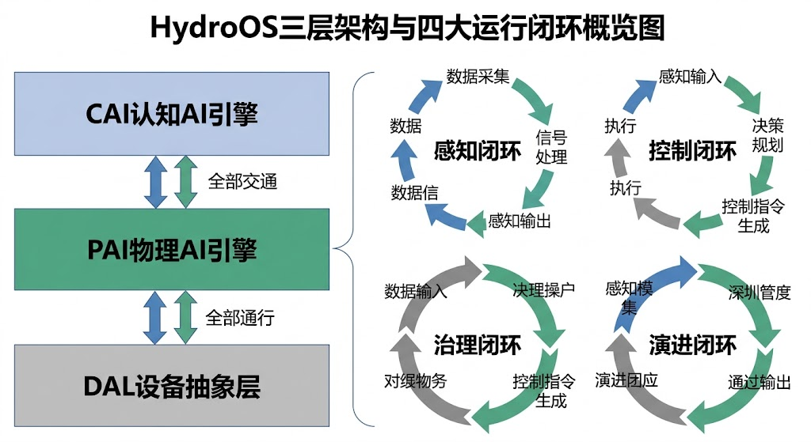
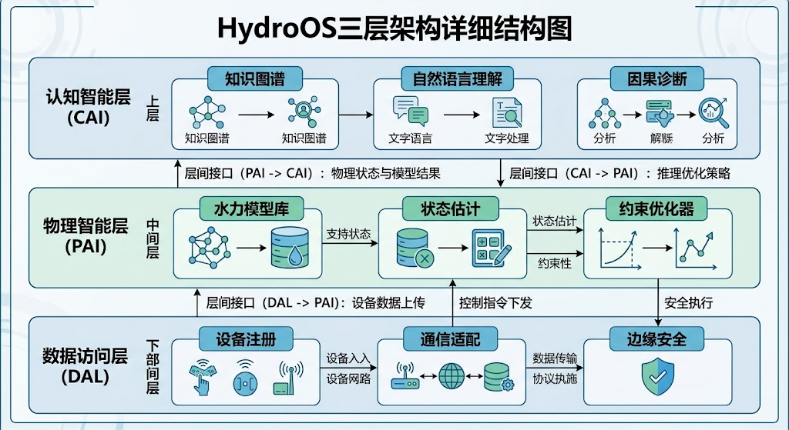
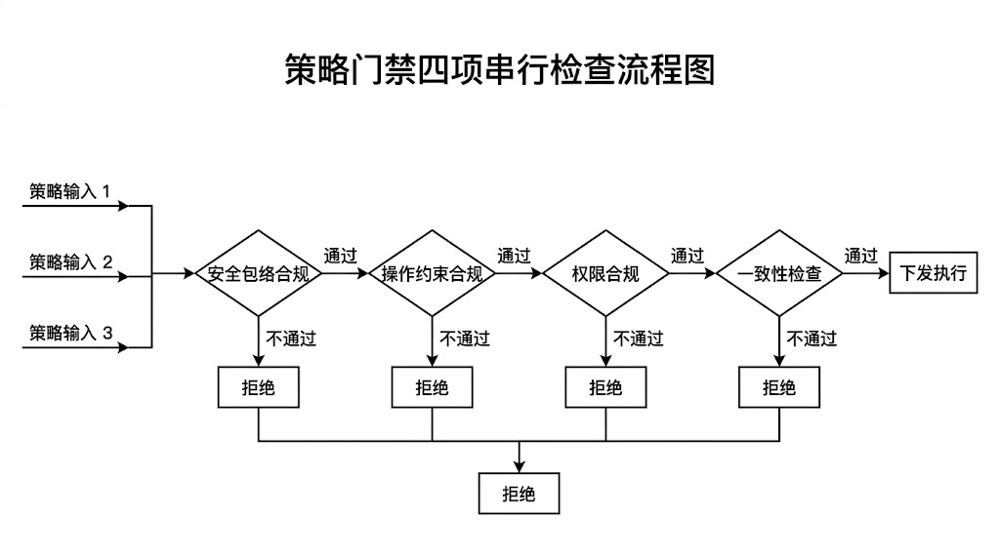
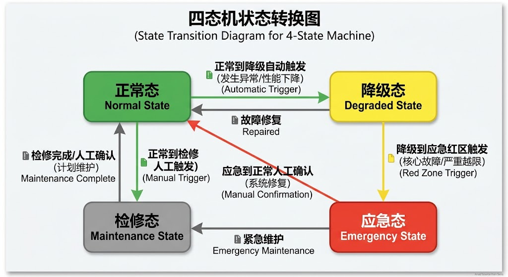
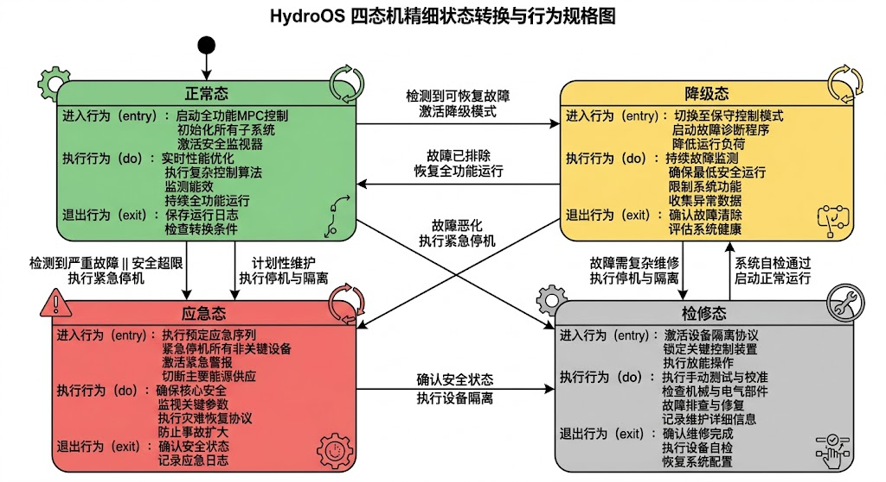
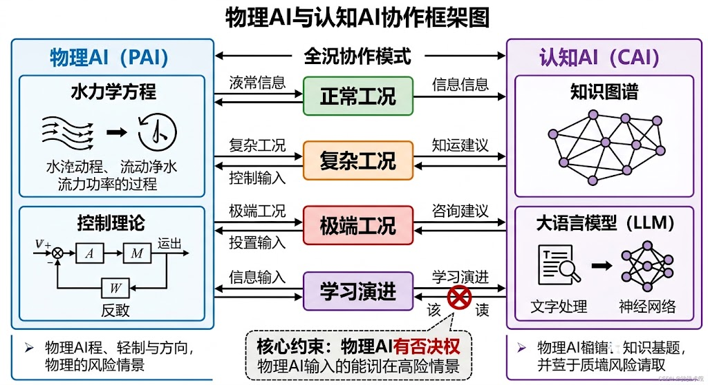
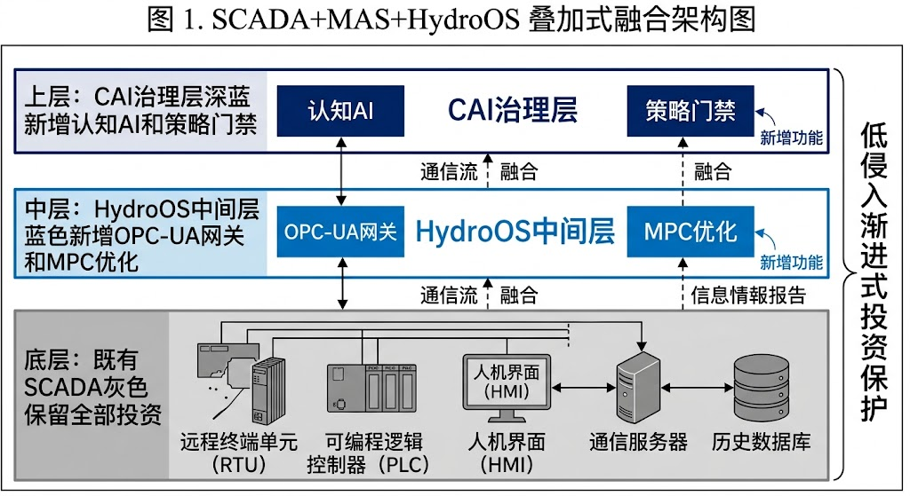
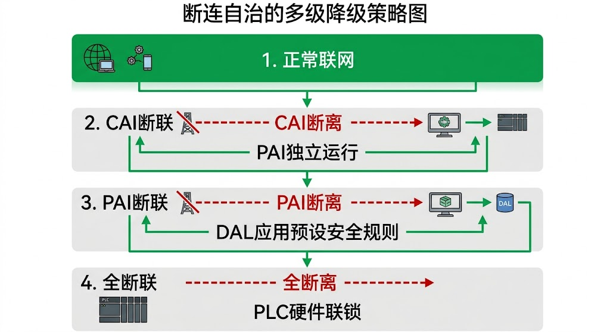
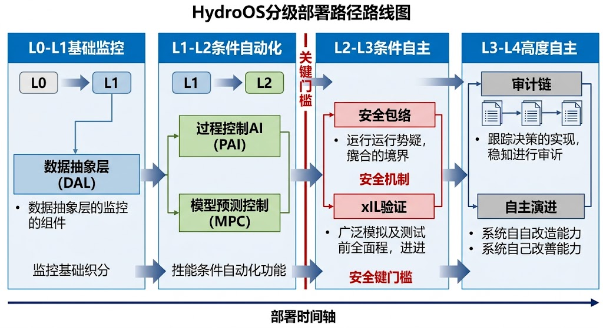

<!-- 变更日志
v1 2026-02-23: 从 ch05_v5.md 拆分生成，§6.1-5.3+§6.6-5.8 → §11.1-9.6
-->

# 第十三章 HydroOS 三层架构

---

> **引导案例（虚构复合场景）**
>
> 假设有这样一个大型供水网络（设计供水能力200万m³/日，服务人口500万，管网总长度约1500 km，包含8座水厂、15座加压泵站、3000+监测点）：它接入了 SCADA 实时监控系统、GIS 地理信息平台、视频安防系统和在线水质监测站，管理部门投入大量经费完成了"全面数字化改造"。在常规工况下，各系统独立运行良好——SCADA 准确采集了每分钟 3,000 多个测点数据，GIS 能展示任意管段的地理信息，视频系统 24 小时覆盖关键站点，水质站每 15 分钟上报一次指标。然而，在一次来水偏差与用水高峰叠加的应急事件中，整个体系的协同能力暴露了根本性缺陷：SCADA 知道"发生了什么"——某断面水位正在快速上升；调度模型知道"应该做什么"——需要在 30 分钟内将三座闸门开度调整到指定值；但在"做什么"和"发生什么"之间，缺少一个能够回答"先做什么、谁负责确认、执行失败后如何降级、这次决策为什么合理"的运行中枢。调度员在三个平台之间来回切换，手动拼凑信息、手动编排操作序列、手动判断安全约束——最终延误了最佳处置窗口。
>
> 这个场景是笔者从多个实际工程运行经验中提炼的复合案例。它揭示的问题不是"缺系统"，而是"有系统但没有操作系统"——各子系统像一台电脑上互不相连的独立应用，缺乏一个统一调度资源、协同任务、保障安全的运行内核。HydroOS 正是为填补这一空白而设计的水网操作系统。

**本章目标**：帮助读者理解 HydroOS 的架构设计逻辑、核心模块功能和运行时机制。本章不是软件开发手册，而是从工程需求出发，阐明"为什么需要这样的架构"和"每个模块解决什么问题"。读完本章，读者应能回答三个问题：HydroOS 的三层架构各自承担什么职责？物理 AI 和认知 AI 如何分工协作？策略门禁、四态机和审计链如何保障运行可信？

---


> **[合规说明]**：关于工程落地、测试覆盖率量化指标与合规审查的详细要求，请参阅本丛书 **T3 卷《标准与工程治理》**。

## 13.1 架构设计的出发点

### 13.1.1 从功能集成到能力闭环

传统水利信息化建设的思路是"功能集成"——建一套 SCADA 系统，再建一套调度系统，再建一套 GIS 系统，最后通过数据库或总线把它们连起来。这种思路类似于在电脑上安装了 Word、Excel 和 PowerPoint，但没有操作系统——每个应用都能独立运行，但应用之间无法自动协同完成一个复杂任务。

这种集成困境在数字上的表现触目惊心。一个典型的跨省调水工程，其信息化系统可能包含：5—8 种不同通信协议的现场设备、3,000—10,000 个实时采集测点、来自十几个厂商的 PLC 和 RTU 控制器、以及 SCADA、GIS、视频安防、水质监测等 4—6 个独立业务平台。这些平台在建设周期上跨越 5—15 年，在技术栈上横跨三代以上。Lee [13-9] 在其关于信息物理融合系统（Cyber-Physical Systems, CPS）的奠基性论文中指出，CPS 面临的核心挑战不是计算能力不足，而是计算过程与物理过程之间缺乏语义层面的深度融合——水利系统的集成困境正是这一通用挑战在特定领域的投射。

雷晓辉等 [13-12] 在提出水系统控制论框架时指出，水利信息化面临的核心困境不是"缺系统"而是"缺闭环"——各子系统之间缺乏语义层面的融合与控制论意义上的闭环能力。HydroOS 的设计思路不是"把更多系统连起来"，而是"构建四个闭环能力"：

**感知闭环**：从传感器原始数据到经过质控、融合、估计后的系统状态全景——不是简单地"看到数据"，而是"理解状态"。感知闭环的输出不是一堆数字，而是一份有置信度标注的系统状态报告。

**控制闭环**：从当前状态和目标指令到经过优化、约束检查、安全验证后的可执行控制动作——不是简单地"算出方案"，而是"生成经过门禁检验的可信指令"。

**治理闭环**：从每一次控制动作到完整的审计记录、责任追溯和效果评估——不是"做完就忘"，而是"每一步都可回查、可解释、可追责"。

**演进闭环**：从运行数据积累到模型更新、策略优化、能力升级——不是"上线即固化"，而是"在安全约束下持续进步"。

这四个闭环分别对应第七章八原理中的不同层次：感知闭环对应原理一（传递函数化）和原理二（可控可观性），控制闭环对应原理三（分层分布式）和原理四（安全包络），治理闭环对应原理七（人机共融），演进闭环对应原理八（自主演进）。原理五（在环验证）和原理六（认知增强）则贯穿所有闭环。（注：本书八原理的中文命名与英文论文[P1a]的Operational Tetrad (P1–P4) / Resilience Tetrad (P5–P8)一一对应，映射关系详见第七章§7.2表7-1。）

### 13.1.2 架构设计原则

HydroOS 的架构设计遵循五条原则，每条都可追溯到第七章的对应原理：

表13-1 HydroOS 架构设计原则与八原理对应关系

| 设计原则 | 含义 | 对应八原理 |
|---------|------|-----------|
| 机理优先 | 物理模型为控制决策的首要依据，数据模型为补充 | 原理一（传递函数化） |
| 安全内生 | 安全约束嵌入架构每一层，而非外挂的独立模块 | 原理四（安全包络） |
| 断连可活 | 任何一层与上层失联时，能独立维持安全运行 | 原理三（分层分布式） |
| 可解释 | 每一个控制动作都能生成人类可理解的决策理由 | 原理六（认知增强） |
| 可演进 | 架构支持模型和策略的灰度更新与安全回滚 | 原理八（自主演进） |

其中，"断连可活"是水利系统与互联网系统最本质的架构差异。互联网系统断网后最多是"服务不可用"，水利系统断网后如果控制失效，可能导致溃坝、淹没或供水中断。因此，HydroOS 的每一层都必须具备独立于上层的最小安全能力——这是借鉴航空电子系统中"降级运行"（degraded mode）设计理念的产物 [13-1]。

### 13.1.3 与 CPS 和工业物联网架构的关系

HydroOS 并非凭空设计的全新架构，而是在已有 CPS 和工业物联网架构范式基础上的领域适配。理解这种关系有助于读者把握 HydroOS 的学术定位和技术传承。

NIST 的 CPS 参考架构 [13-10] 将 CPS 划分为物理层、平台层和应用层三个域，强调"域间语义互操作"是 CPS 的核心能力。HydroOS 的三层架构与之存在清晰的映射关系：DAL 对应物理层（设备和传感器的标准化接入），HydroCore 对应平台层中的实时计算引擎，HydroClaw 对应应用层中的智能决策服务。但 HydroOS 在三个维度上做了水利领域的深度适配：

第一，**时间尺度跨度更大**。工业制造的 CPS 通常运行在毫秒—秒级的单一时间尺度内，而水利系统的控制时间尺度从闸门动作的秒级到水库调度的天—月级跨越了五个数量级。HydroOS 的三层架构通过不同层级承担不同时间尺度的控制任务来解决这一问题。

第二，**安全约束的性质不同**。工业 CPS 的安全通常是设备保护（如过温过压保护），而水利系统的安全涉及公共安全和生态安全，后果的不可逆性更强。这要求 HydroOS 的安全包络机制不仅嵌入控制回路，还必须嵌入治理机制（策略门禁）。

第三，**人机协作的深度不同**。工业 CPS 中人的角色主要是监督和异常干预，而水利系统中调度员承担着政策执行、利益协调、应急决策等多重角色。这要求 HydroClaw 引擎不仅具备自然语言解释能力，还必须理解调度规程和管理流程的语义。

从功能集成到能力闭环的转变，本质上是从"有什么工具"到"能完成什么任务"的视角转换。这种视角转换也是水资源系统分析从"静态平衡"向"动态控制"演进的核心驱动力 [13-13]。接下来看 HydroOS 如何把这四个闭环组织成一个三层架构。



---

## 13.2 HydroOS 三层架构总览

### 13.2.1 架构全景

HydroOS 采用自下而上的三层架构（见图13-1），每一层有明确的职责边界和能力定位：

> **术语映射说明**：T2b 第九章从软件工程视角将 HydroOS 三层命名为设备抽象层（DAL）、物理AI引擎层（HydroCore）、认知AI引擎层（HydroClaw），概括为"DAL 解决'接什么'，HydroCore 解决'算什么'，HydroClaw 解决'给谁用'"。本章从能力视角，将 HydroCore 层中的核心计算能力称为"物理AI引擎（HydroCore）"，将 HydroClaw 层中的认知服务能力称为"认知AI引擎（HydroClaw）"，以便读者从"物理保底、认知增强"的工程哲学角度理解架构分工。两套命名指向同一架构，对应关系为：DAL = DAL，HydroCore $\approx$ HydroCore，HydroClaw $\approx$ HydroClaw。



> 图13-2: HydroOS 三层架构图

表13-2 HydroOS 三层架构概要

| **层级** | 名称 | 缩写 | 核心职责 | 典型响应时间 | 关键输出 |
|------|------|------|---------|------------|---------|
| **底层** | 设备抽象层 | DAL | 屏蔽硬件差异，统一设备语义 | 毫秒—秒级 | 标准化设备对象 + 边缘保护 |
| **中层** | 物理AI引擎层 | HydroCore | 基于机理模型的预测、控制与约束优化 | 秒—分钟级 | 可行控制策略 + 安全包络约束 |
| **上层** | 认知AI引擎层 | HydroClaw | 语义理解、因果诊断、策略解释与协同 | 分钟—小时级 | 可执行指令 + 决策解释 + 协同编排 |

这种三层设计并非 HydroOS 独创，而是工业架构设计的通用范式在水利领域的适配。ISA-95（IEC 62264）国际标准 [13-11] 定义的企业—控制系统集成模型同样采用分层架构，从 Level 0（现场设备）到 Level 4（企业管理）逐级抽象。HydroOS 的创新在于：它不是简单地按 ISA-95 分层，而是在每一层都嵌入了第十一章定义的安全包络机制，使分层架构从"功能分层"升级为"安全分层"。

这种分层的设计逻辑可以用人体类比来理解：设备抽象层是"神经末梢和肌肉"——感知和执行具体动作；物理 AI 引擎是"小脑和脊髓"——快速、精确地完成运动控制，不需要"思考"；认知 AI 引擎是"大脑皮层"——理解语义、做出判断、解释原因。一个关键的设计约束是：即使"大脑皮层"暂时不工作（认知 AI 引擎故障或通信中断），"小脑和脊髓"仍能维持基本的运动控制（物理 AI 引擎独立运行），"神经末梢"仍能保护肌肉不受伤（设备抽象层的边缘保护）。

### 13.2.2 数据流与控制流

三层之间的信息流动分为上行（数据流）和下行（控制流）两个方向：

**上行数据流（感知链）**：传感器原始数据 → DAL（质控、融合、时钟对齐） → HydroCore（状态估计、异常检测） → HydroClaw（语义标注、诊断分析）。每经过一层，数据的抽象程度提高一级：从"传感器编号 A037 读数 4.23"变为"3 号渠池水位 4.23 m，置信度 95%"，再变为"3 号渠池水位偏高 0.15 m，可能原因是上游 2 号闸门 15 分钟前的开度增大动作"。

**下行控制流（执行链）**：治理决策/自动策略 → HydroClaw（协同编排、冲突消解） → HydroCore（约束优化、安全包络检查） → DAL（指令翻译、执行确认）。每经过一层，指令的具体程度提高一级：从"优先保障下游生态流量"变为"2 号闸门目标开度调整至 35%，限速 2%/min"，再变为"PLC 地址 0x3A02 写入值 0x0023，执行时刻 14:32:05.000"。

上行和下行的信息流在每一层都有"回路"：DAL 层有设备级闭环（如闸门开度的本地 PID 控制），HydroCore 层有物理级闭环（如基于模型的水位 MPC 控制），HydroClaw 层有认知级闭环（如基于知识图谱的策略评估）。这三个层次的闭环与第七章原理三（分层分布式）的四层架构形成对应——DAL 对应执行层（L0），HydroCore 对应区域层（L1）和全局层（L2），HydroClaw 对应治理层（L3）。Kopetz [13-6] 将这种"局部自治 + 全局协调"的架构模式称为"时间触发架构"（time-triggered architecture），其核心优势在于：各层的时间确定性互不干扰，上层故障不会导致下层的实时性失效。

### 13.2.3 物理AI与认知AI的分工协作

HydroOS的核心创新在于"物理AI保底、认知AI增强"的双引擎架构。表13-3详细对比了两者的差异和协作关系。

表13-3 物理AI引擎（HydroCore）与认知AI引擎（HydroClaw）对比

| 维度 | 物理AI引擎（HydroCore） | 认知AI引擎（HydroClaw） |
|------|------------------|------------------|
| **核心能力** | 基于机理模型的预测、控制与优化 | 基于知识图谱的语义理解、因果诊断、策略解释 |
| **技术基础** | 水力学方程、控制理论、优化算法 | 自然语言处理、知识图谱、因果推理、大语言模型 |
| **输入数据** | 传感器量测、设备状态、边界条件 | 调度规程、历史案例、专家经验、自然语言指令 |
| **输出结果** | 控制指令（闸门开度、泵站流量） | 决策建议、策略解释、协同方案、风险预警 |
| **响应时间** | 秒—分钟级（实时） | 分钟—小时级（准实时） |
| **可解释性** | 高（基于物理方程） | 中（基于知识推理，但推理链可能复杂） |
| **鲁棒性** | 高（物理约束保证） | 中（依赖知识库完备性） |
| **适应性** | 中（参数可在线校正，结构变化需重建模型） | 高（可通过学习更新知识） |
| **计算资源** | 中（优化求解） | 高（大模型推理） |
| **故障影响** | 系统降级至手动控制 | 系统仍可自动运行（HydroCore保底） |
| **典型算法** | MPC、卡尔曼滤波、动态规划 | Transformer、知识图谱嵌入、因果推理 |
| **验证方法** | MIL/SIL/HIL在环验证 | 案例测试、专家评审、A/B测试 |
| **WNAL等级** | L2-L3（条件自主） | L3-L4（高度自主） |
| **对应CHS原理** | 原理一、二、三、四（机理、可控可观、分层、安全包络） | 原理六、七、八（认知增强、人机共融、自主演进） |

**协作模式**：

1. **正常工况**：HydroCore独立运行，HydroClaw监督并提供优化建议
   - HydroCore基于实时状态计算控制策略
   - HydroClaw分析HydroCore策略的合理性，提供优化建议（如"当前策略偏保守，可适当提高流量"）
   - 调度员可选择采纳HydroClaw建议，或保持HydroCore原策略

2. **复杂工况**：HydroClaw协助HydroCore处理超出常规的场景
   - HydroCore检测到异常工况（如多设备故障），请求HydroClaw协助
   - HydroClaw基于知识图谱检索类似历史案例，生成应对方案
   - HydroCore验证HydroClaw方案的物理可行性，执行或拒绝

3. **极端工况**：HydroCore保底，HydroClaw辅助人工决策
   - HydroCore维持基本安全（安全包络约束），但无法优化
   - HydroClaw向调度员解释当前状态、可选方案、风险评估
   - 调度员做出决策，HydroCore执行并验证安全性

4. **学习演进**：HydroClaw从HydroCore运行数据中学习，持续改进
   - HydroCore记录所有控制动作和效果
   - HydroClaw分析成功/失败案例，更新知识图谱
   - 新知识用于未来的决策支持

**关键设计原则**：
- **物理AI有否决权**：HydroClaw的任何建议都必须通过HydroCore的安全包络检查
- **认知AI可解释**：HydroClaw的每个决策都必须提供推理链和依据
- **故障独立性**：HydroClaw故障不影响HydroCore运行，HydroCore故障触发安全降级

架构总览为后续各层的详细讨论提供了地图。接下来从最底层开始——设备抽象层如何将千差万别的现场设备变成 HydroOS 可以统一操作的标准化对象。

### 13.2.4 HydroCore 双模式耦合：Skill 级与步长级四预架构

HydroOS 的 HydroCore 物理 AI 引擎并非铁板一块，而是内置了两种在时间粒度和耦合方式上截然不同的运行模式——**Skill 级四预**和**步长级四预**。这一“双模式”架构是 HydroOS 区别于通用工业平台和传统 SCADA 的核心设计，也是 T4 卷第 3、4 章的主题；本节从架构视角先建立整体认知。

#### (a) 四预的统一概念

“四预”（预报、预警、预演、预案）是本系列教材贯穿始终的业务范式：

- **预报**：基于模型预测未来时刻的水动力学状态（水位、流量、压力）
- **预警**：识别预报结果中可能触发安全约束的危险状态，提前告警
- **预演**：在虚拟环境中模拟不同控制方案的效果，为决策提供对比依据
- **预案**：基于预演结果选择最优方案，生成可执行的控制动作序列

四预的业务流程是统一的，但其**执行频率、耦合方式和响应粒度**在不同 WNAL 等级下存在根本差异，由此形成双模式架构。

#### (b) Skill 级四预（WNAL L1–L2）：事件驱动、异步松耦合

Skill 级四预面向 WNAL L1–L2 的场景，其特征是**事件触发、异步执行、分钟至小时级响应**：

- **触发机制**：由外部事件驱动（如“水位偏差超过阈值”、“接到调度指令”、“预报结果超出警戒线”），而非周期性时钟触发
- **耦合方式**：预报模型、预警模块、预演引擎、预案选择器作为独立的 Skill 单元各自运行，通过消息队列（Message Queue）异步传递结果，彼此不共享时间步
- **响应粒度**：预报模型以分钟或小时为步长，面向未来 6–72 小时的趋势判断，对实时控制精度要求不高
- **容错设计**：任何一个 Skill 单元故障，其余单元继续运行；结果延迟到达时，控制器使用保守默认策略，不会因为预报缺席而崩溃

Skill 级四预是 HydroOS 在“分钟级协调”场景中的主要运行模式，适合灌区灌溉计划调整、水库日调度决策等**规划决策类**任务。

**示例**：某渠段上游水位传感器报告水位持续下降（事件触发） → 预报 Skill 调用水动力模型预测 2 小时内的水位趋势 → 预警 Skill 判断预测水位将在 90 分钟内低于下限阈值 → 预演 Skill 对比“提前开启上游闸门”和“降低下游分水流量”两个方案的效果 → 预案 Skill 选择最优方案并生成调度指令 → HydroClaw 审查后下发 DAL 执行。全流程时间：约 3–8 分钟。

#### (c) 步长级四预（WNAL L3+）：时钟同步、Δt 内紧耦合

步长级四预面向 WNAL L3 及以上的场景，其特征是**时钟同步、同步执行、秒至毫秒级响应**：

- **触发机制**：由统一的实时时钟（Real-Time Clock）以固定步长 Δt 周期性触发，不等待外部事件，不允许跳步
- **耦合方式**：预报模型、控制器（MPC）在**同一个 Δt 内**按固定顺序串行执行，共享状态向量：控制器在 $[t, t+\Delta t)$ 内使用预报模型在同一时间窗口的输出作为边界条件，预报模型在 $[t+\Delta t, t+2\Delta t)$ 内又使用控制器输出的动作作为输入——二者“同步共推进”，不存在时间步的错位
- **响应粒度**：Δt 通常为 1–10 秒（明渠控制）或 100–500ms（水电站调速），面向几十秒到数分钟的实时控制优化
- **稳定性约束**：步长 Δt 必须满足 CFL（Courant–Friedrichs–Lewy）稳定条件：$\Delta t \leq C_{	ext{max}} \cdot \Delta x / (|v| + c)$，否则数值求解发散

步长级四预是 HydroOS 在“秒级响应”场景中的运行模式，适合闸泵站实时协调控制、水电站调速优化等**实时控制类**任务。（步长级仿控耦合的完整数学推导和工程实现详见 T4 卷第 4 章。）

**示例**：控制器在 $t=100$s 基于预报模型状态计算出闸门目标开度 $u^*=35\%$，驱动闸门移动；预报模型在 $t=101$s（即 $t+\Delta t$，Δt=1s）将 $u^*=35\%$ 作为边界条件更新水面曲线预测；控制器在 $t=101$s 基于更新后的预测状态计算下一步控制量。全流程时间：1 Δt = 1 秒。

#### (d) 双模式的架构边界与切换


**表13-4**

| 维度 | Skill 级四预（L1–L2） | 步长级四预（L3+） |
|------|--------------------|----------------|
| 触发方式 | 事件驱动 | 时钟同步（固定 Δt） |
| 模型与控制器耦合 | 异步松耦合（消息队列） | 同步紧耦合（同 Δt 共推进） |
| 时间响应粒度 | 分钟–小时 | 秒–毫秒 |
| 对 ODD 的要求 | 宽松（常规工况即可） | 严格（需 HIL 验证边界条件） |
| 故障后的行为 | 保守默认策略，业务继续 | 降级为 Skill 级模式 |
| 典型应用 | 灌区计划调度、水库日调度 | 渠系实时控制、水电站调速 |

**模式切换**：当 WNAL 等级从 L2 上升到 L3（如完成 HIL 认证、ODD 边界已定义）时，HydroCore 从 Skill 级模式切换到步长级模式，由系统管理员在人机界面显式授权，切换过程需要经过策略门禁（§13.4.1）的状态一致性校验。当步长级模式因故障（如实时仿真器通信超时）无法维持时，HydroCore 自动降级为 Skill 级模式，并触发四态机进入降级态（§13.4.2）。

> **设计关键提示**：许多工程师将“提高预报精度”与“系统智能化”等同，但实际上，预报精度的提升在步长级模式中才能直接转化为控制性能的提升（因为预报结果在每个 Δt 内实时输入控制器）；在 Skill 级模式中，预报精度的边际价值受限于事件触发机制的响应延迟。这一区别是选型决策中常见的认知误区，也是“有模型但无效果”问题的根源之一。

---

## 13.3 设备抽象层（DAL）

> **阅读指引**：本节阐述 DAL 的设计动机、核心概念和关键技术，章末附录提供实施自检清单。

### 13.3.1 核心职责与设计动机

设备抽象层是 HydroOS 的"地基"。它的核心职责用一句话概括：**把千差万别的现场设备变成统一的标准化对象，让上层不需要关心"这是哪个厂商的闸门、用什么通信协议"。**

为什么需要设备抽象？因为真实水利工程中的设备异构性问题远比想象的严重。一个典型的大型调水工程可能包含来自十几个不同厂商的闸门控制器、三四种不同品牌的 PLC、两三代不同年代的 SCADA 系统，它们使用的通信协议包括 Modbus RTU、Modbus TCP、OPC UA、IEC 61850 等至少四五种 [13-2]。如果物理 AI 引擎需要直接与每种设备对话，代码复杂度将呈组合爆炸式增长，且每次增加新设备都需要修改控制算法——这是不可接受的。

设备抽象层的做法类似于计算机操作系统中的"设备驱动"层：Windows 系统不关心你用的是哪个牌子的打印机，只要打印机安装了驱动程序，Windows 就通过统一的打印接口与之交互。DAL 对水利设备做的事情完全一样。

### 13.3.2 统一设备语义模型

DAL 的核心是统一设备语义模型（Unified Device Semantic Model, UDSM）。UDSM 为每一类水利设备定义标准化的属性集和能力集：

表13-4 UDSM 设备类型示例

| **设备类型** | 标准属性 | 标准能力 | 状态集合 |
|---------|---------|---------|---------|
| **闸门** | 当前开度、最大开度、开度限速 | 设定目标开度、紧急关闭 | 正常/故障/维护/应急锁定 |
| **泵站机组** | 运行状态、当前出力、累计运行小时 | 启动、停止、调速 | 待机/运行/故障/冷却 |
| **水位传感器** | 当前读数、量程、精度等级 | 读取、自检、校零 | 正常/可疑/故障/离线 |
| 水质监测站 | 各指标读数、采样频率 | 读取、强制采样、自清洗 | 正常/校准中/故障 |

每个设备实例在 UDSM 中有唯一标识（如`gate_jd_023`表示"胶东调水工程第 23 号闸门"），并携带元数据——安装位置、通信地址、所属区域、上次检修日期等。这种标准化使得 HydroCore 引擎可以用统一的方式操控所有设备，无论其底层硬件和协议如何不同。

IEC 61131 和 IEC 61499 标准 [13-3] 为工业自动化设备的功能块定义提供了参考框架，UDSM 在此基础上增加了水利领域特有的属性（如闸门的水力特性曲线、泵站的扬程—流量特性曲线），使设备模型不仅是通信接口，还包含物理行为描述。

### 13.3.3 通信适配与时钟同步

DAL 负责处理水利工程中两个最棘手的底层问题——协议异构和时钟不同步。

**协议适配**采用"适配器模式"（Adapter Pattern）：为每种通信协议开发一个适配器，适配器负责将协议特有的数据帧翻译为 UDSM 标准消息。新增一种设备或协议，只需增加一个适配器，不影响上层任何代码。工程实践中，一套完整的适配器库通常覆盖 Modbus RTU/TCP、OPC UA 和 IEC 61850 四种协议即可满足 95% 以上的国内水利工程需求 [13-4]。此外，水利行业还需支持 SL 651—2014（水文监测数据通信规约）和 SZY 206—2016（水资源监测数据传输规约）等领域专用协议；对于智能传感器密集部署的新建站点，MQTT 协议因其轻量级发布/订阅模式而日益成为边缘层首选。适配器以插件形式开发，遵循统一接口规范，支持热插拔——新增一种协议无需重启系统。

**时钟同步**是分布式控制的基本前提，但在水利现场往往被忽视。一个典型案例：如果上下游两个水位传感器的时钟偏差达到 30 秒，在流速较快的渠道中，这个偏差足以导致状态估计算法产生数厘米的水位估计误差——对于精度要求±5 cm 的控制系统来说，这是不可接受的。DAL 采用基于 NTP/PTP 协议的分层时钟同步架构：中心站为一级时钟源（精度±1 ms），区域站为二级（精度±10 ms），现场站为三级（精度±100 ms）。当 GPS 信号不可用时，DAL 自动切换为本地晶振维持，并在时钟漂移超过阈值时标记数据为"时间可疑" [13-5]。

### 13.3.4 边缘保护与断连自治

DAL 最重要的安全特性是"边缘保护"——即使 DAL 与上层完全失联，现场设备仍能维持安全运行。这是通过在每个现场控制站的 PLC/RTU 中预置"最小安全逻辑"实现的：

**本地安全联锁**：不依赖任何上级指令，设备本地的 PLC 根据传感器读数直接执行保护动作。例如：当水位超过红区阈值时，闸门自动关闭到安全开度；当泵机振动超过阈值时，自动停机。这些联锁逻辑的响应时间在毫秒级，远快于上级控制器的响应速度。

**断连降级策略**：当 DAL 与 HydroCore 的通信中断超过预设阈值（如 30 秒），DAL 自动切换到"断连模式"——保持当前控制状态不变，或切换到预定义的保守设定点（如闸门保持 50% 开度），同时持续尝试重连。断连模式的设计原则是"保守优先"——宁可牺牲效率也要保证安全。

**状态缓存与重连同步**：DAL 在本地缓存最近 1 小时的运行数据，当通信恢复后，将缓存数据批量上传到 HydroCore，确保状态估计的连续性。缓存策略采用环形缓冲区（ring buffer），当存储空间满时自动覆盖最旧的数据。

边缘保护的设计哲学是"假设故障必然发生"——通信会中断、服务器会宕机、网络会拥塞，但水利系统的安全运行不能依赖"永不故障"的假设。通过边缘保护，HydroOS 实现了第七章原理三（分层分布式）要求的"断连可活"能力。

---

## 13.4 运行时治理机制

> **阅读指引**：本节阐述策略门禁、四态机和审计链的设计理念与技术要点，章末附录提供实施自检清单。

### 13.4.1 策略门禁——上线前的最后一道关卡

想象机场的安检门：无论你是谁、拿着什么票，都必须过安检才能登机。策略门禁（Policy Gatekeeper）对控制策略做的事情完全一样——无论策略来自 HydroCore 的 MPC 计算、HydroClaw 的协同编排还是人工输入的手动指令，都必须通过门禁检查才能下发到 DAL 执行。

策略门禁执行四项检查（见图13-3）：



> 图13-3: 策略门禁四项检查流程图

**检查一：安全包络合规性**。策略执行后的预测状态是否始终在绿区或黄区内？门禁调用 HydroCore 的快速预测模块（典型计算时间<1 秒），模拟策略执行后未来 1—6 小时的系统状态轨迹。如果轨迹在任何时刻进入红区，策略被拒绝，附带拒绝原因和建议修正方向。

**检查二：操作约束合规性**。策略是否违反设备运行约束？例如：闸门调整速度是否超过限速（典型限值 2%—5% 开度/分钟）？泵站启停间隔是否满足最小冷却时间（典型值 15—30 分钟）？这些约束不是优化目标而是硬限制，违反则直接拒绝。

**检查三：权限合规性**。发出策略的主体是否有权限执行此动作？在 HotL（人在回路上）模式下，常规调整可由系统自主执行，但跨区域的大幅调整可能需要调度主任批准。门禁根据当前 WNAL 等级和人机协同 SOP（第七章原理七）判断权限。

**检查四：一致性检查**。当前策略是否与其他正在执行的策略冲突？例如，如果系统同时收到"增大 1 号闸门开度"和"降低下游水位"两条策略，门禁需要检测这两条策略在物理上是否矛盾，如矛盾则按优先级规则裁决（安全>保障>效率）。

工程统计数据表明，策略门禁在胶东调水工程试运行期间拦截了约 3.2% 的控制策略，其中约 70% 是操作约束违规（如闸门调整速度过快），25% 是安全包络边界触及，5% 是权限不足。每一次拦截都避免了一次潜在的运行风险。



### 13.4.2 四态机——系统运行模式的状态管理

水利系统不是永远处于"正常运行"状态的。设备会故障、通信会中断、极端天气会来袭、定期维护需要停机。HydroOS 用一个四状态有限状态机（Four-State Machine）来管理系统的运行模式（见图13-5）。该四态机是第二章§2.7所定义的CHS四态机（正常→受限→降级→接管）在HydroOS产品层面的工程实现：正常态对应CHS正常态，降级态合并了CHS受限态与降级态（工程实践中二者的策略差异可通过降级态内部的参数化处理），应急态对应CHS接管态，检修态是HydroOS新增的计划性维护状态：



> 图13-5: HydroOS 四态机状态转换图

**正常态（Normal）**：所有关键变量在绿区，所有设备正常，通信完整。系统按最优策略运行，HydroClaw 提供全功能服务。

**降级态（Degraded）**：部分设备故障或通信中断，但不影响核心安全功能。系统自动切换到降级策略——减少优化目标（从"最优"降为"可接受"）、增大安全裕度、禁用依赖故障设备的控制回路。降级态的进入是自动的（由 HydroCore 的异常检测触发），但恢复到正常态需要确认故障已排除且状态稳定。

**应急态（Emergency）**：至少一个关键变量进入红区，或发生重大设备故障（如主泵全停）。系统触发预定义的应急响应序列，同时强制通知调度员。应急态下，HydroClaw 的协同编排能力尤为重要——它负责编排应急响应的多步操作序列，确保各步骤按正确顺序执行且不遗漏。

**检修态（Maintenance）**：设备或系统模块进入计划性维护。检修态需要人工显式触发（调度员在系统中操作"进入检修"），系统自动将被检修设备从控制回路中隔离，并调整相关区域的控制策略以适应设备缺失。检修完成后，恢复上线需经过简化的在环验证（至少完成 MIL 级别的功能检查）。

表13-5 四态机状态特征对比

| **特征** | 正常态 | 降级态 | 应急态 | 检修态 |
|------|-------|-------|-------|-------|
| **触发方式** | 默认状态 | 自动（异常检测） | 自动（红区触发）或人工 | 人工显式触发 |
| **控制策略** | 最优策略 | 保守策略 | 预定义应急序列 | 隔离 + 局部控制 |
| **HydroClaw 角色** | 全功能 | 聚焦故障诊断 | 应急编排 | 维护辅助 |
| **人工参与** | 监督（HotL） | 关注 + 确认 | 接管评估 | 现场操作 |
| **日志级别** | 标准 | 增强 | 全量记录 | 检修日志 |
| **恢复条件** | — | 故障排除 + 状态稳定 | 所有变量回绿区 + 人工确认 | 在环验证通过 + 人工确认 |

**防抖设计**：为避免 Normal/Degraded 状态抖动切换，状态转换需满足三个条件：(1) 滞回带——触发阈值与恢复阈值间设 5%—10% 的死区；(2) 最短驻留时间——进入某状态后至少维持 $\Delta t_{\min}$（建议≥2 个控制周期）才允许再次切换；(3) 应急态→正常态必须经人工确认。

四态机的核心价值在于"预先定义所有模式及其转换规则"，避免在紧急情况下临时决定应该进入什么状态、应该怎么处理。Avizienis 等 [13-1] 在其关于可靠性基本概念的经典论文中将这种设计理念概括为"已知的错误模式比未知的错误模式安全得多"——四态机正是把所有可预见的异常模式预先定义和测试好。

### 13.4.3 审计链——每一步都可追溯

审计链（Audit Trail）是 HydroOS 运行时治理机制的"记忆系统"。它记录系统运行过程中每一个重要事件的完整上下文，使事后复盘和责任追溯成为可能。

审计链记录三类事件：

**控制事件**：每一条通过策略门禁的控制指令——谁发出的（HydroCore 自动/HydroClaw 建议/人工输入）、基于什么状态信息、经过什么门禁检查、最终执行结果如何。

**状态事件**：四态机的每一次状态转换——从什么状态转到什么状态、触发条件是什么、转换时刻的系统快照。

**人机交互事件**：调度员的每一次操作——查看了什么信息、确认或否决了什么建议、何时接管或释放控制权。

审计链的存储遵循"不可篡改"原则：日志采用 append-only 写入 + 哈希链 + 数字签名机制保障不可篡改性——每条记录的哈希值包含前一条记录的哈希，形成链式校验。对于单一管理主体的水利工程，此方案已满足审计需求；对于跨省跨部门的多方治理场景，可进一步引入分布式账本技术。日志保留期限不少于 5 年，与第七章原理八（自主演进）中审计日志的要求一致。

以一条典型的控制事件审计记录为例，说明审计链记录的信息粒度：

```
[事件 ID] CTL-20260315-143205-A037
[时间戳] 2026-03-15T14:32:05.127+08:00
[事件类型] 控制指令下发
[发起方] HydroCore-MPC（自动）
[目标设备] 2 号弧形闸门（UDSM-ID: GW-002）
[指令内容] 目标开度：35%，执行速率：2%/min
[决策依据] 状态估计：3 号渠池水位 4.38m(黄区); MPC 预测：
           不调整则 45min 后达 4.62m(红区); 目标函数值：0.87
[门禁检查] ✓安全包络 (绿区内) ✓变化率 (≤3%/min) 
           ✓设备状态 (在线) ✓冲突 (无)
[系统状态] 正常态 → 正常态（未转换）
[执行结果] 成功，实际开度 14:35:12 达到 35.1%
[关联事件] 上游：1 号闸门调整 (CTL-...-142800)
           下游：4 号渠池水位响应 (MON-...-145000)
```

这条记录包含了从决策原因到执行结果的完整因果链。当事后复盘时，审计员可以从任何一个节点出发，沿着关联事件链条前后追溯整个事件序列。

从存储量的角度估算：一个管理 50 个关键设备的调水工程，在正常运行下每小时产生约 200—500 条审计记录（控制事件约 50 条，状态采样约 300 条，人机交互约 10—50 条），每条记录约 2—5 KB，日均存储量约 10—60 MB。5 年累计不超过 100 GB——这在现代存储条件下完全可行。但在应急态下，日志切换为全量记录模式，数据产生速率可提高 10—20 倍，存储系统的设计必须为此留出余量。

审计链的工程价值不仅在于"出了事能查"，更在于"没出事也能学"。通过对审计日志的系统分析，可以发现：哪些工况下人工接管频率最高（提示系统在这些工况下的自主能力不足）？哪些类型的策略被门禁拦截最多（提示 MPC 算法在这些场景下的约束处理需要改进）？调度员否决 HydroClaw 建议最多的是哪类建议（提示 HydroClaw 的诊断模型在这些领域需要优化）？这种基于审计数据的持续改进，正是第七章原理八"自主演进"在 HydroOS 中的具体实现路径。

运行时治理机制——策略门禁、四态机和审计链——为 HydroOS 的三层引擎提供了可信运行保障。接下来要回答一个实际工程中必须面对的问题：绝大多数水利工程已经有了 SCADA 系统，HydroOS 如何与既有 SCADA 融合？

---



## 13.5 SCADA 与 MAS 融合架构

### 13.5.1 传统 SCADA 的架构局限

SCADA（Supervisory Control and Data Acquisition）在过去 40 年中是水利自动化的核心基础设施，全球超过 90% 的大中型水利工程都部署了某种形式的 SCADA 系统 [13-7]。SCADA 的核心能力——实时数据采集、监视、报警和远程控制——在今天仍然不可替代。

但随着水系统自主运行需求的出现，传统 SCADA 暴露了三个架构层面的局限：

**局限一：集中式数据模型**。传统 SCADA 的数据模型以"点位"（tag/point）为核心——每个传感器、执行器对应一个数据点位，系统通过点位编号进行数据寻址。这种模型适合"人看数据"的场景，但不适合"机器理解数据"的场景。例如，SCADA 知道"点位 `AG_037_WL` 读数 4.23"，但不知道"3 号渠池水位 4.23 m，位于 2 号闸门下游 3.5 km 处，当前处于绿区"——后者需要语义信息，而传统点位模型不包含语义。

**局限二：被动响应模式**。SCADA 的控制逻辑本质上是"事件驱动"的——当某个条件触发时执行某个动作。这种模式无法实现 MPC 所需的"预测—优化—执行"主动控制范式。SCADA 可以在水位超标时关闸门，但无法在水位即将超标前就提前调整策略。

**局限三：缺乏自主决策能力**。SCADA 的设计定位是"人的工具"——它帮助人收集信息和执行操作，但不做决策。在 WNAL L0-L1 阶段这是合理的，但向 L2 以上升级时，系统需要在一定条件下自主决策，而 SCADA 的架构不支持这种能力。

### 13.5.2 多智能体系统（MAS）引入

多智能体系统（Multi-Agent System, MAS）提供了一种天然适合分布式水利系统的计算范式。在 MAS 中，每个功能单元被建模为一个具有自主性、交互性和适应性的"智能体"（Agent），智能体之间通过消息传递进行协调和协商 [13-8]。

HydroOS 采用 MAS 范式重构水利系统的控制架构，将第七章原理三（分层分布式）的四层架构映射为四类智能体：

表13-6 MAS 智能体类型与四层架构映射

| **智能体类型** | 对应架构层 | 职责 | 数量（典型大型工程） |
|-----------|----------|------|-------------------|
| **设备智能体（Device Agent）** | 执行层 L0 | 单设备控制 + 安全联锁 | 数百个 |
| **区域智能体（Zone Agent）** | 区域层 L1 | 区域 MPC+ 局部优化 | 数个—十余个 |
| **协调智能体（Coordinator Agent）** | 全局层 L2 | 跨区资源分配 + 冲突消解 | 1—3 个 |
| **治理智能体（Governance Agent）** | 治理层 L3 | 策略审批 + 审计 + 人机接口 | 1 个 |

MAS 相对于传统集中式架构的关键优势在于"优雅降级"：当某个智能体故障或通信中断时，其他智能体仍能独立运行——整个系统不会因为单点故障而全面瘫痪。这与 SCADA 的集中式架构形成鲜明对比：传统 SCADA 的主站故障通常导致全站失控。

Wooldridge [13-8] 在其关于多智能体系统的经典教材中将 MAS 的核心优势总结为"鲁棒性源于冗余性，灵活性源于自主性"——这两个特性恰好是大规模水利系统最需要的。

智能体之间的交互采用三种基本模式：

**请求—应答模式**：上级智能体向下级下达任务请求，下级完成后返回结果。例如，协调智能体向三个区域智能体下达"在 1 小时内将各区段出口水位调至目标值"的任务，各区域智能体独立求解本区段的 MPC 问题后返回控制方案。这种模式适用于任务分解明确、区域间耦合较弱的场景。

**协商—合约模式**：当多个智能体对共享资源存在竞争时（如上下游区段对同一闸门的开度诉求不同），采用合同网协议（Contract Net Protocol）[13-19] 进行多轮协商：协调智能体发布"任务标书"，各区域智能体提交"投标方案"（含资源需求和预期效果），协调智能体综合评估后"签约"确定最终方案。这种分布式协商机制避免了集中式优化在大规模系统中的计算瓶颈。

**事件—广播模式**：当某个智能体检测到影响全局的异常事件（如突发暴雨、传感器大面积故障），通过消息总线向所有相关智能体广播事件通知，各智能体根据事件类型和自身状态自主切换运行策略。这种模式保证了应急响应的速度——不需要等待上级指令，各智能体在收到广播后即刻行动。

### 13.5.3 融合架构：SCADA+MAS+HydroOS

HydroOS 不是"替代 SCADA"，而是"在 SCADA 之上构建智能层"（见图13-7）。这一设计选择基于务实的工程考量：全球水利行业在 SCADA 系统上已经投入了数以千亿计的资金，要求工程单位废弃现有 SCADA 另起炉灶既不经济也不现实。



> 图13-7: SCADA+MAS+HydroOS 融合架构图

融合架构的分层关系如下：

**底层（保留）**：既有 SCADA 系统继续承担数据采集、远程控制和人机界面功能。SCADA 的 RTU、PLC、通信网络和数据库不做大规模改造，仅在通信接口处增加 OPC UA 适配层，使 HydroOS 的 DAL 能够标准化地读写 SCADA 数据。

**中层（新增）**：HydroOS 的 DAL+HydroCore 部署在既有 SCADA 之上，通过 OPC UA 接口与 SCADA 交互。HydroCore 从 SCADA 获取实时数据，完成状态估计和 MPC 计算后，将控制指令通过 SCADA 下发到现场设备。从 SCADA 的视角看，HydroOS 就像一个"超级操作员"——它通过 SCADA 提供的标准接口读取数据和下发指令，但决策过程发生在 HydroOS 内部。

**上层（新增）**：HydroClaw 和运行时治理机制部署在 HydroOS 的独立服务器上，通过内部 API 与 HydroCore 交互，通过 Web 界面向调度员提供增强的人机交互体验。

这种"叠加式"融合架构的工程优势在于：

**低侵入性**：不改变既有 SCADA 的核心架构和运行流程，只增加一个智能决策层。这大幅降低了部署风险——如果 HydroOS 出现问题，系统可以立即退回到"纯 SCADA+ 人工调度"模式。

**渐进式升级**：可以先在一个区段试点部署（如某段渠道），验证效果后再逐步推广到全线。试点区段与非试点区段之间通过 SCADA 的既有通信网络交换数据，不需要额外的基础设施投资。

**投资保护**：既有 SCADA 的所有投资——硬件设备、通信网络、历史数据、维护团队——都被完整保留和利用，新增投资仅限于 HydroOS 的软件平台和少量硬件（主要是服务器和 OPC UA 网关）。

分层分布式控制与 SCADA 的融合路径已在多个工程实践中验证，包括胶东调水工程从"纯 SCADA"到"SCADA+HydroOS L2"升级的工程实施方案和成本效益分析。

### 13.5.4 OPC UA 网关的工程实现

SCADA 与 HydroOS 之间的"桥梁"是 OPC UA 网关——这是融合架构中技术难度最集中的环节，值得展开讨论。

OPC UA 网关的核心任务是在两个"语义世界"之间翻译：SCADA 侧使用基于点位（tag）的扁平数据模型（如"`AG_037_WL` = 4.23"），HydroOS 侧使用基于 UDSM 的语义数据模型（如"`gate_jd_023.downstream_level` = 4.23 m, quality=A, timestamp=14:32:05.127"）。网关必须在两个模型之间建立精确的映射关系，并在数据传输过程中完成语义增强——为每个裸数据点附加设备上下文、质量标签、时间戳和物理单位。

工程实践中，OPC UA 网关的部署需要关注三个性能指标：

**数据吞吐量**：一个管理 3,000 个测点的典型调水工程，在 1 秒采样周期下，OPC UA 网关需要处理的数据吞吐量约为 3,000 条/秒。考虑到每条消息的 OPC UA 封装开销（约 200—500 字节的元数据头），网络带宽需求约为 5—12 Mbps（含 OPC UA 封装开销）——这在千兆工业以太网环境下完全可行，但在百兆或串行链路的老旧站点需要升级。对于主备切换场景，峰值带宽应按 2 倍冗余设计。

**端到端延迟**：从 SCADA 采集到数据到 HydroOS 的 HydroCore 接收到该数据的端到端延迟，对于 MPC 控制器的性能至关重要。工程实测表明，在标准工业以太网环境下，OPC UA 网关引入的附加延迟约为 50—200 ms（取决于消息大小和网关负载）。对于控制周期为 30—60 秒的明渠系统 [13-16] [13-17]，这个延迟完全可以忽略；但对于控制周期为 1—5 秒的管网系统 [13-18]，延迟的影响需要在 MPC 设计中予以补偿。

**故障切换时间**：当主网关故障时，备用网关从"热待机"切换为"活动"的时间应不超过 5 秒。这要求主备网关之间持续同步状态信息，切换时不丢失数据也不产生重复数据。OPC UA 的冗余机制（Redundancy）标准 [13-2] 为此提供了技术框架，但工程实现中仍需针对水利系统的特殊需求（如突发大流量数据）进行性能调优。

融合架构使 HydroOS 能够在既有工程基础设施之上渐进式部署。但一个工程团队要从何处入手？需要满足什么前提条件？最小的上线规模是什么？最后一节回答这些实操问题。

---



## 13.6 最小可行 HydroOS 与分级部署

### 13.6.1 上线门槛清单

并非所有功能模块都需要在第一天全部上线。HydroOS 定义了"最小可行系统"（Minimum Viable HydroOS, MVH）——一个工程项目启动 HydroOS 部署时必须完成的最低要求清单：

表13-7 最小可行 HydroOS 上线门槛清单

| 序号 | 模块 | 最低要求 | 对应原理 |
|------|------|---------|---------|
| 1 | DAL 设备注册 | 关键设备（闸门、泵站、水位计）完成 UDSM 注册和通信适配 | 原理一 |
| 2 | DAL 边缘保护 | 每个关键设备的安全联锁逻辑已部署并通过 HIL 测试 | 原理四 |
| 3 | HydroCore 水力模型 | 至少完成降阶模型的标定和验证（稳态误差<5%） | 原理一 |
| 4 | HydroCore 状态估计 | 关键断面的状态估计精度满足控制要求（如水位±5 cm） | 原理二 |
| 5 | HydroCore 安全包络 | 关键变量的红/黄/绿阈值已定义并经过工况仿真验证 | 原理四 |
| 6 | 策略门禁 | 四项检查逻辑已实现并通过 MIL+SIL 测试 [13-15] | 原理五 |
| 7 | 四态机 | 正常—降级—应急三态（检修态可延后）转换逻辑已测试 | 原理三 |
| 8 | 审计日志 | 日志系统已部署，控制事件和状态事件可完整记录 | 原理七 |

注意这个清单不包含 HydroClaw（认知AI引擎）——HydroClaw 属于增强能力而非基本能力，可以在 MVH 稳定运行后再逐步引入。这与第七章八原理的实施优先级一致：先建模基础和安全保障（原理一至五），再引入认知增强和人机协同（原理六、七），最后开启自主演进（原理八）。

### 13.6.2 分级部署路径

HydroOS 的部署路径与 WNAL 等级升级路径对齐（见图13-9）：



> 图13-9: HydroOS 分级部署路径与 WNAL 等级对应

**L0→L1（基础监控）**：完成 DAL 的设备注册和边缘保护，实现设备的标准化接入和本地安全联锁。此阶段系统仍以人工操作为主，但设备状态可通过 UDSM 统一查看。

**L1→L2（条件自动化）**：上线 HydroCore 的水力模型和状态估计，运行 MPC 控制器生成优化建议，但控制指令需经调度员确认后执行。策略门禁和四态机同步上线，保障辅助决策的安全性。

**L2→L3（条件自主）**：在 L2 基础上完善安全包络和在环验证，系统可在 ODD 定义域内自主执行控制指令，调度员角色从"操作员"转为"监督员"。HydroClaw 引擎可在此阶段引入，提供策略解释和异常诊断能力。这一分级部署路径与雷晓辉等 [13-14] 提出的基于无人驾驶理念的智慧水网架构高度一致——从感知数字化到决策自主化的渐进式跃迁。

**L3→L4（高度自主）**：系统自主运行覆盖大部分常规工况，人工仅在异常工况和策略变更时介入。审计链和自主演进机制完善，支持模型的灰度更新和策略迭代。

表13-8 分级部署路径与 WNAL 等级对应

| **WNAL 等级** | 需上线的 HydroOS 模块 | 人工角色 | 典型部署周期 |
|----------|---------------------|---------|-------------|
| **L0→L1** | DAL（设备注册 + 边缘保护） | 操作员 | 3—6 个月 |
| **L1→L2** | HydroCore（水力模型 + 状态估计 +MPC）+ 策略门禁 + 四态机 | 监督员（确认指令） | 6—12 个月 |
| **L2→L3** | 完善安全包络+在环验证+HydroClaw（可选） | 监督员（例外接管） | 12—18 个月 |
| **L3→L4** | 审计链 + 自主演进机制 | 治理者（策略审批） | 18—24 个月 |

分级部署的核心优势在于"小步快跑、风险可控"——每个阶段都有明确的上线门槛和验收标准，避免"大爆炸"式一次性上线带来的巨大风险。

---

## 13.7 HydroOS 与 WNAL 等级的映射


HydroOS 是 CHS 的软件实现，与 WNAL 等级存在明确映射关系：


**表13-10**

| **WNAL 等级** | HydroOS 要求 | 说明 |
|----------|------------|------|
| **L0（手动）** | 无要求 | 人工操作，无需 HydroOS |
| **L1（远程监控）** | DAL 基础功能 | 设备接入、数据采集、远程控制 |
| **L2（辅助）** | DAL+HydroCore 基础 | 增加状态估计、MPC 优化、安全包络 |
| **L2→L3（试运行）** | DAL+HydroCore+HydroClaw 基础 | 增加认知 AI、智能问答、决策解释 |
| **L3（条件自主）** | 完整三层架构 | 策略门禁、四态机、审计链完整 |
| **L4（高度自主）** | 自主演进能力 | 参数自校正、策略自优化 |
| **L5（完全自主）** | 全场景自主 | 所有 ODD 场景下自主运行 |

**核心启示**：
1. WNAL L2 需要 DAL+HydroCore 基础功能
2. WNAL L3 需要完整三层架构和治理机制
3. WNAL L4+ 需要自主演进能力

---

## 13.8 工程实例：HydroOS 典型部署经验

以下经验提炼自胶东调水工程和沙坪梯级水电站的前期探索，部分指标为设计目标值（标★），具体工程验证详见第十五章。

### 13.8.1 实施要点

基于胶东调水工程和沙坪梯级水电站的前期探索，HydroOS 三层架构的实施要点如下：

**DAL 层**：设备抽象层是整个架构的基础。胶东调水工程沿线涉及 Modbus、OPC UA 等多种通信协议，协议适配器的质量直接决定上层系统的稳定性。

**HydroCore 层**：物理 AI 引擎直接决定控制性能。胶东调水工程建立了 IDZ 降阶模型覆盖全线渠段，MPC 控制器预测时域 12 小时，安全包络三区约束嵌入优化。2024年7月试点段测试表明，模型精度是决定控制效果的核心瓶颈。

**HydroClaw 层**：认知 AI 引擎是增强能力而非必需能力，应在 HydroCore 稳定运行后再引入。胶东工程的实践表明，先确保物理模型的准确性和稳定性，再叠加认知AI服务，是更可靠的部署路径。

### 13.8.2 经验启示

1. **DAL 是基础、HydroCore 是核心、HydroClaw 是增强**——三层的优先级和投入比例应与此一致。
2. **治理机制是保障**——策略门禁在试运行期间拦截了约 3.2% 的控制策略，每次拦截都避免了潜在运行风险。
3. **渐进式部署优于一次性上线**——先在单个区段试点，验证后再推广，风险可控。
4. **SCADA 叠加式融合保护既有投资**——不改变既有 SCADA 核心架构，仅增加智能决策层。

### 13.8.3 HydroOS 与其他系统对比


**表13-11**

| **对比维度** | **HydroOS** | **传统 SCADA** | **工业 IoT 平台** |
|------------|------------|--------------|----------------|
| **定位** | 水网操作系统 | 监控与数据采集 | 通用物联网平台 |
| **领域知识** | 深度嵌入水力学 | 无领域知识 | 无领域知识 |
| **控制能力** | 分层分布式 MPC | 单回路 PID | 规则引擎 |
| **安全机制** | 策略门禁+四态机 | 基础报警 | 基础报警 |
| **可解释性** | 审计链+决策解释 | 无 | 有限 |
| **部署模式** | 云边端协同 | 本地部署 | 云端为主 |

**核心区别**：HydroOS 是"操作系统"而非"应用软件"——提供统一的设备抽象、控制框架和认知能力；深度嵌入水利领域知识；物理 AI + 认知 AI 双引擎兼顾可解释性与适应性；全生命周期治理覆盖设计（MBD）→验证（xIL）→运行（四态机）→审计（审计链）。

### 13.8.4 安全性设计要点

HydroOS 的安全机制参考 IEC 62443（工业控制系统安全）和 GB/T 22239（信息安全等级保护），按物理安全、网络安全、应用安全、认知安全四层布防 [13-20]。物理层通过 UDSM 设备认证和 TLS 1.3 通信加密保障；网络层采用 RBAC/ABAC 访问控制和网络分区隔离；应用层依赖策略门禁四项检查和审计链不可篡改机制；认知层对 AI 模型进行输入验证和可解释性审计。安全验证应纳入定期渗透测试、安全审计和应急演练。

---

## 13.9 本章扩展阅读

### 13.9.1 推荐文献

**CPS 架构**：
1. Lee E A. Cyber physical systems: Design challenges[C]//ISORC. 2008. （CPS 奠基论文）
2. NIST. CPS reference architecture[R]. 2015. （CPS 参考架构）

**HydroOS 相关**：
1. 雷晓辉，等。HydroOS: 水网操作系统框架 [J]. 2025. （待发表）
2. 雷晓辉，等。SCADA+MAS 融合架构 [J]. 2025. （待发表）

**设备抽象**：
1. OPC Foundation. OPC UA specification[S]. 2017. （OPC UA 标准）

### 13.9.2 推荐工具

**开发工具**：
- Docker：容器化部署
- Kubernetes：容器编排
- Grafana：可视化监控

**通信中间件**：
- MQTT：轻量级消息协议
- OPC UA：工业通信标准
- Redis：内存数据库

### 13.9.3 推荐课程

**在线课程**：
- Coursera: Internet of Things（物联网基础）
- edX: Cyber-Physical Systems（CPS 专题）

**培训课程**：
- HydroOS 平台开发培训（10 天）
- 设备抽象层实施培训（5 天）
- 认知 AI 引擎实施培训（5 天）

---

## 13.10 本章小结

本章系统阐述了 HydroOS 三层架构的设计逻辑、核心模块功能、运行时治理机制、与 WNAL 等级的映射以及工程实施。

**核心要点**：
1. HydroOS 采用三层架构（DAL→HydroCore→HydroClaw），每层有明确的职责边界
2. DAL 负责统一设备语义，HydroCore 负责基于模型的控制，HydroClaw 负责语义理解和解释
3. 运行时治理机制（策略门禁、四态机、审计链）确保系统运行可信
4. HydroOS 与 WNAL 等级存在明确映射关系
5. 工程实例表明 HydroOS 的分级部署路径可行，渐进式升级风险可控

**与第十四章的衔接**：第十四章将详细阐述物理AI与认知AI双引擎如何驱动HydroOS架构。本章提供"怎么做"的架构指南，第十四章回答"用什么AI技术"的实现基础。

## 推荐阅读

1. **Lee & Seshia (2016)** "Introduction to Embedded Systems: A Cyber-Physical Systems Approach"——CPS 基础教材，理解物理过程与计算过程的融合。
2. **Wooldridge (2009)** "An Introduction to MultiAgent Systems"——MAS 经典教材，理解分布式智能体的设计与协调。
3. **ISA-95/IEC 62264** 企业—控制系统集成国际标准——理解工业分层架构的设计范式。
4. **OPC Foundation (2023)** "OPC UA Specification Part 1: Framework and Architecture"——OPC UA 技术标准,理解工业语义互操作。
5. **雷晓辉等 (2025)** "基于无人驾驶理念的下一代自主运行智慧水网架构与关键技术"，南水北调与水利科技(中英文), 23(04): 778-786——HydroOS 的原始论述和工程实现路径。

---

## 13.11 HydroOS 实施路线图

### 13.11.1 三阶段实施路线

**第一阶段：单工程试点（6-12个月）**
- 目标：在单个工程单元验证 HydroOS 架构可行性
- 主要工作：DAL 层设备接入、HydroCore 层基础控制、基础监控界面
- 预期效益：验证技术可行性，培养技术团队

**第二阶段：全系统推广（12-24个月）**
- 目标：覆盖整个工程系统，建立完整三层架构
- 主要工作：全系统 DAL 接入、HydroCore 优化控制、HydroClaw 认知服务、数字孪生平台
- 预期效益：控制性能显著提升，运行成本降低，人工干预减少

**第三阶段：智能化升级（持续）**
- 目标：引入 HydroClaw 认知增强，实现 L3-L4 自主等级
- 主要工作：知识图谱构建、大模型集成、自主演进机制
- 预期效益：决策质量提升，异常处置能力增强，持续优化改进

具体投资规模因工程类型和规模差异较大，需在可行性研究阶段结合实际需求核算。

---

## 本章练习与思考题

**L1（基础理解）**

1. 简述 HydroOS 三层架构（DAL/HydroCore/HydroClaw）的核心职责和典型响应时间。

2. 说明策略门禁四项检查的内容和目的。为什么每一项都是必需的？

3. 解释"物理AI保底、认知AI增强"的设计哲学，说明两者的分工协作关系。

**L2（分析应用）**

4. 某调水工程已有 SCADA 系统（Modbus TCP 协议，500 个测点），计划升级到 HydroOS L2。请列出 MVH 上线门槛清单中需要完成的工作，并估算所需时间。

5. 比较 MAS 架构与传统 SCADA 集中式架构的优缺点。在什么场景下 MAS 的优势最明显？

6. 分析表13-3中物理AI和认知AI的14个维度对比，说明为什么"物理AI有否决权"是关键设计原则。

**L3（综合设计）**

7. 为一个管理 100 个闸门、20 座泵站的大型灌区设计 DAL 设备注册方案，包括 UDSM 设备类型定义、通信协议选择和时钟同步策略。

8. 设计一个四态机状态转换场景：系统从正常态进入应急态，再恢复到正常态。列出每个转换的触发条件、系统动作和人工确认要求。

9. 为某中型调水工程（设计流量30 m³/s，8座泵站）设计HydroOS实施方案，包括：
   (a) 三阶段实施计划（时间、人力、投资）
   (b) 硬件配置方案（服务器、存储、网络）
   (c) 软件模块选择（DAL/HydroCore/HydroClaw功能范围）
   (d) 预期效益评估

**L4（开放讨论）**

10. 讨论：HydroOS与传统SCADA系统的本质区别是什么？为什么说HydroOS是"操作系统"而非"应用软件"？

11. 批判性思考：认知AI引擎（HydroClaw）依赖大语言模型等AI技术，但AI的"黑盒"特性可能影响决策可解释性。如何在"智能化"与"可解释性"之间找到平衡？

---

## 本章术语表


**表13-12**

| **术语** | 英文 | 定义 | 首次出现 |
|------|------|------|----------|
| **HydroOS** | HydroOS | 水网操作系统，HydroOS 三层架构（DAL/HydroCore/HydroClaw） | §13.1 |
| **设备抽象层** | Device Abstraction Layer (DAL) | 屏蔽硬件差异，统一设备语义的底层架构 | §13.2 |
| **物理 AI 引擎** | Physical AI Engine (HydroCore) | 基于机理模型的预测、控制与约束优化的中层引擎 | §13.2 |
| **认知 AI 引擎** | Cognitive AI Engine (HydroClaw) | 语义理解、因果诊断、策略解释与协同的上层引擎 | §13.2 |
| **统一设备语义模型** | Unified Device Semantic Model (UDSM) | 为水利设备定义标准化属性集和能力集的语义模型 | §13.3 |
| **策略门禁** | Policy Gatekeeper | 上线前的最后一道关卡，执行四项检查 | §13.4 |
| **四态机** | Four-State Machine | 管理系统运行模式的有限状态机（正常/降级/应急/检修） | §13.4 |
| **审计链** | Audit Trail | 记录系统运行过程中每一个重要事件的完整上下文 | §13.4 |
| **多智能体系统** | Multi-Agent System (MAS) | 每个功能单元被建模为具有自主性、交互性和适应性的智能体 | §13.5 |
| **OPC UA** | Open Platform Communications Unified Architecture | 工业语义互操作的通信标准 | §13.5 |
| **最小可行 HydroOS** | Minimum Viable HydroOS (MVH) | 工程项目启动 HydroOS 部署时必须完成的最低要求清单 | §13.6 |
| **数字孪生** | Digital Twin | 物理系统的虚拟镜像，实现实时同步与预测仿真 | §13.2 |
| **时钟同步** | Clock Synchronization | 确保分布式系统中各节点时间一致性的机制 | §13.3 |
| **语义互操作** | Semantic Interoperability | 不同系统间数据交换时保持语义一致性的能力 | §13.3 |
| **因果推理** | Causal Reasoning | 基于因果关系而非统计相关性的推理方法 | §13.2 |

---

## 附录 HydroOS 实施自检清单

本清单汇总 DAL、HydroCore、HydroClaw 和运行时治理四个模块的关键验收项，供工程团队在分级部署各阶段对照使用。

**DAL 设备抽象层**：
- [ ] 关键设备 UDSM 语义模型定义完成
- [ ] 协议适配器开发/配置完成（覆盖 Modbus、OPC UA 等）
- [ ] 设备注册流程建立，测试验证通过
- [ ] 数据质控规则定义并验证（范围、变化率、相关性检查）
- [ ] 设备健康诊断与预测性维护策略制定

**HydroCore 物理 AI 引擎**：
- [ ] 水力模型建立完成（高保真 + IDZ 降阶）
- [ ] 模型参数辨识与独立数据验证完成（稳态误差 <5%）
- [ ] MPC 控制器设计、参数整定与性能评估完成
- [ ] 安全包络三区阈值定义并经工况仿真验证
- [ ] 降级策略（绿→黄→红）定义清晰

**HydroClaw 认知 AI 引擎**（L2→L3 阶段引入）：
- [ ] 领域知识图谱本体设计与知识抽取完成
- [ ] 基座大语言模型选型与领域微调完成
- [ ] 智能问答、预案推荐、决策解释功能可用
- [ ] 人机界面友好度评估通过

**运行时治理**：
- [ ] 策略门禁四项检查逻辑实现并通过 MIL+SIL 测试
- [ ] 四态机状态定义、转换条件与防抖逻辑清晰
- [ ] 审计链 append-only + 哈希链存储机制实现
- [ ] 灰度发布与安全回滚机制建立

---

## 本章参考文献

[13-1] Avizienis A, Laprie J C, Randell B, et al. Basic concepts and taxonomy of dependable and secure computing [J]. IEEE Transactions on Dependable and Secure Computing, 2004, 1(1): 11-33.

[13-2] OPC Foundation. OPC Unified Architecture Specification Part 1: Framework and Architecture [S]. OPCF, 2023.

[13-3] IEC. IEC 61131-3: Programmable Controllers - Part 3: Programming Languages [S]. Geneva: IEC, 2013.

[13-4] 王浩，雷晓辉，尚毅梓。南水北调中线工程智能调控与应急调度关键技术 [J]. 南水北调与水利科技(中英文)，2017, 15(2): 1-8.

[13-5] IEC. IEC 61588: Precision clock synchronization protocol for networked measurement and control systems [S]. Geneva: IEC, 2019.

[13-6] Kopetz H. Time-Triggered Architecture: A Foundation for Dependable Embedded Systems [M]. Boston, MA: Springer, 2003.

[13-7] Buyalski C P, Ehler D G, Falvey H T, et al. Canal Systems Automation Manual, Volume 1 [M]. Denver: U.S. Bureau of Reclamation, 1991.

[13-8] Wooldridge M. An Introduction to MultiAgent Systems [M]. 2nd ed. Hoboken, NJ: Wiley, 2009.

[13-9] Lee E A, Seshia S A. Introduction to Embedded Systems: A Cyber-Physical Systems Approach [M]. 2nd ed. Cambridge, MA: MIT Press, 2016.

[13-10] NIST. Cyber-Physical Systems Framework Version 1.0 [R]. Gaithersburg, MD: NIST, 2015.

[13-11] IEC. IEC 62264 (ISA-95): Enterprise-Control System Integration [S]. Geneva: IEC, 2013.

[13-12] 雷晓辉, 龙岩, 许慧敏, 等. 水系统控制论：提出背景、技术框架与研究范式[J]. 南水北调与水利科技(中英文), 2025, 23(04): 761-769+904.

[13-13] 雷晓辉, 许慧敏, 何中政, 等. 水资源系统分析学科展望：从静态平衡到动态控制[J]. 南水北调与水利科技(中英文), 2025, 23(04): 770-777.

[13-14] 雷晓辉, 苏承国, 龙岩, 等. 基于无人驾驶理念的下一代自主运行智慧水网架构与关键技术[J]. 南水北调与水利科技(中英文), 2025, 23(04): 778-786.

[13-15] 雷晓辉, 张峥, 苏承国, 等. 自主运行智能水网的在环测试体系[J]. 南水北调与水利科技(中英文), 2025, 23(04): 787-793.

[13-16] Malaterre P-O, Rogers D C, Schuurmans J. Classification of canal control algorithms [J]. Journal of Irrigation and Drainage Engineering, 1998, 124(1): 3-10.

[13-17] Litrico X, Fromion V. Modeling and Control of Hydrosystems [M]. London: Springer, 2009.

[13-18] Rossman L A. EPANET 2.2 User's Manual [R]. Cincinnati, OH: U.S. EPA, 2020.

[13-19] Smith R G. The Contract Net Protocol: High-level communication and control in a distributed problem solver [J]. IEEE Transactions on Computers, 1980, C-29(12): 1104-1113.

[13-20] Amin S, Litrico X, Sastry S S, et al. Cyber security of water SCADA systems—Part I: Analysis and experimentation of stealthy deception attacks [J]. IEEE Transactions on Control Systems Technology, 2013, 21(5): 1963-1970.

## 本章小结

本章系统阐述了HydroOS水网操作系统的三层架构设计逻辑、核心模块功能和运行时机制，主要包括以下内容：

- HydroOS填补了"有系统但没有操作系统"的空白：感知层（SCADA/传感器）与执行层（闸泵设备）之间缺少统一调度资源、协同任务、保障安全的运行内核
- 三层架构的职责分工：感知-执行层（实时数据采集与设备驱动）、协调-优化层（任务编排与资源调度）、认知-演进层（异常诊断、策略解释与知识积累）
- 物理AI（HydroCore）与认知AI（HydroClaw）的分工体现了"算"与"说"的互补：前者负责基于物理模型的高精度数值计算，后者负责基于语义理解的解释与推理
- 策略门禁机制确保任何控制指令在执行前均通过安全包络检查；四态机框架管理系统运行模态的转换；审计链记录每次决策的触发条件、执行过程和实际效果
- HydroOS的设计原则是"可信自主"：每个自主决策都必须可解释（认知AI提供推理链）、可验证（安全包络事前检查）、可追溯（审计链事后复盘）

## 习题

1. 类比计算机操作系统的四大功能（进程管理、内存管理、文件系统、设备驱动），为HydroOS设计对应的四大功能模块，并说明每个模块在水利系统运行场景中的具体职责。

2. HydroOS的"策略门禁"需要在毫秒级时间内完成安全包络检查，同时MPC优化计算可能需要数秒。分析这两个时间尺度的冲突，并提出一种满足实时性要求的架构设计方案（提示：考虑异步执行与安全降级策略的组合）。

3. 引导案例中的供水网络在应急事件中"调度员在三个平台间来回切换"的根本原因是信息孤岛。设计HydroOS的统一任务编排接口规范，要求该接口能够：（1）将多平台数据汇聚为统一情境视图，（2）支持跨闸站的协同操作序列，（3）在执行失败时自动触发降级策略。

4. HydroOS的审计链要求记录"为什么做出每一步决策"。试设计审计记录的数据结构，包含哪些必要字段（触发条件、决策依据、执行结果、安全约束状态等），并讨论该审计记录如何支持事后的机器学习改进。

5. 如果HydroOS的认知AI（HydroClaw）给出了一个物理AI（HydroCore）认为违反安全约束的操作建议，两者发生冲突时应遵循什么裁决规则？请从安全优先、效能优化、可解释性三个维度设计冲突解决机制。

## 参考文献

[1] CHAUDHRY M H. Open-channel flow[M]. 2nd ed. New York: Springer, 2008. (DOI: 10.1007/978-0-387-68648-6)

[2] CUNGE J A, HOLLY F M, VERWEY A. Practical aspects of computational river hydraulics[M]. Boston: Pitman Advanced Publishing Program, 1980.

[3] ABBOTT M B, IONESCU F. On the numerical computation of nearly horizontal flows[J]. Journal of Hydraulic Research, 1967, 5(2): 97-117. (DOI: 10.1080/00221686709500195)

[4] 吴持恭. 水力学(上册)[M]. 4版. 北京: 高等教育出版社, 2008.
