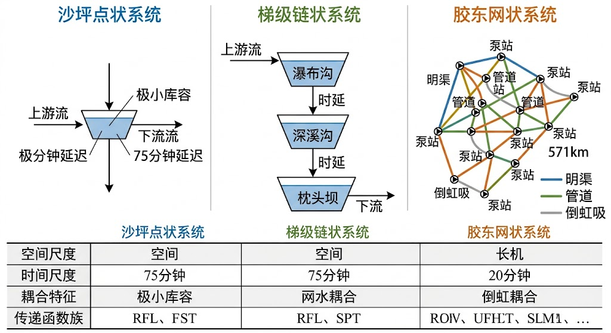
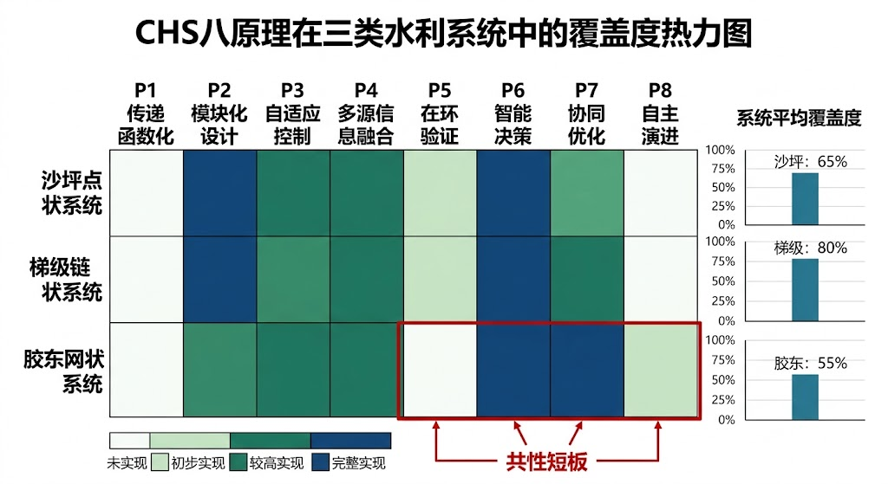

<!-- 变更日志
v1 2026-04-10: 排版统一与格式规范化
-->
# 第十五章　理论验证、研究展望与结语

## 本章学习目标

完成本章后，你应能够：

1. **总结**水系统控制策略从仿真验证到工程落地的关键评估指标与流程；
2. **复现**典型工程验证案例中的建模、控制实现与性能对比步骤；
3. **实施**软件在环、硬件在环或半实物在环测试，并解释测试结果的可信度边界；
4. **诊断**验证过程中模型失配、传感误差与执行器约束导致的性能退化原因；
5. **展望**数据驱动控制、数字孪生与自主运行等研究前沿在水系统中的应用路径。

---

> 理论的价值在于解释已知并预测未知。本章以三个不同拓扑结构的工程案例检验前十四章建立的理论体系，展望 CHS 学科的研究前沿，并对全书作结。

---

## 15.1　理论验证概览：从点到链到网

### 15.1.1　"点—链—网"验证框架

一个声称具有普适性的理论体系，必须在结构差异显著的多类系统上得到检验。水系统控制论的八条原理（第七章）、统一传递函数族（第四章、第九章）和 WNAL 分级体系（第十章）均基于"结构同构性"假设——即不同拓扑的水系统共享相同的控制论骨架 [15-2]。为验证这一假设，作者团队在三类典型水系统上进行了系统性工程实践：

- **点状系统**：大渡河沙坪二级水电站（单站枢纽，调节库容极小）[15-5]
- **链状系统**：大渡河瀑布沟-深溪沟-枕头坝梯级水电站（三站串联，水力电力双重耦合）[15-6][15-7]
- **网状系统**：山东胶东调水工程（跨流域长距离输水，571 km，13 级泵站，95 个闸站）[15-8]

三类系统在空间尺度、时间约束、耦合维度和控制目标上差异巨大（表 15-1），但均可纳入 CHS 六元受控系统框架 $\Sigma = (P, A, S, D, C, O)$，八条原理在每类系统中均有明确的工程对应物。这正是结构同构性命题（第四章命题 1）的经验证据。

> 图 15-1: 点—链—网三类验证案例拓扑对比。左：沙坪（点状，单站枢纽）；中：瀑深枕（链状，三站串联）；右：胶东调水（网状，跨流域管网）。

> 三个案例的完整工程细节将分别在本丛书 T2a 卷《水系统物理 AI：建模、控制与在环验证》的相应章节中详细展开。本节聚焦于 CHS 原理层面的验证结论。

**表 15-1　三类验证案例的基本特征对比**

| 维度 | 沙坪（点） | 瀑深枕梯级（链） | 胶东调水（网） |
|------|-----------|----------------|-------------|
| **空间尺度** | 单站，河道 ~5 km | 三站串联，~60 km | 全线 571 km，39 个分水口 |
| **核心约束** | 极小库容（38 万 m³） | 站间水力电力耦合 | 多源多目标多工况 |
| **主导时间尺度** | 秒—分钟（发电调频） | 分钟—小时（梯级协调） | 小时—旬（调水调度） |
| **传递函数族** | Family α 积分型 | Family α + 站间时延 | Family α（明渠）+ 管道模型 |
| **控制架构** | 单站 MPC + 安全包络 | 梯级 EDC + 站级 AGC | 三层 HDC（旬/日/分钟） |
| **主要执行器** | 泄洪闸 + 水轮机导叶 | 三站水轮机组 | 泵站 + 节制闸 |

### 15.1.2　验证案例一：沙坪水电站——时间约束驱动的控制设计

沙坪二级水电站是大渡河梯级末级电站，调节库容仅 38 万 m³，上游来流突变后水库不到 14 分钟即可蓄满。这一极端物理约束将 CHS 八原理的工程必要性暴露得最为彻底：

**P1（传递函数化）** 的验证最为直接——枕头坝-沙坪区间的 IDZ 传递函数模型[15-10]精确刻画了 75~85 分钟的水力时延 [15-5]，使前馈控制的提前量设定有了定量依据。时延估计误差超过±15 分钟，前馈策略即系统性失效。

**P4（安全包络）**[15-12] 在沙坪的实现是绿/黄/红三区水位边界，与 P1 的时延模型联动：安全包络预警系统在枕头坝出库数据更新的瞬间即可推算出进入黄区的时刻，提前 75 分钟触发预案。2019 年汛期实测中，水位最高越限量控制在 0.12 m 以内。

**P5（在环验证）** 通过 MIL→SIL 渐进测试发现了现场调试难以暴露的数值稳定性问题和极端工况下的模式切换缺陷 [15-4]。

**WNAL 评估**（各维度 0~5 分，评估方法详见第十章§10.3）：改造后沙坪在感知维度达到 L3 水平，综合五维度均值 2.4 分，处于 L2-L3 过渡阶段。主要短板在验证覆盖度——极端工况的 xIL 测试尚未系统完成。

### 15.1.3　验证案例二：大渡河梯级——架构缺陷暴露的协调需求

2012 年深溪沟 AGC 停用事件是 CHS 原理三（分层分布式控制）的经典反面案例：三站各自部署独立 AGC，缺少全局协调层，导致局部最优无法汇聚为全局最优。2018 年投运的瀑深枕梯级 EDC 系统是对此架构缺陷的系统性修复 [15-6]。

**P3（分层分布式控制）** 的验证意义最为深刻——EDC 引入梯级协调层后，三站 WNAL 等级从 L1~L2（均值 1.2 分）跃迁至稳定 L3（均值 2.8 分）。这一跃迁的根本原因不是算法升级，而是架构改进——增加了全局协调层。这印证了 CHS 理论的一个核心判断：**架构改进比算法升级更具杠杆效应**。

**P1（传递函数化）** 在链状系统表现为站间水力时延的精确建模。瀑布沟至深溪沟约 100 分钟、深溪沟至枕头坝约 85 分钟的传播时延，决定了 EDC 预见期的下界和时序补偿策略的参数。

**P4（安全包络）** 的链状特殊性在于约束传播：枕头坝出力的骤变经 75~85 分钟传播后影响末级沙坪——沙坪的水位安全约束必须作为梯级 EDC 优化问题的边界条件。这揭示了链状系统安全设计的一般规律：**末级约束向上游传播**。

### 15.1.4　验证案例三：胶东调水——网状系统的维数挑战

胶东调水工程全长 571 km，涵盖明渠、管道、倒虹吸和平衡池等多种水力元件，呈现"五多"特征：多源、多目标、多约束、多工况、多尺度。2024 年 7 月 8 日，60 km 明渠试点段完成首次全自动停水操作，最大水位偏差仅 5 cm，全程无人工干预 [15-8]。

**P3（分层分布式控制）**[15-11] 的实现最为完整：旬水量调度（全局优化）→日调度（渠段协调）→分钟级实时调控（单闸精确执行）[15-15][15-16]，三层结构在时间和空间两个维度上完整对应。

**P5（在环验证）** 的实践最为系统：2023 年 11 月至 2024 年 7 月共四批次 8 轮现场测试，控制精度从 0.1-0.3 m 量级跃升至 1-9 cm 量级 [15-4][15-8]。每轮测试形成正式问题清单并驱动参数率定、模型重构和软件升级，是在环验证方法论的工程范本。

**P6（认知增强）** 的首次完整落地：部署 CV 大模型无人机巡检（效率提升 24 倍）、VMD+CNN 泵站健康诊断、LLM 认知 AI 引擎自然语言交互——三类 AI 技术与物理模型形成清晰的角色分工。

**WNAL 评估**：明渠试点段达 L3 水平，全线综合 2.6 分，处于 L2-L3 过渡。验证层（L2）仍是最大短板。

### 15.1.5　三案例的共性规律

从三个结构迥异的案例中，可归纳出以下跨系统共性规律：

**规律一：验证层是普遍短板。** 三案例的 WNAL 评估均显示验证维度得分最低（沙坪、梯级和胶东概莫能外）。这提示系统性 xIL 验证体系的缺失是全行业水网自主运行升级的共性瓶颈 [15-3][15-4]，而非个别工程的特殊问题。

**规律二：架构决定天花板，算法决定地板。** 沙坪的困境源于物理时间约束（需要快速算法），梯级的困境源于架构缺陷（需要协调层），胶东的困境源于维数爆炸（需要分层分解）。三种困境的解决路径不同，但共同指向一个结论：控制架构的合理性比控制算法的精巧性更具决定性。

**规律三：八原理的覆盖度与系统复杂度正相关。** 点状系统主要依赖 P1-P2（建模）和 P4（安全），链状系统必须增加 P3（协调），网状系统则需要 P1-P8 全覆盖（表 15-2）。这并非巧合，而是因为系统复杂度的增加会激活更多的控制论约束，需要更多原理来应对。

**表 15-2　CHS 八原理在三类系统中的覆盖度**

| 原理 | 沙坪（点） | 梯级（链） | 胶东（网） |
|------|-----------|-----------|-----------|
| P1 传递函数化 | ● 核心 | ● 核心 | ● 核心 |
| P2 可控可观性 | ● | ● | ● |
| P3 分层分布式 | ○ 单层 | ● 关键突破 | ● 三层完整 |
| P4 安全包络 | ● 核心 | ● 约束传播 | ● 多层约束 |
| P5 在环验证 | ◐ 部分 | ◐ 部分 | ● 四批次完整 |
| P6 认知增强 | ○ 未部署 | ○ 未部署 | ● 首次落地 |
| P7 人机共融 | ◐ 审批制 | ◐ 审批制 | ● 多模态交互 |
| P8 自主演进 | ◐ 在线辨识 | ○ 离线率定 | ◐ 迭代升级 |

注：● 完整实现　◐ 部分实现　○ 未实现或单层简化

> 图 15-2: CHS 八原理在三类系统中的覆盖度热力图。颜色越深表示实现程度越高，验证层（P5）在三类系统中均为短板。

---

## 15.2　研究展望

### 15.2.1　物理 AI 与认知 AI 的演进路线

第十四章描述的 HydroCore-HydroClaw 双引擎架构代表了当前技术前沿，但仍处于快速演化之中。

**近期（2025-2027）**：工具驱动模式。HydroCore 以 MPC 为核心[15-14]，HydroClaw 以提示工程+RAG 为主要范式，双引擎通过"提出-验证-执行"（PVE）三步协议协同。这是当前可工程化的最高水平。

**中期（2028-2030）**：Agent 自主模式。HydroClaw 从"工具调用"演进为"自主规划"——接收高层目标后自动分解子任务、调用工具、检查结果。HydroCore 引入持续学习机制，无需停机即可从新数据更新模型参数。关键挑战是 LLM 推理可靠性的验证。

**远期（2031+）**：HydroCore-HydroClaw 融合。大型科学基础模型[15-19]同时处理物理方程约束和自然语言指令，双引擎功能边界模糊化。数字孪生技术[15-13]将成为 HydroCore-HydroClaw 融合的核心载体。但设备抽象层（DAL）的角色将长期稳定——物理接口无法被大模型替代。

### 15.2.2　从 WNAL L2 到 L3 的关键跨越

三个验证案例均处于 L2-L3 过渡带，这并非巧合——L2→L3 是水系统自主运行的关键分水岭 [15-9]：

- **L2（辅助控制）**：系统提供建议，人工确认后执行
- **L3（条件自主）**：系统在验证过的 ODD 内自主执行，人工监督

跨越这一分水岭需要同时满足四重门槛（第十章）：技术能力、验证覆盖度、治理机制完备性和持续运行验证。当前实践表明，**验证门槛是最难跨越的**——它要求对 ODD 边界内的所有典型工况和代表性极端工况均完成系统性 xIL 测试，而国内水利行业尚无成熟的 xIL 测试标准和第三方评估机制。

### 15.2.3　开放问题与研究前沿

以下问题构成 CHS 学科的活跃研究前沿：

1. **ODD 的形式化定义与自动扩展**。当前 ODD 边界由工程师手工划定，缺少自动化的 ODD 边界识别和扩展机制。如何让系统在运行中自主发现"我还能安全运行的新工况"？
2. **跨系统迁移学习**。沙坪的 IDZ 模型参数能否直接迁移到其他极小库容电站？梯级 EDC 架构能否迁移到其他河流梯级？迁移条件是什么？
3. **多 Agent 系统的涌现行为**[15-17]。当大量 Agent 在水网中并行运行时，局部最优策略的叠加是否会产生不可预测的全局涌现行为？如何设计安全的涌现控制机制？
4. **认知 AI 的可靠性验证**。LLM 的"幻觉"问题在安全关键的水系统中可能造成严重后果[15-18][15-19]。PVE 机制是否足以拦截所有错误推理？需要什么样的形式化验证方法？
5. **水系统控制论的学科边界**。CHS 与传统水文学、水资源规划、水利工程学的学科关系如何界定？如何避免"控制论帝国主义"——用控制论框架强行解释所有水问题？
6. **WNAL L4-L5 的理论基础**。当前理论主要支撑 L2-L3 实践，L4（高度自主）和 L5（完全自主）需要什么样的新理论突破？

---

## 15.3　结语

本书以控制论为透镜，重新审视了水系统的运行问题。

从第一章提出水系统面临的控制挑战开始，我们依次建立了控制论视角下的水系统描述（第二章）、CHS 学科概览（第三章）、形式化框架（第四章）、建模技术（第五章）、可控可观性分析（第六章）、八条治理原理（第七章）、CPSS 统一框架（第八章）和统一传递函数族（第九章）。在此理论基础上，我们定义了水网自主等级（WNAL L0-L5，第十章），建立了安全包络与在环验证方法论（第十一章），提出了基于模型的定义（MBD）方法论（第十二章），设计了 HydroOS 三层架构（第十三章），并阐述了物理 AI 与认知 AI 双引擎的技术路线（第十四章）。

这一理论体系的核心主张是：

**水系统的运行问题本质上是控制问题，而非规划问题或管理问题。** 从静态水量平衡到动态运行控制的范式转变 [15-20]，是水利学科发展的必然方向。CHS 不是对既有学科的否定，而是为运行阶段提供了一套此前缺失的理论工具。

**结构同构性是 CHS 的立论根基。** 渠道、管道、水库、梯级电站和调水管网在拓扑和规模上千差万别，但在控制论视角下共享相同的六元受控系统结构。统一传递函数族（Family α和 Family β）为这一同构性提供了数学证据，三类工程案例（点—链—网）为其提供了经验证据。

**自主运行是方向，安全是底线。** WNAL 分级体系为行业提供了渐进升级的路线图，而非"一步到位"的冒进方案。L2→L3 的跨越需要系统性 xIL 验证，L3→L4 的跨越需要 MAS 认知能力的突破。在任何等级上，安全包络都是不可逾越的硬约束——"物理保底"原则确保系统在任何 AI 模块失效时仍能安全运行。

1954 年，钱学森在《工程控制论》中写道 [15-1]："控制论不是一个新的学科，它只是用一种新的观点来看旧的问题。"七十年后，水系统控制论秉承同样的精神：不是发明新的物理定律，而是用控制论的语言重新表述水系统运行中已经存在但尚未被系统化的工程智慧——然后让这些智慧可以被计算、被验证、被传承。

这项工作远未完成。本书所建立的理论框架，需要更多的工程实践来检验和修正，需要更多的学者参与来丰富和完善。如果本书能够为水利工程领域引入控制论思维方式提供一个可讨论的起点，它的目的就已达到。

### CHS 的学术定位：CPSS 范式在水利领域的实例化

从学科定位的视角审视，水系统控制论（CHS）是信息-物理-社会系统（CPSS）范式在水利领域的具体实例化。它以反馈为核心公理，通过六元组 $\Sigma = (P, S, D, C, A, O)$ 描述水系统的信息-物理-社会耦合结构：物理层（P）承载质量守恒与动量守恒等不可违背的自然约束；数字孪生层（D）提供对物理过程的模型化表征与预测能力；社会层（O）容纳多主体目标协商与价值权衡。以运行设计域（ODD）定义自主运行的安全边界，以安全包络（Safety Envelope）保证约束的硬性兜底，以水网自主等级（WNAL）度量人机协同的自主程度——这三个概念共同构成 CHS 超越通用控制论框架的工程化贡献。

在 CHS 框架下，一切决策组件——无论是 PID 控制器、MPC 优化器、强化学习策略网络，还是大语言模型驱动的 Agent——都是 Cyber 空间中决策组件（C）的不同实现，均服从同一反馈原理。算法的复杂度在历史演进中持续增加，但反馈架构保持不变。这一视角揭示了一个重要的理论结论：**不是人工智能涵盖了控制，而是控制论涵盖了 AI Agent。** 将大模型 Agent 置于 CHS 六元框架之下，并非对 AI 能力的贬低，而是为其划定了物理可行域与社会合法域——恰恰是这两类约束，在通用 AI Agent 框架中长期处于缺位状态。

CHS 的理论贡献因此可以精确表述为：为水利领域提供了一个比通用 AI Agent 框架在工程语义上更为完备的体系。通用 AI Agent 框架擅长处理 Cyber 空间的推理与规划，但它不内生地包含物理层（P）的守恒约束、数字孪生层（D）的模型保证，以及社会层（O）的目标协商机制。而恰恰是这三者，决定了水系统智能化改造的可行性边界与安全底线。CHS 将这三个维度显式纳入统一形式化框架，使"智能水利"从工程口号转变为具有理论可验证性的学科命题。

展望未来，CHS 为水利领域的智能化转型提供了从理论到工程的完整路径：从传递函数建模到安全包络设计，从在环验证方法论到 WNAL 分级升级路线图，每一步骤均具有可操作的工程对应物。同时，CHS 作为 CPSS 范式的领域实例，也为电力、交通、城市供水等其他基础设施领域的 CPSS 工程化实践提供了可参考的范式。

---

## 本章练习与思考题

**L1（基础理解）**

1. 解释"点—链—网"三类系统在控制论视角下的主要差异。为什么点状系统的核心约束是时间，链状系统是空间耦合，网状系统是维数？

2. 三个验证案例的 WNAL 评估均显示验证层得分最低。试分析这一现象的深层原因。

**L2（分析应用）**

3. 表 15-2 显示 P3（分层分布式控制）在点状系统中仅为单层简化。是否存在某种点状系统需要多层控制架构？试举例说明。

4. 如果将梯级 EDC 的站间协调层去掉（回到 2012 年各站独立 AGC 状态），预测会出现什么问题。用 CHS 原理框架解释你的预测。

**L3（综合设计）**

5. 为一个你熟悉的水利工程（水库、灌区、城市供水等）进行八原理覆盖度分析，填写类似表 15-2 的映射表，并识别当前的主要短板。

6. 设计一个 WNAL L3→L4 的升级方案框架，包括：ODD 边界扩展策略、MAS 认知能力需求、xIL 验证计划和治理机制设计。

**L4（开放讨论）**

7. 批判性思考：CHS 理论的"结构同构性"假设是否过于强大？是否存在某类水系统不适用于六元受控系统框架？如果存在，对 CHS 理论的普适性主张意味着什么？

8. 讨论：水系统是否有可能达到 WNAL L5（完全自主）？如果可能，需要什么条件？如果不可能，根本障碍是什么？

---

## 本章参考文献

[15-1] Qian X S. Engineering Cybernetics [M]. New York: McGraw-Hill, 1954.

[15-2] 雷晓辉, 龙岩, 许慧敏, 等. 水系统控制论：提出背景、技术框架与研究范式[J]. 南水北调与水利科技(中英文), 2025, 23(04): 761-769+904.

[15-3] 雷晓辉, 苏承国, 龙岩, 等. 基于无人驾驶理念的下一代自主运行智慧水网架构与关键技术[J]. 南水北调与水利科技(中英文), 2025, 23(04): 778-786.

[15-4] 雷晓辉, 张峥, 苏承国, 等. 自主运行智能水网的在环测试体系[J]. 南水北调与水利科技(中英文), 2025, 23(04): 787-793.

[15-5] 叶尚君. 大渡河沙坪二级电站发电与泄洪多维决策管控模型研究 [D]. 成都: 四川大学, 2024.

[15-6] 国电大渡河流域水电开发有限公司, 四川大学, 南瑞集团. 大型梯级水电站间负荷实时智能调度技术研究应用报告 [R]. 成都, 2018.

[15-7] Tu M Q, et al. Intelligent operation and management in the Dadu River Basin [J]. River, 2023.

[15-8] 胶东调水工程运行管理中心. 胶东调水工程数字孪生平台联合调度测试报告 [R]. 济南: 山东省水利厅, 2024.

[15-9] SAE International. Taxonomy and Definitions for Terms Related to Driving Automation Systems for On-Road Motor Vehicles: J3016 [S]. 2021.

[15-10] Litrico X, Fromion V. Modeling and Control of Hydrosystems [M]. London: Springer, 2009.

[15-11] Negenborn R R, Maestre J M. Distributed model predictive control: An overview and roadmap of future research opportunities [J]. IEEE Control Systems Magazine, 2014, 34(4): 87-97.

[15-12] IEC 61508. Functional Safety of Electrical/Electronic/Programmable Electronic Safety-Related Systems [S]. Geneva: IEC, 2010.

[15-13] Tao F, Zhang H, Liu A, et al. Digital twin in industry: State-of-the-art [J]. IEEE Transactions on Industrial Informatics, 2019, 15(4): 2405-2415.

[15-14] Mayne D Q, Rawlings J B, Rao C V, et al. Constrained model predictive control: Stability and optimality [J]. Automatica, 2000, 36(6): 789-814.

[15-15] Schuurmans J, Clemmens A J, Dijkstra S, et al. Modeling of irrigation and drainage canals for controller design [J]. Journal of Irrigation and Drainage Engineering, 1999, 125(6): 338-344.

[15-16] Van Overloop P J. Model Predictive Control on Open Water Systems [D]. Delft: Delft University of Technology, 2006.

[15-17] Wooldridge M. An Introduction to MultiAgent Systems [M]. 2nd ed. Chichester: John Wiley & Sons, 2009.

[15-18] RTCA. DO-178C: Software Considerations in Airborne Systems and Equipment Certification [S]. Washington: RTCA, 2011.

[15-19] Karniadakis G E, Kevrekidis I G, Lu L, et al. Physics-informed machine learning [J]. Nature Reviews Physics, 2021, 3(6): 422-440.

[15-20] 雷晓辉, 许慧敏, 何中政, 等. 水资源系统分析学科展望：从静态平衡到动态控制[J]. 南水北调与水利科技(中英文), 2025, 23(04): 770-777.

## 本章小结

本章以"点—链—网"三类工程案例验证了 CHS 理论体系的普适性，展望了水系统控制论的研究前沿，主要包括以下内容：

- 沙坪二级水电站（点状系统）、大渡河梯级水电站（链状系统）、胶东调水工程（网状系统）在拓扑结构、空间尺度和控制复杂度上差异显著，但均可纳入 CHS 六元受控系统框架 $\Sigma = (P, A, S, D, C, O)$，验证了结构同构性命题
- 三类系统的工程实践共同确认了 CHS 八原理的工程有效性：P1-P2 在数学建模阶段、P3-P4 在控制架构设计阶段、P5-P7 在测试部署阶段均有明确对应的工程实现
- CHS 学科的近期研究前沿包括：数据-物理融合建模（PINN 在圣维南方程求解中的应用）、大模型辅助调度（LLM 作为认知 AI 的知识推理引擎）和流域级数字孪生平台
- WNAL 分级体系的下一步研究课题包括：L4-L5 等级的安全认证标准、跨行政边界水系统的协同控制法律框架、极端气候条件下的 ODD 自适应扩展
- 水系统控制论的终极目标是实现"韧性自主"：在正常工况下实现高效运行，在异常工况下实现安全降级，在极端工况下实现有序恢复，全过程保持对人的可解释性和可监督性

## 习题

1. 本书提出的 CHS 六元受控系统框架 $\Sigma = (P, A, S, D, C, O)$，针对一个你熟悉的水利工程系统（可自选），将其物理组成要素逐一映射到六元组的各个分量，并讨论在该系统中哪个分量最难精确建模及原因。

2. 比较"点状水电站"和"网状调水工程"在应用 CHS 八原理时面临的不同挑战：哪些原理在两类系统中的实施难度相当？哪些原理在网状系统中显著更难实现？请结合具体技术内容分析原因。

3. 物理信息神经网络（PINN）在求解圣维南方程时，如何利用水动力学约束（质量守恒、动量守恒）来提高求解精度和泛化能力？对比 PINN 与传统 Preissmann 隐格式在实时水力计算中的计算效率和适用场景。

4. 若 CHS 理论要应用于城市排水系统（与灌溉/调水系统在关键参数上有显著差异：压力管网占比高、非稳态流频繁、事件响应时间要求更短），需要对哪些理论模块进行扩展或修正？请提出具体的研究问题。

5. 从全书视角，提炼出你认为 CHS 理论体系中最具创新性的三个核心贡献，说明每个贡献解决了什么已有理论或方法无法解决的问题，并讨论其在未来 10 年内可能的学科影响。

## 参考文献

[1] CHAUDHRY M H. Open-channel flow[M]. 2nd ed. New York: Springer, 2008. (DOI: 10.1007/978-0-387-68648-6)

[2] HENDERSON F M. Open channel flow[M]. New York: Macmillan, 1966.

[3] CUNGE J A, HOLLY F M, VERWEY A. Practical aspects of computational river hydraulics[M]. Boston: Pitman Advanced Publishing Program, 1980.

[4] PREISSMANN A. Propagation des intumescences dans les canaux et rivières[C]//1er Congrès de l'Association Française de Calcul. Grenoble, France, 1961: 433-442.

[5] ABBOTT M B, IONESCU F. On the numerical computation of nearly horizontal flows[J]. Journal of Hydraulic Research, 1967, 5(2): 97-117. (DOI: 10.1080/00221686709500195)
