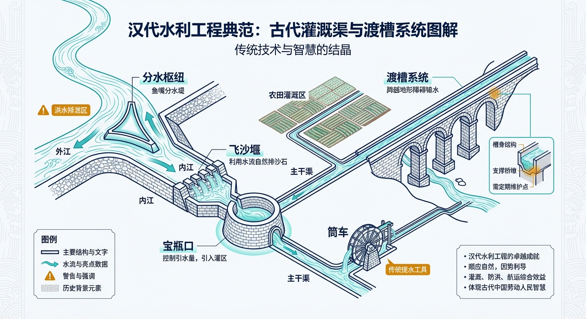
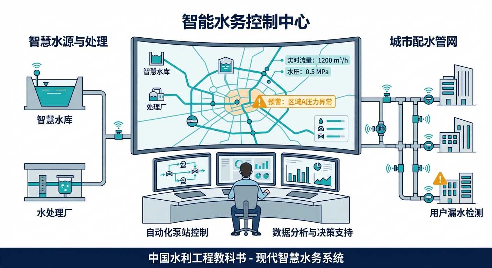
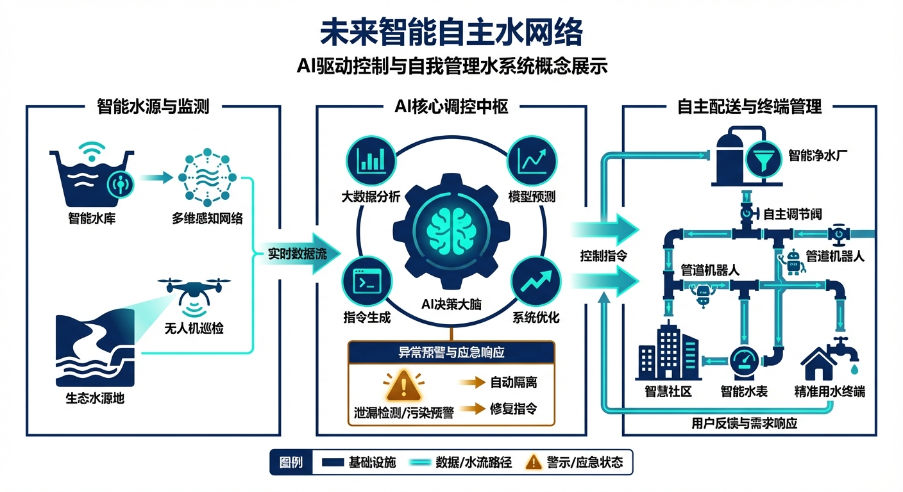

# 引子：暴雨夜的调度室

凌晨一点四十七分，老张的手机震了第三次。

不是闹钟，是调度预警。他从值班室的折叠床上坐起来，六月的夜风从半开的窗户灌进来，带着潮湿的泥土气息。屏幕上是三行红字：上游入库流量突增至设计值的120%，预计两小时后洪峰过境。

老张今年五十三岁，在这个梯级水电站干了二十六年。他穿上工服走进调度大厅的时候，值班员小刘已经把二十面屏幕全部调亮了。

"张工，上游电站半小时前加大了泄量，比预报提前了。"

老张没说话，先看了一圈屏幕。左边八块是本站的：前池水位、尾水水位、六台机组的出力和振动、五扇泄洪闸的开度、发电引水隧洞的流量。右边六块是上下游的：上游电站的出库流量、区间降雨、下游河道水位。中间两块是预报系统：未来六小时的来水过程线和气象雷达图。最上面四块是电网的：总负荷曲线、频率偏差、AGC指令。

二十面屏幕，几百个数字，每一个都在变。

问题是，它们之间的关系全装在老张脑子里。

上游放水增加了，本站前池水位要涨。涨多少？要看来水量和现在的发电引水量之差，再考虑库容——他们站的调节库容极小，汛期高水位时只有几十万方，来水稍微一变，水位就窜上去。水位涨到什么程度要开泄洪闸？开几扇？开多大？开早了浪费水头、少发电，开晚了水位逼近安全线。同时还要看电网那边：现在是凌晨低谷，负荷不大，但两小时后工厂开工，负荷要拉上来，AGC可能随时加出力指令。如果那时候正在泄洪，机组出力空间就小了，电网调度会打电话来催。

还有下游。本站不管是发电还是泄洪，水都往下游去。下游是一段河道，两岸有村庄。泄洪流量太大、太突然，下游水位涨得快，虽然不至于出事，但会有投诉。上次半夜泄洪没提前通知，下游养鱼的老乡第二天就打了12345。

老张在脑子里飞快地算：如果来水真的是预报的120%，前池水位大概在三点半到达黄色预警线。到时候六台机组满发能吃掉多少来水？不够的话要开泄洪闸。开几号闸？3号闸上个月刚检修过，响应最快，先开3号。开多大？先开30%，看水位趋势再调。同时给下游打个电话……

这一连串判断，他在三分钟内完成了。靠的不是公式，是二十六年的经验。

"3号闸预开到30%，通知下游。"老张说。

小刘执行指令，同时问了一句："张工，预报说后面还有第二轮降雨，要不要现在就多开一点？"

老张犹豫了一下。多开，水位控制得更从容，但白白放掉的水意味着少发电，月底经济指标不好看。少开，赌第二轮雨不来或者来得晚，但万一赌错了……

"先按30%开。第二轮的事，等两点半的更新预报再说。"

这就是老张的决策方式：走一步看一步，每半小时根据最新数据重新评估。他的手始终放在操作台边上，随时准备加码。未来四个小时，他不会离开这把椅子。

---

这个场景并不戏剧化。事实上，它每天都在中国九万八千座水库、数千个水电站、上百条调水工程的调度室里上演。不同的工程、不同的来水、不同的约束，但内核一样：一个或几个经验丰富的调度员，面对几十块屏幕上不断变化的数字，在脑子里快速权衡多个互相矛盾的目标，做出一连串不可逆的决策。

老张们做得好吗？大多数时候，非常好。中国水利工程的运行安全记录，在全球范围内是优秀的。老张们用经验、直觉和责任心，撑起了这套庞大系统的日常运转。

但问题也很明显。

第一，老张只有一个。他二十六年的经验无法复制，也无法传授给刚来两年的小刘。等他退休，这些经验就散了。

第二，老张会累。凌晨两点做决策和下午两点做决策，质量是不一样的。人在疲劳状态下的判断力、反应速度、对多变量的同步跟踪能力，都会明显下降。而水利调度恰恰是"越紧急越在半夜"——暴雨不挑时间。

第三，老张的"脑内模型"有天花板。他能同时跟踪五六个关键变量的变化趋势，但当系统规模扩大到几十个闸门、上百个传感器、跨越几百公里的调水网络时，没有人能在脑子里同时hold住这么多变量之间的联动关系。

第四，也是最根本的——整套系统的安全，系在老张一个人的判断上。如果他判断错了呢？如果预报偏了呢？如果3号闸没开呢？没有任何自动机制在背后兜底。报警系统只会响铃，不会动手。

那么问题来了：**有没有可能给老张配一个"副驾驶"？**

不是取代他。是在他疲惫的时候帮他盯着水位趋势；在他犹豫要开30%还是50%的时候，告诉他"根据上游传播模型和最新预报，建议先开35%，如果两点半更新预报确认第二轮降雨，自动加到55%"；在他去上厕所的五分钟里，自动执行预设的安全策略；在他做出决策之后，自动检查这个决策是否会导致下游水位超标。

更进一步：有没有可能，在日常的、相对简单的运行工况下，让系统自己处理？老张不用盯着屏幕，只在真正需要人类判断的时刻介入——就像飞机的自动驾驶仪，平飞巡航时机长专注于监控全局状态，但起飞降落和紧急情况由人来接管。

再进一步：有没有可能在设计阶段——在水电站还画在图纸上的时候——就预先验证"这个调度室的未来调度员，在什么工况下需要介入、什么工况下系统可以自己搞定"？不要等到建成投产后才发现"哦，这个库容太小了，调度员根本来不及反应"。

这些问题，就是这本书要回答的。

---

这本书叫《水网觉醒》。"觉醒"这个词不是文学修辞，而是对一个真实技术进程的描述。

今天中国绝大多数水利工程的运行系统，处于"沉睡"状态——SCADA（数据采集与监控系统）能采集数据、能显示曲线、能发出报警，但本质上它是一面镜子，只照不动。所有的判断、所有的决策、所有的操作，都要靠老张这样的人来完成。

"觉醒"，就是让这面镜子逐渐变成一个有感知、有判断、有行动能力的"副驾驶"——从能提醒，到能建议，到能在限定条件下自主操作，再到在大多数工况下独立运行。

这个过程不是一步完成的，而是分级进化的。就像机动车驾驶自动化从0级（纯手动）到5级（完全无人）分了六个等级，水网的自主运行也有六个等级——从L0（手动运行）、L1（规则自动化）、L2（条件自动化）、L3（条件自主）、L4（高度自主）到L5（完全自主），研究者把它叫作WNAL（Water Network Autonomy Level，水网自主等级）。大多数工程目前在L0到L1之间，少数先进工程摸到了L2的门槛。从L2到L3，是最关键的一步跨越——系统从"辅助工具"变成"有限自主体"，这一步需要的不只是技术升级，还有理念、标准和管理体制的同步变革。

支撑这个进化过程的理论框架，叫"水系统控制论"（CHS，Cybernetics of Hydro Systems）。CHS提出了八条基本原理，相当于水网觉醒的"操作系统"。这八条原理不是八个独立的技术点，而是一套层层递进、彼此依赖的工程方法论——从"给系统建数学模型"开始，经过"确认系统可控可观""建立安全底线""在虚拟环境中验证"，最终达到"人机协作、持续进化"。

如果你是一位工作多年的水利工程师，这本书是为你写的。它不会出现任何数学公式。所有的专业概念，都会用你熟悉的工程场景和生活类比来解释。每一章都会告诉你：这个概念和你现在的工作有什么关系？你的工程目前处在什么阶段？下一步该往哪里走？

如果你读完某一章觉得"这个东西挺有意思，我想看看背后的数学推导"——好，每一章末尾都有一个"深入阅读"指引，告诉你去翻阅《水系统控制论》原著的哪一章、哪一节。那本书有完整的公式、证明和工程数据，是这本书的"正餐"。你手上这本，是菜单和试吃。

现在，让我们从头讲起。先来看看，水利工程的运行管理，是怎么一路走到今天这个样子的。

---

## 本章配图

## 参考文献

[0-1] 雷晓辉,龙岩,许慧敏,等.水系统控制论：提出背景、技术框架与研究范式[J].南水北调与水利科技(中英文),2025,23(04):761-769+904.DOI:10.13476/j.cnki.nsbdqk.2025.0077.

[0-2] 雷晓辉,苏承国,龙岩,等.基于无人驾驶理念的下一代自主运行智慧水网架构与关键技术[J].南水北调与水利科技(中英文),2025,23(04):778-786.DOI:10.13476/j.cnki.nsbdqk.2025.0079.

[0-3] SAE International.Taxonomy and Definitions for Terms Related to Driving Automation Systems for On-Road Motor Vehicles[S].SAE J3016\_202104,2021.

[0-4] Beaumont J M,Fletcher D F.Process control in water treatment[J].Water Research,2003,37(13):3059-3073.

[0-5] 中国铁路总公司.高速铁路自动列车运行装置(ATO)技术规范[S].2020.

[0-6] 郭家虎,刘国梁.水利工程SCADA系统的设计与应用[J].中国水利,2023,15(8):45-51.

> **一句话回顾**：水利调度的核心困境是——系统越来越复杂、人的能力终归有限，迫切需要一个能在老张身边真正"搭把手"的自主副驾驶系统，而不只是一面更漂亮的镜子。

> 📖 **深入阅读**
>
> 本章场景取材自多个真实水电站的运行经验综合提炼（非单一工程实录）。关于水利工程从人工调度到自主运行的范式转变，以及WNAL分级体系的完整论述，参见《水系统控制论》第一章 §1.3"从人工调度到自主运行的范式转变"和 §1.5"水系统控制论的学科定位"。关键参考文献见上述参考文献 [0-1] 和 [0-2]。

## 本章小结

本章以一个暴雨之夜的调度室为引子，生动呈现了水利调度员在复杂工况下的认知挑战，为全书奠定了问题背景：

- **调度员的核心困境**：面对二十面屏幕、几百个实时跳动的数字，调度员需要在数分钟内整合多系统信息、判断因果关系、做出安全决策——这是人类认知能力的极限挑战。
- **水系统的特殊复杂性**：发电、泄洪、电网调峰的多目标耦合，调节库容极小带来的窄时间窗口，以及上下游电站协调的系统性问题，共同构成了水网智能化的真实难题。
- **"装在脑子里"的危机**：当关键知识只存于经验丰富的老调度员脑中时，知识传承断裂和个体疲劳都会成为系统安全的隐患，智能化的使命之一正是将这些知识显式化、系统化。
- **全书的核心问题**：什么是"水网的智能化"，它应该如何分级评估，又该怎样一步步落地？后续章节将围绕这一问题展开。

## 习题

1. 引子描述了老张面对20面屏幕、几百个数字的调度场景。请从"人机系统"的角度分析：这种设计的根本缺陷是什么？理想的智能调度界面应具备哪些特征？

2. 故事中"水位-发电-泄洪-电网"四者之间存在复杂耦合。请画出这四个要素之间的因果关系图（影响图），并标出各条边的影响方向和时延特征。

3. "所有这些关系都装在老张的脑子里"——这句话揭示了什么样的系统风险？请举出两个类似行业（如电力调度、航空管制）中曾发生的因"知识只存于人脑"而引发的事故案例，并分析应对策略。

4. 如果你是这座水电站的信息化负责人，面对引子描述的问题，你会优先解决哪一个痛点？说明你的判断依据和可行的初步方案。
