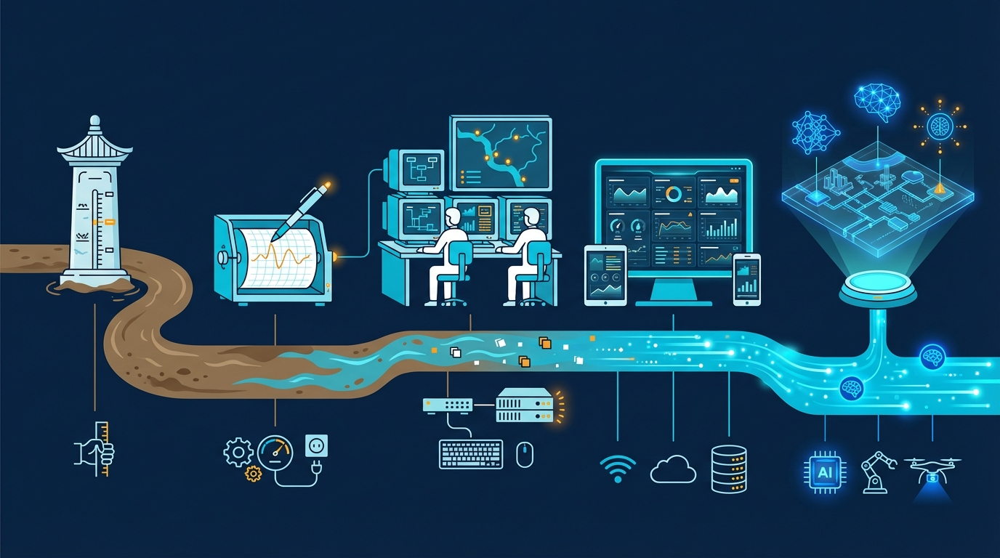
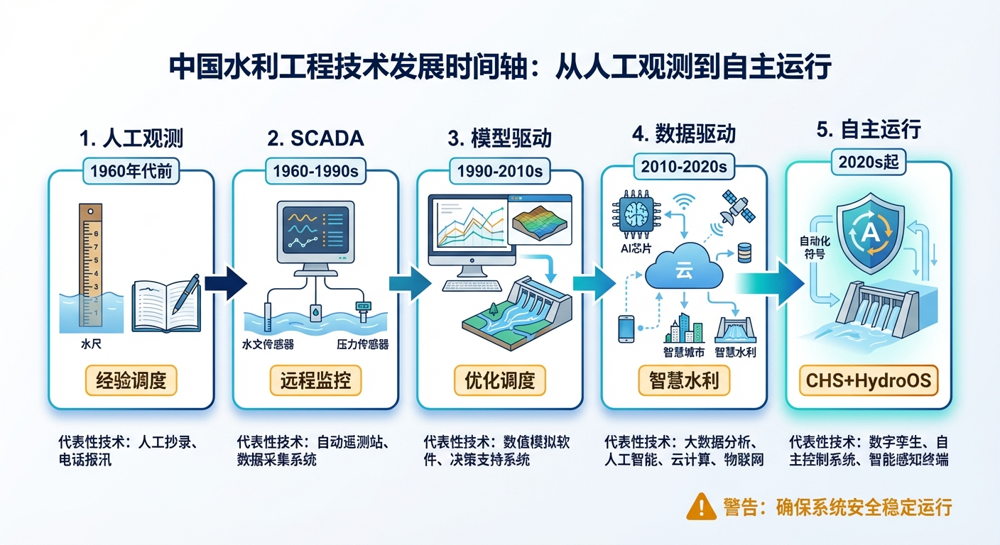
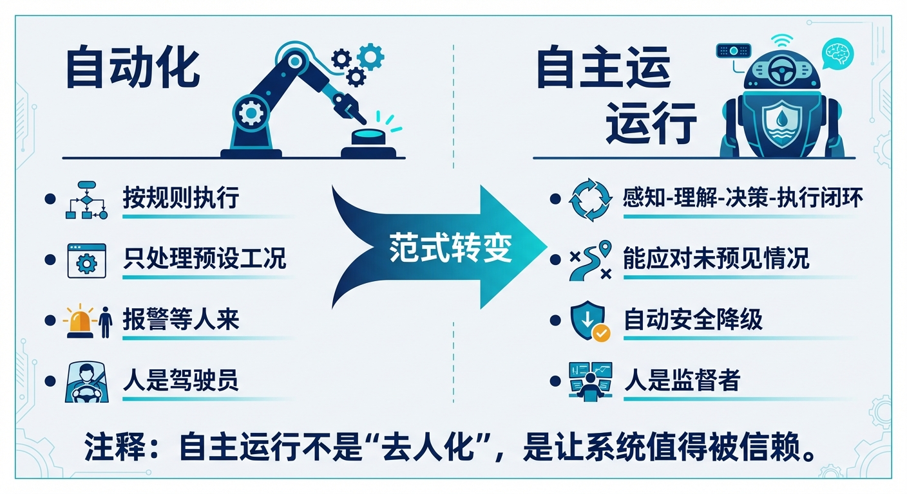
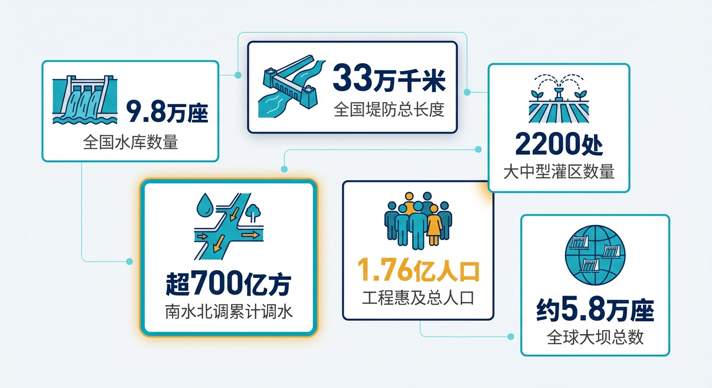
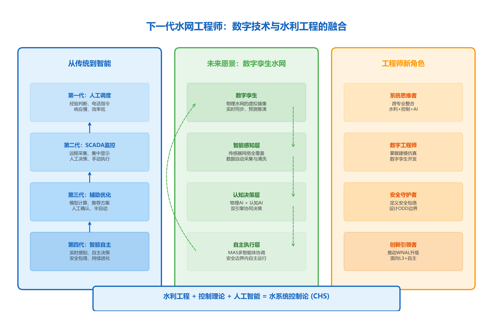

# 第一章 水网的五代人生

> **本章要点**
> - 水网管理经历了从人工观测到自主运行的五代演进，每一代都解决了前一代的核心瓶颈，同时留下了新的遗憾。
> - "自主运行"与"自动化"有本质区别：自动化只能按预设规则执行，自主运行具备感知-理解-决策-执行的完整闭环，并能主动求助和安全降级。
> - SCADA是水利智能化的基础设施，不是需要被替换的"旧技术"；第五代系统是在前四代能力上叠加，而不是推倒重建。
> - 当前大多数工程处于第二至第三代之间，向第五代迈进的正确路径是：数据质量扎实→模型驱动→AI增强→自主运行，不可跳级。

## 开篇故事：三个时代的调度室

**1975年。** 河南某水库管理所。值守员老李每天清晨六点走到坝头，蹲下来看水尺上的刻度，用铅笔记在本子上。遇到暴雨天，他每两小时去看一次，然后骑自行车到乡邮电所，摇电话给县防汛办报数字。县防汛办的人拿着计算尺和调度手册，算出要不要开闸泄洪，再摇电话回来通知。从发现水位异常到执行泄洪，顺利的话半天，不顺利的话——比如电话线被暴风刮断——可能要一天。

老李最怕的不是暴雨，而是夜里涨水。那时候没有声光报警，只能靠耳朵听水声。有一年汛期，他凌晨三点被异常的水声惊醒，赤脚跑到坝头一看，水位已经逼近溢洪道。等他通知到防汛办、等领导拍板、等下游村庄转移，天已经快亮了。事后他说："那一夜老了十岁。"

**2005年。** 同一座水库，已经装上了SCADA系统。水位传感器24小时自动采集，数据通过光纤实时传回二十公里外的管理局大屏幕上。调度员坐在空调房里就能看到水位变化曲线，发现异常后远程操控闸门——按钮一按，几秒钟之内闸门开始动作。比老李骑自行车快了几百倍。

但新的烦恼也来了。大屏幕上密密麻麻几百个数字在跳动，调度员小王盯了八个小时，眼睛酸得流泪。他心里清楚：这些数字里可能藏着异常信号，但淹没在海量的正常数据里，他分辨不出来。有一次，上游一个支流突然来水，淹在了正常数据刷新里，等他注意到的时候水位已经涨了三十厘米。领导说他"不够细心"。小王心里委屈：几百个数字同时跳，神仙也看不过来啊。

**2025年。** 同一座水库，连上了"智慧水利"平台。大屏幕上不仅有实时水位，还有气象雷达图、来水预报模型、AI生成的调度建议。调度员面前的信息比2005年多了十倍。但他看着满屏闪烁的数字和曲线，心里嘀咕：这个AI建议靠谱吗？预报模型误差有多大？如果我按它说的做了，出了事谁负责？

三个时代，三间调度室。技术在飞速进步，但有一件事始终没变：**最终拍板的，还是人。**

这一章，我们来看看水利工程的运行管理是怎么一路走到今天的——走了五代，每一代解决了什么问题，又留下了什么遗憾。

---

## 1.1 第一代：老师傅看水尺（1960年代以前）

这一代的关键词是**"人工"**。

水尺、雨量筒、电话、笔记本——这就是全部装备。调度决策靠的是调度员的经验和一张纸质的调度规程表。规程表上写着"当水位达到X米时，开启泄洪闸Y孔Z米"，但实际情况远比规程表复杂：上游有几条支流同时来水怎么办？下游同时在灌溉和防汛怎么办？规程表没写的工况，全靠老师傅的"直觉"。

这种"直觉"不是玄学，而是几十年经验的结晶。一位在黄河上工作了三十年的老调度员说过："看河水的颜色和声音，我就知道明天的水位。"水色浑浊意味着上游在下大雨，冲刷了大量泥沙；水声变大意味着流速在加快，来水在增大。这些"隐性知识"极其珍贵，但有两个致命缺点：一是无法复制——老师傅退休了，知识就散了；二是有天花板——人能同时跟踪的变量是有限的，当系统规模超过几个闸门、几条渠道时，再聪明的脑子也会"信息过载"。

还有一个容易被忽视的问题：**传递速度。** 水情从发生到被发现、被传递、被决策、被执行，整条链路全靠人力和电话。一条几百公里的调水渠道，上游涨水的消息传到下游可能要好几个小时。而水波的传播速度并不等人——在一些急流渠段，水已经到了，通知还没到。

这些问题在当年或许还不突出——毕竟那时候的水利工程规模有限，一个有经验的调度班组就能管好一座水库。但随着工程规模的膨胀——从管一座水库变成管一条千公里渠道，从调一个闸门变成协调几十个闸泵站——纯人工模式就到了极限。

> [图1-1] **水利工程运行管理五代演变时间轴**
>
> 提示词：水平时间轴从左到右，分五段。第一段"人工观测"（1960年代前），图标为水尺和笔记本，关键词"经验调度"。第二段"SCADA"（1960-1990s），图标为屏幕和传感器，关键词"远程监控"。第三段"模型驱动"（1990-2010s），图标为电脑和曲线图，关键词"优化调度"。第四段"数据驱动"（2010-2020s），图标为AI芯片和云，关键词"智慧水利"。第五段"自主运行"（2020s起），图标为盾牌+自动化符号，关键词"CHS+HydroOS"。每段下方标注代表性技术。连接各段的箭头逐渐变粗变亮。扁平化信息图，蓝绿渐变色调。

---

## 1.2 第二代：SCADA来了，屏幕代替了水尺（1980-2010年代）

这一代的关键词是**"看得见、够得着"**。

SCADA（数据采集与监控系统）的到来是一次真正的革命。传感器代替了人眼，光纤代替了自行车，远程控制代替了手动摇把。调度员坐在中控室里，就能看到几百公里外每一个闸门的状态、每一个断面的水位，而且是实时的。

这有多大的意义？打个比方：第一代调度员是蒙着眼睛开车，偶尔揭开眼罩看一下路况；第二代调度员终于有了完整的挡风玻璃和后视镜，路况一目了然。

美国垦务局早在1991年就系统总结了SCADA在灌溉渠系中的应用经验[1-1]，形成了行业规范。中国从1980年代开始大规模引入SCADA技术，到今天，全国主要的大中型水利工程基本都配备了不同程度的SCADA系统。可以说，SCADA是过去三四十年水利行业最成功的技术投资之一。

但SCADA有一个根本局限：**它是一面镜子，只照不动。**

它帮你看得更远、手伸得更长，但不帮你做决策。所有的判断——水位要不要调？闸门开多大？先开上游还是先开下游？——仍然完全由人来完成。

当系统规模变大后，这个局限就变成了问题。以南水北调中线工程为例：全线一千多公里，几百个监测断面，每分钟产生数万条数据。调度员面对满屏的数字和曲线，真正需要关注的异常信号可能只有几条，但它们淹没在了海量的正常数据里。SCADA让调度员"看得见"了，但又面临一个新困境：**看得见太多，管不过来。**

用开车来类比的话：第二代给你装了挡风玻璃和后视镜，但没给你装导航。路况看得清清楚楚，但往哪开、怎么开，还是得你自己想。而且车速越来越快——数据刷新越来越频繁，工况变化越来越快——光靠人眼盯、人脑算，迟早跟不上节奏。

---

## 1.3 第三代：有了模型，能算"最优"了（1990-2015年代）

这一代的关键词是**"算得准"**。

工程师们开始用数学模型来描述水系统的行为：渠道里的水流遵循什么规律？上游开闸后下游多久能看到水位变化？多个闸门同时调整时，全系统的水位分布会怎样变化？这些问题都有了定量的答案。

在这个基础上，优化算法登场了。给定来水条件、用水需求和各种约束，计算机能算出"最优调度方案"——比如"3号闸开到45%，5号泵开两台，8号闸维持当前"。

这一代的标志性成就是**分层分布式控制（HDC）**。大系统被分成多个层级和多个区域，每个区域有自己的控制器，层级之间通过协调算法沟通。打个比方：如果SCADA是给了你一面大镜子，那HDC是给了你一个导航仪——不仅告诉你路况，还告诉你该怎么走。

法国的Canal de Provence灌区[1-3]、美国的中央亚利桑那调水工程都是国际上的成功案例。中国的南水北调中线工程和胶东调水工程也在这一时期开始应用模型预测控制（MPC）技术[1-4][1-7]。MPC的核心思想很直观：**先用模型预测未来一段时间的变化趋势，然后选择一个让未来表现最好的控制动作。** 就像下棋时多想几步——不只看当前棋面，而是预测几步之后的局面。

这一代取得了实实在在的成效。法国Canal de Provence灌区采用分层控制后，渠道水位波动幅度缩小了一半以上，水量损失显著降低[1-3]。中国的胶东调水工程在2010年代引入MPC技术后，梯级泵站明渠系统首次实现了自动化运行——过去需要调度员逐站打电话通知开机、停机，现在系统可以根据用水需求自动协调上下游泵站的启停时序[1-7]。

但模型驱动的方法也有三个局限。

**第一，模型参数会变。** 渠道的糙率随水深变化，泵的效率随年限衰减，闸门的泄流系数随淤积而改变。今年标定的模型，明年可能就不准了。

**第二，突发事件超出模型覆盖。** 模型是基于"正常工况"建的。极端暴雨、地震后渠道变形、上游突然放水——这些工况模型不知道怎么处理。而偏偏是这些工况，最需要快速、正确的决策。

**第三，调度员不信任模型。** 优化出来的方案，调度员看不懂背后的逻辑。模型说"开到45%"，调度员问"为什么不是50%"，模型沉默。没有解释能力，就没有信任基础。一位基层调度员的话很有代表性："电脑算出来的方案我看了，但我不敢用。出了事没人替我扛。"这不是调度员保守，而是现有的模型系统确实没有给调度员提供足够的信任基础——它只告诉你"怎么做"，不告诉你"为什么这么做"和"最坏会怎样"。

---

## 1.4 第四代：大数据+AI，更聪明了（2010年代至今）

这一代的关键词是**"学得会"**。

机器学习、深度学习、数字孪生——这些技术让计算机能够从海量历史数据中"学习"规律，而不需要人类手动建立数学模型。中国水利部在2022年提出了"数字孪生流域"的战略部署，"智慧水利"成为行业热词。一时间，几乎每个大型水利工程都在谈"数字孪生""AI赋能""智慧化改造"。

这股热潮有其深刻背景。中国拥有世界上规模最大的水利基础设施——近9.8万座水库、33万千米堤防、2200多处大中型灌区，南水北调工程累计调水超过700亿立方米，惠及1.76亿人口[1-8]。这么庞大的系统，靠人工管理的边际成本越来越高，对智能化的需求是真实而迫切的。

然而，热潮之下有四个隐忧值得正视。

**隐忧一："黑箱"不可信。** AI模型算出了结果，没人能解释为什么。水利不是电商推荐——推荐错了顶多买了一本不想看的书，调度错了可能淹一片村庄。在这种攸关公共安全的领域，"相信我"三个字远远不够——调度员需要知道"你是怎么算的""你有多大把握""最坏情况是什么"。

**隐忧二：没见过的工况怎么办？** 训练数据里没有"百年一遇洪水"的样本，模型遇到百年一遇洪水时的表现就是未知数——而这恰恰是最需要可靠决策的时刻。2021年郑州"7·20"特大暴雨、2023年利比亚德尔纳水库溃坝——这些灾难都发生在"历史上从没遇到过"的极端工况下。

**隐忧三："重感知、轻控制"。** 大量资金用在建传感器和数据平台上，大屏幕越来越漂亮，但在"看到之后怎么决策、决策之后怎么闭环验证"这些关键环节上进展有限。结果是花了大价钱建了"高配版SCADA"——看得更漂亮了，但决策还是靠人拍板。

**隐忧四：安全谁来保？** AI可能给出一个效率很高但风险也很高的方案。谁来确保它不突破安全底线？出了事故谁负责？如果AI建议"为了多发电，把水位再升高半米"，但那半米恰好超过了大坝安全标准——这个建议该不该听？

这四个隐忧都是可以解决的问题。但解决它们需要一个统一的理论框架，来回答"感知之后如何决策、决策之后如何验证、验证之后如何负责"这一完整闭环的问题。第四代缺的正是这个框架——这也正是第五代要补上的。

---

## 1.5 第五代：自主运行——不是"去人化"，而是"值得信赖"

这一代的关键词是**"可信赖的自主"**。

第五代的目标不是让机器代替人——那是"自动化"。自动化和自主运行有本质区别：

自动化是**按预设规则执行**——"如果水位超过X，就开闸到Y"。规则是人写的，机器只是忠实执行。遇到规则没覆盖的情况，机器就懵了。

自主运行是**具备感知、理解、决策和执行的完整闭环**——系统能"看懂"当前发生了什么，"想明白"该怎么应对，"做出"合理的控制动作，而且全程在安全包络内运行。遇到自己处理不了的情况，它会主动"叫人"——进入最小风险状态，等待调度员接管。

从自动化到自主运行的跨越，就像从"计算器"到"智能手机"。计算器能快速完成你指定的运算，但它不会自己判断该做什么运算；智能手机有操作系统、有App生态，能根据需求和环境自主调度资源。水利工程的自主运行同样需要一个"操作系统"——这就是HydroOS（第八章会详细讲）。而支撑HydroOS的理论框架，就是水系统控制论（CHS）——它提供了八条基本原理（第四章会详细讲）和一套完整的分级体系WNAL（第五章会讲）。

> [图1-2] **"自动化"vs"自主运行"对比图**
>
> 提示词：左右两栏对比。左栏"自动化"：图标为机械手臂按按钮，标签"按规则执行""只处理预设工况""报警等人来""人是驾驶员"。右栏"自主运行"：图标为带盾牌的机器人+方向盘，标签"感知-理解-决策-执行闭环""能应对未预见情况""自动安全降级""人是监督者"。中间渐变箭头标注"范式转变"。底部注释："自主运行不是'去人化'，是让系统值得被信赖。"蓝绿色调扁平信息图。

那么第五代凭什么能解决前四代解决不了的问题？答案不是某一项技术的突破，而是**一套完整的理论体系**把前四代积累的能力整合在了一起：

- SCADA提供的感知能力（第二代的遗产）→ **保留，作为底层基础设施**
- 模型驱动的控制能力（第三代的遗产）→ **升级为物理AI引擎**
- 数据驱动的学习能力（第四代的遗产）→ **升级为认知AI引擎**
- CHS八原理 + WNAL分级 + 安全包络 → **新增，这是第五代的独有贡献**

第五代不是推倒前四代重来，而是站在前四代的肩膀上，加了一个前四代都缺少的东西：**系统级的安全保障和自主决策框架。**

第五代系统在实际工程中是什么样的？我们不妨想象一下：

还是那条长距离调水渠道，夜间突遇区间暴雨。第五代系统首先通过传感器网络和气象雷达感知到雨情变化（这是第二代SCADA的遗产）；然后用水动力模型预测未来两小时各断面的水位变化趋势（这是第三代的遗产）；同时调用机器学习模型评估预报的不确定性——"最坏情况下水位可能比预测多涨多少"（这是第四代的遗产）。到这一步为止，前四代都能做到。

关键的区别在下一步：第五代系统会自动生成一组调度方案，逐一检查每个方案是否在安全包络之内（第六章会详细讲），然后选择一个既安全又高效的方案，自动执行。执行过程中，系统每隔几分钟就把实际水位和预测水位进行对比——如果偏差超过阈值，立即修正方案。如果偏差大到系统自己处理不了，它会自动切换到"最小风险状态"（比如关闭泵站、降低闸门开度），同时叫醒值班调度员。调度员接到通知时，屏幕上不仅有实时数据，还有系统对当前局面的"诊断报告"——发生了什么、系统做了什么、为什么这么做、建议调度员关注什么。

这就是"自主运行"：系统能独立处理大多数工况，处理不了的时候能安全降级并向人求助，而且全过程可追溯、可解释。调度员老张终于可以从"全程盯屏幕"变成"重点看报告"——他的经验和判断力用在了更有价值的地方。

---

## 1.6 五代叠加，不是替换

必须说清楚一点：这五代不是"一代替换一代"，而是层层叠加。第五代系统不会抛弃SCADA，而是在SCADA基础上增加模型驱动和数据驱动的能力，再加上自主运行的框架。就像智能手机没有抛弃电话功能——打电话只是它能做的事情之一。

不同的工程可以处在不同的"代次"上，这很正常。一座偏远的小型水库目前还在第一代和第二代之间，也不丢人——关键是知道下一步该往哪走，以及走的时候不能跳过哪些基础。一个重要的原则是：**每一代的基础能力必须扎实，才能支撑下一代。** 如果SCADA数据不准、模型没标定好，就急着上AI，那只会得到"垃圾进、垃圾出"的结果。

当前全球大多数水利工程处在第二代到第三代之间。少数先进工程达到了第三代到第四代的水平。真正触碰到第五代门槛的——也就是开始实践CHS理论的——目前只有少数几个工程，后面三章案例（沙坪、大渡河、胶东）就是其中的代表。

回到开篇的故事。1975年的老李、2005年的小王、2025年的调度员，他们面对的困境一脉相承：系统越来越复杂，人的能力终归有限。五代演进的本质，是把越来越多的"重复性判断"从人的肩上卸下来，让人把精力集中在真正需要人来判断的事情上。

但这条路不是一蹴而就的。要让水网从"第二代SCADA"走向"第五代自主运行"，中间有很多问题需要回答：水系统到底为什么这么难管？（第二章）怎么判断一个工程够不够格走向自主？（第三章）自主运行需要遵守哪些基本规则？（第四章）系统的自主能力怎么分级？（第五章）安全底线怎么守？（第六章）新方案怎么验证？（第七章）水网的"操作系统"长什么样？（第八章）

接下来，我们一个问题一个问题地聊。先从最基本的问题开始：水系统到底为什么这么难管？

> [图1-3] **中国水利基础设施关键数字**
>
> 提示词：信息图，深色背景，散布若干关键数字卡片。包括：水库近9.8万座、堤防33万千米、大中型灌区2200处、南水北调累计调水超700亿方、惠及1.76亿人口、全球大坝约5.8万座。每个数字配简洁图标。数字用大号粗体白色，说明文字用小号浅灰色。深蓝底+亮蓝/青绿点缀。

---

## 工程师问答

**Q：老张问——我们单位SCADA运行得好好的，为什么还要"升级"？**

A：SCADA确实好用，而且在可预见的将来都不会被淘汰。但SCADA只是"看得见、够得着"，不帮你做决策。如果你的工程规模不大、工况简单、有经验丰富的调度员长期值守，SCADA足够了。但如果你面临这些情况中的任何一种——系统规模越来越大、老调度员快退休、极端天气越来越多——那就值得考虑下一步了。升级不是推倒重来，而是在SCADA基础上加能力。就像你家的老房子，不用拆了重建，但可以加装电梯、换一套智能家居。

**Q：老张问——自主运行是不是要把调度员都裁掉？**

A：恰恰相反。CHS的核心理念是"人机共融"，不是"去人化"。飞机的自动驾驶仪已经非常成熟了，但机长不仅没被裁掉，反而更重要了——因为机长要监督自动驾驶仪，在极端情况下要接管。水利调度员的角色也会从"驾驶员"变成"机长"：日常工况交给系统，调度员专注于监督和异常应对。工作量下降，但价值更高。事实上，三个案例工程（后面章节会讲）的经验都表明：自主运行系统上线后，调度员的总人数确实减少了，但留下来的人都升级成了更高级别的"系统监督员"——薪资更高，责任更重，技能要求也更高。

**Q：老张问——我们工程还在"第二代"，是不是必须一步步走到"第五代"？**

A：不用跳级，但也不用每一代都经历完整的建设周期。关键在于打好基础。第二代的基础是SCADA数据的准确性和完整性——如果传感器缺位、数据延迟、通信不稳定，那再高级的算法也救不了。先把数据质量搞好，再考虑下一步加模型驱动（第三代能力），最后考虑加AI和自主运行（第四五代能力）。每一步都要扎实，急不得。

---

## 本章配图

**图1-1　水利工程运行管理五代演变时间轴**

**图1-2　"自动化"vs"自主运行"对比图**

**图1-3　中国水利基础设施关键数字**

**图1-4　下一代水网工程师：数字技术与水利工程的融合**

## 参考文献

[1-1] Buyalski, C. P., Ehler, D. G., Falvey, H. T., Rogers, D. C., & Serfozo, E. A. (1991). *Canal Systems Automation Manual, Volume 2*. U.S. Bureau of Reclamation.

[1-2] Litrico, X., & Fromion, V. (2009). *Modeling and Control of Hydrosystems*. Springer-Verlag London.

[1-3] Malaterre, P. O., & Baume, J. P. (1998). Modeling and regulation of irrigation canals: existing applications and ongoing researches. In *Proceedings of the 1998 IEEE International Conference on Systems, Man, and Cybernetics* (pp. 3881-3886). IEEE.

[1-4] 雷晓辉, 龙岩, 许慧敏, 等. (2025). 水系统控制论：提出背景、技术框架与研究范式 [J]. *南水北调与水利科技(中英文)*, 23(04): 761-769+904. doi:10.13476/j.cnki.nsbdqk.2025.0077.

[1-5] 雷晓辉, 张峥, 苏承国, 等. (2025). 自主运行智能水网的在环测试体系 [J]. *南水北调与水利科技(中英文)*, 23(04): 787-793. doi:10.13476/j.cnki.nsbdqk.2025.0080.

[1-6] 雷晓辉, 许慧敏, 何中政, 等. (2025). 水资源系统分析学科展望：从静态平衡到动态控制 [J]. *南水北调与水利科技(中英文)*, 23(04): 770-777. doi:10.13476/j.cnki.nsbdqk.2025.0078.

[1-7] 雷晓辉, 苏承国, 龙岩, 等. (2025). 基于无人驾驶理念的下一代自主运行智慧水网架构与关键技术 [J]. *南水北调与水利科技(中英文)*, 23(04): 778-786. doi:10.13476/j.cnki.nsbdqk.2025.0079.

[1-8] 中华人民共和国水利部. (2023). 中国水利统计年鉴2023 [M]. 北京: 中国水利水电出版社.

---

> **一句话回顾**：本章的核心信息是，水利工程管理的五代演进本质上是把越来越多的重复性判断从人的肩上卸下来，而第五代自主运行系统的独特之处在于它第一次用CHS八原理和WNAL分级为这个过程提供了完整的理论框架和安全保障。

> 📖 **深入阅读**
>
> 本章内容基于《水系统控制论》第一章 §1.1-§1.2。
> - 想看全球和中国水利基础设施的详细数据？→ §1.1
> - 想了解五代演进的学术文献支撑？→ §1.2
> - 想看从自动化到自主运行的范式转变论述？→ §1.2.6 和 §1.3
> - 想看分层分布式控制（HDC）的国际案例？→ §1.2.4
