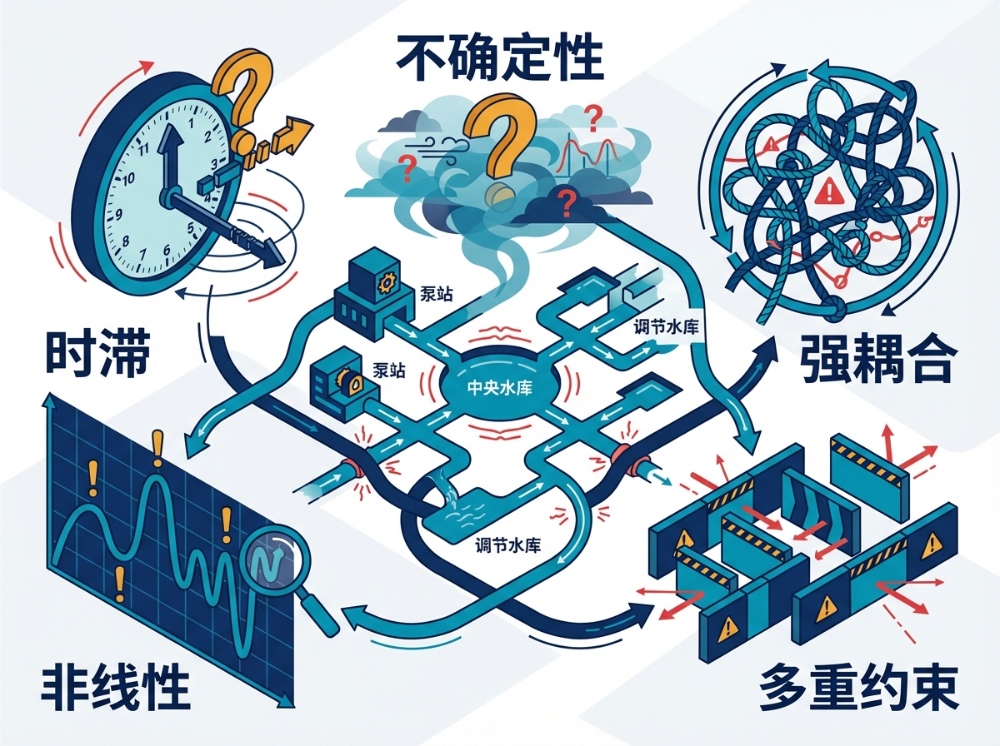
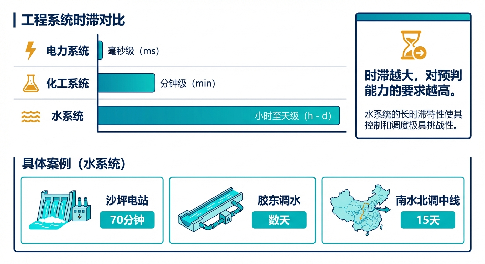
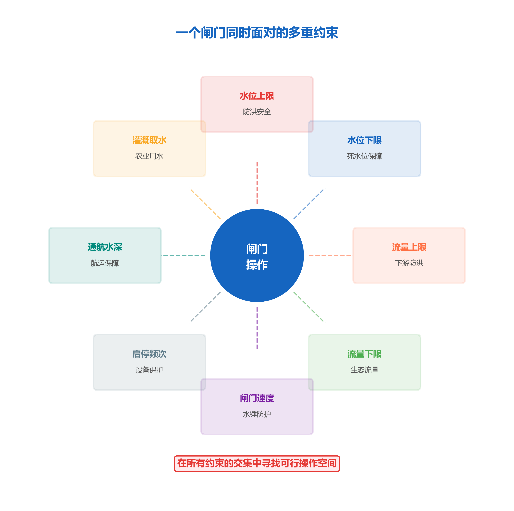
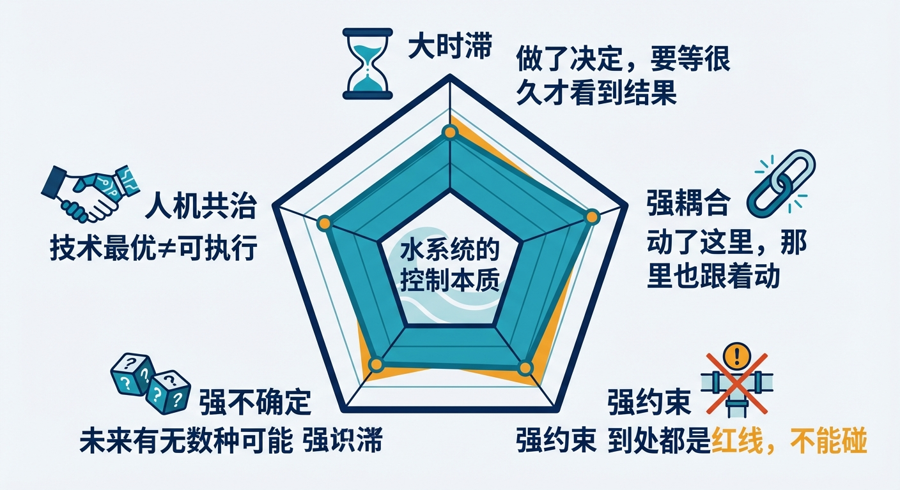
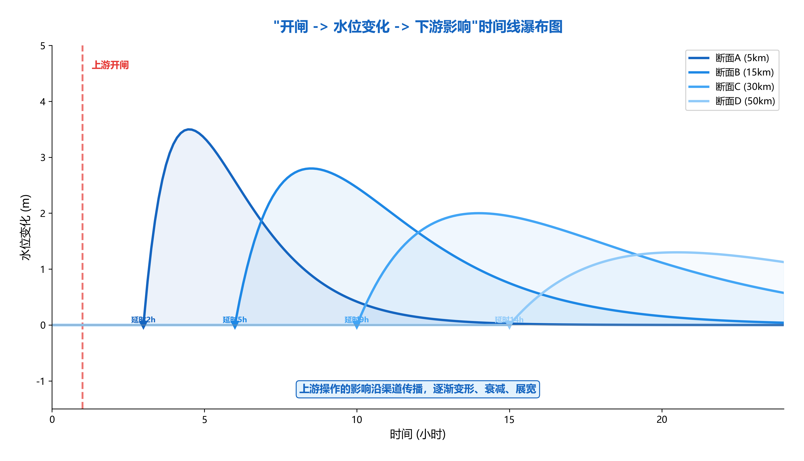

# 第二章 水系统为什么这么难管？

> **本章要点**
> - 水系统有五个"先天特质"使其无法照搬电网或工厂自动化的方案：大时滞、强耦合、强约束、强不确定性、人机共治，且五者相互叠加、难度相乘。
> - 大时滞意味着调度员必须像"开油轮"而非"开汽车"，必须提前预判，而不能等看到结果再反应——这是模型预测控制（MPC）成为核心手段的根本原因。
> - 强耦合导致局部最优不等于全局最优，大渡河梯级电站的教训正源于此，CHS的分层分布式控制原理正是针对这一问题设计的。
> - 人机共治是水系统最独特的控制本质：调度决策不只是技术问题，还是跨部门的社会治理问题，任何忽略这一点的智能化方案都注定落地困难。
> - CHS八原理与五个控制本质一一对应，是专门为水系统的这套"先天特质"量身定制的工程方法论。

## 开篇故事：电网能自动调度，水网为什么不行？

一位做电力调度的朋友问过老张："你们水利怎么还在手动调度？我们电网十年前就实现自动发电控制了（AGC），省调中心的电脑每4秒发一次指令，全省几百台机组自动调整出力，人基本不用管。你们水利不也是开闸门、调泵站吗？有什么区别？"

老张苦笑了一下："你按下发电指令，4秒后机组出力就变了。我开了闸门，下游70公里外的水位变化——等70分钟以后再看吧。你那是打乒乓球，我这是打高尔夫——球飞出去之后，只能看着。"

电力朋友不服："那预测一下不就行了？我们电网也要预测负荷。"

老张说："你预测负荷误差百分之一二，我预测来水误差百分之三四十。你的用户稳定得很——工厂几点开机、空调几点开多大，都有规律。我的来水取决于老天爷几点下雨、下多大、下在哪——这你预测试试？"

电力朋友想了想："那你们搞个数字孪生，把水网全模拟一遍不就行了？"

老张叹了口气："模拟可以，但你知道一条渠道的数学模型有多复杂吗？水在渠道里流，和在电线里传不一样。电在铜线里走，有电阻、有电容，参数是固定的。水在渠道里流，水深变了、流速变了、糙率就变了——参数随状态变。而且我的渠道横断面不规则，拐弯处有涡流，分水口有侧向进出流——每一段都是独一无二的。你模拟一条一百公里的渠道，需要把它切成几千段分别计算，计算量比你们电网仿真大几个数量级。"

水系统有五个"先天特质"，让它天生就比电力系统、化工系统更难自动化。理解了它们，你就理解了为什么水网的"觉醒"需要走一条独特的路——不能照搬电网的经验，不能直接套用工厂自动化的方案，更不能寄希望于某一个AI算法一举解决所有问题。水网的"觉醒"，必须尊重水的物理本性。

---

## 2.1 大时滞——"开了暖气，两小时后才暖和"

**你现在做的决定，水系统可能几小时甚至几天后才有反应。**

这是水系统和电力系统最本质的区别。电力以光速传播，控制指令发出后几乎瞬时生效。水在渠道里以每秒一两米的速度流动——听起来不慢，但渠道动辄几十、几百公里长。南水北调中线从丹江口到北京，全长1432公里，在典型设计流量条件下，水力传播时间约15天[2-2]。胶东调水工程从引黄济青枢纽到威海，水流传播也要好几天[2-5]。即使是规模较小的沙坪水电站，上下游的水力传播时间也有70到85分钟。

这些数字意味着什么？意味着调度员做出的每一个决定，都是在"赌未来"。他在当前时刻调整了闸门开度，但效果要在几十分钟甚至几天后才会在下游显现。如果在这段等待时间里，来水条件发生了变化——比如一场突如其来的暴雨——他之前的决定可能就不合适了。但他已经无法"撤回"，因为水已经放出去了。

大时滞意味着什么？意味着你不能"见招拆招"，必须"提前预判"。

打个比方：开车的时候，你看到前面有障碍物，踩一脚刹车，车半秒钟就减速了——这是"低时滞"系统。但如果你开的是一艘万吨油轮，你推下刹车手柄后，油轮要滑行两公里才能停下来——这就是"大时滞"系统。开油轮的人必须提前两公里就做判断，等看到冰山再刹车就晚了。

水利调度员每天做的事情，就是"开油轮"。引子里老张面临的困境就是典型：他不知道两小时后来水到底有多大，但他必须现在就做决定——因为等到看到结果再调整，已经来不及了。

更麻烦的是，大时滞还带来了一个连锁问题：**反馈延迟。** 你调了闸门开度，但要等很久才能看到下游水位的变化。如果变化不如预期，你再调一次，又要等很久。这样一来一回，时间就耗掉了。在极端洪水工况下，这种"等反馈"的过程可能让你错过最佳干预窗口。

控制论给出的应对思路是"预测控制"——既然不能等到看见再动手，那就用模型提前预测。但这又依赖于模型的准确度，引出了第四个控制本质（强不确定性）的问题。五个本质之间就是这样互相牵扯。

> [图2-1] **时滞对比图：水系统 vs 电力系统 vs 化工系统**
>
> 提示词：三行横向条形图。第一行"电力系统"条形极短（毫秒级），配闪电图标。第二行"化工系统"中等（分钟级），配化学瓶图标。第三行"水系统"极长（小时至天级），配水波图标。每行标注具体数量级。右侧注释："时滞越大，对预判能力的要求越高。"底部补充具体案例：沙坪水电站70分钟、胶东调水数天、南水北调中线15天。蓝绿色调。

---

## 2.2 强耦合——"一家堵车，全路瘫痪"

**上游动一下，下游全跟着动。而且不是一对一，是多对多。**

什么叫"耦合"？简单说就是"牵一发动全身"。大渡河上十几座梯级电站排成一串，上游的瀑布沟水库多放了一点水，下面的深溪沟、枕头坝、沙坪……一个接一个都受影响。而且影响不是简单的"上游多放多少、下游就多收多少"——水在渠道里传播会变形、叠加、延迟，多个水库同时调节时，影响互相交叉，形成极其复杂的动态关系。

打个比方：一条高速公路上排着十辆车。如果第一辆车突然刹车，后面每辆车都要跟着刹车，而且反应时间层层叠加——这就是"串联耦合"。但水系统比高速公路还复杂：它不是一条直线，而是一张网。一个节点的变化可能沿着多条路径传播到多个下游节点，每条路径的传播速度还不一样。胶东调水工程就是典型的网状系统——它有多条输水干线、多个调蓄水库、多个分水口，形成了错综复杂的网络拓扑。上游某个泵站的流量调整，可能同时沿两三条不同路径影响下游不同用户。

强耦合带来的最大困难是：**你不能把大系统拆成几个小系统分别优化然后拼起来。**

电力系统也有耦合，但电网的耦合主要通过频率这一个全局变量体现——全网频率一样，你多发一点电，频率就高一点，其他机组少发一点就好了。水系统的耦合变量是水位和流量，而且每个节点的水位和流量都不一样，每对节点之间的耦合关系也不一样。这就像一张复杂的蜘蛛网——你碰了这里一根丝，那里好几根丝都跟着晃，但晃的方向和幅度各不相同。

大渡河梯级水电站曾经出现过一个典型的"耦合失调"问题：某座电站的AGC（自动发电控制）系统只考虑了本站最优，没考虑对下游电站的影响[2-5]。结果本站效率上去了，但下游电站被迫在低效率区间运行，梯级整体反而亏了。这个教训告诉我们：**在强耦合系统里，局部最优不等于全局最优。**

这也是为什么水网不能简单地给每个闸门、每座泵站装一个独立的控制器就万事大吉。你可以给每个路口装一个独立的红绿灯，但如果这些红绿灯之间不协调，每个路口都只管自己的流量最大化，结果可能是全城大堵车。水网的闸门和泵站也一样——必须有一个"全局视角"来协调。CHS提出的"分层分布式控制"原理（第四章会讲），正是为了解决这个问题：底层各自快速响应，上层全局协调优化。

---

## 2.3 强约束——"不能超速，不能闯红灯"

**水利调度不是"怎么最好就怎么来"，而是在一大堆"不许"中间找空间。**

一座水库的调度员同时面对多少约束？我们来数一数：

- **水位约束**：不能超过汛限水位（防洪），不能低于死水位（保证取水和设备安全），汛末蓄水又要尽量抬高水位（来年供水）
- **下泄流量约束**：不能太大（下游防洪和河床冲刷），不能太小（保证生态流量和下游取水）
- **闸门操作约束**：开度变化速率不能太快（防止水锤和浪涌），不能频繁启停（设备保护和能耗控制）
- **通航约束**：某些河段必须保证最低通航水深，大船过闸时还有流速限制
- **灌溉约束**：到了农忙季节，必须保证灌区引水量，而且供水时段要和农户的用水习惯匹配
- **发电约束**：电网要求在某些时段提供固定出力，高峰时段的电价还不一样
- **环保约束**：下泄水温不能偏离天然值太多（保护鱼类产卵），某些时段还有噪音限制（夜间居民区附近的泵站）

这些约束来自不同部门（水利局、环保局、交通部门、电网公司、农业部门），依据不同的法规和标准，而且往往互相矛盾。比如防洪要求多放水，发电要求少放水；生态流量要求稳定，灌溉要求大流量集中供水。调度员要在所有这些约束的"交集"里找到一个可行的操作方案——这个交集有时候大得很（日常工况），有时候小得几乎为零（极端工况）。

更要命的是，约束是"硬的"。你在手机上点错了一个按钮，最多退出重来；但水库水位超了汛限水位，那是真的会淹人的。CHS把"安全包络"作为八原理中地位最高的硬约束——任何优化目标、任何AI建议，碰了安全线就必须无条件停止。效率可以打折扣，安全不能打折扣。

约束冲突在实际工程中比比皆是。某座兼顾防洪和发电的水库，汛期面临这样的两难：防洪要求水位尽量低（留出库容接洪），发电要求水位尽量高（水头大、发电效率高）。两个目标指向相反方向，调度员夹在中间。传统做法是"保守"——严格按防洪要求执行，牺牲发电效益。但如果能更精确地预测来水和量化风险，是不是可以在保证安全的前提下，把水位多蓄高一点，多发一些电？这正是"安全包络"思想的价值——不是一味保守，也不是冒险激进，而是用定量方法划出安全边界，在边界内尽可能优化。

> [图2-2] **一个闸门同时面对的多重约束**
>
> 提示词：中心图标为一扇闸门，周围环绕8条约束线，每条用不同颜色和图标：红色"水位上限"（防洪）、深蓝色"水位下限"（死水位）、橙色"流量上限"（下游防洪）、绿色"流量下限"（生态流量）、紫色"闸门变速限制"（水锤防护）、灰色"启停频次限制"（设备保护）、黄色"通航水深"、青色"灌溉引水"。中心标注"在所有约束的交集中寻找操作空间"。扁平化信息图。

---

## 2.4 强不确定——"预报说80%不下雨，你敢不带伞吗？"

**来水靠天，用水靠人，设备靠运气。三个不确定叠在一起。**

第一重不确定：**来水。** 气象预报技术进步很快，但即便是最先进的数值天气预报模型，6小时后的降雨预报误差仍然可观。更大的问题是：降雨预报的误差会被水文过程放大——降雨量偏差20%，经过流域汇流，到水库入库流量可能偏差40%甚至更多。对于那些汇流面积大、植被覆盖变化大的流域，这个放大效应更加显著。

第二重不确定：**用水。** 灌区的用水量受农户种植计划和灌溉习惯影响，城市供水受温度、节假日、突发事件影响。这些因素很难精确预测。一场突如其来的高温天气，城市用水量可能比正常值高出30%。而在农业灌区，用水的不确定性更大——你以为这片地今年种水稻需要大量灌溉，结果农户改种了旱地作物，实际用水只有预期的一半。

第三重不确定：**设备。** 泵站的电机可能突然跳闸，闸门的液压系统可能漏油，通信线路可能被施工挖断，传感器可能被泥沙淤堵给出错误数据。这些故障随机发生，防不胜防。更隐蔽的是设备的"慢性衰退"——泵的效率随使用年限逐渐下降，渠道的糙率随淤积逐渐增大，闸门的泄流系数因为磨损而偏离出厂标定值。这些变化太慢，调度员很难察觉，但它们会让模型的预测慢慢"跑偏"。

三重不确定叠加在一起，意味着调度员面对的不是一个确定的问题，而是一个"概率云"——未来有无数种可能，每种可能有不同的概率，每种可能需要不同的应对。2021年郑州"7·20"特大暴雨就是极端不确定性的典型案例[2-3]：短短一小时降雨量超过历史最高记录，远超任何历史记录和预报模型的覆盖范围。在这种"超出想象"的工况下，调度模型和经验规则同时失效，只能退回到最原始的"保命模式"——尽快泄洪、转移人员。

面对这么多不确定性，"追求最优"其实是个危险目标。为什么？因为"最优"方案通常是针对某一个特定的预测场景设计的——预报说来水100方每秒，我就按100方来调度。但如果实际来水是150方呢？"最优"方案可能已经把所有裕度用光了，没有回旋余地。

CHS更强调**"稳健"而不是"最优"**——在多种可能的未来情景下都能维持可接受的性能，比在一种完美情景下达到理论极限更有价值。就像穿衣服：气温在10到20度之间波动的时候，穿一件薄外套（稳健方案）比穿精确匹配15度的衣服（最优方案）更明智——因为你不知道今天到底是10度还是20度。

在水利调度中，"稳健"意味着：方案在预报偏差30%的情况下仍然安全可行，即使它在预报完全准确时的效率不如"最优方案"。老调度员常说"留有余地"——这不是保守，而是对不确定性的尊重。CHS把这种智慧形式化了：安全包络就是"余地"的定量表达，在环验证就是检验"余地够不够"的手段。

---

## 2.5 人机共治——"技术上最优的方案，省里不一定批"

**水利决策不只是技术问题，还是社会治理问题。**

这是水系统最独特的控制本质，也是工程师最容易忽略的。

一个"最优调度方案"在技术上可能完美，但水利决策涉及多个行政区划、多个部门、多方利益。上游省份多放水有利于上游防洪，但下游省份不乐意——水来了你当然高兴，淹了我的田谁赔？反过来，上游蓄水有利于发电和灌溉，但下游干旱时找谁要水？

这不是技术能解决的，是治理问题。

举一个真实的场景：某跨省调水工程，技术团队用优化算法算出了一个"全局最优"方案——上游水库在汛前腾出更多库容，汛期多蓄水，枯期多放水。从全年发电量和供水保证率来看，这个方案比现行方案好15%。但方案送到流域管理委员会，被否了。原因？上游省的水利厅认为汛前多放水增加了本省防洪风险，不同意。下游省的水利厅虽然总体受益，但担心汛期蓄水万一遇到超标洪水会加大自己的防洪压力，也不敢完全支持。技术上的"全局最优"在多方博弈的治理框架里走不通。

在工厂里，控制系统说"温度升到80度"，执行器直接就调了。在水利系统里，控制系统说"3号闸开到2米"，调度员会先问："上级批了吗？下游通知了吗？会不会影响明天的引水任务？"技术决策和治理决策是嵌套在一起的。

还有一个更深层的问题：**责任归属。** 工厂的自动控制系统出了事，找设备厂家、找车间主任就行了。水利工程出了事——比如一次误操作导致下游农田被淹——牵涉到水利局、地方政府、流域委员会、甚至可能上升到省级决策。这种"出了事谁负责"的问题，直接影响调度员对新技术的接受度。你让调度员用一个AI系统来做调度决策，他第一个问题一定是："出了事算谁的？"如果这个问题回答不清楚，再好的技术也推不下去。

### RACI责任矩阵：系统出事，到底该抓谁？

管理界有一个工具叫RACI矩阵，用来厘清多方协作中谁负责（Responsible）、谁拍板（Accountable）、谁需知会（Consulted）、谁需告知（Informed）。把这个概念用到水利系统出事时的责任追溯上，会得到一个令人哭笑不得的故事。

某调水工程发生了一次事故：一个闸门控制算法在特殊工况下判断失误，误开了闸门，导致下游一片农田短暂漫水，损失约三十万元。事故调查会上，四方都到了场：

**程序员（软件公司）** 说："我的算法写的是没错的，按照设计院给的水力参数来的。那个工况是设计院没有告诉我们会发生的边界条件，不在需求规格里。"

**设计院工程师** 说："我们给了完整的水力参数和运行规程，软件公司没有按规程把边界工况都考虑进去，这是他们的问题。而且我们的规程里明确说了'极端工况下须人工确认'。"

**值班员** 说："我当时在盯屏幕，但系统没有任何异常提示。算法自动执行了，我不知道它在那个时刻会做这个决定。要是我知道，我当然会拦。"

**管理单位负责人** 说："这是一次系统性故障，责任在整个项目的验收环节——当初上线的时候应该做更全面的测试。但当时上级要求赶工期……"

四个人，四个说法，各有道理，各有委屈。事故调查持续了三个月，最后以"集体追责"草草收场——每方都罚了一点，但谁也不觉得公平。

这不是特例，而是当前水利智能化项目中普遍存在的困境。根本原因是：**系统出了事，没有一份提前说清楚的RACI矩阵——谁对哪个决策负责、谁有权叫停、谁需要告知——这些在项目启动时就应该写进合同和设计文件里，而不是出了事再来扯皮。**

CHS提出的人机共融原理，核心之一就是在系统上线之前就把责任矩阵明确化：

- **L1级工况下**（规则自动化）：程序员负责算法逻辑的正确性，设计院负责边界条件的完整性，值班员负责监督和异常接管，管理单位负责总体安全。
- **L3级工况下**（条件自主）：系统在ODD范围内自主决策，责任由运营方承担——这意味着运营方必须在验收时确认ODD的边界合理、验证测试充分；一旦确认签字，ODD范围内的决策后果就是运营方的责任，不能再指着程序员说"你的算法有问题"。
- **ODD超出工况**：系统必须退出自主模式，进入人工接管——此时值班员负责决策，但前提是系统给了足够的告警和足够的时间。如果系统未能在合理时间内触发告警，责任仍在系统设计方。

把这张表提前谈清楚、白纸黑字写进去，出了事才有追溯依据。这不是给人找麻烦，而是保护所有人——包括程序员、设计院、值班员。明确的责任边界，是让所有人都敢于使用新技术的前提条件。

CHS的分层分布式架构里有一个专门的"治理层"——它不发操作指令，只定规则和做裁决。技术决策交给算法，治理决策交给人。这个设计不是技术上的妥协，而是对水利系统社会属性的尊重。同时，CHS要求所有自主决策过程必须"可追溯、可解释、可审计"——系统不仅要做出正确的决策，还要能说清楚"我为什么这么做"，这样才能为责任划分提供依据。

> [图2-3] **五个控制本质"五角星"示意图**
>
> 提示词：五角星雷达图，五个顶点分别标注：大时滞（沙漏图标）、强耦合（链条图标）、强约束（红线图标）、强不确定（骰子图标）、人机共治（握手图标）。中心写"水系统的控制本质"。每个顶点旁用一句话概括：大时滞——"做了决定，要等很久才看到结果"；强耦合——"动了这里，那里也跟着动"；强约束——"到处都是红线，不能碰"；强不确定——"未来有无数种可能"；人机共治——"技术最优≠可执行"。蓝绿色调扁平化信息图。

---

## 2.6 五个本质叠加意味着什么？

单独看，每个本质都有应对办法。但叠在一起，难度就不是简单相加，而是相乘：

- **大时滞 + 强不确定** = 必须提前很久决定，但对未来又没把握。就像蒙着眼睛开油轮——你必须提前转向，但你看不清前面的路。
- **强耦合 + 强约束** = 每个动作都影响别人，而且每个人头上都顶着红线。就像在拥挤的停车场倒车——你动一下，旁边的车都要让，但每辆车都有不能碰的底线。
- **以上四个 + 人机共治** = 所有技术难题还要在多方博弈的治理框架下解决。就像在停车场倒车的同时，还要跟三个部门协商谁先走。

这就是为什么水网不能照搬电网或工厂自动化的经验。电网的时滞极小，可以用快速反馈控制；化工系统的约束相对固定，可以用标准化的安全联锁；工厂的决策链路纯技术，不涉及多方治理。水系统的五个本质全凑齐了，而且互相加剧，需要一套专门为它设计的理论体系。

打个整体的比方：管理一个水网，就像在浓雾中驾驶一艘巨型油轮通过拥挤的港口。油轮惯性大（大时滞），周围船只会互相影响航道（强耦合），到处是暗礁和航道边界（强约束），雾太大看不清前方（强不确定），而且你还得跟港口管理局、引航员、其他船长不断协商通行顺序（人机共治）。在这种条件下航行，不能靠一个英勇的船长凭经验独自决策——需要雷达（感知）、海图（模型）、自动避碰系统（安全包络）、船队通信协议（分层分布式）和明确的指挥权划分（人机共融）。CHS就是为水网提供这一整套"航行系统"的。

CHS的八原理正是针对这五个控制本质设计的——

| 控制本质 | 对应的CHS原理 | 核心思路 |
|---------|-------------|---------|
| 大时滞 | 传递函数化 | 先把系统行为建成可预测的模型 |
| 强耦合 | 分层分布式 | 分区管理，层间协调 |
| 强约束 | 安全包络 | 划定不可逾越的红线 |
| 强不确定 | 在环验证 | 上线前在虚拟环境中验证 |
| 人机共治 | 人机共融 | 明确人和机器的责任边界 |

这张对应关系不是巧合——八原理就是从五个控制本质出发，一条一条推导出来的。每一条原理都是对某个（或某几个）控制本质的"解药"。比如，大时滞让"见招拆招"失效，所以需要"传递函数化"来建立预测模型；强耦合让局部优化失效，所以需要"分层分布式"来实现全局协调；强约束让自由优化危险，所以需要"安全包络"来画定红线。

但先别急——在聊八原理之前，我们需要先给水网做一次"体检"。下一章会教你如何评估一个水系统的可控性和可观性，找出盲区和死区。做完体检，再到第四章看八原理的"交通规则"，你就会明白每一条红灯背后对应着哪一条原理的缺失。

> [图2-4] **"开闸→水位变化→下游影响"的时间线瀑布图**
>
> 提示词：时间轴从左到右，起点标注"上游开闸"。水平线上标注若干下游站点（站A、站B、站C），每站画一条"水位变化曲线"，曲线起始点依次右移（表示传播延迟），曲线形状依次变平变宽（表示波形变形）。每段传播时间用虚线标注（如"传播时间2小时""传播时间5小时"）。整体呈瀑布状。底部注释："上游一个动作的影响，沿渠道层层传播、逐渐变形、不断扩散。"蓝绿色调。

---

## 工程师问答

**Q：电网都能自动调度了，水网为什么不行？**

A：核心区别是时滞。电力以光速传播，控制系统可以"走一步看一步"，每4秒调整一次；水在渠道里每秒一两米，调一次要等几十分钟甚至几天才看到效果。这要求完全不同的控制策略——电网用的是"反馈控制"（看到偏差就纠正），水网必须用"预测控制"（还没看到偏差就提前行动）。再加上水系统的不确定性远大于电网，"预测"本身又不太准，所以难度不是一个量级的。但这不意味着水网永远做不到——只是需要的理论基础和技术路线跟电网不一样。CHS就是专门为水系统设计的那套理论。

**Q：我们工程的调度规则用了二十年了，很稳定，有必要改吗？**

A：日常工况可能确实没问题——二十年的经验打磨出来的规则，在正常水文条件下往往比任何新算法都好用。但有两个风险值得警惕：一是气候变化正在让"正常"变得不正常——极端暴雨、极端干旱的频率在增加，老规则的覆盖范围可能不够了。二是人员更替——制定这些规则的老师傅如果退了，新来的人只知道"照着规则操作"，不知道"规则背后的逻辑"，遇到规则没覆盖的工况就抓瞎了。把老师傅的经验"模型化"，是给工程买一份保险。

**Q：五个控制本质里，哪个最难对付？**

A：看工程类型。对于长距离调水工程（比如南水北调、胶东调水），大时滞和强耦合最头疼；对于水库防洪调度，强不确定性（来水预报误差）最关键；对于跨省调水工程，人机共治往往是卡脖子的。但最危险的情况是多个本质同时"发作"——比如极端暴雨（强不确定）导致多座水库同时泄洪（强耦合），而你必须在很短时间内做出决策（大时滞压缩了窗口期），还要协调多个行政区划（人机共治）。好消息是，你不需要同时解决所有问题——CHS的八原理提供了一个优先级框架，帮你判断"先解决哪个、再解决哪个"。

---

## 本章配图

**图2-1　时滞对比图：水系统 vs 电力系统 vs 化工系统**

**图2-2　一个闸门同时面对的多重约束**

**图2-3　五个控制本质"五角星"示意图**

**图2-4　"开闸→水位变化→下游影响"的时间线瀑布图**

## 参考文献

[2-1] 中华人民共和国水利部. (2023). 中国水利统计年鉴2023 [M]. 北京: 中国水利水电出版社.

[2-2] 南水北调工程管理局. (2023). 南水北调中线工程年度调水报告 [R]. 北京: 南水北调中线建设管理局.

[2-3] 中国气象局. (2021). 2021年郑州"7·20"极端降雨事件分析报告 [R]. 北京: 中国气象局.

[2-4] 雷晓辉, 龙岩, 许慧敏, 等. (2025). 水系统控制论：提出背景、技术框架与研究范式 [J]. *南水北调与水利科技(中英文)*, 23(04): 761-769+904. doi:10.13476/j.cnki.nsbdqk.2025.0077.

[2-5] 雷晓辉, 苏承国, 龙岩, 等. (2025). 基于无人驾驶理念的下一代自主运行智慧水网架构与关键技术 [J]. *南水北调与水利科技(中英文)*, 23(04): 778-786. doi:10.13476/j.cnki.nsbdqk.2025.0079.

[2-6] Wiener, N. (1948). *Cybernetics: Or Control and Communication in the Animal and the Machine*. The MIT Press.

[2-7] Litrico, X., & Fromion, V. (2009). *Modeling and Control of Hydrosystems*. Springer-Verlag London.

---

> **一句话回顾**：本章的核心信息是，水系统的五个控制本质（大时滞、强耦合、强约束、强不确定性、人机共治）叠加在一起决定了它必须有专属的理论框架，而CHS八原理正是从这五个本质出发一条一条推导出来的"解药"。

> 📖 **深入阅读**
>
> 本章内容基于《水系统控制论》第二章 §2.3"水系统的五个控制本质"。
> - 大时滞的定量分析和水力传播时间计算 → §2.2 和 §2.3.1
> - 强耦合的数学描述（传递函数矩阵） → §2.3.2
> - 强约束的分类和形式化表达 → §2.2.3 和 §2.3.3
> - 强不确定性的量化方法 → §2.3.4
> - 人机共治的治理框架设计 → §2.3.5
> - 五个本质与八原理的对应关系 → §3.1
