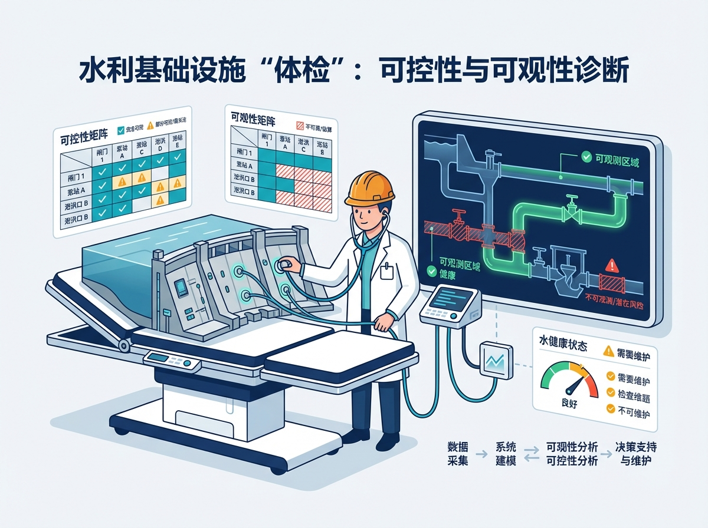
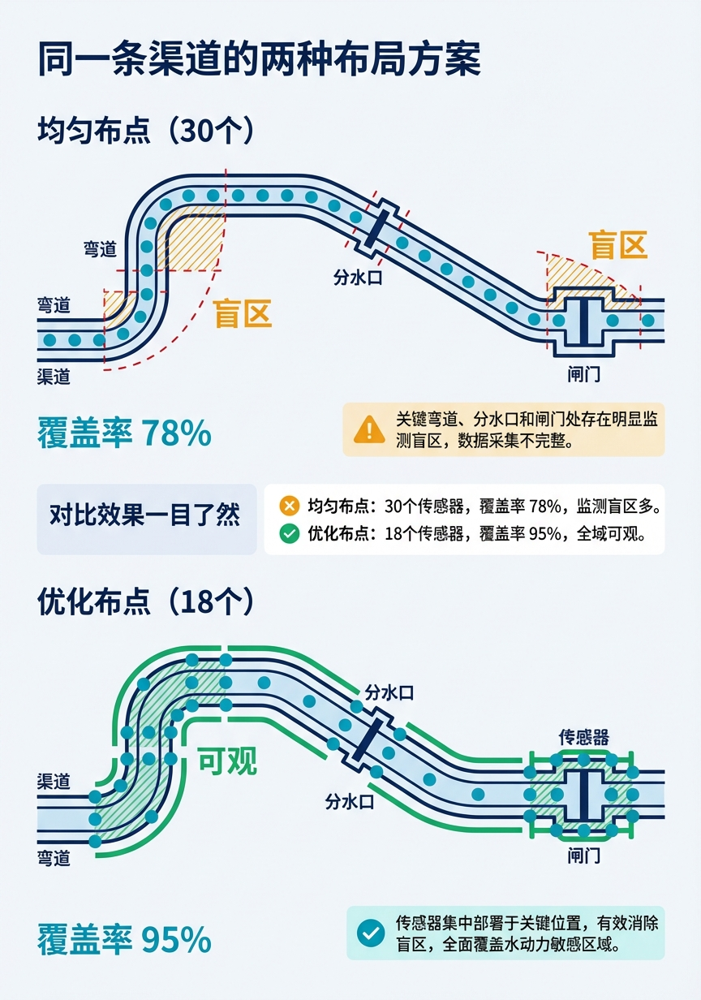
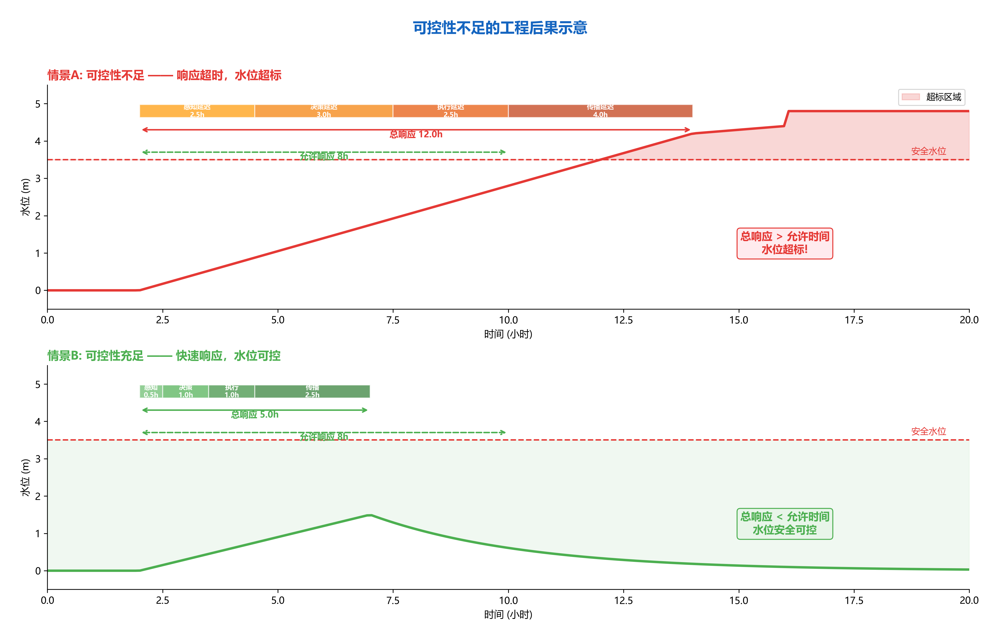
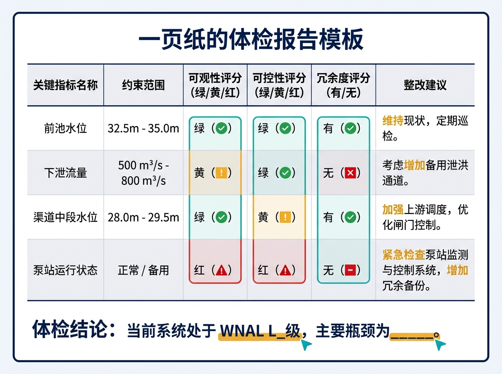
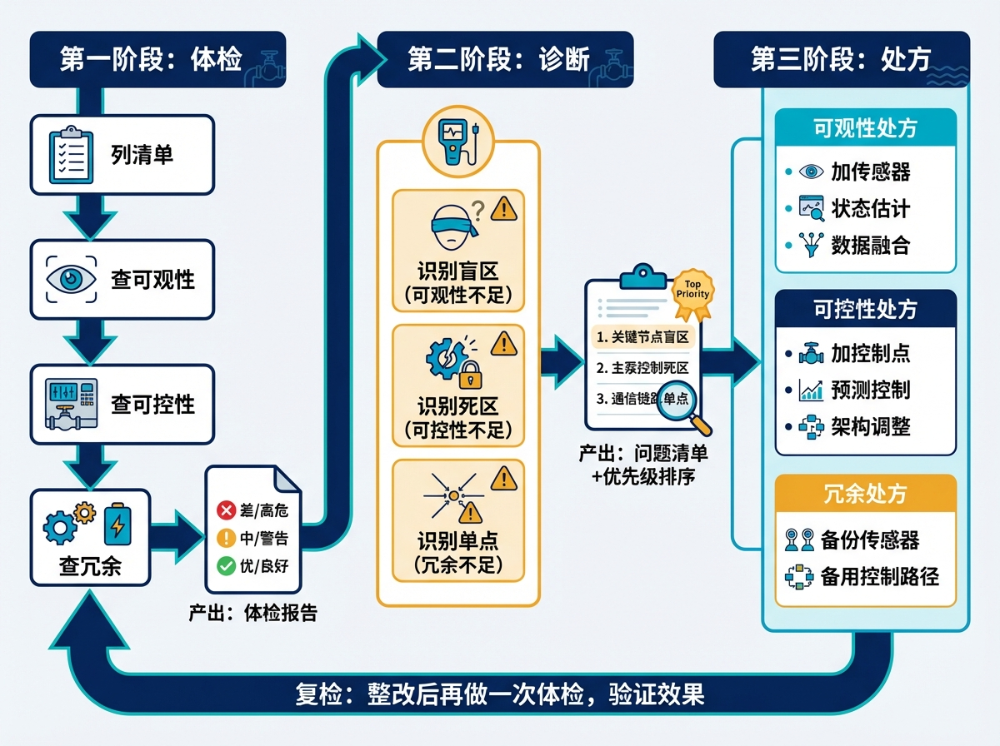

# 第三章 给水网做一次"体检"

> **本章要点**
> - 可观性（"仪表盘够不够"）和可控性（"方向盘灵不灵"）是评估水利工程自主运行基础能力的两个核心指标，缺一不可且必须在同一位置同时具备才有实际意义。
> - 传感器"多"不等于可观性"好"——优化选址的18个点可以优于随手撒布的30个点，关键在覆盖"信息密集区"（弯道、分叉口、控制断面），而非均匀铺开。
> - 体检按四步进行：列清单→查可观性→查可控性→查冗余，产出红黄绿三色体检报告，红灯项即整改优先项，并可直接对应工程当前的水网自主等级（WNAL）区间。
> - 处方的核心原则是"先分析、再投资"：用数据说话而非凭感觉加设备，可观性不足优先考虑传感器优化选址或状态估计，可控性不足优先考虑预测控制（MPC）以"用信息换时间"。

## 开篇故事：三十个传感器不如十八个

某配水管网改造项目，甲方要求"全面提升监测能力"。施工方的方案很直接：按照均匀间距在管网上布设了30个监测点，每隔500米一个，整齐划一。花了不少钱，领导视察时觉得很满意——"看，全覆盖了。"

验收时请专家做了一次可观性分析，结论让所有人吃了一惊：如果把30个监测点换成精心选取的18个点（位置完全不同——集中在弯道、分叉口和末梢），对关键状态的估计覆盖率反而从78%提升到了95%以上。

多装了12个传感器，覆盖率反而低了17个百分点。问题不在"多少"，在"装在哪里"。

为什么会这样？因为管网里的水力状态分布不是均匀的。在直管段上，每隔500米的水位变化很平缓，几个测点提供的信息高度重复——就像在一条笔直的高速公路上每隔500米装一个摄像头，看到的画面几乎一样。而在弯道、分叉口、变径管段这些"信息密集区"，水力状态变化剧烈，恰恰是最需要监测的位置——但均匀布点方案把这些位置漏掉了。

后来专家团队帮他们重新做了布点方案。不仅把传感器数量从30个减到了22个（省了一笔钱），还把覆盖率提到了93%。省下的预算用来升级了几个关键位置的传感器精度和通信备份——反而比原来的"全覆盖"方案更安全。甲方领导感慨说："原来花钱也要花在刀刃上。"

这个故事说明一个道理：给水网做"体检"，不是简单地数传感器有多少台、闸门有多少扇，而是要回答两个根本问题——**看得够不够清楚？调得够不够及时？** 前者叫"可观性"，后者叫"可控性"。这两个概念来自控制论，听起来学术，但本质上就是"仪表盘够不够"和"方向盘灵不灵"的问题。

---

## 3.1 可观性：你的"仪表盘"够不够？

可观性就是一个问题：**你能不能看清楚你需要看清楚的东西？**

开车需要什么仪表？速度表、转速表、油量表、水温表，加上挡风玻璃和后视镜。缺了任何一项，你都不敢上高速。水利工程也一样：你需要看到关键断面的水位、流量、闸门开度、泵站状态……缺了任何一项关键信息，你的调度就是"半盲操作"。

但"看得见"和"看得清"是两回事。一个模糊的监控摄像头和一个高清的监控摄像头，都能"看见"，但发现异常的能力天差地别。水利传感器也一样——一个精度±1厘米的水位计和一个精度±10厘米的水位计，对调度的支撑能力完全不同。

一条100公里的渠道，如果只在头和尾装了两个水位计，中间60公里就是"盲区"。平时看不出问题——来水平稳时，两个点大致够用，中间的水位可以线性插值估算。但一旦中间段出了异常——比如渠道某处发生渗漏、支渠突然大量取水、闸门误操作——你可能过了很久才发现，到那时小问题已经变成了大问题。更危险的是，如果中间段有一条支渠在偷偷取水（超出计划），你在两端的水位计上看到的只是水位缓慢下降——你以为是正常的日内波动，其实是水量在流失。

可观性不好的工程，就像蒙着一半眼睛开车——大部分时候没事，出事就是大事。

**可观性的三个层次：**

第一层叫**"直接可测"**——关键状态有传感器直接测量。比如水位计、流量计、压力传感器。这是最可靠的。

第二层叫**"间接可估"**——没有直接的传感器，但可以通过其他已知数据推算。比如知道上游水位和闸门开度，可以用水力公式估算闸下流量。又比如，知道泵站的功率和转速，可以推算出泵站的出流量。这需要模型支撑，精度比直接测量低，但总比完全不知道强。间接估计的可靠性取决于模型的准确程度——如果渠道淤积了但模型还在用原来的糙率参数，估算出来的水位就会偏差很大。所以间接估计需要定期"校准"模型参数，就像体重秤需要定期归零一样。

第三层叫**"不可观"**——既测不到也估不出。比如一段很长的渠道中间没有任何测点，上下游又隔得太远，中间发生了什么完全是黑箱。这就是体检中必须标红的"盲区"。盲区不可怕——可怕的是不知道自己有盲区。很多工程的调度员以为"我看到了所有该看的东西"，其实他只看到了传感器告诉他的那部分，传感器没覆盖的区域发生了什么，他完全不知道。

还有一种容易被忽视的可观性问题：**数据到了但不可信。** 传感器测到了数据，但数据本身有误——比如水位计被泥沙淤堵，一直显示同一个数值；流量计因为安装角度偏了，长期偏高20%；或者两个相邻传感器的数据互相矛盾。"假数据"比"没数据"更危险，因为调度员会基于错误信息做决策。好的可观性不仅要求"有数据"，还要求"数据可信"——这就需要数据质量检查和多源交叉验证。

**体检清单——可观性：**
- 每个关键断面有没有直接或间接的测量手段？
- 传感器的采样频率够不够？每小时采一次和每分钟采一次，对快速变化工况的捕捉能力差别巨大。
- 传感器的精度满不满足控制需求？一个精度±10厘米的水位计，对于调节库容只有几百万方的小水库来说可能不够——10厘米的误差对应几十万方的库容误差。
- 有没有冗余备份？关键传感器坏了怎么办？在水利这种攸关公共安全的领域，单点故障不可接受。
- 数据通信可靠吗？传感器测到了数据，但通信中断了传不回来，等于没测。

> [图3-1] **传感器布局的"好坏对比"**
>
> 提示词：同一条渠道的两种布局方案。上方"均匀布点（30个）"：传感器等间距排列，关键弯道和分水口处恰好没有点，标注覆盖率78%，红色虚线标出盲区。下方"优化布点（18个）"：传感器集中在弯道、分水口、闸门上下游等关键位置，标注覆盖率95%，绿色实线覆盖全域。用绿色标注"可观"区域，红色标注"盲区"。对比效果一目了然。

---

## 3.2 可控性：你的"方向盘"够不够？

可控性也是一个问题：**你能不能在需要的时间内把系统从A状态调到B状态？**

"能调"有两层含义。

**第一层是物理上能调**——有闸门可以开、有泵站可以启、有阀门可以转。如果一段渠道上没有任何控制设施，那不管来了多大的洪水或者多急的用水需求，你只能干看着。这就像一辆没有方向盘的车——它能跑，但你控制不了往哪跑。

**第二层是时间上来得及**——你的控制动作能在问题恶化之前"到达"目标位置并产生效果。这里的"来得及"要计算完整的响应链路：从发现异常（传感器检测）→判断决策（人或算法）→下达指令（通信传输）→执行动作（闸门/泵站动作）→效果传播（水流到达控制断面）。整条链路的总时间必须短于允许的响应窗口。

沙坪水电站就是时间维度可控性的极端案例：上游来水变化后70分钟才传到下游坝前，但调节库容极小（总库容585万方，汛期有效调节库容更小），水位可能5分钟就超标。如果没有提前预判、没有预设的自动响应策略，光靠人反应是来不及的。这就好比你开着一辆刹车距离200米的大卡车在狭窄山路上行驶——你的"可控性"取决于你能不能在200米之前就看到弯道。

这里需要引入一个关键参数：**$T_c$（特征响应时间，也称临界控制时窗）**。它代表的是：一旦系统状态进入需要干预的范围，留给控制系统完成完整响应链路的最大允许时间。

$T_c$ 的物理含义用一个例子最好理解：假设爆管（管道破裂）发生后，水位从正常范围降到安全阈值以下只需要3分钟——这3分钟就是这个工况的 $T_c$。而你查手册、电话上报、等待批准、下达指令的整个流程需要5分钟。那么结论很清晰：在这个工况下，靠人工流程根本来不及——3分钟的 $T_c$ vs 5分钟的人工响应链路，必须让机器先踩刹车。如果爆管的 $T_c$ 是30分钟，人工响应来得及，那这个工况下人在回路里是合理的。

**$T_c$ 是判断"这个工况需要L几支撑"的关键指标：**
- $T_c$ > 人工响应时间：可以维持现有自主等级，人工可以兜底
- $T_c$ < 人工响应时间但 > 系统自动响应时间：必须提升到能自动触发响应的等级（至少L2加安全包络）
- $T_c$ 极短（分钟级以下）：必须上L3，系统自主决策不可或缺

体检时，每个关键工况都要算出它的 $T_c$，并和当前控制链路的实际响应时间对比。$T_c$ 缺口越大，升级需求越迫切。

很多工程的调度员其实心里清楚自己有"来不及"的工况。他们的应对办法是"保守操作"——永远留足裕度，宁可效率低一点，也不要把水位推到极限。这在安全上没问题，但代价是效率损失。CHS的目标是：通过精确的可控性分析和预测控制技术，把"保守裕度"从拍脑袋变成定量计算——该保守多少、在什么工况下可以放松、在什么工况下必须收紧，都有据可依。

还有一种更隐蔽的可控性不足：**控制力不够。** 你有闸门可以调，但闸门的最大泄流能力小于可能遇到的最大洪峰。这就像你有方向盘，但方向盘只能打30度——直路上够用，急弯就过不去了。

类似的情况还有泵站功率不够。某调水工程在设计时按"平均用水量"配置了泵站，但夏季高峰期的用水量是平均值的1.5倍——泵站全开也跟不上需求。结果要么下游缺水，要么不得不启用备用线路（如果有的话）。这不是运行人员的问题，是设计阶段就埋下的"可控性缺陷"。CHS提出的MBD方法论（第十章会讲）强调的就是：在设计阶段就做可控可观性分析，而不是建完了再发现"控制力不够"。

还有一种情况值得注意：**控制之间的干扰。** 你有两个闸门可以调，但它们控制的是同一段渠道的水位——你调了A闸门，B闸门的效果就变了。两个控制动作互相干扰，调度员很难精确控制。这在多闸门、多泵站的复杂系统里非常普遍。CHS的解决思路是"解耦控制"——通过数学方法把互相干扰的控制通道分开，让每个控制器"各管各的"，互不干扰。

**体检清单——可控性：**
- 每个关键控制目标有没有至少一条有效的控制路径？
- 控制动作的执行延迟有没有超过容许范围？（闸门全开需要多久？泵站启动需要多久？）
- $T_c$ 是否覆盖了完整的人工响应链路？（如果 $T_c$ < 人工响应时间，必须引入自动化响应）
- 控制力够不够？（闸门最大泄流量能不能覆盖设计洪水？）
- 有没有"死区"——某个控制目标在规定时间内调不到？
- 极端工况下控制力够不够？（比如所有来水都走一条渠道时，下游闸门扛得住吗？）

> [图3-2] **可控性不足的工程后果示意**
>
> 提示词：时间轴从左到右，展示一次"控制不及时"的过程。起点"上游来水突变"，标注检测时间（传感器发现异常）、决策时间（调度员判断+下达指令）、执行时间（闸门动作）、传播时间（水流传到控制断面）。总时间加起来超过了"允许的响应时间"虚线（即 $T_c$），导致水位超标（红色区域）。对比下方"可控性充分"的情景：每个环节时间更短，总时间在允许范围内。蓝绿色调。

---

## 3.3 可观性和可控性的关系：缺一不可

可观性和可控性是一对"双胞胎"——看不清就调不准，调不了则看了也白看。

一个极端例子：假设你有完美的传感器网络，每秒采集一次，覆盖率100%——但你没有闸门，一个控制设施都没有。你看得清清楚楚洪水正在逼近，但什么也做不了。这是"可观但不可控"。

另一个极端：你有很多闸门可以调，但传感器全坏了，你完全不知道当前水位是多少。你有能力调整，但不知道该往哪个方向调。这是"可控但不可观"。

两种情况都是灾难。体检必须两项都做，缺一不可。

在实际工程中，更常见的情况是两者部分不足：某些断面可观但不可控（能看到水位在涨，但那里没有闸门）；某些断面可控但不可观（有闸门但没有水位计，调度员靠经验"盲调"）。体检的核心任务就是找出这些"短板"，然后有针对性地补齐。

一个来自实际工程的教训：某灌区的分水口装了闸门（可控），但没装流量计（不可观）。调度员每次调整分水量都是凭经验——"开大概这么多，应该差不多"。大多数时候确实差不多，但有一次，闸门的密封垫老化了，实际分水量比预期大了30%，下游灌区水量不足，投诉到了管理处。如果当初装了流量计，这个问题几分钟内就能发现。

另一个方向的例子：某渠道中段装了水位传感器（可观），但两侧20公里内没有任何闸门（不可控）。传感器忠实地记录了一次渠道渗漏导致的水位下降——从发现到水位降到警戒线以下用了4个小时。但因为没有就近的控制手段，调度员只能从20公里外的上游闸门加大放水来补偿，水流传到这里又花了3个小时。等水补上的时候，下游已经停水了7个小时。如果在这个位置有一个小型调蓄池或者应急补水阀门，问题可以在1小时内解决。

这两个案例说明：**可观性和可控性必须在同一个位置同时具备，才有实际意义。** 看到了问题但管不了，和管得了但看不到问题，效果一样差。

---

## 3.4 体检怎么做？四步流程

CHS建议的"体检"流程，可以简化为四步：

**第一步：列清单。** 把你的工程中所有不可违反的约束指标列出来——关键断面的最高/最低水位、最小生态流量、泵站最大启停频率、通航最低水深等。这些就是"体检指标"。清单不要只列"安全相关"的指标，也要包括"效率相关"的——比如"某断面水位波动幅度不超过±0.2米"，这不一定是安全红线，但超过这个范围会导致灌溉均匀度下降，影响农作物产量。

**第二步：查可观性。** 对照清单上的每一项，问：有传感器能测到吗？如果没有直接测量，能通过其他数据估算吗？估算的精度满足需求吗？如果既测不到也估不出——这就是"盲区"，标红。特别注意：要检查传感器的采样频率是否匹配。一个水位变化可能在5分钟内发生的工况，如果传感器只是每小时采一次，那关键变化过程完全被错过了。

**第三步：查可控性。** 对照每一个控制目标，问：有执行器（闸门/泵站/阀门）能影响到它吗？影响的时间延迟有多大？这个延迟是否小于该工况的 $T_c$？控制力度够不够？如果延迟超过了容许的响应时间（$T_c$）——这就是"死区"，标红。还要检查执行器的可靠性：闸门的液压系统上次维护是什么时候？泵站的备用机组能不能正常启动？很多工程的"可控性"在纸面上是够的，但实际上因为设备老化、维护不到位，真到用时可能失灵。

**第四步：查冗余。** 关键的传感器和控制路径，有没有备份？主传感器坏了有没有备用？主控制路径不通了有没有替代方案？通信链路断了怎么办——能不能切换到备用通信方式（比如从光纤切到4G/5G）？在水利这种攸关公共安全的领域，关键节点必须有冗余。飞机上的关键系统都是三重冗余，水利工程至少做到双重。

做完四步，你就得到了一份"体检报告"——每个关键指标的可观性、可控性和冗余度评分，标注为绿（充分）、黄（勉强够）、红（不足）三色。红灯项就是优先整改项。

体检报告不仅告诉你"哪里有问题"，还间接告诉你"你的工程在WNAL哪一级"（第五章会详细讲WNAL分级）。一个粗略的对应关系：

- 如果红灯项主要集中在可观性——说明你的工程连"看清楚"都做不到，大概在L0到L1之间。优先加传感器。
- 如果可观性基本过关但可控性有红灯——说明你"看得见但管不住"，大概在L1到L2之间。需要增加控制点或引入预测控制。
- 如果可观性和可控性都过关但冗余不足——说明正常工况下能应对，但一旦设备故障就会降级。大概在L2到L3的门槛上。需要加冗余。
- 全绿——恭喜，你的工程具备了向L3（条件自主）迈进的硬件基础。但硬件只是必要条件，还需要软件（控制算法）、验证（在环测试）和制度（人机责任划分）的配套。

体检不是一次性的。水利工程的条件在变——传感器会老化、渠道会淤积、用水格局会调整、气候模式会漂移。CHS建议至少每两到三年做一次全面复检，极端事件（如大洪水、设备大修）后要做专项复检。就像人的体检，年年做、年年看，才能及早发现问题。

> [图3-3] **"水利工程体检报告"模板**
>
> 提示词：一页纸的体检报告模板。表格形式，列包括：关键指标名称、约束范围、可观性评分（绿/黄/红）、可控性评分（绿/黄/红）、$T_c$（特征响应时间）、冗余度评分（有/无）、整改建议。填写了4行示例数据（如"前池水位""下泄流量""渠道中段水位""泵站运行状态"）。底部有总评区域："体检结论：当前系统处于WNAL L_级，主要瓶颈为___"。表格配色清爽，红黄绿三色直观。

---

## 3.5 "处方"怎么开？

体检发现了"盲区"和"死区"后，怎么解决？

**可观性不足的处方：**

最直接的办法是在"盲区"关键位置增装传感器。但不是随便装——要做优化选址分析，确定哪几个位置的"信息增量"最大。就像开篇故事说的，18个精心选取的点好过30个随手撒的。优化选址的核心思路是：找到那些"信息最不冗余"的位置——在那里加一个传感器，能最大程度减少整个系统的不确定性。

如果预算有限装不了传感器，还有一个办法：用状态估计算法[3-1][3-2]"推算"不可直测的状态。原理很简单——如果你知道上游的水位和闸门开度，再知道渠道的物理参数（长度、坡度、糙率），就可以用水力学公式推算出中间段的水位分布[3-6]。这不如直接测量精确，但总比完全不知道强。

更高级的方法是数据融合——把多种信息源（水位传感器、流量计、雨量站、气象预报、甚至卫星遥感数据）组合起来，互相校验、互相补充，得到比任何单一来源更准确的状态估计。

数据融合的原理可以用一个生活例子来理解。你想知道明天是不是下雨，可以看天气预报（60%准确率），也可以看老农的经验（"蚂蚁搬家"就要下雨，50%准确率），还可以看气压计（气压下降意味着可能下雨，55%准确率）。单独看，每种方法都不太靠谱。但如果三种方法都指向同一个结论——"明天下雨"——那可信度就大幅提高了。数据融合就是用数学方法把多个"不太靠谱"的信息源整合成一个"比较靠谱"的综合判断。在水利工程中，这意味着即使每个单独的传感器精度有限，通过融合多源数据，整体的状态估计精度可以显著提升。

**可控性不足的处方：**

如果某段渠道完全没有控制设施，长期方案是增设闸门或调蓄池。但这涉及工程改造，周期长、投资大。

短期能做的是"用信息换时间"——利用预测控制（MPC）技术[3-3]，提前预判来水变化，在问题还没传播到"死区"之前就在上游提前采取行动。打个比方：你的车刹车距离很长（可控性弱），那你就必须看得更远（用预测弥补），提前减速。沙坪水电站就是用这个思路——调节库容极小（"刹车距离"短），但用MPC预测未来70分钟的来水变化[3-5]，提前调整闸门，相当于"把刹车提前踩了"。

这里的核心逻辑是：当 $T_c$ 小于人工响应时间时，不一定要花大钱改造工程——可以先通过预测控制把"有效响应时间"提前，在技术上弥补 $T_c$ 的缺口。当然，预测控制的有效性依赖于预测的准确性，不确定性太大时这个办法就失效了，那才需要工程改造。

还有一个思路：调整控制架构。比如把一个大闸门拆成几个小闸门分段控制，每段的时滞和控制范围都变小了，可控性自然提升。或者在关键位置增设调蓄池——调蓄池相当于"缓冲区"，来水突然变大时先装进调蓄池里，给调度员争取响应时间。调蓄池不需要很大，哪怕只能缓冲半小时的流量变化，对可控性的提升也是质的飞跃。

**冗余不足的处方：**

最直接的办法是给关键传感器加装备份——比如在同一位置安装两种不同原理的水位计（一个超声波、一个压力式），互相校验。通信链路也要有备份：主链路是光纤，备份链路可以是4G/5G无线。成本不高，但关键时刻能救命。

关键原则是：**先分析，再投资。** 不要拍脑袋买设备，先搞清楚瓶颈在哪里、最需要加强的位置在哪里。体检报告就是你跟领导申请预算时最有力的依据——不是"我觉得应该加传感器"，而是"分析表明在X位置增加一个水位计可以消除Y公里的盲区，投资Z万元，性价比在所有方案中最高"。用数据说话，领导更容易批。

> [图3-4] **"体检-诊断-处方"完整流程图**
>
> 提示词：从左到右的流程图，三大阶段。第一阶段"体检"：列清单→查可观性→查可控性→查冗余，产出"体检报告（红黄绿三色）"。第二阶段"诊断"：识别盲区（可观性不足）、死区（可控性不足，含 $T_c$ 缺口标注）、单点（冗余不足），产出"问题清单+优先级排序"。第三阶段"处方"：分三列——可观性处方（加传感器/状态估计/数据融合）、可控性处方（加控制点/预测控制/架构调整）、冗余处方（备份传感器/备用控制路径）。底部箭头指向"复检：整改后再做一次体检，验证效果"。蓝绿色调扁平化。

体检做完了，处方也开了。但你可能会问：体检告诉我"哪里有问题"，处方告诉我"怎么补"——可是从根本上说，水网要走向自主运行，光补短板够吗？不够。还需要一套系统性的"行为准则"来指导整个建设过程。这就是CHS八原理——水网觉醒的"交通规则"。实际上，可控性和可观性本身就是八原理中的第二条（"可控可观性原理"）。而体检中涉及的安全裕度问题，对应的是第四条"安全包络原理"。把体检和八原理对照着看，你会发现每一条红灯背后都对应着某一条原理的缺失。读完下一章再回头看你的体检报告，很多红灯的成因和解法会变得更加清晰。

---

## 工程师问答

**Q：我们工程传感器不少了，为什么说"不可观"？**

A：传感器数量不等于可观性质量。可能你的30个传感器都装在"好装"的位置（比如泵站出口、闸门上游——因为那里有电、有通信、有平台），但真正关键的位置（比如渠道弯道、分水口下游、容易淤积的断面）一个都没有。可观性是拓扑问题，不是数量问题。还有一种常见情况：传感器装了但数据质量差——测量精度不够、采样频率太低、数据传输经常中断。名义上有30个传感器，实际上能稳定提供可靠数据的可能只有20个。建议请专业团队做一次可观性分析——分析结果可能会让你大吃一惊。

**Q：加传感器要花钱，怎么跟领导汇报"加在哪里最划算"？**

A：做一次可控可观性分析，用数据说话。分析结果会告诉你："在X位置加一个水位计，可以消除Y公里的盲区，关键状态覆盖率从Z%提升到W%。"这比"我觉得应该在那里加一个"有说服力多了。开篇故事里那个案例就是最好的例子——精准布点不仅效果更好，还省了传感器的钱。如果领导问"值不值"，可以换一种方式算账：上一次因为监测盲区导致的事故，直接经济损失是多少？加装几个传感器的成本是多少？两个数字一对比，投资回报率一目了然。

**Q：体检结果全是红灯怎么办？是不是没救了？**

A：别慌。大多数工程的体检结果都不会全绿——尤其是建成年代较早的工程，当初的设计标准和现在的需求不一样，出现红灯很正常。关键是分优先级：先补最关键的盲区和死区（通常是和安全直接相关的控制断面），然后逐步改善。不用追求一步到位，但要知道方向在哪里。一个实用的排序原则：先解决"红灯且安全相关"的项目（比如防洪关键断面的监测盲区），再解决"红灯但主要影响效率"的项目（比如分水口的流量计量），最后做"黄灯改绿灯"的优化提升。三年一个周期，每次改善几项，逐步把整体水平拉上来。

**Q：$T_c$ 怎么计算？工程上有没有简单的方法？**

A：最简单的估算方法是问两个问题：（1）这个工况下，从状态开始异常到必须完成干预，最多有多少时间？（2）我们当前从发现异常到完成控制动作，实际需要多少时间（含人工判断、审批、通信、执行等所有环节）？两个时间一对比，如果（1）>（2），当前模式可行；如果（1）<（2），需要缩短响应链路——要么通过预测控制提前发现，要么通过自动化跳过某些人工环节。精确计算 $T_c$ 需要水力学仿真分析，但工程师通过访谈老调度员、回顾历史事故记录，往往能得到非常有用的粗略估计。

---

## 本章配图

**图3-1　传感器布局的"好坏对比"**

**图3-2　可控性不足的工程后果示意**

**图3-3　"水利工程体检报告"模板**

**图3-4　"体检-诊断-处方"完整流程图**

## 参考文献

[3-1] Kalman, R. E. (1960). On the general theory of control systems. In *Proceedings of the 1st IFAC Congress on Automatic Control* (Vol. 1, pp. 481-492). Moscow: USSR Academy of Sciences.

[3-2] Luenberger, D. G. (1971). An introduction to observers. *IEEE Transactions on Automatic Control*, 16(6), 596-602.

[3-3] Negenborn, R. R., & Maestre, J. M. (2014). Distributed model predictive control: An overview and roadmap of future research opportunities. *IEEE Control Systems Magazine*, 34(4), 87-97.

[3-4] 雷晓辉, 龙岩, 许慧敏, 等. (2025). 水系统控制论：提出背景、技术框架与研究范式 [J]. *南水北调与水利科技(中英文)*, 23(04): 761-769+904. doi:10.13476/j.cnki.nsbdqk.2025.0077.

[3-5] 雷晓辉, 张峥, 苏承国, 等. (2025). 自主运行智能水网的在环测试体系 [J]. *南水北调与水利科技(中英文)*, 23(04): 787-793. doi:10.13476/j.cnki.nsbdqk.2025.0080.

[3-6] Litrico, X., & Fromion, V. (2009). *Modeling and Control of Hydrosystems*. Springer-Verlag London.

[3-7] 雷晓辉, 许慧敏, 何中政, 等. (2025). 水资源系统分析学科展望：从静态平衡到动态控制 [J]. *南水北调与水利科技(中英文)*, 23(04): 770-777. doi:10.13476/j.cnki.nsbdqk.2025.0078.

[3-8] Gilbert, E. G. (1963). Controllability and observability in multivariable control systems. *SIAM Journal on Control*, 1(2), 128-151.

[3-9] 雷晓辉, 苏承国, 龙岩, 等. (2025). 基于无人驾驶理念的下一代自主运行智慧水网架构与关键技术 [J]. *南水北调与水利科技(中英文)*, 23(04): 778-786. doi:10.13476/j.cnki.nsbdqk.2025.0079.

---

> **一句话回顾**：本章的核心信息是，水利工程"自主运行准备度"的起点是做一次扎实的体检——弄清楚系统"看不见"在哪里、"管不到"在哪里，特别是找出 $T_c$ 缺口（特征响应时间小于当前响应链路时间的工况），然后有针对性地补短板，这比直接上AI更重要也更有效。

> 📖 **深入阅读**
>
> 本章内容基于《水系统控制论》第四章（形式化描述）和第六章（可控可观性与传感器布局）。
> - 可控性和可观性的严格数学定义 → 第六章 §6.1-§6.2
> - 传感器优化布局的数学方法（Kalman可观性矩阵） → 第六章 §6.3
> - 配水管网传感器选址优化案例 → 第六章 §6.3.4
> - 状态估计与数据融合方法 → 第六章 §6.5
> - $T_c$ 与WNAL等级判断的关系 → 第八章 §8.4
