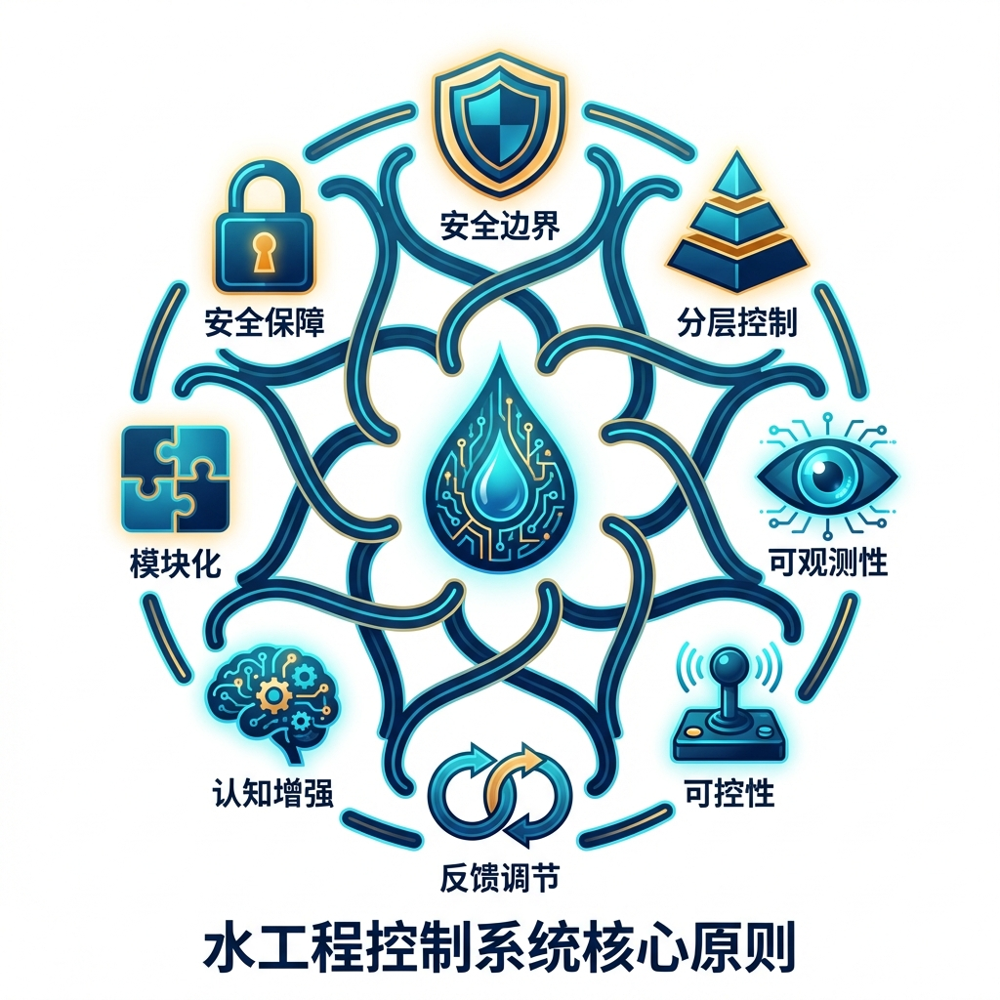
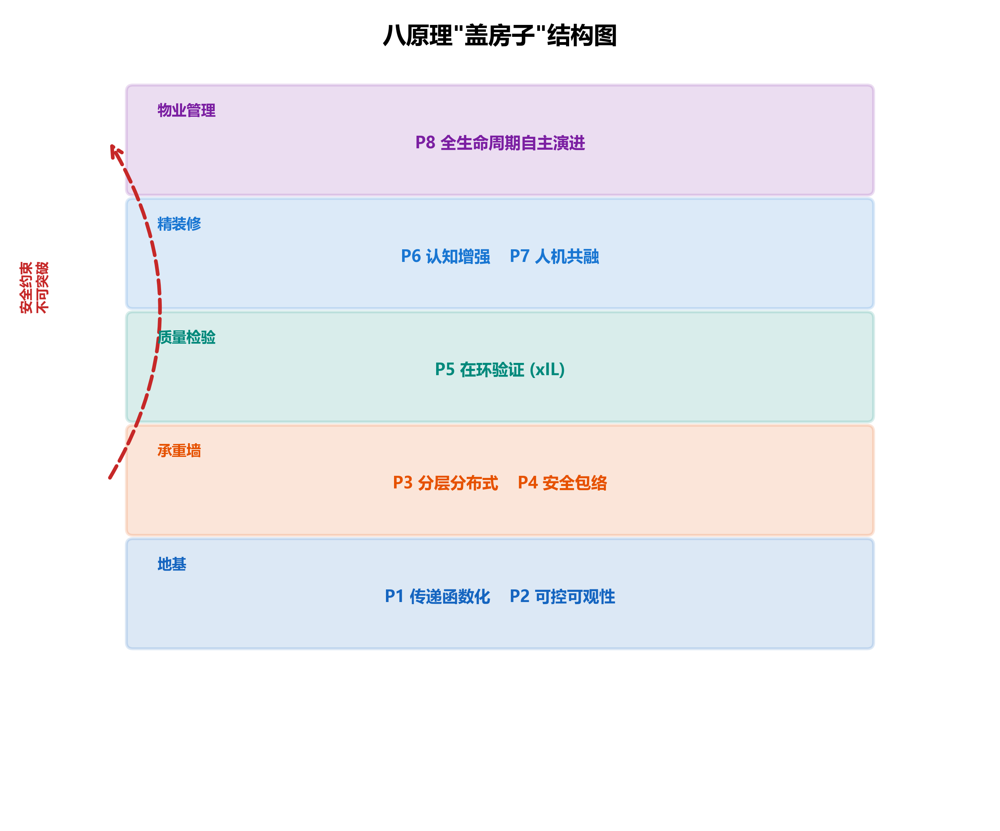
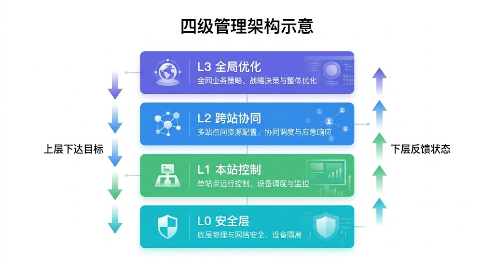
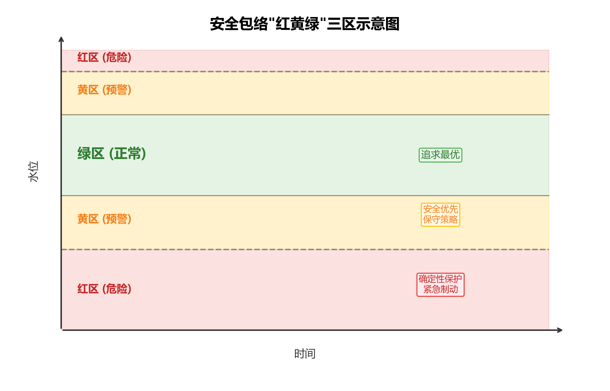
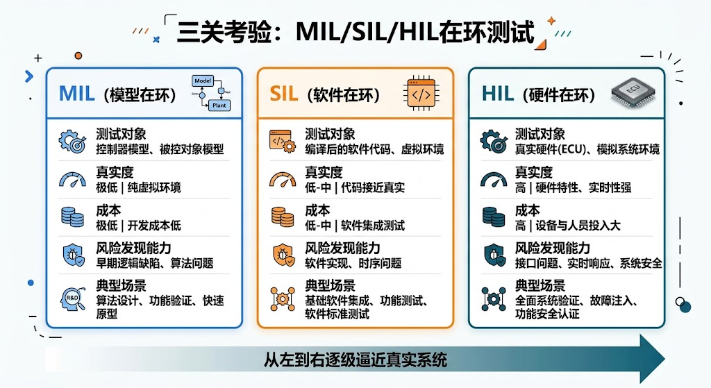
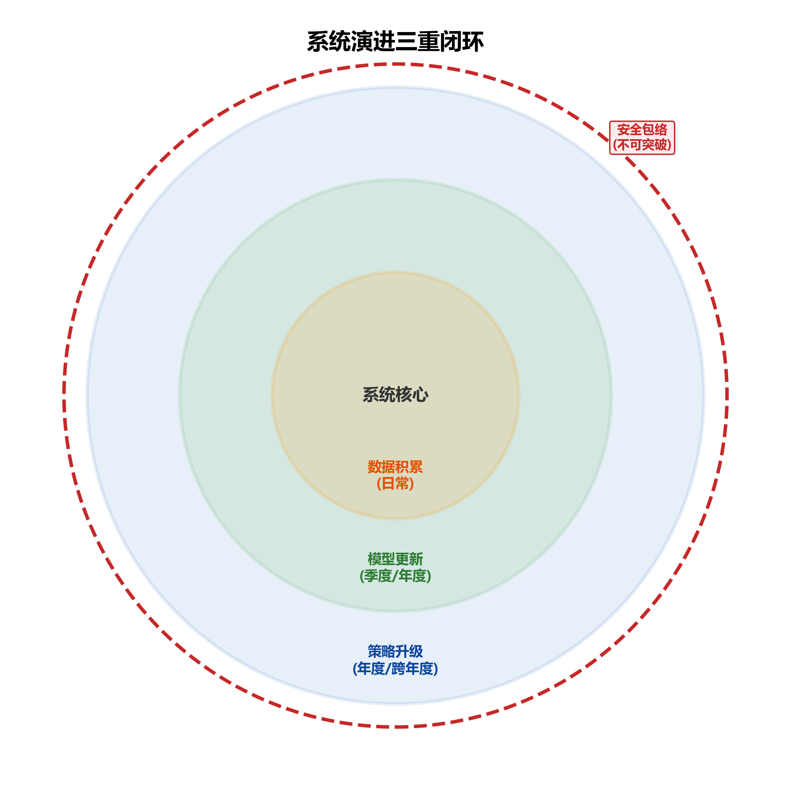

# 第四章 水网的"交通规则"——CHS八原理

> **本章要点**
> - CHS八原理是一套层层依赖的整体框架，而不是八个独立口号：地基（传递函数化+可控可观性）→承重墙（分层分布式+安全包络）→质检（在环验证）→装修（认知增强+人机共融）→物业（全生命周期演进），顺序不可颠倒。
> - 安全包络（原理四）是地位最高的硬约束：任何优化算法、任何AI建议，一旦触碰安全包络的红线就必须无条件停止，效率可以打折扣但安全不能。
> - 在环验证（原理五）要求任何新控制方案必须先过MIL→SIL→HIL三关，不许跳级直接上真实工程——发现Bug越早，修复代价越低。
> - 物理AI引擎（PAI）管"手脚"（MPC、状态估计、安全包络），要求确定性强、实时可靠；认知AI引擎（CAI）管"参谋"（异常诊断、策略解释），允许容错，但不直接控制设备——两者互补而非替代。
> - 八原理的落地可以从第一、二条开始渐进推进，每做扎实一条都有独立价值，不需要等到"八条都到位"才行动。

## 开篇故事：三强联合，为什么还是翻了车？

某个流域花了两年时间，连续完成了三项"智能化改造"，每项都请了顶尖团队：

第一项，闸门升级。原来的闸门控制靠人手动设定开度，现在换上了自适应PID控制器，水位控制精度从分米级提升到了厘米级。验收评分：优。

第二项，泵站节能。引入深度学习模型预测用水负荷曲线[4-4]，提前调整泵站运行方案，综合能耗降了12%。验收评分：优。

第三项，来水预报。上了LSTM神经网络模型，6小时预见期内的入库流量预测误差从20%降到了8%。验收评分：优。

三张优秀成绩单，皆大欢喜。

然后汛期来了。

一次中等强度的暴雨——注意，不是百年一遇的极端事件，只是很普通的一场暴雨——就把三套系统的协作打回了原形。

事情是这样的：预报模型很争气，准确地给出了来水预警。但这个预警信息到了调度大屏上就停了——它只是在屏幕上闪了个红色数字，没有触发任何自动预响应动作。调度员看到了，但当时正在处理另一件事。

与此同时，上游来水增大，闸门自适应控制器反应很灵敏，迅速加大了泄量。问题来了：这个泄量变化，下游的泵站系统并不知道。泵站正在执行节能策略——为了省电，正把运行频率往下调。上游多来的水涌进了泵站前的蓄水池，水位蹭蹭上涨，泵站被迫紧急加频。这一来一回，不仅全年省下的12%能耗一笔勾销，还因为突然加频导致一台电机过温保护跳闸。

事后复盘，所有人都觉得委屈。预报团队说"我报了啊"，闸门团队说"我控得很好啊"，泵站团队说"我怎么知道上游突然放那么多水"。

谁都没错。但系统出了问题。

问题出在哪？三支团队各做各的，像三个乐手各练各的曲子——独奏都是大师，合奏就是噪音。他们缺的不是单项技术，是一套让所有人"按同一份乐谱演奏"的规则。

CHS提出的八原理[4-1]，就是这份乐谱。

---

## 4.1 先看全景：八原理是什么关系？

在逐个介绍八原理之前，先看看它们之间的结构关系。这很重要——很多人看到"八条原理"就觉得是八个独立的口号，其实不是。它们是分层的，就像盖房子：

**第一层：地基**
- 原理一：传递函数化（给系统画"说明书"）
- 原理二：可控可观性（确认"方向盘"和"仪表盘"够用）

**第二层：承重墙**
- 原理三：分层分布式（设计"管理架构"）
- 原理四：安全包络（划定"安全底线"）

**第三层：质检**
- 原理五：在环验证（在"虚拟工地"上先试一遍）

**第四层：装修**
- 原理六：认知增强（让系统不仅会做，还会解释）
- 原理七：人机共融（人和系统怎么配合）

**第五层：物业**
- 原理八：全生命周期演进（系统怎么持续"学习升级"）

这个顺序不是随便排的。地基不牢，承重墙没意义；承重墙不在，质检无从谈起。一个水利工程如果连第一层（系统的数学"说明书"）都没有，就不要急着上AI。先把基础打好。

而且这里有一条红色的"回路"：安全包络（原理四）对全生命周期演进（原理八）有一条硬约束——系统可以学习、可以进化，但不管怎么进化，都不许突破安全底线。这条线是不可谈判的。

> [图4-1] **八原理"盖房子"结构图**
>
> 提示词：五层建筑横截面图。底层标注"地基：传递函数化 + 可控可观性"，用蓝色。第二层标注"承重墙：分层分布式 + 安全包络"，用深蓝色。第三层标注"质检：在环验证"，用绿色。第四层标注"装修：认知增强 + 人机共融"，用青色。顶层标注"物业：全生命周期演进"，用浅蓝色。从第二层"安全包络"到顶层"全生命周期演进"画一条红色虚线回路箭头，标注"安全约束不可突破"。整体风格：扁平化信息图，建筑剪影，每层内有简洁图标。尺寸170mm宽。

好，现在逐个来看。

---

## 4.2 原理一：传递函数化——给每段水路贴上"说明书"

### 一句话

**系统里每个部件的"脾气"，都要写成定量的说明书——给定输入，多久、多大的输出。**

### 生活类比

你去超市买食品，包装上有"营养成分表"：每100克含多少热量、多少蛋白质、多少脂肪。你不需要知道这块饼干的面粉是怎么发酵的、黄油是怎么乳化的，但你需要知道它"进去多少、出来多少"。

传递函数化要做的事情一模一样：给水系统的每一段渠道、每一座闸门、每一台泵站都贴上"营养成分表"[4-3]——上游增加10%的流量，下游多远的地方、多久之后、涨多高？这就够了。不需要把每个水分子的运动轨迹都算出来。

### 为什么重要？

回到开篇的故事。闸门团队、泵站团队、预报团队之所以"各说各话"，根本原因是他们没有一份共同的"系统说明书"。水力学家说"这段渠道的弗劳德数是0.3"，自动化工程师说"这个PID的比例增益是2.5"，AI工程师说"我的模型RMSE是0.08"——三种语言，互相听不懂。

传递函数化提供的，就是三个团队都能看懂、都能用的共同语言：**"上游动一下，下游什么时候、以什么方式变多少。"** 有了这个，闸门团队就知道自己的泄量变化会在多久后影响到泵站；泵站团队就能提前准备；预报团队的输出也能直接接入控制决策。

### 不遵守会怎样？

某长距离输水工程，设计时各专业分头做方案：水力学专业用精细的圣维南方程算渠道，自动化专业用PID控制算法调闸门，通信专业按固定间隔布设传感器。三个专业各有一份报告，但没有一份统一的"系统级输入—输出说明书"。结果建成后发现：控制器设计时假设的响应延迟是2小时，但实际渠道的水力传播需要4小时——控制器"以为"自己的调节动作已经生效了，其实下游还没收到。反复误判之下，水位像弹簧一样上下振荡。

如果在设计阶段就做了传递函数化——把每段渠道的延迟和增益参数都标清楚——这个问题根本不会发生。

### 一句话总结

> 没有"说明书"的系统，就是没有通用语言的巴别塔。

> 📖 **深入阅读**：传递函数化的数学基础是积分延迟（ID）模型，它把复杂的偏微分方程浓缩成了只有两个参数的简洁形式。想看具体推导和工程标定方法，请翻阅《水系统控制论》第4章（形式化描述）和第5章（高级建模技术）。

---

## 4.3 原理二：可控可观性——方向盘和仪表盘，缺一不可

### 一句话

**调不了的系统不要谈优化，看不见的状态不要谈智能。**

### 生活类比

开车上路之前，你会检查两样东西：方向盘转得动吗？（可控性）仪表盘亮着吗？（可观性）

方向盘打不动，再好的导航也没用——你知道该往左转，但转不了。仪表盘全黑，再好的驾驶技术也白搭——你连自己多快、油还剩多少都不知道。

水系统完全一样。"可控性"是说：你手里的闸门和泵站够不够？能不能在需要的时间内把水位从A调到B？"可观性"是说：你的传感器够不够？布对了位置没有？能不能看到你需要看到的信息？

### 为什么重要？

很多工程花大钱上了AI调度系统，结果发现系统给出的"最优方案"执行不了——因为中间一段渠道没有控制闸，上游放的水到了那里就"放养"了，想调也调不了。这就是可控性不足。

另一种常见情况：100公里的渠道上只有头和尾两个水位计，中间60公里完全是"盲区"。AI模型想预测中间段的水位，只能靠猜。猜对了是运气，猜错了就是事故。这就是可观性不足。

更精妙的一点是：传感器不是越多越好，而是要放对位置。有人做过分析：某配水管网72个候选监测点，精心选18个就能覆盖95%以上的关键状态；而随手撒30个在那里，覆盖率反而不如那18个。可观性是拓扑问题，不是数量问题。

### 不遵守会怎样？

某调水工程，200公里渠道上只设了3个水位监测站。平时看不出问题——来水平稳时，3个点足以掌握大势。但一次闸门误操作导致中段水位突降，而最近的监测站在50公里外，等发现异常时渠道已经局部干涸，渠底的防渗层因为暴晒产生了裂缝。维修费用远超一开始多装几个传感器的投资。

还有一个时间维度的可控性问题。某梯级电站，上游放水到下游需要传播70分钟。但下游的水位允许偏差只能持续30分钟。也就是说，等你看到下游出了问题再调上游，已经来不及了——控制动作的"速度"追不上问题的"速度"。

解决办法不一定是加装设备，也可能是在中间增设调蓄池（给自己争取时间），或者用预测模型提前行动（用信息换时间）。但前提是：你得先做可控可观性分析，才知道瓶颈在哪。

### 一句话总结

> 先做"体检"，再谈"治疗"。

> 📖 **深入阅读**：可控可观性的工程判据和传感器优化布局方法，参见《水系统控制论》第四章（形式化描述）和第六章（可控可观性与传感器布局），其中包含配水管网的传感器选址优化案例。

---

## 4.4 原理三：分层分布式——大系统必须"分级管理"

### 一句话

**别试图用一个"超级大脑"管所有事情，要像行政体系一样分层分级、各负其责。**

### 生活类比

中国的行政管理不是一个"中央超级计算机"直接指挥每一个居委会，而是中央→省→市→区→街道，层层分解、各管一摊。为什么？因为中央不可能知道每条街道的下水道是不是堵了，街道办也不应该操心全国的货币政策。每一级只处理自己这个层面的问题，向上报告摘要信息，向下传达目标和约束。

水网的控制也一样。一条几百公里的调水线路，有几十座闸门、上百台泵站、十几个管理单位。试图用一台中央计算机实时控制每一扇闸门的开度？通信延迟、算力瓶颈、管理权限——任何一项都足以让这个方案破产。

### CHS推荐的"四级管理"

CHS建议把控制架构分成四层，每层有明确的职责和时间尺度：

**第一层：现场操作员（秒级）。** 每个闸门、泵站就是一个独立的"操作单元"，执行来自上级的指令，同时自己负责最基本的安全联锁。就像小区保安——保安不决定整个城市的治安策略，但有人翻墙他会立刻报警。关键是：即使上级通信断了，保安也不会"罢工"——他按预设的安全规则继续工作。

**第二层：区域主管（分钟级）。** 以渠段、泵站群为单位，在本区域内做优化调度。区域主管不需要知道其他区域的细节，只需要知道自己的边界条件——上游来多少水、下游要多少水——然后在这个范围内把本区域管好。

**第三层：总调度（小时级）。** 看全局、解冲突。上游区域想多放水，下游区域说"我接不住"——总调度来裁决。总调度看到的不是每一个闸门的开度，而是各区域的汇总信息：总来水、总供水、关键节点状态。信息是"摘要版"，不是"完整版"。

**第四层：管理决策层（天/政策级）。** 不发操作指令，只定规则：全年调水计划、安全标准、各区域水量分配比例、策略更新审批。这一层是"人"而不是"机器"在做主。

> [图4-2] **四级管理架构示意图**
>
> 提示词：纵向四层结构图。最底层"现场操作员"用灰蓝色，图标为闸门/泵站小图，标注"秒级响应"。第二层"区域主管"用蓝色，图标为一段渠道+几个设备，标注"分钟级优化"。第三层"总调度"用深蓝色，图标为全景地图，标注"小时级协调"。顶层"管理决策层"用藏蓝色，图标为会议桌/文件，标注"天/政策级"。层间用双向箭头连接，向上标"状态摘要"，向下标"目标+约束"。右侧补充对比：类比行政体系——街道→区→市→省。扁平化信息图风格。

### 不遵守会怎样？

最常见的问题不是"没有分层"，而是"分了层但没分清责任"。层级多了，到底谁说了算？上游区域主管和下游区域主管意见不一致，总调度还没来得及裁决，闸门已经开了——这种事故在跨行政区的水利工程中并不罕见。

CHS的处方是：分层必须同时分责。每一层都要回答三个问题：我负责什么决策？我的考核指标是什么？我出了问题谁来兜底？

### 一句话总结

> 分层不是为了多设几个领导，是为了让复杂系统变得可治理。

> 📖 **深入阅读**：分层分布式架构的三种协调机制（目标分解、信息共享、冲突裁决）和荷兰水管理体系案例，参见《水系统控制论》第七章 §7.4。

---

## 4.5 原理四：安全包络——再聪明的算法也不能闯红灯

### 一句话

**给所有关键变量画一条"不可逾越的红线"，并且把这条线焊进控制算法里，而不是靠报警让人去拉。**

### 生活类比

电梯里贴着"限载16人/1000公斤"。不管你多赶时间、不管挤进来的人多热情，超重了就蜂鸣器响、门不关。这不是建议，是硬约束——电梯不和你商量。

水系统的安全包络就是这个"限载标识"。水库水位不能超过某个值，闸门开度变化不能太快，下游流量不能突然增大太多——这些都是"红线"。关键区别在于：传统做法是超了红线就报警，让值班员来处理；安全包络要求把红线直接写进控制算法，算法在做优化的时候自动绕开红线，而不是撞上去再踩刹车。

### 红黄绿三区

CHS把运行状态分成三个区，像交通信号灯一样简单直观：

**绿区：放心跑。** 所有指标都在安全范围内，控制系统可以追求"最优"——多发电、少能耗、快响应，想怎么优化怎么优化。

**黄区：减速慢行。** 某些指标接近安全边界了。系统自动切换到"保守模式"：优化目标从"最优"变成"安全第一"，控制动作收敛，安全裕度增大。关键是：这个切换是自动的，不需要人来干预。黄区的设计理念是——系统自己就能把状态拉回绿区。

**红区：紧急制动。** 指标已经到了安全极限。系统不再优化，直接执行预定义的确定性保护动作——紧急关闸、强制启泵、切换备用通道。不等人批准，先保命再说。但所有操作全程记录，事后可追溯。

> [图4-3] **红黄绿三区示意图**
>
> 提示词：横轴为时间，纵轴为水库水位。背景分三色区间：下方绿色（正常运行域），中间黄色（预警运行域），上方红色（紧急保护域）。一条水位曲线在三个区间内波动。绿区内标注"追求最优"，黄区内标注"安全优先"，红区内标注"确定性保护"。在水位曲线进入黄区的位置画一个"减速"图标，进入红区的位置画一个"紧急制动"图标。右侧小字注释各区阈值的含义。扁平化信息图，蓝绿主色调，警示区用暖橙和红色。

### 一个容易忽略的问题：约束传播

如果只有一个水库，三区机制很简单。但真实系统往往是一连串水库——上游超标了，会连锁影响下游。

比如上游水位偏高进了黄区，如果不管它，下游很可能也被推进黄区。所以安全包络必须"传播"：上游进黄区→下游自动收紧安全裕度→下下游也做相应准备。这就像高速公路上前面有事故，后面几公里都要减速——不能只管自己那段路。

### 不遵守会怎样？

回到开篇故事。闸门的自适应PID控制器为什么和泵站的节能策略冲突？因为闸门只看自己的"最优"（尽快把水位降下来），不知道自己的泄量变化会把下游推进"黄区"。如果有安全包络，闸门的控制器在调节时就会自动检查："我的动作会不会让下游水位超标？"如果会，它就不会那么激进地放水——哪怕牺牲一点本站的水位控制精度。

### 一句话总结

> 安全不是"出事了才管"，是"控制算法的第一条规则"。

> 📖 **深入阅读**：安全包络的三区划分规则、多变量约束协调和治理价值的完整论述，参见《水系统控制论》第九章 §9.1-§9.2。案例方面，沙坪水电站的ODD六维参数和三区运行规则是一个极好的单站实例，参见本书第九章或《水系统控制论》第十三章 §13.3。

---

## 4.6 原理五：在环验证——先在"模拟器"里练熟了再上路

### 一句话

**任何新的控制方案，必须先在虚拟环境中跑通三关考验，不许跳级直接上真实工程。**

### 生活类比

飞行员的培训路径是：先在教室里学理论→然后上飞行模拟器→再由教练陪着飞真飞机→最后才能独自飞。没有哪个航空公司会让一个只看过教材的新手直接开真飞机载客。

水利控制策略的上线应该走同样的路径，但现实中很多工程是"看完教材直接上天"——算法在电脑上调好参数，直接部署到现场PLC上，开机就是真枪实弹。运气好没出事，运气不好就是一次代价高昂的"在线调试"。

### 三关考验

**第一关：MIL（模型在环）——纸上推演。** 用数学模型模拟整个水系统，控制算法也在同一台电脑上跑。目的是验证逻辑对不对：正常工况能不能控好？来水突变怎么办？暴雨叠加设备故障呢？超标洪水呢？这一步的成本最低——只需要一台电脑和一个好模型。

**第二关：SIL（软件在环）——模拟器训练。** 把算法从"研究代码"（通常是Python或Matlab）翻译成"工程代码"（C语言或PLC程序），在与现场一致的软件平台上运行。水系统仍然是仿真的，但控制软件是真实的。这一步验证的是：代码翻译有没有Bug？计算速度够不够快？和SCADA系统的数据接口通不通？

**第三关：HIL（硬件在环）——半真半假试驾。** 把工程代码灌进真实的控制器硬件（PLC或工控机），用物理线缆连接到仿真服务器上。控制器以为自己在控制真实的闸门和泵站，其实对面是一台模拟器。这一步验证的是：真实硬件的响应时间够不够？通信会不会延迟或丢包？传感器信号的精度满不满足要求？

> [图4-4] **三关考验对比图**
>
> 提示词：三列并排对比。第一列MIL：图标为一台电脑，标注"纯软件仿真"，下方写"验证：逻辑对不对？"，成本标注"$"。第二列SIL：图标为软件界面+代码窗口，标注"真实代码+虚拟水网"，下方写"验证：代码行不行？"，成本标注"$$"。第三列HIL：图标为控制柜连接服务器，标注"真实硬件+虚拟水网"，下方写"验证：硬件稳不稳？"，成本标注"$$$"。三列下方一条时间线箭头，从左到右标注"离现场越来越近，发现问题越来越贵"。类比行：MIL=课堂理论，SIL=飞行模拟器，HIL=教练陪飞。扁平化信息图风格。

### 为什么不能跳过中间步骤？

"我们直接上HIL行不行？反正HIL最接近真实情况。"

不行。原因很简单：HIL的调试成本是MIL的几十倍甚至上百倍。一个在MIL阶段就能发现的逻辑错误（比如控制方向搞反了），在MIL里修改只需要改几行代码、重新跑一遍仿真；在HIL里发现同样的错误，可能需要拆开控制柜、修改接线、重新烧录程序、再重新标定。

还有一类问题是特定阶段才能暴露的。比如"浮点精度溢出"——算法在Matlab里用64位浮点数跑得好好的，翻译成PLC的32位浮点数后，某些极端工况下会出现数值溢出。这个问题MIL发现不了（因为MIL也是64位），只有SIL才能抓到。

沙坪水电站的HIL验证就是一个典型案例。在HIL平台上他们发现了好几个"在纸面上看不出来"的问题，包括通信延迟导致的控制指令时序错乱、极端来水工况下闸门协联逻辑的死锁、以及水位传感器噪声对MPC预测的干扰。这些问题如果在现场才发现，每一个都可能造成一次事故。

### 一句话总结

> 发现Bug的时间越早，修复的代价越低。

> 📖 **深入阅读**：MIL/SIL/HIL三级验证的详细流程、验证深度与WNAL等级的对应关系，参见《水系统控制论》第九章 §9.3-§9.5。沙坪水电站的HIL验证实践参见第十三章 §13.7。

---

## 4.7 原理六：认知增强——不仅要会做，还要会"讲道理"

### 一句话

**让系统不仅能算出最优方案，还能用人话解释"为什么这么做"。**

### 生活类比

想象一位即将退休的老调度员带新人。老调度员不仅知道"3号闸开到45%"，还能说出来："因为下午两点灌区取水高峰结束了，上游来水三小时后到这里，如果不提前调小开度，晚上水位会涨到警戒线。"

新来的小刘听了这番解释，下次遇到类似情况就知道怎么判断。这就是"知识传承"。

现在的自动化系统呢？它能算出"3号闸开到45%"，但你问它为什么，它沉默不语。调度员面对系统给出的指令，只能选择"信"或"不信"——没有中间地带。时间一长，要么盲目信任（出了事不知道为什么），要么完全不信（花了大钱买的系统变成摆设）。

认知增强要解决的就是这个问题：让系统也能"讲道理"。

### 三个应用场景

**场景一：出了事，帮你找原因。** 凌晨三点，系统同时蹦出十几个报警。如果只看报警列表，调度员得自己一条一条排查。认知增强系统会综合分析多源信息，给出诊断报告——"本次水位异常由三个因素叠加导致：上游A闸13:05突然开启（入流增加15%）+下游B泵站2号机组轴承过温停机（出流减少10%）+区间短时暴雨（侧向入流增加8%）。建议：回调A闸+启动B站3号备用机组。"

**场景二：给了建议，帮你理解。** 优化算法说"未来2小时内C闸从60%调到45%"，认知增强系统把这个建议"翻译"成人话："因为下游E灌区14:00后结束灌溉，需水量减少约30%。如果不调整，D断面水位16:00前会涨到53.1米，离黄区阈值只差0.4米。"调度员听完觉得有道理，心里踏实了，执行的信心也更足。

**场景三：老师傅退休了，经验别散了。** 一个资深调度员5到8年才能积累够独当一面的"直觉"。认知增强系统可以把老师傅的隐性知识——比如"看到上游水色发浑就知道明天水位要涨"——转化为结构化的决策规则，新人通过系统辅助，学习周期可以大大缩短。

### 物理AI和认知AI：手脚和大脑

CHS把AI在水系统中的角色分成两类：

"物理AI"管"手脚"——传递函数建模、MPC优化控制、状态估计，这些需要精确、实时、确定性强。它是安全的基座，要求"算得准、响应快、不出错"。

"认知AI"管"大脑"——异常诊断、策略解释、知识推荐，这些需要理解、推理、表达能力。它是增强层，要求"说得清、讲得对、帮得上忙"。

两者是互补关系，不是替代关系。物理AI是底线（没有它系统不安全），认知AI是提升（有了它系统更好用）。如果认知AI出了错，系统回退到人工判断就好——不影响安全。但物理AI出了错，那是真会出事故的。

### 一句话总结

> 一个"只做不说"的系统，永远得不到调度员的信任。

> 📖 **深入阅读**：认知增强的技术架构、物理AI与认知AI的职责划分、以及瀚铎水网大模型的定位，参见《水系统控制论》第十二章（物理AI与认知AI）和第十五章 §15.4.3（胶东调水工程的认知AI引擎）。

---

## 4.8 原理七：人机共融——人和系统的"交接班规则"

### 一句话

**人不会被系统取代，但人和系统的责任边界必须清清楚楚。**

### 生活类比

自动驾驶汽车有三种模式：人开车、系统辅助、系统开车（人监督）。每种模式下，出了事故谁负责？这个问题如果模糊，整个行业都运转不了。

水网也一样。如果系统自动开了闸、下游出了问题，是系统的责任还是调度员的责任？如果调度员否决了系统建议、结果证明系统是对的，算不算调度员的失误？

人机共融要解决的不是"技术上谁更强"，而是"责任上谁负责"。

### 三种模式

CHS定义了人和系统协作的三种模式，和水网自主等级（WNAL）一一对应：

**人在回路中（L0-L1）：人是驾驶员，系统是工具。** 所有决策由人做出，系统只执行指令。就像手动挡汽车，人控制一切。这是今天大多数水利工程的状态。

**人在回路上（L2-L3）：人是机长，系统是自动驾驶仪。** 日常工况系统自己处理，人负责监督和异常接管。飞机平飞时机长可以喝杯咖啡，但必须随时准备接管。荷兰的Maeslantkering风暴潮屏障就是这种模式——计算机自动决定是否关闭防潮闸，但人类操作员始终有最终否决权。

**人在回路外（L4-L5）：人是物业经理，系统是智能管家。** 绝大多数事务系统自主处理，人只负责定期巡检和重大决策审批。这是远景目标，水利行业至少还需要10到15年才可能接近。

### 三条底线

不管处于哪种模式，CHS要求三条底线不动摇：

第一，**人永远有"一键接管"的权力。** 任何时候调度员觉得不对劲，一个按钮就能把控制权从系统手里拿回来。系统不能拒绝、不能延迟。

第二，**系统的每一个自主决策都有日志。** 做了什么、为什么做、依据什么数据、结果如何——全程记录，事后可以审计。这也是上一章提到的RACI责任矩阵得以落实的技术基础：没有完整日志，责任追溯就只能靠各方说辞，无法还原真相。

第三，**模式切换的规则提前写清楚。** 什么工况下系统自己处理？什么工况下必须叫人？什么工况下系统必须主动"交回方向盘"？这些规则不是系统运行中临时决定的，是在上线前就定好、审批好、文档化好的。

### 一句话总结

> 水利工程师不会被AI取代——但"不清楚谁负责"比任何技术问题都危险。

> 📖 **深入阅读**：三种人机模式的工程特征对比、接管机制设计和荷兰风暴潮屏障案例，参见《水系统控制论》第七章 §7.8。

---

## 4.9 原理八：全生命周期演进——像新手司机一样，一步步考驾照

### 一句话

**系统可以持续学习、不断进步，但每一步进步都要考试通过才能"升级"，而且永远不许突破安全底线。**

### 生活类比

新手司机的成长路径：科目一（理论）→科目二（场地）→科目三（路考）→实习期（有限制地上路）→正式驾照。每一步都有考核，通不过就重来。即使拿了驾照，超速了一样扣分、严重了吊销。

水网的自主演进也应该走同样的路。一个刚上线的控制系统，就像一个拿到驾照的新手司机——可以上路，但不建议跑高速、不建议夜间驾驶、不建议走山路。随着运行时间增长、积累的工况数据增多、验证通过的场景越来越丰富，它的"驾驶权限"可以逐步扩大。

但有一条铁律：不管经验多丰富，闯红灯就吊销驾照。对应到水网：不管系统多聪明，突破安全包络就立刻回退。

### 三个"学习圈"

系统的持续进化通过三个嵌套的循环实现，从内到外越来越慢、越来越谨慎：

**内圈：数据积累（日常运转）。** 系统每天运行都在产生数据。这些数据不是简单地存到硬盘上就完了——要清洗（去掉传感器故障导致的垃圾值）、标注（这次水位波动是什么原因造成的）、归档（按工况类型分类）。好的数据是学习的燃料，垃圾数据只会让系统越学越偏。

**中圈：模型更新（季度/年度）。** 攒够了新数据，可以训练更好的模型。但新模型不能直接替换旧模型。正确的做法是"影子赛跑"——新模型和旧模型同时运行，接收一模一样的输入，但新模型的输出不控制任何实际设备，只是默默跟旧模型比赛。连续跑一段时间（至少经历一个完整的丰枯水期），新模型的所有指标都优于旧模型，而且没有任何一次触碰安全包络的情况，才允许切换。切换后旧模型继续待命，一旦新模型出问题，30秒内一键回滚。

**外圈：策略升级（年度/跨年度）。** 这是最大的变化——不是调一个参数，而是换一种调度思路。比如从"基于规则"升级到"基于预测优化"，或者从"单站控制"升级到"梯级协调"。这种升级必须走完从MIL到HIL的完整验证流程（原理五），由管理层审批，有明确的回滚预案。

> [图4-5] **三个"学习圈"示意图**
>
> 提示词：三个同心圆环。最内圈标注"数据积累（每天）"，用浅蓝色，内含图标：数据流、清洗筛、标签。中间圈标注"模型更新（季度/年度）"，用蓝色，内含图标：影子赛跑、对比曲线、切换开关。最外圈标注"策略升级（年度/跨年度）"，用深蓝色，内含图标：验证流程、审批印章、回滚箭头。三个圈外面套一个红色虚线框，标注"安全包络——不可突破的外边界"。扁平化信息图，圆环嵌套结构。

### 一句话总结

> 进步是好事，但每一步进步都要"考试合格"。

> 📖 **深入阅读**：自主演进的三重闭环机制、防漂移原则（可回滚、可解释、不越界）和灰度部署策略，参见《水系统控制论》第七章 §7.9。

---

## 4.10 回到开篇的故事：八原理怎么"治"那次事故？

现在让我们用八原理回头诊断开篇那个"三强联合翻车"的案例：

**缺原理一（传递函数化）：** 闸门团队、泵站团队、预报团队没有一份共同的"系统说明书"。闸门团队不知道自己的泄量变化多久、以多大幅度影响到泵站前池。

**缺原理二（可控可观性）：** 预报模型的输出只到了大屏幕上，没有接入控制系统——信息"可观"但不"可及"。

**缺原理三（分层分布式）：** 闸门和泵站各自闭环，没有"区域层"来协调它们之间的联动关系。

**缺原理四（安全包络）：** 闸门控制器在追求自身最优时，没有检查自己的动作是否会把下游推进黄区。

**缺原理五（在环验证）：** 三套系统上线前分别验证了各自的功能，但从未在一个仿真环境中联合验证过全系统的协同行为。如果做了MIL联合仿真，"上游快速泄洪→下游泵站被迫加频→电机过温跳闸"这条故障链一定会被提前发现。

八原理不是事后的"马后炮"，而是事前的"体检清单"。如果这个流域在三项改造之前，先对照八原理做一次系统级的"体检"，他们会发现：单项技术再好，缺乏统一框架的联合验证就是在冒险。

---

## 本章速览卡

| 原理 | 一句话 | 类比 |
|------|--------|------|
| ① 传递函数化 | 给系统写"说明书" | 食品营养成分表 |
| ② 可控可观性 | 方向盘+仪表盘缺一不可 | 开车前检查 |
| ③ 分层分布式 | 大系统要分级管理 | 中央→省→市→区 |
| ④ 安全包络 | 红线焊进算法里 | 电梯限载标识 |
| ⑤ 在环验证 | 模拟器里练熟再上路 | 飞行员训练路径 |
| ⑥ 认知增强 | 不仅会做还要会讲 | 老师傅带新人 |
| ⑦ 人机共融 | 责任边界清清楚楚 | 自动驾驶交接规则[4-9] |
| ⑧ 全生命周期演进 | 一步一考试地升级 | 新手司机考驾照 |

---

## 工程师问答

**Q：老张问——八条原理太多了，我该从哪条开始？**

A：从第一条和第二条开始。先给你的工程做一份"传递函数说明书"——每段渠道、每座闸门的输入输出关系搞清楚；再做一次可控可观性"体检"——传感器够不够、闸门管不管用。这两条是地基，地基不牢后面全白搭。实际上，大多数中国水利工程的当务之急就是把前五条原理做扎实，而不是急着上AI。

**Q：老张问——我们工程连第一条都没做到，是不是没救了？**

A：恰恰相反。八原理的设计就是"渐进可实施"的——不是"全有或全无"。你可以先从一个子系统开始，比如先给一条渠道建传递函数模型，做可控可观性分析，设计安全包络。一个子系统跑通了，再推广到整个系统。就像装修房子，不用等所有材料到齐才开工，可以先做地基、再做承重墙、一层一层来。

**Q：小刘问——八原理听起来像管理口号，实际操作中怎么落地？**

A：每条原理背后都有具体的技术方法和工程流程。比如原理一，具体技术是"积分延迟模型"——两个参数就能描述一段渠道的动态特性。原理四，具体方法是"红黄绿三区划分"——每个区有明确的阈值和对应的控制策略。原理五，具体流程是MIL→SIL→HIL三级验证——每级验什么、怎么验、通过标准是什么，都有详细规范。想看这些技术细节，翻阅《水系统控制论》原著对应章节即可。

---

## 本章配图

**图4-1　八原理"盖房子"结构图**

**图4-2　四级管理架构示意图**

**图4-3　红黄绿三区示意图**

**图4-4　三关考验对比图**

**图4-5　三个"学习圈"示意图**

---

八原理回答了"水网觉醒应该遵循什么规则"。但规则有了，等级怎么定？一个工程到底算L2还是L3？升级需要满足什么条件？下一章将引入水网自主等级（WNAL）分级体系——从L0到L5的六级阶梯，以及每一级的评估维度和跃迁门槛。如果说八原理是"交通规则"，那么WNAL就是"驾照等级"。

## 参考文献

[4-1] 雷晓辉, 龙岩, 许慧敏, 等. (2025). 水系统控制论：提出背景、技术框架与研究范式 [J]. *南水北调与水利科技(中英文)*, 23(04): 761-769+904. doi:10.13476/j.cnki.nsbdqk.2025.0077.

[4-2] 雷晓辉, 苏承国, 龙岩, 等. (2025). 基于无人驾驶理念的下一代自主运行智慧水网架构与关键技术 [J]. *南水北调与水利科技(中英文)*, 23(04): 778-786. doi:10.13476/j.cnki.nsbdqk.2025.0079.

[4-3] Litrico, X., & Fromion, V. (2009). *Modeling and Control of Hydrosystems*. Springer-Verlag London.

[4-4] Negenborn, R. R., & Maestre, J. M. (2014). Distributed model predictive control: An overview and roadmap of future research opportunities. *IEEE Control Systems Magazine*, 34(4): 87-97.

[4-5] Malaterre, P. O., & Baume, J. P. (1998). Modeling and regulation of irrigation canals: Existing applications and ongoing researches. In *Proceedings of the 1998 IEEE International Conference on Systems, Man, and Cybernetics* (pp. 3881-3886). IEEE.

[4-6] 雷晓辉, 张峥, 苏承国, 等. (2025). 自主运行智能水网的在环测试体系 [J]. *南水北调与水利科技(中英文)*, 23(04): 787-793. doi:10.13476/j.cnki.nsbdqk.2025.0080.

[4-7] Kalman, R. E. (1960). On the general theory of control systems. In *Proceedings of the 1st IFAC Congress on Automatic Control* (Vol. 1, pp. 481-492). Moscow: USSR Academy of Sciences.

[4-8] Ogata, K. (2010). *Modern Control Engineering* (5th ed.). Prentice Hall.

[4-9] SAE International. (2021). Taxonomy and Definitions for Terms Related to Driving Automation Systems for On-Road Motor Vehicles: SAE J3016. Warrendale, PA: SAE.

[4-10] 雷晓辉, 许慧敏, 何中政, 等. (2025). 水资源系统分析学科展望：从静态平衡到动态控制 [J]. *南水北调与水利科技(中英文)*, 23(04): 770-777. doi:10.13476/j.cnki.nsbdqk.2025.0078.

[4-11] Gilbert, E. G. (1963). Controllability and observability in multivariable control systems. *SIAM Journal on Control*, 1(2), 128-151.

[4-12] Åström, K. J., & Murray, R. M. (2010). *Feedback Systems: An Introduction for Scientists and Engineers*. Princeton University Press.

---

> **一句话回顾**：本章的核心信息是，CHS八原理是水网走向自主运行的"交通规则"——它们不是互相独立的技术点，而是一套从地基到物业层层递进的工程方法论，开篇那次"三强联合翻车"事件正是因为缺少这套统一规则所付出的代价。

> 📖 **深入阅读**
>
> 本章内容基于《水系统控制论》（雷晓辉等著）第三章（八原理概览）和第七章（八原理详解）。
> - 想看每条原理的完整数学表述和工程判据？→ 第七章 §7.2-§7.9
> - 想看八原理的五层依赖关系和与WNAL的映射？→ 第七章 §7.1
> - 想看八原理在三个工程案例中的落地情况？→ 本书第九章（沙坪）、第十章（大渡河）、第十一章（胶东）
> - 相关学术论文：Lei 2025a（水系统控制论框架）、Lei 2025b（自主运行智慧水网架构）

## 本章小结

本章系统介绍了CHS八原理的整体框架和各原理的核心内涵，核心要点如下：

- **八原理是层层依赖的整体**：传递函数化+可控可观性（地基）→分层分布式+安全包络（承重墙）→在环验证（质检）→认知增强+人机共融（装修）→全生命周期演进（物业），顺序不可颠倒，跳层建设必然失稳。
- **安全包络是最高优先级约束**：任何优化算法、任何AI建议，触碰安全包络红线必须无条件停止；效率可以打折扣，但安全边界不能妥协——这是水安全作为"先天约束"而非"优化目标"的工程体现。
- **在环验证是上线的必要条件**：MIL→SIL→HIL三关逐步发现算法、代码和硬件三类不同性质的问题，跳关合并等于系统性放弃质量保障，发现Bug越早修复代价越低。
- **物理AI管手脚，认知AI管参谋**：PAI（MPC/状态估计/安全包络）要求确定性强、实时可靠；CAI（异常诊断/策略解释/规程检索）允许容错、不直接控制设备；两者互补，PAI具有最终控制权。
- **渐进落地比全面到位更现实**：八原理的落地可以从第一、二条开始，每做扎实一条都有独立的工程价值，不需要等"八条都到位"才行动——这是CHS作为工程实用框架的根本立场。

## 习题

1. 本章开篇案例中，三项"优"级改造（闸门升级、泵站节能、来水预报）叠加后仍然"翻车"。请从CHS八原理的视角分析：三项改造各自对应哪些原理，哪些原理被忽视了，这种忽视是如何导致系统失效的？

2. CHS原理四（安全包络）规定"任何优化算法触碰安全红线必须无条件停止"。请举出两个具体场景：（1）安全包络介入虽然损失了一定效率，但事后证明是正确决策的场景；（2）安全包络边界设置过于保守，反而影响正常调度的场景。分析如何合理标定安全包络边界。

3. 请解释"分层分布式控制"（原理三）与"集中式控制"的根本区别，并分析在以下三种水利工程场景中，哪种控制方式更合适：（1）单一水库大坝泄洪；（2）跨省调水干线；（3）城市管网供水。

4. 某工程团队认为"认知AI（大语言模型）技术成熟了，可以直接跳过物理AI引擎，用大模型直接生成闸门控制指令"。请从CHS原理的角度评述这一想法的风险，并说明为什么"认知AI只能做参谋而不能直接控制设备"。

5. 八原理中的"全生命周期演进"（原理八）要求系统能够持续更新迭代。请设计一个水利智能调控系统的版本升级流程，涵盖需求变更评估→算法更新→在环验证→分级放权→效果评估的完整闭环，并说明每个环节的关键控制点。
