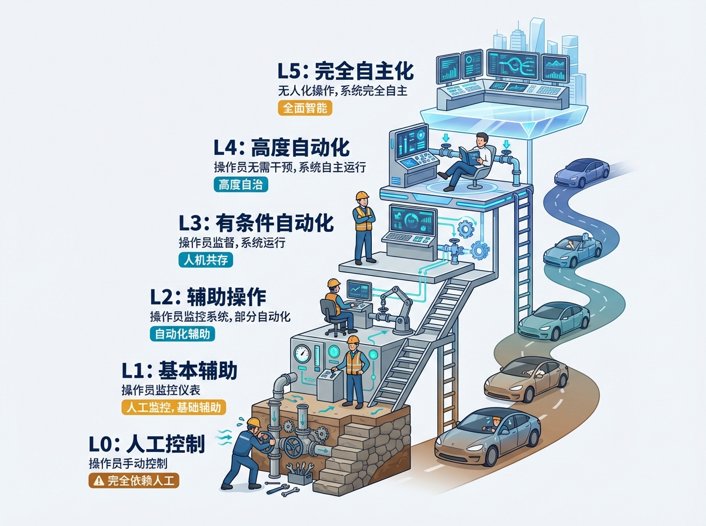
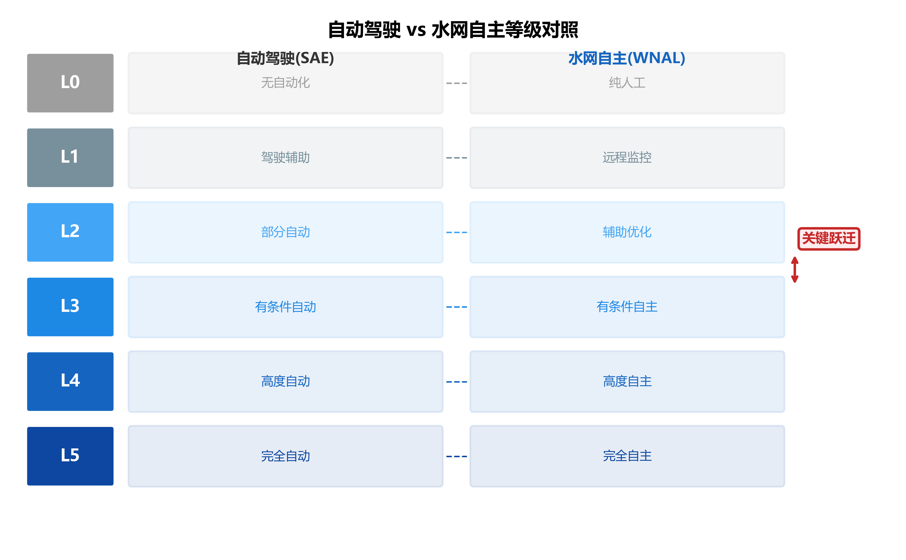
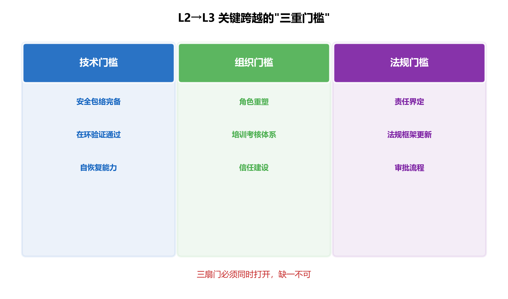
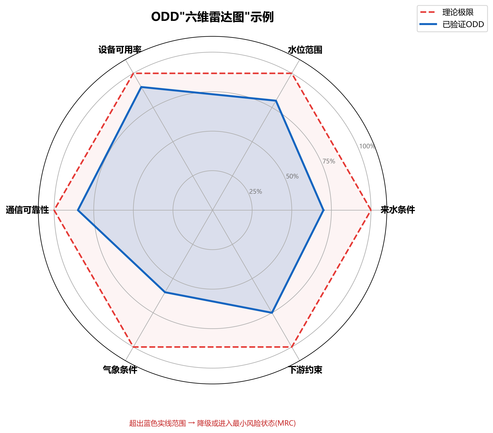
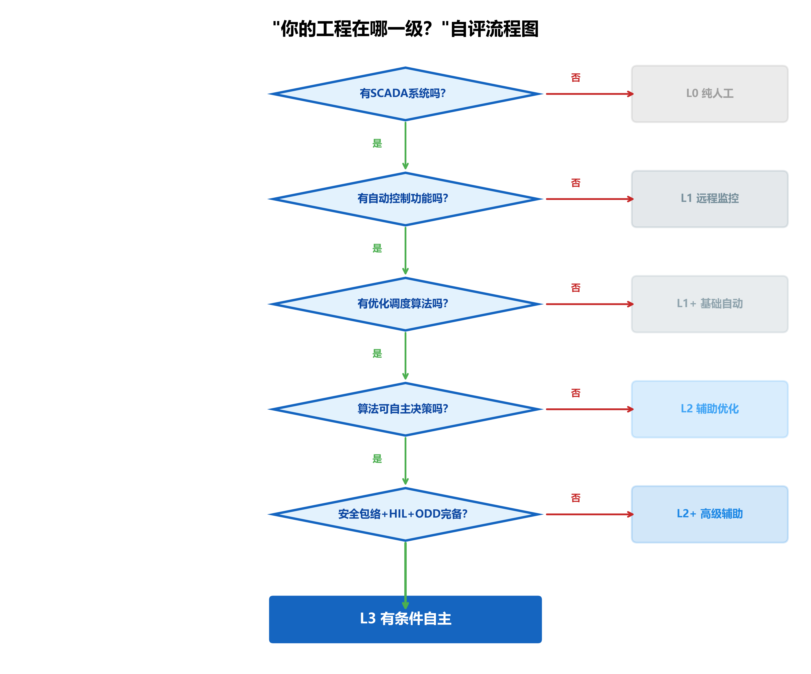

# 第五章 水网学开车——从L0到L5

> **本章要点**
> - 水网自主等级（WNAL）将水利工程的自主运行能力分为L0到L5六级，为全行业提供了统一的"共同语言"——让"我们工程智能化了"变成可量化、可比较、可验收的标准描述。
> - L2（条件自动化）和L3（条件自主）之间隔着一条鸿沟：L2系统给建议、人来拍板；L3系统在限定的运行设计域（ODD）内自主决策并执行，同时必须具备遇到ODD边界时主动降级到最小风险条件（MRC）的能力。
> - $T_c$（特征响应时间/临界控制时窗）是判断"该工况需要L几支撑"的核心参数：如果爆管只给你3分钟反应时间，而你的人工流程需要5分钟，那你就必须购买L3级的系统，让机器先踩刹车——而不是把决策权留给跑步赶来的值班员。
> - 从L2跨入L3需要同时翻越三道门槛：技术门槛（完整安全包络+三关在环验证+黄区自恢复能力）、组织门槛（调度员从"驾驶员"转型为"机长"的角色重塑）、法规门槛（责任矩阵与行业法规的配套更新）。
> - 不是所有工程都要追求L5——目标等级应由系统复杂度、工况变化频率和人力资源约束共同决定；最务实的做法是用5.5节的自评流程图摸清自己的真实等级，再制定踏实可行的逐级升级计划。

## 开篇故事：你的工程在哪一级？

一个同行聚会上，三位水利工程师在比较各自工程的"智能化水平"。

甲说："我们上了SCADA，24小时远程监控，比以前先进多了。以前值班员大半夜跑到闸门口看水尺，现在坐办公室里一目了然。"
乙说："我们不仅有SCADA，还有预报模型和优化调度算法，电脑能给建议。每天早上系统自动算出当天的调度方案，调度员审核一下就执行了。"
丙说："我们工程最先进——上了AI，深度学习模型，还搞了数字孪生。大屏幕上看着可炫了，领导来参观都竖大拇指。"

三个人都觉得自己"很智能"了。但如果用WNAL分级一量——甲大概在L1，乙在L1到L2之间，丙可能也只是L2。L3的门槛，三个人都还没摸到。

甲不服："我们SCADA能自动控制啊——水位到了报警线，闸门自动开。这不就是自主运行？"

不是。那叫"按规则自动执行"——规则是人写的，系统只是忠实执行。遇到规则没覆盖的工况，系统就懵了。比如，规则说"水位超过12米就开闸"，但如果下游同时在泄洪，你开了闸下游更淹——规则没考虑到这种情况，系统照开不误。自主运行的意思是系统能"理解"当前局面，综合考虑多种因素后做出合理决策。这两者之间的差距，就像计算器和智能手机的差距。

丙也不服："我们有AI啊！深度学习预测来水，比传统模型准多了。"

预测准不等于决策自主。AI再准，最后还是调度员按"执行"键。如果调度员不在、或者来不及响应，AI的精准预测就白费了。更关键的是：AI给出的预测有多大把握？最坏情况是什么？如果预测错了系统怎么应对？这些问题没有答案，AI就只是一个"高级参谋"，不是"有限自主体"。

"聪明"和"自主"是两回事。系统能给建议（L2）和系统能在限定条件下自主决策（L3），中间隔着一条鸿沟。

---

## 5.1 为什么要分级？

借鉴来自一个大家都熟悉的领域：自动驾驶。

SAE（美国汽车工程师学会）把自动驾驶分成了L0到L5六个等级[5-1]，从"纯手动"到"完全无人"。这套分级让整个行业有了共同语言——消费者知道自己买的车是L2还是L3，监管机构知道该对哪个等级提什么要求，保险公司知道不同等级的风险差异，研发团队知道下一步该攻克什么。

没有分级之前，大家都说自己的车"有自动驾驶功能"，但谁也不知道具体能做什么、不能做什么。出了事故，也说不清是系统的责任还是驾驶员的责任。分级之后，这些问题都有了清晰的答案。

水网也需要这样一套"共同语言"。现在水利行业的问题也一样：大家都在说"智慧水利""智能调度"，但具体"智能"到什么程度？你的系统能在无人干预下自主运行一天还是一小时？遇到异常工况是自动处理还是报警等人？这些关键问题，没有统一的度量尺。

更实际的问题是：没有统一标准，项目验收就没有标杆。一个"智慧水利"项目花了几千万，甲方说"达到了智能化"，第三方评估说"只是自动化"，谁对？都对，因为"智能化"这个词本身就没有明确定义。建设单位无法准确描述自己的需求，承建单位无法准确承诺交付什么——大家在一团模糊的概念里打转。更严重的是，监管部门无法界定责任：如果一个自称"智能调度"的系统出了事故，到底是系统的问题还是操作员的问题？没有分级标准，这个问题就永远说不清。

CHS提出的WNAL（Water Network Autonomy Level，水网自主运行等级），就是水网版的SAE分级。六个等级，从L0到L5，定义清晰，边界明确。它不是给工程"贴标签"，而是提供三样东西：一是统一的能力定义——"L2意味着什么"大家说法一致；二是清晰的责任边界——每个等级下人和系统各负什么责任；三是升级的路线图——从当前等级到下一等级需要过哪些关。

---

## 5.2 六个等级，一张表看懂

| 等级 | 名称 | 自动驾驶类比 | 水利工程实例 | 人的角色 |
|------|------|------------|------------|---------|
| **L0** | 手动运行 | 手动挡老爷车 | 人工看水尺、手摇闸门 | 全程操作 |
| **L1** | 规则自动化 | 定速巡航 | SCADA+水位报警+PID自动调节 | 全程监督 |
| **L2** | 条件自动化 | 车道保持+自适应巡航 | 规则引擎自动调度+预报辅助 | 持续监督，随时接管 |
| **L3** | 条件自主 | 有条件自动驾驶 | 限定工况下系统自主决策 | 按需接管 |
| **L4** | 高度自主 | 高度自动驾驶 | 大部分工况无需人干预 | 远程监督 |
| **L5** | 完全自主 | 无人驾驶 | 全工况自主运行 | 仅治理审计 |

我们来逐级拆解——

**L0：纯手动。** 老师傅看水尺、手动摇闸门。第一章讲的1975年老李的调度室就是L0。现在还有少数偏远的小型水利工程停在这个等级。

**L1：规则自动化。** 有了SCADA，能远程监控和遥控。水位到了某个值，PID控制器自动调整闸门开度。但所有的规则都是人事先设定好的，系统只是执行。就像汽车的定速巡航——你设定80公里时速，车自动维持，但转弯、超车、应对突发情况都要你自己来。

一个典型的L1场景：某泵站的恒压供水系统。PI控制器根据出口压力偏差自动调节泵速，使管网压力维持在设定值附近。大部分时间工作得很好。但如果管网发生爆管导致压力骤降，PI控制器只会"拼命加大泵速"试图恢复压力——它不会判断"这不是正常用水波动而是管道泄漏"，也不会采取"关闭相关阀门止损"的措施。L1系统的局限就在这里：它忠实执行规则，但不理解规则背后的意图。

L1还有一个隐蔽的风险：操作员的"技能退化"。系统在大部分时间自动运行，操作员渐渐习惯了"看着就好"。但当系统遇到规则没覆盖的情况需要人接管时，操作员的手感和判断力可能已经因为长期不用而生疏了。这在自动化领域是一个经典问题——自动化程度越高，人越不练手，关键时刻接管的能力反而越差。

**L2：条件自动化。** 在L1的基础上加了模型预测和优化建议。系统不仅能执行规则，还能计算"在当前条件下，什么操作方案最好"，然后把方案显示在屏幕上供调度员选择。但最终的"执行"按钮还是由人来按。就像汽车的车道保持+自适应巡航——车能自己保持车道、自动跟车，但你必须手扶方向盘，随时准备接管。

L2和L1的本质区别是：L1"有控制但无模型"——PID控制器不需要理解被控对象的动力学行为，只要"水位偏高就关小闸门"就行了；L2"有模型有优化"——控制器依赖数学模型来预测控制动作的效果，从而做出优化决策。一个具体的工程场景：某灌区主渠道的MPC控制器每15分钟获取一次沿线五个水位监测点的数据，结合下游用水需求预报，优化计算沿线三座闸门的开度调整序列。这比L1的PI定值控制复杂得多——控制器"看到"的不是单个点，而是一段渠道的整体水力响应。

L2对操作员的要求发生了质的变化：操作员不再需要决定"每一步做什么"，而是需要判断"系统建议得对不对"。这要求操作员具备一定的模型理解能力和系统级思维——不再是单纯的设备操作技能。

**L3：条件自主。** 这是质变。在限定的工况范围内（ODD），系统可以自主做出控制决策并执行[5-2]，不需要人逐一确认。调度员从"操作员"变成了"监督员"——大部分时间看着系统运行，只有系统"叫人"时才接管。这就像有条件自动驾驶在高速公路上——限定条件下（天气好、车道线清晰、前方无施工），车可以自己开，你只需要保持注意力。

L3与L2的关键差异在于"安全降级能力"。L2系统遇到自己处理不了的情况，只能报警等人。如果人没及时响应，系统就"僵住了"。L3系统遇到异常时，即使操作员来不及介入，也能自主进入最小风险状态——比如自动降低闸门开度、关闭非关键负荷、切换到保守运行模式。这个自主安全降级能力，就是L3最核心的"硬指标"。没有它，就不能算L3。

信任的建立是渐进的。实际工程中，L3不是"一天翻开开关就上线"，而是经历一个从L2到L3的过渡期。在过渡期内，系统以L3模式运行，但调度员全程"影子监督"——系统做出的每一个决策，调度员都在旁边盯着、记录、评估。如果连续运行几百个小时，系统的表现都在安全包络之内，调度员的信任感才会逐步建立起来。这个过程可能需要几个月甚至一两年。急不得，但方向是明确的。

**L4：高度自主。** 系统能处理绝大多数工况，包括很多异常情况。人只需远程监督，不用时刻盯着。相当于机场航站楼之间的无人列车——特定路线上完全自主运行，人只管维护和特殊情况处理。

L4和L3的区别在于ODD的覆盖范围。L3的ODD是"限定条件下"——可能只覆盖正常工况和部分异常工况，极端工况仍需人接管。L4的ODD大幅扩展，覆盖了绝大多数可预见的工况，包括设备故障、极端天气、多工况叠加等。调度员不需要24小时盯着，可以"值班制"——一个人远程监督多个工程，系统有需要时才通知人。

要达到L4，系统的认知能力必须有质的飞跃——不仅要会算，还要会"理解"。比如，系统不仅要能检测到"上游来水异常增大"，还要能判断"这是因为上游水库紧急泄洪还是因为暴雨汇流"，并根据不同的原因采取不同的应对策略。这就需要认知AI的支持（第八章会讲HydroOS中的认知AI引擎）。

**L5：完全自主。** 理论上的终极目标——全工况、全天候自主运行，人只参与治理层面的审计和规则制定，完全不参与日常运行决策。目前还是远景愿景，即使在自动驾驶领域也没有真正实现。水系统因为涉及公共安全和多方治理，实现L5的难度可能比自动驾驶更大。但L5作为理论上的"北极星"，为技术发展指明了方向——即使永远达不到L5，向L5靠近的每一步都会带来实实在在的效率提升和安全改善。

> [图5-1] **WNAL六级对照表**
>
> 提示词：左右两列对照图。左列"自动驾驶"六级，每级配一个车辆图标（从老爷车到无人车渐变）。右列"水网自主"六级，每级配一个水利图标（从水尺到智能控制台渐变）。两列之间用虚线连接对应等级。L2到L3之间画一条红色粗虚线，标注"关键跃迁"。整体布局清晰对称。蓝绿色调。

---

## 5.3 L2到L3——最关键的一步

当前中国绝大多数水利工程处在L0到L2之间。少数先进工程摸到了L2的上沿。从L2到L3的跃迁，是整条进化路上最关键的一步——因为这一步意味着**系统的角色从"工具"变成了"有限自主体"**。

L2的系统再聪明，最终也是"给人看的"——它算出一个方案，调度员审核、确认、执行。系统是参谋，人是指挥官。

L3的系统在限定条件下可以自己当"指挥官"——它做出决策，直接执行，不需要人逐一点头。人从"指挥官"退到了"监督员"的位置。

这个角色切换听起来简单，做起来极难。因为要同时跨过三道门槛：

**技术门槛。** 系统必须有完整的安全包络（第六章会讲），确保任何情况下都不突破安全底线。必须通过从MIL到HIL的全流程在环验证（第七章会讲），证明系统在各种工况下的行为都是可预期的。必须具备黄区自恢复能力——也就是出了小问题能自己纠正，不需要动不动就叫人。

**组织门槛。** 调度员的角色要从"驾驶员"转变为"机长"。这不是换个岗位名称的事——工作方式完全不同。以前调度员是"主动操作"，每几分钟就要看数据、做判断、下指令；现在是"被动监督+关键时刻接管"，大部分时间系统自己在跑，调度员需要保持注意力但不需要动手。

这种转变比听起来困难得多。一个真实的反馈：某工程试点L3模式的第一个月，调度员反映"比以前更累了"。为什么？因为"主动操作"虽然忙，但心里有底——每一步都是自己做的决定，出了什么情况自己清楚；"被动监督"看起来轻松，但心里没底——系统在做什么？它为什么做这个决定？如果它做错了我能来得及纠正吗？这种焦虑感在初期非常普遍。

化解之道是渐进式信任建立：先在最简单的工况下让系统自主（比如夜间低负荷时段），调度员全程"影子监督"；系统表现稳定后，逐步扩大自主工况范围；最后才是全ODD范围内的自主运行。这个过程需要全新的培训体系和考核标准——调度员不再考"闸门操作"而是考"系统监督和异常判断"。

**法规门槛。** 系统自主做了决定，出了问题谁负责？调度员没按下"确认"键但系统执行了——出了事故算系统厂商的责任还是管理单位的责任？目前的水利法规体系是围绕"人负责"设计的，L3需要配套的法规更新和责任界定框架。这不是技术团队能单独解决的，需要行业管理部门、法律专家共同推动。

三道门槛中，**技术门槛其实是最容易的**——它有明确的标准和验证方法。组织门槛和法规门槛才是真正的"硬骨头"，因为它们涉及制度变革和利益调整。

> [图5-2] **L2→L3的"三重门槛"示意图**
>
> 提示词：三扇大门并排，从左到右依次为：技术门槛（图标：盾牌+代码，标签"安全包络+在环验证+自恢复能力"）、组织门槛（图标：人→机长的角色转换箭头，标签"培训体系+考核标准+信任建立"）、法规门槛（图标：法槌+文件，标签"责任界定+法规更新+审批流程"）。三扇门上方横跨标注"L2→L3：最关键的跃迁"。下方注释"三道门必须同时打开，缺一不可"。蓝绿色调。

---

## 5.4 ODD和MRC：自主运行的"有效范围"和"应急预案"

L3以上的系统有两个关键概念，必须理解透——ODD和MRC。

**ODD（运行设计域）** 回答的问题是：系统在什么条件下能自主运行？

ODD不是一句"什么都能干"，而是一份精确的"有效范围声明"。它用若干条件联合定义了系统自主运行的"舒适区"。比如沙坪水电站的ODD可能包括：

- 来水流量在200到1500立方米每秒之间
- 上游水位在正常运行范围内
- 六台机组至少四台可用
- SCADA通信正常，关键传感器数据延迟不超过10秒
- 下游河道水位不超标
- 不在特殊调度期（如电网紧急调频、防汛调度指令期）

只有这些条件**全部满足**，系统才能在L3模式下运行。任何一条不满足，系统就必须降级——或者切换到L2模式（给建议但让人决定），或者进入MRC。

ODD的设计是一门平衡的艺术。画得太小——比如只覆盖"晴天、正常来水、全部设备健康"——系统一年里可能只有三分之一的时间在L3模式下运行，其余时间都在"叫人"，等于形同虚设。画得太大——比如试图覆盖"百年一遇洪水"——系统在极端工况下的行为验证不充分，出事的风险就高了。

一个务实的策略是"ODD渐进扩展"：先从最小、最有把握的ODD开始（比如只覆盖夜间低流量工况），验证通过后逐步扩展到更多工况（白天高流量、雨天、部分设备故障等）。每次扩展都要重新做在环验证。就像新手司机先在空旷停车场练车（小ODD），然后上市区道路（中ODD），最后才上高速（大ODD）。

值得注意的是，WNAL的ODD比自动驾驶的ODD多了一个重要维度：**多时间尺度。** 自动驾驶的决策时间尺度相对集中——从毫秒级（紧急制动）到分钟级（路径规划）。水系统的时间尺度横跨六个数量级：秒级的闸门控制、分钟级的泵站调节、小时级的渠段调度、日级的流量分配、周/月级的水资源规划。一个L3系统可能在"秒级闸门控制"这个时间尺度上完全自主，但在"周级水资源规划"这个时间尺度上仍需要人来做决定。ODD的定义必须指明：在哪些时间尺度上自主、在哪些时间尺度上需要人。

### $T_c$ 与 ODD 的联动：用数字决定买L几的系统

这里引入一个帮助工程师在实践中界定ODD边界的关键参数：$T_c$（特征响应时间，也称临界控制时窗）。

$T_c$ 的核心含义是：**一旦某个工况出现，留给控制系统完成完整干预（从感知到效果到位）的最大允许时间。**

以爆管为例：管道破裂后，系统压力从正常下限降到服务停止水平需要3分钟——$T_c$ = 3分钟。而你的完整人工响应链路：传感器报警（30秒）→值班员识别（1分钟）→打电话上报（2分钟）→等待批准（3分钟）→下达关阀指令（1分钟）→阀门执行（1分钟），合计约8.5分钟。

$T_c$ = 3分钟，人工链路 = 8.5分钟，缺口显著。结论：**这个工况必须由L3系统在人介入之前自主完成关阀止损动作。** 买L2系统、靠调度员"跑步赶来"是根本来不及的。

**$T_c$ 告诉你该为哪些工况购买哪个等级的系统：**

| $T_c$ 与人工响应时间比较 | 最低需求等级 | 决策逻辑 |
|--------------------------|-------------|---------|
| $T_c$ >> 人工响应时间（如洪水蓄水，$T_c$ = 数天） | L1 或 L2 足够 | 人有充足时间介入 |
| $T_c$ ≈ 人工响应时间（边界情况） | L2 + 强安全包络 | 需要系统提前预警，压缩人工决策时间 |
| $T_c$ < 人工响应时间（如管道爆裂、极端泄洪） | L3 必须 | 人根本来不及，机器必须先踩刹车 |
| $T_c$ 极短（秒级，如水锤事件） | L3 + 硬件联锁 | 连软件控制都可能慢，必须硬件级自动保护 |

这个框架的实践意义是：**ODD的边界不只由"工程能达到什么"决定，也由"哪些工况的 $T_c$ 小于当前响应链路"决定。** 凡是 $T_c$ < 人工响应时间的工况，都必须纳入L3系统的自主干预范围；否则那些工况就是系统的"死角"，出事必然来不及。

**MRC（最小风险条件，Minimum Risk Condition）** 回答的问题是：系统"不会了"怎么办？

> **MRC是什么？** 在自动驾驶领域，MRC是每一款L3以上自动驾驶系统都必须预先设计好的"退路"——当系统超出了ODD的边界、或者遭遇无法处理的突发情况时，系统不能"傻等"，必须自动进入一个预定义的最低风险状态。SAE J3016对MRC的定义是：系统在无法完成动态驾驶任务时，自主实现并维持的一种最小化风险状态。对于汽车来说，这通常意味着减速靠边停车、打开双闪警示灯、锁定车辆。
>
> **水利工程的MRC长什么样？** 水利工程比汽车复杂——因为水网不能"靠边停车"（下面会详细讲），但MRC的设计逻辑是一样的：**每一个WNAL等级的自主运行系统，都必须为每一种可能的ODD超出情景预先设计好MRC方案，并在在环验证中证明它能正确触发。** 没有MRC，就没有真正的自主运行——只不过是把风险转移给了"人来不及的那一刻"。
>
> 水利领域的MRC举例：水库来水超限时，自动将水位控制目标切换到安全低水位；渠道调度失控时，将所有闸门调回预设的保守开度；泵站出现设备故障时，按降功率序列安全停机，而非立即全停导致压力冲击；供水系统传感器通信中断时，切换到"保压优先"的保守控制模式，维持最低服务保证。这些MRC方案不是事后临时想出来的，而是在系统设计阶段就确定、在在环验证中反复测试、在上线前经过HIL验证的标准动作。
>
> 一句话总结：**MRC是每个WNAL等级的"安全气囊"——你希望永远用不到它，但必须确保它在需要的时候能弹出来。**

当系统发现自己超出了ODD范围——比如来水突然暴增超过1500方、或者两台机组同时故障——它不会傻站着等人来。它会自动切换到一个预定义的安全状态。比如：关闭非关键负荷、把所有闸门调到保守位置、启动备用设备、同时报警通知调度员。

这里有一个关键的区别：**自动驾驶汽车遇到问题可以"靠边停车"，水网不能"停水停电"。**

汽车的最小风险状态是"安全停在路边"——车一停，风险就消除了。但水利工程不行：供水必须连续——你不能因为系统"不会了"就停了全城的自来水；发电必须稳定——电网对频率和出力有刚性要求；防洪必须实时响应——洪水不会因为你的系统"在维护中"就暂停。

水系统的MRC不是"停机"，而是**"安全降级运行"**——以保守策略维持基本服务，等待人工介入或系统恢复。比如：把调度策略从"优化效率"切换到"保证安全"，降低泵站出力但不关停，把闸门开度调到一个"怎么都不会超标"的保守位置。MRC状态下效率会下降——比如发电量可能只有正常的60%——但至少系统是安全的、服务是连续的。

这个特点让水网的MRC设计比自动驾驶更复杂：不是简单地"停下来"，而是要在降级状态下维持复杂的多目标运行。MRC方案需要针对每种可能的ODD超出情景分别设计，并且每一种都要通过在环验证。

ODD和MRC的设计是L3系统最核心的工作。ODD画得太小，系统大部分时间都在"叫人"，等于没有自主运行；ODD画得太大，系统在自己能力之外还硬撑，就可能出事故。这需要对工程的各种工况有非常透彻的理解——而这种理解，恰恰来自老调度员几十年的经验。所以CHS反复强调：自主运行不是要替代调度员的经验，而是要把调度员的经验"编码"进ODD和MRC的设计中。老调度员知道"什么时候该保守、什么时候可以放手"，ODD就是把这种直觉转化为定量的边界条件。

> [图5-3] **ODD的"六维雷达图"示例**
>
> 提示词：六角形雷达图，六个维度分别为：来水范围、水位范围、设备可用率、通信可靠性、气象条件、下游约束。实线圈出"自主运行有效域"，虚线圈出"理论极限"。有效域明显小于极限——表示ODD是保守的。标注"超出实线范围→降级/进入MRC"。右侧配文字说明每个维度的含义。蓝绿色调。

---

## 5.5 "你的工程在哪一级？"——自评指南

很多工程师想知道自己的工程算L几。这里提供一个简化的自评流程：

**问题一：有SCADA或远程监控吗？** 没有→L0。有→继续。

**问题二：有自动控制功能吗？** （比如PID水位控制、水位报警自动开闸）没有→L0+到L1之间。有→继续。

**问题三：有基于模型或规则的优化调度系统吗？** （能计算"最优方案"并给调度员看）没有→L1。有→继续。

**问题四：系统能在限定条件下自主做决策并执行，不需要调度员逐一确认吗？** 不能→L2。能→继续。

**问题五：有完整的安全包络定义吗？通过了MIL/SIL/HIL验证吗？有明确的ODD和MRC吗？** 不全有→L2+（接近L3但没达到）。全有→L3。

**补充判断：关键工况的 $T_c$ 评估。** 列出你的工程中响应时间最紧迫的三种工况，估算每种工况的 $T_c$。如果有工况的 $T_c$ 小于当前人工响应链路时间，那么无论其他方面如何，你都需要考虑提升到L3——因为那些工况存在"人来不及"的安全缺口。

大多数工程会停在L1到L2之间——这很正常。中国约9.8万座水库中，相当数量的小型水库仍处于L0或接近L0的水平——有基本的水位监测，但所有调度决策依赖管理员的经验判断。大中型水利工程大多在L1到L2之间——有SCADA，有的还有优化调度模型，但最终决策仍靠人。真正触碰到L3门槛的工程屈指可数，本书后面的三个案例（沙坪、大渡河、胶东）就是其中的先行者。

自评不是为了"比谁高"——不同工程有不同的合理目标等级。重要的不是"现在是L几"，而是"我知道下一步该做什么才能往上走"。自评还有一个实用价值：帮你和领导、和上级主管部门沟通时有一个共同的参照系。"我们工程目前在L1，目标是三年内达到L2"比"我们要搞智慧水利"具体得多，也更容易获得预算和支持。

> [图5-4] **"你的工程在哪一级？"自评流程图**
>
> 提示词：决策树形式的自评流程。从"你的工程有SCADA吗？"开始分支。无→L0。有→"有自动控制（PID等）吗？"无→L1初级。有→"有基于模型/规则的优化调度吗？"无→L1。有→"系统能在限定条件下自主决策而人不逐一确认吗？"无→L2。有→"有完整安全包络+HIL验证+ODD/MRC？"无→L2+。有→L3。每个终点标注等级和简要说明。流程图底部增加" $T_c$ 补充评估"框：列举关键工况 $T_c$ 与人工响应时间对比，有缺口→需升级。流程图风格简洁。

---

## 5.6 不是所有工程都要追求L5

必须强调一点：L5（完全自主）是理论上的远景目标，不是所有工程的必达标准。这一点非常重要——因为在"智慧水利"的热潮中，很容易出现"唯等级论"的倾向，似乎等级越高越好、不追求L5就是落后。这是一个危险的误区。

工程的自主等级目标应该由工程的实际需求决定，而不是由技术追求决定。需求取决于三个因素：系统的复杂度（多大规模、多少闸泵站、多少耦合关系）、工况变化的频率（来水变化快不快、用水需求波动大不大）、以及人力资源的约束（调度团队多大、经验如何、能不能24小时值守）。

加入 $T_c$ 视角，目标等级的判断逻辑会更清晰：如果你的所有关键工况 $T_c$ 都大于人工响应时间，那L2就足够了；如果存在 $T_c$ < 人工响应时间的工况，那必须上L3；如果这类工况数量多、覆盖面广，那就要考虑L4了。

一座偏远的小型水库可能永远停在L1到L2就够了——它的系统规模不大、工况相对简单，有个经验丰富的值守员加上SCADA完全能应付。强行追求L3反而可能得不偿失：技术投资大、维护成本高、人员需要重新培训，但带来的效益提升有限。

相反，对于大型梯级水电站（如大渡河）、长距离调水工程（如胶东调水）这种系统规模大、耦合关系复杂、时效性要求高的工程，L2就不够用了——调度员再有经验，也难以在几分钟内算清十几座电站的联合优化方案。这类工程需要向L3甚至L4迈进。

关键不是追求最高等级，而是**找到适合自己工程的"目标等级"，然后踏实地逐级升上去。** 就像不是每条路都需要自动驾驶——小区里的路，人慢慢开就好了；但在几百公里的高速公路上跑长途，自动驾驶就真的有用了。

怎么确定"目标等级"？一个简单的判断标准：**当你的工程复杂到调度员在极端工况下"处理不过来"的时候，就该考虑提升一个等级了。** 如果调度员日常游刃有余，只是偶尔忙一下，那当前等级可能就够了。但如果调度员经常加班、极端工况时手忙脚乱、老师傅退休后新人接不上——这就是升级的信号。

**升级路线图**——无论你的起点在哪里，每一步都有明确的工作重点：

**从L0到L1：** 核心任务是"数字化"——把人工观测变成自动采集，把现场操作变成远程控制。需要做的事：安装传感器、部署SCADA、配置基本的PID控制回路。投资规模相对可控，见效快。大多数基层水利设施正在走这一步。

**从L1到L2：** 核心任务是"模型化"——给系统装上"大脑"，让它不仅能执行规则，还能计算最优方案。需要做的事：建立水力学模型、部署预测控制算法（MPC）、显式定义ODD。这一步的技术含量明显提高，需要控制论和水力学的交叉专业人才。

**从L2到L3：** 核心任务是"可信化"——让系统的自主决策值得被信赖。需要做的事：设计完整的安全包络、通过MIL/SIL/HIL三级在环验证（第七章会详讲）、定义MRC、建立人机责任矩阵、制定渐进式上线计划。这一步不仅是技术挑战，更是组织和制度挑战。

每一步的前提是上一步的基础扎实。SCADA数据不准就急着上MPC，MPC的预测一定不准；安全包络没画好就让系统自主决策，迟早出事。"欲速则不达"在这里特别适用。

接下来两章，我们就来详细讲L3最需要的两个"硬件"：安全包络（第六章——系统的"保险丝"和"安全气囊"）和在环验证（第七章——在虚拟环境中"试驾"）。有了这两个基础，你的工程才算真正站在了L3的门槛上。而第八章的HydroOS，就是把L3以上所有能力整合在一起的那个"操作系统"。

一步一步来，水网终将觉醒。

---

## 工程师问答

**Q：我们工程目前算L几？**

A：用5.5节的自评流程图走一遍。简单判断法：有SCADA但主要靠人做决策=L1；有优化调度算法给建议但人拍板=L2；在部分工况下系统能自主决策=L3。注意：很多自称"智能调度"的系统其实是L2——AI只是给建议，最终还是人按"执行"键。判断的关键不是系统"能不能算出好方案"，而是"系统能不能在人不确认的情况下自己执行并保证安全"。如果系统必须等人点"确认"才能执行，那就是L2，不管算法多先进。

**Q：是不是所有工程都要追求L5？**

A：完全不是。L5是远景目标，目前在任何工程领域（包括汽车、飞机）都没有真正实现。大多数水利工程的合理目标是L2到L3。关键是找到适合自己工程规模和复杂度的等级，然后踏实地做好基础。一座日常管理完善的小型水库，停在L1就很好——投资少、维护简单、安全可靠。一条几百公里的调水渠道，L2可能就不够用了——调度复杂度超出了人的处理能力，需要向L3迈进。匹配自身需求，不盲目追高。

**Q：L3对管理体制有什么要求？谁来"背锅"？**

A：L3的核心变化是调度员从"做决策"变成"监督决策"。这需要在系统上线前就明确三件事：什么工况下系统可以自主？（ODD定义）什么工况下必须叫人？（ODD边界）出了问题，责任链条是什么？（责任矩阵）这些规则必须写清楚、审批好、文档化好——不能运行中临时定。

具体来说，责任矩阵至少要回答这些问题：系统在ODD内自主决策出了事故，是系统设计方的责任还是运营方的责任？调度员在系统"叫人"后没有及时响应，导致事态恶化，怎么追责？系统因为软件Bug做出了错误决策，但ODD判定没有触发降级，责任在谁？这些问题现在还没有行业统一的答案，但自动驾驶行业正在解决同样的问题，水利行业可以借鉴他们的经验。

**Q：从L1升到L2，第一步该做什么？**

A：第一步不是买算法，而是"摸清家底"[5-4]。具体来说就是做第三章讲的"体检"——搞清楚你的传感器够不够（可观性）、控制手段够不够（可控性）、数据质量行不行。L2的基础是模型，模型的输入是数据。如果SCADA数据延迟大、精度低、经常中断，再好的MPC算法也是"垃圾进垃圾出"。很多工程急于上"智能化"项目但效果不好，根本原因就是L1的基础没打牢。建议用三到六个月时间做数据治理——修复故障传感器、统一数据格式、建立数据质量监控机制——然后再考虑上模型和算法。

**Q：怎么用 $T_c$ 来说服领导投资升级？**

A：$T_c$ 分析是一个非常有效的投资依据工具。具体步骤：（1）列出你的工程中最危险的三种工况（历史上曾造成事故或险情的工况）；（2）估算每种工况的 $T_c$（从出现异常到必须完成干预的最大时间窗口）；（3）测量当前人工响应链路的实际时间（含通知、判断、审批、执行各环节）；（4）画出对比表格，有 $T_c$ 缺口的工况用红色标出。然后问领导："这些红色工况，一旦发生，我们的人工流程来不及——上次某工程出事故就是这种情况。解决方案有两个：A，引入L3系统（投资X万），让机器在人来不及时先踩刹车；B，保持现状，接受这个安全风险。"这个框架把技术问题转化成了风险管理决策，领导更容易理解和批准。

---

## 本章配图

**图5-1　WNAL六级对照表**

**图5-2　L2→L3的"三重门槛"示意图**

**图5-3　ODD的"六维雷达图"示例**

**图5-4　"你的工程在哪一级？"自评流程图**

## 参考文献

[5-1] SAE International. (2021). Taxonomy and Definitions for Terms Related to Driving Automation Systems for On-Road Motor Vehicles: SAE J3016. Warrendale, PA: SAE.

[5-2] 雷晓辉, 苏承国, 龙岩, 等. (2025). 基于无人驾驶理念的下一代自主运行智慧水网架构与关键技术 [J]. *南水北调与水利科技(中英文)*, 23(04): 778-786. doi:10.13476/j.cnki.nsbdqk.2025.0079.

[5-3] 雷晓辉, 龙岩, 许慧敏, 等. (2025). 水系统控制论：提出背景、技术框架与研究范式 [J]. *南水北调与水利科技(中英文)*, 23(04): 761-769+904. doi:10.13476/j.cnki.nsbdqk.2025.0077.

[5-4] Negenborn, R. R., & Maestre, J. M. (2014). Distributed model predictive control: An overview and roadmap of future research opportunities. *IEEE Control Systems Magazine*, 34(4): 87-97.

[5-5] Litrico, X., & Fromion, V. (2009). *Modeling and Control of Hydrosystems*. Springer-Verlag London.

[5-6] Ogata, K. (2010). *Modern Control Engineering* (5th ed.). Prentice Hall.

[5-7] 雷晓辉, 张峥, 苏承国, 等. (2025). 自主运行智能水网的在环测试体系 [J]. *南水北调与水利科技(中英文)*, 23(04): 787-793. doi:10.13476/j.cnki.nsbdqk.2025.0080.

[5-8] Kalman, R. E. (1960). On the general theory of control systems. In *Proceedings of the 1st IFAC Congress on Automatic Control* (Vol. 1, pp. 481-492). Moscow: USSR Academy of Sciences.

[5-9] 雷晓辉, 许慧敏, 何中政, 等. (2025). 水资源系统分析学科展望：从静态平衡到动态控制 [J]. *南水北调与水利科技(中英文)*, 23(04): 770-777. doi:10.13476/j.cnki.nsbdqk.2025.0078.

[5-10] Sutton, R. S., & Barto, A. G. (2018). *Reinforcement Learning: An Introduction* (2nd ed.). MIT Press.

---

> **一句话回顾**：本章的核心信息是，WNAL分级体系为水网自主运行提供了统一的衡量尺——从L0到L5不是荣誉排名而是工程路线图，$T_c$（特征响应时间）是判断哪些工况需要哪个等级支撑的关键参数，L2到L3的跨越是当前最关键的一步，而跨越这道门槛需要技术、组织和法规三扇门同时打开。

> 📖 **深入阅读**
>
> 本章内容基于《水系统控制论》第八章（WNAL L0-L5逐级定义）。
> - WNAL与SAE分级的五个关键差异 → §8.2
> - 各等级的详细技术要求和判据 → §8.3
> - ODD的六维定义方法和MRC设计原则 → §8.4
> - 等级跃迁的四重门槛分析 → §8.5
> - L2→L3跃迁的路线图 → §8.6
> - $T_c$ 与等级判断的量化方法 → §8.4.2
