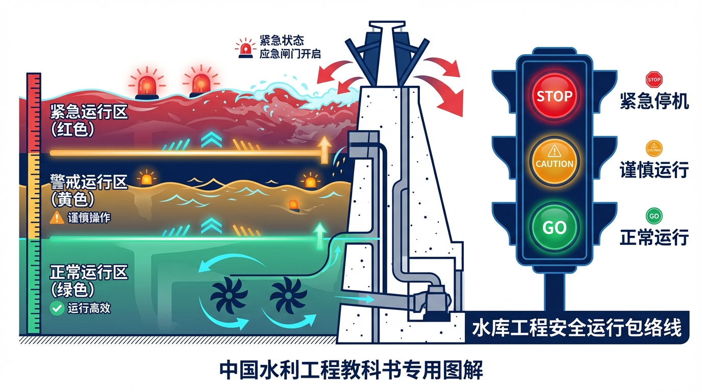
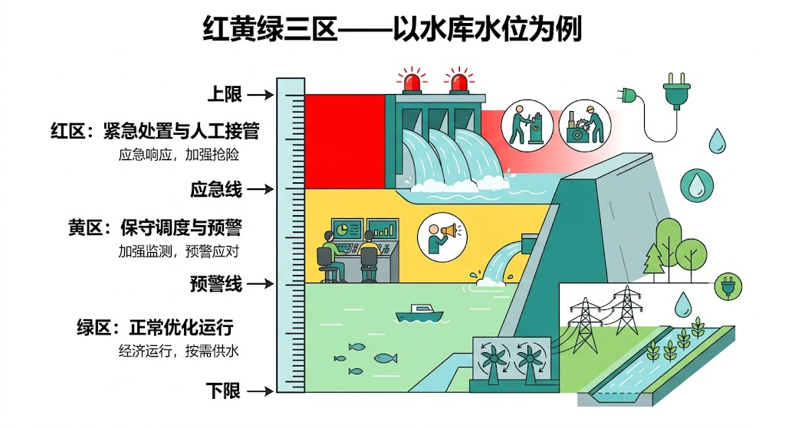
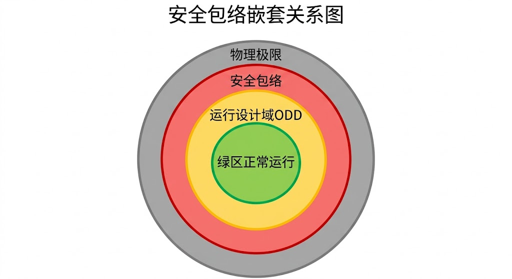
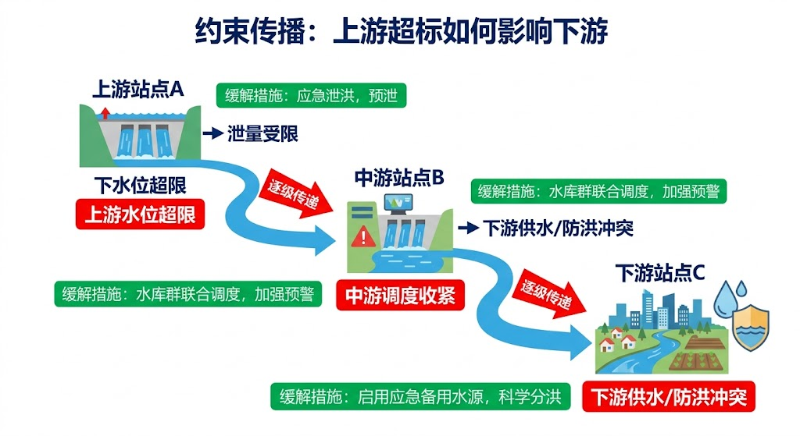
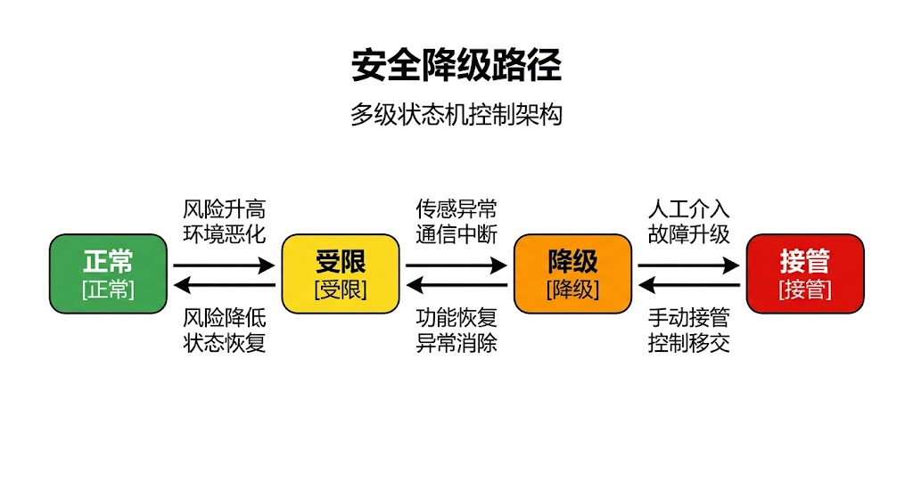

# 第六章 安全第一——水网的"保险丝"和"安全气囊"

> **本章要点**
> - 传统报警系统是"信号灯"——通知人来处理；安全包络是"ABS+安全气囊"——在人来不及反应之前自动介入控制，是CHS八原理中地位最高的硬约束，也是系统迈向L3的必要条件。
> - 红黄绿三区机制让系统具备分级响应能力：绿区追求效率最大化、黄区自动切换保守策略并尽力恢复、红区执行预定义的确定性保护动作——不优化、不计算、先保命。
> - 约束传播（上游进黄区即触发下游预警）可将梯级系统的水位越限事件减少70%以上，并大幅减少闸门的"急操作"次数，延长设备寿命。
> - 安全包络并不等于永远保守：绿区的设计目标恰恰是让系统放开手追求效率，只在边界被触及时才收紧约束；沙坪水电站的实践表明，引入安全包络后全年总发电量反而提升了。
> - 安全包络的三区边界不是拍脑袋定的，而是从物理极限、运行经验、不确定性评估三个来源取交集，并需经过在环验证（下一章主题）才算真正确立。

## 开篇故事：报警响了十二次，没人管

某灌区，一个夏天的午后。SCADA系统在两小时内连续发出了12次水位报警。值班员小王一开始还紧张地去看，第三次之后就麻了——每次看都是某个渠段水位略高于预警线一点点，然后自己又回去了。他判断是传感器波动，没当回事。

第十三次报警时，水位真的超标了。等小王发现时已经来不及了——一段渠道漫溢，下游三百亩农田被淹，直接经济损失超过八十万元。

事后分析，前12次报警里有3次是真的异常前兆——上游某个支渠的分水闸没关严，多出来的水在缓慢累积。9次是传感器噪声和水面波浪引起的假警报。但值班员无法区分——报警系统只管"超了就响"，不管"为什么超""趋势往哪走""这次和上次有什么不同"。而且，报警系统的设计思路就是"响铃→等人来判断→人决定怎么办"——在这个链条中，"人"成了最薄弱的环节。

事故处理会上，有人批评小王"不负责任"。但站在小王的角度：一个下午12次报警，每次都要跑去查看、分析、判断，每次都是虚惊一场——到第12次的时候，你还能保持第1次的警觉度吗？

这个故事在水利行业并不罕见。有一个专门的术语来形容：**"报警疲劳"**——报警太多、太频繁，值班员从紧张变成麻木，最终丧失了对真正异常的警觉性。石化行业早就认识到了这个问题，专门制定了报警管理标准（ISA-18.2），核心思想是"少而精的报警好过多而滥"。据石化行业的统计，一个设计良好的报警系统，操作员每小时处理的报警不应超过6到12个；超过这个数量，报警管理的有效性就会急剧下降。很多水利SCADA系统的报警频率远超这个标准——因为大多数报警阈值是在系统安装时简单设定的，从未根据实际运行经验做过优化。

CHS的安全包络要做的事情完全不同：不是"响铃等人来"，而是**让系统自己识别风险等级、自己做出对应的安全动作**，就像汽车的ABS——你踩刹车踩重了，不需要你手动调节制动力，ABS自动帮你做脉冲制动，防止车轮抱死。你甚至不知道ABS介入了，但它已经在保护你了。

报警疲劳的本质是：系统把"感知到风险"和"处理风险"之间的全部责任都推给了人——而人在高频、重复的刺激下必然疲劳。安全包络的本质是：系统承担起从感知到执行的完整闭环责任，人只需要在系统无法自处的情况下介入。这是两种根本不同的设计哲学，不是报警阈值调一调就能解决的区别。

---

## 6.1 红黄绿三区——比报警更聪明的安全机制

CHS把系统运行状态分成三个区：

**绿区：放心跑。** 所有指标在安全范围内，而且离边界有足够的裕度。这时候系统追求"最优"——效率最高、发电最多、损耗最小，怎么好怎么来。调度员可以放心让系统自由优化。

打个比方：你开车在空旷的高速公路上，前后无车，天气好，路面干。这时候你可以开到限速，按最舒服的方式开。

**黄区：减速慢行。** 某些指标接近安全边界，或者裕度不够了。系统自动切换到保守模式——优化目标从"效率第一"变成"安全第一"。具体来说：控制策略变得更保守，允许牺牲一些效率来换取更大的安全裕度；闸门动作幅度变小，避免大幅调整带来的波动；预测的不确定性被放大，按"最不利情景"来决策。

关键是：**这个切换是自动的，不等人来。** 黄区的设计目标是让系统用自己的能力把状态拉回绿区。如果成功了，调度员可能根本不知道系统刚刚经历了一次"黄区事件"——系统自己处理了。

打个比方：你开车时前方突然出现拥堵，车距变近了。你还没来得及踩刹车，自适应巡航系统已经自动减速了——从120降到80，保持安全车距。你都没感觉到"危险"，因为系统已经替你处理了。

**红区：紧急制动。** 指标到了安全极限，再往前就是真正的危险区域。系统直接执行预定义的确定性保护动作——紧急泄洪、强制启泵、切换备用通道、闸门回到安全位置。不需要优化，不需要协商，先保命再说。全程自动记录，事后审计。

红区的保护动作是"确定性"的——不是"最优"的，也不是"计算出来的"，而是事先设计好、经过验证的固定动作序列。为什么不在红区也用优化算法来计算最佳应对？因为红区意味着系统已经接近危险边缘，这时候不能冒任何"算错了"的风险。一个固定的、保守的、经过反复验证的保护方案，比一个"可能更优但也可能算错"的实时计算方案更可靠。宁可损失效率，也不冒安全风险。

打个比方：汽车安全气囊。碰撞发生的一瞬间——不是在你反应过来之后，而是在碰撞的那几毫秒内——气囊已经弹出来了。它不问你"要不要弹"，也不给你"三个选项"让你挑一个最优的，它直接保护你。

和传统报警系统的根本区别在哪里？

传统报警是"信号灯"——告诉你"红灯了"，剩下的你自己看着办。系统的作用到"通知"为止。如果值班员上厕所了、在接电话、或者像开篇故事里的小王一样"报警疲劳"了——报警就白报了。

安全包络是"ABS+安全气囊"——它不仅告诉你有风险，它直接介入控制。在你反应过来之前就已经采取了保护措施。系统的作用贯穿从"感知"到"执行"的全过程。即使值班员当时不在，系统也能自主完成从检测到响应的完整闭环。

这就是为什么安全包络是CHS八原理中地位最高的[6-3]——因为它是所有自主运行能力的"安全底座"[6-1]。没有安全包络，系统的自主决策就是"没有刹车的赛车"——跑得越快越危险。有了安全包络，系统才能放心地追求效率——因为无论优化算法怎么折腾，安全底线都守得住。

> [图6-1] **红黄绿三区示意图：以水库水位为例**
>
> 提示词：纵轴为水位，从下到上。底部深蓝色区域标注"死水位以下（不可进入）"。往上绿色区域标注"绿区：正常运行，追求效率"，画上优化曲线。再往上黄色区域标注"黄区：保守运行，安全第一"，画上保守曲线。最上方红色区域标注"红区：紧急保护，确定性动作"，画上阶梯式紧急动作。每个区域之间的边界标注切换条件。右侧配简要说明：绿区→黄区"自动减速"、黄区→绿区"自动恢复"、黄区→红区"紧急制动"。蓝绿色调为主。

---

## 6.2 安全包络怎么画？——不是拍脑袋

红黄绿三区的边界不是凭感觉画的，而是基于物理约束的量化边界[6-3][6-4]。

**红区边界（最外层）** 来自物理极限和设计标准——水库的校核洪水位、大坝的结构安全极限、下游河道的安全泄量。这些数字在工程设计阶段就确定了，基于严格的工程计算和规范标准，不可随意更改。比如某水库的大坝设计标准规定：坝前水位不得超过252米。这就是红区边界——超过252米，大坝结构可能失效，后果不堪设想。

**黄区边界（中间层）** 来自运行经验和安全裕度——考虑到模型预测误差、设备响应延迟、人员反应时间等因素，在红线之内再留出一段"缓冲区"。黄区的宽度取决于系统的不确定性有多大：不确定性越大，黄区越宽（因为需要更多裕度来应对"意外"）。

继续上面的例子：红区边界是252米，但考虑到来水预报可能偏低30%、闸门从关闭到完全打开需要15分钟、在这15分钟内水位可能再涨0.5米——那么黄区边界可能设在250米。也就是说，水位到了250米，系统就自动切换到保守模式，开始逐步增大泄洪量。这样即使来水比预报大、闸门响应有延迟，水位也不会冲到252米的红线。

黄区宽度的确定是一个精细的工程计算，不是拍脑袋。需要考虑的因素包括：来水预报的统计误差范围、闸门和泵站的最大响应速度、通信链路的最大延迟、模型预测的置信区间。这些因素叠加在一起，决定了"系统需要多少裕度才能在最不利情况下仍然安全"。

**绿区边界（最内层）** 就是正常运行范围——日常调度都在这个范围内进行。绿区内系统可以自由追求效率最大化：多发电、少耗能、精准供水。

三层边界从外到里嵌套：物理极限 → 设计限值 → 运行包络。就像俄罗斯套娃——最外面那层是"绝对不能碰"的硬约束，中间那层是"最好别碰"的保守约束，最里面那层是"随便折腾"的自由空间。

值得注意的是：安全包络不是静态的。随着季节变化（汛期和非汛期的水位约束不同）、工况变化（来水大时黄区自动加宽、来水小时黄区可以收窄）、设备状态变化（某台泵故障后，可控性下降，黄区需要加宽），三区的边界会动态调整。这种"活的"安全包络比"死的"固定阈值更科学，也更实用——它不会在安全的时候限制你，也不会在危险的时候放过你。

还有一个容易忽视的来源：**$T_c$ 倒推法。** 第五章讲到，$T_c$（特征响应时间）是从异常出现到必须完成干预的最大允许时间。安全包络的黄区边界，可以从 $T_c$ 反向推算：如果系统在水位达到黄区边界时触发保守策略，留出的时间必须大于最坏情景下的完整响应链路（从感知→算法→执行→效果到位）。如果黄区宽度不够，系统即使进入了黄区也来不及自救，那黄区就形同虚设——直接跳红区。因此，黄区的宽度不仅取决于预报误差，也取决于 $T_c$ 与响应链路时间的对比。$T_c$ 越短，黄区必须越宽，甚至可能导致绿区大幅压缩。

> [图6-2] **安全包络的"嵌套关系"**
>
> 提示词：同心圆/嵌套矩形示意图。最外层红色虚线标注"物理极限（不可逾越）"。中间层橙色实线标注"设计限值（黄区边界）"。内层绿色实线标注"运行包络（绿区范围）"。圆心标注"当前运行点"。每层之间标注间距含义："裕度=应对不确定性""缓冲=预留反应时间（与Tc挂钩）"。右侧配文字说明三层的来源和确定方法。

---

## 6.3 约束传播——"前面有事故，后面也要减速"

如果只有一个水库，三区机制很简单。但真实系统是一连串水库或闸门串联——上游超标了，会连锁影响下游。

想象高速公路：前面三公里处出了事故，你这里还看不到。但如果前面的车已经开始减速了，你也应该跟着减速——不能等自己看到事故现场才刹车，那就太晚了。

安全包络的约束传播机制做的就是这件事：上游水位偏高进了黄区→下游闸门的最大允许开度应该自动限制（因为上游可能还要多放水，下游要留出接纳能力）→下下游的安全裕度也要相应收紧（级联效应）。整条渠道像一条"安全链"，一环收紧，环环跟进。

具体怎么传播？一个简化的例子：大渡河梯级上有三座串联电站A、B、C。正常情况下，每座电站都在绿区运行，各自追求发电效率最大化。某天上游来水突然增大，A站水位开始上升，进入黄区。A站自动启动保守模式：加大泄洪、降低发电出力。这些调整意味着A站下泄的水量增加了——B站在未来一两个小时内将接收到这股增大的来水。

如果B站的安全包络是"各管各的"，B站会等到自己的水位也涨上来才开始反应——但那时候B站的黄区时间窗口可能已经很短了，手忙脚乱。

有了约束传播，B站在A站进入黄区的同时就收到了"预警信号"：上游来水将在1.5小时后增大约20%。B站的安全包络自动收窄——绿区范围缩小，黄区提前启动，预留更多接纳能力。这样当增大的来水到达B站时，B站已经做好了准备，平稳地吸收了来水增量，自己仍然在黄区或绿区内运行。同样的信号继续传递给C站，C站也提前做好准备。

这种"安全约束的级联传播"是安全包络设计中最精妙的部分，也是最容易被忽略的部分。传统的报警系统是"各管各的"——每个站点只看自己的阈值，不管上下游的状态。结果可能出现这种情况：上游已经在紧急泄洪了，但下游的系统还在"绿区"里优化发电——等上游的洪水传到下游，一下子从绿区直接跳进红区，连黄区的缓冲都来不及用。

安全包络的级联传播就是为了避免这种情况：上游一进黄区，下游也自动提高警戒——虽然下游自己的水位还在绿区，但它"知道"上游出事了，提前做好准备。

级联传播的效果有多大？一个对比数据：某梯级电站在没有级联传播的情况下，上游突发来水导致中游电站水位超标的平均响应时间是45分钟（从检测到响应完成）；引入级联传播后，中游电站在上游来水增大的同时就开始预防性调整，水位超标事件减少了约70%，剩余的超标事件中，水位偏差幅度也比以前小了一半以上。

级联传播还有一个被忽视的好处：**减少闸门和泵站的"急操作"。** 没有级联传播时，下游电站是在水位已经开始上涨后才匆忙加大泄洪——闸门要快速大幅调整，对设备冲击大，下游水位波动也大。有了级联传播，调整是提前、渐进、平稳的——闸门缓慢调整，水位平稳过渡，设备磨损小，下游影响也小。这对延长设备寿命和减少维护成本有实实在在的价值。

> [图6-3] **约束传播示意：上游超标如何级联影响下游**
>
> 提示词：从左到右三个水利节点（水库A→渠道→水库B→渠道→水库C）。水库A水位进入黄区（黄色标注），箭头传播到水库B（B的允许范围自动收窄，标注"预防性收紧"），再传播到水库C（C也相应调整）。对比下方"无级联传播"的情景：A黄区但B和C无反应→洪水传播后B直接进红区。两种结果对比鲜明。

---

## 6.4 "保险丝"vs"安全气囊"——两种保护机制

安全包络内部有两类保护机制，分别对应不同的危险等级：

**"保险丝"（硬约束保护）**——不可逾越的物理安全限制。比如水库水位的绝对上限、闸门的最大开度、泵站的最大转速。这些限制刻在控制器里，任何指令都不能突破。就像家里的保险丝——电流太大就熔断，不管你愿不愿意。即使优化算法算出了一个"效率极高但水位会超标0.1米"的方案，保险丝也会直接拦截——不执行。没有商量余地。

在工程中，"保险丝"通常由硬件联锁实现：闸门控制器内部设有不可修改的极限值，即使上层软件发出了超越极限的指令，控制器也会拒绝执行。这种"硬件级否决权"是安全的最后底线——软件可能出Bug，但硬件联锁不会被软件Bug绕过。

**"安全气囊"（优雅降级）**——在接近危险之前的主动防护。黄区的保守策略就属于这一类：系统主动降低效率、放大裕度、收紧约束，用"优雅"的方式把状态拉回安全区域。你可能感觉到"最近系统发电少了一点"，但你不知道系统其实刚刚帮你避开了一次事故。

"安全气囊"的关键特征是**"提前介入、逐步加力"**。不是等到危险临头才一脚急刹车，而是在远处就开始减速、在近处逐渐加大制动力。具体到水利系统：水位刚进黄区时，系统可能只是把泄洪量增加10%；如果水位继续上升，增加到20%、30%……力度随风险递增。这种"渐进式响应"比"全有或全无"的报警机制平滑得多，对设备的冲击更小，对下游的影响也更可控。

好的安全包络设计是两者的结合："安全气囊"尽可能在前面把风险化解掉，"保险丝"作为最后一道防线兜底。理想情况下，"保险丝"一辈子都不会被触发——因为"安全气囊"已经把所有风险都挡在了外面。

---

## 6.5 安全包络不等于保守

有人会问：安全包络会不会太保守，影响发电效益？

短期看，安全约束确实限制了优化空间——你不能把所有裕度都用光来多发一度电。黄区运行时效率会降低，红区的紧急动作可能导致短暂停机。

但这个"成本"往往被高估了。一个常见的误解是"安全包络让系统永远在保守模式下运行"——错了。安全包络的设计目标恰恰相反：**在安全的时候尽可能放手，在危险的时候及时收紧。** 绿区内系统可以自由优化、不受任何额外约束；只有进入黄区才会限制优化空间。而一个设计良好的安全包络，全年中绿区运行时间占85%到95%——真正限制效率的黄区和红区时间很短。

长期看，安全包络带来的收益远超它的"成本"：

第一，**减少事故频率和损失。** 一次渠道漫溢事故的直接经济损失（农田受损、抢修费用）加上间接损失（供水中断的社会影响、监管处罚），可能是一年多发几个百分点电量的收益的几十甚至上百倍。安全包络把事故概率从"偶尔发生"降低到"几乎不发生"，这笔账怎么算都划算。

第二，**降低人工干预次数和频率。** 系统自己能处理黄区事件，调度员不用频繁手动干预。沙坪水电站的实践数据表明：引入安全包络后，调度员的人工干预次数减少了约40%——系统把大量原来需要人来处理的"小波动"自己消化了。调度员的工作从"频繁救火"变成了"偶尔检查"。

第三，**提高系统可信度，为L3上线扫清障碍。** 管理层和监管部门最担心的是安全问题。有了经过验证的安全包络，他们更愿意批准系统在L3模式下运行——因为安全底线有硬件级的保障，不依赖于人的及时响应。这意味着安全包络不仅是技术工具，更是推动自主运行落地的"信任基础设施"。

第四，**积累运行数据，持续改进。** 每一次黄区事件、每一次自动恢复、每一次红区触发都被完整记录下来。这些数据是优化安全包络参数的宝贵资源——哪些黄区事件是真正的风险前兆，哪些只是正常波动？黄区的宽度是否可以适当收窄？红区的保护动作是否太激进？有了数据支撑，安全包络可以越用越精准。

---

## 6.6 安全包络与WNAL的关系

安全包络不是一个独立的技术模块——它是WNAL等级跃迁的"必过之关"。

回顾上一章的WNAL分级：从L2到L3的跃迁意味着系统从"给建议"变成"自主决策"。这个跃迁之所以难，核心原因就是安全责任的转移——L2出了问题人负责，L3出了问题系统要先自己兜住。安全包络就是系统"兜住"的能力保障。

具体来说：L2系统可以没有完整的安全包络——因为最终决策由人来做，安全兜底靠的是调度员的判断。但L3系统必须有——因为在ODD范围内，系统自主决策，如果没有安全包络，一个算法Bug或一次预测失误就可能酿成事故。安全包络就是L3系统的"安全网"：即使优化算法出错了，安全包络也能在错误导致危险之前自动纠正。

这也解释了为什么CHS把安全包络排在八原理的第四位——它不是最先要做的（先要把系统建模好、搞清楚可控可观性），但它是最不可妥协的。前三条原理做不好，系统效率差一些；安全包络做不好，系统可能出人命。

$T_c$ 的视角在这里也很重要。安全包络能否有效发挥作用，关键条件之一是：黄区边界的设计要保证系统进入黄区后的自动响应能在 $T_c$ 内完成。如果某个工况的 $T_c$ 只有2分钟，而系统的黄区自动响应（从检测到效果到位）需要5分钟——那安全包络在这个工况下形同虚设，必须升级为硬件联锁或L3级别的更快自主响应。因此，安全包络的设计不能孤立进行，必须对照体检报告中的 $T_c$ 分析，确保每个关键工况的 $T_c$ 都在安全包络的覆盖能力范围之内。

从第三章"体检"到第五章"WNAL分级"再到本章"安全包络"，形成了一条清晰的升级路径：先做体检，搞清楚系统的可控可观性现状（哪些能看到、哪些能控制）；然后确定目标WNAL等级（第五章还引入了$T_c$来量化各工况的紧迫程度）；如果目标是L3以上，就必须设计安全包络。体检是"诊断"，WNAL是"目标"，安全包络是"保障"——三者缺一不可。

但安全包络画好了，怎么知道它真的管用？不能等到真出事了才验证——那代价太大了。必须在"虚拟水网"里提前测试。这就是下一章的主题：在环验证——先在电脑里"试驾"，确认安全包络在各种工况下都靠得住，然后才敢上真实工程。

> [图6-4] **安全降级路径图：从正常运行到最小风险状态**
>
> 提示词：从左到右的状态转换图。起点"正常运行（绿区）"→触发条件→"保守运行（黄区）"→自动恢复成功→回到绿区。或：黄区→继续恶化→"紧急保护（红区）"→确定性保护动作→"最小风险状态（MRC）"→等待人员评估→手动恢复或确认恢复。每个状态用不同颜色的圆圈表示。转换箭头上标注触发条件和动作。整体呈流程图风格。

---

## 工程师问答

**Q：我们现在也有报警系统，和安全包络有什么区别？**

A：报警系统是"通知机制"——告诉你出事了，让你来处理。安全包络是"控制机制"——在超标之前就自动介入，把状态拉回安全范围。报警需要人在回路里才能工作；安全包络不需要人——它直接嵌在控制算法内部。打个比方：报警像火灾报警器——"着火了快跑"；安全包络像自动喷淋系统——火苗刚起来就自动灭了，你可能根本不知道"差点着火"。

报警疲劳是两者之间最重要的实践差距。开篇故事里的小王不是不负责任，而是一个暴露了报警机制设计缺陷的典型案例。安全包络通过减少"不必要的人工介入点"来消除报警疲劳——大部分小波动系统自己处理，调度员收到的只有系统真正处理不了的问题，每一条告警都值得认真对待。

**Q：安全包络的阈值谁来定？会不会定得太紧或太松？**

A：不是拍脑袋。阈值基于三个来源：物理约束（工程设计标准给出的极限值），运行经验（历史极值统计和典型事故分析），不确定性评估（预报误差的统计特征、设备故障的概率分布）。三者取交集，得到各区的边界值。还有一个关键参照：$T_c$ 倒推——黄区的宽度必须足够支撑系统在最坏情景下完成完整的自动响应链路。

定完之后还要过三道关。第一关是"在环验证"[6-2]（下一章详讲）——在仿真环境里模拟各种工况，验证阈值是否合理。第二关是"专家评审"——请有经验的调度员和水力学专家审核，看阈值是否符合工程实际。第三关是"试运行"——先在实际工程中以"影子模式"运行一段时间（安全包络计算但不执行，只记录），看它的判断和实际调度员的决策有多大差异。三道关都过了，才正式上线。

上线之后也不是一劳永逸。由谁审批修改阈值、多久复核一次、什么条件下必须重新验证——这些也要制度化。太紧会影响效率，太松不够安全——所以需要在运行中持续校准，就像体检一样定期做。

**Q：安全包络会不会太保守，影响发电效益？**

A：短期看会损失一点效率，但长期算总账是赚的。沙坪水电站的实践数据表明：引入安全包络后，虽然单次调度的峰值效率略有下降，但全年的总发电量反而提升了——因为减少了事故停机和保守性人工干预。以前调度员为了安全，习惯性地把水位控制在远离红线的位置——比安全包络的绿区边界还保守得多。安全包络反而"精准释放"了一部分被过度保守浪费的裕度——在确保安全的前提下，允许水位运行得更接近最优区间。结果是：安全性提高了，效率也没降——双赢。

**Q：我们工程连安全包络的概念都没有，是不是差距太大了？**

A：大部分工程其实已经有了安全包络的"雏形"——只是没有用这个名字。你的调度规程里写的"水位不超过XX米""泄洪流量不低于XX方每秒"，这些就是红区边界的原型。你的调度员根据经验在红线之内留的"安全裕度"，就是黄区的原型。CHS要做的不是从零开始，而是把这些散落在规程和经验里的安全规则系统化、量化、自动化。第一步可以很简单：把现有调度规程中所有的安全约束梳理出来，统一成一张"约束清单"；第二步给每个约束定义红黄绿三区的边界值；第三步把这些边界值写进控制系统。即使不做在线自动控制，仅仅是让SCADA大屏上实时显示当前各指标处于哪个区——绿色安心、黄色注意、红色行动——就已经比传统的"超了就报警"好很多了。

**Q：安全包络和ODD、MRC是什么关系？**

A：三个概念是配套的，不是独立的。ODD（运行设计域）定义系统在哪些条件下可以自主运行；安全包络定义在ODD范围内系统的操作约束（红黄绿三区）；MRC（最小风险条件）定义当系统超出ODD边界或进入红区时的安全降级状态。三者的关系可以类比：ODD是系统"有效运行范围"的地图，安全包络是在这张地图里的"限速牌和警戒线"，MRC是"一旦偏离地图该停哪里"。没有ODD，系统不知道什么时候该切换到人工模式；没有安全包络，系统在ODD内部可能做出危险动作；没有MRC，系统出了ODD范围只能"僵在那里"等待救援。三者缺一不可。

---

## 本章配图

**图6-1　红黄绿三区示意图：以水库水位为例**

**图6-2　安全包络的"嵌套关系"**

**图6-3　约束传播示意：上游超标如何级联影响下游**

**图6-4　安全降级路径图：从正常运行到最小风险状态**

## 参考文献

[6-1] 雷晓辉, 苏承国, 龙岩, 等. (2025). 基于无人驾驶理念的下一代自主运行智慧水网架构与关键技术 [J]. *南水北调与水利科技(中英文)*, 23(04): 778-786. doi:10.13476/j.cnki.nsbdqk.2025.0079.

[6-2] 雷晓辉, 张峥, 苏承国, 等. (2025). 自主运行智能水网的在环测试体系 [J]. *南水北调与水利科技(中英文)*, 23(04): 787-793. doi:10.13476/j.cnki.nsbdqk.2025.0080.

[6-3] 雷晓辉, 龙岩, 许慧敏, 等. (2025). 水系统控制论：提出背景、技术框架与研究范式 [J]. *南水北调与水利科技(中英文)*, 23(04): 761-769+904. doi:10.13476/j.cnki.nsbdqk.2025.0077.

[6-4] IEC 61508:2010. Functional safety of electrical/electronic/programmable electronic safety-related systems. International Electrotechnical Commission.

[6-5] ISO 26262:2018. Road vehicles - Functional safety. International Organization for Standardization.

[6-6] 中国大坝工程学会. (2020). 大坝安全评估规程 [S]. 北京：中国水利出版社.

[6-7] International Commission on Large Dams (ICOLD). (2020). Dam Safety Guidelines. Paris: ICOLD.

[6-8] 水利部. (2022). 水利工程运行安全保障指南 [S]. 北京：中国水利部.

[6-9] Hollnagel, E., Braithwaite, J., & Wears, R. L. (Eds.). (2013). *Resilient Health Care*. Ashgate Publishing.

[6-10] 雷晓辉, 许慧敏, 何中政, 等. (2025). 水资源系统分析学科展望：从静态平衡到动态控制 [J]. *南水北调与水利科技(中英文)*, 23(04): 770-777. doi:10.13476/j.cnki.nsbdqk.2025.0078.

[6-11] Leveson, N. G. (2011). *Engineering a Safer World: Systems Thinking Applied to Safety*. MIT Press.

[6-12] Reason, J. (2000). Human error: models and management. *British Medical Journal*, 320(7237), 768-770.

[6-13] Malaterre, P. O., & Baume, J. P. (1998). Modeling and regulation of irrigation canals: Existing applications and ongoing researches. In *Proceedings of the 1998 IEEE International Conference on Systems, Man, and Cybernetics* (pp. 3881-3886). IEEE.

[6-14] Litrico, X., & Fromion, V. (2009). *Modeling and Control of Hydrosystems*. Springer-Verlag London.

[6-15] Negenborn, R. R., & Maestre, J. M. (2014). Distributed model predictive control: An overview and roadmap of future research opportunities. *IEEE Control Systems Magazine*, 34(4): 87-97.

[6-16] Ogata, K. (2010). *Modern Control Engineering* (5th ed.). Prentice Hall.

[6-17] 中华人民共和国水利部. (2013). 水工建筑物安全鉴定与管理规范 [S]. 北京：中国水利出版社.

---

> **一句话回顾**：本章的核心信息是，安全包络是水网走向自主运行的"安全网"——它把系统安全从"靠人值守"变成了"由系统兜底"，没有它，任何自主决策都是"没有刹车的赛车"，有了它，效率与安全才能在同一条跑道上并行；而安全包络的三区边界必须对照 $T_c$ 分析来设计，再经过在环验证来确认，才算真正立得住。

> 📖 **深入阅读**
>
> 本章内容基于《水系统控制论》第九章。
> - 三区划分的详细规则和切换逻辑 → §9.2
> - 安全包络的嵌套结构设计 → §9.2.2
> - 多变量安全包络的协调约束和级联传播 → §9.2.3
> - 安全包络与 $T_c$ 的量化关系 → §8.4.2（结合第五章 $T_c$ 概念）
> - 安全包络的治理价值和经济分析 → §9.2.5
> - 沙坪水电站的三区运行规则实例 → 本书第九章 或《水系统控制论》第十三章
