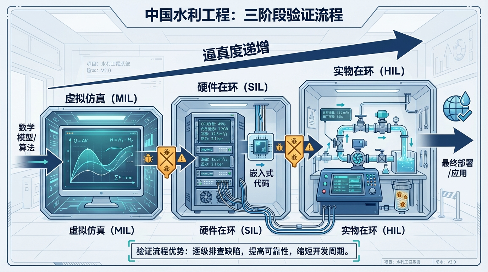
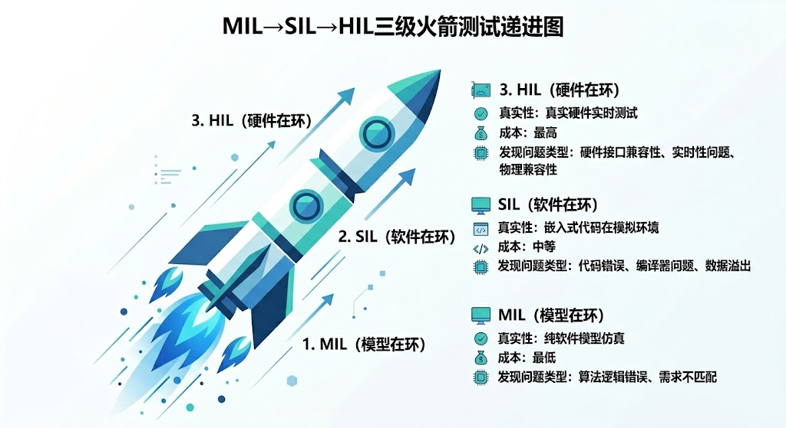
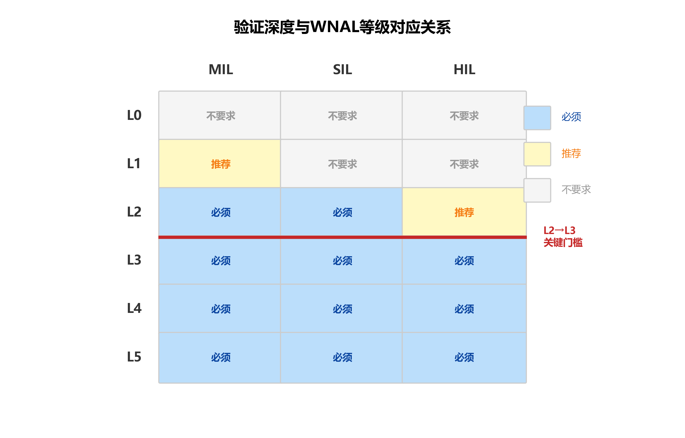
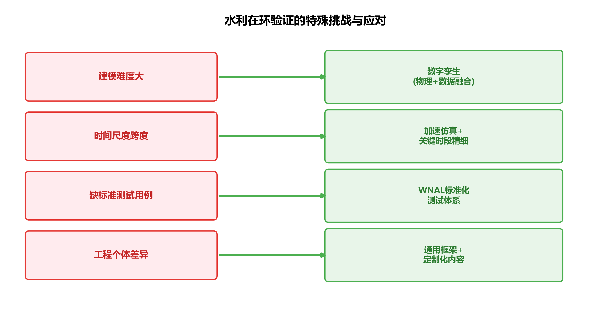
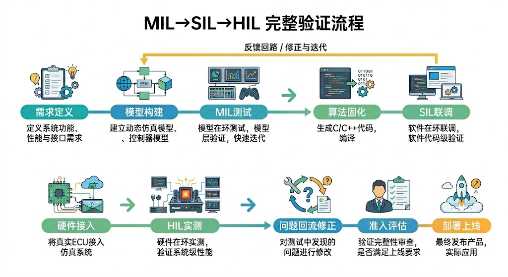

# 第七章 先在电脑里"试驾"——在环验证

> **本章要点**
> - MIL（模型在环）、SIL（软件在环）、HIL（硬件在环）三关分别发现算法逻辑错误、代码实现缺陷和硬件集成问题——三类问题性质完全不同，不可跳关合并；沙坪HIL阶段发现的9个问题（含3个A类缺陷）全是SIL无法暴露的硬件时序和通信问题。
> - 发现Bug越早代价越低——工程行业的"1:10:100规则"在水利系统中可能要放大到"1:10:1000"，因为水利系统的运行阶段修复必须等待合适窗口期，期间还需要人工顶岗。
> - 验证深度与WNAL等级直接挂钩：L2必须完成MIL和SIL、关键回路还要过HIL，L3必须三关全过且覆盖全工况，L4还要覆盖极端和对抗场景——从L2开始在环验证就不是"可选项"，而是硬性准入门槛。
> - 水利在环验证面临建模难、时间尺度跨度大、缺乏标准化测试用例库、工程个体差异大四项特殊挑战；数字孪生技术的发展正在快速降低建模门槛，未来五到十年在环验证将成为水利智能化项目的标配流程。

## 开篇故事：那个在HIL上才发现的Bug

沙坪水电站做智能化改造时，控制算法在电脑仿真（MIL）阶段表现完美：13种典型工况全部跑通，水位控制精度达标，安全包络从未被突破。负荷申报策略在两年历史数据回放中也表现优异——发电量提升、闸门动作次数减少。团队信心满满，准备上线。

然后上了HIL平台——把算法灌进真实的PLC控制器，通过真实的通信线缆连到仿真服务器上。第一个测试场景就出了问题：控制器和仿真服务器之间的通信存在80毫秒的延迟。这个延迟在MIL阶段是零（因为算法和模型都在一台电脑上，数据传输不经过物理线缆），但在真实硬件上是存在的。80毫秒听起来微不足道，但在多个闸门需要协联动作的场景下，这个延迟导致闸门动作的时序错乱——算法要求"先关A闸门再开B闸门"，结果两个指令几乎同时到达，A还没关到位B就开了，两股水流叠加，水位出现了一个意外的"尖峰"。

这还不是最危险的。后续测试又陆续发现了8个类似的问题：有的是PLC扫描周期（100毫秒一次）与SCADA采集周期（5分钟一次）之间的数据对齐逻辑有漏洞；有的是紧急停机和泄洪闸开启的联锁时序在特定故障工况下会冲突；还有的是MRC（最小风险状态）安全降级触发后，部分设备的状态反馈信号丢失。9个问题中有3个属于"A类缺陷"——如果带入现场运行，可能导致重大事故。

如果这些问题在现场才发现，代价是什么？轻则一次真实的水位超标事故，重则闸门失控、下游受灾。而在HIL平台上发现，修改通信协议、调整时序逻辑、完善联锁条件，前后花了三周，总成本不到现场事故修复费用的十分之一。

这就是在环验证的价值：**在虚拟世界里犯的错误，在真实世界里就不需要再犯一次。** 而且，虚拟世界里可以反复试错、极端测试、故意"搞破坏"——这些在真实工程上是绝对不敢做的。

在环验证这个理念并不是水利行业的发明。航空航天领域用了几十年——每架飞机的控制系统在上天之前，都要在地面模拟器上跑几千小时。汽车行业也是如此——自动驾驶算法在路测之前，先在虚拟环境里跑几百万公里。核电站的控制系统更是要经过严苛的多层级验证才能上线。这些行业有一个共同的经验教训：**控制系统的复杂度一旦超过人的直觉判断能力，"试着来"就不够了——必须系统化地验证。**

水利行业长期以来依赖"设计→施工→调试→运行"的线性模式：先把系统建好，然后到现场"试参数"——不行就改，改到差不多就交工。这种模式在简单系统（一个PID回路、一台泵站）上还行，但当系统升级到L2以上——有了MPC优化、安全包络、多节点协调——"试参数"就不够用了。因为可能的工况组合太多，现场试不过来；而且有些极端工况（百年一遇洪水、多设备同时故障），你在现场根本不敢试。

---

## 7.1 三关考验

在环验证就像飞行员的训练路径——先在教室学理论，再上模拟器，再由教练陪着飞真飞机，最后才能独自飞。

**MIL（模型在环）：课堂理论。** 算法和水系统模型都在一台电脑上运行——用Matlab、Python或者Simulink这类软件环境。验证的核心问题是"逻辑对不对"。

具体来说，MIL阶段要回答：控制策略覆盖了多少种工况？在每种工况下，水位、流量、发电量等指标是否满足目标？安全包络的三区切换逻辑在边界条件下是否正确触发？遇到极端来水时，MRC是否正确启动？

MIL的优势是成本极低、迭代极快。发现一个逻辑错误，改几行代码，重新跑一遍就行——整个过程可能不到十分钟。沙坪案例中，团队在MIL阶段跑了13种典型工况加两组多年来水长系列回放，覆盖了从枯水期到大洪水的各种场景，把控制逻辑反复打磨了三轮才通过。

MIL的局限也很明显：它只验证"逻辑"，不验证"实现"。就像你在纸上画了一张完美的建筑图纸——图纸逻辑没问题，但用什么材料、工人能不能按图施工、管道接口对不对——这些MIL管不了。

**SIL（软件在环）：飞行模拟器。** 控制算法从Matlab/Python翻译成真正要部署的工程代码（通常是C或C++），在真实的软件平台上运行，但被控对象仍然是仿真模型。验证的核心问题是"代码行不行"。

为什么需要这一步？因为算法和代码之间存在一个容易被忽视的"翻译损耗"。Matlab里的浮点运算默认是64位双精度，但PLC控制器可能只支持32位单精度——精度差了一半。Matlab里的矩阵运算一行代码就搞定，翻译成C语言可能要写几十行循环——任何一行都可能有Bug。还有数值稳定性问题：MPC优化算法在Matlab里跑得好好的，翻译成C之后可能因为浮点舍入误差导致优化器不收敛。

SIL还要验证运行速度。控制算法必须在规定时间内完成计算——如果控制周期是5分钟，算法在4分钟内必须算出结果。MIL阶段不太关心这个（电脑慢点也没关系，反正是离线仿真），但SIL必须确认代码在目标硬件的计算能力下"跑得动"。沙坪的实践中就遇到过这个问题：MPC优化算法在实验室电脑上跑30秒就出结果，但在工控机上跑了4分半——差点超时。SIL阶段发现后，团队优化了算法的矩阵运算效率，把计算时间压缩到2分钟以内。

SIL还能发现一类特别隐蔽的Bug：**"数据对齐"问题**。控制算法需要同时使用多个传感器的数据（水位、流量、闸门开度），但这些数据的采集时刻可能不完全同步——水位是整点采的，流量是整点后10秒采的，闸门开度是整点后30秒采的。在MIL里这个问题不存在（所有数据都是同一时刻的仿真值），但在SIL里引入了真实的数据采集接口后，时间戳不对齐的问题就暴露出来了。如果不处理，控制器可能用"一分钟前的水位"配"刚刚的流量"来做决策——这在快速变化的工况下会导致控制精度明显下降。

**HIL（硬件在环）：教练陪飞。** 工程代码灌进真实的PLC控制器硬件，控制器通过真实的通信线缆和接口连到实时仿真服务器上——仿真服务器模拟水库、渠道、闸门的水力行为，但控制器是真的。验证的核心问题是"硬件稳不稳"。

HIL能发现的问题是前两个阶段完全看不到的：通信延迟（信号从控制器到执行机构再反馈回来，实际需要多长时间？）、信号精度（传感器的电压信号转换成数字信号时，精度损失多少？）、电磁干扰（控制柜里的强电设备会不会干扰通信信号？）、故障响应（断电了、通信中断了、传感器坏了，系统怎么反应？）。

HIL的另一个关键价值是**故障注入测试**——故意制造各种故障，看系统的保护机制是否正常工作。比如：突然切断某个传感器的信号（模拟传感器故障）、给控制器发一个错误的水位数据（模拟通信错误）、让一台泵突然"卡死"（模拟设备故障）。这些测试在真实工程上绝对不敢做——谁敢在正在运行的水电站上故意拔传感器的线？但在HIL平台上可以随便做，而且必须做。

每一关验证的问题不同，漏掉任何一关都可能留下隐患。

> **常见误区：SIL通过了，还需要HIL吗？**
>
> 一个在实际项目中反复出现的误区是："SIL已经验证了代码，HIL不就是重复劳动？"——这是错误的。三关发现的问题**类型完全不同**：MIL发现算法逻辑错误（比如极端工况下控制策略不收敛），SIL发现代码实现缺陷（浮点精度、数据对齐、计算超时），HIL发现硬件集成问题（通信延迟、电磁干扰、时序冲突）。SIL通过只能说明"代码实现了算法"，不能说明"硬件能正确运行代码"——就像模拟考试通过了，不代表路考不用考：模拟考考的是你的驾驶知识，路考考的是你在真实道路上的判断和操控，两者考的根本不是同一件事。沙坪HIL阶段发现的9个问题（其中3个A类缺陷）全部是在SIL阶段"看不见"的硬件时序和通信问题——正是这个道理的最好注脚。

用一个通俗的比喻来总结三关的关系：你写了一篇论文（MIL验证逻辑），然后排版打印出来（SIL验证实现），最后投稿到期刊（HIL验证集成）。论文内容可能写得很好，但排版时弄丢了一个关键公式（SIL问题）；排版也没问题，但投稿系统的文件格式不兼容导致图片显示不出来（HIL问题）。每一步出问题，最终结果都是"被拒稿"——但问题的根因和解决方法完全不同。

沙坪的实践给出了一组真实的"三阶段发现问题"数据：MIL阶段发现了5个逻辑层面的问题（主要是极端工况下的控制策略不收敛）；SIL阶段发现了3个实现层面的问题（数值精度和运行效率）；HIL阶段发现了9个集成层面的问题（通信时序、联锁逻辑、信号丢失）。如果跳过MIL和SIL直接做HIL，这17个问题会全部堆在HIL阶段——排查和修复的难度将成倍增加，因为你分不清"是逻辑错了还是代码错了还是硬件接口错了"。

> [图7-1] **MIL→SIL→HIL "三级火箭"**
>
> 提示词：三级火箭垂直排列。底部MIL"纯软件"，中间SIL"真代码+虚拟水网"，顶部HIL"真硬件+虚拟水网"。每级标注验证内容和成本等级（$、$$、$$$）。右侧时间线标注"离现场越来越近，发现Bug越来越贵"。最上方标注"通过三关→可以上线"。

---

## 7.2 为什么不能跳级？

"直接上HIL不就行了？反正HIL最接近真实。"

不行，原因有三。

第一，**成本差距巨大**。HIL的调试成本是MIL的几十倍。一个逻辑错误在MIL里改几行Matlab代码、重新跑一遍仿真就解决了，整个过程不到十分钟。同样的逻辑错误在HIL里发现，要拆控制柜、修改PLC程序、重新编译下载、重新标定参数、重跑全部测试——可能要花一整天。如果团队带着20个逻辑Bug直接上HIL，光调试就要消耗一个月。

第二，**有些问题只有特定阶段才能暴露**。浮点精度问题是SIL的"专利"——MIL里用高精度浮点数，看不出来；HIL里问题已经被精度误差"放大"成了更复杂的故障现象，很难追溯到精度这个根因。又比如，控制算法的稳态误差问题在MIL里最容易分析——因为MIL环境"干净"，没有通信延迟和硬件噪声的干扰，你能清楚看到误差的来源。到了HIL里，稳态误差、通信延迟、信号噪声混在一起，想搞清楚"到底是哪个环节出了问题"要困难得多。

第三，**三层验证是一个"逐层筛选"的过程**。MIL筛掉逻辑层面的错误，SIL筛掉实现层面的错误，HIL筛掉集成层面的错误。每层留下的"干净代码"交给下一层，下一层才能集中精力验证自己层面的问题。如果跳过前面的层，所有问题堆到一起，排查起来就像大海捞针。

验证的黄金法则：**发现问题的时间越早，修复的代价越低。** 航空工业有一条经验法则叫"1:10:100规则"：设计阶段发现一个问题修复成本为1，测试阶段为10，运行阶段为100。水利行业同样如此——MIL阶段改一个Bug可能花1小时，HIL阶段花1天，如果到了现场才发现，可能花1个月加上一次事故的代价。

这个规则在水利行业可能还要乘上一个"放大系数"。原因是水利工程的"运行阶段修复"比其他行业更困难：你不能让水库"停下来"等你修Bug（水一直在来），你不能让渠道"暂停"等你调参数（下游用户等着用水），你甚至不能在汛期做任何大的系统变更（万一出问题赶上洪水后果不堪设想）。所以水利系统的"运行阶段修复"成本不是100，可能是1000——因为你必须等到合适的窗口期才能动手，等待期间要靠人工顶上，而人工的效率和可靠性都远不如经过验证的自动系统。

这就是为什么在环验证对水利行业的价值可能比对其他行业更大——因为"运行阶段出问题"的代价特别高，而在环验证是降低这个代价最有效的手段。

---

## 7.3 验证深度和WNAL等级挂钩

不同自主等级对验证的要求不同：

L0到L1：不要求在环验证。这个等级的控制逻辑很简单（PID恒压、定时开关），靠现场调试就够了。

L2：MIL和SIL必须完成，关键控制回路还要过HIL。L2系统有了模型和优化算法，逻辑复杂度上了一个台阶，光靠现场"试参数"已经不够了。MIL帮你验证算法逻辑，SIL帮你验证代码实现，而关键回路（比如安全联锁、紧急停机）还必须在HIL上验证——因为这些回路一旦出问题就是事故，不能等到现场才发现。

L3：**必须三关全过。** 这是硬性准入门槛，不是"建议"。原因很直接：L3意味着系统在ODD范围内自主决策，调度员不再逐条审核每个指令。如果控制策略有Bug——一个在特定工况下才触发的隐蔽Bug——可能直接导致事故。三关验证就是为了在上线前把这些隐蔽Bug都挖出来。

而且L3要求的不只是"跑通了就行"，还需要足够的**场景覆盖率**。什么叫场景覆盖率？就是你的测试工况覆盖了ODD定义范围内多大比例的运行场景。如果你的ODD说"本系统适用于来水量在50到500方每秒之间的正常工况"，那你的MIL测试至少要把这个范围内的各种来水量都测一遍——不能只测了100方和300方就说"覆盖了"。极端工况（比如接近ODD边界的490方每秒）更要重点测——因为那里是安全包络最容易被触发的地方，也是最需要验证的地方。

L4：要求覆盖极端和对抗场景。L4系统要处理ODD边界附近的极端工况，验证场景不能只是"正常运行"，还必须包括百年一遇洪水、多设备同时故障、通信全面中断等"黑天鹅"场景。

这意味着：如果你的工程想从L2升到L3，"三关全过"是硬性准入门槛。沙坪水电站的经验提供了一个鲜明的参照：它在MIL和SIL阶段完成了充分验证，但HIL平台尚未包含机组电气保护系统的完整回路，因此WNAL自评停留在L2到L3之间——差的就是这"最后一公里"的HIL覆盖。这不是技术做不到，而是需要把机组电气保护系统接入HIL平台，完成事故切机工况的在环测试。这个例子说明：三关验证不是形式主义，缺一关真的就卡在那里上不去。

> [图7-2] **验证深度与WNAL等级对应关系**
>
> 提示词：矩阵图。纵轴三行：MIL、SIL、HIL。横轴六列：L0到L5。每个格子用深色（必须）、浅色（推荐）、白色（不要求）三种颜色填充。L2到L3之间画一条醒目的红色"门槛线"，标注"三关全过才能迈过这条线"。右侧标注各等级对验证的要求简述。

---

## 7.4 水利行业的特殊挑战

在环验证在航空航天和汽车工业已经非常成熟——波音每架飞机上线前要在飞行模拟器上跑几千小时，特斯拉的自动驾驶算法每次更新前都要在虚拟环境里跑几百万公里。但水利行业做在环验证，面临几个独特的挑战。

**第一，被控对象建模难。** 飞机的气动特性、汽车的动力学——这些物理模型已经非常成熟，仿真精度很高。但水利系统的水力学模型复杂得多：明渠的糙率随水位变化、渠道横断面形状不规则、长距离输水的波传播行为要用偏微分方程描述。要建一个"足够逼真"的仿真模型用于在环验证，本身就是一项艰巨的工程。模型不准，验证出来的结论也不可靠——"垃圾进、垃圾出"。

这就是为什么CHS将高保真的物理模型视为整个技术体系的基石，八原理中的"传递函数化"原理也强调：模型质量决定一切后续环节的上限。在环验证的质量，上限取决于仿真模型的质量。

**第二，时间尺度跨度大。** 汽车的控制周期是毫秒级，一次HIL测试跑几分钟就能覆盖很多场景。但水利系统的控制周期从秒级（闸门动作）到天级（水资源调度）甚至月级（水库年度蓄放计划），跨度达到五六个数量级。要在HIL上验证一个年度调度策略，不可能真的跑一年——需要用加速仿真。但加速仿真又可能丢失某些慢过程的动态特性。

一个折中的办法是"分层验证"：快过程（闸门控制、水位调节）用实时仿真，在HIL上逐秒推进；慢过程（月度蓄水计划）用加速仿真，一天的计算时间覆盖一年的运行场景；两者的交界面（比如日调度计划如何影响实时控制）用"混合时间尺度"仿真来验证。这种分层方法增加了验证框架的复杂度，但大大提高了效率。

**第三，缺乏标准化的测试用例库。** 航空业有详尽的适航标准，规定了飞行控制系统必须通过哪些测试场景。汽车业有Euro NCAP碰撞测试标准。但水利行业目前没有统一的"在环验证测试标准"——每个项目自己定测试场景，覆盖度参差不齐。CHS提出的WNAL分级体系正在填补这个空白：为每个等级定义必须通过的验证场景类型和数量，让验证从"各干各的"走向标准化。

**第四，工程个体差异大。** 两架波音737的控制系统几乎一模一样，验证一架就等于验证了同型号所有飞机。但两座水库的水力特性、设备配置、运行规程可能完全不同。这意味着在环验证不能简单"复制粘贴"——每个工程都需要基于自己的物理模型搭建专属的验证环境。好消息是，验证的"框架"（三层结构、测试流程、评价标准）是通用的，只有"内容"（模型参数、测试工况）需要定制。

尽管有这些挑战，水利行业的在环验证正在快速起步。沙坪水电站已经建成了水利行业少数几个完整的HIL平台之一；大渡河梯级电站也在推进联合在环验证体系。更重要的是，随着数字孪生技术的发展，高保真的水力学仿真模型越来越容易获取——这是在环验证的核心基础设施。可以预见，未来五到十年内，在环验证将从"少数先行者的探索"变成水利智能化项目的"标配流程"。

> [图7-3] **水利在环验证的特殊挑战与应对**
>
> 提示词：左右对比的信息图。左侧四个挑战（建模难、时间尺度跨度大、缺标准、个体差异大），右侧对应四个应对策略（数字孪生技术、加速仿真+关键时段精细仿真、WNAL标准化测试体系、通用框架+定制内容）。中间用箭头连接。底部标注"趋势：从少数先行者到行业标配"。

---

## 7.5 从虚拟到真实：还差最后一步

三关验证全部通过，是不是就可以直接在工程上"全自动运行"了？

还不行。在环验证无论多充分，仿真模型和真实系统之间总存在差异——模型没法完美复现所有的物理现象。比如渠道的实际糙率可能和设计值有偏差、闸门的机械磨损导致响应速度比标称值慢、传感器的安装位置导致水位读数和真实水位之间有系统性偏差。这些差异在仿真里体现不出来，只有在真实系统上才能暴露。

所以三关验证通过后，通常还有一个"影子运行"阶段：系统在真实工程上运行，它接收真实的传感器数据，实时计算控制指令——但这些指令不直接发送给设备执行。而是显示在调度员的屏幕上，和调度员自己的决策"并行"。调度员可以对比"系统建议怎么做"和"我准备怎么做"——如果两者大部分时间高度一致，偶尔系统的建议还更优（比如更精准地控制水位、更少的闸门动作），那调度员对系统的信任就会逐渐建立起来。

影子运行期间需要特别关注几件事：一是模型预测和实际观测的偏差——如果系统预测"未来一小时水位上升0.5米"但实际上升了0.8米，说明模型需要校准。二是安全包络的触发情况——系统认为已经进入黄区了，但调度员根据经验觉得没问题（或者反过来），这种分歧需要分析原因。三是边界工况的表现——正常运行时系统和人可能差不多，但在来水突变、设备故障等非常规工况下，差异往往更大。

这个"影子运行"阶段可以持续几周到几个月，取决于工程的风险等级和管理层的信任度。它不属于在环验证的范畴（因为用的是真实工程而非仿真环境），但它是在环验证到正式上线之间不可或缺的过渡环节。上一章提到的"L3上线前的影子监督"就在这个阶段完成——调度员从"主动操作"变成"被动监督"，系统从"给建议"变成"做决策"，两者的角色悄悄完成了交接。

从MIL到SIL到HIL到影子运行到正式上线——整个过程就像飞行员的训练路径：教室理论→飞行模拟器→教练陪飞→独自飞短途→独自飞长途。每一步都在前一步的基础上增加"真实度"，每一步都在积累信心。跳过任何一步都是对安全的不负责任。

上一章讲了安全包络"怎么设计"，本章讲了安全包络"怎么验证"。接下来的问题是：经过验证的控制策略、安全包络、人机接口——这些组件怎么组织成一个有机的整体？水网需要一个"操作系统"来统一调度所有这些功能，就像手机需要一个操作系统来管理所有App。这就是下一章的主题：水网操作系统——HydroOS。

---

## 工程师问答

**Q：我们工程规模不大，有必要搞HIL吗？**

A：取决于你的目标WNAL等级。如果目标是L2或以下，MIL加SIL就够了——验证逻辑正确性和代码实现质量，已经能覆盖大部分风险。但如果想达到L3——哪怕工程规模不大——HIL是必须的。因为L3意味着系统会自己做决策，你必须在上线前确认它在真实硬件环境下也是可靠的。而且，"工程规模不大"往往意味着人手也不多——一旦出事故，可能没有足够的人力来应急处理。安全包络在HIL上验证过了，反而让小工程更安心。

**Q：在环验证和传统的"调试"有什么区别？**

A：传统调试是"建完了再试"——设备装好了、线接好了、参数设完了，开机看看行不行。发现问题就改参数，改不好就拆了重来。在环验证是"建之前就试"——先在虚拟环境里把所有工况跑一遍，问题解决完了再上真实工程。前者是"亡羊补牢"，后者是"未雨绸缪"。更关键的区别在于：传统调试只能测"正常工况"（因为你不敢在真实工程上制造故障），在环验证可以测"极端工况"和"故障工况"——这些恰恰是安全最需要保障的场景。

**Q：搭建在环验证平台要花多少钱？值不值？**

A：成本因工程规模而异。对于一座中小型水电站，一套MIL加SIL环境的搭建成本可能在几十万元级别（主要是软件授权和模型建设的人工成本）；加上HIL硬件平台，总投入在百万元级别。听起来不少，但和沙坪的经验做个对比：HIL阶段发现的3个A类缺陷中，任何一个如果带入现场运行导致事故，修复成本加上停机损失保守估计在千万元级别。花一百万避免一千万的损失——这笔账清楚得很。而且验证平台搭好后可以反复使用：每次策略升级、参数调整、工况扩展，都可以先在平台上验证一遍再上线，长期价值更大。

**Q：没有Matlab这些专业软件，能做在环验证吗？**

A：可以。MIL阶段用Python加开源的水力学仿真库也能做——关键不在工具，在于"有没有一个足够准确的被控对象模型"和"有没有系统化的测试场景设计"。有些团队用Excel做简单的MIL验证也取得了不错的效果。工具可以从简单开始，随着工程需求升级而升级。但"三层验证"的框架和思路——先验逻辑、再验代码、最后验硬件——不管用什么工具都应该遵循。

---

## 本章配图

**图7-1　MIL→SIL→HIL "三级火箭"**

**图7-2　验证深度与WNAL等级对应关系**

**图7-3　水利在环验证的特殊挑战与应对**

**图7-4　MIL→SIL→HIL完整验证流程**

## 参考文献

[7-1] 雷晓辉, 张峥, 苏承国, 等. (2025). 自主运行智能水网的在环测试体系 [J]. *南水北调与水利科技(中英文)*, 23(04): 787-793. doi:10.13476/j.cnki.nsbdqk.2025.0080.

[7-2] 雷晓辉, 龙岩, 许慧敏, 等. (2025). 水系统控制论：提出背景、技术框架与研究范式 [J]. *南水北调与水利科技(中英文)*, 23(04): 761-769+904. doi:10.13476/j.cnki.nsbdqk.2025.0077.

[7-3] ISO 26262:2018. Road vehicles - Functional safety. International Organization for Standardization.

[7-4] Litrico, X., & Fromion, V. (2009). *Modeling and Control of Hydrosystems*. Springer-Verlag London.

[7-5] 雷晓辉, 苏承国, 龙岩, 等. (2025). 基于无人驾驶理念的下一代自主运行智慧水网架构与关键技术 [J]. *南水北调与水利科技(中英文)*, 23(04): 778-786. doi:10.13476/j.cnki.nsbdqk.2025.0079.

[7-6] Ogata, K. (2010). *Modern Control Engineering* (5th ed.). Prentice Hall.

[7-7] The MathWorks, Inc. (2023). Simulink - Simulation and Model-Based Design. Technical Report.

[7-8] Chen, Z., Zhou, H., & Chen, L. (2022). Digital twins for water system modeling and control. *Water Resources Management*, 36(7), 2567-2585.

[7-9] 雷晓辉, 许慧敏, 何中政, 等. (2025). 水资源系统分析学科展望：从静态平衡到动态控制 [J]. *南水北调与水利科技(中英文)*, 23(04): 770-777. doi:10.13476/j.cnki.nsbdqk.2025.0078.

[7-10] Roache, P. J. (1998). Verification and validation in computational science and engineering. *Hermosa Publishers*.

[7-11] Boehm, B. W. (1988). A spiral model of software development and enhancement. *IEEE Computer*, 21(5), 61-72.

[7-12] IEC 61508:2010. Functional safety of electrical/electronic/programmable electronic safety-related systems. International Electrotechnical Commission.

---

> **一句话回顾**：本章的核心信息是，在环验证是"在虚拟世界里犯错而不是在真实世界里犯错"的系统化方法——MIL、SIL、HIL三关不可跳级，对水利系统而言尤为重要，因为这个行业的"运行阶段出事"代价是任何其他行业都难以比拟的。

> 📖 **深入阅读**
>
> 本章内容基于《水系统控制论》第九章。
> - 在环验证的概念与V模型开发流程 → §9.3
> - MIL/SIL/HIL三层验证的详细目标与输出 → §9.3.2
> - 验证深度与WNAL等级的对应关系 → 《水系统控制论》§9.3.2 表9-2
> - 水利在环验证的特殊挑战 → §9.3.4
> - 沙坪水电站的在环验证实践与HIL发现 → 本书第九章 或《水系统控制论》第十三章 §13.7
> - 相关Lei论文：Lei 2025c（在环测试体系）、Lei 2025b（智慧水网架构）

## 本章小结

本章系统介绍了水利智能化系统的在环验证（xIL）方法论，核心要点如下：

- **三关的不同价值**：MIL（模型在环）发现算法逻辑错误，SIL（软件在环）发现代码实现缺陷，HIL（硬件在环）发现硬件集成和时序问题——三类问题性质完全不同，任何一关都不能替代另外两关，跳关合并等于系统性放弃质量保障。
- **越早发现Bug代价越低**：水利行业"1:10:1000规则"——MIL发现的Bug修复代价是1，SIL是10，HIL是100，现场运行阶段是1000；沙坪HIL阶段发现的3个A类缺陷如果带入现场，可能导致真实事故，代价无法估量。
- **在环验证与WNAL直接挂钩**：L2需完成MIL和SIL，关键回路还需HIL；L3必须三关全过且覆盖全工况；L4还需覆盖极端和对抗场景——xIL是WNAL等级跃迁的技术门禁，不可绕过。
- **水利xIL的四项特殊挑战**：建模难（水力过程的仿真精度有限）、时间尺度跨度大（秒级控制到季节调度）、缺乏标准化测试用例库、工程个体差异大；数字孪生技术的发展正在快速降低这些挑战的门槛。
- **xIL是投资而非成本**：将xIL视为"拖慢进度的额外负担"是短视的；相比现场事故的处置成本（经济损失、声誉损失、人员伤亡风险），xIL的投入是高回报的风险控制手段。

## 习题

1. 沙坪HIL测试发现了80毫秒通信延迟导致闸门时序错乱的问题。请解释：（1）为什么这个问题在MIL阶段没有暴露？（2）为什么这个问题在SIL阶段也可能没有暴露？（3）HIL的哪些特性使它能够发现这类问题？

2. 水利在环验证面临"测试用例从哪里来"的挑战。请为一个三渠池串联调水系统设计测试用例矩阵，至少包含：（1）正常工况基线测试；（2）边界工况测试（水位接近黄区边界）；（3）故障注入测试（传感器失效、通信中断）；（4）极端工况测试（百年一遇来水）。

3. 按照"1:10:1000规则"，在MIL阶段投入更多时间和资源以充分发现问题，在后期可以节省大量修复成本。但项目经理常常面临"项目进度压力"。请设计一套说服项目经理充分支持xIL投入的论证方案，包括量化的成本-效益分析框架。

4. 某水库泄洪控制系统准备进行HIL测试。请设计HIL测试平台的基本架构，包括：仿真服务器的配置要求、与真实PLC控制器的接口方式、测试场景的注入机制，以及关键性能指标（实时性、数据保真度）的测试方法。

5. 随着数字孪生技术的发展，"超高精度数字孪生"是否可以完全替代HIL测试（即省去真实硬件）？请论述你的观点，分析数字孪生可以覆盖的测试范围和仍需实物HIL的不可替代场景。
