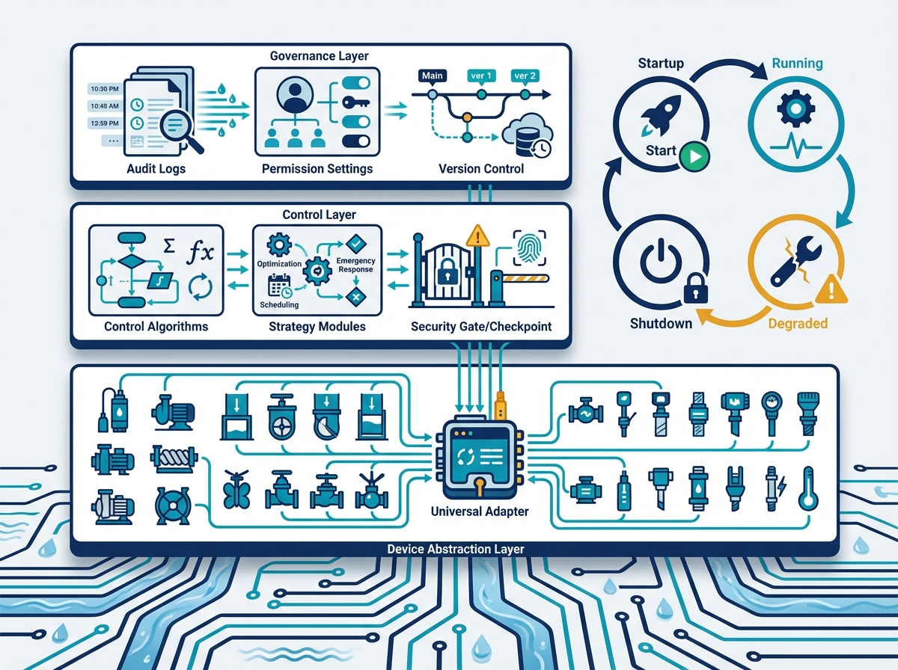
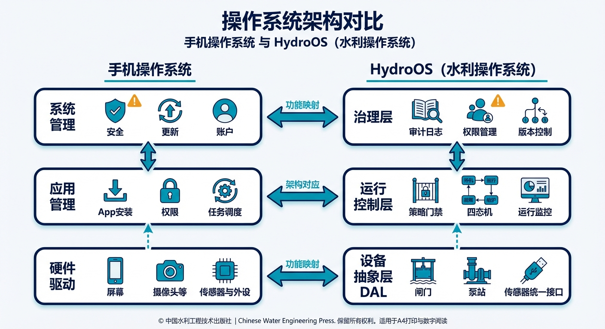
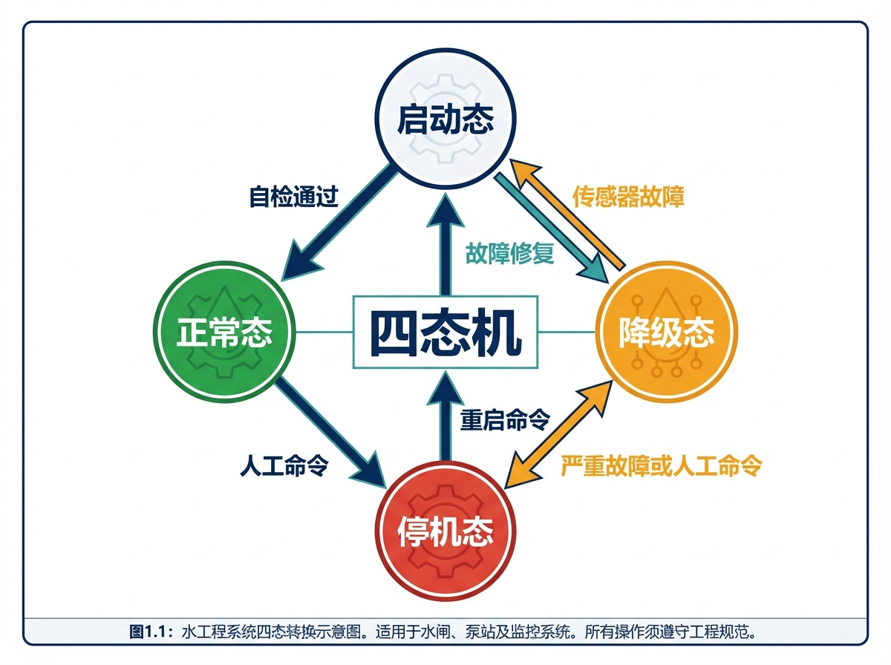
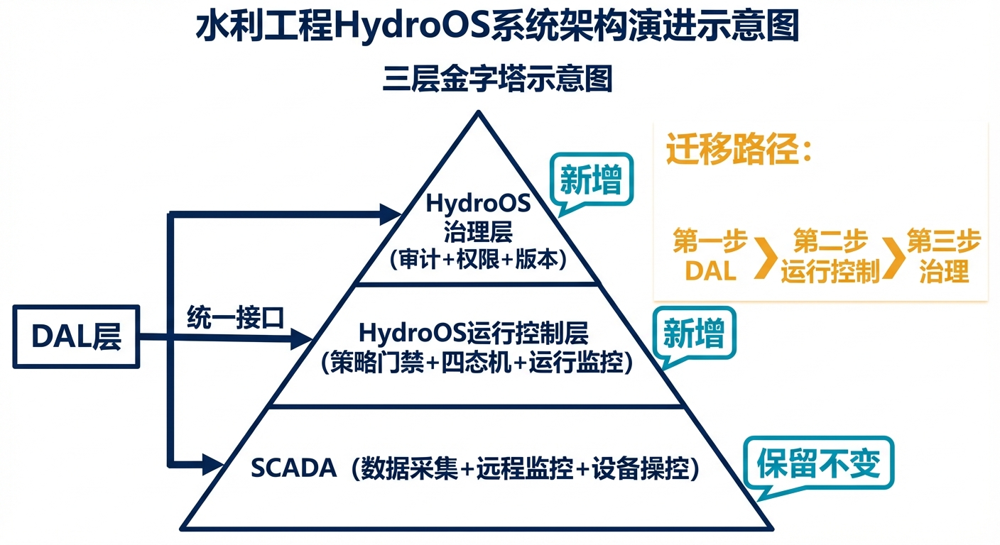
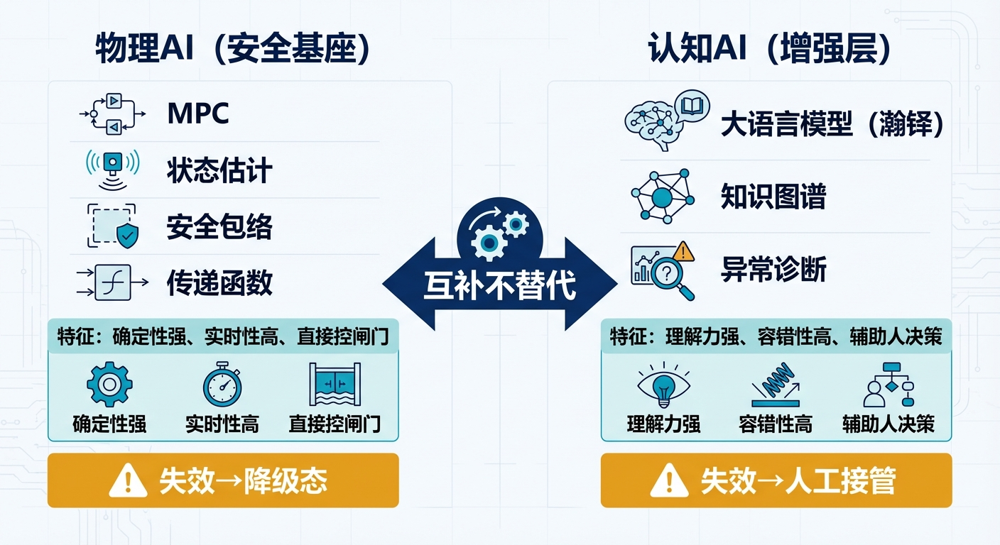

# 第八章 水网的"操作系统"——HydroOS

> **本章要点**
> - HydroOS是架设在SCADA之上的决策管理层，而非替代SCADA——SCADA是"神经末梢"负责感知和执行，HydroOS是"大脑"负责判断和决策，两者是叠加关系，不是替换关系。
> - HydroOS三层架构：设备抽象层（DAL）统一不同厂商设备的"方言"、运行控制层通过策略门禁和四态机管理控制策略的全生命周期、治理层以审计日志和权限管理实现完整溯源。
> - 物理AI引擎（PAI）管"手脚"——MPC、状态估计、安全包络，要求确定性强、实时可靠，直接操控闸门泵站；认知AI引擎（CAI）管"参谋"——大语言模型（瀚铎水网大模型）、异常诊断、决策解释，允许容错但不直接下发控制指令，两者互补而非替代。
> - 断连自治是水网自主运行的"试金石"：水不会因为网络断了就停止流动，HydroOS通过"分层缓存、逐级降级"机制确保通信中断时设备仍能按安全策略运行，而非傻等通信恢复。

## 开篇故事：为什么你的手机需要操作系统？

想象一下没有操作系统的手机：每个App直接控制硬件——相机App自己管摄像头驱动，音乐App自己管喇叭驱动，地图App自己管GPS芯片。每换一个品牌的摄像头，所有拍照相关的App都要重写。一个App崩溃了，可能把整个手机带崩。没有统一的权限管理，任何App都能访问你的所有数据。

听起来很荒谬？但这恰恰是今天大多数水利工程SCADA系统的现状。

某个大型灌区的信息化系统，十五年间分三期建设。第一期用了A公司的SCADA，管14座闸门；第二期扩建用了B公司的系统，管新增的8座泵站；第三期上了C公司的"智慧水利平台"，管水质监测和视频监控。三套系统各有各的数据库、各有各的通信协议、各有各的登录账号。调度员的桌面上开着三个软件窗口，需要的时候在窗口之间来回切换。

有一次，调度员在C系统的视频里看到某段渠道水位偏高，想查一下上游闸门的开度——但闸门数据在A系统里。他切换到A系统，发现A系统正好在做数据库备份，响应很慢。等他终于查到数据，又要切到B系统去看相关泵站的状态。等他把三个系统的信息拼在一起形成一个完整的判断——已经过去了十五分钟。

更麻烦的是版本管理。第三期上了一套新的优化调度模型，但这个模型需要读取第一期SCADA的实时数据。两套系统的数据格式不兼容，中间加了一个"数据转换中间件"。结果有一天中间件出了Bug，新模型读到了错误的数据，给出了一个荒谬的调度建议——"把所有闸门开到最大"。幸好调度员觉得不对劲没有执行，否则下游就要出事了。

这些问题的根源不是某个厂家的产品不好，而是**缺少一个统一的"操作系统"来协调所有的硬件和软件**。这不是个别工程的困境——中国2200多处大中型灌区、9.8万座水库中的相当数量，都面临着类似的"信息孤岛"问题：不同时期建设的系统各自为政，数据不通、接口不兼容、维护成本高。随着智慧水利建设的推进，问题不是在缓解而是在加剧——因为新上的"智能模块"越来越多，但缺少一个统一的平台来管理它们。

HydroOS的设计初衷，就是给智能水网提供这个"操作系统"——让不同厂家的设备说同一种语言，让不同时期建设的系统共享同一套数据，让每一个控制策略的上线都经过统一的审批和验证，让每一个自主决策都有迹可循。

---

> **在读本章之前，先澄清一个常见误解。**
>
> 听到"水网操作系统"，很多工程师的第一反应是：这是要替换掉现有的SCADA系统吗？答案是否定的。
>
> HydroOS是站在SCADA肩膀上的一层，不是要把SCADA推倒重来。**SCADA负责底层**——数据采集、远程监控、设备操控、历史数据存储，这些功能已经在无数工程中经过几十年打磨，稳定可靠，HydroOS没有理由也没有打算替代它们。**HydroOS负责决策层**——把来自不同厂家、不同时期的SCADA系统统一接入，在此之上提供多目标优化调度、多智能体协调（MAS）和认知智能辅助，这些是SCADA本来就不做的事。
>
> 两者的关系是"SCADA+MAS融合架构"：SCADA是工程的神经末梢，负责感知和执行；HydroOS是工程的大脑，负责判断和决策。神经末梢不需要被替换，大脑只需要接入正确的神经信号。这一关系会在§8.3中详细展开，这里先建立这个基本认知，方便理解后面三层架构的设计逻辑。

## 8.1 三层架构

HydroOS分三层，每层的职责清晰明确：

**设备抽象层（DAL）——"驱动程序"。** 不管闸门是A厂还是B厂，传感器是国产还是进口，DAL把它们的"方言"翻译成统一的"普通话"。上层应用不需要关心底层设备的品牌和型号——就像你在手机上写字不需要关心屏幕是三星还是京东方。

具体怎么翻译？比如A厂的闸门控制器用Modbus协议，开度数据是0到10000的整数（对应0%到100%）；B厂的用OPC-UA协议，开度数据是0.0到1.0的浮点数。DAL负责把这两种"方言"统一翻译成HydroOS内部的标准格式："闸门编号GW-03，当前开度47.2%，数据时间戳2026-02-25T14:30:00"。上层的控制策略只跟标准格式打交道，不需要知道底层用的是Modbus还是OPC-UA。

这样做的好处立竿见影：以后换设备厂家，只需要写一个新的DAL驱动——上层所有的控制策略、安全包络、优化算法一行代码都不用改。在传统架构下，换一个厂家的闸门控制器，可能要改上层十几个软件模块的接口代码——工程量巨大，还容易引入新Bug。

DAL还负责一件关键的事：**断连自治**——如果底层设备和上层的通信断了，设备不会"愣住"。DAL会在设备本地保留一份"最近有效指令"和"安全回退策略"，通信中断时设备按这个策略继续运行，直到通信恢复。这对水利系统至关重要——水不会因为你的网络断了就停止流动。后面的§8.5会详细讲这个话题。

DAL的价值不仅仅是技术上的便利——它还有深远的产业影响。在传统模式下，甲方（水利管理单位）一旦选定了某个厂家的设备和系统，就被"锁定"了——因为所有上层软件都是按这个厂家的接口写的，换厂家意味着大量的接口改造。这给了设备厂家很强的议价权——"你不续费我的维保合同？好啊，你的系统离了我的接口就用不了。"

有了DAL，甲方可以自由选择设备厂家——反正上层软件只和标准接口打交道。这打破了厂家锁定，促进了市场竞争，最终受益的是甲方。这也是为什么CHS把设备抽象作为HydroOS的底层——它不仅是技术架构的需要，更是产业健康发展的需要。

**运行控制层——"应用管理"。** 这一层管理所有控制策略的"生命周期"——从开发到测试到审批到上线到监控到退役。

最核心的机制是**策略门禁**。什么是策略门禁？想象机场安检：你的行李（控制策略）要过X光机（在环验证），人要过安检门（代码审查），违禁品不能带（不符合安全包络约束的策略不准上线）。没有经过门禁审批的策略，HydroOS拒绝加载——就像没有经过审核的App不能上架应用商店。

为什么需要门禁？因为在L3系统中，控制策略是"会自己做决策的"——一旦上线就可能直接操控闸门和泵站。如果一个有Bug的策略被不小心上线了，后果可能是灾难性的。策略门禁确保每一个上线的策略都经过了在环验证、安全包络检查和人工审批三道关。

运行控制层还有一个重要功能：**运行时监控**。策略上线后不是"放羊"——HydroOS持续监控每个策略的运行状态：计算时间是否超时？输出是否在合理范围内？和其他策略有没有冲突？如果某个策略出了异常，HydroOS可以自动将它"降级"——切换到备用策略或保守策略，不需要等人来干预。

**治理层——"系统管理员"。** 审计日志、权限管理、策略版本控制。

审计日志的重要性怎么强调都不为过。当系统做出了一个自主决策——比如"凌晨3点把某闸门从30%调到了60%"——事后必须能回答这些问题：这个决策是哪个策略做出的？基于什么传感器数据？当时的安全包络状态如何？有没有触发过黄区？如果调度员当时在线，他看到了什么信息？

这些信息对于两件事至关重要。一是**事故调查**：如果出了问题，完整的审计日志能让调查人员还原事发经过，精确定位问题原因——是策略逻辑错了、数据输入错了、还是设备执行错了？二是**持续改进**：通过分析审计日志中的历史决策数据，可以发现策略的改进空间——哪些场景下系统的决策不够好？哪些黄区事件本可以避免？

权限管理也很关键：谁有权修改安全包络的阈值？谁有权上线新的控制策略？谁有权把系统从L2切换到L3模式？这些权限必须明确定义、严格执行。就像你不会让公司的任何一个员工都有权限改财务系统的数据一样。

版本控制是治理层的第三个支柱。控制策略不是一成不变的——它会随着工程条件变化、运行经验积累而不断更新。每一次更新都必须有版本号、有变更记录、有审批流程、有回退方案。如果新版本上线后出了问题，系统能在几秒钟内回退到上一个稳定版本——就像手机App更新出了Bug可以回退到旧版本一样。没有版本控制的策略管理，就像没有版本控制的软件开发——迟早会陷入"不知道哪个版本是对的"的混乱。

> [图8-1] **HydroOS三层架构（对比手机操作系统）**
>
> 提示词：左右双栏对比。左栏"手机操作系统"三层：底层"硬件驱动"（屏幕、摄像头等）、中层"应用管理"（App安装、权限、任务调度）、顶层"系统管理"（安全、更新、账户）。右栏"HydroOS"三层：底层"设备抽象层DAL"（闸门、泵站、传感器统一接口）、中层"运行控制层"（策略门禁、四态机、运行监控）、顶层"治理层"（审计日志、权限管理、版本控制）。层间用双向箭头连接。色调统一蓝绿。

---

## 8.2 四态机：系统的四种"心情"

HydroOS定义了系统的四种运行状态：

**启动态：** 系统开机自检。检查传感器是否在线、控制器是否响应、通信是否正常、安全包络参数是否加载、策略版本是否正确。自检全部通过才进入正常态。如果自检发现问题——比如某个关键传感器离线——系统不会强行启动，而是停留在启动态并报告问题，等人来处理。这就像飞机起飞前的检查清单——任何一项不合格，不管你赶不赶时间，都不能起飞。

**正常态：** 所有指标在绿区范围内，系统按最优策略运行。这是大部分时间的状态——一个设计良好的系统，全年可能90%以上的时间都在正常态。正常态下，系统追求效率最大化：优化调度算法全力运行，发电量最大化、水损最小化、设备磨损最小化。调度员的角色是"监督者"——看一眼大屏确认一切正常就好。

**降级态：** 某些条件不满足了——传感器故障了、通信中断了、某项指标进入黄区了、某个控制策略的计算超时了。系统自动切换到保守策略，同时向调度员报告情况。降级态不是"出事了"，而是"有些事情不太对，我先稳住"。

降级态有不同的"级别"。轻度降级可能只是关闭了优化功能，用固定的保守策略替代——效率降低了，但安全没问题。中度降级可能是某些控制回路切换到手动模式，由调度员接管局部操作。重度降级就接近停机了——大部分控制功能关闭，只保留最基本的安全保护。

降级态最重要的设计原则是**"优雅"**——不是突然"啪"一下全关了，而是逐步收缩功能，像飞机失去一个引擎后用剩下的引擎继续飞行并安全降落。系统在降级态下仍然要保持基本的水量供给和安全保护——因为水网不能"停机等修复"，下游的城市和农田还在等着用水。

降级态的设计质量，往往是区分"玩具系统"和"生产系统"的分水岭。很多智慧水利项目在演示时表现完美——因为演示条件是理想的。但一到真实运行环境，传感器偏了、通信断了、设备老化了，系统就手足无措。一个成熟的HydroOS，在降级态的处理上花的设计精力不比正常态少——因为系统的可靠性不取决于它在最好的时候有多好，而取决于它在最差的时候有多稳。

**停机态：** 严重故障或人工命令停机。系统执行安全停机流程，所有设备回到预定义的安全位置——闸门回到安全开度、泵站停机、阀门关闭。停机态是最后的"兜底"状态，进入停机态意味着系统已经无法自主维持任何有用的功能，需要人来全面接管。

四态之间的切换规则是预先定义好的，不是系统临时"想"的。这些规则在设计阶段就确定了，经过了在环验证测试，写在了HydroOS的配置文件里。每一次状态切换——从正常到降级、从降级回正常——都自动记录在审计日志中，包括切换的原因、时间、当时的系统状态快照。

> [图8-2] **四态机状态转换图**
>
> 提示词：四个圆形节点排列成菱形。上方"启动态"（灰色），左方"正常态"（绿色），右方"降级态"（黄色），下方"停机态"（红色）。节点间有箭头表示转换方向，每条箭头旁标注转换条件（如"自检通过""传感器故障""人工命令"等）。中心标注"四态机"。简洁状态机风格。

---

## 8.3 SCADA不是要被取代

"搞HydroOS是不是要把我们的SCADA拆了？"——这是工程师们最常见的担忧。答案是：完全不是。

HydroOS不是要推倒SCADA重来，而是在SCADA之上增加一层"大脑"。SCADA仍然负责它最擅长的事：数据采集、远程监控、设备操控、历史数据存储。这些功能经过几十年的打磨，稳定可靠，没有理由替换。

HydroOS在SCADA之上增加的是三类能力：

第一，**统一的设备接口**。不再为每个厂家写适配代码——DAL层搞定所有的"翻译"工作。以后换设备厂家，SCADA层面的配置可能要改，但上层的控制策略和安全包络不需要动。

第二，**策略生命周期管理**。SCADA只管"执行指令"——你给它一个闸门开度指令，它去执行。但"这个指令是怎么来的？经过了什么验证？谁批准的？"——SCADA不管这些。HydroOS管。从策略开发到在环验证到审批上线到运行监控到退役——整个生命周期都在HydroOS的管理之下。

第三，**安全治理**。审计日志、权限管理、版本控制。SCADA有基本的操作日志，但不够细——它记录"某人在某时修改了闸门设定值"，但不记录"修改的依据是什么算法、基于什么数据、安全包络当时处于什么状态"。HydroOS的审计粒度要细得多，能支持事后的完整溯源。

就像给你的老手机装了一个更好的操作系统——硬件没换，但能做的事情多了。迁移路径也是渐进的：先装DAL层（统一设备接口），再装运行控制层（策略门禁和四态机），最后装治理层（审计和权限）。不需要一次性全部到位，可以分步实施、逐步见效。

> [图8-3] **HydroOS与SCADA的关系：叠加而非替代**
>
> 提示词：三层金字塔示意图。底层"SCADA（数据采集+远程监控+设备操控）"标注"保留不变"。中层"HydroOS运行控制层（策略门禁+四态机+运行监控）"标注"新增"。顶层"HydroOS治理层（审计+权限+版本）"标注"新增"。左侧DAL层连接底层和中层，标注"统一接口"。右侧标注迁移路径："第一步DAL→第二步运行控制→第三步治理"。

---

## 8.4 物理AI vs 认知AI：两种"智能"各司其职

HydroOS里的AI分两类，它们的角色完全不同：

**物理AI（安全基座）：** 传递函数模型、MPC优化控制、状态估计、安全包络——这些是"算准、控稳、保安全"的核心。物理AI的特点是：基于物理定律和数学模型，计算过程可追溯，输出结果确定性强（同样的输入一定得到同样的输出），实时性要求高（毫秒到分钟级）。

物理AI是HydroOS的"手脚"——它直接操控闸门和泵站。因此它的可靠性要求极高：失效后果不可接受。一个MPC控制器如果算错了闸门开度，可能导致水位超标；一个状态估计器如果误判了来水量，可能导致安全包络的三区划分出错。所以物理AI必须经过严格的在环验证（上一章的三关），上线后还有运行时监控实时盯着。

打个比方：物理AI是飞机的自动驾驶仪——负责精确地控制飞行姿态和航路。它可以没有人情味，但必须绝对可靠。

**认知AI（增强层）：** 大语言模型、知识图谱、因果推理、异常诊断——这些是"帮人理解复杂局面"的辅助工具。认知AI的特点是：基于数据学习和语言理解，输出结果可能有不确定性（同样的问题可能给出略有不同的回答），不直接控制设备，允许"犯错"（因为人会审核它的输出）。

认知AI是HydroOS的"参谋"——它帮调度员理解局面、解释建议、辅助决策，但不直接按按钮。调度员在面对复杂工况时，最大的困难往往不是"没有计算结果"，而是"看不懂计算结果的含义"。认知AI的价值就在于"翻译"——把复杂的数学优化结果翻译成调度员能理解的语言："建议把闸门开到45%，因为上游来水预计在未来两小时增大20%，提前加大泄量可以避免水位进入黄区。"

瀚铎水网大模型就是认知AI层面的代表。它可以回答调度员的自然语言问题："为什么水位突然涨了？可能是哪几个原因？""上次遇到类似工况是什么时候？当时怎么处理的？""如果把这个闸门关小一点，下游大概多久会有反应？"这些问题用物理AI来回答很困难（它只会给你一堆数字），但用认知AI来回答就自然多了。

两者的关系是互补而非替代：物理AI是底线（不能出错的安全基座），认知AI是提升（可以容错的增强层）。物理AI失效了，系统进入降级态；认知AI失效了，调度员回到"自己看数据做判断"的传统模式——不理想，但不危险。

这两类AI的开发路径也完全不同。物理AI的开发像"造桥"——需要严格的工程计算、精确的参数标定、完整的在环验证，每一步都有明确的验收标准。开发周期长（几个月到一两年），但上线后非常稳定，轻易不需要大改。

认知AI的开发像"培养人才"——需要大量的数据训练、持续的效果评估、不断的迭代优化。瀚铎水网大模型需要"喂"大量的水利知识（调度规程、工程案例、专家经验）才能"学会"回答调度员的问题。它的知识库需要持续更新（新的工况经验、新的规程变化），回答质量需要持续评估。

在HydroOS的架构中，物理AI运行在运行控制层——它是控制回路的一部分，受策略门禁和安全包络的严格约束。认知AI运行在治理层或独立的辅助通道——它不在控制回路内，它的输出需要经过人的审核才能影响控制决策。这个架构上的分离确保了：即使认知AI给出了一个错误的建议，它也不会直接导致设备误操作——因为它根本没有权限直接下发控制指令。

这种"双轨制"的AI架构是CHS的一个重要设计哲学：用确定性强的物理AI保障安全底线，用灵活性强的认知AI提升决策质量。两条轨道并行运行，互相增强但互不干扰。

> [图8-4] **物理AI与认知AI的职责分界**
>
> 提示词：左右分栏对比图。左栏"物理AI（安全基座）"：列出MPC、状态估计、安全包络、传递函数。标注特征：确定性强、实时性高、直接控闸门。底部标注"失效→降级态"。右栏"认知AI（增强层）"：列出大语言模型（瀚铎）、知识图谱、异常诊断。标注特征：理解力强、容错性高、辅助人决策。底部标注"失效→人工接管"。中间用双向箭头连接，标注"互补不替代"。

---

## 8.5 断连自治：网断了，水还得流

水利系统有一个和手机、汽车都不同的特殊挑战：**通信环境极其恶劣**。

闸门站可能在深山峡谷里，只有微波或卫星通信，信号不稳定；泵站可能在荒野之中，4G信号时有时无；传感器可能在水下，通信线缆被洪水冲断的事情时有发生。大型水网的通信链路可能跨越几百公里，任何一段出故障都可能导致局部"失联"。

如果系统的设计前提是"通信永远可靠"，那它在现实中注定会出问题。HydroOS的设计前提恰恰相反："通信可能随时中断，系统必须能在断连状态下安全运行。"

断连自治的核心思想是**"分层缓存、逐级降级"**：

在正常通信状态下，上层（调度中心）持续向下层（现场控制器）下发最新的控制策略和参数。下层同时缓存一份"最近有效策略"和"安全回退策略"。

通信中断时，下层自动切换到缓存的策略继续运行。如果中断时间较短（比如几分钟），缓存的策略通常还是有效的——因为水利系统的变化速度远比通信更新频率慢。如果中断时间较长（比如几小时），下层逐步降级到更保守的策略——减小闸门调整幅度、增大安全裕度、停止优化只保安全。

如果中断时间特别长（比如超过预设的"安全时限"），下层进入MRC状态——所有设备回到预定义的安全位置。这不是最优的运行方式，但确保不会出事故。

断连自治的另一面是**"重连恢复"**——通信恢复后，系统不能立刻跳回正常模式。需要先同步数据（断连期间上下层的状态可能已经不一致了）、验证一致性（上层的认知和下层的实际状态是否匹配）、确认安全包络状态（是否还在绿区）。这一系列检查通过后，系统才从降级态或MRC状态恢复到正常态。

断连自治听起来像是一个技术细节，但它其实是水网自主运行能力的"试金石"。一个系统如果在网络通畅时表现优异、网络一断就瘫痪——那它的实际可靠性远不如一个表现中规中矩但断网后仍能安全运行的系统。真正的鲁棒性不是在最好的条件下表现多好，而是在最差的条件下表现多稳。

有人会问："既然断连时系统会自动降级到保守策略，那为什么不一直用保守策略？反正更安全。"——因为保守策略的代价是效率损失。假设一个梯级电站群正常通信时可以做全局优化、协调发电、最大化总效益；通信断了之后每个电站只能"各管各的"、按保守规则运行——发电效率可能损失10%到20%。长期来看，这个损失是巨大的。所以正确的策略不是"永远保守"，而是"通信好的时候充分优化，通信断的时候安全降级"——断连自治正是实现这种弹性切换的机制。

实际工程中，断连自治还需要考虑一个容易被忽视的问题：**"假断连"**。有时候通信链路本身是通的，但传输的数据是错误的——比如传感器故障导致水位数据始终卡在一个固定值不变化，或者数据在传输过程中被干扰导致出现明显的异常值。这种"数据虽然在传但不可信"的情况，比"完全断连"更危险——因为系统可能不会触发断连保护，而是基于错误数据做出错误决策。

HydroOS通过"数据质量标签"来应对这个问题：每一条传感器数据不仅有数值，还有一个质量标签（可信/可疑/不可信）。质量标签基于多种检查生成：数据是否在合理范围内？和相邻传感器的数据是否一致？变化速率是否符合物理规律？如果质量标签为"不可信"，HydroOS视同"断连"处理——不使用该数据，切换到冗余数据源或降级策略。

> [图8-5] **断连自治的三级降级策略**
>
> 提示词：时间线示意图。横轴为时间。正常通信阶段（绿色）→通信中断（红色虚线标注）→短时断连（黄色，标注"使用缓存策略"）→长时断连（橙色，标注"降级到保守策略"）→超时限断连（红色，标注"进入MRC"）→通信恢复（蓝色虚线标注）→数据同步和一致性检查（灰色）→恢复正常（绿色）。每个阶段标注系统行为。

---

## 8.6 HydroOS与前面章节的关系

到这里，让我们回顾一下CHS的技术栈是如何搭建起来的：

第三章"体检"告诉你系统的现状——可观性和可控性怎么样。第四章"八原理"给出了设计框架。第五章"WNAL分级"定义了目标等级。第六章"安全包络"保障安全底线。第七章"在环验证"确保安全包络可靠。

本章的HydroOS把所有这些组件"装配"成一个完整的运行系统——DAL层连接硬件、运行控制层管理策略和安全包络、治理层提供审计和权限。如果说前面几章是在"设计零件"，本章就是在"组装整车"。

组装好的"整车"性能如何？不能只看理论——要看实际工程的表现。接下来的三章，我们将走进三个真实工程案例：沙坪水电站（单站自主运行的"小型试验田"）、大渡河梯级电站（多站协调的"接力赛"）、胶东调水工程（长距离输水的"千里送水"）。这三个案例分别代表了CHS在点（单站）、线（梯级）、面（网络）三个尺度上的实践，也是检验前面所有理论是否"说到做到"的试金石。

为什么选这三个案例？因为它们覆盖了水利系统最典型的三种形态。沙坪是单个水电站——控制对象简单但调节库容极小，对控制精度要求极高，是检验CHS理论在"精确控制"方面能力的试金石。大渡河是多座电站串联——上游放水下游接水，电站之间既要协调又要各自独立，是检验"分层分布式控制"能力的试金石。胶东调水是一张输水网络——水源多样、用户分散、调度目标复杂，是检验"网络级自主运行"能力的试金石。

先从最简单也最深入的沙坪开始。

---

## 💬 工程师问答

**Q：我们SCADA用了十几年了，HydroOS是要推倒重来吗？**

A：不是。HydroOS是在SCADA之上加一层管理能力。你的SCADA继续用，HydroOS负责统一设备接口、管理控制策略的生命周期、提供审计和权限管理。迁移可以分步走：第一步先部署DAL层把设备接口统一了（这一步对现有系统的侵入性最小），第二步上运行控制层（策略门禁和四态机），第三步上治理层（审计和权限）。每一步都有独立的价值，不需要等全部到位才见效。

**Q：瀚铎水网大模型在HydroOS里扮演什么角色？**

A：瀚铎是认知AI层面的工具——帮调度员理解复杂局面（"为什么水位突然涨了？可能是哪几个原因？"）、解释系统建议（"为什么建议把闸门开到45%？"）、辅助培训（"如果遇到类似工况，历史上怎么处理的？"）。它不直接控制闸门——控制闸门是物理AI的事。你可以把瀚铎理解为一个"懂水利的智能助手"：你问它问题，它给你分析和建议，但最终的操作要么由物理AI自动执行（L3模式下），要么由调度员确认后执行（L2模式下）。

**Q：四态机的切换条件谁来定？会不会频繁切换？**

A：四态机的切换条件由安全包络参数、设备状态阈值和通信健康度三方面共同决定，在设计阶段定义并经过在环验证。为了避免频繁切换，切换逻辑中设计了"滞回"机制——从正常态切到降级态的条件比从降级态切回正常态的条件更容易触发。就像家里的空调温控：设定26度时，温度升到27度才开始制冷，降到25度才停止——中间这一度的"滞回区间"避免了空调反复开停。

**Q：如果HydroOS本身出了Bug怎么办？**

A：这是一个好问题——"管家"自己出问题了谁来管？HydroOS的设计遵循"故障安全"原则：如果运行控制层出现异常，底层的DAL和SCADA仍然在运行，设备仍然按最近有效的指令工作。最坏的情况是HydroOS瘫痪了，系统回退到"传统SCADA模式"——没有智能优化，没有自主决策，但基本的监控和手动操作仍然可用。这就是"叠加而非替代"架构的好处：新增的智能层出问题了，底层的基础能力还在。

---

---

## 本章配图

**图8-1　HydroOS三层架构（对比手机操作系统）**

**图8-2　四态机状态转换图**

**图8-3　HydroOS与SCADA的关系：叠加而非替代**

**图8-4　物理AI与认知AI的职责分界**

**图8-5　断连自治的三级降级策略**

## 参考文献

[8-1] 雷晓辉, 苏承国, 龙岩, 等. (2025). 基于无人驾驶理念的下一代自主运行智慧水网架构与关键技术 [J]. *南水北调与水利科技(中英文)*, 23(04): 778-786. doi:10.13476/j.cnki.nsbdqk.2025.0079.

[8-2] 雷晓辉, 龙岩, 许慧敏, 等. (2025). 水系统控制论：提出背景、技术框架与研究范式 [J]. *南水北调与水利科技(中英文)*, 23(04): 761-769+904. doi:10.13476/j.cnki.nsbdqk.2025.0077.

[8-3] Litrico, X., & Fromion, V. (2009). *Modeling and Control of Hydrosystems*. Springer-Verlag London.

[8-4] Negenborn, R. R., & Maestre, J. M. (2014). Distributed model predictive control: An overview and roadmap of future research opportunities. *IEEE Control Systems Magazine*, 34(4): 87-97.

[8-5] Docker, Inc. (2023). Docker: Build, Ship, and Run. Technical Documentation.

[8-6] Newman, S. (2015). *Building Microservices: Designing Fine-Grained Systems*. O'Reilly Media.

[8-7] 雷晓辉, 许慧敏, 何中政, 等. (2025). 水资源系统分析学科展望：从静态平衡到动态控制 [J]. *南水北调与水利科技(中英文)*, 23(04): 770-777. doi:10.13476/j.cnki.nsbdqk.2025.0078.

[8-8] 雷晓辉, 张峥, 苏承国, 等. (2025). 自主运行智能水网的在环测试体系 [J]. *南水北调与水利科技(中英文)*, 23(04): 787-793. doi:10.13476/j.cnki.nsbdqk.2025.0080.

[8-9] Nielsen, J. (1994). *Usability Engineering*. Morgan Kaufmann Publishers.

[8-10] Apache Kafka Foundation. (2023). Apache Kafka: A Platform for Stream Processing. Technical Documentation.

[8-11] Gartner, Inc. (2021). Digital Twin Innovation Guide. Research Report.

[8-12] Parnas, D. L., & Clements, P. C. (1986). A rational design process: How and why to fake it. *IEEE Transactions on Software Engineering*, 12(2), 251-257.

[8-13] International Telecommunication Union (ITU). (2020). Recommendation ITU-T X.805: Security in telecommunications and information technology networks. Geneva: ITU.

---

> **一句话回顾**：HydroOS不是替换SCADA，而是在它之上加了一个"大脑"——三层架构统一设备方言、策略门禁管理控制策略生命周期、物理AI管手脚+认知AI当参谋，而断连自治能力是水网操作系统区别于IT系统的关键试金石。

> 📖 **深入阅读**
>
> 本章内容综合了《水系统控制论》多个章节。
> - HydroOS三层架构详解 → 第十一章（HydroOS三层架构）§11.2-§11.5
> - 物理AI与认知AI的职责划分 → 第十二章 §12.1-§12.3
> - 瀚铎水网大模型的技术定位 → 第十二章 §12.2.5
> - MBD方法论（设计阶段就"先运行一遍"）→ 第十章（MBD方法论）
> - 相关Lei论文：Lei 2025a（CHS框架）、Lei 2025b（智慧水网架构）
