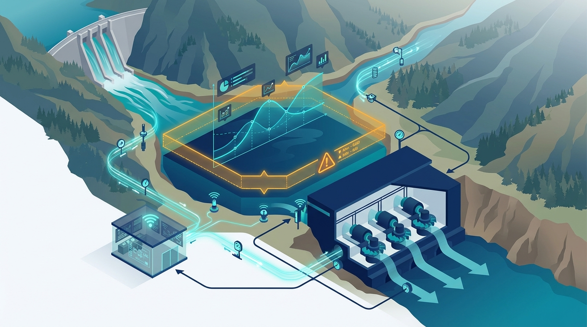
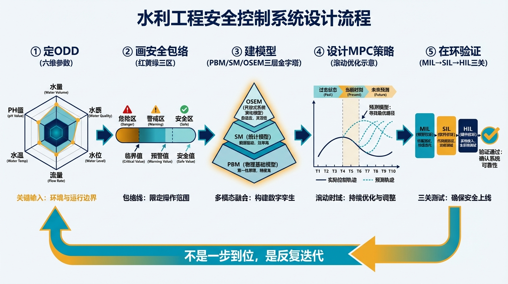
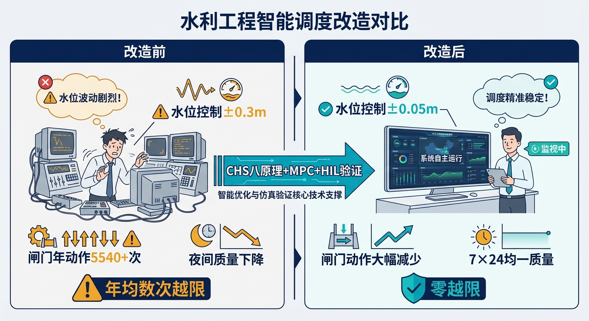
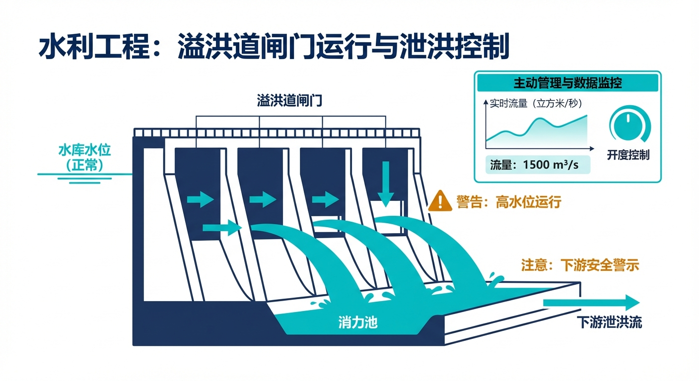
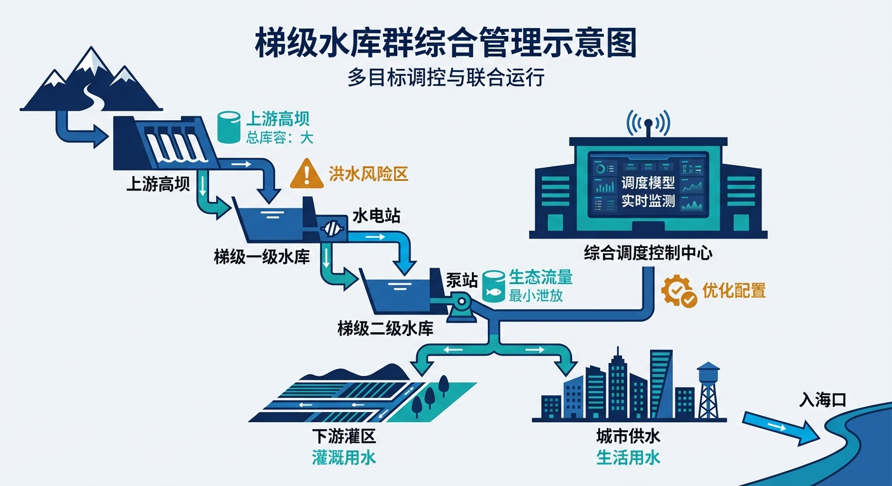
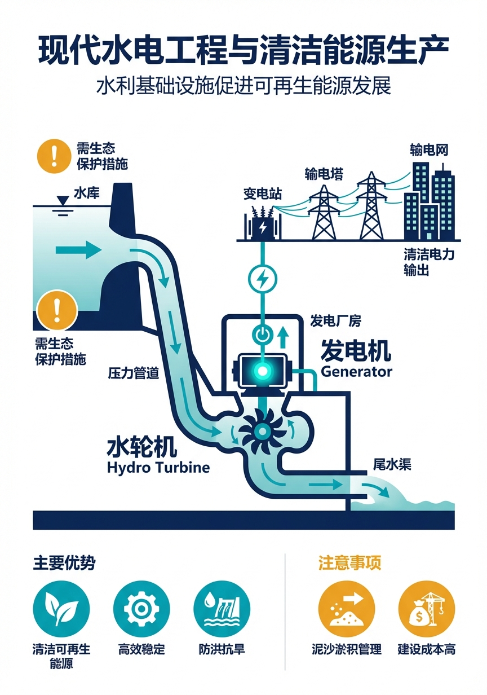

<!-- 变更日志
v1 2026-04-10: 排版统一与格式规范化
-->
# 第九章 小水电的大智慧——沙坪二级水电站的故事

> **本章要点**
> - 沙坪二级水电站调节库容极小（汛期仅几十万方），来水变化 100m³/s 即可在一小时内使水位穿越整个调节区间——传统人工响应链条 20 分钟，安全窗口仅 14 分钟，数学上就是来不及。
> - CHS 的解决方案是"三层模型+安全包络+MPC"组合拳：物理机理模型负责精确预测、安全包络划定红/黄/绿三区运行规则、MPC 在约束内优化闸门序列，将响应时间从 20 分钟压缩到 6 分钟。
> - 沙坪的 ODD（运行设计域）由六个维度参数定义，系统只在验证过的 ODD 内自主运行，超出边界则主动提醒人工接管——"知道自己不知道什么"比盲目自信更重要。
> - HIL（硬件在环）测试发现了纯软件仿真无法暴露的问题（如 PLC 通信延迟、闸门执行偏差），证明了"先在电脑里试驾"再上真车的必要性。

## 开篇故事："杯子大小"的水库

大渡河上有十四座梯级电站。沙坪二级水电站是最后一座——也是最"憋屈"的一座。

憋屈在哪？它的装机容量不小——348 兆瓦，六台机组，单机容量亚洲最大的灯泡贯流式水轮机。但它的调节库容小得可怜：正常情况下 585 万方，到了汛期高水位时只有几十万方。

做个比喻：如果常规水库的调节库容是一个浴缸，沙坪的调节库容就是一个杯子。上游来水稍微变一下，杯子里的水位就剧烈波动。调度员根本没有"从容调整"的余地——来水变了，你必须在几分钟内做出反应，否则水位就要超标。

有多敏感？当上游来水增大 100 方每秒时，一小时内沙坪的水位就会上升约 0.6 米——足以从正常运行水位直接穿越整个调节区间到限制水位。如果来水增大 500 方每秒，20 到 30 分钟内就会越限。而这种 100 方每秒以上的来水变化，在汛期一年发生超过 7000 次。

2019 年某个汛期傍晚，正好发生了一次典型的险情。当时沙坪水位 553.75 米，离正常蓄水位 554 米只差 0.25 米。突然，上游枕头坝出库流量在 15 分钟内急增 450 方每秒。这意味着约 80 分钟后将有一波大流量涌入沙坪水库。以 450 方每秒的净入库增量计算，沙坪的剩余调节库容——不到 14 分钟就会蓄满并触发安全预警。

传统调度模式下，值班调度员需要接警、分析、向电网申请调令、等待批准、再手动调整泄洪闸门，整个响应链条往往超过 20 分钟。14 分钟的窗口、20 分钟的响应——数学上就是来不及。

但这一次，沙坪的安全包络预警系统提前 75 分钟——在枕头坝出库数据更新的瞬间——就感知到了即将到来的威胁。系统推算出进入黄区的时刻，自动生成了分段泄洪闸门开度优化序列，并在 6 分钟内完成了从黄区预警到首个闸门动作的全流程。水位最高越限量控制在 0.12 米以内——安全过关。

更要命的是，上游枕头坝电站放水到沙坪需要 70 到 85 分钟传播时间。也就是说，你看到上游来水增大了，但影响要一个多小时后才到。在这一个多小时里，你该做什么？等着？那太晚了——等水到了再调闸门，14 分钟就越限。提前动？但你又不确定来水到底会增加多少、持续多久——如果提前过度泄洪，结果来水没有预期的大，你就白白浪费了发电用水。

这种"看得见但摸不着"的困境，本质上是一个**"不确定性下的决策"**问题。你必须在信息不完整的情况下做出行动——既不能太保守（浪费发电效益），也不能太激进（冒安全风险）。人凭经验可以做到"大致不出错"，但要做到"精准最优"——同时兼顾安全、效率、设备磨损、电网协调——超出了人脑的处理能力。

这就是沙坪的核心困境：**小库容 × 大流量 × 长延迟 × 多约束。** 调度员连上厕所的时间都没有——不是夸张，是真实工况。2019 年的运行数据显示：沙坪泄洪闸门全年动作超过 5540 次，水位越限事件频发。频繁的闸门动作对设备寿命和水工建筑物都有累积损伤——机械磨损、密封件老化、混凝土冲刷——每一次不必要的动作都在"消耗"工程的寿命。

---

## 9.1 用 CHS 方法论重新审视

传统做法是"靠经验+手动调"。老调度员能凭直觉应付大多数工况，但夜班、极端来水、设备故障叠加时，人的能力就到了极限。一个有经验的调度员可能能同时关注三四个变量（水位、来水、机组出力、电网指令），但沙坪在极端工况下需要同时考虑的变量超过十个——来水趋势、水位变化率、六台机组各自的出力和振动区、多个泄洪闸的开度组合、电网负荷指令的约束、下游尾水位的限制——超出了人脑"工作记忆"的极限。

而且沙坪有一个特殊的困境叫"设计锁定"——调节库容 585 万方是物理事实，不可能扩建（除非炸掉重建大坝）；机组水头范围 5.9 到 24.6 米也是工程事实，不可能改变（机组已经安装好了）。每台机组在特定水头下还有"振动区"——在这个转速范围内运行会导致机组振动加剧、寿命缩短，必须避开。这些约束像一张网，把调度的"自由空间"压缩到了很小的范围内。

传统思路是"用更大库容消纳流量波动"——库容大了，来水变化就不那么敏感了。但沙坪完全不可行。你不能改变约束，只能在约束内找最优解。这恰恰是 CHS 方法论的用武之地——它不试图改变物理约束，而是在约束之内，用数学优化和自动控制来榨取每一滴效率。

CHS 的方法论给了一条不同的路。不是一上来就写算法，而是先按八原理做"系统诊断"：

**第一步：定 ODD。** 沙坪能自主运行的"有效范围"是什么？团队定义了六维 ODD 参数——来水范围（枕头坝出库流量在什么区间内系统能自主应对？）、水位范围（前池水位在什么区间内系统能正常运行？）、可用机组数（至少几台机组在线系统才能自主运行？）、通信状态（和枕头坝的数据链是否正常？）、下游河道约束（尾水位在什么范围内？）、电网负荷指令范围（电网要求的出力在什么区间内系统能执行？）。

只有六个维度全在范围内，系统才能在自主模式下运行。任何一个维度超出范围——比如来水突然超出 ODD 定义的最大值、或者和枕头坝的数据链中断了——系统自动降级到人工辅助模式，由调度员接管。

ODD 的设计是一个精细的平衡艺术。画得太小，系统大部分时间都不在 ODD 范围内——等于白做了智能化。画得太大，极端工况的验证不充分——系统可能在边界条件下出问题。沙坪的做法是"先紧后松"：初始 ODD 只覆盖最常见的 70%工况，验证充分后逐步扩展到覆盖 90%的工况。剩下的 10%（百年一遇洪水、多设备同时故障等极端场景）暂时不在 ODD 范围内——这些工况由调度员人工处理。

ODD 不是限制系统能力，而是诚实地标明能力边界——"我能做什么"和"什么时候必须请人帮忙"都说清楚。这种"诚实"在工程实践中非常重要：管理层和监管部门最怕的是"系统号称什么都能干，结果关键时刻掉链子"。有了明确的 ODD，大家都知道系统的能力边界在哪里，可以据此合理安排人员配置和应急预案。

**第二步：画安全包络。** 红黄绿三区阈值怎么定？以前池水位为例：红区边界来自大坝结构安全标准（绝对不能超过的水位极限），黄区边界基于来水预报的统计误差和闸门响应时间反推（留出足够的反应裕度），绿区就是日常正常运行范围。

沙坪的黄区特别窄——因为库容小，从绿区到红区的距离本来就短。以汛期高水位为例：正常运行水位到限制水位之间可能只有 1 到 2 米的空间，黄区可能只有 0.5 米宽。这意味着水位从绿区进入黄区再到红区，可能只需要十几分钟——留给安全包络反应的时间窗口极短。

这对安全包络的灵敏度提出了极高要求：必须及早发现趋势变化，在水位还在绿区时就预判是否会进入黄区。等到真正进入黄区再反应，可能已经来不及了。沙坪的安全包络因此采用了"预判式触发"——不是等水位真的到了黄区边界才切换到保守策略，而是当 MPC 预测到"按照当前趋势，未来 30 分钟内水位将进入黄区"时就提前启动保守模式。这等于把黄区的"缓冲时间"向前延伸了——虽然空间上的黄区很窄，但时间上的预警窗口被 MPC 的预测能力拉长了。

这个设计体现了安全包络和 MPC 的深度协同：安全包络定义"什么是危险的"，MPC 预测"什么时候会变危险"，两者结合实现了"在危险发生之前就行动"。

**第三步：建模型。** 沙坪建了三层模型体系，对应 CHS 八原理中的"传递函数化"：

物理对象模型（PBM）——详细的一维水动力模型，忠实地描述枕头坝到沙坪之间的水流传播过程，考虑了河道断面变化、糙率空间分布、回水效应等细节。这个模型精度高但计算量大，不适合做实时控制，主要用于离线分析和模型标定。

面向控制的降阶模型（SM）——积分延迟模型。把复杂的水动力过程简化成一个"延迟+积分"的数学结构：上游来水增加 X 方每秒，经过 T 分钟延迟传到沙坪，然后以 Y 米每小时的速率使水位上升。这个模型不如 PBM 精确，但计算速度快几百倍，能在控制周期内完成计算——MPC 优化器需要在几分钟内反复调用这个模型数百次来寻找最优方案。

观测与状态估计模型（OSEM）——用已知的传感器数据推算未知的系统状态。比如：沙坪入库流量没有直接测量（河道太宽、水流太急，难以准确测量），但可以通过枕头坝的出库流量加上延迟推算，再和沙坪水位变化做交叉验证。OSEM 解决的是"看不见的东西怎么知道"的问题。

三层模型各有分工，不是越精细越好——控制用的降阶模型必须能在控制周期内算完，否则优化结果出来了但工况已经变了，等于白算。

**第四步：设计控制策略。** 基于模型预测控制（MPC）——系统根据当前状态和未来 80 分钟的来水预测，在安全包络内寻找最优的闸门和机组调度方案。

MPC 的工作流程通俗地说就是：每隔 5 分钟，系统"向前看"80 分钟——预测这段时间内来水会怎么变、水位会怎么走。然后在安全约束下（水位不超标、闸门变化不太快、机组不进振动区）搜索一组最优的闸门开度序列。执行第一步的动作，5 分钟后重新预测、重新优化——不断"滚动"。

为什么是 80 分钟？因为枕头坝的水传到沙坪大约需要 70 到 85 分钟——80 分钟的预测窗口刚好能"看到"上游正在发生的变化在未来传到沙坪时会造成什么影响。如果预测窗口太短（比如 30 分钟），系统只能看到来水的"尾巴"，错过最佳调整时机；如果太长（比如 240 分钟），预测的不确定性太大，优化出来的方案可能不可靠。80 分钟是在"看得远"和"看得准"之间的平衡点。

MPC 在每个 5 分钟周期内做了什么？简化来说分四步：第一步，读取最新的传感器数据（沙坪水位、枕头坝出库流量、各机组出力、电网负荷指令）。第二步，用状态估计模型（OSEM）推算当前的真实状态（比如当前实际入库流量多少、水位变化趋势如何）。第三步，用降阶模型（SM）预测未来 80 分钟的水位走势——如果不做任何调整，水位会怎么变？第四步，在安全包络约束下，搜索一组闸门和机组的调整方案，使得未来 80 分钟内水位保持在绿区、闸门动作次数最少、发电效益最大。

这四步必须在 5 分钟内完成——否则下一个周期已经开始了，优化结果就过时了。这就是为什么控制用的模型必须是"降阶模型"而不是"精细模型"——精细模型一次计算可能要几十分钟，而 MPC 在一个周期内要调用模型几百次（每次调用对应一种可能的操作方案），只有降阶模型才能在时限内跑完。

沙坪的 MPC 还有一个独特的设计：**负荷申报策略**。由于沙坪自己不能主动向电网申请改变发电负荷（必须等电网调令），MPC 需要提前 180 分钟预判来水趋势，向电网提交未来的负荷计划——如果预计来水增大且无法靠泄洪完全消纳，就提前申请增加发电负荷。这相当于 MPC 不仅在"下棋"（控制闸门），还在"和棋盘谈判"（和电网协调负荷）。

**第五步：在环验证。** MIL 阶段跑了 13 种典型工况，覆盖了从枯水到大洪水的各种场景——包括"枕头坝流量阶跃增大""两台机组突然跳机""电网紧急要求降负荷""多工况叠加"等。还做了两组多年来水长系列回放：把 2017 年和 2018 年全年的来水数据喂给 MPC，验证控制策略在长时间运行中的稳定性和适应性。MIL 阶段发现了 5 个逻辑层面的问题，主要是极端工况下 MPC 优化器不收敛（搜索不到满足所有约束的可行解），通过调整优化器参数和约束松弛策略解决。

SIL 阶段验证了代码在工控机上的运行效率和数值稳定性。发现 MPC 优化算法在工控机上的计算时间比实验室电脑慢了近 10 倍——需要优化矩阵运算的代码实现，最终压缩到 2 分钟以内。

HIL 阶段是收获最大也最"惊险"的环节——发现了 9 个问题，其中 3 个属于 A 类缺陷：一个是通信延迟导致多闸门协联动作时序冲突（上一章开头讲的那个 80 毫秒 Bug），一个是极端工况下紧急停机和泄洪闸开启的联锁逻辑存在死区，一个是 MRC 安全降级触发后部分设备的状态反馈信号在切换过程中短暂丢失。这 3 个缺陷如果带入现场运行，修复成本是 HIL 平台建设成本的 10 倍以上——更不用说事故本身的代价。

> [图 9-1] **沙坪 CHS 改造五步流程**
>
> 提示词：从左到右五个步骤的流程图。①定 ODD（六维参数的雷达图）→②画安全包络（红黄绿三区）→③建模型（PBM/SM/OSEM 三层金字塔）→④设计 MPC 策略（滚动优化示意）→⑤在环验证（MIL→SIL→HIL 三关）。每步之间用箭头连接，底部标注"不是一步到位，是反复迭代"。

---

## 9.2 改造前后的对比

改造前后的差距，用几个数字就能说清楚：

**闸门动作次数**：改造前年均超过 5540 次（2019 年数据），改造后闸门动作次数减少了约 43.5%。MPC 的优化目标之一就是"最少动作次数下的最优控制"——不是水位一变就调闸门，而是综合预判未来趋势后做一次"到位"的调整。

为什么减少闸门动作这么重要？不仅仅是省电省力的问题。闸门每动作一次，橡胶密封件就磨损一点，钢丝绳就疲劳一点，混凝土门槽就冲刷一点。5540 次动作意味着平均每天 15 次以上——对于一个设计寿命 50 年的水工建筑物来说，这个动作频率带来的累积损伤是惊人的。减少 43.5%的动作次数，直接延长了关键设备的检修周期和使用寿命，长期来看节省的维护费用非常可观。而且每一次闸门动作都会在下游产生水位波动——动作越少，下游的水位越平稳，对下游河道和生态的影响越小。

**水位控制精度**：从人工调度的正负 0.3 米提升到智能控制的正负 0.05 米。0.3 米和 0.05 米的差距看起来不大，但对沙坪来说意义巨大——别忘了，沙坪汛期高水位时的全部调节空间可能只有 1 到 2 米。人工调度占用了这个空间的 30%做"晃悠"，智能控制只占 5%。剩余的空间可以用来优化发电效益——水位控制越精准，可利用的有效水头范围越大，发电效率越高。

**夜间运行质量**：改造前，夜班（晚 10 点到早 6 点）是事故高发期——调度员疲劳、警觉性下降、反应变慢。特别是凌晨 2 到 4 点，人的生理机能处于低谷，这是有充分科学依据的——大量交通事故和工业事故的统计都表明凌晨是"最危险的时段"。对沙坪这样的高敏感系统，调度员在凌晨的一次走神可能就意味着一次水位越限。

改造后，系统 24 小时均一运行——凌晨 3 点的控制精度和下午 3 点一模一样。MPC 算法不会疲劳、不会走神、不会情绪波动。这不是说调度员可以不值班了——L2 模式下调度员仍然在岗监督——而是说调度员的值班从"持续操作"变成了"监督确认"。一个调度员形容这种变化："以前值夜班我最怕上厕所——离开五分钟可能就错过一次来水变化。现在系统自动盯着，我可以安心去，回来看一眼大屏确认没问题就行。"

**安全包络违规次数**：从每年数次降到零。这个"零"的含义不仅仅是"没有出事故"，更深层的含义是"系统具备了预见性"——以前是水位超了才知道超了（事后被动响应），现在是水位还没超系统就预判到趋势不对并且已经开始调整了（事前主动干预）。这就是安全包络和 MPC 结合的威力：MPC"看"到未来 80 分钟的趋势，安全包络判定这个趋势是否会穿越三区边界，如果会，立即启动保守策略——整个过程在水位还在绿区时就完成了。

**负荷申报的前瞻性**：这是改造后新增的能力，也是沙坪案例中一个常被忽视但非常重要的创新。传统模式下，沙坪被动等待电网调令——电网说发多少就发多少。但来水变化是沙坪自己感知到的、电网不知道。如果来水突然增大，沙坪需要增加发电出力来消纳多余的水量，但必须先向电网申请——申请、审批、下达调令这个链条可能需要半小时甚至更久。

MPC 的负荷申报策略改变了这个被动局面：它提前 180 分钟预判来水趋势，主动向电网提交未来三小时的负荷计划——"预计两小时后来水增大，建议届时将我站负荷从 200 兆瓦提升到 280 兆瓦。"电网有了提前量，可以从容安排其他电站的出力调整来配合。双方的协调从"临时紧急沟通"变成了"提前计划协商"——效率和安全性都大幅提升。

最关键的变化是：调度员的角色从"驾驶员"变成了"机长"。日常运行系统自己处理，调度员监督大局、处理异常。工作量下降了，但对异常情况的关注度和处理质量反而提高了——因为他们不再被日常琐碎操作分散精力。一个调度员说得好："以前我 80%的精力花在正常工况的频繁操作上，只有 20%的精力应对异常。现在反过来了——正常工况系统处理，我可以把全部注意力放在那些真正需要人判断的复杂情况上。"

从经济角度总结：沙坪的 CHS 改造，成本主要在研发团队投入和 HIL 平台建设；收益来自多个方面——发电量提升（水位控制更精准，有效水头利用率更高）、设备寿命延长（闸门动作减少 43.5%）、人力成本优化（调度员从"一人盯一站"逐步过渡到"一人监督多站"成为可能）、事故风险下降（安全包络零违规带来的保险和赔偿成本降低）。综合来看，改造的投资回收期大约在两到三年——之后就是纯收益。

而且这些收益是"越滚越大"的：系统运行积累的数据越多，模型越精准，MPC 的优化效果越好，安全包络的参数越可靠。这是一个正循环——投入一次研发，收益持续增长。

> [图 9-2] **沙坪改造前后对比**
>
> 提示词：左右对比信息图。左栏"改造前"：调度员坐在屏幕前手忙脚乱，标注"水位控制±0.3m""闸门年动作 5540+次""夜间质量下降""年均数次越限"。右栏"改造后"：调度员从容监督，系统自主运行，标注"水位控制±0.05m""闸门动作大幅减少""7×24 均一质量""零越限"。中间箭头标注"CHS 八原理+MPC+HIL 验证"。

---

## 9.3 沙坪的 WNAL 自评

用第五章介绍的 WNAL 分级方法给沙坪做一次"体检"，当前的自主等级是多少？

逐层评分：感知层——传感器覆盖率高，枕头坝出库数据实时获取，前池水位多点冗余测量，但入库流量缺少直接测量手段（依赖状态估计），评分 L2.5。决策层——负荷申报策略和实时 MPC 都已完成 MIL 和 SIL 验证，可在 ODD 内自主生成方案，但辅助模式下仍需人工确认电网调令，评分 L2.5。执行层——PLC 闸门自动执行已具备，但现场集成验证尚在推进，HIL 覆盖不完整，评分 L2。验证层——MIL 完成 13 工况加 2 组长系列验证，部分 SIL 已完成，但 HIL 平台缺少机组电气保护系统的闭合回路，评分 L2。

综合评分：**L2 到 L2.5 之间**——距离稳定 L3 还差"最后一公里"。

差在哪里？最关键的短板是**HIL 验证不完整**。当前 HIL 平台缺少机组电气保护系统的接入，这意味着最危险的极端工况——事故切机（某台机组因电气故障突然跳闸脱网）——无法在 HIL 环境中完整模拟和验证。事故切机时会发生什么？机组突然从满发到零出力，等于瞬间"少了"一个泄水通道，水位会加速上升。系统必须在几分钟内启动备用泄洪方案来弥补——这个过程涉及闸门紧急打开、其他机组快速调整、安全包络紧急切入红区保护模式。如果这个过程的联锁时序有任何错误，后果可能非常严重。

这台"赛车"的发动机和底盘都验证过了，但安全气囊还没做过碰撞测试。在安全气囊没测试之前，不能让它上赛道跑全速——这就是沙坪卡在 L2.5 而不是 L3 的根本原因。

达到稳定 L3 需要补充的工作，按优先级排列：第一，HIL 平台补全机组电气保护系统接入（优先级最高，安全关键）；第二，MRC 降级策略的文件体系完整化（操作规范）；第三，冰期和大修期 ODD 的验证覆盖（扩展运行覆盖度）；第四，SM 在线校正机制上线（持续改进精度）。

这个自评结果说明了一个重要的道理：**WNAL 不是一次性评定的"证书"，而是一个动态的"仪表盘"**。今天是 L2.5，补完 HIL 可以到 L3；再覆盖更多 ODD 工况可以向 L3.5 迈进。每一步升级都有明确的工作清单和验收标准——不是模糊的"继续努力"，而是具体的"完成这三件事就能升一级"。

---

## 9.4 沙坪的启示

沙坪的故事有四条启示，对其他工程也有普遍的参考价值：

第一，**越是条件苛刻的工程，越需要"聪明"。** 大水库有余量容错——调度员反应慢一点，水位变化也不会太剧烈。小库容没有这个奢侈——必须靠技术来弥补物理条件的不足。反过来说，小库容的苛刻条件也是 CHS 理论最好的"试验田"——如果在沙坪这样极端的条件下都能 work，在条件更宽松的大库容系统上就更没问题。

第二，**HIL 验证不是"锦上添花"，是"救命"。** 沙坪在 HIL 上发现的 9 个问题，3 个是 A 类缺陷。如果这些缺陷带入现场运行，修复成本是 HIL 平台建设成本的 10 倍以上——这还不算事故造成的社会影响和信誉损失。在环验证是投资回报率最高的安全投入之一。

第三，**八原理不是"全有或全无"。** 沙坪是一个单站工程，它主要用到了前五条原理（传递函数化、可控可观性分析、安全包络、在环验证、分层分布式控制的单站部分），认知增强（原理七）和全生命周期演进（原理八）还没有完全实现——但这不妨碍它在现有框架下达到了很好的效果。CHS 的八原理是一个"渐进式"的框架——你不需要一次把八条都做到满分，可以先把最关键的几条做扎实，然后逐步补齐其余的。

第四，**数据是一切的起点。** 沙坪能够实现 MPC 控制，根本前提是有可靠的实时数据——枕头坝的出库流量、沙坪的前池水位、机组的出力数据、电网的负荷指令。如果这些数据不准确、不及时、不完整，再好的算法也无用武之地。很多工程在考虑"上智能控制"之前，首先应该做的是"把数据搞对"——传感器覆盖率够不够？数据传输延迟大不大？历史数据质量如何？这些基础工作可能不够"高大上"，但它们是所有后续智能化的地基。

沙坪展示的是 CHS 在"点"（单站）尺度上的实践。当多个"点"串联成一条"线"——多座电站在同一条河上梯级排列，上游放水下游接水——控制问题就从"一个人的独舞"变成了"一群人的接力赛"。如何让梯级电站协调配合、既各自安全又整体最优？这就是下一章的主题：大渡河的接力赛。

---

## 💬 工程师问答

**Q：我们水库也不大，沙坪的经验能直接用吗？**

A：思路是通用的（ODD→安全包络→建模→MPC→验证），但参数和模型要根据你的工程重新标定。特别是 ODD 的六维参数——每个工程的物理条件和约束不同，必须量身定制。不过沙坪的经验中有些是可以直接借鉴的：三层模型的分工思路（精细模型做离线分析、降阶模型做实时控制、状态估计补盲区），安全包络的三区设计方法，MPC 的滚动优化框架——这些"框架"是通用的，只有"参数"需要定制。

**Q：MPC 听起来很高级，实际操作复杂吗？**

A：MPC 的核心思想其实很直观：每隔几分钟，根据当前状态和未来预测，在安全约束内找最优操作。复杂的是背后的模型和求解算法——但这些是"引擎盖下面的事情"，调度员看到的只是系统给出的建议和执行结果。就像你用手机导航——背后有复杂的地图算法和路径规划，但你只看到"直行 200 米后右转"。调度员需要理解的是 MPC 的"逻辑"（它为什么建议这么做），不需要理解它的"数学"（它是怎么算出来的）。

**Q：沙坪的改造花了多长时间、投入了多少？**

A：从研究启动到 MIL 验证完成大约两年，SIL 和 HIL 验证又花了约一年。总体上，核心研发团队投入了数名博士和工程师的三年时间。这个投入看起来不小，但考虑到沙坪 348 兆瓦装机容量、年发电量超过十几亿千瓦时——哪怕效率提升 1%，一年增加的发电收益就足以覆盖研发投入。更重要的是：这套方法论验证成功后，可以推广到大渡河其他电站乃至更多水利工程——边际成本递减，长期价值巨大。

**Q：如果没有上游枕头坝的实时数据，沙坪的 MPC 还能用吗？**

A：能用，但效果会打折扣。MPC 的控制质量很大程度上取决于预测的准确性。有了枕头坝的实时出库数据，沙坪可以提前 70 到 85 分钟预知来水变化——这个预见期是 MPC 发挥优势的关键。如果没有这个数据，MPC 只能靠沙坪自己的传感器"感知"来水——等水已经到了坝前才知道，预见期可能只剩几分钟，MPC 的优化空间就大大缩小了。这也是为什么 CHS 强调"系统思维"——沙坪的智能化不仅仅是沙坪自己的事，上游数据的共享是关键基础设施。

---

---

## 本章配图

**图 9-1　沙坪 CHS 改造五步流程**

**图 9-2　沙坪改造前后对比**

**图 9-3　泄洪闸运行与水位安全控制**

**图 9-4　梯级水库群综合管理示意图**

**图 9-5　水电工程与清洁能源生产全流程**

## 参考文献

[9-1] 雷晓辉, 苏承国, 龙岩, 等. (2025). 基于无人驾驶理念的下一代自主运行智慧水网架构与关键技术 [J]. *南水北调与水利科技(中英文)*, 23(04): 778-786. doi:10.13476/j.cnki.nsbdqk.2025.0079.

[9-2] 雷晓辉, 龙岩, 许慧敏, 等. (2025). 水系统控制论：提出背景、技术框架与研究范式 [J]. *南水北调与水利科技(中英文)*, 23(04): 761-769+904. doi:10.13476/j.cnki.nsbdqk.2025.0077.

[9-3] 雷晓辉, 张峥, 苏承国, 等. (2025). 自主运行智能水网的在环测试体系 [J]. *南水北调与水利科技(中英文)*, 23(04): 787-793. doi:10.13476/j.cnki.nsbdqk.2025.0080.

[9-4] Litrico, X., & Fromion, V. (2009). *Modeling and Control of Hydrosystems*. Springer-Verlag London.

[9-5] Negenborn, R. R., & Maestre, J. M. (2014). Distributed model predictive control: An overview and roadmap of future research opportunities. *IEEE Control Systems Magazine*, 34(4): 87-97.

[9-6] 大渡河瀑布沟水电站有限公司. (2023). 沙坪水电站运行管理报告 [EB/OL]. 四川省.

[9-7] 雷晓辉, 许慧敏, 何中政, 等. (2025). 水资源系统分析学科展望：从静态平衡到动态控制 [J]. *南水北调与水利科技(中英文)*, 23(04): 770-777. doi:10.13476/j.cnki.nsbdqk.2025.0078.

[9-8] Malaterre, P. O., & Baume, J. P. (1998). Modeling and regulation of irrigation canals: Existing applications and ongoing researches. In *Proceedings of the 1998 IEEE International Conference on Systems, Man, and Cybernetics* (pp. 3881-3886). IEEE.

[9-9] Åström, K. J., & Murray, R. M. (2010). *Feedback Systems: An Introduction for Scientists and Engineers*. Princeton University Press.

[9-10] Ogata, K. (2010). *Modern Control Engineering* (5th ed.). Prentice Hall.

[9-11] Garnier, H., & Wang, L. (Eds.). (2015). *Identification of continuous-time models from sampled data* (2nd ed.). Springer Science+Business Media.

[9-12] Roache, P. J. (1998). Verification and validation in computational science and engineering. *Hermosa Publishers*.

[9-13] ISO 26262:2018. Road vehicles - Functional safety. International Organization for Standardization.

---

> **一句话回顾**：沙坪的故事证明，即使是"杯子大小"的调节库容，只要用 CHS 的三层模型+安全包络+MPC 组合拳，就能把人工无法胜任的 14 分钟响应窗口变成系统 6 分钟内自动完成的安全操作——这是 WNAL 从 L2 迈向 L3 的第一个真实工程样板。

> 📖 **深入阅读**
>
> 本章内容基于《水系统控制论》第十三章案例一。
> - 沙坪的 ODD 六维参数和三区运行规则 → §13.3
> - 三层模型体系（PBM+SM+OSEM） → §13.4
> - MPC 控制策略和闸门协联规则 → §13.5
> - HIL 验证平台和发现的典型问题 → §13.7
> - 相关 Lei 论文：Lei 2025a（CHS 理论框架）、Lei 2025c（在环测试体系）、Lei 2025b（智慧水网架构）
