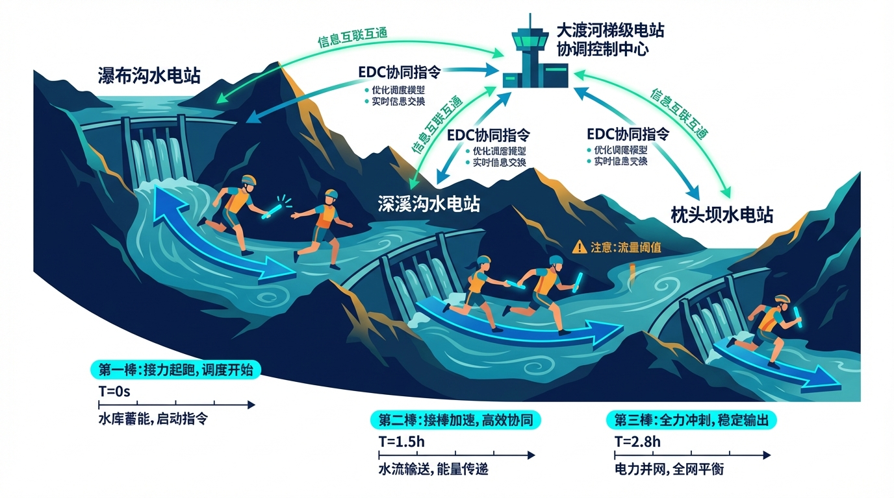
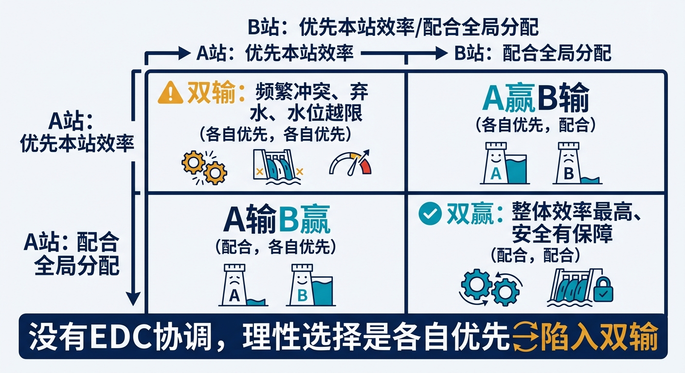
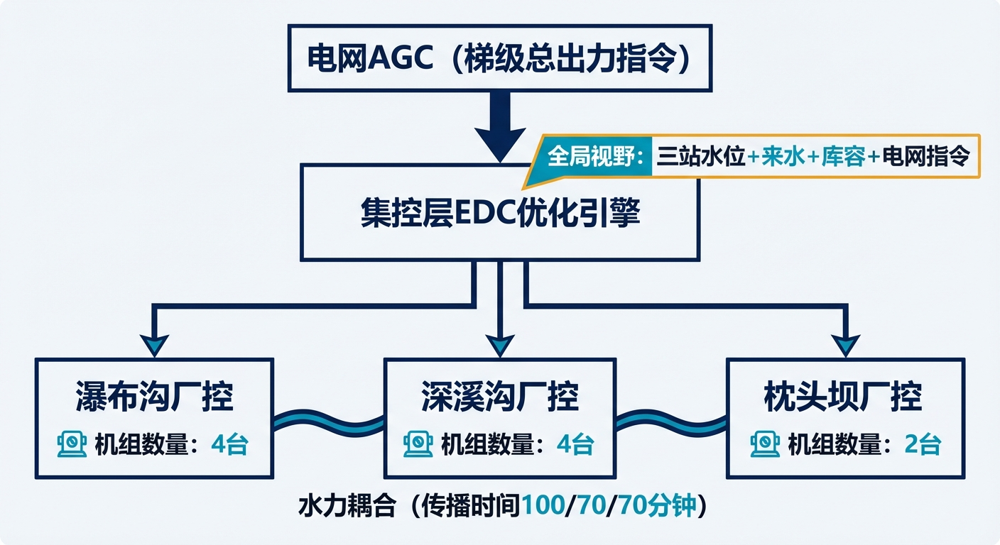
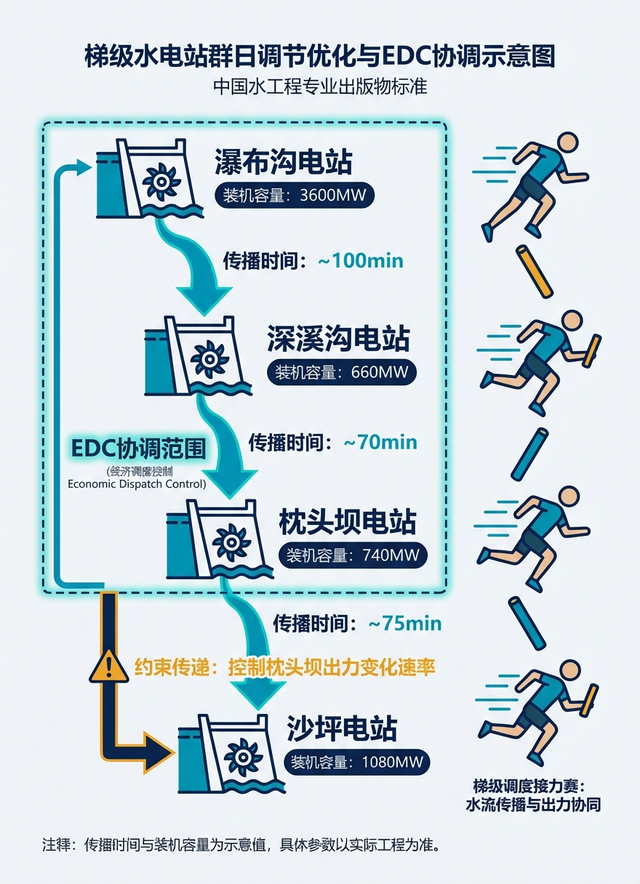
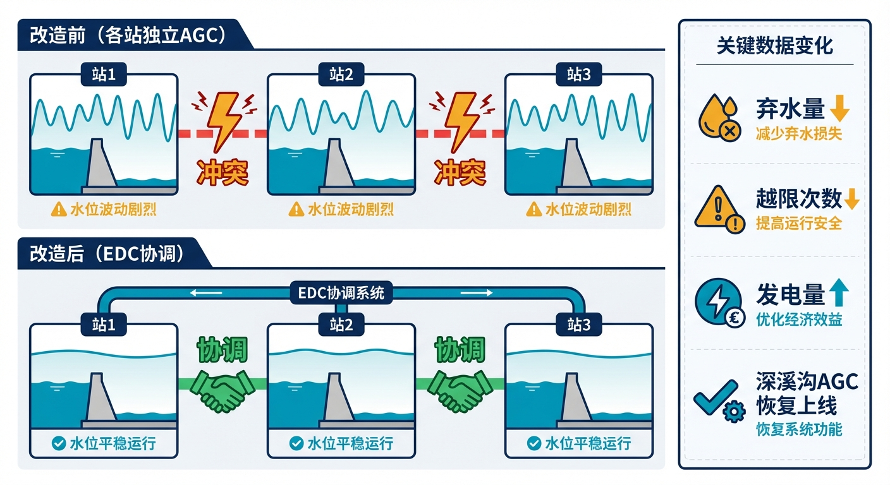
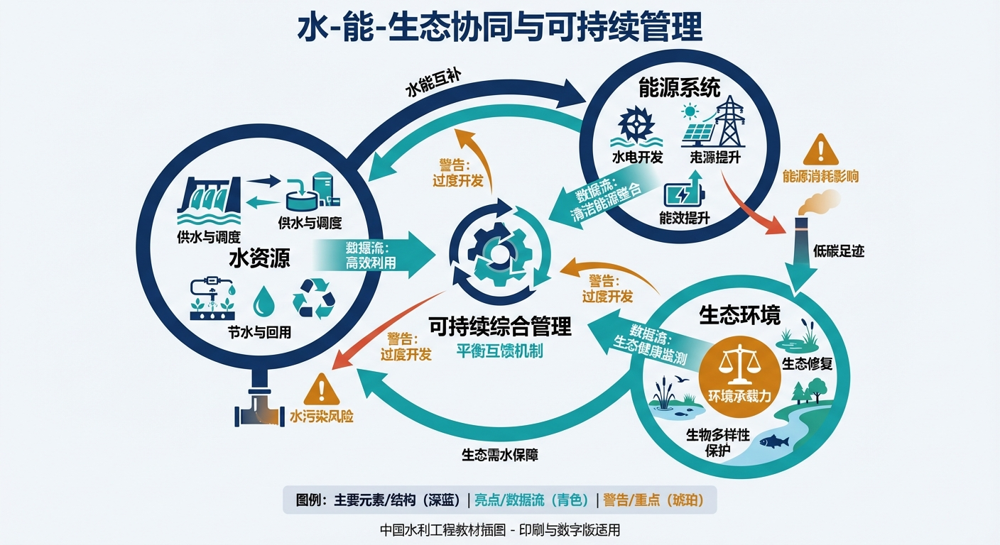

# 第十章 大渡河的"接力赛"——梯级水电站的协调控制

> **本章要点**
> - 深溪沟AGC停用六年的教训揭示了CHS原理三（分层分布式控制）的典型失效：三个独立的AGC各自局部最优，但梯级整体陷入"囚徒困境"——缺少全局协调层是根本原因。
> - 2018年投运的EDC（经济负荷分配控制）系统通过"梯级协调层+单站控制层"两级架构修复了这一失效，核心是把水力传播延迟纳入协调模型，让上下游电站"提前知道彼此要做什么"。
> - 梯级控制的关键难点不是算法复杂，而是"时间不对齐"——水从瀑布沟到深溪沟要100分钟，但电网AGC指令4秒一次，水力尺度和电力尺度差了三个数量级，EDC通过多时间尺度嵌套解决这一矛盾。
> - 从单站到梯级的跨越，本质上是从"独奏"到"交响乐"——每个乐手（电站）技术再好，没有指挥（协调层）和总谱（全局模型），合奏就是噪音。

## 开篇故事：深溪沟的教训

大渡河上的深溪沟水电站，曾经是一个"先进典型"——它较早实现了AGC（自动发电控制），能自动响应电网的出力指令。在单站层面，它的自动化水平不低。

但投运不久后，深溪沟的AGC就因为一个棘手的问题被迫停用。问题不在算法本身，而在于它和上游瀑布沟电站之间缺少协调。

瀑布沟是大渡河梯级的"大哥"——装机3600兆瓦，12台机组，拥有年调节水库，总库容53亿方。为了响应电网的调峰需求，瀑布沟经常在一天之内大幅调整出力——从满发到半发，出库流量可能在几小时内变化超过2000方每秒。这些变化的水流经过约100分钟的传播，涌进下游深溪沟那个只有几百万方有效库容的小水库。

深溪沟的AGC系统面临两难：按电网指令维持恒定出力？那水库会在几十分钟内被蓄满或拉空——2000方每秒的流量差只需25分钟就能使水位越限1米。优先控制水位、让出力跟随来水变化？那就违反了电网调度纪律——电网说发多少就得发多少，擅自调整要被罚款。

结果是两头都不行。运行人员为了保安全，只能手动退出AGC，改由人工实时监视调整。此后整整六年（2012到2018年），深溪沟的AGC长期退出运行——一个花了大价钱建设的自动化系统，因为"不会和邻居打交道"而被闲置了六年。

事后分析越看越清楚：问题的根源不在于深溪沟AGC算法不好——它在单站层面的控制逻辑完全正确。根源在于**三个独立的AGC系统（瀑布沟、深溪沟、枕头坝）各自为政，没有协调机制**。每个电站的控制器都在做局部最优化，但三站联合的梯级系统却陷入了"囚徒困境"——各站独立最优但整体最差。

这就是CHS原理三（分层分布式控制）的典型失效场景：缺少全局协调层，导致局部最优无法汇聚为全局最优。2018年正式投运的**瀑深枕梯级EDC系统**（经济负荷分配控制），正是对这一失效的系统性修复。

---

## 10.1 梯级电站的"双重耦合"

梯级水电站为什么这么难协调？因为它存在"双重耦合"——水力耦合和电力耦合同时存在，而且时间尺度完全不匹配。

**水力耦合**：三站依次串联，上游出库即为下游入库，站间没有大型支流汇入。瀑布沟调整出力的影响，约100分钟后传到深溪沟，再过70分钟传到枕头坝，再过70到85分钟传到沙坪。一个决策的"涟漪效应"要三四个小时才能传遍整个梯级。

**电力耦合**：三站均接入四川500千伏电网，共同承担调峰调频任务。电网的负荷指令频率通常是5分钟一次，调整幅度可达数百兆瓦。电力响应是"秒级"的（机组调整出力很快），但水力响应是"小时级"的（水流传播需要时间）。

这里就出现了一个根本矛盾：**电网要求"快速响应"（分钟级），但水力系统的传播是"慢速的"（小时级）**。电网说"梯级总出力现在增加300兆瓦"，电力层面几分钟就能调整到位——但这300兆瓦的水力后果（上游放水增大、水位变化）要一两个小时后才在下游显现。如果只看电力指标，调整很成功；如果一两小时后看水位指标，下游可能已经快越限了。

这种"双重耦合+时间尺度不匹配"的特征，在工程领域里其实很少见。大多数控制系统只有一种耦合——化工厂的管道只传输流体，电网只传输电力。但梯级水电站同时承载着两种"流"：水流（速度慢、惯性大）和电力流（速度快、惯性小）。两种"流"共享同一组设备（机组既发电又引水），但响应速度差了三四个数量级。这正是CHS第二章"为什么水网难管"中提到的"强耦合+大时滞"的具体体现。

这就像一辆车的油门反应很快（踩下去立刻加速），但方向盘反应很慢（打方向要过好几秒车才转弯）——两个操控系统的时间尺度不匹配，开起来当然不稳。更麻烦的是，这辆"车"有三个"驾驶员"（三座电站），每个驾驶员只能看到自己面前的路况（本站水位），看不到其他驾驶员在做什么——如果不协调，翻车是迟早的事。

更反直觉的是：**每个单站AGC算法越先进，梯级整体的失调反而可能越严重**。原因是：瀑布沟AGC收到电网指令后快速调整出力（响应快，单站指标很好）；深溪沟AGC检测到入库流量快速变化（感知准，单站指标也好）；但深溪沟AGC的决策是"维持电网出力不变"（局部正确，全局错误），导致水位越限。三个"优秀"的单站控制器，组合在一起反而产生了"灾难"——这在博弈论中叫"纳什均衡陷阱"。

EDC的思路是：**不要让每座电站自己决定发多少电，而是由一个"总协调"来统一分配**——全梯级总负荷是多少，每座电站分摊多少，怎么分才能让整体效率最高、同时满足所有安全约束。EDC就是那个缺失的"全局协调层"。

打个日常生活的比方：三户人家共用一根水管，每户都想在同一时间大量用水。如果各管各的——甲开大水龙头洗车，乙开大水龙头浇花，丙开大水龙头洗衣——水压骤降，谁都用不好。但如果有个物业管理员协调——"甲上午洗车，乙下午浇花，丙晚上洗衣"——同样一根水管，三户都用得好。EDC就是这个"物业管理员"。

> [图10-1] **"囚徒困境"示意：各自最优vs全局最优**
>
> 提示词：2×2博弈矩阵，简化为两站情景。行标"A站：优先本站效率/配合全局分配"，列标"B站：优先本站效率/配合全局分配"。四个格子分别标注结果：（各自优先，各自优先）→"双输：频繁冲突、弃水、水位越限"。（各自优先，配合）→"A赢B输"。（配合，各自优先）→"A输B赢"。（配合，配合）→"双赢：整体效率最高、安全有保障"。标注："没有EDC协调，理性选择是各自优先→陷入双输"。

---

## 10.2 EDC的"两级架构"

EDC系统采用"集控层统一优化+电站层独立执行"的两级架构。

**集控层**（设在大渡河集控中心）：接收电网下达的梯级总出力指令，综合考虑三站的水力状态（水位、来水、库容余量）、电力约束（机组振动区、出力上下限）和安全包络状态（各站红黄绿区情况），计算出最优的负荷分配方案——瀑布沟发多少、深溪沟发多少、枕头坝发多少。然后把各站的分配出力指令下发给各电站。

集控层的优化计算大约每5分钟执行一次——和电网下达负荷指令的频率一致。每次优化要在几十秒内完成，才能赶上下一个电网调度周期。优化的目标是"总发电收益最大化"，约束包括：三站总出力必须等于电网指令、各站水位必须在安全范围内、机组不进振动区、站间负荷转移速率不超限。这是一个典型的"约束优化问题"——和沙坪的MPC类似，但维度更高（三站19台机组，可能的组合方式成千上万）。

**电站层**（各电站厂控AGC）：接收集控层的分配指令，在本站范围内执行——决定开几台机组、每台机组发多少、闸门怎么配合。电站层可以在分配指令的框架内做局部微调（比如避开某台机组的振动区），但不能擅自改变分配的总出力。

这种架构的关键好处是**"全局视野+局部灵活"**。集控层有全局视野——它同时看到三站的水位、来水和电网指令，能做出全局最优的分配。电站层有局部灵活性——它了解本站机组的具体状态（哪台在检修、哪台有振动区限制），能在分配框架内做最合适的本地执行。两级之间分工明确：集控层决定"蛋糕怎么切"，电站层决定"自己那份怎么吃"。

> [图10-2] **EDC两级架构示意图**
>
> 提示词：顶层方框"电网AGC（梯级总出力指令）"→箭头指向中层方框"集控层EDC优化引擎"→三条箭头分别指向三个底层方框"瀑布沟厂控""深溪沟厂控""枕头坝厂控"。中层方框旁标注"全局视野：三站水位+来水+库容+电网指令"。底层方框各自标注机组数量。三个底层方框之间用蓝色波浪线连接标注"水力耦合（传播时间100/70/70分钟）"。

---

## 10.3 水力传播的"提前打招呼"

梯级电站还有一个电力系统没有的麻烦：水流传播需要时间。

上游电站调整了出力，对下游电站的来水影响不是即时的——瀑布沟到深溪沟约100分钟，深溪沟到枕头坝约70分钟。如果下游不知道上游做了什么调整，等水到了才反应就太晚了。

EDC的解决办法是**"预补偿"**——上游决定调整出力时，同时通知下游"我大约100分钟后会给你多送X方水，请提前准备"。下游收到通知后，提前预留库容或调整出力，等水真正到了就能平滑过渡。

具体怎么做？EDC的优化引擎在计算负荷分配时，不仅考虑"现在"的状态，还考虑"未来一到两小时"的水力传播效应。比如：如果EDC决定让瀑布沟从2000兆瓦降到1500兆瓦（减少发电量意味着减少引水，出库流量减小），它同时会计算出100分钟后深溪沟的入库流量将减少多少，并在分配深溪沟出力时预先考虑这个变化——比如让深溪沟也提前降低一些出力，避免100分钟后来水减少时深溪沟水库被"拉空"。

这就像接力赛跑——不是等接棒人接到棒子才开始跑，而是提前起步，在交接区域达到接近同步的速度。水力预补偿就是这个"提前起步"的机制。

传播时间还有一个被忽视的特点：它不是固定值。汛期流量大时水流传播快（瀑布沟到深溪沟约95分钟），枯水期流量小时传播慢（约110分钟）。EDC的预补偿需要根据当前的流量动态调整传播时间的估算——否则预补偿"打早了"或"打晚了"，反而可能造成新的波动。这又回到了模型的精度问题——准确的水力传播模型是预补偿有效的前提。

预补偿还有一个"量"的问题：上游减少了多少出力，下游的来水到底会减少多少？这不是简单的线性关系。发电引水量和出力之间的关系取决于水头和机组效率曲线；出库流量还受泄洪闸门开度的影响；河道传播过程中还有沿程损失和侧向汇入。EDC需要一个足够准确的水力-电力耦合模型来做这个预估。

模型不准怎么办？EDC的设计中有一个"在线校正"机制：每隔一段时间，拿模型的预测值和实际观测值做对比——如果偏差超过阈值，自动微调模型参数。就像GPS导航在路上会根据实际位置不断修正路线一样。

> [图10-3] **梯级电站"接力赛"示意图**
>
> 提示词：纵向排列4座电站（瀑布沟→深溪沟→枕头坝→沙坪，从上游到下游），站间用蓝色水流箭头连接，箭头旁标注"传播时间：~100min""~70min""~75min"。每座电站旁标注装机容量。瀑-深-枕三站用绿色虚线框起标注"EDC协调范围"。EDC框到沙坪之间标注"约束传递：控制枕头坝出力变化速率"。右侧配接力赛选手传棒简笔画。

---

## 10.4 五种分配策略和三道约束

EDC不是只有一种模式，而是根据工况自动切换五种策略：

**蓄能模式：** 来水偏丰、水库还有库容余量时，优先蓄水，为后续发电储备能量。蓄能模式下EDC会适当降低当前发电量，让多余的水蓄在瀑布沟水库里——瀑布沟有38.94亿方的调节库容，是整个梯级的"蓄水银行"。等到用电高峰或者枯水期再释放出来发电，整体收益更高。这就像家庭理财——收入高的月份多存钱，收入低的月份取出来用，总比月月花光更有保障。

**平衡模式：** 来水正常时的默认模式，追求发电效率最大化。EDC在这个模式下会精细地计算每座电站的最优出力——考虑各站不同水头下的发电效率曲线、机组振动区约束、水库水位趋势——把每一方水的发电价值都榨干。平衡模式的关键是"精细"：不是简单地按装机容量比例分配（瀑布沟大所以分多一些），而是根据各站当前的水头和效率曲线动态调整——有时候把多一点负荷分给水头更高的站（效率更好），整体收益反而更高。

**满发模式：** 来水很大（比如汛期洪水），水库蓄不住了，必须尽量多发电来消纳来水。在这个模式下，效率不再是第一优先——首先要保证水不溢出、不弃水。弃水意味着白白浪费了可以发电的水能，对于水电站来说是最大的"浪费"。EDC会把所有可用机组都调动起来，在安全约束允许的范围内尽可能多发电。如果即使满发也消纳不了全部来水，EDC会计算最优的泄洪分配——在哪个站泄洪对下游影响最小、对水工建筑物损伤最小。

**安全模式：** 有安全约束被激活时——某站水位进入黄区、某台机组跳闸、通信异常——效率让位于安全。EDC自动收紧各站的出力调整范围，增大安全裕度，必要时把负荷从"出问题"的站转移到其他站。

**检修模式：** 有机组退出检修时的重新分配。梯级19台机组（瀑布沟12台+深溪沟4台+枕头坝3台）不可能永远全部在线——定期检修是必须的。每退出一台机组，相当于少了一个"出力槽位"，EDC需要把这台机组的份额重新分配给其他机组。

五种模式之间的切换逻辑和安全包络的三区切换类似——基于当前工况自动判断，不需要人逐一指定。一天之内可能切换好几次——比如白天电网负荷高用平衡模式追求效率，傍晚来水增大切换到满发模式消纳洪水，夜间负荷低切换到蓄能模式蓄水。

无论在哪种模式下，EDC的负荷分配都要满足三道硬约束：

**约束一：站间出力转移速率限制。** 为防止电网频率波动，单次负荷转移量不得超过梯级总容量的10%，且每两次转移之间至少间隔3分钟。就像高速公路上换车道——不能一下子变三个车道，必须逐步变道。

**约束二：机组振动区约束。** 三站共有19台机组，每台机组都有若干"振动区"出力段——在这个范围内长期运行会损伤机组。EDC分配时必须确保没有机组长时间停留在振动区。如果调整过程中不得不经过振动区，就采取"快速穿越"策略——快速通过，不在里面停留。

**约束三：水库水位约束。** 深溪沟和枕头坝的水位必须维持在安全区间内（安全包络的红黄绿三区），水位变化速率也有限制——变化太快会影响鱼道和水工建筑物的安全。

---

## 10.5 成效

EDC投入运行后，梯级整体效益显著提升。

最直接的变化是：**深溪沟的AGC终于重新上线了**。停用了六年的自动化系统，在有了EDC的全局协调后，终于能安全地工作了。深溪沟的AGC不再"单打独斗"——它的出力调整要经过EDC的协调，确保不会对下游造成冲击。

更重要的是整体效益的提升。以前经常出现的"上游猛放水→下游被迫泄洪→白白浪费水能"的情况基本消除。梯级内部的负荷分配从"各自为政"变成了"统筹优化"——每一方水从上游流到下游，在每座电站都被充分利用。

具体表现在几个方面：梯级总发电量提升（同样的来水条件下，因为分配更合理，整体效率更高）；弃水量大幅减少（特别是汛期，满发模式和蓄能模式的灵活切换让更多的水被用来发电而不是白白泄掉）；各站水位越限次数大幅下降（EDC的预补偿机制让下游站提前准备，避免了突发性的水位冲击）；机组在振动区的停留时间减少（EDC在分配时专门避开振动区，或采用快速穿越策略，延长了机组的检修周期和使用寿命）。

对于电网调度员来说，梯级的"行为"变得更加可预测了。以前三站各自为政时，梯级的总出力可能会因为内部的水力冲突而偏离电网指令——电网要求增加300兆瓦，结果某站水位越限被迫紧急减出力，实际只增加了200兆瓦。有了EDC协调后，梯级的总出力跟踪电网指令的精度提高了——承诺增加300就增加300，不会"掉链子"。这提升了电网对梯级的信任，也为梯级争取到了更多的调峰调频任务（意味着更多的发电收益）。

对调度员而言，变化同样显著。以前梯级调度需要三个电站的调度员频繁电话沟通——"我们要增加出力了，你那边注意一下""你上游来水怎么突然变大了？"——这种电话协调不仅效率低，还容易出错：一个口头传达的数字听错了、一个时间估计偏差了，都可能导致下游准备不足。现在EDC自动完成协调，调度员从"打电话协商"变成了"看大屏监督"。集控中心的调度员可以在一个界面上同时看到三站的状态和EDC的分配方案，不需要在三个系统之间来回切换。

EDC还带来了一个意想不到的好处：**为沙坪的MPC创造了更好的运行条件**。上一章讲到沙坪面临的核心困境是"小库容×大流量"——来水波动越大，沙坪的控制难度越高。有了EDC的协调，枕头坝（沙坪的直接上游）的出力变化变得更加平稳——EDC在优化分配时专门约束了枕头坝的出力变化速率，避免了以前"枕头坝出力突变→沙坪来水剧烈波动"的情况。沙坪的MPC因此可以在一个更"友好"的来水环境下工作，控制精度和稳定性进一步提高。

这就是"系统思维"的价值：优化不是孤立的，一个环节的改善会传导到其他环节，形成正循环。

> [图10-4] **EDC成效对比：改造前后的梯级运行状态**
>
> 提示词：上下两排对比图。上排"改造前（各站独立AGC）"：三站各自画一个振荡的水位曲线（频繁波动），站间用红色闪电标注"冲突"。下排"改造后（EDC协调）"：三站各自画平稳的水位曲线，站间用绿色握手标注"协调"。右侧标注关键数据变化：弃水量↓、越限次数↓、发电量↑、深溪沟AGC恢复上线。

---

## 10.6 梯级与单站的互依关系

大渡河案例揭示了一个重要的道理：**梯级协调和单站控制是相互依存的，不是非此即彼的。**

枕头坝下游就是沙坪（上一章的主角）。枕头坝的出力变化直接影响沙坪的来水——如果EDC让枕头坝突然增大出力，70到85分钟后沙坪就要承受来水增大的冲击。沙坪自己的MPC控制系统能应对一定范围的来水波动，但如果上游的波动太大太突然，沙坪的"杯子大小"的库容就兜不住了。

所以EDC在优化梯级负荷分配时，不能只看三站自己的约束，还要考虑对下游沙坪的影响——枕头坝的出力变化速率不能太快、泄水变化幅度不能太大。这就把"梯级EDC"和"沙坪MPC"联系在了一起：EDC负责"给沙坪提供一个相对平稳的来水条件"，MPC负责"在这个来水条件下做精细控制"。

从CHS理论的角度看，这正是"分层分布式控制"（原理三）的体现：

全局层——电网指令分配给梯级（"你们总共发多少"）。这是最高层，代表整个电力系统的需求。
协调层——EDC把梯级总负荷分配给三站（"各站分别发多少"）。这是中间层，负责在全局需求和局部约束之间找平衡。
本地层——各站的厂控AGC和MPC在分配框架内做本站最优控制（"本站内机组和闸门怎么配合"）。这是执行层，负责精细控制。

每一层都在做"局部最优"，但约束条件来自上一层——层层嵌套，最终实现全局最优。没有EDC的协调层，局部最优就变成了全局次优（深溪沟AGC停用六年的教训）；没有本地层的精细控制，协调层的分配方案就无法精确执行（闸门和机组的具体动作还是要本地决定）。

这种分层架构还有一个重要的好处：**可扩展性**。如果未来大渡河梯级再增加一座电站，只需要在EDC中增加一个电站节点、更新负荷分配模型——不需要改动整个系统的架构。这就像互联网的分层架构——增加一台新电脑不需要重新设计整个网络协议。

分层架构对通信中断也有天然的容错能力。如果协调层和某个电站层的通信中断了，该电站自动切换到独立保守模式，其余电站继续在EDC协调下运行——整个系统不会因为一个点的通信故障而全面瘫痪。这比"中央集权式"架构（所有决策都由一个中心做）更鲁棒。

---

## 10.7 启示

大渡河的故事给出三条启示：

第一，**单站自动化不等于梯级协调。** 这是最核心的教训。再好的单站控制器，如果缺少全局协调层，组合在一起可能比没有自动化更糟——因为自动化系统的响应速度更快，相互之间的干扰振荡也更剧烈。"智能化"不能一个站一个站地做，必须从系统层面统筹规划。

第二，**水力传播是梯级控制的"特殊关卡"。** 电力系统的信号传播是即时的（电磁波速度），但水力系统的传播是慢速的（水流速度）。这种时间尺度的不匹配是梯级控制最独特也最棘手的挑战——你可以在5分钟内改变出力（电力响应快），但这个改变的水力后果要一两个小时后才在下游显现（水力响应慢）。任何忽视水力传播效应的梯级协调方案，都注定会遇到深溪沟AGC同样的困境。

这也解释了为什么"简单地把电力系统的调度方法搬到水利系统"行不通。电力系统的调频调压可以在秒级完成——因为电流传播是瞬时的。但水利梯级的"调频调压"（调整各站出力来平衡水位和流量）需要考虑一两个小时的传播延迟。电力系统的成熟调度方法是宝贵的参考，但必须经过"水力改造"才能用于水利系统——这正是EDC的设计哲学。

第三，**"点"和"线"的协同比各自优秀更重要。** 沙坪（单站MPC）做得再好，如果上游梯级给它送来的来水波动太大，它也无能为力——"杯子大小"的库容承受不了"山洪般"的来水突变。梯级EDC做得再好，如果下游沙坪没有精细控制能力来"接住"分配方案的执行，效果也要打折扣——EDC的分配精度再高，最终还是要靠各站的本地控制器去精确执行。只有"点"和"线"协同工作，整个系统才能达到最优。

从沙坪的"独舞"到大渡河的"接力赛"，控制的尺度从一个站扩展到了一条河。下一章的尺度更大——从一条河扩展到一张网：胶东调水工程，一个覆盖三万平方公里、连接两大水源、服务两千多万人口的输水网络。当水网的规模从"线"变成"面"，控制问题又会发生怎样的质变？

梯级电站的节点是同质的（都是水电站，目标都是发电），连接方式是单一的（上游到下游的串联）。但输水网络的节点是异质的（水库、泵站、闸门、用水户，各有各的特点），连接方式是多样的（分叉、汇合、环形回路）。EDC的"线性分配"思路在网络上行不通——需要新的方法。这就是胶东调水案例要回答的问题。

---

## 💬 工程师问答

**Q：我们梯级只有两三个站，也需要EDC吗？**

A：即使只有两座串联电站，上下游之间的水力耦合和负荷协调问题也存在。站数越少，问题反而越集中——因为一座站的调整百分之百影响另一座站，没有其他站来"缓冲"。你可能不需要大渡河EDC那么复杂的五模式切换，但至少需要一个"上下游联动规则"——上游要调整出力时，提前通知下游，给下游留出反应时间。

**Q：EDC和电网的AGC有什么关系？**

A：AGC是电网发给电站群的总出力指令（"你们梯级总共发多少兆瓦"）；EDC是梯级内部的负荷分配（"A站发多少、B站发多少、C站发多少"）。两者是上下级关系：电网AGC管"总量"，EDC管"分配"。EDC在满足电网总量要求的前提下，优化内部分配。电网不需要关心梯级内部怎么分——它只看总出力是否达标。

**Q：如果EDC的通信链路断了，各站怎么办？**

A：这就回到了上一章讲的"断连自治"。EDC系统设计了通信故障应急预案：如果集控层和电站层的通信中断，各电站自动切换到"独立保守运行模式"——不再等待EDC的分配指令，而是按照预设的保守规则自主运行。保守规则的核心原则是"安全第一、效率次之"——各站维持当前出力不做大幅调整，水位往安全范围中间靠。效率会下降（没有全局优化了），但不会出安全问题。等通信恢复后，EDC重新接管协调。

**Q：大渡河的经验能推广到跨流域调水吗？**

A：梯级电站和跨流域调水的控制思路有相通之处（都是多节点串联、都有水力传播延迟），但也有重要区别：梯级电站的目标主要是"发电效率最大化"，跨流域调水的目标是"水量安全输送+沿途用户供水保障"，后者的约束更多、目标更复杂。下一章的胶东调水案例会专门讲这个话题。

---

---

## 本章配图

**图10-1　"囚徒困境"示意：各自最优vs全局最优**

**图10-2　EDC两级架构示意图**

**图10-3　梯级电站"接力赛"示意图**

**图10-4　EDC成效对比：改造前后的梯级运行状态**

**图10-5　水-能-生态协同与可持续管理**

## 参考文献

[10-1] 雷晓辉, 苏承国, 龙岩, 等. (2025). 基于无人驾驶理念的下一代自主运行智慧水网架构与关键技术 [J]. *南水北调与水利科技(中英文)*, 23(04): 778-786. doi:10.13476/j.cnki.nsbdqk.2025.0079.

[10-2] 雷晓辉, 龙岩, 许慧敏, 等. (2025). 水系统控制论：提出背景、技术框架与研究范式 [J]. *南水北调与水利科技(中英文)*, 23(04): 761-769+904. doi:10.13476/j.cnki.nsbdqk.2025.0077.

[10-3] Litrico, X., & Fromion, V. (2009). *Modeling and Control of Hydrosystems*. Springer-Verlag London.

[10-4] Negenborn, R. R., & Maestre, J. M. (2014). Distributed model predictive control: An overview and roadmap of future research opportunities. *IEEE Control Systems Magazine*, 34(4): 87-97.

[10-5] 大渡河瀑布沟水电站有限公司. (2023). 大渡河梯级水电站联合调度运行报告 [EB/OL]. 四川省.

[10-6] 四川省电力公司. (2022). 电网AGC调频控制规范 [S]. 中国国家电网公司.

[10-7] 雷晓辉, 许慧敏, 何中政, 等. (2025). 水资源系统分析学科展望：从静态平衡到动态控制 [J]. *南水北调与水利科技(中英文)*, 23(04): 770-777. doi:10.13476/j.cnki.nsbdqk.2025.0078.

[10-8] 雷晓辉, 张峥, 苏承国, 等. (2025). 自主运行智能水网的在环测试体系 [J]. *南水北调与水利科技(中英文)*, 23(04): 787-793. doi:10.13476/j.cnki.nsbdqk.2025.0080.

[10-9] Malaterre, P. O., & Baume, J. P. (1998). Modeling and regulation of irrigation canals: Existing applications and ongoing researches. In *Proceedings of the 1998 IEEE International Conference on Systems, Man, and Cybernetics* (pp. 3881-3886). IEEE.

[10-10] Ramos, M. H., van Andel, S. J., & Pappenberger, F. (2013). Do probabilistic forecasts lead to better decisions? *Hydrology and Earth System Sciences*, 17(6), 2219-2232.

[10-11] Ostrom, E. (1990). *Governing the Commons: The Evolution of Institutions for Collective Action*. Cambridge University Press.

[10-12] Åström, K. J., & Murray, R. M. (2010). *Feedback Systems: An Introduction for Scientists and Engineers*. Princeton University Press.

[10-13] Labadie, J. W. (2004). Optimal operation of multireservoir systems: State-of-the-art review. *Journal of Water Resources Planning and Management*, 130(2), 93-111.

---

> **一句话回顾**：大渡河梯级的故事说明，自主运行不能只在单站做——没有协调层的多站自动化反而比人工调度更危险，EDC系统用"全局协调+局部自治"的分层架构把深溪沟六年的困局变成了梯级整体效益提升的范例。

> 📖 **深入阅读**
>
> 本章内容基于《水系统控制论》第十四章案例二。
> - 梯级控制的"囚徒困境"动力学分析 → §14.2
> - EDC总体架构和负荷分配模型 → §14.3
> - 水力传播补偿与时序协调 → §14.4
> - 五种EDC分配策略模式 → §14.5.3
> - 相关Lei论文：Lei 2025a（CHS框架）、Lei 2025b（智慧水网架构）
