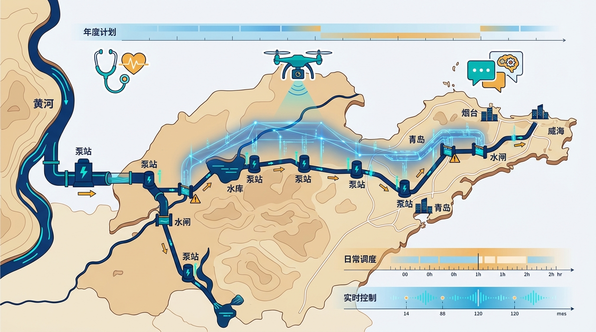
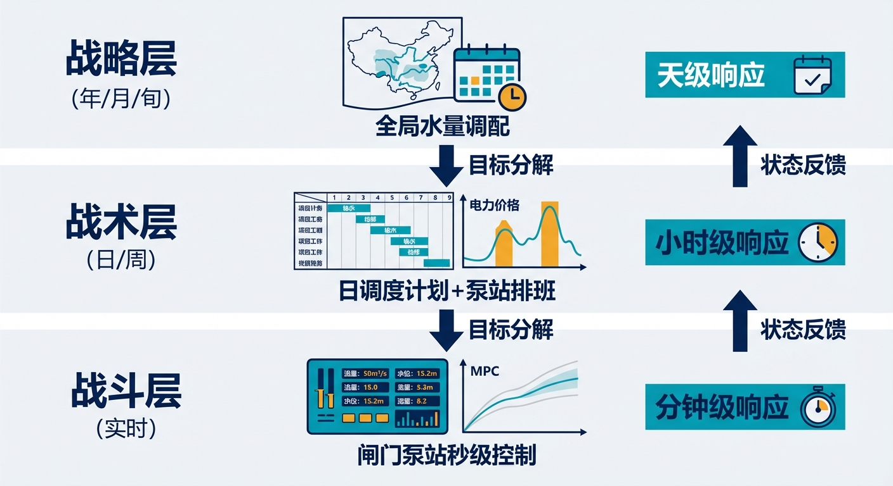
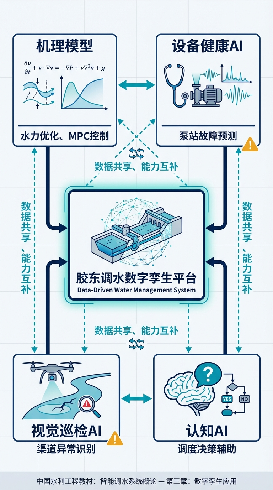
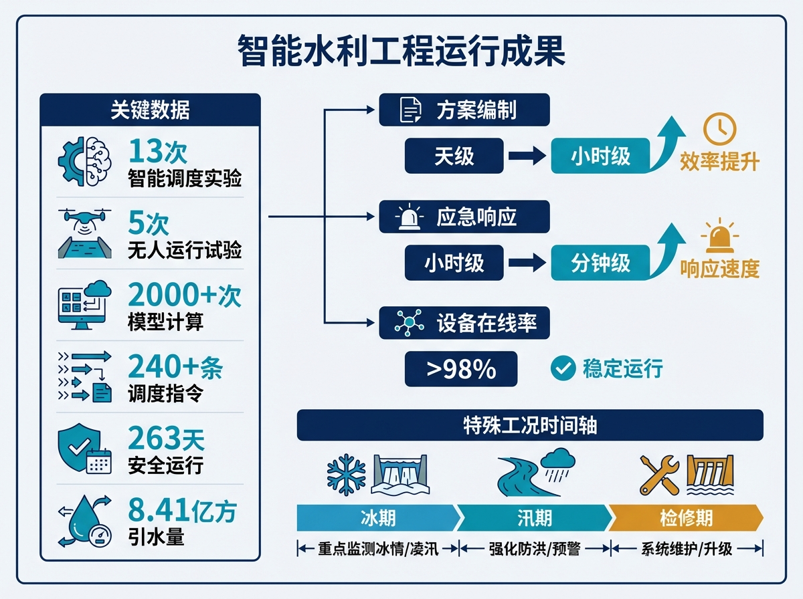
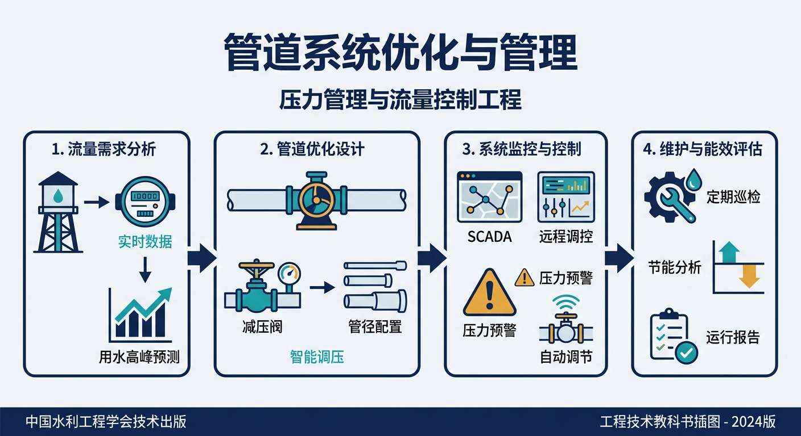
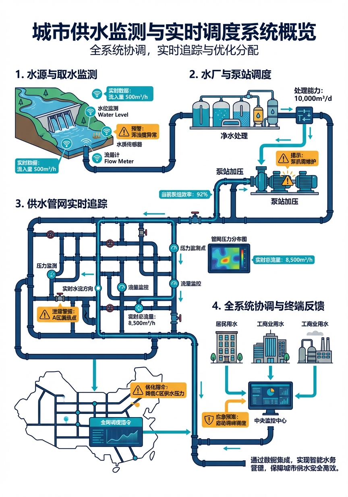

# 第十一章 千里送水——胶东调水工程的自主运行探索

> **本章要点**
> - 胶东调水全长571公里，是从"点"（沙坪单站）到"链"（大渡河梯级）再到"网"（跨流域多水源）的维数跨越——控制对象从一座水电站变成覆盖三万平方公里、服务两千多万人口的水网，复杂度不是线性增长而是维数爆炸。
> - 2024年7月胶东调水完成了第一次全自动停水操作：调度人员在数字孪生平台上点击执行，沿线闸门按预设时序自动动作，全程无人手动操作——这是WNAL L3级"条件自主"的真实实践。
> - 长距离调水的核心难题是"五多"：多水源、多分水口、多管理主体、多时间尺度、多不确定性，CHS用三时间尺度分层模型（秒级安全/分钟级调节/小时级优化）分解这一维数灾难。
> - 胶东调水证明了一个关键判断：网络级自主运行不是单站自动化的简单叠加，而需要从顶层架构设计开始就按CHS的分层分布式原理组织。

## 开篇故事：一次无人停水

2024年7月8日，山东省调水工程运行维护中心调度大厅。按照年度运行计划，当日需在供水状态下完成明渠段停水工况切换——简单说，就是要把正在输水的一段明渠安全停下来。

以前，这种操作需要沿线十几个管理站的人员同时到岗、电话逐级确认、按流程手动操作闸门。整个过程通常耗时大半天，任何一个环节的沟通延误或操作偏差都可能造成渠道水位异常波动。

这次不同。调度人员在数字孪生平台上确认方案参数，点击执行。系统自动向沿线闸站下发指令，闸门按照预设的时序和开度依次动作，水位在监控屏幕上平稳下降。整个过程中，没有一个现场人员手动操作闸门。

这是胶东调水工程在实际供水条件下完成的第一次全自动停水操作。

胶东调水工程全长571公里，是国内已建成的最长调水工程之一。水源来自黄河、长江和当地水库，沿线分水口39处，管理站13个——这样一个跨流域、多水源、长距离的复杂水网，实现任意渠段无人化切换运行，意味着从"人盯人"到"系统自主"的质的跨越。

从沙坪（一个站）到大渡河梯级（一串站），再到胶东调水——这是从"点"到"链"到"网"的跨越。控制对象从一座585万方库容的小水电站，变成了一条571公里、覆盖三万平方公里、年调水超过8亿方、服务两千多万人口的水网。复杂度不是线性增长的——而是维数爆炸。

胶东四市（青岛、烟台、威海、潍坊）的GDP占山东省全省的40%以上。在干旱年份，胶东调水几乎是这些城市的生命线。如果调度出了大问题——不是某个水电站少发了几度电，而是几千万人断水——后果的量级完全不同。这就决定了胶东调水的自主运行不仅是"效率升级"，更是"安全刚需"。

---

## 11.1 "五多"叠加的维数灾难

胶东调水工程有一个鲜明的特征——"五多"：

**多水源：** 主水源是黄河水（从打渔张引黄闸调引），还有南水北调东线调来的长江水、黄水东调工程的黄河水、以及峡山水库等当地水库的水。截至2021年底，累计引水超过112亿方——其中黄河水65亿方、长江水31亿方、当地水12亿方。多水源意味着：每个水源的可供水量随季节、来水丰枯和政策配额而变化，调度员面对的不是一个"水龙头"，而是四五个水龙头，每个的水压和流量都在波动。

**多用户：** 沿线39个分水口门，供水范围涵盖青岛、烟台、威海、潍坊、东营五个城市。仅青岛一个城市就累计受水55亿方。各用户的用水需求不同——城市供水要求连续稳定，农业灌溉有季节性集中需求，生态补水有最低流量要求。在干旱年份，胶东调水提供青岛城区95%、烟台全市80%以上的供水量——这不是"有了更好"，而是"没有不行"。

**多结构：** 工程兼含明渠段（引黄济青干线）、有压管道段（黄水河泵站以东）以及若干调蓄水库（棘洪滩水库、峡山水库）。三种水力结构的动力特性根本不同：明渠是缓变无压自由面流，水流响应以小时计，控制的关键是水位；管道是快速瞬变流，水锤风险突出，控制的关键是压力；水库调蓄周期以天到旬计，控制的关键是蓄水量。一套控制系统要同时驾驭三种完全不同的"交通工具"——就像一个司机要同时开轿车（管道，响应快但容错低）、公交车（明渠，响应慢但容错高）和货轮（水库，响应更慢但容量大）。三种车的操控逻辑完全不同，但它们在同一条路线上运行，必须协调。

**多通道：** 13座泵站、95座闸站、46座阀站，还有7万个传感器采集点。如果用沙坪的"集中式优化"方法来算，状态矩阵的维度将达到万级到十万级——实时求解的计算开销远超工程可行边界。

**多工况：** 丰水期、枯水期、冰期、检修、应急，每种工况的调度逻辑不同。特别是冰期运行（每年12月到次年2月），渠道会结冰，过流能力大幅降低——控制逻辑和常规输水完全不同。另外还有检修期——571公里的渠道不可能全年不停地检修某处总在进行——检修时需要停水、排水、再充水，每次都要重新安排输水路线和分水方案。一年之中，工程在不同工况之间频繁切换，每次切换都需要大量的参数调整和方案重算。

五多叠加带来的不是五倍的复杂度，而是指数级的爆炸——这就是"维数灾难"。管一个站靠经验就行，管一条链靠EDC协调就行，管一张网必须靠更系统化的方法。

把胶东与前两章案例对比，维数灾难的跃变更加直观：沙坪的控制变量是6台机组+2道闸门，大渡河梯级是3站19台机组，而胶东是13座泵站+95座闸+46座阀+39个分水口。沙坪的水力传播时间是分钟级（80分钟预测窗口），大渡河是小时级（100分钟站间传播），胶东是天级——上游王耨泵站的调整至少24小时后才能在下游胶莱河产生完整影响。这意味着控制器的"预见期"需要超过一个完整昼夜，而期间有39个分水口在随机取水——预测误差随预见期指数放大。

管理体制也更复杂。工程由山东省调水工程运行维护中心统一管理，实行省中心、分中心、管理站三级垂直管理体制。省中心下设滨州、东营、潍坊、青岛、烟台、威海6个分中心，分中心下设13个管理站——博兴、寿光、寒亭、昌邑、平度、胶州、棘洪滩水库、莱州、招远、龙口、蓬莱、福山、牟平。覆盖全线的三级管理网络意味着：自主控制系统不仅要解决"水力问题"，还要适配"管理架构"——省中心看全局、分中心管区域、管理站管现场。技术架构必须和管理架构匹配，否则"系统算出来的方案管理上执行不了"。

---

## 11.2 三个时间尺度

胶东调水的调度分三个层面，就像军事上的"战略→战术→战斗"：

**战略层（年/月/旬）：** 全年的水量怎么分配？各水源各取多少？各用户各分多少？这要考虑来水预报、用水计划、水库蓄水目标。战略层的优化模型以"供水总缺额最小"为主要目标——在各种约束条件下（渠道过流能力、分水口取水能力、冰期限制、水库水位约束），找到最优的年度引水窗口和各分水口分水方案。传统人工编制旬调度方案需要数天——调度员要翻阅大量水文资料、反复试算、和上下游协调。数字孪生系统将这个过程从天级压缩到了小时级。

**战术层（日/周）：** 本周每天的调水计划怎么安排？哪些泵站开几台？哪些闸门开多大？战术层要把战略层的"大目标"分解为具体的日操作计划。这里有一个沙坪和大渡河都没有的约束：电价。13座泵站每天消耗大量电力——如果白天抽水，电价高，运行成本大；夜间电价低，尽量夜间多抽水，白天少抽水。战术层的优化不仅要考虑"水往哪里送"，还要考虑"什么时候送最省钱"。这就是水力优化和经济优化的耦合。

**战斗层（实时）：** 闸门和泵站的秒级控制。来水突变了怎么调？某台泵故障了怎么切换？这靠MPC和安全包络自动处理。战斗层面对的核心挑战是"扰动"——39个分水口的取水量时刻在变化（城市用水有早晚高峰，农业灌溉受天气影响说开就开说停就停），每一个变化都是对系统的一次"推动"，控制器必须快速响应把系统拉回目标状态。一个有意思的细节：胶东明渠段的MPC和沙坪的MPC原理相同，但预测窗口完全不同——沙坪是80分钟（管一个站），胶东的一个闸站可能需要数小时的预测窗口（因为上游扰动传播过来的时间更长）。

三个层面的时间尺度不同、信息粒度不同、决策主体不同（战略层主要靠人+模型，战术层靠模型+人审核，战斗层主要靠算法自动执行），但它们必须上下贯通——战略目标分解为战术计划，战术计划落地为实时控制指令，同时实时运行的反馈又向上修正战术和战略层的方案。如果三层脱节——战略层制定了一个很理想的年度方案，但战术层在日操作中执行不了（比如泵站组合切换时间不够），或者战斗层在实时控制中跟不上（比如闸门动作速度来不及），那再好的方案也只是纸上谈兵。

这种"三层解耦"架构的物理根因在于：全线水力传播的跨日相位差使得任何"一层通吃"的控制方案都不可行。如果用一个控制器同时管年度水量分配和秒级闸门动作，它需要处理的时间跨度从秒到年（差了七八个数量级），决策变量从闸门开度到水库蓄水目标（性质完全不同）——计算复杂度会爆炸。分层之后，每层只处理自己时间尺度的问题，层间通过"目标分解"和"状态反馈"连接，复杂度大幅降低。

> **三层控制功能说明（L0/L1/L2）**
>
> 胶东调水的时间尺度分层（战略/战术/战斗）对应着三个功能层次，在CHS架构中通常命名为L0、L1、L2：
>
> - **L0 安全保护层**（PLC硬件联锁，毫秒级）：这是所有控制层次的底线，由PLC硬件直接执行，负责闸门、泵站的超限保护和紧急停机。L0是**绝对不可越过**的，任何上层控制指令如果触发L0的安全限值，L0会无条件中止执行。它不参与优化，只守护底线。
> - **L1 本站调节层**（本站MPC/PID，秒到分钟级）：每座闸站或泵站在本站范围内的实时调节，根据当前水位、流量反馈，将上层下达的目标值转化为具体的闸门开度或泵站转速指令。对应本章"战斗层"的实时控制部分。
> - **L2 跨站协调层**（DMPC跨站协调，分钟到小时级）：跨多个闸站、泵站的联合优化，处理站间水力耦合和资源分配。对应本章"战术层"的日调度计划，以及"战略层"中的旬级全局分水方案。
>
> 这三层的职责和时间尺度严格分离：L0绝不参与调度优化，L2绝不直接下达闸门指令。层间只通过"目标设定值"向下传递、"状态反馈"向上传递，每层在自己的时间窗口内独立决策，相互不干扰。

> [图11-1] **三时间尺度分层示意图**
>
> 提示词：三层横向堆叠。顶层"战略层"（年/月/旬），图标为地图+日历，标注"全局水量调配"，右侧标注"天级响应"。中层"战术层"（日/周），图标为甘特图+电价曲线，标注"日调度计划+泵站排班"，右侧标注"小时级响应"。底层"战斗层"（实时），图标为控制面板+MPC曲线，标注"闸门泵站秒级控制"，右侧标注"分钟级响应"。层间用向下箭头标注"目标分解"和向上箭头标注"状态反馈"。

---

## 11.3 数字孪生：从"看得到"到"控得住"

胶东调水工程的信息化建设经历了三个阶段，每个阶段解决不同层次的问题。

**第一阶段："看得到、测得准"。** 建成自动化调度系统，实现全线数据采集和远程监控。7万个传感器把水位、流量、闸门开度、泵站状态等数据实时汇集到调度中心。调度员坐在济南的办公室里，就能看到571公里外每一座闸站的状态。这是基础——如果连"看"都看不到，后面的一切都无从谈起。

**第二阶段："汇得全、看得全"。** 建成山东省水网综合调度平台，把骨干调水工程、引黄口门等多源数据融合在一起，构建"预报、预警、预演、预案"（四预）体系。不仅能看到当前状态，还能看到趋势——来水预报、用水预测、水位预警。但这一阶段的"预"主要还是给人看的——最终还是靠人来决策和操作。

**第三阶段："算得准、控得住"。** 这就是2022年启动的数字孪生胶东调水先行先试项目。核心跨越是从"人看数据做决策"到"模型算方案系统执行"——不仅能预测会发生什么，还能自动计算应该怎么做，并且直接下发控制指令执行。这是真正的"闭环"——感知→决策→执行→反馈，人在回路中的角色从"操作者"变成了"监督者"。

数字孪生平台采用"1+5"架构。"1"是一套覆盖全线的孪生底座平台——多源数据统一管理、各类模型动态优化、预警告警智能推送、知识经验融合贯通。"5"是五项应用试点：全线水量调度、明渠闸泵联合调控、水库矩阵管理、泵站智慧运维、管道优化调控。五项试点不是各管各的，而是共享底座平台的数据和模型——水量调度的结果直接驱动闸泵联合调控，泵站智慧运维的状态评估反馈给水量调度调整检修计划。

数字孪生的核心价值不是"好看"（虽然三维可视化确实好看），而是"能试"。新的调度方案上线前，先在虚拟胶东里跑一遍——各种工况、各种异常、各种极端场景都在模型里试过了。跑通了再上真实工程；跑不通就改方案而不是改工程。这其实就是在环验证（第七章）的工程化实现——数字孪生平台本质上是一个超大规模的MIL+SIL集成环境。

开篇故事里那次无人停水操作，就是在数字孪生平台上"预演"了多次、确认方案可行之后，才在真实工程上执行的。

---

## 11.4 三类AI各司其职

胶东调水的AI应用不是"一个AI管一切"，而是三类AI各管各的领域，和机理模型（物理方程、MPC）形成互补。

**第一类：设备健康AI——给泵站"听诊"。** 13座大型泵站长期在高扬程、大流量条件下运行，水泵叶轮受含沙水流冲蚀，轴承在交变载荷下逐渐劣化。这类机械疲劳损伤是渐进的——早期征兆只是振动信号中极其微弱的特征频段能量变化，靠传统的阈值报警根本发现不了。等到振动大到触发报警阈值时，设备可能已经接近损坏。

解决办法是用深度学习模型（VMD+CNN——变分模态分解加卷积神经网络）持续分析泵站的振动信号，像医生用听诊器一样捕捉早期异常。这类"听诊"是物理方程做不了的事——机械疲劳不遵守圣维南方程，但深度学习能从海量振动数据中学到"什么信号代表什么毛病"。提前发现、提前检修，远比"等到坏了再修"便宜——一台大型水泵的非计划停机可能导致整条输水线路降低供水能力，影响下游数十万人的用水。

**第二类：视觉巡检AI——给渠道"看病"。** 全线近600公里，传统徒步或车辆巡线方式，30公里重点渠段的巡视周期长达半天以上，夜间和暴风雨条件下还有大量盲区。工程部署了搭载计算机视觉大模型的智能巡飞无人机，实现了"天空地"一体化的全线视觉感知——渠道边坡有没有塌方、护砌有没有开裂、水面有没有漂浮物堵塞、沿线有没有违规取水，无人机飞一趟就能自动识别和标注。

**第三类：认知AI——给调度员"当参谋"。** 这是最有前瞻性的一类应用。胶东调水平台试验性部署了经过水利领域专有知识微调的大语言模型——瀚铎水网大模型的早期实践——作为调度人员的认知辅助引擎。

不是让AI直接控制闸门——那是物理AI（MPC和安全包络）的事。而是让AI帮调度员理解复杂局面："为什么今天B泵站的能耗比昨天高了15%？""如果明天来水减少20%，各用户的配水优先级应该怎么调整？""上次类似工况是怎么处理的？"这些问题需要综合大量信息、关联历史经验、用人类能理解的方式给出答案——正是大语言模型擅长的。

三类AI和机理模型之间有清晰的分工：机理模型负责"水往哪里流、闸门怎么动"（物理优化），设备健康AI负责"机器有没有生病"（状态监测），视觉巡检AI负责"渠道有没有问题"（环境感知），认知AI负责"调度员该怎么想"（决策辅助）。它们在不同能力维度上互补，共同支撑系统向更高自主运行等级演进。这种"物理AI管控制、认知AI管辅助"的架构分离——第八章讲过的"双轨制"——在胶东得到了最完整的体现。

> [图11-2] **三类AI与机理模型的分工**
>
> 提示词：中心画一个"胶东调水数字孪生平台"方框。四个方向伸出四条分支：左上"机理模型"（图标：方程式+水流曲线，标注"水力优化、MPC控制"）；右上"设备健康AI"（图标：听诊器+振动波形，标注"泵站故障预测"）；左下"视觉巡检AI"（图标：无人机+摄像头，标注"渠道异常识别"）；右下"认知AI"（图标：对话气泡+大脑，标注"调度决策辅助"）。四者间用虚线连接标注"数据共享、能力互补"。

---

## 11.5 四轮在环测试

胶东调水的在环测试分了四轮，一步比一步接近真实：

**第一轮：充水工况。** 系统刚充水，渠道里水量很小，负荷很低。这一轮主要验证最基本的功能：闸门能不能收到指令？动作方向对不对？传感器读数和模型预测是否一致？就像新车出厂先低速跑一圈——不求跑多快，先确认方向盘、刹车、油门都能用。

**第二轮：低负荷运行。** 水量逐渐增大到日常运行水平，验证控制系统在正常工况下的表现。战术层的日调度计划能不能正确分解为战斗层的实时指令？泵站按计划启停时会不会对渠道水位造成冲击？分水口取水变化时闸门响应够不够快？

**第三轮：满负荷运行。** 把系统推到设计能力的上限——所有泵站满负荷运转、所有分水口同时取水、渠道过流量接近最大值。这一轮测试的是系统的"天花板"在哪里——哪些环节最先成为瓶颈、哪些约束最先被触发。

**第四轮：极端工况。** 人为制造各种异常——泵站跳闸、传感器故障、通信中断、分水口突然大幅增减取水——验证系统的应急响应和降级能力。这是最关键的一轮：正常工况下谁都表现不错，区别在于出问题时能不能稳住。极端工况测试暴露了一些在前三轮中隐藏的问题——比如某段渠道在泵站突然跳闸时水位下降速率超过安全限值，闸门的紧急关闭时序需要优化。这些问题在正常工况下永远不会出现，但一旦出现就可能造成严重后果。

四轮下来，发现并修复的问题超过一百项——从模型参数偏差到通信时延超限、从闸门动作时序冲突到降级策略盲区。如果这些问题在正式运行中才暴露，后果不堪设想——571公里的渠道，任何一个控制偏差都可能在传播过程中被放大，到下游变成一个大问题。"在虚拟世界里犯错"的成本是"在真实世界里犯错"的千分之一——这就是在环验证的根本价值。

---

## 11.6 实战成绩单

在2023到2024年度调水运行中，数字孪生胶东调水系统承担了全年13次智能调度实验、5次工程无人智能运行试验。系统提供模型计算服务超过2000次，完成调度指令生成240余条，保障工程安全运行263天，全年完成引水8.41亿方。

几个关键改进值得细说。

**调度方案编制效率的飞跃：** 传统人工编制旬调度方案需要数天——调度员要收集水文数据、试算方案、协调上下游、反复修改。数字孪生系统通过全局旬水量调度模型实现方案快速生成，将方案响应时间从天级压缩到小时级。遇到突发情况需要修改方案时，差距更大——人工可能要半天重新算，系统分钟级就能滚动更新。

**供水保障的精准化：** 以2025年3月向烟台、威海供水为例，全线水量调配系统基于年调度方案与实时水情智能生成旬调度方案并精准分解指令，明渠闸泵联合控制系统自动执行。宋庄分水闸提前3天达到分水条件，成功完成向烟台、威海供水3500万方的年度任务。

"提前3天"——这个细节值得展开说。以前靠人工调度时，宋庄分水闸要配合分水，需要上游各泵站提前蓄水、渠道提前充水——这个"提前量"的计算和执行都靠人工协调，往往要反复调整才能到位。数字孪生系统通过三层模型的联动——旬调度模型提前计算出分水时间窗口，日调度模型规划出每天的泵站和闸门方案，实时控制模型确保方案精确执行——整个"提前蓄水→充水→达到分水条件"的过程是自动完成的。这不是提高了几个百分点的效率——这是从"手工作坊"到"流水线"的质变。

**冰期运行的自动化：** 每年12月到次年2月是冰期，渠道结冰后过流能力大幅降低——明渠段需要特殊的控制逻辑，比如降低流速防止冰塞、控制水位防止冰压破坏护砌。冰期运行是对自主控制能力最严峻的挑战之一：冰层厚度随气温变化，过流能力是非线性的，而且一旦出现冰塞，后果很严重——渠道可能溢流甚至溃堤。

以前冰期调度完全靠人工经验——老调度员知道"水位不能太高也不能太低，流速要控制在某个范围"，但这些经验很难量化和传承。一位干了二十年的老调度员退休了，新来的年轻人面对冰期工况根本不知道怎么办。数字孪生系统把冰期运行的约束条件编入模型（各渠段冰期过流量的上下限、冰层安全厚度、水位控制范围），实现了冰期工况的自动调度——新调度员不需要积累十年冰期经验，系统就能给出合理的控制方案。经验不再"装在人的脑子里"，而是"装在系统的模型里"。

> [图11-3] **胶东调水实战成绩单**
>
> 提示词：信息图，左侧标注关键数据——"13次智能调度实验""5次无人运行试验""2000+次模型计算""240+条调度指令""263天安全运行""8.41亿方引水量"。右侧三组前后对比：方案编制"天级→小时级"，应急响应"小时级→分钟级"，设备在线率">98%"。底部时间轴标注冰期、汛期、检修期三个特殊工况。

---

## 💬 工程师问答

**Q：我们工程没有胶东这么大，数字孪生有必要吗？**

A：数字孪生的核心价值是"能在虚拟环境中试验"，不是"规模大才需要"。即使是一座中型水库，如果你想上线新的控制策略，先在模型里跑一遍总比直接上现场保险。规模决定了数字孪生的投资级别——胶东571公里需要建一个大型平台，一座小水库可能用一台电脑跑个Matlab模型就够了——但"先试后上"的理念是通用的。第七章讲的在环验证，本质上就是不同规模的"数字孪生"。

**Q：大语言模型真的能理解水利调度？不是只会"编"吗？**

A：关键在于怎么用。如果让大模型凭空回答专业问题，它确实可能"编"——编出听起来像样但实际不对的答案。但如果把工程的实时数据、历史案例、操作规程作为上下文喂给它，让它在"有据可查"的范围内回答，准确性会好很多。胶东平台的做法是给大模型划定"回答域"——只在有数据支撑的范围内回答，超出范围就说"不确定，建议查阅某某规程"。瀚铎水网大模型就是这个思路——不让它"想象"，而是让它"查资料+讲道理"。

**Q：胶东的三层调度和大渡河的EDC有什么区别？**

A：核心区别在于"目标不同"。大渡河梯级的三站都是水电站，目标单一——在安全约束下发电效益最大化。EDC本质上是一个"分蛋糕"问题——总负荷怎么分给三个站。胶东调水的目标多元——不仅要送够水（供水保障），还要送对地方（39个分水口各取所需）、送省钱（泵站能耗最小）、送安全（水位不越限），而且不同用户之间有优先级竞争。这就不是简单的"分蛋糕"，而是"在多方利益博弈中找平衡"——需要更复杂的多目标优化方法。

**Q：胶东目前的自主运行水平到了哪个等级？**

A：按照WNAL框架评估，胶东调水明渠试点段达到L3水平——"有条件的自主运行"。感知层和决策层最强（7万传感器+三层模型全贯通），但验证层最弱——缺少像沙坪那样的HIL硬件在环台架。对于571公里长的系统来说，搭建全线HIL台架的成本极其高昂——目前主要靠数字孪生平台（MIL+SIL）和实际运行中的滚动测试来替代。这也反映了一个规律：系统越大，HIL越难建，在线验证越成为主要手段。

---

## 11.7 三案例的递进：从点到链到网

回顾三个案例的递进关系，可以清晰地看到控制复杂度的"质变"：

**沙坪（点）解决的核心问题是"时间约束"。** 一座小型水电站，585万方库容，6台机组+2道闸门。控制变量少、空间范围小，但时间压力大——80分钟的预测窗口内必须完成决策和执行。MPC是核心武器。

**大渡河（链）解决的核心问题是"空间耦合"。** 三座串联电站，水力传播时间100到70分钟。单站控制没问题，但站间协调是关键——需要EDC这个"全局协调层"来打破纳什均衡陷阱。

**胶东（网）解决的核心问题是"维数爆炸"。** 571公里、13座泵站、95座闸、39个分水口、7万传感器。不是简单的"更大版的梯级"——拓扑从"线"变成了"网"，节点从"同质"变成了"异质"，目标从"单一"变成了"多元"，时间尺度从"小时级"变成了"跨天级"。必须用分层解耦+数字孪生+多类AI协同的系统化方法来应对。

三者的共同点是什么？都遵循CHS的核心框架：ODD定义运行边界、安全包络保障底线、MPC/优化模型做决策、在环验证确保可靠、HydroOS提供运行平台、WNAL评估当前水平。框架是通用的，但在不同规模下的"填充内容"不同——就像建筑的钢筋混凝土框架是通用的，但盖平房和盖摩天大楼的具体施工方法完全不同。

有趣的是，三个案例目前都达到了L3左右的WNAL水平，但各自的"短板"不同。沙坪的最强维度是感知层（精确的水动力学传递函数），短板是HIL验证不完整（事故切机闭环缺失）。大渡河梯级的最强维度是执行层（三站AGC全投入、EDC投入率超过95%），短板是ODD覆盖范围还需扩展。胶东的最强维度是感知层（7万传感器密度）和决策层（三层模型全贯通），但验证层最弱——缺少HIL台架。

这反映了一个规律：**系统越大，HIL越难建，"在线学习"越成为主要验证手段。** 沙坪可以搭建HIL台架（设备少、投入可控），大渡河可以搭建部分HIL台架，但胶东要搭建覆盖全线的HIL台架几乎不可行——只能靠数字孪生平台做虚拟验证，再通过实际运行中的"滚动测试"逐步积累真实工况经验。这不是退而求其次——而是大规模水网验证的必由之路。

从三万平方公里的水网回到更宏观的视角：沙坪、大渡河、胶东只是中国水网的三个"切面"。全国还有9.8万座水库、2200多处大型灌区、数以千计的调水工程正在从"人工调度"向"自主运行"演进。每一个工程都有自己的"五多"、自己的"维数灾难"、自己的"深溪沟AGC时刻"。

下一章——也是最后一章——我们从案例中抽身出来，思考一个更根本的问题：这场"觉醒"从哪里开始？不是每个工程都有胶东的投资规模，不是每个团队都有完整的数字孪生平台，不是每个调度员都准备好了接受AI参谋的建议。在资源有限、认知有限、信任有限的现实条件下，你的工程、你的团队、你的今天，能做的第一步是什么？

---

---

## 本章配图

**图11-1　三时间尺度分层示意图**

**图11-2　三类AI与机理模型的分工**

**图11-3　胶东调水实战成绩单**

**图11-4　管道系统优化与压力管理**

**图11-5　城市供水监测与实时调度系统**

## 参考文献

[11-1] 雷晓辉, 苏承国, 龙岩, 等. (2025). 基于无人驾驶理念的下一代自主运行智慧水网架构与关键技术 [J]. *南水北调与水利科技(中英文)*, 23(04): 778-786. doi:10.13476/j.cnki.nsbdqk.2025.0079.

[11-2] 雷晓辉, 龙岩, 许慧敏, 等. (2025). 水系统控制论：提出背景、技术框架与研究范式 [J]. *南水北调与水利科技(中英文)*, 23(04): 761-769+904. doi:10.13476/j.cnki.nsbdqk.2025.0077.

[11-3] 雷晓辉, 许慧敏, 何中政, 等. (2025). 水资源系统分析学科展望：从静态平衡到动态控制 [J]. *南水北调与水利科技(中英文)*, 23(04): 770-777. doi:10.13476/j.cnki.nsbdqk.2025.0078.

[11-4] Litrico, X., & Fromion, V. (2009). *Modeling and Control of Hydrosystems*. Springer-Verlag London.

[11-5] 南水北调中线建管处. (2023). 南水北调中线工程运行管理报告 [EB/OL]. 北京.

[11-6] 黄河水利委员会. (2023). 引黄济青工程运行统计 [EB/OL]. 山东.

[11-7] Negenborn, R. R., & Maestre, J. M. (2014). Distributed model predictive control: An overview and roadmap of future research opportunities. *IEEE Control Systems Magazine*, 34(4): 87-97.

[11-8] 雷晓辉, 张峥, 苏承国, 等. (2025). 自主运行智能水网的在环测试体系 [J]. *南水北调与水利科技(中英文)*, 23(04): 787-793. doi:10.13476/j.cnki.nsbdqk.2025.0080.

[11-9] Malaterre, P. O., & Baume, J. P. (1998). Modeling and regulation of irrigation canals: Existing applications and ongoing researches. In *Proceedings of the 1998 IEEE International Conference on Systems, Man, and Cybernetics* (pp. 3881-3886). IEEE.

[11-10] Goodman, B., & Flaxman, S. (2017). European Union regulations on algorithmic decision-making and a "right to explanation". *AI Magazine*, 38(3), 50-57.

[11-11] Labadie, J. W. (2004). Optimal operation of multireservoir systems: State-of-the-art review. *Journal of Water Resources Planning and Management*, 130(2), 93-111.

[11-12] Ramos, M. H., van Andel, S. J., & Pappenberger, F. (2013). Do probabilistic forecasts lead to better decisions? *Hydrology and Earth System Sciences*, 17(6), 2219-2232.

[11-13] Van Overloop, P. J., Weijs, S. V., & Dijkstra, S. (2010). Model predictive control for dynamic water systems: a comparative experimental study. *Control Engineering Practice*, 18(3), 307-319.

---

> **一句话回顾**：胶东调水的探索表明，从单站到水网的跨越不只是规模放大，而是控制架构的质变——571公里、39个分水口、三万平方公里的水网需要从顶层就按分层分布式原理设计，而2024年首次全自动停水操作证明这条路走得通。

> 📖 **深入阅读**
>
> 本章内容基于《水系统控制论》第十五章案例三。
> - 胶东调水的"五多"特征和维数灾难分析 → §15.2
> - 三时间尺度分层模型体系 → §15.3
> - 三类AI技术与机理模型的互补分工 → §15.4
> - 冰期运行的特殊控制逻辑 → §15.6
> - WNAL评估与三案例横向对比 → §15.8
> - 相关Lei论文：Lei 2025a、b、c、d 全面支撑网络级自主运行
