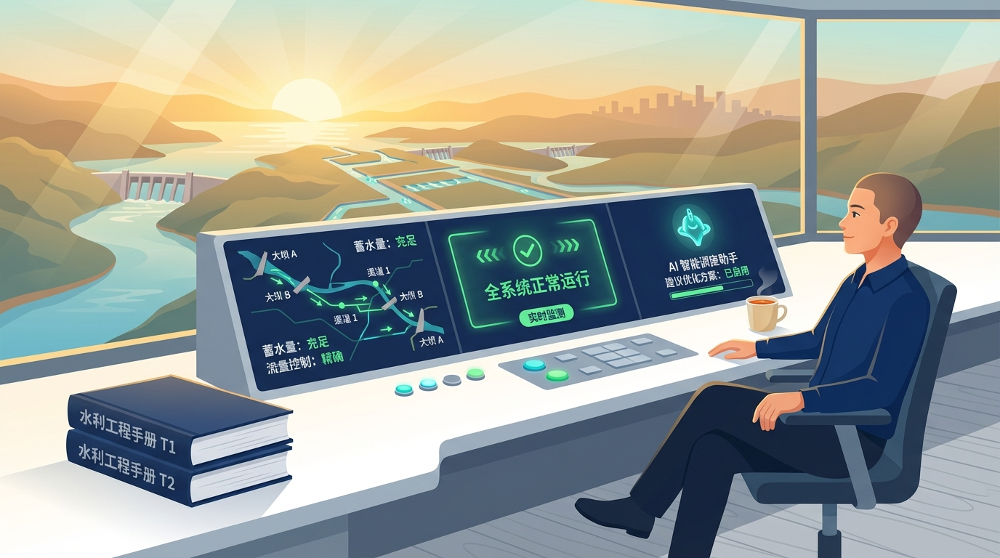
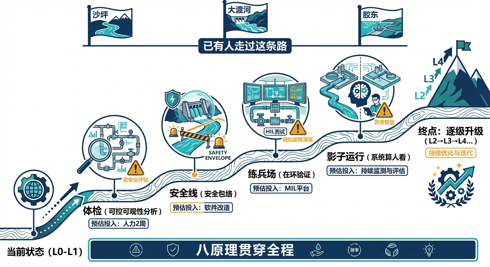
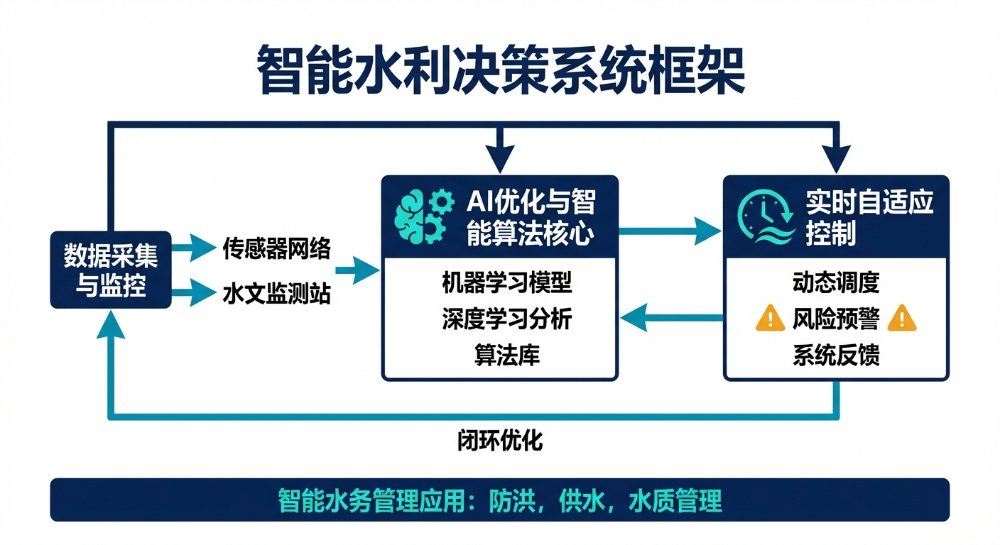
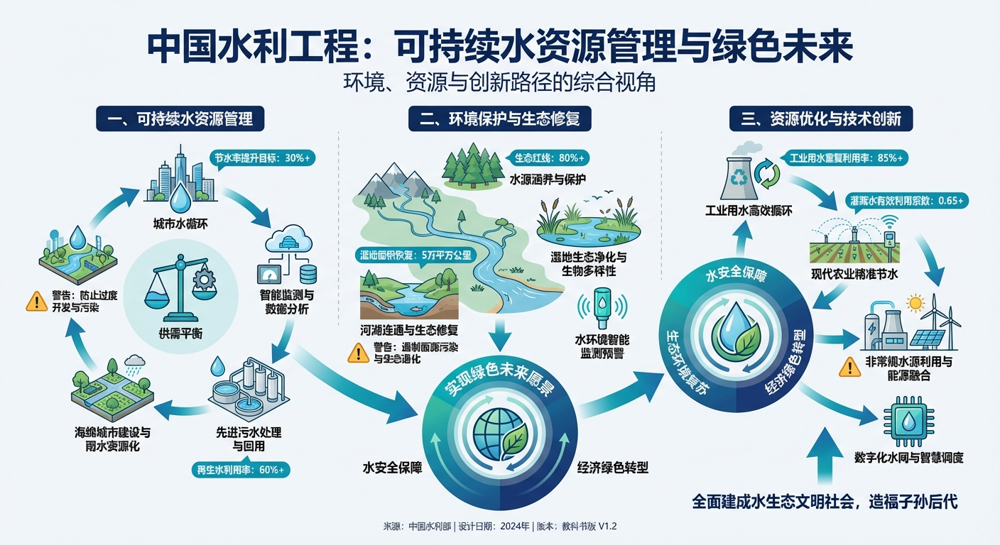
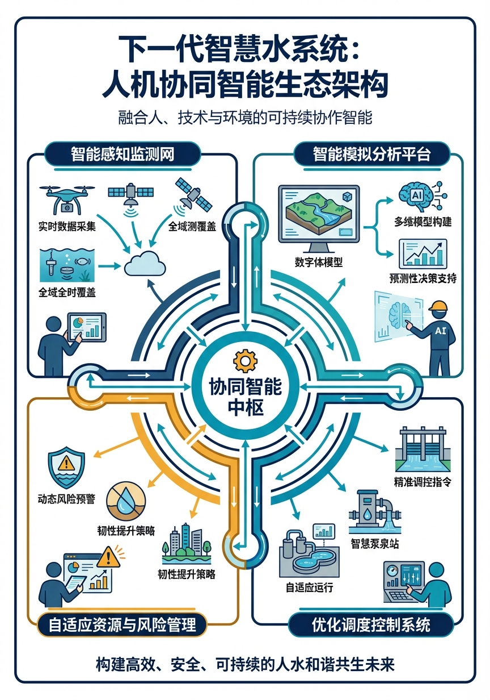

# 第十二章 你的水网，从今天开始觉醒

> **本章要点**
> - 水网觉醒不是遥远的未来——沙坪、大渡河、胶东三个工程已经在做，十年时间足够让更多工程从WNAL L2迈入L3。
> - 觉醒路线图不是"买一套AI系统"，而是四步走：数据质量扎实（传感器可靠、数据清洗到位）→ 模型驱动（建立水力模型和安全包络）→ AI增强（MPC+认知AI辅助决策）→ 条件自主（在验证过的ODD内系统自主运行）。
> - 最大的阻力不是技术，而是信任——调度员不敢放手、管理层怕担责、跨部门协调困难，CHS的ODD+xIL验证体系正是为建立这种信任而设计的。
> - "觉醒"的终极标志不是"不需要人"，而是"人做更有价值的事"——从盯屏幕、按按钮的重复劳动，转向ODD扩展、系统优化、应急预案设计等创造性工作。

## 开篇故事：十年后的调度室

让我们回到引子里的那间调度室。

十年后的一个暴雨夜，凌晨两点。老张已经退休了，现在值班的是当年的小刘——不，现在该叫刘工了。十年间，他从一个"盯着屏幕手足无措的新手"成长为"带着系统一起成长的资深工程师"。

同样是暴雨预警，但调度室的样子完全不同了。大屏幕上不再是密密麻麻的数字，而是一张清晰的"系统状态地图"——绿色的区域表示正常，黄色的区域表示需要关注，没有红色。十年前那个让老张紧张到手心出汗的局面——两个电话同时响、三个水位在涨、不知道先处理哪个——已经不存在了。

系统已经自动识别了来水变化，根据最新预报和传递函数模型计算出了调度方案，在安全包络内完成了闸门预调整——所有这些在5分钟内自动完成。屏幕右侧，认知AI给出了一段简洁的解释："上游来水增加约18%，根据ID模型预测72分钟后到达本站。已自动将3号闸开度调至35%，预计水位峰值52.8m，绿区范围内。如第二轮降雨确认，系统将在02:30自动调整至方案B。"

刘工看了一遍，点头确认。他不需要手动操作任何设备，但他的"确认"很重要——系统在执行自主决策，他在行使监督权。这正是WNAL L3的工作模式：系统自主运行，人类监督确认。

他泡了一杯茶，继续监控。如果系统判断局面超出了ODD（运行设计域）——比如来水超过了模型的预测范围、或者某个传感器出了故障——它会主动提醒刘工接管。系统知道自己"不知道什么"，这比盲目自信更重要。

刘工想起十年前那个暴雨夜。老张带着他手动调了一夜的闸门，天亮时两个人累得瘫在椅子上。今天同样的暴雨，他只需要偶尔看一眼屏幕、确认一下系统的判断。省下来的精力，他可以思考更重要的事：下个月的检修计划、明年汛期的ODD是否需要扩展、新来的实习生该怎么培训。

这不是科幻。这是沙坪、大渡河、胶东三个工程已经在做的事情——只是还没有完全到位。十年的时间，足够让这个场景在更多工程中变成现实。

关键问题是：**你的工程，从今天开始，第一步该做什么？**

---

## 12.1 回顾：水网觉醒的完整图景

从引子到三个案例，我们走完了水网觉醒的全部旅程。回头看，这趟旅程有一条清晰的主线：**从"理解问题"到"建立框架"到"工程验证"**。

前三章是"理解问题"：水利工程走过了五代人生（第一章），从人工看水尺到自主运行；水系统有五个控制本质（第二章），让它天生难以自动化——大时滞、强耦合、非线性、多约束、不确定性；给水网做可控可观性体检（第三章），是一切升级的前提——你都不知道系统有多少"盲区"，谈什么自主运行？

中间五章是"建立框架"：CHS八原理（第四章）是水网觉醒的理论基石；WNAL六级（第五章）告诉你工程在哪里、目标在哪里——不是所有工程都要追求L5，找到适合自己的等级更重要；安全包络（第六章）是永远不可突破的底线——红黄绿三区、保险丝和安全气囊；在环验证（第七章）是"先在虚拟世界犯错"的智慧——MIL/SIL/HIL三关不可跳级；HydroOS（第八章）是水网的操作系统——三层架构、四态机、断连自治。

后三章是"工程验证"：沙坪（第九章）解决"点"上的时间约束——MPC四步流程、ODD先紧后松、WNAL自评L2.5；大渡河（第十章）解决"链"上的空间耦合——EDC两级架构、预补偿机制、纳什均衡突破；胶东（第十一章）解决"网"上的维数爆炸——三时间尺度分层、数字孪生三阶段、三类AI协同。

三个案例不是孤立的——它们构成了一个"点→线→面"的递进序列，证明了CHS框架在不同规模、不同类型水利工程中的普适性。同时它们也展示了一个共同的规律：**每一个工程的"觉醒"都不是一步到位的，而是经历了"发现问题→建立模型→在线验证→逐步扩展"的渐进过程。** 沙坪花了几年从MPC模型到在环验证，大渡河从2012年AGC停用到2018年EDC投运用了六年，胶东从自动化到数字孪生经历了三个阶段。急不得——但方向必须对。

---

## 12.2 四步走：你的工程升级路线图

不管你的工程目前在哪一级，升级路线都遵循同一条主线——数据质量扎实→模型驱动→AI增强→条件自主。落地到实操层面，从三个具体步骤开始：

**第一步：做"体检"。** 列出关键约束，查可控性和可观性，找出盲区和死区。这一步花费最少但价值最大——它告诉你瓶颈在哪里、投资该往哪里集中。（对应第三章）

具体怎么做？从最简单的两个问题开始：你的工程有多少个关键控制变量？你能实时观测到其中几个？很多工程一做体检就发现——原来有些关键变量根本没在监测（比如某段渠道的中间断面水位），有些观测数据虽然有但从来没被用于控制（传感器装了但没接入控制系统）。这种"装了不用"和"该装没装"的盲区，不做体检永远发现不了。

体检不需要大投资。一个工程师花两周时间，画一张工程拓扑图，标出所有控制点和观测点，做一次可控可观性矩阵分析——这就是最基本的体检。体检结果可能告诉你："你的工程在正常工况下可控可观，但在泵站跳闸工况下，某段渠道变成了不可观的——因为唯一的传感器在泵站出口，泵停了传感器也就没信号了。"这个发现本身就值回体检的投入。

**第二步：画"安全线"。** 为关键变量建立红黄绿三区安全包络。这一步的成果可以直接嵌入现有的SCADA系统——不需要换设备，只需要加软件逻辑。（对应第六章）

安全包络的起步可以非常简单：先为最重要的一两个变量（比如水库水位、渠道流量）设定红线和黄线。红线就是"绝对不能超过"的硬约束——超过了必须立即采取保护动作。黄线就是"需要警惕"的预警线——进入黄区后系统开始收紧控制、提高警觉。你不需要一开始就为所有变量都建安全包络——先管最关键的，积累经验后再逐步扩展。

**第三步：建"虚拟练兵场"。** 搭建在环验证平台。不一定要一步到位建HIL——可以先从MIL开始，用数学模型模拟你的工程，把日常运行工况和异常场景都跑一遍。随着需求增长再逐步升级到SIL和HIL。（对应第七章）

MIL的起步同样可以很简单：用Matlab或者Python搭建一个你的工程的降阶模型（不需要太精确，能反映主要动力学特征就行），然后在模型里试验不同的调度方案——"如果来水突然增加50%会怎样？""如果某台泵故障了，其他泵能不能兜住？"这些问题在真实工程上不敢试，但在模型里可以放心大胆地试。

**第四步：跑"影子模式"。** 系统算方案、人看结果，但暂不让系统直接控制设备。这就是"影子运行"——系统和人并行决策，人的方案执行，系统的方案记录对比。跑几个月下来，如果系统的方案一直和人的判断一致甚至更优，信任就建立起来了——可以逐步让系统在验证过的ODD内自主执行，人转为监督角色。这就是从L2迈向L3的关键过渡。（对应第五章WNAL分级中L2到L3的跃迁要求）

四步走的关键原则是：**不要等所有条件都具备了再开始，而是从最小的切入点开始，在实践中逐步积累。** 沙坪的MPC不是一天建成的——先有了模型，再有了在线优化，再有了在环验证，前后花了好几年。胶东的数字孪生也经历了三个阶段的演进。急不得，但也拖不得。

还有一个容易忽视的"第零步"：**先理解你的工程到底在控制什么。** 很多工程的日常操作已经变成了"惯例"——"水位到了某个值就开闸""泵站每天早上8点启动"——但没人深入思考过这些惯例背后的控制逻辑是什么、约束条件是什么、在什么情况下惯例可能失效。CHS的第一个贡献不是给你新工具，而是给你新视角——用控制论的眼光重新审视你每天都在做的事情。当你开始用"可控性""可观性""安全包络""ODD"这些概念来描述你的工程时，很多以前"说不清"的经验就变成了"说得清"的知识。

> [图12-1] **"水网觉醒路线图"全景图**
>
> 提示词：从左到右的路线图，画成登山路径。起点"当前状态（L0-L1）"→第一站"体检（可控可观性分析）"→第二站"安全线（安全包络）"→第三站"练兵场（在环验证）"→第四站"影子运行（系统算人看）"→终点"逐级升级（L2→L3→L4…）"。每一站配简洁图标和预估投入（体检：人力2周；安全线：软件改造；练兵场：MIL平台）。路线图底部标注"八原理贯穿全程"。上方飘着沙坪/大渡河/胶东三个小旗帜标注"已有人走过这条路"。

---

## 12.3 五个常见误区

在水网觉醒的路上，有五个常见的误区需要警惕。

**误区一："先买设备再说"。** 很多工程的升级路径是"先买一大批传感器和设备，然后再想怎么用"。结果往往是：设备装了一堆，数据汇集了一堆，但没有人知道这些数据应该怎么用来做控制——花了大钱买了"眼睛"，但缺了"大脑"。正确的顺序是先做体检、明确需求，再有针对性地配置设备。

**误区二："AI能解决一切"。** 有些管理者对AI寄予过高期望，认为只要上了AI，调度问题就自动解决了。第十一章已经讲清楚了：物理AI（MPC、安全包络）和认知AI（大语言模型）各有各的能力边界。AI不能替代物理模型的精确计算，物理模型也不能替代AI的认知辅助。更重要的是，AI不能替代对工程物理特性的深入理解——如果你都不知道你的渠道的传递函数是什么，再强的AI也帮不了你。

**误区三："一步到L5"。** WNAL是分级的，每一级都有明确的前提条件——L2要求安全包络全覆盖，L3要求在环验证通过，L4要求系统在ODD内完全自主且经过长期影子运行验证。试图跳过L2直奔L4，就像一个刚拿驾照的新手直接去跑赛道——不是勇敢，是鲁莽。沙坪目前是L2到L2.5，胶东是L3——这些已经是国内最先进的水利工程了，也才走到这一步。踏实地从L1做到L2，比空谈L5有价值得多。

**误区四："自主运行就是无人运行"。** 这是最危险的误区。自主运行的核心不是"去掉人"，而是"改变人的角色"——从操作者变成监督者，从值班盯屏变成决策审查。即使到了L4（高度自主），人类仍然保留最终否决权和应急接管权。开篇故事里的刘工不是"无事可做"——他在行使比手动调闸门更重要的职能：系统级的监督和判断。更重要的是，当系统遇到ODD之外的极端工况时，人类的创造性思维和应急判断力是任何算法都无法替代的。

**误区五："我的工程太小/太特殊，不适用"。** CHS的框架是通用的——ODD、安全包络、在环验证、WNAL这些概念不分工程大小。一座小型水库和胶东571公里水网的区别不是"要不要做"，而是"做到什么深度"。小水库的体检可能一个人两周就做完了，安全包络可能就是两条水位线，MIL可能就是一个Excel表格——但思路是一样的。

---

## 12.4 给不同角色的建议

**给调度员：你的经验比任何算法都珍贵。** 自主运行不是要取消调度员，而是要把你从重复性的日常操作中解放出来，让你专注于真正需要人类判断力的工作——异常识别、应急决策、经验传承。你积累的二十年经验是认知AI的"教材"——系统需要学习的，正是你脑子里那些"说不清但管用"的直觉。

但经验也需要更新。十年前管用的调度经验，在来水条件变化、用水格局改变、气候模式漂移的今天可能已经不完全适用了。自主运行系统的一个好处是：它可以把你的经验和最新的数据结合起来——你的直觉加上模型的计算，比单独的直觉或单独的计算都更可靠。

**给设计师：从今天起，设计阶段就要考虑"运行设计域"。** 不要等工程建完了才发现"库容太小、调度员来不及反应"——沙坪的585万方库容就是这样的历史遗留。在设计阶段就做ODD分析——这个工程建成后，在什么工况下能自主运行？在什么工况下必须靠人？如果发现自主运行的ODD太窄，现在改设计远比建成后改运行便宜。

更具体地说：设计一个新工程时，除了传统的水力计算和结构设计，多考虑三个问题：一，关键变量的可观性——传感器布在哪里才能确保控制系统"看得到"？二，安全包络的裕度——红黄绿三区的宽度够不够？黄区太窄意味着系统没有足够的"缓冲空间"。三，在环验证的条件——工程建成后有没有条件做MIL/SIL/HIL测试？

**给管理者：投资在环验证平台，比多买一台传感器更值。** 一套MIL/SIL平台的建设费用可能和几十个传感器差不多。但传感器只能"看"，验证平台能"防"——它能在事故发生之前帮你找到隐患。沙坪的HIL测试发现了9个问题（其中3个A类缺陷），如果这些问题在正式运行中暴露，损失可能是HIL投入的几十倍。

给管理者还有一条建议：**重视数据资产**。你的工程每天产生的运行数据是极其宝贵的——它们是训练AI模型的"燃料"、是校正物理模型的"标尺"、是积累运行经验的"日记"。但很多工程的数据管理状况令人担忧——数据存了但找不到、格式不统一、缺失值没处理、历史数据被覆盖。从现在起投入一点精力整理数据，未来的回报会远超预期。

**给科研人员：水利控制论是一片蓝海。** 相比于电力系统控制、化工过程控制这些已经有几十年积累的学科，水利系统的控制论研究还处于起步阶段。CHS提出的很多概念——WNAL分级、水网ODD、HydroOS架构——都还有大量的理论工作等待深入。每一个概念背后都有值得发表多篇论文的研究空间。

举几个例子：安全包络的动态自适应——如何根据模型置信区间和预报精度自动调整红黄绿三区的边界？梯级水电站的博弈论建模——纳什均衡陷阱如何量化、EDC的协调效率如何评估？多智能体水网的通信容错——在通信中断概率不同的条件下，分层分布式控制的鲁棒性如何保证？这些问题不仅有理论深度，而且有直接的工程应用价值——这正是好的研究课题应该具备的特征。

---

## 12.5 从这本书到那本书

你手上这本《水网觉醒》是"菜单和试吃"。如果你读完觉得某些内容想深入了解——

想看八原理的完整数学表述？《水系统控制论》第七章给出了每条原理的形式化定义和数学推导。想看WNAL分级的详细准入门槛和评估方法？第八章有完整的评分体系和判据。想看安全包络的设计方法和数学公式？第九章给出了红黄绿三区边界的计算方法。想看三个案例的完整技术数据——沙坪的MPC参数、大渡河的EDC优化模型、胶东的三层调度算法？第十三到十五章有你需要的一切细节。想了解CHS的学科定位和学术脉络——它和经典控制论、现代控制论、系统工程的关系？第一章和第二章提供了完整的学术定位。

那本书有公式、有证明、有完整的工程数据——是"正餐"。这本书的任务是让你决定要不要坐下来吃这顿正餐。

两本书之间还有一个重要的桥梁：**四篇核心论文**。它们发表在2025年《南水北调与水利科技(中英文)》期刊上，分别从不同角度阐述了CHS的核心思想——提出背景和技术框架（Lei 2025a）、自主运行智慧水网架构（Lei 2025b）、在环测试体系（Lei 2025c）、水资源系统分析学科展望（Lei 2025d）。如果你觉得这本科普书太浅但那本专著太深，这四篇论文正好是中间的"过渡台阶"。

---

## 12.6 组织变革与人才转型：另一半的觉醒

技术升级只完成了觉醒的一半。另一半，是组织架构和人才结构的同步转型。这是很多水利智能化项目事后复盘时才意识到的短板：算法买来了、平台搭好了、系统上线了——但运行的人还是原来那批人，用原来的方式工作，结果系统成了摆设。

**从"值班运行"到"智能运维"：组织架构需要重新设计。**

传统的调度室组织逻辑是"轮班值守+人工操作"——每班几个人，盯着屏幕，水位到了动闸门，机组有问题叫检修。这套组织逻辑在L0到L1时代是合理的——因为系统本身就是被动响应的，人必须时刻在场。但在L3以上的系统里，继续沿用这套组织逻辑就出了问题：系统大部分时间在自主运行，值班员无事可做、注意力涣散；真正需要人接管的时候，反而因为长期不操作而手生——这就是第五章里提到的"技能退化"陷阱。

智能运维的组织逻辑是不同的。调度员不再按"水位-动作"的反应模式工作，而是按"状态巡查-异常判断-授权决策"的监督模式工作。一个人可以同时监督多个工程（像远程管理员而不是现场操作员），但需要更强的系统理解能力——能读懂AI给出的推理过程、能判断系统的自主决策是否合理、能在ODD边界被触发时迅速切换到手动模式并给出正确处置。这要求组织结构从"多人现场值守"转向"少而精的远程监控+快速响应的专家团队"。沙坪水电站和胶东调水的运行机构已经在朝这个方向调整，但对大多数水利工程来说，这个转变还没有开始。

**传统工程师的知识升级：不是转行，是扩展。**

水网觉醒不要求水利工程师变成计算机科学家，但确实要求他们扩展知识边界。具体来说，两个方向是最有价值的：

第一，**控制论基础**。不需要能推导LQR的最优增益矩阵，但需要理解"反馈控制""稳定性""可观性""预测时域"这些概念的物理含义。一个不懂可控性分析的工程师，设计出来的传感器布局可能导致整个控制系统在某些工况下"瞎了"——就像第三章说的可观性盲区。这种基础理解是和控制工程师、软件工程师有效沟通的前提，否则水利专家和控制专家会继续"鸡同鸭讲"——两边都在说真话，但谁也听不懂谁。

第二，**AI工具的原理性认知**。不需要能写神经网络代码，但需要知道AI的"能"和"不能"——MPC在有模型的情况下能做什么、大语言模型为什么不能直接用来控制闸门、为什么AI的预测结果需要安全包络来兜底。有了这个认知，管理者才能给AI项目提出正确的需求，不会被"AI万能论"忽悠，也不会因为"AI出了一次错"就否定整个智能化方向。

这两个方向的学习门槛并不高。一本控制论入门教材、几个MPC在线课程、再加上实际工程项目中的"干中学"——大多数有工程经验的水利工程师在一两年内都能建立起足够的跨学科知识储备。

**新型"水网运行工程师"的培养：一个新学科方向的诞生。**

更深层的问题是：现有的教育体系还没有为这个融合时代培养对应的人才。今天的水利水电工程专业培养的是"建工程"的工程师——懂水力学、结构力学、工程地质，善于回答"工程能不能建、怎么建"的问题。控制与信息工程专业培养的是"做控制"的工程师——懂控制论、信号处理、软件工程，善于回答"系统能不能控、怎么控"的问题。但"建好了怎么自主运行"这个问题，正好落在两个专业的空白地带。

CHS作为新的学科方向，提出了一种不同的人才培养路径：培养"水网运行工程师"——既懂水力学（能理解渠道传递函数、水库调洪演算、梯级水电站耦合机理），也懂控制与AI基础（能做可控可观性分析、能理解MPC的工作原理、能评估AI建议的合理性）。这不是要培养"两个专业的都懂"的超人，而是要培养"两个专业都能沟通"的桥梁型人才。

这样的人才培养需要课程体系的重构：水力学+控制论的交叉课程、以真实工程为场景的案例教学、基于在环验证平台的实验实习。河北工程大学已经在探索这个方向——CHS学科建设不仅仅是写论文、出教材，更是在为下一代水网运行工程师建立培训体系的基础设施。

从更长远的视角看，"水网运行工程师"这个职业方向的需求将会快速增长。中国9.8万座水库、几百条长距离调水工程、数以万计的泵站闸门——当这些基础设施陆续完成数字化改造、开始向L2、L3迈进时，每一个工程都需要懂得如何运维智能系统的工程师。这是一个正在形成中的人才缺口，也是水利专业学生和年轻工程师值得认真考虑的职业方向。

---

## 12.7 尾声：水利工程师的下一个十年

水利是人类最古老的工程学科之一——都江堰已经运行了两千三百年。在漫长的历史中，水利工程师积累了举世无双的工程智慧。李冰父子修建都江堰时没有传感器、没有计算机、没有控制理论——但他们对水流规律的理解、对"四六分水"原则的把握，本质上就是最早的"安全包络"和"运行设计域"。

下一个十年，这份智慧不会过时，但会获得新的表达方式。调度员的经验会被认知AI继承和放大——不是替代经验，而是让经验突破个人记忆力的局限，变成整个系统都能使用的知识。设计师的直觉会被MBD方法论系统化——不是否定直觉，而是让直觉有据可查、可验证、可传承。管理者的判断会被安全包络和审计链条支撑——不是取消判断，而是让判断有更完整的信息基础。

水利工程师不会被AI取代。但不懂AI的水利工程师，会被懂AI的同行超越。这不是威胁——这是机遇。CHS为水利工程师提供了一套和AI"对话"的共同语言：当你说"ODD"，AI工程师知道你在说运行边界；当你说"安全包络"，软件工程师知道你在说约束条件；当你说"WNAL L3"，管理者知道你在说系统当前的能力等级。这套语言打通了水利、控制、计算机三个学科之间的壁垒。

中国有9.8万座水库、2200多处大型灌区、数十项跨流域调水工程。每一个工程都是一个潜在的"觉醒"候选者。当这些工程逐步从L0走向L2、从L2走向L3，汇聚起来将是人类水资源管理历史上最深刻的一次变革。这场变革的主角不是AI、不是算法、不是传感器——而是懂水利又愿意拥抱新工具的工程师们。

水网正在觉醒。觉醒的第一步不是买最贵的设备、上最新的AI，而是换一个看问题的视角——从"这个工程怎么建"变成"这个工程怎么控制"，从"出了问题怎么修"变成"怎么让问题不发生"，从"调度员怎么值班"变成"人和系统怎么协作"。

这本书试图提供的，就是这个视角。

觉醒的，不仅是水网，也是我们自己。

---

## 💬 工程师问答

**Q：我们工程连SCADA都还不完善，谈CHS是不是太超前了？**

A：不超前。CHS的起点不是"最先进的系统"，而是"正确的思维方式"。你的SCADA不完善，说明体检（可控可观性分析）更加重要——正好趁这个机会搞清楚：哪些传感器是必须的、哪些是锦上添花的、哪些位置应该装但没装。有了体检结果，SCADA的完善就有了明确的优先级——不是"什么都装"，而是"先装最关键的"。

**Q：读完这本书，我最应该做的一件事是什么？**

A：找出你的工程最关键的一个控制变量（通常是某个水位或流量），画出它的安全包络——红线在哪里、黄线在哪里、绿区有多宽。然后问自己：现在的监测和控制手段，能不能保证这个变量永远不越红线？如果答案是"不确定"——恭喜你，你已经找到了升级的第一个切入点。

**Q：CHS和"智慧水利""数字孪生"这些热词是什么关系？**

A：智慧水利和数字孪生是"做什么"的描述——建平台、做可视化、搞智能化。CHS是"怎么做"和"做到什么标准"的方法论——ODD告诉你边界在哪里，安全包络告诉你底线是什么，WNAL告诉你做到什么程度了，在环验证告诉你怎么确保可靠。两者不矛盾，CHS为智慧水利和数字孪生提供了理论骨架。

---

---

## 本章配图

**图12-1　"水网觉醒路线图"全景图**

**图12-2　智能水利决策系统框架**

**图12-3　可持续水资源管理与绿色未来**

**图12-4　人机协同智能生态架构**

## 参考文献

[12-1] 雷晓辉, 龙岩, 许慧敏, 等. (2025). 水系统控制论：提出背景、技术框架与研究范式 [J]. *南水北调与水利科技(中英文)*, 23(04): 761-769+904. doi:10.13476/j.cnki.nsbdqk.2025.0077.

[12-2] 雷晓辉, 苏承国, 龙岩, 等. (2025). 基于无人驾驶理念的下一代自主运行智慧水网架构与关键技术 [J]. *南水北调与水利科技(中英文)*, 23(04): 778-786. doi:10.13476/j.cnki.nsbdqk.2025.0079.

[12-3] 雷晓辉, 张峥, 苏承国, 等. (2025). 自主运行智能水网的在环测试体系 [J]. *南水北调与水利科技(中英文)*, 23(04): 787-793. doi:10.13476/j.cnki.nsbdqk.2025.0080.

[12-4] 雷晓辉, 许慧敏, 何中政, 等. (2025). 水资源系统分析学科展望：从静态平衡到动态控制 [J]. *南水北调与水利科技(中英文)*, 23(04): 770-777. doi:10.13476/j.cnki.nsbdqk.2025.0078.

[12-5] Litrico, X., & Fromion, V. (2009). *Modeling and Control of Hydrosystems*. Springer-Verlag London.

[12-6] 联合国粮农组织(FAO). (2017). 全球水资源利用现状与趋势 [EB/OL]. Rome.

[12-7] Dugan, R. C., McGranaghan, M. F., Santoso, S., & Beaty, H. W. (2002). *Electrical Power Systems Quality* (2nd ed.). McGraw-Hill Professional.

[12-8] Negenborn, R. R., & Maestre, J. M. (2014). Distributed model predictive control: An overview and roadmap of future research opportunities. *IEEE Control Systems Magazine*, 34(4): 87-97.

[12-9] 中国工程院. (2023). 中国水利发展报告 [R]. 北京.

[12-10] Åström, K. J., & Murray, R. M. (2010). *Feedback Systems: An Introduction for Scientists and Engineers*. Princeton University Press.

[12-11] Russell, S. J., & Norvig, P. (2020). *Artificial Intelligence: A Modern Approach* (4th ed.). Pearson.

---

> **一句话回顾**：水网觉醒的核心不是用AI替代人，而是用CHS的理论框架和工程方法（ODD+xIL+分层分布式控制）让系统承担重复性判断，让人去做更有价值的创造性工作——这条路沙坪、大渡河、胶东已经蹚出了第一步，下一步轮到你的水网了。

> 📖 **本书完整深入阅读索引**
>
> | 本书章节 | 对应《水系统控制论》 |
> |---------|-------------------|
> | 引子 | 第一章 §1.3 |
> | 第一章 五代人生 | 第一章 §1.1-§1.2 |
> | 第二章 为什么难管 | 第二章 全章 |
> | 第三章 体检 | 第四章 + 第六章 |
> | 第四章 八原理 | 第三章 + 第七章 |
> | 第五章 WNAL | 第八章 §8.1-§8.3 |
> | 第六章 安全包络 | 第九章 §9.1-§9.2 |
> | 第七章 在环验证 | 第九章 §9.3-§9.7 |
> | 第八章 HydroOS | 第十一章 全章 |
> | 第九章 沙坪 | 《水系统控制论》第十三章 全章 |
> | 第十章 大渡河 | 《水系统控制论》第十四章 全章 |
> | 第十一章 胶东 | 《水系统控制论》第十五章 全章 |
>
> **相关学术论文（Lei 2025a-d）：**
> - Lei 2025a: 水系统控制论：提出背景、技术框架与研究范式. 南水北调与水利科技(中英文),2025,23(04):761-769+904
> - Lei 2025b: 基于无人驾驶理念的下一代自主运行智慧水网架构与关键技术. 南水北调与水利科技(中英文),2025,23(04):778-786
> - Lei 2025c: 自主运行智能水网的在环测试体系. 南水北调与水利科技(中英文),2025,23(04):787-793
> - Lei 2025d: 水资源系统分析学科展望：从静态平衡到动态控制. 南水北调与水利科技(中英文),2025,23(04):770-777
