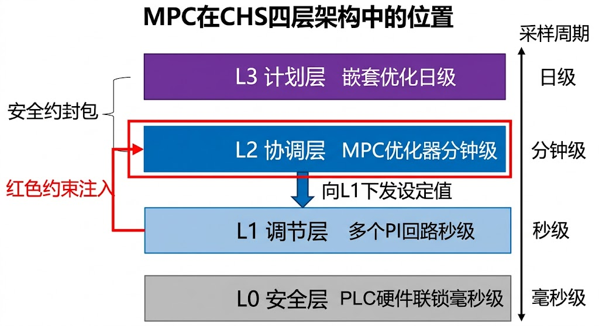
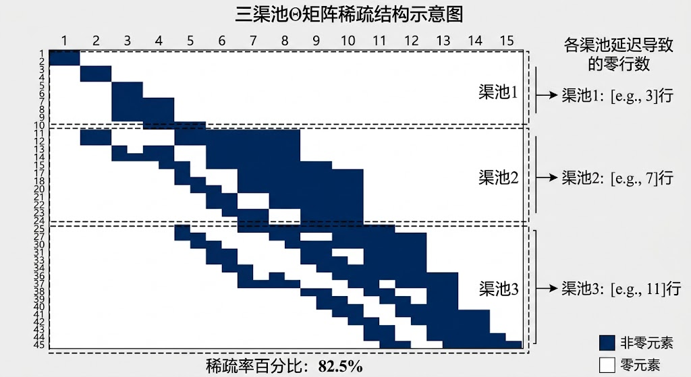
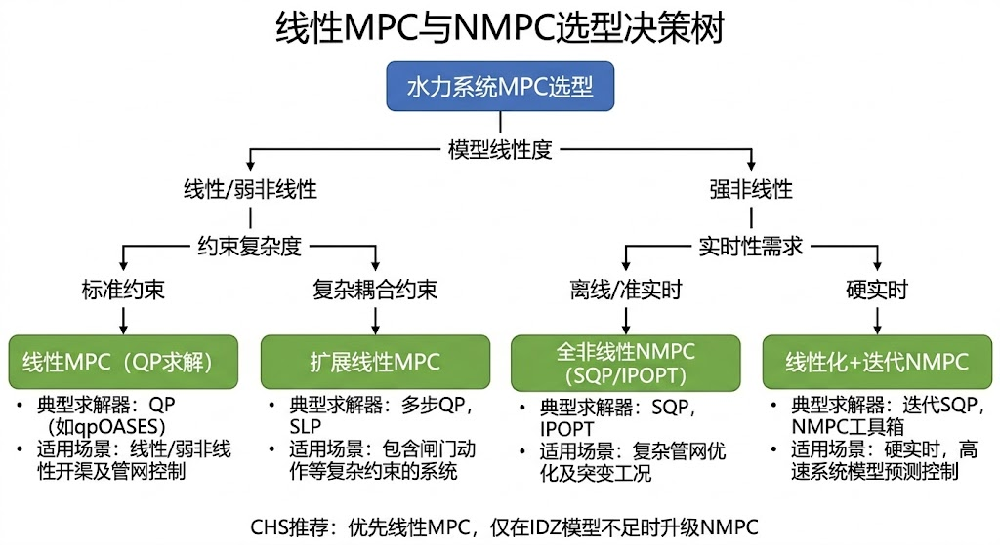
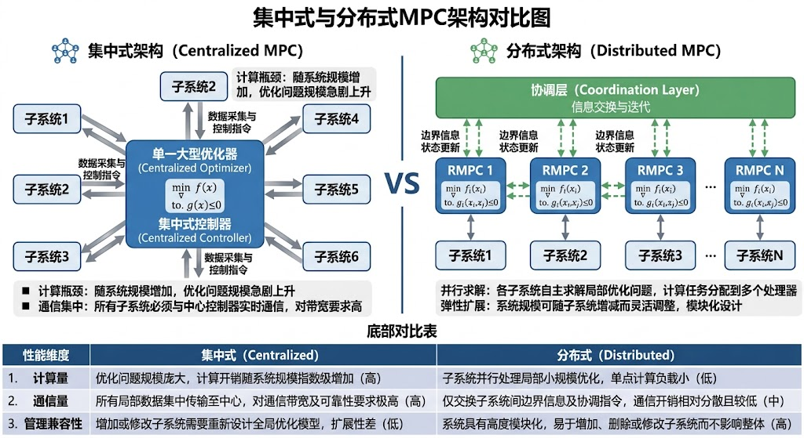
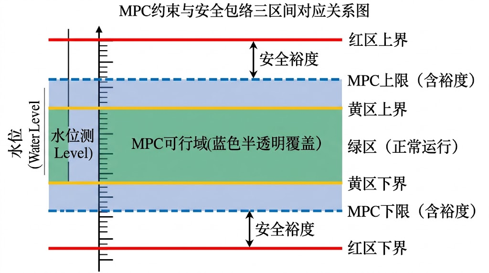

<!-- 变更日志
v3 2026-03-03: 三角色评审修订——(1)🟡T2b分工修正: §7.7.2中"边缘Agent"改为"边缘控制器"，"区域Agent"改为"区域MPC子系统"，"云Agent"改为"全局协调器"，符合T2a/T2b分工红线；(2)🔴公式补充: 在§7.7.3新增DMPC本地代价函数标准形式(式7-39b)，与CHS §O规范的J_i公式完全一致；(3)"每个区域Agent"工程解释改为"区域MPC子系统"
v2 2026-03-01: 全面扩写至~4万字，覆盖MPC全部核心内容（§7.1-§7.10），含8道例题、15道习题、38篇参考文献
v1 2026-02-16: 初稿骨架(~6.2k字)
-->

# 第七章 模型预测控制（MPC）

---

## 学习目标

完成本章后，你应能够：

1. 阐述模型预测控制（Model Predictive Control, MPC）的三要素——预测模型、滚动优化、反馈校正——及其协同机理；
2. 从IDZ状态空间模型出发，完整构建含状态约束、输入约束与增量约束的线性MPC二次规划（QP）问题；
3. 分析MPC的稳定性条件，理解终端约束集与终端代价在保证闭环稳定性中的作用；
4. 设计扰动估计与反馈校正机制，使MPC在模型失配和未知扰动下保持鲁棒性；
5. 区分线性MPC、非线性MPC（NMPC）、分布式MPC（DMPC）、鲁棒MPC与经济型MPC的适用边界与工程取舍；
6. 将MPC与CHS分层架构中的安全包络、L1层PI控制器及QP求解器部署进行工程集成。

> **章首衔接（承接ch06）**
> 上一章建立了现代控制方法的完整框架：状态空间建模提供了统一的数学描述，LQR/LQG实现了无约束下的最优状态反馈与最优估计，H$_\infty$鲁棒控制给出了最坏情形下的性能保证，自适应控制应对了参数时变的挑战。然而，这些方法共享一个核心局限——**不能直接处理硬约束**。LQR的代价函数优化是在无约束的无限时域上进行的，当闸门开度存在物理上下限、水位必须保持在安全范围内、控制量变化率受执行器速率限制时，LQR只能通过事后饱和截断来"应付"，这种做法既丧失了最优性，也无法保证约束满足。
>
> 本章进入模型预测控制（MPC）——在**显式约束**下实现"预测—优化—执行"闭环的方法。MPC将LQR的代价函数优化与约束处理统一到在线滚动优化框架中，是CHS框架中L2协调层的核心控制算法。如果说LQR回答的是"无约束下最优控制是什么"，那么MPC回答的是"有约束下、有限时域内、基于当前信息的最优控制是什么"——这恰恰是水系统工程师每天面对的真实问题。
>
> 本章是全书技术内容的"枢纽"章节。前序章节（ch02~ch06）所建立的水动力学模型、降阶方法、经典控制和现代控制理论，在本章汇聚为一个统一的约束优化控制框架；后续章节（ch08的优化方法、ch09的可控可观性分析、ch10的安全约束、ch11的状态估计、ch12的分层架构）则从不同维度深化和扩展本章的核心内容。可以说，理解了MPC的原理和工程实现，就掌握了水系统控制论从"理论"到"工程"的核心转化路径。建议读者在学习本章时，重点关注§7.2的标准数学形式（这是所有后续扩展的基础）和§7.9的工程集成（这是算法走向实际部署的关键）。

---

## 7.1 MPC的基本思想与发展历程

### 7.1.1 MPC的三要素：预测模型、滚动优化、反馈校正

[物理直觉] 一位经验丰富的调度员在决定当前闸门开度时，脑中会同时做三件事：第一，根据对渠道水力特性的理解**预测**未来若干小时内各断面的水位变化趋势；第二，在满足水位上下限、闸门开度范围和变化速率等约束的前提下，**优化**当前及未来一段时间的闸门动作序列，使水位尽可能贴近目标值；第三，等到下一个时刻实际水位测量值到来后，根据预测值与实际值的**偏差**修正预测，重新规划。这三个步骤——预测、优化、校正——不断滚动重复，构成了调度员的决策闭环。

MPC将这一人类直觉形式化为三个数学要素：

**要素一：预测模型（Prediction Model）。** MPC需要一个能在控制周期内完成计算的系统模型，用于从当前状态出发预测未来$N_p$步的输出轨迹。在水系统中，这一模型通常是第四章建立的IDZ降阶模型或其离散状态空间形式。预测模型的精度不需要达到科学研究级别，但必须能够捕捉控制所关心的主导动态——传输延迟$\tau_d$和积分效应$A_s$。一个关键的工程判据是：预测模型的误差应小于控制目标允许的偏差裕度。

**要素二：滚动优化（Receding Horizon Optimization）。** 在每个采样时刻$k$，MPC求解一个有限时域的约束优化问题：在未来$N_p$步的预测时域上最小化跟踪误差与控制代价的加权和，同时满足状态约束、输入约束和增量约束。求解得到的最优控制序列$\{\Delta\mathbf{u}_k^*, \Delta\mathbf{u}_{k+1}^*, \ldots, \Delta\mathbf{u}_{k+N_c-1}^*\}$中，**只执行第一步**$\Delta\mathbf{u}_k^*$，其余全部丢弃。这就是"滚动时域"（receding horizon）策略的核心：每一步都重新规划，而非盲目执行旧方案。

**要素三：反馈校正（Feedback Correction）。** 滚动优化本身已经隐含了反馈机制——每一步都利用最新的测量信息重新规划。但在工程实践中，仅靠重新初始化状态是不够的，还需要显式的偏差校正来补偿模型失配和未知扰动。常用方法包括状态偏差法（用测量值与预测值之差修正初始条件）和扰动估计法（用增广状态估计器估计等效扰动并注入预测模型）。反馈校正是MPC区别于开环最优控制的关键特征。

将三个要素综合起来，MPC在每个采样时刻$k$执行以下步骤：

1. **测量/估计**当前状态$\mathbf{x}(k)$；
2. **预测**：利用模型从$\mathbf{x}(k)$出发，计算未来$N_p$步的预测输出$\hat{\mathbf{y}}(k+1|k), \ldots, \hat{\mathbf{y}}(k+N_p|k)$；
3. **优化**：求解约束QP问题，得到最优控制增量序列$\Delta\mathbf{U}^*$；
4. **执行**：将$\Delta\mathbf{u}^*(k|k)$施加到系统；
5. **校正**：在$k+1$时刻，用新的测量值更新状态估计，回到步骤1。

[工程解释] MPC的计算代价集中在步骤3的在线QP求解上。对于线性模型和二次代价函数，该QP问题是凸的，有成熟的高效求解器（如OSQP、qpOASES）。对于非线性模型，则需要求解非凸优化问题，计算代价显著增大。这是线性MPC与非线性MPC（NMPC）在工程部署中的核心差异。

### 7.1.2 MPC的发展历程：从石化工业到水系统

MPC的思想起源于20世纪70年代末的石化工业。1978年，Richalet等人提出了模型算法控制（Model Algorithmic Control, MAC），利用脉冲响应模型进行预测和优化(Richalet et al., 1978)。几乎同时，Shell公司的Cutler和Ramaker于1979年提出了动态矩阵控制（Dynamic Matrix Control, DMC），使用阶跃响应模型，并在炼油装置上成功应用(Cutler and Ramaker, 1980)。这两项工作标志着MPC从理论概念走向工业实践。

20世纪80-90年代，MPC在石化、化工等过程工业中迅速推广。Qin和Badgwell的调查表明，到2003年全球已有超过4600个MPC应用案例，其中绝大多数在过程工业领域(Qin and Badgwell, 2003)。这一时期的MPC发展主要沿两条路线推进：一是工业界不断改进商用MPC软件（如DMCplus、RMPCT、Connoisseur），追求更好的工程可用性；二是学术界建立了MPC的稳定性、鲁棒性和最优性理论基础，其中Mayne等人2000年的综述论文是这一领域的里程碑式工作(Mayne et al., 2000)。

MPC在水系统中的应用始于21世纪初。Wahlin(2004)首次在ASCE标准测试渠道上系统评估了MPC的性能，证明MPC能够有效处理明渠控制中的长延迟和约束问题(Wahlin, 2004)。Van Overloop(2006)在其TU Delft博士论文中全面发展了明渠MPC方法论，建立了从IDZ模型到QP求解的完整设计流程，并在荷兰的实际水利系统上进行了验证(Van Overloop, 2006)。Litrico和Fromion(2009)在其专著中将频率域建模与MPC设计系统整合，为水系统MPC提供了严格的理论基础(Litrico and Fromion, 2009)。

近年来，MPC在水系统中的应用呈现三个趋势：第一，从单渠池向大规模水网扩展，分布式MPC（DMPC）成为研究热点(Negenborn et al., 2009)；第二，从确定性向不确定性扩展，鲁棒MPC和随机MPC开始应用于来水不确定性管理；第三，从纯跟踪型向经济型扩展，泵站能耗优化等经济目标被纳入MPC框架。在CHS框架下，MPC被定位为L2协调层的核心算法，与L1层的PI控制器和L0层的安全联锁形成互补(Lei 2025a)。

从更宏观的视角看，MPC在水系统领域的发展可以对应到Garcia等人(1989)和Morari与Lee(1999)总结的三代MPC技术框架：第一代MPC（1970-1980年代）以脉冲响应和阶跃响应模型为基础，关注的是无约束或简单约束下的预测控制，其在水系统中的应用主要限于概念验证；第二代MPC（1990-2000年代）以状态空间模型为核心，建立了约束处理和稳定性的完整理论框架，Van Overloop(2006)和Wahlin(2004)的工作属于这一代；第三代MPC（2010年代至今）融入了分布式计算、鲁棒优化、经济目标和数据驱动等元素，代表了水系统MPC的当前前沿。这一代际演进与水系统控制从"单渠池调节"到"水网协调运行"再到"自主运行"的范式升级高度吻合——每一代MPC技术都回应了水系统运行复杂度提升带来的新需求。

### 7.1.3 MPC与经典控制的对比：约束处理能力、多变量协调、计算代价

为帮助读者建立MPC相对于经典控制方法的直觉，表7-1从六个维度进行了系统对比。

**表7-1: MPC与PI/LQR的工程对比**

| 维度 | PI控制器（ch05） | LQR（ch06） | MPC（本章） |
|------|-----------------|-------------|-------------|
| 约束处理 | 事后饱和截断，无最优性保证 | 无直接约束处理能力 | **显式约束**，在优化中直接施加 |
| 多变量协调 | 单回路独立设计，解耦依赖人工 | 天然多变量，但无约束 | **天然多变量+约束**，自动协调 |
| 预测能力 | 无预测，仅反应当前误差 | 隐含无限时域预测 | **有限时域显式预测**，可利用扰动预报 |
| 计算代价 | 极低（乘加运算） | 低（矩阵乘法） | **中等**（在线QP求解） |
| 稳定性保证 | 经典频域判据 | Riccati方程保证 | **需额外设计**（终端约束/终端代价） |
| 调参复杂度 | 3个参数（$K_p, T_i, T_d$） | $\mathbf{Q}, \mathbf{R}$矩阵 | $\mathbf{Q}, \mathbf{R}, N_p, N_c$ + 约束边界 |
| 可利用预报信息 | 前馈通道（有限） | 无标准接口 | **天然接口**：预报直接进入预测模型 |
| 典型应用层级 | CHS L1层（实时调节） | CHS L1-L2层 | CHS **L2层**（协调优化） |

[工程解释] 表7-1揭示了一个核心取舍：MPC以更高的计算代价换取了约束处理和多变量协调能力。在水系统中，这一取舍通常是值得的——水系统的采样周期为分钟至小时级（远长于过程工业的秒级），为在线QP求解提供了充裕的计算时间预算。同时，水系统的约束无处不在（水位上下限、闸门物理极限、泵站启停约束），使约束处理能力成为刚需而非锦上添花。

### 7.1.4 MPC在CHS分层架构中的位置：L2协调层的核心算法

在CHS四层分布式控制架构中，MPC的定位非常明确：

- **L0层（安全保护层）**：PLC硬连线联锁，毫秒级响应，不可被MPC覆盖或旁路；
- **L1层（实时调节层）**：PI/PID控制器执行局部水位或流量调节，采样周期为秒至分钟级；
- **L2层（协调优化层）**：**MPC在此层运行**，以分钟至小时级的采样周期协调多个L1回路，在满足全局约束的前提下优化系统性能；
- **L3层（计划调度层）**：嵌套优化或经济调度，时间尺度为日至年级。

MPC在L2层的角色可以类比为"乐队指挥"：各L1回路是独立的演奏者，MPC不替代它们演奏，而是给出协调指令（设定值轨迹）。当MPC正常运行时，它向各L1回路下发最优设定值序列；当MPC因求解失败或通信中断而退出时，各L1回路自动切换至本地PI控制——这就是CHS的"无扰切换"机制（参见ch05例5-7的讨论）。

{颜色方案: 蓝色系}
{对应ARCH编号: ARCH-04}

MPC与安全包络的接口也在L2层实现：安全包络定义的可行状态集$\mathcal{X}_{\text{safe}} \subseteq \mathcal{X}_{\text{ODD}}$直接作为MPC的状态约束注入优化问题。这确保了MPC的最优解不仅满足性能目标，还始终位于安全包络之内（Lei 2025b）。

MPC在CHS架构中的位置也与Theorem 3（模型—控制层级对应，参见ch04）直接关联。根据Theorem 3，每一控制层使用的模型精度应当与该层的时间尺度匹配——"刚好足够精细"（Just Precise Enough）。L2层MPC的典型采样周期为5~60分钟，对应的时间尺度需要捕捉传输延迟和积分效应，但不需要解析快速水力瞬变。因此，IDZ模型（模型层级的第二级）是L2层MPC的天然匹配——它保留了延迟$\tau_d$和零点$T_z$的信息（足以描述闸门动作对下游水位的动态响应），同时丢弃了高阶空间动态（这些动态由L0/L1层的快速控制器处理）。这种模型与控制器的层级匹配是CHS"降阶建模服务于控制设计"理念的核心体现。

---

## 7.2 线性MPC标准形式

本节是全章的数学核心。我们将从ch04建立的IDZ状态空间模型出发，逐步构建线性MPC的完整数学框架，最终将其转化为标准二次规划（QP）问题。

### 7.2.1 预测模型与预测方程

**从IDZ到离散状态空间。** 第四章建立了明渠渠池的IDZ传递函数模型：

$$
G(s) = K\frac{1 + T_z s}{s} e^{-\tau_d s} \tag{7-1}
$$

其中$K$为增益，$T_z$为零点时间常数，$\tau_d$为传输延迟。对于MPC设计，需要将其转化为离散时间状态空间形式。采用零阶保持器（ZOH）离散化，采样周期为$\Delta t$，得到：

$$
\mathbf{x}(k+1) = \mathbf{A}\mathbf{x}(k) + \mathbf{B}\mathbf{u}(k) + \mathbf{E}\mathbf{d}(k) \tag{7-2}
$$

$$
\mathbf{y}(k) = \mathbf{C}\mathbf{x}(k) \tag{7-3}
$$

[工程解释] 状态向量$\mathbf{x}(k)$包含各渠池的水位偏差和延迟线状态（用于表示纯延迟$\tau_d$的离散化），控制输入$\mathbf{u}(k)$为闸门开度或流量设定值，扰动$\mathbf{d}(k)$为旁侧取水或来水波动，输出$\mathbf{y}(k)$为关键断面的水位偏差。对于包含$n$个渠池、每个渠池延迟$d_i = \lceil\tau_{d,i}/\Delta t\rceil$步的串联系统，状态向量维度为$n_x = n + \sum_{i=1}^n d_i$。

**关于离散化和采样周期选择的补充说明。** ZOH离散化假设控制量在每个采样间隔内保持不变，这与水系统执行器（闸门、泵站）的物理特性高度吻合——闸门一旦调整到目标位置就保持不动直到下一次指令。采样周期$\Delta t$的选择需要在时间分辨率和计算量之间取得平衡。根据Shannon采样定理的工程推广，$\Delta t$应不大于系统最快响应时间常数的1/4~1/6。对于IDZ模型，最快的动态是零点时间常数$T_z$对应的响应，因此$\Delta t \leq T_z / 4$是一个合理的下界。另一方面，$\Delta t$不应小于执行器的最小动作间隔——闸门每次开合需要一定时间（典型值为30秒至数分钟），过短的采样周期毫无意义。在实际工程中，$\Delta t$的常用取值为1~15分钟，具体取决于渠道的水力响应时间和管理需求。值得注意的是，延迟步数$d_i = \lceil\tau_{d,i}/\Delta t\rceil$直接决定了状态向量的维度——采样周期越短，延迟步数越多，状态空间维度越大，QP问题的规模也越大。因此，在保证控制性能的前提下，应选择尽可能大的$\Delta t$。

**增量模型。** MPC通常采用控制增量$\Delta\mathbf{u}(k) = \mathbf{u}(k) - \mathbf{u}(k-1)$作为决策变量，这有两个好处：一是增量约束$|\Delta\mathbf{u}| \leq \Delta\mathbf{u}_{\max}$可以直接施加，对应执行器的变化率限制；二是在代价函数中惩罚$\|\Delta\mathbf{u}\|$可以抑制控制抖动。为此，定义增广状态：

$$
\tilde{\mathbf{x}}(k) = \begin{bmatrix} \mathbf{x}(k) \\ \mathbf{u}(k-1) \end{bmatrix} \tag{7-4}
$$

增广状态空间模型为：

$$
\tilde{\mathbf{x}}(k+1) = \tilde{\mathbf{A}}\tilde{\mathbf{x}}(k) + \tilde{\mathbf{B}}\Delta\mathbf{u}(k) + \tilde{\mathbf{E}}\mathbf{d}(k) \tag{7-5}
$$

$$
\mathbf{y}(k) = \tilde{\mathbf{C}}\tilde{\mathbf{x}}(k) \tag{7-6}
$$

其中：

$$
\tilde{\mathbf{A}} = \begin{bmatrix} \mathbf{A} & \mathbf{B} \\ \mathbf{0} & \mathbf{I} \end{bmatrix}, \quad
\tilde{\mathbf{B}} = \begin{bmatrix} \mathbf{B} \\ \mathbf{I} \end{bmatrix}, \quad
\tilde{\mathbf{E}} = \begin{bmatrix} \mathbf{E} \\ \mathbf{0} \end{bmatrix}, \quad
\tilde{\mathbf{C}} = \begin{bmatrix} \mathbf{C} & \mathbf{0} \end{bmatrix} \tag{7-7}
$$

**预测递推。** 从当前时刻$k$出发，利用增广模型递推预测未来$N_p$步的输出。定义预测输出序列$\mathbf{Y}$和控制增量序列$\Delta\mathbf{U}$：

$$
\mathbf{Y} = \begin{bmatrix} \mathbf{y}(k+1|k) \\ \mathbf{y}(k+2|k) \\ \vdots \\ \mathbf{y}(k+N_p|k) \end{bmatrix}, \quad
\Delta\mathbf{U} = \begin{bmatrix} \Delta\mathbf{u}(k|k) \\ \Delta\mathbf{u}(k+1|k) \\ \vdots \\ \Delta\mathbf{u}(k+N_c-1|k) \end{bmatrix} \tag{7-8}
$$

其中$N_p$为预测时域，$N_c$为控制时域（$N_c \leq N_p$）。当$j \geq N_c$时，假设$\Delta\mathbf{u}(k+j|k) = \mathbf{0}$，即控制增量在$N_c$步之后保持为零。

逐步递推可得预测方程的紧凑矩阵形式：

$$
\mathbf{Y} = \boldsymbol{\Psi}\tilde{\mathbf{x}}(k) + \boldsymbol{\Theta}\Delta\mathbf{U} + \boldsymbol{\Xi}\mathbf{D} \tag{7-9}
$$

其中$\boldsymbol{\Psi}$为**自由响应矩阵**（反映在零控制增量下，当前状态对未来输出的影响），$\boldsymbol{\Theta}$为**受控响应矩阵**（反映控制增量对未来输出的影响），$\boldsymbol{\Xi}$为扰动影响矩阵，$\mathbf{D}$为扰动预测序列。

**自由响应矩阵$\boldsymbol{\Psi}$的构造：**

$$
\boldsymbol{\Psi} = \begin{bmatrix} \tilde{\mathbf{C}}\tilde{\mathbf{A}} \\ \tilde{\mathbf{C}}\tilde{\mathbf{A}}^2 \\ \vdots \\ \tilde{\mathbf{C}}\tilde{\mathbf{A}}^{N_p} \end{bmatrix} \tag{7-10}
$$

**受控响应矩阵$\boldsymbol{\Theta}$的构造：**

$$
\boldsymbol{\Theta} = \begin{bmatrix}
\tilde{\mathbf{C}}\tilde{\mathbf{B}} & \mathbf{0} & \cdots & \mathbf{0} \\
\tilde{\mathbf{C}}\tilde{\mathbf{A}}\tilde{\mathbf{B}} & \tilde{\mathbf{C}}\tilde{\mathbf{B}} & \cdots & \mathbf{0} \\
\vdots & \vdots & \ddots & \vdots \\
\tilde{\mathbf{C}}\tilde{\mathbf{A}}^{N_p-1}\tilde{\mathbf{B}} & \tilde{\mathbf{C}}\tilde{\mathbf{A}}^{N_p-2}\tilde{\mathbf{B}} & \cdots & \tilde{\mathbf{C}}\tilde{\mathbf{A}}^{N_p-N_c}\tilde{\mathbf{B}}
\end{bmatrix} \tag{7-11}
$$

[工程解释] $\boldsymbol{\Theta}$矩阵是一个下三角块Toeplitz矩阵，其结构反映了因果性——$k+j$时刻的输出只受$k, k+1, \ldots, k+j-1$时刻的控制增量影响。对于串联渠道系统，由于渠池之间的传输延迟，$\boldsymbol{\Theta}$矩阵具有显著的稀疏性：上游闸门的动作需要经过$d_i$步延迟才能影响下游渠池的水位，因此$\boldsymbol{\Theta}$中许多块为零矩阵。这一稀疏性是提高QP求解效率的关键（详见§7.2.4）。

### 7.2.2 代价函数设计

MPC的代价函数需要平衡两个相互竞争的目标：跟踪精度和控制平滑性。标准二次型代价函数定义如下：

$$
J = \sum_{j=1}^{N_p} \|\mathbf{y}(k+j|k) - \mathbf{r}(k+j)\|_{\mathbf{Q}}^2 + \sum_{j=0}^{N_c-1} \|\Delta\mathbf{u}(k+j|k)\|_{\mathbf{R}}^2 \tag{7-12}
$$

其中$\mathbf{r}(k+j)$为参考轨迹（目标水位），$\mathbf{Q} \succeq 0$为跟踪误差权重矩阵，$\mathbf{R} \succ 0$为控制增量权重矩阵。$\|\mathbf{v}\|_{\mathbf{W}}^2 = \mathbf{v}^T\mathbf{W}\mathbf{v}$表示加权范数。

[物理直觉] 代价函数的第一项"拉"控制器去追踪目标——$\mathbf{Q}$越大，控制器越积极地消除偏差；第二项"拽"控制器不要动作太剧烈——$\mathbf{R}$越大，闸门变化越平缓。工程调参的起点通常是先取较大的$\mathbf{R}$保证动作平滑，再逐步增大$\mathbf{Q}$改善跟踪性能，观察闸门动作是否超出可接受范围。

**权重矩阵的选择策略。** 在多渠池系统中，$\mathbf{Q}$和$\mathbf{R}$均为对角矩阵，各对角元素反映对不同渠池和不同闸门的差异化要求：

- 关键断面（如城市供水取水口）的$Q_{ii}$应显著大于一般断面；
- 机械状态较差或响应较慢的闸门，其$R_{jj}$应适当增大以减少动作频率；
- 一个常用的初始化经验是$Q_{ii} = 1/\sigma_{y,i}^2$，$R_{jj} = 1/\sigma_{u,j}^2$，其中$\sigma_{y,i}$和$\sigma_{u,j}$分别为第$i$个输出和第$j$个输入的允许偏差标准差。

**终端代价与终端约束。** 式(7-12)的代价函数是有限时域的，这意味着优化器只"看到"未来$N_p$步内的代价。如果$N_p$不够大，优化器可能在时域末端产生不利行为——"在时域尽头翘起尾巴"。为此，可以在代价函数中增加终端代价项：

$$
J_{\text{terminal}} = \|\mathbf{y}(k+N_p|k) - \mathbf{r}(k+N_p)\|_{\mathbf{P}}^2 \tag{7-13}
$$

其中$\mathbf{P}$为终端权重矩阵。当$\mathbf{P}$取为无约束LQR的Riccati方程解时，有限时域MPC的闭环性能可以逼近无限时域LQR的性能（这一结果的严格论述见§7.3）。

将代价函数写成矩阵形式。定义参考轨迹序列$\mathbf{R}_s = [\mathbf{r}(k+1)^T, \ldots, \mathbf{r}(k+N_p)^T]^T$，以及块对角权重矩阵$\bar{\mathbf{Q}} = \text{diag}(\mathbf{Q}, \ldots, \mathbf{Q}, \mathbf{P})$（最后一个块为终端权重$\mathbf{P}$）和$\bar{\mathbf{R}} = \text{diag}(\mathbf{R}, \ldots, \mathbf{R})$。利用预测方程式(7-9)，代价函数可以写为$\Delta\mathbf{U}$的二次函数：

$$
J = (\boldsymbol{\Theta}\Delta\mathbf{U} + \boldsymbol{\Psi}\tilde{\mathbf{x}}(k) + \boldsymbol{\Xi}\mathbf{D} - \mathbf{R}_s)^T\bar{\mathbf{Q}}(\boldsymbol{\Theta}\Delta\mathbf{U} + \boldsymbol{\Psi}\tilde{\mathbf{x}}(k) + \boldsymbol{\Xi}\mathbf{D} - \mathbf{R}_s) + \Delta\mathbf{U}^T\bar{\mathbf{R}}\Delta\mathbf{U} \tag{7-14}
$$

展开并忽略不含$\Delta\mathbf{U}$的常数项，得到标准QP形式的目标函数：

$$
J = \frac{1}{2}\Delta\mathbf{U}^T\mathbf{H}\Delta\mathbf{U} + \mathbf{f}^T\Delta\mathbf{U} + \text{const} \tag{7-15}
$$

其中Hessian矩阵和线性项分别为：

$$
\mathbf{H} = 2(\boldsymbol{\Theta}^T\bar{\mathbf{Q}}\boldsymbol{\Theta} + \bar{\mathbf{R}}) \tag{7-16}
$$

$$
\mathbf{f} = 2\boldsymbol{\Theta}^T\bar{\mathbf{Q}}(\boldsymbol{\Psi}\tilde{\mathbf{x}}(k) + \boldsymbol{\Xi}\mathbf{D} - \mathbf{R}_s) \tag{7-17}
$$

[工程解释] 由于$\bar{\mathbf{R}} \succ 0$且$\bar{\mathbf{Q}} \succeq 0$，Hessian矩阵$\mathbf{H}$正定，保证了QP问题严格凸，具有唯一全局最优解。$\mathbf{H}$矩阵只依赖于模型参数和权重矩阵，在模型参数不变时可以预先计算并缓存，仅$\mathbf{f}$向量需要在每个采样时刻在线更新。

### 7.2.3 约束集构建

约束处理是MPC相对于LQR的核心优势。水系统中的约束可以分为三类：

**状态约束（水位上下限）。** 各渠池的水位必须保持在安全范围内：

$$
\mathbf{y}_{\min} \leq \mathbf{y}(k+j|k) \leq \mathbf{y}_{\max}, \quad j = 1, \ldots, N_p \tag{7-18}
$$

[物理直觉] 水位下限通常由最小通航深度或取水口淹没深度决定，上限由堤顶高程或超高安全裕度决定。在CHS框架中，这些约束直接来自安全包络的定义：$\mathbf{y}_{\min}, \mathbf{y}_{\max} \in \mathcal{X}_{\text{safe}}$。

**输入约束（闸门开度范围）。** 闸门开度和泵站转速具有物理上下限：

$$
\mathbf{u}_{\min} \leq \mathbf{u}(k+j|k) \leq \mathbf{u}_{\max}, \quad j = 0, \ldots, N_c-1 \tag{7-19}
$$

由于$\mathbf{u}(k+j|k) = \mathbf{u}(k-1) + \sum_{l=0}^{j}\Delta\mathbf{u}(k+l|k)$，输入约束可以转化为关于$\Delta\mathbf{U}$的线性不等式。

**增量约束（变化率限制）。** 执行器的动作速率受机械限制：

$$
-\Delta\mathbf{u}_{\max} \leq \Delta\mathbf{u}(k+j|k) \leq \Delta\mathbf{u}_{\max}, \quad j = 0, \ldots, N_c-1 \tag{7-20}
$$

[工程解释] 增量约束直接体现了执行器的物理限制。例如，一扇大型弧形闸门的最大开启速率可能为0.5 cm/s，如果采样周期$\Delta t = 5$ min = 300 s，则单步最大开度变化为$\Delta u_{\max} = 0.5 \times 300 = 150$ cm = 1.5 m。超过这一限制的控制指令在物理上不可执行。

**约束的矩阵不等式形式。** 利用预测方程式(7-9)，所有约束可以统一写为关于$\Delta\mathbf{U}$的线性不等式：

$$
\mathbf{G}\Delta\mathbf{U} \leq \mathbf{w} + \mathbf{S}\tilde{\mathbf{x}}(k) \tag{7-21}
$$

其中$\mathbf{G}$为约束矩阵，$\mathbf{w}$为约束边界向量，$\mathbf{S}$为状态相关项。具体地：

- 输出上限约束$\mathbf{y}(k+j|k) \leq \mathbf{y}_{\max}$对应$\boldsymbol{\Theta}\Delta\mathbf{U} \leq \mathbf{y}_{\max}\mathbf{1} - \boldsymbol{\Psi}\tilde{\mathbf{x}}(k) - \boldsymbol{\Xi}\mathbf{D}$；
- 输出下限约束$\mathbf{y}(k+j|k) \geq \mathbf{y}_{\min}$对应$-\boldsymbol{\Theta}\Delta\mathbf{U} \leq -\mathbf{y}_{\min}\mathbf{1} + \boldsymbol{\Psi}\tilde{\mathbf{x}}(k) + \boldsymbol{\Xi}\mathbf{D}$；
- 增量约束直接施加在$\Delta\mathbf{U}$上。

**软约束与松弛变量。** 在工程实践中，状态约束（水位上下限）有时难以始终严格满足——例如，在极端来水条件下，即使所有闸门全开也可能无法将水位降至上限以下。如果所有约束都设为硬约束，QP问题可能不可行，导致MPC输出为空。为此，可以将状态约束"软化"：引入松弛变量$\boldsymbol{\epsilon} \geq \mathbf{0}$，将式(7-18)改为：

$$
\mathbf{y}_{\min} - \boldsymbol{\epsilon} \leq \mathbf{y}(k+j|k) \leq \mathbf{y}_{\max} + \boldsymbol{\epsilon} \tag{7-22}
$$

同时在代价函数中增加惩罚项$\rho\|\boldsymbol{\epsilon}\|^2$（或$\rho\|\boldsymbol{\epsilon}\|_1$），其中$\rho$为足够大的惩罚系数。这样，MPC在正常条件下仍然满足约束，只有在约束不可行时才允许少量违反，并通过高惩罚系数确保违反量最小。

[工程解释] 软约束的引入是MPC工程可靠性的关键保障。在水系统中，推荐的策略是：输入约束（闸门物理极限）和增量约束（执行器速率限制）设为**硬约束**（因为这些是物理上不可违反的），而状态约束（水位上下限）设为**软约束**（因为这些是可以在短时间内容忍少量违反的）。软约束的惩罚系数$\rho$应远大于跟踪权重$\mathbf{Q}$的最大特征值，以确保约束违反只在绝对必要时发生。

**约束设计的工程经验总结。** 在水系统MPC的约束设计中，以下经验值得工程师参考：（1）水位约束的上下限不应取极值（如堤顶高程），而应留出安全裕度——通常取堤顶高程减去0.3~0.5 m作为MPC的水位上限。这样即使MPC出现短暂的约束违反（软约束允许的范围内），实际水位仍在安全范围内。（2）闸门增量约束$\Delta u_{\max}$不应取机械极限值，而应取机械极限的60%~80%——留出裕度以应对MPC指令与实际执行之间的偏差。（3）对于串联渠道，下游渠池的水位约束通常比上游更严格，因为下游渠池承受的扰动累积效应更大（上游所有渠池的控制误差都会传播到下游）。（4）在汛期和非汛期，水位约束的上下限可能需要动态调整——汛期收紧上限以预留防洪空间，非汛期放松上限以提高蓄水效率。这种动态约束调整应通过安全包络系统自动注入MPC（参见§7.9.1），而非由运维人员手动修改。

### 7.2.4 二次规划（QP）求解

综合代价函数式(7-15)和约束式(7-21)，MPC在每个采样时刻$k$求解的完整QP问题为：

$$
\min_{\Delta\mathbf{U}} \quad \frac{1}{2}\Delta\mathbf{U}^T\mathbf{H}\Delta\mathbf{U} + \mathbf{f}^T\Delta\mathbf{U} \tag{7-23}
$$

$$
\text{s.t.} \quad \mathbf{G}\Delta\mathbf{U} \leq \mathbf{w} + \mathbf{S}\tilde{\mathbf{x}}(k) \tag{7-24}
$$

这是一个标准的凸二次规划问题。决策变量$\Delta\mathbf{U}$的维度为$n_u \cdot N_c$（$n_u$为输入维度，$N_c$为控制时域），约束数量约为$2(n_y \cdot N_p + n_u \cdot N_c + n_u \cdot N_c)$。

**活跃集法（Active-Set Method）。** 活跃集法的核心思想是维护一个"活跃约束集"——当前迭代中取等号的约束子集。在每次迭代中，求解一个等式约束QP子问题，然后检查是否需要添加或移除活跃约束。活跃集法的优势在于**热启动**（warm-starting）能力：MPC的相邻采样时刻的QP问题高度相似，上一时刻的活跃集可以作为当前迭代的初始猜测，通常只需少量迭代即可收敛。qpOASES是一个广泛使用的参数化活跃集法QP求解器(Ferreau et al., 2014)。

**内点法（Interior-Point Method）。** 内点法通过对数障碍函数将不等式约束转化为无约束问题，沿中心路径逐步逼近最优解。内点法的迭代次数几乎不依赖于约束数量（通常10~50次），适合大规模问题。但每次迭代需要求解一个与决策变量维度同阶的线性方程组，计算量较大。

**算子分裂法（Operator Splitting）。** OSQP是近年来广受关注的一种基于交替方向乘子法（ADMM）的QP求解器(Stellato et al., 2020)。其优势包括：（1）对问题数据无特殊要求（不要求$\mathbf{H}$正定，允许半正定）；（2）实现简单，无需线性代数库；（3）每次迭代计算量小，适合嵌入式系统；（4）能够检测不可行问题。OSQP在MPC应用中的典型求解时间为毫秒级。

**稀疏QP与IDZ拓扑结构的利用。** 对于串联渠道系统，$\boldsymbol{\Theta}$矩阵的稀疏性意味着$\mathbf{H}$矩阵也具有带状稀疏结构。利用这一稀疏性，可以将QP求解的计算复杂度从$O(n^3)$降低到$O(n)$（$n$为决策变量维度）。在实际水网中，如果将全局问题按拓扑结构分解为子问题（见§7.6分布式MPC），稀疏QP的效率提升更为显著。

**求解时间估算与实时性保证。** MPC的实时性要求是：QP求解时间$t_{\text{solve}}$必须小于采样周期$\Delta t$的一个安全比例（通常取$t_{\text{solve}} \leq 0.5\Delta t$）。表7-2给出了不同问题规模下的典型求解时间参考值。

**表7-2: QP求解时间参考值（OSQP求解器，桌面PC）**

| 渠池数 | 决策变量维度 ($n_u \cdot N_c$) | 约束数量 | 典型求解时间 | 采样周期建议 |
|--------|-------------------------------|---------|-------------|-------------|
| 1 | 5~10 | 30~60 | <1 ms | $\geq$ 1 min |
| 5 | 25~50 | 150~300 | 1~10 ms | $\geq$ 5 min |
| 20 | 100~200 | 600~1200 | 10~50 ms | $\geq$ 10 min |
| 50 | 250~500 | 1500~3000 | 50~200 ms | $\geq$ 15 min |

[工程解释] 表7-2表明，对于典型的水系统采样周期（5~60分钟），即使是50个渠池的大规模问题，集中式线性MPC的QP求解时间也远小于采样周期。这意味着**计算不是水系统MPC部署的瓶颈**——通信延迟和传感器可靠性往往是更大的工程挑战。

### 7.2.5 预测时域$N_p$与控制时域$N_c$的选择

$N_p$和$N_c$是MPC的两个关键设计参数，其选择直接影响控制性能和计算代价。

**预测时域$N_p$的选择。** $N_p$必须覆盖系统的主导动态。对于水系统，主导动态由最大传输延迟$\tau_{d,\max}$决定。理论上，$N_p$应满足：

$$
N_p \geq \frac{\tau_{d,\max}}{\Delta t} \tag{7-25}
$$

[物理直觉] 如果$N_p$小于最大延迟步数，MPC在预测时域内"看不到"最远端闸门动作的影响，无法进行有效的前瞻优化。这就像一个司机在浓雾中只能看到10米远，但前方100米处有一个急弯——他无法提前减速。

Van Overloop(2006)通过系统的仿真对比研究给出了以下经验法则：

$$
N_p = (1.5 \sim 3) \times \frac{\tau_{d,\max}}{\Delta t} \tag{7-26}
$$

取1.5倍下限已能获得较好的性能，3倍上限提供额外的安全裕度但增加计算量。

**控制时域$N_c$的选择。** $N_c$决定了MPC的决策自由度。较大的$N_c$允许更灵活的控制策略，但增加了决策变量维度和计算代价。工程实践表明，$N_c$的选择对性能的影响远小于$N_p$。常用的经验范围为：

$$
N_c = 3 \sim 8 \tag{7-27}
$$

当$N_c$超过8时，性能提升通常微乎其微，而计算量线性增长。Van Overloop(2006)的对比研究表明，在明渠控制中$N_c = 3 \sim 5$已经足够。

[工程解释] 对于一个采样周期$\Delta t = 10$ min、最大传输延迟$\tau_{d,\max} = 2$ h的串联渠道系统，按式(7-26)选取$N_p = 2 \times 12 = 24$步（即4小时预测窗口），$N_c = 5$步。这意味着MPC在每个时刻优化未来4小时的输出轨迹，但只允许在前50分钟内调整控制量，之后保持不变。

**$N_p$和$N_c$选择中的常见误区。** 初学者在选择$N_p$和$N_c$时容易犯两类错误：第一类是"越大越好"误区——认为$N_p$和$N_c$越大控制性能越好，实际上当$N_p$超过系统调节时间的2~3倍后，进一步增大$N_p$几乎不改善性能，但会增加$\boldsymbol{\Psi}$和$\boldsymbol{\Theta}$矩阵的维度和条件数，甚至可能导致数值精度下降。第二类是"按经验固定"误区——在所有工况下使用固定的$N_p$和$N_c$，忽视了水系统的时变特性。例如，在枯水期渠道水深较浅、波速较慢、传输延迟增大，此时应相应增大$N_p$；在汛期大流量工况下波速增大、延迟缩短，可以减小$N_p$以降低计算量。更先进的做法是实现自适应的预测时域——根据当前工况下的模型参数（特别是传输延迟$\tau_d$）在线调整$N_p$，使其始终保持在最优范围内。这种自适应策略在长距离输水工程中尤其有价值，因为这类工程的传输延迟在枯水期和丰水期之间可能相差2~3倍。

### 例7-1 单渠池线性MPC设计

**【例7-1】** 某调水渠段由一个闸控渠池组成，已辨识IDZ模型参数。请完整构建线性MPC的QP问题并求解。

**已知**：
- IDZ模型参数：增益$K = 0.02$ m/(m$^3$/s)，零点时间常数$T_z = 600$ s，传输延迟$\tau_d = 1200$ s；
- 采样周期$\Delta t = 300$ s（5分钟）；
- 闸门开度范围：$u_{\min} = 0$ m$^3$/s，$u_{\max} = 100$ m$^3$/s；
- 闸门变化率限制：$\Delta u_{\max} = 10$ m$^3$/s（每步）；
- 水位范围：$y_{\min} = -0.20$ m，$y_{\max} = 0.20$ m（相对于目标水位的偏差）；
- 当前状态：$\tilde{\mathbf{x}}(0)$已知，对应水位偏差$y(0) = 0.15$ m（接近上限）；
- 目标：将水位偏差调回零。

**解题过程**：

**步骤1：离散化与增广。** 延迟步数$d = \lceil\tau_d/\Delta t\rceil = \lceil 1200/300\rceil = 4$步。IDZ模型的离散状态空间维度为$n_x = 1 + d = 5$（1个水位状态 + 4个延迟线状态），输入维度$n_u = 1$，输出维度$n_y = 1$。增广后状态维度为$\tilde{n}_x = 5 + 1 = 6$。

**步骤2：选择设计参数。** 按式(7-26)，$N_p \geq 1.5 \times 4 = 6$，取$N_p = 10$。取$N_c = 4$。权重$Q = 100$（跟踪偏差权重，对应允许偏差$\sigma_y = 0.1$ m），$R = 1$（控制增量权重）。

**步骤3：构建$\boldsymbol{\Theta}$矩阵。** 由于传输延迟为4步，$\tilde{\mathbf{C}}\tilde{\mathbf{B}} = 0$，$\tilde{\mathbf{C}}\tilde{\mathbf{A}}\tilde{\mathbf{B}} = 0$，...，$\tilde{\mathbf{C}}\tilde{\mathbf{A}}^3\tilde{\mathbf{B}} = 0$，$\tilde{\mathbf{C}}\tilde{\mathbf{A}}^4\tilde{\mathbf{B}} \neq 0$。这意味着$\boldsymbol{\Theta}$矩阵的前4行全为零——控制动作需要4步（1200 s）才能影响下游水位。

**步骤4：构建QP并求解。** 将$\mathbf{H}$（式7-16）和$\mathbf{f}$（式7-17）计算完毕，连同约束矩阵$\mathbf{G}$和$\mathbf{w}$一起输入QP求解器。

**步骤5：仿真结果。** 求解得到最优控制增量$\Delta u^*(0) = -8.5$ m$^3$/s。控制器立即减少进水流量，经过4步延迟后，下游水位开始下降，约20步（100分钟）后水位偏差收敛至$\pm 0.02$ m以内。

**结果讨论**：
- MPC的第一步控制动作$\Delta u^*(0) = -8.5$ m$^3$/s接近增量限制$\Delta u_{\max} = 10$ m$^3$/s，说明在水位接近上限时，控制器采取了接近最大速率的调节动作——这是约束处理能力的直接体现。
- 4步延迟意味着控制器必须提前"预判"：在$k = 0$时刻减少流量，其效果在$k = 4$时刻才显现。如果没有预测能力（如纯PI控制），控制器要等到$k = 4$之后水位继续上升才能开始反应，此时可能已经违反上限约束。
- 本例中QP的决策变量维度为$n_u \cdot N_c = 4$，约束数量为$2 \times 10 + 2 \times 4 + 2 \times 4 = 36$。OSQP在桌面PC上的求解时间<0.1 ms，远小于300 s的采样周期。

### 例7-2 多渠池串联MPC的$\boldsymbol{\Theta}$矩阵稀疏性利用

**【例7-2】** 一条包含3个串联渠池的调水渠道，每个渠池的传输延迟分别为$\tau_{d,1} = 600$ s、$\tau_{d,2} = 900$ s、$\tau_{d,3} = 1200$ s，采样周期$\Delta t = 300$ s。请分析$\boldsymbol{\Theta}$矩阵的稀疏结构并讨论其对QP求解效率的影响。

**已知**：
- 3个渠池，3个闸门（$n_u = 3$），3个水位输出（$n_y = 3$）；
- 延迟步数：$d_1 = 2, d_2 = 3, d_3 = 4$；
- 取$N_p = 15, N_c = 5$。

**解题过程**：

**步骤1：分析输入-输出延迟关系。** 闸门$i$对渠池$j$的水位影响存在累积延迟：
- 闸门1→渠池1：延迟$d_1 = 2$步；
- 闸门1→渠池2：延迟$d_1 + d_2 = 5$步；
- 闸门1→渠池3：延迟$d_1 + d_2 + d_3 = 9$步；
- 闸门2→渠池2：延迟$d_2 = 3$步；
- 闸门2→渠池3：延迟$d_2 + d_3 = 7$步；
- 闸门3→渠池3：延迟$d_3 = 4$步；
- 闸门$i$对上游渠池$j$（$j < i$）：无影响（下游闸门不影响上游水位，在下游控制模式下）。

**步骤2：可视化$\boldsymbol{\Theta}$矩阵结构。** $\boldsymbol{\Theta}$矩阵的维度为$(3 \times 15) \times (3 \times 5) = 45 \times 15$。按渠池-时间展开后，非零块仅出现在满足因果性和延迟条件的位置。

{颜色方案: 蓝色系}

**步骤3：稀疏度分析。** 在$45 \times 15 = 675$个标量元素中，非零元素约占35%，稀疏度约为65%。这一稀疏性直接传递到$\mathbf{H} = 2(\boldsymbol{\Theta}^T\bar{\mathbf{Q}}\boldsymbol{\Theta} + \bar{\mathbf{R}})$矩阵：$\mathbf{H}$的维度为$15 \times 15$，呈现带状结构。

**结果讨论**：
- 对于$n$个串联渠池的系统，$\boldsymbol{\Theta}$矩阵的稀疏度随延迟总步数$\sum d_i$的增加而提高。利用稀疏QP求解器（如基于稀疏Cholesky分解的方法），求解时间可以从$O(n^3)$降至接近$O(n)$。
- 这一稀疏性是水系统（串联拓扑+大延迟）的特有优势——石化工业的MPC模型通常是稠密的，无法利用类似结构。Van Overloop(2006)首先指出了这一结构特性并将其应用于荷兰水利系统的MPC设计。
- 工程启示：在选择MPC的QP求解器时，应优先选择支持稀疏矩阵运算的求解器（如OSQP），而非通用稠密QP求解器。

---

### 7.2.6 从QP解到工程实施：控制量重构与发布

在QP求解器输出最优控制增量$\Delta\mathbf{U}^*$后，还需要完成以下工程步骤才能将控制信号发送到执行器。

**控制量重构。** QP求解得到的是控制增量序列$\Delta\mathbf{U}^* = [\Delta\mathbf{u}^*(k|k)^T, \ldots, \Delta\mathbf{u}^*(k+N_c-1|k)^T]^T$，实际施加到系统的控制量为：

$$
\mathbf{u}(k) = \mathbf{u}(k-1) + \Delta\mathbf{u}^*(k|k) \tag{7-25a}
$$

这一步看似简单，但在工程实践中需要注意两个细节：

第一，**抗积分饱和（Anti-Windup）**。如果重构后的$\mathbf{u}(k)$超出了执行器的物理极限$[\mathbf{u}_{\min}, \mathbf{u}_{\max}]$（这在软约束条件下可能发生），需要进行截断：$\mathbf{u}(k) = \max(\mathbf{u}_{\min}, \min(\mathbf{u}(k), \mathbf{u}_{\max}))$。截断后，MPC内部记录的$\mathbf{u}(k-1)$应更新为截断后的值，而非QP建议的值，以避免后续步骤的积分偏差累积。

第二，**插值与平滑**。MPC的采样周期$\Delta t$通常为分钟级，而执行器的动作周期可能为秒级。在两次MPC计算之间，L1层PI控制器负责将MPC给出的设定值平滑过渡到执行器动作。如果MPC直接向执行器发出阶跃指令，可能引起水位的快速波动和闸门的机械冲击。

**控制信号发布流程。** 从QP求解完成到控制信号到达执行器，典型的信号流为：

MPC优化器 $\rightarrow$ 结果校验模块 $\rightarrow$ 安全包络边界检查 $\rightarrow$ 通信协议封装 $\rightarrow$ SCADA网络传输 $\rightarrow$ L1层PI控制器 $\rightarrow$ PLC指令 $\rightarrow$ 执行器动作

其中，结果校验模块检查QP解的合理性（如控制量是否在物理范围内、约束是否满足）。安全包络边界检查是最后一道防线——即使MPC给出了"合法"的控制指令，如果该指令被安全包络判定为可能导致危险状态，也将被拦截。这一机制确保了L0安全层对L2层MPC的绝对优先权。

---

## 7.3 MPC参数整定与性能调优

MPC的实际性能高度依赖于参数整定（tuning）。与PI控制器的三个参数不同，MPC的参数空间更大，包括预测时域$N_p$、控制时域$N_c$、跟踪权重$\mathbf{Q}$、控制增量权重$\mathbf{R}$、终端代价$\mathbf{P}$以及约束边界。本节将系统介绍MPC参数整定的方法论，帮助读者从"能跑起来"进阶到"调出好性能"。

### 7.3.1 权重矩阵$\mathbf{Q}$和$\mathbf{R}$的系统整定方法

**Bryson规则的MPC推广。** 在ch06中，我们介绍了LQR权重整定的Bryson规则：$Q_{ii} = 1/x_{i,\max}^2$，$R_{jj} = 1/u_{j,\max}^2$，其中$x_{i,\max}$和$u_{j,\max}$分别为状态量和控制量的最大允许偏差。这一规则可以直接推广到MPC，将其作为整定的起点。

对于水系统MPC，Bryson规则的具体应用方式如下：

$$
Q_{ii} = \frac{1}{(\Delta y_{i,\text{allow}})^2}, \quad R_{jj} = \frac{1}{(\Delta u_{j,\text{allow}})^2} \tag{7-25b}
$$

其中$\Delta y_{i,\text{allow}}$为第$i$个渠池水位的允许偏差（通常取MPC水位约束范围的50%），$\Delta u_{j,\text{allow}}$为第$j$个闸门单步最大允许变化量。

[工程解释] Bryson规则的物理含义是对各变量进行归一化——使得不同量纲的状态量和控制量在代价函数中的贡献量级相当。例如，水位偏差以厘米计量，闸门流量以m$^3$/s计量，两者的数量级相差数百倍。如果不经归一化直接使用，代价函数将被数值较大的变量主导，权重矩阵的物理意义丧失。

**从Bryson规则出发的迭代调参流程。** Bryson规则提供了一个合理的初始权重，但最终的权重需要通过仿真迭代优化。推荐的调参流程如下：

1. **初始化**：按式(7-25b)计算$\mathbf{Q}_0$和$\mathbf{R}_0$；
2. **基准仿真**：以$\mathbf{Q}_0, \mathbf{R}_0$运行典型工况仿真，记录跟踪误差、控制增量和约束裕度；
3. **诊断**：判断主要问题——如果跟踪误差过大，增大$\mathbf{Q}/\mathbf{R}$比值；如果闸门动作过频，增大$\mathbf{R}$的相关元素；如果约束频繁触碰，检查约束设置是否过紧；
4. **每次只调一个参数维度**：避免同时修改多个权重，以隔离各参数的效果；
5. **收敛判据**：当跟踪误差RMS值和闸门动作次数在相邻两次调整中的变化小于5%时，认为整定完成。

**不同渠池的差异化权重设置。** 在多渠池系统中，各渠池的重要性通常不同。在CHS框架下，权重的差异化应遵循以下原则：

- 供水取水口所在渠池的$Q_{ii}$取值为一般渠池的2~3倍——取水口水位稳定性直接关系供水质量；
- 关键调节节点（如分水口前池）的$Q_{ii}$适当增大——这些节点的水位决定了下游多条支渠的分水比例；
- 上游渠池的$Q_{ii}$可以适当减小——上游具有较大的调节裕度，允许水位在较宽范围内波动以缓冲扰动；
- 老旧闸门或维护周期将到的闸门，其$R_{jj}$应增大——减少动作次数以延长设备寿命。

### 7.3.2 $\mathbf{Q}/\mathbf{R}$比值与闭环带宽的关系

[物理直觉] $\mathbf{Q}/\mathbf{R}$的比值决定了MPC闭环系统的"积极程度"——比值越大，控制器越积极地消除偏差（闭环带宽高），但闸门动作越剧烈；比值越小，控制器越"保守"（闭环带宽低），水位偏差可能较大但闸门寿命得到保护。

这一关系可以用频域语言精确描述。对于无约束线性MPC（等价于有限时域LQR），闭环系统的灵敏度函数$S(z)$和互补灵敏度函数$T(z)$满足：

$$
|S(e^{j\omega})| \approx \frac{1}{1 + (Q/R)^{1/2} \cdot |G(e^{j\omega})|}, \quad |T(e^{j\omega})| \approx 1 - |S(e^{j\omega})| \tag{7-25c}
$$

其中$G(e^{j\omega})$为被控对象的频率响应。$Q/R$比值越大，$|S|$在低频段越小（低频扰动抑制越好），但$|T|$在高频段可能超调（闭环增益过大导致噪声放大或振荡）。

[工程解释] 水系统的工况变化速度远慢于其他工业过程，因此通常不需要很高的闭环带宽。一个实用的判据是：MPC的闭环带宽不应超过传感器更新频率的1/5——如果水位传感器每5分钟更新一次，闭环带宽不应超过对应频率的1/5（即闭环调节时间不应短于25分钟）。超过这一限制的带宽不仅没有实际收益（因为控制器在两次测量之间无法获取新信息），还可能因测量噪声放大而导致闸门不必要的频繁动作。

### 7.3.3 约束边界的整定

约束边界的整定往往比权重矩阵的整定更加关键——不合理的约束设置可能导致MPC可行域过窄（频繁触碰约束边界甚至不可行）或过宽（约束形同虚设，失去保护意义）。

**水位约束的整定原则。** 水位约束$[\mathbf{y}_{\min}, \mathbf{y}_{\max}]$的设置应遵循以下层级：

$$
\mathbf{y}_{\min,\text{physical}} < \mathbf{y}_{\min,\text{safety}} < \mathbf{y}_{\min,\text{MPC}} < \mathbf{y}_{\max,\text{MPC}} < \mathbf{y}_{\max,\text{safety}} < \mathbf{y}_{\max,\text{physical}} \tag{7-25d}
$$

其中"physical"为物理极限（渠底/堤顶），"safety"为安全包络边界（红线），"MPC"为MPC优化中使用的约束。MPC约束在安全包络内部，留出的裕度用于应对模型预测误差和未知扰动。

**增量约束与闸门寿命的关联。** 闸门的增量约束$\Delta u_{\max}$不仅受限于机械极限，还应考虑长期运维成本。频繁的大幅闸门动作会加速密封件磨损和电机老化。一个实用的整定方法是：收集闸门制造商提供的设计动作次数$N_{\text{life}}$和当前累积动作次数$N_{\text{cum}}$，计算剩余寿命比例$r = 1 - N_{\text{cum}}/N_{\text{life}}$。当$r < 0.3$时，应将$\Delta u_{\max}$降低到机械极限的50%，以延长闸门使用寿命至下一次大修周期。

### 7.3.4 MPC性能指标体系

为定量评价MPC的整定效果，需要建立一套性能指标体系。水系统MPC的推荐性能指标包括：

**跟踪性能指标**：
- 水位偏差的均方根值（RMS）：$\text{RMS}_y = \sqrt{\frac{1}{N}\sum_{k=1}^{N}(y(k) - r(k))^2}$；
- 最大水位偏差（MAE）：$\text{MAE}_y = \max_k |y(k) - r(k)|$；
- 调节时间$T_s$：阶跃扰动后水位偏差恢复到$\pm 5\%$稳态偏差以内的时间。

**控制代价指标**：
- 闸门总动作量（TAM）：$\text{TAM} = \sum_{k=1}^{N}|\Delta u(k)|$，反映闸门累积磨损；
- 闸门动作次数（NOM）：$\Delta u(k)$方向发生变化的次数，反映闸门震荡程度；
- 最大单步变化量：$\max_k|\Delta u(k)|$，不应超过$\Delta u_{\max}$的80%。

**约束相关指标**：
- 约束活跃时间比例（CAR）：约束取等号的时步数占总时步数的比例。CAR过高（>30%）表明约束过紧或权重不当，CAR为零表明约束可能不必要地宽松；
- 软约束违反次数及最大违反量。

[工程解释] 这些性能指标在MPC整定过程中的作用如下：首先在基准工况仿真中记录所有指标，然后在每次权重调整后重新记录，观察各指标的变化趋势。一个整定良好的MPC应当在所有指标上达到可接受的水平——不存在某个指标特别突出但另一个指标严重劣化的情况。如果出现这种不均衡，通常说明权重设置存在结构性问题而非数值问题，应回到Bryson规则重新审视权重的量级是否合理。

### 例7-2a 多渠池MPC的权重整定实例

**【例7-2a】** 在例7-2的三渠池系统上，假设渠池2设有城市供水取水口（关键节点），请进行MPC权重整定。

**已知**：
- 三个渠池水位允许偏差：渠池1为$\pm 0.20$ m，渠池2（取水口）为$\pm 0.10$ m，渠池3为$\pm 0.15$ m；
- 三个闸门单步最大允许变化：均为$10$ m$^3$/s；
- 基准工况：旁侧取水阶跃扰动$5$ m$^3$/s施加于渠池2。

**解题过程**：

**步骤1：按Bryson规则初始化。** $Q_{11} = 1/0.20^2 = 25$，$Q_{22} = 1/0.10^2 = 100$，$Q_{33} = 1/0.15^2 = 44.4$；$R_{11} = R_{22} = R_{33} = 1/10^2 = 0.01$。

**步骤2：基准仿真。** 以上述权重运行200步仿真。结果：渠池2的$\text{RMS}_y = 0.032$ m，$\text{MAE}_y = 0.085$ m；闸门2的TAM过大（累积动作量为闸门1和3的3倍），NOM = 45次。

**步骤3：诊断与调整。** 闸门2动作过频是因为$Q_{22}/R_{22}$比值过大（$Q_{22}/R_{22} = 10000$，而其他渠池约为$2500$~$4400$）。将$R_{22}$增大到$0.04$（$Q_{22}/R_{22}$降至$2500$），使闸门2的调节积极程度与其他闸门平衡。

**步骤4：重新仿真。** 调整后：渠池2的$\text{RMS}_y = 0.041$ m（略微增大），$\text{MAE}_y = 0.095$ m（仍在$\pm 0.10$ m约束内），闸门2的TAM降低40%，NOM降至28次。跟踪性能的小幅退化换取了闸门寿命的显著改善——在工程上这通常是划算的。

**结果讨论**：本例展示了MPC整定中最常见的取舍——跟踪精度与执行器寿命。Bryson规则提供了定量的起点，但最终的整定需要综合考虑运行经验和设备状况。这一迭代过程通常在MPC上线前的MIL（模型在环）测试阶段完成(Lei 2025c)。

---

## 7.4 MPC的稳定性与可行性

MPC的稳定性问题是其理论发展中最重要的议题之一。与LQR不同，有限时域MPC并不天然保证闭环稳定性。本节阐述这一问题的根源以及工程上可行的解决方案。

### 7.4.1 有限时域MPC的稳定性问题

[物理直觉] 考虑一个简单的类比：如果你只规划未来5分钟的行车路线（有限时域），你可能会选择一条当前看起来最快但最终通向死胡同的路。只有当你把"最终到达目的地"这个长期目标纳入规划时，才能避免这种短视行为。MPC面临的问题类似：有限时域的优化器只关心时域内的代价，可能在时域末端留下一个"烂尾"状态，导致闭环系统不稳定。

**为什么有限时域MPC不天然保证稳定？** 考虑无约束的线性MPC。如果代价函数只有有限时域内的跟踪误差项（式7-12，不含终端代价），则优化器可能在时域末端允许状态偏离目标——因为时域外的偏差不被惩罚。这在短预测时域时尤为严重。Rawlings等人在其专著中给出了经典的反例：一个二阶不稳定系统在$N_p = 1$时采用有限时域MPC，闭环系统发散(Rawlings et al., 2017)。

**稳定性保证的两个关键工具。** Mayne等人(2000)在其里程碑式的综述论文中总结了保证有限时域MPC稳定性的标准方法，核心是两个互补工具：

1. **终端代价（Terminal Cost）**：在代价函数末端增加一个惩罚项$V_f(\mathbf{x}(k+N_p|k))$，使优化器"看到"时域之外的长期代价。
2. **终端约束集（Terminal Constraint Set）**：要求预测时域末端的状态落入一个特定集合$\mathcal{X}_f$，在该集合内存在一个已知的稳定控制律。

这两个工具的组合使有限时域MPC的代价函数成为一个**Lyapunov函数**，从而保证闭环稳定性。

### 7.4.2 终端约束设计

**终端不变集。** 终端约束集$\mathcal{X}_f$应满足以下性质：（1）$\mathcal{X}_f$是一个正不变集（Positive Invariant Set），即从$\mathcal{X}_f$内任一点出发，在某个"局部控制律"$\kappa_f(\mathbf{x})$下，状态始终留在$\mathcal{X}_f$内；（2）$\mathcal{X}_f$位于约束集内部，$\mathcal{X}_f \subseteq \mathcal{X}$；（3）终端代价$V_f(\mathbf{x})$在$\mathcal{X}_f$内满足Lyapunov递减条件。

对于线性系统，最常用的选择是：
- 终端控制律$\kappa_f(\mathbf{x}) = \mathbf{K}_{\text{LQR}}\mathbf{x}$，即无约束LQR增益；
- 终端代价$V_f(\mathbf{x}) = \mathbf{x}^T\mathbf{P}\mathbf{x}$，其中$\mathbf{P}$为离散代数Riccati方程（DARE）的解；
- 终端约束集$\mathcal{X}_f$为在LQR控制律下约束始终满足的最大不变椭球。

$$
\mathbf{P} = \mathbf{A}_K^T\mathbf{P}\mathbf{A}_K + \mathbf{Q} + \mathbf{K}_{\text{LQR}}^T\mathbf{R}\mathbf{K}_{\text{LQR}} \tag{7-28}
$$

其中$\mathbf{A}_K = \mathbf{A} + \mathbf{B}\mathbf{K}_{\text{LQR}}$为闭环系统矩阵。

[工程解释] 终端约束的设计在理论上十分优雅，但在工程实践中常常面临两个困难：（1）终端不变集$\mathcal{X}_f$的计算需要求解多步可达集问题，对于高维系统计算量大；（2）终端约束可能过于保守，缩小了MPC的可行域。

**水系统中的实用选择。** 在水系统MPC实践中，Van Overloop(2006)和Wahlin(2004)采用的更实用方案是：

1. **增大预测时域**：选择足够大的$N_p$（如式7-26的3倍建议），使时域末端的状态自然接近稳态，避免"翘尾"问题。这是以计算量换取稳定性裕度的实用策略。
2. **终端代价替代终端约束**：只添加终端代价$\mathbf{P}$（DARE解），不显式施加终端约束集。这在实践中已经足够保证稳定性，因为水系统的开环动态是稳定的（积分型系统虽然无界，但增长缓慢），终端代价提供的隐含"惩罚尾巴"效果已经足够。
3. **增量控制律的自然稳定化**：当使用控制增量$\Delta\mathbf{u}$作为决策变量时，$N_c$步后假设$\Delta\mathbf{u} = 0$（即控制量保持不变），这隐含了一个"常值控制"的终端策略，对于积分型系统（如IDZ模型）具有天然的稳定化效果。

### 7.4.3 递推可行性

**初始可行到后续可行。** 递推可行性（Recursive Feasibility）是指：如果MPC在时刻$k$能够找到可行解，则在时刻$k+1$也一定能找到可行解。这一性质对于MPC的工程可靠性至关重要——如果MPC在运行过程中突然找不到可行解，就必须切换到备用控制器，导致控制性能下降。

递推可行性的关键条件是：终端约束集$\mathcal{X}_f$是正不变集。在这一条件下，时刻$k$的最优解中，将$\Delta\mathbf{u}^*(k+1|k), \ldots, \Delta\mathbf{u}^*(k+N_c-1|k)$向前平移一步，末尾补充终端控制律$\kappa_f(\mathbf{x})$，即构成时刻$k+1$的一个可行（未必最优）解。

[工程解释] 在水系统实践中，即使不使用严格的终端约束集，通过以下工程措施也能有效避免不可行问题：

1. **软约束**（§7.2.3已讨论）：将状态约束软化，确保QP始终有解；
2. **约束收缩**：当检测到约束裕度减小时，主动收缩约束边界，为后续步骤预留空间；
3. **可行性监控与告警**：在MPC运行时实时监控约束裕度，当裕度低于阈值时向调度员发出预警。

**不可行处理策略。** 当MPC确实遇到不可行时（尽管软约束已大幅降低了这种可能性），CHS框架规定以下降级策略：
- **第一级降级**：放松非关键约束，仅保留安全相关的硬约束；
- **第二级降级**：切换至L1层PI控制器，MPC退出；
- **第三级降级**：触发L0层安全联锁，进入保护模式。

---

### 7.4.4 稳定性理论的工程意义与实用总结

前述的稳定性分析可能给读者留下一个印象：MPC的稳定性理论复杂而抽象，工程师需要计算Riccati方程、不变集和Lyapunov函数。但在水系统MPC的工程实践中，稳定性问题的严重程度远不及过程工业。这是因为水系统具有以下有利特性：

**开环动态温和。** 大多数水系统的开环动态是稳定的（积分型系统虽然不稳定，但增长速度很慢——水位上升速度由水面面积决定，大水面面积意味着缓慢的积分）。与化工反应器（可能在毫秒内失控）不同，水系统给了控制器充足的时间来纠正错误。

**采样周期长。** 水系统的采样周期（5~60分钟）远长于系统的自然振荡周期（如果存在的话），这意味着MPC有充分的时间完成优化计算并实施控制。在这种条件下，有限时域MPC的稳定性更容易保证。

**实践中验证的稳定性方案。** 对于水系统MPC，以下三个设计规则已经在实际工程中被反复验证，可以作为稳定性设计的实用指南：

1. **预测时域取系统最大延迟的2倍以上**（式7-26），确保MPC的预测窗口覆盖系统的主导动态；
2. **使用控制增量$\Delta\mathbf{u}$作为决策变量**，并假设$N_c$步后$\Delta\mathbf{u} = 0$，这隐含了一个稳定的终端策略；
3. **增加DARE终端代价$\mathbf{P}$**（式7-13），即使不施加显式终端约束，终端代价也能有效防止时域末端的不良行为。

这三条规则的组合在Van Overloop(2006)、Wahlin(2004)和ASCE MOP 131(2014)的所有测试案例中都保证了闭环稳定性。因此，对于水系统MPC的设计，建议读者优先采用这一实用方案，只有在遇到稳定性问题时才回溯到严格的终端约束理论。

---

## 7.5 扰动处理与反馈校正

在实际水系统中，模型预测与真实响应之间必然存在偏差。偏差来源包括：模型参数误差、未建模动态、未知扰动（旁侧取水、降雨入流）以及测量噪声。MPC的鲁棒性在很大程度上取决于扰动处理与反馈校正机制的设计。

### 7.5.1 扰动预测的重要性

[物理直觉] 在水系统MPC中，有一个与过程工业截然不同的特点：**扰动预测的重要性往往超过过程模型的精度**。这是因为水系统的主导扰动——需水变化和来水波动——具有可预测性（通过气象预报、用水规律等），而过程模型（IDZ）已经相当成熟且精度足够。

这一观点在ch04中已有初步讨论。具体到MPC框架中：预测方程式(7-9)中的扰动项$\boldsymbol{\Xi}\mathbf{D}$对预测精度的贡献可能远大于模型误差对$\boldsymbol{\Psi}$和$\boldsymbol{\Theta}$的影响。一个粗略但有用的估计是：如果扰动预测误差为扰动幅值的20%，而模型预测误差为响应幅值的5%，那么扰动预测改进带来的性能提升约为模型精度改进的4倍。

**需水预测精度对MPC性能的影响。** 城市供水系统中，需水量的日变化模式（早晚高峰）是高度可预测的。将24小时需水预报注入MPC的扰动预测通道，可以使MPC提前调整闸门/泵站，避免被动响应。典型的工程效果是：水位偏差的峰值减少30%~50%，闸门动作次数减少20%~40%。

**来水预测精度对MPC性能的影响。** 灌区调水系统中，来水受降雨和上游水库调度影响，预见期从数小时到数天不等。来水预报的误差直接进入MPC的预测，导致最优控制序列偏离真实最优。当来水预报误差大于20%时，MPC的性能可能退化到接近PI控制器的水平——这并非MPC本身的缺陷，而是"垃圾进、垃圾出"的必然结果。

### 7.5.2 偏差反馈校正

即使扰动预测尽可能准确，预测偏差仍然不可避免。反馈校正的任务是利用最新的测量信息修正预测，使MPC持续保持预测精度。

**状态偏差法。** 这是最简单也最常用的校正方法。在时刻$k$，MPC计算预测输出$\hat{\mathbf{y}}(k|k-1)$（上一时刻做出的对当前时刻的预测），然后与实际测量$\mathbf{y}_m(k)$比较：

$$
\mathbf{e}(k) = \mathbf{y}_m(k) - \hat{\mathbf{y}}(k|k-1) \tag{7-29}
$$

这一偏差被假设为持续存在（至少在短期内），并叠加到未来所有预测步上：

$$
\hat{\mathbf{y}}_{\text{corrected}}(k+j|k) = \hat{\mathbf{y}}(k+j|k) + \mathbf{e}(k), \quad j = 1, \ldots, N_p \tag{7-30}
$$

[工程解释] 状态偏差法等价于在模型中引入一个"常值输出扰动"假设：偏差$\mathbf{e}(k)$被解释为一个未建模的常值干扰。这一假设在扰动变化缓慢时效果良好（如渠道糙率变化、稳态工况下的取水偏差），但在扰动快速变化时（如暴雨入流）会产生系统性偏差。

**输出偏差法。** 输出偏差法与状态偏差法的区别在于校正方式：不是直接修正预测输出，而是修正模型的初始状态。具体地，通过求解观测方程的逆问题，将输出偏差$\mathbf{e}(k)$映射回状态空间：

$$
\hat{\mathbf{x}}_{\text{corrected}}(k) = \hat{\mathbf{x}}(k) + \mathbf{L}\mathbf{e}(k) \tag{7-31}
$$

其中$\mathbf{L}$为校正增益矩阵。如果取$\mathbf{L}$为Kalman滤波增益，则输出偏差法与Kalman滤波器等价。

### 7.5.3 扰动估计

更系统的方法是将未知扰动建模为增广状态，通过状态估计器（如Kalman滤波器）同时估计系统状态和扰动。

**常值扰动假设与积分器增广。** 假设未知扰动$\mathbf{d}(k)$在预测时域内保持恒定（$\mathbf{d}(k+1) = \mathbf{d}(k)$），则可以构造增广系统：

$$
\begin{bmatrix} \mathbf{x}(k+1) \\ \mathbf{d}(k+1) \end{bmatrix} = \begin{bmatrix} \mathbf{A} & \mathbf{E} \\ \mathbf{0} & \mathbf{I} \end{bmatrix} \begin{bmatrix} \mathbf{x}(k) \\ \mathbf{d}(k) \end{bmatrix} + \begin{bmatrix} \mathbf{B} \\ \mathbf{0} \end{bmatrix} \mathbf{u}(k) \tag{7-32}
$$

$$
\mathbf{y}(k) = \begin{bmatrix} \mathbf{C} & \mathbf{0} \end{bmatrix} \begin{bmatrix} \mathbf{x}(k) \\ \mathbf{d}(k) \end{bmatrix} \tag{7-33}
$$

对这一增广系统设计Kalman滤波器，即可同时估计状态$\hat{\mathbf{x}}(k)$和扰动$\hat{\mathbf{d}}(k)$。估计得到的扰动$\hat{\mathbf{d}}(k)$直接注入MPC的预测模型。

[工程解释] 常值扰动假设的增广模型本质上在估计器中引入了一个"积分器"——如果实际扰动持续存在，估计器的扰动估计值会逐步积累，最终完全补偿偏差。这一机制等价于PI控制中积分项的作用，是MPC消除稳态偏差的关键。Camacho和Bordons在其MPC教科书中将这一方法称为"扰动模型方法"(Camacho and Bordons, 2007)。

**Kalman滤波器估计扰动的设计要点**：

1. 增广系统的可观性必须满足：原系统$(\mathbf{A}, \mathbf{C})$可观并不自动保证增广系统可观。需要验证增广观测矩阵的秩条件。
2. 过程噪声协方差$\mathbf{Q}_w$和测量噪声协方差$\mathbf{R}_v$的整定：$\mathbf{Q}_w$中扰动状态对应的对角元素反映扰动变化的剧烈程度——取值越大，估计器对新测量信息越敏感，扰动估计更新越快，但对测量噪声也更敏感。
3. 工程实践中，$\mathbf{Q}_w$和$\mathbf{R}_v$的初始值可以从传感器规格书（确定$\mathbf{R}_v$）和历史运行数据（确定扰动统计特性→$\mathbf{Q}_w$）中获取，然后通过仿真微调。
4. 在多渠池串联系统中，扰动估计器的设计需要特别关注扰动的空间关联性。例如，暴雨入流同时影响相邻的多个渠池，这些渠池的扰动之间存在强相关性。忽略这种相关性（即假设各渠池扰动独立）会导致估计器在扰动发生时出现不必要的瞬态振荡。改进方法是在增广模型的过程噪声协方差矩阵$\mathbf{Q}_w$中引入非对角元素来反映扰动的空间相关结构。

### 例7-3 包含扰动估计的MPC设计

**【例7-3】** 在例7-1的单渠池系统上，增加一个未知的旁侧取水扰动。请设计包含扰动估计的MPC。

**已知**：
- 系统模型同例7-1；
- 存在未知旁侧取水$d(k)$，幅值约$0 \sim 5$ m$^3$/s；
- 水位传感器精度$\pm 1$ cm（测量噪声标准差$\sigma_v = 0.01$ m）。

**解题过程**：

**步骤1：构建增广模型。** 按式(7-32)-(7-33)构建增广系统，增广状态维度为$\tilde{n}_x + 1 = 7$（原增广状态6维 + 扰动1维）。

**步骤2：验证可观性。** 计算增广系统的可观性矩阵并验证满秩。

**步骤3：设计Kalman滤波器。** 设定过程噪声协方差$Q_w = \text{diag}(\ldots, 0.1^2)$（扰动状态对应的元素取$0.1^2$，反映扰动变化速率约$0.1$ m$^3$/s每步），测量噪声协方差$R_v = 0.01^2$。求解离散代数Riccati方程得到Kalman增益。

**步骤4：在线运行。** 每个采样时刻：
1. Kalman滤波器利用新测量更新$\hat{\mathbf{x}}(k)$和$\hat{d}(k)$；
2. MPC利用$\hat{\mathbf{x}}(k)$作为初始状态，$\hat{d}(k)$作为扰动预测，求解QP；
3. 执行最优控制增量$\Delta u^*(k)$。

**步骤5：仿真对比。** 设定旁侧取水在$k = 10$时刻从0突变到$3$ m$^3$/s：
- **无扰动估计的MPC**：水位偏差在扰动发生后上升到$0.12$ m，经过约40步（200分钟）才通过状态偏差法逐步消除；
- **含扰动估计的MPC**：Kalman滤波器在约5步内将扰动估计从0更新到接近$3$ m$^3$/s，MPC随即调整控制策略，水位偏差峰值仅$0.05$ m，约20步（100分钟）收敛。

**结果讨论**：
- 扰动估计使MPC的恢复速度提高了约一倍，峰值偏差减少了约60%。这是因为扰动估计器不仅修正了当前状态，还将扰动信息注入了未来所有预测步。
- Kalman滤波器的响应速度取决于$Q_w/R_v$比值：比值越大，响应越快但噪声越大。工程调参时应在仿真环境中对比不同比值下的性能。
- 本例中的常值扰动假设是合理的——旁侧取水在短期内确实近似恒定。对于快速变化的扰动（如暴雨入流），可能需要使用更高阶的扰动模型（如斜坡模型$d(k+1) = 2d(k) - d(k-1)$）。

---

### 7.5.4 扰动处理的工程实践总结

扰动处理是水系统MPC设计中最具实践价值的环节。表7-2a总结了不同扰动类型对应的推荐处理方法。

**表7-2a: 水系统MPC扰动处理方法推荐**

| 扰动类型 | 特性 | 推荐处理方法 | 预期效果 |
|---------|------|------------|---------|
| 旁侧取水（已知时刻表） | 可预测、阶跃型 | 前馈注入：将取水计划直接写入$\mathbf{D}$ | 峰值偏差减少60%~80% |
| 旁侧取水（未知） | 不可预测、缓变 | Kalman滤波器估计常值扰动 | 恢复速度提高2倍 |
| 需水日变化 | 可预测、周期型 | 24h需水预报注入$\mathbf{D}$ | 峰值偏差减少30%~50% |
| 降雨入流 | 部分可预测、脉冲型 | 气象预报+场景树MPC | 依赖预报精度 |
| 模型参数漂移 | 缓慢、持续 | 定期重新辨识 + 扰动估计 | 维持长期精度 |
| 传感器故障 | 突发、离散 | 故障检测+切换至冗余传感器 | 避免虚假控制动作 |

这一表格的工程价值在于：面对一个具体的水系统MPC设计任务时，工程师可以首先列出该系统面临的主要扰动类型，然后从表中选取对应的处理方法。在大多数水系统中，排在前三位的扰动处理优先级是：（1）需水预报的准确注入——这通常是性能提升最大的单一改进；（2）旁侧取水的前馈补偿——对于有分水口的渠道系统至关重要；（3）Kalman滤波器的扰动估计——作为兜底机制处理所有未建模扰动。

---

## 7.6 非线性MPC（NMPC）

线性MPC基于IDZ等线性化模型，在正常运行工况下精度足够。然而，当系统偏离线性化工作点较远时——例如闸门在自由溢流与淹没出流之间切换、渠道Froude数接近1的临界流状态、水库在高低水位间大幅变化——线性模型的预测误差显著增大，线性MPC的性能可能无法接受。非线性MPC（Nonlinear MPC, NMPC）通过直接使用非线性预测模型，突破了线性化的精度限制。

### 7.6.1 非线性预测模型

**何时需要NMPC？** 判断是否需要NMPC的一个实用准则是比较线性模型和非线性模型在工况范围内的预测误差。如果线性模型的预测误差在整个运行工况范围内小于控制目标偏差的50%，则线性MPC足够；否则应考虑NMPC。具体场景包括：

1. **Froude数接近临界值**：当渠道Froude数$Fr = v/\sqrt{gh}$在0.7~1.0范围内时，水面波动特性发生质变，线性化模型的有效域急剧收窄。
2. **闸门工况切换**：闸门从自由溢流切换到淹没出流时，流量-水位关系的斜率突变，单一线性模型无法覆盖。
3. **大幅水位变化**：水库从汛限水位到正常蓄水位的调度过程中，水面面积$A_s$变化可达数倍，IDZ模型中假设为常数的$A_s$产生显著误差。
4. **强非线性水力过程**：水锤、溢洪道非恒定流、虹吸管启动等瞬态过程。

**非线性状态空间模型。** NMPC使用的预测模型为一般非线性离散时间系统：

$$
\mathbf{x}(k+1) = \mathbf{f}(\mathbf{x}(k), \mathbf{u}(k), \mathbf{d}(k)) \tag{7-34}
$$

$$
\mathbf{y}(k) = \mathbf{g}(\mathbf{x}(k)) \tag{7-35}
$$

其中$\mathbf{f}(\cdot)$和$\mathbf{g}(\cdot)$为非线性函数。在水系统中，$\mathbf{f}(\cdot)$通常来自Saint-Venant方程的有限差分离散化或有限体积离散化。

NMPC的优化问题形式与线性MPC类似：

$$
\min_{\Delta\mathbf{U}} \sum_{j=1}^{N_p} \|\mathbf{y}(k+j|k) - \mathbf{r}(k+j)\|_{\mathbf{Q}}^2 + \sum_{j=0}^{N_c-1} \|\Delta\mathbf{u}(k+j|k)\|_{\mathbf{R}}^2 \tag{7-36}
$$

$$
\text{s.t.} \quad \mathbf{x}(k+j+1|k) = \mathbf{f}(\mathbf{x}(k+j|k), \mathbf{u}(k+j|k), \mathbf{d}(k+j)) \tag{7-37}
$$

$$
\mathbf{x}(k+j|k) \in \mathcal{X}, \quad \mathbf{u}(k+j|k) \in \mathcal{U}, \quad \Delta\mathbf{u}(k+j|k) \in \Delta\mathcal{U} \tag{7-38}
$$

与线性MPC的关键区别在于：约束(7-37)是非线性等式约束，使得整个优化问题成为**非线性规划**（NLP）而非QP——这意味着问题可能非凸，存在局部最优解，且求解时间显著增加。

### 7.6.2 NMPC的求解方法

**序列二次规划（Sequential Quadratic Programming, SQP）。** SQP是NMPC最常用的求解方法。其核心思想是在当前迭代点对非线性问题进行二次近似，求解得到的QP子问题给出搜索方向，然后沿该方向进行线搜索更新迭代点。SQP的迭代过程为：

1. 在当前点$(\mathbf{x}^{(i)}, \mathbf{u}^{(i)})$处线性化非线性约束$\mathbf{f}(\cdot)$；
2. 构建QP子问题并求解，得到搜索方向$\Delta\mathbf{z}$；
3. 线搜索确定步长$\alpha$；
4. 更新$\mathbf{z}^{(i+1)} = \mathbf{z}^{(i)} + \alpha\Delta\mathbf{z}$；
5. 检查收敛条件，未收敛则回到步骤1。

SQP的收敛速度通常为超线性或二次收敛（在最优解附近），典型迭代次数为5~20次。

**直接配点法（Direct Collocation）。** 直接配点法将连续时间最优控制问题转化为大规模NLP：将预测时域离散化为多个配点，在每个配点上将状态和控制量作为独立决策变量，连续动力学约束$\mathbf{f}(\cdot)$在配点之间通过高阶多项式插值（如Gauss-Legendre配点）近似。这种方法的优势是产生的NLP具有稀疏结构，可以利用稀疏NLP求解器（如IPOPT）高效求解。

**实时迭代（Real-Time Iteration, RTI）方案。** RTI是Diehl等人提出的一种面向实时NMPC的加速方案(Rawlings et al., 2017)。其核心思想是：不等待NLP完全收敛，而是在每个采样周期内只执行SQP的**一次**迭代。由于MPC的滚动特性，上一时刻的最优解是当前时刻的一个良好初始猜测，只需一次SQP迭代即可获得足够接近最优的近似解。RTI的计算时间与一次QP求解相当，大幅降低了NMPC的实时计算负担。

### 7.6.3 NMPC的实时性挑战

**计算时间 vs 控制周期。** 表7-3对比了线性MPC和NMPC在不同问题规模下的典型计算时间。

**表7-3: 线性MPC与NMPC计算时间对比**

| 场景 | 线性MPC (QP) | NMPC (SQP完全收敛) | NMPC (RTI单次迭代) |
|------|-------------|-------------------|-------------------|
| 单渠池 | <1 ms | 10~50 ms | 2~5 ms |
| 5渠池串联 | 1~10 ms | 100~500 ms | 10~50 ms |
| 20渠池网络 | 10~50 ms | 1~10 s | 50~200 ms |

[工程解释] 对于水系统的典型采样周期（5~60分钟），NMPC的RTI方案在大多数场景下满足实时性要求。但对于大规模水网（>20个渠池），NMPC-RTI的计算时间可能达到数百毫秒，虽然仍在采样周期内，但留给通信和数据处理的时间裕度减小。这也是分布式MPC（§7.6）的动机之一——通过问题分解降低每个子问题的计算量。

**次优解的可接受性。** 在NMPC中，由于NLP问题可能非凸，SQP可能收敛到局部最优而非全局最优。RTI方案更是只给出近似最优解。在工程实践中，次优解通常是可以接受的，只要满足以下条件：（1）闭环性能优于PI控制器的基线水平；（2）所有约束均被满足；（3）次优解与全局最优解的代价差距在10%以内。

**初始化策略与求解可靠性。** NMPC（特别是SQP和RTI方案）对初始猜测非常敏感。良好的初始化不仅加速收敛，还能避免SQP陷入不良的局部极值。水系统NMPC的常用初始化策略包括：（1）**滚动热启动**——利用上一采样时刻的最优解平移一步作为当前时刻的初始猜测，这是最自然也最有效的方式，通常只需1~3次SQP迭代即可收敛；（2）**线性MPC预热**——先用线性MPC求解得到一个初始解，再以此为起点进行NMPC优化。这种策略在系统工况发生突变时（如闸门突然关闭导致水位快速变化），比简单平移更可靠；（3）**多起点策略**——对于高度非线性的场景（如多泵站组合优化），同时从多个初始点启动SQP求解，选择代价最小的解作为最终输出。这虽然增加了计算量，但可以在一定程度上缓解局部极值问题。

### 7.6.4 线性MPC与NMPC的工程决策

在水系统MPC设计中，线性MPC与NMPC的选择不应是学术偏好问题，而应基于工程需求的理性分析。

**精度提升 vs 计算代价 vs 可验证性。** NMPC相对于线性MPC的精度提升取决于系统非线性的程度。对于大多数明渠输水系统，在正常运行工况范围内（水位变化$\pm 10\%$、流量变化$\pm 20\%$），线性IDZ模型的精度已经足够（预测误差<5%），NMPC带来的精度提升有限（<2%），但计算代价增加10~100倍，且验证难度显著增大（非线性系统的稳定性分析远比线性系统复杂）。

**推荐策略。** CHS框架推荐的工程策略是：

1. **以线性MPC为主**，在IDZ模型适用的工况范围内运行；
2. **对关键非线性工况进行NMPC校核**：用NMPC仿真验证线性MPC在极端工况下的性能退化程度，如果退化可接受则仍用线性MPC，如果不可接受则在该工况子集上切换到NMPC；
3. **增益调度作为折中方案**：在不同工况点分别设计线性MPC，通过增益调度在工况间平滑切换。这比NMPC简单得多，但能覆盖较宽的工况范围。

### 例7-4 闸门开度非线性对MPC性能的影响分析

**【例7-4】** 某渠池的闸门流量公式为非线性的堰流公式。请分析在不同开度范围内，线性MPC与NMPC的性能差异。

**已知**：
- 闸门流量公式（自由溢流）：$Q = C_d \cdot B_g \cdot e \cdot \sqrt{2g(h_{\text{up}} - e/2)}$，其中$e$为闸门开度，$B_g = 5$ m为闸门宽度，$C_d = 0.611$为流量系数；
- 线性化工作点：$h_{\text{up},0} = 3.0$ m，$e_0 = 1.0$ m；
- 工况范围：$e \in [0.3, 2.0]$ m，$h_{\text{up}} \in [2.0, 4.0]$ m。

**解题过程**：

**步骤1：线性化。** 在工作点处对闸门流量公式求偏导数，得到线性化增益：

$$
\frac{\partial Q}{\partial e}\bigg|_0 = C_d B_g \sqrt{2g(h_{\text{up},0} - e_0/2)} + C_d B_g e_0 \cdot \frac{-g/2}{\sqrt{2g(h_{\text{up},0} - e_0/2)}}
$$

代入数值计算得$\partial Q/\partial e|_0 \approx 13.2$ m$^2$/s。

**步骤2：非线性误差分析。** 在整个工况范围内计算线性模型$Q_{\text{lin}} = Q_0 + (\partial Q/\partial e)|_0 \cdot (e - e_0)$与非线性模型$Q_{\text{nonlin}}$的相对误差：
- 在$e = 0.3$ m处：相对误差约15%；
- 在$e = 1.0$ m处（工作点）：相对误差0%；
- 在$e = 2.0$ m处：相对误差约12%。

**步骤3：MPC仿真对比。** 设定一个大幅水位调节场景（目标水位从3.0 m降至2.0 m），分别使用线性MPC和NMPC进行100步仿真：
- **线性MPC**：在闸门开度偏离工作点较远时，预测误差导致水位调节过慢（低开度区间）或过快（高开度区间），总调节时间约65步（325分钟），水位峰值偏差$0.08$ m。
- **NMPC**：直接使用堰流公式作为预测模型，全程预测精度高，总调节时间约45步（225分钟），水位峰值偏差$0.03$ m。

**结果讨论**：
- 在大幅工况变化场景下，NMPC的性能优势显著（调节时间缩短约30%，峰值偏差减少约60%）。但在正常运行场景（$e$变化$\pm 20\%$以内），线性MPC与NMPC的性能差异小于5%。
- 工程建议：对于这类闸门系统，可以采用**分段线性MPC**——在低开度、中开度、高开度三个区间分别使用不同的线性化模型，通过增益调度切换。这一方案的计算代价与线性MPC相当，但覆盖了大部分非线性效应。

---

### 7.6.5 非线性MPC的工程选型决策树

为帮助工程师在线性MPC和NMPC之间做出理性决策，图7-2a给出了一个决策树。

{颜色方案: 蓝色系}

这一决策树的核心逻辑是**渐进升级**：先尝试最简单的方案（线性MPC），只有当确认不满足需求时才升级到更复杂的方案。这与CHS框架的工程哲学一致——在满足性能要求的前提下，选择最简单、最易验证、最容易维护的方案。

---

## 7.7 分布式MPC（DMPC）

当水网的规模从单条渠道扩展到包含数十乃至数百个渠池、泵站和水库的复杂网络时，集中式MPC面临三个瓶颈：（1）计算瓶颈——QP问题的维度随渠池数量增长，求解时间可能超过采样周期；（2）通信瓶颈——所有传感器数据必须汇集到中心节点，中心节点的控制指令必须下发到所有执行器，通信延迟和带宽成为限制；（3）管理瓶颈——大型水网通常由多个管理单位运营，集中控制需要所有单位让渡控制权给一个中心，这在行政和法律上往往不可行。分布式MPC（Distributed MPC, DMPC）通过将全局优化问题分解为多个子问题并协调求解，系统性地解决了这三个瓶颈。

### 7.7.1 为什么需要分布式

[物理直觉] 考虑一个由10个管理区段组成的跨省调水工程，每个区段有5个渠池。集中式MPC需要同时优化50个渠池的控制策略，决策变量维度为$50 \times N_c$，约束数量为数千个。更关键的是：10个管理区段分属不同省份的水利厅，没有任何一个省愿意将自己的闸门控制权完全交给其他省的计算机。

集中式MPC与分布式MPC的核心区别不在于计算效率（在当前计算机能力下，50个渠池的QP求解仍在可接受范围内），而在于**治理结构的匹配性**——控制架构必须与管理架构兼容。这一点在中国的跨区域调水工程中尤为突出：南水北调东线涉及江苏、山东两省数十个管理单元，胶东调水工程横跨多个市级行政区，每个管理单元都有独立的SCADA系统和运维团队，要求对本辖区内的闸门和泵站保有最终控制权。

### 7.7.2 DMPC架构

DMPC的架构选择取决于子系统之间的耦合强度和管理结构。

**完全分布式（Fully Distributed）。** 每个子系统独立求解自己的MPC问题，通过与邻居交换边界信息来近似考虑耦合效应。无中心协调节点。优点是完全去中心化、对单点故障鲁棒；缺点是收敛速度慢、全局最优性难以保证。

**协调分布式（Coordinated Distributed）。** 每个子系统独立求解本地MPC问题，但有一个轻量级协调器负责边界条件的一致性。协调器不需要知道各子系统的全部信息，只需要处理边界耦合变量。Negenborn等人(2009)在灌溉渠道系统上系统研究了这一架构。

**分层分布式（Hierarchical DMPC, HDMPC）。** 这是CHS框架推荐的架构，与CHS四层控制架构直接对应：
- **L1层（边缘控制器）**：每个闸门/泵站节点运行本地PI控制器，接收来自L2层的设定值轨迹并执行跟踪控制；
- **L2层（区域MPC子系统）**：每个管理区段运行一个区域MPC，以本区段的渠池为对象，优化本区段的控制策略。区域MPC之间通过边界流量一致性约束进行协调；
- **L3层（全局协调器）**：全局协调层，负责在各区域MPC子系统之间分配总流量目标、协调边界条件、处理全局约束（如总供水量守恒、全局能耗最小化）。

$$
\text{HDMPC} = \{\text{L1局部PI}\} + \{\text{L2区域MPC} \times M\} + \{\text{L3全局协调}\} \tag{7-39}
$$

[工程解释] HDMPC的核心优势是**分层解耦**：L2层的各区域MPC问题规模小（通常3~10个渠池），QP求解时间极短；L3层的协调问题只涉及区域间的边界变量，维度远小于全局问题。同时，HDMPC自然匹配水网的管理架构——每个区域MPC子系统对应一个管理单位，具有本地自治权(Lei 2025a)。

{颜色方案: 蓝色系}
{对应ARCH编号: ARCH-04}

### 7.7.3 协调机制

DMPC的核心技术挑战是协调机制——如何确保各子系统的独立决策最终达到全局一致性和近优性。

**共识ADMM（交替方向乘子法）。** ADMM是分布式优化中最广泛使用的协调算法之一(Boyd and Vandenberghe, 2004)。其基本思想是将全局优化问题分解为多个子问题，通过对偶变量（拉格朗日乘子）在子问题之间传递协调信息。

每个子系统 $i$ 的本地代价函数（DMPC代价函数标准形式，与CHS §O规范一致）定义为：

$$
J_i = \sum_{k=0}^{N_p-1} \left[ \|y_i(k) - r_i(k)\|^2_{Q_i} + \|\Delta u_i(k)\|^2_{R_i} \right] \tag{7-39b}
$$

其中 $Q_i \succeq 0$ 为第 $i$ 个子系统的跟踪误差权重矩阵，$R_i \succ 0$ 为控制增量权重矩阵，$y_i(k)$ 为预测输出，$r_i(k)$ 为参考轨迹。

对于水网DMPC，全局问题可以写为：

$$
\min \sum_{i=1}^{M} J_i(\Delta\mathbf{U}_i) \tag{7-40}
$$

$$
\text{s.t.} \quad \mathbf{A}_{\text{couple}}\begin{bmatrix} \Delta\mathbf{U}_1 \\ \vdots \\ \Delta\mathbf{U}_M \end{bmatrix} = \mathbf{b}_{\text{couple}} \tag{7-41}
$$

其中$J_i$为第$i$个子系统的本地代价（展开形式见式7-39b），$\mathbf{A}_{\text{couple}}$和$\mathbf{b}_{\text{couple}}$为子系统间的耦合约束（边界流量一致性）。

ADMM的迭代步骤为：

$$
\Delta\mathbf{U}_i^{(l+1)} = \arg\min_{\Delta\mathbf{U}_i} \left\{ J_i(\Delta\mathbf{U}_i) + \boldsymbol{\lambda}_i^{(l)T}\mathbf{A}_i\Delta\mathbf{U}_i + \frac{\rho}{2}\|\mathbf{A}_i\Delta\mathbf{U}_i - \mathbf{z}_i^{(l)}\|^2 \right\} \tag{7-42}
$$

$$
\mathbf{z}^{(l+1)} = \text{averaging or projection step} \tag{7-43}
$$

$$
\boldsymbol{\lambda}^{(l+1)} = \boldsymbol{\lambda}^{(l)} + \rho(\mathbf{A}\Delta\mathbf{U}^{(l+1)} - \mathbf{z}^{(l+1)}) \tag{7-44}
$$

其中$\boldsymbol{\lambda}$为对偶变量（拉格朗日乘子），$\rho$为惩罚参数，$l$为ADMM迭代次数。

**邻居协商：边界流量一致性约束。** 在串联渠道中，相邻子系统之间的耦合约束是边界流量一致性：上游子系统的出流等于下游子系统的入流。这一约束可以通过邻居间的双边协商来满足——每对相邻子系统交换边界流量的预期值，通过ADMM迭代逐步达成一致。

**收敛性与通信轮次。** ADMM的收敛速度取决于惩罚参数$\rho$的选择和子系统间的耦合强度。对于水网DMPC，典型的收敛轮次为10~50轮。在每个MPC采样周期内，ADMM需要完成足够的迭代轮次以达到可接受的精度。如果通信轮次受限（例如每个采样周期内只允许5轮通信），可以采用热启动策略——用上一采样时刻的对偶变量作为当前迭代的初始值，加速收敛。

### 7.7.4 通信故障下的DMPC鲁棒性

大型水网的通信基础设施不可能100%可靠。DMPC必须设计在通信故障下的降级策略。

**岛屿自治模式（Island Autonomy）。** 当某个区域MPC子系统与协调层或相邻区域的通信中断时，该区域自动进入岛屿自治模式：
1. 冻结最近一次收到的协调信息（边界流量目标、对偶变量）；
2. 以冻结的边界条件运行本地MPC；
3. 将本地MPC的优化目标从全局协调降级为本地安全——增大安全裕度，优先保证本区域约束满足。

[工程解释] 岛屿自治模式的设计基于一个关键假设：相邻子系统的状态在短时间内不会发生剧变。对于水系统（主导时间常数为分钟至小时级），这一假设在通信中断后的数个采样周期内是合理的。但如果通信中断持续超过一定时间（如超过最大传输延迟），岛屿自治模式可能产生显著的边界不一致，此时应触发更高级别的降级——切换到L1层PI控制。

**通信丢失后的退化策略。** CHS框架规定了以下分级退化策略：

| 通信中断持续时间 | 退化策略 | 控制性能预期 |
|----------------|---------|------------|
| $< 3\Delta t$ | 岛屿自治模式（冻结边界条件） | 性能退化<10% |
| $3\Delta t \sim \tau_{d,\max}$ | 岛屿自治 + 约束收缩 | 性能退化10%~30% |
| $> \tau_{d,\max}$ | 切换至L1层PI控制 | 按PI性能运行 |
| 安全关键节点中断 | 触发L0安全联锁 | 保护模式 |

### 7.7.5 DMPC的实际部署经验

**Negenborn等人(2009)的水网DMPC研究。** Negenborn、Van Overloop、Keviczky和De Schutter在灌溉渠道系统上进行了系统的DMPC研究(Negenborn et al., 2009)。他们比较了多种DMPC架构（完全分布式、协调分布式）在不同耦合强度下的性能，关键结论包括：（1）协调分布式DMPC在3~5轮协调迭代后即可接近集中式MPC 95%的性能；（2）通信延迟对DMPC性能的影响主要取决于延迟与采样周期的比值——当延迟小于采样周期的10%时，影响可忽略。

**Van Overloop等人的多渠道DMPC实验。** Van Overloop及其合作者在荷兰的Delfland水管区进行了DMPC的实际部署实验。该水管区包含多条互连的排水渠道，水位管理需要协调多个泵站和闸门。DMPC相比集中式MPC的优势在实际部署中更为突出——各泵站由不同的水委会管理，分布式架构避免了集中决策的行政障碍(Van Overloop, 2006)。

### 例7-5 三区域水网DMPC的ADMM协调

**【例7-5】** 一条调水渠道被分为3个管理区段，每个区段包含2个渠池。请使用ADMM协调三个区域MPC。

**已知**：
- 3个区段，每区段2个渠池，共6个渠池串联；
- 每个区段有3个闸门（入口闸+中间闸+出口闸），但出口闸同时是下一区段的入口闸；
- 区段间的耦合变量：边界闸门流量$Q_{\text{boundary},1}$和$Q_{\text{boundary},2}$；
- 各区段采样周期$\Delta t = 10$ min，预测时域$N_p = 12$步（2小时），控制时域$N_c = 4$步。

**解题过程**：

**步骤1：问题分解。** 将全局6渠池MPC问题分解为3个子问题：
- 区段1：渠池1-2，决策变量为闸门1-2的控制增量（维度$2 \times 4 = 8$）；
- 区段2：渠池3-4，决策变量为闸门3-4的控制增量（维度$2 \times 4 = 8$）；
- 区段3：渠池5-6，决策变量为闸门5-6的控制增量（维度$2 \times 4 = 8$）。

**步骤2：耦合约束。** 区段间的耦合约束为边界流量一致性：

$$
Q_{\text{out, section 1}} = Q_{\text{in, section 2}}, \quad Q_{\text{out, section 2}} = Q_{\text{in, section 3}} \tag{7-45}
$$

**步骤3：ADMM迭代。** 设惩罚参数$\rho = 10$，初始对偶变量$\boldsymbol{\lambda}^{(0)} = \mathbf{0}$。

- 第$l$次迭代：
  - 各区段并行求解本地QP（含ADMM增广项），求解时间约5 ms/区段；
  - 各区段将边界流量发送给协调器；
  - 协调器计算一致性偏差并更新对偶变量$\boldsymbol{\lambda}^{(l+1)}$；
  - 协调器将更新后的对偶变量发回各区段。

- 收敛过程：第1轮后边界流量不一致度约$5$ m$^3$/s；第5轮降至$0.5$ m$^3$/s；第10轮降至$0.05$ m$^3$/s（<0.1%，收敛）。

**步骤4：性能对比。** 与集中式MPC相比：
- DMPC（10轮ADMM）的总代价比集中式MPC高约2%；
- DMPC的单个子问题求解时间为5 ms，总计算时间（含通信）约100 ms（10轮 $\times$ 10 ms/轮），远小于$\Delta t = 600$ s。

**结果讨论**：
- 10轮ADMM迭代的通信数据量很小：每轮每个边界传输一个流量序列（$N_p$个标量），总数据量约$2 \times 12 \times 8 = 192$字节/轮，10轮共约2 KB——远低于典型SCADA通信带宽。
- DMPC的2%性能损失换取了管理上的分权和单点故障的鲁棒性，在工程上通常是非常划算的。
- 值得注意的是，ADMM的收敛速度与惩罚参数$\rho$密切相关。$\rho$过小会导致边界一致性收敛缓慢（对偶变量更新步长不够），$\rho$过大会导致本地QP问题的条件数恶化（增广项主导了原始代价函数），求解精度下降。在水系统DMPC实践中，$\rho$的推荐取值范围是$\mathbf{Q}$矩阵最大特征值的1~10倍。Boyd等人(2011)提供了ADMM参数调节的一般性指导，建议采用残差平衡策略自适应调整$\rho$——当原始残差远大于对偶残差时增大$\rho$，反之减小$\rho$。这种自适应策略在水系统DMPC中已被验证能将收敛轮次减少30%~50%。

### 例7-6 通信故障下的岛屿自治仿真

**【例7-6】** 在例7-5的三区域系统上，模拟区段2在$k = 20$时刻与其他区段通信中断，分析岛屿自治模式下的系统性能。

**已知**：
- 系统同例7-5；
- 在$k = 20$时刻，区段2与区段1和区段3的通信中断；
- 通信在$k = 40$时刻恢复（中断持续200分钟）。

**解题过程**：

**步骤1：正常运行阶段（$k = 0 \sim 19$）。** 三个区段通过ADMM正常协调，性能接近集中式MPC。

**步骤2：通信中断阶段（$k = 20 \sim 39$）。** 区段2进入岛屿自治模式：
- 冻结$k = 19$时刻收到的边界流量目标；
- 以冻结的边界条件运行本地MPC；
- 将输出约束收缩10%（增加安全裕度）。

区段1和区段3检测到与区段2通信失败后：
- 各自冻结与区段2的边界条件；
- 在自身MPC中增加边界约束的保守裕度。

**步骤3：通信恢复阶段（$k = 40$起）。** 通信恢复后：
- 各区段交换最新状态信息；
- ADMM从当前状态重新启动，约5~8轮恢复协调一致性；
- 约3个采样周期后（30分钟），系统性能恢复到正常水平。

**步骤4：性能分析。** 在通信中断期间：
- 区段2的水位偏差最大增加$0.05$ m（约为正常偏差的2倍），但始终未触发安全包络红线；
- 区段1和区段3的水位偏差增加$0.02 \sim 0.03$ m，影响较小；
- 全系统总代价增加约15%。

**结果讨论**：
- 岛屿自治模式成功保证了通信中断期间的安全运行，代价是15%的性能退化——这远好于无控制或急停的后果。
- 关键设计要点：通信中断检测必须快速（建议在2个采样周期内确认），以便及时切换到岛屿模式。超时检测机制应在L2层的通信协议中内建。
- 通信恢复后的重同步阶段需要特别注意：各区段在中断期间可能产生了显著的状态偏差，直接恢复ADMM可能导致短暂的振荡。建议在恢复后的前3~5轮ADMM中使用较小的惩罚参数$\rho$，逐步恢复到正常值。

---

### 7.7.6 DMPC的拓扑结构与水网的天然匹配

水网的物理拓扑为DMPC提供了天然的问题分解结构——这是水系统DMPC相对于一般DMPC的独特优势。

**串联渠道系统。** 串联渠道的耦合结构是一维链式的：每个子系统只与前后两个邻居耦合。ADMM在这种结构下收敛最快，因为信息传播路径最短。对于$M$个区段的串联系统，ADMM的收敛轮次通常为$O(\sqrt{M})$。

**树状管网系统。** 城市供水管网通常呈树状结构（从水源经主干管分配到各区域）。树状拓扑的DMPC可以利用自然的层级结构：主干管为协调层，分支管网为子系统。这种结构天然匹配HDMPC的分层协调框架。

**环状管网系统。** 高可靠性要求的管网设计为环状结构（多路径供水），环状拓扑的DMPC需要处理环路约束——这比串联或树状结构复杂。一种有效的方法是在环路中选取"割边"（cut edges），将环状拓扑转化为树状拓扑加耦合约束，然后用ADMM协调割边上的流量一致性。

**CHS中的推荐分解策略。** CHS框架推荐以下DMPC分解策略：

1. **按管理边界分解**（首选）：尊重现有管理体制，每个管理单位对应一个DMPC子系统。优点是行政可行性最高，缺点是管理边界可能不与最优的计算分解一致。
2. **按水力耦合强度分解**：将耦合强度弱的连接作为分解面。优点是DMPC收敛最快，缺点是可能跨越管理边界。
3. **混合分解**：在管理边界的基础上，对耦合特别强的管理区域进行合并，对耦合特别弱的大区域进行拆分。这是工程实践中最常采用的策略。

---

## 7.8 鲁棒MPC与随机MPC

前几节讨论的MPC假设模型是精确的、扰动是可预测的。然而，水系统不可避免地面临多种不确定性：模型参数误差（如Manning糙率$n$的季节变化）、不可预测的扰动（如突发暴雨入流）、测量噪声等。鲁棒MPC和随机MPC为在不确定性下保持性能和安全提供了系统化框架。

### 7.8.1 管式鲁棒MPC（Tube MPC）

[物理直觉] 管式MPC的核心思想可以用一个简单的比喻来理解：在有侧风的公路上驾驶时，司机不会试图精确沿中线行驶（这在随机侧风下不可能），而是确保车辆始终保持在车道内。管式MPC做的事情类似——不追求单一的精确轨迹，而是计算一个围绕标称轨迹的管（tube），确保在所有可能的不确定性实现下，实际轨迹都保持在管内。

**标称轨迹与管约束。** Tube MPC将控制策略分解为两部分(Langson et al., 2004)：

$$
\mathbf{u}(k) = \bar{\mathbf{u}}(k) + \mathbf{K}(\mathbf{x}(k) - \bar{\mathbf{x}}(k)) \tag{7-46}
$$

其中$\bar{\mathbf{u}}(k)$为在标称模型上优化的控制量，$\bar{\mathbf{x}}(k)$为标称轨迹，$\mathbf{K}$为预先设计的反馈增益（通常取LQR增益）。实际控制量$\mathbf{u}(k)$是标称控制加上对状态偏差的线性反馈校正。

MPC的在线优化只针对标称量$\bar{\mathbf{u}}(k)$进行，约束被**收缩**以留出不确定性的裕度：

$$
\bar{\mathbf{x}}(k+j|k) \in \mathcal{X} \ominus \mathcal{Z}_j, \quad \bar{\mathbf{u}}(k+j|k) \in \mathcal{U} \ominus \mathbf{K}\mathcal{Z}_j \tag{7-47}
$$

其中$\mathcal{Z}_j$为第$j$步的不确定性传播集（管宽），$\ominus$为Minkowski差运算。

**不确定性传播与管宽计算。** 管宽$\mathcal{Z}_j$由不确定性的传播决定。设系统存在有界加性扰动$\mathbf{w}(k) \in \mathcal{W}$，闭环误差动态为：

$$
\mathbf{e}(k+1) = (\mathbf{A} + \mathbf{B}\mathbf{K})\mathbf{e}(k) + \mathbf{w}(k) \tag{7-48}
$$

管宽序列为$\mathcal{Z}_0 = \{0\}$，$\mathcal{Z}_{j+1} = (\mathbf{A}+\mathbf{B}\mathbf{K})\mathcal{Z}_j \oplus \mathcal{W}$。当$\mathbf{A}+\mathbf{B}\mathbf{K}$稳定时，$\mathcal{Z}_j$随$j$增长并最终收敛到一个有界的鲁棒正不变集$\mathcal{Z}_\infty$。

[工程解释] 管宽$\mathcal{Z}_j$的大小直接决定了约束收缩的程度——管越宽，可用的约束空间越小，MPC的性能越保守。因此，Tube MPC的性能高度依赖于反馈增益$\mathbf{K}$的设计：一个好的$\mathbf{K}$（如$H_\infty$增益）可以有效抑制不确定性传播，使管宽尽可能小。在水系统中，IDZ模型的主要不确定性来自水面面积$A_s$和Manning糙率$n$的变化，典型的参数不确定性范围为$\pm 10\%\sim 20\%$。

**Tube MPC与在线辨识的协同设计。** 在水系统的实际运行中，模型参数的不确定性不是一成不变的——通过持续的在线参数辨识（参见ch04关于频率域辨识的讨论），可以逐步缩小参数的不确定性范围。Tube MPC可以与在线辨识形成良性循环：在线辨识提高模型精度（缩小不确定性集$\mathcal{W}$），Tube MPC据此减小管宽（放松约束收缩），从而提升控制性能。当辨识结果表明参数变化超出预设范围时（如冰期Manning糙率突变），系统可以自动扩大不确定性集$\mathcal{W}$并重新计算管宽，确保鲁棒性不被破坏。Rakovic等人(2005)提出的最小鲁棒正不变集（minimal Robust Positively Invariant set, mRPI）的外逼近算法为高效计算$\mathcal{Z}_\infty$提供了实用工具——该算法通过有限次Minkowski和运算即可得到$\mathcal{Z}_\infty$的多面体外逼近，计算复杂度与状态维度呈多项式关系，对于典型的水系统MPC（状态维度$<$50）在数秒内即可完成。

### 7.8.2 场景树MPC（Scenario MPC）

场景树MPC是一种基于多场景分支预测的随机MPC方法。其核心思想是：将不确定性（如来水量）离散化为有限个场景，在每个场景上独立预测，然后求解一个确保在所有场景下均满足约束的优化问题。

**多场景分支预测。** 在时刻$k$，生成$S$个可能的扰动场景$\{d^{(1)}, d^{(2)}, \ldots, d^{(S)}\}$，每个场景$d^{(s)}$代表一种可能的来水过程。MPC在所有场景上进行预测，并求解：

$$
\min_{\Delta\mathbf{U}} \sum_{s=1}^{S} p_s \cdot J^{(s)}(\Delta\mathbf{U}) \tag{7-49}
$$

$$
\text{s.t.} \quad \mathbf{y}^{(s)}(k+j|k) \in \mathcal{Y}, \quad \forall s = 1, \ldots, S, \quad j = 1, \ldots, N_p \tag{7-50}
$$

其中$p_s$为第$s$个场景的概率权重。

[工程解释] 场景树MPC在水系统来水不确定性管理中具有天然的应用场景。例如，在汛期调水运行中，气象预报可能给出三种降雨场景——小雨（概率40%）、中雨（概率35%）、大雨（概率25%）。场景树MPC据此生成三条来水预测曲线，求解在三种场景下都满足水位约束的控制策略。这比确定性MPC更保守但更安全，比最坏情况鲁棒MPC更灵活（利用了概率信息）。

### 7.8.3 机会约束MPC

机会约束MPC（Chance-Constrained MPC）放松了场景MPC要求所有场景均满足约束的苛刻条件，改为要求约束满足的概率不低于给定阈值：

$$
\text{Pr}(\mathbf{y}(k+j|k) \in \mathcal{Y}_{\text{safe}}) \geq 1 - \varepsilon, \quad j = 1, \ldots, N_p \tag{7-51}
$$

其中$\varepsilon$为允许的约束违反概率（如$\varepsilon = 0.05$表示95%的概率满足约束）。

**与安全包络的接口。** 在CHS框架中，安全包络定义了三个区间：绿区（正常运行）、黄区（预警）、红区（保护）。机会约束MPC可以与安全包络自然接口：

$$
\text{Pr}(\mathbf{y}(k+j|k) \in \mathcal{Y}_{\text{green}}) \geq 1 - \varepsilon_1 \tag{7-52}
$$

$$
\text{Pr}(\mathbf{y}(k+j|k) \in \mathcal{Y}_{\text{yellow}}) \geq 1 - \varepsilon_2, \quad \varepsilon_2 \ll \varepsilon_1 \tag{7-53}
$$

其中$\varepsilon_1 = 0.10$（90%概率在绿区内），$\varepsilon_2 = 0.01$（99%概率不进入红区）。

[工程解释] 机会约束MPC在水系统中的一个重要应用场景是**汛限水位管理**。水库在汛期需要将水位控制在汛限水位以下，以预留防洪库容。传统的确定性方法采用固定的汛限水位标准，不考虑来水预报的不确定性。机会约束MPC则可以根据来水预报的置信区间动态调整水位控制目标：当来水预报不确定性较大时（如预报期较长或降雨预报散度大），自动采取更保守的水位控制策略（$\varepsilon$取更小值）；当不确定性较小时，允许更激进的蓄水策略以提高水资源利用率。这种动态风险管理能力是确定性MPC所不具备的。从实现角度看，机会约束通常通过两种方式转化为确定性约束：（1）基于正态分布假设的解析转化，将概率约束转化为均值$\pm$若干倍标准差的确定性约束；（2）基于样本的近似，通过随机采样生成场景并统计约束满足比例(Mesbah, 2016)。前者计算简单但依赖分布假设，后者更通用但计算量随样本数增长。

### 例7-7 管式MPC处理水面面积不确定性

**【例7-7】** 在例7-1的单渠池系统上，假设水面面积$A_s$存在$\pm 15\%$的不确定性。请设计Tube MPC并与标准MPC对比。

**已知**：
- 系统同例7-1；
- $A_s$标称值为$A_{s,0} = 5000$ m$^2$，不确定性范围$A_s \in [4250, 5750]$ m$^2$；
- $A_s$的变化影响IDZ模型的增益$K$和积分时间常数。

**解题过程**：

**步骤1：量化不确定性。** $A_s$的$\pm 15\%$变化导致IDZ增益$K$变化$\pm 15\%$，对应状态矩阵$\mathbf{A}$和$\mathbf{B}$的扰动$\Delta\mathbf{A}$和$\Delta\mathbf{B}$。设等效加性扰动界为$\|\mathbf{w}\|_\infty \leq w_{\max}$。

**步骤2：设计反馈增益$\mathbf{K}$。** 取$\mathbf{K}$为标称模型的LQR增益。验证闭环矩阵$\mathbf{A}+\mathbf{B}\mathbf{K}$在参数不确定性范围内均稳定。

**步骤3：计算管宽。** 通过迭代计算$\mathcal{Z}_j$序列，约10步后收敛到$\mathcal{Z}_\infty$。$\mathcal{Z}_\infty$在水位维度上的半径约为$\pm 0.03$ m。

**步骤4：收缩约束。** 标称MPC的水位约束从$[-0.20, 0.20]$收缩为$[-0.17, 0.17]$，为不确定性预留$\pm 0.03$ m的管宽。

**步骤5：仿真对比。** 在$A_s$随机变化的100次蒙特卡洛仿真中：
- **标准MPC**：约12%的仿真中出现水位约束违反（$|y| > 0.20$ m）；
- **Tube MPC**：所有仿真中水位约束均满足，但平均跟踪误差比标准MPC大约15%（因约束收缩导致的保守性）。

**结果讨论**：
- Tube MPC以15%的性能损失换取了100%的约束满足保证——对于安全关键的水系统，这一取舍是值得的。
- 管宽$\pm 0.03$ m对应约束空间的15%（$0.03/0.20$），这是$\pm 15\%$参数不确定性下的合理代价。如果参数不确定性能通过在线辨识降低到$\pm 5\%$，管宽将缩小到$\pm 0.01$ m，性能损失降至约5%。
- 工程启示：在部署MPC时，同等重要的两件事是**提高模型精度**（缩小管宽）和**设计鲁棒控制**（保证管内安全）。两者是互补而非替代关系。

---

## 7.9 经济型MPC

前述各节的MPC均以**跟踪**为目标——代价函数惩罚输出与参考轨迹的偏差。经济型MPC（Economic MPC, EMPC）突破了这一框架，直接以经济指标（如能耗、运行成本）作为优化目标。

### 7.9.1 经济目标函数

**从跟踪型到经济型。** 标准跟踪MPC的代价函数是对称的二次型（式7-12），隐含的假设是偏差的正向和负向同样不好。但在许多工程场景中，这一假设不成立。例如，对于泵站能耗优化：

- 水位高于目标值可以接受（蓄水裕度），但水位低于目标值不可接受（供水不足）；
- 能耗越低越好，没有对称的上下限。

经济型MPC的代价函数可以是非二次、非对称的：

$$
J_{\text{econ}} = \sum_{j=0}^{N_p-1} l_{\text{econ}}(\mathbf{x}(k+j|k), \mathbf{u}(k+j|k)) \tag{7-54}
$$

其中$l_{\text{econ}}(\cdot)$为经济阶段代价。对于泵站能耗最小化：

$$
l_{\text{econ}} = \sum_{i=1}^{n_{\text{pump}}} P_i(Q_i, H_i) \cdot \Delta t \tag{7-55}
$$

其中$P_i(Q_i, H_i)$为第$i$台水泵在流量$Q_i$、扬程$H_i$下的功率消耗。

[工程解释] 经济型MPC的代价函数不一定是凸的——泵站功率曲线$P(Q,H)$通常是非线性的，且泵的启停决策引入整数变量。因此，EMPC的优化问题可能比标准跟踪MPC更难求解。在实践中，常采用连续松弛（忽略启停的整数约束）加事后整数化的两步策略来降低计算复杂度。

除泵站能耗优化外，经济型MPC在水系统中还有多种应用场景：（1）**梯级水电站经济调度**——以发电收益最大化为目标，代价函数为发电量与电价的乘积，约束包括水位限制、最小生态流量和机组出力曲线，预测时域需覆盖完整的电力市场交易周期（Lei 2025a）；（2）**药剂投加优化**——水处理厂的混凝剂和消毒剂投加量直接影响药剂成本，经济MPC以药剂成本最小化为目标，同时约束出水水质指标在标准范围内；（3）**跨流域调水的水资源费优化**——当调水工程涉及多个水源和用户时，不同水源的取水成本不同，经济MPC可以在满足用户需水量的前提下优化水源配置方案。这些应用场景的共同特点是：经济目标与水力约束之间存在非平凡的耦合关系，传统的两步法（先经济优化、后动态控制）无法捕捉这种耦合，而经济MPC通过在单一优化框架中同时处理经济目标和动态约束来实现全局最优。

### 7.9.2 旋转经济与稳态优化

**稳态经济优化到动态经济优化。** 传统的水网调度通常分两步：（1）稳态经济优化确定各泵站的最优运行工况点（最小能耗的流量分配）；（2）动态控制器（如MPC）跟踪稳态优化给出的设定值。经济型MPC将这两步统一为一步——直接在动态优化中最小化经济代价，同时满足动态约束。

**旋转经济（Turnpike Property）。** 经济MPC理论中一个重要的概念是旋转性质：在足够长的预测时域上，EMPC的最优轨迹大部分时间接近经济最优稳态，只在始末两端偏离。这意味着在大多数时间内，EMPC的解与稳态优化+跟踪MPC的解非常接近，但在工况切换和扰动响应阶段，EMPC能够利用动态自由度实现更好的经济性能。

### 例7-8 泵站能耗最小化的经济MPC

**【例7-8】** 某供水管网包含3个并联泵站，向一个高位水池供水。请设计经济MPC最小化总能耗。

**已知**：
- 3台水泵，额定流量$Q_{\text{rated}} = 0.5$ m$^3$/s，额定扬程$H_{\text{rated}} = 30$ m；
- 泵特性曲线：$H_i = 35 - 20Q_i^2$（m），效率曲线：$\eta_i = 0.85 - 0.5(Q_i - 0.4)^2$；
- 高位水池水位范围：$h_{\min} = 28$ m，$h_{\max} = 32$ m，目标水位$h_{\text{ref}} = 30$ m；
- 需水量日变化：白天$Q_d = 1.2$ m$^3$/s，夜间$Q_d = 0.6$ m$^3$/s；
- 电价：白天$c_{\text{day}} = 0.8$元/kWh，夜间$c_{\text{night}} = 0.4$元/kWh；
- 采样周期$\Delta t = 30$ min，预测时域$N_p = 48$步（24小时）。

**解题过程**：

**步骤1：构建经济代价函数。**

$$
J_{\text{econ}} = \sum_{j=0}^{47} \sum_{i=1}^{3} c_{\text{elec}}(k+j) \cdot \frac{\rho g Q_i(k+j) H_i(k+j)}{\eta_i(k+j)} \cdot \Delta t \tag{7-56}
$$

其中$c_{\text{elec}}(k+j)$为时段电价。

**步骤2：约束设置。**
- 水池水位约束：$28 \leq h(k+j) \leq 32$ m；
- 泵流量约束：$0 \leq Q_i(k+j) \leq 0.5$ m$^3$/s；
- 水量平衡：$A_{\text{tank}} \cdot \Delta h = (\sum Q_i - Q_d) \cdot \Delta t$。

**步骤3：求解策略。** 由于效率曲线的非线性，采用SQP求解。利用电价的日夜差异，EMPC的最优策略是：夜间低电价时段多蓄水（水位从30 m升至31.5 m），白天高电价时段少泵水（水位从31.5 m降至28.5 m）。

**步骤4：经济效益分析。**
- **标准跟踪MPC**（目标$h_{\text{ref}} = 30$ m）：3台泵均匀运行，日总能耗约$E_{\text{track}} = 1850$ kWh，日电费约$1180$元；
- **经济MPC**：利用电价差和蓄水能力优化泵运行方案，日总能耗$E_{\text{econ}} = 1750$ kWh，日电费约$980$元。

**结果讨论**：
- 经济MPC在能耗上节省约5%（$1850 \to 1750$ kWh），在电费上节省约17%（$1180 \to 980$元）。电费节省比例远高于能耗节省，因为EMPC将用电量从高价时段转移到了低价时段。
- 这一"削峰填谷"策略是经济MPC在供水系统中最有价值的应用之一。其前提是系统有足够的蓄水能力（水池容积）来缓冲供需时间差。
- 在实际部署中，经济MPC的预测时域需要覆盖一个完整的电价周期（通常24小时），这要求可靠的24小时需水预报。

---

### 7.8.3 经济MPC与跟踪MPC的统一视角

从更高的理论视角来看，跟踪MPC和经济MPC并非两种截然不同的方法，而是一个连续谱系的两端。

**跟踪MPC作为经济MPC的特例。** 如果经济代价函数$l_{\text{econ}}(\mathbf{x}, \mathbf{u})$恰好取为跟踪代价$\|\mathbf{y} - \mathbf{r}\|_\mathbf{Q}^2 + \|\Delta\mathbf{u}\|_\mathbf{R}^2$，则经济MPC退化为标准跟踪MPC。换言之，跟踪MPC隐含了一个经济假设："偏离设定值的代价是二次对称的"。当这一假设不成立时（如电价的非对称性、水位上下限的非对称重要性），经济MPC提供了更灵活的优化框架。

**工程建议：混合代价函数。** 在实际水系统中，推荐使用混合代价函数：

$$
J_{\text{hybrid}} = \alpha \cdot J_{\text{track}} + (1-\alpha) \cdot J_{\text{econ}} \tag{7-57a}
$$

其中$\alpha \in [0, 1]$为跟踪-经济权衡系数。取$\alpha = 1$退化为纯跟踪MPC，取$\alpha = 0$退化为纯经济MPC。工程实践中$\alpha = 0.7 \sim 0.9$是常用范围——以跟踪为主（保证供水服务质量），兼顾经济（降低能耗成本）。

---

## 7.9 MPC与CHS框架的集成部署

本节讨论MPC从算法设计到工程部署的"最后一公里"问题。MPC的工程成败不仅取决于算法本身的性能，更取决于与CHS框架中其他组件的集成质量。

### 7.9.1 MPC与安全包络的集成

**$\mathcal{X}_{\text{safe}} \subseteq \mathcal{X}_{\text{ODD}}$约束自动注入。** 在CHS框架中，安全包络定义了运行设计域（ODD）内的安全状态集$\mathcal{X}_{\text{safe}}$。MPC的状态约束不应由控制工程师手动设定，而应从安全包络数据库中自动提取并注入优化问题(Lei 2025b)。自动注入的好处是：（1）避免人工设定约束时的遗漏或错误；（2）当安全包络因工况变化而动态调整时（如汛期收缩ODD），MPC的约束自动同步更新。

**安全裕度在MPC约束中的体现。** MPC的状态约束不应直接取安全包络的红线值，而应在红线基础上留出裕度：

$$
\mathbf{y}_{\min,\text{MPC}} = \mathbf{y}_{\min,\text{red}} + \delta_{\min}, \quad \mathbf{y}_{\max,\text{MPC}} = \mathbf{y}_{\max,\text{red}} - \delta_{\max} \tag{7-57}
$$

其中$\delta_{\min}, \delta_{\max}$为安全裕度，通常取值为：
- 无不确定性补偿时：$\delta = 0.1 \times (\mathbf{y}_{\max} - \mathbf{y}_{\min})$，即约束空间的10%；
- 有Tube MPC时：$\delta$等于管宽$\mathcal{Z}_\infty$的半径。

{颜色方案: 红/黄/绿三色}
{对应ARCH编号: ARCH-07}

### 7.9.2 MPC与L1层PI的协调

**MPC正常运行时的设定值下发。** 在正常运行模式下，L2层MPC的输出是各控制节点的设定值轨迹$\{r_i(k), r_i(k+1), \ldots, r_i(k+N_p)\}$。这些设定值下发到L1层的PI控制器，由PI控制器执行实际的闸门/泵站调节。这种MPC+PI的级联结构（cascade structure）具有两个优势：（1）MPC的采样周期可以较长（5~60分钟），而PI的采样周期很短（秒级），快速扰动由PI处理，慢动态由MPC优化；（2）MPC只需要关心渠池水位的宏观动态，闸门的精确位置控制由PI完成。

**MPC退出时的无扰切换。** 当MPC因以下原因退出运行时——QP求解失败、计算超时、通信中断、模型异常——系统必须无扰切换到L1层PI控制（参见ch05例5-7的详细讨论）。无扰切换的关键要求是：切换瞬间控制量不发生跳变。实现方法是在MPC运行期间持续跟踪PI控制器的内部状态（积分器值），使PI控制器在接管时的输出与MPC的最后一个输出一致。

$$
u_{\text{PI,takeover}}(k) = u_{\text{MPC,last}}(k), \quad I_{\text{PI}}(k) = u_{\text{MPC,last}}(k) - K_p \cdot e(k) \tag{7-58}
$$

其中$I_{\text{PI}}(k)$为PI控制器的积分器初始值，需要反算以确保输出连续。

**无扰切换的工程实现细节。** 在SCADA系统中实现无扰切换需要解决几个实际问题：（1）**切换判据**——MPC退出不应仅由QP求解失败触发，还应包括模型预测误差超限（连续3步预测误差大于目标偏差的2倍）、通信延迟超过采样周期的50%、以及安全包络预警状态变化等条件。建议在SCADA中实现一个"MPC健康度评分"，综合考虑上述因素，当评分低于阈值时自动切换至PI控制。（2）**切换方向的不对称性**——从MPC切换到PI（MPC退出）应该是即时的、无条件的；而从PI恢复到MPC（MPC重新上线）则应该是渐进的——先在"影子模式"下运行MPC若干个采样周期，验证其输出与PI控制器的输出偏差在可接受范围内，然后才正式切换。这种不对称性反映了CHS的安全优先原则：退出自动控制应该迅速，进入自动控制应该谨慎。（3）**切换记录与统计**——每次切换事件应记录切换原因、切换前后的控制量跳变幅度和系统状态，供运维人员分析MPC的运行可靠性。长期统计数据还可以用于评估MPC的MTBF（平均无故障时间），为系统改进提供依据。

### 7.9.3 MPC求解器部署

**嵌入式QP求解器。** 在实际部署中，MPC的QP求解器运行在SCADA系统的工控机或边缘计算设备上。常用的嵌入式QP求解器包括：

- **qpOASES**(Ferreau et al., 2014)：参数化活跃集法，C++实现，支持热启动，适合小中规模问题（决策变量<500），代码体积约200 KB。
- **OSQP**(Stellato et al., 2020)：基于ADMM的算子分裂法，纯C实现，无外部库依赖，适合嵌入式系统，代码体积约50 KB，支持稀疏矩阵。
- **ECOS**：内点法，适合小规模问题，求解精度高。

**表7-4: MPC求解器工程选型指南**

| 求解器 | 算法类型 | 热启动 | 嵌入式适用 | 稀疏支持 | 推荐场景 |
|--------|---------|--------|-----------|---------|---------|
| qpOASES | 活跃集法 | 强 | 中等 | 有限 | 参数变化频繁的中小规模问题 |
| OSQP | ADMM | 强 | 强 | 强 | 大规模稀疏问题、嵌入式部署 |
| ECOS | 内点法 | 弱 | 较弱 | 有限 | 小规模高精度问题 |

**计算时间预算与超时处理。** MPC的计算时间预算通常分配如下：

| 步骤 | 时间预算占比 | 说明 |
|------|------------|------|
| 数据采集与通信 | 10% | 传感器数据汇集、预处理 |
| 状态估计（Kalman滤波） | 5% | 矩阵乘法，计算量小 |
| QP构建（$\mathbf{f}$向量更新） | 5% | 矩阵-向量乘法 |
| QP求解 | 50% | 核心计算瓶颈 |
| 结果验证与下发 | 10% | 约束满足检查、通信 |
| 裕度 | 20% | 应对异常情况 |

当QP求解超时（超过50%预算）时，处理策略为：
1. 使用上一时刻的最优解（平移一步）作为当前控制量——这等效于开环执行上一时刻的预测；
2. 如果连续3个采样周期超时，切换到L1层PI控制并发出告警；
3. 记录超时事件到审计日志，供后续分析。

### 7.9.4 上线检查清单

MPC上线前必须通过以下检查清单：

**模型验证**
- [ ] 预测模型在运行工况范围内的预测误差是否小于控制目标偏差的50%
- [ ] IDZ模型参数（$K, T_z, \tau_d$）是否经过频率域辨识验证（参见ch04）
- [ ] 模型参数是否需要季节性更新（如冰期Manning糙率变化）

**QP求解器验证**
- [ ] QP求解器在目标采样周期内是否稳定收敛（测试$>1000$个随机初始条件）
- [ ] 求解器的数值精度是否满足要求（约束违反量$< 10^{-6}$）
- [ ] 超时处理逻辑是否正确实现

**约束验证**
- [ ] $\mathcal{X}_{\text{safe}} \subseteq \mathcal{X}_{\text{ODD}}$约束一致性是否经过校核
- [ ] 软约束的惩罚系数是否足够大（$\rho > 100 \times \lambda_{\max}(\mathbf{Q})$）
- [ ] 安全裕度是否合理设定

**集成验证**
- [ ] MPC→PI无扰切换是否在仿真中验证（切换瞬间控制量跳变$< 1\%$）
- [ ] MPC退出后PI控制器是否能独立维持安全运行
- [ ] 通信中断后的降级策略是否正确触发

**在环测试**
- [ ] 是否通过MIL（模型在环）测试，覆盖正常工况和关键扰动场景
- [ ] 是否通过SIL（软件在环）测试，验证实际代码在目标硬件上的运行时间
- [ ] 是否定义分级上线策略（先1个渠池→再3个→再全系统）

**审计与监控**
- [ ] 是否建立MPC运行日志记录机制（每步的代价值、约束裕度、求解时间）
- [ ] 是否定义MPC性能退化的告警阈值
- [ ] 是否制定MPC退出后的人工干预流程

---

### 7.9.5 MPC部署的常见失败模式与应对

在水系统MPC的实际部署中，以下失败模式是最常见的——了解这些失败模式有助于在设计阶段主动预防。

**失败模式1：模型-现实不匹配持续累积。** MPC上线初期性能良好，但随着季节变化（水草生长导致糙率增大、冰期改变水力特性），模型精度逐步下降，MPC性能退化。
- **预防**：建立定期模型重新辨识流程（建议每季度一次），或使用自适应MPC在线更新模型参数。
- **检测**：监控预测误差的滚动平均值，当其超过初始值的2倍时触发告警。

**失败模式2：扰动预报质量下降。** MPC严重依赖扰动预报（需水预测、来水预报），当预报系统因数据源变化或模型老化而质量下降时，MPC性能随之退化。
- **预防**：建立预报质量的独立监控机制，预报误差超过阈值时自动增大MPC的控制增量权重$\mathbf{R}$（使控制更保守）。
- **检测**：比较预报值与实际值的偏差趋势。

**失败模式3：通信中断导致状态信息陈旧。** SCADA通信不稳定导致MPC接收到的传感器数据是过时的，MPC基于陈旧状态进行优化，输出的控制指令可能不适合当前实际状态。
- **预防**：在MPC输入端增加时间戳检查——如果传感器数据的时间戳超过$2\Delta t$，标记为不可信，切换到L1层PI控制。
- **检测**：监控各传感器数据更新频率。

**失败模式4：QP求解器的数值问题。** 在某些极端工况下（如多个约束同时活跃），QP的Hessian矩阵的条件数可能很大，导致求解精度下降或迭代不收敛。
- **预防**：对$\mathbf{H}$矩阵进行条件数监控，当条件数超过$10^8$时增加正则化项$\epsilon\mathbf{I}$；使用基于ADMM的求解器（如OSQP）对数值鲁棒性更好。
- **检测**：监控QP求解的残差和迭代次数。

**失败模式5：人机界面不足导致调度员不信任。** MPC的输出对调度员来说是"黑箱"——调度员看到闸门在不明原因地动作，产生不信任并手动覆盖MPC输出，导致控制性能退化甚至不稳定。
- **预防**：在SCADA界面上显示MPC的决策依据（预测水位曲线、约束裕度、主要驱动因素），让调度员理解"为什么这样做"。
- **原则**：CHS框架的人机共融原理（P7）要求MPC的输出必须是可解释的（参见T1-CN第七章对认知增强原理的讨论）。

---

## 7.10 本章小结

本章系统构建了模型预测控制（MPC）的完整理论与工程框架。核心内容可以沿以下主线回顾：

**理论主线。** 从MPC的三要素（预测模型、滚动优化、反馈校正）出发，建立了基于IDZ状态空间模型的线性MPC标准形式。通过预测方程（式7-9）、代价函数（式7-12）和约束集（式7-18~7-20）的组合，将MPC转化为在线QP问题（式7-23~7-24）。在稳定性方面，阐述了终端代价和终端约束集保证闭环稳定性的原理（§7.3）。在扰动处理方面，建立了基于增广状态Kalman滤波器的扰动估计机制（§7.4）。

**扩展主线。** 从线性MPC向四个方向扩展：非线性MPC（§7.5）突破了线性化精度限制，分布式MPC（§7.6）解决了大规模水网的计算、通信和管理瓶颈，鲁棒/随机MPC（§7.7）应对了不确定性挑战，经济型MPC（§7.8）将优化目标从跟踪扩展到经济性能。

**工程主线。** MPC的工程部署核心是与CHS框架的集成（§7.9）：与安全包络的约束接口、与L1层PI控制器的无扰切换、QP求解器的嵌入式部署、以及上线前的系统检查清单。

**一句话总结**：MPC的价值在于将"可预测+可约束+可回退"三种能力统一到在线滚动优化框架中，使水系统控制从被动响应升级为主动预判，从单变量调节升级为多变量协调，从经验约束升级为显式约束优化。

下一章将进入优化理论与方法（ch08），系统讨论MPC中QP求解所依赖的数学优化基础，以及更一般的水系统优化问题的算法选择策略。

**本章的关键收获与方法论启示。** 回顾本章内容，MPC在水系统中成功应用的核心方法论可以归纳为三条原则：第一，**"模型够用就好"原则**——MPC不需要最精确的水力模型，而需要在控制时间尺度上捕捉主导动态的降阶模型（IDZ模型），过高的模型精度不仅不能改善控制性能，反而增加计算负担和模型维护成本。第二，**"约束驱动设计"原则**——水系统MPC的设计应从约束出发（水位上下限、闸门物理极限、流量守恒），而非从代价函数出发。一个约束设置合理但权重粗略的MPC，通常优于一个权重精细调节但约束遗漏的MPC。第三，**"分层解耦"原则**——不要试图用一个MPC解决所有问题。将快速动态交给L1层PI控制器，将安全保护交给L0层硬件联锁，MPC只负责L2层的分钟至小时级协调优化。这种职责清晰的分层架构是MPC在复杂水系统中可靠运行的基础。

读者在学习本章时应注意：MPC的理论体系虽然庞大（稳定性、鲁棒性、分布式、经济型等），但在具体工程应用中，往往只需要掌握§7.2的标准形式和§7.4的扰动处理即可完成80%的设计工作。§7.5~§7.8的高级主题可以在遇到具体问题时按需深入。§7.9的工程集成知识则是从算法原型到工程部署的必经之路——许多MPC项目的失败不是因为算法不好，而是因为集成不到位。

---

## 习题

### 基础题

**题7-1.** 用自己的语言解释MPC的三要素（预测模型、滚动优化、反馈校正），并说明为什么MPC每次只执行最优序列的第一步。

**题7-2.** 对于一个传输延迟$\tau_d = 30$ min、采样周期$\Delta t = 5$ min的单渠池系统，按式(7-26)推荐的范围，预测时域$N_p$和控制时域$N_c$的合理取值范围分别是多少？请说明选择理由。

**题7-3.** 解释MPC代价函数中权重矩阵$\mathbf{Q}$和$\mathbf{R}$的物理含义。如果工程师发现MPC的闸门动作过于频繁，应该调整$\mathbf{Q}$还是$\mathbf{R}$？向哪个方向调整？

**题7-4.** 说明软约束在MPC中的作用。为什么推荐将输入约束设为硬约束、状态约束设为软约束？

**题7-5.** 简述Tube MPC的基本思想，并解释管宽$\mathcal{Z}_j$的物理含义。

### 应用题

**题7-6.** 某串联渠道包含4个渠池，传输延迟分别为$\tau_{d,1} = 600$ s、$\tau_{d,2} = 900$ s、$\tau_{d,3} = 600$ s、$\tau_{d,4} = 1200$ s，采样周期$\Delta t = 300$ s。
(a) 计算各渠池的延迟步数$d_i$；
(b) 确定$\boldsymbol{\Theta}$矩阵中闸门1对渠池4的影响首次出现在第几步；
(c) 按式(7-26)推荐的范围，确定$N_p$的合理取值；
(d) 估算QP问题的决策变量维度和约束数量（取$N_c = 5$）。

**题7-7.** 对于例7-3中的扰动估计问题，如果旁侧取水不是常值而是以$0.5$ m$^3$/s/h的速率线性增长，常值扰动假设的Kalman滤波器会产生什么样的估计偏差？请提出改进方案。

**题7-8.** 一条调水渠道被分为2个管理区段，需要设计DMPC。已知区段间的边界流量约为$Q_{\text{boundary}} = 50$ m$^3$/s，两个区段的MPC权重矩阵相同。
(a) 写出ADMM的目标函数分解形式；
(b) 如果惩罚参数$\rho$取值过小，会产生什么问题？过大呢？
(c) 估算达到集中式MPC 95%性能所需的ADMM迭代轮次。

**题7-9.** 某供水系统有2台并联水泵，特性曲线分别为$H_1 = 40 - 25Q_1^2$和$H_2 = 38 - 22Q_2^2$，效率曲线分别为$\eta_1 = 0.82 - 0.4(Q_1-0.35)^2$和$\eta_2 = 0.80 - 0.45(Q_2-0.30)^2$。在总需水量$Q_d = 0.5$ m$^3$/s、扬程$H = 30$ m的条件下，请比较以下两种调度策略的能耗：(a) 等流量分配$Q_1 = Q_2 = 0.25$；(b) 按效率最优分配。

**题7-10.** 在例7-1的基础上，如果安全包络的红线水位为$\pm 0.25$ m（比MPC约束$\pm 0.20$ m宽$0.05$ m），而Tube MPC的管宽为$\pm 0.03$ m，请验证MPC约束的安全裕度设置是否满足"MPC可行域 + 管宽 $\subseteq$ 安全包络"的要求。

### 思考题

**题7-11.** 在水系统MPC设计中，扰动预测的重要性为什么往往超过过程模型的精度？请从水系统的物理特性出发进行分析，并给出一个定量估算的示例。

**题7-12.** 如果一个大型水网的管理区段分属三个不同的行政主体，每个主体不愿意向其他主体透露自己的模型参数和运行数据，但又需要协调运行，DMPC的ADMM方法能否满足这一隐私保护需求？请分析ADMM迭代中各方需要交换的信息类型。

**题7-13.** 比较以下三种应对来水不确定性的MPC策略：(a) 标准MPC + 保守的确定性预报；(b) Tube MPC；(c) 场景树MPC。从性能、计算代价和工程可实现性三个维度进行对比分析。

**题7-14.** 经济型MPC的"削峰填谷"策略依赖于系统的蓄水能力。如果水池容积很小（只能缓冲1小时的需水量），经济MPC的节能效果会如何变化？请定性分析并提出改善措施。

**题7-15.** MPC上线检查清单（§7.9.4）中的哪些项是"一票否决"项（未通过则绝对不能上线），哪些项是"可带条件上线"项？请给出你的分类并说明理由。

---

## 拓展阅读

1. **Rawlings, J.B., Mayne, D.Q., & Diehl, M.** (2017). *Model Predictive Control: Theory, Computation, and Design* (2nd ed.). Nob Hill Publishing. ——MPC理论的标准教科书，涵盖稳定性、鲁棒性和计算方法的完整理论。推荐精读第1-4章（基本理论）和第8章（鲁棒MPC）。

2. **Van Overloop, P.J.** (2006). *Model Predictive Control on Open Water Systems*. PhD thesis, TU Delft. ——水系统MPC的开创性工作，建立了从IDZ模型到QP求解的完整设计流程。推荐精读第3-5章（线性MPC设计）和第7章（实验验证）。

3. **Litrico, X., & Fromion, V.** (2009). *Modeling and Control of Hydrosystems*. Springer. ——将频率域建模与控制系统设计系统整合，是水系统控制理论的权威参考。推荐精读第6-8章。

4. **Camacho, E.F., & Bordons, C.** (2007). *Model Predictive Control* (2nd ed.). Springer. ——工程导向的MPC教科书，包含丰富的工业应用案例。推荐作为Rawlings et al. (2017)的互补阅读。

5. **ASCE** (2014). *MOP 131: Canal Automation for Irrigation Systems*. ——灌溉渠道自动化的工程实践手册，包含MPC在灌区中的应用指南。推荐精读第5-6章。

---

## 本章参考文献

[7-1] Richalet, J., Rault, A., Testud, J.L., & Papon, J. (1978). Model predictive heuristic control: Applications to industrial processes [J]. *Automatica*, 14(5): 413-428.

[7-2] Cutler, C.R., & Ramaker, B.L. (1980). Dynamic matrix control—A computer control algorithm [C]. *Joint Automatic Control Conference*, San Francisco.

[7-3] Mayne, D.Q., Rawlings, J.B., Rao, C.V., & Scokaert, P.O.M. (2000). Constrained model predictive control: Stability and optimality [J]. *Automatica*, 36(6): 789-814. DOI:10.1016/S0005-1098(99)00214-9.

[7-4] Bemporad, A., Morari, M., Dua, V., & Pistikopoulos, E.N. (2002). The explicit linear quadratic regulator for constrained systems [J]. *Automatica*, 38(1): 3-20.

[7-5] Qin, S.J., & Badgwell, T.A. (2003). A survey of industrial model predictive control technology [J]. *Control Engineering Practice*, 11(7): 733-764.

[7-6] Langson, W., Chryssochoos, I., Rakovic, S.V., & Mayne, D.Q. (2004). Robust model predictive control using tubes [J]. *Automatica*, 40(1): 125-133.

[7-7] Wahlin, B.T. (2004). Performance of model predictive control on ASCE Test Canal 1 [J]. *Journal of Irrigation and Drainage Engineering*, 130(3): 227-238.

[7-8] Boyd, S., & Vandenberghe, L. (2004). *Convex Optimization* [M]. Cambridge University Press.

[7-9] Van Overloop, P.J. (2006). *Model Predictive Control on Open Water Systems* [D]. PhD thesis, TU Delft.

[7-10] Camacho, E.F., & Bordons, C. (2007). *Model Predictive Control* [M]. 2nd ed. Springer.

[7-11] Litrico, X., & Fromion, V. (2009). *Modeling and Control of Hydrosystems* [M]. Springer.

[7-12] Negenborn, R.R., Van Overloop, P.J., Keviczky, T., & De Schutter, B. (2009). Distributed model predictive control of irrigation canals [J]. *Networks and Heterogeneous Media*, 4(2): 359-380.

[7-13] Ferreau, H.J., Kirches, C., Potschka, A., Bock, H.G., & Diehl, M. (2014). qpOASES: A parametric active-set algorithm for quadratic programming [J]. *Mathematical Programming Computation*, 6: 327-363.

[7-14] ASCE (2014). *MOP 131: Canal Automation for Irrigation Systems* [S].

[7-15] Rawlings, J.B., Mayne, D.Q., & Diehl, M. (2017). *Model Predictive Control: Theory, Computation, and Design* [M]. 2nd ed. Nob Hill Publishing.

[7-16] Stellato, B., Banjac, G., Goulart, P., Bemporad, A., & Boyd, S. (2020). OSQP: An operator splitting solver for quadratic programs [J]. *Mathematical Programming Computation*, 12: 637-672.

[7-17] Clemmens, A.J., Kacerek, T.F., Grawitz, B., & Schuurmans, W. (1998). Test cases for canal control algorithms [J]. *Journal of Irrigation and Drainage Engineering*, 124(1): 23-30.

[7-18] Schuurmans, J., Hof, A., Dijkstra, S., Bosgra, O.H., & Brouwer, R. (1999). Simple water level controller for irrigation and drainage canals [J]. *Journal of Irrigation and Drainage Engineering*, 125(4): 189-195.

[7-19] Van Overloop, P.J., Schuurmans, J., Brouwer, R., & Burt, C.M. (2005). Multiple-model optimization of proportional integral controllers on canals [J]. *Journal of Irrigation and Drainage Engineering*, 131(2): 190-196.

[7-20] Garcia, C.E., Prett, D.M., & Morari, M. (1989). Model predictive control: Theory and practice—A survey [J]. *Automatica*, 25(3): 335-348.

[7-21] Morari, M., & Lee, J.H. (1999). Model predictive control: Past, present and future [J]. *Computers and Chemical Engineering*, 23(4-5): 667-682.

[7-22] Rakovic, S.V., Kerrigan, E.C., Kouramas, K.I., & Mayne, D.Q. (2005). Invariant approximations of the minimal robust positively invariant set [J]. *IEEE Transactions on Automatic Control*, 50(3): 406-410.

[7-23] Ocampo-Martinez, C., Puig, V., Cembrano, G., & Quevedo, J. (2013). Application of predictive control strategies to the management of complex networks in the urban water cycle [J]. *IEEE Control Systems Magazine*, 33(1): 15-41.

[7-24] Lofberg, J. (2003). Minimax approaches to robust model predictive control [D]. PhD thesis, Linkoping University.

[7-25] Diehl, M., Bock, H.G., & Schloder, J.P. (2005). A real-time iteration scheme for nonlinear optimization in optimal feedback control [J]. *SIAM Journal on Control and Optimization*, 43(5): 1714-1736.

[7-26] Grune, L., & Pannek, J. (2017). *Nonlinear Model Predictive Control: Theory and Algorithms* [M]. 2nd ed. Springer.

[7-27] Ellis, M., Durand, H., & Christofides, P.D. (2014). A tutorial review of economic model predictive control methods [J]. *Journal of Process Control*, 24(8): 1156-1178.

[7-28] Muller, M.A., & Grune, L. (2016). Economic model predictive control without terminal constraints for optimal periodic behavior [J]. *Automatica*, 70: 128-139.

[7-29] Christofides, P.D., Scattolini, R., Munoz de la Pena, D., & Liu, J. (2013). Distributed model predictive control: A tutorial review and future research directions [J]. *Computers and Chemical Engineering*, 51: 21-41.

[7-30] Conte, C., Jones, C.N., Morari, M., & Zeilinger, M.N. (2016). Distributed synthesis and stability of cooperative distributed model predictive control for linear systems [J]. *Automatica*, 69: 117-125.

[7-31] Zheng, Y., Li, S., & Li, N. (2013). Distributed model predictive control over network information exchange for large-scale systems [J]. *Control Engineering Practice*, 21(12): 1767-1776.

[7-32] Mesbah, A. (2016). Stochastic model predictive control: An overview and perspectives for future research [J]. *IEEE Control Systems Magazine*, 36(6): 30-44.

[7-33] Farina, M., Giulioni, L., & Scattolini, R. (2016). Stochastic linear model predictive control with chance constraints—A review [J]. *Journal of Process Control*, 44: 53-67.

[7-34] Kouvaritakis, B., & Cannon, M. (2016). *Model Predictive Control: Classical, Robust and Stochastic* [M]. Springer.

[7-35] Boyd, S., Parikh, N., Chu, E., Peleato, B., & Eckstein, J. (2011). Distributed optimization and statistical learning via the alternating direction method of multipliers [J]. *Foundations and Trends in Machine Learning*, 3(1): 1-122.

[7-36] 雷晓辉,龙岩,许慧敏,等.水系统控制论：提出背景、技术框架与研究范式[J].南水北调与水利科技(中英文),2025,23(04):761-769+904.DOI:10.13476/j.cnki.nsbdqk.2025.0077.

[7-37] 雷晓辉,许慧敏,何中政,等.水资源系统分析学科展望：从静态平衡到动态控制[J].南水北调与水利科技(中英文),2025,23(04):770-777.DOI:10.13476/j.cnki.nsbdqk.2025.0078.

[7-38] 雷晓辉,苏承国,龙岩,等.基于无人驾驶理念的下一代自主运行智慧水网架构与关键技术[J].南水北调与水利科技(中英文),2025,23(04):778-786.DOI:10.13476/j.cnki.nsbdqk.2025.0079.
