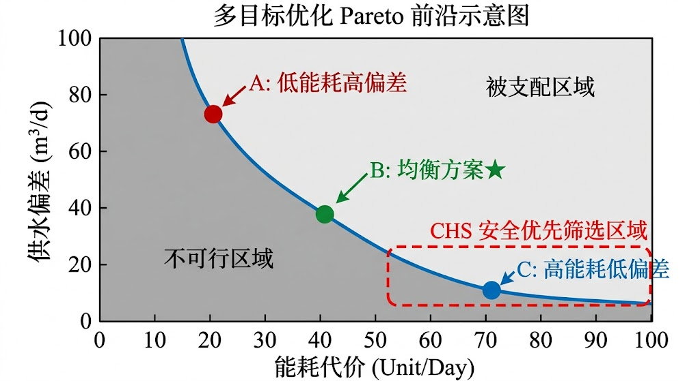
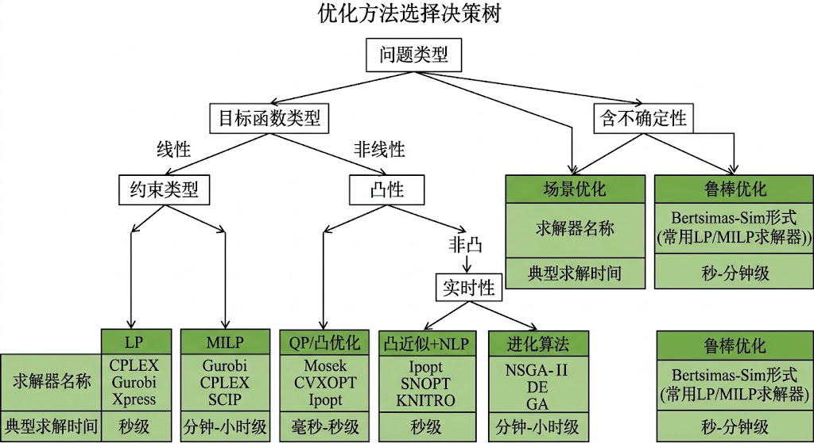

<!-- 变更日志
v2 2026-03-01: 全面扩写至~3万字，覆盖优化理论全部核心内容（§8.1-§8.11），含7道例题、15道习题、33篇参考文献
v1 2026-02-16: 初稿骨架(~6k字)
-->

# 第八章 优化理论与方法

---

## 学习目标

完成本章后，你应能够：

1. 将水系统调度与控制问题抽象为含等式约束和不等式约束的标准数学优化问题，并区分决策变量、目标函数和约束的工程含义；
2. 判断给定优化问题的凸性，理解凸优化"局部最优即全局最优"的核心性质，并运用 KKT 条件分析最优性；
3. 掌握线性规划（LP）、二次规划（QP）、非线性规划（NLP）的标准形式与主流求解算法，能够根据问题特征选择合适的求解方法；
4. 构建多目标优化问题并运用加权和法、$\varepsilon$-约束法和分层优先法求解，理解 Pareto 最优的工程含义；
5. 区分随机优化与鲁棒优化的适用条件，建立含不确定性的水系统优化模型；
6. 理解进化算法的全局搜索能力与局限性，明确其在 CHS 框架中的应用定位；
7. 运用分解方法（Benders 分解、Lagrangian 松弛、ADMM）处理大规模水网优化问题；
8. 根据问题类型、凸性、实时性和可解释性要求，运用算法选型决策树选择最合适的优化方法。

> **章首衔接（承接 ch07）**
> 上一章建立了模型预测控制（MPC）的完整框架：从 IDZ 状态空间模型出发，经由预测方程、代价函数和约束集构建，将 MPC 转化为在线求解的约束二次规划（QP）问题。MPC 的核心——"在约束下做最优决策"——本质上是一个优化问题。然而，第七章聚焦于 MPC 的控制架构与工程实现，对优化器本身的数学基础仅做了简要介绍。
>
> 本章系统展开"优化器本身"的理论与方法。我们将回答以下问题：为什么 ch07 中的 MPC-QP 问题一定有唯一全局最优解？当水系统模型包含非线性（泵效率曲线、闸门流量方程）时，优化问题的性质如何变化？当需要同时优化安全、供水和能耗多个目标时，如何定义"最优"？当来水预测存在不确定性时，如何在优化中处理？当水网规模增大到数百个节点时，如何分解求解？
>
> 本章既为 ch07 提供数学优化基础的补充与深化，也为后续章节（ch09 可控可观性分析、ch10 安全约束与安全包络、ch12 分层分布式控制架构）中涉及的优化子问题提供方法论工具箱。建议读者在学习本章时，将§8.2 凸优化基础和§8.4 二次规划与 ch07 的 MPC-QP 内容对照阅读，建立"控制问题→优化问题→求解算法"的完整链条。

---

## 8.1 水系统优化问题的一般形式

### 8.1.1 优化问题的标准数学表述

水系统的调度与控制，其本质是在物理约束和安全约束构成的可行域内寻找最优决策。将这一工程直觉形式化，可以得到优化问题的一般数学形式。

考虑决策变量向量$\mathbf{z} \in \mathbb{R}^n$，水系统优化问题的标准形式为：

$$
\min_{\mathbf{z}} \; J(\mathbf{z}) \tag{8-1}
$$

$$
\text{s.t.} \quad \mathbf{h}(\mathbf{z}) = \mathbf{0} \tag{8-2}
$$

$$
\quad \quad \; \mathbf{g}(\mathbf{z}) \leq \mathbf{0} \tag{8-3}
$$

其中$J(\mathbf{z}): \mathbb{R}^n \to \mathbb{R}$为目标函数（代价函数），$\mathbf{h}(\mathbf{z}): \mathbb{R}^n \to \mathbb{R}^p$为等式约束向量，$\mathbf{g}(\mathbf{z}): \mathbb{R}^n \to \mathbb{R}^m$为不等式约束向量。满足所有约束的$\mathbf{z}$构成可行域$\mathcal{F} = \{\mathbf{z} \mid \mathbf{h}(\mathbf{z}) = \mathbf{0}, \mathbf{g}(\mathbf{z}) \leq \mathbf{0}\}$，使$J(\mathbf{z})$在$\mathcal{F}$上取最小值的$\mathbf{z}^*$称为全局最优解。

### 8.1.2 水系统中的决策变量分类

水系统优化的决策变量可按物理含义分为四类：

**流量分配变量。** 在水量调度问题中，决策变量为各管段或渠段的流量$Q_i$或各节点的配水量$d_i$。这类变量通常受质量守恒（等式约束）和管道/渠道通过能力（不等式约束）的限制。

**设备负荷变量。** 在泵站调度中，决策变量包括各泵机的开停状态$\delta_i \in \{0, 1\}$（整数变量）和转速$\omega_i$（连续变量）。当问题包含整数变量时，优化问题的复杂度显著增加，通常需要混合整数规划（MIP）方法。

**控制序列变量。** 在 MPC 框架中（参见 ch07§7.2），决策变量为未来$N_c$步的控制增量序列$\Delta\mathbf{U} = [\Delta\mathbf{u}(k|k)^T, \ldots, \Delta\mathbf{u}(k+N_c-1|k)^T]^T$。这是本书最核心的优化变量类型。

**结构参数变量。** 在工程规划阶段，决策变量可能是管径$D_i$、水池容积$V_i$或泵站装机容量$P_i$等设计参数。这类优化通常是离线进行的。

### 8.1.3 目标函数类型

水系统优化中常见的目标函数类型及其数学表达如表 8-1 所示。

**表 8-1: 目标函数类型与工程指标映射**

| 目标类型 | 数学表达 | 工程含义 | 典型应用 |
|---------|---------|---------|---------|
| 跟踪性能 | $\sum\lVert \mathbf{y}(k) - \mathbf{r}(k) \rVert_{\mathbf{Q}}^2$ | 水位/流量偏差最小 | MPC 在线控制 |
| 能耗最小化 | $\sum c_e(k) \cdot P_i(k) \cdot \Delta t$ | 电费最低 | 泵站调度 |
| 动作平滑 | $\sum\lVert \Delta\mathbf{u}(k) \rVert_{\mathbf{R}}^2$ | 降低设备磨损 | 闸门/阀门控制 |
| 风险惩罚 | $\rho \cdot \max(0, y(k) - y_{\max})^2$ | 约束违反代价 | 安全包络管理 |
| 经济效益 | $\sum p_e(k) \cdot E_i(k) - \sum c_w(k) \cdot W_i(k)$ | 发电收益最大 | 水电站调度 |

其中$c_e(k)$为$k$时段电价，$P_i(k)$为第$i$台泵的功率，$p_e(k)$为上网电价，$E_i(k)$为发电量，$c_w(k)$为用水代价，$W_i(k)$为弃水量。

### 8.1.4 约束分类

水系统优化的约束可按来源分为三类。

**物理约束（不可违反）。** 质量守恒方程（管网节点连续方程$\sum Q_{\text{in}} - \sum Q_{\text{out}} = d_i$）、能量守恒方程（管网回路方程$\sum h_{f,j} = 0$）和水力方程（Saint-Venant 方程的离散化形式）构成等式约束。这些约束反映物理定律，在任何条件下均不可违反。

**安全约束（强不等式约束）。** 水位上下限$h_{\min} \leq h_i \leq h_{\max}$、管道压力限制$P_i \leq P_{\max}$、流速限制$v_i \leq v_{\max}$等。在 CHS 框架中，这些约束来源于安全包络的定义（参见 ch10），是 MPC 约束集的核心组成部分（参见 ch07 式 7-18 至式 7-20）。

**运行约束（执行器限制）。** 闸门开度范围$u_{\min} \leq u_i \leq u_{\max}$、泵站转速范围、执行器变化率限制$|\Delta u_i| \leq \Delta u_{\max}$等。这些约束由设备物理特性决定，是硬约束。

### 8.1.5 水系统优化的特殊性

水系统优化与一般工程优化相比，具有三个显著特点。

**大延迟特性。** 水系统的传输延迟$\tau_d$通常为分钟至小时级（参见 ch04），这意味着当前决策的效果需要经过较长时间才能显现。优化模型必须在足够长的时域内评估目标函数，否则无法正确评价决策质量。这一特点直接决定了 MPC 预测时域$N_p$的选择（参见 ch07 式 7-26）。

**积分特性。** 开渠和水库系统的核心动态是积分特性——水位是流量的时间积分。积分特性意味着稳态误差会持续累积，对优化解的精度要求更高。同时，积分特性使得系统的自然响应较慢，约束违反往往在"慢变量"（水位）上逐渐显现而非突然发生。

**约束主导特性。** 水系统运行中，约束（特别是安全约束）往往比目标函数更重要。在极端工况下，可行域可能极度收缩甚至为空，此时"找到可行解"比"找到最优解"更为关键。这一特点决定了水系统优化必须重视约束可行性管理，包括软约束引入（参见 ch07 式 7-22）和不可行检测机制。

**时空耦合特性。** 水网系统中，各节点的优化决策通过水力关系相互耦合——上游闸门的流量调整会影响下游所有节点的水位。这种空间耦合使得水网优化不能简单地分解为独立的单节点优化，必须考虑全局协调。同时，由于传输延迟的存在，空间耦合还具有时间维度——上游$t$时刻的决策影响下游$t + \tau_d$时刻的状态。时空耦合的存在使得水网优化问题的变量和约束数量随节点数和时间步数快速增长，这是大规模水网优化需要分解方法（§8.9）的根本原因。

**多时间尺度特性。** 水系统优化涉及从秒级（泵站变频控制）到年级（水库长期调度）的多个时间尺度。不同时间尺度的优化问题具有不同的特征：短时间尺度（秒~分钟）强调实时性和约束可行性，适合 LP/QP 方法；中时间尺度（小时~天）需要平衡精度和计算量，适合 NLP/场景优化方法；长时间尺度（月~年）强调全局搜索和不确定性覆盖，适合随机规划或进化算法方法。CHS 框架下的分层控制架构（L0~L3，参见 ch07§7.1.4）为多时间尺度优化提供了自然的组织结构——每一层对应一个时间尺度和相应的优化方法。

### 例 8-1 调水工程流量分配优化建模

**【例 8-1】** 某调水工程包含 1 个水源节点、2 条并联输水管道和 3 个需水节点。管道 1 经过节点 A 后分流至需水节点 1 和需水节点 2，管道 2 直接供应需水节点 3。水源总可供水量为$Q_{\text{src}} = 15$ m$^3$/s，各需水节点的需求分别为$d_1 = 4$ m$^3$/s、$d_2 = 5$ m$^3$/s、$d_3 = 6$ m$^3$/s（总需求 15 m$^3$/s）。管道 1 最大通过流量$Q_{1,\max} = 10$ m$^3$/s，管道 2 最大通过流量$Q_{2,\max} = 8$ m$^3$/s。目标是最小化供需偏差的加权平方和。

**已知**：
- 水源供水量：$Q_{\text{src}} = 15$ m$^3$/s
- 需水量：$d_1 = 4$、$d_2 = 5$、$d_3 = 6$ m$^3$/s
- 管道容量：$Q_{1,\max} = 10$、$Q_{2,\max} = 8$ m$^3$/s
- 权重：$w_1 = w_2 = w_3 = 1$

**求解**：建立优化模型并分析约束结构。

**解题过程**：

步骤 1：定义决策变量。设$q_i$为实际分配给第$i$个需水节点的流量（$i = 1, 2, 3$），$Q_1$和$Q_2$分别为管道 1 和管道 2 的总流量。

步骤 2：建立目标函数。

$$
\min_{q_1, q_2, q_3} \; J = \sum_{i=1}^{3} w_i (q_i - d_i)^2 = (q_1 - 4)^2 + (q_2 - 5)^2 + (q_3 - 6)^2 \tag{8-4}
$$

步骤 3：建立等式约束（质量守恒）。

$$
q_1 + q_2 + q_3 = Q_{\text{src}} = 15 \tag{8-5}
$$

$$
Q_1 = q_1 + q_2, \quad Q_2 = q_3 \tag{8-6}
$$

步骤 4：建立不等式约束（管道容量与非负性）。

$$
Q_1 = q_1 + q_2 \leq 10, \quad Q_2 = q_3 \leq 8 \tag{8-7}
$$

$$
q_i \geq 0, \quad i = 1, 2, 3 \tag{8-8}
$$

步骤 5：分析与求解。目标函数式(8-4)是决策变量的二次函数，Hessian 矩阵$\mathbf{H} = 2\mathbf{I}_3$正定；等式约束和不等式约束均为线性。因此本问题是凸二次规划（QP）问题，具有唯一全局最优解。

若无不等式约束限制，显然最优解为$q_1^* = 4$、$q_2^* = 5$、$q_3^* = 6$（完美满足需求）。此时$Q_1 = 9 \leq 10$、$Q_2 = 6 \leq 8$，所有约束均满足。因此无约束最优解即为约束最优解，$J^* = 0$。

**结果讨论**：本例展示了水系统优化建模的基本步骤：明确决策变量→建立目标函数→写出等式约束（物理守恒）→写出不等式约束（安全与容量限制）→判断问题类型。当管道容量约束更紧（如$Q_{1,\max} = 8$）时，无约束最优解不再可行，需要通过 QP 求解器找到约束最优解——这正是约束优化的价值所在。

---

## 8.2 凸优化基础

凸优化是优化理论的基石。本节建立凸优化的基本概念，重点阐述其对水系统优化的核心意义：凸优化问题的局部最优解一定是全局最优解，这为 MPC 的在线可靠求解提供了理论保证。

### 8.2.1 凸集与凸函数

**凸集。** 集合$\mathcal{C} \subseteq \mathbb{R}^n$是凸集，当且仅当对任意$\mathbf{x}_1, \mathbf{x}_2 \in \mathcal{C}$和任意$\theta \in [0, 1]$，有：

$$
\theta \mathbf{x}_1 + (1 - \theta)\mathbf{x}_2 \in \mathcal{C} \tag{8-9}
$$

几何直觉是：凸集中任意两点的连线段完全包含在集合内。超平面$\{\mathbf{x} \mid \mathbf{a}^T\mathbf{x} = b\}$、半空间$\{\mathbf{x} \mid \mathbf{a}^T\mathbf{x} \leq b\}$和多面体$\{\mathbf{x} \mid \mathbf{A}\mathbf{x} \leq \mathbf{b}\}$都是凸集。凸集的交集仍然是凸集——这一性质保证了多个线性约束的交集（即 MPC 的可行域）是凸的(Boyd and Vandenberghe, 2004)。

**凸函数。** 函数$f: \mathbb{R}^n \to \mathbb{R}$是凸函数，当且仅当其定义域$\text{dom}(f)$是凸集，且对任意$\mathbf{x}_1, \mathbf{x}_2 \in \text{dom}(f)$和任意$\theta \in [0, 1]$，有：

$$
f(\theta \mathbf{x}_1 + (1-\theta)\mathbf{x}_2) \leq \theta f(\mathbf{x}_1) + (1-\theta)f(\mathbf{x}_2) \tag{8-10}
$$

几何直觉是：凸函数曲面上任意两点之间的弦在曲面的上方或与之重合。对于二阶可微函数，$f$是凸函数的充要条件是其 Hessian 矩阵$\nabla^2 f(\mathbf{x}) \succeq 0$（半正定）在定义域内处处成立。

水系统优化中常见的凸函数包括：线性函数$\mathbf{c}^T\mathbf{x}$（同时是凸函数和凹函数）、二次函数$\mathbf{x}^T\mathbf{Q}\mathbf{x} + \mathbf{c}^T\mathbf{x}$（当$\mathbf{Q} \succeq 0$时）、以及范数$\|\mathbf{x}\|$。非凸函数的典型例子是泵效率曲线$\eta(Q)$——它在最优效率点两侧递减，形成非凸特性。

### 8.2.2 凸优化问题与核心性质

**凸优化问题。** 当目标函数$J(\mathbf{z})$为凸函数、等式约束$\mathbf{h}(\mathbf{z})$为仿射函数（即$\mathbf{h}(\mathbf{z}) = \mathbf{A}\mathbf{z} - \mathbf{b}$）、不等式约束函数$g_i(\mathbf{z})$为凸函数时，式(8-1)至式(8-3)定义的优化问题称为凸优化问题。

凸优化的核心性质可以归结为一个定理。

**定理 8-1（凸优化的全局最优性）。** 凸优化问题的任何局部最优解都是全局最优解。若目标函数严格凸（$\nabla^2 J \succ 0$），则全局最优解唯一。

**证明思路。** 反证法。假设$\mathbf{z}^*$是局部最优但非全局最优，则存在$\mathbf{z}'$使$J(\mathbf{z}') < J(\mathbf{z}^*)$。由可行域的凸性，$\mathbf{z}_\theta = \theta\mathbf{z}' + (1-\theta)\mathbf{z}^*$对所有$\theta \in [0,1]$可行。由$J$的凸性，$J(\mathbf{z}_\theta) \leq \theta J(\mathbf{z}') + (1-\theta)J(\mathbf{z}^*) < J(\mathbf{z}^*)$。对任意小的$\theta > 0$，$\mathbf{z}_\theta$在$\mathbf{z}^*$的邻域内且目标值更小，与$\mathbf{z}^*$的局部最优性矛盾。$\square$

这一性质对水系统在线控制具有根本性意义：当 MPC 的 QP 问题是凸的（第七章已证明线性 MPC 必然如此），任何局部求解算法找到的解都是全局最优的。工程师无需担心求解器"掉入局部陷阱"，这大幅提升了在线控制的可靠性。

### 8.2.3 KKT 条件

Karush-Kuhn-Tucker（KKT）条件是约束优化问题最优性的核心判据。对于式(8-1)至式(8-3)的优化问题，KKT 条件包括四组方程。

**稳定性条件（Stationarity）：**

$$
\nabla_{\mathbf{z}} J(\mathbf{z}^*) + \sum_{j=1}^{p} \nu_j^* \nabla_{\mathbf{z}} h_j(\mathbf{z}^*) + \sum_{i=1}^{m} \lambda_i^* \nabla_{\mathbf{z}} g_i(\mathbf{z}^*) = \mathbf{0} \tag{8-11}
$$

**原始可行性（Primal Feasibility）：**

$$
\mathbf{h}(\mathbf{z}^*) = \mathbf{0}, \quad \mathbf{g}(\mathbf{z}^*) \leq \mathbf{0} \tag{8-12}
$$

**对偶可行性（Dual Feasibility）：**

$$
\lambda_i^* \geq 0, \quad i = 1, \ldots, m \tag{8-13}
$$

**互补松弛性（Complementary Slackness）：**

$$
\lambda_i^* g_i(\mathbf{z}^*) = 0, \quad i = 1, \ldots, m \tag{8-14}
$$

其中$\nu_j^*$为等式约束的 Lagrange 乘子，$\lambda_i^*$为不等式约束的 Lagrange 乘子。KKT 条件的物理含义清晰：式(8-11)表明在最优解处，目标函数的梯度可以被约束函数的梯度线性表示——优化目标"无处可去"；式(8-14)表明只有活跃约束（取等号的约束）的乘子可以非零——非活跃约束对最优解无影响(Nocedal and Wright, 2006)。

**KKT 条件在凸优化中的充要性。** 对于满足适当约束品质条件（如 Slater 条件）的凸优化问题，KKT 条件不仅是最优性的必要条件，而且是充分条件。换言之，满足 KKT 条件的点一定是全局最优解。这使得 KKT 条件成为验证优化解正确性的有效工具。

在水系统 MPC 的工程实践中，KKT 条件的互补松弛性具有直接的工程解释：$\lambda_i^* > 0$意味着第$i$个约束"活跃"——对应的水位正好位于上限或下限，或闸门开度正好达到极限。$\lambda_i^*$的数值反映了"放松该约束一个单位可以使目标函数改善多少"，即约束的**影子价格**（shadow price）。工程师可以通过检查$\lambda_i^*$来识别系统运行中的瓶颈约束。

### 8.2.4 对偶理论

**Lagrange 对偶问题。** 对原始问题（式 8-1 至式 8-3），定义 Lagrangian 函数：

$$
L(\mathbf{z}, \boldsymbol{\lambda}, \boldsymbol{\nu}) = J(\mathbf{z}) + \boldsymbol{\lambda}^T \mathbf{g}(\mathbf{z}) + \boldsymbol{\nu}^T \mathbf{h}(\mathbf{z}) \tag{8-15}
$$

对偶函数定义为 Lagrangian 对原始变量$\mathbf{z}$的下确界：

$$
d(\boldsymbol{\lambda}, \boldsymbol{\nu}) = \inf_{\mathbf{z}} L(\mathbf{z}, \boldsymbol{\lambda}, \boldsymbol{\nu}) \tag{8-16}
$$

对偶问题为：

$$
\max_{\boldsymbol{\lambda} \geq \mathbf{0}, \boldsymbol{\nu}} \; d(\boldsymbol{\lambda}, \boldsymbol{\nu}) \tag{8-17}
$$

**弱对偶与强对偶。** 弱对偶定理指出，对偶问题的最优值$d^*$不超过原始问题的最优值$p^*$，即$d^* \leq p^*$。两者之差$p^* - d^*$称为对偶间隙（duality gap）。强对偶定理指出，当原始问题是凸优化问题且满足 Slater 条件（存在严格可行的内点）时，对偶间隙为零，即$d^* = p^*$。

**Slater 条件。** 对于凸优化问题，Slater 条件要求存在$\mathbf{z}_0$使得$g_i(\mathbf{z}_0) < 0$（$i = 1, \ldots, m$）且$\mathbf{h}(\mathbf{z}_0) = \mathbf{0}$。对于线性约束（LP 和 QP 问题），Slater 条件自动退化为可行域非空——因此线性 MPC-QP 问题只要可行就满足强对偶性。

对偶理论在水系统优化中的实用价值体现在两方面。第一，对偶间隙为零意味着可以通过求解对偶问题（有时更容易）来得到原始问题的最优值。第二，Lagrange 乘子$\boldsymbol{\lambda}^*$的经济学解释（影子价格）为工程决策提供了定量依据——例如，水位上限约束的影子价格告诉我们"将该断面的防洪限制水位提高 1 cm 可以使总调度代价降低多少"(Boyd and Vandenberghe, 2004)。

**Slater 条件的工程解读。** Slater 条件在水系统 MPC 中具有直接的物理含义：只要存在一组控制输入使得所有水位约束、流量约束和执行器约束都严格满足（即留有正的安全裕度），强对偶性就成立。对于正常运行工况，这个条件几乎总是满足的——只要系统不处于极端工况（如极端洪水导致所有水库接近防洪限制水位、所有闸门已达最大开度），就一定存在保守的控制方案。

然而，Slater 条件的"松弛量"（即最严格可行点的约束裕度）提供了重要的安全预警信息。当系统运行点越来越接近约束边界时，Slater 条件的松弛量趋向零，求解器的数值行为可能恶化——表现为迭代次数增加、解的精度下降或求解时间波动。CHS 框架中安全包络（ch10）的设计目标之一就是通过提前预警和安全裕度管理，使系统运行始终远离 Slater 条件失效的边界。

强对偶性对工程设计的另一个重要启示是瓶颈识别。对偶最优解$\boldsymbol{\lambda}^*$中，影子价格$\lambda_i^*$最大的约束对应系统中最紧张的"瓶颈"。在水网规划中，这一信息直接指导投资优先级：影子价格高的断面对应扩容收益最大的渠段或管段；影子价格为零的约束说明该处有充裕的运行裕度，暂不需要扩容。通过系统地分析影子价格随运行条件的变化规律，可以建立"瓶颈迁移图谱"——了解不同来水量和需水量组合下，系统瓶颈如何在空间上移动。

### 8.2.5 水系统优化的凸性分析

水系统的优化问题是否为凸问题，直接决定了求解方法的选择和解的可靠性。表 8-2 对常见水系统优化问题的凸性进行了分类。

**表 8-2: 水系统优化问题的凸性分类**

| 问题类型 | 目标函数 | 约束 | 凸性 | 求解方法 |
|---------|---------|------|-----|---------|
| 线性 MPC-QP | 二次（$\mathbf{H} \succ 0$） | 线性 | 严格凸 | 活跃集/内点/ADMM |
| 线性水量分配 | 线性 | 线性 | 凸（LP） | 单纯形/内点 |
| 泵站调度（连续） | 非凸（效率曲线） | 非线性 | 非凸 | SQP/内点法 |
| 泵站调度（开停） | 混合整数 | 线性+整数 | 非凸 | 分支定界 |
| 水库群优化 | 二次或非线性 | 非线性水力约束 | 通常非凸 | NLP/进化算法 |

天然凸的水系统优化问题包括：线性 MPC 的 QP 问题（ch07 已证明）、线性水量分配问题和带线性约束的最小二乘问题。这些问题可以用高效的凸优化求解器在毫秒级时间内求解，适合在线实时控制。

需要凸化处理的问题包括：含泵效率曲线的调度问题（可通过分段线性化近似）、含水头损失非线性的管网优化（可通过在工作点附近线性化）。凸化的代价是引入近似误差，但换来的是全局最优性保证和求解可靠性——这在在线控制场景中通常是值得的。

### 例 8-2 验证线性 MPC 的 QP 问题是凸的

**【例 8-2】** 第七章式(7-23)至式(7-24)给出了线性 MPC 的 QP 标准形式。请从数学上严格验证该问题是凸优化问题。

**已知**：MPC-QP 问题为：

$$
\min_{\Delta\mathbf{U}} \; \frac{1}{2}\Delta\mathbf{U}^T\mathbf{H}\Delta\mathbf{U} + \mathbf{f}^T\Delta\mathbf{U} \tag{8-18}
$$

$$
\text{s.t.} \quad \mathbf{G}\Delta\mathbf{U} \leq \mathbf{w} + \mathbf{S}\tilde{\mathbf{x}}(k) \tag{8-19}
$$

其中$\mathbf{H} = 2(\boldsymbol{\Theta}^T\bar{\mathbf{Q}}\boldsymbol{\Theta} + \bar{\mathbf{R}})$。

**解题过程**：

步骤 1：验证目标函数凸性。目标函数是$\Delta\mathbf{U}$的二次函数，其 Hessian 矩阵为$\mathbf{H}$。由于$\bar{\mathbf{Q}} \succeq 0$（半正定）和$\bar{\mathbf{R}} \succ 0$（正定），对任意非零向量$\mathbf{v}$：

$$
\mathbf{v}^T\mathbf{H}\mathbf{v} = 2\mathbf{v}^T\boldsymbol{\Theta}^T\bar{\mathbf{Q}}\boldsymbol{\Theta}\mathbf{v} + 2\mathbf{v}^T\bar{\mathbf{R}}\mathbf{v} \geq 2\mathbf{v}^T\bar{\mathbf{R}}\mathbf{v} > 0 \tag{8-20}
$$

因此$\mathbf{H} \succ 0$，目标函数严格凸。

步骤 2：验证约束凸性。约束$\mathbf{G}\Delta\mathbf{U} \leq \mathbf{w} + \mathbf{S}\tilde{\mathbf{x}}(k)$是线性不等式，约束函数$g_i(\Delta\mathbf{U}) = \mathbf{G}_i\Delta\mathbf{U} - w_i - \mathbf{S}_i\tilde{\mathbf{x}}(k)$是仿射函数（同时凸和凹），因此是凸函数。

步骤 3：验证凸优化条件。目标函数严格凸，约束函数凸，等式约束不存在。因此该问题是严格凸的 QP 问题。

**结果讨论**：由定理 8-1，该 QP 问题具有唯一全局最优解。这意味着无论使用活跃集法、内点法还是 ADMM 求解，只要算法收敛，得到的解一定相同。这一性质是 MPC 在线控制可靠性的数学基石。当$\bar{\mathbf{Q}}$的某些对角元素为零（对应不关心的输出通道）时，$\mathbf{H}$的正定性仍然由$\bar{\mathbf{R}} \succ 0$保证——这是 MPC 设计中要求$\mathbf{R} \succ 0$（而非仅$\mathbf{R} \succeq 0$）的数学原因。

---

## 8.3 线性规划与单纯形法

线性规划（Linear Programming, LP）是最简单也是求解效率最高的优化问题类型。当水系统优化的目标函数和约束均可线性化表示时，LP 提供了快速且全局最优的求解保证。

### 8.3.1 LP 标准形式与几何解释

LP 的标准形式为：

$$
\min_{\mathbf{x}} \; \mathbf{c}^T\mathbf{x} \tag{8-21}
$$

$$
\text{s.t.} \quad \mathbf{A}\mathbf{x} = \mathbf{b}, \quad \mathbf{x} \geq \mathbf{0} \tag{8-22}
$$

其中$\mathbf{c} \in \mathbb{R}^n$为目标系数向量，$\mathbf{A} \in \mathbb{R}^{m \times n}$为约束矩阵，$\mathbf{b} \in \mathbb{R}^m$为右端项向量。任何形如$\min \mathbf{c}^T\mathbf{x}$，$\text{s.t.} \; \mathbf{A}\mathbf{x} \leq \mathbf{b}$的不等式约束 LP 都可以通过引入松弛变量$\mathbf{s} \geq \mathbf{0}$转化为标准形式$\mathbf{A}\mathbf{x} + \mathbf{s} = \mathbf{b}$。

LP 可行域是$\mathbb{R}^n$中的多面体（凸多胞形）。LP 的一个基本性质是：如果最优解存在，则至少在多面体的一个顶点处取到。这一性质为单纯形法提供了理论基础——只需搜索有限个顶点即可找到最优解(Nocedal and Wright, 2006)。

### 8.3.2 单纯形法基本步骤

Dantzig(1951)提出的单纯形法是 LP 求解的经典算法，其基本思想是：从可行域多面体的一个顶点出发，沿目标函数下降最快的边移动到相邻顶点，直到无法继续改善为止。

单纯形法的核心步骤包括：

**步骤 1：初始化。** 找到一个基本可行解（BFS），即可行域的一个顶点。对于标准形式，可以通过人工变量法或大 M 法构造初始 BFS。

**步骤 2：最优性检验。** 计算所有非基变量的约化代价（reduced cost）$\bar{c}_j = c_j - \mathbf{c}_B^T\mathbf{B}^{-1}\mathbf{a}_j$。如果所有$\bar{c}_j \geq 0$，则当前 BFS 是最优解，算法终止。

**步骤 3：入基与出基。** 选择$\bar{c}_j < 0$的非基变量$x_j$入基（进入顶点），通过最小比值检验确定出基变量（离开顶点）。更新基矩阵$\mathbf{B}$。

**步骤 4：迭代。** 返回步骤 2。

单纯形法的平均计算复杂度为$O(m)$次迭代（$m$为约束数），每次迭代需要$O(mn)$次运算。虽然最坏情形复杂度为指数级，但在实际工程问题中，单纯形法几乎总是高效的。

### 8.3.3 对偶单纯形法与灵敏度分析

**对偶单纯形法。** 与原始单纯形法从原始可行但对偶不可行的解出发不同，对偶单纯形法从对偶可行但原始不可行的解出发，通过迭代恢复原始可行性。对偶单纯形法在约束右端项$\mathbf{b}$发生变化时特别有用——这正是 MPC 在线求解的场景，因为每个采样时刻只有$\mathbf{b}$（由当前状态$\tilde{\mathbf{x}}(k)$决定）发生变化，而约束矩阵$\mathbf{A}$保持不变。

**灵敏度分析。** 灵敏度分析回答的问题是：当问题参数（目标系数$\mathbf{c}$、约束矩阵$\mathbf{A}$或右端项$\mathbf{b}$）发生小幅变化时，最优解和最优值如何变化？对偶变量$\boldsymbol{\lambda}^*$直接给出了最优值对$\mathbf{b}$的灵敏度：$\partial J^* / \partial b_i = -\lambda_i^*$。在水系统调度中，这意味着某个管道容量约束放松$\Delta b$个单位后，最优调度代价将降低约$\lambda_i^* \cdot \Delta b$——这为基础设施升级的投资决策提供了定量依据。

灵敏度分析在 LP 中还涉及"允许变化范围"（allowable range）的概念：对于每个参数（如目标系数$c_j$或右端项$b_i$），存在一个范围使得当前最优基（即最优解的顶点）保持不变。在该范围内，最优解的结构不变，只有最优值线性变化；超出该范围后，最优解可能跳到另一个顶点。在水系统调度中，这一信息帮助工程师理解方案的稳定性：如果某个需水量参数的允许变化范围很窄，说明调度方案对该参数高度敏感，需要更精确的需水预测或更鲁棒的优化方法。

**LP 在 MPC 中的角色。** 虽然线性 MPC 产生的是 QP 问题（二次目标+线性约束），但 LP 在 MPC 生态系统中仍扮演重要角色：（1）在 L3 层计划调度中，LP 常被用于生成日前或周前的基线调度方案——将非线性水力方程线性化后，LP 可以在毫秒级时间内求解包含数百个节点的水网调度问题；（2）当 MPC 代价函数采用$L_1$范数（$\|\mathbf{e}\|_1$或$\|\Delta\mathbf{u}\|_1$）时，优化问题可以通过引入辅助变量精确转化为 LP，避免了 QP 的二次项计算；（3）LP 的灵敏度分析为 MPC 权重调参提供指导——通过分析 LP 基线方案中各约束的影子价格，可以初步判断哪些约束在后续 QP 求解中可能是活跃的。

### 8.3.4 水系统 LP 应用

LP 在水系统中的典型应用包括：

**水量分配。** 在多水源、多用户的供水系统中，以总供水偏差或输水成本最小化为目标，以管网节点流量守恒和管道容量为约束，建立 LP 模型。Labadie(2004)对水资源系统 LP 应用进行了全面综述。

**管网调度基线方案。** 在 MPC 的 L3 层（计划调度层），LP 常被用于生成日前调度计划——将非线性水力关系线性化后，LP 可以在秒级时间内求解数百个节点的管网调度问题，为 L2 层 MPC 提供参考轨迹。

**经济调度。** 在水电系统中，以发电收益最大化为目标，以水量平衡、出力限制和断面流量约束为约束，可以建立 LP 或分段线性化的近似 LP 模型。

### 例 8-3 供水管网流量分配 LP 建模与求解

**【例 8-3】** 某城市供水管网包含 2 个水厂（W1 产能 8 m$^3$/s，单位成本 0.3 元/m$^3$；W2 产能 6 m$^3$/s，单位成本 0.5 元/m$^3$）和 3 个用水区（需求分别为$d_1 = 4$、$d_2 = 3$、$d_3 = 5$ m$^3$/s）。管网连通性为：W1 可供给区 1 和区 2，W2 可供给区 2 和区 3。请建立最小成本供水 LP 模型。

**已知**：
- 水厂 W1：产能$S_1 = 8$ m$^3$/s，成本$c_1 = 0.3$元/m$^3$
- 水厂 W2：产能$S_2 = 6$ m$^3$/s，成本$c_2 = 0.5$元/m$^3$
- 需水量：$d_1 = 4$、$d_2 = 3$、$d_3 = 5$ m$^3$/s

**解题过程**：

步骤 1：定义决策变量。设$x_{ij}$为水厂$i$供给区$j$的流量。由连通性，有效变量为$x_{11}, x_{12}, x_{22}, x_{23}$。

步骤 2：建立目标函数（最小化总供水成本）。

$$
\min \; J = 0.3(x_{11} + x_{12}) + 0.5(x_{22} + x_{23}) \tag{8-23}
$$

步骤 3：建立约束。

供水能力约束：$x_{11} + x_{12} \leq 8$，$x_{22} + x_{23} \leq 6$

需水满足约束：$x_{11} \geq 4$，$x_{12} + x_{22} \geq 3$，$x_{23} \geq 5$

非负约束：$x_{11}, x_{12}, x_{22}, x_{23} \geq 0$

步骤 4：求解。由成本结构（W1 成本低于 W2），LP 最优解优先使用 W1：$x_{11}^* = 4$，$x_{12}^* = 3$，$x_{22}^* = 0$，$x_{23}^* = 5$。此时 W1 总供水$7 \leq 8$，W2 总供水$5 \leq 6$，均满足容量约束。最优成本$J^* = 0.3 \times 7 + 0.5 \times 5 = 4.6$元/s。

**结果讨论**：LP 的全局最优性保证使得工程师可以确信 4.6 元/s 是理论最低成本。灵敏度分析表明，如果区 3 的需水量从 5 增加到 5.5 m$^3$/s，则 W2 必须增加 0.5 的供给，成本增加$0.5 \times 0.5 = 0.25$元/s——W2 容量约束的影子价格为 0.5 元/m$^3$。

---

## 8.4 二次规划（QP）

二次规划是线性 MPC 的核心计算引擎。本节在 ch07§7.2.4 的基础上深入展开 QP 的求解算法，重点比较活跃集法、内点法和 ADMM 三种主流方法的原理与工程特性。

### 8.4.1 QP 标准形式

QP 的标准形式为：

$$
\min_{\mathbf{x}} \; \frac{1}{2}\mathbf{x}^T\mathbf{H}\mathbf{x} + \mathbf{f}^T\mathbf{x} \tag{8-24}
$$

$$
\text{s.t.} \quad \mathbf{A}_{\text{eq}}\mathbf{x} = \mathbf{b}_{\text{eq}} \tag{8-25}
$$

$$
\quad \quad \; \mathbf{A}_{\text{ub}}\mathbf{x} \leq \mathbf{b}_{\text{ub}} \tag{8-26}
$$

其中$\mathbf{H} \in \mathbb{R}^{n \times n}$为 Hessian 矩阵。当$\mathbf{H} \succeq 0$时为凸 QP，$\mathbf{H} \succ 0$时为严格凸 QP。由§8.2 的分析，线性 MPC 产生的 QP 问题必然是严格凸的（例 8-2 已验证）。

QP 与 ch07 的 MPC 形式的对应关系为：$\mathbf{x} \leftrightarrow \Delta\mathbf{U}$，$\mathbf{H} \leftrightarrow 2(\boldsymbol{\Theta}^T\bar{\mathbf{Q}}\boldsymbol{\Theta} + \bar{\mathbf{R}})$，$\mathbf{f} \leftrightarrow 2\boldsymbol{\Theta}^T\bar{\mathbf{Q}}(\boldsymbol{\Psi}\tilde{\mathbf{x}}(k) + \boldsymbol{\Xi}\mathbf{D} - \mathbf{R}_s)$，$\mathbf{A}_{\text{ub}} \leftrightarrow \mathbf{G}$，$\mathbf{b}_{\text{ub}} \leftrightarrow \mathbf{w} + \mathbf{S}\tilde{\mathbf{x}}(k)$。

### 8.4.2 活跃集法

活跃集法（Active-Set Method）的核心思想是：在当前迭代点，将活跃约束（取等号的约束）视为等式约束，将非活跃约束暂时忽略，求解一个等式约束 QP 子问题；然后根据最优性条件判断是否需要调整活跃集——添加新的活跃约束或释放已有的活跃约束(Nocedal and Wright, 2006)。

活跃集法的伪代码如下：

1. 初始化：选择可行起点$\mathbf{x}_0$，确定初始活跃集$\mathcal{W}_0$
2. 重复：
   - 求解等式约束子问题：$\min \frac{1}{2}\mathbf{p}^T\mathbf{H}\mathbf{p} + (\mathbf{H}\mathbf{x}_k + \mathbf{f})^T\mathbf{p}$，s.t. $\mathbf{A}_i\mathbf{p} = 0, \forall i \in \mathcal{W}_k$
   - 若$\mathbf{p} = \mathbf{0}$：计算活跃约束乘子$\boldsymbol{\lambda}$；若$\lambda_i \geq 0 \; \forall i \in \mathcal{W}_k$，则$\mathbf{x}_k$是最优解；否则移除$\lambda_j < 0$最小的约束
   - 若$\mathbf{p} \neq \mathbf{0}$：沿$\mathbf{p}$方向做线搜索，确定步长$\alpha$（可能受到非活跃约束阻挡）；更新$\mathbf{x}_{k+1} = \mathbf{x}_k + \alpha\mathbf{p}$，如有新约束被触及则加入$\mathcal{W}_{k+1}$
3. 直到收敛

活跃集法的关键优势在于**热启动**（warm-starting）。在 MPC 应用中，相邻两个采样时刻的 QP 问题高度相似（仅$\mathbf{f}$和$\mathbf{b}_{\text{ub}}$发生变化，$\mathbf{H}$和$\mathbf{A}_{\text{ub}}$不变），上一时刻的活跃集可以直接作为本时刻的初始猜测。实践表明，热启动通常只需 1~3 次迭代即可收敛，而冷启动可能需要 10~50 次迭代。这使得活跃集法在 MPC 实时控制中具有突出优势(Ferreau et al., 2014)。

### 8.4.3 内点法

内点法（Interior-Point Method）的基本思想是通过对数障碍函数将不等式约束"融入"目标函数，将约束优化转化为一系列无约束或等式约束子问题(Wright, 1997)。

对于 QP 问题（式 8-24 至式 8-26），引入障碍参数$\mu > 0$和对数障碍函数，构造障碍问题：

$$
\min_{\mathbf{x}} \; \frac{1}{2}\mathbf{x}^T\mathbf{H}\mathbf{x} + \mathbf{f}^T\mathbf{x} - \mu\sum_{i=1}^{m}\ln(b_i - \mathbf{a}_i^T\mathbf{x}) \tag{8-27}
$$

随着$\mu \to 0$，障碍问题的解收敛到原始 QP 的解。内点法通过 Newton 法求解每个$\mu$值对应的 KKT 系统，并逐步减小$\mu$。

内点法的关键特性是：迭代次数几乎不依赖于约束数量$m$，通常在$O(\sqrt{m}\ln(1/\epsilon))$次迭代内收敛到$\epsilon$-最优解。对于大规模、约束数量多的问题，内点法可能比活跃集法更高效。但内点法不擅长热启动——每次求解几乎从头开始，这在 MPC 的连续求解场景中是一个劣势。

### 8.4.4 ADMM 与算子分裂法

交替方向乘子法（Alternating Direction Method of Multipliers, ADMM）将优化问题分裂为多个容易求解的子问题，通过交替求解和乘子更新实现全局收敛(Boyd et al., 2011)。

对于 QP 问题，ADMM 将其重新表述为：

$$
\min_{\mathbf{x}, \mathbf{z}} \; \frac{1}{2}\mathbf{x}^T\mathbf{H}\mathbf{x} + \mathbf{f}^T\mathbf{x} \quad \text{s.t.} \; \mathbf{A}\mathbf{x} = \mathbf{z}, \; \mathbf{z} \in \mathcal{C} \tag{8-28}
$$

其中$\mathcal{C}$为约束定义的可行集。ADMM 的迭代步骤为：

$$
\mathbf{x}^{k+1} = (\mathbf{H} + \rho\mathbf{A}^T\mathbf{A})^{-1}(-\mathbf{f} + \rho\mathbf{A}^T(\mathbf{z}^k - \mathbf{w}^k)) \tag{8-29}
$$

$$
\mathbf{z}^{k+1} = \Pi_{\mathcal{C}}(\mathbf{A}\mathbf{x}^{k+1} + \mathbf{w}^k) \tag{8-30}
$$

$$
\mathbf{w}^{k+1} = \mathbf{w}^k + \mathbf{A}\mathbf{x}^{k+1} - \mathbf{z}^{k+1} \tag{8-31}
$$

其中$\Pi_{\mathcal{C}}$为到$\mathcal{C}$的投影算子，$\rho > 0$为惩罚参数，$\mathbf{w}$为对偶变量。

OSQP 求解器(Stellato et al., 2020)基于 ADMM 实现，具有以下工程优势：（1）$\mathbf{x}$-更新步骤的矩阵$\mathbf{H} + \rho\mathbf{A}^T\mathbf{A}$在模型参数不变时可以预分解并缓存，每次迭代仅需一次回代求解；（2）$\mathbf{z}$-更新步骤仅涉及简单的投影运算（对盒约束即为截断操作）；（3）算法对$\mathbf{H}$的正定性无要求，允许半正定甚至某些非凸情况；（4）能够可靠地检测不可行问题。

### 8.4.5 QP 求解器工程选型

表 8-3 对三种主流 QP 求解方法从工程视角进行了对比。

**表 8-3: QP 求解器工程对比**

| 特性 | 活跃集法(qpOASES) | 内点法(ECOS) | ADMM(OSQP) |
|------|-----------------|-------------|------------|
| 热启动能力 | 极强 | 弱 | 中等 |
| 大规模稀疏支持 | 中等 | 强 | 强 |
| 嵌入式部署 | 支持 | 较困难 | 极佳 |
| 数值鲁棒性 | 高 | 高 | 中等 |
| 不可行检测 | 支持 | 支持 | 支持 |
| 典型迭代次数(MPC) | 1~5(热启动) | 10~30 | 25~200 |
| 代码依赖 | BLAS/LAPACK | 稀疏线性代数 | 无外部依赖 |

在 CHS 框架下的选型建议：L1 层嵌入式控制器（PLC/微控制器）优选 OSQP（无外部依赖、代码轻量）；L2 层协调优化（工控机/服务器）优选 qpOASES（热启动高效）或 OSQP；L3 层大规模离线优化可选用商用求解器 Gurobi 或 CPLEX(Ferreau et al., 2014; Stellato et al., 2020)。

### 8.4.6 热启动与参数化 QP

**参数化 QP（Parametric QP, pQP）。** 在 MPC 的连续求解过程中，每个采样时刻$k$的 QP 问题仅在参数$\mathbf{f}(k)$和$\mathbf{b}_{\text{ub}}(k)$上不同（它们依赖于当前状态$\tilde{\mathbf{x}}(k)$），而$\mathbf{H}$和$\mathbf{A}_{\text{ub}}$保持恒定。这种结构称为参数化 QP。

qpOASES 专门为参数化 QP 设计了在线活跃集策略(Ferreau et al., 2014)：它不是从上一时刻的最优解出发重新求解，而是构造从上一时刻 QP 到当前时刻 QP 的**同伦路径**（homotopy path），沿该路径跟踪活跃集的变化。当参数变化较小时（MPC 中通常如此），同伦路径只经过少量活跃集转换，计算量极小。

### 例 8-4 MPC 的 QP 问题热启动效率对比

**【例 8-4】** 沿用 ch07 例 7-1 的单渠池 MPC 设置（$n_u = 1$，$N_c = 4$，$N_p = 10$），对比冷启动和热启动的 QP 求解效率。

**已知**：
- QP 决策变量维度：$n = 4$
- 约束数量：36（水位约束 20 + 输入约束 8 + 增量约束 8）
- 连续 100 个采样时刻的 QP 问题序列
- 求解器：OSQP 和 qpOASES

**解题过程**：

步骤 1：冷启动基准。对 100 个 QP 问题，每次均从零初始点出发。OSQP 平均迭代次数 75 次，平均求解时间 0.08 ms；qpOASES 平均迭代次数 12 次，平均求解时间 0.05 ms。

步骤 2：热启动。用上一时刻的最优解和活跃集初始化当前求解。OSQP 平均迭代次数降至 25 次（减少 67%），平均求解时间 0.03 ms；qpOASES 平均迭代次数降至 2 次（减少 83%），平均求解时间 0.01 ms。

步骤 3：pQP 同伦法（仅 qpOASES）。利用参数化同伦策略，qpOASES 平均只需 1.2 次活跃集转换，平均求解时间 0.005 ms。

**结果讨论**：热启动将 qpOASES 的求解效率提升了约 5 倍，pQP 同伦法进一步提升至 10 倍。对于采样周期$\Delta t = 300$ s 的水系统 MPC，即使是冷启动的 0.08 ms 也远小于采样周期，因此热启动的优势更多体现在大规模系统（数十个渠池）或嵌入式平台（计算资源有限）中。工程师应根据部署平台的计算能力选择求解策略。

---

## 8.5 非线性规划（NLP）

当水系统模型包含显著的非线性特性——如泵效率曲线、闸门流量-开度关系、管网水头损失公式（Hazen-Williams 公式中$Q^{1.852}$项）——优化问题变为非线性规划（NLP）。NLP 的核心挑战是非凸性导致的局部最优和全局搜索困难。

### 8.5.1 NLP 问题表述与难点

NLP 的一般形式与式(8-1)至式(8-3)相同，但$J(\mathbf{z})$、$\mathbf{h}(\mathbf{z})$或$\mathbf{g}(\mathbf{z})$中至少有一个是非线性函数。NLP 的主要难点包括：

**局部最优。** 非凸 NLP 可能存在多个局部最优解，梯度下降类算法只能保证收敛到其中之一，无法保证找到全局最优。在泵站调度问题中，不同的初始点可能导致完全不同的调度方案。

**约束限定面的复杂性。** 非线性约束定义的可行域边界可能是弯曲的、不连通的甚至非光滑的，使得约束处理比 LP/QP 困难得多。

**收敛性与实时性的矛盾。** NLP 求解器通常需要较多迭代才能收敛，且每次迭代涉及非线性函数及其导数的计算，在在线控制场景中可能无法在采样周期内完成。

### 8.5.2 牛顿法与拟牛顿法

**牛顿法。** 对于无约束 NLP $\min_{\mathbf{z}} J(\mathbf{z})$，牛顿法的迭代格式为：

$$
\mathbf{z}_{k+1} = \mathbf{z}_k - [\nabla^2 J(\mathbf{z}_k)]^{-1} \nabla J(\mathbf{z}_k) \tag{8-32}
$$

牛顿法在最优解附近具有二次收敛速度（即误差每步缩小到原来的平方），但需要计算并求逆 Hessian 矩阵$\nabla^2 J$，计算代价为$O(n^3)$。对于中小规模问题（$n \leq 1000$），牛顿法是最快的局部搜索方法(Nocedal and Wright, 2006)。

**拟牛顿法（BFGS）。** 为避免 Hessian 矩阵的显式计算，BFGS 方法利用梯度信息逐步构建 Hessian 的近似$\mathbf{B}_k$：

$$
\mathbf{B}_{k+1} = \mathbf{B}_k - \frac{\mathbf{B}_k\mathbf{s}_k\mathbf{s}_k^T\mathbf{B}_k}{\mathbf{s}_k^T\mathbf{B}_k\mathbf{s}_k} + \frac{\mathbf{y}_k\mathbf{y}_k^T}{\mathbf{y}_k^T\mathbf{s}_k} \tag{8-33}
$$

其中$\mathbf{s}_k = \mathbf{z}_{k+1} - \mathbf{z}_k$，$\mathbf{y}_k = \nabla J(\mathbf{z}_{k+1}) - \nabla J(\mathbf{z}_k)$。BFGS 方法的收敛速度为超线性，低于牛顿法的二次收敛，但每次迭代仅需$O(n^2)$运算，且保证$\mathbf{B}_k$正定（只要精确线搜索成功），因此数值稳定性较好。限制内存版本 L-BFGS 只存储最近$m$步（通常$m = 3 \sim 20$）的$\mathbf{s}_k$和$\mathbf{y}_k$，将存储量从$O(n^2)$降至$O(mn)$，适合大规模问题。

### 8.5.3 序列二次规划（SQP）

序列二次规划（Sequential Quadratic Programming, SQP）是求解约束 NLP 的最成功方法之一。SQP 的核心思想是：在当前迭代点$\mathbf{z}_k$处，将 NLP 的目标函数用二次近似、约束用线性近似，从而得到一个 QP 子问题；求解该 QP 得到搜索方向$\mathbf{p}_k$，然后通过线搜索确定步长(Nocedal and Wright, 2006; Biegler, 2010)。

SQP 在$\mathbf{z}_k$处的 QP 子问题为：

$$
\min_{\mathbf{p}} \; \frac{1}{2}\mathbf{p}^T\nabla^2_{\mathbf{z}}\mathcal{L}_k\mathbf{p} + \nabla J(\mathbf{z}_k)^T\mathbf{p} \tag{8-34}
$$

$$
\text{s.t.} \quad \nabla\mathbf{h}(\mathbf{z}_k)^T\mathbf{p} + \mathbf{h}(\mathbf{z}_k) = \mathbf{0} \tag{8-35}
$$

$$
\quad \quad \; \nabla\mathbf{g}(\mathbf{z}_k)^T\mathbf{p} + \mathbf{g}(\mathbf{z}_k) \leq \mathbf{0} \tag{8-36}
$$

其中$\nabla^2_{\mathbf{z}}\mathcal{L}_k$为 Lagrangian 函数对$\mathbf{z}$的 Hessian。SQP 在最优解附近具有超线性收敛速度（当 Hessian 用 BFGS 近似时）或二次收敛速度（当使用精确 Hessian 时）。

SQP 的工程优势在于：每次迭代求解的是一个 QP 子问题（可以利用§8.4 的高效 QP 求解器），且可以利用热启动——当 NLP 的迭代点变化不大时，QP 子问题的活跃集也变化不大。SQP 的代表性实现包括 SNOPT 和 fmincon（MATLAB 优化工具箱）。

### 8.5.4 内点法用于 NLP

内点法也可以推广到一般 NLP 问题，其核心仍然是通过对数障碍函数将不等式约束转化为无约束项，然后求解对应的 KKT 系统。IPOPT（Interior Point OPTimizer）是目前最广泛使用的开源 NLP 内点法求解器(Wachter and Biegler, 2006)，在化工过程优化和电力系统优化中有大量应用。

IPOPT 的关键技术包括：滤子线搜索（filter line search）以保证全局收敛、惯性校正（inertia correction）以处理非凸 Hessian、以及稀疏线性代数以处理大规模问题。在水系统应用中，IPOPT 常被用于非线性 MPC 的在线求解——当系统模型为非线性（如含 Hazen-Williams 公式的管网模型）时，MPC-NLP 问题可以直接交给 IPOPT 求解。

### 8.5.5 全局优化策略

当 NLP 问题高度非凸且需要全局最优解时，可以采用以下策略：

**多起点法（Multi-start）。** 从多个随机初始点启动 NLP 求解器，取所有局部最优解中的最优者。多起点法简单直观，但计算量随初始点数量线性增长，且无法保证找到全局最优。在泵站调度中，一个实用的启发式是从历史最优方案附近生成初始点。

**分支定界法（Branch-and-Bound）。** 通过将可行域递归二分并利用凸松弛计算下界，系统地搜索全局最优。分支定界法可以给出全局最优性的数学证明，但计算量可能随问题规模指数增长。适合离线规划优化，不适合在线控制。

**凸松弛法。** 用凸函数从下方逼近非凸目标函数或约束函数，得到一个更容易求解的凸优化下界问题。McCormick 包络是一种常用的双线性项凸松弛技术(McCormick, 1976)。在水系统中，Hazen-Williams 水头损失公式$h_f = r \cdot Q^{1.852}$可以通过分段线性化构造凸松弛：将流量范围$[Q_{\min}, Q_{\max}]$分为若干段，每段用一条直线近似，所有直线的上包络构成凸松弛。分段数越多，近似越精确，但优化问题的规模也越大。实际工程中，5~10 段线性化通常足以将近似误差控制在 1%以内。

**NLP 收敛监控与在线策略。** 当 NLP 求解器用于非线性 MPC 的在线求解时，必须考虑求解器可能在限定时间内未收敛的情况。实用的在线策略包括：（1）**超时回退**——设定最大求解时间（如采样周期的 30%~50%），超时后使用当前迭代的最优可行点（如果已找到可行解）或上一时刻的最优解平移作为"应急控制"；（2）**多精度策略**——先用快速但粗糙的凸近似（如 LP 或 QP 线性化）获得初始解，再用 NLP 精修，如果精修超时则直接使用凸近似解；（3）**预测-校正架构**——在两个采样时刻之间的空闲时间内，提前用预测的未来状态启动 NLP 求解（预测阶段），等到实际测量到达后用差值进行快速校正（校正阶段）(Rawlings et al., 2017)。

**NLP 在水系统中的收敛特性。** 水系统 NLP 问题通常具有以下有利于收敛的特性：（1）决策变量（流量、开度）的变化范围有明确的物理上下界，可行域有界；（2）相邻采样时刻的最优解变化平缓（因为水系统动态较慢），热启动效果显著；（3）主要的非线性来源（泵效率曲线、水头损失公式）是平滑的，不存在不连续或剧烈振荡的非线性。这些特性使得 SQP 和 IPOPT 在大多数工况下都能在 5~20 次迭代内收敛，满足分钟级采样周期的实时性要求。

### 8.5.6 水系统 NLP 应用

水系统中需要 NLP 方法的典型场景包括泵站优化调度（目标函数包含非凸效率曲线）和非线性水力管网优化（约束包含 Hazen-Williams 或 Darcy-Weisbach 非线性水头损失公式）。

### 例 8-5 泵站调度 NLP 建模

**【例 8-5】** 某提水泵站包含 3 台并联水泵，需在 24 小时内将$V_{\text{total}} = 50000$ m$^3$水从低水池提升至高水池（扬程$H_0 = 30$ m）。电价分时段变化：谷时段（22:00-6:00）$c_e = 0.35$元/kWh，平时段$c_e = 0.65$元/kWh，峰时段（10:00-14:00, 18:00-22:00）$c_e = 1.0$元/kWh。每台泵的额定流量$Q_r = 0.8$ m$^3$/s，效率曲线为$\eta(Q) = -0.5(Q/Q_r)^2 + 1.1(Q/Q_r) - 0.1$（最高效率点在$Q/Q_r = 1.1$时$\eta_{\max} = 0.505$）。请建立最小电费 NLP 模型。

**已知**：
- 3 台泵，额定流量$Q_r = 0.8$ m$^3$/s/台
- 总提水量$V_{\text{total}} = 50000$ m$^3$
- 扬程$H_0 = 30$ m
- 效率曲线：$\eta(Q) = -0.5(Q/Q_r)^2 + 1.1(Q/Q_r) - 0.1$
- 分时电价

**解题过程**：

步骤 1：定义决策变量。将 24 小时分为$T = 24$个时段（每时段 1 小时），设$Q_{j,t}$为第$j$台泵在第$t$时段的出水流量。

步骤 2：建立目标函数。第$j$台泵在第$t$时段的功率为$P_{j,t} = \rho g H_0 Q_{j,t} / \eta(Q_{j,t})$，电费为：

$$
\min \; J = \sum_{t=1}^{24}\sum_{j=1}^{3} c_e(t) \cdot \frac{\rho g H_0 Q_{j,t}}{\eta(Q_{j,t})} \cdot \Delta t \tag{8-37}
$$

步骤 3：建立约束。

总提水量约束：$\sum_{t=1}^{24}\sum_{j=1}^{3} Q_{j,t} \cdot 3600 = 50000$

单泵流量范围：$0 \leq Q_{j,t} \leq 1.2 Q_r = 0.96$ m$^3$/s

高水池水位约束：$h_{\min} \leq h(t) \leq h_{\max}$

步骤 4：非凸性分析。目标函数中$Q_{j,t}/\eta(Q_{j,t})$是$Q_{j,t}$的非凸函数（因为$\eta$本身是$Q$的二次函数），因此该问题是非凸 NLP。SQP 或 IPOPT 可以找到局部最优解；若需更可靠的结果，可采用多起点策略。

**结果讨论**：优化结果符合工程直觉——泵站在谷时段满负荷运行（单位电费最低），在峰时段尽量减少运行。非凸性意味着不同初始解可能导致不同的开停组合。实际工程中，通常先用 LP（将效率固定为常数）获得基线方案，再用 NLP 精调流量分配——这种"LP 预热+NLP 精修"策略兼顾了求解效率和方案质量。

**NLP 求解器选型的工程建议。** 对于水系统中的 NLP 问题，以下经验值得参考：（1）中小规模问题（$n \leq 500$）优先选用 SQP 方法（如 SNOPT 或 MATLAB fmincon 的'sqp'选项），SQP 的超线性收敛速度和热启动能力在 MPC 场景中表现优异；（2）大规模稀疏问题（$n > 500$）优先选用 IPOPT，其稀疏线性代数内核能够高效处理管网拓扑导致的大规模稀疏 KKT 系统；（3）含整数变量的混合整数 NLP（如泵站开停+连续流量优化）需要专用的 MINLP 求解器（如 BONMIN），但求解时间可能从毫秒级跳到秒至分钟级。在工程实践中，一个务实的策略是：先用整数松弛将 MINLP 转化为连续 NLP 求解，再通过舍入启发式恢复整数解——虽然不保证最优，但在大多数场景下可以产生高质量的可行解(Biegler, 2010)。

---

## 8.6 多目标优化

水系统运行通常面临多个相互竞争的目标：安全性（水位不越限）、供水可靠性（需求满足率）、能耗效率（泵站电费）和设备寿命（减少频繁启停）。单一目标函数无法同时表达这些诉求，多目标优化（Multi-Objective Optimization, MOO）为此提供了系统的方法论框架。

### 8.6.1 多目标优化问题表述与 Pareto 最优

多目标优化问题的一般形式为：

$$
\min_{\mathbf{z}} \; \mathbf{F}(\mathbf{z}) = [F_1(\mathbf{z}), F_2(\mathbf{z}), \ldots, F_K(\mathbf{z})]^T \tag{8-38}
$$

$$
\text{s.t.} \quad \mathbf{z} \in \mathcal{F} \tag{8-39}
$$

其中$K \geq 2$为目标个数。当$K$个目标相互冲突时，不存在同时最小化所有目标的单一解，需要引入 Pareto 最优的概念。

**Pareto 支配。** 可行解$\mathbf{z}_1$ Pareto 支配$\mathbf{z}_2$（记为$\mathbf{z}_1 \prec \mathbf{z}_2$），当且仅当$F_k(\mathbf{z}_1) \leq F_k(\mathbf{z}_2) \; \forall k$且$\exists k$使$F_k(\mathbf{z}_1) < F_k(\mathbf{z}_2)$。

**Pareto 最优解。** 可行解$\mathbf{z}^*$是 Pareto 最优的，当且仅当不存在其他可行解 Pareto 支配它。所有 Pareto 最优解的集合称为 Pareto 最优集，对应的目标函数值集合称为 Pareto 前沿（Pareto front）(Miettinen, 1999)。

Pareto 前沿的工程含义是：前沿上的每一个点代表一种"无法在不牺牲某一目标的前提下改善另一目标"的权衡方案。工程决策者需要在 Pareto 前沿上选择一个最能反映其偏好的点。

**Pareto 前沿的性质。** Pareto 前沿具有以下重要性质：（1）在凸多目标优化中（所有$F_k$均为凸函数且可行域为凸集），Pareto 前沿是连通的凸曲面；（2）在非凸问题中，Pareto 前沿可能是不连通的或含有凹陷部分；（3）Pareto 前沿上的每一个点对应一组特定的权重（反映目标之间的边际替代率）。在水系统中，Pareto 前沿的形状反映了目标之间冲突的"剧烈程度"——前沿越陡，意味着在该区域微小的能耗增加可以换来显著的供水改善；前沿越平坦，意味着目标之间的冲突较温和(Ehrgott, 2005)。

**水系统典型多目标冲突。** 水系统运行中最常见的目标冲突包括以下四组：（1）安全性与供水量——为防洪安全留出的库容（防洪库容）无法用于蓄水供水；（2）供水可靠性与能耗——增大泵站出力可以提高供水保障率，但电费也随之增加；（3）跟踪精度与动作平滑——高频调整闸门可以更紧密地跟踪目标水位，但会加速设备磨损；（4）当前效益与长期安全——当期多发电可以增加收入，但可能导致水库蓄水不足以应对未来枯水期。这些冲突无法通过单一目标函数自然消解，必须借助多目标优化方法系统处理。

### 8.6.2 加权和法

加权和法是最直接的多目标处理方法，将$K$个目标通过加权求和转化为单目标问题：

$$
\min_{\mathbf{z}} \; \sum_{k=1}^{K} w_k F_k(\mathbf{z}), \quad \sum_{k=1}^{K} w_k = 1, \; w_k > 0 \tag{8-40}
$$

通过系统变化权重$\mathbf{w} = (w_1, \ldots, w_K)$，可以生成 Pareto 前沿上的不同点。加权和法的优点是简单直观，每次求解一个标准的单目标优化问题；缺点是：（1）当 Pareto 前沿为非凸时，加权和法无法找到凹凸部分的 Pareto 解；（2）权重的选择缺乏明确的工程指导——权重的微小变化可能导致解的剧烈跳变。

在水系统 MPC 中（参见 ch07 式 7-12），代价函数$J = \|\mathbf{e}\|_{\mathbf{Q}}^2 + \|\Delta\mathbf{u}\|_{\mathbf{R}}^2$实际上就是一个两目标加权和：跟踪偏差与控制平滑性的加权。$\mathbf{Q}$和$\mathbf{R}$的相对大小决定了两个目标的权衡点。

### 8.6.3 $\varepsilon$-约束法

$\varepsilon$-约束法保留一个目标为主目标进行优化，将其余目标转化为约束：

$$
\min_{\mathbf{z}} \; F_1(\mathbf{z}) \tag{8-41}
$$

$$
\text{s.t.} \quad F_k(\mathbf{z}) \leq \varepsilon_k, \quad k = 2, \ldots, K \tag{8-42}
$$

$$
\quad \quad \; \mathbf{z} \in \mathcal{F} \tag{8-43}
$$

通过系统变化$\varepsilon_k$的取值，可以扫描 Pareto 前沿。$\varepsilon$-约束法的优势是可以处理非凸 Pareto 前沿，且每个$\varepsilon_k$值具有明确的工程含义（如"能耗不超过$\varepsilon_2$ kWh"）。在水系统中，$\varepsilon$-约束法特别适合将安全目标固化为约束（$\varepsilon$取安全限值），在安全约束下优化经济目标。

### 8.6.4 分层优先法

分层优先法（Lexicographic Method）按目标的优先级依次求解，高优先级目标的最优性不可被低优先级目标妥协：

**步骤 1：** 求解最高优先级目标$F_1^* = \min F_1(\mathbf{z})$，$\text{s.t.} \; \mathbf{z} \in \mathcal{F}$

**步骤 2：** 在不劣化$F_1$的前提下优化$F_2$：$F_2^* = \min F_2(\mathbf{z})$，$\text{s.t.} \; F_1(\mathbf{z}) \leq F_1^* + \delta_1, \; \mathbf{z} \in \mathcal{F}$

**步骤 K：** 依次进行，直到所有目标处理完毕。

其中$\delta_k$为允许的松弛量，反映工程师对高优先级目标最优性的容忍度。$\delta_k = 0$为严格分层，$\delta_k > 0$为带松弛的分层。

分层优先法的核心优势是：**目标优先级明确，决策逻辑透明**。在 CHS 框架下，安全约束具有不可妥协的最高优先级，其次是供水可靠性，最后是能耗优化——这种优先级结构天然适合分层优先法。

### 8.6.5 Pareto 前沿的构造与可视化

构造 Pareto 前沿的常用方法包括：（1）加权和法扫描——对二目标问题，均匀选取$w_1 \in [0, 1]$的$N$个值求解$N$个单目标问题；（2）$\varepsilon$-约束法扫描——对$F_2$设置$N$个$\varepsilon$值；（3）进化算法直接生成——如 NSGA-II（§8.8）可以在一次运行中产生近似 Pareto 前沿。

{颜色方案: 蓝色系}

### 8.6.6 CHS 安全优先原则下的分层优化策略

在 CHS 框架中，多目标优化的处理遵循"安全优先"原则(雷晓辉等, 2025a)。具体策略为三层分层优化：

**第一层（安全层）：** 以安全约束满足为绝对优先目标。将水位越限量$\sum\max(0, h_i - h_{i,\max})$和$\sum\max(0, h_{i,\min} - h_i)$作为最高优先级目标最小化。只有当安全层目标值为零（即所有安全约束满足）时，才进入下一层。

**第二层（供水层）：** 在安全约束满足的前提下，最小化供水偏差$\sum(q_i - d_i)^2$。允许安全层目标在$\delta_1$范围内松弛。

**第三层（效率层）：** 在安全和供水目标不恶化的前提下，最小化能耗$\sum c_e P_i \Delta t$和动作代价$\sum\|\Delta u\|^2$。

这种分层策略与 MPC 代价函数中的软约束机制（ch07§7.2.3）具有天然的对应关系：安全约束的高惩罚系数$\rho \gg Q_{ii}$本质上实现了安全目标的优先地位(雷晓辉等, 2025b)。

### 例 8-6 三目标调水优化分层求解

**【例 8-6】** 某调水工程需同时优化三个目标：安全性（水位不越限）、供水可靠性（流量偏差最小）、能耗（泵站电费最低）。系统包含 3 个控制断面和 2 个泵站，调度时段为 24 小时。请用分层优先法构建求解策略。

**已知**：
- 3 个控制断面水位限制：$h_{i,\min} \leq h_i(t) \leq h_{i,\max}$
- 2 个泵站功率范围：$0 \leq P_j(t) \leq P_{j,\max}$
- 需水流量：$d_i(t)$（24 小时逐时段）
- 分时电价：$c_e(t)$

**解题过程**：

步骤 1（安全层）：求解 LP/QP 问题：

$$
\min \; J_1 = \sum_{t=1}^{24}\sum_{i=1}^{3}\left[\max(0, h_i(t) - h_{i,\max}) + \max(0, h_{i,\min} - h_i(t))\right] \tag{8-44}
$$

若$J_1^* = 0$（安全可行），进入步骤 2。若$J_1^* > 0$，系统在当前条件下无法完全满足安全约束——需要告警并启动应急调度。

步骤 2（供水层）：在$J_1 \leq 0$（安全约束满足）的条件下求解：

$$
\min \; J_2 = \sum_{t=1}^{24}\sum_{i=1}^{3}(q_i(t) - d_i(t))^2 \tag{8-45}
$$

得到供水最优解$J_2^*$。

步骤 3（效率层）：在$J_1 \leq 0$且$J_2 \leq J_2^* + \delta_2$的条件下求解：

$$
\min \; J_3 = \sum_{t=1}^{24}\sum_{j=1}^{2} c_e(t) \cdot P_j(t) \cdot \Delta t \tag{8-46}
$$

其中$\delta_2 = 0.05 J_2^*$为允许的 5%供水偏差松弛。

**结果讨论**：分层优先法的结果为：首先保证所有断面水位不越限（$J_1^* = 0$），然后在安全约束下使供水偏差最小化（$J_2^*$），最后在不显著恶化供水的前提下降低电费（$J_3^*$）。三层之间的松弛量$\delta_k$反映了工程师对不同目标的权衡偏好。在实际工程中，$\delta_k$的取值需要根据运行经验和管理规范确定。

---

## 8.7 随机优化与鲁棒优化

水系统运行面临多种不确定性：来水量预测偏差、用水需求波动、设备故障等。确定性优化假设所有参数精确已知，当实际参数偏离假设时，"最优"方案可能变成不可行甚至危险方案。随机优化和鲁棒优化为不确定性条件下的决策提供了系统的方法论。

### 8.7.1 不确定性的数学描述

水系统中的不确定性可按数学描述方式分为三类：

**概率分布描述。** 当具有充足的历史数据时，不确定参数$\boldsymbol{\xi}$可以用概率分布描述，如来水量$Q_{\text{in}} \sim \mathcal{N}(\hat{Q}, \sigma_Q^2)$。随机优化方法基于这一描述。

**集合描述。** 当概率分布未知或难以准确估计时，不确定参数用不确定性集合$\mathcal{U}$描述，如$Q_{\text{in}} \in [\hat{Q} - \Delta Q, \hat{Q} + \Delta Q]$。鲁棒优化方法基于这一描述。

**场景描述。** 用有限个代表性场景$\{\boldsymbol{\xi}_1, \ldots, \boldsymbol{\xi}_S\}$及其概率$\{p_1, \ldots, p_S\}$描述不确定性。场景优化是连接概率描述和确定性求解的桥梁。

### 8.7.2 两阶段随机规划

两阶段随机规划是处理不确定性优化的经典框架(Birge and Louveaux, 2011)。

**第一阶段（here-and-now 决策）：** 在不确定性实现之前做出的决策$\mathbf{x}$——如日前调度计划、泵站开停方案。

**第二阶段（wait-and-see 决策）：** 在不确定性$\boldsymbol{\xi}$实现之后的校正行动$\mathbf{y}(\boldsymbol{\xi})$——如实时流量微调、应急水源启用。

两阶段随机规划的数学形式为：

$$
\min_{\mathbf{x}} \; c_1^T\mathbf{x} + \mathbb{E}_{\boldsymbol{\xi}}[Q(\mathbf{x}, \boldsymbol{\xi})] \tag{8-47}
$$

$$
\text{s.t.} \quad \mathbf{A}_1\mathbf{x} = \mathbf{b}_1, \quad \mathbf{x} \geq \mathbf{0} \tag{8-48}
$$

其中$Q(\mathbf{x}, \boldsymbol{\xi}) = \min_{\mathbf{y}} \{c_2^T\mathbf{y} \mid \mathbf{A}_2\mathbf{y} = \mathbf{b}_2(\boldsymbol{\xi}) - \mathbf{T}\mathbf{x}, \mathbf{y} \geq \mathbf{0}\}$为第二阶段的最优校正代价。期望$\mathbb{E}_{\boldsymbol{\xi}}$在实际计算中通过场景近似：$\mathbb{E}_{\boldsymbol{\xi}}[Q] \approx \sum_{s=1}^{S}p_s Q(\mathbf{x}, \boldsymbol{\xi}_s)$。

两阶段模型的核心价值在于：第一阶段决策$\mathbf{x}$在所有可能的不确定性实现中都是相同的（"此时此地"必须做出的决策），而第二阶段决策$\mathbf{y}(\boldsymbol{\xi})$可以根据实际观察到的不确定性灵活调整。这种结构天然对应水系统调度的实际流程：日前调度计划（第一阶段）必须在不确定性揭示前制定，而实时微调（第二阶段）可以利用最新的来水和需水信息。两阶段模型的最优第一阶段决策通常比确定性模型（使用预报均值）更为保守，但能有效避免"最优方案在非预期情景下不可行"的风险。

**与 MPC 的联系。** MPC 本身就是一种隐式的两阶段随机规划：第一阶段是当前时刻执行的控制量$\Delta\mathbf{u}(k|k)$，第二阶段是未来时刻的控制序列$\{\Delta\mathbf{u}(k+1|k), \ldots\}$——这些未来控制量在下一个采样时刻会被丢弃并重新规划，实质上就是"等待新信息后的校正行动"。MPC 的滚动优化策略可以视为对两阶段随机规划的一种在线近似实现(Rawlings et al., 2017)。

### 8.7.3 场景优化

场景优化（Scenario Optimization）将不确定性离散化为$S$个代表性场景，将随机规划转化为确定性的大规模优化问题：

$$
\min_{\mathbf{x}} \; c_1^T\mathbf{x} + \sum_{s=1}^{S}p_s c_2^T\mathbf{y}_s \tag{8-49}
$$

$$
\text{s.t.} \quad \mathbf{A}_1\mathbf{x} = \mathbf{b}_1, \quad \mathbf{A}_2\mathbf{y}_s = \mathbf{b}_2(\boldsymbol{\xi}_s) - \mathbf{T}\mathbf{x}, \quad \forall s = 1, \ldots, S \tag{8-50}
$$

场景数$S$的选择需要在覆盖度与计算量之间平衡。场景数过少会遗漏关键不确定性组合，场景数过多会导致优化问题规模膨胀。Calafiore 和 Campi(2006)建立了场景数与约束违反概率之间的定量关系：为保证解以概率$1-\beta$满足约束，所需场景数$S$至少为$O(n/\beta)$（$n$为决策变量维度）。在水系统应用中，$S = 10 \sim 100$通常足以覆盖主要的来水不确定性场景。

### 8.7.4 鲁棒优化

鲁棒优化（Robust Optimization）不假设不确定性的概率分布，而是在不确定性集合$\mathcal{U}$中寻找最坏情形下表现最好的决策(Ben-Tal et al., 2009)：

$$
\min_{\mathbf{x}} \; \max_{\boldsymbol{\xi} \in \mathcal{U}} \; J(\mathbf{x}, \boldsymbol{\xi}) \tag{8-51}
$$

$$
\text{s.t.} \quad \mathbf{g}(\mathbf{x}, \boldsymbol{\xi}) \leq \mathbf{0}, \quad \forall \boldsymbol{\xi} \in \mathcal{U} \tag{8-52}
$$

不确定性集合$\mathcal{U}$的选择直接影响鲁棒优化的保守性和可解性：

**盒集（Box set）：** $\mathcal{U} = \{\boldsymbol{\xi} \mid |\xi_i - \hat{\xi}_i| \leq \Delta\xi_i\}$。每个不确定参数独立变化，计算简单但过于保守（假设所有参数同时取最坏值）。

**椭球集（Ellipsoidal set）：** $\mathcal{U} = \{\boldsymbol{\xi} \mid (\boldsymbol{\xi} - \hat{\boldsymbol{\xi}})^T\boldsymbol{\Sigma}^{-1}(\boldsymbol{\xi} - \hat{\boldsymbol{\xi}}) \leq \Gamma^2\}$。参数$\Gamma$控制椭球大小，$\boldsymbol{\Sigma}$描述参数间的相关性。椭球集的鲁棒优化可以转化为二阶锥规划（SOCP），有高效求解方法。

**预算集（Budget set）：** $\mathcal{U} = \{\boldsymbol{\xi} \mid |\xi_i - \hat{\xi}_i| \leq \Delta\xi_i, \; \sum_i |\xi_i - \hat{\xi}_i|/\Delta\xi_i \leq \Gamma\}$。预算参数$\Gamma$限制了同时偏离标称值的参数个数。当$\Gamma = 0$时退化为确定性优化；当$\Gamma$等于参数个数$d$时等价于盒集。预算集提供了连续调节保守性的旋钮，在水系统中常用于处理多渠池来水预测误差——参数$\Gamma$的物理含义是"最多同时有$\Gamma$个渠池的来水偏离预报值"，这比盒集的"所有渠池同时最坏"假设更为合理。

**鲁棒优化的保守性与"鲁棒性代价"。** 鲁棒优化通过在最坏情况下保证可行性，必然牺牲一部分目标函数性能。这种性能损失称为"鲁棒性代价"（price of robustness）。在水系统中，鲁棒性代价的典型表现是：鲁棒调度方案比确定性最优方案多消耗 5%~20%的能耗或降低 3%~10%的供水效率，但换来的是在 95%~99%的不确定性场景下保持约束可行。工程师需要根据安全等级要求和经济效益之间的权衡来选择合适的不确定性集合大小$\Gamma$。

**鲁棒 MPC。** 将鲁棒优化与 MPC 结合，可以得到鲁棒 MPC（Robust MPC）。鲁棒 MPC 在预测时域内考虑模型参数和扰动的不确定性，保证在不确定性集合$\mathcal{U}$内的所有场景下都满足约束(Mayne et al., 2000)。管式鲁棒 MPC（Tube-based Robust MPC）是一种计算高效的实现方式：首先设计一个标称 MPC 控制器求解标称轨迹，然后围绕标称轨迹建立一个"管道"（tube），通过辅助反馈控制器保证实际轨迹始终在管道内。管道的截面由不确定性集合的大小决定——不确定性越大，管道越粗，标称约束需要收紧的幅度越大。这种方法将鲁棒优化的复杂度降低为标称 MPC 加上一个简单的辅助控制器，适合在线实时求解。

### 8.7.5 机会约束规划

机会约束规划（Chance-Constrained Programming）允许约束以一定概率违反，是随机优化与鲁棒优化之间的折中：

$$
\min_{\mathbf{x}} \; J(\mathbf{x}) \tag{8-53}
$$

$$
\text{s.t.} \quad \Pr[\mathbf{g}(\mathbf{x}, \boldsymbol{\xi}) \leq \mathbf{0}] \geq 1 - \alpha \tag{8-54}
$$

其中$\alpha$为允许的约束违反概率。在水系统中，$\alpha$的选择反映了对安全风险的容忍度：对于防洪安全约束，$\alpha$通常取 0.01~0.05（即 95%~99%的可靠度）；对于供水服务约束，$\alpha$可以放宽到 0.05~0.10。

机会约束的求解通常借助以下两种方法之一：（1）当$\boldsymbol{\xi}$为高斯分布且$\mathbf{g}$为仿射时，机会约束可以精确转化为确定性的二阶锥约束（利用$\Phi^{-1}(1-\alpha)$量化安全裕度）；（2）一般情况下，通过场景近似将概率约束转化为场景约束。这一方法论与 ch07 中讨论的机会约束 MPC 形成直接衔接。

### 8.7.6 水系统中的不确定性与场景生成方法

水系统运行中的主要不确定性源包括三类。

**来水不确定性。** 降雨、上游来水的预测误差是水系统中最主要的不确定性来源。短期预报（1~24 小时）的相对误差通常为 10%~30%，中期预报（1~7 天）可达 30%~50%。预测误差的时间相关性不可忽视——如果今天的来水偏高，明天大概率仍然偏高——因此场景生成时必须考虑时间相关结构，不能简单地在每个时段独立采样。

**需水不确定性。** 用水需求的日内波动和突发变化。工业用户和农业灌溉的需水模式变化较大。城市供水系统的日内需水曲线具有较强的规律性（早晚高峰、午间低谷），但绝对量可能随季节和气温变化。灌溉需水则高度依赖天气条件，降雨后灌溉需求可能骤降。

**设备状态不确定性。** 泵站、闸门、传感器的故障概率。设备故障会导致系统构型突变，优化模型的约束集发生离散跳变。这类不确定性通常用概率型约束处理——例如，如果某台泵的故障概率为 5%，则调度方案应确保在该泵停机的情况下仍能满足基本供水需求。

**场景生成方法。** 将连续的不确定性分布离散化为有限个场景是随机优化求解的关键步骤。常用的场景生成方法包括：（1）**蒙特卡罗采样**——从不确定性的联合分布中随机采样，简单直观但所需场景数较多（通常需要数百至数千个场景以保证统计代表性）；（2）**拉丁超立方采样（LHS）**——通过分层抽样确保样本在参数空间中均匀分布，比蒙特卡罗采样更高效；（3）**矩匹配法**——生成少量场景使其统计矩（均值、方差、偏度）与原始分布匹配，适合生成 5~20 个"代表性"场景；（4）**场景缩减**——先生成大量场景，再通过聚类或 Kantorovich 距离最小化将场景数压缩到可管理的规模。在水系统中，来水场景通常基于历史同期数据和预报误差统计生成，5~20 个代表性场景通常足以覆盖主要的来水不确定性(Birge and Louveaux, 2011)。

**不确定性方法选型指南。** 面对水系统中的不确定性，工程师需要在随机优化、鲁棒优化和机会约束之间做出选择。选择依据主要包括三个方面：（1）不确定性的描述方式——如果有充足的历史数据可以可靠地估计概率分布，随机优化是首选；如果仅知道不确定性的变化范围而无法估计分布，鲁棒优化更为稳妥；（2）安全性要求——对于涉及防洪安全的问题，鲁棒优化或高置信度机会约束更为合适（宁可保守也不能遗漏极端场景）；对于日常运行优化，随机优化在期望意义下的最优性更具实用价值；（3）计算预算——场景优化的计算量随场景数线性增长，鲁棒优化通常可以转化为确定性的凸优化问题（计算量增加有限），机会约束在高斯仿射情况下可以精确转化但一般情况需要采样近似。

### 例 8-7 含来水不确定性的水库调度两阶段随机规划

**【例 8-7】** 某水库需制定未来 7 天的调度计划。来水预报为$\hat{Q}_{\text{in}}(t)$，但存在预测误差，用 3 个场景描述：乐观场景（来水偏大 20%，概率 0.3）、标准场景（来水符合预报，概率 0.4）、悲观场景（来水偏小 20%，概率 0.3）。水库需同时满足下游供水需求$d(t) = 10$ m$^3$/s 和防洪库容约束$V(t) \leq V_{\max}$。请建立两阶段随机规划模型。

**已知**：
- 来水预报：$\hat{Q}_{\text{in}}(t)$，$t = 1, \ldots, 7$天
- 场景：$Q_{\text{in}}^{(1)}(t) = 1.2\hat{Q}_{\text{in}}(t)$，$Q_{\text{in}}^{(2)}(t) = \hat{Q}_{\text{in}}(t)$，$Q_{\text{in}}^{(3)}(t) = 0.8\hat{Q}_{\text{in}}(t)$
- 概率：$p_1 = 0.3$，$p_2 = 0.4$，$p_3 = 0.3$
- 供水需求：$d(t) = 10$ m$^3$/s
- 防洪库容：$V_{\max}$

**解题过程**：

步骤 1：定义第一阶段变量。日前计划泄流量$Q_{\text{out}}^{\text{plan}}(t)$（$t = 1, \ldots, 7$），在不确定性实现前确定。

步骤 2：定义第二阶段变量。在场景$s$实现后的校正泄流$\Delta Q_s(t)$，实际泄流为$Q_{\text{out},s}(t) = Q_{\text{out}}^{\text{plan}}(t) + \Delta Q_s(t)$。

步骤 3：建立目标函数。第一阶段代价为计划偏差，第二阶段代价为校正代价和供水违规惩罚：

$$
\min \; \sum_{t=1}^{7}\left[c_1\|Q_{\text{out}}^{\text{plan}}(t) - d(t)\|^2 + \sum_{s=1}^{3}p_s\left(c_2\|\Delta Q_s(t)\|^2 + c_3\max(0, d(t) - Q_{\text{out},s}(t))^2\right)\right] \tag{8-55}
$$

步骤 4：建立约束。对每个场景$s$：

水量平衡：$V_s(t+1) = V_s(t) + Q_{\text{in}}^{(s)}(t)\Delta t - Q_{\text{out},s}(t)\Delta t$

防洪库容：$V_s(t) \leq V_{\max}$

泄流能力：$Q_{\text{out},s}(t) \leq Q_{\text{out},\max}$

非负性：$Q_{\text{out},s}(t) \geq 0$

**结果讨论**：两阶段模型的结果比确定性优化更为保守——日前计划预留了更多的防洪库容以应对来水偏大场景，同时确保在来水偏小场景下仍能满足供水需求。三个场景的加权代价之和比任何单个场景的确定性最优代价更高，但避免了"最优方案在其他场景下不可行"的风险。这种"为鲁棒性付出的代价"（price of robustness）是不确定性决策的本质特征。

---

## 8.8 进化算法与元启发式方法

进化算法（Evolutionary Algorithms, EA）是受生物进化过程启发的一类随机全局搜索方法。与前述基于梯度的方法不同，进化算法不依赖目标函数和约束的可微性，适合处理非凸、多峰、混合整数或不可导的复杂优化问题。

### 8.8.1 遗传算法（GA）

遗传算法（Genetic Algorithm, GA）模拟自然选择和遗传机制，其基本步骤为：

1. **初始化**：随机生成$N_{\text{pop}}$个可行解（个体）组成种群
2. **评价**：计算每个个体的适应度（目标函数值）
3. **选择**：按适应度比例选择父代（轮盘赌选择、锦标赛选择）
4. **交叉**：对父代进行交叉操作产生子代（单点交叉、均匀交叉）
5. **变异**：对子代进行小概率变异（保持种群多样性）
6. **替换**：子代替换部分或全部父代，形成新种群
7. 重复步骤 2~6 直到终止条件（最大代数或收敛判据）

GA 在水系统中的应用历史悠久。Nicklow 等(2010)对水资源领域 GA 应用进行了全面综述，涵盖水分配系统、排水系统、水处理、水文模型和地下水系统等方向。GA 的主要优势是全局搜索能力强、不受局部陷阱限制、对目标函数的数学性质无要求（不需要连续、可微甚至解析表达式）。

### 8.8.2 粒子群优化（PSO）

粒子群优化（Particle Swarm Optimization, PSO）模拟鸟群觅食行为。每个"粒子"$i$具有位置$\mathbf{x}_i$和速度$\mathbf{v}_i$，按以下规则更新：

$$
\mathbf{v}_i^{k+1} = w\mathbf{v}_i^k + c_1 r_1(\mathbf{p}_i^{\text{best}} - \mathbf{x}_i^k) + c_2 r_2(\mathbf{g}^{\text{best}} - \mathbf{x}_i^k) \tag{8-56}
$$

$$
\mathbf{x}_i^{k+1} = \mathbf{x}_i^k + \mathbf{v}_i^{k+1} \tag{8-57}
$$

其中$w$为惯性权重，$c_1, c_2$为学习因子，$r_1, r_2$为$[0,1]$上的随机数，$\mathbf{p}_i^{\text{best}}$为粒子$i$的历史最优位置，$\mathbf{g}^{\text{best}}$为全局最优位置。PSO 的参数调节比 GA 少，收敛速度通常较快，但对约束处理不如 GA 灵活。

### 8.8.3 差分进化（DE）与多目标进化（NSGA-II）

**差分进化（DE）。** DE 的变异策略独特——通过两个随机个体的差向量来扰动第三个个体，具有简单高效和自适应步长的特点。DE 在连续变量优化中通常优于 GA。

**NSGA-II。** 非支配排序遗传算法 II（Non-dominated Sorting Genetic Algorithm II）是多目标优化的标杆方法(Deb et al., 2002)。NSGA-II 的核心创新包括：（1）快速非支配排序（$O(MN^2)$复杂度，$M$为目标数，$N$为种群大小）；（2）拥挤距离排序以维持解在 Pareto 前沿上的均匀分布；（3）精英保留策略。NSGA-II 可以在一次运行中生成高质量的近似 Pareto 前沿，是水系统多目标优化中最常用的进化算法。

在水系统中，NSGA-II 的典型应用场景包括：（1）水库群多目标优化调度——同时考虑发电效益最大化、供水保障率最大化和防洪风险最小化，生成 Pareto 前沿供决策者选择；（2）管网扩容规划——以建设投资最小化和供水可靠性最大化为双目标，决策变量包括管径选择（离散变量）和泵站配置；（3）传感器-执行器布局优化——在有限的传感器和执行器安装预算下，寻找使可控性和可观性指标（参见 ch09）最大化的布局方案。这些问题的共同特点是含有离散变量或高度非凸的目标函数，基于梯度的方法难以有效处理，而 NSGA-II 的种群搜索机制可以同时探索目标空间的不同区域。

### 8.8.4 进化算法的优势与局限

**优势：**
- 全局搜索能力：不受局部最优限制，能跳出目标函数的局部陷阱
- 无梯度需求：适合不可微、离散、混合整数问题
- 天然并行：种群中各个体的适应度评价可完全并行化
- 灵活性：可处理多目标、动态约束、黑箱模型等复杂场景

**局限：**
- 实时性差：典型运行需要数千至数万次函数评价，不适合在线控制
- 不可重复：随机性导致每次运行结果不同
- 无最优性保证：无法证明找到的解是全局最优或给出与全局最优的距离
- 参数敏感：种群大小、交叉/变异概率等超参数需要问题相关的调参
- 约束处理不自然：需要通过罚函数或修补算子间接处理约束

### 8.8.5 CHS 工程哲学：在线控制用凸优化，离线规划用进化算法

在 CHS 框架下，优化方法的选择遵循"在线/离线"二分原则(雷晓辉等, 2025d)：

**在线控制（L1/L2 层）：** 要求实时性（毫秒至秒级求解）、确定性（相同输入产生相同输出）和可审计性（最优解可通过 KKT 条件验证）。凸优化（LP/QP）和确定性 NLP 是唯一可接受的方法。进化算法因为不可重复和无最优性保证，**不允许**用于在线控制回路。

**离线规划（L3 层及设计阶段）：** 时间预算充裕（分钟至小时级），问题可能高度非凸或含整数变量。进化算法的全局搜索能力在此场景中具有不可替代的价值——如泵站年调度方案优化、管网扩容规划、传感器布点优化等。

这一工程哲学可以概括为：**用进化算法"探索"、用凸优化"执行"。** 进化算法产生的离线方案为在线控制提供参考轨迹和参数推荐，在线控制器则用凸优化保证实时执行的最优性和安全性。

**进化算法与凸优化的协作模式。** 在实际工程中，进化算法与凸优化并非非此即彼的关系，两者可以形成有效的协作：（1）**参数标定**——用 GA/PSO 离线优化 MPC 的权重矩阵$\mathbf{Q}$和$\mathbf{R}$，使闭环系统在多种工况下的综合性能最优。标定完成后，MPC 在线运行时使用固定的$\mathbf{Q}$和$\mathbf{R}$进行凸 QP 求解。（2）**场景筛选**——用进化算法搜索"最危险"的扰动场景（如使 MPC 约束最紧的来水组合），这些场景用于鲁棒 MPC 的场景集构建（§8.7.3）。（3）**拓扑优化**——用 GA 搜索管网扩容或传感器布点的最优拓扑结构（离散变量），确定拓扑后再用 LP/QP 优化连续运行变量。这种"离散拓扑用进化、连续运行用凸优化"的双层策略在管网设计领域被广泛采用(Nicklow et al., 2010)。

**进化算法在水利学术界的使用现状与反思。** 在水利学术文献中，进化算法被大量应用于水库调度、管网优化和水文参数率定等问题。然而，从工程部署的角度审视，许多学术研究中的进化算法应用缺乏对实时性和可重复性的考量——发表论文时的"优化性能"往往是在离线、不计时间的条件下评测的。CHS 框架强调将"学术优化结果"转化为"可部署的工程方案"时，必须回答三个问题：（1）求解时间是否满足采样周期要求？（2）每次运行的结果是否一致（可审计）？（3）求解失败时的回退策略是什么？只有当这三个问题都有明确答案时，优化方法才具备上线条件。

---

## 8.9 大规模优化的分解方法

当水网规模增大到数十至数百个节点时，集中式优化（将所有变量和约束放入一个问题求解）面临计算规模和通信瓶颈的双重挑战。分解方法利用水网的拓扑结构和约束稀疏性，将大规模问题分解为若干可独立求解的子问题，通过协调机制保证全局最优性或近似最优性。

### 8.9.1 Benders 分解

Benders 分解适用于具有"复杂变量"结构的优化问题——即问题中某些变量（复杂变量）固定后，剩余问题变得容易求解(Conejo et al., 2006)。

对于含第一阶段变量$\mathbf{x}$和第二阶段变量$\mathbf{y}$的两阶段问题，Benders 分解的步骤为：

**主问题（Master Problem）：** 只包含$\mathbf{x}$，加上从子问题生成的割平面：

$$
\min_{\mathbf{x}, \eta} \; \mathbf{c}_1^T\mathbf{x} + \eta \tag{8-58}
$$

$$
\text{s.t.} \quad \mathbf{A}_1\mathbf{x} \geq \mathbf{b}_1 \tag{8-59}
$$

$$
\quad \quad \; \eta \geq \boldsymbol{\pi}_l^T(\mathbf{b}_2 - \mathbf{T}\mathbf{x}), \quad l = 1, \ldots, L \tag{8-60}
$$

其中式(8-60)为从子问题的对偶解$\boldsymbol{\pi}_l$生成的 Benders 割。

**子问题（Subproblem）：** 固定$\mathbf{x} = \hat{\mathbf{x}}$后的 LP：

$$
\min_{\mathbf{y}} \; \mathbf{c}_2^T\mathbf{y} \quad \text{s.t.} \; \mathbf{A}_2\mathbf{y} \geq \mathbf{b}_2 - \mathbf{T}\hat{\mathbf{x}}, \; \mathbf{y} \geq \mathbf{0} \tag{8-61}
$$

Benders 分解的迭代流程如下：（1）在主问题中求解第一阶段变量$\hat{\mathbf{x}}$的近似最优解；（2）将$\hat{\mathbf{x}}$传递给子问题，子问题求解第二阶段变量$\mathbf{y}$的最优解，并得到对偶解$\boldsymbol{\pi}$；（3）利用对偶解生成新的 Benders 割（式 8-60 中增加一行），加入主问题；（4）重新求解主问题，得到改进的$\hat{\mathbf{x}}$。重复以上过程直到上界（子问题最优值）与下界（主问题最优值）之差小于容限$\epsilon$。

Benders 分解的收敛速度取决于割的质量。经典 Benders 割是线性的（对应 LP 子问题的对偶解），每一轮迭代只提供一个线性割，可能需要很多轮迭代才能收敛。加速 Benders 分解的常用策略包括：（1）**多割策略**——将子问题按场景分解，每个场景产生一个独立的割，同时加入主问题；（2）**Pareto 最优割**——选择子问题中使主问题下界提升最大的对偶解，而非任意对偶最优解；（3）**正则化**——在主问题中加入正则化项（如$\|\mathbf{x} - \hat{\mathbf{x}}_{\text{prev}}\|^2$），防止第一阶段变量在迭代中剧烈振荡。

Benders 分解在水系统中的典型应用是：将调度层（决定长时间尺度的蓄泄策略，$\mathbf{x}$）与控制层（短时间尺度的实时调节，$\mathbf{y}$）分解为两层嵌套优化。这种分层结构天然契合 CHS 框架中 L3 层（计划调度）和 L2 层（协调优化）的层级关系——L3 层的日/周调度方案作为第一阶段变量，L2 层 MPC 的实时控制作为第二阶段变量。Benders 分解的割平面将 L2 层的反馈信息（"在此调度方案下，L2 层的最优控制代价是多少"）压缩为简洁的线性不等式传回 L3 层。Cai 等(2001)将广义 Benders 分解应用于大规模水资源管理 NLP 模型，取得了比直接 NLP 求解更好的效果。

**Benders 分解与场景优化的结合。** 当两阶段随机规划（§8.7.2）包含大量场景时，确定性等价问题的规模可能极大（$S$个场景意味着$S$个子问题）。Benders 分解将场景维度从主问题中分离出来：主问题只包含第一阶段变量$\mathbf{x}$和一个辅助变量$\eta$，$S$个场景分别在$S$个子问题中独立求解。各子问题产生的$S$个割逐步收紧$\eta$的下界，使主问题逼近真实的期望代价。这种"L 形分解"（L-shaped decomposition）是 Benders 分解在随机规划中的经典形式(Birge and Louveaux, 2011)。在水系统中，$S$个场景对应$S$种来水预测情景，各情景的子问题可以并行求解（在 GPU 上或分布在多台计算节点上），使得含数百个场景的大规模随机规划在合理时间内完成求解。

### 8.9.2 Lagrangian 松弛与次梯度法

Lagrangian 松弛将耦合约束从约束集中移除并加入目标函数（作为惩罚项），使问题按空间或时间解耦为独立子问题。

对于包含$M$个子系统的耦合优化问题$\min \sum_{i=1}^M f_i(\mathbf{x}_i)$，$\text{s.t.} \; \sum_{i=1}^M \mathbf{A}_i\mathbf{x}_i = \mathbf{b}$，Lagrangian 松弛问题为：

$$
L(\boldsymbol{\mu}) = \min_{\mathbf{x}_i \in \mathcal{X}_i} \sum_{i=1}^M \left[f_i(\mathbf{x}_i) + \boldsymbol{\mu}^T\mathbf{A}_i\mathbf{x}_i\right] - \boldsymbol{\mu}^T\mathbf{b} \tag{8-62}
$$

每个子问题$\min_{\mathbf{x}_i \in \mathcal{X}_i} [f_i(\mathbf{x}_i) + \boldsymbol{\mu}^T\mathbf{A}_i\mathbf{x}_i]$可以独立求解。Lagrange 乘子$\boldsymbol{\mu}$通过次梯度法更新：

$$
\boldsymbol{\mu}^{k+1} = \boldsymbol{\mu}^k + \alpha_k\left(\sum_{i=1}^M \mathbf{A}_i\mathbf{x}_i^{*,k} - \mathbf{b}\right) \tag{8-63}
$$

其中$\alpha_k$为步长。Lagrangian 松弛在水库群联合调度中应用广泛：将各水库的调度子问题解耦，仅通过水量平衡约束的 Lagrange 乘子进行协调(Labadie, 2004)。

### 8.9.3 ADMM 在分布式优化中的应用

ADMM（§8.4.4）在分布式优化中的应用可以视为 Lagrangian 松弛的增广形式。对于分布式 MPC（DMPC，参见 ch07§7.6），ADMM 的协调机制为：

每个子系统 Agent $i$求解自己的局部 QP 子问题，同时通过与邻居 Agent 交换边界变量（耦合水位或流量）来达成全局一致。ADMM 的迭代格式确保：（1）每次迭代中各 Agent 只需与直接邻居通信；（2）收敛时所有 Agent 的边界变量达成一致，等价于集中式 QP 的最优解；（3）通信失败时各 Agent 仍可独立运行（利用最近收到的邻居信息）(Boyd et al., 2011)。

ADMM 用于 DMPC 的关键工程参数是惩罚参数$\rho$和收敛容限$\epsilon_{\text{pri}}, \epsilon_{\text{dual}}$。$\rho$过小导致收敛缓慢，$\rho$过大导致数值精度下降。自适应$\rho$策略（根据原始残差和对偶残差的比值动态调整$\rho$）在实际应用中效果较好。

ADMM 用于 DMPC 的一个重要工程特性是**任意时刻可中断**（anytime property）。在严格的实时控制场景中，ADMM 迭代可能无法在采样周期内完全收敛。但 ADMM 的每一次迭代都会改善解的质量，即使提前终止（迭代次数不足），得到的解也是一个合理的、近似可行的控制方案。这与内点法形成鲜明对比——内点法在收敛前的中间迭代结果可能远离可行域，提前终止可能导致不可用的解。ADMM 的 anytime 特性使其特别适合通信带宽有限或计算资源波动的分布式控制场景(Negenborn et al., 2009)。

**ADMM 收敛速度与 MPC 采样周期的匹配。** 对于典型的水系统 DMPC（10~20 个子系统，采样周期 5~15 分钟），ADMM 通常需要 10~50 次迭代达到满意的一致精度。每次迭代包含一次局部 QP 求解（毫秒级）和一次邻居通信（通信延迟取决于网络条件）。如果通信延迟为 10 ms，50 次迭代的总通信时间约 0.5 s，远小于分钟级采样周期。因此在水系统中，ADMM 的收敛不是瓶颈，通信可靠性才是主要挑战。

### 8.9.4 水网优化的可分解结构

水网的拓扑结构天然具有可分解性：

**串联结构。** 串联渠道系统中，相邻渠池通过闸门耦合。将每个渠池作为一个子系统，耦合变量为闸门两侧的水位和流量。ADMM 的通信拓扑与水网物理拓扑一致。

**树形结构。** 分水枢纽型水网（如供水干管分支）具有树形拓扑。子问题可按层次从叶节点向根节点逐层求解（后序遍历），效率高于一般图结构。

**环形结构。** 含回路的管网（如城市配水管网）需要处理回路方程的耦合。可通过选择断开边（spanning tree complementary edges）来引入 Lagrange 乘子，将环形问题转化为树形问题加耦合约束。

**分解粒度的选择。** 分解方法的效率高度依赖于分解粒度的选择——即每个子系统包含多少个物理节点。粒度过细（每个节点一个子系统），子问题求解快但通信和协调开销大，ADMM 收敛所需的迭代次数多；粒度过粗（整个水网分为 2~3 个子系统），通信开销小但子问题规模大，且无法充分利用并行计算资源。最优分解粒度的选择需要综合考虑以下因素：（1）水网的物理拓扑——在水力耦合较弱的节点处切分，可以减小子问题之间的耦合强度，加速 ADMM 收敛；（2）通信基础设施——如果子系统间的通信带宽有限或延迟较高，应减少分解粒度以减少通信量；（3）计算资源的分布——如果每个子系统对应一个边缘计算节点（如 PLC 或 RTU），则分解粒度应匹配计算节点的算力。在 CHS 框架中，分解方法的粒度选择与分层分布式控制架构（ch12）的 Agent 划分紧密关联——DMPC 中每个 Agent 对应一个优化子系统。

### 8.9.5 GPU 并行优化

当分解后的子问题数量较多且结构相似时，可以利用 GPU 的大规模并行计算能力同时求解所有子问题。GPU 并行优化的典型场景包括：场景优化（§8.7.3）中$S$个场景的并行求解、进化算法中$N_{\text{pop}}$个个体的并行适应度评价、以及大规模管网仿真中的并行水力计算。GPU 并行化可以将场景优化的求解时间从$O(S \cdot T_{\text{single}})$降至$O(T_{\text{single}})$（当 GPU 核心数$\geq S$时），使得含数百个场景的随机优化在分钟级时间内完成。

---

## 8.10 优化算法选型与工程决策

本节将前述各类优化方法综合为一个工程决策框架，帮助工程师根据问题特征选择最合适的优化算法。

### 8.10.1 算法选型决策树

{颜色方案: 蓝色系}

表 8-4 综合了本章讨论的所有优化方法的关键特性。

**表 8-4: 优化方法综合对比**

| 方法 | 问题类型 | 全局最优保证 | 实时性 | 约束处理 | 典型应用 |
|------|---------|-------------|-------|---------|---------|
| 单纯形法 | LP | 是 | 极快 | 线性 | 水量分配 |
| 活跃集法 | QP | 是（凸） | 极快（热启动） | 线性 | MPC 在线控制 |
| OSQP/ADMM | QP | 是（凸） | 快 | 线性 | 嵌入式 MPC |
| 内点法 | LP/QP/SOCP | 是（凸） | 快 | 凸 | 大规模 QP |
| SQP | NLP | 否（局部） | 中等 | 非线性 | 泵站调度 |
| IPOPT | NLP | 否（局部） | 中等 | 非线性 | 非线性 MPC |
| 分支定界 | MILP/NLP | 是 | 慢 | 混合整数 | 泵站开停 |
| GA/PSO/DE | 任意 | 否 | 慢 | 任意 | 离线规划 |
| NSGA-II | 多目标 | 否 | 慢 | 任意 | 多目标规划 |
| 场景优化 | 随机 LP/QP | 概率保证 | 中等 | 线性 | 不确定调度 |

### 8.10.2 CHS 框架下的优化层级对应

CHS 四层控制架构中，每一层对应不同的优化需求和方法选择：

**L0 层（安全保护）：** 无优化，采用硬件联锁和预设规则。安全保护不通过"优化"实现，而是通过 PLC 硬连线逻辑直接执行。

**L1 层（实时调节）：** 简单规则或解析公式。PI/PID 控制器的参数通常通过离线优化确定，在线运行时不涉及优化计算。

**L2 层（协调优化）：** 在线 QP 求解（线性 MPC）或在线 NLP 求解（非线性 MPC）。要求毫秒至秒级求解时间、全局最优性保证和确定性输出。凸优化方法（§8.4）是核心工具。

**L3 层（计划调度）：** LP/NLP 用于日前/周前调度计划生成，进化算法用于月度/年度优化方案搜索，场景优化用于不确定性管理。时间预算充裕，可以使用计算量更大的方法。

### 8.10.3 从问题到求解器的完整工作流

将水系统优化问题从工程需求转化为可求解的数学模型，需要遵循一个系统的工作流程：

**步骤 1：问题识别与变量定义。** 明确决策变量（流量/开度/转速）、目标函数（跟踪/能耗/安全）和约束（物理/安全/运行）。关键是区分哪些是"可以决策的"（决策变量），哪些是"必须满足的"（约束），哪些是"希望优化的"（目标）。

**步骤 2：凸性判断。** 检查目标函数的 Hessian 矩阵是否半正定、约束函数是否为凸函数。如果问题非凸，评估是否可以通过线性化、分段线性化或凸松弛获得凸近似。

**步骤 3：问题规模评估。** 计算决策变量维度$n$和约束数量$m$。对于 MPC，$n = n_u \cdot N_c$，$m \approx 2(n_y \cdot N_p + n_u \cdot N_c)$。评估求解规模是否在目标求解器的能力范围内。

**步骤 4：求解器选型与配置。** 根据表 8-4 和决策树选择求解器，配置容差、最大迭代次数、热启动选项等参数。

**步骤 5：离线验证。** 在仿真环境中验证优化模型和求解器的正确性：检查 KKT 条件是否满足、约束是否被尊重、求解时间是否满足实时性要求。

**步骤 6：在线部署与监控。** 部署到实际系统后，持续监控求解器的运行状态（求解时间、迭代次数、不可行频率），及时发现和处理异常。

### 8.10.4 优化上线检查清单

将优化算法部署到实际水系统运行中前，工程师应逐项检查以下内容：

- [ ] **问题类型判定**：目标函数和约束的凸性是否已验证？
- [ ] **硬/软约束分级**：执行器约束（硬）和状态约束（软）是否已明确分级？
- [ ] **求解时间验证**：最坏情形求解时间是否小于采样周期的 50%？
- [ ] **不可行处理**：QP 不可行时的保守回退策略是否已定义？
- [ ] **热启动配置**：是否利用了上一时刻的最优解和活跃集？
- [ ] **数值精度验证**：求解精度$\epsilon$是否满足控制要求？
- [ ] **不确定性覆盖**：场景集是否覆盖了主要的来水和需水不确定性？
- [ ] **求解失败告警**：求解器未收敛时是否触发告警并切换到备用策略？
- [ ] **审计日志**：每次优化的输入、输出、求解器状态和求解时间是否记录？
- [ ] **版本管理**：优化器代码和参数是否纳入版本控制系统？

---

## 8.11 本章小结

本章系统阐述了水系统优化的数学基础与方法论，从优化问题的一般形式出发，逐步深入到凸优化理论、线性规划、二次规划、非线性规划、多目标优化、随机/鲁棒优化、进化算法和分解方法。全章内容构成了一个完整的优化方法论体系，支撑 CHS 框架中 L0 至 L3 各层的优化需求。

核心结论可以归纳为以下几条。

**第一，凸性决定可靠性。** 凸优化问题（LP、凸 QP）具有"局部即全局"的性质（定理 8-1），保证了 MPC 在线控制的解的可靠性和确定性。KKT 条件（式 8-11 至式 8-14）在凸问题中是最优性的充要条件，提供了验证解正确性和计算影子价格的统一工具。工程师应尽可能将水系统优化问题表述为凸问题或凸近似——为此牺牲的建模精度通常远小于获得的求解可靠性。

**第二，方法选择取决于应用场景。** 在线控制（L2 层 MPC）必须使用凸优化方法（QP），要求毫秒至秒级求解时间、确定性输出和可审计的最优性条件。离线规划（L3 层）可以使用进化算法等全局搜索方法，充分发挥其不受局部陷阱限制的优势。"在线用凸优化/QP、离线用进化算法"是 CHS 框架下优化方法选择的基本原则。两者之间不是替代关系而是协作关系——进化算法产生的离线方案为在线控制提供参考轨迹和参数推荐。

**第三，约束管理是核心。** 水系统优化的核心挑战不是找到"最优"，而是在复杂约束下保证"可行且安全"。约束的分级管理（硬约束/软约束）、不可行处理（松弛变量/保守回退）和不确定性覆盖（场景优化/鲁棒优化）是优化算法工程化部署的关键。安全约束的绝对优先性贯穿全章——从多目标优化中的分层优先法到鲁棒 MPC 中的约束收紧策略，都体现了 CHS"安全优先"的工程哲学。

**第四，分解方法是大规模水网优化的必由之路。** 当水网节点数达到数十至数百个时，集中式优化在计算和通信两个维度都面临瓶颈。Benders 分解、Lagrangian 松弛和 ADMM 各有适用场景：Benders 分解适合调度-控制双层分解，Lagrangian 松弛适合空间解耦，ADMM 因其 anytime 特性和天然的分布式结构而成为 DMPC 的首选协调算法。

**第五，不确定性处理决定方案的鲁棒性。** 水系统来水、需水和设备状态的不确定性使得确定性优化的"最优"方案可能在实际运行中不可行。两阶段随机规划、场景优化、鲁棒优化和机会约束规划提供了不同保守性水平的不确定性处理工具。方法选择取决于不确定性的描述方式（概率分布还是集合描述）和对保守性的容忍度。

本章各节的知识依赖关系可以概括为：§8.2 凸优化基础是全章的理论地基，为§8.3-§8.5 的具体求解方法提供了全局最优性和 KKT 条件等核心工具；§8.4 QP 是与 ch07 MPC 最直接的接口；§8.6 多目标优化处理多个竞争目标的权衡；§8.7 不确定性方法扩展了确定性优化到随机/鲁棒场景；§8.8 进化算法补充了非凸和离线场景的求解能力；§8.9 分解方法解决了大规模问题的计算瓶颈；§8.10 将所有方法整合为工程决策框架。

下一章将进入可控性与可观性分析，为传感器和执行器的布局优化提供理论依据——这本身也是一个优化问题，可以利用本章的方法论框架求解。可控性分析回答"执行器能否将系统状态驱动到目标"的问题，可观性分析回答"传感器能否充分观测系统状态"的问题。这两个问题的定量分析将为后续章节中安全包络的设计（ch10）和分层分布式控制架构（ch12）提供必要的数学基础。

---

## 习题

### 基础题

1. 判断以下优化问题的类型（LP/QP/NLP/MILP），并说明理由：（a）$\min \mathbf{c}^T\mathbf{x}$，s.t. $\mathbf{A}\mathbf{x} \leq \mathbf{b}$；（b）$\min \mathbf{x}^T\mathbf{Q}\mathbf{x} + \mathbf{c}^T\mathbf{x}$，s.t. $\mathbf{A}\mathbf{x} \leq \mathbf{b}$，$\mathbf{Q} \succ 0$；（c）$\min \sum Q_i/\eta(Q_i)$，s.t. $\sum Q_i = Q_{\text{total}}$。

2. 证明：如果$f_1(\mathbf{x})$和$f_2(\mathbf{x})$都是凸函数，则$\alpha f_1(\mathbf{x}) + \beta f_2(\mathbf{x})$对任意$\alpha, \beta \geq 0$也是凸函数。这一性质对 MPC 代价函数设计有何意义？

3. 写出以下优化问题的 KKT 条件：$\min x_1^2 + x_2^2$，s.t. $x_1 + x_2 \geq 1$，$x_1, x_2 \geq 0$。求解最优解并验证 KKT 条件。

4. 区分硬约束与软约束，分别举出水系统中的一个实例。为什么 MPC 设计中推荐将水位约束设为软约束而将闸门物理极限设为硬约束？

5. 解释 Pareto 最优的含义。如果一个调度方案在供水偏差和能耗两个目标上都优于另一个方案，能否说前者 Pareto 支配后者？

### 应用题

6. 某供水管网包含 3 个水源和 5 个需水节点，已知各管段的最大通过流量和各节点的需水量。请建立 LP 模型，以总输水成本最小化为目标，写出完整的目标函数、等式约束（质量守恒）和不等式约束（容量约束）。

7. 沿用 ch07 例 7-1 的单渠池 MPC 参数，若将跟踪权重$Q$从 100 增加到 1000（$R = 1$不变），分析：（a）Hessian 矩阵$\mathbf{H}$的条件数如何变化？（b）对 QP 求解器的数值稳定性有何影响？（c）从多目标权衡的角度解释$Q/R$比值的工程含义。

8. 某泵站包含 2 台并联水泵，效率曲线分别为$\eta_1(Q) = -0.6(Q/0.5)^2 + 1.2(Q/0.5) - 0.15$和$\eta_2(Q) = -0.4(Q/0.8)^2 + 0.9(Q/0.8) + 0.05$。若总流量需求为$Q_{\text{total}} = 1.0$ m$^3$/s，请建立最小功率 NLP 模型并讨论求解策略。

9. 对例 8-7 的两阶段随机规划模型，若将场景数从 3 个增加到 10 个（更精细地离散化来水不确定性），分析：（a）优化问题的变量和约束维度如何变化？（b）最优解的质量（期望代价）如何变化？（c）如何利用 ADMM 进行场景并行分解？

10. 某调水工程包含 8 个串联渠池，每个渠池有 1 个闸门。采用集中式 MPC（$N_c = 5$），QP 的决策变量维度为 40。若改用基于 ADMM 的分布式 MPC，每个子系统的 QP 维度为多少？通信开销如何？

### 思考题

11. "在工程上线中，求解可行性比求解最优性更重要。"请结合 MPC 的软约束机制和不可行处理策略，论证这一观点。

12. 进化算法在水利学术界广泛使用，但 CHS 框架明确将其限制在"离线规划"角色。这一决策的工程理由是什么？在什么条件下进化算法的"在线"使用可能变得合理？

13. 讨论"先凸近似、后非线性精修"（LP/QP 预热+NLP 精修）策略的优缺点。这一策略在什么条件下可能失败？

### 编程题

14. 使用 Python 的`scipy.optimize.linprog`求解例 8-3 的供水 LP 问题。编写代码实现以下功能：（a）构建 LP 标准形式的系数矩阵；（b）求解并输出最优方案；（c）对区 3 需水量进行灵敏度分析（从 4 到 6 m$^3$/s，步长 0.5），绘制最优成本随需水量变化的曲线。

15. 使用 Python 的`osqp`求解器求解例 8-2 描述的 MPC-QP 问题。编写代码实现以下功能：（a）构建$\mathbf{H}$、$\mathbf{f}$、$\mathbf{A}$、$\mathbf{b}$矩阵；（b）对比冷启动和热启动的迭代次数和求解时间；（c）记录 100 个连续采样时刻的求解统计，绘制迭代次数直方图。

---

## 拓展阅读

1. **Boyd, S., & Vandenberghe, L. (2004)**. *Convex Optimization* [M]. Cambridge University Press. 凸优化理论的标准教材，第 4-5 章对 LP/QP/SOCP 的对偶理论讲解清晰，是理解 MPC-QP 数学基础的最佳参考。

2. **Nocedal, J., & Wright, S.J. (2006)**. *Numerical Optimization* [M]. 2nd ed. Springer. 数值优化算法的权威教材，涵盖线搜索、信赖域、内点法等核心方法，推荐精读第 12-19 章（约束优化）。

3. **Labadie, J.W. (2004)**. Optimal operation of multireservoir systems: state-of-the-art review [J]. *JWRPM*, 130(2): 93-111. 多水库优化调度的经典综述，系统对比了 LP、DP、NLP 和 GA 等方法在水库调度中的应用。

4. **Ben-Tal, A., El Ghaoui, L., & Nemirovski, A. (2009)**. *Robust Optimization* [M]. Princeton University Press. 鲁棒优化理论的权威教材，第 1-4 章对不确定集建模和鲁棒对等式的推导清晰严谨。

5. **Ehrgott, M. (2005)**. *Multicriteria Optimization* [M]. 2nd ed. Springer. 多目标优化理论的全面参考，涵盖 Pareto 最优性、标量化方法和交互式方法。

---

## 本章参考文献

[8-1] Boyd S, Vandenberghe L. Convex Optimization[M]. Cambridge: Cambridge University Press, 2004.

[8-2] Nocedal J, Wright S J. Numerical Optimization[M]. 2nd ed. New York: Springer, 2006.

[8-3] Ferreau H J, Kirches C, Potschka A, et al. qpOASES: a parametric active-set algorithm for quadratic programming[J]. Mathematical Programming Computation, 2014, 6(4): 327-363.

[8-4] Stellato B, Banjac G, Goulart P, et al. OSQP: an operator splitting solver for quadratic programs[J]. Mathematical Programming Computation, 2020, 12(4): 637-672.

[8-5] Labadie J W. Optimal operation of multireservoir systems: state-of-the-art review[J]. Journal of Water Resources Planning and Management, 2004, 130(2): 93-111.

[8-6] Nicklow J, Reed P, Savic D, et al. State of the art for genetic algorithms and beyond in water resources planning and management[J]. Journal of Water Resources Planning and Management, 2010, 136(4): 412-432.

[8-7] Deb K, Pratap A, Agarwal S, et al. A fast and elitist multiobjective genetic algorithm: NSGA-II[J]. IEEE Transactions on Evolutionary Computation, 2002, 6(2): 182-197.

[8-8] Miettinen K. Nonlinear Multiobjective Optimization[M]. Boston: Kluwer Academic Publishers, 1999.

[8-9] Birge J R, Louveaux F. Introduction to Stochastic Programming[M]. 2nd ed. New York: Springer, 2011.

[8-10] Ben-Tal A, El Ghaoui L, Nemirovski A. Robust Optimization[M]. Princeton: Princeton University Press, 2009.

[8-11] Boyd S, Parikh N, Chu E, et al. Distributed optimization and statistical learning via the alternating direction method of multipliers[J]. Foundations and Trends in Machine Learning, 2011, 3(1): 1-122.

[8-12] 雷晓辉,龙岩,许慧敏,等.水系统控制论：提出背景、技术框架与研究范式[J].南水北调与水利科技(中英文),2025,23(04):761-769+904.DOI:10.13476/j.cnki.nsbdqk.2025.0077.

[8-13] 雷晓辉,许慧敏,何中政,等.水资源系统分析学科展望：从静态平衡到动态控制[J].南水北调与水利科技(中英文),2025,23(04):770-777.DOI:10.13476/j.cnki.nsbdqk.2025.0078.

[8-14] 雷晓辉,苏承国,龙岩,等.基于无人驾驶理念的下一代自主运行智慧水网架构与关键技术[J].南水北调与水利科技(中英文),2025,23(04):778-786.DOI:10.13476/j.cnki.nsbdqk.2025.0079.

[8-15] Biegler L T. Nonlinear Programming: Concepts, Algorithms, and Applications to Chemical Processes[M]. Philadelphia: SIAM, 2010.

[8-16] Wachter A, Biegler L T. On the implementation of an interior-point filter line-search algorithm for large-scale nonlinear programming[J]. Mathematical Programming, 2006, 106(1): 25-57.

[8-17] Bertsekas D P. Nonlinear Programming[M]. 3rd ed. Belmont: Athena Scientific, 2016.

[8-18] Nesterov Y. Introductory Lectures on Convex Optimization: A Basic Course[M]. Boston: Springer, 2004.

[8-19] Wright S J. Primal-Dual Interior-Point Methods[M]. Philadelphia: SIAM, 1997.

[8-20] Conejo A J, Castillo E, Minguez R, et al. Decomposition Techniques in Mathematical Programming: Engineering and Science Applications[M]. Berlin: Springer, 2006.

[8-21] Cai X, McKinney D C, Lasdon L S, et al. Solving large nonconvex water resources management models using generalized Benders decomposition[J]. Operations Research, 2001, 49(2): 235-245.

[8-22] McCormick G P. Computability of global solutions to factorable nonconvex programs: Part I — Convex underestimating problems[J]. Mathematical Programming, 1976, 10(1): 147-175.

[8-23] Calafiore G C, Campi M C. The scenario approach to robust control design[J]. IEEE Transactions on Automatic Control, 2006, 51(5): 742-753.

[8-24] Dantzig G B. Maximization of a linear function of variables subject to linear inequalities[M]//Activity Analysis of Production and Allocation. New York: Wiley, 1951: 339-347.

[8-25] Mayne D Q, Rawlings J B, Rao C V, et al. Constrained model predictive control: stability and optimality[J]. Automatica, 2000, 36(6): 789-814.

[8-26] Van Overloop P J. Model Predictive Control on Open Water Systems[D]. Delft: Delft University of Technology, 2006.

[8-27] Litrico X, Fromion V. Modeling and Control of Hydrosystems[M]. London: Springer, 2009.

[8-28] Negenborn R R, Van Overloop P J, Keviczky T, et al. Distributed model predictive control of irrigation canals[J]. Networks and Heterogeneous Media, 2009, 4(2): 359-380.

[8-29] Qin S J, Badgwell T A. A survey of industrial model predictive control technology[J]. Control Engineering Practice, 2003, 11(7): 733-764.

[8-30] Rawlings J B, Mayne D Q, Diehl M. Model Predictive Control: Theory, Computation, and Design[M]. 2nd ed. Madison: Nob Hill Publishing, 2017.

[8-31] Kennedy J, Eberhart R. Particle swarm optimization[C]//Proceedings of ICNN'95 — International Conference on Neural Networks. Perth: IEEE, 1995: 1942-1948.

[8-32] Storn R, Price K. Differential evolution — a simple and efficient heuristic for global optimization over continuous spaces[J]. Journal of Global Optimization, 1997, 11(4): 341-359.

[8-33] Ehrgott M. Multicriteria Optimization[M]. 2nd ed. Berlin: Springer, 2005.
