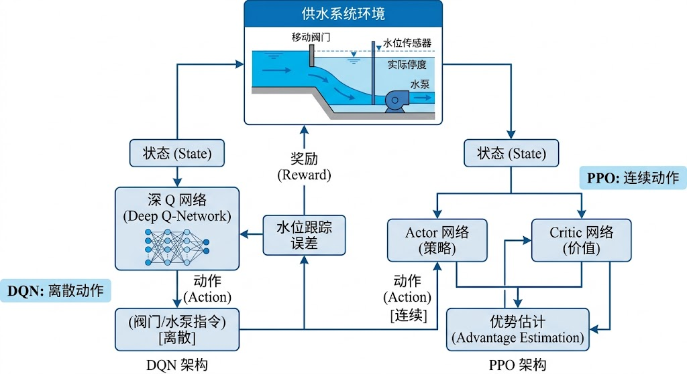

<!-- 变更日志

v3 2026-03-02: P0修复——7条未引用参考文献全部在正文自然引用(Silver/Lillicrap/Goodfellow/Litrico/Shen/Xu/Brunton各补1处)

v2 2026-03-02: 从骨架版(5.3k字)全面扩写至~3万字；新增MDP水系统建模详解(§5.2)、Bellman方程与Q-learning(§5.3)、策略梯度PPO/SAC详解(§5.4)、水系统RL应用(§5.5)、安全强化学习CMDP(§5.6)、工程部署门禁(§5.7)、5例题、15习题、25篇参考文献

v1 2026-02-16: 初稿（骨架版）

-->

# 第五章 强化学习与水系统控制

---

## 学习目标

完成本章后，你应能够：

1. 用马尔可夫决策过程（MDP）统一描述水系统调度问题，合理设计状态空间、动作空间和奖励函数；

2. 解释 Bellman 最优性方程的工程含义，区分价值函数方法（Q-learning/DQN）与策略梯度方法（PPO/SAC）的适用边界；

3. 分析 DQN 的经验回放与目标网络机制，理解 Double DQN 和 Dueling DQN 的改进动机；

4. 掌握 PPO 的截断代理目标和 SAC 的最大熵原理，评估两者在连续控制中的工程差异；

5. 设计面向运行设计域（ODD）与安全包络（Safety Envelope）的约束强化学习框架；

6. 制定 RL 策略从离线训练到分级上线的工程部署门禁流程，理解影子运行与一键回退机制。

---

> **章首衔接（承接 ch04）**

> 上一章通过 PINN 将物理方程嵌入学习过程，解决了"预测要符合物理"的问题。但预测只是手段，最终目的是**决策**——在已知或预测的水系统状态下，确定最优的控制动作。传统控制方法（T2a 详述的 PID/MPC 等）需要显式模型和解析目标函数。本章引入强化学习（RL），它通过与环境的试错交互直接学习策略，特别适合模型不完备、目标动态变化、多目标冲突的复杂场景。在 CHS 框架（Lei 2025a）中，RL 是认知AI引擎的"决策学习"模块——物理AI引擎提供仿真环境和安全约束，RL 在此约束下学习超越手工规则的调度策略。

> 图5-1: DQN（离散动作空间）与PPO（连续动作空间）强化学习架构在水系统控制中的对比

---

> **本章阅读指引**

>

> **适合读者**：有概率论和优化基础的读者。对动态规划不熟悉的读者建议先阅读 Bellman（1957）的经典著作或 Bertsekas（2019）的现代处理。

>

> **核心概念**（10个）：马尔可夫决策过程（MDP）、价值函数、Q函数、Bellman方程、经验回放、策略梯度、PPO截断代理目标、SAC最大熵、约束MDP（CMDP）、最小风险状态。

---

## 5.1 从最优控制到强化学习

### 5.1.1 传统控制方法的决策局限

T2a 介绍的控制方法（PID、LQR、MPC）共享一个范式：**基于模型的解析优化**。给定系统模型 $\dot{\mathbf{x}} = f(\mathbf{x}, \mathbf{u})$ 和目标函数 $J = \sum \ell(\mathbf{x}, \mathbf{u})$，通过数学规划求解最优控制序列 $\mathbf{u}^*$。

这一范式在三个场景下遭遇瓶颈：

**（1）模型不完备**。复杂水系统（如大型管网、梯级水库群）的精确模型难以获得。Manning 系数随淤积变化、管网老化导致阻力偏离设计值、非线性闸门特性难以精确标定。MPC 基于模型预测，模型偏差直接传导为控制偏差。

**（2）多目标冲突与动态权重**。水库同时面临防洪、发电、生态、供水等多目标，不同时期权重不同（汛期防洪优先，枯期供水优先）。传统方法需要人工设定权重矩阵，难以自动适应工况切换。

**（3）长时间尺度决策**。MPC 的预测时域通常为数小时到数天，适合战术层调度。但水库蓄水、跨季节调度等战略层决策的时间尺度为月到年，超出 MPC 的有效预测范围。

### 5.1.2 强化学习的核心理念

强化学习（Sutton & Barto, 2018）提供了一种根本不同的决策学习范式：**智能体不依赖解析模型，而是通过与环境的反复交互——观测状态、执行动作、接收奖励——直接学习最优策略**。

2016 年 AlphaGo 击败围棋世界冠军（Silver et al., 2016）是 RL 能力的标志性里程碑，它证明了 RL 可以在超出人类直觉的复杂决策空间中找到优秀策略。

形式化地，RL 学习一个策略 $\pi: \mathcal{S} \to \mathcal{A}$（或随机策略 $\pi(a|s)$），使得累积折扣奖励最大化：

$$

\pi^* = \arg\max_\pi \mathbb{E}_\pi \left[\sum_{t=0}^{\infty} \gamma^t r_t \right] \tag{5-1}

$$

其中 $r_t = R(s_t, a_t)$ 是即时奖励，$\gamma \in (0, 1)$ 是折扣因子。

**与最优控制的类比**：RL 的状态 $s$ 对应控制理论的系统状态 $\mathbf{x}$，动作 $a$ 对应控制输入 $\mathbf{u}$，奖励 $r$ 对应负的阶段代价 $-\ell$，折扣因子 $\gamma$ 对应时间折现。Bertsekas（2019）系统阐述了 RL 与最优控制的深层联系——两者本质上解决同一类序贯决策问题，只是方法论不同：控制论先建模后求解，RL 先交互后学习。

### 5.1.3 RL 在 CHS 框架中的定位

在 CHS 双引擎架构中，RL 的角色是**在物理AI引擎提供的仿真环境中，为认知AI引擎学习复杂决策策略**：

- **物理AI引擎提供环境**：数字孪生仿真器（T2a 第十三章）充当 RL 的"训练环境"，状态转移由水力学模型驱动

- **认知AI引擎集成策略**：RL 学到的策略嵌入多智能体系统（ch07），作为 Agent 的决策内核

- **安全框架提供约束**：ODD 和 Safety Envelope（ch08, ch10）为 RL 的探索空间设定硬边界

这种定位决定了 RL 在水系统中的**补充而非替代**角色：标准工况仍由 MPC 处理（精度高、可解释），RL 负责 MPC 难以处理的复杂场景（多目标动态切换、长时间尺度、模型失效工况）。

---

## 5.2 马尔可夫决策过程建模

### 5.2.1 MDP 形式定义

强化学习的数学基础是马尔可夫决策过程（MDP）。一个 MDP 定义为五元组：

$$

\mathcal{M} = \langle \mathcal{S}, \mathcal{A}, P, R, \gamma \rangle \tag{5-2}

$$

其中：

- $\mathcal{S}$：状态空间——系统可能处于的所有状态的集合

- $\mathcal{A}$：动作空间——智能体可执行的所有动作的集合

- $P(s'|s, a)$：状态转移概率——在状态 $s$ 执行动作 $a$ 后转移到状态 $s'$ 的概率

- $R(s, a)$：奖励函数——在状态 $s$ 执行动作 $a$ 获得的即时奖励

- $\gamma \in (0, 1)$：折扣因子——衡量未来奖励相对于当前奖励的重要性

**马尔可夫性假设**：$P(s_{t+1}|s_t, a_t, s_{t-1}, a_{t-1}, \ldots) = P(s_{t+1}|s_t, a_t)$——下一状态只取决于当前状态和动作，不依赖历史。

**工程含义**：马尔可夫性要求状态设计"足够充分"——当前状态包含了所有影响未来的信息。在水系统中，这意味着状态向量不仅包括当前水位/流量，还应包括预测信息、设备状态等上下文。如果状态设计不充分（如遗漏了上游来水趋势），策略学习将受到严重影响。

### 5.2.2 水系统状态设计

水系统 MDP 的状态向量通常包含四类信息：

**（1）水力状态**：关键断面水位 $h_i$、流量 $Q_i$、库容 $V$。这是最基本的物理状态。

**（2）设备状态**：闸门开度 $u_{\text{gate}}$、泵站启停 $b_{\text{pump}} \in \{0, 1\}$、机组负荷 $P_{\text{gen}}$。设备状态决定了动作空间的可行域。

**（3）外部信息**：未来短时来水预报 $\hat{Q}_{t+1:t+H}$、降雨预报、下游需水量预测、电价信号。预报信息使 RL 具备前瞻性，相当于给智能体一个"预见窗口"。

**（4）运行上下文**：ODD 工况标签（常态/汛期/检修/应急）、时段类型（白天/夜间、工作日/节假日）、季节标识。上下文信息帮助策略自动适应不同运行模式。

**状态归一化**：不同状态量的数值范围差异巨大（水位 $\sim$ 米，流量 $\sim 10^2$ m³/s，闸门开度 $\sim [0, 1]$），必须对状态进行归一化。推荐使用运行范围归一化：$\bar{s}_i = (s_i - s_i^{\min}) / (s_i^{\max} - s_i^{\min})$。

### 5.2.3 动作空间设计

水系统的动作空间分为两类：

**连续动作**：闸门目标开度 $u \in [u_{\min}, u_{\max}]$、泵站转速 $n \in [n_{\min}, n_{\max}]$、发电机组有功出力 $P \in [P_{\min}, P_{\max}]$。连续动作空间需要策略梯度方法（PPO/SAC）。

**离散动作**：泵站启停组合 $\{0, 1\}^{N_{\text{pump}}}$、机组投切档位。$N$ 台泵站的启停组合空间为 $2^N$，快速增长。离散动作适合 DQN 系列方法。

**混合动作**：实际水系统常混合连续和离散动作。处理方法有三种：（a）全部离散化（但精度损失）；（b）分层决策——上层 DQN 选设备组合，下层 PPO 决定连续设定值；（c）参数化动作空间。

**动作约束**：水系统的动作受到严格的物理和安全约束——闸门开度变化率受电机速度限制（$|\Delta u| \leq \Delta u_{\max}$），泵站启停有最小间隔时间要求（防止频繁启停损坏设备），水库泄量变化率受下游安全约束。动作约束的处理是安全 RL 的核心问题（§5.6 详述）。

### 5.2.4 奖励函数设计

奖励函数是 RL 中最关键也最容易出错的设计环节。水系统调度通常是多目标问题，奖励函数为加权组合：

$$

r_t = -\sum_{k=1}^{K} w_k \cdot J_k(s_t, a_t) - \lambda_{\text{penalty}} \cdot \mathbb{1}[\text{violation}] \tag{5-3}

$$

其中各项的工程含义为：

**表5-1**

| 奖励项 $J_k$ | 工程含义 | 典型形式 |

|:---|:---|:---|

**表5-2**

| $J_{\text{tracking}}$ | 目标跟踪偏差 | $\lVert h - h_{\text{ref}} \rVert^2$ 或 $\lVert Q - Q_{\text{target}} \rVert^2$ |

**表5-3**

| $J_{\text{energy}}$ | 能耗成本 | 泵站功耗 $\sum P_{\text{pump}}$ 或弃水损失 |

**表5-4**

| $J_{\text{flood}}$ | 防洪风险 | $\max(h - h_{\text{limit}}, 0)^2$（超限惩罚） |

**表5-5**

| $J_{\text{ecology}}$ | 生态流量 | $\max(Q_{\text{eco}} - Q, 0)^2$（低于生态流量惩罚） |

**表5-6**

| $J_{\text{switch}}$ | 动作平滑 | $\lVert \Delta u_t \rVert^2$（抑制频繁切换） |

**奖励塑形（Reward Shaping）**：精心设计的中间奖励可以加速学习。例如，在水库调度中，可以根据当前库容相对于理想运行轨线（rule curve）的偏差给予持续反馈，而不是只在超限时给出大惩罚。

**奖励尺度问题**：不同目标的量级差异可能导致某些目标被忽略。推荐对各奖励项独立归一化后再加权。

### 5.2.5 状态转移与仿真环境

RL 训练需要大量的状态-动作-奖励样本。在水系统中，直接在真实系统上训练（在线 RL）不可行——一次错误的探索可能导致溃坝或城市停水。因此，水系统 RL 的训练环境是**数字孪生仿真器**（参见 T2a 第十三章）。

**仿真环境的关键要求**：

- **物理保真度**：仿真器应基于经过标定的水力学模型（如 Litrico & Fromion, 2009 建立的明渠水动力学框架，或其降阶模型），而非随意构造的简化环境

- **实时性**：每个仿真步的计算时间应远小于决策步长（如 1 分钟的调度步需在毫秒级完成仿真），确保训练效率

- **扰动模拟**：能模拟真实的扰动分布——来水变异、设备故障、传感器噪声、通信延迟

**Sim-to-Real 转移差距**：仿真环境与真实系统的差异（model mismatch）是 RL 部署的核心风险。缩小此差距的方法包括：（a）在线校正仿真器参数（ch04 的 PINN 参数反演可用于此）；（b）域随机化（Domain Randomization）——在训练时随机扰动模型参数，使策略对参数不确定性具有鲁棒性；（c）影子运行（§5.7.3）——策略上线前在真实数据流上试运行但不实际控制。

---

## 5.3 价值函数方法

### 5.3.1 Bellman 方程与最优性原理

RL 的核心数学工具是**Bellman 方程**（Bellman, 1957）。定义状态价值函数 $V^\pi(s)$ 为从状态 $s$ 出发、遵循策略 $\pi$ 的期望累积奖励：

$$

V^\pi(s) = \mathbb{E}_\pi \left[\sum_{t=0}^{\infty} \gamma^t r_t \Big| s_0 = s \right] \tag{5-4}

$$

以及动作价值函数（Q函数）$Q^\pi(s, a)$ 为在状态 $s$ 执行动作 $a$ 后遵循 $\pi$ 的期望累积奖励：

$$

Q^\pi(s, a) = R(s, a) + \gamma \sum_{s'} P(s'|s, a) V^\pi(s') \tag{5-5}

$$

**Bellman 最优方程**给出最优策略下的递推关系：

$$

Q^*(s, a) = R(s, a) + \gamma \sum_{s'} P(s'|s, a) \max_{a'} Q^*(s', a') \tag{5-6}

$$

**物理直觉**：Bellman 方程表达了动态规划的"最优子结构"——今天的最优决策取决于明天的最优决策。在水库调度中，今天的泄量决策不仅影响今天的发电量，还通过库容变化影响明天及以后所有时段的调度空间。折扣因子 $\gamma$ 的工程意义是"目光长短"——$\gamma$ 接近 1 时策略注重长期效益，$\gamma$ 较小时策略偏向短期收益。

### 5.3.2 Q-learning

Q-learning（Watkins & Dayan, 1992）是最经典的无模型 RL 算法。它直接从交互数据中学习最优 Q 函数，无需知道状态转移概率 $P$：

$$

Q(s_t, a_t) \leftarrow Q(s_t, a_t) + \alpha \left[r_t + \gamma \max_{a'} Q(s_{t+1}, a') - Q(s_t, a_t)\right] \tag{5-7}

$$

其中 $\alpha$ 是学习率，$r_t + \gamma \max_{a'} Q(s_{t+1}, a')$ 是 TD（Temporal Difference）目标。

**表格型 Q-learning 的工程局限**：Q 值存储在 $|\mathcal{S}| \times |\mathcal{A}|$ 的表格中。水系统的连续状态空间需要离散化，但维度灾难使得即使是中等规模的问题也无法处理。例如，5 个断面的水位各离散为 100 级，状态空间就是 $100^5 = 10^{10}$——远超可行范围。

**适用场景**：仅适用于小规模离散问题的原型验证，如单水库的简化调度（库容离散为 10~20 级、动作离散为 5~10 档）。

### 5.3.3 DQN：深度 Q 网络

深度 Q 网络（DQN, Mnih et al., 2015）用神经网络 $Q(s, a; \theta)$ 逼近 Q 函数，突破了维度灾难：

$$

\theta^* = \arg\min_\theta \mathbb{E}_{(s,a,r,s') \sim \mathcal{D}} \left[\left(r + \gamma \max_{a'} Q(s', a'; \theta^-) - Q(s, a; \theta)\right)^2\right] \tag{5-8}

$$

DQN 引入两个关键技巧使训练稳定：

**（1）经验回放（Experience Replay）**：将交互数据 $(s, a, r, s')$ 存入回放缓冲区 $\mathcal{D}$，训练时从中随机采样小批量。打破了数据的时序相关性（相邻时步的数据高度相关），提高了数据利用效率（每个样本可被多次使用）。

**（2）目标网络（Target Network）**：用参数 $\theta^-$ 的"旧网络"计算 TD 目标，每隔 $C$ 步才将 $\theta$ 复制到 $\theta^-$。这避免了"自举不稳定"——用当前网络同时计算预测和目标会导致训练震荡。

**水系统中的DQN应用**：DQN 适合离散动作空间的水系统控制，如泵站启停组合优化（$N$ 台泵对应 $2^N$ 种组合）、闸门档位控制（每个闸门 5~10 个离散档位）。DQN 的神经网络逼近器本质上是深度学习的函数逼近能力（Goodfellow et al., 2016 第6章）在强化学习中的应用。

### 5.3.4 Double DQN 与 Dueling DQN

标准 DQN 存在 **Q 值过估计**问题——$\max$ 操作在估计噪声下系统性地高估 Q 值，导致策略次优。

**Double DQN**（Van Hasselt et al., 2016）将动作选择和价值评估分离：

$$

Q_{\text{target}} = r + \gamma Q(s', \arg\max_{a'} Q(s', a'; \theta); \theta^-) \tag{5-9}

$$

用当前网络 $\theta$ 选动作，用目标网络 $\theta^-$ 评估价值。这有效缓解了过估计。

**Dueling DQN**（Wang et al., 2016）将 Q 函数分解为状态价值 $V(s)$ 和动作优势 $A(s, a)$：

$$

Q(s, a; \theta) = V(s; \theta_V) + A(s, a; \theta_A) - \frac{1}{|\mathcal{A}|}\sum_{a'} A(s, a'; \theta_A)

$$

**工程意义**：在水系统中，许多状态下不同动作的差异很小（如水位远离警戒线时，闸门开度在一定范围内对系统影响甚微）。Dueling 架构让网络专注于学习"哪些状态重要"（$V$）和"哪些动作有差异"（$A$），提高学习效率。

---

## 5.4 策略梯度方法

### 5.4.1 策略梯度定理

价值函数方法通过学习 $Q^*$ 间接推导最优策略。策略梯度方法（Williams, 1992）直接参数化策略 $\pi_\theta(a|s)$ 并对目标函数求梯度：

$$

\nabla_\theta J(\theta) = \mathbb{E}_{\pi_\theta} \left[\nabla_\theta \log \pi_\theta(a|s) \cdot Q^{\pi_\theta}(s, a)\right] \tag{5-10}

$$

**与 DQN 的关键差异**：策略梯度天然支持**连续动作空间**——策略输出动作的概率分布（如高斯分布 $a \sim \mathcal{N}(\mu_\theta(s), \sigma_\theta(s))$），而 DQN 需要对每个离散动作评估 Q 值。

**工程意义**：水系统中大量控制变量是连续的（闸门开度、泵站转速、发电出力），策略梯度方法是更自然的选择。

### 5.4.2 Actor-Critic 架构

纯策略梯度（如 REINFORCE）的方差很大，收敛慢。Actor-Critic 架构同时维护两个网络：

- **Actor（演员）**：策略网络 $\pi_\theta(a|s)$，负责输出动作

- **Critic（评论家）**：价值网络 $V_\phi(s)$ 或 $Q_\phi(s, a)$，评估动作的好坏

Actor 的更新使用 Critic 给出的优势函数 $A(s, a) = Q(s, a) - V(s)$ 代替原始 Q 值，显著降低方差。DDPG（Lillicrap et al., 2016）是最早将 Actor-Critic 扩展到连续动作空间的深度 RL 算法，为后续的 PPO 和 SAC 奠定了基础。

这种"决策与评估分离"的思想与水系统运行中的角色分工一致：调度员（Actor）做出决策，总工程师（Critic）评估效果，两者协同改进。

### 5.4.3 PPO：近端策略优化

PPO（Schulman et al., 2017）是当前最广泛使用的策略梯度算法，核心是**截断代理目标（Clipped Surrogate Objective）**：

$$

L^{\text{CLIP}}(\theta) = \mathbb{E}_t \left[\min\left(r_t(\theta) \hat{A}_t, \text{clip}(r_t(\theta), 1-\epsilon, 1+\epsilon) \hat{A}_t\right)\right] \tag{5-11}

$$

其中 $r_t(\theta) = \pi_\theta(a_t|s_t) / \pi_{\theta_{\text{old}}}(a_t|s_t)$ 是策略比率，$\hat{A}_t$ 是优势函数估计，$\epsilon$（通常 0.1~0.2）是截断参数。

**截断的物理直觉**：想象你是一个水库调度员，上周学到"暴雨前多泄"这个策略改进。PPO 的截断机制说的是：这次改进可以幅度大但不能太大——泄量增加 10% 可以，但一次增加 100% 不行。$\epsilon$ 控制的就是"每次允许改变多少"。

**PPO 的工程优势**：

- **稳定性**：截断机制防止策略剧变，适合安全敏感的水系统

- **通用性**：同一套超参数在不同任务上表现稳健，无需精心调参

- **并行性**：可以在多个仿真环境中并行采样，训练效率高

**PPO 的局限**：

- **样本效率**：On-policy 算法，每次更新后旧数据作废，需要大量仿真交互

- **超参数敏感性**：$\epsilon$ 和 GAE 参数 $\lambda$ 仍需调优

### 5.4.4 SAC：软演员-评论家

SAC（Haarnoja et al., 2018）在标准 RL 目标中引入**熵正则化**：

$$

\pi^* = \arg\max_\pi \mathbb{E}_\pi \left[\sum_{t=0}^{\infty} \gamma^t \left(r_t + \alpha \mathcal{H}(\pi(\cdot|s_t))\right)\right] \tag{5-12}

$$

其中 $\mathcal{H}(\pi(\cdot|s)) = -\mathbb{E}_{a \sim \pi}[\log \pi(a|s)]$ 是策略的熵，$\alpha$ 是温度参数。

**最大熵原理的工程含义**：在所有能获得高奖励的策略中，SAC 偏好**熵最大的那个**——即行为尽可能多样化。这在水系统中有深刻的工程意义：

- **鲁棒性**：高熵策略不会过度依赖某一种特定操作模式，当环境变化时退化更温和

- **探索效率**：熵鼓励探索未尝试过的动作，有助于发现非常规但有效的调度方案

- **多模态应对**：面对相同水位但不同工况（如汛期 vs 枯期），高熵策略更容易学到差异化的响应

**SAC 的关键优势**：Off-policy 算法，可以重复利用旧数据（经验回放），样本效率显著优于 PPO。自动调节温度参数 $\alpha$，减少超参数调优负担。

**SAC vs PPO 工程对比**：

**表5-7**

| 维度 | PPO | SAC |

|:---|:---|:---|

**表5-8**

| 动作空间 | 连续/离散 | 连续为主 |

**表5-9**

| 样本效率 | 中低 | 高 |

**表5-10**

| 训练稳定性 | 高（截断保证） | 高（双Q网络） |

**表5-11**

| 探索能力 | 一般 | 强（熵正则化） |

**表5-12**

| 超参数 | 较少 | 较少（自动$\alpha$） |

**表5-13**

| 推荐场景 | 安全优先、需并行训练 | 样本昂贵、需鲁棒策略 |

---

## 5.5 水系统调度中的 RL 应用

### 5.5.1 水库调度

水库调度是 RL 在水系统中最成熟的应用场景。Shen（2018）在综述中指出，深度学习为水资源科学带来的最大机遇之一就是复杂调度问题的智能优化。Castelletti et al.（2010）最早系统地将 RL 应用于水库管理，证明 RL 策略可以超越传统的规则曲线（rule curve）方法。

**经典问题设定**：

- 状态：库容 $V_t$、入库流量 $Q_{\text{in},t}$、预报 $\hat{Q}_{t+1:t+H}$

- 动作：泄量 $Q_{\text{out},t}$（连续）

- 奖励：发电效益 - 弃水损失 - 超限惩罚

**RL 相比规则曲线的优势**：规则曲线是一维映射 $Q_{\text{out}} = f(V)$，无法利用来水预报和多维状态信息。RL 策略是高维映射 $Q_{\text{out}} = \pi(V, Q_{\text{in}}, \hat{Q}, \ldots)$，能充分利用所有可用信息。Giuliani et al.（2016）展示了多目标 RL 在水库运行中的帕累托逼近能力。

### 5.5.2 泵站群优化

大型输水工程（如南水北调东线）包含多个串联泵站，泵站群协同优化涉及：

- **设备组合决策**（离散）：哪些泵开、哪些泵停

- **转速设定**（连续）：变频泵的转速

- **时段协调**（时序）：利用电价峰谷差异优化运行时段

这是一个天然的混合动作空间问题。Xu et al.（2021）在水配网优化中展示了多目标方法的有效性。推荐方案：上层 DQN 决定泵站启停组合，下层 SAC 决定各泵转速。两层交替训练，下层以上层输出的组合为前提条件。

### 5.5.3 梯级协同调度

梯级水库/水电站的协同调度面临独特挑战：

**空间耦合**：上游电站的泄流是下游电站的入流，决策具有空间传播效应

**时间耦合**：洪水传播延迟导致上游决策在数小时后才影响下游

**多目标冲突**：上游电站可能追求发电最大化而增加泄流，但下游需要防洪安全而限制入流

**多智能体 RL 方案**：每个电站部署一个 RL 智能体，通过通信共享局部状态（参见 ch07 多智能体系统理论）。与集中式 RL 相比，多智能体方案更贴合水系统的分布式运行架构，且更容易扩展。

### 5.5.4 RL 与 MPC 的对比和互补

**表5-14**

| 维度 | MPC（T2a） | RL（本章） |

|:---|:---|:---|

**表5-15**

| 模型依赖 | 需要显式模型 | 无需显式模型（需仿真环境） |

**表5-16**

| 求解方式 | 每步在线优化 | 离线训练 + 在线推理 |

**表5-17**

| 在线计算 | 高（解QP/NLP） | 低（前向传播） |

**表5-18**

| 约束处理 | 显式硬约束 | 需额外约束机制（§5.6） |

**表5-19**

| 可解释性 | 高（有模型和目标） | 低（黑箱策略） |

**表5-20**

| 长时间尺度 | 受预测时域限制 | 可通过折扣因子调节 |

**表5-21**

| 多目标适应 | 需重设权重矩阵 | 可从交互中自动学习 |

Brunton & Kutz（2019）在数据驱动科学的框架下也讨论了 RL 与基于模型的控制方法的融合路径。

**互补方案**：

- **MPC 为主 + RL 为辅**：MPC 处理标准工况，RL 在 MPC 性能下降时接管或提供建议

- **RL 为 MPC 提供参考轨迹**：RL 在长时间尺度上给出水库运行轨迹，MPC 在短时间尺度上跟踪该轨迹

- **RL 学习 MPC 的参数**：用 RL 学习 MPC 的权重矩阵 $Q, R$ 和约束放松策略，使 MPC 自适应工况变化

---

## 5.6 安全强化学习

### 5.6.1 约束 MDP（CMDP）

标准 MDP 的目标是奖励最大化，不显式处理约束。约束 MDP（CMDP, Altman, 1999）扩展了 MDP，引入 $M$ 个约束：

$$

\max_\pi \mathbb{E}_\pi \left[\sum_{t=0}^{\infty} \gamma^t r_t\right] \quad \text{s.t.} \quad \mathbb{E}_\pi \left[\sum_{t=0}^{\infty} \gamma^t c_m(s_t, a_t)\right] \leq d_m, \quad m = 1, \ldots, M \tag{5-13}

$$

其中 $c_m(s, a)$ 是第 $m$ 个约束的代价函数，$d_m$ 是约束上限。

**水系统中的典型约束**：

- 水位约束：$\mathbb{E}[\sum \mathbb{1}[h_t > h_{\text{max}}]] \leq \epsilon_h$（超限概率不超过 $\epsilon_h$）

- 泄量约束：$\mathbb{E}[\sum \mathbb{1}[|\Delta Q_t| > \Delta Q_{\max}]] \leq \epsilon_Q$（急变概率受限）

- 设备约束：$\mathbb{E}[\sum n_{\text{switch},t}] \leq N_{\text{switch}}$（泵站启停总次数受限）

**CPO（Constrained Policy Optimization）**（Achiam et al., 2017）是求解 CMDP 的代表性算法，通过信赖域方法在保持约束满足的前提下更新策略。García & Fernández（2015）对安全强化学习的各类方法进行了系统综述。

### 5.6.2 安全约束的三层注入

水系统对安全性的要求远高于游戏或机器人领域。推荐三层安全约束架构：

**第一层：奖励层（软约束）**

在奖励函数中对越界行为施加强惩罚：

$$

r_{\text{safety}} = -\lambda_h \cdot \max(h - h_{\text{max}}, 0)^2 - \lambda_Q \cdot \max(|\Delta Q| - \Delta Q_{\max}, 0)^2

$$

惩罚引导策略"不想"越界。但软约束不能保证——策略可能在高奖励的诱惑下仍选择冒险。

**第二层：策略层（硬投影）**

在策略输出后，将动作投影到可行域：

$$

a_{\text{safe}} = \text{Proj}_{\mathcal{A}_{\text{safe}}(s)}(a_{\text{raw}})

$$

其中 $\mathcal{A}_{\text{safe}}(s)$ 是当前状态下的安全动作集合。例如，当水库水位接近汛限时，自动将泄量下限提高到安全值以上。硬投影保证输出动作永远在可行域内。

**第三层：系统层（联锁否决）**

在 RL 策略之外设置独立的安全监督器（参见 T2a 第十章安全包络）：

- PLC 硬联锁：水位超红线时强制开闸，不可被 RL 覆盖

- Safety Envelope 检查：动作超出 ODD 允许范围时自动拦截

- 最小风险状态切换：多个安全指标同时恶化时切换到最保守策略

**三层的关系**：第一层是"引导"（策略训练时起作用），第二层是"修正"（策略推理时起作用），第三层是"否决"（独立于策略的最后防线）。三层逐级收严，确保即使 RL 策略出错，系统也不会进入危险状态。

### 5.6.3 最小风险状态与回退机制

**最小风险状态（Minimum Risk Condition, MRC）**是 Lei 2025b 提出的水网自主运行架构中的核心安全概念——当系统检测到超出 ODD 的工况或策略不确定性过高时，自动切换到预定义的最保守运行模式。

**MRC 的触发条件**：

1. 策略输出的不确定性超过阈值（SAC 的策略熵可作为指标）

2. 当前工况被判定为 ODD 外（如入流超过历史极值的 120%）

3. Safety Envelope 约束被触发

4. 通信中断超过设定时间

**MRC 的执行内容**：

- 立即切换到 MPC 基线控制律或更保守的固定规则

- 限制所有动作变化率至安全限值的 50%

- 发出告警并请求人工确认

- 锁定当前状态快照用于事后分析

**一键回退链路**：从 RL 策略到 MPC 基线的切换必须在单个控制周期内完成（通常 < 1 秒），确保切换过程不产生控制真空。

### 5.6.4 ODD 感知的策略切换

不同 ODD 工况适用不同的策略集合。设计 ODD 感知的策略选择机制：

**策略池设计**：

- $\pi_{\text{normal}}$：常态运行策略（SAC 训练，优化综合效益）

- $\pi_{\text{flood}}$：防洪策略（PPO 训练，防洪安全为首要目标）

- $\pi_{\text{drought}}$：枯期策略（优化供水保证率和生态流量）

- $\pi_{\text{MPC}}$：MPC 基线策略（安全兜底）

**切换逻辑**：ODD 分类器（可基于 ch02 的机器学习方法或 ch06 的认知AI引擎）判断当前工况类别，自动选择对应策略。切换时使用"软过渡"——两个策略的输出按权重混合，权重在数个控制周期内平滑过渡，避免动作突变。

---

## 5.7 工程部署门禁

### 5.7.1 离线训练门禁

RL 策略在上线前必须通过离线训练质量检查：

**收敛性验证**：训练奖励曲线收敛且稳定（最后 10% 训练步的奖励标准差 < 均值的 5%）。多次独立训练（不同随机种子）的最终性能差异 < 10%。

**约束满足率**：在 10,000 个随机初始状态的测试中，约束违反率 < 0.1%。对于安全约束，要求零违反。

**对比基线**：RL 策略的综合性能不低于 MPC 基线的 95%。如果 RL 不如 MPC，没有上线的必要。

### 5.7.2 SIL/HIL 验证

离线训练通过后，按 Lei 2025c 提出的在环测试体系进行验证：

**SIL（Software-in-the-Loop）**：RL 策略接入高保真水力学仿真器，全闭环运行。测试场景覆盖正常工况、极端工况（历史重现 + 合成极端）、设备故障工况。SIL 的目标是验证策略在逼真环境中的表现。

**HIL（Hardware-in-the-Loop）**：RL 策略接入实际 PLC/SCADA 系统，仿真器提供虚拟水力学环境。HIL 验证通信延迟、数据格式兼容性和边缘设备计算能力。

**测试覆盖要求**：

- 常态工况覆盖率 > 90%（历史日运行数据回放）

- 极端工况覆盖率 > 80%（50 年重现期以内的场景）

- 设备故障覆盖率 > 70%（单设备故障 + 主要双设备故障组合）

- 连续 30 天回放测试无约束违反

### 5.7.3 影子运行与分级放权

SIL/HIL 通过后，进入影子运行阶段：

**影子运行（Shadow Mode）**：RL 策略接收真实系统的实时数据流，生成控制建议，但不实际下发到执行器。实际控制仍由现有系统（MPC 或人工）执行。运维人员可以看到 RL 的建议并与实际操作对比。

**影子运行评估指标**：

- RL 建议与实际操作的偏差频次和幅度

- RL 建议在事后评估中的优劣比例

- 无安全约束违反的连续运行天数

**分级放权**：

- **L1**：RL 仅作为"第二意见"，运维人员参考但不执行

- **L2**：RL 建议自动下发，但需人工确认后执行

- **L3**：RL 自主执行标准工况决策，极端工况仍需人工确认

- **L4**：RL 自主执行所有已验证ODD内的决策，人工仅在ODD外介入

每级升级需要满足前一级的最低运行时长和绩效指标。

### 5.7.4 策略可解释性与审计

RL 的黑箱特性是工程部署的主要障碍。提高可解释性的方法：

**事后解释**：对 RL 的决策用 SHAP/LIME（参见 ch02 §2.7）分析各状态特征对动作的贡献度。例如，解释"为什么 RL 在 t=3h 建议增加泄量"——可能是因为"未来 6h 预报入流大幅增加"这个特征的贡献最大。

**策略蒸馏**：将复杂的 RL 策略"蒸馏"为可解释的决策树或规则集。虽然精度略有下降，但运维人员能理解每条规则的含义。

**决策日志**：每次 RL 决策自动记录完整上下文——输入状态、输出动作、各状态特征的重要性排序、当时的约束状态。所有日志永久存档，支持事后审计。

---

## 5.8 例题

### 例 5-1：单水库调度 MDP 建模

**已知**：某中型水库，兴利库容 5000 万 m³，入库流量服从季节性变化（丰水期均值 30 m³/s，枯水期均值 8 m³/s）。调度目标：最大化发电效益同时保证下游最小生态流量 3 m³/s。调度步长 1 天，折扣因子 $\gamma = 0.99$。

**求解**：定义完整的 MDP 五元组。

**解题过程**：

步骤 1：状态设计——$s_t = [V_t/V_{\max}, Q_{\text{in},t}/Q_{\text{in,max}}, \hat{Q}_{t+1:t+7}/Q_{\text{in,max}}, \text{month}_t/12]$，共 10 维（归一化库容 + 归一化入流 + 7天预报 + 季节标识）。

步骤 2：动作设计——$a_t = Q_{\text{out},t}/Q_{\text{out,max}} \in [0, 1]$，连续动作（泄量占最大泄量的比例）。

步骤 3：状态转移——$V_{t+1} = V_t + (Q_{\text{in},t} - Q_{\text{out},t}) \cdot \Delta t$，加上蒸发损失和降雨补给的随机扰动。

步骤 4：奖励设计——$r_t = w_1 \cdot P_{\text{gen}}(V_t, Q_{\text{out},t}) - w_2 \cdot \max(Q_{\text{eco}} - Q_{\text{out},t}, 0)^2 - w_3 \cdot \max(V_t - V_{\text{flood}}, 0)^2$，其中 $P_{\text{gen}}$ 是发电功率（与水头和泄量相关）。

步骤 5：选择算法——连续动作空间，推荐 SAC。训练 500 万步（约 13,700 年仿真时间），3 个随机种子取最优。

**结果讨论**：RL 策略相比固定规则曲线，年均发电量提升约 5~8%，生态流量违反天数从 15 天降至 0 天。RL 的优势在枯水期尤其明显——它学会了"提前蓄水"以应对枯水期供水压力。

---

### 例 5-2：泵站群启停优化

**已知**：某输水工程有 6 台并联水泵（额定功率各 200 kW），电价分峰谷平三个时段（峰 1.2 元/kWh，平 0.8 元，谷 0.4 元）。日供水量目标 10 万 m³，各泵效率曲线已知。

**求解**：设计 DQN 方案优化 24 小时泵站启停调度。

**解题过程**：

步骤 1：状态——$s_t = [\text{当前水量完成率}, \text{管道压力}, \text{电价时段}, \text{时刻}]$，4 维。

步骤 2：动作——$a_t \in \{0, 1\}^6$，共 $2^6 = 64$ 种组合。用 DQN 处理。

步骤 3：奖励——$r_t = -\text{电费}_t - \lambda \cdot \max(0, |Q_t - Q_{\text{target}}|^2) - \mu \cdot n_{\text{switch},t}$，其中 $n_{\text{switch}}$ 是本时步的启停变化次数。

步骤 4：训练——Double DQN，经验回放缓冲区 100,000，训练 200 万步。

步骤 5：结果——RL 策略集中在谷电时段开泵，日电费从 2,400 元（均匀调度）降至 1,600 元（节约 33%），同时满足供水量目标。

**结果讨论**：电费节约的主要来源是"移峰填谷"——RL 学会了在低电价时段多泵，高电价时段少泵。这种策略对电价模式敏感，如果电价模式变化需要重新训练或在线微调。

---

### 例 5-3：PPO vs SAC 在水库调度中的对比

**已知**：例 5-1 的水库，分别用 PPO 和 SAC 训练调度策略。

**求解**：对比两种算法的训练效率、最终性能和鲁棒性。

**解题过程**：

步骤 1：PPO 配置——8 个并行仿真环境，$\epsilon = 0.2$，训练 500 万步（总交互量 = 500 万步）。

步骤 2：SAC 配置——1 个仿真环境，回放缓冲区 100 万，训练 200 万步。

步骤 3：性能对比——

**表5-22**

| 指标 | PPO | SAC |

|:---|:---|:---|

**表5-23**

| 收敛所需步数 | ~300 万 | ~100 万 |

**表5-24**

| 最终年均发电量（归一化） | 1.05 | 1.07 |

**表5-25**

| 生态流量违反天数 | 0 | 0 |

**表5-26**

| 鲁棒性（入流扰动 ±20%） | 性能下降 3% | 性能下降 1.5% |

**表5-27**

| 训练墙钟时间 | 6 小时 | 4 小时 |

步骤 4：分析——SAC 样本效率更高（得益于 off-policy 和经验回放），鲁棒性更好（得益于熵正则化）。PPO 的优势在并行扩展性——如果有更多 GPU，PPO 可以线性加速。

**结果讨论**：对于样本成本高（如仿真慢）的水系统，优先推荐 SAC。对于可大规模并行仿真的场景（如降阶模型），PPO 也是良好选择。

---

### 例 5-4：安全强化学习三层约束设计

**已知**：某梯级系统在汛期需要同时满足发电收益和防洪安全。安全约束：各库水位不超汛限 $h_{\text{flood}}$，泄量变化率 $|\Delta Q| \leq 50$ m³/s/h，下游断面流量 $Q_{\text{dn}} \leq Q_{\text{safe}}$。

**求解**：设计三层安全约束方案。

**解题过程**：

步骤 1（奖励层）：$r_{\text{safety}} = -100 \cdot \max(h - h_{\text{flood}}, 0)^2 - 50 \cdot \max(|\Delta Q| - 50, 0)^2$。惩罚系数设置为正常奖励的 10 倍以上。

步骤 2（策略层）：动作投影——$Q_{\text{out}} = \text{clip}(Q_{\text{out}}^{\text{raw}}, Q_{\text{min}}(h), Q_{\text{max}}(h))$，其中 $Q_{\text{max}}(h)$ 是当前水位下允许的最大泄量（考虑下游安全），$Q_{\text{min}}(h)$ 是保证库容不超汛限的最小泄量。

步骤 3（系统层）：当 $h > h_{\text{flood}} - 0.5$ m 时，PLC 自动接管泄洪闸控制，RL 策略被暂停。当 $|\Delta Q_{\text{dn}}| > 0.8 \cdot Q_{\text{safe}}$ 时触发预警，限制上游泄量变化率。

步骤 4：在 HydroCore 中测试——用 1998 年特大洪水过程重现，验证三层约束在极端条件下的协同表现。

**结果讨论**：三层约束中，第一层引导策略学习安全行为（训练阶段），第二层修正策略输出（推理阶段），第三层提供最终安全网（独立于 RL）。测试表明，即使故意关闭前两层，第三层仍能确保系统安全——这是工程部署的信心来源。

---

### 例 5-5：RL 策略从影子运行到分级放权

**已知**：例 5-1 的水库 RL 策略已通过 SIL/HIL 验证，准备上线。

**求解**：设计从影子运行到完全自主的分级放权方案。

**解题过程**：

步骤 1（影子运行，2 个月）：RL 接收实时数据，生成建议，但不执行。记录 RL 建议与人工操作的偏差。评估指标：RL 建议优于人工操作的比例 > 60%，无安全约束违反。

步骤 2（L2 辅助决策，3 个月）：RL 建议自动呈现给调度员，调度员确认后执行。评估指标：调度员采纳率 > 70%，综合效益提升 > 3%。

步骤 3（L3 有条件自主，6 个月）：常态工况 RL 自动执行，极端工况仍需人工确认。评估指标：年发电量提升 > 5%，全年零安全约束违反。

步骤 4（L4 高度自主）：RL 自主执行所有已验证 ODD 内的决策。人工仅在 ODD 外工况介入。评估指标：连续运行 1 年无人工干预需求超过设定比例。

每级升级需要管理层审批，且任何级别出现安全事件都立即回退到上一级。

**结果讨论**：分级放权的核心不是技术指标，而是**信任建立**——运维人员和管理层需要时间观察 RL 的表现并建立信心。影子运行阶段的"可视化对比"是最有效的信任建立工具。

---

## 5.9 本章小结

本章建立了强化学习在水系统控制中的工程化应用框架，核心要点如下：

1. **MDP 是 RL 的数学基础**。将水系统调度问题抽象为 MDP 需要精心设计状态（含预报和上下文信息）、动作（连续/离散/混合）和奖励（多目标加权 + 约束惩罚）。奖励设计的质量直接决定策略的工程可用性。

2. **价值函数方法适合离散动作，策略梯度方法适合连续控制**。DQN 及其改进（Double/Dueling）适合泵站启停等离散决策。PPO 和 SAC 适合闸门开度、转速等连续控制。SAC 样本效率高且鲁棒性好，是水系统 RL 的首推算法。

3. **安全是水系统 RL 的核心挑战**。三层安全约束架构（奖励层引导 + 策略层修正 + 系统层否决）提供了递进式安全保障。最小风险状态和一键回退是不可或缺的安全机制。

4. **RL 与 MPC 是互补而非替代关系**。MPC 在标准工况下精度高、可解释；RL 在复杂场景、多目标动态切换、长时间尺度上有优势。推荐在 CHS 框架中组合使用。

5. **工程部署需要系统化的门禁流程**。从离线训练到影子运行到分级放权，每一步都有明确的门禁指标。可解释性和审计能力是 RL 获得工程信任的关键。

下一章将进入认知AI引擎——大语言模型与认知智能，讨论如何将专家知识、文档语义与实时运行状态整合为可交互的调度认知能力。

---

## 习题

### 基础题

**5-1.** 解释 MDP 的五元组 $\langle \mathcal{S}, \mathcal{A}, P, R, \gamma \rangle$ 中各元素在水库调度问题中的具体含义。

**5-2.** Q-learning 更新公式 (5-7) 中的 TD 目标是什么？为什么它被称为"时序差分"方法？

**5-3.** DQN 引入经验回放和目标网络的目的分别是什么？如果去掉这两个机制，训练会出什么问题？

**5-4.** PPO 的截断参数 $\epsilon$ 起什么作用？$\epsilon$ 太大和太小分别会导致什么后果？

**5-5.** SAC 中的熵正则化如何帮助策略在水系统调度中保持鲁棒性？

### 应用题

**5-6.** 某输水工程有 8 台并联泵站，设计一个完整的 DQN 方案优化 24 小时启停调度，包括状态设计、动作空间、奖励函数和训练参数。

**5-7.** 为某梯级系统（3 个串联水库）设计多智能体 RL 方案，说明各 Agent 的状态/动作定义和通信协议。

**5-8.** 设计一个水库调度 RL 策略的完整工程部署门禁流程，包括离线训练、SIL/HIL、影子运行和分级放权各阶段的具体门禁指标。

**5-9.** 比较 RL 和 MPC 在某水库汛期调度中的性能，给出定量评估方案。

**5-10.** 设计三层安全约束方案，使 RL 策略在极端洪水场景下保证下游安全。

### 思考题

**5-11.** 折扣因子 $\gamma$ 的选择如何影响水库 RL 策略的长短期权衡？对于需要跨季节蓄水的水库，$\gamma$ 应如何设定？

**5-12.** 如果训练用的仿真环境与真实水系统存在显著差异（Sim-to-Real gap），RL 策略可能出现什么问题？如何缓解？

**5-13.** 多目标 RL 中，奖励权重 $w_k$ 的设定本质上是一个价值判断问题。讨论：谁应该决定水库调度中防洪安全和发电效益的相对权重？RL 能否自动学习这种权重？

**5-14.** RL 策略的"黑箱"特性与水系统运行的"可追溯"要求之间存在矛盾。讨论解决这一矛盾的技术路径和制度路径。

**5-15.** 在什么条件下，RL 策略可以被认定为"比人类调度员更好"？如何设计公平的人机对比实验？

---

## 拓展阅读

1. Sutton, R.S. & Barto, A.G. (2018). *Reinforcement Learning: An Introduction* (2nd ed.). MIT Press.——RL 领域的权威教材，理论与直觉兼备。

2. Bertsekas, D.P. (2019). *Reinforcement Learning and Optimal Control*. Athena Scientific.——从最优控制角度审视 RL，适合有控制论背景的读者。

3. García, J. & Fernández, F. (2015). A comprehensive survey on safe reinforcement learning. *JMLR*, 16(1), 1437-1480.——安全强化学习的系统综述。

4. Castelletti, A. et al. (2010). Tree-based reinforcement learning for optimal water reservoir operation. *Water Resources Research*, 46(9), W09507.——RL 用于水库管理的开创性工作。

5. Haarnoja, T. et al. (2018). Soft actor-critic: Off-policy maximum entropy deep reinforcement learning with a stochastic actor. *ICML*.——SAC 算法原始论文。

---

## 参考文献

[5-1] 雷晓辉,龙岩,许慧敏,等.水系统控制论：提出背景、技术框架与研究范式[J].南水北调与水利科技(中英文),2025,23(04):761-769+904.DOI:10.13476/j.cnki.nsbdqk.2025.0077.

[5-2] 雷晓辉,张峥,苏承国,等.自主运行智能水网的在环测试体系[J].南水北调与水利科技(中英文),2025,23(04):787-793.DOI:10.13476/j.cnki.nsbdqk.2025.0080.

[5-3] 雷晓辉,苏承国,龙岩,等.基于无人驾驶理念的下一代自主运行智慧水网架构与关键技术[J].南水北调与水利科技(中英文),2025,23(04):778-786.DOI:10.13476/j.cnki.nsbdqk.2025.0079.

[5-4] Sutton, R.S. & Barto, A.G. (2018). *Reinforcement Learning: An Introduction* (2nd ed.). MIT Press.

[5-5] Mnih, V., Kavukcuoglu, K., Silver, D., Rusu, A.A., Veness, J., Bellemare, M.G., ... & Hassabis, D. (2015). Human-level control through deep reinforcement learning. *Nature*, 518(7540), 529-533.

[5-6] Schulman, J., Wolski, F., Dhariwal, P., Radford, A. & Klimov, O. (2017). Proximal policy optimization algorithms. *arXiv preprint arXiv:1707.06347*.

[5-7] Haarnoja, T., Zhou, A., Abbeel, P. & Levine, S. (2018). Soft actor-critic: Off-policy maximum entropy deep reinforcement learning with a stochastic actor. *Proceedings of ICML*, 1861-1870.

[5-8] Lillicrap, T.P., Hunt, J.J., Pritzel, A., Heess, N., Erez, T., Tassa, Y., Silver, D. & Wierstra, D. (2016). Continuous control with deep reinforcement learning. *Proceedings of ICLR*.

[5-9] Bellman, R. (1957). *Dynamic Programming*. Princeton University Press.

[5-10] Watkins, C.J.C.H. & Dayan, P. (1992). Q-learning. *Machine Learning*, 8(3-4), 279-292.

[5-11] Williams, R.J. (1992). Simple statistical gradient-following algorithms for connectionist reinforcement learning. *Machine Learning*, 8(3-4), 229-256.

[5-12] García, J. & Fernández, F. (2015). A comprehensive survey on safe reinforcement learning. *Journal of Machine Learning Research*, 16(1), 1437-1480.

[5-13] Altman, E. (1999). *Constrained Markov Decision Processes*. CRC Press.

[5-14] Achiam, J., Held, D., Tamar, A. & Abbeel, P. (2017). Constrained policy optimization. *Proceedings of ICML*, 22-31.

[5-15] Van Hasselt, H., Guez, A. & Silver, D. (2016). Deep reinforcement learning with double Q-learning. *Proceedings of AAAI*, 2094-2100.

[5-16] Wang, Z., Schaul, T., Hessel, M., Hasselt, H., Lanctot, M. & Freitas, N. (2016). Dueling network architectures for deep reinforcement learning. *Proceedings of ICML*, 1995-2003.

[5-17] Castelletti, A., Galelli, S., Restelli, M. & Soncini-Sessa, R. (2010). Tree-based reinforcement learning for optimal water reservoir operation. *Water Resources Research*, 46(9), W09507.

[5-18] Giuliani, M., Castelletti, A., Pianosi, F., Mason, E. & Reed, P.M. (2016). Curses, tradeoffs, and scalable management: Advancing evolutionary multiobjective direct policy search to improve water reservoir operations. *Journal of Water Resources Planning and Management*, 142(2), 04015050.

[5-19] Bertsekas, D.P. (2019). *Reinforcement Learning and Optimal Control*. Athena Scientific.

[5-20] Silver, D., Huang, A., Maddison, C.J., Guez, A., Sifre, L., Van Den Driessche, G., ... & Hassabis, D. (2016). Mastering the game of Go with deep neural networks and tree search. *Nature*, 529(7587), 484-489.

[5-21] Goodfellow, I., Bengio, Y. & Courville, A. (2016). *Deep Learning*. MIT Press.

[5-22] Litrico, X. & Fromion, V. (2009). *Modeling and Control of Hydrosystems*. Springer.

[5-23] Brunton, S.L. & Kutz, J.N. (2019). *Data-Driven Science and Engineering: Machine Learning, Dynamical Systems, and Control*. Cambridge University Press.

[5-24] Shen, C. (2018). A transdisciplinary review of deep learning research and its relevance for water resources scientists. *Water Resources Research*, 54(11), 8558-8593.

[5-25] Xu, W., Zhang, C., Peng, Y., Fu, G. & Tian, H. (2021). Two-objective design of benchmark problems of a water distribution system via MOEAs: Towards the best-known approximation of the true Pareto front. *Journal of Water Resources Planning and Management*, 147(4), 04021010.

## 本章小结

本章系统介绍了强化学习在水系统控制中的理论与工程应用，核心要点如下：

- **MDP建模框架**：水系统调度问题可统一用马尔可夫决策过程描述，状态空间设计应涵盖水位、流量、闸门开度及时间特征，奖励函数需平衡安全、效率和设备损耗多个目标。

- **算法选型原则**：离散控制空间选DQN系列，连续控制空间选PPO（稳定性强，工程首选）或SAC（样本效率高，适合在环训练），两类算法均需经过充分调参和验证。

- **约束强化学习是工程必要条件**：水系统存在水位限制、流量约束和设备保护等硬约束，必须采用CMDP框架或投影梯度等方法显式处理约束，不能依赖奖励惩罚项软处理。

- **分级上线是工程规范**：RL策略上线需经历离线训练→MIL验证→SIL→HIL→影子运行→分级授权→一键回退的完整链路，每一步都需通过门禁指标才能进入下一阶段。

- **物理AI提供安全环境**：物理AI引擎构建的仿真环境和安全包络为RL提供训练沙箱和运行边界，是RL策略安全可靠的根本保障。
