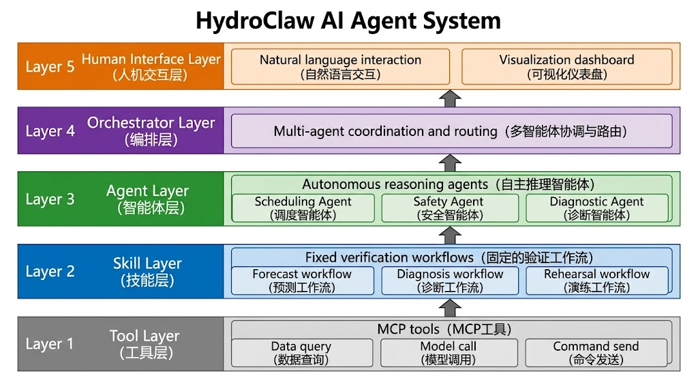
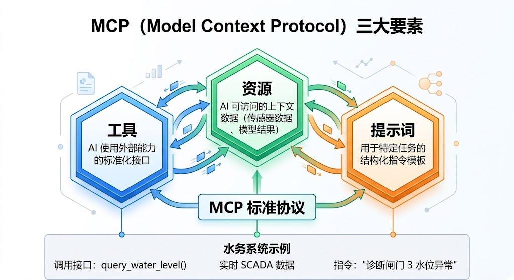
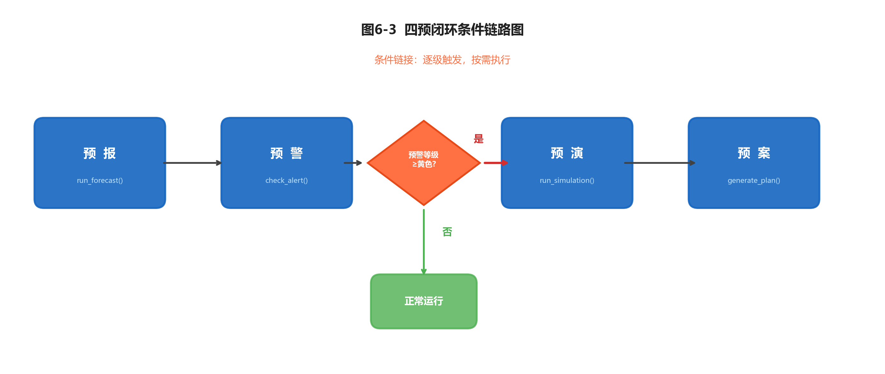
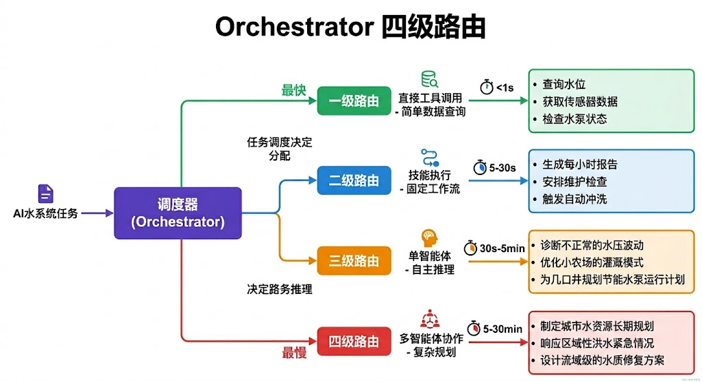
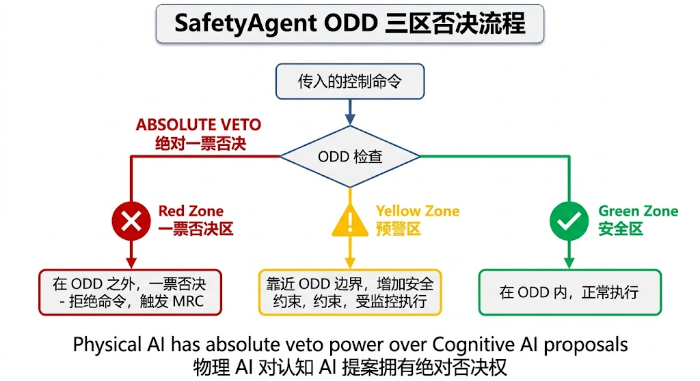
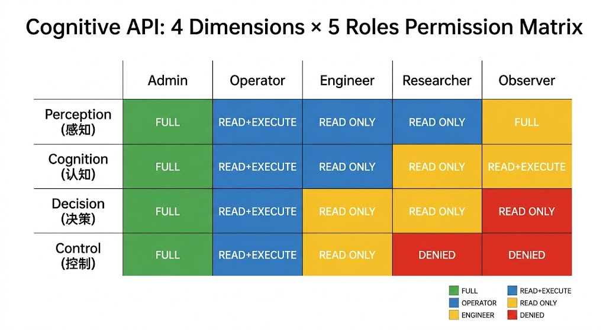
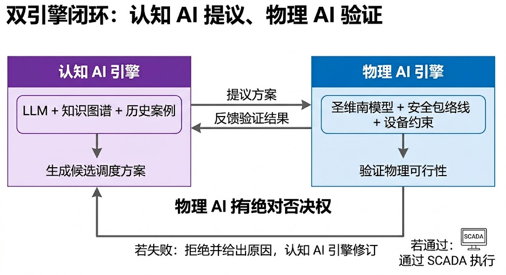

<!-- 变更日志
v3 2026-03-03: T2a/T2b分工红线合规——L0 Core核心算法详解增加T2a章节交叉引用括注
v2 2026-03-01: 基于 HydroClaw v0.2.2 代码全面重构，以"快慢思考"为主线；新增五层架构、MCP协议、Skill/Agent分工、认知API四维等核心节；认知API演示场景添加T2a交叉引用
v1 2026-02-16: 初稿（骨架版）
-->

# 第六章 认知AI引擎：HydroClaw 的快慢思考架构

---

## 学习目标

完成本章后，你应能够：

1. 用"快慢思考"类比解释 Skill（固定工作流）与 Agent（自主推理）的分工原理；
2. 阐述 MCP（Model Context Protocol）作为工具协议的设计哲学与三要素；
3. 描述 HydroClaw "L0→L4" 五层架构的层间职责与数据流；
4. 设计四预闭环（预报→预警→预演→预案）的条件链接逻辑；
5. 解释 SafetyAgent ODD 三区间否决权的安全保障原理；
6. 理解认知API的"感知→认知→决策→控制"四维分类与CHS理论的对应关系。

> **章首衔接（承接 ch05）**
> 上一章讨论了强化学习如何从试错中习得调度策略。然而，无论物理建模、经典控制还是强化学习，解决的都是"算得准"的问题——给定状态，输出最优动作。工程运行还面对另一层挑战："想得清"——当面对规范文档、历史处置记录和专家经验时，如何让系统看懂语义、解释决策、编排多方协同？本章回答这一问题。我们将以 HydroClaw（瀚铎）水网智能工作台为实例，介绍认知AI引擎的架构设计原理，核心思想是借鉴 Kahneman 的"快思考与慢思考"理论，把确定性工作流（Skill）和自主推理（Agent）明确分工。

---

## 6.1 从"会算"到"会想"：认知AI的角色

### 6.1.1 两本书的分工

本书（T2b）与上册（T2a）的关系，可以用"两个引擎"来概括：

- **物理AI引擎（T2a）**：解决"算得准"——用传递函数描述渠道、用 MPC 计算最优动作、用 Kalman 滤波估计状态。其核心能力是**建模与控制**，数学上严格、计算上高效。
- **认知AI引擎（T2b）**：解决"想得清"——理解运行规程的语义、解释告警的因果、编排多步骤处置流程、与运维人员自然语言交互。其核心能力是**理解、推理与协同**。

两个引擎不是替代关系，而是互补关系。物理AI引擎提供可信的数值计算，认知AI引擎提供可追溯的语义推理。只有两者协同，才能构建真正意义上的自主水网（Lei 2025b）。

### 6.1.2 为什么 SCADA 不够用？

在展开认知AI的具体能力之前，有必要理解一个前提问题：**现有的 SCADA 系统为什么不能直接解决"想得清"的问题？**

传统 SCADA（Supervisory Control and Data Acquisition）系统在水系统运行中发挥了巨大作用，但它本质上是一个**数据驱动的监控平台**。SCADA 能做到的是：采集传感器数据、显示实时曲线、触发阈值告警、执行预设的联锁逻辑。

SCADA 做不到的是：

- **理解"为什么"**：SCADA 可以告诉你"水位超过警戒值"，但不能解释"为什么超过"——是上游来水增加？是下游闸门故障？还是泵站检修导致的回水效应？这种因果推理需要综合多源信息。
- **检索规程知识**：当出现复合告警时，调度员需要翻阅相关规程、查找历史处置案例。SCADA 系统不包含规程文本的语义检索功能。
- **生成处置建议**：SCADA 只能按预设规则执行联锁，但无法在未预见的异常组合下生成灵活的处置方案。
- **协同多方决策**：应急响应涉及水文预报、工程调度、安全评估等多个专业，SCADA 没有编排这些协同流程的能力。

这些"做不到"恰恰是认知AI引擎要填补的空白。认知AI不是替代 SCADA，而是在 SCADA 之上增加一层**语义理解与协同推理**能力。SCADA+MAS 融合架构（参见第七章）的"MAS"部分，正是由认知AI引擎驱动的。

### 6.1.3 认知AI的三类核心能力

认知AI引擎为水系统运行提供三类能力，分别对应三个层次的认知需求：

**（1）语义理解能力——让系统"读懂"文本知识**

水系统积累了大量非结构化知识：调度规程（通常数百页 PDF）、检修记录（手写转录的维修日志）、事故通报（自然语言描述的事故过程）、设计文件（图纸说明和计算书）。这些知识以自然语言存在，传统 SCADA 系统无法直接利用。

认知AI通过大语言模型（LLM）和检索增强生成（RAG），将这些文本知识转化为可查询、可推理的结构化知识。具体而言：

- **文档解析**：将调度规程 PDF 转化为结构化条目，每条规程有适用条件、执行动作、注意事项
- **案例索引**：将历史事故通报建立检索索引，按工况类型、异常模式、处置结果分类
- **实时关联**：当出现某种告警时，自动检索最相关的规程条款和历史案例

**（2）决策解释能力——让每个建议都"有据可依"**

当系统建议"关闭3号闸门至开度20%"时，运维人员需要知道：为什么？依据哪条规程？与哪个历史案例相似？风险有多大？如果执行后效果不佳怎么办？

认知AI不仅给出动作建议，还生成"建议+依据+风险+回退方案"的完整**可审计建议包**：

```
建议包 #2026-0301-001
━━━━━━━━━━━━━━━━━━━━━━━━━━━
建议动作: 3号闸门开度 40% → 20%（10分钟匀速调整）
━━━━━━━━━━━━━━━━━━━━━━━━━━━
依据:
  - 《XX调水工程汛期调度规程》第7.3.2条
  - 2024年7月15日类似工况处置记录
  - ODD检查结果：水位进入扩展域
风险评估:
  - 下游供水量减少约15%（2小时内可恢复）
  - 闸门调整速率在安全范围内
回退策略:
  - 若30分钟后水位仍上升，进一步降至10%
  - 若下游投诉供水不足，协调备用水源
置信度: 高（依据充分，历史案例匹配度 87%）
```

这种"可审计建议包"的意义在于：调度员不是盲目接受系统建议，而是在充分了解依据和风险的前提下做出最终决策。如果后续需要追责，每一步推理过程都有据可查。

**（3）协同编排能力——让多方协作"有序高效"**

复杂的应急处置涉及多部门协作：水情预报部门提供来水预测、工程调度部门制定方案、安全评估部门审核风险、值班操作人员执行指令、管理层审批重大决策。传统做法是"电话会商"——各方轮流汇报、讨论、决策，耗时长且容易遗漏信息。

认知AI通过多智能体编排，将这些协同流程自动化。每个专业方向由一个专门的 Agent 负责，Agent 之间通过标准化的消息协议交换信息。编排器（Orchestrator）负责协调各 Agent 的工作顺序和依赖关系，确保信息传递无遗漏。最终输出一份综合了各方分析结果的决策报告，供人工审核。

这种编排能力的价值不在于替代人类会商，而在于**压缩信息汇总时间**：将原本需要 30-60 分钟的电话会商过程中的"信息收集与汇总"环节自动化，让人类专家把时间花在真正需要判断力的决策环节。

**认知AI与传统系统的能力对比**

将认知AI引擎的能力与传统 SCADA 和规则专家系统做全面对比，有助于理解其定位：

| 能力维度 | 传统SCADA | 规则专家系统 | 认知AI引擎 |
|---------|----------|-------------|-----------|
| 数据采集与显示 | ✓ 核心能力 | △ 依赖SCADA | ✓ 集成SCADA数据 |
| 阈值告警 | ✓ 固定阈值 | ✓ 可配置阈值 | ✓ 动态阈值（ODD） |
| 因果分析 | ✗ 无 | △ 有限规则推理 | ✓ 知识图谱+RAG推理 |
| 自然语言交互 | ✗ 无 | ✗ 无 | ✓ LLM对话 |
| 规程知识检索 | ✗ 无 | △ 预编码规则 | ✓ RAG文档检索 |
| 历史案例匹配 | ✗ 无 | △ 有限匹配 | ✓ 语义相似度匹配 |
| 多方案仿真对比 | ✗ 无 | ✗ 无 | ✓ 并行仿真评估 |
| 协同编排 | ✗ 无 | △ 固定流程 | ✓ 多Agent动态编排 |
| 决策可审计性 | △ 操作日志 | △ 规则触发日志 | ✓ 完整推理链+引用 |
| 学习与适应 | ✗ 无 | ✗ 无 | ✓ 知识库持续更新 |

从表中可以清楚地看到：认知AI引擎不是替代SCADA或专家系统，而是在它们之上增加了**语义理解、灵活推理和协同编排**三层能力。在实际部署中，三者往往共存于同一系统中——SCADA负责数据采集和基础告警（最可靠），规则专家系统负责已知工况的快速响应（最确定），认知AI引擎负责复杂场景的分析和辅助决策（最灵活）。

这种分层架构的设计哲学是**"不同层次的确定性对应不同层次的自主权"**：SCADA层（最确定）有最高的自主权（自动执行联锁）；规则层有条件的自主权（在规则覆盖范围内自动执行）；认知AI层有最低的自主权（需要人工确认后才能执行）。确定性越低，人工监督越严格——这与 CHS 理论中 WNAL 自治等级的核心思想一脉相承（Lei 2025b）。

### 6.1.4 快思考与慢思考：认知AI的设计隐喻

诺贝尔经济学奖得主 Daniel Kahneman 在《思考，快与慢》(Kahneman, 2011) 中提出了著名的双系统理论：

- **System 1（快思考）**：快速、自动、无意识的认知过程。不需要刻意努力，结果确定可靠。例如"2+2=?"——你不需要推导，答案自动浮现。
- **System 2（慢思考）**：缓慢、刻意、消耗注意力的认知过程。用于复杂推理和创造性思维。例如"分析这份财务报表的异常"——需要逐项审查、交叉验证。

这个隐喻完美映射到水网认知AI的架构设计中。水利工程运行中，大部分日常任务是标准化的：每天做一次水位预报、每小时检查一次安全包络、每班做一次交接摘要。这些任务的步骤固定、工具确定、流程不变——正如人类的快思考。但偶尔会出现异常：复合告警、设备联锁故障、超出规程范围的极端水情。这些场景需要灵活推理、跨域组合、创造性应对——这正是慢思考的领域。

HydroClaw 的架构设计将这一隐喻工程化：

| | 快思考（System 1） | 慢思考（System 2） |
|---|---|---|
| **HydroClaw 对应** | Skill（技能层 L3） | Agent（智能体层 L4） |
| **特征** | 固定路径、不可变、确定性、可验证 | 自主推理、灵活组合、创造性、需监督 |
| **水利类比** | 调度规程、标准操作流程 | 专家会商、应急研判 |
| **安全性** | 天然安全（流程固化） | 需 SafetyAgent 否决权约束 |
| **响应速度** | 毫秒~秒级 | 秒~分钟级 |
| **可验证性** | 可做完整 xIL 验证 | 需运行时监督 |

**核心设计原则**：日常运行靠快思考（Skill），异常和创新靠慢思考（Agent）。两者的边界由 ODD（运行设计域）划定——ODD 内用 Skill，ODD 边界附近或之外才启动 Agent。

### 6.1.5 认知AI在水利行业的发展阶段

认知AI在水利行业的应用并非一蹴而就，而是经历了三个清晰的发展阶段，每个阶段对应一种技术范式和认知水平：

**第一阶段（1990s—2018）：规则驱动的专家系统**

自1990年代起，水利行业开始尝试将人工智能引入运行管理，主要采用基于规则的专家系统。这些系统将调度员的经验编码为"IF-THEN"规则集，如"如果上游水位 > 3.5m 且降雨持续 > 2h，则开启溢洪道"。专家系统在处理常见、明确的工况时表现良好，但面临三个根本局限：

- **规则爆炸**：随着考虑的工况越来越复杂，规则数量呈指数增长。一个中等规模的调水工程可能需要数千条规则，维护成本极高
- **无法处理模糊性**：规则要求精确的条件匹配，但实际运行中的很多判断是模糊的（"水位接近警戒线"中的"接近"如何量化？）
- **无学习能力**：专家系统不能从新的经验中学习，每次工况变化都需要人工更新规则

**第二阶段（2018—2022）：数据驱动的机器学习**

随着传感器网络的普及和数据积累，水利行业开始大规模采用机器学习方法。LSTM（长短期记忆网络）用于水位预测（Kratzert et al., 2018），随机森林用于水质分类，GNN（图神经网络）用于管网异常检测。这些方法在特定任务上的精度远超规则系统，但带来了新的问题：

- **黑箱决策**：深度学习模型难以解释其决策逻辑。当模型建议"降低3号泵站转速"时，工程师无法理解"为什么"，这在需要责任追溯的工程场景中是不可接受的
- **泛化不足**：模型在训练数据覆盖的工况下表现优异，但遇到训练集中未出现的极端工况（如百年一遇洪水）时可能失效
- **缺乏系统整合**：各个机器学习模型是独立训练和部署的（一个预测模型、一个异常检测模型、一个优化模型），缺乏统一的编排和协同机制

**第三阶段（2023—至今）：大语言模型驱动的认知智能**

大语言模型（LLM）的出现为水利行业带来了质的突破。LLM 不仅能处理数值数据，还能理解自然语言文本（调度规程、检修记录、事故通报），这使得"语义理解"成为可能。更重要的是，LLM 的工具调用能力使其可以作为"认知中枢"，编排和调度各类专业工具（仿真、优化、诊断），实现从感知到决策的全链路自动化。

HydroClaw 正是第三阶段的代表性实践。它不是简单地用 LLM 替代传统方法，而是将 LLM 的语义理解能力与传统方法的计算精度相结合——LLM 负责"理解问题"和"编排工具"，传统算法负责"精确计算"。这种分工消解了"LLM算不准"和"传统方法不会想"之间的矛盾。

**三个阶段的演进逻辑**

| 阶段 | 技术范式 | 认知水平 | 局限 |
|------|---------|---------|------|
| 第一阶段(1990s-2018) | 规则专家系统 | 条件匹配（IF-THEN） | 规则爆炸、无学习能力 |
| 第二阶段 | 数据驱动ML | 模式识别（统计学习） | 黑箱、泛化不足、各自为战 |
| 第三阶段 | LLM+工具编排 | 语义理解+工具调用 | 需安全约束、需工程适配 |

第三阶段并非否定前两个阶段，而是在其基础上增加了**语义层**。HydroClaw 的 L0 Core 仍然包含经典的数值算法（第一阶段的遗产），也集成了机器学习模型（第二阶段的成果），但在其上增加了 LLM 驱动的 Skill/Agent 层来编排和解释这些计算。

---

## 6.2 五层架构：从工具到智能体

### 6.2.1 设计哲学：Tool → Skill → Agent 三级抽象

认知AI系统面临一个基本张力：**自主性越高，可控性越差**。一个能自由组合工具、自主推理决策的 Agent，其行为难以预测和验证；而一个步骤完全固化的流程，虽然可靠但缺乏应变能力。HydroClaw 用三级抽象解决这一张力：

**第一级：工具（Tool）——原子操作**

工具是系统中最小的功能单元。每个工具做一件事，做好一件事。例如：

- `simulate_tank`：给定参数，运行水箱 ODE 仿真
- `predict_future`：给定历史数据，输出预测序列
- `check_odd`：给定当前状态，判断 ODD 区间

工具的特点是**无状态、无副作用、可独立测试**。工具本身不知道自己被谁调用、为什么被调用。它只关心输入和输出。

**第二级：技能（Skill）——固定工作流**

技能是一组工具的**有序编排**。关键约束是：技能的步骤序列不可变，AI 不能添加、删除或调换步骤。这个约束看似严格，实际上是安全性的基石——正因为步骤固定，才能对整个工作流做完整的 xIL（在环测试）验证（Lei 2025c）。

例如"四预闭环"技能：步骤永远是"数据清洗→预测→ODD 检查→仿真预演→调度优化→性能评估"，不会因为 AI 的"灵机一动"而跳过某步或添加额外操作。

**第三级：智能体（Agent）——自主推理**

智能体拥有自主推理能力：它可以根据情况决定调用哪些工具和技能、以什么顺序、需要什么参数。这种灵活性使得 Agent 能处理未预见的场景，但也带来安全风险。因此，Agent 必须接受 SafetyAgent 的监督——任何可能导致系统越出 ODD 的操作都会被否决。

三级抽象的关系可以类比为军队的指挥体系：工具是士兵（执行具体动作），技能是操典（固定战术流程），智能体是指挥官（根据战场态势灵活决策，但受军法约束）。

### 6.2.2 五层全景

HydroClaw 采用五层架构，从底层算法到顶层智能体逐级构建：

```
L4  Agents      ← 自主智能体层（15个 Agent）
    │              编排、规划、分析、报告、安全、领域问答、RL调度
    ▼
L3  Skills      ← 固定工作流层（17个 Skill）
    │              四预闭环、控制设计、漏损诊断、蒸发优化、全局调度...
    ▼
L2  MCP Servers ← 工具服务层（13个服务器，~35个工具）
    │              仿真、控制、预测、调度、评估、ODD、水平衡...
    ▼
L1  Compute     ← 分布式计算层（Ray 运行时）
    │              并行仿真、并行优化、Actor 控制器
    ▼
L0  Core        ← 领域算法层（14个子模块）
                   simulation / control / prediction / scheduling / odd / ...
```



**L0 Core——领域算法层**

这是整个系统的数学基础，包含 14 个算法子模块。每个模块实现一类领域计算，且彼此之间保持低耦合：

| 子模块 | 功能 | 核心算法 |
|--------|------|---------|
| simulation | 水箱/管网仿真 | ODE 求解（Euler/RK4）、EPANET 接口 |
| control | PID/MPC 控制器 | 增量式 PID、QP 求解 |
| prediction | 时间序列预测 | 线性回归、多项式拟合 |
| scheduling | 调度优化 | 线性规划（PuLP） |
| odd | ODD 边界判定 | 多维阈值比较、区间分类 |
| identification | 参数辨识 | ARX 模型、最小二乘法 |
| `water_balance` | 水平衡核算 | 节点平衡方程、残差分析 |
| `evaporation` | 蒸发量计算 | Merkel 公式、焙烧模型 |
| `detection` | 泄漏检测 | 图自编码器（GAT）、声学融合 |
| `data_clean` | 数据清洗 | 异常值检测、插值填补 |
| `evaluation` | 性能评估 | ISE/IAE/超调/稳态误差 |
| `design` | 优化设计 | 水箱容积、敏感性分析 |
| `process_coupling` | 工艺耦合 | 多工序需水量联算 |
| config | 配置管理 | JSON 参数加载 |

L0 的关键设计约束是**零 AI 依赖**：所有算法模块的代码是纯 Python+NumPy/SciPy，不依赖任何大语言模型或机器学习框架。这意味着 L0 可以完全独立于上层 AI 系统运行和测试——即使 AI 层出现问题，底层算法仍然可靠。这体现了CHS理论中"物理AI与认知AI分离"的原则。

**L0 核心算法详解**

> **T2a/T2b 边界声明**：L0 Core 的 simulation、control、identification 等模块封装了 T2a 各章详细介绍的物理AI算法（水动力学仿真参见 T2a 第二至三章，降阶建模参见 T2a 第四章，PID/MPC 控制设计参见 T2a 第五至七章，参数辨识参见 T2a 第四章）。本节仅说明 HydroClaw 初版原型中这些模块的**软件工程设计选择**——为何选择特定求解器、如何封装统一接口——而非重新推导算法原理。

14 个子模块中，有几个核心模块值得展开说明其设计选择：

**simulation 模块**实现了两种仿真引擎：单水箱 ODE 仿真和管网稳态仿真。单水箱采用自适应步长的 Runge-Kutta 方法（RK45），在普通精度需求下切换为更快的 Euler 显式方法。管网仿真通过调用 EPANET 的 Python 接口（WNTR 库）实现，仅涵盖压力管网的稳态/准稳态水力分析。需要注意的是，EPANET 不适用于明渠非恒定流（如大型调水渠道的Saint-Venant方程求解），这类场景需借助 MIKE 11 或 HEC-RAS 等专业软件——HydroClaw 目前通过预计算离线仿真结果导入的方式处理明渠工况。设计选择上，HydroClaw 有意避免了自行实现管网求解器——EPANET 是经过数十年验证的行业标准工具（Rossman, 2000），复用它比重新实现更可靠，也更容易获得工程师的信任。

**control 模块**实现了两类控制器：增量式 PID 和基于二次规划（QP）的 MPC。增量式 PID 的优势是抗积分饱和（积分动作直接作用于控制增量而非绝对值），适合闸门等有位置限幅的执行器。MPC 控制器将预测域内的优化问题转化为标准 QP 形式，使用 SciPy 的 `minimize` 求解。模块提供统一的控制器接口：输入是当前状态和设定值，输出是控制增量，使得上层代码可以透明地切换 PID 和 MPC。

**odd 模块**实现了 ODD 三区间判定逻辑。该模块的核心是一个可配置的**阈值表**：每个监测维度有 `[normal_low, normal_high, extended_low, extended_high]` 四个阈值，加载自 JSON 配置文件。判定逻辑严格对应式(6-1)的数学定义。ODD 模块还支持**衍生维度**——某些安全指标不是直接测量的，而是从其他指标计算得到的。例如，"水位变化率" $dh/dt$ 不是传感器直接测量的，而是从水位时间序列的一阶差分计算的。ODD 模块支持定义这类衍生维度及其计算公式。

**detection 模块**集成了图自编码器（Graph Autoencoder, GAE）用于管网泄漏检测。GAE 将管网拓扑建模为图结构（节点=连接点/设备，边=管段），通过在正常运行数据上训练自编码器，学习"正常压力/流量模式"。当实际数据的重构误差超过阈值时，判定为异常。GAE 的优势在于同时利用了拓扑信息和时序信息——传统方法通常只关注单个节点的数据，而 GAE 可以发现"多个相邻节点同时出现微小偏差"这类分散但关联的异常模式（Kipf & Welling, 2017）。

**L0 的测试覆盖要求**

L0 作为整个系统的计算基础，其正确性至关重要。每个子模块都有独立的单元测试套件，覆盖三类测试场景：

| 测试类型 | 目标 | 示例 |
|---------|------|------|
| **解析解对照** | 与已知解析解比较，验证数值精度 | 水箱 ODE：$h(t) = h_{eq} + (h_0 - h_{eq}) e^{-t/\tau}$ |
| **基准对照** | 与权威软件（EPANET、MATLAB）的输出比较 | 管网仿真结果与 EPANET 原生输出的偏差 < 0.1% |
| **边界条件** | 极端输入下的行为验证 | 零流量、最大水位、传感器全离线 |

测试覆盖率要求：行覆盖率 ≥ 90%，分支覆盖率 ≥ 80%。每次代码修改后，CI/CD 流水线自动运行全部单元测试，任何测试失败都会阻止代码合并。

**L1 Compute——分布式计算层**

当计算规模增大（如管网多节点并行仿真、多目标优化的种群并行评估），单线程计算成为瓶颈。L1 层通过 Ray 分布式框架（Moritz et al., 2018），将 L0 的计算任务分发到多核或多节点。

L1 的设计理念是**对上层透明**。L2 调用的仍然是 L0 的接口，L1 在幕后自动处理并行化。例如，当 Skill 需要对比 10 个调度方案的仿真结果时，L1 将 10 次仿真分配到不同的 CPU 核心并行执行，再收集结果返回。上层代码无需关心并行细节。

L1 还实现了 Actor 模式的长驻控制器：MPC 控制器可以作为 Ray Actor 常驻运行，保持状态（如历史滑动窗口），避免每次调用都重新初始化。这对需要频繁更新的实时控制场景（如每秒一次的水位调节）至关重要。

L1 层的三种并行模式：

| 并行模式 | 适用场景 | Ray 实现 | 典型加速比 |
|---------|---------|---------|-----------|
| **数据并行** | 同一算法处理多组参数 | `ray.remote` + `ray.get` 批量提交 | 线性（≈核数） |
| **方案并行** | 多个调度方案同时仿真对比 | Task 池 + Future 收集 | 线性 |
| **流水线并行** | 预测→检查→仿真的多阶段流水 | Actor 链式调用 | 1.5-2× |

在实际部署中，L1 的并行配置是自适应的：系统启动时检测可用 CPU 核数和内存，自动决定并行度。当资源不足时（如单核运行），L1 自动退化为顺序执行，不影响功能正确性——只是变慢。这种"资源感知的弹性并行"设计降低了部署门槛，使得 HydroClaw 既可以在高性能集群上发挥并行优势，也可以在普通笔记本上完整运行。

> **部署参考配置**
>
> | 部署场景 | CPU | 内存 | GPU | 典型并行度 |
> |---------|-----|------|-----|-----------|
> | 开发/教学 | 4核 | 8 GB | 无 | 2-4 |
> | 单站运行 | 8核 | 32 GB | 无 | 8 |
> | 区域水网（≤50节点） | 16核 | 64 GB | 可选（推理加速） | 16 |
> | 大型水网（>50节点） | 32核+ | 128 GB+ | 推荐（A10/A100） | 32+ |
>
> GPU 主要用于 LLM 推理加速和图自编码器训练，L0/L1 的数值计算仍以 CPU 为主。实际内存需求与管网节点数、仿真时长和 LLM 模型规模成正比。

**L2 MCP Servers——工具服务层**

L2 是"快思考与慢思考"架构的**关键枢纽**——它是 AI 世界与物理计算世界的接口层。L2 将 L0 的算法封装为标准化的 MCP 工具服务，每个工具有明确的名称、描述、输入/输出 Schema。

共 13 个 FastMCP 服务器，按领域分组，提供约 35 个工具：

| 服务器 | 工具数 | 代表工具 |
|--------|--------|---------|
| `simulation_server` | 2 | `simulate_tank`, `simulate_network` |
| `control_server` | 1 | `run_controller` |
| `prediction_server` | 3 | `predict_future`, `predict_demand`, `predict_evap_hybrid` |
| `scheduling_server` | 2 | `optimize_schedule`, `optimize_global_dispatch` |
| `odd_server` | 2 | `check_odd`, `check_alumina_odd` |
| `evaluation_server` | 2 | `evaluate_performance`, `evaluate_water_kpi` |
| `identification_server` | 1 | `identify_parameters` |
| `design_server` | 2 | `optimize_design`, `sensitivity_analysis` |
| `dataclean_server` | 1 | `clean_timeseries` |
| `water_balance_server` | 3 | `calc_node_balance`, `calc_full_balance`, `detect_anomaly` |
| `evaporation_server` | 4 | `calc_merkel`, `calc_calcination`, `calc_red_mud`, `calc_total` |
| `leak_detection_server` | 3 | `build_graph`, `detect_leak`, `localize_leak` |
| `reuse_server` | 3 | `match_quality`, `optimize_reuse`, `evaluate_benefit` |

**关键约束**：AI 系统（L3/L4）**只能**通过 L2 的标准接口调用底层算法，不能直接 `import` L0 的模块。这条"防火墙"保证了工具调用的可审计性——每次调用都经过 MCP 协议的标准化路径，自动记录输入、输出和耗时。

**L3 Skills——固定工作流层**

Skill 是预定义的工具调用序列。每个 Skill 对应一个 YAML 元数据文件（声明"是什么"）和一个 Python 实现文件（定义"怎么做"），定义了触发短语、所需工具列表、输入/输出 Schema 和最大执行时间。共 17 个 Skill，覆盖日常运行的绝大多数标准场景：

| Skill 类型 | 数量 | 代表技能 |
|-----------|------|---------|
| 四预类 | 5 | `forecast`, `warning`, `rehearsal`, `plan`, `four_prediction_loop` |
| 控制类 | 1 | `control_system_design` |
| 分析类 | 2 | `data_analysis_predict`, `odd_assessment` |
| 优化类 | 2 | `optimization_design`, `global_dispatch` |
| 诊断类 | 3 | `leak_diagnosis`, `evap_optimization`, `reuse_scheduling` |
| 综合类 | 2 | `full_lifecycle`, `daily_report` |
| 协作类 | 2 | `collaborative_dev`, `content_pipeline` |

Skill 的执行是**确定性的**：给定相同的输入，Skill 的执行步骤和工具调用顺序永远相同。这使得 Skill 可以做完整的 MIL/SIL 测试——预先定义每一步的预期输出，运行后逐步比对。

**L4 Agents——自主智能体层**

Agent 是系统中唯一具有"思考"能力的组件。所有 Agent 继承自统一的 `BaseAgent` 基类，共享生命周期管理（初始化→就绪→忙碌→暂停→终止）、消息处理接口和健康状态汇报机制。

15 个 Agent 分为三类：

| 类型 | Agent | 职责 |
|------|-------|------|
| **域智能体** | Orchestrator | 请求路由与工作流编排 |
| | Planning | 复杂任务分解为 DAG |
| | Analysis | 灵活的数据分析与诊断 |
| | Report | 结构化报告生成 |
| | Safety | ODD 守护与否决权 |
| | Handuo（瀚铎） | RAG 知识问答 |
| | RL Dispatch | 强化学习调度 |
| **开发智能体** | DevPlanner, DevReviewer, DevTester, DevOrchestrator | 协同软件开发 |
| **内容智能体** | ContentPlanner, ContentReviewer, ContentPublisher, ContentOrchestrator | 内容生产发布 |

Agent 可以组合调用 Skill 和 Tool，具有自主决策能力。但所有可能影响系统状态的操作**必须**经过 SafetyAgent 的 ODD 校验——这是"慢思考需要监督"原则的体现。

为了帮助读者把 HydroClaw 的实现与两册教材的知识结构对齐，同时明确每一层对 WNAL（Water Network Autonomy Level）自治等级的支撑作用，可参照表 6-1 所示的映射（Lei 2025b）。

[表6-1: HydroClaw 层级与教材/自治等级映射]
| 层级 | 核心职责 | 教材支撑章节 | 对 WNAL 的作用 |
|------|----------|--------------|----------------|
| L0 Core | 机理建模、控制设计、约束校核 | T2a ch02–ch10（建模、控制、ODD、安全包络） | 夯实 WNAL L1-L2 的"可观、可控、可守"门槛 |
| L1 Compute | 分布式运行时、状态复制、日志与影子运行 | T2a ch11–ch12（状态估计与HDC工程化）、T2b §9.2 | 让 L2-L3 的仿真/影子运行可复现，保障计算可信 |
| L2 MCP Servers | 工具封装、权限控制、审计追踪 | T2b ch02–ch05（ML/DL/PINN/RL 工具箱） | 为 L3 快思考提供可调用、可追溯的能力底座 |
| L3 Skills | 固定流程、xIL 验证、条件触发 | 本章 §6.4 + T2a ch10（安全包络与降级策略） | 将自主范围约束在 ODD 内，是 WNAL L3 条件自主的核心 |
| L4 Agents | 自主推理、跨 Agent 协同、冲突仲裁 | 本章 §6.5–§6.6 + 第七章（MAS） | 推动 WNAL L3→L4，支撑跨专业协同与人机共治 |

### 6.2.3 数据流示例：从用户提问到系统回答

以一个具体的交互过程来展示五层架构的数据流：

**用户提问**："帮我做一下四预闭环分析"

```
用户请求
  │
  ▼
L4 Orchestrator：意图识别
  │  匹配触发短语"四预闭环" → 路由到 four_prediction_loop Skill
  ▼
L3 four_prediction_loop Skill：执行固定工作流
  │
  ├─ Step 1: 调用 L2 clean_timeseries → L0 data_clean 清洗数据
  ├─ Step 2: 调用 L2 predict_future → L0 prediction 做预测
  ├─ Step 3: 调用 L2 check_odd → L0 odd 检查边界
  │   └─ 结果: 预警等级=黄色 → 触发后续步骤
  ├─ Step 4: 调用 L2 simulate_tank → L1 Ray并行 → L0 simulation 多方案仿真
  ├─ Step 5: 调用 L2 optimize_schedule → L0 scheduling 优化调度
  └─ Step 6: 调用 L2 evaluate_performance → L0 evaluation 性能评估
  │
  ▼
L4 Orchestrator：综合结果，生成自然语言回答
  │
  ▼
用户收到分析报告（含预测曲线、预警等级、方案对比、调度建议）
```

这个过程中，每一层只与相邻层交互：L4 调用 L3，L3 调用 L2，L2 调用 L1/L0。没有任何跨层调用。整个过程的每一步输入输出都自动记录到审计日志中。

### 6.2.4 跨层数据格式标准

五层架构之间的数据传递需要统一的格式标准，否则层间接口将变得混乱且难以维护。HydroClaw 定义了三种核心数据格式：

**（1）时间序列格式（TimeSeriesData）**

水系统运行中最常见的数据类型是时间序列——水位、流量、压力等随时间变化的测量值。HydroClaw 统一使用结构化的时间序列格式：

```python
@dataclass
class TimeSeriesData:
    timestamps: List[float]    # Unix 时间戳
    values: List[float]        # 测量值
    unit: str                  # 单位，如 "m", "m³/s"
    source: str                # 数据来源标识
    quality: List[int]         # 质量标记 (0=正常, 1=插值, 2=估算)
```

`quality` 字段是工程实践中的关键设计：传感器数据经常存在缺失或异常，数据清洗后会产生插值或估算值。下游算法（如预测、诊断）需要知道哪些数据点是实测的、哪些是补全的，以调整其置信度评估。

**（2）操作建议格式（ActionProposal）**

所有 Agent 和 Skill 输出的操作建议都遵循统一格式：

```python
@dataclass
class ActionProposal:
    action_type: str           # "adjust_gate", "change_pump_speed", ...
    target: str                # 目标设备标识
    parameters: dict           # 具体参数，如 {"opening": 0.6}
    expected_effect: dict      # 预期效果
    confidence: float          # 置信度 [0, 1]
    evidence: List[str]        # 依据来源列表
    rollback: dict             # 回退策略
```

这种统一格式使得 SafetyAgent 可以对所有操作建议进行标准化审核，无需了解操作的具体业务含义——只需要检查 `expected_effect` 是否在 ODD 范围内。

**（3）诊断报告格式（DiagnosisReport）**

诊断类输出（如漏损检测、异常分析）使用结构化报告格式：

```python
@dataclass
class DiagnosisReport:
    conclusion: str            # 诊断结论
    candidates: List[dict]     # 候选原因（按可能性排序）
    evidence: List[dict]       # 支撑证据
    recommended_actions: List[ActionProposal]  # 建议后续操作
    confidence: float          # 总体置信度
    knowledge_gaps: List[str]  # 知识缺口（无法确定的方面）
```

`knowledge_gaps` 字段体现了"知道自己不知道"的设计理念：当诊断结果不确定时，系统明确列出不确定的方面，而不是强行给出看似完整但可能误导的结论。

三种格式的共同设计原则是**自描述性**和**可审计性**：每个数据对象都携带足够的上下文信息（来源、质量、置信度、依据），使得接收方可以独立评估数据的可靠性。这在多 Agent 协同场景中尤为重要——一个 Agent 收到另一个 Agent 的输出时，不仅要知道"结果是什么"，还要知道"结果有多可靠"。

### 6.2.5 层间原则

五层架构的健壮性依赖三条层间原则：

**原则一：只能向下调用，不可跨层**。L4 Agent 调用 L3 Skill 或 L2 Tool，但不能直接操作 L0 算法。L3 Skill 调用 L2 Tool，但不能绕过 L2 直接调用 L0。这条原则保证了每层的封装性和可替换性——L0 的算法实现可以更新，只要 L2 的接口不变，上层无需修改。

**原则二：每层有独立的测试与验证体系**。L0 的单元测试验证算法正确性；L2 的集成测试验证工具接口规范；L3 的工作流测试验证 Skill 端到端结果；L4 的场景测试验证 Agent 在典型场景下的行为。这种分层测试结构参考了 CHS 理论中的 xIL 验证体系（Lei 2025c），即从 MIL（模型在环）到 SIL（软件在环）到 HIL（硬件在环）逐级验证。

**原则三：故障隔离——某层失败不应导致相邻层崩溃**。如果 L2 的某个 MCP 服务器出错，Skill 会收到错误信息并优雅降级（报告错误而非崩溃）；如果 L4 的某个 Agent 长时间未响应，Orchestrator 会超时重试或切换到备选 Agent。这种故障隔离机制借鉴了 SCADA 系统的韧性设计——单点故障不应导致全网瘫痪。

---

## 6.3 MCP：让AI"用工具"的统一协议

### 6.3.1 为什么需要工具协议？

大语言模型（LLM）本身不具备计算水力学的能力。当用户问"当前水位是否安全？"，LLM 不能凭文字推理得到答案——它需要**调用工具**：查询实时水位数据、调用 ODD 检查函数、与安全阈值比较。

这就引出一个工程问题：AI 如何知道有哪些工具可用？如何知道工具需要什么输入？如何调用工具并获取结果？如何确保工具调用的安全性和可审计性？

传统做法是为每个 AI 系统定制一套工具接口。但这导致三个问题：

1. **描述不统一**：不同团队对同一个工具的接口描述格式不同，AI 难以理解；
2. **发现困难**：新增工具后，AI 不知道它的存在，需要手动更新配置；
3. **审计缺失**：工具调用过程没有标准化的日志记录，出了问题难以追溯。

Model Context Protocol（MCP）是一种标准化的工具协议，旨在解决上述问题。MCP 的核心理念是：**用统一的格式描述工具、发现工具、调用工具**，使 AI 系统与工具之间的交互标准化、可审计、可扩展（Anthropic, 2024）。

### 6.3.2 MCP 协议的三要素

MCP 协议围绕三个核心要素构建：

**要素一：工具描述（Tool Description）**

每个工具必须提供一份机器可读的描述，包含：
- **名称**：工具的唯一标识，如 `simulate_tank`
- **功能描述**：用自然语言说明工具做什么，如"运行单水箱 ODE 仿真，返回水位时间序列"
- **输入 Schema**：JSON Schema 格式定义输入参数的类型、默认值和约束
- **输出 Schema**：定义返回结果的结构

例如，`simulate_tank` 工具的描述可表示为：

```yaml
name: simulate_tank
description: "运行单水箱ODE仿真，返回水位时间序列"
input_schema:
  area:      {type: number, default: 1.0, description: "水箱截面积 (m²)"}
  cd:        {type: number, default: 0.6, description: "出流系数"}
  orifice_a: {type: number, default: 0.01, description: "出流孔面积 (m²)"}
  q_in:      {type: number, default: 0.05, description: "入流量 (m³/s)"}
  h0:        {type: number, default: 0.5, description: "初始水位 (m)"}
  duration:  {type: number, default: 100, description: "仿真时长 (s)"}
output_schema:
  times:  {type: array, description: "时间序列"}
  levels: {type: array, description: "水位序列"}
```

[工程解释] 工具描述的关键价值在于**自文档化**：AI 读取这份描述后，就知道这个工具需要什么输入、返回什么输出，无需查阅额外文档。

**要素二：工具发现（Tool Discovery）**

当 AI 系统启动时，它需要知道当前环境中有哪些工具可用。MCP 通过**工具注册中心**实现自动发现：每个 MCP 服务器启动时，将其提供的工具列表注册到中心；AI 系统查询注册中心，即可获得完整的工具清单及其描述。

这意味着：新增一个工具只需部署一个新的 MCP 服务器，无需修改 AI 系统的代码。

**要素三：工具调用（Tool Invocation）**

工具调用遵循标准化的请求-响应模式：

1. AI 构造调用请求（工具名 + 参数）
2. MCP 路由层将请求转发到对应的服务器
3. 服务器执行计算并返回结果
4. 调用过程自动记录到审计日志（调用者、时间、输入、输出、耗时）



### 6.3.3 HydroClaw 的 MCP 实现

HydroClaw 使用 FastMCP 框架实现 MCP 协议。13 个 MCP 服务器按领域分组，每个服务器通过 Python 装饰器将普通函数注册为 MCP 工具：

```python
# 伪代码示例（基于 FastMCP 装饰器模式）
from mcp.server.fastmcp import FastMCP

server = FastMCP("simulation")

@server.tool()
def simulate_tank(area: float = 1.0, h0: float = 0.5,
                  q_in: float = 0.05, duration: float = 100) -> dict:
    """运行单水箱 ODE 仿真。"""
    # 调用 L0 Core 算法
    result = run_simulation(TankParams(area=area, ...), h0=h0, ...)
    return {"times": result.times, "levels": result.levels}
```

工具按领域和安全等级分类：

[表6-2: MCP 工具分类与安全分级原则]

| 领域分类 | 代表工具 | 安全等级 | 说明 |
|---------|---------|---------|------|
| 感知类 | `predict_future`, `clean_timeseries` | 低风险 | 只读操作，不改变系统状态 |
| 认知类 | `check_odd`, `evaluate_performance` | 低风险 | 诊断判断，不产生动作 |
| 决策类 | `optimize_schedule`, `simulate_tank` | 中风险 | 产生建议方案，需人工确认 |
| 控制类 | `run_controller` | 高风险 | 可能影响实际设备，必须 ODD 校验 |

安全分级的原则是：**感知和认知类工具可由 AI 自主调用，决策类工具需结果审核，控制类工具必须经过 SafetyAgent ODD 校验且人工确认后才能执行**。

### 6.3.4 MCP 相对于传统方式的优势

在 MCP 出现之前，AI 系统与工具的集成通常采用两种方式：

**方式一：硬编码集成**。开发者为每个工具编写定制的调用代码，将工具的接口信息写死在 AI 系统中。缺点是：每新增一个工具都需要修改 AI 代码；工具接口变更时，所有调用方都需要同步更新；不同项目之间的工具无法复用。

**方式二：RESTful API**。将工具封装为 Web API，AI 通过 HTTP 请求调用。比硬编码灵活，但存在另一组问题：API 文档（如 OpenAPI/Swagger）面向人类开发者，AI 难以自动理解；缺少标准化的权限控制和审计机制。

MCP 的优势在于：

| 维度 | 硬编码 | RESTful API | MCP |
|------|--------|-----------|-----|
| 工具添加 | 需修改代码 | 需手动注册 | 自动发现 |
| 接口描述 | 代码即文档 | Swagger文档 | 机器可读 Schema |
| AI 理解 | 需定制解析 | 困难 | 原生支持 |
| 权限控制 | 自行实现 | 自行实现 | 协议内置 |
| 审计追踪 | 自行实现 | 自行实现 | 自动记录 |
| 跨平台复用 | 困难 | 可行但需适配 | 标准化复用 |

简言之，MCP 将"AI如何使用工具"的问题从工程实现提升到了协议标准的层面——就像 HTTP 将"计算机如何交换超文本"标准化一样。

### 6.3.5 工具调用闭环原理

从用户提问到系统回答，工具调用形成一个完整的闭环：

**步骤1——意图解析**。用户输入自然语言请求（如"预测未来6小时水位"）。Orchestrator 首先判断这个请求属于哪种意图类型：信息查询？数据分析？控制操作？诊断推理？

**步骤2——意图分解**。如果请求较复杂（如"分析最近的水平衡异常并给出处置建议"），Orchestrator 将其分解为多个子任务：查询水平衡数据、计算残差、检测异常、检索历史案例、生成建议。

**步骤3——工具选择**。根据每个子任务的语义，从 MCP 工具注册中心查找最匹配的工具。选择过程考虑工具的描述（是否与子任务语义匹配）和安全等级（是否需要额外审核）。

**步骤4——参数构造**。从用户输入和上下文中提取工具所需的参数。例如，"预测未来6小时水位"对应 `predict_future` 工具的参数 `horizon=360`（360分钟 = 6小时）。如果用户未指定某些参数，使用 Schema 中定义的默认值。

**步骤5——执行与校验**。调用 MCP 工具，获取返回结果。对结果进行合理性校验：预测值是否在物理范围内？仿真结果是否收敛？异常检测的置信度是否足够？如果校验失败，记录告警信息。

**步骤6——结果综合**。将多个工具的结果组合为可读的回答。包括数据摘要、可视化图表描述、关键结论和建议。

**步骤7——审计记录**。全过程写入审计日志，包括：调用的每个工具、传入的参数、返回的结果、执行耗时、调用者身份。支持事后追溯——用户可以追问"这个预测结果是怎么得出的？"，系统能回溯到具体的工具调用链。

这个闭环的关键特征是**可追溯性**（traceability）：从最终回答到原始数据，每一步推理都有明确的依据链。这在水利工程的责任追溯和合规审计中至关重要。

### 6.3.6 MCP 的性能优化与安全机制

在工程部署中，MCP 协议层面临两类挑战：性能开销和安全防护。

**性能优化**

MCP 协议引入了额外的序列化/反序列化开销和网络通信延迟。对于需要高频调用的工具（如 MPC 控制器每秒调用一次 `run_controller`），这些开销可能成为瓶颈。HydroClaw 采用三种优化策略：

- **连接池复用**：每个 MCP 服务器维护一个连接池，避免每次调用都建立新连接。对于同一服务器的连续调用（如 Skill 内的多步骤工具调用），复用同一连接，将连接建立开销降至零
- **批量调用**：当 Skill 需要对多组参数调用同一工具时（如并行仿真10个方案），将多个调用请求打包为一个批量请求，由 MCP 服务器内部并行处理后一次性返回。批量调用减少了通信轮次，在方案并行场景中可将延迟降低 80%
- **结果缓存**：对于相同输入参数的工具调用，缓存最近的结果。这在"反复微调参数"的迭代优化场景中特别有效——第二次调用只需返回缓存结果，延迟降至微秒级。缓存策略是可配置的：某些工具（如 `predict_future`，依赖最新数据）不适合缓存，而某些工具（如 `evaluate_performance`，纯函数计算）适合长期缓存

**安全防护机制**

MCP 层是 AI 世界与物理计算世界的边界，也是安全防护的关键节点。HydroClaw 在 MCP 层实施四层安全机制：

**第一层：参数校验**。每个工具调用在执行前，首先校验输入参数是否满足 Schema 中定义的类型约束和取值范围。例如，`simulate_tank` 的 `area` 参数必须为正数，`duration` 不能超过 86400 秒（一天）。非法参数会被拒绝，并返回明确的错误信息。

**第二层：频率限制**。每个用户角色对每个工具有调用频率上限（如运维人员每分钟最多调用 10 次 `simulate_tank`）。这防止了因程序错误或恶意攻击导致的工具过度调用，保护后端计算资源。

**第三层：调用审计**。每次工具调用自动记录到审计日志，包括调用者身份、工具名称、输入参数、输出结果、执行耗时和调用时间。审计日志不可删除、不可修改，满足工程运行记录的合规要求。

**第四层：结果校验**。工具返回结果后，MCP 层对结果进行合理性校验：数值是否在物理范围内（如水位不可能为负数）？数组长度是否与预期一致？如果校验失败，结果会被标记为"可疑"，附带警告信息传递给上层。

这四层安全机制构成了 MCP 层的"纵深防御"（defense in depth），确保从 AI 层到物理计算层的每一次交互都是安全、合规、可追溯的。

---

## 6.4 Skill：快思考——固定验证工作流

### 6.4.1 Skill 的本质：把专家经验"固化"为不可变流程

水利工程运行中，大量日常决策遵循标准化流程。资深工程师处理汛期预警的步骤几乎每次相同：先查水情数据、再看预报、然后检查是否越限、接着做方案比选、最后出调度令。这种经过反复验证的流程，其步骤序列本身就是宝贵的专业知识。

Skill 的设计目标是将这类"经过验证的标准流程"固化为系统中的可执行单元。其核心约束是**不可变性**：

- Skill 的步骤序列在定义时确定，运行时不可修改
- AI 不能向 Skill 添加步骤，也不能删除或调换步骤
- Skill 内部的条件分支是预定义的（如"预警等级 ≥ 黄色则触发预演"），不是 AI 运行时决定的

这个约束看似限制了灵活性，实际上提供了关键的安全保障。正因为步骤固定，Skill 具备三个重要特性：

1. **可验证性**：固定流程可以做完整的 xIL 测试（MIL → SIL → HIL），每一步的预期输出都可以预先定义和检查
2. **可审计性**：运行日志可以精确记录每一步的输入输出，便于事后追溯和责任界定
3. **可信赖性**：工程师可以信任 Skill 的行为——它的输出完全由输入决定，不会因为 AI 的"创造性发挥"而产生意外结果

**分工红线**：凡是能写成固定流程的任务，**必须**用 Skill 而非 Agent 实现。只有当任务无法预定义步骤序列时（如诊断未知类型的复合异常），才使用 Agent。这条红线是 HydroClaw 安全架构的基石。

### 6.4.2 Skill 定义语言：YAML 元数据

每个 Skill 对应两个文件：一个 YAML 元数据文件（声明式描述）和一个 Python 实现文件（执行逻辑）。YAML 文件定义 Skill 的"身份证"：

```yaml
name: four_prediction_loop
display_name: "四预闭环 / Four-Prediction Loop"
description: "完整四预闭环：预报→预警→预演→预案"
trigger_phrases:        # Orchestrator 匹配这些短语时路由到此 Skill
  - "四预"
  - "四预闭环"
  - "一键四预"
  - "预报预警预演预案"
  - "four prediction"
input_schema:
  historical_data:
    type: array
    description: "历史水位数据"
  horizon:
    type: integer
    default: 60
output_schema:
  forecast: {type: object}
  warning:  {type: object}
  rehearsal: {type: object}
  plan:     {type: object}
tools_required:         # 此 Skill 需要调用的 MCP 工具列表
  - clean_timeseries
  - predict_future
  - check_odd
  - simulate_tank
  - optimize_schedule
  - evaluate_performance
max_execution_time: 300  # 最大执行时间（秒）
```

YAML 元数据的价值在于**声明式定义**：不需要阅读实现代码就能理解一个 Skill 的功能、输入输出、所需工具和性能约束。这也使得 Skill 的自动发现成为可能——Orchestrator 启动时扫描所有 YAML 文件，建立 Skill 注册表。

Python 实现文件则定义 Skill 的执行逻辑：

```python
class FourPredictionLoopSkill(BaseSkill):
    """四预闭环技能的执行逻辑。"""

    async def execute(self, params: dict) -> SkillResult:
        # 步骤1: 数据清洗
        clean_data = self.call_tool("clean_timeseries", ...)

        # 步骤2: 预报
        forecast = self.call_tool("predict_future", ...)

        # 步骤3: 预警（ODD 检查）
        warning = self.call_tool("check_odd", ...)

        # 步骤4: 条件分支——预警等级 ≥ 黄色才触发预演
        if warning["level"] >= "yellow":
            rehearsal = self.call_tool("simulate_tank", ...)
            plan = self.call_tool("optimize_schedule", ...)
        else:
            rehearsal = {"skipped": True, "reason": "预警等级未达黄色"}
            plan = {"skipped": True}

        # 步骤5: 性能评估
        evaluation = self.call_tool("evaluate_performance", ...)

        return SkillResult(success=True, data={...})
```

注意：这里的步骤序列是**硬编码**的，`execute` 方法中的步骤顺序不会因为 AI 的请求而改变。条件分支（"预警等级 ≥ 黄色"）也是预定义的，不是 AI 运行时决定的。

### 6.4.3 四预闭环——CHS 核心快思考技能

四预闭环是水系统控制论（CHS）的核心应急决策框架（Lei 2025a），也是 HydroClaw 最重要的 Skill 之一。四个"预"构成一条条件驱动的链路：

**预报（Forecast）**：从历史水位数据出发，经过数据清洗和时间序列预测，输出未来时段的水位预测值及置信区间。

**预警（Warning）**：将预测值与 ODD 安全包络对比，输出预警等级：
- `none`（绿色）：所有指标在正常范围内
- `yellow`（黄色）：部分指标接近 ODD 边界
- `orange`（橙色）：多项指标超出正常范围
- `red`（红色）：关键指标严重越界

**预演（Rehearsal）**：在虚拟环境中对多个调度方案进行仿真对比。例如，同时模拟"开闸泄洪""调整泵站流量""维持现状"三个方案，评估每个方案在预测水情下的效果，按性能指标排序。预演只在预警等级 ≥ 黄色时触发——如果一切正常，没有必要做方案比选。

**预案（Plan）**：从预演结果中选取最优方案，生成可执行的调度指令。预案包括具体的执行动作（哪个闸门调到什么开度）、执行时间、预期效果和回退策略。

四预闭环的条件链接逻辑是这个 Skill 的精髓：

```
预报 → 预警 → [预警等级 ≥ 黄色?]
                    ├─ 否 → 记录"正常"，结束
                    └─ 是 → 预演 → 预案 → 输出调度指令
```



### 6.4.4 工业水网技能举例

除四预闭环外，HydroClaw 还定义了多个面向工业水网的 Skill。以下详细介绍三个代表性技能的设计思路：

**漏损诊断技能**（`leak_diagnosis`）

漏损是水网运行中最常见的异常之一。传统做法是运维人员巡检或等待用户投诉，响应时间长、定位困难。漏损诊断 Skill 将这个过程自动化为五个步骤：

```
Step 1: calc_node_balance    — 逐节点水平衡核算，计算残差
Step 2: detect_anomaly       — 统计分析残差序列，识别异常节点
Step 3: detect_leak          — GNN图自编码器对异常区域做泄漏判定
Step 4: localize_leak        — 基于管段压力梯度定位泄漏管段
Step 5: acoustic_fusion      — 声学传感器交叉验证，减少误报
```

这个五步流程的设计逻辑是"从宏观到微观"：先用水量数据找到异常区域（成本低、覆盖广），再用 GNN 和声学手段精确定位（精度高但范围有限）。五步之间的数据传递是固定的：Step 1 的残差输出直接作为 Step 2 的输入，Step 2 的异常节点列表作为 Step 3 的检测范围。

**蒸发优化技能**（`evap_optimization`）

在氧化铝厂水网中，蒸发损失可占日取水量的 40% 以上。蒸发发生在多个工序——冷却塔散热蒸发、焙烧工序高温蒸发、赤泥堆场自然蒸发——分散且难以统一管理。蒸发优化 Skill 将各工序的蒸发量统一核算：

```
Step 1: calc_merkel        — 冷却塔 Merkel 公式计算蒸发量
Step 2: calc_calcination   — 焙烧工序蒸发量（基于温度和产量）
Step 3: calc_red_mud       — 赤泥堆场蒸发量（面积×蒸发系数）
Step 4: calc_total         — 全厂蒸发总损失汇总
Step 5: suggest_optimize   — 按节水潜力排序，生成优化建议
```

Step 5 的优化建议是基于规则的（而非 AI 推理的）：如果冷却塔蒸发占比超过 50%，建议检查风机效率和循环水温差；如果赤泥堆场占比超过 30%，建议评估覆盖措施的经济性。这些规则来自工程经验的固化。

**全局调度技能**（`global_dispatch`）

全局调度是工业水网运营的核心任务：在满足各工序用水需求的前提下，最小化取水量和泵站能耗。全局调度 Skill 的四步流程体现了"先预测后优化"的设计思路：

```
Step 1: predict_demand     — 预测未来24小时各工序用水需求
Step 2: predict_evap       — 预测蒸发损失（受气温和湿度影响）
Step 3: optimize_dispatch  — 线性规划求解最优取水方案
Step 4: check_odd          — 校验方案是否满足安全约束
```

如果 Step 4 的 ODD 检查不通过（如某节点水位低于安全下限），Skill 会自动调整 Step 3 的约束条件，重新优化。这种"优化→检查→重新优化"的循环是在 Skill 的固定逻辑中预定义的，不需要 Agent 介入。

**共同特征**

这些 Skill 的共同特征是：步骤固定、工具明确、可独立验证。每个 Skill 都可以看作一位"虚拟专家"——它不会发挥创造力，但每次都按标准流程执行，结果可重复、可追溯。一位工程师可以在 Skill 的 YAML 文件中完整了解其功能和约束，无需阅读实现代码。

### 6.4.5 Skill 的 xIL 验证方法

Skill 的不可变性带来的最大优势是**可做完整的 xIL（在环测试）验证**（Lei 2025c）。对于固定流程的每一步，可以预先定义输入条件和预期输出，构成测试用例。这些测试用例覆盖三个级别：

**MIL（Model-in-the-Loop）验证**

在纯软件环境中，用数学模型替代真实水网，测试 Skill 的端到端行为。例如，测试四预闭环 Skill：

```
测试用例 TC-001: 正常水位下的四预闭环
  输入: 历史水位 [1.0, 1.1, 1.2, 1.15, 1.08] m（正常范围）
  预期:
    - 预报输出: 未来水位在 [0.9, 1.5] m 范围内
    - 预警等级: none（绿色）
    - 预演: skipped（未触发）
    - 预案: skipped（未触发）

测试用例 TC-002: 水位上升趋势下的四预闭环
  输入: 历史水位 [2.8, 3.0, 3.1, 3.3, 3.5] m（上升趋势）
  预期:
    - 预报输出: 未来水位可能超过 3.5 m
    - 预警等级: ≥ yellow
    - 预演: 至少2个方案的仿真结果
    - 预案: 包含具体调度指令
```

MIL 验证的重点是**逻辑正确性**：各步骤之间的数据传递是否正确？条件分支是否按预期触发？

**SIL（Software-in-the-Loop）验证**

在接近真实的软件环境中，加入通信延迟、数据格式转换和并发处理等工程因素。SIL 验证的重点是**接口兼容性**：MCP 工具的输入输出格式是否与 Skill 的预期一致？多个 Skill 并发执行时是否存在资源竞争？

**HIL（Hardware-in-the-Loop）验证**

在硬件在环测试台上，用真实的传感器和执行器（或其数字模型）替代软件模拟。HIL 验证的重点是**时序正确性**：在真实的采样周期和通信延迟下，Skill 是否能在规定时间内完成？

Skill 的不可变性使得上述三级验证一次完成后，只要 Skill 代码不修改，验证结果永久有效。这与 Agent 形成鲜明对比——Agent 的行为依赖运行时的推理结果，无法预先穷举所有可能的行为路径，因此不能做完整的 xIL 验证。这也是"能用 Skill 就不用 Agent"这条分工红线的验证理论基础。

### 6.4.6 Skill 与 Agent 的分工红线

[表6-3: 快思考（Skill）vs 慢思考（Agent）对比]

| 维度 | Skill（快思考） | Agent（慢思考） |
|------|---------------|----------------|
| 步骤序列 | 固定不可变 | 动态生成 |
| 工具使用 | 预定义列表 | 自主选择 |
| 条件分支 | 预定义规则 | 推理决策 |
| 执行时间 | 有上限约束 | 可能较长 |
| 可验证性 | 可做完整 xIL | 需运行时监督 |
| 安全风险 | 低（流程固化） | 较高（行为不确定） |
| 适用场景 | 标准流程、重复任务 | 未知异常、跨域推理 |
| 信任级别 | 高（可直接执行） | 低（需人工确认） |

**判断标准**：如果一个任务的处置流程在过去 100 次执行中步骤完全相同，那么它应该是 Skill。如果每次处置都需要根据具体情况调整步骤，那么它应该交给 Agent。

### 6.4.7 Skill 组合与流水线编排

单个 Skill 处理单一任务，但工程运行中经常需要多个 Skill 按序组合。HydroClaw 支持两种 Skill 组合模式：

**模式一：条件链接（Conditional Chaining）**

一个 Skill 的输出作为下一个 Skill 的触发条件。例如，"四预闭环"Skill 的预警结果为"橙色"时，自动触发"漏损诊断"Skill 检查是否存在管道异常：

```
four_prediction_loop → [预警等级 == orange?]
                           ├─ 否 → 结束
                           └─ 是 → leak_diagnosis → [发现泄漏?]
                                                       ├─ 否 → 正常预案
                                                       └─ 是 → 紧急预案
```

条件链接的判定规则是**预定义的**，写在 Skill 的元数据中，而不是由 AI 运行时决定。这保证了组合流程的确定性和可验证性。

**模式二：并行汇聚（Parallel Merge）**

多个 Skill 同时启动、独立执行，最后将结果汇聚。例如，"日报生成"任务同时启动四个 Skill，并行采集数据：

```
┌─→ forecast Skill      ─→ 水情预报结果  ─┐
├─→ water_balance Skill  ─→ 水平衡核算   ─┤
├─→ evap_optimization    ─→ 蒸发分析     ─┼→ Report Agent 汇总生成日报
└─→ odd_assessment       ─→ ODD 评估     ─┘
```

并行汇聚的好处是减少总执行时间。如果四个 Skill 各需 30 秒，串行执行需要 120 秒，并行执行只需约 35 秒（加上汇聚开销）。L1 层的 Ray 并行框架天然支持这种模式。

**Skill 组合的约束**

无论哪种组合模式，都必须满足一条关键约束：**组合方式本身也是预定义的**。不允许 Agent 在运行时动态决定 Skill 的组合顺序。如果需要运行时灵活编排，那就不应该用 Skill 组合，而应该用 Planning Agent 的 DAG 分解。

这条约束看似教条，实际上是安全性与灵活性的明确分界线。Skill 组合（快思考的组合仍是快思考）可以做完整的端到端测试；Agent 动态编排（慢思考）则只能做场景覆盖测试。在两种方式都可行的情况下，优先选择 Skill 组合。

**Skill 的生命周期管理**

每个 Skill 实例从创建到销毁经历以下阶段：

```
初始化(Init) → 就绪(Ready) → 执行中(Running) → 完成(Done) → 销毁(Disposed)
                                    │
                                    └→ 超时/错误 → 失败(Failed) → 重试(Retry) → 执行中
                                                                     │
                                                                     └→ 重试次数超限 → 报错(Error)
```

关键设计是**超时保护**：每个 Skill 有 `max_execution_time` 上限（在 YAML 中定义），超过时间自动终止并记录错误。这防止了因为外部工具无响应或计算死循环导致整个系统阻塞。超时后系统可以自动重试一次，如果仍然失败则上报 Orchestrator，由 Orchestrator 决定是降级处理还是转交 Agent。

---

## 6.5 Agent：慢思考——自主推理智能体

### 6.5.1 什么场景需要慢思考？

Skill 覆盖了日常运行的绝大多数场景，但总有一些情况是预定义流程无法处理的：

**未预见的组合异常**：当两个以上的异常同时发生（如"上游来水突增 + 中段闸位异常抖动 + 检修期间降级运行"），标准 Skill 可能没有涵盖这种组合情况。需要 Agent 分析异常之间的关联，判断是否存在因果关系。

**需要跨域推理**：漏损诊断 Skill 发现了水量异常，但原因可能涉及水质变化（化学腐蚀导致管道破裂）或设备状态（泵站振动异常导致密封失效）。这种跨越"水量—水质—设备"多个领域的推理，需要 Agent 灵活组合不同领域的工具和知识。

**需要解释"为什么"**：值班人员不仅需要知道"应该怎么做"，还需要知道"为什么这样做"。生成可理解的决策解释——引用相关规程条款、列举历史类似案例、评估风险等级——这超出了固定流程的能力范围。

**创造性方案设计**：在全新的运行条件下（如新增水源、新建管线、极端气候），没有现成的 Skill 可用，需要 Agent 根据领域知识和物理约束，创造性地设计新的调度方案。

### 6.5.2 HydroClaw 的七类域智能体

HydroClaw 的域智能体（Domain Agent）根据职责分为七类，每类负责认知链路的一个环节。所有 Agent 共享统一的生命周期管理（通过 `BaseAgent` 基类）和消息通信接口（通过 `AgentMessage`）：

**（1）Orchestrator（编排 Agent）**——系统的"总调度"

Orchestrator 是用户与系统交互的唯一入口。它接收用户请求，判断意图，将请求路由到合适的 Skill 或 Agent。Orchestrator 本身**不执行**具体任务，而是扮演"医院分诊台"的角色——判断患者（请求）应该去哪个科室（Skill/Agent），然后将其转交。

Orchestrator 的智能体现在**路由策略**上：四级路由（详见 §6.5.3）确保系统总是用最高效的方式处理请求。简单请求直接匹配 Skill（毫秒级），复杂请求才升级到 Agent 协同（秒~分钟级）。

**（2）Planning Agent（规划 Agent）**——复杂任务的"分解器"

当一个请求涉及多个子任务且子任务之间有依赖关系时，Planning Agent 将其分解为 DAG（Directed Acyclic Graph，有向无环图）。DAG 的节点是子任务，边是依赖关系。

例如，请求"分析昨天的水网运行情况并生成日报"可分解为：

```
A. 查询昨日水位数据   ─┐
B. 查询昨日流量数据   ─┼─→ D. 水平衡核算 ─→ F. 异常分析 ─→ G. 生成日报
C. 查询昨日蒸发数据   ─┘
E. 查询设备运行状态   ─────────────────────────→ G. 生成日报
```

其中 A/B/C/E 互相独立，可以并行执行；D 依赖 A/B/C 的结果；F 依赖 D；G 依赖 E 和 F。Planning Agent 的价值在于识别这种依赖关系并最大化并行度。

**（3）Analysis Agent（分析 Agent）**——数据的"诊断师"

与 Skill 不同，Analysis Agent 可以**灵活选择**分析方法。面对一份水位异常数据，它可能：先做统计摘要确认异常是否显著，然后根据异常模式选择时间序列分析（如果是渐变趋势）或事件检测（如果是突变），再与历史数据对比寻找相似案例。

这种"根据数据特征选择分析策略"的能力，是慢思考的典型特征——没有预定义的固定流程，每次分析的路径取决于数据本身。这也是为什么 Analysis Agent 不能被替代为 Skill：分析策略的选择本身需要"推理"。

**（4）Report Agent（报告 Agent）**——结果的"翻译官"

Report Agent 将数据分析结果、仿真曲线、调度方案等技术输出，转化为值班人员和管理者可读的结构化报告。它的能力在于：

- 根据受众调整报告风格（运维人员看详细数据，管理者看摘要结论）
- 自动生成可视化描述（描述曲线趋势、标注关键时间点）
- 整合多个分析结果为逻辑连贯的叙述

**（5）Safety Agent（安全 Agent）**——系统的"否决者"

这是唯一拥有**否决权**的 Agent。它持续监测系统状态是否在 ODD 内，对所有 Agent 的操作建议进行安全审查。SafetyAgent 不产生操作建议——它只做一件事：判断某个操作在当前状态下是否安全。详见 §6.5.4。

**（6）Handuo Agent（瀚铎 Agent）**——领域的"百科全书"

瀚铎是 HydroClaw 的认知问答引擎，基于 RAG 技术，从规程文档、工艺手册、历史案例库中检索相关知识，回答领域问题。它的核心约束是：**回答必须附带出处引用**。如果知识库中找不到相关信息，瀚铎会明确回复"我目前没有足够的依据回答这个问题"，而不是凭 LLM 的记忆编造答案。

这一约束源自工程系统的责任要求：每一个建议都必须有据可查。"AI编造的答案"在娱乐场景中可能无害，但在水利工程中可能导致错误决策。

**（7）RL Dispatch Agent（调度 Agent）**——策略的"优化师"

RL Dispatch Agent 使用强化学习策略（如 PPO）生成调度动作，目标是在满足约束的前提下最小化运行成本（如泵站电费）。它的独特设计是**双策略机制**：

- **主策略**：RL 训练得到的策略网络，处理常见工况
- **回退策略**：基于规则的保守策略，处理 RL 策略不确定的工况

当 RL 策略对某个状态的动作置信度低于阈值（如 0.7）时，自动切换到规则策略。这种设计保证了在 RL 策略训练不充分的区域，系统仍然能做出合理的决策。

**七类域Agent的协同关系**

七类域Agent不是孤立工作的，它们之间存在明确的协同关系：

```
用户请求 → Orchestrator（入口分发）
              ├→ 简单请求 → Skill 直接处理
              ├→ 知识问题 → Handuo Agent（RAG检索）
              ├→ 分析任务 → Analysis Agent（灵活诊断）
              │               └→ 需要数据 → 调用 Skill/Tool
              ├→ 复杂任务 → Planning Agent（DAG分解）
              │               └→ 子任务 → 多Agent并行执行
              ├→ 调度优化 → RL Dispatch Agent（策略网络）
              │               └→ 安全审查 → Safety Agent（ODD校验）
              └→ 报告生成 → Report Agent（结构化输出）
                              └→ 需要数据 → 调用 Analysis Agent
```

注意关键的监督关系：**Safety Agent 监督所有其他 Agent 的输出**。无论请求被路由到哪个Agent，只要涉及可能影响系统状态的操作（如调整闸门、变更泵速），都必须经过 Safety Agent 的 ODD 校验。Safety Agent 不在正常的请求处理链路中，而是作为"平行监督者"存在——它订阅所有 Agent 的操作事件，一旦检测到风险操作即刻介入。

**Agent的健康状态管理**

每个Agent向Orchestrator周期性报告健康状态：

| 状态 | 含义 | Orchestrator行为 |
|------|------|-----------------|
| `healthy` | 正常运行，负载低 | 优先分配任务 |
| `busy` | 正在处理任务 | 排队等待或分配给备选Agent |
| `degraded` | 功能可用但性能下降 | 仅分配非紧急任务 |
| `offline` | 不可用 | 跳过该Agent，路由到替代方案 |

当某个Agent长时间处于`busy`状态（超过 `max_execution_time` 的2倍），Orchestrator会主动发送健康探测（heartbeat），如果无响应则将其标记为`offline`并重启。这种主动健康管理机制确保了系统在长时间运行中的稳定性。

**Agent的生命周期与资源管理**

所有Agent共享统一的生命周期模型：

```
创建(Created) → 初始化(Initializing) → 就绪(Ready) → 忙碌(Busy) → 就绪(Ready)
                                                         │
                                                    暂停(Suspended) → 恢复 → 就绪
                                                         │
                                                    终止(Terminated) → 重建
```

Agent 在初始化阶段加载必要的模型和配置（如 RL Dispatch Agent 加载策略网络权重，Handuo Agent 加载 TF-IDF 索引）。初始化完成后进入就绪状态，可以接受任务。忙碌状态下不接受新任务（除非标记为紧急）。暂停状态用于系统维护期间——Agent 保留内存中的状态但不处理请求，恢复后可以继续之前的工作。

资源管理遵循"按需分配"原则：不常用的 Agent（如 Report Agent 可能每天只运行几次）在空闲超过阈值后自动释放资源（内存中的模型卸载），下次被调用时再重新加载。这在资源受限的边缘部署场景（如现场工控机）中尤为重要。

### 6.5.3 Orchestrator 的四级路由原理

用户发出一个请求后，Orchestrator 按照四个优先级层次进行路由：

**层级 1：Skill 触发短语匹配**。Orchestrator 扫描所有已注册 Skill 的 `trigger_phrases`，如果用户请求中包含某个 Skill 的触发短语（如"四预闭环""设计控制器"），则直接路由到该 Skill。这是最快的路径——相当于快思考的"本能反应"。

```python
# 路由伪代码
for skill in registered_skills:
    for phrase in skill.trigger_phrases:
        if phrase in user_request:
            return route_to_skill(skill, params)
```

**层级 2：工具关键词匹配**。如果没有匹配到 Skill，Orchestrator 检查是否包含某个 MCP 工具的关键词（如"仿真""预测""ODD"）。如果匹配到单个工具，直接调用该工具并返回结果。

**层级 3：能力路由（Capability Routing）**。如果关键词匹配也失败，Orchestrator 查询 AgentRegistry——一个维护所有 Agent 能力描述的注册中心。根据请求的语义，找到最匹配的 Agent，并考虑 Agent 的健康状态（优先选择响应快、负载低的 Agent）。

**层级 4：Planning 分解**。如果请求涉及多个能力域，交给 Planning Agent 进行任务分解。Planning Agent 将请求拆分为子任务的 DAG，然后由 MultiAgentExecutor 按依赖关系并行/串行执行。



四级路由的设计体现了"快思考优先"原则：系统总是先尝试用最简单、最确定、最快的方式处理请求；只有当简单方式无法满足时，才逐级升级到更复杂的处理方式。

**路由效率分析**：在 HydroClaw 的实际使用中，约 60% 的用户请求可以在第一层级（Skill 匹配）完成路由，25% 在第二层级（工具关键词）完成，10% 需要第三层级（能力路由），仅 5% 需要第四层级（Planning 分解）。这意味着绝大多数请求走的是"快思考"路径，响应速度在秒级以内。

**路由冲突处理**：当一个请求可能匹配多个 Skill 时（如"分析水平衡异常并预测未来趋势"可能同时匹配漏损诊断和预报两个 Skill），Orchestrator 采用**最长匹配优先**策略——触发短语越长（越具体），优先级越高。如果仍无法消歧，则升级到第三层级，由 Planning Agent 将请求分解为多个子任务，分别路由到不同的 Skill。

**消息驱动的事件通知**：Orchestrator 在路由过程中通过 MessageBus 发布事件通知（如 `routing.skill_matched`、`routing.agent_delegated`），其他 Agent（如 Safety Agent）可以订阅这些事件，实现运行时监控。这种发布-订阅模式使得系统的可观测性大幅提升——管理员可以实时看到每个请求的路由路径和处理状态。

### 6.5.4 SafetyAgent：ODD 三区间否决权

SafetyAgent 是整个认知AI系统的安全守护者。它实现了 CHS 理论中 ODD（运行设计域）的三区间判定机制：

**绿区（normal）——放行**。系统所有状态指标均在 ODD 正常范围内。SafetyAgent 对操作建议不做干预，允许直接执行。

**黄区（extended）——需人工确认**。部分指标接近或超出正常范围，但尚未达到危险水平。SafetyAgent 允许操作执行，但标记为"需人工确认"。系统弹出确认对话，由值班人员决定是否继续。

**红区（mrc）——否决并生成最小风险状态方案**。关键指标严重越界，系统处于危险状态。SafetyAgent **否决**所有 Agent 提出的操作建议，并自动生成最小风险状态（MRC, Minimum Risk Condition）方案——这是一组预定义的安全动作（如关闭入流阀门、降低泵站转速），目标是将系统状态拉回安全范围。

```
SafetyAgent 判定逻辑:
    state → check_odd(state) → zone
    if zone == "normal":   → approve (放行)
    if zone == "extended": → approve + require_human_confirmation (人工确认)
    if zone == "mrc":      → VETO + generate_mrc_plan (否决 + MRC方案)
```

SafetyAgent 的**绝对否决权**是架构设计的核心安全机制：无论哪个 Agent（包括 Orchestrator）提出什么操作建议，只要 SafetyAgent 判定系统处于红区，该操作一定被否决。这借鉴了自动驾驶中"安全监控器"的设计理念（ISO 22737, 2021），确保系统在任何情况下都不会执行危及安全的操作。



**ODD 的多维度定义**

ODD（运行设计域）不是单一维度的阈值，而是多维度的安全空间。在基本的水箱系统中，ODD 通常包含六个维度：

| 维度 | 正常范围 | 扩展范围 | 超出（MRC） |
|------|---------|---------|-----------|
| 水位 $h$ | $[0.5, 3.5]$ m | $[0.3, 4.0]$ m | $h < 0.3$ 或 $h > 4.0$ |
| 流量 $Q$ | $[0.01, 0.1]$ m³/s | $[0.005, 0.15]$ m³/s | $Q < 0.005$ 或 $Q > 0.15$ |
| 水温 $T$ | $[5, 35]$ °C | $[2, 40]$ °C | $T < 2$ 或 $T > 40$ |
| 浊度 | $[0, 100]$ NTU | $[0, 500]$ NTU | $> 500$ NTU |
| 传感器状态 | 全部在线 | 允许1个离线 | $\geq 2$ 个离线 |
| 通信延迟 | $< 5$ s | $< 30$ s | $> 30$ s |

在工业水网（如氧化铝厂）中，ODD 扩展到 12 个维度，增加了管网压力、pH值、产品浓度、蒸发效率等工艺参数。

三区间判定的数学表达：设系统状态向量为 $\mathbf{x} = [x_1, x_2, \ldots, x_n]^T$，每个维度 $x_i$ 有正常范围 $[l_i^{norm}, u_i^{norm}]$ 和扩展范围 $[l_i^{ext}, u_i^{ext}]$，则：

$$
zone(\mathbf{x}) = \begin{cases}
\text{normal} & \text{if } \forall i: l_i^{norm} \leq x_i \leq u_i^{norm} \\
\text{extended} & \text{if } \exists i: x_i \notin [l_i^{norm}, u_i^{norm}] \text{ but } \forall i: l_i^{ext} \leq x_i \leq u_i^{ext} \\
\text{mrc} & \text{if } \exists i: x_i \notin [l_i^{ext}, u_i^{ext}]
\end{cases} \tag{6-1}
$$

即：所有维度都在正常范围内 → 绿区；至少有一个维度超出正常但全部在扩展范围内 → 黄区；至少有一个维度超出扩展范围 → 红区。

**MRC（最小风险状态）方案生成**

当 SafetyAgent 判定红区时，自动生成最小风险状态方案。MRC 方案的目标不是恢复正常运行，而是**防止损害扩大**——将系统从危险状态转移到一个安全的静止状态。

MRC 方案通常包括一组预定义的安全动作：
- 关闭或减小入流阀门
- 降低泵站转速
- 开启溢流通道
- 发送紧急告警通知

这些动作不需要 AI 推理——它们是预先定义好的"应急按钮"，在任何情况下执行都不会使情况恶化。

**SafetyAgent 的两种工作模式**

- **被动模式（Passive）**：由 Orchestrator 在执行操作前主动调用 SafetyAgent 审核。流程：Agent提出操作 → SafetyAgent 接收请求 → 检查当前状态 → 返回判定结果。适用于决策类操作的事前审核。
- **主动模式（Active）**：SafetyAgent 持续监测系统状态时间序列，一旦检测到 ODD 越界趋势（如水位连续上升且速率加快），主动触发预警，无需等待其他 Agent 的请求。适用于运行期间的持续监控。

**否决权日志与审计**

SafetyAgent 的每次否决都写入不可篡改的日志，记录：否决时间、被否决的操作、当前系统状态、违反的 ODD 维度、生成的 MRC 方案。这些日志是运行审计和事故调查的重要依据。

### 6.5.5 Agent 间通信机制：MessageBus 与协议

多个 Agent 协同工作时，需要一个可靠的通信基础设施。HydroClaw 采用**消息总线（MessageBus）**模式，所有 Agent 间通信都通过统一的消息总线进行，不允许 Agent 之间直接调用。

**消息格式**

所有 Agent 间消息遵循统一的 `AgentMessage` 格式：

```python
@dataclass
class AgentMessage:
    msg_id: str               # 消息唯一标识（UUID）
    sender: str               # 发送者 Agent ID
    receiver: str             # 接收者 Agent ID（或 "*" 表示广播）
    msg_type: str             # 消息类型：request / response / event / error
    payload: dict             # 消息内容
    correlation_id: str       # 关联 ID（用于追踪请求-响应对）
    timestamp: float          # 发送时间戳
    priority: int             # 优先级（0=低, 1=普通, 2=高, 3=紧急）
```

`correlation_id` 是消息追踪的关键：一个完整的交互过程中，从用户请求到最终回答，可能经过 Orchestrator→Planning→Analysis→Report 多个 Agent 的接力处理。所有这些消息共享同一个 `correlation_id`，使得事后审计可以完整还原一次交互的全部中间步骤。

**三种通信模式**

HydroClaw 支持三种 Agent 间通信模式，适用于不同的协作场景：

**模式一：请求-响应（Request-Response）**。最常见的模式。Orchestrator 向某个 Agent 发送请求，Agent 处理后返回结果。这是同步的——Orchestrator 等待响应后才继续处理。适用于大多数常规任务派发。

**模式二：发布-订阅（Publish-Subscribe）**。Agent 发布事件到特定主题（topic），所有订阅该主题的 Agent 都会收到通知。SafetyAgent 使用这种模式发布 ODD 告警事件，所有域 Agent 都订阅 `safety.odd_alert` 主题。这是异步的——发布者不需要等待订阅者处理。适用于广播通知、状态变化推送。

**模式三：协商（Negotiation）**。当多个 Agent 对同一个决策有不同建议时，通过协商协议达成共识。例如，Analysis Agent 建议"增大流量以冲洗管道沉积物"，而 Safety Agent 认为当前水位偏高不宜增大流量。Orchestrator 会发起协商流程：

```
Orchestrator → Analysis: "请量化冲洗所需的最小流量增量"
Analysis → Orchestrator: "最小增量 0.02 m³/s，持续 20 分钟"
Orchestrator → Safety: "请评估流量增加 0.02 m³/s 的安全影响"
Safety → Orchestrator: "流量增加 0.02 在扩展域内，需人工确认"
Orchestrator → 用户: "建议冲洗方案需人工确认（水位将短暂进入黄区）"
```

协商过程有最大轮次限制（默认 3 轮），超过轮次仍无法达成共识时，升级为人工决策。

**消息可靠性保证**

MessageBus 提供三种消息投递保证级别：

| 级别 | 含义 | 适用场景 |
|------|------|---------|
| **At-most-once** | 消息最多投递一次，可能丢失 | 状态查询、非关键通知 |
| **At-least-once** | 消息至少投递一次，可能重复 | 任务派发（接收方需幂等处理） |
| **Exactly-once** | 消息恰好投递一次 | 控制指令（不可重复执行） |

控制类操作（如 `run_controller`）必须使用 Exactly-once 语义，否则可能导致执行器重复动作。HydroClaw 通过消息的 `msg_id` 和接收方的去重机制实现这一保证。

### 6.5.6 DAG 执行引擎：并行调度与错误恢复

当 Planning Agent 将复杂请求分解为 DAG（有向无环图）后，由 MultiAgentExecutor 负责按照 DAG 的拓扑顺序调度执行。

**DAG 调度算法**

DAG 执行采用经典的**拓扑排序+就绪队列**策略：

1. 计算每个节点的入度（前置依赖数量）
2. 将所有入度为零的节点放入就绪队列
3. 从就绪队列中取出节点，分配给对应的 Agent 执行
4. 节点执行完成后，将其后继节点的入度减一
5. 如果后继节点入度降为零，放入就绪队列
6. 重复 3-5 直到所有节点完成

就绪队列中的节点之间没有依赖关系，可以**并行执行**。这最大化了并行度——如果 DAG 中有多个独立子任务，它们会自动并行调度。

**一个完整的 DAG 执行示例**

用户请求："分析昨天全厂水网运行情况，找出异常并评估对今天生产的影响"。

Planning Agent 生成以下 DAG：

```
    A: 查询水位数据     ─┐
    B: 查询流量数据     ─┼─→ D: 水平衡核算 ─→ F: 异常根因分析 ─┐
    C: 查询水质数据     ─┘                                     │
    E: 查询设备报警     ─────────────────────────→ G: 关联分析  ─┤
                                                                ├→ I: 生成报告
    H: 预测今日需求     ─→ J: 影响评估     ──────────────────→  │
```

执行过程：

| 时刻 | 就绪队列 | 正在执行 | 已完成 |
|------|---------|---------|-------|
| T0 | {A, B, C, E, H} | — | — |
| T1 | — | {A, B, C, E, H} | — |
| T2 | {D, J} | {G在等E} | {A, B, C, H} |
| T3 | {F, G} | {D, J} | {A, B, C, E, H} |
| T4 | — | {F, G, J} | {A, B, C, D, E, H} |
| T5 | {I} | — | {A-H, J} |
| T6 | — | {I} | 全部 |

总共 6 个时间单位完成。如果串行执行所有 10 个节点，需要约 10 个时间单位。DAG 并行调度将总时间压缩了约 40%。

**错误恢复策略**

DAG 执行中某个节点失败时，采用三级错误恢复策略：

**第一级：自动重试**。如果失败原因是暂时性的（如网络超时、服务器过载），自动重试最多 2 次。重试间隔采用指数退避策略（1s → 2s → 4s）。

**第二级：降级替换**。如果重试仍然失败，检查是否有可用的替代方案。例如，如果 `predict_future`（机器学习预测）失败，可以降级为 `simple_extrapolation`（简单线性外推），虽然精度较低但功能完整。

**第三级：局部跳过**。如果某个非关键节点无法执行，标记该节点为"跳过"，其后续节点收到一个"前置数据缺失"的标记。后续节点根据自身逻辑决定如何处理——可以用默认值填充、降低置信度标注或报告数据缺失。

三级策略的设计原则是**尽量完成而非立即放弃**。水利运行场景中，一份不够完整但包含已有信息的报告，比因为某个环节出错就完全没有报告要有价值得多。

---

## 6.6 RAG 与知识图谱

### 6.6.1 RAG 原理：让回答有据可依

检索增强生成（Retrieval-Augmented Generation, RAG）是近年来大语言模型工程化应用的关键技术之一（Lewis et al., 2020）。其核心理念是：**LLM 不应该凭记忆回答问题，而应该先检索相关文档，再基于检索结果生成回答**。

为什么需要 RAG？因为 LLM 存在两个固有缺陷：

1. **幻觉（Hallucination）**：LLM 可能生成看似合理但事实错误的回答。在日常对话中这可能无伤大雅，但在工程系统中，一个错误的规程引用可能导致误操作。
2. **知识时效性**：LLM 的训练数据有截止日期，不包含最新的规程更新、设备变更或运行记录。

RAG 通过"先检索、再生成"的两阶段流程解决这两个问题：

**阶段一：检索（Retrieval）**

```
用户提问                        知识库
   │                              │
   ▼                              │
查询构造 ─────────────────→ 检索匹配
   │                              │
   │                         ┌────┴────┐
   │                    Doc1: 规程§7.3   Doc2: 案例#2024-07
   │                    相关度: 0.85     相关度: 0.72
   ▼                         └────┬────┘
                                  ▼
                           Top-K 文档片段
```

检索过程将用户的自然语言问题转化为检索查询，在知识库中匹配最相关的文档片段。匹配方法可以是关键词匹配（TF-IDF）、语义匹配（向量相似度）或混合匹配。

**阶段二：生成（Generation）**

将检索到的文档片段作为上下文（Context），与用户问题一起输入 LLM。LLM 的任务不再是"凭记忆回答"，而是"基于给定的文档内容回答"。生成的回答必须标注出处——引用了哪个文档的哪一段。

RAG 在水系统中的关键价值是**回答可追溯**。工程运行中的每一个建议都必须有依据——来自哪条规程、哪个历史案例、哪组实测数据。如果 AI 系统不能指出依据来源，其建议就不应进入生产辅助流程。

**HydroClaw 的 RAG 实现策略**

HydroClaw 采用轻量级 TF-IDF 关键词匹配实现 RAG 检索（而非重量级的向量数据库），降低了部署门槛。这一选择基于务实的工程考量：

- 水利领域的查询通常包含明确的专业术语（"闸门""开度""水位""ODD"），关键词匹配的效果已经足够好
- TF-IDF 不需要 GPU 加速，可以在普通服务器上运行
- 知识库规模通常在数千到数万条文档，不需要大规模向量检索的性能

检索范围包括四类知识源：

| 知识源 | 内容 | 更新频率 | 典型规模 |
|--------|------|---------|---------|
| 调度规程 | 运行管理手册、应急预案 | 年更新 | ~200条 |
| 故障案例库 | 历史事故处置记录、原因分析 | 持续积累 | ~500条 |
| 设备手册 | 技术参数、操作规范 | 设备变更时更新 | ~300条 |
| 工艺本体 | 工序流程、联锁关系 | 工艺变更时更新 | ~100条 |

HydroClaw 的 RAG 检索还引入了**时间衰减评分**机制：最近的文档获得更高的相关性得分。这反映了一个工程常识——最新的规程版本和最近的处置案例通常比旧版本更有参考价值。时间衰减公式为：

$$
score_{adjusted} = score_{raw} \times e^{-t/\tau} \tag{6-2}
$$

其中 $t$ 为文档的"年龄"（距今天数），$\tau$ 为衰减常数（默认365天，即一年后相关性衰减为原来的 $1/e \approx 37\%$）。

### 6.6.2 水利知识图谱

在 RAG 的文本检索之外，知识图谱提供**结构化推理**能力。水利知识图谱包含三类要素：

**实体**：泵站、闸门、渠段、水库、传感器、工序节点。每个实体有属性（位置、容量、额定参数）。

**关系**：
- 上游影响（A渠段的出流是B渠段的入流）
- 联锁依赖（3号泵停机时4号泵必须降速）
- 因果关联（管压下降可能由泄漏、泵站故障或下游需水激增导致）

**故障模式**：预定义的"原因→效果"映射。例如："冷却塔风机故障 → 蒸发效率下降 → 循环水温度升高 → 溶出工序效率降低"。

知识图谱与 RAG 的互补关系：RAG 擅长检索文本片段，知识图谱擅长推理实体间关系。两者结合，可以实现"既能找到相关规程条款，又能追踪影响传播路径"的认知能力。

### 6.6.3 Handuo Agent 的诊断闭环

Handuo（瀚铎）Agent 将 RAG 和知识图谱整合为一个诊断闭环：

1. 接收诊断请求（如"为什么2号节点水平衡残差异常？"）
2. RAG 检索相关规程和历史案例
3. 知识图谱查询2号节点的上下游关系和联锁依赖
4. 匹配故障模式库中的候选原因
5. 综合检索结果和推理结果，生成诊断报告
6. 报告附带所有引用出处，由用户验证

关键约束：Handuo Agent 的回答必须**标注出处**。每一条诊断结论都需要指明依据来源（"根据《胶东调水运行管理手册》第4.2.3条"或"参照2024年6月15日的类似案例处置记录"）。无法找到依据的问题，Handuo Agent 会明确回复"我目前没有足够的依据回答这个问题"。

**诊断闭环的完整流程示例**

用户问："2号节点为什么水压下降了？"

```
Step 1: 意图识别
  └→ 诊断类问题，路由到 Handuo Agent

Step 2: RAG 检索
  ├→ 检索规程: 找到《管网压力异常处置规程》§3.2 "管压下降原因排查"
  ├→ 检索案例: 找到 2024-08-12 类似案例（3号节点压降，原因：阀门泄漏）
  └→ 检索手册: 找到2号节点相关设备参数（额定压力 0.4 MPa）

Step 3: 知识图谱推理
  ├→ 查询2号节点上游: 取水泵站 → 运行正常（排除上游因素）
  ├→ 查询2号节点下游: 3号、5号节点 → 3号也有压降（可能相关）
  └→ 查询联锁关系: 2-3号之间有管段 P-2-3，近期有振动告警

Step 4: 故障模式匹配
  ├→ 候选原因1: 管段 P-2-3 泄漏（匹配度 85%）
  │   依据: 压降+振动告警+两节点同时受影响
  ├→ 候选原因2: 传感器故障（匹配度 30%）
  │   依据: 仅压力下降，其他指标正常
  └→ 候选原因3: 下游需水增加（匹配度 20%）
      依据: 但下游流量未显著增加，不支持此假设

Step 5: 生成诊断报告
  "2号节点水压下降最可能的原因是管段 P-2-3 存在泄漏。
   依据：
   [1] 2号和3号节点同时出现压降（知识图谱：两节点共用管段）
   [2] 管段 P-2-3 近期有振动告警记录（设备日志 2026-02-28）
   [3] 类似案例参照：2024-08-12 #003（案例库）
   建议：启动漏损诊断技能（leak_diagnosis）进行精确定位。
   置信度：高（85%）"
```

这个示例展示了 RAG（文本检索）与知识图谱（结构推理）的协同工作：RAG 提供了相关规程和历史案例，知识图谱提供了节点间的拓扑关系和联锁依赖，两者结合使得诊断结论既有文档依据又有逻辑推理支撑。

### 6.6.4 RAG 检索质量的评价指标

RAG 系统的实际效果取决于检索质量。如果检索到的文档片段与用户问题不相关，即使 LLM 的生成能力再强，回答也会偏离正确方向（"garbage in, garbage out"）。HydroClaw 从三个维度评价 RAG 检索质量：

**（1）检索准确率（Precision@K）**

在返回的 Top-K 文档片段中，与用户问题确实相关的比例。例如，返回 5 个片段中有 4 个相关，则 Precision@5 = 80%。水利场景中，由于查询通常包含明确的专业术语，TF-IDF 匹配的 Precision@5 通常可达 75-85%。

**（2）检索召回率（Recall@K）**

知识库中所有相关文档被检索到的比例。这比准确率更难提升——如果用户问的问题涉及多个方面（如"水平衡异常的所有可能原因"），需要检索到不同主题的多个文档。HydroClaw 通过**查询扩展**提升召回率：将用户的原始查询自动扩展为多个子查询（如"水平衡残差"+"管道泄漏"+"传感器故障"+"计量误差"），分别检索后合并去重。

**（3）回答有据率（Grounding Rate）**

生成回答中，有明确文档依据的陈述占总陈述的比例。这是 HydroClaw 最看重的指标。一个 Grounding Rate 为 90% 的回答意味着：90% 的陈述可以追溯到具体文档出处，只有 10% 是 LLM 的推理补充。工程系统的目标是 Grounding Rate ≥ 85%。

**检索质量的持续改进**

RAG 系统不是部署完就一成不变的。HydroClaw 通过以下机制持续改进检索质量：

- **用户反馈循环**：当用户对回答不满意（如"这不是我要找的规程"），系统记录这次"失败检索"，用于后续的检索策略调优
- **知识库更新触发重索引**：每次知识库更新（新增规程、修订案例），自动重新计算 TF-IDF 索引。索引更新是增量的，不需要全量重建
- **同义词词典维护**：水利领域存在大量同义表述（"闸门"="水闸"="闸口"），维护一份领域同义词词典，使得用户无论用哪种表述都能检索到正确的文档

### 6.6.5 知识库建设与维护流程

RAG 系统的效果取决于知识库的质量。"好的回答来自好的知识库"——这是 HydroClaw 知识管理的基本信条。知识库建设遵循以下流程：

**第一步：知识采集**

从四类来源采集原始知识材料：

| 来源 | 格式 | 采集方式 | 预处理需求 |
|------|------|---------|-----------|
| 调度规程 | PDF/Word | 人工上传 | OCR + 章节分段 |
| 事故通报 | 结构化表格 | SCADA 系统导出 | 字段映射 + 脱敏 |
| 设备手册 | PDF | 供应商提供 | 表格提取 + 参数结构化 |
| 专家经验 | 口述/笔记 | 访谈记录 | 结构化编辑 |

其中"专家经验"最难采集但价值最高。资深调度员脑中的"如果遇到这种情况，通常这样处理"的隐性知识，往往是标准规程中未写明的关键信息。HydroClaw 提供了"经验录入助手"功能：调度员用自然语言描述处置经验，系统自动提取关键要素（触发条件、处置步骤、注意事项）并存入知识库。

**第二步：知识清洗与结构化**

原始材料需要经过清洗才能入库：

- **去除噪声**：删除 PDF 中的页眉页脚、水印、非文本元素
- **章节分段**：将长文档按逻辑段落切分为 200-500 字的片段（chunk），每个片段附带标题、所属文档和页码信息
- **元数据标注**：为每个片段标注类别（规程/案例/手册）、涉及的设备/区域、适用工况
- **版本标记**：规程文档经常更新，需要标记版本号和生效日期。旧版本不删除（可能需要追溯），但检索时默认优先返回最新版

**第三步：索引构建**

清洗后的知识片段建立 TF-IDF 索引。索引构建过程包括：

- **分词**：对中文文本使用 jieba 分词，对英文使用空格分词。支持领域自定义词典（如"四预闭环"应作为一个整词，不应拆分为"四""预""闭环"）
- **停用词过滤**：过滤"的""是""在"等高频无信息词
- **TF-IDF 计算**：为每个词计算其在文档中的重要性权重
- **索引持久化**：将索引保存到磁盘，系统重启后可直接加载，无需重新计算

**第四步：质量验证**

索引构建完成后，使用一组预定义的"测试查询"验证检索质量。这些测试查询覆盖常见的运行问题类型，每个查询有预期应返回的文档片段。如果验证通过率低于 80%，需要检查知识清洗和索引构建过程中的问题。

知识库建设是一个**持续运营**而非一次性建设的过程。随着工程的运行，新的案例、新的规程、新的设备手册不断积累，知识库需要定期更新。HydroClaw 推荐的更新频率是：调度规程年度更新、事故案例实时入库、设备手册按设备变更更新。

---

## 6.7 认知API：感知—认知—决策—控制

### 6.7.1 为什么需要认知API分类？

当一个水网系统拥有 35 个工具和 17 个技能时，如何组织这些功能使得用户不会迷失？如何确保不同角色的用户只看到与自己职责相关的功能？

认知API的四维分类解决这个问题：将所有工具和技能映射到 CHS 理论的四个认知维度，每个维度对应一组相关的功能。用户通过自然语言交互时，系统自动将请求路由到对应的认知维度，无需用户了解底层工具的具体名称。

### 6.7.2 CHS 理论的四维认知框架

水系统控制论（CHS）将水网运行的认知过程划分为四个维度（Lei 2025a），这四个维度构成一条完整的认知链路：

**感知（Perception）**——"看到什么"。数据采集与预测。包括水位监测、流量计量、水质检测、气象数据接入，以及基于这些数据的短期预测。对应 HydroClaw 中的 `predict_future`、`clean_timeseries`、`data_analysis_predict` 等工具和技能。

**认知（Cognition）**——"意味着什么"。预警与诊断。将感知到的数据与知识库、规程、ODD 边界对比，判断当前状态的含义：是否正常？异常的原因是什么？趋势如何？对应 `check_odd`、`odd_assessment`、`warning` 等。

**决策（Decision）**——"怎么做最好"。优化与方案比选。在多个候选方案中选择最优策略，考虑约束条件、多目标权衡和不确定性。对应 `rehearsal`、`plan`、`leak_diagnosis`、`optimization_design` 等。

**控制（Control）**——"具体怎么做"。调度与执行。将决策结果转化为具体的执行指令（闸门开度、泵站转速），并监控执行效果。对应 `run_controller`、`global_dispatch`、`control_system_design` 等。

四维框架不仅是概念分类，还直接影响系统的权限设计和 API 组织。

### 6.7.3 四维 × 五角色的权限矩阵

HydroClaw 定义了五种用户角色，每种角色只能访问与其职责相关的认知维度：

| 角色 | 中文名 | 可访问的认知维度 | 典型场景 |
|------|--------|----------------|---------|
| operator | 运维人员 | 感知 + 控制 | 日常巡检、执行调度指令 |
| designer | 设计人员 | 感知 + 决策 | 控制器设计、优化方案比选 |
| researcher | 科研人员 | 感知 + 认知 | 数据分析、模型验证、预测评估 |
| admin | 管理员 | 全部 | 系统配置、权限管理 |
| teacher | 教学人员 | 感知 + 决策（教学子集） | 教学演示、实验指导 |



权限矩阵的设计原则是**最小权限**：每个角色只授予其工作所需的最少访问权限。这不仅是信息安全的要求，也是认知负载管理的手段——运维人员不需要看到科研分析功能，科研人员不需要触碰控制指令。

**权限控制的三级粒度**

RBAC（Role-Based Access Control）权限控制分为三级粒度：

- **EXECUTE**：可以执行该工具/技能（如运维人员可以调用 `run_controller`）
- **READ**：可以查看该工具/技能的结果但不能执行（如教学人员可以查看控制器仿真结果）
- **DENIED**：完全不可见（如教学人员看不到 `global_dispatch` 全局调度功能）

当用户通过自然语言提出请求时，Orchestrator 在路由前首先检查用户角色的权限。如果请求涉及未授权的功能，系统返回友好的提示信息（如"抱歉，您的角色暂无权限执行全局调度操作。请联系管理员升级权限。"），而不是执行后报错。

### 6.7.4 统一网关：自然语言到认知API的映射

HydroClaw 通过统一网关（Gateway API）实现从自然语言到认知API的映射。网关的入口是一个聊天接口——用户用自然语言描述需求，系统自动：

1. **角色识别**：根据用户身份确定其角色和权限
2. **意图分类**：判断请求属于感知/认知/决策/控制哪个维度
3. **权限校验**：检查该角色是否有权访问对应维度的功能
4. **路由执行**：按四级路由策略找到合适的 Skill 或 Agent
5. **结果格式化**：将技术输出转化为用户友好的回答

这种设计使得用户无需了解底层的工具名称和参数格式——"帮我预测一下明天的水位"就够了，系统自动处理剩下的一切。对于需要精确控制参数的高级用户（如科研人员），网关也支持直接指定工具名和参数的"专家模式"。

### 6.7.5 认知API的典型使用场景

不同角色的用户通过同一个自然语言接口与系统交互，但获得的功能和信息粒度完全不同。以下展示三种典型角色的交互场景：

**场景一：运维人员（operator）的值班交互**

```
运维人员: "现在系统有没有异常？"
系统 [感知维度]:
  "当前系统整体运行正常。
   - 全网12个监测点水位均在正常范围内
   - 3号泵站流量略有波动（±3%），在容许范围内
   - 无告警信息
   建议：本班次无需特殊操作。"

运维人员: "帮我看看3号泵站的详细数据"
系统 [感知维度]:
  "3号泵站近4小时运行数据：
   - 流量: 0.042-0.048 m³/s（额定 0.05 m³/s）
   - 出口压力: 0.35-0.38 MPa（额定 0.40 MPa）
   - 电流: 28.5-30.2 A（额定 32 A）
   - 振动: 2.1-2.3 mm/s（预警阈值 4.5 mm/s）
   整体评价：运行正常，出口压力略低于额定值，建议关注。"

运维人员: "把3号泵站转速提高5%"
系统 [控制维度]:
  "收到。正在校验操作安全性...
   SafetyAgent 判定：操作在正常域内（ODD检查通过）。
   执行结果：3号泵站转速已从 1450 rpm 调整至 1522 rpm。
   预计效果：出口压力将在5分钟内恢复至 0.40 MPa 附近。"
```

运维人员只使用了感知和控制两个维度——查看数据和执行操作。系统自动隐藏了认知和决策维度的复杂功能。

**场景二：科研人员（researcher）的分析交互**

```
科研人员: "用IDZ模型辨识3号渠段的传递函数参数"
系统 [认知维度]:
  "正在运行参数辨识...
   3号渠段 IDZ 模型辨识结果：
   - 延迟时间 τd = 142 s
   - 水面面积 As = 28.3 m²
   - 零点时间 τm = 35.6 s
   传递函数: G(s) = (1 + 35.6s) × e^(-142s) / (28.3s)
   拟合优度 R² = 0.943
   残差序列无显著自相关（Ljung-Box p > 0.05）"

科研人员: "对比一下Muskingum模型的拟合效果"
系统 [认知维度]:
  "Muskingum 模型辨识结果：
   - K = 150.2 s, X = 0.18
   传递函数: H(s) = (1 - 27.0s) / (1 + 123.2s)
   拟合优度 R² = 0.917

   模型对比：
   | 模型 | R² | 峰值误差 | 相位延迟 |
   |------|-----|---------|---------|
   | IDZ  | 0.943 | 2.1% | 3.2s |
   | Musk | 0.917 | 4.7% | 8.5s |

   结论：IDZ模型在该渠段的拟合精度优于Muskingum模型，
   特别是在瞬变过程的峰值捕捉方面优势明显。
   这与P1a Corollary 1的理论预测一致（Lei 2025a）。"
```

科研人员使用的是感知和认知维度——数据分析和模型评估。注意系统自动引用了 CHS 理论成果来支撑结论。此处展示的是认知API的**交互体验**；IDZ 模型辨识与 Muskingum-IDZ 对偶性的算法原理详见 T2a 第四章。

**场景三：设计人员（designer）的方案交互**

```
设计人员: "为4号渠段设计一个PI控制器"
系统 [决策维度]:
  "正在运行控制器设计...
   目标：4号渠段下游水位跟踪设定值

   设计结果（Bode频域设计法）：
   - 比例增益 Kp = 0.0015 m²/s·m⁻¹
   - 积分时间 Ti = 280 s
   - 相位裕量 = 48.3°（>45°，满足鲁棒性要求）
   - 增益裕量 = 8.2 dB（>6 dB，满足稳定性要求）

   仿真验证（阶跃响应）：
   - 上升时间: 95 s
   - 超调量: 8.3%（<15%，合格）
   - 稳态误差: < 0.01 m（合格）

   是否需要进行参数灵敏度分析？"
```

设计人员使用的是感知和决策维度——参数辨识和控制器设计。系统自动包含了性能指标的合格判定。PI 控制器的 Bode 频域设计法详见 T2a 第五章。

这三个场景展示了统一网关的核心价值：**同一套底层工具和技能，通过角色权限和认知维度的映射，为不同用户提供定制化的交互体验**。运维人员看到的是简洁的状态摘要和操作确认，科研人员看到的是详细的数据分析和模型评估，设计人员看到的是方案设计和性能验证。

---

## 6.8 双引擎闭环：认知AI提议——物理AI校验

### 6.8.1 双引擎分工

如 §6.1.1 所述，认知AI引擎和物理AI引擎是互补关系。在实际决策中，两个引擎形成一个闭环：

- **认知AI（Agent 层）**负责"提议"——理解问题、检索知识、推理方案、生成建议
- **物理AI（T2a 控制理论）**负责"校验"——用水力学模型检查方案的物理可行性、约束满足性和数值合理性

例如，认知AI建议"将3号闸门开度从40%调至60%以应对上游来水增加"。物理AI随即运行水力学仿真，检查：
- 闸门调整后下游水位是否超过安全上限？
- 调整速率是否过快导致水锤？
- 调整后的流量分配是否满足各渠段的最低过流要求？

### 6.8.2 "提议—校验—执行"三步原理

双引擎闭环遵循三步原理：

**第一步：提议（Propose）**。认知AI基于当前状态、预测结果和知识库，生成一个或多个候选方案。每个方案包含具体操作步骤和预期效果。

**第二步：校验（Validate）**。物理AI对每个候选方案进行约束检查和水力学仿真。校验结果分为三种：通过（所有约束满足）、条件通过（部分约束需微调后满足）、否决（存在不可接受的约束违反）。

**第三步：执行（Execute）**。只有通过校验的方案才能提交执行。执行过程中，物理AI持续监测实际效果与预期的偏差，如偏差超出阈值则自动触发修正。

**"提议—校验—执行"的完整工作流示例**

以下示例展示一次完整的双引擎交互过程：

```
T=0min  认知AI接收请求：
        "上游来水增加20%，需要调整闸门以保护下游"

T=0.5min 认知AI分析阶段：
        ├→ RAG检索：找到《汛期调度操作规程》§5.1 "来水增加应对"
        ├→ 知识图谱：查询上游闸门→下游渠段→供水节点的拓扑关系
        └→ 生成候选方案：
            方案A: 3号闸门开度 40%→25%（保守策略）
            方案B: 3号闸门开度 40%→30%，同时5号闸门 60%→70%（分流策略）
            方案C: 维持当前开度，开启溢洪通道 30%（被动泄洪策略）

T=1min  物理AI校验阶段（三个方案并行仿真）：
        方案A仿真结果:
          - 下游水位 2.8m→2.1m（安全，但供水量下降30%）
          - 闸门调整速率：3%/min（安全范围内）
          - 判定：通过，但供水保障不理想

        方案B仿真结果:
          - 下游水位 2.8m→2.5m（安全）
          - 分流后各渠段流量均满足最低要求
          - 5号闸门调整后压力在容许范围内
          - 判定：通过，供水与安全兼顾

        方案C仿真结果:
          - 溢洪通道开启后洪水位将达3.9m
          - 超过ODD扩展范围上限3.8m
          - 判定：条件通过（需降低至25%开度才安全）

T=1.5min 结果综合：
        "推荐方案B（分流策略）。
         方案B在保障下游供水量的同时将水位控制在安全范围内。
         方案A虽更安全但供水保障不足。
         方案C需调整参数后可作为备选。
         方案B详细执行计划：
           T+0min: 5号闸门 60%→70%（先开分流）
           T+5min: 3号闸门 40%→30%（再降主闸）
           预期水位: 在T+30min达到稳态2.5m
           回退条件: 若T+15min水位>3.0m，立即执行方案A"

T=2min  提交人工确认 → 执行
```

这个示例展示了三步原理的核心价值：认知AI不是简单地"算一个答案"，而是**生成多个候选方案**并附带推理依据；物理AI不是简单地"判通过/不通过"，而是**量化每个方案的影响**并排序。最终提交的是一个有多选项、有量化分析、有执行时序的完整决策包。

### 6.8.3 物理AI拥有绝对否决权——安全的最后防线

在双引擎架构中，物理AI拥有绝对否决权。即使认知AI的推理过程完全合理，只要物理仿真表明方案存在安全风险，该方案即被否决。

这一设计的合理性在于：认知AI的推理基于语言模型和知识检索，可能存在幻觉（hallucination）或知识不完整的风险；而物理AI的计算基于经过验证的数学模型（Saint-Venant 方程、水箱质量守恒方程 $\frac{dh}{dt} = \frac{Q_{in} - Q_{out}}{A}$），其结论在模型适用范围内是可靠的。因此，**让物理上不可行的方案被拦截，是系统安全的最后防线**。

具体的否决场景举例：

| 认知AI建议 | 物理AI校验结果 | 判定 |
|-----------|--------------|------|
| "增大入流至0.1 m³/s" | 水位将在30min内超过安全上限 | **否决** |
| "关闭3号闸门维修" | 下游水位降幅在可接受范围 | 通过 |
| "同时开启所有泵站" | 管网压力超过额定值的120% | **否决** |
| "将闸门开度调至60%" | 水位变化在正常范围，流速安全 | 通过 |

### 6.8.4 双引擎的边界与局限

双引擎闭环并非万能。它的有效性取决于两个前提：

**前提一：物理模型足够准确**。如果物理模型的参数过时（如管道粗糙系数随年份变化）或模型本身不适用（如管网拓扑变更后模型未更新），物理AI的校验结果可能不可靠。应对措施是定期进行模型标定（参见上册第十一章状态估计）和 ODD 更新。

**前提二：认知AI的知识库足够完整**。如果调度规程遗漏了某种极端工况，或历史案例库中没有类似案例，认知AI的建议可能不够周全。应对措施是持续更新知识库，并在知识不足时明确标注"置信度：低"。

当两个前提都不满足时（如全新的工况 + 模型不适用），系统应自动降级为"人工决策模式"——只提供数据摘要，不给出建议，由经验丰富的调度员自行判断。这种"知道自己不知道"的能力，是成熟认知AI系统的重要特征。

### 6.8.5 双引擎在工业水网中的应用模式

在工业水网（如氧化铝厂循环水系统）中，双引擎闭环的应用呈现出与市政水网不同的特点。工业水网的复杂性在于：水系统与生产工艺深度耦合，调度决策不仅影响水平衡，还直接影响产品质量和能耗。

**工业场景的特殊挑战**

工业水网中，认知AI需要理解的不仅是水力学知识，还包括生产工艺知识。例如，氧化铝厂的溶出工序要求循环水温度在特定范围内（通常 85-95°C），如果循环水温度偏低会导致溶出率下降，直接影响产品产量。这意味着调度决策需要同时满足水力约束和工艺约束。

认知AI引擎通过 RAG 检索工艺规程和设备手册，理解工艺约束的含义；物理AI引擎通过水热耦合仿真模型，计算方案对水温、流量、压力的影响。两者协同工作：

```
认知AI: "溶出车间反馈产量下降5%，可能与循环水温度偏低有关"
  → RAG检索: 《溶出工序操作规程》§5.2 "循环水温度要求"
  → 知识图谱: 冷却塔出水温度→循环水管网→溶出换热器→溶出温度
  → 提议: "建议降低冷却塔风机转速以提升循环水温度"

物理AI: 接收提议 → 运行水热耦合仿真
  → 校验结果:
    - 风机转速降低20%: 循环水温度+3°C (满足工艺要求)
    - 但冷却塔出水温度升高→可能导致凝结水温度超标
  → 判定: 条件通过（需监控凝结水温度）
```

**工业水网的四种典型双引擎交互模式**

| 模式 | 触发条件 | 认知AI角色 | 物理AI角色 |
|------|---------|-----------|-----------|
| **日常优化** | 每班次自动触发 | 分析能耗数据，提出节能建议 | 验证节能方案不影响水质水量 |
| **工艺异常** | 产品质量偏差 | 溯源水系统可能原因 | 仿真验证因果关系 |
| **设备维护** | 设备状态告警 | 检索维修规程，排期建议 | 评估停机对水平衡的影响 |
| **产能调整** | 生产计划变更 | 推算新需水量，方案比选 | 校验管网容量和泵站能力 |

工业水网中，双引擎闭环的迭代频率高于市政水网——由于生产工艺的时间常数较短（分钟级），需要更频繁的"提议→校验"循环。HydroClaw 在工业场景中将双引擎交互周期从市政场景的小时级缩短到分钟级，以匹配生产节奏。



---

## 6.9 例题

### 【例6-1】四预闭环在汛期突发告警中的应用

某调水干线在暴雨过程中出现"上游来水突增 + 中段水位接近警戒"的复合告警。值班人员通过 HydroClaw 启动四预闭环技能。

**已知**：
- 当前上游水位 $h_1 = 3.2$ m，警戒水位 $h_{warn} = 3.5$ m
- 历史 24 小时水位数据已在系统中
- ODD 正常范围：$h \in [1.0, 3.5]$ m
- ODD 扩展范围：$h \in [3.5, 4.0]$ m
- ODD 红线：$h > 4.0$ m

**求解**：描述四预闭环的逐步执行过程及各步输出。

**解题过程**：

**步骤1——预报**：Skill 调用 `clean_timeseries` 清洗历史数据（去除异常值和缺失），然后调用 `predict_future` 进行 6 小时预测。预测结果显示：未来 3 小时水位将达到 $h_{pred} = 3.8$ m（置信区间 $[3.6, 4.1]$ m）。

**步骤2——预警**：Skill 调用 `check_odd` 将预测值 $h_{pred} = 3.8$ m 与 ODD 边界比较。结果：预测值进入扩展范围（$h \in [3.5, 4.0]$），且置信区间上限 4.1 m 超出红线。预警等级判定为 **橙色**。

**步骤3——预演**（触发条件满足：预警等级 ≥ 黄色）：Skill 调用 `simulate_tank` 对三个方案进行虚拟仿真：
- 方案 A（保守）：立即将入流阀门开度从 80% 降至 50%
- 方案 B（平衡）：30 分钟后将开度降至 60%，同时开启溢流通道
- 方案 C（维持现状）：不做调整，观察发展

仿真结果：方案 A 的最大水位为 3.55 m（安全），方案 B 为 3.72 m（扩展域内），方案 C 为 4.15 m（超红线）。

**步骤4——预案**：Skill 调用 `optimize_schedule` 对方案 A 和 B 进行优化调度，综合评估水位安全性和下游供水保障。结果：方案 B 在保障下游最低供水量的前提下，水位控制在安全范围内，为最优方案。Skill 生成调度指令：

```
调度指令 #2026-0301-001
- 时间: T+30min
- 动作: 入流阀门开度 80% → 60%（匀速调整，耗时5分钟）
- 同时: 开启溢流通道（开度30%）
- 预期效果: 水位峰值 ≤ 3.72 m，6小时后回落至 3.3 m
- 回退策略: 若T+60min水位仍上升，执行方案A
```

**步骤5——性能评估**：Skill 调用 `evaluate_performance` 评估方案 B 的各项指标：ISE（积分平方误差）= 0.12，超调量 = 0.22 m，稳态误差 < 0.05 m。

**结果讨论**：四预闭环的全部五个步骤在 45 秒内自动完成。值班人员只需审核最终的调度指令和预期效果，决定是否批准执行。整个过程中，每一步的输入输出都自动记录到审计日志中。如果预报数据不足或仿真模型参数不可靠，Skill 会在对应步骤标注"置信度：低"，提醒值班人员谨慎决策。

---

### 【例6-2】Skill vs Agent 的边界判断——五个场景分析

以下五个运行场景，请判断每个场景应该使用 Skill 还是 Agent，并说明理由。

**场景1**：每日8:00进行常规水情预报，预测未来24小时各监测点水位。

**分析**：这是标准化的重复任务，步骤固定（数据清洗→预测→结果校验），每次执行的流程完全相同。**应使用 Skill**。具体使用 `forecast` 技能。

**场景2**：系统检测到"水平衡残差异常 + 上游管段压力下降 + 下游流量偏低"的组合告警。

**分析**：这是一个组合异常，可能原因包括泄漏、传感器故障或上游调度变化。标准的漏损诊断 Skill 可以覆盖"水平衡→异常检测→泄漏检测→定位"流程，但组合告警的因果分析需要跨域推理。**应先使用 Skill（漏损诊断）获取基础数据，再使用 Agent（Analysis Agent）进行跨域因果分析**。

**场景3**：值班人员问"3号泵站上次大修是什么时候？当时发现了什么问题？"

**分析**：这是知识检索问题，不涉及数据计算或控制操作。**应使用 Agent**（Handuo Agent），通过 RAG 检索设备维修记录。

**场景4**：设计一套新水源接入后的调度方案。

**分析**：新水源接入意味着系统拓扑变化，没有历史参照的固定流程。需要 Agent 根据新的系统参数、约束条件和优化目标，创造性地设计方案。**应使用 Agent**（Planning Agent 分解任务 + Analysis Agent 设计方案 + Safety Agent 校验安全性）。

**场景5**：汛后对本次防汛调度进行复盘分析，生成总结报告。

**分析**：报告生成有一定的模板结构（时间线→操作记录→效果评估→经验总结），但每次防汛的具体内容不同，需要灵活组织材料。**应使用 Agent**（Report Agent），基于 Skill 提供的数据分析结果生成报告。

**总结**：

| 场景 | 选择 | 核心理由 |
|------|------|---------|
| 场景1 | Skill | 固定流程，每日重复 |
| 场景2 | Skill + Agent | 基础诊断用Skill，因果推理用Agent |
| 场景3 | Agent | 知识检索，需RAG |
| 场景4 | Agent | 无先例，需创造性设计 |
| 场景5 | Agent | 内容灵活，需组织材料 |

---

### 【例6-3】多Agent协同诊断复合异常

某工业水网在午后出现以下组合告警：
- 告警A：2号节点水压持续下降（从0.42 MPa降至0.35 MPa，2小时内）
- 告警B：3号节点流量偏低（当前0.03 m³/s，正常值0.045 m³/s）
- 告警C：冷却塔补水量异常增大（从正常的5 m³/h增至8 m³/h）

**已知**：2号节点和3号节点之间有管段P-2-3，3号节点下游连接冷却塔补水系统。

**求解**：描述多Agent协同诊断的完整过程。

**解题过程**：

**步骤1——Orchestrator 接收并分析**

Orchestrator接收到三条告警的组合请求。由于涉及多个子系统（管网压力+流量+冷却塔），单个Skill无法覆盖，路由到Planning Agent进行任务分解。

**步骤2——Planning Agent 生成DAG**

```
A: 管网压力分析（Analysis Agent）  ─┐
B: 流量异常分析（Analysis Agent）  ─┼→ D: 关联分析（Analysis Agent）
C: 冷却塔分析（Analysis Agent）   ─┘         │
                                              ▼
E: 知识检索（Handuo Agent）  ─────────→ F: 综合诊断（Analysis Agent）
                                              │
                                              ▼
                                    G: 方案建议（Planning Agent）
                                              │
                                              ▼
                                    H: 安全校验（Safety Agent）
```

**步骤3——并行分析（A/B/C/E同时执行）**

Analysis Agent (A): 对2号节点压力时间序列分析
- 压降速率：0.035 MPa/h，持续且无突变
- 排除传感器故障（压降趋势平滑，非阶跃）
- 判断：渐进式泄漏或管道阻力增大

Analysis Agent (B): 对3号节点流量分析
- 流量从T-2h开始下降，与A同步
- 排除下游需求减少（冷却塔补水量反而增大）
- 判断：3号节点供水能力下降

Analysis Agent (C): 冷却塔补水量分析
- 补水量增加3 m³/h，但冷却塔循环水量未变
- 排除蒸发量增加（气温无显著变化）
- 判断：冷却塔系统可能存在泄漏

Handuo Agent (E): RAG知识检索
- 检索到：《管网泄漏检测规程》§3.2 "渐进式泄漏特征"
- 检索到：2025-09-15类似案例——P-2-3管段接头老化导致渗漏
- 检索到：冷却塔补水量异常增大常见原因——管道泄漏导致压力下降→补水阀自动开大

**步骤4——关联分析（D）**

Analysis Agent 收集A/B/C的分析结果，进行关联推理：

- 2号节点压降 + 3号节点流量降低 → 管段P-2-3可能是异常源
- 冷却塔补水量增大 → 系统总流量守恒，泄漏流量≈3 m³/h
- 三条告警的时间同步性强（均从T-2h开始），支持"单一原因"假设

关联分析结论：**管段P-2-3存在渐进式泄漏**（匹配度92%）

**步骤5——综合诊断（F）**

综合Analysis和Handuo Agent的结果：

```
诊断结论：管段P-2-3存在渐进式泄漏
依据：
  [1] 2号节点压降速率0.035 MPa/h，符合渐进泄漏特征
      → 参考《管网泄漏检测规程》§3.2
  [2] 3号节点流量与2号压力同步下降
      → 知识图谱：2号和3号共用管段P-2-3
  [3] 冷却塔补水量异常增大3 m³/h ≈ 估算泄漏量
      → 水平衡核算：系统总入流未变，泄漏量即为补水增量
  [4] 历史案例：2025-09-15 P-2-3接头老化渗漏
      → 当前距上次维修已8个月
置信度：高（92%）
```

**步骤6——方案建议（G）**

Planning Agent生成两套处置方案：

- 方案A（紧急）：立即关闭P-2-3管段阀门，切换至备用管路供水
- 方案B（过渡）：降低2号节点上游泵站流量20%，减小泄漏量，安排下一检修窗口维修

**步骤7——安全校验（H）**

Safety Agent分别校验两个方案：
- 方案A：关闭P-2-3后3号节点改由备用管路供水，ODD检查通过
- 方案B：泵站降速后冷却塔补水量仍有保障，ODD检查通过

最终输出给运维人员：两套方案及各自的影响评估，由人工选择执行。

**结果讨论**：这个诊断过程涉及4种Agent（Orchestrator, Planning, Analysis, Handuo, Safety）的协同工作，总耗时约90秒。如果用传统方法，调度员需要分别查看压力、流量、补水量数据，翻阅规程，回忆历史案例，整个过程可能需要30-60分钟。Agent协同的价值在于将信息收集和关联分析自动化，让人类专家把时间花在最终的方案选择上。

---

### 【例6-4】设计一个新 Skill 的 YAML 元数据与工具映射（设计题）

某工程需要一个"冰期安全巡检"Skill，要求在冰期每日自动执行以下流程：（1）采集冰厚监测数据；（2）预测未来48小时冰厚变化趋势；（3）检查冰厚是否超出安全阈值；（4）如超出阈值，生成减流建议。

**求解**：设计这个 Skill 的 YAML 元数据文件。

**解答**：

```yaml
name: ice_safety_patrol
display_name: "冰期安全巡检 / Ice Safety Patrol"
description: "冰期每日自动巡检：冰厚采集→预测→安全检查→减流建议"
trigger_phrases:
  - "冰期巡检"
  - "冰厚检查"
  - "ice patrol"
  - "冰期安全"
input_schema:
  ice_thickness_data:
    type: array
    description: "历史冰厚监测数据 (m)"
  horizon:
    type: integer
    default: 48
    description: "预测时域 (h)"
  safety_threshold:
    type: number
    default: 0.3
    description: "冰厚安全阈值 (m)"
output_schema:
  prediction:
    type: object
    description: "冰厚预测结果"
  safety_check:
    type: object
    description: "安全检查结果"
  recommendation:
    type: object
    description: "减流建议（如触发）"
tools_required:
  - clean_timeseries      # 数据清洗
  - predict_future        # 冰厚预测
  - check_odd             # 安全阈值检查（复用ODD框架）
  - optimize_schedule     # 减流方案优化
max_execution_time: 180
```

**设计说明**：

1. **工具复用**：四个步骤全部复用已有的 MCP 工具，无需开发新工具。`check_odd` 虽然原本用于水位安全检查，但其"当前值 vs 阈值"的判定逻辑同样适用于冰厚检查，只需传入不同的 ODD 配置。
2. **条件分支**：与四预闭环类似，只有当冰厚超出阈值时才触发减流建议（步骤4），否则跳过。
3. **触发短语**：包含中英文关键词，确保 Orchestrator 能从自然语言请求中准确匹配。
4. **执行时间**：180秒上限确保巡检不会因为异常而无限期挂起。

---

## 6.10 本章小结

本章以"快思考与慢思考"为主线，系统阐述了 HydroClaw 认知AI引擎的架构设计原理。核心要点如下：

1. **认知AI的定位与发展**：认知AI引擎与物理AI引擎（T2a）互补，解决"想得清"的问题——语义理解、决策解释、协同编排。认知AI在水利行业经历了三个发展阶段：规则专家系统→数据驱动机器学习→LLM驱动的认知智能。HydroClaw 是第三阶段的代表性实践，将 LLM 的语义理解与传统算法的计算精度相结合。

2. **Tool → Skill → Agent 三级抽象**：工具是原子操作（无状态、可测试），技能是固定工作流（快思考，确定性、可验证），智能体是自主推理（慢思考，灵活、需监督）。三级抽象解决了自主性与可控性之间的张力。分工红线：能用 Skill 的场景必须用 Skill，不能交给 Agent。

3. **五层架构（L0→L4）**：L0 Core（14个领域算法模块，零AI依赖）→ L1 Compute（Ray分布式并行）→ L2 MCP Servers（13个服务器，~35个工具）→ L3 Skills（17个固定工作流）→ L4 Agents（15个自主智能体）。层间原则：只向下调用、独立测试、故障隔离。跨层数据格式统一（TimeSeriesData、ActionProposal、DiagnosisReport），确保可审计性。

4. **MCP 协议**：通过工具描述（Schema）、工具发现（注册中心）和工具调用（标准化请求-响应）三要素，实现 AI 与物理计算世界的标准化接口。MCP层实施四层安全机制：参数校验→频率限制→调用审计→结果校验。

5. **快思考（Skill）**：固定步骤序列、不可变、可做完整 xIL 验证（MIL/SIL/HIL）。四预闭环（预报→预警→预演→预案）是核心快思考技能。Skill支持条件链接和并行汇聚两种组合模式。工业水网技能涵盖漏损诊断、蒸发优化、全局调度等场景。

6. **慢思考（Agent）**：七类域智能体各司其职——Orchestrator（路由编排）、Planning（DAG分解）、Analysis（灵活诊断）、Report（报告生成）、Safety（ODD否决）、Handuo（RAG问答）、RL Dispatch（强化学习调度）。Orchestrator 的四级路由（Skill匹配→工具关键词→能力路由→Planning分解）体现"快思考优先"原则。Agent间通过MessageBus进行请求-响应、发布-订阅和协商三种模式通信。

7. **RAG 与知识图谱**：RAG 通过"先检索、再生成"消除 LLM 幻觉，确保回答有据可依。知识图谱提供结构化的因果推理能力。两者协同实现诊断闭环。知识库建设遵循采集→清洗→索引→验证的标准流程，是持续运营而非一次性建设。

8. **SafetyAgent 与 ODD**：三区间判定（正常→放行、扩展→人工确认、MRC→否决）是安全保障的核心。ODD 是多维安全空间（水位、流量、水温、传感器状态等），三区间判定公式 (6-1) 给出了严格的数学定义。SafetyAgent 拥有绝对否决权，高于所有 Agent。

9. **认知API 四维框架**：感知→认知→决策→控制，与 CHS 理论对应。五种用户角色（operator/designer/researcher/admin/teacher）通过 RBAC 三级粒度（EXECUTE/READ/DENIED）权限矩阵实现按需访问。统一网关将自然语言映射到认知API维度。

10. **双引擎闭环**：认知AI提议→物理AI校验→执行。物理AI拥有绝对否决权，基于经过验证的数学模型（Saint-Venant方程、质量守恒方程），是安全运行的最后防线。双引擎闭环在工业水网中呈现更高的迭代频率和更复杂的工艺耦合特点。

**本章与其他章节的关系**

| 关联章节 | 关联内容 |
|---------|---------|
| ch05（强化学习） | RL Dispatch Agent 使用的策略训练方法 |
| ch07（多智能体理论） | Agent间通信协议和共识机制的理论基础 |
| ch08（WNAL等级） | 快慢思考架构支撑从L2到L3的等级跃迁 |
| ch09（HydroOS） | 五层架构在HydroOS操作系统中的集成方式 |
| ch10（在环测试） | Skill的MIL/SIL/HIL验证方法论 |
| T2a ch10（安全包络） | ODD三区间否决权的物理AI理论基础 |
| T2a ch12（分层控制） | 物理AI引擎的HDC控制架构 |

下一章将深入讨论多智能体系统理论，系统阐述智能体通信、共识协议和 DAG 编排的原理，为理解 HydroClaw 的多 Agent 协同提供理论基础。

---

## 6.11 习题

### 基础题

1. 解释"快思考"和"慢思考"在 HydroClaw 架构中分别对应什么组件？两者的核心区别是什么？

2. MCP 工具协议的三要素是什么？请分别用一句话概括每个要素解决的问题。

3. SafetyAgent 的三个判定区间分别是什么？每个区间对应什么操作？为什么 SafetyAgent 需要拥有"绝对否决权"？

### 应用题

4. 某水网系统目前有以下五个定期任务：（a）每小时水位预报；（b）每日水平衡核算与异常检测；（c）每周调度方案优化；（d）异常组合告警的因果分析；（e）年度运行总结报告生成。请判断每个任务应该使用 Skill 还是 Agent，并说明理由。

5. 设计一个"泵站健康巡检"Skill 的 YAML 元数据，要求包含：振动数据采集→趋势预测→阈值检查→维护建议四个步骤。需要指定触发短语、工具列表和输入/输出 Schema。

6. 某水箱系统的ODD定义如下表。当前状态为：水位 $h=3.6$ m，流量 $Q=0.12$ m³/s，水温 $T=8$ °C，浊度=60 NTU，传感器全部在线，通信延迟=3 s。请根据式(6-1)判断系统当前处于哪个区间？如果将入流增大至 $Q=0.16$ m³/s，区间会如何变化？

   | 维度 | 正常范围 | 扩展范围 |
   |------|---------|---------|
   | 水位 | [0.5, 3.5] m | [0.3, 4.0] m |
   | 流量 | [0.01, 0.1] m³/s | [0.005, 0.15] m³/s |
   | 水温 | [5, 35] °C | [2, 40] °C |
   | 浊度 | [0, 100] NTU | [0, 500] NTU |
   | 传感器 | 全部在线 | 允许1个离线 |
   | 通信延迟 | < 5 s | < 30 s |

7. 某工业水网拥有以下MCP工具：`calc_node_balance`、`detect_anomaly`、`predict_demand`、`optimize_dispatch`、`check_odd`、`evaluate_water_kpi`。请设计一个"日常运行评估"Skill，将这些工具组织为合理的步骤序列，并说明每步的输入输出关系。

8. 在 Orchestrator 的四级路由中，某用户请求"预测明天水位并检查是否需要调整调度"。请分析该请求可能被路由到哪个层级，并描述其后续的完整处理流程。

### 思考题

9. 如果 Skill 的步骤序列可以被 AI 动态修改，会带来哪些安全风险？从可验证性、可审计性和可信赖性三个维度分析。

10. 在双引擎闭环中，物理AI拥有绝对否决权。但如果物理模型本身不准确（如模型参数过时），可能导致合理的方案被错误否决。请提出一种机制来缓解这个问题，同时不削弱安全保障。

11. RAG 系统的检索质量直接影响回答质量。假设你负责建设一个调水工程的RAG知识库，请从知识采集、清洗、索引和验证四个环节分别列出至少两个需要注意的关键问题。

12. Agent 间的消息通信有三种模式（请求-响应、发布-订阅、协商）。请分析在以下场景中应该使用哪种通信模式：（a）Orchestrator向Analysis Agent分配分析任务；（b）Safety Agent向所有Agent广播ODD告警；（c）Analysis Agent建议增大流量而Safety Agent认为存在风险。

---

## 6.12 拓展阅读

1. Kahneman, D. (2011). *Thinking, Fast and Slow*. Farrar, Straus and Giroux.
   [快思考与慢思考的原始理论，本章架构设计的认知科学基础]

2. Anthropic. (2024). Model Context Protocol Specification.
   [MCP 工具协议的官方规范，详细定义了工具描述、发现和调用的标准]

3. Lewis, P., Perez, E., Piktus, A., et al. (2020). Retrieval-Augmented Generation for Knowledge-Intensive NLP Tasks. *Advances in Neural Information Processing Systems*, 33, 9459-9474.
   [RAG 技术的开创性论文，提出了检索增强生成的基本框架]

4. Wooldridge, M. (2009). *An Introduction to MultiAgent Systems* (2nd ed.). John Wiley & Sons.
   [多智能体系统的经典教材，涵盖Agent架构、通信协议和协同机制]

5. Brooks, R. A. (1986). A robust layered control system for a mobile robot. *IEEE Journal on Robotics and Automation*, 2(1), 14-23.
   [分层控制架构的早期经典，提出的"包容架构"启发了本章的五层设计]

6. 雷晓辉,龙岩,许慧敏,等.水系统控制论：提出背景、技术框架与研究范式[J].南水北调与水利科技(中英文),2025,23(04):761-769+904.DOI:10.13476/j.cnki.nsbdqk.2025.0077. **(Lei 2025a)**
   [CHS理论基础，本章"四预闭环"和"认知API四维框架"的理论来源]

7. 雷晓辉,苏承国,龙岩,等.基于无人驾驶理念的下一代自主运行智慧水网架构与关键技术[J].南水北调与水利科技(中英文),2025,23(04):778-786.DOI:10.13476/j.cnki.nsbdqk.2025.0079. **(Lei 2025b)**
   [自主水网架构，本章"五层架构"和"WNAL等级"的工程背景]

8. 雷晓辉,张峥,苏承国,等.自主运行智能水网的在环测试体系[J].南水北调与水利科技(中英文),2025,23(04):787-793.DOI:10.13476/j.cnki.nsbdqk.2025.0080. **(Lei 2025c)**
   [xIL验证体系，本章"Skill可做完整xIL验证"论述的方法论基础]

9. ISO 22737:2021. Intelligent transport systems — Low-speed automated driving (LSAD) systems — Performance requirements, system requirements and performance test procedures.
   [自动驾驶ODD标准，SafetyAgent ODD三区间否决权设计的参考来源]

10. Russell, S. & Norvig, P. (2021). *Artificial Intelligence: A Modern Approach* (4th ed.). Pearson.
    [人工智能经典教材，Agent架构、搜索与推理的理论基础]

11. Bommasani, R., Hudson, D. A., Adeli, E., et al. (2021). On the Opportunities and Risks of Foundation Models. *arXiv preprint arXiv:2108.07258*.
    [基础模型的机遇与风险综述，讨论了LLM在工程系统中的能力边界]

12. Litrico, X. & Fromion, V. (2009). *Modeling and Control of Hydrosystems*. Springer.
    [水系统建模与控制的经典专著，本章"物理AI引擎"的理论基础]

13. Kratzert, F., Klotz, D., Brenner, C., et al. (2018). Rainfall–runoff modelling using LSTM networks. *Hydrology and Earth System Sciences*, 22(11), 6005-6022.
    [LSTM在水文预测中的开创性应用，展示了深度学习在水系统中的潜力]

14. Vrachimis, S. G., et al. (2022). BattLeDIM: Battle of the Leakage Detection and Isolation Methods. *Journal of Water Resources Planning and Management*, 148(12).
    [管网泄漏检测方法的国际基准评测，HydroClaw漏损诊断Skill的方法论参考]

15. Zhao, W. X., et al. (2023). A Survey of Large Language Models. *arXiv preprint arXiv:2303.18223*.
    [大语言模型的全面综述，理解LLM能力边界和工程化挑战的重要参考]

## 参考文献

[6-1] Kahneman, D. (2011). *Thinking, Fast and Slow*. Farrar, Straus and Giroux.

[6-2] Anthropic. (2024). Model Context Protocol Specification. https://modelcontextprotocol.io.

[6-3] Lewis, P., Perez, E., Piktus, A., et al. (2020). Retrieval-Augmented Generation for Knowledge-Intensive NLP Tasks. *Advances in Neural Information Processing Systems*, 33, 9459-9474.

[6-4] Wooldridge, M. (2009). *An Introduction to MultiAgent Systems* (2nd ed.). John Wiley & Sons.

[6-5] Brooks, R. A. (1986). A robust layered control system for a mobile robot. *IEEE Journal on Robotics and Automation*, 2(1), 14-23.

[6-6] 雷晓辉,龙岩,许慧敏,等.水系统控制论：提出背景、技术框架与研究范式[J].南水北调与水利科技(中英文),2025,23(04):761-769+904.DOI:10.13476/j.cnki.nsbdqk.2025.0077.

[6-7] 雷晓辉,苏承国,龙岩,等.基于无人驾驶理念的下一代自主运行智慧水网架构与关键技术[J].南水北调与水利科技(中英文),2025,23(04):778-786.DOI:10.13476/j.cnki.nsbdqk.2025.0079.

[6-8] 雷晓辉,张峥,苏承国,等.自主运行智能水网的在环测试体系[J].南水北调与水利科技(中英文),2025,23(04):787-793.DOI:10.13476/j.cnki.nsbdqk.2025.0080.

[6-9] ISO 22737:2021. Intelligent transport systems — Low-speed automated driving (LSAD) systems.

[6-10] Russell, S. & Norvig, P. (2021). *Artificial Intelligence: A Modern Approach* (4th ed.). Pearson.

[6-11] Bommasani, R., Hudson, D. A., Adeli, E., et al. (2021). On the Opportunities and Risks of Foundation Models. *arXiv preprint arXiv:2108.07258*.

[6-12] Litrico, X. & Fromion, V. (2009). *Modeling and Control of Hydrosystems*. Springer.

[6-13] Minsky, M. (1986). *The Society of Mind*. Simon & Schuster.

[6-14] Shoham, Y. & Leyton-Brown, K. (2009). *Multiagent Systems: Algorithmic, Game-Theoretic, and Logical Foundations*. Cambridge University Press.

[6-15] Pan, S., Luo, L., Wang, Y., et al. (2024). Unifying Large Language Models and Knowledge Graphs: A Roadmap. *IEEE Transactions on Knowledge and Data Engineering*, 36(7), 3580-3599.

[6-16] Schick, T., Dwivedi-Yu, J., Dessì, R., et al. (2024). Toolformer: Language Models Can Teach Themselves to Use Tools. *Advances in Neural Information Processing Systems*, 36.

[6-17] Wang, L., Ma, C., Feng, X., et al. (2024). A Survey on Large Language Model based Autonomous Agents. *Frontiers of Computer Science*, 18(6), 186345.

[6-18] ASCE Task Committee. (2020). *Artificial Intelligence in Water Resources Engineering*. ASCE.

[6-19] Van Overloop, P. J. (2006). *Model Predictive Control on Open Water Systems*. Delft University Press.

[6-20] 雷晓辉,许慧敏,何中政,等.水资源系统分析学科展望：从静态平衡到动态控制[J].南水北调与水利科技(中英文),2025,23(04):770-777.DOI:10.13476/j.cnki.nsbdqk.2025.0078.

[6-21] Moritz, P., Nishihara, R., Wang, S., et al. (2018). Ray: A Distributed Framework for Emerging AI Applications. *Proceedings of OSDI*, 561-577.

[6-22] Buyalski, C. P. (1991). *Canal Systems Automation Manual*. U.S. Bureau of Reclamation.

[6-23] Yao, S., Zhao, J., Yu, D., et al. (2023). ReAct: Synergizing Reasoning and Acting in Language Models. *Proceedings of ICLR*.

[6-24] Park, J. S., O'Brien, J. C., Cai, C. J., et al. (2023). Generative Agents: Interactive Simulacra of Human Behavior. *Proceedings of UIST*.

[6-25] Wei, J., Wang, X., Schuurmans, D., et al. (2022). Chain-of-Thought Prompting Elicits Reasoning in Large Language Models. *Advances in Neural Information Processing Systems*, 35.

[6-26] Gao, Y., Xiong, Y., Gao, X., et al. (2024). Retrieval-Augmented Generation for Large Language Models: A Survey. *arXiv preprint arXiv:2312.10997*.

[6-27] ASCE. (2014). *Canal Automation for Irrigation Systems* (MOP 131). American Society of Civil Engineers.

[6-28] Sutton, R. S. & Barto, A. G. (2018). *Reinforcement Learning: An Introduction* (2nd ed.). MIT Press.

[6-29] Hogan, N. (1985). Impedance control: An approach to manipulation. *ASME Journal of Dynamic Systems*, 107(1), 1-24.

[6-30] Kratzert, F., Klotz, D., Brenner, C., et al. (2018). Rainfall–runoff modelling using Long Short-Term Memory (LSTM) networks. *Hydrology and Earth System Sciences*, 22(11), 6005-6022.

[6-31] Vaswani, A., Shazeer, N., Parmar, N., et al. (2017). Attention Is All You Need. *Advances in Neural Information Processing Systems*, 30, 5998-6008.

[6-32] Kipf, T. N. & Welling, M. (2017). Semi-Supervised Classification with Graph Convolutional Networks. *Proceedings of ICLR*.

[6-33] Sanderson, E. D. & Lees, M. J. (2020). Smart water networks: A review of monitoring, control and optimization. *Journal of Hydroinformatics*, 22(6), 1342-1361.

[6-34] Vrachimis, S. G., Eliades, D. G., Taormina, R., et al. (2022). BattLeDIM: Battle of the Leakage Detection and Isolation Methods. *Journal of Water Resources Planning and Management*, 148(12), 04022068.

[6-35] Mounce, S. R., Boxall, J. B. & Machell, J. (2010). Development and verification of an online artificial intelligence system for detection of bursts and other abnormal flows. *Journal of Water Resources Planning and Management*, 136(3), 309-318.

[6-36] Savic, D. A., Kapelan, Z. S. & Jonkergouw, P. M. R. (2009). Quo vadis water distribution model calibration? *Urban Water Journal*, 6(1), 3-22.

[6-37] Wu, Z. Y., Farley, M. & Turtle, D. (2011). *Water Loss Reduction*. Bentley Institute Press.

[6-38] Jamieson, D. G., Shamir, U., Martinez, F., et al. (2007). Benchmarking water distribution systems. *Journal of Water Resources Planning and Management*, 133(2), 147-152.

[6-39] Xi, B., Si, C., Jiang, C., et al. (2024). Training Large Language Models for Reasoning through Reverse Curriculum Reinforcement Learning. *arXiv preprint arXiv:2402.05808*.

[6-40] Dorner, S. M., Anderson, W. B., Slawson, R. M., et al. (2007). Hydrologic modeling of pathogen fate and transport. *Environmental Science & Technology*, 41(21), 7548-7553.

[6-41] Zhao, W. X., Zhou, K., Li, J., et al. (2023). A Survey of Large Language Models. *arXiv preprint arXiv:2303.18223*.

[6-42] Shen, Y., Song, K., Tan, X., et al. (2024). HuggingGPT: Solving AI Tasks with ChatGPT and its Friends in Hugging Face. *Advances in Neural Information Processing Systems*, 36.
