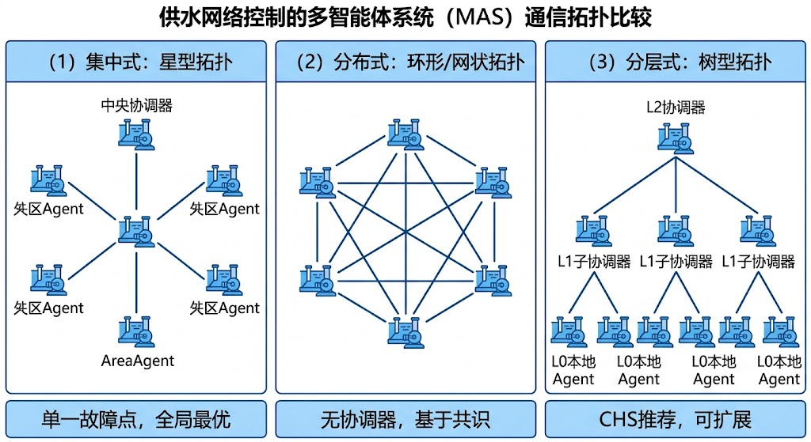

<!-- 变更日志
v2 2026-03-01: 基于 HydroClaw v0.2.2 代码全面重构，新增智能体通信(§7.5)、DAG编排(§7.6)、理论→实现对照(§7.7)；压缩Physical AI内容（共识证明、ADMM推导/数值示例、博弈矩阵），添加T2a交叉引用
v1 2026-02-16: 初稿（骨架版）
-->

# 第七章 多智能体系统理论与编排

---

## 学习目标

完成本章后，你应能够：

1. 解释多智能体系统（MAS）的四个建模要素，并将其映射到水网运行场景；
2. 推导线性共识协议的收敛条件，理解 Laplacian 矩阵在分布式协调中的作用；
3. 阐述消息驱动通信模型的三种模式（直发、发布-订阅、请求-响应），并设计智能体间的通信拓扑；
4. 构建任务依赖图（DAG），实现并行执行与故障自动重规划；
5. 对照 HydroClaw 的实际代码，将 MAS 理论概念映射到工程实现；
6. 设计 SCADA+MAS 融合架构中的分层 Agent 体系，理解岛式自治与优雅降级机制。

> **章首衔接（承接 ch06）**
> 上一章以"快慢思考"为主线，介绍了认知AI引擎的架构设计原理——Skill 提供确定性的快思考，Agent 提供灵活性的慢思考。但一个自然的问题随之而来：**当多个智能体同时在线时，它们如何通信、如何协商、如何在分歧中达成共识、如何将复杂任务分解为可并行执行的子任务？** 这正是多智能体系统（MAS）理论要回答的核心问题。本章从 MAS 的数学基础出发，逐步引入通信协议、编排机制和工程实现，帮助读者在理论与代码之间建立桥梁。

---

## 7.1 为什么需要多智能体？

### 7.1.1 物理直觉：水网天然是分布式的

考虑一个由 $n$ 个渠池串联组成的长距离调水系统。从物理角度看，每个渠池是一个独立的动态子系统，具有自己的水位状态 $h_i(t)$、入流 $Q_{i,\text{in}}(t)$ 和出流 $Q_{i,\text{out}}(t)$。渠池之间通过闸门或泵站相连，形成串联-分叉的拓扑结构。

如果用一个集中控制器同时控制所有 $n$ 个渠池的 $m$ 个执行器，控制器需要：
- 采集全部 $n$ 个渠池的传感器数据（通信带宽为 $O(n)$）；
- 求解一个维度为 $m \times N_p$ 的优化问题（$N_p$ 为预测时域，计算量为 $O(m^3 N_p^3)$）；
- 将控制指令下发到所有执行器（延迟为 $O(n)$）。

当 $n$ 从 3 增长到 30、300 时，集中方案面临三重瓶颈：**通信瓶颈**（数据汇聚到中心的带宽和延迟）、**计算瓶颈**（大规模优化问题的实时求解）、**可靠性瓶颈**（中心节点单点故障导致全系统瘫痪）。

这种物理上的分布式特征，天然适合用多个智能体分而治之：每个 Agent 负责一段渠池或一组设备，通过邻居间的信息交换实现全局协调。这就是 MAS 的工程动机。

### 7.1.2 从集中到协同的演进

水系统控制架构的演进，本质上是从集中到分布式的过程。表 7-1 概括了三个阶段。

**表 7-1 水系统控制架构演进**

| 阶段 | 时代 | 架构 | 代表 | 局限 |
|------|------|------|------|------|
| 集中控制 | 1990s | 单一控制器 | 早期 SCADA+PID | 单点故障；扩展性差 |
| 分层控制 | 2000s–2010s | HDC (L0/L1/L2) | 分层分布式 MPC | 层间耦合弱；缺乏灵活性 |
| 多智能体 | 2020s– | MAS = HDC + ODD + 认知智能 | SCADA+MAS 融合 | 需要新的理论保障 |

第一阶段的集中控制虽然简单直接，但在工程规模扩大后暴露出可扩展性和可靠性问题。第二阶段引入分层分布式控制（HDC），通过"安全层（L0）→调节层（L1）→协调层（L2）→规划层（L3）"的层级结构缓解了计算和通信瓶颈（详见 T2a 第十二章）。但 HDC 的层间关系是静态的，缺乏运行时的动态适应能力。

第三阶段的 MAS 在 HDC 基础上增加了两个关键维度：**运行设计域（ODD）** 确保每个 Agent 在已验证的安全包络内运行（详见第八章），**认知智能** 赋予 Agent 语义理解和自主推理能力（详见第六章）。Lei 2025a 将这一关系总结为：

$$
\text{MAS} = \text{HDC} + \text{ODD} + \text{认知智能} \tag{7-1}
$$

这个公式的含义是：多智能体系统不是凭空构建的，而是在分层分布式控制这一成熟框架之上，叠加安全保障和认知能力。HDC 提供控制骨架，ODD 提供安全包络，认知智能提供灵活决策。三者缺一不可。

为了帮助读者把 MAS 与 T2a/T2b 的知识体系对齐，同时理解它与 WNAL 自治等级的关系，可参照表 7-2 的映射。每一类 Agent 都有明确的物理AI底座（T2a 提供的确定性能力）和认知AI增强（T2b 提供的快慢思考能力），共同决定系统能否从 L2 辅助决策跃迁到 L3 条件自主。

[表7-2: MAS Agent 类型与 T2a/T2b 能力映射]
| MAS 层/Agent 类型 | HydroClaw 示例 | T2a 基础能力（物理AI） | T2b 增强能力（认知AI） | 对 WNAL 的作用 |
|------------------|----------------|-------------------------|-------------------------|----------------|
| 监测 / 安全代理 | SafetyAgent、HealthMonitor | ch10 安全包络 + ch11 状态估计，定义红/黄/绿区并提供可信测量 | ch06 §6.5 ODD 审核 + 语义化异常解释 | 守住 L2/L3 分界，决定是否放权给慢思考 |
| 控制执行代理 | FlowControl、PumpAgent | ch05-7 PID/MPC/DMPC，保证执行链的确定性与可回退 | ch06 §6.4 Skill 化工作流，确保调用顺序与审计 | 提供 L2 基线能力，是 L3 条件自主的可信 fallback |
| 协调 / 路由代理 | Coordinator、Planner、Executor | ch12 HDC 分层架构，解决站际耦合与通信拓扑 | 本章 §7.5-7.6 消息总线 + DAG 编排，支持并行与重规划 | 把多 Agent 协同封装成可验证的调度图，支撑 L3 多任务自治 |
| 知识 / 分析代理 | Handuo（RAG）、ReasoningAgent | ch14-15 工程案例与经验库，提供可追溯的物理依据 | ch06 §6.6 认知 API + RAG，生成解释与知识引用 | 生成"想得清"的解释链，满足 L3 对可解释性的治理要求 |

### 7.1.3 多智能体的三个核心问题

确立了 MAS 的工程动机后，我们可以提炼出三个核心理论问题：

**问题一：共识（Consensus）**——多个 Agent 如何在分布式条件下，仅通过邻居间通信达成一致？例如，相邻渠池的水位控制 Agent 需要就协调流量达成共识。

**问题二：协调（Coordination）**——当多个 Agent 的目标存在冲突时，如何权衡取舍？例如，上游 Agent 希望快速泄水，下游 Agent 希望维持水位，两者如何协商？

**问题三：编排（Orchestration）**——当面对复杂任务时，如何将其分解为可并行执行的子任务，并分配给最合适的 Agent？例如，一次洪水预警处置需要预报、预警、预演、预案四个步骤，如何编排它们的执行顺序和依赖关系？

本章将依次回答这三个问题。§7.2-7.3 回答前两个，§7.4-7.6 回答第三个，§7.7 将理论映射到 HydroClaw 的工程实现。

---
n

> 图7-1: 集中式、分布式与层级式三种多智能体通信拓扑的对比


## 7.2 MAS 建模要素

### 7.2.1 智能体集合与能力描述

一个多智能体系统首先需要定义**智能体集合** $\mathcal{A} = \{a_1, a_2, \ldots, a_n\}$。每个智能体 $a_i$ 是一个具有自主决策能力的计算实体，拥有三个核心属性：

**（1）感知（Perception）**：$a_i$ 能够观测环境状态的一个子集 $\mathbf{y}_i(t) \subseteq \mathbf{y}(t)$。在水网中，这对应传感器量测——某个 Agent 只能"看到"它管辖区域的水位、流量和闸位。

**（2）决策（Decision）**：$a_i$ 根据观测和目标，选择动作 $\mathbf{u}_i(t)$。决策过程可以是基于规则的（如 PID），基于优化的（如 MPC），或基于推理的（如 LLM 驱动的分析）。

**（3）执行（Action）**：$a_i$ 通过执行器将决策付诸实施。在水网中，这对应闸门开度调整、泵站启停或流量设定值变更。

除了这三个通用属性，每个智能体还需要一个**能力描述符**（Capability Descriptor），声明该 Agent 擅长什么。HydroClaw 用 `AgentCard` 数据类实现这一概念：

```python
@dataclass
class AgentCard:
    """智能体名片：声明身份与能力"""
    name: str                    # 智能体名称
    description: str             # 功能描述
    capabilities: List[str]      # 能力列表，如 ["simulation", "safety_check"]
    input_schema: Dict           # 接受的输入格式（JSON Schema）
    output_schema: Dict          # 输出格式
    version: str = "0.1.0"
```

能力描述符的作用在于**动态发现**：编排器（Orchestrator）不需要硬编码"分析任务找分析 Agent"的规则，而是根据任务需求查询注册中心，找到声明了匹配能力的 Agent。这种松耦合设计使系统可以在运行时添加新 Agent 而无需修改编排逻辑。

### 7.2.2 状态空间与共享上下文

MAS 的全局状态可以表示为所有 Agent 局部状态的联合：

$$
\mathbf{x}(t) = [\mathbf{x}_1(t)^T, \mathbf{x}_2(t)^T, \ldots, \mathbf{x}_n(t)^T]^T \tag{7-2}
$$

其中 $\mathbf{x}_i(t) \in \mathbb{R}^{n_i}$ 是 Agent $a_i$ 的局部状态向量。在水网中，$\mathbf{x}_i$ 通常包含该 Agent 管辖渠池的水位、流量和执行器状态。

在实际系统中，Agent 之间需要共享部分状态信息以实现协调。HydroClaw 引入了**共享黑板**（Shared Blackboard）的概念，称为 `AgentContext`：

```python
context = {
    "task_id": "leak-diagnosis-001",
    "initiator": "orchestrator",
    "shared_state": {
        "water_balance_result": {...},  # 水平衡计算结果
        "anomaly_zones": ["zone_3", "zone_7"],  # 异常区域
    },
    "execution_trace": [
        {"agent": "analysis", "action": "water_balance", "result": "deficit_detected"},
        {"agent": "safety", "action": "odd_check", "result": "normal"},
    ]
}
```

共享黑板遵循"写入-读取"模型：每个 Agent 完成子任务后将结果写入黑板，后续 Agent 读取前序结果作为输入。这避免了 Agent 之间的直接耦合——它们通过黑板间接通信。

### 7.2.3 通信拓扑与消息模型

Agent 之间的通信关系可以用**通信图** $\mathcal{G} = (\mathcal{V}, \mathcal{E})$ 表示，其中 $\mathcal{V} = \mathcal{A}$ 是节点集（即 Agent 集合），$\mathcal{E} \subseteq \mathcal{V} \times \mathcal{V}$ 是边集，$(a_i, a_j) \in \mathcal{E}$ 表示 $a_i$ 可以向 $a_j$ 发送消息。

通信图可以是：
- **完全图**：任意两个 Agent 都可直接通信。适合小规模系统（$n \leq 5$），但通信开销为 $O(n^2)$。
- **链式图**：Agent 仅与相邻 Agent 通信。适合串联渠池系统，通信开销为 $O(n)$，但信息传播需要 $O(n)$ 步。
- **星形图**：所有 Agent 与中心 Agent 通信。适合有编排器的系统，中心 Agent 承担协调职责。
- **分层图**：Agent 按层级组织，上级 Agent 协调下级。适合 HDC 架构。

通信图的**连通性**是共识算法收敛的必要条件。一个重要结论是（Olfati-Saber et al., 2007）：

> **引理 7-1**（共识收敛的必要条件）：线性共识算法收敛当且仅当通信图 $\mathcal{G}$ 包含有向生成树。

这意味着至少存在一个 Agent 能够通过有向路径将信息传递到所有其他 Agent。在水网运行中，这个条件通常由 SCADA 主站或编排器（Orchestrator）保证——它作为生成树的根节点，能够将信息广播到所有 Agent。

### 7.2.4 目标函数与约束

MAS 的全局目标函数通常是各 Agent 局部目标的某种聚合：

$$
J_{\text{global}} = \sum_{i=1}^{n} w_i \cdot J_i(\mathbf{x}_i, \mathbf{u}_i) + \lambda \cdot J_{\text{coupling}}(\mathbf{x}, \mathbf{u}) \tag{7-3}
$$

其中 $J_i$ 是 Agent $a_i$ 的局部目标（如水位跟踪误差），$J_{\text{coupling}}$ 是耦合项（如相邻渠池流量一致性约束），$w_i$ 和 $\lambda$ 是权重。实际应用中，通常对各项进行归一化处理（除以各自的参考值量级），使 $J_i$ 和 $J_{\text{coupling}}$ 均为无量纲量，此时 $w_i$ 和 $\lambda$ 为无量纲权重，反映设计者对局部性能与全局协调的相对偏好。

耦合约束是 MAS 问题的核心难点。在水网中，典型的耦合约束包括：

- **流量连续性**：$Q_{i,\text{out}} = Q_{i+1,\text{in}}$（串联渠池的出流等于下游入流）
- **水量守恒**：$\sum_{i} Q_{i,\text{out}} \leq Q_{\text{source}}$（所有分水口总流量不超过水源供给能力）
- **安全包络**：$h_{i,\min} \leq h_i(t) \leq h_{i,\max}$（每个渠池水位在安全范围内）

当各 Agent 独立优化自己的 $J_i$ 时，如果不考虑耦合约束，可能导致"上游放水太快、下游来不及排水"的冲突。解决这种冲突的方法，正是共识协议和分布式优化的主题。

---

## 7.3 共识协议与协调机制

### 7.3.1 共识问题的数学定义

**定义 7-1（共识）**：给定 $n$ 个 Agent 的初始状态 $x_i(0)$，若存在更新规则 $x_i(k+1) = f_i(x_i(k), \{x_j(k) : j \in \mathcal{N}_i\})$，使得对所有 $i, j$，

$$
\lim_{k \to \infty} \|x_i(k) - x_j(k)\| = 0 \tag{7-4}
$$

则称 Agent 达成了**共识**。其中 $\mathcal{N}_i = \{j : (j,i) \in \mathcal{E}\}$ 是 Agent $a_i$ 的邻居集。

共识的物理含义是：所有 Agent 最终收敛到同一个值，且这个值仅通过邻居间的局部通信获得，不需要全局信息汇聚。

### 7.3.2 线性共识算法

最基本的共识算法是**线性平均共识**（Olfati-Saber et al., 2007）：

$$
x_i(k+1) = x_i(k) + \epsilon \sum_{j \in \mathcal{N}_i} [x_j(k) - x_i(k)] \tag{7-5}
$$

其中 $\epsilon > 0$ 是步长。矩阵形式为 $\mathbf{x}(k+1) = (\mathbf{I} - \epsilon \mathbf{L}) \mathbf{x}(k)$，$\mathbf{L}$ 是通信图的 Laplacian 矩阵。当通信图连通且步长选取合适时，所有 Agent 的状态收敛到初始值的平均（收敛性的完整数学证明涉及 Laplacian 矩阵的谱分析，详见 T2a 第十二章 §12.5）。

**工程意义**：在水网中，共识算法可以用于多个渠池 Agent 协商**协调流量**。例如，5 个串联渠池的 Agent 各自根据本地水位计算期望流量，然后通过式（7-5）的迭代交换，最终收敛到一个全局一致的协调流量值。这比集中式"所有数据汇总到中心计算"的方式更具鲁棒性——即使某个 Agent 暂时失联，其余 Agent 仍可在子图上达成局部共识。

### 7.3.3 博弈论与冲突仲裁

共识算法假设所有 Agent 的目标一致（或至少不冲突）。但在实际水网运行中，Agent 之间经常存在**目标冲突**：

- **上下游冲突**：上游 Agent 希望尽快泄洪以降低本地水位，下游 Agent 希望控制入流以避免超蓄。
- **供水-发电冲突**：在水电站系统中，发电 Agent 希望维持高水位以最大化发电水头，供水 Agent 希望放水以满足下游用水需求。
- **安全-效率冲突**：安全 Agent 要求保守操作（留有裕度），效率 Agent 追求最优性能（逼近边界）。

博弈论为分析这类冲突提供了数学工具。考虑 $n$ 个 Agent 的策略空间 $\mathcal{U}_1 \times \mathcal{U}_2 \times \cdots \times \mathcal{U}_n$，每个 Agent 的收益函数 $J_i(\mathbf{u}_i, \mathbf{u}_{-i})$ 不仅取决于自己的策略 $\mathbf{u}_i$，还取决于其他 Agent 的策略 $\mathbf{u}_{-i}$。

**定义 7-2（Nash 均衡）**（Nash, 1950）：策略组合 $(\mathbf{u}_1^*, \ldots, \mathbf{u}_n^*)$ 是 Nash 均衡，若对所有 $i$ 和所有 $\mathbf{u}_i \in \mathcal{U}_i$：

$$
J_i(\mathbf{u}_i^*, \mathbf{u}_{-i}^*) \geq J_i(\mathbf{u}_i, \mathbf{u}_{-i}^*) \tag{7-6}
$$

即没有任何 Agent 能通过单方面改变策略来提高自己的收益。

在水网博弈中，Nash 均衡不一定是社会最优（Pareto 最优）——各 Agent 各自最优化本地目标的结果，可能导致全系统效率低于协调方案。更关键的是，当存在安全约束（如下游超蓄风险）时，纯经济博弈的均衡点可能落在不安全区间内。因此水网 MAS 通常采用两种机制将非合作博弈转化为约束合作博弈：

**（1）协调博弈**：引入耦合约束或协调信号。ADMM 算法（§7.3.4）正是这种方法的数学实现——通过"价格更新"机制引导各 Agent 向全局一致解收敛。

**（2）仲裁机制**：引入仲裁者（Arbitrator），当 Agent 之间无法自行达成共识时，由仲裁者做出裁决。在 HydroClaw 中，Orchestrator 承担仲裁角色——当多个 Agent 对同一问题给出冲突建议时，Orchestrator 根据优先级规则选择最终方案，且 SafetyAgent 拥有最高否决权。

### 7.3.4 分布式优化：ADMM 方法

交替方向乘子法（ADMM）是将大规模耦合优化问题分解为多个子问题的经典方法（Boyd et al., 2011），特别适合 MAS 场景。其核心思想是：每个 Agent 独立求解自己的**局部子问题**，然后通过交换边界信息完成**全局协调**，经过若干轮"局部优化—全局协调—价格更新"迭代后收敛到全局一致解。

ADMM 的完整数学推导（包括增广 Lagrange 函数构造、三步迭代公式及其凸优化收敛性证明）已在 T2a 第七章 §7.7 中详细给出。此处关注 ADMM 在 MAS 场景下的**工程含义**：

- **局部优化**：每个 Agent 只需求解与自身规模相当的子问题，计算可完全并行；
- **全局协调**：Agent 之间仅交换边界变量（而非全部状态），通信量从集中式的 $O(n^2)$ 降为 $O(n)$；
- **价格更新**：对偶变量可理解为"协调价格"——当某个 Agent 的局部解偏离全局一致值时，价格机制自动施加惩罚，引导其向一致方向调整。

ADMM 在水网中的典型应用是**分布式 MPC**。每个渠池 Agent 求解本地 MPC 子问题，然后将边界流量与邻居 Agent 交换，经迭代后收敛到全局协调解。当目标函数为凸函数（如 MPC 的二次目标）时，ADMM 以 $O(1/k)$ 速率收敛到全局最优（Boyd et al., 2011; Negenborn et al., 2009）。

从 MAS 编排的视角看，ADMM 是 Agent 间实现**分布式协调**的数学基础——它让"各管一段、协商共赢"成为可计算的操作，而非仅仅是设计理念。

---

## 7.4 SCADA+MAS 融合架构

### 7.4.1 三层融合架构

SCADA+MAS 融合架构的核心理念是：**不是用 MAS 替代 SCADA，而是在 SCADA 之上叠加 MAS 的协调与决策能力**。SCADA 提供可靠的数据采集和执行通道，MAS 提供智能的分析、协调和决策。两者的关系类似于操作系统与应用程序——SCADA 是"操作系统"，MAS Agent 是"应用程序"。

融合架构分为三层（Lei 2025b）：

**现场层（Field Layer）**：由 SCADA 终端（RTU/PLC）直接管理。负责传感器数据采集（水位、流量、闸位、电压等）和执行器控制（闸门开度、泵站启停）。这一层的响应速度为毫秒级，由硬连线逻辑保证确定性。

**协调层（Coordination Layer）**：由区域 Agent 管理。每个区域 Agent 负责若干渠池或设备组的协调优化，运行本地 MPC 或规则引擎，与邻居 Agent 通过 ADMM 或共识协议交换边界信息。协调层的响应速度为秒到分钟级。

**认知层（Cognitive Layer）**：由中心 Agent（编排器、规划器、分析器等）管理。负责全局态势感知、异常诊断、应急预案和知识管理。认知层运行大语言模型驱动的推理，响应速度为秒到分钟级。

三层之间的通信遵循严格的接口规范：现场层通过 SCADA 协议（OPC UA / Modbus）上报数据，协调层通过消息总线与认知层交互，认知层通过 MCP 工具协议调用底层计算服务。

### 7.4.2 云-域-边 Agent 层级

SCADA+MAS 融合架构中的 Agent 按部署位置分为三级：

**边缘 Agent（Edge Agent）**：部署在现场边缘设备（工控机/边缘盒子）上，靠近传感器和执行器。职责包括：本地 PID/MPC 控制、传感器数据滤波、执行器状态监测、安全联锁。边缘 Agent 必须具备**岛式自治**能力——当通信中断时，能够独立维持安全运行。

**域 Agent（Area Agent）**：部署在区域数据中心（或云端分区），管理若干边缘 Agent。职责包括：区域协调优化（DMPC）、跨设备故障诊断、区域安全评估。域 Agent 通过消息总线与边缘 Agent 和其他域 Agent 通信。

**云 Agent（Cloud Agent）**：部署在云端，拥有全局视野。职责包括：全网态势分析、长期调度优化、知识管理、自进化分析。云 Agent 是认知层的主要承载者。

这三级结构与 HDC 的四层（L0 安全/L1 调节/L2 协调/L3 规划）并非简单对应，而是正交关系：L0 安全层跨越边缘和域两级，L1 调节层主要在边缘级，L2 协调层在域级，L3 规划层在云级。

### 7.4.3 L0 安全底板

安全底板是 MAS 架构中最不可妥协的设计：**无论上层 Agent 如何决策，L0 安全层始终在线，具有绝对否决权**。

L0 安全底板的设计原则：
- **硬连线**：由 PLC 固化的联锁逻辑实现，不依赖任何软件 Agent；
- **始终在线**：即使所有上层 Agent 全部离线，L0 仍然有效；
- **否决权**：当检测到安全包络被触碰时，L0 直接触发保护动作（紧急关闸、停泵），不需要等待上层 Agent 的确认；
- **不可被上层覆盖**：上层 Agent 的控制指令必须通过 L0 的安全检查才能下发到执行器。

在 HydroClaw 中，SafetyAgent 实现了 L0 的软件层面对应。它将 ODD 检查分为三个区间：

```python
def check_state(self, state: Dict) -> Dict:
    """三区间 ODD 检查"""
    zone = self.odd.classify(state)
    if zone == "normal":
        return {"approved": True, "zone": "normal"}
    elif zone == "extended":
        return {"approved": False, "zone": "extended",
                "action": "request_human_confirmation"}
    else:  # mrc
        return {"approved": False, "zone": "mrc",
                "action": "trigger_minimum_risk_state",
                "mrc_actions": self._generate_mrc_actions(state)}
```

绿区（normal）放行，黄区（extended）需人工确认，红区（mrc）否决并触发最小风险状态方案。SafetyAgent 对所有 Agent 的决策拥有绝对否决权——这是 CHS 体系中"安全>效率>舒适"优先级排序的技术体现。

### 7.4.4 岛式自治与优雅降级

分布式系统的一个关键优势是**优雅降级**（Graceful Degradation）：当部分组件失效时，系统性能下降但不完全崩溃。MAS 架构通过**岛式自治**（Island Autonomy）实现这一特性。

岛式自治的核心思想：每个 Agent 预存一套降级策略，当检测到通信中断或上级 Agent 失联时，自动切换到本地自治模式：

**降级级别 1——协调中断**：域 Agent 与云 Agent 失联。域 Agent 继续运行本地 DMPC，使用最后一次有效的协调参数。边缘 Agent 不受影响。

**降级级别 2——域 Agent 失联**：边缘 Agent 与域 Agent 失联。边缘 Agent 切换到本地 PID 控制，使用预设的水位设定值。安全联锁不受影响。

**降级级别 3——边缘 Agent 失联**：PLC 安全联锁仍然有效。闸门/泵站按"最后已知安全状态"锁定，等待人工介入。

恢复路径是降级路径的逆过程：通信恢复后，Agent 自动从低级模式逐步升级到高级模式，每次升级前进行状态一致性检查。

**表 7-3 降级级别与自治能力**

| 降级级别 | 失联范围 | 控制模式 | 性能影响 | 安全保障 |
|---------|---------|---------|---------|---------|
| 0（正常） | 无 | MAS 全功能 | 最优 | 全保障 |
| 1 | 云↔域 | 域内 DMPC | 全局协调失效，域内正常 | 全保障 |
| 2 | 域↔边缘 | 本地 PID | 无协调优化，本地稳定 | L0 联锁有效 |
| 3 | 全断 | PLC 联锁 | 冻结最后安全状态 | 仅硬件联锁 |

这种逐级降级的设计，确保了水网在最恶劣通信条件下的基本安全。

---

## 7.5 智能体通信原理

上述理论框架假设 Agent 之间"可以通信"，但没有详细讨论"怎么通信"。本节从工程实现角度，介绍 MAS 的通信机制。

### 7.5.1 消息驱动通信模型

在 MAS 中，Agent 之间的通信通过**消息**（Message）进行。与传统的函数调用不同，消息通信是异步的、松耦合的——发送方不需要等待接收方立即响应，甚至不需要知道接收方的具体身份。

HydroClaw 定义了一个结构化的消息模型：

```python
@dataclass
class AgentMessage:
    """智能体消息"""
    id: str                  # 消息唯一标识
    type: str                # 类型: REQUEST / RESPONSE / EVENT / ERROR / HEARTBEAT
    sender: str              # 发送方 Agent 名称
    receiver: str            # 接收方 Agent 名称（直发）或 topic（发布-订阅）
    content: Dict            # 消息内容（JSON 可序列化）
    priority: str = "NORMAL" # 优先级: LOW / NORMAL / HIGH / CRITICAL
    timestamp: str = ""      # ISO 8601 时间戳
    correlation_id: str = "" # 关联ID（用于请求-响应配对）
    user_id: str = ""        # 用户标识
    role: str = ""           # 用户角色
    session_id: str = ""     # 会话标识
```

消息类型的设计遵循**FIPA ACL 标准**（FIPA, 2002）的精神，但做了面向水利领域的简化：

- **REQUEST**：请求对方执行某个动作（如"请计算3号渠池的水平衡"）
- **RESPONSE**：对 REQUEST 的响应，包含执行结果
- **EVENT**：事件通知，不需要响应（如"水位超过预警阈值"）
- **ERROR**：错误报告（如"模型计算发散"）
- **HEARTBEAT**：心跳检查，用于 Agent 之间的健康监测

优先级从 LOW 到 CRITICAL 共四级。CRITICAL 级消息（如安全告警）总是优先处理，即使消息队列中有排在前面的低优先级消息。这保证了安全信息不会因为队列拥塞而延迟。

### 7.5.2 三种通信模式

MessageBus（消息总线）支持三种通信模式，覆盖了 MAS 的典型通信需求：

**（1）直发模式（Direct Messaging）**

发送方指定接收方的名称，消息直接送达：

```python
# Agent A 向 Agent B 发送请求
bus.send(AgentMessage(
    type="REQUEST",
    sender="analysis_agent",
    receiver="safety_agent",
    content={"action": "odd_check", "state": current_state}
))
```

直发模式适用于 Agent 之间的**点对点交互**，例如分析 Agent 请求安全 Agent 进行 ODD 检查。

**（2）发布-订阅模式（Publish/Subscribe）**

发送方将消息发布到**主题**（Topic），所有订阅了该主题的 Agent 都会收到消息（Eugster et al., 2003）：

```python
# 订阅水位告警主题
bus.subscribe("water_level_alarm", callback=self.handle_alarm)

# 发布水位告警事件
bus.publish("water_level_alarm", AgentMessage(
    type="EVENT",
    sender="monitoring_agent",
    content={"pool_id": 3, "level": 45.2, "threshold": 44.5}
))
```

发布-订阅模式适用于**一对多**通知，例如水位超限告警需要同时通知安全 Agent、调度 Agent 和报告 Agent。发布方不需要知道有哪些 Agent 订阅了该主题，这实现了发布方与订阅方之间的完全解耦。

**（3）请求-响应模式（Request/Response）**

发送方发送请求后等待响应，带有超时机制：

```python
# 发送请求并等待响应（超时 30 秒）
response = await bus.request(
    receiver="simulation_agent",
    content={"action": "simulate_scenario", "params": {...}},
    timeout=30.0
)
```

请求-响应模式适用于需要**同步等待结果**的场景，例如编排器请求仿真 Agent 计算一个方案的效果。超时机制防止 Agent 因等待一个已失效的 Agent 而永久阻塞。

**表 7-4 三种通信模式对比**

| 模式 | 耦合度 | 适用场景 | 延迟 | 可靠性保障 |
|------|--------|---------|------|-----------|
| 直发 | 中（需知道接收方名称） | 点对点交互 | 低 | 需确认机制 |
| 发布-订阅 | 低（不需知道接收方） | 事件广播、告警 | 中 | 尽力而为 |
| 请求-响应 | 高（同步等待） | 需要结果的调用 | 高 | 超时+重试 |

### 7.5.3 能力注册与发现

在 MAS 中，编排器不应硬编码"分析任务找分析 Agent"的规则——这会导致紧耦合和可扩展性差。正确的做法是**能力注册与发现**：每个 Agent 在启动时向注册中心声明自己的能力，编排器根据任务需求查询注册中心，找到最匹配的 Agent。

HydroClaw 的 `AgentRegistry` 实现了这一机制：

```python
class AgentRegistry:
    """智能体注册中心"""

    def register(self, agent: BaseAgent):
        """注册 Agent 及其能力"""
        self.agents[agent.name] = agent
        for cap in agent.get_capabilities():
            self.capability_index[cap].append(agent.name)

    def find_best_agent(self, capability: str) -> Optional[BaseAgent]:
        """按能力查找最佳 Agent（健康感知）"""
        candidates = self.capability_index.get(capability, [])
        if not candidates:
            return None
        # 按错误率升序、响应延迟升序排序，选择最佳候选
        return min(candidates, key=lambda name: (
            self.agents[name].error_rate,
            self.agents[name].avg_latency
        ))
```

注册中心的**健康感知**特性值得强调：当多个 Agent 都声明了相同能力时，注册中心不是随机选择，而是根据 Agent 的实时健康状态（错误率、响应延迟）选择最佳候选。这使得系统在某个 Agent 性能下降时，自动将任务路由到更健康的 Agent——无需人工干预。

### 7.5.4 通信故障处理

分布式系统中，通信故障是常态而非异常。MAS 的通信层必须设计完善的故障处理策略：

**（1）心跳检测**：Agent 之间定期交换 HEARTBEAT 消息。如果连续 $k$ 个心跳周期没有收到某 Agent 的心跳，则标记该 Agent 为"疑似离线"，通知注册中心更新健康状态。

**（2）消息确认与重发**：对于 REQUEST 类型的关键消息，接收方需要返回 ACK。如果发送方在超时时间内未收到 ACK，自动重发（最多 $n$ 次）。

**（3）消息持久化**：对于 CRITICAL 优先级的消息（如安全告警），MessageBus 在发送前将消息持久化到本地存储，确保即使通信模块重启也不会丢失。

**（4）降级路由**：当目标 Agent 不可达时，消息总线尝试将消息路由到声明了相同能力的备用 Agent（通过注册中心查询）。

这些策略确保了 MAS 通信在网络抖动、Agent 故障等不理想条件下的基本可靠性。

---

## 7.6 DAG 编排原理

当一个复杂任务涉及多个 Agent 的协同工作时，需要一个**编排机制**来分解任务、确定执行顺序、并行执行独立子任务、处理失败。有向无环图（DAG）是描述任务依赖关系的自然工具。

### 7.6.1 任务依赖图的构建

**定义 7-3（任务 DAG）**：任务依赖图 $G_T = (V_T, E_T)$ 是一个有向无环图，其中 $V_T = \{t_1, t_2, \ldots, t_m\}$ 是任务节点集，$E_T \subseteq V_T \times V_T$ 是依赖关系集。$(t_i, t_j) \in E_T$ 表示 $t_j$ 依赖 $t_i$ 的输出——$t_i$ 必须在 $t_j$ 之前完成。

例如，考虑"水平衡异常诊断"任务，可以分解为以下子任务：

```
t1: 采集实时数据（SCADA数据拉取）
t2: 水平衡计算（需要 t1 的数据）
t3: 异常检测（需要 t2 的计算结果）
t4: ODD 安全检查（需要 t1 的数据，与 t2/t3 独立）
t5: 定位分析（需要 t3 的异常检测结果和 t4 的安全状态）
t6: 生成报告（需要 t5 的定位结果）
```

依赖关系为：$t_1 \to t_2 \to t_3 \to t_5 \to t_6$，$t_1 \to t_4 \to t_5$。这是一个典型的**菱形 DAG**——$t_2 \to t_3$ 和 $t_4$ 可以并行执行，因为它们互不依赖。

HydroClaw 的 `PlanningAgent` 用两种方式构建 DAG：

**（1）模板规划**：对于常见任务，预定义 DAG 模板。例如"漏损诊断"任务有一个固定的六步模板，每一步指定了执行 Agent 和所需工具。

```python
TEMPLATES = {
    "leak_diagnosis": TaskPlan(tasks=[
        TaskNode(id="t1", agent="data", tool="fetch_scada", depends=[]),
        TaskNode(id="t2", agent="analysis", tool="water_balance", depends=["t1"]),
        TaskNode(id="t3", agent="analysis", tool="anomaly_detect", depends=["t2"]),
        TaskNode(id="t4", agent="safety", tool="odd_check", depends=["t1"]),
        TaskNode(id="t5", agent="analysis", tool="localize", depends=["t3", "t4"]),
        TaskNode(id="t6", agent="report", tool="generate_report", depends=["t5"]),
    ])
}
```

**（2）LLM 增强规划**：对于没有预定义模板的新任务，PlanningAgent 利用大语言模型进行动态任务分解。LLM 接收任务描述和可用 Agent/工具列表，输出 JSON 格式的 DAG 定义。PlanningAgent 对 LLM 的输出进行**DAG 合法性验证**——通过深度优先搜索检测是否存在环路：

```python
def _validate_dag(self, plan: TaskPlan) -> bool:
    """DFS 检测环路"""
    visited, in_stack = set(), set()
    def dfs(node_id):
        if node_id in in_stack:
            return False  # 发现环路
        if node_id in visited:
            return True
        visited.add(node_id)
        in_stack.add(node_id)
        for dep in plan.get_dependents(node_id):
            if not dfs(dep):
                return False
        in_stack.remove(node_id)
        return True
    return all(dfs(t.id) for t in plan.tasks if t.id not in visited)
```

如果 LLM 生成了包含环路的无效 DAG，PlanningAgent 会将错误信息反馈给 LLM 要求重新规划。

### 7.6.2 拓扑排序与并行执行

DAG 的执行遵循**拓扑排序**（Topological Sort）：将任务节点排列成一个线性序列，使得对于每条边 $(t_i, t_j) \in E_T$，$t_i$ 出现在 $t_j$ 之前。

关键优化在于：**没有依赖关系的任务可以并行执行**。HydroClaw 的 `MultiAgentExecutor` 实现了这一逻辑：

```python
async def execute_plan(self, plan: ExecutionPlan) -> Dict:
    """按 DAG 拓扑顺序执行，独立任务并行"""
    topo_order = self._topological_sort(plan)
    for level in topo_order:
        # 同一层级的任务没有互相依赖，可以并行
        tasks = [self._execute_task(t) for t in level]
        results = await asyncio.gather(*tasks, return_exceptions=True)
        for task, result in zip(level, results):
            if isinstance(result, Exception):
                task.status = TaskStatus.FAILED
                task.error = str(result)
            else:
                task.status = TaskStatus.COMPLETED
                task.result = result
```

以水平衡异常诊断为例，执行过程为：
- **第 0 层**：$t_1$（数据采集）→ 单独执行
- **第 1 层**：$t_2$（水平衡计算）和 $t_4$（ODD 检查）→ **并行执行**
- **第 2 层**：$t_3$（异常检测）→ 等待 $t_2$ 完成
- **第 3 层**：$t_5$（定位分析）→ 等待 $t_3$ 和 $t_4$ 完成
- **第 4 层**：$t_6$（生成报告）→ 等待 $t_5$ 完成

并行执行的收益取决于 DAG 的**宽度**（同一层级的最大任务数）和各任务的执行时间。对于上述例子，$t_2$ 和 $t_4$ 的并行使得总时间从 6 步减少到 5 步；如果 $t_4$（ODD 检查）比 $t_2+t_3$（水平衡+异常检测）更快完成，并行的收益更加明显。

### 7.6.3 故障处理与自动重规划

DAG 执行过程中，某个任务可能因为 Agent 超时、计算错误或外部条件变化而失败。故障处理策略分为三级：

**（1）重试（Retry）**：对于可能因瞬态原因失败的任务（如网络抖动导致的数据采集失败），自动重试若干次。重试采用**指数退避**策略——第 $k$ 次重试的等待时间为 $T_0 \cdot 2^k$，避免在系统繁忙时雪崩式重试。

**（2）替代路由（Fallback）**：如果重试仍然失败，尝试将任务路由到声明了相同能力的其他 Agent。例如，如果 `analysis_agent_1` 超时，注册中心查找是否有 `analysis_agent_2` 可以替代。

**（3）自动重规划（Replanning）**：如果某个任务不可恢复地失败，PlanningAgent 重新规划剩余任务。重规划的原则是**保留已完成的工作**——只重新规划失败任务及其下游依赖：

```python
def replan(self, plan: TaskPlan, failed_task_id: str) -> TaskPlan:
    """重规划：移除失败任务及其传递依赖，保留已完成工作"""
    affected = self._find_transitive_dependents(plan, failed_task_id)
    remaining = [t for t in plan.tasks
                 if t.id not in affected and t.status != TaskStatus.COMPLETED]
    return self._create_new_plan(remaining)
```

例如，如果 $t_3$（异常检测）失败，其下游 $t_5$ 和 $t_6$ 也无法执行。重规划可能选择：跳过异常检测，直接基于水平衡结果生成一份"初步诊断报告"，标注异常检测未完成。

### 7.6.4 预置执行模式

除了从任务描述动态构建 DAG 外，MultiAgentExecutor 还提供三种预置执行模式，覆盖常见的编排模式：

**（1）顺序执行（Sequential）**：所有任务串行执行，每个任务的输出作为下一个任务的输入。适用于严格有序的流程。

**（2）并行执行（Parallel）**：所有任务同时启动，互不依赖。适用于独立的多方案对比。

**（3）扇出-扇入（Fan-Out-Fan-In）**：一个前序任务的输出分发给多个并行子任务，然后一个汇聚任务收集所有子任务的结果。适用于"多方案仿真对比"——先仿真 $k$ 个候选方案，然后比较结果选出最优。

```
[预处理] → [方案1][方案2][方案3] → [汇总比较]
           ↑ 扇出(Fan-Out) ↑      ↑ 扇入(Fan-In) ↑
```

四预闭环（参见第六章）中的"预演"步骤正是扇出-扇入模式的典型应用：先并行仿真多个调度方案，然后汇总比较选出最优方案。

---

## 7.7 从 MAS 理论到 HydroClaw 实现

本节将前六节的理论概念与 HydroClaw v0.2.2 的工程实现进行系统对照，帮助读者理解"理论如何落地"。

### 7.7.1 理论—实现对照表

**表 7-5 MAS 理论概念与 HydroClaw 实现对照**

| MAS 理论概念 | HydroClaw 实现 | 代码位置 | 关键设计 |
|-------------|---------------|---------|---------|
| 智能体集合 $\mathcal{A}$ | `BaseAgent` + 15 个域智能体 | `agents/base_agent.py` | 统一 ABC 接口，生命周期管理 |
| 能力描述符 | `AgentCard` + `get_capabilities()` | `agents/base_agent.py` | JSON Schema 输入输出定义 |
| 通信图 $\mathcal{G}$ | `MessageBus` 动态路由 | `agents/message.py` | 不依赖静态拓扑，按消息路由 |
| 共识协议 | Orchestrator 冲突仲裁 | `agents/orchestrator.py` | 优先级 + SafetyAgent 否决权 |
| 博弈/冲突 | `CapabilityNegotiator` 加权评分 | `agents/negotiation.py` | 五维加权：健康/错误率/延迟/亲和/负载 |
| 分布式优化 | DMPC via L0 Core 模块 | `core/control/` | ADMM 分解的 MPC 子问题 |
| 任务分解 | `PlanningAgent` + DAG 模板 | `agents/planning_agent.py` | 6 个预定义模板 + LLM 动态规划 |
| DAG 执行 | `MultiAgentExecutor` | `agents/executor.py` | 拓扑排序 + asyncio 并行 + 重试 |
| 注册中心 | `AgentRegistry` | `agents/registry.py` | 能力索引 + 健康感知选择 |
| 岛式自治 | 降级策略内置于各 Agent | 各 Agent 实现 | 三级降级 + 自动恢复 |

### 7.7.2 四级路由原理

HydroClaw 的 Orchestrator（编排器）是 MAS 的"交通中枢"。它接收用户请求或系统事件，决定由哪个 Skill 或 Agent 来处理。路由策略分为四个层级，从快到慢依次尝试：

**层级 1——技能触发短语匹配**

每个 Skill 注册了一组触发短语（trigger phrases），例如"四预闭环"、"漏损诊断"、"蒸发优化"。Orchestrator 首先检查用户输入是否包含这些短语。如果命中，直接路由到对应的 Skill——这是最快的路径，对应 Kahneman 的"快思考"（System 1）。

```python
def _match_skill(self, message: str) -> Optional[str]:
    """层级 1：技能触发短语匹配"""
    for skill_name, skill in self.skills.items():
        for phrase in skill.metadata.trigger_phrases:
            if phrase in message:
                return skill_name
    return None
```

**层级 2——工具关键词匹配**

如果没有命中 Skill 短语，Orchestrator 检查是否包含工具关键词（如"仿真"、"水平衡"、"ODD"）。如果命中，直接调用对应的 MCP 工具，跳过 Agent 推理环节。

**层级 3——能力路由**

如果前两层都未命中，说明请求需要推理能力。Orchestrator 查询 AgentRegistry，找到声明了最匹配能力的 Agent，将请求转发给它。选择时考虑 Agent 的健康状态——优先选择错误率低、响应快的 Agent。

**层级 4——规划分解**

如果请求涉及多个能力（跨域任务），Orchestrator 将请求转发给 PlanningAgent，由其分解为 DAG 并调度多个 Agent 协同执行。这是最慢但最灵活的路径，对应"慢思考"（System 2）。

四级路由的设计哲学是**能快则快，需慢才慢**。大部分日常请求通过层级 1-2 的快速路径处理，仅复杂异常和跨域任务才进入层级 3-4 的慢路径。

### 7.7.3 能力协商与加权评分

当层级 3 的能力路由发现多个 Agent 都声明了匹配能力时，如何选择最佳候选？HydroClaw 引入了**能力协商**（Capability Negotiation）机制，对候选 Agent 进行多维加权评分：

$$
S_i = w_h \cdot s_{i,\text{health}} + w_e \cdot s_{i,\text{error}} + w_l \cdot s_{i,\text{latency}} + w_a \cdot s_{i,\text{affinity}} + w_d \cdot s_{i,\text{load}} \tag{7-7}
$$

其中各维度的权重为：


**表7-6**

| 维度 | 符号 | 权重 | 含义 |
|------|------|------|------|
| 健康度 | $s_{i,\text{health}}$ | $w_h = 0.30$ | Agent 的运行状态评分 |
| 错误率 | $s_{i,\text{error}}$ | $w_e = 0.25$ | 历史错误比例（越低越好） |
| 响应延迟 | $s_{i,\text{latency}}$ | $w_l = 0.20$ | 平均响应时间（越短越好） |
| 能力亲和 | $s_{i,\text{affinity}}$ | $w_a = 0.15$ | 该能力的历史成功率 |
| 当前负载 | $s_{i,\text{load}}$ | $w_d = 0.10$ | 当前任务队列长度 |

这个评分机制类似于智能负载均衡——不是简单的轮询或随机分配，而是综合考虑 Agent 的实时状态和历史表现。表中的权重值（0.30/0.25/0.20/0.15/0.10）是 HydroClaw 的**推荐默认值**，工程部署时应根据具体场景调整。例如，在安全关键场景（如汛期调度）中，可将健康度权重 $w_h$ 提高到 0.40，同时降低负载权重；在对响应时间敏感的实时控制场景中，可提高 $w_l$ 到 0.30。

系统还会记录每种能力的"最佳 Agent"偏好，形成**经验学习**：如果某个 Agent 在"水平衡计算"任务上一直表现最好，系统会逐渐倾向于优先选择它。

与 MAS 理论中的**合同网协议**（Contract Net Protocol, Smith 1980）对比，HydroClaw 的能力协商简化了招标-投标过程——不需要 Agent 主动"竞标"，而是由注册中心根据公开指标直接打分排序。这种集中式评分在 Agent 数量可控（$n \leq 20$）的水网场景中更高效。

### 7.7.4 HydroClaw 七类域智能体

HydroClaw v0.2.2 包含 15 个 Agent，按功能分为七类：

**（1）Orchestrator（编排器）**：接收请求 → 四级路由 → 结果汇总。是 MAS 的"交通中枢"。

**（2）PlanningAgent（规划器）**：复杂任务分解为 DAG。6 个预定义模板 + LLM 动态规划。

**（3）AnalysisAgent（分析器）**：数据分析、水平衡计算、异常检测。是最"灵活"的 Agent，体现 MAS 的柔性推理能力。

**（4）ReportAgent（报告器）**：结果综合、可视化图表生成、报告文档编排。

**（5）SafetyAgent（安全守卫）**：ODD 三区间检查、否决权行使、最小风险状态触发。拥有对所有 Agent 的绝对否决权。

**（6）HanduoAgent（瀚铎/认知）**：RAG 知识检索、规程查询、领域问答。是"知识大脑"。

**（7）RLDispatchAgent（调度器）**：强化学习策略执行、规则回退、调度优化。

这七类 Agent 的分工体现了 MAS 理论中的**角色分化**（Role Differentiation）原则：每个 Agent 专注于一类任务，通过协同实现复杂功能。编排器是"管理者"，规划器是"参谋"，分析器是"分析师"，安全守卫是"安全官"。

---

## 7.8 例题

### 【例 7-1】多泵站协同调度的共识算法设计

**问题描述**：某长距离输水工程有 4 个串联泵站 $P_1, P_2, P_3, P_4$，各泵站的期望流量分别为 $Q_1^{(0)} = 48, Q_2^{(0)} = 52, Q_3^{(0)} = 45, Q_4^{(0)} = 55$（m³/s）。泵站之间通过通信链路相连，通信拓扑为链式图（$P_1-P_2-P_3-P_4$）。使用线性平均共识算法协商统一流量。

**已知**：通信图 Laplacian 矩阵

$$
\mathbf{L} = \begin{bmatrix} 1 & -1 & 0 & 0 \\ -1 & 2 & -1 & 0 \\ 0 & -1 & 2 & -1 \\ 0 & 0 & -1 & 1 \end{bmatrix}
$$

**求解**：（1）选择合适的步长 $\epsilon$；（2）计算收敛值；（3）迭代 10 步后的流量值。

**解题过程**：

（1）最大节点度 $d_{\max} = 2$，步长需满足 $0 < \epsilon < 1/d_{\max} = 0.5$。取 $\epsilon = 0.3$。

（2）由式（7-7），收敛值为初始值的平均：

$$
\bar{Q} = \frac{48 + 52 + 45 + 55}{4} = 50 \text{ m³/s}
$$

（3）迭代计算 $\mathbf{Q}(k+1) = (\mathbf{I} - 0.3 \mathbf{L}) \mathbf{Q}(k)$：


**表7-7**

| 迭代步 $k$ | $Q_1$ | $Q_2$ | $Q_3$ | $Q_4$ |
|-----------|-------|-------|-------|-------|
| 0 | 48.00 | 52.00 | 45.00 | 55.00 |
| 1 | 49.20 | 49.90 | 48.10 | 52.00 |
| 2 | 49.41 | 49.58 | 49.27 | 50.83 |
| 5 | 49.95 | 50.02 | 49.97 | 50.03 |
| 10 | 50.00 | 50.00 | 50.00 | 50.00 |

**结果讨论**：经过约 10 步迭代，4 个泵站的流量收敛到统一值 50 m³/s。收敛速度取决于 Laplacian 的第二小特征值 $\lambda_2$。链式图的 $\lambda_2$ 较小（约 0.586），收敛较慢；若改为星形或完全图，$\lambda_2$ 更大，收敛更快，但通信成本也更高。工程设计中需在收敛速度和通信开销之间权衡。

### 【例 7-2】水平衡异常诊断的多 Agent DAG 编排

**问题描述**：某水网的监测系统报告"3号分区水量亏损异常"。请设计一个多 Agent 协同诊断的 DAG 编排方案。

**可用 Agent**：


**表7-8**

| Agent | 能力 | 工具 |
|-------|------|------|
| DataAgent | 数据采集 | `fetch_scada`, `fetch_history` |
| AnalysisAgent | 计算分析 | `water_balance`, `anomaly_detect`, `localize` |
| SafetyAgent | 安全检查 | `odd_check` |
| SimulationAgent | 仿真验证 | `simulate_leak` |
| ReportAgent | 报告生成 | `generate_report` |

**解题过程**：

**步骤 1：任务分解**

将"水量亏损异常诊断"分解为 7 个子任务：


**表7-9**

| 任务ID | 描述 | 分配Agent | 依赖 |
|--------|------|----------|------|
| t1 | 采集3号分区实时SCADA数据 | DataAgent | - |
| t2 | 采集近7天历史数据用于趋势分析 | DataAgent | - |
| t3 | 计算3号分区水平衡 | AnalysisAgent | t1 |
| t4 | ODD 安全状态检查 | SafetyAgent | t1 |
| t5 | 异常检测与定位 | AnalysisAgent | t2, t3 |
| t6 | 仿真验证（模拟漏损场景是否吻合） | SimulationAgent | t5 |
| t7 | 生成诊断报告 | ReportAgent | t5, t6, t4 |

**步骤 2：DAG 拓扑分层**

```
第0层: t1, t2    (并行执行)
第1层: t3, t4    (t3 依赖 t1; t4 依赖 t1; t2 已完成但 t3 不依赖 t2)
第2层: t5        (依赖 t2, t3)
第3层: t6        (依赖 t5)
第4层: t7        (依赖 t5, t6, t4)
```

注意 $t_1$ 和 $t_2$ 可以并行（采集实时数据和历史数据互不干扰），$t_3$ 和 $t_4$ 也可以并行（水平衡计算和 ODD 检查独立进行）。

**步骤 3：关键路径分析**

假设各任务耗时：$t_1 = 2$s, $t_2 = 5$s, $t_3 = 3$s, $t_4 = 1$s, $t_5 = 4$s, $t_6 = 8$s, $t_7 = 3$s。

- 路径 A：$t_1 \to t_3 \to t_5 \to t_6 \to t_7$，总耗时 $= 2+3+4+8+3 = 20$s
- 路径 B：$t_2 \to t_5 \to t_6 \to t_7$，总耗时 $= 5+4+8+3 = 20$s
- 路径 C：$t_1 \to t_4 \to t_7$，总耗时 $= 2+1+3 = 6$s

关键路径为 A 和 B（并列最长），DAG 的最短完成时间为 **20 秒**。如果串行执行所有任务，总耗时为 $2+5+3+1+4+8+3 = 26$s，并行执行节省了 23% 的时间。

**步骤 4：故障处理设计**

若 $t_6$（仿真验证）因仿真模型加载超时而失败：
- 重试 1 次（等待 2s）
- 若仍失败，重规划：跳过 $t_6$，$t_7$ 改为生成"初步诊断报告（仿真验证未完成）"，标注需人工确认

### 【例 7-3】四级路由的请求处理分析

**问题描述**：以下 5 个用户请求分别会被 HydroClaw Orchestrator 的哪一级路由处理？


**表7-10**

| 编号 | 用户请求 | 路由级别 | 处理方式 |
|------|---------|---------|---------|
| (a) | "执行四预闭环" | 层级 1 | Skill 触发短语"四预闭环"命中 → FourPredictionLoopSkill |
| (b) | "计算3号渠池的水平衡" | 层级 2 | 工具关键词"水平衡"命中 → `water_balance` 工具直接调用 |
| (c) | "分析上周水量异常的原因" | 层级 3 | 无短语/关键词命中 → 查能力 → AnalysisAgent（能力"analysis"） |
| (d) | "对比3种调度方案并出报告" | 层级 4 | 跨域任务 → PlanningAgent 分解 → SimAgent + AnalysisAgent + ReportAgent 协同 |
| (e) | "检查当前ODD状态" | 层级 2 | 工具关键词"ODD"命中 → `odd_check` 工具直接调用 |

**分析**：

请求 (a) 是最典型的快思考——"四预闭环"是 Skill 的精确触发短语，直接路由到固定工作流，无需 LLM 推理。

请求 (b) 和 (e) 包含明确的工具关键词，虽然没有触发 Skill，但可以直接调用底层工具。这是介于快思考和慢思考之间的"半快路径"。

请求 (c) 需要推理能力——"分析原因"不是固定流程，需要 AnalysisAgent 的灵活推理。这进入了慢思考的领域。

请求 (d) 最复杂——需要多个 Agent 协同完成"仿真对比 + 分析 + 报告"三个步骤。PlanningAgent 将其分解为 DAG，调度多个 Agent 并行/顺序执行。

**关键结论**：四级路由实现了"能快则快、需慢才慢"的原则。大部分日常操作请求通过层级 1-2 处理，响应速度为毫秒到秒级；复杂分析和跨域任务通过层级 3-4 处理，响应速度为秒到分钟级。

---

## 7.9 本章小结

本章从理论和工程两个维度系统介绍了多智能体系统（MAS）的核心原理与编排机制。

在**理论维度**，我们建立了 MAS 的四要素模型（智能体集合、状态空间、通信拓扑、目标函数），推导了线性共识算法的收敛条件，讨论了博弈论在冲突仲裁中的应用，以及 ADMM 在分布式优化中的角色。

在**架构维度**，我们介绍了 SCADA+MAS 三层融合架构（现场/协调/认知）、云-域-边 Agent 层级、L0 安全底板的绝对否决权，以及岛式自治的逐级降级策略。

在**工程维度**，我们通过 HydroClaw v0.2.2 的代码，展示了 MAS 理论概念如何落地：消息驱动通信（MessageBus 三种模式）、能力注册与发现（AgentRegistry 健康感知选择）、DAG 编排（PlanningAgent 模板+LLM 双模式）、以及四级路由策略。

核心要点回顾：

1. 式（7-1）$\text{MAS} = \text{HDC} + \text{ODD} + \text{认知智能}$ 是 CHS 体系中 MAS 的定位公式；
2. 共识算法的收敛取决于通信图的连通性和 Laplacian 矩阵的代数连通度 $\lambda_2$；
3. ADMM 将大规模耦合优化分解为局部优化+全局协调+价格更新三步迭代；
4. SCADA+MAS 融合的关键是"不替代，而是叠加"——SCADA 提供可靠通道，MAS 提供智能决策；
5. DAG 编排的三级故障处理策略（重试→替代路由→自动重规划）保障了复杂任务执行的鲁棒性；
6. 四级路由实现"能快则快，需慢才慢"——日常请求走快路径，复杂任务走慢路径。

下一章将讨论水网自主等级（WNAL）的 L0-L5 分级体系，回答一个更根本的问题：在 MAS 的不同成熟阶段，系统应该被赋予多大的自主权限？

---

## 7.10 习题

**基础题**

**7-1** 一个由 3 个 Agent 组成的完全通信图，写出 Laplacian 矩阵 $\mathbf{L}$，并验证 $\mathbf{L} \cdot \mathbf{1} = \mathbf{0}$。

**7-2** 给定初始值 $x_1(0) = 10, x_2(0) = 20, x_3(0) = 30$，用线性共识算法（$\epsilon = 0.25$）迭代 5 步，计算各 Agent 的状态值序列，并讨论收敛速度与通信图连通度的关系。

**7-3** 列举 HydroClaw 中消息的五种类型，并各举一个水网场景中的使用示例。

**应用题**

**7-4** 某水网有 5 个泵站，通信拓扑为星形（中心站与其余 4 站直连）。请：（1）画出通信图并写出 Laplacian 矩阵；（2）与链式拓扑对比，分析代数连通度 $\lambda_2$ 的差异及其对共识收敛速度的影响；（3）讨论中心站故障时的岛式自治策略。

**7-5** 设计一个"暴雨预警+应急调度"的多 Agent DAG 编排方案。要求包含：预报、预警、预演（至少 3 个并行方案对比）、预案、安全审核、报告生成等任务。画出 DAG 图，标注各任务的分配 Agent 和依赖关系，分析关键路径。

**思考题**

**7-6** 共识算法假设 Agent 都是"诚实"的——每个 Agent 如实报告自己的状态。如果某个 Agent 被恶意篡改（如传感器欺骗），会对共识结果产生什么影响？讨论拜占庭容错（Byzantine Fault Tolerance）在水网 MAS 中的必要性。

**7-7** 对比 Smith（1980）的合同网协议与 HydroClaw 的能力协商机制：前者是去中心化的"招标-投标"，后者是集中式的"注册-评分"。讨论两种方式在水网场景中的优劣，以及 Agent 数量分别为 5、50、500 时应如何选择。

---

## 7.11 拓展阅读

1. Wooldridge, M. (2009). *An Introduction to MultiAgent Systems* [M]. 2nd ed. Chichester: John Wiley & Sons.
   — MAS 的经典教材，系统覆盖智能体架构、通信、合作与学习，适合本章的延伸学习。

2. Olfati-Saber, R., Fax, J.A., & Murray, R.M. (2007). Consensus and cooperation in networked multi-agent systems [J]. *Proceedings of the IEEE*, 95(1): 215-233.
   — 共识算法的奠基性综述，本章§7.3的核心理论来源。

3. Boyd, S., Parikh, N., Chu, E., et al. (2011). Distributed optimization and statistical learning via the alternating direction method of multipliers [J]. *Foundations and Trends in Machine Learning*, 3(1): 1-122.
   — ADMM 的权威综述，包含收敛性证明和大量应用示例，是§7.3.4的深入参考。

4. Smith, R.G. (1980). The Contract Net Protocol: High-level communication and control in a distributed problem solver [J]. *IEEE Trans. Computers*, C-29(12): 1104-1113.
   — 合同网协议的原始论文，奠定了 Agent 任务分配的经典范式。

5. Rao, A.S., & Georgeff, M.P. (1995). BDI agents: From theory to practice [C]. *Proc. ICMAS-95*, pp. 312-319.
   — BDI（信念-愿望-意图）智能体架构的开创性论文，理解 Agent 内部推理机制的必读文献。

6. Dorri, A., Kanhere, S.S., & Jurdak, R. (2018). Multi-Agent Systems: A survey [J]. *IEEE Access*, 6: 28573-28593.
   — MAS 的现代综述，覆盖定义、特性、应用与挑战，适合了解 MAS 的全貌。

7. Topcuoglu, H., Hariri, S., & Wu, M.-Y. (2002). Performance-effective and low-complexity task scheduling for heterogeneous computing [J]. *IEEE Trans. Parallel and Distributed Systems*, 13(3): 260-274.
   — HEFT 算法的原始论文，是 DAG 任务调度的经典参考。

8. Anthropic (2024). Introducing the Model Context Protocol [EB/OL]. https://www.anthropic.com/news/model-context-protocol.
   — MCP 协议的官方发布文档，理解 Agent 如何通过标准化协议调用工具。

---

## 参考文献

[7-1] 雷晓辉,龙岩,许慧敏,等.水系统控制论：提出背景、技术框架与研究范式[J].南水北调与水利科技(中英文),2025,23(04):761-769+904.DOI:10.13476/j.cnki.nsbdqk.2025.0077.

[7-2] 雷晓辉,苏承国,龙岩,等.基于无人驾驶理念的下一代自主运行智慧水网架构与关键技术[J].南水北调与水利科技(中英文),2025,23(04):778-786.DOI:10.13476/j.cnki.nsbdqk.2025.0079.

[7-3] Wooldridge, M. (2009). *An Introduction to MultiAgent Systems* [M]. 2nd ed. Chichester: John Wiley & Sons.

[7-4] Olfati-Saber, R., Fax, J.A., & Murray, R.M. (2007). Consensus and cooperation in networked multi-agent systems [J]. *Proceedings of the IEEE*, 95(1): 215-233. DOI:10.1109/JPROC.2006.887293.

[7-5] Ren, W., & Beard, R.W. (2008). *Distributed Consensus in Multi-vehicle Cooperative Control* [M]. London: Springer.

[7-6] Nash, J.F. (1950). Equilibrium points in n-person games [J]. *Proceedings of the National Academy of Sciences*, 36(1): 48-49. DOI:10.1073/pnas.36.1.48.

[7-7] Boyd, S., Parikh, N., Chu, E., Peleato, B., & Eckstein, J. (2011). Distributed optimization and statistical learning via the alternating direction method of multipliers [J]. *Foundations and Trends in Machine Learning*, 3(1): 1-122. DOI:10.1561/2200000016.

[7-8] Smith, R.G. (1980). The Contract Net Protocol: High-level communication and control in a distributed problem solver [J]. *IEEE Trans. Computers*, C-29(12): 1104-1113. DOI:10.1109/TC.1980.1675516.

[7-9] FIPA (2002). FIPA ACL Message Structure Specification [S]. Document SC00061G.

[7-10] Eugster, P.T., Felber, P.A., Guerraoui, R., & Kermarrec, A.-M. (2003). The many faces of publish/subscribe [J]. *ACM Computing Surveys*, 35(2): 114-131. DOI:10.1145/857076.857078.

[7-11] Rao, A.S., & Georgeff, M.P. (1995). BDI agents: From theory to practice [C]. *Proc. ICMAS-95*, pp. 312-319.

[7-12] Dorri, A., Kanhere, S.S., & Jurdak, R. (2018). Multi-Agent Systems: A survey [J]. *IEEE Access*, 6: 28573-28593. DOI:10.1109/ACCESS.2018.2831228.

[7-13] Russell, S.J., & Norvig, P. (2021). *Artificial Intelligence: A Modern Approach* [M]. 4th ed. Hoboken: Pearson.

[7-14] Shoham, Y., & Leyton-Brown, K. (2009). *Multiagent Systems: Algorithmic, Game-Theoretic, and Logical Foundations* [M]. Cambridge: Cambridge University Press.

[7-15] Nedic, A., & Ozdaglar, A. (2009). Distributed subgradient methods for multi-agent optimization [J]. *IEEE Trans. Automatic Control*, 54(1): 48-61. DOI:10.1109/TAC.2008.2009515.

[7-16] Topcuoglu, H., Hariri, S., & Wu, M.-Y. (2002). Performance-effective and low-complexity task scheduling for heterogeneous computing [J]. *IEEE Trans. Parallel and Distributed Systems*, 13(3): 260-274. DOI:10.1109/71.993206.

[7-17] Kahneman, D. (2011). *Thinking, Fast and Slow* [M]. New York: Farrar, Straus and Giroux.

[7-18] Jennings, N.R. (1999). Agent-based computing: Promise and perils [C]. *Proc. IJCAI-99*, pp. 1429-1436.

[7-19] Bellifemine, F., Caire, G., & Greenwood, D. (2007). *Developing Multi-Agent Systems with JADE* [M]. Chichester: John Wiley & Sons.

[7-20] Negenborn, R.R., van Overloop, P.J., Keviczky, T., & De Schutter, B. (2009). Distributed model predictive control of irrigation canals [J]. *Networks and Heterogeneous Media*, 4(2): 359-380. DOI:10.3934/nhm.2009.4.359.

[7-21] Maestre, J.M., & Negenborn, R.R. (Eds.) (2014). *Distributed Model Predictive Control Made Easy* [M]. Dordrecht: Springer. DOI:10.1007/978-94-007-7006-5.

[7-22] Bakule, L. (2008). Decentralized control: An overview [J]. *Annual Reviews in Control*, 32(1): 87-98. DOI:10.1016/j.arcontrol.2008.03.004.

[7-23] Anthropic (2024). Introducing the Model Context Protocol [EB/OL]. https://www.anthropic.com/news/model-context-protocol.

[7-24] LangChain, Inc. (2024). LangGraph: Agent orchestration framework [EB/OL]. https://www.langchain.com/langgraph.

[7-25] Hu, S.Y., Gao, J.L., & Zhong, D. (2023). Multi-agent reinforcement learning framework for real-time scheduling of pump and valve in water distribution networks [J]. *Water Supply*, 23(7): 2833-2846. DOI:10.2166/ws.2023.163.

[7-26] Litrico, X., & Fromion, V. (2009). *Modeling and Control of Hydrosystems* [M]. London: Springer.

[7-27] Van Overloop, P.J. (2006). *Model Predictive Control on Open Water Systems* [M]. Delft: Delft University Press.

## 本章小结

本章从数学基础出发，系统介绍了多智能体系统（MAS）的理论与HydroClaw工程实现，核心要点如下：

- **MAS四要素建模**：状态、动作、感知和通信四要素将水网运行场景结构化为多智能体系统，为分布式协调提供统一的数学框架。
- **线性共识协议的收敛条件**：Laplacian矩阵的谱性质决定了分布式协调的收敛速度，连通图是多智能体达成共识的必要条件，通信拓扑设计直接影响协调效率。
- **三种通信模式的适用场景**：直发通信适合点对点紧急通知，发布-订阅适合状态广播和数据同步，请求-响应适合服务调用和资源协商，水利MAS系统中三种模式通常混合使用。
- **DAG编排实现并行执行**：任务依赖图将复杂调度任务分解为可并行的子任务，关键路径分析指导资源分配，故障节点可通过图重规划实现自动恢复。
- **SCADA+MAS融合架构**：分层Agent体系中，站级Agent负责本地实时控制，梯级/网络级Agent负责协调优化，云端Agent负责策略学习；岛式自治机制保证通信中断时各Agent仍能安全运行。

## 习题

1. 某梯级调水系统由4个渠池串联组成，每个渠池部署一个Agent负责本地水位控制。请用Laplacian矩阵描述串联拓扑的通信图，分析该拓扑下共识协议的收敛性，并说明若某中间节点通信中断对全局协调的影响。

2. 水利MAS系统中，"闸门调度Agent"需要向"安全包络Agent"请求许可，同时向"记录Agent"报告动作日志，并接收"预报Agent"的来水更新。请为上述交互分别选择合适的通信模式（直发/发布-订阅/请求-响应），说明选择理由。

3. 某泵站MAS系统收到电网AGC调峰指令，需要协调5台水泵在10分钟内完成出力调整，同时保证前池水位不越限。请构建任务DAG，标出各子任务的依赖关系和可并行执行的任务组，估算在不同并发度下的总执行时间。

4. HydroClaw的分层Agent体系设计了"岛式自治"机制。请解释当调度中心与站级Agent通信中断时，站级Agent应如何维持安全运行，并说明该机制与MRC（最小风险状态）的关系。

5. 在多智能体系统的博弈场景中，上游电站的最优发电策略（大幅调峰）与下游调水站的最优控制策略（稳定水位）存在冲突。请分析这一冲突的根源，并设计一个基于协调层的冲突消解机制。

6. MAS理论假设智能体具有自主性、社会性和反应性。请结合水利工程特点，论述在水网控制场景中引入MAS的优势与局限，并说明哪些工况适合采用集中式控制而非分布式MAS协调。
