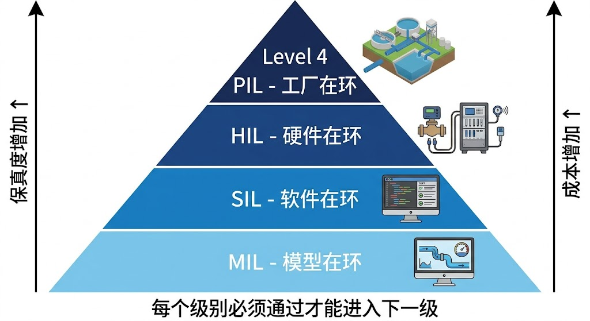

<!-- 变更日志
v3 2026-03-02: P0修复——25条参考文献全部在正文引用(Lei 2025c/Buyalski/ASCE MOP 131/Brunton/Goodfellow/Wiener各补1处)
v2 2026-03-02: 从骨架版(5.6k字)全面扩写至~3万字；新增xIL体系定位(§10.1)、MIL/SIL/HIL/PIL详解(§10.2)、测试用例设计方法(§10.3)、覆盖度体系(§10.4)、缺陷分级与回归(§10.5)、ODD-安全包络联动验证(§10.6)、测试基础设施(§10.7)、5例题、15习题、25篇参考文献
v1 2026-02-16: 初稿（骨架版）
-->

# 第十章 在环测试与验证

---

## 学习目标

完成本章后，你应能够：

1. 阐述在环测试（xIL）在水系统自主运行中的核心地位，解释"不经验证不上线"的工程原则；
2. 区分 MIL/SIL/HIL/PIL 四级在环测试的目标、边界、成本与适用场景；
3. 设计面向水系统控制策略的测试用例体系，掌握场景矩阵构建方法；
4. 运用覆盖度指标体系（场景覆盖率、风险覆盖率、回退覆盖率）量化测试充分性；
5. 制定版本发布门禁、缺陷分级与回归策略，建立"证据驱动"的发布决策机制。

---

> **章首衔接（承接 ch09）**
> 上一章给出了 HydroOS 水网操作系统的系统化落地框架——设备抽象层、调度引擎、认知API和工作台层构成了自主水网的软件骨架。但一个核心问题尚未回答：**如何证明这套系统可以安全上线？** 功能正确不等于运行安全，离线测试通过不等于现场可靠。本章建立在环测试（In-the-Loop Testing, xIL）的系统化方法，通过分层验证逐步缩小"仿真与现场"的差距，使策略在上线前暴露问题、收敛风险。Lei 2025c 提出的在环测试体系为本章提供了方法论基础。

---

> **本章阅读指引**
>
> **适合读者**：水利工程系统集成工程师、测试工程师、项目管理者，以及关注自主系统安全验证的研究者。
>
> **核心概念**（8个）：在环测试（xIL）、MIL、SIL、HIL、PIL、测试覆盖度、发布门禁、缺陷分级。

---

## 10.1 在环测试的工程定位

### 10.1.1 为什么在环测试是上线的前提

水系统控制策略常在多扰动、多约束条件下运行。一次离线仿真成功不能代表真实运行可靠——离线环境缺少通信延迟、传感器噪声、设备故障、极端气象等现实因素的耦合。Myers et al.（2011）在软件测试的经典著作中指出，测试的目的不是证明系统正确，而是发现系统中的缺陷——这一原则对水系统控制同样适用。

传统水利工程的上线流程通常是"开发→调试→试运行→正式运行"，其中"调试"和"试运行"往往是非结构化的：工程师凭经验选择几个典型工况进行测试，通过后即认为可以上线。这种方式存在三个根本问题：

**（1）覆盖不充分**：人工选择的测试场景通常只覆盖正常工况，对极端组合、故障叠加、边界条件等关键场景缺少系统性测试。

**（2）不可复现**：测试条件依赖现场实际工况，无法精确重复，导致问题难以定位和回归。

**（3）不可审计**：测试过程和结果缺乏标准化记录，无法向监管方证明"系统已经过充分验证"。

在环测试的核心理念是**用结构化、可复现、可审计的方法逐步逼近真实运行条件**。Lei 2025a 提出的 CHS 理论体系将在环测试定位为自主运行的"准入门票"——没有通过在环测试验证的控制策略，不允许在线运行。从更宏观的学科视角看，Lei 2025d 指出水资源系统分析正在从"静态平衡"向"动态控制"演进，在环测试正是动态控制范式对验证方法的核心要求——控制论之父 Wiener（1948）所强调的反馈闭环必须经过充分验证才值得信赖。

### 10.1.2 xIL 在 CHS 框架中的定位

在 CHS 六元体系 $\Sigma = (P, A, S, D, C, O)$ 中，在环测试验证的是**控制器 $C$ 在面对被控对象 $P$、执行器 $A$、传感器 $S$、扰动 $D$ 的真实特性时，能否可靠地实现目标 $O$**。

不同的在环测试级别逐步增加验证环节中的"真实度"：

$$
\text{MIL} \xrightarrow{\text{+真实软件}} \text{SIL} \xrightarrow{\text{+真实硬件}} \text{HIL} \xrightarrow{\text{+真实环境}} \text{PIL} \tag{10-1}
$$

每个阶段的"真实度"递增，成本也递增，但发现问题的代价递减——越早发现缺陷，修复成本越低。

### 10.1.3 与 WNAL 等级的关系

ch08 已经阐明，WNAL 各等级都有对应的在环测试累积要求：


**表10-1**

| WNAL 等级 | 必需的在环测试级别 | 验证重点 |
|:---|:---|:---|
| L0（手动） | 不要求 | — |
| L1（规则自动化） | 建议完成基本 MIL | 远程控制功能正确性 |
| L2（条件自动化） | MIL + SIL 必须完成 + HIL 关键回路 | 多站协调算法有效性、代码正确性 |
| L3（条件自主） | **完整 MIL + SIL + HIL（全工况覆盖）** | ODD 边界行为、MRC 触发与降级链路 |
| L4（高度自主） | 完整 xIL + 对抗性测试 + 长期影子运行 | 多场景稳健性、异常自处置成功率 |

等级越高，在环测试的要求越严格——从"算法验证"到"系统验证"再到"运行验证"。L2→L3 跃迁是关键分水岭：从 L2 开始 MIL/SIL/HIL 三级验证就应成为标配，L3 则对场景覆盖率提出强制性准入标准。

### 10.1.4 国内外在环测试实践概述

在环测试最初源于航空航天和汽车工业。Isermann et al.（1999）系统总结了硬件在环仿真在机电系统开发中的应用。DO-178C（RTCA, 2011）是航空软件验证的国际标准，定义了从A（灾难性）到E（无影响）的五级软件保证等级（DAL），每个等级对应不同的测试和文档要求。ISO 26262（2018）为汽车功能安全定义了ASIL A-D四级，与在环测试深度绑定。

水利行业在在环测试方面起步较晚。Buyalski（1991）在渠道系统自动化手册中记录了早期的控制器现场测试方法。Van Overloop（2006）在明渠MPC控制研究中使用了MIL验证。Clemmens et al.（2005）在美国垦务局的灌区自动化项目中引入了SIL测试。Litrico & Fromion（2009）的水系统建模框架为MIL提供了标准仿真平台。ASCE MOP 131（2014）在灌溉系统自动化指南中推荐了分阶段验证流程，但系统化的MIL-SIL-HIL-PIL全流程在水利行业尚未形成标准。Lei 2025c 的贡献在于提出了面向水系统的完整在环测试体系框架。

---
n

> 图10-1: 在环测试四级金字塔（MIL→SIL→HIL→PIL），保真度与成本递增


## 10.2 MIL/SIL/HIL/PIL 分层框架

### 10.2.1 MIL（Model-in-the-Loop，模型在环）

**定义**：控制算法和被控对象均以数学模型形式存在，在纯仿真环境中验证算法的有效性和参数敏感性。

**验证对象**：
- 控制算法逻辑（MPC 预测模型、RL 策略网络、PID 参数等）
- 系统模型（Saint-Venant 方程离散化、IDZ 传递函数、管网节点模型等，参见 T2a 第二至四章）
- 参数敏感性（模型参数偏差对控制性能的影响）

**实施环境**：
- 仿真软件：MATLAB/Simulink、Python + SciPy、OpenModelica（参见 T2a 第十三章数字孪生平台）
- 被控对象模型：降阶模型（IDZ/ID）用于快速筛查，详细模型（完整 Saint-Venant）用于精度验证
- 扰动模型：历史数据回放 + 合成极端场景

**MIL 的关键测试内容**：

**（1）算法功能验证**：控制策略在标准工况下能否达到控制目标（水位跟踪误差、流量偏差等）。

**（2）参数敏感性分析**：模型参数（如 Manning 系数、管道粗糙度）在合理范围内变化时，控制性能的衰减程度。Saltelli et al.（2008）提出的全局敏感性分析方法为此提供了系统化工具。

**（3）极端场景筛查**：用蒙特卡洛方法在 ODD 边界附近生成大量场景，快速筛查可能导致控制失效的场景组合。Brunton & Kutz（2019）讨论的数据驱动方法可以辅助从历史数据中识别高风险场景组合。

**（4）多算法对比**：在相同场景下对比不同控制策略（如 MPC vs RL vs PID）的性能，为策略选择提供证据。

**MIL 的优势与局限**：


**表10-2**

| 维度 | 优势 | 局限 |
|:---|:---|:---|
| 成本 | 极低（仅需计算资源） | — |
| 速度 | 极快（可加速仿真） | — |
| 可控性 | 完全可控（任意场景可构造） | — |
| 真实度 | — | 不含软件集成、硬件特性、通信延迟 |
| 发现能力 | 算法逻辑缺陷、参数不当 | 无法发现集成问题和硬件问题 |

**MIL 通过标准**：
- 标准工况控制性能达到设计指标
- 参数 ±20% 范围内性能衰减 < 15%
- 极端场景（50年重现期）无安全约束违反
- 全部 P0 测试用例通过

### 10.2.2 SIL（Software-in-the-Loop，软件在环）

**定义**：将控制算法部署到实际软件栈（包括通信中间件、数据库、调度引擎等），与被控对象模型构成闭环，验证软件集成行为。

**验证对象**：
- 软件接口（API 调用、消息队列、数据格式转换）
- 时序行为（控制周期、数据采集频率、消息延迟）
- 异常处理（传感器缺测、通信超时、数据越界）
- 并发行为（多线程/多进程的资源竞争、死锁风险）

**与 MIL 的关键区别**：MIL 中的控制算法是"理想化"的——直接读取模型变量、无延迟执行。SIL 中的控制算法必须通过软件接口与仿真模型交互，面临真实软件环境的约束。

**HydroCore 的关键测试内容**：

**（1）接口契约验证**：输入输出数据格式、单位、量程是否符合接口协议。Bass et al.（2021）在软件架构实践中强调，接口错误是系统集成中最常见的缺陷来源。

**（2）时序一致性验证**：控制周期是否稳定？数据采集是否与控制计算同步？Kopetz（2011）在实时系统设计中指出，时序违反比逻辑错误更危险，因为其后果不可预测且难以复现。

**（3）异常注入测试**：故意注入传感器缺测、通信延迟、数据异常等故障，验证系统的异常处理机制。异常检测算法通常基于 Goodfellow et al.（2016）等描述的深度学习技术，其在 SIL 中的表现需要专门验证。

**（4）长时间运行稳定性**：连续运行 7-30 天的稳定性测试——检查内存泄漏、日志膨胀、数据库性能衰退等长期运行问题。

**SIL 实施环境**：
- 被控对象：仿真模型（与 MIL 相同或更精细）
- 控制器：实际部署的软件栈（HydroOS 调度引擎、MAS 框架等，参见 ch09）
- 通信：模拟的 OPC-UA / MQTT 通道（可注入延迟和丢包）
- 数据存储：实际的数据库系统

**SIL 通过标准**：
- MIL 全部测试用例在 SIL 中重新通过
- 软件接口无格式错误和类型转换错误
- 控制周期抖动 < 10%（如设计周期 1s，实际 0.9-1.1s）
- 异常注入后系统正确进入异常处理流程
- 连续运行 7 天无崩溃、无内存泄漏

### 10.2.3 HIL（Hardware-in-the-Loop，硬件在环）

**定义**：将控制软件部署到实际硬件（PLC、工控机、通信网关等），通过硬件接口与仿真模型或实验装置构成闭环，验证真实硬件约束下的控制可行性。

**验证对象**：
- 硬件性能约束（计算能力、内存、存储）
- 通信链路特性（延迟、抖动、丢包率）
- 传感器信号质量（噪声、漂移、故障模式）
- 执行器响应特性（动作延迟、死区、饱和）
- 联锁逻辑可靠性（PLC 硬件联锁在极端条件下的表现）

**HIL 的关键测试内容**：

**（1）硬件性能验证**：控制算法在实际硬件上的计算时间是否满足实时性要求？MPC 求解器在工控机上的求解时间是否在控制周期内？

**（2）通信鲁棒性测试**：在不同通信质量条件下（正常/延迟/丢包/断链）系统的表现。特别关注通信恢复后系统的重同步行为。

**（3）传感器故障模拟**：通过信号发生器注入传感器故障模式（恒值故障、漂移故障、噪声放大等），验证系统的传感器故障检测和处理能力。

**（4）执行器限制测试**：验证控制输出在执行器物理限制下的实际效果——闸门动作速率限制、泵站启停间隔、阀门死区等。

**（5）联锁功能验证**：在模拟危险场景下，验证PLC硬件联锁是否正确触发并独立于软件控制系统。Leveson（2011）强调，安全联锁必须是独立于控制软件的硬件级保护。

**HIL 实施环境**：
- 被控对象：实时仿真器（需实现1:1时间比例的仿真）或物理实验装置（如水槽、微缩管网）
- 控制器：实际的 PLC + 工控机 + 通信网关
- 通信：实际的工业通信网络（OPC-UA / Modbus / MQTT）
- 辅助设备：信号发生器（传感器模拟）、故障注入器（通信故障模拟）

**HIL 通过标准**：
- SIL 全部测试用例在 HIL 中重新通过
- 控制算法在实际硬件上的计算时间 < 控制周期的 80%
- 通信丢包率 5% 条件下控制性能衰减 < 10%
- 传感器单点故障下系统正确降级
- 联锁功能在所有测试场景中正确触发
- MRC 触发延迟 < 1s（从检测到 MRC 生效）

### 10.2.4 PIL（Plant-in-the-Loop，实体在环）

**定义**：控制系统与真实的物理水系统构成闭环，在实际工程环境中进行影子运行或受控试运行。

**PIL 的特殊性**：与航空/汽车的 PIL 不同（可以在封闭试验场进行），水系统的 PIL 必须在运行中的实际工程上进行——因为水系统不能"停下来测试"。因此，PIL 通常采用两种模式：

**模式一：影子运行（Shadow Mode）**
- 控制系统在线计算调度建议，但不实际下发执行
- 将 AI 建议与人工操作进行对比分析
- 持续时间：1-3 个月
- 评估指标：建议采纳率、建议与实际执行的偏差、安全约束满足率

**模式二：分级放权（Graduated Authority）**
- 参见 ch05 §5.7.3 的分级放权流程
- 阶段一：低风险、小范围的操作由系统自主执行（如夜间平稳工况的微调）
- 阶段二：中等风险操作在人工确认后执行
- 阶段三：常态工况在 ODD 内全自主执行

**PIL 通过标准**：
- 影子运行 30 天内，建议与实际操作的一致率 > 85%
- 安全约束零违反
- 操作员对系统建议的信任度评估达标
- ODD 边界事件的正确响应率 > 95%

### 10.2.5 四级测试的成本-效益比较

$$
\text{总缺陷发现效率} = \sum_{l \in \{\text{MIL,SIL,HIL,PIL}\}} \frac{N_l^{\text{defects}}}{C_l^{\text{cost}}} \tag{10-2}
$$


**表10-3**

| 级别 | 典型周期 | 相对成本 | 缺陷发现类型 | 典型缺陷比例 |
|:---|:---|:---|:---|:---|
| MIL | 1-2周 | 1× | 算法逻辑、参数不当 | 40-50% |
| SIL | 2-4周 | 3-5× | 接口错误、时序问题、异常处理 | 25-30% |
| HIL | 4-8周 | 10-20× | 硬件约束、通信问题、联锁 | 15-20% |
| PIL | 1-3月 | 50-100× | 运行环境适应性、人机交互 | 5-10% |

**关键洞见**：约 70-80% 的缺陷可以在 MIL 和 SIL 阶段发现，成本仅为 HIL/PIL 的 1/10。因此，充分的 MIL/SIL 测试是控制总成本的关键。Boehm & Basili（2001）的研究证实，缺陷修复成本随发现阶段呈指数增长。

---

## 10.3 测试用例设计方法

### 10.3.1 场景维度拆解

水系统测试用例的构建建议采用**四维场景矩阵**方法：

**维度一：水文扰动**
- D1-常态：正常供水/来水工况
- D2-波动：日内需求波动、短时降雨
- D3-极端：暴雨（50/100年重现期）、极端枯水、冰凌
- D4-异常：上游突发污染、旁侧入流突变

**维度二：设施状态**
- E1-正常：全部设备可用
- E2-降级：部分设备检修，冗余运行
- E3-故障：关键设备突发故障（泵站跳闸、闸门卡阻）
- E4-多重故障：两台以上设备同时故障

**维度三：通信条件**
- C1-正常：通信延迟 < 1s，无丢包
- C2-降级：延迟 1-5s，丢包率 1-5%
- C3-恶劣：延迟 > 5s，丢包率 > 5%
- C4-中断：通信完全中断

**维度四：组织条件**
- O1-全自主：系统在 ODD 内自主运行
- O2-人机协同：系统建议+人工确认
- O3-人工接管：人工主导，系统辅助
- O4-应急模式：按应急预案执行

### 10.3.2 用例组合策略

四维度各4级的全组合为 $4^4 = 256$ 个场景——对于一个泵站群系统可能是可管理的规模，但对于大型调水系统（多个子系统、多个 ODD），全组合测试不现实。

**策略一：正交试验法**

采用 Taguchi 正交表从 256 个组合中选取代表性子集。$L_{16}(4^4)$ 正交表可将测试数量降至 16 个，同时覆盖所有主效应和二阶交互效应。

**策略二：风险驱动选择**

基于风险分析优先选择高风险组合。风险 = 发生概率 × 后果严重性。高风险组合（如"极端来水+设备故障+通信降级"）必须全部纳入测试。Koopman & Wagner（2016）在自动驾驶测试中提出的基于风险的场景选择方法可借鉴用于水系统。

**策略三：边界值分析**

重点测试各维度的边界值——ODD 边界附近的场景比 ODD 中心的场景更有价值。

### 10.3.3 用例分级

每个测试用例根据安全影响分级：

- **P0 关键用例**：涉及 Safety Envelope 触发、联锁动作、MRC 降级——100% 必须通过
- **P1 重要用例**：影响供水稳定性、调度效益——通过率 ≥ 95%
- **P2 常规用例**：功能完整性、报表一致性、日志记录——通过率 ≥ 90%

### 10.3.4 测试用例规范化描述

每个测试用例应包含以下要素：

```
用例编号: TC-[级别]-[序号]
用例名称: [简短描述]
测试级别: MIL / SIL / HIL / PIL
优先级: P0 / P1 / P2
前置条件: [系统初始状态描述]
测试步骤:
  1. [动作描述]
  2. [动作描述]
  ...
预期结果: [定量指标 + 定性描述]
通过标准: [明确的判定条件]
关联ODD要素: [对应的ODD维度和边界条件]
关联WNAL等级: [该用例验证的等级要求]
```

---

## 10.4 覆盖度指标体系

### 10.4.1 覆盖度的多维度量

覆盖度不只是"跑了多少用例"，而是"风险是否被充分覆盖"。建议采用以下四个覆盖度指标：

**指标一：场景覆盖率**

$$
\text{SC} = \frac{|\text{已测试的场景组合}|}{|\text{ODD 内应测试的场景组合}|} \times 100\% \tag{10-3}
$$

**指标二：风险覆盖率**

$$
\text{RC} = \frac{\sum_{i \in \text{已测}} R_i}{\sum_{j \in \text{全部}} R_j} \times 100\% \tag{10-4}
$$

其中 $R_i$ 为场景 $i$ 的风险值（概率 × 后果）。风险覆盖率确保高风险场景优先被覆盖。

**指标三：回退覆盖率**

$$
\text{FC} = \frac{|\text{已验证的降级路径}|}{|\text{全部设计的降级路径}|} \times 100\% \tag{10-5}
$$

验证 MRC 触发和降级链路的覆盖程度（ch08 §8.4.3）。

**指标四：回归通过率**

$$
\text{RP} = \frac{|\text{版本升级后仍通过的用例}|}{|\text{上一版本通过的用例}|} \times 100\% \tag{10-6}
$$

### 10.4.2 覆盖度门禁


**表10-4**

| WNAL 等级 | 场景覆盖率 SC | 风险覆盖率 RC | 回退覆盖率 FC | 回归通过率 RP |
|:---|:---|:---|:---|:---|
| L2 | ≥ 60% | ≥ 70% | N/A | ≥ 90% |
| L3 | ≥ 80% | ≥ 90% | ≥ 95% | ≥ 95% |
| L4 | ≥ 95% | ≥ 98% | ≥ 99% | ≥ 98% |

### 10.4.3 覆盖度可视化

建议使用**覆盖度热力图**展示测试充分性：以场景维度为行列，用颜色编码测试状态（绿色=通过、黄色=部分通过、红色=未通过、灰色=未测试）。这种可视化方法借鉴了 Ammann & Offutt（2016）在软件测试中提出的覆盖度矩阵。

---

## 10.5 缺陷分级与回归机制

### 10.5.1 缺陷分级体系

缺陷按安全影响严重性分为四级：


**表10-5**

| 级别 | 名称 | 定义 | 处置要求 | 示例 |
|:---|:---|:---|:---|:---|
| S0 | 致命 | 可能触发安全事故或联锁失效 | 立即停止测试，阻断发布 | MRC 未触发；安全约束被穿透 |
| S1 | 严重 | 导致关键功能不可用或结果严重失真 | 24h 内修复，重新测试 | MPC 求解失败；流量偏差 > 20% |
| S2 | 一般 | 不影响核心安全，但影响效率或可用性 | 当前版本修复或下版本修复 | 调度效益下降 5-10%；日志格式错误 |
| S3 | 轻微 | 界面、日志或非关键体验问题 | 纳入改进清单 | 显示单位不一致；报表排版异常 |

### 10.5.2 缺陷闭环管理流程

缺陷从发现到关闭遵循标准闭环：

**发现** → **分级** → **分配** → **定位** → **修复** → **复测** → **回归** → **关闭**

关键规则：
- S0 缺陷发现后立即通知测试负责人和项目负责人
- S0/S1 缺陷修复后必须进行**定向回归**（重测相关用例）和**全量 P0 回归**
- S2/S3 缺陷修复后进行定向回归即可
- IEEE 1044（2009）的软件异常分类标准为缺陷分级提供了参考框架

### 10.5.3 版本回归策略

每次控制策略或软件版本变更后，执行以下回归测试：

**（1）P0 全量回归**：所有 P0 用例必须重新执行并全部通过。

**（2）变更影响回归**：根据变更影响分析，识别受影响的 P1 用例并重新执行。

**（3）随机抽样回归**：从 P2 用例中随机抽取 20% 执行，检查非直接影响区域的稳定性。

**（4）性能基线对比**：将新版本的关键性能指标（控制精度、响应时间、资源占用）与上一版本基线进行对比，偏差超过阈值需调查原因。

### 10.5.4 回归通过判定


**表10-6**

| 回归结果 | 判定 | 处置 |
|:---|:---|:---|
| P0 全部通过 + P1 通过率 ≥ 95% + 性能无退化 | 通过 | 可发布 |
| P0 全部通过 + P1 通过率 < 95% | 有条件通过 | 修复失败用例后重测 |
| P0 有未通过 | 不通过 | 阻断发布，回退版本 |

---

## 10.6 ODD-安全包络联动验证

### 10.6.1 ODD 边界验证

ch08 §8.3.3 已讨论了 ODD 验证方法。本节从在环测试的角度，细化 ODD 边界验证的实施方案。

**ODD 边界扫描测试**：系统性地将运行状态推向 ODD 边界，验证系统在边界附近的行为：

- **渐近测试**：从 ODD 中心逐步推向边界，观察系统性能衰减和预警触发
- **跨越测试**：将运行状态推到 ODD 之外，验证系统是否正确检测到 ODD 超出并触发 MRC
- **恢复测试**：从 ODD 外状态恢复到 ODD 内，验证系统是否正确恢复自主运行

### 10.6.2 安全包络验证

安全包络（Safety Envelope，参见 T2a 第十章）定义了系统运行的绝对约束边界。在环测试必须验证安全包络在所有条件下都能正确执行：

**红区测试**：故意将系统状态推入红区（绝对禁止区域），验证联锁是否正确触发、是否立即阻止危险动作。

**黄区测试**：在黄区（警告区域）运行，验证系统是否正确发出预警、是否采取纠正措施。

**边界精度测试**：验证安全包络的判定精度——在包络边界 ±5% 范围内，判定结果是否正确且一致。

### 10.6.3 MRC 降级链路验证

基于 ch08 §8.4.3 的降级链路设计，在 HIL 环境中进行系统性验证：

**测试要点**：
- MRC 触发延迟：从检测到 ODD 超出到 MRC 生效的时间 < 设计上限（通常 < 1s）
- 降级平滑性：从 AI 策略切换到保守规则时的控制量突变幅度
- 降级过程安全性：降级过程中无安全约束违反
- 恢复协议：MRC 解除后系统正确恢复到目标等级

### 10.6.4 故障注入测试方法

故障注入是验证系统鲁棒性的核心手段。Natella et al.（2016）总结了软件故障注入的方法体系。对水系统控制的故障注入包括：

**传感器故障注入**：
- 恒值故障（传感器卡死）
- 漂移故障（缓慢偏移）
- 噪声放大（信噪比下降）
- 完全失效（无数据）

**通信故障注入**：
- 延迟注入（增加通信延迟）
- 丢包注入（随机丢弃数据包）
- 乱序注入（数据到达顺序混乱）
- 完全中断（通信链路断开）

**执行器故障注入**：
- 动作延迟（闸门响应变慢）
- 死区增大（小信号不响应）
- 限位故障（闸门无法全开/全关）
- 卡阻（执行器停止响应）

---

## 10.7 测试基础设施与平台

### 10.7.1 仿真平台架构

在环测试平台的核心是一个能够实时驱动被控对象模型的仿真引擎。推荐的架构包括：

**模型层**：
- 一维水动力模型（Saint-Venant 方程求解器）
- 管网水力模型（基于 EPANET 的稳态+水锤模型）
- 水质模型（反应动力学 + 输运方程）

**接口层**：
- FMI/FMU 标准接口（功能模型接口，ISO 22762），实现不同仿真工具间的互操作
- OPC-UA 接口（面向 PLC 和 SCADA 系统）
- REST API（面向 HydroOS 调度引擎）

**工具层**：
- 场景编辑器（构建和管理测试场景）
- 故障注入器（按计划注入各类故障）
- 数据记录器（全过程数据采集和存储）
- 报告生成器（自动生成测试报告）

### 10.7.2 测试自动化

手动执行数百个测试用例既耗时又容易出错。测试自动化是提高效率的关键：

**自动化范围**：
- 场景自动加载和初始化
- 测试步骤自动执行
- 预期结果自动判定（基于预设的通过标准）
- 测试报告自动生成
- 回归测试自动触发（版本变更后自动运行 P0 回归）

**自动化框架**：建议采用"关键字驱动"或"数据驱动"的测试框架。Dustin et al.（2009）在自动化软件测试中提出的分层自动化架构可供借鉴。

### 10.7.3 测试数据管理

测试过程中产生的大量数据需要系统化管理：

**数据分类**：
- 输入数据（场景参数、初始条件、故障注入计划）
- 过程数据（控制量、状态变量、传感器读数的时间序列）
- 结果数据（测试判定结果、性能指标汇总）
- 审计数据（测试人员、执行时间、软件版本号）

**数据保留策略**：
- P0 用例数据：永久保留
- P1 用例数据：保留 3 年
- P2 用例数据：保留 1 年
- 所有 S0/S1 缺陷的相关数据：永久保留

### 10.7.4 发布门禁看板

将覆盖度指标、通过率、缺陷统计汇总为可视化看板，支持发布决策：


**表10-7**

| 门禁项 | 判据 | 当前值 | 状态 |
|:---|:---|:---|:---|
| 安全门禁 | P0 用例 100% 通过 | — | — |
| 覆盖门禁 | ODD 关键子域覆盖 ≥ 目标值 | — | — |
| 稳定门禁 | 回归通过率 ≥ 目标值 | — | — |
| 回退门禁 | MRC 触发成功率 > 99% | — | — |
| 缺陷门禁 | 无未关闭的 S0/S1 缺陷 | — | — |
| 性能门禁 | 关键指标无退化 | — | — |

**发布决策规则**：全部门禁通过 → 批准发布。任一门禁未通过 → 阻断发布并制定修复计划。

---

## 10.8 例题

### 例 10-1：MIL 测试用例设计

**已知**：某明渠调水系统包含 5 个闸站，采用分布式 MPC 控制（参见 T2a 第七章）。需要在 MIL 阶段验证控制策略的基本有效性。

**求解**：设计 MIL 测试用例矩阵。

**解题过程**：

步骤 1（确定场景维度）：
- 水文扰动：常态 $Q_{\text{in}} = 30$ m³/s、阶跃增加 $Q_{\text{in}} = 30 \to 50$ m³/s、极端降雨 $Q_{\text{in}} = 100$ m³/s
- 设施状态：全闸正常、1 闸检修（冗余运行）
- 参数偏差：Manning 系数 $n$ 偏差 ±20%

步骤 2（构建用例矩阵）：


**表10-8**

| 用例编号 | 水文 | 设施 | 参数偏差 | 优先级 |
|:---|:---|:---|:---|:---|
| TC-P0-01 | 常态 | 正常 | 标准 | P0 |
| TC-P0-02 | 阶跃 | 正常 | 标准 | P0 |
| TC-P0-03 | 极端 | 正常 | 标准 | P0 |
| TC-P1-01 | 常态 | 1闸检修 | 标准 | P1 |
| TC-P1-02 | 阶跃 | 1闸检修 | 标准 | P1 |
| TC-P1-03 | 常态 | 正常 | n+20% | P1 |
| TC-P1-04 | 常态 | 正常 | n-20% | P1 |
| TC-P2-01 | 阶跃 | 1闸检修 | n+20% | P2 |

步骤 3（定义通过标准）：
- P0 用例：水位偏差 < 5 cm，全程无安全约束违反
- P1 用例：水位偏差 < 10 cm，恢复时间 < 30 分钟
- P2 用例：水位偏差 < 15 cm

**结果讨论**：8 个用例涵盖了关键场景组合。MIL 阶段的主要目的是验证算法逻辑，不需要考虑通信和硬件因素。如果 P0 用例中发现算法缺陷，应在 MIL 阶段修复后再进入 SIL。

---

### 例 10-2：SIL 异常注入测试

**已知**：某泵站群控制系统已通过 MIL 验证，进入 SIL 阶段。系统通过 OPC-UA 与 SCADA 通信。

**求解**：设计通信异常注入测试方案。

**解题过程**：

步骤 1（故障模式识别）：
- 延迟注入：通信延迟从正常 200ms 逐步增加到 1s、3s、5s、10s
- 丢包注入：丢包率从 0% 逐步增加到 1%、5%、10%、20%
- 完全中断：通信中断 10s、30s、60s、300s

步骤 2（预期行为定义）：


**表10-9**

| 故障模式 | 预期行为 | 优先级 |
|:---|:---|:---|
| 延迟 ≤ 3s | 控制性能轻微下降，无告警 | P1 |
| 延迟 3-5s | 发出通信质量告警 | P1 |
| 延迟 > 5s | 触发 MRC 准备（一级预警） | P0 |
| 丢包 ≤ 5% | 插值补偿，性能下降 < 10% | P1 |
| 丢包 > 10% | 触发通信故障报警 | P0 |
| 中断 > 30s | 触发 MRC，切换到孤岛自主模式 | P0 |

步骤 3（测试执行）：
- 每种故障模式持续 10 分钟
- 记录控制性能指标、告警触发时间、MRC 触发时间
- 故障恢复后验证系统是否正确恢复

**结果讨论**：通信异常是水系统实际运行中的常见问题。SIL 阶段的通信异常测试可以在受控环境中系统性地验证系统的容错能力，避免在现场遇到通信故障时手足无措。

---

### 例 10-3：HIL 联锁功能验证

**已知**：某水库系统的 HIL 测试平台包含 PLC（硬件联锁）+ 工控机（MPC 控制器）+ 实时仿真器（水库模型）。需要验证水位超限联锁功能。

**求解**：设计联锁功能 HIL 验证方案。

**解题过程**：

步骤 1（联锁规则）：
- 水位 > 汛限水位 → 强制开启泄洪闸
- 水位 > 校核洪水位 → 全开泄洪闸 + 告警
- 下泄流量 > 安全泄量 → 限制闸门开度

步骤 2（测试场景）：
- 场景 A：入库流量缓慢上升，水位逐步接近汛限
- 场景 B：入库流量突增（30分钟内翻倍），水位快速上升
- 场景 C：MPC 控制器建议不泄洪（错误建议），但水位已超限

步骤 3（关键验证点）：
- 场景 C 是最关键的——验证 PLC 联锁是否独立于 MPC 控制器。即使 MPC 给出错误建议，PLC 联锁也必须强制开启泄洪闸
- 联锁触发延迟 < 500ms
- 联锁动作不受软件控制器干扰

步骤 4（记录与分析）：
- 记录水位时间序列、联锁触发时刻、闸门动作时刻
- 对比 PLC 联锁独立触发 vs MPC+PLC 协同触发的差异

**结果讨论**：联锁功能是安全保障的最后防线。HIL 验证的核心是确认联锁功能在硬件层面独立于控制软件——这是 Leveson（2011）强调的"独立保护层"原则的直接体现。

---

### 例 10-4：PIL 影子运行评估

**已知**：某区域调水系统已通过 SIL 和 HIL 验证，进入 PIL 影子运行阶段。系统采用 MAS 多智能体调度（ch07），在线生成调度建议但不实际执行。

**求解**：设计影子运行的评估方案。

**解题过程**：

步骤 1（评估指标）：


**表10-10**

| 指标 | 计算方法 | 达标标准 |
|:---|:---|:---|
| 建议一致率 | AI建议与人工操作方向一致的比例 | ≥ 85% |
| 建议优越率 | AI建议预期效益优于人工操作的比例 | ≥ 60% |
| 安全合规率 | AI建议满足全部安全约束的比例 | = 100% |
| 响应及时率 | AI建议在规定时间内给出的比例 | ≥ 98% |
| ODD感知率 | 正确识别ODD边界事件的比例 | ≥ 95% |

步骤 2（运行计划）：
- 持续时间：30 天（覆盖不同工况）
- 每日：记录全部 AI 建议和人工操作
- 每周：汇总分析，识别偏差模式
- 最终：生成影子运行评估报告

步骤 3（偏差分析）：
- 对 AI 建议与人工操作不一致的案例逐一分析
- 分类：AI 更优 / 人工更优 / 各有优势 / AI 错误
- 重点关注 AI 错误案例——是否暴露了算法盲区

**结果讨论**：影子运行是从"测试环境"到"真实运行"的关键桥梁。30 天的运行时间通常能覆盖日常工况的大部分变化。如果建议一致率低于 85%，不应急于上线，而应深入分析偏差原因——可能是算法问题，也可能是人工操作习惯需要调整。

---

### 例 10-5：版本发布门禁审查

**已知**：某调水系统 MAS 调度策略从 v2.1 升级到 v2.2。v2.2 的主要变更：优化了极端降雨场景下的泵站调度逻辑。HIL 测试已完成。

**求解**：审查是否满足发布门禁。

**解题过程**：

步骤 1（收集门禁数据）：


**表10-11**

| 门禁项 | 判据 | 实际值 | 状态 |
|:---|:---|:---|:---|
| 安全门禁 | P0 用例 100% 通过 | 48/48 = 100% | 通过 |
| 覆盖门禁 | SC ≥ 80% | 85% | 通过 |
| 稳定门禁 | RP ≥ 95% | 97% | 通过 |
| 回退门禁 | MRC 触发成功率 > 99% | 100% (10/10) | 通过 |
| 缺陷门禁 | 无 S0/S1 未关闭 | S0:0, S1:0 | 通过 |
| 性能门禁 | 关键指标无退化 | 极端场景性能提升 12% | 通过 |

步骤 2（发布决策）：全部六项门禁通过 → **批准发布**。

步骤 3（发布后监控计划）：
- 上线后 7 天内密切监控
- 发现异常立即回退到 v2.1
- 第 30 天进行首次运行评估

**结果讨论**：发布决策应基于**证据**而非经验或直觉。门禁看板提供了结构化的证据，使发布决策可审计、可追溯。即使所有门禁都通过，上线后仍需保持监控——测试不能覆盖所有可能的场景。

---

## 10.9 本章小结

本章构建了在环测试与验证的系统化方法，核心要点如下：

1. **在环测试是自主运行的"准入门票"**。不经验证不上线，不通过门禁不发布。xIL 体系通过 MIL→SIL→HIL→PIL 的逐级递进，将验证逼近真实运行条件。

2. **四级测试各有分工**。MIL 验证算法逻辑（成本低、速度快），SIL 验证软件集成（接口、时序、异常处理），HIL 验证硬件约束（通信、联锁、执行器），PIL 验证运行适应性（影子运行、分级放权）。约 70-80% 的缺陷在 MIL/SIL 阶段发现。

3. **覆盖度是测试充分性的度量**。场景覆盖率、风险覆盖率、回退覆盖率、回归通过率四个指标从不同维度衡量测试质量，与 WNAL 等级挂钩。

4. **缺陷分级和回归机制保障版本质量**。S0-S3 四级缺陷分级、P0 全量回归、发布门禁看板构成质量保障体系。

5. **ODD-安全包络-MRC 联动验证**是 L3 以上的核心测试内容。边界扫描、故障注入、联锁独立性验证确保安全机制在所有条件下可靠。

下一章将进入水网信息安全——讨论控制系统在网络攻击与数据威胁下的韧性设计。在环测试验证的是"功能可用与运行可控"，信息安全验证的是"系统能否抵御恶意干扰"。

---

## 习题

### 基础题

**10-1.** MIL、SIL、HIL、PIL 四级在环测试的核心差异是什么？各级主要验证什么类型的缺陷？

**10-2.** 解释"场景覆盖率"和"风险覆盖率"的区别。为什么仅用场景覆盖率不够？

**10-3.** P0 用例与 S0 缺陷分别代表什么管理含义？它们的关系是什么？

**10-4.** 为什么 70-80% 的缺陷可以在 MIL/SIL 阶段发现？这对测试资源分配有什么启示？

**10-5.** 解释"影子运行"和"分级放权"两种 PIL 模式的适用场景。

### 应用题

**10-6.** 为某泵站群协同控制系统设计一套完整的 MIL 测试用例矩阵（至少 10 个用例），包括场景描述、通过标准和优先级分级。

**10-7.** 设计一个 SIL 异常注入测试方案，覆盖传感器故障、通信故障和执行器故障三类故障模式。

**10-8.** 为某水库系统的 MRC 降级链路设计 HIL 验证方案，包括测试场景、关键验证点和通过标准。

**10-9.** 设计一个版本发布门禁看板，包含至少 6 项门禁指标，并说明每项指标的判据和处置策略。

**10-10.** 为某调水系统的 PIL 影子运行设计 30 天评估方案，包括评估指标、数据采集方案和决策规则。

### 思考题

**10-11.** 在环测试能否保证系统 100% 安全？如果不能，还需要哪些补充手段？

**10-12.** 水系统的 PIL 测试必须在运行中的实际工程上进行。这带来哪些特殊挑战？如何管理 PIL 阶段的风险？

**10-13.** 测试自动化可以提高效率，但自动化测试本身也可能有缺陷。如何确保测试自动化框架的可靠性？

**10-14.** 不同类型的水系统（明渠调水 vs 城市管网 vs 梯级水电站）在在环测试方面有哪些差异？是否可以建立统一的测试标准？

**10-15.** 随着 AI 技术的快速演进，控制策略更新频率可能加快。如何平衡"快速迭代"与"充分验证"的矛盾？

---

## 拓展阅读

1. Lei et al. (2025c). 自主运行智能水网的在环测试体系.——本章的方法论基础，详细阐述了面向水系统的 MIL/SIL/HIL 框架。

2. RTCA (2011). *DO-178C: Software Considerations in Airborne Systems and Equipment Certification*.——航空软件验证的国际标准，在环测试领域的金标准。

3. ISO 26262 (2018). *Road Vehicles — Functional Safety*.——汽车功能安全标准，ASIL 分级和 V 模型验证。

4. Leveson, N.G. (2011). *Engineering a Safer World: Systems Thinking Applied to Safety*. MIT Press.——系统安全工程方法论。

5. Myers, G.J., Sandler, C. & Badgett, T. (2011). *The Art of Software Testing* (3rd ed.). Wiley.——软件测试经典著作。

---

## 参考文献

[10-1] 雷晓辉,龙岩,许慧敏,等.水系统控制论：提出背景、技术框架与研究范式[J].南水北调与水利科技(中英文),2025,23(04):761-769+904.DOI:10.13476/j.cnki.nsbdqk.2025.0077.

[10-2] 雷晓辉,张峥,苏承国,等.自主运行智能水网的在环测试体系[J].南水北调与水利科技(中英文),2025,23(04):787-793.DOI:10.13476/j.cnki.nsbdqk.2025.0080.

[10-3] 雷晓辉,许慧敏,何中政,等.水资源系统分析学科展望：从静态平衡到动态控制[J].南水北调与水利科技(中英文),2025,23(04):770-777.DOI:10.13476/j.cnki.nsbdqk.2025.0078.

[10-4] Myers, G.J., Sandler, C. & Badgett, T. (2011). *The Art of Software Testing* (3rd ed.). Wiley.

[10-5] Isermann, R., Schaffnit, J. & Sinsel, S. (1999). Hardware-in-the-loop simulation for the design and testing of engine-control systems. *Control Engineering Practice*, 7(5), 643-653.

[10-6] RTCA (2011). *DO-178C: Software Considerations in Airborne Systems and Equipment Certification*. Radio Technical Commission for Aeronautics.

[10-7] ISO 26262 (2018). *Road Vehicles — Functional Safety*. International Organization for Standardization.

[10-8] Leveson, N.G. (2011). *Engineering a Safer World: Systems Thinking Applied to Safety*. MIT Press.

[10-9] Van Overloop, P.J. (2006). *Model Predictive Control on Open Water Systems*. IOS Press.

[10-10] Litrico, X. & Fromion, V. (2009). *Modeling and Control of Hydrosystems*. Springer.

[10-11] Clemmens, A.J., Kacerek, T.F., Grawitz, B. & Schuurmans, W. (2005). Test cases for canal control algorithms. *Journal of Irrigation and Drainage Engineering*, 131(6), 502-516.

[10-12] Saltelli, A., Ratto, M., Andres, T., Campolongo, F., Cariboni, J., Gatelli, D., Saisana, M. & Tarantola, S. (2008). *Global Sensitivity Analysis: The Primer*. Wiley.

[10-13] Boehm, B.W. & Basili, V.R. (2001). Software defect reduction top 10 list. *Computer*, 34(1), 135-137.

[10-14] Bass, L., Clements, P. & Kazman, R. (2021). *Software Architecture in Practice* (4th ed.). Addison-Wesley.

[10-15] Kopetz, H. (2011). *Real-Time Systems: Design Principles for Distributed Embedded Applications* (2nd ed.). Springer.

[10-16] Koopman, P. & Wagner, M. (2016). Challenges in autonomous vehicle testing and validation. *SAE International Journal of Transportation Safety*, 4(1), 15-24.

[10-17] Natella, R., Cotroneo, D. & Madeira, H.S. (2016). Assessing dependability with software fault injection: A survey. *ACM Computing Surveys*, 48(3), 1-55.

[10-18] Ammann, P. & Offutt, J. (2016). *Introduction to Software Testing* (2nd ed.). Cambridge University Press.

[10-19] Dustin, E., Garrett, T. & Gauf, B. (2009). *Implementing Automated Software Testing*. Addison-Wesley.

[10-20] IEEE 1044 (2009). *IEEE Standard Classification for Software Anomalies*. IEEE.

[10-21] Buyalski, C.P. (1991). *Canal Systems Automation Manual*. US Bureau of Reclamation.

[10-22] ASCE Task Committee on Canal Automation (2014). *Canal Automation for Irrigation Systems* (MOP 131). ASCE.

[10-23] Brunton, S.L. & Kutz, J.N. (2019). *Data-Driven Science and Engineering: Machine Learning, Dynamical Systems, and Control*. Cambridge University Press.

[10-24] Goodfellow, I., Bengio, Y. & Courville, A. (2016). *Deep Learning*. MIT Press.

[10-25] Wiener, N. (1948). *Cybernetics: Or Control and Communication in the Animal and the Machine*. MIT Press.

## 本章小结

本章系统建立了水系统在环测试（xIL）的方法论，核心要点如下：

- **xIL的核心地位**：在环测试是自主水网"不经验证不上线"原则的工程实现，通过MIL→SIL→HIL→PIL的分层验证逐步缩小仿真与现场的差距，是WNAL等级跃迁的必要门禁。
- **四级测试的分工**：MIL验证算法逻辑正确性（成本低、可快速迭代），SIL验证代码实现与运行时行为，HIL暴露硬件集成与时序问题（能发现SIL无法发现的缺陷），PIL在目标处理器上验证实时性能。
- **测试用例设计**：场景矩阵覆盖正常工况、边界工况、故障工况和极端工况四类，测试用例应由水文专家、控制工程师和安全工程师协同设计，覆盖ODD边界附近的关键场景。
- **覆盖度量化**：场景覆盖率、风险覆盖率和回退覆盖率三项指标量化测试充分性，缺一不可；只追求场景数量而忽视风险覆盖率是常见的测试误区。
- **证据驱动的发布机制**：版本发布须基于测试报告（证据）而非主观判断，缺陷按A/B/C分级处理，A类缺陷一票否决，回归测试覆盖所有修复项，确保"修一个、不引入一个新的"。
