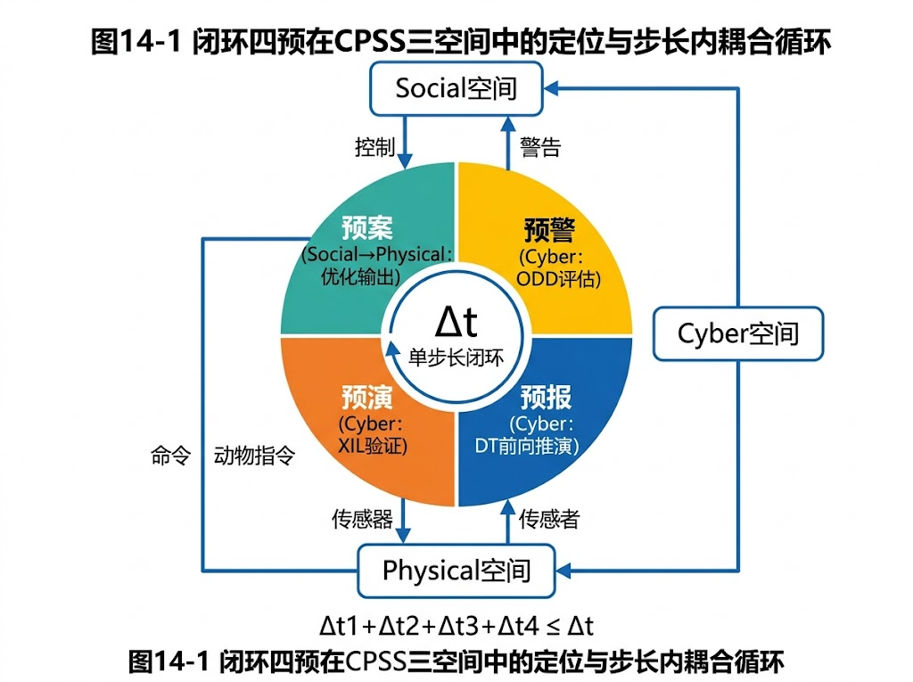
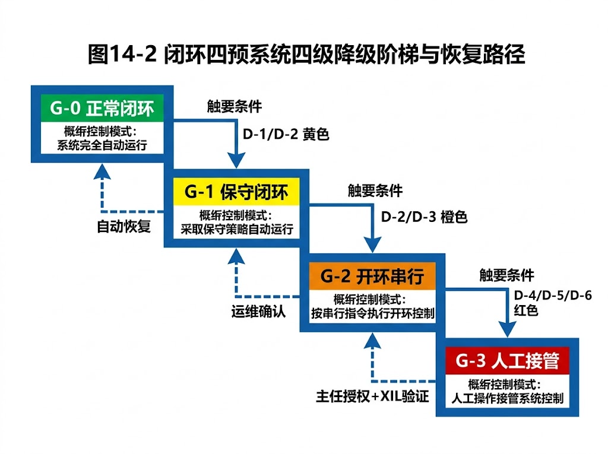

<!-- 变更日志
v1 2026-04-10: 排版统一与格式规范化
-->
# 第 14 章：四预工程标准

## 引言

在《水系统控制论》[1]（CHS）的 CPSS 统一框架下，"四预"——预报、预警、预演、预案——并非四个串行执行的业务环节，而是信息空间（Cyber）、物理空间（Physical）与社会空间（Social）在每一个控制时间步内完成的闭环耦合。这一认知的跃迁，意味着四预工程实施不能再沿用传统的"先预报、再预警、最后出预案"的瀑布式流程，而必须建立严格的闭环工程标准：时间步长如何选取、模型之间如何耦合、端到端响应时间如何约束、以及当闭环无法维持时如何安全降级。本章即为上述四个核心维度提供可落地的工程规范。关于四预闭环的控制论定义，参见 T1 第八章；关于闭环/开环范式的理论基础，参见 T1 第八章§8.1.6-§8.1.7；关于 MPC 作为步长级四预的工程实现，参见 T2a 第七章。

---

## 14.1 四预闭环的标准化框架

### 14.1.1 闭环四预与开环四预的定义区分

在传统水利信息化实践中，四预往往以**开环串行**方式组织：水文预报模型出结果后，人工判断是否预警；预警发出后，调度员手动翻阅预案文档，从中选取一条执行。这种模式的核心缺陷在于——**每一步之间存在不可控的人工延迟和信息衰减**，且预案是静态文档而非实时决策。

在 CHS 框架下，闭环四预要求在单个控制步长 $\Delta t$ 内，自动完成以下耦合循环：

$$
\text{Sensing} \xrightarrow{\Delta t_1} \text{预报（前向推演）} \xrightarrow{\Delta t_2} \text{预警（ODD 状态评估）} \xrightarrow{\Delta t_3} \text{预演（XIL 验证）} \xrightarrow{\Delta t_4} \text{预案（控制输出）}
$$

其中 $\Delta t_1 + \Delta t_2 + \Delta t_3 + \Delta t_4 \leq \Delta t$，即全部四预环节的计算必须在一个步长周期内完成。

**表 14-1　开环四预与闭环四预的对照**

| 维度 | 开环四预（传统模式） | 闭环四预（CHS 模式） |
|------|---------------------|---------------------|
| 执行方式 | 串行、人工衔接 | 步长内自动耦合 |
| 预报 | 离线批处理，周期 $\geq$ 1 h | 在线滚动，周期 $= \Delta t$ |
| 预警 | 人工研判、电话通知 | ODD 状态向量实时评估 |
| 预演 | 不存在或仅桌面推演 | XIL 四层自动验证 |
| 预案 | 静态文档，事先编制 | 动态决策，实时优化输出 |
| 端到端延迟 | 小时级至天级 | 步长级（分钟至亚分钟） |
| 反馈闭环 | 无（开环） | 有（执行结果回馈感知层） |

### 14.1.2 四预在 CPSS 三空间中的定位

四预并非独立于 CPSS 的外部流程，而是 CPSS 三空间耦合的具体表现形式：

- **预报** = Cyber 空间的 Digital Twin 前向推演 + Physical 空间的实时感知融合。预报模型在 Cyber 空间中以当前物理状态为初始条件，推演未来 $T_h$（预见期）内的系统轨迹。
- **预警** = Cyber 空间的 ODD 状态评估。将预报轨迹与 ODD 边界（第 5 章）进行实时比对，判断系统是否正在接近或即将越出运行设计域。
- **预演** = Cyber 空间的 XIL 验证环路。在 MIL/SIL/HIL/OIL 四层验证环境中（参见 T2a ch13），对候选控制策略进行快速仿真校验，确保其在虚拟环境中不会导致安全包络（第 6 章）被击穿。
- **预案** = Social 空间的决策输出 + Physical 空间的执行器动作。预案不再是一份静态的 Word 文档，而是优化求解器在约束空间内实时计算出的最优控制序列 $\mathbf{u}^*(t)$。

### 14.1.3 宏观四预与实时四预的双层架构

四预闭环并非只在一个时间尺度上运行。CHS 框架将其分为两个嵌套层级：

**宏观四预（Skill 级，天至周尺度）**：面向中长期调度决策，如汛前预泄方案比选、跨流域水量分配优化。宏观四预采用**开环优化 + 滚动修正**的策略：每隔数小时至一天重新求解一次全局优化问题，根据最新预报更新边界条件后滚动推进。其核心特征是允许人工审核介入。

**实时四预（步长级，分钟至小时尺度）**：面向在线闭环控制，如闸群联合调控、泵站变频优化。实时四预要求在每个 $\Delta t$ 内完成感知—推演—评估—验证—决策的全闭环，不允许人工干预打断控制回路。

**表 14-2　宏观四预与实时四预的对照**

| 维度 | 宏观四预 | 实时四预 |
|------|---------|---------|
| 时间尺度 | 天至周 | 分钟至小时 |
| 步长 $\Delta t$ | 1 h – 24 h | 1 s – 15 min |
| 优化模式 | 开环优化 + 滚动修正 | 闭环 MPC / RL |
| 人工介入 | 允许且必须审核 | ODD 内禁止干预 |
| 预报模型 | 大尺度水文模型 | 在线简化模型 / 数据驱动代理模型 |
| 预演方式 | 离线方案比选 | 在线 XIL 快速验证 |
| WNAL 等级要求 | L1–L2 | L3–L4 |
| 典型应用 | 汛前预泄、年度水量分配 | 闸群实时联调、突发污染拦截 |

两层之间通过**边界条件传递**实现嵌套：宏观四预输出的中长期调度方案作为实时四预的约束上界和参考轨迹；实时四预的执行偏差通过状态反馈回传至宏观层，触发滚动修正。

---

## 14.2 时间步长标准

### 14.2.1 各控制层级的步长要求

时间步长 $\Delta t$ 是闭环四预的基本节拍。步长选择过短，计算负荷无法承受；过长，则系统对扰动的响应滞后，可能错过安全窗口。CHS 按控制层级规定如下步长范围：

**表 14-3　各控制层级的步长要求**

| 控制层级 | 典型对象 | 步长范围 | 典型值 | 约束来源 |
|---------|---------|---------|--------|---------|
| L0（本地保护） | 单台水泵、单座闸门 | 10 ms – 1 s | 100 ms | PLC 扫描周期 |
| L1（站级控制） | 单座泵站、单座闸站 | 1 s – 5 min | 30 s | 站内水力响应时间 |
| L2（区间控制） | 渠段、管网分区 | 1 min – 30 min | 5 min | 水力波传播延时 |
| L3（流域控制） | 跨流域调水干线 | 5 min – 1 h | 15 min | 全线水力传播延时 |
| L4（战略调度） | 多流域联合优化 | 1 h – 24 h | 6 h | 气象预报更新周期 |

### 14.2.2 步长选择原则

**原则一：覆盖最大水力传播延时的 2 倍**

设控制对象的最大水力传播延时为 $\tau_{\max}$（即扰动从上游传播至下游最远控制断面所需的时间），则步长应满足：

$$
\Delta t \geq 2\,\tau_{\max}
$$

此要求确保在一个步长内，控制器能够"看到"扰动传播的完整效应并做出响应。若 $\Delta t < \tau_{\max}$，控制器将在扰动效应尚未充分显现时就做出决策，导致过度校正和振荡。

**原则二：Nyquist 采样约束**

若系统中存在需要抑制的最高频扰动，其周期为 $T_d$，则步长必须满足：

$$
\Delta t \leq \frac{T_d}{2}
$$

对于明渠系统，主要扰动频率通常由闸门操作引起的非恒定流波动决定。

**原则三：步长与模型精度的匹配**

步长不能小于模型的有效分辨率。当步长 $\Delta t$ 小于模型的时间分辨率 $\Delta t_{\text{model}}$ 时，模型输出在相邻步长之间不包含新信息，闭环退化为伪闭环。参见 T2a ch12 Theorem 3 关于模型精度与控制性能的定量关系。

### 14.2.3 步长内计算预算约束

闭环四预的硬约束是：**在一个步长 $\Delta t$ 内，全部四预环节的计算必须完成**。定义计算预算比 $\eta$：

$$
\eta = \frac{\Delta t_{\text{compute}}}{\Delta t} \leq \eta_{\max}
$$

其中 $\Delta t_{\text{compute}} = \Delta t_1 + \Delta t_2 + \Delta t_3 + \Delta t_4$ 为四预各环节的计算耗时之和。标准规定：

**表 14-4　计算预算比上限**

| WNAL 等级 | $\eta_{\max}$ | 说明 |
|-----------|--------------|------|
| L1–L2 | 0.80 | 预留 20% 裕度用于通信和缓冲 |
| L3 | 0.60 | 更高安全裕度，应对计算抖动 |
| L4 | 0.50 | 最高安全等级，需冗余计算通道 |

当 $\eta > \eta_{\max}$ 时，系统必须触发以下应对措施之一：（a）切换至低精度快速模型；（b）增大步长 $\Delta t$（需重新校核稳定性）；（c）触发降级流程（详见 14.5 节）。

---

## 14.3 模型耦合接口规范

### 14.3.1 四预模型链的耦合架构

闭环四预涉及三类核心模型的紧耦合：

- **预报模型**（水文 / 气象 / 需水预测）：输出未来时段的边界条件序列 $\{\mathbf{d}(t+k\Delta t)\}_{k=1}^{N_h}$，其中 $N_h$ 为预见期内的步长数。
- **水力模型**（水动力学 / 管网水力学）：以预报边界条件和当前控制输入为驱动，计算系统状态的时空演化 $\mathbf{x}(t+k\Delta t)$。
- **优化模型**（MPC / RL / 确定性优化）：在水力模型提供的预测轨迹上，求解满足约束的最优控制序列 $\mathbf{u}^*(t:t+N_c\Delta t)$。

三类模型的耦合关系可表示为：

$$
\underbrace{\mathbf{d}(t)}_{\text{预报模型}} \;\longrightarrow\; \underbrace{f(\mathbf{x}, \mathbf{u}, \mathbf{d})}_{\text{水力模型}} \;\longrightarrow\; \underbrace{\min_{\mathbf{u}} J(\mathbf{x}, \mathbf{u})}_{\text{优化模型}} \;\longrightarrow\; \mathbf{u}^*(t)
$$

### 14.3.2 数据交换格式标准

模型间数据交换必须采用标准化的向量格式，消除语义歧义（参见第 7 章 Water-CIM 规范）。

**表 14-5　模型耦合数据交换规范**

| 接口 | 数据内容 | 向量格式 | 时标要求 | 量纲约束 |
|------|---------|---------|---------|---------|
| 预报→水力 | 边界条件序列 $\mathbf{d}$ | `[time, node_id, variable, value, uncertainty]` | UTC，精度 $\leq 1$ s | SI 单位制 |
| 水力→优化 | 状态预测 $\hat{\mathbf{x}}$ | `[time, node_id, state_var, value, gradient]` | 与步长对齐 | SI 单位制 |
| 优化→执行 | 控制序列 $\mathbf{u}^*$ | `[time, actuator_id, setpoint, rate_limit]` | 与步长对齐 | 工程单位（需映射表） |
| 执行→感知 | 反馈观测 $\mathbf{y}$ | `[time, sensor_id, measured_var, value, quality_flag]` | 实时，精度 $\leq$ 采样周期 | SI 单位制 |

每条数据记录必须携带**质量标志（Quality Flag）**，取值为 `GOOD`、`SUSPECT`、`BAD` 三级。当优化模型接收到 `BAD` 标志的状态数据时，必须自动切换至鲁棒优化模式或触发降级。

### 14.3.3 模型版本一致性要求

在闭环四预中，三类模型的版本必须严格匹配。版本不一致将导致模型间的隐式假设冲突，产生不可预测的耦合误差。

标准规定：

1. **版本锁定**：投入在线运行的模型组合必须经过联合标定（Joint Calibration），并以版本号三元组 `(预报版本, 水力版本, 优化版本)` 进行统一管理。
2. **热更新协议**：当需要在线更新某一模型时，必须采用"影子运行（Shadow Running）"机制——新版本模型在后台并行运行至少 $N_{\text{shadow}}$ 个步长，其输出与当前版本的偏差不超过阈值 $\epsilon_{\text{ver}}$ 后，方可切换。
3. **回滚能力**：系统必须保留前一版本的完整镜像，在新版本出现异常时可在一个步长内回滚。

### 14.3.4 FMI/FMU 标准在四预耦合中的应用

功能模拟接口（FMI, Functional Mock-up Interface）标准为异构模型的耦合提供了工业级解决方案（参见 T2a ch13）。在四预工程中，每个模型被封装为独立的 FMU（Functional Mock-up Unit），通过标准化的输入 / 输出端口实现耦合。

**表 14-6　FMU 封装要求**

| FMU 类型 | 输入端口 | 输出端口 | 求解器类型 | 通信步长 |
|---------|---------|---------|-----------|---------|
| 预报 FMU | 实时观测 $\mathbf{y}(t)$ | 边界条件 $\mathbf{d}(t+k\Delta t)$ | 自带求解器（Co-Simulation） | $\Delta t$ |
| 水力 FMU | $\mathbf{d}$, $\mathbf{u}$ | $\hat{\mathbf{x}}(t+k\Delta t)$ | 自带求解器（Co-Simulation） | $\leq \Delta t$ |
| 优化 FMU | $\hat{\mathbf{x}}$, 约束集 | $\mathbf{u}^*(t)$ | 外部求解器调用 | $\Delta t$ |

FMI 2.0 的 Co-Simulation 模式允许各 FMU 以不同的内部步长独立推进，仅在通信点交换数据。这一特性天然适配四预闭环中"预报模型步长粗、水力模型步长细"的异步需求。

---

## 14.4 闭环响应时间指标

### 14.4.1 端到端延迟的定义

闭环响应时间 $T_{\text{e2e}}$ 定义为：从物理空间发生扰动（如上游来水突增）的时刻 $t_0$，到执行器完成响应动作（如下游闸门调整到位）的时刻 $t_f$，之间的总延迟：

$$
T_{\text{e2e}} = t_f - t_0 = \underbrace{T_{\text{sense}}}_{\text{感知}} + \underbrace{T_{\text{comm}}}_{\text{通信}} + \underbrace{T_{\text{compute}}}_{\text{计算}} + \underbrace{T_{\text{comm}}'}_{\text{下行通信}} + \underbrace{T_{\text{act}}}_{\text{执行器动作}}
$$

### 14.4.2 各环节时间预算分配

端到端延迟的各环节必须按预算严格管控。以 L3 级流域控制（$\Delta t = 15\ \text{min}$）为例：

**表 14-7　端到端时间预算分配（L3 级示例）**

| 环节 | 符号 | 预算上限 | 占比 | 关键约束 |
|------|------|---------|------|---------|
| 感知与数据融合 | $T_{\text{sense}}$ | 30 s | 3.3% | 传感器采样 + 数据质量校验 |
| 上行通信 | $T_{\text{comm}}$ | 15 s | 1.7% | 边缘→云端，含重传 |
| 预报推演 | $T_1$ | 120 s | 13.3% | 在线模型前向推演 |
| 预警评估 | $T_2$ | 30 s | 3.3% | ODD 状态向量比对 |
| 预演验证 | $T_3$ | 180 s | 20.0% | XIL 快速仿真 |
| 优化求解 | $T_4$ | 120 s | 13.3% | MPC 求解器收敛 |
| 下行通信 | $T_{\text{comm}}'$ | 15 s | 1.7% | 云端→边缘→PLC |
| 执行器动作 | $T_{\text{act}}$ | 120 s | 13.3% | 闸门行程 / 水泵变频 |
| **安全裕度** | $T_{\text{margin}}$ | 270 s | 30.0% | 应对通信抖动、计算波动 |
| **合计** | $T_{\text{e2e}}$ | **900 s** | **100%** | **= $\Delta t$** |

### 14.4.3 不同 WNAL 等级的响应时间要求

**表 14-8　WNAL 等级与响应时间要求**

| WNAL 等级 | 最大 $T_{\text{e2e}}$ | 安全裕度比 | 典型场景 |
|-----------|----------------------|-----------|---------|
| L1 | $\leq 2\,\Delta t$ | $\geq 10\%$ | 人工辅助，允许跨步长响应 |
| L2 | $\leq 1.5\,\Delta t$ | $\geq 20\%$ | 半自动，人工确认后执行 |
| L3 | $\leq \Delta t$ | $\geq 30\%$ | 全自动闭环，步长内闭合 |
| L4 | $\leq 0.5\,\Delta t$ | $\geq 40\%$ | 高可靠自主，冗余计算通道 |

### 14.4.4 性能劣化的监控指标

闭环四预系统在长期运行中可能因硬件老化、模型漂移、通信拥塞等原因出现性能劣化。标准要求对以下指标进行持续监控：

1. **计算超时率** $R_{\text{timeout}}$：在过去 $N$ 个步长中，$T_{\text{compute}} > T_{\text{budget}}$ 的步长占比。当 $R_{\text{timeout}} > 5\%$ 时触发黄色预警，$> 15\%$ 时触发降级。
2. **模型预测偏差** $\bar{e}_{\text{pred}}$：预报模型输出与实际观测的滚动平均绝对误差。偏差持续增大表明模型需要重新标定。
3. **优化求解收敛率** $R_{\text{conv}}$：优化器在预算时间内成功收敛的步长占比。当 $R_{\text{conv}} < 90\%$ 时，需检查约束是否过紧或模型是否失配。
4. **通信丢包率** $R_{\text{loss}}$：上下行通信链路的数据包丢失率。当 $R_{\text{loss}} > 1\%$ 时触发通信链路冗余切换。

---

## 14.5 开环降级条件与流程

### 14.5.1 从闭环到开环降级的触发条件

闭环四预系统并非在所有情况下都能维持闭环运行。当以下条件中的任一条被触发时，系统必须启动降级流程：

**表 14-9　降级触发条件**

| 编号 | 触发条件 | 判据 | 严重等级 |
|------|---------|------|---------|
| D-1 | 计算超时 | 连续 $n_1$ 个步长 $\eta > \eta_{\max}$ | 黄色 |
| D-2 | 模型发散 | 预测误差 $e > e_{\text{crit}}$ | 橙色 |
| D-3 | 通信中断 | 上行或下行链路中断 $> T_{\text{comm,max}}$ | 橙色 |
| D-4 | ODD 越界 | 系统状态离开 ODD 边界 | 红色 |
| D-5 | 安全包络逼近 | 状态距安全包络 $< \delta_{\text{safe}}$ | 红色 |
| D-6 | 执行器故障 | 执行器反馈与指令偏差 $> \epsilon_{\text{act}}$ | 红色 |

其中，$n_1$、$e_{\text{crit}}$、$T_{\text{comm,max}}$、$\delta_{\text{safe}}$、$\epsilon_{\text{act}}$ 等阈值参数须在系统标定阶段根据具体工程条件确定，并纳入运行规程。

### 14.5.2 降级层级

降级并非"一刀切"地从全自动跳到人工接管，而是按照控制能力的逐级收缩有序进行：

**表 14-10　四级降级层级**

| 降级等级 | 名称 | 控制模式 | 触发条件 | 恢复条件 |
|---------|------|---------|---------|---------|
| G-0 | 正常闭环 | 闭环四预全功能运行 | — | — |
| G-1 | 保守闭环 | 切换至低精度快速模型，加大安全裕度 | D-1 或 D-2（黄色） | 连续 $n_2$ 个步长恢复正常 |
| G-2 | 开环串行 | 预报 + 预警仍运行，但预演和优化停止；按上一个有效预案的固定策略执行 | D-2（橙色）或 D-3 | 模型 / 通信恢复且通过在线校验 |
| G-3 | 人工接管 | 全部自动控制停止，控制权移交至人工调度员；系统仅提供监测数据 | D-4 / D-5 / D-6（红色） | 人工确认安全 + 系统重新通过 XIL 验证 |

### 14.5.3 降级切换的无扰动转移要求

降级切换的核心工程难点在于**无扰动转移（Bumpless Transfer）**。当控制模式从 G-0 切换至 G-1 或 G-2 时，执行器的控制指令不能出现阶跃跳变，否则将引起水力瞬变，甚至触发水锤效应。

无扰动转移的工程要求：

1. **输出跟踪**：备用控制器（低精度模型或固定策略）在后台持续跟踪当前控制器的输出。切换瞬间，备用控制器的输出与当前输出的偏差不得超过 $\epsilon_{\text{bump}}$：

$$
\|\mathbf{u}_{\text{backup}}(t_s) - \mathbf{u}_{\text{primary}}(t_s^-)\| \leq \epsilon_{\text{bump}}
$$

2. **渐进过渡**：当无法满足瞬时无扰条件时，允许在 $N_{\text{trans}}$ 个步长内通过线性插值完成过渡：

$$
\mathbf{u}(t_s + k\Delta t) = \alpha_k \,\mathbf{u}_{\text{primary}}(t_s^-) + (1 - \alpha_k)\,\mathbf{u}_{\text{backup}}(t_s + k\Delta t), \quad \alpha_k = 1 - \frac{k}{N_{\text{trans}}}
$$

3. **水力冲击校核**：降级切换方案必须在 HIL 环境中经过水力瞬变仿真验证，确认最大压力波动不超过管道 / 渠道的设计承压能力。

### 14.5.4 从降级恢复到闭环的验证流程

从降级状态恢复至闭环运行，不能简单地"重新开机"。标准规定以下恢复验证流程：

1. **故障消除确认**：触发降级的根因已被排除（如通信恢复、模型重新标定完成）。
2. **影子运行验证**：恢复的闭环控制器在后台影子运行 $N_{\text{shadow}}$ 个步长，其输出与当前降级模式的输出进行比对。
3. **偏差合规检查**：影子运行期间，闭环输出与降级输出的偏差、以及闭环输出与安全包络的距离均满足预设阈值。
4. **切换授权**：
   - G-1 → G-0：自动切换，无需人工授权。
   - G-2 → G-0 或 G-1：需边缘端运维人员确认。
   - G-3 → 任何自动模式：需调度中心值班主任授权，并在切换后的前 $N_{\text{watch}}$ 个步长内保持人工监护。

---

## 14.6 四预闭环的验证与认证标准

### 14.6.1 MIL/SIL/HIL/OIL 四层验证要求

四预闭环系统的验证必须覆盖从纯软件仿真到真实运行的全链条。CHS 按 XIL 四层架构规定验证要求：

**表 14-11　XIL 四层验证要求**

| 验证层级 | 全称 | 验证内容 | 通过标准 | 执行频率 |
|---------|------|---------|---------|---------|
| MIL | Model-in-the-Loop | 算法逻辑正确性，模型耦合一致性 | 全部设计工况通过，无数值发散 | 每次模型更新后 |
| SIL | Software-in-the-Loop | 嵌入式代码与算法模型的一致性 | 与 MIL 结果偏差 $< \epsilon_{\text{SIL}}$ | 每次代码发布后 |
| HIL | Hardware-in-the-Loop | 含实际 PLC / RTU 的闭环响应 | 端到端延迟满足表 14-8 要求 | 每季度 / 重大变更后 |
| OIL | Operation-in-the-Loop | 真实系统在线验证 | 连续 $N_{\text{OIL}}$ 个步长无违规 | 首次上线 + 年度复核 |

### 14.6.2 验证覆盖度指标

验证的充分性用**场景覆盖度**和**状态空间覆盖度**两个维度衡量：

**场景覆盖度** $C_{\text{scenario}}$：

$$
C_{\text{scenario}} = \frac{N_{\text{tested}}}{N_{\text{total}}} \times 100\%
$$

其中 $N_{\text{total}}$ 为设计工况库中的场景总数（含正常工况、边界工况、故障工况），$N_{\text{tested}}$ 为已通过验证的场景数。标准要求：

- MIL/SIL 层：$C_{\text{scenario}} \geq 95\%$
- HIL 层：$C_{\text{scenario}} \geq 80\%$（受硬件资源限制，允许采用等价类划分缩减用例）
- OIL 层：$C_{\text{scenario}} \geq 60\%$（受真实工况可获得性限制）

**状态空间覆盖度** $C_{\text{state}}$：将系统的多维状态空间网格化后，验证轨迹所经过的网格单元占比。要求 $C_{\text{state}} \geq 70\%$（MIL/SIL 层）。

### 14.6.3 认证门槛与 WNAL 等级的关联

不同 WNAL 等级的系统，其四预闭环认证门槛递增：

**表 14-12　WNAL 等级与认证要求**

| WNAL 等级 | 必须通过的 XIL 层级 | 最低场景覆盖度 | 附加要求 |
|-----------|-------------------|--------------|---------|
| L1 | MIL | 80% | 无 |
| L2 | MIL + SIL | 90% | 降级流程桌面推演 |
| L3 | MIL + SIL + HIL | 95% | 降级流程 HIL 验证 + OIL 试运行 $\geq 30$ 天 |
| L4 | MIL + SIL + HIL + OIL | 98% | 全降级路径 OIL 验证 + 年度复核 |

### 14.6.4 持续合规监控

认证并非一次性事件。四预闭环系统在运行期间必须接受持续合规监控：

1. **性能基线比对**：每个运行周期（月 / 季）将系统的关键性能指标（KPI）与认证时的基线进行比对。当任一 KPI 劣化超过 $\delta_{\text{KPI}}$ 时，触发复核流程。
2. **模型漂移检测**：通过统计假设检验（如 Page-Hinkley 检测）持续监控预报模型和水力模型的预测偏差分布是否发生显著变化。
3. **变更影响评估**：任何对四预闭环系统的变更（软件更新、硬件替换、参数调整）都必须通过变更影响评估，确定需要重新执行哪些层级的验证。
4. **事件驱动审计**：当系统发生降级事件、安全包络逼近事件或人工接管事件时，必须在 48 小时内完成事件审计，分析根因并形成整改报告。

---

## 参考文献

[1] 雷晓辉 等.《水系统控制论》. 中国水利水电出版社.

[2] IEC 61970/61968, Common Information Model (CIM) for Energy Management System Integration.

[3] Modelica Association. Functional Mock-up Interface (FMI) Standard, Version 2.0, 2014.

[4] T/CESA 1474-2025,《智慧调水 闸站技术架构通用要求》.

[5] ISO 26262, Road Vehicles — Functional Safety, 2018.

[6] 中国电子工业标准化技术协会. 智慧调水系列团体标准（15 项）, 2025.

[7] SAE J3016, Taxonomy and Definitions for Terms Related to Driving Automation Systems, 2021.

[8] IEC 62443, Industrial Communication Networks — Network and System Security.

[9] Page, E.S. Continuous inspection schemes. Biometrika, 1954, 41(1/2): 100–115.

---

## 课后习题

**习题 14-1**　某长距离明渠调水工程，渠道全长 120 km，水深 3.5 m，平均流速 1.2 m/s。试计算：（a）水力波（重力波）从首端传播至末端的最大延时 $\tau_{\max}$（提示：重力波速 $c = \sqrt{gh}$）；（b）根据 14.2.2 节原则一，L3 级控制的推荐步长 $\Delta t$；（c）若步长取 15 min，计算预算比上限为 0.60，则四预计算的总时间预算为多少秒？

**习题 14-2**　在表 14-7 的 L3 级时间预算分配中，假设因通信链路升级，上下行通信延迟各减少至 5 s。试重新分配释放出的 20 s 时间预算，并说明你的分配策略及理由。

**习题 14-3**　某泵站群闭环四预系统运行一个月后，监控数据显示：计算超时率 $R_{\text{timeout}} = 8\%$，模型预测偏差 $\bar{e}_{\text{pred}}$ 较基线增大 35%，优化求解收敛率 $R_{\text{conv}} = 87\%$。请根据 14.4.4 节和 14.5 节的标准：（a）判断系统当前应处于何种降级等级；（b）提出至少三项具体整改措施；（c）说明恢复至正常闭环运行需要满足的验证条件。

**习题 14-4**　论述宏观四预与实时四预的嵌套关系。当宏观四预的滚动修正周期为 6 小时、实时四预的步长为 15 分钟时，一个完整的宏观步长内包含多少个实时步长？若宏观层在某次滚动修正中将某闸门的目标水位上调 0.2 m，实时层应如何平滑过渡以避免水力冲击？

**习题 14-5**　某 L3 级系统需要将预报模型从 v2.3 升级至 v3.0（算法架构有重大变化）。根据 14.3.3 节的模型版本一致性要求和 14.6.1 节的验证标准，请设计完整的升级与验证方案，包括：（a）影子运行的最少步长数 $N_{\text{shadow}}$ 的确定原则；（b）需要重新执行的 XIL 验证层级；（c）上线切换的授权流程。
