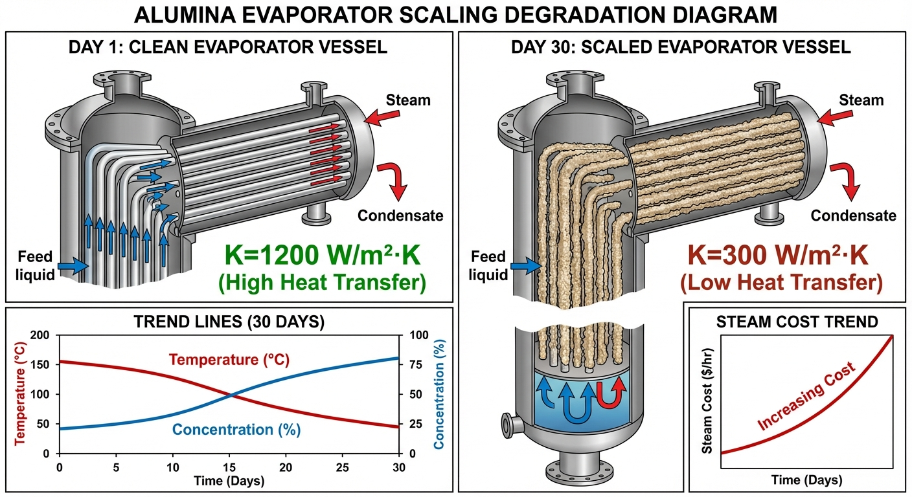
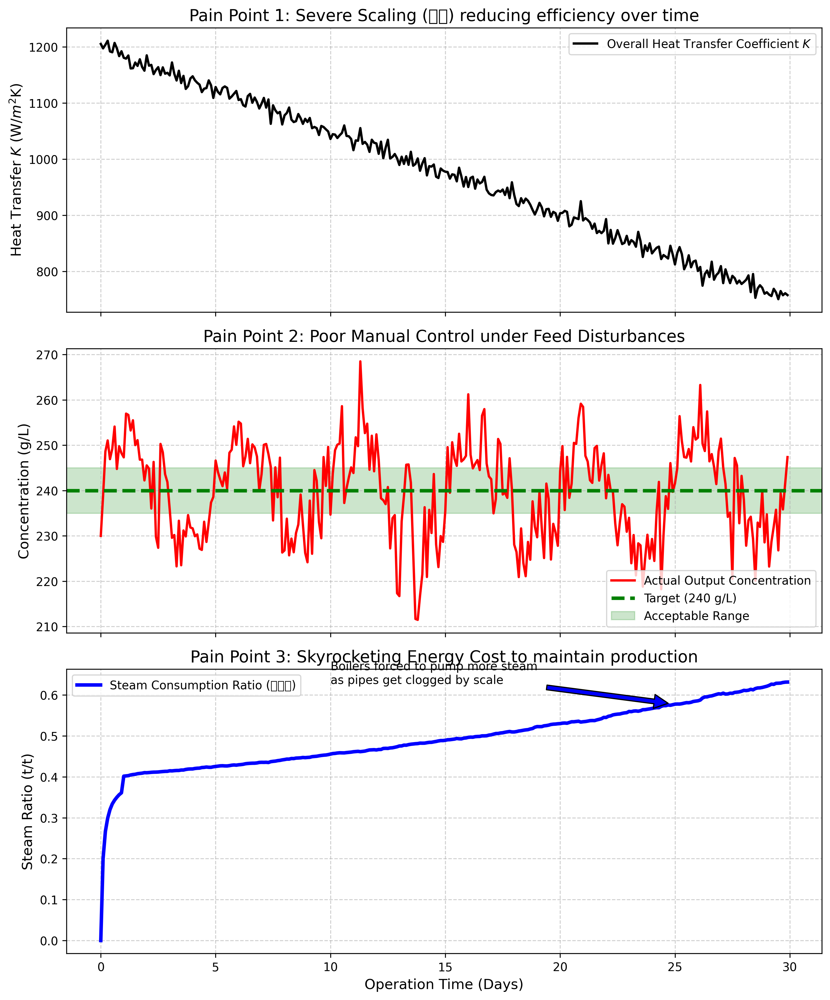

# 第 1 章：氧化铝蒸发工序的行业痛点：燃烧的黑洞

## 1. 学习目标
本章探讨复杂冶金流程中高能耗的核心环节——氧化铝蒸发工序。揭示在缺乏智能控制的情况下，传统工业是如何被"结疤"、"波动"和"高能耗"反复困扰的。
读者需要掌握：
1. 拜耳法中蒸发工序的物理作用与工艺流程。
2. "结疤"现象对传热系数的严重衰减机理。
3. 汽耗比的经济学意义及其计算方法。
4. 人工控制在面对强非线性和时滞时的失效表现。

## 2. 教材理论：为什么我们要"熬汤"？
在铝工业中，目前全球 $95\%$ 以上的氧化铝都是通过**拜耳法（Bayer Process）**生产的。
拜耳法本质上就是用高温的苛性钠（氢氧化钠）溶液去"煮"铝土矿，把里面的铝元素溶解出来，然后再让它结晶沉淀。
这个过程需要海量的碱液。为了降低成本，工厂会把结晶完的"母液"重新循环去煮新的铝土矿。
但问题是：母液在循环过程中，吸收了大量的洗涤水，变得太稀了（浓度通常只有 $140 \, g/L$）。如果用这么稀的碱液去煮矿，根本无法达到溶出要求。
这就引出了本书的核心装置——**蒸发器（Evaporator）**。

蒸发器的任务十分明确：**将稀碱液浓缩至工艺要求的浓度**。
把稀释的母液送进巨大的加热罐里，通入锅炉烧出来的 $160^\circ C$ 以上的新鲜蒸汽，把母液里的水分大量蒸发掉，直到它的浓度被浓缩到 $240 \, g/L$ 的达标水平。
这个工序是整个拜耳法流程中能源消耗最为集中的环节。一个大型氧化铝厂，每天要烧掉几千吨的煤来产生蒸汽。蒸发工序的能耗占了整个拜耳法工厂的 $30\% \sim 40\%$。

因此，厂长每天盯着的唯一核心指标就是**"汽耗比"**：每蒸发一吨水，需要消耗多少吨的新鲜蒸汽？（越低越好，理论极限取决于多效蒸发的效数）。

### 2.1 蒸发过程的基本热力学方程

蒸发过程的核心是传热与传质的耦合。根据牛顿冷却定律，单效蒸发器的传热速率可以表示为：

$$Q = K \cdot A \cdot \Delta T_{eff} \tag{1.1}$$

其中 $Q$ 为传热量（$kW$），$K$ 为总传热系数（$W/(m^2 \cdot K)$），$A$ 为换热面积（$m^2$），$\Delta T_{eff}$ 为有效温差（$K$）。

有效温差并非加热蒸汽温度与溶液沸点的简单差值，还需要扣除沸点升高（BPE）和液柱静压引起的温差损失：

$$\Delta T_{eff} = T_{steam} - T_{boil} - \Delta T_{BPE} - \Delta T_{hyd} \tag{1.2}$$

蒸发量 $W$（$kg/s$）由传热量与汽化潜热的比值决定：

$$W = \frac{Q}{\lambda} = \frac{K \cdot A \cdot \Delta T_{eff}}{\lambda} \tag{1.3}$$

其中 $\lambda$ 为溶液在工作压力下的汽化潜热（$kJ/kg$）。

由质量守恒，进料流量 $F$、进料浓度 $x_F$、出料浓度 $x_P$ 之间满足：

$$F \cdot x_F = (F - W) \cdot x_P \tag{1.4}$$

从式（1.3）可以直观看出，当传热系数 $K$ 因结疤而下降时，若要维持同样的蒸发量 $W$，必须增大蒸汽供给量以提高 $\Delta T_{eff}$，这正是能耗急剧上升的数学根源。

### 2.2 蒸发过程的工艺流程

在工业实践中，蒸发器通常采用降膜式或升膜式结构。降膜蒸发器的工作原理是：母液从蒸发器顶部进入，沿加热管内壁形成薄膜向下流动，管外通入加热蒸汽。由于液膜很薄，传热效率高，蒸发速度快。但降膜蒸发器对进料流量和浓度的稳定性要求很高，一旦液膜断裂，加热管将直接暴露在高温蒸汽中，可能导致局部过热和干烧事故。

升膜蒸发器则相反，母液从底部进入，在加热管内被加热至沸腾后，蒸汽-液体混合物沿管壁上升。这种结构对进料波动的容忍度较好，但传热效率不如降膜式。

在氧化铝拜耳法工艺中，蒸发工序位于"溶出"与"分解"之间。溶出工序将铝土矿中的氧化铝溶解到苛性碱液中，得到铝酸钠溶液（即母液）。分解工序则将铝酸钠溶液中的氢氧化铝结晶出来。蒸发工序的核心任务是将经过分解后被大量洗水稀释的母液重新浓缩至适合溶出的浓度。

整个蒸发系统通常由多台蒸发器串联组成（多效蒸发），辅以预热器、冷凝器、真空泵等附属设备。系统的自动化程度和控制精度直接影响到全厂的能源消耗和产品质量。

### 2.3 传统工业的三座大山

在真实车间里，老调度员每天都在被三个难题折磨：

1. **剧烈波动的进料**：上一道工序送过来的母液，它的浓度、温度、流量每分钟都在变化。进料浓度 $x_F$ 的波动直接通过式（1.4）影响出料质量。
2. **人工操作的滞后与过冲**：调度员看着仪表盘，发现出料浓度低了，就赶紧去开大蒸汽阀门。但蒸发器是一个巨大的热容罐，水烧开需要时间。等浓度升上来的时候，往往已经"烧过头"了。结果就是浓度像过山车一样上下剧烈震荡。
3. **最严重的隐患——结疤**：母液里含有很多硅酸盐等杂质。随着温度升高，这些杂质会像水垢一样牢牢地结在加热管的内壁上。这层"疤"不仅堵塞管子，还形成了很好的"隔热层"。随着结疤一天天变厚，管子的**传热系数 $K$** 断崖式下降。根据式（1.3），为了达到同样的蒸发量，操作员只能不断把蒸汽阀门开得更大。

结疤层的热阻可以用傅里叶导热定律定量描述。设结疤层厚度为 $\delta_s$，其导热系数为 $k_s$，则结疤引起的附加热阻为：

$$R_s = \frac{\delta_s}{k_s} \tag{1.5}$$

总传热系数 $K$ 与各层热阻的关系为：

$$\frac{1}{K} = \frac{1}{h_i} + R_s + \frac{\delta_w}{k_w} + \frac{1}{h_o} \tag{1.6}$$

其中 $h_i$、$h_o$ 分别为管内外对流换热系数，$\delta_w / k_w$ 为管壁热阻。随着 $R_s$ 增大，$K$ 值显著下降，这就是结疤导致能耗失控的物理机制。

在实际生产中，结疤的成分主要包括方钠石（$Na_6Al_6Si_6O_{24} \cdot 2NaX$）和钙铝榴石等难溶硅酸盐。这些物质的析出速率与母液过饱和度、温度以及流速密切相关。高温区（第一效）的结疤速率通常是低温区（末效）的 $2 \sim 3$ 倍。工业上采用的除垢方法包括酸洗（盐酸或硝酸）、碱煮和机械清扫。酸洗效果最好但对设备腐蚀较大，碱煮温和但耗时较长。

从经济角度分析，结疤问题的隐性成本远不止蒸汽浪费。每次停机洗罐需要 $24 \sim 72$ 小时，期间全线产量损失可达数百万元。此外，频繁洗罐还会加速加热管的腐蚀，缩短设备寿命。因此，精确预测最优洗罐时间、在经济性和设备寿命之间取得平衡，是蒸发工序管理的核心挑战之一。

当上述三个因素交织在一起时，人工控制将彻底失效，导致每天被白白烧掉的蒸汽价值高达数十万元。

## 3. 案例分析：理论与实践的桥梁（人工控制下结疤恶化与浓度震荡的全息仿真）

### 案例背景
某氧化铝厂的蒸发车间刚刚完成洗罐（清洗管道）。洗罐后第一天，管壁十分干净，传热系数高达 $1200 \, W/(m^2K)$，出料浓度稳定，车间主任非常满意。
然而，随着连续生产 30 天，噩梦开始降临。管壁内部正在以每天 $15$ 个单位的速度快速结疤。同时，前端洗水工序不够稳定，导致进料浓度在 $130 \sim 150 \, g/L$ 之间呈现显著的正弦震荡。
在这种恶劣的工况下，两班倒的操作员只能凭借经验，每半天去手动调节一次蒸汽主阀门，试图把出料浓度稳定在 $240 \, g/L$ 的目标线上。
作为新上任的智能制造总工程师，你编写了一套 Python 仿真程序，全面揭示了人工控制在这种工况下的严重不足。

### 问题描述
- **模拟周期**：连续生产 $30$ 天。
- **结疤恶化模型**：传热系数 $K_{actual}(t) = 1200 - 15t + Noise$。该模型反映了式（1.5）中结疤层厚度 $\delta_s$ 随时间线性增长的物理过程。
- **进料扰动模型**：进料浓度 $Feed_{conc}(t) = 140 + 10\sin(2\pi t / 5)$。
- **人工控制逻辑（Manual PI）**：
  - 采样与执行频率：很低（每 $0.5$ 天人工介入一次）。
  - 控制算法：简单的比例补偿 + 根据结疤程度被动提高基础蒸汽量。
- **任务**：推演 30 天内系统的传热能力 $K$、出料浓度、以及最重要的经济学指标"汽耗比"的恶化轨迹。

**物理场景与问题概化图：**

### 解题思路
本研究构建了一个包含退化机制的离散过程反馈仿真器：
1. **衰减注入**：利用线性下降叠加高斯噪声生成不可逆的传热系数 $K$ 退化曲线，对应式（1.6）中 $R_s$ 随时间增大。
2. **热质耦合方程**：在每个时间步，通过 $Q_{evap} \propto K \cdot Steam$ 算出实际蒸发水量，再利用物质守恒式（1.4）反算出料浓度。
3. **模拟人工操作的局限性**：通过 `i % 5 == 0` 的取模运算模拟人工的慢速采样；通过引入一个不合理的增益系数来模拟人工的"过度调节"。
4. **能耗监控**：实时计算（投入的蒸汽吨数 / 蒸发的水吨数），追踪吨水能耗。

### 代码执行与图表
> **学习提示**：我们在后台执行了包含内部结疤退化机制的控制循环。请对比表格中第 1 天和第 29 天的数据，可以清楚看到工业界对"智能控制"的迫切需求。

Source: `assets/ch01/ch01_pain_points.py`

**结疤恶化周期内人工控制下系统性崩坏追踪矩阵：**
|   Day |   Heat Transfer K |   Output Conc. (g/L) |   Steam Flow (t/h) |   Steam Ratio (t/t) | Plant Status                    |
|------:|------------------:|---------------------:|-------------------:|--------------------:|:--------------------------------|
|     1 |              1180 |                247.3 |               49.4 |               0.407 | Clean & Efficient               |
|    10 |              1036 |                234.7 |               59   |               0.463 | Scaling begins                  |
|    20 |               904 |                244.2 |               65.6 |               0.531 | Severe Scaling (Clean required) |
|    29 |               763 |                234.8 |               79.7 |               0.629 | Severe Scaling (Clean required) |

**热力学退化、出料剧烈震荡与能耗成本急剧上升痛点透视图：**

### 实验验证与结果剖析
通过这严苛的 30 天仿真，我们揭开了传统流程工业的三道硬伤：
- **热传导的劣化（上方子图）**：黑色的实线展示了"结疤"的严重影响。在第一天，管壁干净，传热系数高达 $1180$。但在强碱高温的烘烤下，硅酸盐牢牢附着在管壁上。到了第 29 天，传热系数已经跌到了 $763$，仅为初始值的 $64.7\%$。根据式（1.6），此时结疤热阻 $R_s$ 已经增长到与管壁热阻同一量级。管子像被穿上了厚厚的棉袄，热量根本传不进母液里。
- **人工操作的无效震荡（中间子图）**：看中间那条红色的出料浓度线。目标是绿线（$240 \, g/L$），由于进料在发生正弦波动，加上人工调节慢半拍，红线像失控的过山车一样在 $230 \sim 250$ 之间大幅震荡。根据式（1.4），出料浓度的波动幅度与进料浓度波动和蒸发量波动的叠加效应成正比。这种不合格的母液送到下一道工序，会引发整个工厂质量的连锁反应。
- **吞噬利润的黑洞（下方子图）**：看下方这条最关键的蓝线——汽耗比。在第 1 天，蒸发一吨水只需要 $0.407$ 吨的蒸汽（多效蒸发红利）。但是，随着管子结疤变厚，热量传不进去，为了维持产量，操作员只能不断地把蒸汽阀门越开越大。
看表格，到了第 29 天，为了蒸发同样的水，蒸汽消耗量从 $49.4 \, t/h$ 急剧上升到了 $79.7 \, t/h$。汽耗比快速上升到了 $0.629$，相比初始值增长了 $54.5\%$。这意味着每天都有大量的真金白银（煤炭）化作废气被排进了大气层。

### 工业部署与运行建议
1. **多变量模型预测控制（MPC）**：人工控制之所以失败，是因为人类的大脑无法同时处理"滞后"和"多变量耦合"。现代智能工厂必须部署模型预测控制（MPC）算法（将在第3章详细讲解）。MPC 能够"看到"未来 1 小时内进料浓度的变化，并精确地微调蒸汽阀门，把出料浓度牢牢地压在 $240 \, g/L$ 上。
2. **结疤状态在线预警体系**：在传统管理模式下，洗罐决策通常基于固定周期（如每月一次）或经验判断。这种粗放的管理方式要么导致过早洗罐（设备尚有余力，停机造成不必要的产量损失），要么导致过晚洗罐（结疤严重时能耗已经大幅攀升）。现代数字孪生架构下，与其等一个月后汽耗比过高才去洗罐，不如在后台部署一个数字孪生"卡尔曼滤波器"。让 AI 每天通过流量、温度和压力数据，逆向估算出当前管壁里的"隐形传热系数 $K$"。当 AI 发现 $K$ 跌破某条经济阈值（此时继续多烧蒸汽的成本 $>$ 停机洗罐的损失）时，立刻向厂长手机发送警报："到达最佳经济点，请立即停机除垢！" 这就是数据驱动给传统工业带来的显著优化效果。

## 4. 本章小结

1. 拜耳法蒸发工序是氧化铝生产中能耗最集中的环节，占全厂能耗的 $30\% \sim 40\%$，汽耗比是衡量其运行效率的核心经济指标。
2. 蒸发过程的传热速率由传热系数 $K$、换热面积 $A$ 和有效温差 $\Delta T_{eff}$ 共同决定，三者的数学关系由式（1.1）—（1.3）给出。
3. 结疤（Scaling）通过增大管壁热阻 $R_s$ 导致传热系数 $K$ 持续衰减，是蒸发工序能耗失控的物理根源。
4. 人工控制因采样频率低、响应滞后和过度调节，在面对进料扰动与结疤退化的双重压力时完全失效，出料浓度震荡幅度可达 $\pm 10 \, g/L$。
5. 30天仿真表明，结疤使汽耗比从 $0.407$ 上升至 $0.629$，蒸汽消耗量增加 $61.3\%$，经济损失十分严重。
6. 智能控制（MPC）与在线状态估计（卡尔曼滤波）是解决上述痛点的关键技术方向，将在后续章节中详细展开。
7. 蒸发器的选型（降膜式或升膜式）对控制难度有显著影响，降膜式对进料稳定性要求更高，但传热效率更优。
8. 结疤的经济损失不仅包括直接的蒸汽浪费，还包括停机洗罐的产量损失和设备腐蚀加速带来的间接成本。

## 5. 思考题

1. **传热系数计算**：某蒸发器管内对流换热系数 $h_i = 3000 \, W/(m^2 \cdot K)$，管外冷凝换热系数 $h_o = 8000 \, W/(m^2 \cdot K)$，管壁厚度 $\delta_w = 3 \, mm$，管壁导热系数 $k_w = 45 \, W/(m \cdot K)$。运行 20 天后结疤层厚度 $\delta_s = 2 \, mm$，结疤层导热系数 $k_s = 1.5 \, W/(m \cdot K)$。请分别计算清洁状态和结疤状态下的总传热系数 $K$，并分析传热能力的衰减百分比。
2. **经济性分析**：某蒸发系统日处理母液 $2400 \, t$，进料浓度 $140 \, g/L$，目标出料浓度 $240 \, g/L$。蒸汽单价 $200$ 元/吨。若人工控制的汽耗比为 $0.60$，智能控制可将汽耗比降至 $0.42$，请计算智能控制每月可节省的蒸汽费用。
3. **结疤预警模型**：已知某蒸发器洁净状态传热系数 $K_0 = 1200 \, W/(m^2 \cdot K)$，结疤速率 $\alpha = 15 \, W/(m^2 \cdot K \cdot d)$。当传热系数降至 $K_{min} = 750 \, W/(m^2 \cdot K)$ 时必须停机洗罐。停机洗罐成本为 $20$ 万元（含产量损失），而每降低 $1$ 个单位的 $K$ 值对应日增蒸汽成本 $800$ 元。请推导最优洗罐周期的数学表达式，并计算具体天数。
4. **工艺方案比选**：某新建氧化铝厂正在比选蒸发器类型。降膜蒸发器的传热系数为 $K_{降膜} = 2500 \, W/(m^2 \cdot K)$，但要求进料浓度波动不超过 $\pm 5 \, g/L$；升膜蒸发器的传热系数为 $K_{升膜} = 1500 \, W/(m^2 \cdot K)$，但可以容忍 $\pm 15 \, g/L$ 的波动。已知该厂前端工序的进料浓度波动标准差为 $\sigma = 8 \, g/L$。从传热效率和操作稳定性两个角度分析，应该选择哪种蒸发器？如果加装进料均质罐（可将波动降至 $\pm 3 \, g/L$），结论是否改变？

## 6. 参考文献

[1] Hatch G E. Alumina refining and bauxite processing [M]//Alumina Technology Roadmap. Brisbane: Alumina Quality Workshop, 2005: 1-24.

[2] Smith C A, Corripio A B. Principles and Practices of Automatic Process Control [M]. 3rd ed. New York: John Wiley & Sons, 2005.

[3] Incropera F P, DeWitt D P, Bergman T L, et al. Fundamentals of Heat and Mass Transfer [M]. 7th ed. New York: John Wiley & Sons, 2007.

[4] 雷晓辉, 龙岩, 许慧敏, 等. 水系统控制论：提出背景、技术框架与研究范式 [J]. 南水北调与水利科技(中英文), 2025, 23(04): 761-769+904. DOI: 10.13476/j.cnki.nsbdqk.2025.0077.

[5] Kern D Q. Process Heat Transfer [M]. New York: McGraw-Hill, 1950.
