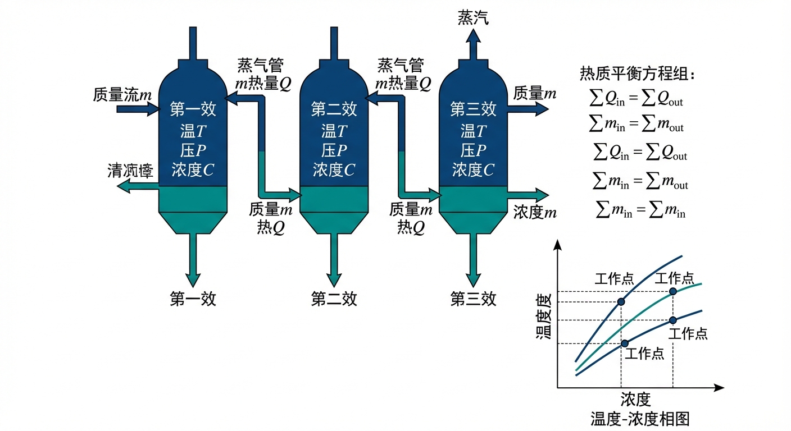
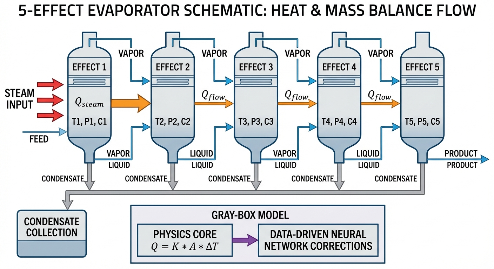
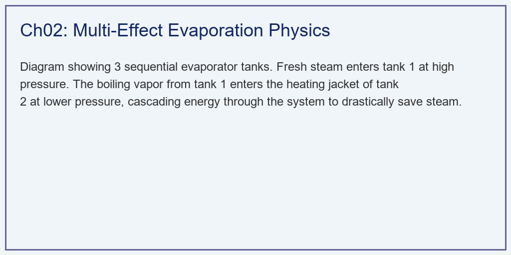
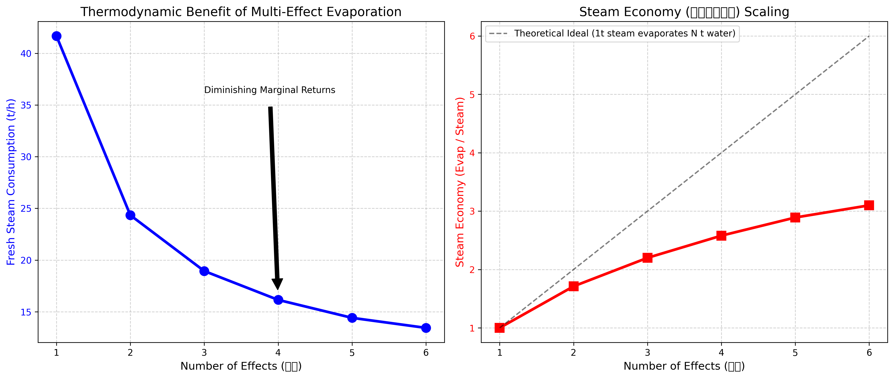

# 第 2 章：蒸发工序的物理机理与数学模型：热质平衡的艺术

## 1. 学习目标

本章探讨多效蒸发背后的物理与热力学原理。我们将利用 Python 代码构建一个多效蒸发器的热质平衡非线性约束系统。
读者需要掌握：
1. 多效蒸发器的结构与"蒸汽梯级利用"原理。
2. 质量守恒与能量守恒（热质平衡）在蒸发模型中的数学表达。
3. 沸点升高（BPE）与显热对蒸汽经济性的损耗机理。
4. 为什么随着效数增加，节能效益会产生"边际递减效应"。

## 2. 教材理论：一次蒸汽，多次沸腾
在第 1 章中，我们知道了蒸发需要十分昂贵的新鲜蒸汽。
如果只用一个罐子（单效蒸发）去煮母液，煮出来的蒸汽（称为二次蒸汽）由于带走了水分，它也具有很高的热量。如果直接把它排进大气或冷凝器，相当于把一半的钱扔进了水里。
**多效蒸发**的核心优势在于：**它把前一个罐子（第一效）煮出来的二次蒸汽，收集起来，作为下一个罐子（第二效）的加热源！**

为了让这个过程持续发生，后一个罐子的压力必须比前一个罐子低。压力越低，水的沸点就越低。
- 第一效：通入 $160^\circ C$ 新鲜蒸汽，母液在 $140^\circ C$ 沸腾。产生 $140^\circ C$ 二次蒸汽。
- 第二效：利用第一效的 $140^\circ C$ 蒸汽加热，内部抽真空，让母液在 $120^\circ C$ 沸腾。产生 $120^\circ C$ 二次蒸汽。
- 以此类推...

理论上，如果有 $N$ 效蒸发器，$1$ 吨的新鲜蒸汽就能蒸发出 $N$ 吨的水。

在氧化铝工业实践中，多效蒸发器的布置方式主要有并流（顺流）、逆流和混流三种。并流布置中，进料方向与蒸汽方向相同，从第一效到最后一效。这种布置的优点是后效压力低于前效，料液可以自流，不需要额外的输液泵。但缺点是末效浓度最高而温度最低，不利于高浓度碱液的流动和传热。逆流布置中，进料方向与蒸汽方向相反，末效的高温有利于高浓碱液的传热，但每一效之间需要泵送。混流布置则综合了两者的优点，在国内大型氧化铝厂中应用较为广泛。

现代大型氧化铝厂通常采用五效或六效蒸发系统，蒸发器单台换热面积可达 $2000 \sim 5000 \, m^2$。以年产 $200$ 万吨氧化铝的大型工厂为例，蒸发系统每小时需要处理 $300 \sim 500$ 吨母液，年蒸汽消耗量高达数十万吨，蒸汽费用占全厂生产成本的 $15\% \sim 25\%$。

### 2.1 热质平衡方程组

多效蒸发系统的数学建模需要对每一效建立质量守恒和能量守恒方程。

**质量守恒**：对第 $i$ 效蒸发器，进入的溶质总量等于离开的溶质总量：

$$F_i \cdot x_i^{in} = (F_i - W_i) \cdot x_i^{out} \tag{2.1}$$

其中 $F_i$ 为第 $i$ 效进料流量，$x_i^{in}$ 和 $x_i^{out}$ 分别为进出料浓度，$W_i$ 为第 $i$ 效蒸发量。

**能量守恒**：第 $i$ 效的热量平衡方程为：

$$Q_i = W_{i-1} \cdot \lambda_{i-1} = W_i \cdot \lambda_i + F_i \cdot C_p \cdot (T_i^{boil} - T_i^{in}) + Q_{loss,i} \tag{2.2}$$

其中 $W_{i-1} \cdot \lambda_{i-1}$ 为前一效二次蒸汽提供的热量（对第一效则为新鲜蒸汽），$W_i \cdot \lambda_i$ 为本效蒸发消耗的潜热，$F_i \cdot C_p \cdot (T_i^{boil} - T_i^{in})$ 为将进料加热至沸点所需的显热，$Q_{loss,i}$ 为散热损失。

**蒸汽经济性**：定义为总蒸发量与新鲜蒸汽消耗量之比：

$$\eta_{SE} = \frac{\sum_{i=1}^{N} W_i}{D_0} \tag{2.3}$$

其中 $D_0$ 为新鲜蒸汽消耗量。理想情况下 $\eta_{SE} = N$，但实际受到 BPE 和显热损耗的影响，远达不到理论值。

### 2.2 热质平衡的非线性陷阱

听起来很美好，但自然界是有损耗的。在建立物理模型时，我们必须引入两大阻碍：

1. **沸点升高（Boiling Point Elevation, BPE）**：由于母液里溶解了大量的铝酸钠，它不是纯水。它的沸点比同压力下的纯水要高 $5 \sim 10^\circ C$。BPE 可以用 Duhring 规则近似计算：

$$\Delta T_{BPE,i} = f(x_i, P_i) \approx a \cdot x_i^2 + b \cdot x_i \tag{2.4}$$

其中 $a$、$b$ 为与压力有关的经验系数。每一效都存在 BPE，这就白白吃掉了一部分宝贵的温度梯级。

2. **显热损耗**：在每一效，二次蒸汽必须先释放热量把进料加热到沸点（显热），剩下的热量才能用来把水煮成蒸汽（潜热）。显热占比为：

$$\gamma_i = \frac{F_i \cdot C_p \cdot (T_i^{boil} - T_i^{in})}{Q_i} \tag{2.5}$$

这些物理机制导致各效的温度、浓度、压力形成了复杂的**非线性强耦合系统**：
$$F_{in} h_{in} + Q_{steam} = L_{out} h_{out} + V_{evap} h_{vapor} + Q_{loss} \tag{2.6}$$

任何一个参数的微小变动，都会通过方程组耦合传播到整个多效系统。

从数值分析的角度来看，这个非线性方程组的求解面临以下困难：首先，方程组的雅可比矩阵（各方程对各未知量的偏导数矩阵）是非对角占优的，意味着牛顿法求解时可能收敛缓慢或不收敛；其次，BPE 关于浓度的函数关系在高浓度区呈现强非线性，使得线性化近似误差增大；第三，各效的汽化潜热 $\lambda_i$ 随温度和压力变化，需要查蒸汽表或用 Antoine 方程计算。工业上常用的求解策略是逐效顺序迭代法（Effect-by-Effect Sequential Method），先假设各效蒸发量等于总蒸发量除以效数，然后从第一效开始逐效计算，将计算结果传递给下一效，如此反复迭代直到收敛。

因此，现代控制系统必须在底层植入这个热质平衡的求解器，以便实时计算各效的最优操作参数。

### 2.3 有效温差的分配

$N$ 效蒸发系统的总有效温差为：

$$\Delta T_{total} = T_{steam} - T_{condenser} - \sum_{i=1}^{N} \Delta T_{BPE,i} \tag{2.7}$$

各效的有效温差按传热面积和传热系数的比值进行分配。在等面积设计下，若各效传热系数相近，则近似均分：

$$\Delta T_i \approx \frac{\Delta T_{total}}{N} \tag{2.8}$$

从式（2.7）可以看出，随着效数 $N$ 增加，BPE 的累积损失 $\sum \Delta T_{BPE,i}$ 增大，可用温差 $\Delta T_{total}$ 减小。当 $\Delta T_{total} \leq 0$ 时，系统无法运行。这就是多效蒸发效数存在物理上限的根本原因。

以本章的参数为例，新鲜蒸汽温度 $160^\circ C$，末效冷凝温度 $60^\circ C$，每效 BPE 为 $5^\circ C$。总可用温差为 $160 - 60 = 100^\circ C$。六效系统的 BPE 总损失为 $6 \times 5 = 30^\circ C$，有效温差为 $70^\circ C$，平均每效约 $11.7^\circ C$，仍然可以正常运行。但如果将效数增加到 $20$ 效，BPE 总损失达到 $100^\circ C$，有效温差为零，系统在理论上已经无法运行。在实际工程中，考虑到管道热损失、液柱静压温差损失等因素，可行的最大效数通常远低于理论上限，一般不超过 $7 \sim 8$ 效。

此外，各效传热面积的分配也是一个重要的设计问题。在等面积设计中，各效换热面积相同，设计制造方便但热力学效率不是最优。在优化面积设计中，各效面积按传热系数和温差的反比分配，可以实现总传热面积的最小化，但增加了设计和制造的复杂度。对于氧化铝蒸发工序，由于高温效的结疤更严重（传热系数下降更快），工程上通常将高温效的换热面积设计得比低温效更大，以补偿结疤造成的传热能力损失。

## 3. 案例分析：理论与实践的桥梁（单效到六效蒸发系统的红利递减仿真）

### 案例背景
某氧化铝厂计划新建一套大型蒸发工序。目标是将 $100 \, t/h$ 的母液，从 $14\%$ 的浓度浓缩到 $24\%$。
工程设计院提出了几个方案：最便宜的单效蒸发器，到造价高昂的六效蒸发器。
厂长问你："我们知道多加一个罐子（一效）能省蒸汽，但每多加一个罐子，设备投资就要多几百万。到底加到第几效是最划算的经济临界点？"
你需要编写一个基于质量与能量耦合方程组的非线性求解器，模拟 $1 \sim 6$ 效蒸发系统的真实蒸汽消耗量，并画出那条关键的"边际递减曲线"。

### 问题描述
- **输入参数**：进料 $F_{in} = 100.0 \, t/h$，进料浓度 $X_{in} = 14\%$，进料温度 $T_{in} = 70^\circ C$。
- **目标参数**：出料浓度 $X_{target} = 24\%$。总蒸发量 $W_{evap} = 41.7 \, t/h$（由式（2.1）计算得出）。
- **热力学参数**：新鲜蒸汽 $160^\circ C$，末效冷凝 $60^\circ C$。溶液比热容 $C_p = 4.0 \, kJ/(kg\cdot K)$，汽化潜热 $\lambda = 2200 \, kJ/kg$，沸点升高 $BPE = 5.0^\circ C$。
- **任务**：针对 $1 \sim 6$ 效系统，执行热质平衡迭代算法，求解每一效的蒸发量，最终算出新鲜蒸汽消耗总量与蒸汽经济性。

**物理场景与问题概化图：**

### 解题思路
本研究构建了一个隐式方程的迭代求解器：
1. **温度梯级分割**：根据式（2.7），计算系统总有效温差 $\Delta T_{eff} = T_{steam} - T_{condenser} - N \times BPE$。如果总温差小于 0，系统无法运行。
2. **能量守恒迭代**：
   - 猜测每一效产生均等的蒸发量 $W_i^{(0)} = W_{evap} / N$。
   - 对第一效，根据式（2.2）算出把母液加热到沸点（显热）和蒸发水分（潜热）需要多少新鲜蒸汽。
   - 关键的传递机制：第一效蒸发的水量 $W_1$ 乘以潜热，作为第二效的加热源 $Q_2$。继续向后推演。
3. **闭环收敛**：强制对算出的各效蒸发量进行归一化，使其总和等于目标（$41.7 \, t/h$），然后再次代入上述循环，直到数据不再变动（收敛）。收敛准则为 $\max|W_i^{(k+1)} - W_i^{(k)}| < \epsilon$。

### 代码执行与图表
> **学习提示**：我们在后台执行了具有多重耦合的迭代求解。请观察红线与黑虚线之间的差距，这是大自然向人类收取的"物理损耗税"。

Source: `assets/ch02/ch02_thermo_balance.py`

**多效蒸发梯级能量利用与经济红利递减核算矩阵：**
| System   |   Total Evaporation (t/h) |   Fresh Steam Req (t/h) |   Steam Economy (t/t) |   Equivalent Steam Ratio |
|:---------|--------------------------:|------------------------:|----------------------:|-------------------------:|
| 1-Effect |                      41.7 |                    41.7 |                  1    |                    1     |
| 2-Effect |                      41.7 |                    24.3 |                  1.71 |                    0.584 |
| 3-Effect |                      41.7 |                    18.9 |                  2.2  |                    0.455 |
| 4-Effect |                      41.7 |                    16.2 |                  2.58 |                    0.388 |
| 5-Effect |                      41.7 |                    14.4 |                  2.89 |                    0.346 |
| 6-Effect |                      41.7 |                    13.4 |                  3.1  |                    0.323 |

**新鲜蒸汽耗量断崖下降与蒸汽经济性非线性极限图：**

### 实验验证与结果剖析
通过迭代解算，我们清晰地看到了"边际效用递减"在热力学中的具体表现：
- **前三效的显著节能效果**：看左侧子图的蓝线和表格。为了蒸发 $41.7 \, t$ 的水，如果用单效，你需要烧掉 $41.7 \, t$ 的蒸汽（汽耗比 $1.0$）。但是，只要加一个罐子变成双效，蒸汽耗量立即降到 $24.3 \, t$，降幅达 $41.7\%$。再加一个罐子变三效，耗量降到 $18.9 \, t$（汽耗比降至 $0.455$）。在这一阶段，投资回报率十分可观。

  从数学上分析，蒸汽经济性 $\eta_{SE}$ 与效数 $N$ 的关系可以近似为：
  $$\eta_{SE} \approx \frac{N}{1 + N \cdot \gamma_{avg}} \tag{2.9}$$
  其中 $\gamma_{avg}$ 为平均显热损耗比例。当 $N$ 较小时，$\eta_{SE}$ 近似线性增长；当 $N$ 较大时，分母的增长速度超过分子，曲线趋于饱和。

- **物理学的惩罚（黑虚线与红线的背离）**：看右侧子图。黑色的虚线代表"理论理想状态"（即 1 吨蒸汽蒸发 $N$ 吨水）。如果不存在任何损耗，6效应该能达到 $6.0$ 的经济性。
  - 但是，红色的真实模型曲线严重偏离了黑线。
  - 原因在于式（2.7）中**沸点升高（BPE）**的累积效应和式（2.5）中**进料显热**在每一效的重复消耗。每次二次蒸汽传递到下一效，都要克服一次 $5^\circ C$ 的 BPE 惩罚。
- **六效系统的经济性拐点**：看表格最后两行。当你从 5 效升级到 6 效时，你要花费数百万购买一个新的庞大蒸发罐，外加复杂的管道和抽真空系统。但是，你的蒸汽耗量仅仅从 $14.4 \, t$ 降到了 $13.4 \, t$，仅仅省了 $1 \, t/h$ 蒸汽。蒸汽经济性（红线）在 5 效之后几乎被压平了，边际投资效益大幅下降。这也是为什么全球工业界普遍将蒸发系统停留在 $4 \sim 6$ 效的原因。

### 工业部署与运行建议
1. **灰盒模型的构建**：纯白盒模型（机理模型）的最大优势是物理可解释性强，不需要大量训练数据。但在真实工厂中，许多参数（如各效的传热系数、BPE 系数、散热损失）会因为结疤、设备老化、碱液成分变化等因素持续漂移。本章的代码展示了纯粹的机理计算（白盒）。但在真实工厂里，随着管壁结疤（第1章），各效的传热系数 $K$ 每天都在改变。纯机理模型的计算结果很快就会与实际偏离。现代智能控制系统采用的是"机理+数据"的灰盒模型：用上述的热质平衡方程作为物理骨架，用深度学习算法（如 LSTM）根据车间每天的实时温度传感器数据，去动态修正方程里的 $K$ 和 $BPE$ 系数。灰盒模型相比纯白盒模型，预测精度可提高 $20\% \sim 40\%$。具体实现时，可以在每个采样周期将机理模型的残差（预测值与实测值之差）输入到神经网络中进行学习，由神经网络负责补偿那些机理模型无法精确描述的非线性效应。这种"物理约束+数据驱动"的混合建模范式在近年来的过程工业智能化中得到了越来越广泛的应用。
2. **蒸汽压缩机（MVR）技术**：多效蒸发依然需要从锅炉烧新鲜蒸汽。而在能源成本较高的地区，工业界正在转向机械蒸汽再压缩（MVR）技术。MVR 利用大型离心式压缩机，直接把蒸发出来的二次蒸汽强行压缩，提高它的温度和压力，然后把它送回自己罐子的加热室里。整个过程只需要电动机驱动压缩机，几乎完全消除了对锅炉新鲜蒸汽的需求，是未来低碳冶金的重要技术路径。MVR系统的等效蒸汽经济性可达 $20 \sim 50$，远超多效蒸发的理论极限。

## 4. 本章小结

1. 多效蒸发的核心原理是"蒸汽梯级利用"：前一效产生的二次蒸汽作为后一效的加热源，通过逐级降压实现一次蒸汽的多次利用。
2. 每一效需要同时满足质量守恒方程（2.1）和能量守恒方程（2.2），各效之间通过二次蒸汽的传热量形成强耦合。
3. 沸点升高（BPE）和显热损耗是偏离理想蒸汽经济性的两大物理根源。BPE 的累积效应随效数增加而加剧，最终导致边际效用递减。
4. 蒸汽经济性从单效的 $1.0$ 提升至六效的 $3.1$，但增速逐渐放缓。工程实践中通常选择 $4 \sim 6$ 效作为经济最优效数。
5. 灰盒模型（机理+数据融合）和 MVR 技术分别从控制和设备层面为进一步提升蒸发效率提供了新方向。
6. 在氧化铝工业实践中，多效蒸发系统的布置方式（并流、逆流、混流）需要根据碱液浓度范围和生产规模综合选择。大型氧化铝厂通常采用五效或六效蒸发系统，蒸汽费用占全厂生产成本的 $15\% \sim 25\%$。
7. 热质平衡方程组的求解需要处理非线性和强耦合特性，逐效顺序迭代法是工业上最常用的数值求解策略。

## 5. 思考题

1. **热质平衡计算**：某三效蒸发系统进料 $80 \, t/h$，进料浓度 $12\%$，进料温度 $65^\circ C$。目标出料浓度 $22\%$。新鲜蒸汽温度 $155^\circ C$，末效冷凝温度 $55^\circ C$，每效 BPE 为 $6^\circ C$，汽化潜热 $\lambda = 2250 \, kJ/kg$，比热容 $C_p = 3.8 \, kJ/(kg \cdot K)$。请计算：(a) 总蒸发量；(b) 总有效温差；(c) 若忽略显热损耗，估算新鲜蒸汽消耗量和蒸汽经济性。
2. **边际效益分析**：基于表格数据，假设每增加一效的设备投资为 $500$ 万元，蒸汽单价 $200$ 元/吨，年运行 $330$ 天。请计算从四效升级到五效的投资回收期。若蒸汽单价上涨至 $300$ 元/吨，回收期如何变化？
3. **BPE敏感性分析**：若某氧化铝厂的碱液浓度偏高，导致 BPE 从 $5^\circ C$ 增大至 $8^\circ C$，对于五效蒸发系统，请分析总有效温差的变化量，并定性讨论对蒸汽经济性的影响。
4. **MVR与多效蒸发对比**：查阅文献，比较 MVR 系统与传统五效蒸发系统在能耗、投资成本、适用场景方面的优劣，并讨论氧化铝行业采用 MVR 技术的可行性。在讨论中需要考虑以下因素：当地电价与蒸汽价格的比值、碱液对压缩机叶片的腐蚀性、以及 MVR 系统对负荷变化的适应能力。

## 6. 参考文献

[1] Incropera F P, DeWitt D P, Bergman T L, et al. Fundamentals of Heat and Mass Transfer [M]. 7th ed. New York: John Wiley & Sons, 2007.

[2] Kern D Q. Process Heat Transfer [M]. New York: McGraw-Hill, 1950.

[3] Minton P E. Handbook of Evaporation Technology [M]. Park Ridge: Noyes Publications, 1986.

[4] 雷晓辉, 龙岩, 许慧敏, 等. 水系统控制论：提出背景、技术框架与研究范式 [J]. 南水北调与水利科技(中英文), 2025, 23(04): 761-769+904. DOI: 10.13476/j.cnki.nsbdqk.2025.0077.

[5] Billet R. Evaporation Technology: Principles, Applications, Economics [M]. Weinheim: VCH, 1989.
