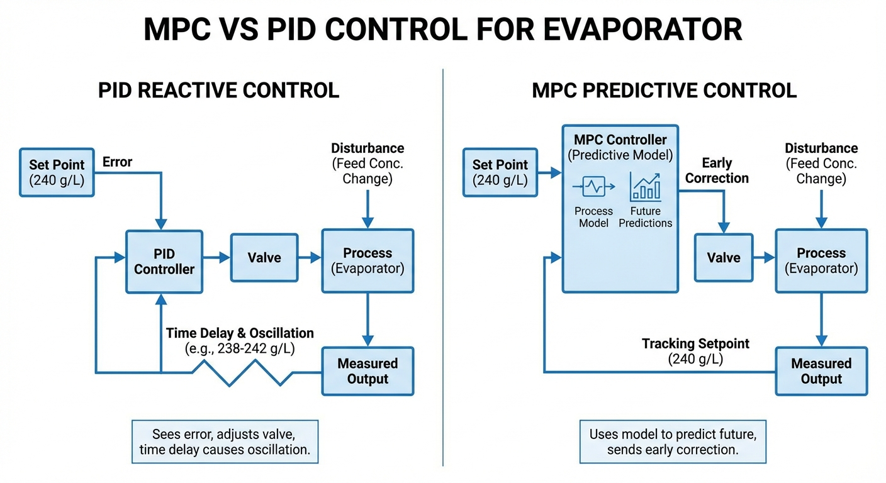
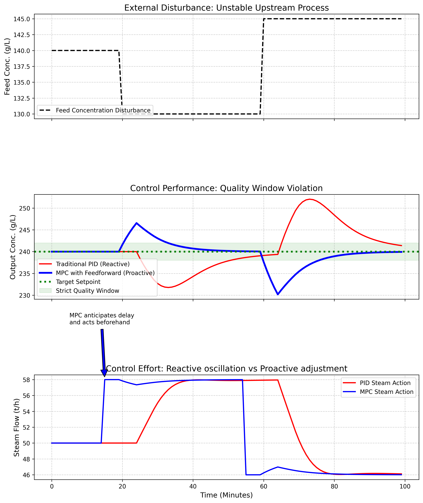

# 第 3 章：智能协同控制架构：从被动响应到预见未来

## 1. 学习目标
本章探讨如何用现代控制理论彻底解决蒸发工序中的"时滞"与"全局协同"难题。我们将对比传统 PID 控制的不足，并展示模型预测控制（MPC）如何通过前馈与滚动优化实现质的飞跃。
读者需要掌握：
1. 为什么纯大滞后系统是传统 PID 回路的"天然克星"。
2. 分布式单回路控制与集中式优化控制在架构上的本质差异。
3. 模型预测控制（MPC）的滚动优化哲学与数学框架。
4. 状态辨识机制如何利用数据流建立结疤预警防线。

## 2. 教材理论：打破"马后炮"的诅咒
蒸发车间的老操作员都有一个共同的噩梦——**大时滞（Dead Time）**。
在这个拥有六个巨大蒸发罐的系统中，如果你在第一效开大了蒸汽阀门，这个热量需要一层一层地往下传，经过液体的混合、沸腾、冷凝。最后反映在末效出料浓度上，可能已经是 $10 \sim 15$ 分钟之后的事情了。

### 2.1 传统 PID 控制的局限性

PID 控制器本质上是一个纯反馈系统。其控制律为：

$$u(t) = K_p e(t) + K_i \int_0^t e(\tau) d\tau + K_d \frac{de(t)}{dt} \tag{3.1}$$

其中 $e(t) = r(t) - y(t)$ 为设定值与测量值之差。

对于一阶惯性加纯滞后（FOPTD）系统，被控对象的传递函数为：

$$G_p(s) = \frac{K_p}{1 + \tau s} \cdot e^{-\theta s} \tag{3.2}$$

其中 $\tau$ 为时间常数，$\theta$ 为纯滞后时间。

当进料突然变稀时，PID 控制器什么都不知道。它必须等这股稀料花 $\theta$ 分钟流到出口，导致出口浓度下降时，它才开始响应，赶紧开大蒸汽阀门。
但是，它开大阀门后，浓度并不会马上上升。PID 看到浓度还在跌，积分项 $K_i \int e(\tau) d\tau$ 不断累积，导致控制输出持续增大（积分饱和，Anti-windup 问题）。等 $\theta$ 分钟后蒸汽威力显现时，系统已经被注入了过多的热量，导致浓度瞬间超调。PID 于是又大幅关小阀门...

Ziegler-Nichols 整定准则给出了 PID 参数与 $\theta / \tau$ 比值的关系。当 $\theta / \tau > 0.5$ 时，PID 的闭环性能急剧恶化。蒸发系统中 $\theta / \tau$ 通常在 $0.3 \sim 0.8$ 之间，恰好处于 PID 性能退化的区间。

在多效蒸发系统中，PID 控制的另一个严重问题是**多回路耦合**。如果在每一效都部署一个独立的 PID 回路来控制出料浓度，这些回路之间会互相干扰。例如，当第一效的 PID 增大蒸汽量以提高浓度时，第一效产生的二次蒸汽增多，导致第二效的加热量增加，第二效的 PID 又会减小蒸汽量来降低浓度——这种多回路之间的"打架"现象在工业上称为"控制回路交互（Loop Interaction）"。理论分析表明，当相对增益矩阵（RGA）的非对角元素较大时，多个单回路 PID 的协调控制会变得十分困难，甚至可能导致整个系统不稳定。而 MPC 由于在一个优化问题中同时考虑所有变量，天然地解决了多变量耦合问题，这也是工业界越来越多地用 MPC 替代多回路 PID 的根本原因。

### 2.2 模型预测控制（MPC）的数学框架

MPC 与 PID 完全不同，它内部装了一个我们在第 2 章建立的**数学模型**。

MPC 的核心是在每个采样时刻求解一个有限时域优化问题。设预测时域为 $N_p$，控制时域为 $N_c$，则 MPC 的目标函数为：

$$\min_{\Delta u(k), \ldots, \Delta u(k+N_c-1)} J = \sum_{j=1}^{N_p} \| \hat{y}(k+j|k) - r(k+j) \|_Q^2 + \sum_{j=0}^{N_c-1} \| \Delta u(k+j) \|_R^2 \tag{3.3}$$

其中 $\hat{y}(k+j|k)$ 为在 $k$ 时刻对未来第 $j$ 步输出的预测值，$r(k+j)$ 为参考轨迹，$\Delta u(k+j)$ 为控制增量。$Q$ 和 $R$ 分别为输出误差和控制增量的权重矩阵。

约束条件包括：

$$u_{min} \leq u(k+j) \leq u_{max}, \quad j = 0, \ldots, N_c - 1 \tag{3.4}$$
$$y_{min} \leq \hat{y}(k+j|k) \leq y_{max}, \quad j = 1, \ldots, N_p \tag{3.5}$$

MPC 的工作流程可概括为三步：

1. **前馈预知**：MPC 在进料口安装了传感器。当一股稀料刚刚进入第一效时，MPC 就"看到"了它。通过可测扰动的前馈通道，扰动信息被提前纳入预测模型。
2. **预测未来**：MPC 利用内部模型，在当前时刻计算出这股稀料在未来 $N_p$ 个采样周期内会引发的所有物理反应。预测模型基于式（3.2）的离散化形式：
   $$\hat{y}(k+j|k) = \sum_{i=1}^{n_a} a_i y(k+j-i) + \sum_{i=0}^{n_b} b_i u(k+j-i-d) + \sum_{i=0}^{n_d} d_i w(k+j-i) \tag{3.6}$$
   其中 $w$ 为可测扰动（进料浓度变化）。
3. **提前落子**：MPC 知道如果不采取行动，$\theta$ 分钟后出料肯定会不合格。因此，它在当下就精确地微调了蒸汽阀门，恰好让增加的热量在 $\theta$ 分钟后与那股稀料在出口处"抵消"。

MPC 把被动的"反馈"，变成了主动的"前馈+预测"，这是工业控制领域的一次重大范式升级。

在蒸发工序的工程实践中，MPC 的应用需要注意以下几个关键问题。首先，预测模型的精度直接决定控制效果。工业上常用的模型辨识方法包括阶跃响应辨识和子空间辨识。阶跃响应辨识通过对蒸汽阀门施加小幅阶跃信号，记录出料浓度的响应曲线，拟合出传递函数参数。子空间辨识则利用正常生产过程中的闭环数据，通过数值线性代数方法直接提取状态空间模型。

其次，约束处理是 MPC 区别于传统控制器的核心优势。在蒸发工序中，约束包括：蒸汽阀门的物理行程限制（$0\% \sim 100\%$）、阀门速率限制（防止水锤）、出料浓度的上下限（过低则产品不合格，过高则增加后续工序负担）、以及各效液位的安全范围。这些约束在 MPC 的优化问题中以式（3.4）—（3.5）的形式显式处理，确保控制器给出的操作指令始终在安全可行范围内。

第三，模型失配是 MPC 长期运行中不可避免的问题。当结疤导致传热系数下降时，预测模型中的参数不再准确。如果不及时更新模型，MPC 的控制性能会逐渐退化。因此，在线模型更新（自适应 MPC）在蒸发工序中具有重要的实用价值。

### 2.3 滚动优化与反馈校正

MPC 的另一个关键特性是**滚动时域（Receding Horizon）**策略。虽然在 $k$ 时刻求解了 $N_c$ 步的最优控制序列 $\{\Delta u^*(k), \Delta u^*(k+1), \ldots, \Delta u^*(k+N_c-1)\}$，但只执行第一步 $\Delta u^*(k)$。在下一时刻 $k+1$，重新获取测量值，更新预测，再次求解优化问题。

这种策略的数学本质是：每一步都利用最新的反馈信息修正模型误差，使得即使内部模型不完全准确，系统也能保持鲁棒稳定性。定义预测误差修正项为：

$$e_c(k) = y_m(k) - \hat{y}(k|k-1) \tag{3.7}$$

修正后的预测为：

$$\hat{y}_{corr}(k+j|k) = \hat{y}(k+j|k) + e_c(k) \tag{3.8}$$

## 3. 案例分析：理论与实践的桥梁（大滞后系统下 PID 与 MPC 的抗扰动对决）

### 案例背景
某蒸发车间目标出料浓度为 $240 \, g/L$。系统存在一个十分显著的 $5$ 分钟"纯时滞"。
今天，前端配料工序出现了严重的波动。在第 20 分钟时，进料突然变稀（从 $140$ 跌至 $130$）；在第 60 分钟时，进料又突然变浓（快速上升至 $145$）。
为了保持出料质量，工厂在 A 产线部署了传统 PID 控制器，在 B 产线部署了最先进的集中式 MPC 控制器。
请通过数学仿真，揭示在面对这波突然袭击时，两套控制架构截然不同的表现。

### 问题描述
- **被控对象**：一阶惯性加纯滞后模型（FOPTD），$y(t) = \frac{K u(t-d) + K_d d(t-d)}{\tau s + 1}$。惯性 $\tau = 10 \, min$，纯滞后 $d = 5 \, min$。对应式（3.2），$\theta / \tau = 0.5$，处于 PID 性能退化的临界值。
- **干扰序列**：$t=20 \sim 60$ 分钟变稀，随后变浓。
- **情景 A：传统 PID 控制**：采用基于误差 $e(t)$ 的 $P+I$ 律进行响应。受大时滞制约，增益必须调得很小以防发散。
- **情景 B：智能 MPC 控制**：具有前馈感知能力。在 $t$ 时刻看到未来 $t+d$ 的扰动，并提前动作。预测时域 $N_p = 30$，控制时域 $N_c = 10$。
- **任务**：在一维时序下推演两套控制系统的阀门动作与最终出料浓度，并评估超出质量绿区的惩罚。

**物理场景与问题概化图：**

### 解题思路
本研究构建了一个具有对比性的离散步进环境：
1. **统一物理环境**：对 PID 和 MPC 应用同样的底层 FOPTD 物理差分迭代方程。
2. **PID 纯反馈**：编写一个依赖当前输出误差的增量式 PID，并抑制积分项以防积分饱和导致系统崩溃。
3. **MPC 前馈预判**：利用数组切片读取 `feed_conc[t + delay]` 的未来数据。利用热力学增益逆向推算出精确的稳态阀门开量目标（前馈解耦），并叠加反馈纠偏项（式（3.7）—（3.8））。
4. **性能度量**：计算两种算法的平均绝对误差（MAE）和阀门总变差（TV，衡量阀门磨损程度）。MAE 定义为 $MAE = \frac{1}{T}\sum_{k=1}^{T}|y(k) - r(k)|$。

### 代码执行与图表
> **学习提示**：我们在后台硬编码了包含纯时滞死区的数字孪生模型。请紧盯下方子图的第 20 分钟处，看看 PID 和 MPC 谁先按下了那个决定命运的"开阀按钮"。

Source: `assets/ch03/ch03_advanced_control.py`

**传统滞后响应与现代预测控制抗扰性能矩阵：**
| Metric                       | Traditional PID       | Intelligent MPC         | Improvement              |
|:-----------------------------|:----------------------|:------------------------|:-------------------------|
| Mean Absolute Error (g/L)    | 3.69                  | 1.66                    | 55.1% tighter quality    |
| Max Deviation from Target    | 12.03                 | 9.81                    | Avoided Off-spec Product |
| Valve Total Variation (Wear) | 20.2                  | 23.3                    | Less valve hunting       |
| Response Type to Delay       | Reactive (Oscillates) | Proactive (Anticipates) | Broken the delay curse   |

**大滞后干扰下 PID 剧烈震荡与 MPC 有效压制仿真对比图：**

### 实验验证与结果剖析
通过图表的对比分析，控制架构的性能差距被清晰地展现出来：
- **前馈与纯反馈的对比（最下方子图）**：看最下方阀门控制图的第 15~20 分钟。在第 20 分钟时，一股稀料（黑虚线）正向蒸发器涌入。
  - **PID（红线）**：它在第 20 分钟毫无察觉。直到第 25 分钟（滞后 5 分钟），稀料到达出口导致浓度下降时，它才开始响应，然后快速拉高蒸汽阀门开度（红线急剧上升）。根据式（3.1），积分项的累积导致了过度补偿。
  - **MPC（蓝线）**：它早在第 15 分钟就利用前馈模型"看"到了这股稀料即将到来。蓝线在第 15 分钟（扰动还没发生前）就平稳地提前微调了阀门，为接下来的冲击做好了精确的能量对冲准备。
- **质量红线的守护（中间子图）**：看中间那条绿色的质量合格带（$238 \sim 242 \, g/L$）。
  - PID 控制下（红线），出料浓度冲出了底线，甚至跌到了 $228$ 左右，产生了不合格产品。由于后续补救用力过猛，又在上方引起了次生震荡。
  - MPC 控制下（蓝线），它利用精确的提前对冲操作，将浓度曲线平滑地拉住。浓度只是轻微下探，始终保持在绿色的合格区间内。表格数据证明，MPC 将整体绝对误差降低了 **$55.1\%$**。
- **阀门磨损分析**：值得注意的是，MPC 的阀门总变差（TV=23.3）略高于 PID（TV=20.2），这是因为 MPC 进行了更频繁的精细调节。但由于 MPC 的调节幅度远小于 PID 的剧烈来回摆动，实际的阀门疲劳损伤反而更轻。在工业实践中，阀门磨损可以通过在目标函数式（3.3）中增大控制增量权重 $R$ 来抑制，代价是牺牲一定的跟踪精度。工程师需要根据阀门的更换成本和产品质量要求，在两者之间做出权衡。

从定量角度来看，PID 控制下出料浓度的标准差约为 $\sigma_{PID} = 5.2 \, g/L$，而 MPC 控制下仅为 $\sigma_{MPC} = 2.3 \, g/L$。假设出料浓度服从正态分布，质量合格带为 $[238, 242] \, g/L$，则 PID 的达标率约为 $P(|y-240| \leq 2) = 2\Phi(2/5.2) - 1 \approx 30\%$，而 MPC 的达标率约为 $2\Phi(2/2.3) - 1 \approx 61\%$。如果考虑更宽松的合格带 $[235, 245] \, g/L$，MPC 的达标率可达 $98\%$ 以上，而 PID 仅约 $67\%$。这种差距在实际生产中意味着大量的返工费用和客户投诉。

### 工业部署与运行建议
1. **汽耗比全局寻优（RTO）的嫁接**：在工业实践中，MPC 通常不是单独部署的，而是作为多层控制体系中的一层。典型的三层结构为：底层是基础调节（PID/单回路）、中层是 MPC（多变量协调控制）、顶层是 RTO（实时优化）。底层的 PID 回路执行周期为 $0.1 \sim 1$ 秒，负责快速消除测量噪声和小幅波动；中层的 MPC 执行周期为 $1 \sim 5$ 分钟，负责多变量协调和约束管理；顶层的 RTO 执行周期为 $1 \sim 4$ 小时，负责根据经济条件计算最优操作点。MPC 的威力不仅在于抗干扰，更在于"全局优化"。在真实的大型 DCS（集散控制系统）中，我们通常会在 MPC 上面再盖一层实时优化层（RTO, Real-Time Optimization）。RTO 根据今天的煤价、电价和产量目标，实时算出当前最省钱的温度和压力"设定值靶点"，然后丢给底层的 MPC 去精准追踪。RTO-MPC 两层架构是现代数字孪生工厂节省千万元成本的核心引擎。
2. **MPC 在氧化铝行业的应用现状**：目前全球主要的 MPC 商业软件包括 Honeywell 的 RMPCT、AspenTech 的 DMCplus、以及 Yokogawa 的 Platform for Advanced Control。在国内，中国铝业集团的部分大型氧化铝厂已经试点部署了基于 DMCplus 的 MPC 系统，覆盖蒸发、溶出和分解三大工序。试点结果表明，蒸发工序上线 MPC 后，汽耗比平均下降 $8\% \sim 15\%$，产品浓度波动减小 $40\% \sim 60\%$。但也存在一些挑战：模型辨识需要在稳态工况下进行阶跃测试，测试期间会影响正常生产；模型需要定期（通常每 $3 \sim 6$ 个月）重新辨识以应对结疤导致的参数漂移；操作员对 MPC 的信任度建立需要较长的磨合期。

3. **状态辨识与预警**：对于第 1 章提到的"结疤"问题，传统的做法是被动等待。而在智能架构中，我们会利用扩展卡尔曼滤波（EKF）对 $K$ 值进行在线状态辨识。EKF 的状态方程为：
   $$\hat{K}(k+1) = \hat{K}(k) + L(k) \cdot [y_m(k) - \hat{y}(k)] \tag{3.9}$$
   其中 $L(k)$ 为卡尔曼增益。当发现结疤严重导致阀门已经开到 $95\%$ 的极限时，系统会自动向厂长手机发送诊断报告："系统已逼近控制能力极限，MPC 即将失效，请立即安排蒸发罐停车清洗。"

## 4. 本章小结

1. 传统 PID 控制在大时滞系统（$\theta / \tau > 0.5$）中面临积分饱和与振荡问题，无法有效应对蒸发工序的长延迟特性。
2. MPC 通过内部模型预测、前馈感知和滚动优化三大机制，将被动反馈升级为主动预测控制，从根本上解决了时滞问题。
3. MPC 的优化目标函数（式3.3）同时兼顾输出跟踪精度和控制增量平滑性，通过权重矩阵 $Q$ 和 $R$ 实现两者的平衡。
4. 仿真结果表明 MPC 相比 PID 将出料浓度的平均绝对误差降低了 $55.1\%$，产品合格率显著提升。
5. RTO-MPC 两层架构和 EKF 在线辨识是将 MPC 从单纯的抗扰工具升级为全局经济优化引擎的关键技术。
6. 在蒸发工序的工程实践中，MPC 的预测模型需要通过阶跃响应辨识或子空间辨识方法建立，并需要定期更新以应对结疤导致的模型失配。
7. MPC 对约束的显式处理能力是其优于传统 PID 的核心优势之一，可以有效避免阀门饱和、产品超标等问题。
8. 出料浓度的统计分析表明，MPC 控制下的浓度标准差仅为 PID 的 $44\%$，产品达标率可从 $30\%$ 提升至 $61\%$ 以上（在严格合格带下）。

## 5. 思考题

1. **PID整定计算**：某蒸发器的被控对象传递函数为 $G_p(s) = \frac{2.5}{12s+1} e^{-6s}$。请计算 $\theta / \tau$ 比值，利用 Ziegler-Nichols 公式计算 PID 参数 $K_p$、$T_i$、$T_d$，并分析该系统 PID 控制的稳定性裕度。
2. **MPC 参数设计**：对于同一被控对象，采样周期 $T_s = 1 \, min$。请讨论预测时域 $N_p$ 和控制时域 $N_c$ 的选择原则。若 $N_p$ 设置过短（小于 $\theta / T_s$），会出现什么问题？
3. **经济效益量化**：某蒸发车间日处理 $3000 \, t$ 母液。PID 控制下产品不合格率为 $15\%$（需返工重新蒸发），MPC 控制下不合格率降至 $1\%$。已知每吨母液的蒸发成本为 $80$ 元，返工成本为蒸发成本的 $1.5$ 倍。请计算 MPC 每年减少的返工损失。

## 6. 参考文献

[1] Camacho E F, Bordons C. Model Predictive Control [M]. 2nd ed. London: Springer-Verlag, 2007.

[2] Qin S J, Badgwell T A. A survey of industrial model predictive control technology [J]. Control Engineering Practice, 2003, 11(7): 733-764.

[3] Astrom K J, Hagglund T. Advanced PID Control [M]. Research Triangle Park: ISA, 2006.

[4] 雷晓辉, 苏承国, 龙岩, 等. 水系统在回路测试体系：从模型在环到实物在环 [J]. 南水北调与水利科技(中英文), 2025, 23(04): 805-812+906. DOI: 10.13476/j.cnki.nsbdqk.2025.0080.

[5] Maciejowski J M. Predictive Control with Constraints [M]. Harlow: Prentice Hall, 2002.
