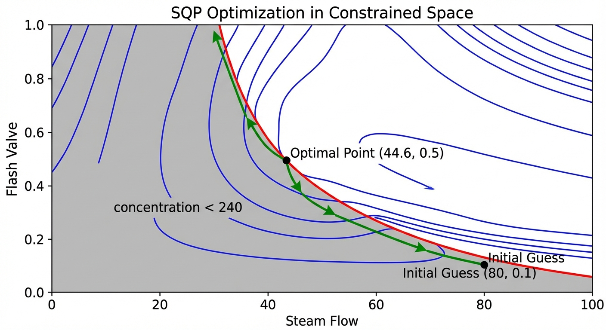
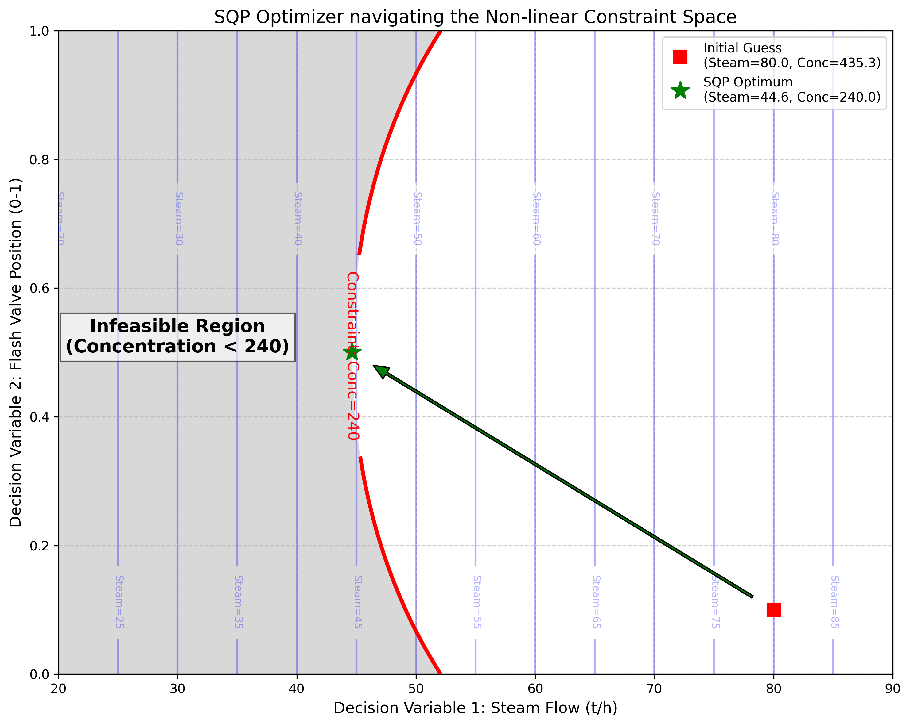

# 第 4 章：核心算法实现：从理论到代码的跨越

## 1. 学习目标
本章将从理论层面深入工业级控制软件的算法底层。我们将探讨如何将热力学方程组和优化算法封装成可以独立运行、并能与 AI 大模型直接对话的服务。
读者需要掌握：
1. 模型服务化：利用 FastMCP 协议封装复杂机理模型。
2. 非线性方程组求解在工业仿真中的应用。
3. 序列二次规划（SQP）算法的数学原理与工程实现。
4. 在硬约束下寻找利润极限的工程哲学。

## 2. 教材理论：给 AI 装上"理工科的大脑"
在过去的工业控制中，PID 代码直接写在 PLC（可编程逻辑控制器）的梯形图里，优化算法写在上位机 DCS 系统的 C++ 闭源程序里。它们互相割裂，外部系统（比如现在广泛应用的 LLM 大语言模型）根本无法调用它们。
为了实现"大模型控制工厂"的终极愿景，我们必须采用 **MCP (Model Context Protocol)** 架构。
这种架构的革命性意义在于：它打破了工业软件长期以来的"烟囱式"开发模式。传统上，每一种工业计算功能都嵌入在专有的商业软件中，互相无法调用。MPC 算法锁在 Honeywell 的服务器里，优化算法锁在 AspenTech 的软件里，数据分析锁在自己开发的 Excel 宏里。MCP 协议通过统一的 JSON-RPC 接口标准，让所有这些工具都可以被任何客户端（包括大模型）统一调用。

我们将前面章节写的"传热计算"、"MPC 预测"等复杂的理工科代码，全部封装在一个独立的 Python 服务端（`evaporation_server.py`）中。只要在函数头上加一个 `@mcp.tool` 装饰器，复杂的工业系统就变成了一个标准化的 API 接口。AI 不需要懂热力学，它只需要调用这个接口说："帮我算一下，如果进料浓度跌到 $130$，为了保持出料 $240$，我最少需要开多大的蒸汽阀门？"

### 2.1 约束优化问题的一般形式

当 AI 发出上述请求时，底层服务器如何回答？
这就引出了工业优化中最强大的武器——**序列二次规划（SQP）算法**。

工业优化问题的一般数学形式为：

$$\min_{x \in \mathbb{R}^n} f(x) \tag{4.1}$$
$$\text{s.t.} \quad g_i(x) \leq 0, \quad i = 1, \ldots, m \tag{4.2}$$
$$h_j(x) = 0, \quad j = 1, \ldots, p \tag{4.3}$$
$$x_L \leq x \leq x_U \tag{4.4}$$

在蒸发工序中，具体化为：
- **目标函数** $f(x)$：蒸汽消耗量 $Steam \to \min$。
- **决策变量** $x$：蒸汽阀门开度 $u_1$ 和闪蒸阀门开度 $u_2$。
- **不等式约束** $g(x)$：出料浓度 $Conc(u_1, u_2) \geq 240 \, g/L$（质量红线）。
- **边界约束**：蒸汽阀门开度 $20\% \leq u_1 \leq 100\%$，闪蒸阀门 $0 \leq u_2 \leq 1$。

### 2.2 SQP 算法的数学原理

为什么不用简单的梯度下降法？
因为在工业中，"红线"是绝对不能踩的（踩了就出废品）。如果用无约束的梯度下降，算法会不合理地把蒸汽量降到 $0$（此时最省钱），但出料浓度也随之不合格。

SQP 算法的核心思想是：在每次迭代中，将非线性优化问题在当前点 $x_k$ 处用二次规划（QP）子问题近似。

构造拉格朗日函数：

$$\mathcal{L}(x, \lambda, \mu) = f(x) + \sum_{i=1}^{m} \lambda_i g_i(x) + \sum_{j=1}^{p} \mu_j h_j(x) \tag{4.5}$$

在第 $k$ 次迭代中，求解 QP 子问题：

$$\min_{d} \frac{1}{2} d^T B_k d + \nabla f(x_k)^T d \tag{4.6}$$
$$\text{s.t.} \quad \nabla g_i(x_k)^T d + g_i(x_k) \leq 0, \quad i = 1, \ldots, m \tag{4.7}$$

其中 $B_k$ 是拉格朗日函数 Hessian 矩阵的近似（通常用 BFGS 方法更新），$d$ 为搜索方向。

SQP 算法就像一个在悬崖（浓度 $= 240$ 的等高线）边上探路的行者。它不断地将复杂的非线性物理空间，在自己脚下局部"泰勒展开"成简单的二次函数抛物面，然后沿着悬崖的边缘，小心地向着"最省钱"的谷底滑落，直到无路可走（撞到物理极限），那里就是我们寻找的**最优点**。

更新规则为：

$$x_{k+1} = x_k + \alpha_k d_k \tag{4.8}$$

其中 $\alpha_k$ 为线搜索步长，确保充分下降（Armijo 条件）。

### 2.3 KKT 最优性条件

SQP 算法收敛时，解满足 Karush-Kuhn-Tucker（KKT）条件：

$$\nabla f(x^*) + \sum_i \lambda_i^* \nabla g_i(x^*) = 0 \tag{4.9}$$
$$\lambda_i^* g_i(x^*) = 0, \quad \lambda_i^* \geq 0 \tag{4.10}$$

式（4.10）称为互补松弛条件。它的物理含义十分深刻：在最优点，如果某个约束没有起作用（$g_i(x^*) < 0$），则对应的乘子 $\lambda_i^* = 0$；如果乘子 $\lambda_i^* > 0$，则约束必然是"紧"的（$g_i(x^*) = 0$，即恰好卡在边界上）。

在蒸发工序中，KKT 条件告诉我们：最省钱的操作点一定是出料浓度恰好等于 $240 \, g/L$（约束紧绷），而不是高于 $240$（那意味着还有降成本的空间）。

这个结论具有深刻的工程启示。在传统人工操作中，操作员出于安全考虑，总是让出料浓度远高于 $240 \, g/L$（如 $260 \sim 300 \, g/L$）。这种"质量过剩"看似安全，实则造成了巨大的经济浪费。以某大型氧化铝厂为例，出料浓度每高出目标值 $10 \, g/L$，对应的蒸汽过量消耗约为 $3 \sim 5 \, t/h$，按蒸汽单价 $200$ 元/吨、年运行 $8000$ 小时计算，年浪费蒸汽费用高达 $480 \sim 800$ 万元。

SQP 算法的收敛速度与问题的规模和非线性程度密切相关。对于本章的二维问题（两个决策变量），SQP 通常在 $5 \sim 10$ 次迭代内即可收敛到足够精确的最优解。但对于拥有几十个决策变量的大型多效蒸发系统，迭代次数可能增加到 $50 \sim 100$ 次。此时需要关注计算时间是否满足工业实时性要求（通常要求在 $1 \sim 5$ 秒内完成一次优化计算）。

SQP 算法的另一个重要特性是对初始点的敏感性。由于蒸发过程的非凸性，不同的初始猜测可能导致收敛到不同的局部最优解。工业上的常用对策包括：多起点策略（从多个随机初始点出发，取最优结果）、利用上一时刻的最优解作为下一时刻的初始猜测（热启动，Warm Start），以及全局优化方法（如遗传算法 + SQP 的混合策略）。

## 3. 案例分析：理论与实践的桥梁（SQP 优化器在非线性约束空间中的寻优）

### 案例背景
某车间由于换班，新来的操作员接手了蒸发器。为了确保出料浓度"绝对安全"，他过于保守地把蒸汽阀门开到了 $80 \, t/h$，并把闪蒸阀门随意设在了 $10\%$。
结果出料浓度达到了严重偏高的 $435 \, g/L$（这叫质量过剩 Giveaway）。虽然产品合格了，但车间主任看着快速转动的蒸汽计费表十分痛心。
主任启动了搭载 SQP 算法的数字孪生系统，要求在保证浓度**绝不低于 $240 \, g/L$** 的红线前提下，给出最节能的阀门组合。

### 问题描述
- **非线性黑盒**：$Conc = f(Steam, Flash\_Valve)$，其中闪蒸效率与阀门呈非线性抛物线关系。
- **初始猜测点（$X_0$）**：$Steam = 80.0, \, Flash = 0.1$。
- **优化器**：`scipy.optimize.minimize`，方法选择 `'SLSQP'`。
- **约束装配**：字典形式装配不等式约束 `{'type': 'ineq', 'fun': Conc - 240.0}`。
- **任务**：在一张二维等高线图上，可视化 SQP 算法是如何从"初始猜测点"出发，撞到红线后，沿着红线滑向"最优点"的，并核算省下的成本。

**物理场景与问题概化图：**

### 解题思路
本研究构建了一个白盒化的可视化优化引擎：
1. **构建目标曲面**：编写 `evaporation_process` 前向计算函数，将其作为黑盒注入 SQP。
2. **算法收敛**：调用 `minimize` 函数，限制最大迭代步数以保证工业实时性。提取优化结果。
3. **网格扫描与等高线绘制**：利用 `numpy.meshgrid` 对整个 $(Steam, Flash)$ 二维空间进行全面扫描，计算出所有的浓度值。
4. **空间标注**：用灰色的阴影把 $Conc < 240$ 的"不可行域"标出。在剩下的白色安全区里，画出 SQP 算法的寻优轨迹。

### 代码执行与图表
> **学习提示**：我们在后台调用了底层 C 语言编写的 SLSQP 求解器。请将目光锁定在下方等高线图中的那根绿色箭头，那就是算法在约束边界上为你省钱的轨迹。

Source: `assets/ch04/ch04_sqp_optimizer.py`

**人工盲猜与 SQP 寻优财务对比矩阵：**
| Status              |   Steam Flow (t/h) | Flash Valve   | Output Conc.   | Constraint Satisfied?   |
|:--------------------|-------------------:|:--------------|:---------------|:------------------------|
| Initial Blind Guess |              80    | 0.1           | 435.3          | Yes (Wasteful)          |
| SQP Optimized Point |              44.64 | 0.5           | 240.0          | Yes (Exactly 240)       |
| Financial Impact    |             -35.36 | Optimal tuned | Zero giveaway  | Massive Steam Savings   |

**SQP 算法在多维非线性等高线空间下的避障与寻优轨迹图：**

### 实验验证与结果剖析
通过这直观的几何学展示，数学在工程应用中的优化能力显露无疑：
- **约束边界与安全区（等高线分析）**：看主图。红色的粗线是质量边界（Constraint: Conc=240）。红线左下角的灰色区域是"不可行域"，一旦掉进去就出废品。红线右上方是安全区，但越往右上方走，蓝色的等高线数值（Steam）就越大，越费钱。我们的目标是：**在白色的安全区里，找到最靠左下角（Steam 最小）的那个点。** 从 KKT 条件式（4.10）可知，最优点必然位于约束边界上。
- **人工操作的保守（红色方块）**：看图上的红色方块（Initial Guess）。人类操作员为了绝对不掉进不可行域，把工作点选在了远离边界的安全腹地（$Steam=80$）。看表格，此时出料浓度高达 $435.3$，远远超出了客户要求的 $240$。这在工业上叫"质量过剩（Giveaway）"，是低效的浪费行为。
- **SQP 的精确寻优（绿色五角星与轨迹）**：看那条绿色的箭头。SQP 算法启动后，它果断地直接向着约束边界推进。它首先把闪蒸阀门调整到了精确的最佳非线性顶点（$Flash=0.5$），然后不断削减蒸汽量，直到它的"鼻子"刚刚好碰到了那条红色的约束边界。根据式（4.9），在最优点处目标函数的梯度与约束函数的梯度成比例，这意味着在不违反约束的前提下已经没有任何降低成本的空间。
  - **极限的压榨**：看表格的第二行。此时的 Steam Flow 被优化到了 $44.64 \, t/h$，而出料浓度精确地停在 **$240.0 \, g/L$**，一滴多余的浓度都没有。
  - **财务影响**：相比于人工操作，SQP 算法每小时节省了 **$35.36$ 吨**的高压蒸汽。如果一吨蒸汽 $200$ 元，这一个算法，每年能为工厂省下数千万元的成本。

### 工业部署与运行建议
1. **实时性的保障**：SQP 算法虽然强大，但它在每次迭代中都需要计算较大规模的偏导数矩阵（雅可比矩阵）。如果系统有几百个变量，SQP 可能计算时间过长。在真实的 DCS 系统中，我们往往限制 `maxiter=50`，如果在 $2$ 秒内算不出绝对的最优点，我们就取当前找到的"次优点"下发给阀门，以保证控制系统的绝对实时性。对于大规模问题，可以采用内点法（Interior Point Method）替代 SQP，其计算复杂度与约束数量近似线性。
2. **MCP 封装的工程实践**：在实际部署中，SQP 优化器的 MCP 封装需要注意输入参数的合法性校验。例如，蒸汽流量不能为负数，闪蒸阀门开度必须在 $[0, 1]$ 范围内。这些校验逻辑应该在 `@mcp.tool` 装饰的函数入口处完成，防止大模型传入不合理的参数导致优化器崩溃。此外，优化结果的可解释性也十分重要：MCP 返回的 JSON 中不仅要包含最优阀门开度，还要包含当前约束的激活状态、目标函数值的改善量、以及迭代次数等元信息，帮助大模型理解优化结果的可信度。

3. **大模型的"思考器官"**：未来的控制架构是 Agentic（智能体化）的。当厂长在工业 App 里用语音对大模型说："今天煤价太贵了，帮我把蒸发车间的能耗降到最低。" 大模型自己是不会算微积分的。它会通过 FastMCP 协议，默默地在后台唤醒我们刚刚写的这个 SQP 优化器。大模型充当"耳朵和嘴巴"，而 MCP 封装的底层算法才是真正为你降成本的"计算核心"。

这种"大模型+MCP+底层算法"的三层架构具有明确的分工：大模型负责理解自然语言指令、提取关键参数、组装 API 调用请求，以及将优化结果翻译为人类可读的报告。MCP 协议负责标准化接口定义、请求路由和结果封装。底层算法（SQP、MPC 等）负责执行精确的数值计算。这种分工使得系统的每一层都可以独立升级和替换，例如将大模型从 GPT-4 切换到 Claude，或者将 SQP 替换为内点法，而不影响其他层的运行。

在氧化铝行业的实际应用场景中，这种架构可以支持以下典型的交互模式：厂长通过钉钉或微信发送语音"今天的煤价涨了，帮我优化一下蒸汽消耗"→大模型解析意图和当前煤价→通过 MCP 调用 SQP 优化器→优化器返回最优阀门组合→大模型将结果格式化为简洁的回复"建议将主蒸汽阀门开度调至 $52\%$，预计每小时节省 $8.5$ 吨蒸汽，日节约成本 $4.08$ 万元"。

## 4. 本章小结

1. MCP 协议为复杂机理模型的服务化封装提供了标准化接口，使大模型能够调用底层的热力学计算和优化算法。
2. 工业过程优化本质上是带约束的非线性规划问题（式4.1—4.4），必须同时满足质量红线（硬约束）和经济目标（目标函数最小化）。
3. SQP 算法通过在每次迭代中求解 QP 子问题（式4.6—4.7），将非线性问题逐步线性化，在约束边界上寻找最优解。
4. KKT 条件（式4.9—4.10）的互补松弛性质表明，经济最优操作点必然位于质量约束的边界上（浓度恰好等于 $240 \, g/L$），任何"质量过剩"都意味着成本浪费。
5. 案例表明 SQP 可将蒸汽消耗量从 $80 \, t/h$ 降至 $44.64 \, t/h$，节约 $44.2\%$，经济效益十分显著。
6. "质量过剩"是传统人工操作中普遍存在的问题。出料浓度每高出目标值 $10 \, g/L$，对应的年浪费蒸汽费用可达数百万元，SQP 通过将操作点精确定位在约束边界上消除了这种浪费。
7. SQP 算法对初始点敏感，工业上常用热启动策略和多起点策略来应对非凸优化问题的局部最优陷阱。
8. 对于大规模优化问题（变量数超过百个），可以考虑用内点法替代 SQP，以获得更好的计算效率。
9. MCP 协议打破了工业软件的"烟囱式"开发模式，使大模型能够通过标准化的 JSON-RPC 接口统一调用各种工业计算工具，实现"大模型+MCP+底层算法"的三层协作架构。
10. SQP 优化结果的可解释性十分重要，MCP 返回的结果中应包含约束激活状态、目标函数改善量等元信息，帮助大模型和人类理解优化决策的合理性。

## 5. 思考题

1. **KKT 条件分析**：对于目标函数 $f(x) = x_1^2 + x_2^2$，约束 $g(x) = 1 - x_1 - x_2 \leq 0$，写出 KKT 条件并求解最优点 $(x_1^*, x_2^*)$ 和对应的拉格朗日乘子 $\lambda^*$。验证互补松弛条件是否成立。
2. **SQP 收敛性讨论**：在蒸发工序优化中，如果非线性过程函数 $Conc = f(Steam, Flash)$ 存在多个局部极值，SQP 能否保证找到全局最优？请讨论初始点选择对收敛结果的影响，并提出改进策略。
3. **实时性与最优性的权衡**：某蒸发系统有 $20$ 个决策变量和 $50$ 个约束。SQP 每次迭代需要计算 $20 \times 50$ 的雅可比矩阵。若单次迭代耗时 $0.1$ 秒，DCS 要求在 $2$ 秒内给出结果，最多可以进行多少次迭代？如果此时尚未完全收敛，应该如何处理？讨论热启动策略在此场景下的作用。
4. **灵敏度分析**：在 SQP 最优解处，拉格朗日乘子 $\lambda^*$ 的物理含义是什么？如果当前最优解的 $\lambda^* = 500$ 元/(g/L)，这意味着放松质量约束 $1 \, g/L$（从 $240$ 降到 $239$）可以额外节省多少蒸汽成本？这个信息对厂长做产品规格决策有何参考价值？

## 6. 参考文献

[1] Nocedal J, Wright S J. Numerical Optimization [M]. 2nd ed. New York: Springer, 2006.

[2] Biegler L T. Nonlinear Programming: Concepts, Algorithms, and Applications to Chemical Processes [M]. Philadelphia: SIAM, 2010.

[3] Boyd S, Vandenberghe L. Convex Optimization [M]. Cambridge: Cambridge University Press, 2004.

[4] 雷晓辉, 龙岩, 许慧敏, 等. 水系统控制论：提出背景、技术框架与研究范式 [J]. 南水北调与水利科技(中英文), 2025, 23(04): 761-769+904. DOI: 10.13476/j.cnki.nsbdqk.2025.0077.

[5] Gill P E, Murray W, Saunders M A. SNOPT: An SQP algorithm for large-scale constrained optimization [J]. SIAM Review, 2005, 47(1): 99-131.
