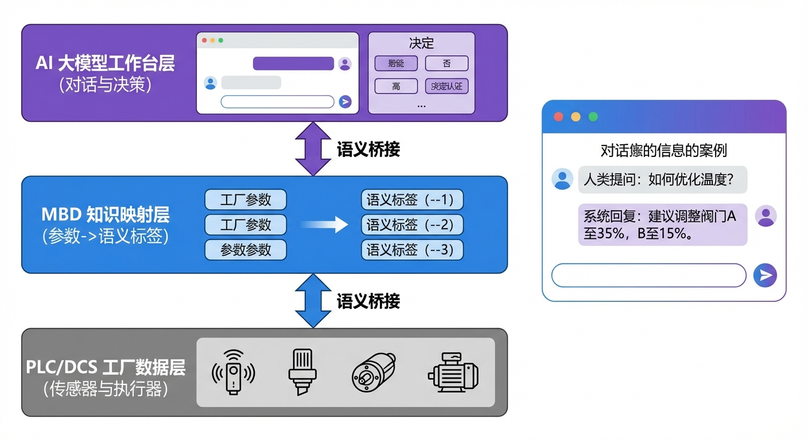
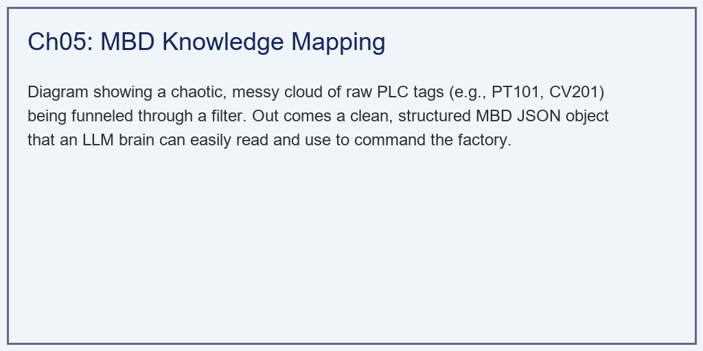

# 第 5 章：知识映射与工作台构建：打破大模型与 PLC 的次元壁

## 1. 学习目标

本章探讨数字孪生系统中最具前沿性的命题——大模型（LLM）落地工业的核心阻碍。我们将展示如何通过"Model-Based Definition (MBD)"技术，将晦涩的底层工厂数据翻译成 AI 和人类都能读懂的通用语言。
读者需要掌握：
1. 底层 SCADA/PLC 标签名的"加密"属性对 AI 造成的认知障碍。
2. 降维抽象：将复杂的化工蒸发器映射为通用的"蓄水节点"与"控制设备"。
3. MBD 结构化 JSON 字典在约束 LLM 幻觉中的必要性。
4. 自然语言处理（NLP）在提取工艺扰动参数中的实战应用。


## 2. 教材理论：大模型为什么看不懂工厂？
今天，所有人都想把类似 ChatGPT 的大模型接入工厂。但是，如果你直接把化工厂底层的传感器数据扔给大模型，大模型会立刻丧失判断能力。

### 2.1 数据的"加密"鸿沟

在底层的 PLC 控制器里，变量的名字不是叫"主蒸汽阀门"，而是十分古怪的代码，比如：`A_EVAP_EFF1_TEMP_PT101` 或 `STEAM_MAIN_VALVE_CV201_FB`。
这些带有强烈上世纪 80 年代工业命名痕迹的"Tag 点名"，只有在厂里干了 20 年的老电工才能看懂。大模型看到 `CV201`，它根本不知道这是一个阀门、一个泵还是一个故障代码。如果让大模型直接基于这些代码进行控制，它很有可能会产生"幻觉（Hallucination）"，胡乱下发指令，引发严重的工厂安全事故。

这种幻觉风险在工业场景中是十分现实的威胁。某国际知名化工集团在测试大模型辅助控制时发现，当大模型接收到标签名 `FV_201_SP` 时，它将其误解为"温度设定值"而非"阀门设定值"，并给出了将其设为 $350$（实际意义为 $350\%$ 阀门开度，远超物理极限）的建议。幸运的是这是在仿真环境中发现的，如果在真实工厂中执行，后果不堪设想。这个案例充分说明了 MBD 语义化映射的紧迫性和必要性。

从信息论的角度，这个问题可以用香农信息熵来量化。设工业标签名的字符集为 $\mathcal{A}$，则标签名的条件熵为：

$$H(Meaning | TagName) = -\sum_{t \in \mathcal{T}} p(t) \sum_{m \in \mathcal{M}} p(m|t) \log_2 p(m|t) \tag{5.1}$$

当标签名与其物理含义之间的映射关系高度模糊时，$H(Meaning | TagName)$ 接近 $H(Meaning)$（最大熵），意味着标签名几乎不提供任何关于物理含义的信息。这正是 LLM 产生幻觉的信息论根源。

### 2.2 MBD 映射层的设计原理

为了填平这道鸿沟，我们引入了 MBD（基于模型的定义）映射层。它的核心思想是**"强行降维与语义化"**。

我们将工业过程抽象为两类基本元素：

**定义 5.1（蓄水节点）**：系统中任何具有物质储存功能的容器，其状态由三个标准化属性描述：

$$\text{StorageNode} = \{capacity\_percent, \, quality\_index, \, risk\_status\} \tag{5.2}$$

其中 $capacity\_percent \in [0, 100]$ 表示容量百分比，$quality\_index$ 表示质量指标（如浓度），$risk\_status \in \{SAFE, WARNING, CRITICAL\}$ 表示风险等级。

**定义 5.2（控制设备）**：系统中任何可以接受外部指令改变物质/能量流动的执行器，其状态由两个标准化属性描述：

$$\text{ControlEquipment} = \{current\_action\_state, \, constraint\_status\} \tag{5.3}$$

其中 $current\_action\_state$ 表示当前开度或转速，$constraint\_status \in \{FLEXIBLE, NEAR\_LIMIT, SATURATED\}$ 表示约束状态。

通过这种映射：
- **不管是闪蒸槽、加热器还是反应釜** $\to$ 在 MBD 里，它们统统叫 `storage_node`。
- **不管是蒸汽阀门、排气阀还是离心泵** $\to$ 在 MBD 里，它们统统叫 `control_equipment`。

通过这种抽象的"翻译"，那些混乱的工业编码，变成了一个整洁、拥有强烈语义的标准化 JSON 字典。不仅大模型能看懂，任何一个懂 IT 的程序员都能看懂并调用。

这种抽象方式并非随意设计，而是基于控制论中的"通用被控对象"概念。在水系统控制论（CHS）的理论框架中，所有流体网络系统中的节点本质上都是"容器"，它们的物理特性可以被抽象为三个维度：容量状态（装了多少）、质量状态（质量如何）、安全状态（是否有溢出或干锅风险）。同样，所有的控制设备不论是阀门、泵还是闸门，本质上都是"流量调节器"，它们的状态可以被抽象为：当前执行状态和约束状态。

在实际工业部署中，MBD 映射字典的构建是一个需要多方协作的系统工程。首先需要电气工程师提供完整的 SCADA 点表（Tag List），其中包含每个传感器和执行器的标签名、量程、单位、报警限值等信息。然后由工艺工程师标注每个标签对应的物理含义和所属设备。最后由 IT 工程师将这些映射关系编码为结构化的 JSON 配置文件。对于一个拥有 $5000 \sim 10000$ 个 SCADA 点位的中型氧化铝厂，完整的 MBD 映射字典的构建通常需要 $2 \sim 4$ 周的时间。

值得注意的是，MBD 映射不仅提升了大模型的理解能力，还带来了一个重要的副产品：**跨工厂的标准化**。不同氧化铝厂使用不同品牌的 DCS 系统（如 Honeywell、ABB、Siemens 等），它们的标签命名规范完全不同。但经过 MBD 映射后，所有工厂的数据都呈现为统一的 JSON 格式。这意味着在 A 工厂训练好的 AI 控制模型，可以几乎无需修改地迁移到 B 工厂使用，这对大型集团公司的规模化智能化部署具有重要的经济意义。

### 2.3 映射函数的形式化定义

设原始工业数据空间为 $\mathcal{D}_{raw}$，MBD 标准化空间为 $\mathcal{D}_{mbd}$，则映射函数 $\phi$ 定义为：

$$\phi: \mathcal{D}_{raw} \to \mathcal{D}_{mbd} \tag{5.4}$$

具体地，对于一个原始数据点 $d = (tag, value, timestamp)$，映射函数执行以下步骤：

1. **标签解析**：通过正则表达式或查找表将 $tag$ 映射到物理设备类型和属性：
   $$tag \xrightarrow{regex} (device\_type, \, device\_id, \, attribute) \tag{5.5}$$

2. **值域变换**：将原始值转换为标准化范围内的语义值：
   $$value_{mbd} = T(value_{raw}, \, bounds, \, rules) \tag{5.6}$$

3. **风险评估**：基于阈值规则生成风险等级：
   $$risk = \begin{cases} SAFE & \text{if } value < \theta_{warn} \\ WARNING & \text{if } \theta_{warn} \leq value < \theta_{crit} \\ CRITICAL & \text{if } value \geq \theta_{crit} \end{cases} \tag{5.7}$$

经过映射后，条件信息熵显著降低：

$$H(Meaning | MBD\_Name) \ll H(Meaning | TagName) \tag{5.8}$$

这意味着 LLM 从 MBD 标准化数据中获取物理含义的能力大幅提升，幻觉风险随之降低。

## 3. 案例分析：理论与实践的桥梁（从老厂长的语音指令到标准化 JSON 决策卡片）

### 案例背景
这是一个典型的交接班清晨。底层车间的集散控制系统（DCS）正在不断地向上位机快速输出成百上千个类似于 `A_EVAP_EFF1_LVL_LT102 = 45.2` 这样的原始数据点。
与此同时，车间的老厂长拿着手机正在视察。他发现前端洗水工序出了问题，对着手机的工业智能 App 说了一句语音："现在进料浓度突然掉到了 130 克每升，马上给我把主蒸汽阀门关小点，别浪费煤！"
作为系统架构师，你需要写一段代码。不仅要把底层那些难以理解的 SCADA 变量转换成 MBD 格式，还要利用 AI 解析出厂长那句话里隐藏的"工艺扰动参数"，最终将它们融合成一张完美的"大模型决策诊断卡（JSON）"。

### 问题描述
- **底层数据源**：难以直接理解的字典 `raw_industrial_data`。
- **厂长指令（NLP）**：一段包含数值（130）、意图（关小）、目标（主蒸汽阀门）的非结构化中文文本。
- **任务 1（映射）**：编写 `MBD_Mapper` 类，把底层数据按照式（5.4）—（5.7）映射为 `storage_node` 和 `control_equipment` 标准格式。
- **任务 2（解析与融合）**：模拟大模型提取出文本中的核心实体，并与 MBD 状态进行拼装，输出给 Web 前端的诊断卡片。

**物理场景与问题概化图：**


### 解题思路
本研究构建了一个典型的工业边缘侧数据预处理与语义融合中枢：
1. **构建翻译字典**：建立 `map_to_storage_node` 方法，利用正则表达式或字典键值匹配（式5.5），将 `LT102` 塞进 `capacity_percent` 字段，并根据式（5.7）将 $>85\%$ 翻译为具有语义警告的 `"CRITICAL_HIGH"`。
2. **NLP 实体提取**：在真实场景下调用 LLM 的 `Function Calling` 能力提取文本中的关键实体。在本脚本中模拟输出了一段结构化的 `intent`（优化蒸汽）和 `detected_disturbances`（浓度跌至 130）的 JSON 块。
3. **融合卡片生成**：将底层的"冷数据（设备当前状态）"与高层的"热指令（厂长的意图）"按照式（5.2）—（5.3）的标准格式强行合并到一个 Python 字典中，并生成最终分析报告。

### 代码执行与图表
> **学习提示**：我们在后台执行了跨越数据鸿沟的封装。请仔细观察下方的对比表格，体会"对机器友好"与"对 LLM 友好"的巨大差别。

Source: `assets/ch05/ch05_mbd_mapping.py`

**工业原始点位与大模型 MBD 映射对象可读性对比矩阵：**
| Data Layer        | Variable                  |   Value | Format        | Readability for LLM    |
|:------------------|:--------------------------|--------:|:--------------|:-----------------------|
| Raw SCADA Tag     | A_EVAP_EFF1_LVL_LT102     |    45.2 | Float         | Extremely Low (Crypto) |
| MBD Storage Node  | capacity_percent          |    45.2 | Standard JSON | Perfect (Semantic)     |
| Raw SCADA Tag     | STEAM_MAIN_VALVE_CV201_FB |    78.5 | Float         | Extremely Low          |
| MBD Control Equip | current_action_state      |    78.5 | Standard JSON | Perfect (Actionable)   |

**最终生成的大模型工作台诊断卡片（JSON Payload 截取）：**
```json
{
    "System_State": {
        "Storage_Nodes": [
            {
                "node_type": "storage_node",
                "node_id": "Evaporator_Tank_1",
                "capacity_percent": 45.2,
                "quality_index": 145.0,
                "risk_status": "SAFE"
            }
        ],
        "Control_Equipment": [
            {
                "equipment_type": "control_equipment",
                "equipment_id": "Main_Steam_Valve",
                "current_action_state": 78.5,
                "flow_rate": 65.0,
                "constraint_status": "FLEXIBLE"
            }
        ]
    },
    "AI_Agent_Diagnosis": {
        "Voice_Command_Parsed": {
            "intent": "OPTIMIZE_STEAM_CONSUMPTION",
            "detected_disturbances": [
                {
                    "parameter": "feed_concentration",
                    "value": 130.0,
                    "unit": "g/L"
                }
            ],
            "target_equipment": "Main_Steam_Valve",
            "action_direction": "DECREASE"
        },
        "Action_Proposal": "Detected Feed Conc drop to 130.0 g/L. Current Valve is at 78.5%. Recommending calling SQP Optimizer to calculate new target to DECREASE steam flow."
    }
}
```

### 实验验证与结果剖析
从最终的 JSON 输出来看，我们完成了一次完整的工业级信息升维：
- **告别乱码的 `System_State`**：在 JSON 的上半部分，那些难以理解的 `PT101`, `CV201` 完全消失了。取而代之的是清晰的英语单词。根据式（5.8），映射后的条件信息熵大幅降低。任何一个接入这个接口的大模型，看到 `risk_status: "SAFE"` 和 `constraint_status: "FLEXIBLE"`，它会立刻明白：现在的系统很安全，且阀门没有卡死，完全可以听从厂长的指令进行调节。这就从根本上杜绝了 AI 因为看不懂参数名而发生的"操作幻觉"。
- **读懂厂长意图的 `Voice_Command_Parsed`**：大模型精确地从那句语音中，把核心数字 `130.0 g/L` 提取了出来，并填入了严谨的 `detected_disturbances` 数组中。这意味着，厂长的这一句话，直接变成了第 4 章中 SQP 优化算法的底层输入参数。
- **闭环的 `Action_Proposal`**：系统最后给出的不仅是一个数字，而是一句具有决策指导性的建议。大模型结合了底层的 $78.5\%$ 阀门开度现状和顶层的降汽意图，建议系统自动调用 SQP 计算器。这标志着数字孪生系统已经从"仅能显示数据的终端"，进化成了"能听懂人话、能看懂机器、能思考并提出对策的大脑"。

### 工业部署与运行建议
1. **防范大模型的"越权执行"**：必须高度警惕大模型的安全越权。在本架构中，大模型生成的 JSON 仅仅是 `Action_Proposal`（行动建议）。在化工和水利等高危行业中，**绝对严禁大模型直接向底层 PLC 下发写指令。** 这个 JSON 必须在中央控制室的大屏幕上弹出一个"确认执行（Confirm）"的红色按钮。只有当拿着最高权限门禁卡的值班长按下按钮后，这条经过 SQP 严密计算的指令才允许真正去操作那个主蒸汽阀门。这对应的是水系统控制论中 WSAL 自主等级 L2（人工确认后执行）的安全架构。
2. **MBD 映射的动态更新机制**：在实际运行中，工厂的设备会发生变更（如增加传感器、更换阀门、新增蒸发器等）。因此，MBD 映射字典不能是一次性构建的静态文件，而需要具备动态更新能力。推荐的做法是将映射配置存储在关系数据库或配置中心（如 Consul、etcd）中，当设备变更时由电气工程师在管理界面上更新映射关系。更新后的映射自动下发到所有边缘计算节点，无需重启系统。此外，还应该建立映射质量监控机制：如果某个 SCADA 标签在连续 $24$ 小时内没有产生有效数据，或者数据明显超出物理合理范围，系统应自动发出告警，提示映射可能存在错误或对应传感器故障。

3. **构建工厂的知识图谱**：在本例中，`Evaporator_Tank_1` 和 `Main_Steam_Valve` 是写死的。在拥有几万个设备的大型数字孪生工厂中，必须构建底层的"知识图谱数据库（如 Neo4j）"。当大模型需要控制某个罐子时，它通过 Cypher 语句查询图谱，找到"连接在这个罐子进气管上的所有控制设备 MBD ID"，然后再去调取状态。知识图谱中的节点关系可以形式化为有向图 $G = (V, E)$，其中 $V$ 为设备节点集，$E$ 为物理连接关系集。这是大型 Agent 智能体实现全厂通用漫游的基石。在实际工程中，知识图谱的构建可以从 CAD 设计图纸和管道仪表图（P&ID）中自动提取设备连接关系，再由工艺工程师审核补充工艺属性。一个中等规模的蒸发车间通常包含 $200 \sim 500$ 个图谱节点和 $500 \sim 1500$ 条边关系，构建周期约为两到四周左右。

## 4. 本章小结

1. 工业底层 SCADA/PLC 标签名与物理含义之间存在严重的语义鸿沟（式5.1），是 LLM 在工业场景产生幻觉的信息论根源。
2. MBD 映射层通过将所有工业设备统一抽象为"蓄水节点"和"控制设备"两类标准化对象（式5.2—5.3），显著降低了条件信息熵。
3. 映射函数 $\phi$ 包含标签解析（式5.5）、值域变换（式5.6）和风险评估（式5.7）三个步骤，实现了从原始数据到语义化 JSON 的完整转换。
4. NLP 实体提取与 MBD 状态数据的融合，使得自然语言指令能够直接转化为 SQP 优化算法的输入参数，打通了"人→AI→设备"的完整闭环。
5. 工业安全要求大模型的输出仅为"建议"而非"指令"，必须经人工确认后才能执行，这对应水系统控制论中 WSAL L2 级别的安全架构。
6. MBD 映射不仅提升了大模型的理解能力，还实现了跨工厂的数据标准化，使 AI 控制模型可以在不同工厂之间低成本迁移。
7. 知识图谱为大型数字孪生工厂中设备间的物理连接关系提供了结构化的表达方式，是实现全厂级 Agent 漫游的基础设施。
8. MBD 映射字典需要具备动态更新能力，并建立映射质量监控机制，以应对工厂设备变更和传感器故障等情况。
9. 大模型的幻觉风险在工业场景中是十分现实的威胁，已有案例表明未经语义化映射的标签名可能导致大模型给出物理上不可能的控制建议。

## 5. 思考题

1. **标签解析设计**：为以下三个工业标签名设计正则表达式映射规则，将它们转换为 MBD 标准格式：`B_EVAP_EFF3_PRESS_PT305`、`FEED_PUMP_P101_SPEED_FB`、`COND_TANK_LVL_LT401`。写出每个标签对应的 MBD 对象类型、设备 ID 和属性名。
2. **信息熵计算**：假设某工厂有 $1000$ 个 SCADA 标签，分属 $5$ 类物理设备，每类设备有 $4$ 个属性。若标签名与物理含义完全随机对应，计算 $H(Meaning | TagName)$。若引入 MBD 映射后，每个标签名唯一对应一个物理含义，$H(Meaning | MBD\_Name)$ 等于多少？
3. **安全架构设计**：请设计一个三级权限体系，规定 LLM 在 WSAL L2 级别下可以执行哪些操作、需要人工确认的操作、以及绝对禁止的操作。给出具体的工业场景实例。
4. **知识图谱扩展**：针对一个包含 $3$ 效蒸发器、$2$ 台进料泵、$1$ 台闪蒸槽和 $6$ 个阀门的蒸发系统，画出知识图谱的节点和边关系图，并写出查询"与第二效蒸发器直接相连的所有控制设备"的 Cypher 语句。进一步讨论：如果需要查询"所有可能影响第二效蒸发器出料浓度的传感器"，查询逻辑应如何扩展？需要考虑哪些间接影响路径？

## 6. 参考文献

[1] Ljung L. System Identification: Theory for the User [M]. 2nd ed. Upper Saddle River: Prentice Hall, 1999.

[2] Astrom K J, Wittenmark B. Adaptive Control [M]. 2nd ed. New York: Dover Publications, 2013.

[3] Anthropic. Model Context Protocol (MCP) Specification [EB/OL]. 2024. https://modelcontextprotocol.io/.

[4] 雷晓辉, 龙岩, 许慧敏, 等. 水系统控制论：提出背景、技术框架与研究范式 [J]. 南水北调与水利科技(中英文), 2025, 23(04): 761-769+904. DOI: 10.13476/j.cnki.nsbdqk.2025.0077.

[5] Hogan W R, Wagner M M. Free-text fields change the meaning of coded data [J]. Proceedings of AMIA Symposium, 1997: 517-521.
