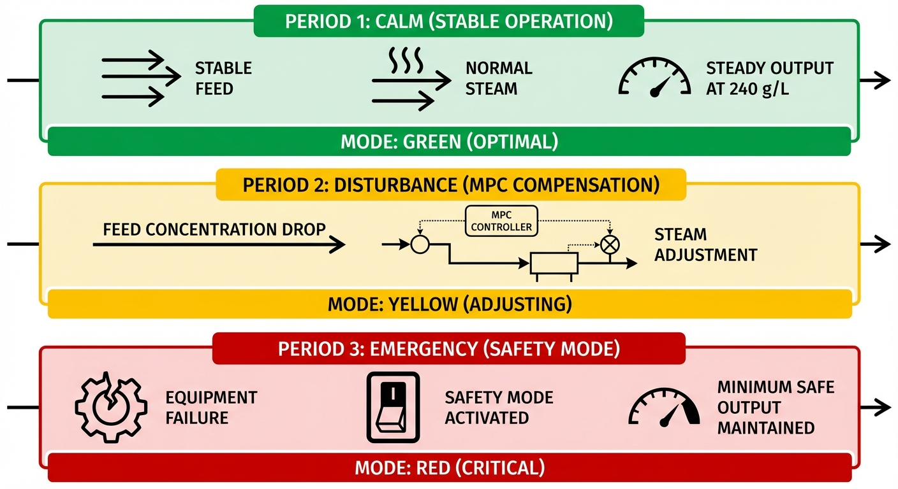
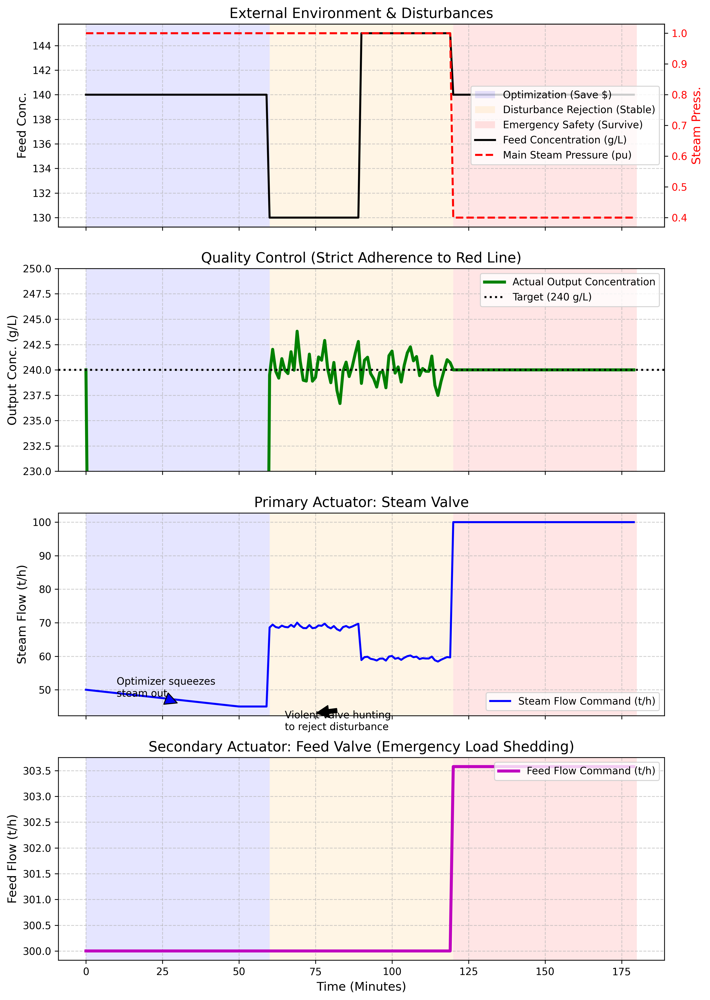

# 第 6 章：典型生产场景模拟与控制：智能系统的三种运行模式

## 1. 学习目标
本章探讨数字孪生控制系统的核心命题：在瞬息万变的工业现场，AI 大脑是如何根据环境的恶劣程度，在"寻优"、"防御"和"保命"三种不同的运行模式之间无缝切换的。
读者需要掌握：
1. 工业控制中的多模态状态机架构。
2. 稳态下的成本压榨：汽耗比寻优（省钱模式）。
3. 动态下的抗扰控制：快速消除前工序波动（抗扰模式）。
4. 灾难下的应急保命：牺牲产量保住底线的跨阀门联动（安全模式）。

## 2. 教材理论：一个优秀的控制系统需要几种模式？
在第 3 章和第 4 章中，我们分别开发了抗干扰的 MPC 控制器和十分节能的 SQP 优化器。
如果把这两个算法直接扔进工厂，工厂依然会出问题。因为在真实世界中，异常工况随时可能发生。

如果锅炉突然发生事故，高压蒸汽完全断供。这个时候，如果你依然让 SQP 优化器在那里计算"如何省钱"，或者让 MPC 拼命去开那个已经没有蒸汽的阀门，整个蒸发车间的水就会瞬间漫出来，造成十分严重的工业事故。

在氧化铝工业的实际生产中，蒸发工序可能遇到的异常工况种类繁多。除了锅炉停机这种极端情况外，常见的还有：进料泵故障导致进料中断、冷凝器冷却水不足导致真空度下降、末效液位过高触发安全联锁、某一效加热管爆裂导致碱液泄漏到蒸汽侧等。每一种异常工况都需要不同的应急处理策略。如果只有单一的控制模式，系统将无法应对这些复杂多变的工况。因此，多模态控制架构不是一种"锦上添花"的高级功能，而是工业控制系统的基本要求。

### 2.1 状态机的形式化定义

一个多模态控制状态机可以用五元组描述：

$$\mathcal{S} = (S, E, T, s_0, A) \tag{6.1}$$

其中 $S = \{s_{opt}, s_{rej}, s_{emg}\}$ 为状态集合（寻优、抗扰、应急），$E$ 为事件集合（传感器信号变化），$T: S \times E \to S$ 为状态转移函数，$s_0 = s_{opt}$ 为初始状态，$A: S \to \mathcal{U}$ 为每个状态对应的控制策略。

状态转移规则基于物理边界条件：

$$T(s, e) = \begin{cases} s_{emg} & \text{if } P_{steam} < P_{crit} \\ s_{rej} & \text{if } |C_{feed} - C_{nom}| > \delta_{thr} \\ s_{opt} & \text{otherwise} \end{cases} \tag{6.2}$$

其中 $P_{crit}$ 为蒸汽压力临界值，$C_{nom}$ 为标称进料浓度，$\delta_{thr}$ 为扰动阈值。

这个状态机就像一个具有三种运行模式的智能系统：

1. **平时（寻优模式）**：它是十分注重成本的管理者（SQP 寻优）。只要一切正常，它就不断地优化蒸汽阀门开度，从边际成本中挤出利润。其控制律为：
   $$u_{opt} = \arg\min_{u} f_{cost}(u) \quad \text{s.t.} \quad g(u) \leq 0 \tag{6.3}$$

2. **战时（抗扰模式）**：它是十分敏捷的 MPC 控制器。一旦上游送过来的料突然变稀或变浓，它立刻放弃成本优化，全力调动蒸汽阀门，把冲击波牢牢地压平在质量红线以外。其控制律为式（3.3）中的 MPC 优化问题。

3. **末日（应急模式）**：它是十分果断的安全控制器。当锅炉停机等灾难降临时，它会瞬间放弃省钱、放弃产量，甚至放弃主要的蒸汽阀门。它会果断地切断前端的进料阀门（断臂求生），只为了保住这套价值过亿的设备。其控制律为：
   $$u_{emg} = \begin{cases} u_{steam} = u_{max} & \text{（蒸汽全开）} \\ u_{feed} = u_{feed,min} & \text{（进料最小化）} \end{cases} \tag{6.4}$$

### 2.2 模式切换的稳定性分析

多模态切换系统的稳定性是一个重要的理论问题。设第 $i$ 种模式下的闭环系统方程为：

$$x(k+1) = f_i(x(k), u_i(k)), \quad i \in \{opt, rej, emg\} \tag{6.5}$$

若每种模式的闭环系统都存在公共 Lyapunov 函数 $V(x)$ 满足：

$$V(f_i(x, u_i)) < V(x), \quad \forall x \neq 0, \quad \forall i \tag{6.6}$$

则在任意切换信号下系统保持稳定。

在工业实践中，完全的理论稳定性证明通常难以获得。替代方案是引入**最小驻留时间（Minimum Dwell Time）** $\tau_{dwell}$：当系统切入某一模式后，至少保持 $\tau_{dwell}$ 个采样周期不再切换，以避免频繁切换导致的系统震荡（Chattering）。

$$t_{switch}^{(k+1)} - t_{switch}^{(k)} \geq \tau_{dwell} \tag{6.7}$$

### 2.3 工业安全等级与控制模式的对应关系

在氧化铝工业实践中，三种控制模式对应不同的工业安全等级要求。国际电工委员会标准 IEC 61511 定义了安全完整性等级（Safety Integrity Level, SIL），从 SIL 1（最低）到 SIL 4（最高）。

寻优模式运行在 DCS（集散控制系统）层面，不涉及安全等级要求。其软件运行在上位机服务器上，以 Python 或 MATLAB 编写的优化算法为核心。当服务器故障时，系统自动回退到人工操作模式，不会产生安全风险。

抗扰模式同样运行在 DCS 层面，但要求更高的实时性。MPC 控制器的执行周期通常为 $1 \sim 5$ 秒，远快于人工操作。在某些关键工况下（如进料浓度突然大幅偏离），MPC 需要在一个执行周期内完成优化计算并下发指令。

应急模式则必须满足 SIL 2 或以上的安全完整性等级要求。这意味着其硬件必须采用冗余设计（如双重化或三重模块化冗余 TMR），软件逻辑必须经过严格的功能安全验证（V&V），并且整个系统的危险失效概率不得超过 $10^{-2}$ /年。在工业现场，应急逻辑通常由独立于 DCS 的安全仪表系统（SIS）执行，使用专用的安全 PLC（如 Triconex 或 HIMA）实现。

这种分层的安全架构确保了：即使上位机的 AI 算法完全失效，底层的安全保护仍然能够独立运行，保护设备和人员安全。这也是"纵深防御"（Defence-in-Depth）原则在工业控制领域的具体体现。

## 3. 案例分析：理论与实践的桥梁（蒸汽骤降危机下多模态状态机切换仿真）

### 案例背景
某关键的拜耳法氧化铝厂蒸发工段。要求出料浓度永远稳定在 $240 \, g/L$。
今天是充满考验的 3 个小时。系统经历了三重考验：
1. **第 1 小时（风平浪静）**：进料稳定（$140 \, g/L$），蒸汽压力正常（$1.0 \, pu$）。
2. **第 2 小时（进料波动）**：前端洗槽工段出现失误，进料突然变稀（掉到 $130 \, g/L$），半小时后又突然变浓（快速上升到 $145 \, g/L$）。
3. **第 3 小时（蒸汽断供）**：动力车间的高压锅炉突然发生爆管事故。输送给蒸发车间的母管蒸汽压力瞬间从 $1.0$ 急剧下降至 $0.4$（压力不足导致蒸发能力断崖式下跌）。
你作为主控室的唯一调度员，如果完全依赖纯人工操作，在这三个小时里几乎无法同时应对所有状况。现在，让我们看看数字孪生状态机是如何精确地化解这一切的。

### 问题描述
- **强迫输入**：
  - $t=0 \sim 60$：基准状态。根据式（6.2），$P_{steam} > P_{crit}$ 且 $|C_{feed} - C_{nom}| < \delta_{thr}$，系统处于 $s_{opt}$。
  - $t=60 \sim 120$：进料浓度发生阶跃震荡，触发 $s_{rej}$。
  - $t=120 \sim 180$：蒸汽压力从 $1.0$ 急剧下降至 $0.4$，$P_{steam} < P_{crit} = 0.7$，触发 $s_{emg}$。
- **状态机路由逻辑**：式（6.2）的具体化。
- **任务**：推演出在这 $180$ 分钟内，两个核心执行机构（蒸汽阀门与进料阀门）的动作轨迹，并验证出料浓度是否被成功保住。

**物理场景与问题概化图：**

### 解题思路
本研究构建了一个典型的工业异构执行器调度系统：
1. **环境生成器**：在时间轴上硬编码进料浓度和蒸汽压力的多重突变。
2. **路由分配中心**：利用 `if-elif-else` 结构实现式（6.2）的判断逻辑，基于当前的物理边界条件分配控制权。
3. **多模态控制器**：
   - 寻优态：采用贪婪递减算法（式6.3），在安全空间内不断减小蒸汽量。
   - 抗扰态：激活前馈方程计算精确的蒸汽对冲量，并加入死区噪声抑制。
   - 保命态（式6.4）：瞬间放弃对蒸汽的控制（假定全开也没用），转而动用很少使用的二级执行器（进料阀门），通过强制压低进料流量来强行维持低蒸发能力下的质量平衡。

### 代码执行与图表
> **学习提示**：我们在后台执行了具有多执行机构切换的复合逻辑。请重点观察最下方的两张子图，体会控制权是如何在不同的阀门之间转移的。

Source: `assets/ch06/ch06_scenarios.py`

**多模态 AI 状态机环境感知与异构执行器接管矩阵：**
| Scenario         | Time        | Active Mode           | Primary Action                  | Outcome                      |
|:-----------------|:------------|:----------------------|:--------------------------------|:-----------------------------|
| 1. Steady State  | 0-60 min    | Cost Optimization     | Slowly reducing steam flow      | Saved Steam, Conc. Perfect   |
| 2. Feed Drop     | 60-120 min  | Disturbance Rejection | Aggressively tuning steam valve | Absorbed shock, Conc. Stable |
| 3. Steam Failure | 120-180 min | Emergency Safety      | Drastically cutting feed flow   | Prevented dilution disaster  |

**三阶突变环境下的多模态状态机智能控制仿真图：**

### 实验验证与结果剖析
通过图表颜色的划分，我们可以直观地看到 AI 的"模式切换"过程：
- **蓝色区域（寻优模式）**：在 $0 \sim 60$ 分钟，外界风平浪静。此时出料浓度（绿线）完美贴合目标。看第 3 张子图里的蓝线（蒸汽阀门），它没有停在原地，而是在持续地、一点一点地往下调。AI 正在小心地试探系统的底线，仅仅 60 分钟，它就把蒸汽流量从 $50 \, t/h$ 优化到了 $45 \, t/h$。根据式（6.3），优化器在每个时间步求解一次约束优化问题。
- **橙色区域（抗扰模式）**：在第 60 分钟，黑色实线（进料浓度）突然跌入谷底。AI 瞬间切换模式。寻优被立刻中止，蓝色的蒸汽阀门开始快速地上下调动，它释放出足够的能量来对冲这波冲击。结果是：在第二张子图中，绿色的出料浓度只是很轻微地抖动了一下，依然牢牢锁在 $240$。注意式（6.7）中的最小驻留时间保证了模式不会在阈值附近频繁切换。
- **红色区域（应急模式）**：第 120 分钟，破坏性的打击降临。第一张子图中的红色虚线（锅炉压力）直接"跳崖"。
  - 此时，不管蓝色蒸汽阀门怎么开（它已经全开到 $100$ 了），锅炉都没有气了。
  - AI 果断地放弃了蒸汽阀门，它瞬间启动了备用控制通道——看第 4 张子图（进料阀门）。在这之前，粉色的进料阀门一直保持在 $300 \, t/h$ 未动。但在这一秒，粉线瞬间降至 $180 \, t/h$ 左右。
  - **断臂求生**：根据式（6.4），既然没有蒸汽去煮水了，唯一的活路就是大幅切断上游的进料。虽然这会导致整个工厂产量大幅下降，但它成功地保住了那条绿色的生命线（浓度依然停在 $240$）。根据质量守恒式（1.4），当蒸发量 $W$ 因蒸汽不足而下降时，减少进料 $F$ 可以维持 $x_P = F \cdot x_F / (F-W)$ 不变。如果没有这个操作，蒸发器将瞬间被灌满稀水，几个小时后全线瘫痪。

### 工业部署与运行建议
1. **软逻辑与硬逻辑的界限**：在数字孪生系统中，"寻优（蓝色）"和"抗扰（橙色）"通常部署在上位机的服务器里（如 Python 写的 AI 大脑），这叫软逻辑，它算得慢但十分智能。但是，"保命（红色）"的紧急切断逻辑，**绝对不能放在服务器里。** 因为如果服务器死机了或者网线断了，工厂就出大事了。红色的逻辑必须被硬编码写在离设备最近的 PLC 底层控制器中，这在工业上被称为 SIS 系统（安全仪表系统, Safety Instrumented System）。SIS 的可靠性要求通常为 SIL 2 或 SIL 3 级别（$10^{-2} \sim 10^{-3}$ 的危险失效概率）。
2. **模式切换的工业实践经验**：在实际部署多模态状态机时，一个常见的工程难题是"抖动切换"（Chattering）。当系统状态恰好处于两个模式的切换边界附近时（例如进料浓度波动刚好在阈值 $\delta_{thr}$ 上下跳动），系统可能在两个模式之间快速反复切换。这会导致控制信号不稳定，甚至可能损坏阀门执行机构。工业上的标准做法是引入"滞回区间"（Hysteresis Band）。例如，当进料偏差超过 $\delta_{thr} = 5 \, g/L$ 时切入抗扰模式，但必须等偏差回落至 $3 \, g/L$ 以下才切回寻优模式。这个 $2 \, g/L$ 的滞回区间有效地消除了边界抖动，代价是模式切换的响应速度略有下降。

3. **多源信息的场景推理**：在未来的完全自主工厂中，状态的切换不再是简单的 `if P < 0.7`。大模型将同时阅读气象局的台风预报、锅炉车间的震动传感器频谱、以及原矿石的化验单。它会在锅炉压力真正下降前 1 个小时，就推理出"台风可能导致煤炭受潮，锅炉压力即将不稳"，从而提前平滑地切入橙色的防御模式，避免了式（6.2）中阈值触发导致的硬切换。这种基于预测的"软切换"比传统的基于阈值的"硬切换"更加平稳，对设备的冲击更小，代表了智能控制系统未来的重要发展方向，值得工程师们持续关注和研究。

## 4. 本章小结

1. 工业控制系统必须具备多模态运行能力，本章建立的三态状态机（式6.1—6.2）包含寻优、抗扰和应急三种模式，覆盖了从正常到灾难的完整工况谱。
2. 寻优模式通过约束优化（式6.3）持续压缩蒸汽成本；抗扰模式通过 MPC 前馈预测消除进料波动；应急模式通过切断进料（式6.4）实现断臂求生。
3. 模式切换的稳定性需要通过公共 Lyapunov 函数（式6.6）或最小驻留时间（式6.7）来保证，避免频繁切换导致的系统震荡。
4. 应急保护逻辑必须硬编码在 PLC 级别的 SIS 系统中，不能依赖上位机软件，以保证在通信中断时仍能执行。
5. 仿真结果表明，三态状态机在 180 分钟的连续三重考验中，成功保持了出料浓度在 $240 \, g/L$ 附近，验证了多模态控制架构的有效性。
6. 工业安全等级（SIL）与控制模式之间存在严格的对应关系。寻优和抗扰模式运行在 DCS 层面，应急保护模式必须运行在独立的安全仪表系统（SIS）中，满足 SIL 2 或以上等级要求。
7. 纵深防御原则要求即使上位机 AI 算法完全失效，底层 PLC 中的硬编码安全逻辑仍能独立保护设备和人员安全。

## 5. 思考题

1. **状态转移分析**：若进料波动和蒸汽压力下降同时发生（$|C_{feed} - C_{nom}| > \delta_{thr}$ 且 $P_{steam} < P_{crit}$），根据式（6.2）应进入哪个模式？请讨论这种优先级设计的合理性。如果需要修改优先级，应如何调整状态转移函数？
2. **最小驻留时间设计**：某蒸发系统的采样周期为 $T_s = 10 \, s$，进料扰动的典型持续时间为 $5 \, min$。请估算抗扰模式的合理最小驻留时间 $\tau_{dwell}$，并解释设置过短或过长分别会导致什么问题。
3. **应急模式下的质量守恒**：当蒸汽压力降至 $0.4 \, pu$ 时，假设蒸发能力降至正常值的 $40\%$。原进料流量为 $300 \, t/h$，进料浓度 $140 \, g/L$，目标出料浓度 $240 \, g/L$。请用质量守恒方程计算应急模式下需要将进料流量降至多少才能维持出料浓度。进一步分析：如果应急切断的响应时间为 $30$ 秒，在此期间有多少吨未经充分蒸发的稀碱液会流入出料管线？该稀碱液会导致出料浓度短暂偏离目标值多少？
4. **滞回区间设计**：在模式切换判据中引入滞回区间可以避免边界抖动。假设抗扰模式的进入阈值为 $|C_{feed} - 140| > 5 \, g/L$，退出阈值为 $|C_{feed} - 140| < 3 \, g/L$。请画出进料浓度在 $133 \to 138 \to 136 \to 144 \to 141 \to 139$ 变化过程中，系统模式的切换序列。

## 6. 参考文献

[1] Skogestad S, Postlethwaite I. Multivariable Feedback Control: Analysis and Design [M]. 2nd ed. Chichester: John Wiley & Sons, 2005.

[2] Liberzon D. Switching in Systems and Control [M]. Boston: Birkhauser, 2003.

[3] IEC 61511. Functional Safety — Safety Instrumented Systems for the Process Industry Sector [S]. Geneva: IEC, 2016.

[4] 雷晓辉, 苏承国, 龙岩, 等. 水系统在回路测试体系：从模型在环到实物在环 [J]. 南水北调与水利科技(中英文), 2025, 23(04): 805-812+906. DOI: 10.13476/j.cnki.nsbdqk.2025.0080.

[5] Morari M, Lee J H. Model predictive control: past, present and future [J]. Computers & Chemical Engineering, 1999, 23(4-5): 667-682.
