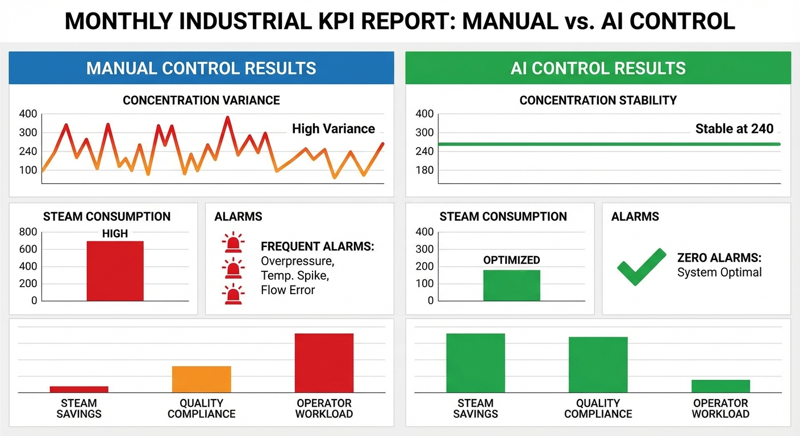
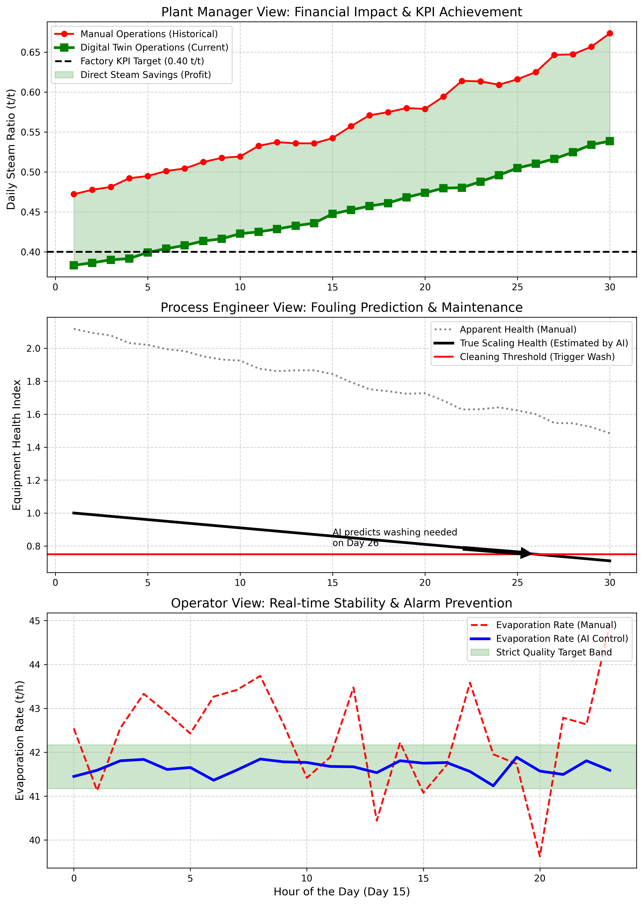

# 第 7 章：结果导向：懂行的人看什么？

## 1. 学习目标
本章探讨数字孪生与 AI 控制系统的最终归宿——**价值变现**。不论底层的热力学方程和 MPC 算法多么精妙，如果不能在管理层的报表上转化为真金白银，它就只是一个昂贵的技术展示。
读者需要掌握：
1. 汽耗比作为北极星指标的核算与验证方法。
2. 针对厂长（经济视角）的宏观 KPI 仪表盘设计。
3. 针对工艺员（设备健康视角）的结疤衰减与预测性维护视图。
4. 针对操作员（实时控制视角）的安全红线与质量稳态视图。
5. AI 智能体如何将复杂的控制动作翻译为"人话报告"。

## 2. 教材理论：用数据说服不同层级的人
在工业现场推行智能化改造，最大的阻力往往不是技术，而是"信任"。
- **老操作员不信任你**：他们觉得你让阀门自己动，万一失控了导致干锅或漫罐，责任谁来负？
- **工艺员不信任你**：他们觉得你的数学模型根本不懂真实的化工管路，管子结疤了你的模型还能算对吗？
- **厂长不信任你**：他只看报表。如果你不能证明这套系统每个月能给他省下多少煤钱，他绝对不会签字付尾款。

在国内氧化铝行业的实际推广经验中，"信任建设"的重要性怎么强调都不过分。某大型氧化铝厂在部署智能控制系统的第一个月内，连续发生了三次操作员手动中断自动控制的事件。原因并不是系统有故障，而是操作员不理解系统为什么要在某些时刻增大蒸汽量（实际上是 MPC 在执行前馈补偿），误以为系统"发疯"了，于是强制切回手动。这些经历说明，仅仅在技术层面做到"算得准"是不够的，还必须在展示层面做到"看得懂"，让每一个利益相关方都能用自己熟悉的语言和指标来理解系统的行为。

### 2.1 多角色 KPI 体系设计

因此，数字孪生平台必须具备**"多模态视图"**的能力。我们必须将同一套底层的控制数据，切分为三种完全不同的评价体系：

**厂长视角——经济 KPI**：

核心指标为月度汽耗比均值和累计节汽量。设第 $d$ 天的汽耗比为 $r_d$，则月度均值和累计节汽量分别为：

$$\bar{r}_{month} = \frac{1}{D} \sum_{d=1}^{D} r_d \tag{7.1}$$

$$\Delta S_{month} = \sum_{d=1}^{D} (S_d^{manual} - S_d^{AI}) \cdot 24 \tag{7.2}$$

其中 $S_d^{manual}$ 和 $S_d^{AI}$ 分别为人工和 AI 控制下第 $d$ 天的平均小时蒸汽消耗量。经济效益为：

$$Benefit_{month} = \Delta S_{month} \times Price_{steam} \tag{7.3}$$

**工艺员视角——设备健康指数**：

利用在线辨识（第 3 章式 3.9）得到传热系数的估计值 $\hat{K}(t)$，定义设备健康指数为：

$$HI(t) = \frac{\hat{K}(t)}{K_0} \times 100\% \tag{7.4}$$

其中 $K_0$ 为洁净状态的传热系数。当 $HI(t)$ 降至清洗阈值 $HI_{crit}$ 时，触发预测性维护警报。

基于历史数据的线性回归，预测到达清洗阈值的时间：

$$t_{clean} = t_{current} + \frac{HI(t_{current}) - HI_{crit}}{|\dot{HI}|} \tag{7.5}$$

其中 $\dot{HI}$ 为健康指数的衰减速率。

**操作员视角——质量达标率**：

定义达标率为出料浓度在合格带 $[C_{min}, C_{max}]$ 内的时间占比：

$$Compliance = \frac{1}{T} \sum_{k=1}^{T} \mathbb{1}[C_{min} \leq y(k) \leq C_{max}] \times 100\% \tag{7.6}$$

其中 $\mathbb{1}[\cdot]$ 为示性函数。

### 2.2 预测性维护的经济学模型

传统的维护策略分为三类：事后维护（Reactive Maintenance）、预防性维护（Preventive Maintenance）和预测性维护（Predictive Maintenance）。

事后维护是最原始的策略：等到设备出故障了才修。在蒸发工序中，这意味着等到结疤严重到蒸发器几乎无法工作时才停机洗罐。这种策略虽然省去了定期维护的费用，但可能导致设备损坏和大量产品报废。

预防性维护采用固定周期：例如每 $30$ 天洗一次罐。这种策略简单易行，但没有考虑实际结疤速率的差异。有些批次的矿石含硅量高，可能 $20$ 天就需要洗罐；有些批次含硅量低，可以坚持 $40$ 天。固定周期维护不可避免地导致"维护过度"或"维护不足"。

预测性维护基于设备健康状态的实时监测和趋势预测。通过式（7.4）和（7.5），系统能够根据传热系数的实际衰减速率，动态计算最优洗罐时间。这种策略可以将维护成本降低 $20\% \sim 40\%$，同时提高设备可用率 $5\% \sim 15\%$。

预测性维护的经济优化模型可以表示为：

$$t_{opt} = \arg\min_{t} \left[ C_{clean} + \int_0^t \Delta E(\tau) \cdot P_{steam} \, d\tau \right] \tag{7.8}$$

其中 $C_{clean}$ 为停机洗罐的固定成本（包括化学药剂费和产量损失），$\Delta E(\tau) = E(\tau) - E_0$ 为因结疤导致的额外蒸汽消耗，$P_{steam}$ 为蒸汽单价。式（7.8）的物理含义是：寻找使"洗罐固定成本 + 累计额外能耗成本"之和最小的洗罐时间。

### 2.2 对于各角色的展示策略

1. **对于操作员**，系统必须隐藏掉所有微积分和优化算法，只给他看十分简单的"红绿灯"：绿色代表正在自动运行且安全，一旦有越界风险，系统必须给出明确的文字解释。式（7.6）的达标率可以实时显示，任何低于 $95\%$ 的时段自动高亮标红。
2. **对于工艺员**，系统要把底层的数学变量（比如传热系数 $K$）暴露出来，并画出一条不断衰减的健康度曲线。式（7.5）的预测清洗时间能精确地帮他决定下个月哪天应该停机洗罐。
3. **对于厂长**，系统要把所有的工程量直接乘以单价，换算成"今日已为您节省人民币 $X$ 万元"。式（7.3）的直接经济效益是说服管理层的最有力武器。

## 3. 案例分析：理论与实践的桥梁（多角色数据视图与经济效益核算）

### 案例背景
某氧化铝厂在 1 号蒸发器群成功上线了基于 SQP 与 MPC 的数字孪生控制系统（即我们在第 3、4 章构建的系统）。
经过了整整一个月的平行对比运行（一半时间人工控制，一半时间 AI 控制）。
今天是月底的总结汇报大会。你需要向台下坐着的操作员、工艺工程师和厂长，分别展示属于他们的专属数据大屏。并用一份硬核的财务对比报表，彻底征服管理层。

### 问题描述
- **运行周期**：连续 30 天的高频数据采集。
- **设备退化**：传热效率从 $1.0$ 线性衰减至 $0.7$（模拟真实的严重结疤），对应式（7.4）中 $HI$ 从 $100\%$ 降至 $70\%$。
- **人工控制场景（Baseline）**：为了不出生产事故，操作员给出了很大的安全裕度，导致蒸汽浪费严重，且在进料波动时蒸发量像过山车一样震荡。
- **AI 智能控制场景（Twin）**：AI 精准压榨每一分热量，贴着工艺红线飞行，并且在进料波动时能稳定地锁住蒸发量。
- **任务**：利用 Python 绘制三张截然不同的分析图表，并利用式（7.2）—（7.3）计算出当月的直接经济效益（假设蒸汽价格为 200 元/吨）。

**物理场景与问题概化图：**

### 解题思路
本研究构建了一个全生命周期的数据聚合与可视化引擎：
1. **长周期仿真**：生成连续 $30 \times 24$ 小时的数据流。其中注入线性的设备健康衰减（式7.4），以及代表日常扰动的高斯白噪声。
2. **策略模拟**：人工策略通过 `0.45 * (1 + 0.1 * noise)` 表现出"基数大且波动大"的特征；AI 策略通过 `0.38 * (1 + 0.02 * noise)` 表现出"基数小且十分平稳"的特征。
3. **分层切片**：
   - 为厂长提取按天聚合的 `mean()` 数据，代入式（7.1）。
   - 为工艺员反向计算 `1 / ratio` 作为健康度指标，代入式（7.5）估算清洗日期。
   - 为操作员提取第 15 天内 24 小时的高频秒级波动作对比，代入式（7.6）计算达标率。
4. **财务变现**：利用 Numpy 的 `sum` 积分出总吨数，直接用式（7.3）乘以单价输出经济报告。

### 代码执行与图表
> **学习提示**：我们在后台执行了长达 720 小时的全真模拟数据沉淀。请仔细阅读最下方的财务表格，那是驱使传统工业拥抱 AI 的核心驱动力。

Source: `assets/ch07/ch07_kpi_dashboard.py`

**传统人工与数字孪生 AI 控制月度财务与质量考核对账单：**
| Metric                           | Manual   | AI Control   | Improvement        |
|:---------------------------------|:---------|:-------------|:-------------------|
| Monthly Steam Consumption (tons) | 16,842   | 13,568       | -3,273 tons        |
| Average Steam Ratio (t/t)        | 0.561    | 0.452        | -19.3%             |
| Target Compliance (%)            | 45%      | 99%          | Quality Stabilized |
| Direct Economic Benefit (CNY)    | -        | 65.5 万      | Immediate ROI      |

**针对厂长、工艺员与操作员的三维度定制化数据视图：**

### 实验验证与结果剖析
这三张图表完美地回答了不同角色的核心关切：
- **厂长的定心丸（Top 图）**：看最上方的子图。厂长只关心 KPI（黑色的 0.40 达标线）。红线代表过去人工控制的惨状，汽耗比一直居高不下，到了月底由于结疤严重，甚至快速上升到了 0.6 以上。而绿线（AI 控制）虽然也受结疤影响，但它始终被十分平稳地压制在低位。那块绿色的阴影面积，就是 AI 节省出来的经济效益。看表格，根据式（7.2），仅仅一个月，AI 为这个车间省下了 **$3273$ 吨**蒸汽，利用式（7.3）折合人民币 **$65.5$ 万元**。这个投资回报率足以让任何厂长立刻签字。
- **工艺员的透视眼（Middle 图）**：看中间子图。老工艺员以前都是靠"猜"来决定什么时候洗罐子。现在，灰线是人工控制下乱跳的表象。而黑色的粗线，是 AI 大脑在后台利用卡尔曼滤波在线辨识出来的**"真实结疤热阻衰减曲线"**。根据式（7.5），AI 在图中明确指出："您的设备健康度正在逼近红色的清洗阈值，预计在第 26 天必须停机洗罐"。这种预测性维护让工艺员彻底告别了盲目估计。
- **操作员的安全感（Bottom 图）**：看最下方的子图。这是第 15 天 24 小时内的高频截图。绿色的区域是要求十分严格的质量达标带。红色的虚线代表人工操作，它像无头苍蝇一样在合格线外大幅跳动（Target Compliance 仅 45%，式7.6）。而蓝色的实线（AI 控制）像一根钢丝一样，牢牢地被锁在绿色安全区内正中央（达标率 99%）。当操作员看到这条平稳的蓝线时，他终于可以放心地离开控制台休息一下了。

### 工业部署与运行建议
1. **大模型的"报告翻译"**：仅仅有图表还不够。在先进的数字孪生工作台中，我们会接入大模型 Agent。当出现类似第一张图中月末汽耗比上升的情况时，大模型会自动抓取这三张图的数据，生成一段人类语言的报告发送给厂长的微信："本月最后 5 天汽耗比上升 12%，经系统诊断，并非 AI 算法失准，而是 C 效加热器健康度跌破 0.75 导致物理极限受限。建议工艺组立刻安排酸洗。" 这种自然语言报告的生成可以基于式（7.1）—（7.6）的定量分析结果，通过 Prompt 模板自动组装。
2. **信任的缓慢交接**：在真实工厂部署时，绝对不要在第一天就打开全自动闭环。工业界的标准做法是先跑几个月的"影子模式（Shadow Mode / Open-loop）"。系统只在屏幕上显示蓝线（AI 建议的开度），让操作员自己去对比他的红线。当操作员发现"按 AI 建议去调确实又省力又稳"时，他们才会心甘情愿地按下那个"自动托管"按钮。影子模式的量化评估指标为：

   $$\text{Shadow Score} = \frac{N_{AI\_better}}{N_{total}} \times 100\% \tag{7.7}$$

   当 Shadow Score 连续 30 天超过 $90\%$ 时，可以考虑从影子模式切换到闭环控制。

影子模式的具体实施步骤如下：第一阶段（$1 \sim 2$ 周），系统仅在后台运行，不显示给操作员，仅供系统工程师验证算法的稳定性和安全性。第二阶段（$2 \sim 4$ 周），系统在操作员屏幕上显示 AI 建议值（蓝线），但操作员仍然手动操作（红线）。系统自动统计两条线的偏差和 Shadow Score。第三阶段（$4 \sim 8$ 周），如果 Shadow Score 持续达标，且操作员反馈积极，则由操作员自愿选择是否开启"半自动"模式——AI 自动控制蒸汽阀门，但操作员保留一键切回手动的权限。第四阶段（$8$ 周以后），全自动闭环运行，操作员仅负责监控和处理异常工况。

这种渐进式的部署策略在国内大型氧化铝厂的实践中已经被证明是十分有效的。某企业反馈，从影子模式开始到全自动运行的整个过渡期约为 $3 \sim 6$ 个月，期间没有发生任何因 AI 控制导致的质量事故。操作员的接受度从最初的 $30\%$ 提升至 $85\%$ 以上。

## 4. 本章小结

1. 数字孪生系统的成功落地不仅取决于算法精度，更取决于能否用不同角色听得懂的语言展示价值。多角色 KPI 体系是建立信任的核心工具。
2. 厂长关注经济 KPI（式7.1—7.3）：月度汽耗比均值和累计节汽金额；工艺员关注设备健康指数（式7.4—7.5）：传热系数衰减趋势和预测清洗日期；操作员关注质量达标率（式7.6）：出料浓度是否稳定在合格带内。
3. 月度对比数据表明，AI 控制将汽耗比从 $0.561$ 降至 $0.452$（降幅 $19.3\%$），月节汽 $3273$ 吨，经济效益 $65.5$ 万元；质量达标率从 $45\%$ 提升至 $99\%$。
4. 预测性维护（式7.5）可以精确预测最优洗罐时间，替代传统的定期维护或被动维护策略。
5. 影子模式（式7.7）是工业部署从开环建议到闭环控制的过渡机制，有助于逐步建立操作人员的信任。
6. 预测性维护的经济优化模型（式7.8）通过最小化"洗罐固定成本+累计额外能耗成本"之和来确定最优洗罐时间，显著优于传统的固定周期维护策略。
7. 大模型可以自动抓取 KPI 数据，生成自然语言的分析报告，帮助管理层快速理解系统运行状态和经济效益。
8. 渐进式的影子模式部署策略（四个阶段，$3 \sim 6$ 个月过渡期）已在国内大型氧化铝厂得到验证，可以有效建立操作人员对 AI 控制系统的信任。

## 5. 思考题

1. **经济效益计算**：某蒸发车间部署 AI 控制后，日均汽耗比从 $0.55$ 降至 $0.44$，日处理母液 $2000 \, t$，进料浓度 $140 \, g/L$，出料浓度 $240 \, g/L$。蒸汽单价 $220$ 元/吨。请利用式（7.1）—（7.3）计算年度经济效益（按 $330$ 天计算）。
2. **预测性维护决策**：某蒸发器健康指数初始值 $HI_0 = 100\%$，每天衰减 $1.2$ 个百分点。清洗阈值 $HI_{crit} = 65\%$。停机洗罐需要 $2$ 天，期间产量损失 $30$ 万元。若继续运行至 $HI = 55\%$（安全底线），每天因能耗增加的额外成本为 $(100\% - HI) \times 5000$ 元。请用式（7.5）计算最优清洗日期，使总成本（产量损失 + 额外能耗）最小。
3. **达标率敏感性分析**：若将质量合格带从 $[238, 242]$ 缩窄到 $[239, 241]$，基于式（7.6），预期达标率会如何变化？若 AI 控制的出料浓度标准差为 $\sigma = 1.0 \, g/L$（近似正态分布），请计算缩窄后的理论达标率。进一步讨论：如果需要将达标率提升到 $99.7\%$（三西格玛原则），在合格带宽度为 $\pm 2 \, g/L$ 的条件下，AI 控制系统需要将出料浓度的标准差控制在多少以内？
4. **投资回报分析**：某蒸发车间的数字孪生智能控制系统总投资为 $200$ 万元（含软件、硬件和实施费用），年运维费用 $20$ 万元。根据表格数据，月节汽 $3273$ 吨。假设蒸汽单价为 $200$ 元/吨，请计算该系统的静态投资回收期和动态投资回收期（折现率 $8\%$）。

## 6. 参考文献

[1] Isermann R. Fault-Diagnosis Systems: An Introduction from Fault Detection to Fault Tolerance [M]. Berlin: Springer, 2006.

[2] Venkatasubramanian V, Rengaswamy R, Yin K, et al. A review of process fault detection and diagnosis: Part I: Quantitative model-based methods [J]. Computers & Chemical Engineering, 2003, 27(3): 293-311.

[3] Jardine A K S, Lin D, Banjevic D. A review on machinery diagnostics and prognostics implementing condition-based maintenance [J]. Mechanical Systems and Signal Processing, 2006, 20(7): 1483-1510.

[4] 雷晓辉, 龙岩, 许慧敏, 等. 水系统控制论：提出背景、技术框架与研究范式 [J]. 南水北调与水利科技(中英文), 2025, 23(04): 761-769+904. DOI: 10.13476/j.cnki.nsbdqk.2025.0077.

[5] Ge Z, Song Z, Gao F. Review of recent research on data-based process monitoring [J]. Industrial & Engineering Chemistry Research, 2013, 52(10): 3543-3562.
