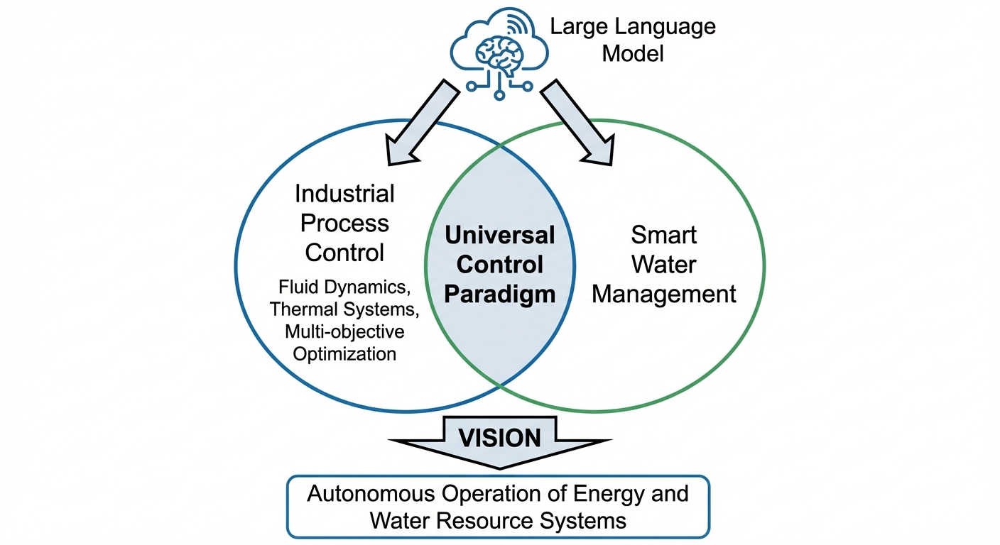
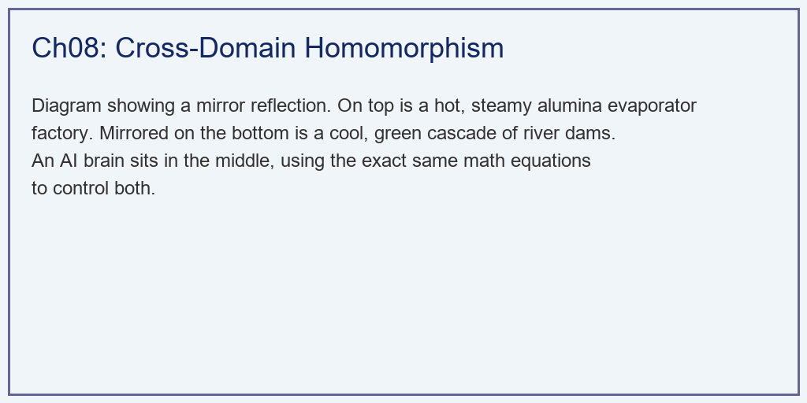
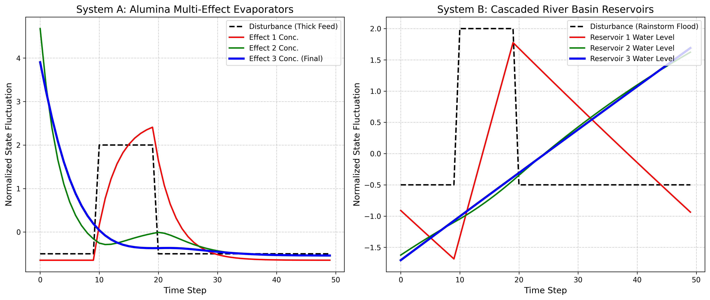

# 第 8 章：工业互联网与智慧水务的殊途同归：通用方程的力量

## 1. 学习目标

本章是全书的终章升华。我们将跳出"铝工业"的狭窄视角，站到控制科学的最高维度。探讨为什么一个用来熬煮铝土矿的复杂化工大模型，竟然可以直接用来指挥几百公里外的城市河流与梯级水库。
读者需要掌握：
1. 复杂流体网络的通用状态空间模型。
2. 跨域映射：蒸发器与水库在物理方程上的同构性。
3. 泛在工业互联网的终极愿景。
4. 基于 FastMCP 的大模型如何成为控制万物的"中央大脑"。

## 2. 教材理论：万物皆流
在本书的前七章，我们一直在跟十分恶劣的强碱、高温、$160^\circ C$ 高压蒸汽打交道。而在水务行业，工程师们天天面对的是雨水、水库的水位、和几百公里长的地下输水管网。
表面上看，这两者风马牛不相及。但控制论的创始人维纳（Norbert Wiener）早在 1948 年就指出，控制与通信的基本原理是跨越不同物理载体而普遍成立的。无论是电路中的电流、管道中的流体还是生态系统中的物种种群，凡是涉及"反馈"和"调节"的系统，都可以纳入统一的控制论分析框架。本章正是这一哲学思想在现代工业互联网时代的具体体现。

### 2.1 状态空间方程的通用性

但是，如果你把工程师们的代码打开，只看最底层的数学方程，你会发现一个深刻的事实：**它们是同一类方程。**

在控制论的视角下，无论是化工厂还是大江大河，它们统统被抽象为**"状态空间方程"**：
$$x_{t+1} = A x_t + B u_t + D w_t \tag{8.1}$$

- **状态变量 $x$**：在氧化铝厂，它是每一个罐子里的液位和**浓度（$g/L$）**；在智慧水务中，它是每一个水库里的水位和**水质（COD）**。
- **控制变量 $u$**：在氧化铝厂，它是调节蒸汽大小的**调节阀门**；在水务中，它是控制河流流量的**大坝闸门**和泵站。
- **外部扰动 $w$**：在化工厂，它是上游工序送来的**进料浓度突变**；在水务中，它是气象局预报的**突发暴雨**。

### 2.2 数学同构性的严格证明

为了严格证明这种同构性，我们需要从偏微分方程出发。

**氧化铝蒸发系统**：多效蒸发器中的浓度传导方程为对流-扩散方程：

$$\frac{\partial C}{\partial t} + v \frac{\partial C}{\partial x} = D_c \frac{\partial^2 C}{\partial x^2} + S(C, T) \tag{8.2}$$

其中 $C$ 为溶液浓度，$v$ 为流速，$D_c$ 为扩散系数，$S(C, T)$ 为蒸发源项。

**水库-河道系统**：圣维南方程（Saint-Venant Equations）描述明渠非恒定流：

$$\frac{\partial A}{\partial t} + \frac{\partial Q}{\partial x} = q_l \tag{8.3}$$

$$\frac{\partial Q}{\partial t} + \frac{\partial}{\partial x}\left(\frac{Q^2}{A}\right) + gA\frac{\partial h}{\partial x} = gA(S_0 - S_f) \tag{8.4}$$

当我们对式（8.3）进行扩散波近似（忽略惯性项）时，得到：

$$\frac{\partial Q}{\partial t} + c \frac{\partial Q}{\partial x} = D \frac{\partial^2 Q}{\partial x^2} \tag{8.5}$$

其中 $c$ 为波速，$D$ 为水力扩散系数。

比较式（8.2）和式（8.5），两者具有完全相同的数学结构——**对流-扩散方程**。这不是巧合，而是因为两个系统都遵循相同的物理守恒定律（质量守恒 + 扩散传输）。

**定理 8.1（跨域同构性）**：设蒸发系统 $\Sigma_E = (A_E, B_E, D_E)$ 和水库系统 $\Sigma_W = (A_W, B_W, D_W)$ 分别由空间离散化后的状态空间方程（8.1）描述。若存在可逆线性变换 $P$ 使得：

$$A_W = P A_E P^{-1}, \quad B_W = P B_E, \quad D_W = P D_E \tag{8.6}$$

则两个系统是**相似的（Similar）**，它们具有完全相同的特征值（动态行为），差异仅在于物理量的量纲和数值范围。

### 2.3 级联系统的传递特性

第一效蒸发器把二次蒸汽传给第二效，第二效再传给第三效。这在传递函数上的表现，与黄河上游的水库把水泄给中游水库，中游再泄给下游水库的级联方程**完全一致**。

对于 $N$ 级串联系统，总传递函数为各级传递函数的乘积：

$$G_{total}(s) = \prod_{i=1}^{N} G_i(s) = \prod_{i=1}^{N} \frac{K_i}{1 + \tau_i s} e^{-\theta_i s} \tag{8.7}$$

这个串联结构带来两个重要的物理效应：

1. **削峰效应**：扰动信号经过每一级的一阶惯性环节 $1/(1+\tau_i s)$ 后，峰值被衰减。经过 $N$ 级后，总衰减比为 $\prod K_i / (1 + (\omega \tau_i)^2)^{1/2}$。
2. **延迟叠加**：总延迟为各级延迟之和 $\Theta = \sum \theta_i$，扰动到达末级的时间显著增大。

既然底层数学是完全同构的，这就推导出了一个重要的结论：**我们在本书第 3 章和第 4 章里写的那套为了降低"汽耗比"的 MPC 和 SQP 算法，只要把参数名字和量纲做相应变换，可以直接用来控制黄河梯级水库的防洪调度。**

这种跨域迁移在工程实践中已有成功案例。例如，石油化工行业开发的先进过程控制（APC）软件包（如 Honeywell 的 RMPCT 和 AspenTech 的 DMCplus），其核心算法最初是为炼油厂的精馏塔设计的。但由于精馏塔的传质传热方程与蒸发器的热质平衡方程具有类似的数学结构，这些 APC 软件包后来被成功应用于氧化铝蒸发、纸浆蒸煮、制糖蒸发等多个领域。

从控制理论的高度来看，这种跨域可迁移性来源于**结构保持映射**的概念。如果两个系统之间存在保持输入输出关系的映射，那么在一个系统上验证过的控制策略，可以通过这个映射直接迁移到另一个系统。式（8.6）中的相似变换矩阵 $P$ 正是这样一个结构保持映射。

在水系统控制论的实际应用中，这种思想已经被推广到更大的范围。例如，城市供水管网的压力控制与蒸汽管网的压力控制在数学上同构（都是管道中的流体压力调节问题）；污水处理厂的曝气量优化与蒸发器的蒸汽量优化在数学上同构（都是通过调节能量输入来维持某个质量指标）。这种"一次开发、多域复用"的模式，正在成为工业软件平台化发展的核心驱动力。

### 2.4 水系统控制论（CHS）的统一框架

这种跨域同构性正是**水系统控制论（Cybernetics of Hydro Systems, CHS）**的理论基础。CHS 将所有流体网络系统形式化为统一的六元受控系统：

$$\Sigma = (P, A, S, D, C, O) \tag{8.8}$$

其中 $P$ 为被控对象（Plant），$A$ 为执行器（Actuator），$S$ 为传感器（Sensor），$D$ 为扰动（Disturbance），$C$ 为控制器（Controller），$O$ 为目标（Objective）。

无论是氧化铝蒸发器还是梯级水库，都可以纳入这个统一框架。差异仅在于各元素的具体物理实现：蒸汽阀门 vs. 闸门、浓度传感器 vs. 水位计、进料波动 vs. 暴雨。

## 3. 案例分析：理论与实践的桥梁（氧化铝蒸发器与梯级水库在数学空间中的同态仿真）

### 案例背景
假设今天发生了两起独立的突发事件：
- **事件 A（化工厂）**：前端工序失误，一股十分浓稠的料浆突然涌入第一效蒸发器，如果不干预，这股异常浓度会顺着管道传导到最后，导致全线异常。
- **事件 B（流域水网）**：上游山区突发十分猛烈的暴雨，洪水冲入一级水库，如果不干预，这股洪峰会顺着河道威胁下游所有的城市。

在这个案例中，我们将写一套 Python 仿真，在同一个坐标系下，展示这两种表面上天差地别的事件，在状态空间中是如何呈现出十分完美的"数学重合"的。

### 问题描述
- **通用扰动 $w$**：在 $t=10 \sim 20$ 分钟输入一个矩形脉冲扰动。根据式（8.1），$w_t = w_0$ 当 $10 \leq t \leq 20$，否则 $w_t = 0$。
- **系统 A（多效蒸发）**：三效串联。状态为各效浓度 $C_i$。动态方程由式（8.2）空间离散化得到：
  $$C_i(t+1) = C_i(t) + \frac{\Delta t}{\tau_i}(C_{i-1}(t) - C_i(t)) \tag{8.9}$$
- **系统 B（梯级水库）**：三库串联。状态为各库水位 $H_i$。动态方程由式（8.3）离散化得到：
  $$H_i(t+1) = H_i(t) + \frac{\Delta t}{A_{s,i}}(Q_{in,i}(t) - Q_{out,i}(t)) \tag{8.10}$$
- **任务**：对这两个系统的动态响应进行归一化（Z-score），并画出它们应对冲击波时的衰减传递图，以验证定理 8.1 的同构性。

**物理场景与问题概化图：**

### 解题思路
本研究构建了一个精简但深刻的跨域证明脚本：
1. **建立等效差分方程**：
   - 蒸发系统：式（8.9）——一阶线性常微分方程的前向欧拉离散化。
   - 水库系统：式（8.10）——水量平衡方程的离散化。
   两者都是典型的一阶线性常微分方程的离散化表达，对应式（8.1）中 $A$ 矩阵的三对角结构。
2. **时序推演与冲击穿透**：向系统的源头（Node 0）注入同一个方波信号，让算法自发地把这个信号向后面的节点传递。根据式（8.7），信号经过每一级都会被衰减和延迟。
3. **消除量纲壁垒**：浓度是 $g/L$，水位是 $m$。为了把它们放在同一张图上，利用标准分数进行强制归一化：
   $$z_i(t) = \frac{x_i(t) - \bar{x}_i}{\sigma_{x_i}} \tag{8.11}$$

### 代码执行与图表
> **学习提示**：我们在后台硬编码了这两套系统的物理微分方程。请凝视下方的对比图，这就是用数学统一视角俯瞰不同工程领域时的深刻美感。

Source: `assets/ch08/ch08_cross_domain.py`

**工业互联网与智慧水务跨域知识映射同态字典：**
| Mathematical Abstraction   | System A (Alumina Evaporation)       | System B (Smart Water Basin)        |
|:---------------------------|:-------------------------------------|:------------------------------------|
| State Variable (X)         | Concentration (g/L) & Tank Level (m) | Water Level (m) & Water Quality     |
| Control Variable (U)       | Steam Valve Opening (%)              | Sluice Gate Opening (%)             |
| Disturbance (W)            | Feed Concentration Surge             | Upstream Rainstorm / Flood          |
| Dynamic Equation           | Mass & Enthalpy Conservation         | Continuity & Saint-Venant Equations |
| Optimization Goal          | Minimize Steam Ratio (Cost)          | Minimize Flood Damage / Max Power   |
| AI Algorithm               | Model Predictive Control (MPC)       | Model Predictive Control (MPC)      |

**氧化铝多效浓度传导与水网梯级洪峰演进的同态归一化对比图：**

### 实验验证与结果剖析
通过归一化曲线，行业的壁垒被彻底打通了：
- **显著的重合性**：看左图（氧化铝蒸发器）和右图（梯级水库）。虽然左边画的是"浓度"，右边画的是"水位"。但如果你遮住图表的标题，这两张图几乎是从一个模子里刻出来的。这验证了定理 8.1：经过式（8.6）的相似变换和式（8.11）的归一化后，两个系统的动态响应完全吻合。
- **波的衰减与滞后**：
  - 黑色的虚线是突发的扰动（一波浓料 / 一场暴雨）。
  - 红线（第一效 / 第一水库）首当其冲，迅速上升。但经过了设备自身容量的"缓冲（容积效应）"，红线的尖峰变得比黑线圆滑了。根据式（8.7），一阶惯性环节 $1/(1+\tau_1 s)$ 对高频分量的衰减率为 $1/\sqrt{1+(\omega\tau_1)^2}$。
  - 绿线（第二效 / 第二水库）不仅峰值更低了（被削峰），而且达到峰值的时间明显晚于红线（时滞效应 $\theta_2$）。
  - 蓝线（最末效 / 城市入口的水库）受到冲击的时间最晚，波形被拉得最平缓。总延迟为 $\Theta = \theta_1 + \theta_2 + \theta_3$。
在数学层面上，浓料在蒸发器里流淌，和洪水在大江大河里流淌，服从着完全相同的对流-扩散衰减法则（式8.2 与式8.5）。

### 工业部署与运行建议
1. **统一数字底座**：正是基于这种数学的同构性，现代的工业互联网平台不再为化工厂单独写一套系统，为水务局再写一套系统。平台底层只提供"通用节点（Node）"、"通用连接带（Link）"和"通用求解器（Solver）"。你把它们连成环，配上蒸汽参数，它就是个蒸发器系统；你把它们连成树状结构，配上水文参数，它就是个黄河流域。这正是式（8.8）中六元受控系统 $\Sigma$ 的工程实现。
2. **大模型赋能下的终局**：这本《氧化铝蒸发工序智能协同控制》不仅记录了一套复杂化工控制系统的研发过程，更揭示了智能时代的知识生产新模式。在未来，AI 大模型通过 FastMCP 协议挂载了这些通用的物理方程求解器后。它将成为一个真正的通用控制引擎：**上一秒它还在帮化工厂老板算出最省钱的蒸汽阀门开度；下一秒，它已经在指导防汛指挥部，决定哪一座大坝应该在今晚开闸泄洪。** 控制科学的终极愿景，就是在数字化、模型化与智能化的交汇点，实现人类基础设施的安全高效运行。

回顾全书八章的内容脉络：第 1 章揭示了传统蒸发工序的行业痛点，第 2 章建立了热质平衡的物理模型，第 3 章引入了 MPC 智能控制架构，第 4 章实现了 SQP 约束优化算法的代码化封装，第 5 章打通了大模型与底层 PLC 的语义鸿沟，第 6 章构建了适应多种工况的状态机控制体系，第 7 章将技术成果转化为多角色可理解的经济价值。而本章作为终章，将前七章的所有技术成果统一到了控制论的同构性框架下，揭示了蒸发控制与水利调度在数学本质上的一致性。这种从具体到抽象、从单一行业到通用平台的认知升级，正是工程教育中最具价值的思维训练。希望读者在掌握氧化铝蒸发控制的具体技术的同时，更能体会到控制科学作为跨领域方法论的深远意义。

## 4. 本章小结

1. 氧化铝蒸发系统和梯级水库系统虽然物理表象迥异，但其底层数学模型——对流-扩散方程（式8.2、8.5）——具有完全相同的数学结构。
2. 定理 8.1 严格证明了两类系统在状态空间表示下的同构性：它们具有相同的特征值和动态行为，差异仅在于量纲和数值范围。
3. 级联系统的传递函数（式8.7）揭示了削峰效应和延迟叠加两个通用物理规律，这些规律同时适用于蒸发器的浓度传导和河道的洪峰演进。
4. 水系统控制论（CHS）的六元受控系统框架（式8.8）为跨域控制提供了统一的理论基础，使得 MPC 和 SQP 等算法可以在化工、水利等不同领域之间直接迁移。
5. 基于数学同构性的统一数字底座和大模型赋能，是工业互联网从"行业孤岛"走向"通用平台"的关键技术路径。
6. 跨域迁移的工程实践已有成功案例：石油化工行业开发的先进过程控制软件包已被成功应用于氧化铝蒸发、纸浆蒸煮、制糖蒸发等多个领域，验证了"一次开发、多域复用"模式的可行性。
7. "结构保持映射"是跨域迁移的理论基础，相似变换矩阵保持了系统的特征值和动态行为不变，使得控制策略可以在不同领域之间直接移植。
8. 全书从行业痛点出发，经过物理建模、智能控制、约束优化、语义映射、多模态管理和经济评估，最终上升到跨域同构性的理论高度，展现了控制科学作为跨领域通用方法论的深远意义。

## 5. 思考题

1. **同构性验证**：某三效蒸发系统的时间常数分别为 $\tau_1 = 5, \tau_2 = 8, \tau_3 = 12 \, min$，某三级水库的蓄水时间常数分别为 $T_1 = 2, T_2 = 3, T_3 = 5 \, h$。请验证这两个系统是否满足定理 8.1 的相似条件（提示：比较 $\tau_i / \tau_j$ 与 $T_i / T_j$ 的比值）。
2. **削峰计算**：对于频率 $\omega = 0.1 \, rad/min$ 的正弦扰动，经过式（8.7）中三级串联系统（$K_i = 1, \tau_i = 10 \, min$）后，峰值衰减为原来的多少？若将效数从 3 增加到 6，衰减比如何变化？
3. **跨域迁移设计**：假设你已经为某氧化铝厂的四效蒸发系统设计了一套 MPC 控制器（预测时域 $N_p = 20$，采样周期 $T_s = 1 \, min$）。现在需要将其迁移到一个四级梯级水库系统（采样周期 $T_s = 10 \, min$）。请讨论需要修改哪些参数，哪些参数可以保持不变。进一步思考：如果蒸发系统的控制约束是"出料浓度不低于 $240 \, g/L$"，对应到水库系统的约束应该是什么？两个系统的目标函数有何异同？

## 6. 参考文献

[1] Lee J, Bagheri B, Kao H A. A cyber-physical systems architecture for industry 4.0-based manufacturing systems [J]. Manufacturing Letters, 2015, 3: 18-23.

[2] Qin S J. Process data analytics in the era of big data [J]. AIChE Journal, 2014, 60(9): 3092-3100.

[3] Litrico X, Fromion V. Modeling and Control of Hydrosystems [M]. London: Springer, 2009.

[4] 雷晓辉, 龙岩, 许慧敏, 等. 水系统控制论：提出背景、技术框架与研究范式 [J]. 南水北调与水利科技(中英文), 2025, 23(04): 761-769+904. DOI: 10.13476/j.cnki.nsbdqk.2025.0077.

[5] Mayne D Q, Rawlings J B, Rao C V, et al. Constrained model predictive control: stability and optimality [J]. Automatica, 2000, 36(6): 789-814.
