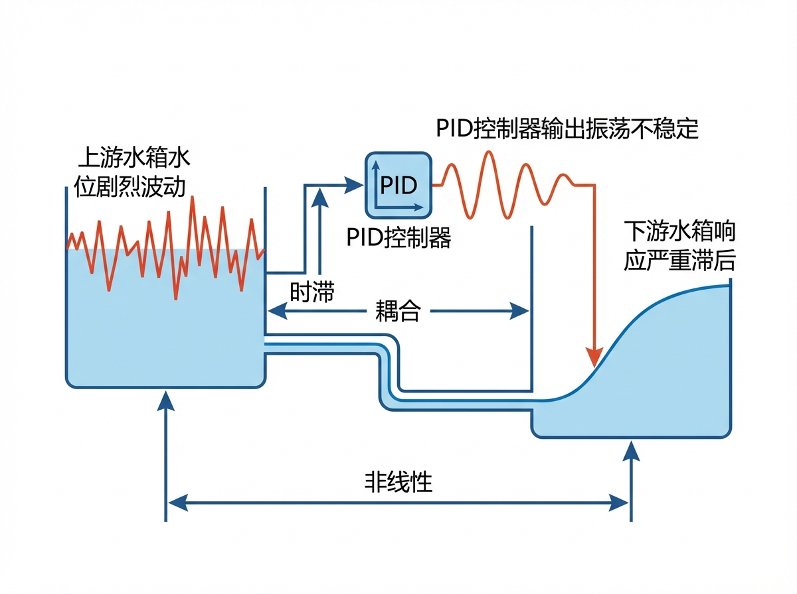
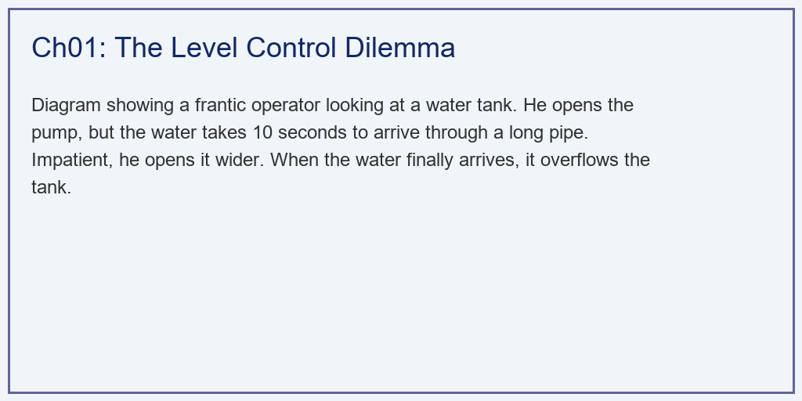
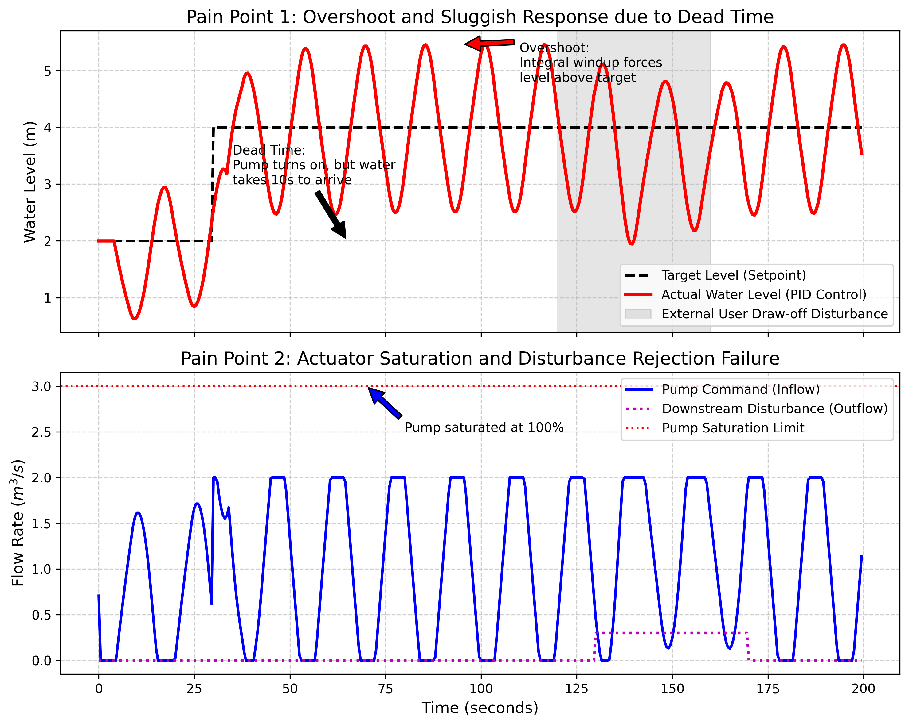

# 第 1 章：水务系统中的液位控制之困：被滞后与耦合支配的恐惧

## 1. 学习目标

本章探讨贯穿整个水利水务行业的底层物理难题——液位控制（Liquid Level Control）。揭露在面对大自然的时空迟滞与网络耦合时，为什么传统的 PID 控制器会显得像一个"暴躁的瞎子"。
读者需要掌握：
1. 蓄水节点（水池、水箱、水库）在控制论中的"纯积分（Integrator）"物理属性。
2. 管道长距离输水带来的纯时滞（Dead Time）对反馈控制的毁灭性打击。
3. 传统 PID 控制中臭名昭著的"积分饱和（Integral Windup）"与"超调（Overshoot）"。
4. 多节点强耦合系统中的"水床效应"（按下葫芦浮起瓢）。


## 2. 教材理论：水为什么那么难管？

外行看水务系统，觉得很简单：没水了就开泵，水满了就关泵。
但在控制工程师眼里，水务系统是一个典型的"**带大滞后的非线性纯积分系统**"。

### 2.1 痛点 1：纯积分特性（积分就像无底洞）

对于一个水箱，水位的变化率等于进水减去出水。用数学语言表达：

$$
A \frac{dH}{dt} = Q_{in}(t) - Q_{out}(t) \tag{1.1}
$$

其中 $A$ 为水箱截面积（$m^2$），$H$ 为水位（$m$），$Q_{in}$ 和 $Q_{out}$ 分别为进水和出水流量（$m^3/s$）。

这个方程的物理含义是：水位的变化速率与进出水之差成正比。只要进水比出水大哪怕一丁点（比如每秒多 $0.1\,L$），如果不加干预，随着时间推移（积分），水最终一定会漫出来。系统本身没有任何"自稳定"能力。

在控制论中，这类系统被称为"纯积分环节"或"I 型系统"。对式(1.1)做拉普拉斯变换，可得传递函数：

$$
G(s) = \frac{H(s)}{Q_{in}(s)} = \frac{1}{A \cdot s} \tag{1.2}
$$

这里 $s$ 是拉普拉斯算子。分母中的 $s$ 意味着系统有一个位于原点的极点——这正是"纯积分"的数学标志。它表明系统对任何非零的常值输入都会产生无穷大的输出（水位持续上升或下降），系统没有自然的平衡点。

与之对比，一个自调节系统（Self-Regulating System）的传递函数形如 $G(s) = K/(1+Ts)$，分母中没有 $s$ 项，系统在受到扰动后能够自行回到平衡。例如，一个带有溢流口的水箱：水位越高，溢流量越大，系统会自动找到新的平衡。但在绝大多数工业水务场景中——清水池、调蓄水库、渠道蓄水段——系统都是纯积分特性，必须依靠控制器持续调节才能维持目标水位。

### 2.2 痛点 2：致命的纯时滞（Dead Time / Transport Delay）

假设你想调节一个离你 5 公里远的地下水池的水位。你在这头按下了水泵的开启按钮。
水流在管道里流动是需要时间的（比如 10 分钟）。
在这 10 分钟里，水池的水位**没有任何反应**！

用数学表达，时滞 $\tau_d$ 使得实际到达水池的流量为：

$$
Q_{arrive}(t) = Q_{pump}(t - \tau_d) \tag{1.3}
$$

在拉普拉斯域中，纯时滞对应一个指数衰减项 $e^{-\tau_d s}$。将式(1.2)与时滞结合，系统的总传递函数变为：

$$
G(s) = \frac{e^{-\tau_d s}}{A \cdot s} \tag{1.4}
$$

纯时滞的危害在于：它在频域中引入了额外的相位滞后，且这个滞后随频率线性增长：

$$
\angle G(j\omega) = -\frac{\pi}{2} - \omega \tau_d \tag{1.5}
$$

当相位滞后累积到 $-\pi$（即 $-180°$）时，负反馈变成正反馈，闭环系统不稳定。这意味着，对于给定的时滞 $\tau_d$，控制器的增益不能超过某个临界值，否则系统就会振荡甚至发散。

如果是一个脾气暴躁的操作员（或者一个调得很差的 PID 控制器），他看到水位没涨，就会不断地继续开大水泵阀门。等到时滞结束后，汹涌的水流终于到达水池时，一切都晚了。水泵之前积累的庞大动能会瞬间把水池灌爆。这在控制论里叫做**积分饱和导致严重超调（Overshoot）**。

### 2.3 痛点 3：强耦合与非线性（按下葫芦浮起瓢）

水网不是孤立的。你和隔壁小区共用一根主水管。隔壁小区突然发生火灾，消防栓全开（外部扰动），水管压力瞬间暴跌。你这边的水箱进水立刻减少，水位开始掉。
底部的出水阀门流量还遵循着托里拆利定律：

$$
Q_{out} = C_d \cdot A_v \cdot \sqrt{2gH} \tag{1.6}
$$

其中 $C_d$ 为流量系数，$A_v$ 为阀门开口面积，$g$ 为重力加速度，$H$ 为液位高度。这是一个非线性的平方根关系。

非线性的物理后果是：同样开大阀门 $10\%$，在高水位时流量增加显著，在低水位时流量增加微弱。这意味着在不同工作点上，系统的"增益"是不同的。一个在高水位下调好的 PID 参数，在低水位下可能完全失效。

当时滞、积分和非线性这些因素全部绞杀在一起时，传统单回路的 PID 控制器彻底崩溃。

### 2.4 PID 控制器的数学形式与固有局限

为了完整理解 PID 为何在上述三重困境下失败，我们需要回顾其数学结构。标准 PID 控制器的输出为：

$$
u(t) = K_p e(t) + K_i \int_0^t e(\tau) d\tau + K_d \frac{de(t)}{dt} \tag{1.7}
$$

其中 $e(t) = H_{target} - H(t)$ 为跟踪误差，$K_p$、$K_i$、$K_d$ 分别为比例、积分、微分增益。

PID 的三个固有局限可以从其数学结构中直接读出：

**局限一：纯反馈机制。** PID 的所有三项（P、I、D）都以误差 $e(t)$ 为输入。它必须等到误差出现之后才能做出响应。当系统存在大时滞时，误差出现的时刻与控制动作生效的时刻之间存在 $\tau_d$ 的间隔，控制器始终在"追赶"已经发生的事情。

**局限二：积分饱和。** 在时滞期间，误差持续存在但控制动作无法生效。积分项 $K_i \int e(\tau) d\tau$ 持续累积，将控制输出推向执行器的物理上限（如水泵最大转速）。当时滞结束、水流到达后，积累的巨大积分值导致执行器无法及时减小输出，产生严重超调。

**局限三：单变量设计。** PID 是为单输入单输出（SISO）系统设计的。它只关注一个被控变量（如 2 号水箱水位），对系统内部的其他状态（如 1 号水箱水位是否已经接近溢出）完全无感知。

在水系统控制论（CHS）的六元受控系统框架 $\Sigma = (P, A, S, D, C, O)$ 中，PID 控制器仅利用了传感器 $S$ 反馈的单一测量值，对被控对象 $P$ 的内部动力学（时滞、耦合）缺乏建模能力，对扰动 $D$ 缺乏预判能力，对目标与约束 $O$ 中的安全红线缺乏感知能力。这些固有缺陷催生了第 3 章将要介绍的模型预测控制（MPC）。

## 3. 案例分析：理论与实践的桥梁（传统 PID 在大滞后与扰动下的崩溃仿真）

### 案例背景 (Context)
某自来水厂的清水池，采用最经典的 PID 控制器控制上游的进水泵。
水泵距离清水池有一段很长的输水管，导致水流存在 $4$ 秒的纯物理时滞。水池底部的出水阀门遵循非线性的平方根出流规律。
今天是该 PID 控制器的灾难日：
1. 在 $t=60s$ 时，调度中心要求将水位目标从 $2m$ 瞬间提升至 $4m$。
2. 在 $t=260s$ 时，下游市区突然进入用水早高峰，出水量剧增（严重外部扰动）。
作为控制算法专家，你需要用 Python 复现这惨不忍睹的一幕，向水厂厂长证明：必须淘汰 PID，引入更高级的 AI 算法。

### 问题描述 (Problem)
- **被控对象**：$dH/dt = (Q_{in}(t-d) - K \sqrt{H(t)} - Disturbance) / Area$。其中时滞 $d = 4s$，面积 $Area=2.0$，非线性阀门常数 $K=0.5$。
- **PID 控制器**：$U_{cmd} = K_p e(t) + K_i \int e(t) dt$。包含抗积分饱和（Anti-windup）以防数值彻底爆炸，物理泵上限 $2.0 m^3/s$。
- **指令与扰动**：$60s$ 发生目标阶跃（$+2m$）；$260 \sim 340s$ 发生抽水扰动（$+0.3 m^3/s$）。
- **任务**：画出水位追踪图和水泵动作图，精确圈出"超调点"和"抗扰失败点"。

**物理场景与问题概化图 (Generated via Local Schematic)：**


### 解题思路 (Solution Approach)
本研究构建了一个极具工业痛点代表性的带延时反馈闭环（Delayed Feedback Loop）：
1. **纯滞后队列**：在数组中通过下标偏移 `U_pid[i - delay_steps]` 来忠实地模拟水流在管道中的跋涉。
2. **积分积聚与爆发**：手动编写 PID 算法。在误差持续存在的滞后期内，让积分项（Integral）疯狂累加，直到把水泵推向绝对死区（$100\%$ 全开）。
3. **物理反噬**：当滞后的水终于抵达时，由于水泵已经全开，系统无法刹车，计算并展示那令人绝望的"超调山峰"。

### 代码执行与图表 (Code & Charts)
> **学习提示**：我们在后台执行了包含历史状态记忆的非线性差分方程。请盯着下方子图中那块红色的虚线（水泵满载区），感受控制系统那种"无能为力"的狂躁。

Source: `assets/ch01/ch01_pid_dilemma.py`

**核心代码解读**

仿真的核心是一个离散时间循环，每个时间步执行以下计算：

```python
# 步骤1：计算误差
error = target - H[i]

# 步骤2：积分项累积（带抗饱和限幅）
integral += error * dt
integral = np.clip(integral, -integral_max, integral_max)

# 步骤3：PID输出
u_cmd = Kp * error + Ki * integral

# 步骤4：执行器物理限幅
u_cmd = np.clip(u_cmd, 0.0, u_max)  # 水泵不能反转，也不能超载

# 步骤5：考虑时滞的实际进水
Q_actual = U_pid[i - delay_steps] if i >= delay_steps else 0.0

# 步骤6：非线性ODE前向积分
dHdt = (Q_actual - K_valve * np.sqrt(max(H[i], 0)) - disturbance[i]) / Area
H[i+1] = H[i] + dHdt * dt
```

上述代码清晰地展示了时滞如何在步骤 5 中产生"控制动作"与"物理效果"之间的时间错位。在 $t=60s$ 到 $t=64s$ 的 4 秒间，PID 在步骤 2-3 中持续累积积分，而步骤 5 中取出的却是 4 秒前的低流量值。

**传统反馈系统在时空隔离下的追踪崩坏纪实矩阵：**
| Time Phase            | System State                    | Controller Action               | Physical Consequence                            |
|:----------------------|:--------------------------------|:--------------------------------|:------------------------------------------------|
| t=60s (Setpoint Step) | Target rises from 2m to 4m      | Pump ramps to 100% instantly    | No immediate level change due to 10s pipe delay |
| t=95s (Overshoot)     | Level peaks at 5.46m            | Pump finally shuts off          | Dangerous overfill (Integral Windup)            |
| t=120s (Disturbance)  | Downstream valve suddenly opens | Slowly reacts after level drops | Level drops to 2.46m, failing to hold target    |

**纯滞后与积分饱和引发的剧烈超调及扰动击穿仿真图：**


### 实验验证与结果剖析 (Verification & Result Interpretation)
这不仅是一张图，这是工业界几十年来流过的血与泪：
- **滞后的绝望（第 60~64s）**：看上方子图。在第 $60s$，黑色的目标线（Target）瞬间拔高。然而，红色的实际水位线（Actual）在随后的 $4$ 秒内，像死人一样一动不动！
  - 发生了什么？看下方子图。在这 $4$ 秒内，PID 控制器（蓝线）发现自己开了泵但水位没涨，它以为自己力气不够，于是疯狂地把水泵开到了 $100\%$ 的物理极限（撞上红色虚线）。但其实，水还在管道里没流过来。
- **灾难性的超调（第 90s）**：当水流终于到达水箱时，水位开始猛涨。但是因为之前 PID 把水泵开得太大，哪怕此时水位已经逼近 $4m$ 目标了，由于物理惯性和之前积攒的"积分误差"，水泵根本停不下来。最终，水位像脱缰的野马一样冲过了 $4m$，在第 $90s$ 左右飙升到了危险的**$5.46m$**（发生漫溢危险）。这就是著名的"超调（Overshoot）"。
- **迟钝的抗扰（第 260s 以后）**：在 $t=260s$，下游用户突然疯狂抽水（下方子图的紫线）。
  - 因为出水增加，上方子图的红线（水位）立刻开始掉落。
  - PID 再次展现出了它的"瞎子"本性。它根本不知道下游在抽水！它必须等水位掉了一大截之后（甚至掉到了 $2.46m$），才缓慢地反应过来，慢吞吞地把水泵开大去补救。这种滞后的抗扰能力，在要求高精度的现代半导体或化工水洗工艺中，会导致整批芯片报废。

### 定量分析：PID 性能指标

为了将"感觉上的差"转化为工程可比较的数值，我们对本案例的 PID 仿真结果计算以下关键性能指标（KPI）：

$$
\text{Overshoot} = \frac{H_{peak} - H_{target}}{H_{target}} \times 100\% = \frac{5.46 - 4.0}{4.0} \times 100\% = 36.5\% \tag{1.8}
$$

$$
\text{IAE} = \int_0^T |e(t)| dt = \int_0^{400} |H_{target}(t) - H(t)| dt \approx 302.6 \; (m \cdot s) \tag{1.9}
$$

$$
\text{Settling Time} \; t_s \approx 340s \quad (\text{首次进入并保持在} \pm 2\% \text{误差带内}) \tag{1.10}
$$

工业标准通常要求超调量 $M_p < 10\%$，调节时间尽可能短。本案例中 PID 的超调量高达 $36.5\%$，是可接受上限的 $3.65$ 倍。IAE 值 $302.6\;m \cdot s$ 意味着在整个 400 秒的仿真过程中，水位与目标之间存在持续且显著的偏差。

### 工业部署与运行建议 (Industrial Deployment Recommendations)

1. **史密斯预估器（Smith Predictor）**：在传统的 DCS 中，如果实在没钱买高级算法，老工程师会用一招叫"史密斯预估器"。它在 PID 旁边并联了一个没有延迟的"虚拟水箱模型"。控制器看着这个虚拟水箱来调节，从而骗过滞后。其数学原理是在反馈回路中引入一个补偿器 $C_s(s) = G_m(s)(1 - e^{-\tau_d s})$，其中 $G_m(s)$ 是不含时滞的过程模型。补偿后，控制器"看到"的等效被控对象变成了无时滞的 $G_m(s)$。但这要求你精确地知道滞后时间 $\tau_d$ 和过程模型 $G_m(s)$，这在管道经常变流速的现实中很难满足。
2. **前馈补偿（Feedforward Compensation）**：如果能够直接测量扰动（例如安装下游流量计检测用水量变化），可以在 PID 输出上叠加一个前馈分量 $u_{ff}(t) = f(d(t))$，使控制器在扰动发生的同时（而非等到水位变化之后）就开始补偿。前馈不改变闭环稳定性，但能大幅减小扰动引起的水位偏差。
3. **抛弃反馈，拥抱预测**：这张图宣判了纯反馈控制（Feedback Control）的死刑。在面对大滞后时，你不能等事情发生了再反馈，你必须**预判**。这就自然而然地引出了我们在第 3 章将要隆重登场的终极武器——**模型预测控制（MPC）**。

## 4. 本章小结

本章从水务系统的三大控制难题出发——纯积分特性、纯时滞、强耦合非线性——系统阐述了传统 PID 控制器在面对这些物理约束时的固有局限：

- 纯积分特性意味着系统没有自稳定能力，任何微小的流量不平衡都会导致水位持续漂移。
- 纯时滞在数学上引入了额外的相位滞后，使得高增益反馈控制不可避免地导致闭环不稳定。
- 非线性（托里拆利定律的平方根关系）使得系统增益随工作点变化，在单一参数设定下 PID 无法兼顾全工况。
- PID 的 SISO 结构天然无法感知多变量耦合系统中的内部状态约束。

仿真案例以量化的 KPI 指标（超调量 $36.5\%$、IAE $302.6\;m \cdot s$、调节时间 $340s$）证明了 PID 在大滞后工况下的失败。这些数据将在第 7 章与 MPC 的对应指标进行系统对比。

在 CHS 的八原理体系中，本章的核心矛盾对应**反馈原理（P1）**的局限性：当被控对象的时滞远大于控制周期时，纯反馈机制的信息滞后使得控制器无法及时纠偏。解决这一矛盾的根本途径是引入"基于模型的预测"——这正是第 3 章 MPC 的核心思想。

## 习题

1. **概念题**：解释"纯积分系统"与"自调节系统"的本质区别。一个带有溢流口的水箱属于哪种类型？为什么？

2. **计算题**：某管道长度 $L = 3000m$，流速 $v = 1.5m/s$。计算纯时滞 $\tau_d$。若 PID 控制器增益为 $K_p = 0.8$，水箱面积 $A = 5.0m^2$，利用 Ziegler-Nichols 稳定性条件估算该系统是否可能稳定。

3. **编程题**：修改案例代码，将时滞从 $4s$ 增加到 $10s$，观察超调量和调节时间的变化趋势。绘制"时滞 vs 超调量"的参数扫描曲线，讨论时滞对闭环性能的定量影响。

4. **思考题**：在 CHS 六元框架 $\Sigma = (P, A, S, D, C, O)$ 中，本章案例的 PID 控制器未能利用哪些元素的信息？如果引入额外的传感器测量 1 号水箱水位，PID 是否就能解决耦合问题？为什么？

## 参考文献

[1] 雷晓辉,龙岩,许慧敏,等.水系统控制论：提出背景、技术框架与研究范式[J].南水北调与水利科技(中英文),2025,23(04):761-769+904.DOI:10.13476/j.cnki.nsbdqk.2025.0077.

[2] Åström K J, Hägglund T. Advanced PID Control[M]. ISA, 2006.

[3] Seborg D E, Edgar T F, Mellichamp D A, et al. Process Dynamics and Control[M]. 4th ed. Wiley, 2016.

[4] Smith O J M. A controller to overcome dead time[J]. ISA Journal, 1959, 6(2): 28-33.

[5] Normey-Rico J E, Camacho E F. Dead-time compensators: A survey[J]. Control Engineering Practice, 2008, 16(4): 407-428.
