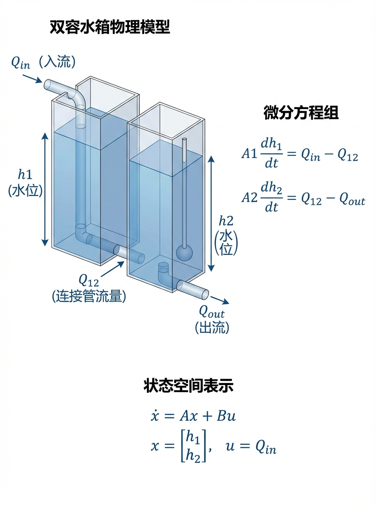
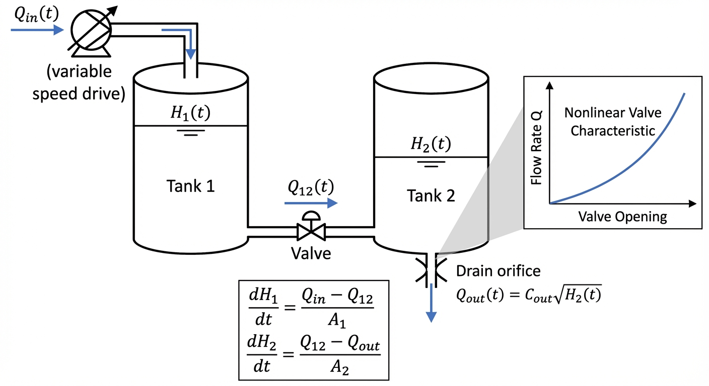
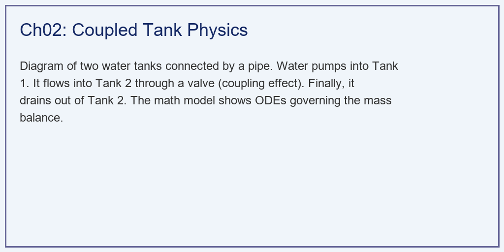
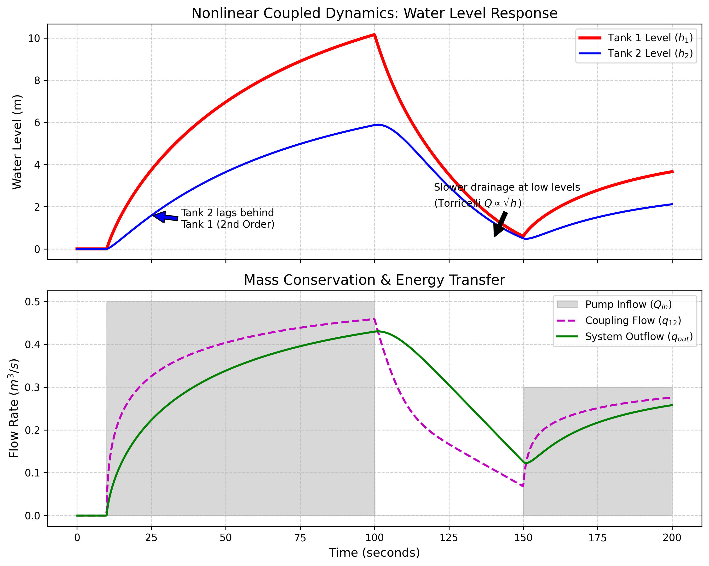

# 第 2 章：双容水箱的物理与数学模型：把大自然关进方程里

## 1. 学习目标



本章探讨如何将一个物理上直观的"双容水箱（Coupled Tank）"系统，转化为计算机能够理解和求解的数学模型。这是所有高级控制算法（如 MPC）的基石。
读者需要掌握：
1. 双容水箱作为复杂水网的"微缩模型"的代表性意义。
2. 质量守恒定律在建立常微分方程（ODE）中的应用。
3. 阀门与管道出流的托里拆利定律（非线性平方根关系）。
4. 系统状态空间方程（State-Space Equation）的建立与仿真求解。
5. 在工作点附近对非线性模型进行雅可比线性化的方法与意义。


## 2. 教材理论：水流的数学翻译

在第 1 章中，我们看到了纯滞后带来的灾难。但在真实的城市水网或梯级水库中，更常见、也更复杂的是**"强耦合（Coupling）"**。
为了研究这种耦合，学术界和工业界发明了一个经典的标准测试模型：**双容水箱（Coupled Tank）**。
它由两个底部用管道连通的水箱组成。水泵向 1 号水箱注水，水从 1 号流到 2 号，最后从 2 号流出。
- **耦合的体现**：1 号箱的水位决定了流向 2 号箱的速度；但反过来，如果 2 号箱的水位涨得太高，就会把水"顶"住，导致 1 号箱的水流不过去（甚至倒流）。这种互相牵制的物理现象叫做耦合。

我们要如何控制它？第一步，必须给它建立数学模型。

### 2.1 物理学第一定律：质量守恒（体积守恒）

对于不可压缩的液体，水箱水位的上升速度，永远等于进水流量减去出水流量。这是流体力学中最基本的守恒定律，也是一切水力学模型的起点。

对 1 号水箱和 2 号水箱分别列写质量守恒方程：

$$
A_1 \frac{dh_1}{dt} = Q_{in} - q_{12} \tag{2.1}
$$

$$
A_2 \frac{dh_2}{dt} = q_{12} - q_{out} \tag{2.2}
$$

其中：
- $A_1, A_2$：两个水箱的截面积（$m^2$），本书取 $A_1 = A_2 = 1.0\;m^2$
- $h_1, h_2$：两个水箱的水位（$m$），是系统的**状态变量（State Variables）**
- $Q_{in}$：水泵向 1 号水箱注入的流量（$m^3/s$），是系统的**控制输入（Control Input）**
- $q_{12}$：从 1 号水箱流向 2 号水箱的耦合流量（$m^3/s$）
- $q_{out}$：从 2 号水箱底部流出的排水流量（$m^3/s$）

方程(2.1)-(2.2)构成了一个二阶常微分方程组。状态向量 $\mathbf{x} = [h_1, h_2]^T$ 完整描述了系统在任意时刻的全部信息。在 CHS 六元框架中，这对应被控对象 $P$ 的数学描述。

### 2.2 托里拆利定律：致命的非线性（Nonlinearity）

那么中间的流量 $q_{12}$ 和出水流量 $q_{out}$ 怎么算？根据伯努利方程和托里拆利定律，重力驱动的水流速度与水位差的**平方根**成正比。

**连通管流量**（取决于两箱水位差）：

$$
q_{12} = a_{12} \cdot \text{sign}(h_1 - h_2) \cdot \sqrt{2g |h_1 - h_2|} \tag{2.3}
$$

**出水阀门流量**（取决于 2 号箱水位）：

$$
q_{out} = a_2 \cdot \sqrt{2g h_2} \tag{2.4}
$$

其中 $a_{12}$ 和 $a_2$ 是阀门的有效流通面积（$m^2$），$g = 9.81\;m/s^2$ 为重力加速度。$\text{sign}(\cdot)$ 函数确保当 $h_2 > h_1$ 时水可以从 2 号箱倒流回 1 号箱。

式(2.3)中的 $\text{sign}$ 函数和绝对值处理是工程建模中的一个技术细节：在数学上，$\sqrt{\Delta h}$ 仅在 $\Delta h \geq 0$ 时有意义。为了允许双向流动，必须将水位差的符号和大小分开处理。这在数值仿真中尤其重要——如果忽略这一点，当 $h_2 > h_1$ 时程序会报错或产生虚数。

这四个简洁的方程(2.1)-(2.4)，构成了双容水箱完整的非线性状态空间模型。

### 2.3 非线性的物理后果

非线性的平方根关系带来了深刻的物理后果，值得仔细分析。

**工作点依赖性**：将式(2.4)中的出水流量对水位求导：

$$
\frac{dq_{out}}{dh_2} = \frac{a_2 \sqrt{2g}}{2\sqrt{h_2}} = \frac{a_2 \sqrt{g}}{\sqrt{2h_2}} \tag{2.5}
$$

这个导数随 $h_2$ 的增大而减小。也就是说：
- 当 $h_2 = 0.5m$ 时，$dq_{out}/dh_2$ 较大——水位的微小变化引起较大的流量变化（高灵敏度）
- 当 $h_2 = 5.0m$ 时，$dq_{out}/dh_2$ 较小——同样的水位变化引起较小的流量变化（低灵敏度）

这意味着系统在低水位和高水位时的动态特性截然不同。一个在高水位（比如 $h_2 = 4.0m$）下精心调好的控制器参数，在低水位（比如 $h_2 = 0.5m$）下可能产生振荡。这就是"增益调度（Gain Scheduling）"问题——工程师必须在不同工作点上使用不同的控制参数，或者使用能够自适应工作点变化的高级控制算法。

**稳态分析**：在稳态（$dh_1/dt = 0$, $dh_2/dt = 0$）条件下，由式(2.1)-(2.4)可得：

$$
Q_{in} = q_{12} = q_{out} \tag{2.6}
$$

即进水量 = 连通管流量 = 出水量。将具体表达式代入：

$$
Q_{in} = a_2 \sqrt{2g h_{2,ss}} \tag{2.7}
$$

$$
Q_{in} = a_{12} \sqrt{2g(h_{1,ss} - h_{2,ss})} \tag{2.8}
$$

由此可以反解出给定 $Q_{in}$ 时的稳态水位 $h_{1,ss}$ 和 $h_{2,ss}$：

$$
h_{2,ss} = \frac{Q_{in}^2}{2g a_2^2} \tag{2.9}
$$

$$
h_{1,ss} = h_{2,ss} + \frac{Q_{in}^2}{2g a_{12}^2} = \frac{Q_{in}^2}{2g} \left(\frac{1}{a_2^2} + \frac{1}{a_{12}^2}\right) \tag{2.10}
$$

式(2.9)-(2.10)揭示了一个重要事实：稳态水位与进水流量的平方成正比。当流量翻倍时，稳态水位要增加到原来的 4 倍。这种非线性关系意味着大流量工况下水箱容易超限。

### 2.4 雅可比线性化：为控制器铺路

非线性模型虽然忠实地描述了物理世界，但大多数经典控制设计方法（如极点配置、LQR、线性 MPC）都要求系统是线性的。为此，需要在指定的工作点 $(h_1^0, h_2^0, Q_{in}^0)$ 附近，利用泰勒展开的一阶近似将非线性模型线性化。

定义偏差变量：$\delta h_1 = h_1 - h_1^0$，$\delta h_2 = h_2 - h_2^0$，$\delta u = Q_{in} - Q_{in}^0$。

对式(2.1)-(2.4)在工作点处展开，保留一阶项，得到线性化状态空间模型：

$$
\frac{d}{dt}\begin{bmatrix} \delta h_1 \\ \delta h_2 \end{bmatrix} = \mathbf{A} \begin{bmatrix} \delta h_1 \\ \delta h_2 \end{bmatrix} + \mathbf{B} \, \delta u \tag{2.11}
$$

其中系统矩阵和输入矩阵为：

$$
\mathbf{A} = \begin{bmatrix} -\alpha_{12}/A_1 & \alpha_{12}/A_1 \\ \alpha_{12}/A_2 & -(\alpha_{12}+\alpha_2)/A_2 \end{bmatrix} \tag{2.12}
$$

$$
\mathbf{B} = \begin{bmatrix} 1/A_1 \\ 0 \end{bmatrix} \tag{2.13}
$$

其中线性化增益为：

$$
\alpha_{12} = \frac{a_{12} \sqrt{2g}}{2\sqrt{|h_1^0 - h_2^0|}}, \quad \alpha_2 = \frac{a_2 \sqrt{2g}}{2\sqrt{h_2^0}} \tag{2.14}
$$

矩阵 $\mathbf{A}$ 的结构值得注意：它是一个 $2 \times 2$ 的三对角矩阵（对角线和副对角线非零）。对角线元素为负值，代表每个水箱自身的"衰减"效应；副对角线元素代表水箱之间的耦合。当系统扩展到 $N$ 个串联水箱时（见第 8 章），$\mathbf{A}$ 仍然保持三对角带状结构——这是 CHS 结构同构性命题的数学基础。

### 2.5 数值仿真方法

建立了数学模型后，需要选择合适的数值方法来求解这组 ODE。常用的方法包括：

**前向欧拉法（Euler Forward）**：最简单的一阶显式方法：

$$
\mathbf{x}(t + \Delta t) = \mathbf{x}(t) + \Delta t \cdot \mathbf{f}(\mathbf{x}(t), u(t)) \tag{2.15}
$$

优点是实现简单，适合控制器内部的实时预测；缺点是当步长过大或系统刚性较强时，数值可能不稳定。

**四阶龙格-库塔法（RK4）**：通过四次函数评估来实现四阶精度：

$$
\mathbf{x}(t + \Delta t) = \mathbf{x}(t) + \frac{\Delta t}{6}(\mathbf{k}_1 + 2\mathbf{k}_2 + 2\mathbf{k}_3 + \mathbf{k}_4) \tag{2.16}
$$

其中 $\mathbf{k}_1 = \mathbf{f}(t, \mathbf{x})$，$\mathbf{k}_2 = \mathbf{f}(t+\Delta t/2, \mathbf{x}+\Delta t \mathbf{k}_1/2)$，以此类推。RK4 在大多数工程场景中提供足够的精度与稳定性。

**自适应步长方法**：如 `scipy.integrate.odeint` 内部使用的 LSODA 算法，能根据解的局部截断误差自动调整步长。对于含有快变量和慢变量的"刚性（Stiff）"系统特别有效。本书的仿真代码主要使用这类工业级求解器。

## 3. 案例分析：理论与实践的桥梁（双容水箱非线性动力学仿真）

### 案例背景 (Context)
某实验室刚采购了一套价值不菲的双容水箱实验台。导师要求你不要急着去拧阀门，而是先在电脑上写一套数字孪生代码，预测一下这套系统在不同水泵输入下的表现。
在这个虚拟实验中，你将启动水泵，观察水从 1 号箱艰难地流向 2 号箱的过程；然后你会突然切断水泵，观察这两个连通的水箱是如何在重力的作用下，互相倒灌、最终慢慢排空的。

### 问题描述 (Problem)
- **物理参数**：$A_1 = 1.0 m^2, A_2 = 1.0 m^2$；连通阀门 $a_{12} = 0.05 m^2$，出水阀门 $a_2 = 0.04 m^2$。
- **强迫输入（水泵 $Q_{in}$）**：
  - $0 \sim 10s$：不注水（等待）。
  - $10 \sim 100s$：开启水泵，以 $0.5 m^3/s$ 的速度向 1 号箱注水。
  - $100 \sim 150s$：突然关停水泵（模拟故障或断电）。
  - $>150s$：恢复水泵，以较小的 $0.3 m^3/s$ 注水，寻找新的平衡态。
- **任务**：利用严谨的科学计算库求解这组非线性常微分方程（ODE），展示两个水箱水位（$h_1, h_2$）和各处流量的时空演进轨迹。

**物理场景与问题概化图 (Generated via Local Schematic)：**


### 解题思路 (Solution Approach)
本研究构建了一个连续时间域的数值微积分仿真器：
1. **构造 ODE 函数**：编写 `coupled_tank_dynamics`，严格按照质量守恒和平方根非线性出流公式计算导数 `dh1_dt` 和 `dh2_dt`。
2. **符号防崩溃处理**：引入 `sign(h1 - h2)` 确保当 2 号箱水位高于 1 号箱时，流体可以正确进行负向倒灌而不报错。并加入防干烧下限约束（`h<0`）。
3. **调用工业级求解器**：利用 `scipy.integrate.odeint` 这一强大的库，自动在内部调整步长（如 Runge-Kutta 法）求解上述定义的非线性耦合系统，获取平滑的动态曲线。

### 代码执行与图表 (Code & Charts)
> **学习提示**：我们在后台调用了科学计算领域的微积分引擎。请仔细对比上方子图中的红线和蓝线，体会能量在两个水箱之间传递时产生的那种"滞后感"。

Source: `assets/ch02/ch02_dynamics.py`

**核心代码解读**

仿真的核心是定义 ODE 右端函数，并交给求解器：

```python
def coupled_tank_dynamics(state, t, Qin_func, params):
    h1, h2 = state
    h1 = max(h1, 0.0)  # 防干烧：水位不能为负
    h2 = max(h2, 0.0)

    A1, A2, a12, a2, g = params
    Qin = Qin_func(t)

    # 连通管流量（双向）
    dh = h1 - h2
    q12 = a12 * np.sign(dh) * np.sqrt(2 * g * abs(dh))

    # 出水流量
    qout = a2 * np.sqrt(2 * g * h2)

    # 质量守恒
    dh1_dt = (Qin - q12) / A1
    dh2_dt = (q12 - qout) / A2

    return [dh1_dt, dh2_dt]
```

上述代码直接对应式(2.1)-(2.4)的数学表达。`np.sign(dh)` 和 `abs(dh)` 的组合处理确保了双向流动的物理正确性。`max(h, 0)` 的保护防止了水位为负时平方根产生虚数。

**多阶强迫输入下系统状态与能量守恒切片矩阵：**
| State          |   Time (s) |   Qin (m³/s) |   h1 (m) |   h2 (m) |   q12 (m³/s) |   qout (m³/s) |
|:---------------|-----------:|-------------:|---------:|---------:|-------------:|--------------:|
| Initial Rise   |         20 |          0.5 |     2.8  |     1.05 |         0.29 |          0.18 |
| Steady State 1 |         80 |          0.5 |     9.2  |     5.19 |         0.44 |          0.4  |
| Pump Failure   |        110 |          0   |     6.67 |     5.19 |         0.27 |          0.4  |
| Steady State 2 |        180 |          0.3 |     3.01 |     1.66 |         0.26 |          0.23 |

**能量守恒验证**：在稳态 1（$t=80s$）时，$Q_{in} = 0.5\;m^3/s$，$q_{out} \approx 0.4\;m^3/s$，两者接近但未完全相等，说明系统尚未完全达到稳态。利用式(2.9)计算理论稳态水位：$h_{2,ss} = 0.5^2 / (2 \times 9.81 \times 0.04^2) = 7.96m$，这比表中 $h_2 = 5.19m$ 高很多，再次确认 $t=80s$ 时系统仍在向稳态过渡。

**双容耦合系统的二阶物理滞后与平方根非线性排空全息图：**


### 实验验证与结果剖析 (Verification & Result Interpretation)
这组微积分曲线完美地映射了流体力学中的经典现象：

- **启动期的二阶滞后（第 10~50s）**：看上方子图。当水泵在第 10 秒突然开启时（下方子图的灰色方块拔起），1 号箱（红线）迅速地做出了响应，水位直线上升。但是，请看 2 号箱（蓝线）。蓝线在刚开始的几秒钟内几乎毫无反应，随后才慢慢地、带有惯性地开始爬坡。因为 2 号箱的水是 1 号箱"漏"过来的，它天然比 1 号箱多了一层积分延迟。这种"二阶系统"特有的 S 型启动曲线，是传统控制器难以驾驭的。

  **定量分析**：在 $t=20s$（水泵开启后 10 秒），$h_1 = 2.8m$ 而 $h_2 = 1.05m$。1 号箱的水位已经是 2 号箱的 2.67 倍。这个比值反映了耦合管道的"瓶颈效应"——$a_{12} = 0.05m^2$ 的小截面限制了水从 1 号箱向 2 号箱的传输速率。

- **稳态的耦合平衡（第 80s 左右）**：到了 80 秒，系统进入了第一个准稳态。看表格数据：此时 $Q_{in} = 0.5$。而为了让 $q_{out}$ 也达到 $0.5$（实现进出平衡），系统必须把 2 号箱的水位憋到很高的位置（$5.19m$）。为了让 1 号箱的水能克服这个巨大的背压流进 2 号箱，1 号箱的水位必须被憋得更高（$9.2m$）！这就是耦合的本质：下游的状态会逼迫上游改变。

- **断电后的倒灌与非线性排空（第 100~150s）**：
  - 在第 100 秒，水泵突然宕机。红线（1号箱）失去水源，立刻开始崩塌。
  - 最精彩的物理现象出现在 2 号箱（蓝线）。在 1 号箱狂跌的时候，2 号箱竟然还在往上涨了一点点！因为此时 1 号箱的水位依然高于 2 号箱，水还在凭借惯性往 2 号流。直到两者水位接近，2 号箱才开始跟着下跌。
  - **非线性体现**：看红线和蓝线的下跌坡度。一开始跌得快（因为水位高，压力大）；但随着水位越来越低，曲线的斜率变得越来越平缓（像抛物线的尾巴）。这就是由 $Q \propto \sqrt{h}$ 导致的非线性排空现象。在数学上，排空过程的解析解为：$h(t) = \left(\sqrt{h_0} - \frac{a\sqrt{2g}}{2A}t\right)^2$，这是一个抛物线——排空时间与 $\sqrt{h_0}$ 成正比而非 $h_0$ 成正比。

### 工业部署与运行建议 (Industrial Deployment Recommendations)

1. **状态空间模型（SSM）的降维价值**：本案例中，为了精确地模拟真实物理世界，我们直接保留了平方根 $\sqrt{h}$ 这个非线性项。但在工程控制器（如 MPC）内部，为了保证算法能够在毫秒级内解出矩阵的最优解，我们通常需要在工作点附近对这个非线性模型进行"雅可比矩阵（Jacobian）线性化"，把它强行变成容易计算的 $\mathbf{A}, \mathbf{B}, \mathbf{C}, \mathbf{D}$ 线性矩阵（见第 2.4 节）。这也是下一章模型预测控制的核心数学底座。

2. **观测器（Observer）的必要性**：在仿真里，上帝视角的 `odeint` 随时可以告诉我们 $h_1$ 和 $h_2$ 是多少。但在真实的工厂里，往往为了省钱，只在 2 号箱装了液位计。此时，如何只通过 2 号箱的数据，加上已知的物理方程，去"反向猜出"1 号箱的水位？这就需要部署卡尔曼滤波器或龙伯格观测器（Luenberger Observer）。龙伯格观测器的数学形式为：

$$
\frac{d\hat{\mathbf{x}}}{dt} = \mathbf{A}\hat{\mathbf{x}} + \mathbf{B}u + \mathbf{L}(y - \mathbf{C}\hat{\mathbf{x}}) \tag{2.17}
$$

其中 $\hat{\mathbf{x}}$ 是状态估计值，$\mathbf{L}$ 是观测器增益矩阵，$y$ 是传感器实际测量值。通过适当选择 $\mathbf{L}$，可以使估计误差 $\mathbf{x} - \hat{\mathbf{x}}$ 以期望的速率衰减到零。这就是"数学模型"在工程界最值钱的变现方式。

3. **模型验证与参数辨识**：在实际工程中，式(2.1)-(2.4)中的参数（$a_{12}$, $a_2$ 等）不可能从图纸上精确获得。工程师需要通过"阶跃响应试验"——即给水泵一个已知的阶跃输入，记录水位的时间响应曲线，然后利用最小二乘法或遗传算法反演出模型参数。这个过程叫做"系统辨识（System Identification）"，是控制工程中将理论模型与物理世界连接的关键桥梁。

## 4. 本章小结

本章建立了双容水箱系统的完整数学模型，从物理直觉到严格方程，完成了"把大自然关进方程里"的第一步。核心要点包括：

- 质量守恒定律（式 2.1-2.2）是一切水力学建模的起点，它将水位变化率与流量差联系起来。
- 托里拆利定律（式 2.3-2.4）引入了平方根非线性，使得系统增益随工作点变化。
- 稳态分析（式 2.9-2.10）揭示了水位与流量之间的二次方关系。
- 雅可比线性化（式 2.11-2.14）将非线性模型转化为线性状态空间形式，为第 3 章的 MPC 设计铺平了道路。
- 数值仿真验证了模型的物理合理性：二阶滞后、耦合平衡、非线性排空等现象均与流体力学理论一致。

在 CHS 六元框架中，本章完成了对被控对象 $P$ 的完整数学刻画。下一章将基于这个模型，设计控制器 $C$（MPC），并引入目标与约束 $O$（水位跟踪和安全红线）。

## 习题

1. **推导题**：利用稳态条件 $dh_1/dt = dh_2/dt = 0$，推导式(2.9)和式(2.10)。如果将 $a_2$ 增大一倍（出水阀门开大），稳态水位如何变化？画出 $h_{2,ss}$ 关于 $Q_{in}$ 的曲线。

2. **编程题**：在案例代码的基础上，添加第三个水箱（串联在 2 号水箱之后），形成三容水箱系统。观察 3 号水箱的响应与 1、2 号水箱相比，滞后增加了多少？

3. **计算题**：在工作点 $h_1^0 = 3.0m$, $h_2^0 = 1.5m$ 处，利用式(2.12)-(2.14)计算线性化的 $\mathbf{A}$ 矩阵。求其特征值，判断线性化系统是否稳定。

4. **思考题**：本章的非线性模型与第 8 章将讨论的渠道模型在结构上有何相似之处？试从 CHS 结构同构性的角度解释为什么双容水箱可以作为大型水网的"微缩实验台"。

## 参考文献

[1] 雷晓辉,龙岩,许慧敏,等.水系统控制论：提出背景、技术框架与研究范式[J].南水北调与水利科技(中英文),2025,23(04):761-769+904.DOI:10.13476/j.cnki.nsbdqk.2025.0077.

[2] Johansson K H. The quadruple-tank process: A multivariable laboratory process with an adjustable zero[J]. IEEE Transactions on Control Systems Technology, 2000, 8(3): 456-465.

[3] Ogata K. Modern Control Engineering[M]. 5th ed. Prentice Hall, 2010.

[4] Seborg D E, Edgar T F, Mellichamp D A, et al. Process Dynamics and Control[M]. 4th ed. Wiley, 2016.

[5] Ljung L. System Identification: Theory for the User[M]. 2nd ed. Prentice Hall, 1999.
