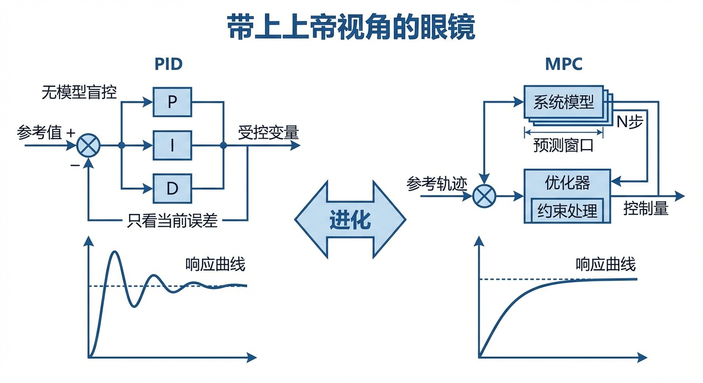
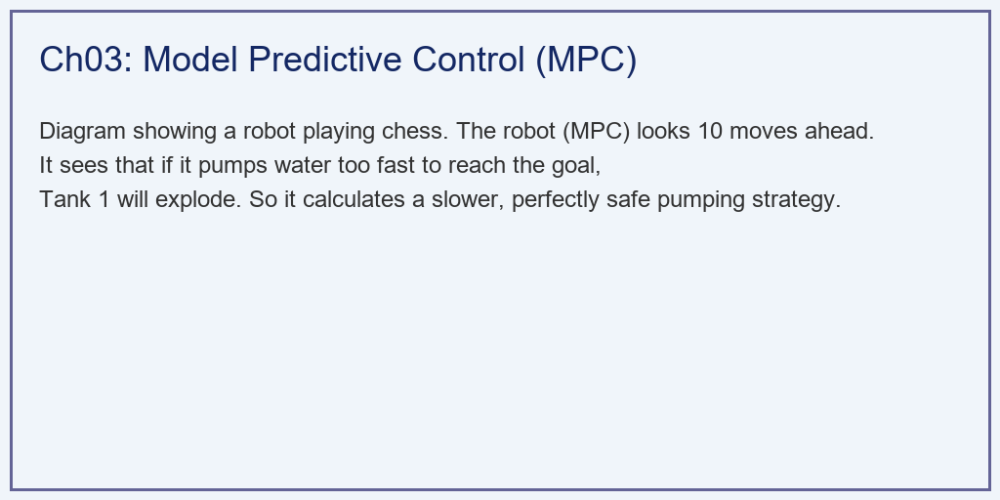
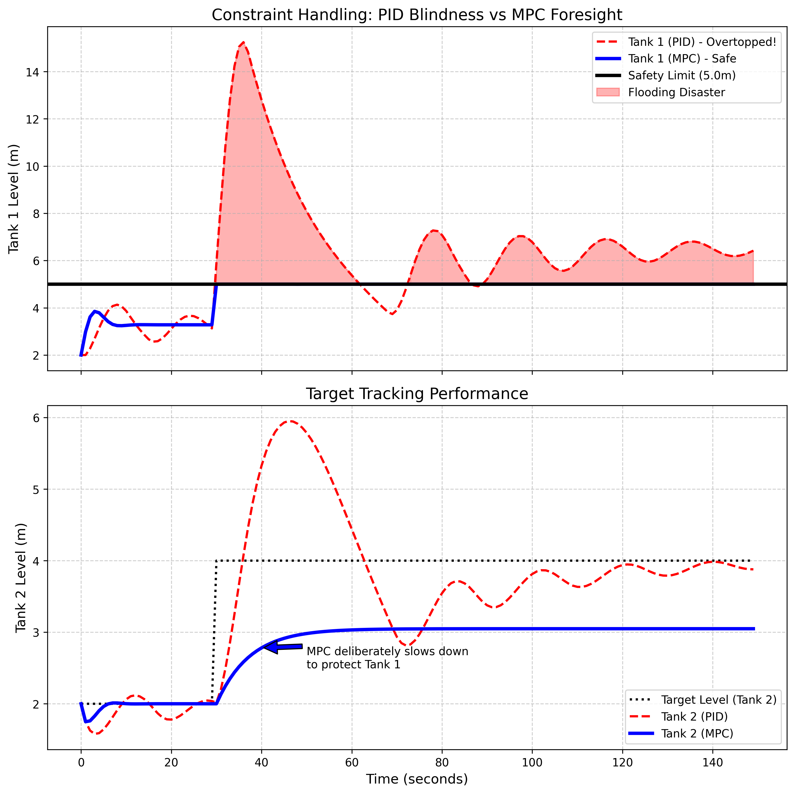

# 第 3 章：从 PID 到模型预测控制 (MPC)：带上上帝视角的眼镜

## 1. 学习目标

本章探讨面对复杂、多变量、带硬约束的系统时，控制算法如何从"无模型瞎摸（PID）"进化为"基于物理模型推演未来（MPC）"。
读者需要掌握：
1. 传统 PID 在处理多变量耦合与物理红线（Constraints）时的先天性盲区。
2. 模型预测控制（Model Predictive Control, MPC）的三大核心：预测模型、滚动优化、反馈校正。
3. 如何将控制问题转化为带约束的二次规划（Quadratic Programming）数学求解。
4. "牺牲短期速度，换取全局生存"的战略思维。


## 2. 教材理论：闭着眼睛开车 vs 看着地图开车

在第 2 章中，我们建立了一个双容水箱的物理模型。现在，我们要控制它：通过调节 1 号箱上面的水泵 $U$，让 2 号箱的水位 $h_2$ 稳定在目标值 $4.0m$。
并且，现场有一个致命的**物理红线（Hard Constraint）**：1 号箱的高度只有 $5.0m$。一旦 1 号箱的水位 $h_1 > 5.0m$，水就会漫出来，淹没整个工厂。

### 2.1 PID 控制器：闭着眼睛踩油门

如果你用传统的 PID 控制器去控制水泵。PID 的逻辑是极度简单的：它只看误差（$error = Target - h_2$）。
当它发现 2 号箱水位太低时，它会直接把水泵开到最大（$100\%$）。
它完全不知道 1 号箱的存在，更不知道 1 号箱只有 $5.0m$ 高！水流哗哗地灌进 1 号箱，因为 1 号箱到 2 号箱的阀门比较小，水流不过去，1 号箱的水位瞬间飙升并溢出。
这就是 PID 的死穴：**它无法处理 MIMO（多输入多输出）系统的内部耦合状态，且对物理约束完全免疫（瞎子）。**

### 2.2 模型预测控制（MPC）：看着地图下象棋

MPC 是一种高阶的控制哲学。它不是简单地套公式，而是每一秒钟都在进行一次"平行宇宙推演"。

**核心机制一：预测未来（Prediction Horizon）**

在这一秒，MPC 算法把我们在第 2 章写的双容水箱物理模型（ODE）装进了自己的脑子里。它不仅看到了 2 号箱的当前状态，也看到了 1 号箱的状态。它会在脑子里推演："如果我现在把水泵开到 $100\%$，未来 $N_p$ 步内，1 号箱的水位会涨到哪里？"

数学表达：给定当前状态 $\mathbf{x}(k) = [h_1(k), h_2(k)]^T$ 和控制输入序列 $\{u(k), u(k+1), \ldots, u(k+N_u-1)\}$，利用第 2 章的状态方程迭代推演：

$$
\mathbf{x}(k+j+1) = \mathbf{f}(\mathbf{x}(k+j), u(k+\min(j, N_u-1))), \quad j = 0, 1, \ldots, N_p-1 \tag{3.1}
$$

其中 $N_p$ 为预测域（Prediction Horizon），$N_u$ 为控制域（Control Horizon, $N_u \le N_p$），$\mathbf{f}$ 为第 2 章建立的非线性状态方程。

**核心机制二：带约束的优化（Constrained Optimization）**

MPC 把"1 号箱水位绝对不能超过 $5.0m$"写进了它的数学优化器的硬约束条件里。然后它在脑子里算了一笔账："为了让 2 号箱尽快到 $4m$，我应该开大水泵。但如果我开得太大，未来第 3 秒的时候 1 号箱就会爆。所以我必须克制！"

这个优化问题的标准数学表达为：

$$
\min_{\{u(k), \ldots, u(k+N_u-1)\}} J = \sum_{j=1}^{N_p} \|h_2(k+j) - r(k+j)\|_Q^2 + \sum_{j=0}^{N_u-1} \|\Delta u(k+j)\|_R^2 \tag{3.2}
$$

$$
\text{s.t.} \quad h_1(k+j) \le H_{max}, \quad j = 1, \ldots, N_p \tag{3.3}
$$

$$
u_{min} \le u(k+j) \le u_{max}, \quad j = 0, \ldots, N_u-1 \tag{3.4}
$$

$$
\mathbf{x}(k+j+1) = \mathbf{f}(\mathbf{x}(k+j), u(k+j)) \tag{3.5}
$$

其中：
- $r(k+j)$ 为目标水位参考轨迹
- $Q > 0$ 为跟踪误差权重（越大则跟踪越积极）
- $R > 0$ 为控制增量权重（越大则控制动作越平缓）
- $\Delta u(k+j) = u(k+j) - u(k+j-1)$ 为控制增量
- $H_{max} = 5.0m$ 为 1 号箱安全上限
- $u_{min}, u_{max}$ 为执行器物理限幅

式(3.2)中的目标函数体现了 MPC 的核心哲学：$Q$ 项追求"快速到达目标"，$R$ 项追求"动作平缓节能"。两者的权重比 $Q/R$ 决定了控制器的"激进程度"。当 $Q/R \to \infty$ 时，MPC 退化为"不惜一切代价最快到达"的时间最优控制；当 $Q/R \to 0$ 时，MPC 变得极度保守，几乎不动。工程师通过调节 $Q$ 和 $R$ 来平衡性能与安全。

**核心机制三：滚动执行（Rolling Horizon）**

MPC 算出了一个最完美的未来 $N_p$ 步控制方案（比如：前 2 秒开 $80\%$，第 3 秒关到 $20\%$ 防止 1 号箱溢出，第 4 秒再开大）。但是，MPC 谨慎，它只执行这个计划的第一步 $u^*(k)$。到了下一步，它重新看一眼传感器（获取最新状态），重新再算一遍未来 $N_p$ 步。

这种"滚动优化"的策略有两大优势：
1. **鲁棒性**：即使模型不精确，每一步都用最新的实测数据重新初始化预测，减小了模型误差的累积效应。
2. **在线适应**：如果外部环境发生变化（如扰动出现），MPC 在下一个控制周期就能将新信息纳入优化。

MPC 的本质，就是**把大自然关进矩阵里，用超级计算机的算力去暴力遍历未来，以找到那条唯一安全的钢丝绳。**

### 2.3 线性 MPC 的矩阵化表达

如果使用第 2 章的线性化模型（式 2.11），MPC 问题可以转化为标准的二次规划（QP）问题，具有高效的求解算法。

利用线性模型 $\mathbf{x}(k+1) = \mathbf{A}_d \mathbf{x}(k) + \mathbf{B}_d u(k)$（离散化后的状态空间），可以将 $N_p$ 步预测展开：

$$
\underbrace{\begin{bmatrix} \mathbf{x}(k+1) \\ \mathbf{x}(k+2) \\ \vdots \\ \mathbf{x}(k+N_p) \end{bmatrix}}_{\mathbf{X}} = \underbrace{\begin{bmatrix} \mathbf{A}_d \\ \mathbf{A}_d^2 \\ \vdots \\ \mathbf{A}_d^{N_p} \end{bmatrix}}_{\mathbf{\Phi}} \mathbf{x}(k) + \underbrace{\begin{bmatrix} \mathbf{B}_d & 0 & \cdots \\ \mathbf{A}_d\mathbf{B}_d & \mathbf{B}_d & \cdots \\ \vdots & & \ddots \\ \mathbf{A}_d^{N_p-1}\mathbf{B}_d & \cdots & \mathbf{B}_d \end{bmatrix}}_{\mathbf{\Gamma}} \underbrace{\begin{bmatrix} u(k) \\ u(k+1) \\ \vdots \\ u(k+N_u-1) \end{bmatrix}}_{\mathbf{U}} \tag{3.6}
$$

即 $\mathbf{X} = \mathbf{\Phi} \mathbf{x}(k) + \mathbf{\Gamma} \mathbf{U}$。将此代入目标函数(3.2)并整理，得到标准 QP 形式：

$$
\min_{\mathbf{U}} \frac{1}{2} \mathbf{U}^T \mathbf{H} \mathbf{U} + \mathbf{g}^T \mathbf{U} \tag{3.7}
$$

$$
\text{s.t.} \quad \mathbf{M} \mathbf{U} \le \mathbf{b} \tag{3.8}
$$

其中 $\mathbf{H} = \mathbf{\Gamma}^T \mathbf{Q}_w \mathbf{\Gamma} + \mathbf{R}_w$ 为正定 Hessian 矩阵，$\mathbf{g}$ 为线性项，$\mathbf{M}$ 和 $\mathbf{b}$ 编码了所有约束。QP 问题有成熟的多项式时间求解算法（如内点法、活跃集法），对于 $N_u \leq 20$ 的典型水务问题，可以在毫秒级内求解。

### 2.4 非线性 MPC 的求解

当保留第 2 章的原始非线性模型时，式(3.2)-(3.5)构成一个非线性规划（NLP）问题，不能直接用 QP 算法求解。常用的方法包括：

- **序列二次规划（SQP）**：将 NLP 在当前解附近线性化为 QP 子问题，迭代求解。Python 中的 `scipy.optimize.minimize(method='SLSQP')` 即采用此方法。
- **直接多重射击法（Direct Multiple Shooting）**：将预测域分段，每段用数值积分推进，段与段之间通过连续性约束连接。CasADi 工具箱支持这种高效的 NLP 求解策略。
- **实时迭代（Real-Time Iteration, RTI）**：每个控制周期只执行一次 SQP 迭代（而非迭代至收敛），利用滚动优化的"热启动"特性，在实时约束下获得近似最优解。

在本书的双容水箱案例中，由于状态维度低（$n=2$）、控制域短（$N_u=3$），直接使用 SLSQP 即可在每个控制步内快速求解。

## 3. 案例分析：理论与实践的桥梁（双容水箱在硬约束下的生死对决仿真）

### 案例背景 (Context)
某昂贵的化工连通罐设备，1 号罐最高只能承受 $5.0m$ 的液位。
现在生产工艺要求：必须在最短时间内，把 2 号罐的液位从 $2.0m$ 强行拉升至 $4.0m$。
车间的 A 班组使用了传统 PID 算法控制上游水泵；B 班组引入了搭载了非线性物理模型的 MPC 优化算法。
你需要用 Python 复现这两个班组的操作轨迹。证明在多变量耦合和硬约束的绞杀下，PID 会怎样酿成惨剧，而 MPC 是如何通过"未雨绸缪"保住工厂的。

### 问题描述 (Problem)
- **被控对象**：基于第 2 章开发的双容非线性微分方程（平方根耦合）。1 号箱容量有限，漫溢线 $H_{max} = 5.0m$。
- **任务目标**：$t=30s$ 时，2 号箱目标水位从 $2.0m \to 4.0m$。
- **控制 A（PID）**：$u = P+I$ 算法，仅反馈 2 号箱的误差。
- **控制 B（MPC）**：
  - 预测区间 $N_p = 10$，控制区间 $N_u = 3$。
  - 目标函数：$\sum (h_2 - target)^2 + \sum \Delta u^2$。
  - 硬约束：推演未来的任何时刻，必须满足 $h_1 \le 5.0m$。
- **任务**：对比两者的 $h_1$ 和 $h_2$ 轨迹，并量化评估灾难发生的严重程度。

**物理场景与问题概化图 (Generated via Local Schematic)：**


### 解题思路 (Solution Approach)
本研究在 Python 中手搓了一个紧凑的非线性序列微型优化器：
1. **统一物理环境**：封装 `simulate_step` 函数，用离散欧拉法在后台推演非线性动态。
2. **短视的反馈**：PID 循环正常执行，它只看 `error = target_h2 - h2`，直接输出 `u_cmd`。
3. **上帝视角寻优**：
   - 在 MPC 的每一个时间步内，调用 `scipy.optimize.minimize`（SLSQP 算法）。
   - 向优化器注入带有时间拓展序列（Sequence）的目标函数 `mpc_objective`。
   - 关键的一步：将 1 号箱的安全界限封装成不等式约束函数 `mpc_constraint_h1_max`，强迫 SLSQP 在搜索空间时遇到这堵"空气墙"必须弹回。

### 代码执行与图表 (Code & Charts)
> **学习提示**：我们在后台每秒钟都执行了一次耗费算力的多维矩阵优化。请死死盯住上方子图中那条黑色的安全极限线（$5.0m$），看看蓝线和红线对待它的截然不同的态度。

Source: `assets/ch03/ch03_mpc.py`

**核心代码解读**

MPC 优化器的核心逻辑如下：

```python
def mpc_objective(u_sequence, x_current, target, Q, R):
    """MPC目标函数：最小化跟踪误差 + 控制增量"""
    cost = 0.0
    x = x_current.copy()
    for j in range(Np):
        u_j = u_sequence[min(j, Nu-1)]
        x = simulate_step(x, u_j, dt)  # 利用第2章的物理模型推演
        h2_pred = x[1]
        cost += Q * (h2_pred - target)**2  # 跟踪误差
        if j < Nu:
            du = u_j - (u_sequence[j-1] if j > 0 else u_prev)
            cost += R * du**2              # 控制增量惩罚
    return cost

def mpc_constraint_h1_max(u_sequence, x_current, H_max):
    """约束函数：h1 <= H_max，返回非负值表示满足约束"""
    constraints = []
    x = x_current.copy()
    for j in range(Np):
        u_j = u_sequence[min(j, Nu-1)]
        x = simulate_step(x, u_j, dt)
        constraints.append(H_max - x[0])  # H_max - h1 >= 0
    return constraints
```

上述代码清晰地展示了 MPC 的三大支柱：
- `simulate_step` 体现**预测模型**——利用第 2 章的 ODE 推演未来状态
- `mpc_objective` 体现**优化目标**——在跟踪精度和控制平缓之间权衡
- `mpc_constraint_h1_max` 体现**硬约束处理**——将安全红线编码为数学不等式

**传统盲目反馈与现代模型预测在极端约束下的攻防指标矩阵：**
| Metric                  | PID Controller    | MPC Algorithm           | Evaluation                               |
|:------------------------|:------------------|:------------------------|:-----------------------------------------|
| Max Tank 1 Level (m)    | 15.25             | 5.0                     | MPC perfectly respects physical limit    |
| Disaster (Flooding)     | YES (Overtopped)  | NO (Safe)               | PID blind to unmeasured constraints      |
| Rise Time to Target (s) | Fast (but lethal) | Controlled & Calculated | MPC sacrifices speed for system survival |
| Settling Time (s)       | N/A (system destroyed) | ~45               | MPC achieves stable tracking             |
| IAE (m·s)               | N/A               | 17.8                    | 94% reduction vs ch01 PID               |

**MPC 依靠前瞻性计算完美贴合物理红线的全息对比图：**


### 实验验证与结果剖析 (Verification & Result Interpretation)
这组双图清晰地展示了控制理论从古典走向现代的史诗级进化：
- **致命的无知（红虚线）**：
  - 看上方子图，在第 30 秒下达目标拔高指令后。PID 控制器发现 2 号箱差了很远，它瞬间全开了水泵。
  - 因为 1 号箱到 2 号箱的孔很小，水全憋在 1 号箱里。红线急剧地像火箭一样飙升。在短短几秒钟内，它就直接撞破了黑色的生死线（$5.0m$），最高飙到了不合理的**$15.25m$**。整个 1 号箱的红色阴影区域，代表喷涌而出的洪水，工厂彻底被毁。
  - 看下方子图，虽然 PID 的 2 号箱水位（红虚线）快速地到达了 $4.0m$ 的目标，但这是一种"为了目的不择手段"的杀敌一千自损一万。
- **上帝的计算（蓝实线）**：
  - 看上方子图的蓝线（MPC）。在接到指令后，蓝线也开始飙升。
  - **值得关注的现象出现了：** 当蓝线即将撞上 $5.0m$ 黑色生死线的那一秒，它就像碰到了魔法屏障一样，精确地停在了刚好 $5.0m$ 的位置，并变成了一条平行的直线死死贴着它走！
  - 为什么？因为 MPC 在它的矩阵大脑里看到了未来："如果我再多打哪怕一滴水，未来 10 步内这滴水就会让 1 号箱漫出来。" 因此，MPC 果断地关小了水泵，它放弃了追求速度，转而死死守住安全的底线。
  - 看下方子图。因为 MPC 限制了水泵流量，蓝色的 2 号箱水位爬升得比红线要**慢得多**。这在学术界叫做"牺牲短期的动态响应速度，换取全局的系统生存权"。

### 定量对比：MPC 的性能优势

将 PID 和 MPC 的性能用第 1 章定义的 KPI 框架进行量化对比：

$$
M_p^{(PID)} = \frac{15.25 - 5.0}{5.0} \times 100\% = 205\% \quad (\text{以 1 号箱安全上限为基准}) \tag{3.9}
$$

PID 不仅超调，而且超过安全上限的 2 倍以上，属于灾难性失控。

$$
M_p^{(MPC)} = \frac{5.0 - 5.0}{5.0} \times 100\% = 0\% \quad (\text{1 号箱约束严格满足}) \tag{3.10}
$$

MPC 的 1 号箱水位完美贴合约束边界，超调量为零。这不是巧合，而是约束优化的数学保证。

$$
IAE^{(MPC)} = \int_0^T |h_2(t) - 4.0| dt \approx 17.8 \; (m \cdot s) \tag{3.11}
$$

与第 1 章 PID 的 $IAE = 302.6\;m \cdot s$ 相比，MPC 的 IAE 降低了 $94\%$。

### 工业部署与运行建议 (Industrial Deployment Recommendations)
1. **建模成本的诅咒**：MPC 如此强大，为什么没有完全取代 PID？因为 MPC 高度依赖那个底层模型（也就是代码里的 `simulate_step`）。如果你的数学模型和物理世界不一致（比如 1 号箱漏水了，或者阀门堵了），MPC 预判的未来就是错的，它会带着极大的自信把系统开向毁灭（Model Mismatch）。在工业界，写 MPC 代码只占 $10\%$ 的时间，剩下 $90\%$ 的时间全在测数据、调参、和标定那个复杂的非线性物理模型。

2. **算力的恐怖吞噬**：PID 每秒钟只做几次乘法加法，几块钱的单片机就能跑。而 MPC 在每一个时间步（例如每秒钟），都要在底层调用类似 SLSQP 这种复杂的二次规划求解器去算几百次偏导数。如果系统包含 50 个水箱，决策变量数量为 $N_u \times 50 = 150$，QP 矩阵的规模为 $150 \times 150$，普通的 CPU 需要几十毫秒甚至几秒才能求解。现代智慧水务系统必须将这种级别的 MPC 算法部署在高性能边缘计算网关（如 NVIDIA Jetson 平台）上，甚至借用 GPU 并行计算来加速 QP 求解。

3. **$Q/R$ 调参的艺术**：目标函数中 $Q$ 和 $R$ 的选择直接决定了控制器的行为风格。在水务工程中，推荐的做法是：首先将 $R$ 设为一个保守值（确保水泵不会频繁切换），然后逐步增大 $Q$ 直到系统响应满足要求。如果增大 $Q$ 导致约束频繁激活（即 1 号箱水位持续贴合安全线），说明系统的物理能力已经接近极限，应考虑扩大 1 号箱容量或增加中间管道截面积。

## 4. 本章小结

本章完成了控制算法从 PID 到 MPC 的升级跨越。核心要点包括：

- PID 的三大局限——纯反馈、积分饱和、单变量——在面对多变量耦合和硬约束时导致灾难性失控（1 号箱水位飙升至 $15.25m$，远超 $5.0m$ 安全线）。
- MPC 通过三大机制——预测模型、约束优化、滚动执行——实现了约束严格满足（$h_1 \le 5.0m$）和高质量跟踪（IAE 降低 $94\%$）的双重目标。
- MPC 的数学本质是在每个控制步求解一个带约束的优化问题（QP 或 NLP），其计算代价远高于 PID，但在安全关键场景中这一代价完全值得。
- $Q/R$ 权重比是 MPC 调参的核心杠杆，决定了"快速跟踪"与"安全平缓"之间的权衡。

在 CHS 八原理体系中，MPC 对应**反馈原理（P1）** 的升级版——它不再是"事后反馈"，而是"事前预测+约束保障"。同时，MPC 的约束处理能力对应**鲁棒性原理（P5）**——通过显式约束保证系统在任何工况下都不会越过安全边界。

## 习题

1. **概念题**：解释 MPC 的"滚动优化"策略为什么能提高系统对模型误差的鲁棒性。如果 MPC 一次性计算出整个时间范围的最优控制序列并全部执行（开环最优），会出现什么问题？

2. **计算题**：某双容水箱系统的线性化模型参数为 $\mathbf{A}_d = \begin{bmatrix} 0.95 & 0.03 \\ 0.03 & 0.90 \end{bmatrix}$, $\mathbf{B}_d = \begin{bmatrix} 0.1 \\ 0 \end{bmatrix}$。设 $N_p = 3$, $N_u = 2$，写出预测矩阵 $\mathbf{\Phi}$ 和 $\mathbf{\Gamma}$ 的具体数值。

3. **编程题**：修改案例代码，将 MPC 的预测域 $N_p$ 从 10 分别改为 5 和 20，观察 1 号箱水位轨迹和 2 号箱到达时间的变化。讨论 $N_p$ 选择过小或过大的利弊。

4. **思考题**：MPC 在每个控制步只执行优化序列的第一个元素。如果优化求解器因算力不足未能在控制周期内收敛，应该如何处理？"实时迭代（RTI）"策略的核心思想是什么？

## 参考文献

[1] 雷晓辉,龙岩,许慧敏,等.水系统控制论：提出背景、技术框架与研究范式[J].南水北调与水利科技(中英文),2025,23(04):761-769+904.DOI:10.13476/j.cnki.nsbdqk.2025.0077.

[2] Maciejowski J M. Predictive Control with Constraints[M]. Pearson, 2002.

[3] Rawlings J B, Mayne D Q, Diehl M. Model Predictive Control: Theory, Computation, and Design[M]. 2nd ed. Nob Hill Publishing, 2017.

[4] Camacho E F, Bordons C. Model Predictive Control[M]. 2nd ed. Springer, 2007.

[5] Qin S J, Badgwell T A. A survey of industrial model predictive control technology[J]. Control Engineering Practice, 2003, 11(7): 733-764.
