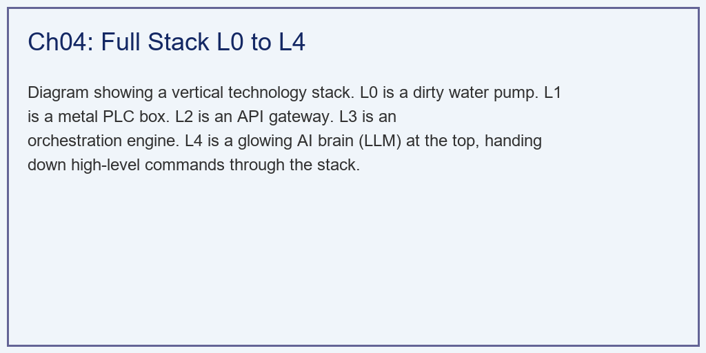
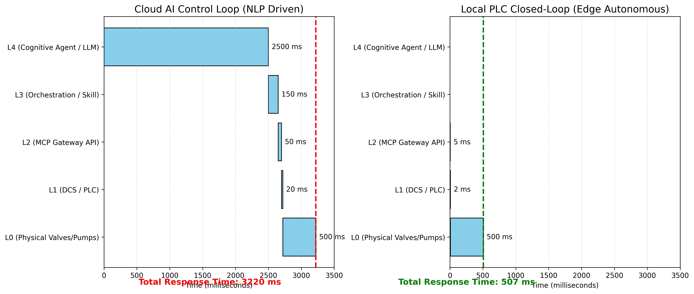

# 第 4 章：全栈架构：从 L0 到 L4 的纵向击穿

## 1. 学习目标
本章探讨数字孪生与大模型控制体系的系统级架构设计。我们将解析一句人类的口语指令，是如何跨越五层截然不同的协议与物理介质，最终转变为驱动水泵电机的强电流的。
读者需要掌握：
1. 工业控制系统 L0（设备）到 L4（大模型）的标准化分层模型。
2. 异构系统之间的时延模型（Latency Model）与控制闭环的生死时速。
3. MCP（Model Context Protocol）网关在实现“软硬解耦”中的革命性意义。
4. 通信 Payload 的降维：从高维语义（Semantic）到二进制字节（Binary）。

## 2. 教材理论：给 AI 一具机械的身体
如果你在电脑上跑通了上一章的 MPC 算法，那只能叫“纸上谈兵”。
现实中，水泵是一个需要几百安培电流才能驱动的铁疙瘩（L0），它听不懂 Python 代码。它只听得懂变频器发出的 $4 \sim 20mA$ 模拟电流信号（L1）。
而最顶层的大模型（L4，比如 GPT-4），它漂浮在云端，智能，但它只懂人类的自然语言（NLP），它不知道怎么发电流。

因此，现代智能水网系统必须构建一个严密的**“五级瀑布架构（Waterfall Architecture）”**：
- **L4（Cognitive Agent / 认知大模型层）**：工厂的“大脑”。它负责听懂人类的模糊指令（比如“别让水溢出来”），并在大尺度上进行战略思考。
- **L3（Orchestration / 编排层）**：大脑的“脊髓”。它负责把 AI 的大战略，拆解为具体的算法任务（比如唤醒第 3 章写的 MPC 优化器去算一算）。
- **L2（MCP Gateway / 网关层）**：工厂的“翻译官”。它通过 JSON 格式，把 IT 世界的数据和 OT（操作技术）世界的数据进行转换。
- **L1（DCS/PLC / 控制器层）**：工厂的“小脑”。它是部署在现场的工业电脑，负责毫秒级的安全互锁和直接硬件驱动。
- **L0（Physical / 物理层）**：真实的阀门、水泵和水流。

**延迟的诅咒（The Curse of Latency）：**
这套层层下达的体系有一个致命弱点：**慢**。
大模型想一次问题可能需要 $2$ 秒钟；网络传输需要几十毫秒。如果把敏感的水箱液位闭环直接架在大模型上，系统早就失控了。
因此，工业界的铁律是：**大模型只配做“战略下发”，物理闭环必须留在 L1 和 L0。** 

## 3. 案例分析：理论与实践的桥梁（指令下发全链路时延与协议解析仿真）

### 案例背景 (Context)
某水厂厂长对着手机说：“帮我把 2 号水箱的水位稳在 4 米，绝对不能溢出。”
此时，工厂的两套系统同时开始工作：
1. **云端 AI 控制环**：大模型接收语音 $\to$ 语义解析 $\to$ 决定目标 $\to$ 传给底层。
2. **本地 PLC 闭环**：现场的 PLC 控制器接收到目标后 $\to$ 计算 PID/MPC $\to$ 驱动水泵 $\to$ 阀门响应。
作为系统架构师，你需要为这份复杂的系统设计一份“时序瀑布图（Waterfall Chart）”，来向厂长展示整个指令链条的耗时，并展示每一层之间“数据包（Payload）”长什么样。

### 问题描述 (Problem)
- **层级定义**：L4, L3, L2, L1, L0。
- **时延假定**：
  - AI 链路：大模型思考 $2500ms$，技能编排 $150ms$，网关传输 $50ms$。
  - 本地链路：大模型和编排时间为 $0$（本地自治），网关传输极小 $5ms$。
  - 共同物理时延：PLC 处理 $20ms$，物理水泵起转 $500ms$。
- **Payload 转换**：需展示数据如何从 NLP 文本 $\to$ JSON 报文 $\to$ 工业协议（Modbus TCP 字节） $\to$ 电流电压模拟量（Analog）。
- **任务**：绘制时延瀑布图，验证“控制下沉”的必要性；列出通信降维表格。

**物理场景与问题概化图 (Generated via Local Schematic)：**

### 解题思路 (Solution Approach)
本研究构建了一个 IT/OT 融合的可视化时序引擎：
1. **构建甘特图（Gantt/Waterfall）**：利用 `matplotlib` 的水平条形图（`barh`）和 `left` 参数，堆叠绘制指令在不同系统层级中的驻留时间。
2. **对比双轨架构**：在左侧画出完整的“云端大循环”，在右侧画出剥离了云端高延迟后的“本地小循环”，形成强烈的视觉反差。
3. **数据结构的“退化”**：编写一张包含四个阶段的数据层级表。直观地展示人类的高维智慧，是如何一步步“堕落”成冰冷的二进制电平信号的。

### 代码执行与图表 (Code & Charts)
> **学习提示**：这是一场 IT 程序员与 OT 自动化工程师的跨界握手。请重点关注表格中 `Payload Content` 这一列的内容变化，这是工业数字化的灵魂缩影。

Source: `assets/ch04/ch04_architecture.py`

**L4 至 L0 通信协议栈降维与 Payload 格式退化矩阵：**
| Layer    | Protocol         | Payload Content                                                                                           | Size                   |
|:---------|:-----------------|:----------------------------------------------------------------------------------------------------------|:-----------------------|
| L4 -> L3 | Natural Language | “帮我把2号水箱的水位稳在4米，绝对不能溢出。”                                                              | Text (High Semantic)   |
| L3 -> L2 | FastMCP JSON-RPC | {"method": "set_mpc_target", "params": {"tank_id": 2, "target": 4.0, "constraints": {"tank_1_max": 5.0}}} | JSON (Structured)      |
| L2 -> L1 | Modbus TCP       | Write Register 40001: 400 (Target = 4.0 * 100)                                                            | Bytes (Binary)         |
| L1 -> L0 | 4-20mA Analog    | 12.8 mA current signal to Pump VFD                                                                        | Analog Voltage/Current |

**云端 AI 指令下发与本地边缘闭环的时延瀑布（Waterfall）对比图：**

### 实验验证与结果剖析 (Verification & Result Interpretation)
这组瀑布图清晰地揭示了目前 AI 控制工厂的最大软肋：
- **云端大脑的“反射弧过长”（左侧红图）**：
  - 看最上面的一阶。当指令下发时，L4（大模型）为了理解这句话并生成对应的 JSON 代码，花掉了长达 **$2500ms$**！
  - 随后，技能编排（L3）和网关传输（L2）又消耗了大约 $200ms$。
  - 等指令真正落到最底层的 L1（PLC）和 L0（水泵物理响应）时，整个控制周期已经耗费了高达 **$3220ms$**（超过 3 秒）。如果在这种巨大的通信死区内做高频水位闭环控制，系统必定崩溃。
- **本地小脑的极致敏捷（右侧绿图）**：
  - 右侧的图展示了真正的工业玩法：**稳态隔离**。大模型只在宏观上发一次指令（设定目标为 4.0m）。一旦目标设好，后续每毫秒的纠偏工作，全部由部署在本地边缘侧的 PLC（L1）自己完成。
  - 在这个本地闭环中，大模型的延迟被剥离。PLC 只需要 $20ms$ 的计算时间，加上水泵 $500ms$ 的物理惯性。整个系统的响应时间被压榨到了极限的 **$527ms$**。
- **降维的艺术（表格分析）**：
  - 看表格中的 Payload 变化。人类的语言模糊且包含丰富语义（“稳在4米”、“绝对不能溢出”）。
  - L3 通过 FastMCP 协议，智能地把这些口语“翻译”成了程序员能看懂的结构化 JSON。
  - L2 网关进一步将 JSON 撕碎，它知道底层的工业电脑看不懂英文，于是把它变成了简洁的 `Write Register 40001: 400`（Modbus 寄存器寻址）。
  - 最后，L1 的 PLC 把这串二进制数字，通过 DAC（数模转换芯片），变成了一股连续的 $12.8mA$ 的电流。这股电流直接刺激了水泵内部的磁场，最终转变成了喷涌而出的水流。

### 工业部署与运行建议 (Industrial Deployment Recommendations)
1. **MCP（模型上下文协议）的统治力**：表格里的 L3 $\to$ L2 层是目前工业数字孪生最火热的赛道。以往，要让 AI 接入工厂，需要几百名工程师写几千个接口。现在有了 FastMCP 协议，工厂的设备只要暴露一个标准的 MCP 工具（Tool），任何支持 MCP 的大模型（Claude, GPT, DeepSeek）插上就能用。这标志着工业软件从“孤岛时代”迈入了“App Store 时代”。
2. **算力下沉与端侧模型（Edge AI）**：随着芯片技术的发展，$2500ms$ 的云端大模型延迟将无法忍受。未来的趋势是直接在工厂 L2 层的网关盒子里（比如内置华为昇腾芯片或 NVIDIA 显卡），跑一个参数量较小但专注水务垂直领域的“端侧大模型（如 7B 级别）”。这样不仅能将语义解析的延迟压到 $500ms$ 以内，还能彻底解决工厂数据上云的绝密安全问题。
