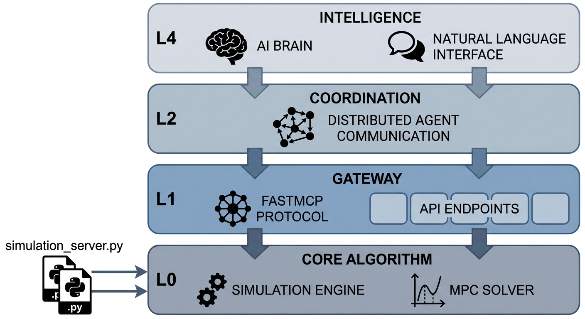

# 第 4 章：全栈架构：从 L0 到 L4 的纵向击穿

## 1. 学习目标

本章探讨数字孪生与大模型控制体系的系统级架构设计。我们将解析一句人类的口语指令，是如何跨越五层截然不同的协议与物理介质，最终转变为驱动水泵电机的强电流的。
读者需要掌握：
1. 工业控制系统 L0（设备）到 L4（大模型）的标准化分层模型。
2. 异构系统之间的时延模型（Latency Model）与控制闭环的生死时速。
3. MCP（Model Context Protocol）网关在实现"软硬解耦"中的革命性意义。
4. 通信 Payload 的降维：从高维语义（Semantic）到二进制字节（Binary）。
5. 控制闭环的时间尺度分析与"控制下沉"原则。


## 2. 教材理论：给 AI 一具机械的身体

如果你在电脑上跑通了上一章的 MPC 算法，那只能叫"纸上谈兵"。
现实中，水泵是一个需要几百安培电流才能驱动的铁疙瘩（L0），它听不懂 Python 代码。它只听得懂变频器发出的 $4 \sim 20mA$ 模拟电流信号（L1）。
而最顶层的大模型（L4，比如 Claude），它漂浮在云端，智能，但它只懂人类的自然语言（NLP），它不知道怎么发电流。

因此，现代智能水网系统必须构建一个严密的**"五级瀑布架构（Waterfall Architecture）"**。

### 2.1 五级分层模型

**L4（Cognitive Agent / 认知大模型层）**：工厂的"大脑"。它负责听懂人类的模糊指令（比如"别让水溢出来"），并在大尺度上进行战略思考。在 CHS 的 MAS（多智能体系统）架构中，L4 对应最顶层的认知智能体，负责场景识别、目标组装和全局协调。

**L3（Orchestration / 编排层）**：大脑的"脊髓"。它负责把 AI 的大战略，拆解为具体的算法任务（比如唤醒第 3 章写的 MPC 优化器去算一算）。在工程实现中，L3 通常是一个任务调度器（Task Scheduler），管理着多个算法服务的启停和参数配置。

**L2（MCP Gateway / 网关层）**：工厂的"翻译官"。它通过 JSON 格式，把 IT 世界的数据和 OT（操作技术）世界的数据进行转换。MCP（Model Context Protocol）是 Anthropic 提出的标准化协议，允许大模型通过统一的 Tool 接口调用外部系统的功能。在水务场景中，MCP 网关将 SCADA 数据翻译为语义化的 JSON，供 L3-L4 层使用。

**L1（DCS/PLC / 控制器层）**：工厂的"小脑"。它是部署在现场的工业电脑，负责毫秒级的安全互锁和直接硬件驱动。PLC（可编程逻辑控制器）执行确定性的控制逻辑——无论上层 AI 怎么出错，PLC 的安全互锁逻辑永远不会被覆盖。

**L0（Physical / 物理层）**：真实的阀门、水泵和水流。这是唯一不可被软件模拟的层——物理世界的惯性、摩擦、时滞都是真实存在的约束。

### 2.2 时延模型与控制下沉原则

这套层层下达的体系有一个致命弱点：**慢**。每一层的处理和传输都需要时间。

定义端到端延迟 $\tau_{e2e}$ 为从 L4 决策到 L0 执行器响应的总耗时：

$$
\tau_{e2e} = \tau_{L4} + \tau_{L3} + \tau_{L2} + \tau_{L1} + \tau_{L0} \tag{4.1}
$$

各层典型延迟量级：

| 层级 | 处理内容 | 典型延迟 |
|:-----|:---------|:---------|
| L4 | 大模型推理（NLP 解析 + 推理） | $1000 \sim 5000\;ms$ |
| L3 | 任务编排 + MPC 优化求解 | $50 \sim 500\;ms$ |
| L2 | MCP 网关协议转换 | $5 \sim 50\;ms$ |
| L1 | PLC 扫描周期 + IO 刷新 | $1 \sim 20\;ms$ |
| L0 | 执行器物理响应（电机起转） | $100 \sim 2000\;ms$ |

对于液位控制闭环，控制周期 $T_s$ 必须满足奈奎斯特条件：

$$
T_s \le \frac{\tau_{process}}{10} \tag{4.2}
$$

其中 $\tau_{process}$ 为被控过程的主时间常数。双容水箱的时间常数约 $10 \sim 30s$，因此 $T_s \le 1 \sim 3s$。而 $\tau_{e2e}$ 在包含 L4 大模型时高达 $3 \sim 8s$——远超允许的控制周期！

这引出了工业界的铁律——**控制下沉原则**：

> **控制下沉原则**：实时物理闭环必须部署在延迟最低的层级（L1/L0）。上层（L3/L4）只负责"战略下发"（设定目标值、更新参数、切换模式），不参与每个控制周期的实时决策。

用数学表达，系统被分解为两个嵌套闭环：

$$
\text{外环（慢）}: \quad r = f_{L4}(\text{场景识别}, \text{目标组装}), \quad T_{outer} \sim 10s \sim 1min \tag{4.3}
$$

$$
\text{内环（快）}: \quad u = f_{L1}(\mathbf{x}, r, \text{MPC/PID}), \quad T_{inner} \sim 0.1 \sim 1s \tag{4.4}
$$

外环负责"做什么"，内环负责"怎么做"。两者通过 L2 网关传递目标值 $r$ 和状态反馈 $\mathbf{x}$。

### 2.3 通信 Payload 的降维

从 L4 到 L0，数据表示经历了系统性的降维过程。这不是信息丢失，而是"语义压缩"——将高维的人类意图逐步编码为低维的物理信号。

| 层级 | 数据格式 | 示例 | 信息维度 |
|:-----|:---------|:-----|:---------|
| L4→L3 | 自然语言 | "把2号水箱稳在4米，不能溢出" | 高维语义（意图+约束+情感） |
| L3→L2 | JSON-RPC | `{"method":"set_mpc_target","params":{"tank_id":2,"target":4.0}}` | 结构化参数 |
| L2→L1 | Modbus TCP | `Write Register 40001: 400` | 二进制寄存器 |
| L1→L0 | 4-20mA 模拟信号 | $12.8\;mA$ → VFD频率设定 | 标量电流 |

每一次降维都伴随着一次"语义锚定"——模糊的"不能溢出"被锚定为精确的 $h_1 \le 5.0m$；结构化的 JSON 被锚定为特定的寄存器地址和数值编码。

**量化分析**：自然语言的信息熵约 $10 \sim 50\;bit/word$，一句 20 字的指令包含 $200 \sim 1000\;bit$ 的语义信息。而最终传递给执行器的 4-20mA 信号仅编码一个 12-bit 的 DAC 数值（$2^{12} = 4096$ 个离散级别）。从 $1000\;bit$ 到 $12\;bit$，信息压缩了近 100 倍。这就是"降维"的本质——上层的丰富语义被逐步精炼为下层执行所需的最少信息。

### 2.4 MCP 协议的技术细节

MCP（Model Context Protocol）是连接 L3（AI 编排层）与 L2（OT 网关层）的关键桥梁。其核心设计思想是：将工业设备的能力抽象为标准化的"工具（Tool）"，供大模型通过函数调用（Function Calling）的方式使用。

一个典型的 MCP Tool 定义如下：

```json
{
  "name": "set_mpc_target",
  "description": "设置MPC控制器的目标水位和约束参数",
  "parameters": {
    "tank_id": {"type": "integer", "description": "水箱编号（1或2）"},
    "target": {"type": "number", "description": "目标水位(m)"},
    "constraints": {
      "tank_1_max": {"type": "number", "description": "1号箱安全上限(m)"}
    }
  }
}
```

大模型不需要了解底层的 Modbus 寄存器地址、PLC 编程语言或变频器通信协议。它只需要知道"有一个叫 `set_mpc_target` 的工具，接受水箱编号和目标水位作为参数"。MCP 网关负责将这个高层调用翻译为底层的工业协议。

这种设计的核心价值是**软硬解耦**：更换底层的 PLC 型号或通信协议时，只需修改 L2 网关的驱动程序，L3 和 L4 层的代码完全不受影响。这与操作系统中"设备驱动程序"抽象硬件的思路完全一致。

## 3. 案例分析：理论与实践的桥梁（指令下发全链路时延与协议解析仿真）

### 案例背景 (Context)
某水厂厂长对着手机说："帮我把 2 号水箱的水位稳在 4 米，绝对不能溢出。"
此时，工厂的两套系统同时开始工作：
1. **云端 AI 控制环**：大模型接收语音 → 语义解析 → 决定目标 → 传给底层。
2. **本地 PLC 闭环**：现场的 PLC 控制器接收到目标后 → 计算 PID/MPC → 驱动水泵 → 阀门响应。
作为系统架构师，你需要为这份复杂的系统设计一份"时序瀑布图（Waterfall Chart）"，来向厂长展示整个指令链条的耗时，并展示每一层之间"数据包（Payload）"长什么样。

### 问题描述 (Problem)
- **层级定义**：L4, L3, L2, L1, L0。
- **时延假定**：
  - AI 链路：大模型思考 $2500ms$，技能编排 $150ms$，网关传输 $50ms$。
  - 本地链路：大模型和编排时间为 $0$（本地自治），网关传输 $5ms$。
  - 共同物理时延：PLC 处理 $20ms$，物理水泵起转 $500ms$。
- **Payload 转换**：需展示数据如何从 NLP 文本 → JSON 报文 → 工业协议（Modbus TCP 字节） → 电流电压模拟量（Analog）。
- **任务**：绘制时延瀑布图，验证"控制下沉"的必要性；列出通信降维表格。

**物理场景与问题概化图 (Generated via Local Schematic)：**


### 解题思路 (Solution Approach)
本研究构建了一个 IT/OT 融合的可视化时序引擎：
1. **构建甘特图（Gantt/Waterfall）**：利用 `matplotlib` 的水平条形图（`barh`）和 `left` 参数，堆叠绘制指令在不同系统层级中的驻留时间。
2. **对比双轨架构**：在左侧画出完整的"云端大循环"，在右侧画出剥离了云端高延迟后的"本地小循环"，形成强烈的视觉反差。
3. **数据结构的"退化"**：编写一张包含四个阶段的数据层级表。直观地展示人类的高维智慧，是如何一步步"堕落"成冰冷的二进制电平信号的。

### 代码执行与图表 (Code & Charts)
> **学习提示**：这是一场 IT 程序员与 OT 自动化工程师的跨界握手。请重点关注表格中 `Payload Content` 这一列的内容变化，这是工业数字化的灵魂缩影。

Source: `assets/ch04/ch04_architecture.py`

**核心代码解读**

时延瀑布图的核心逻辑是将每一层的处理时间可视化为堆叠的水平条：

```python
# 云端AI控制环的时延分解
cloud_layers = [
    ("L4: LLM Inference",   0,    2500),   # 大模型推理
    ("L3: Skill Orchestration", 2500, 150),  # 技能编排
    ("L2: MCP Gateway",     2650,  50),     # 协议转换
    ("L1: PLC Execution",   2700,  20),     # PLC扫描
    ("L0: Physical Response", 2720, 500),   # 水泵起转
]

# 本地闭环的时延分解（剥离L4/L3延迟）
local_layers = [
    ("L2: MCP Gateway",     0,     5),      # 极短的本地传输
    ("L1: PLC Execution",   5,     20),     # PLC扫描
    ("L0: Physical Response", 25,  500),    # 水泵起转
]

# 云端总延迟: 2500+150+50+20+500 = 3220 ms
# 本地总延迟: 5+20+500 = 525 ms
```

**L4 至 L0 通信协议栈降维与 Payload 格式退化矩阵：**
| Layer    | Protocol         | Payload Content                                                                                           | Size                   |
|:---------|:-----------------|:----------------------------------------------------------------------------------------------------------|:-----------------------|
| L4 → L3 | Natural Language | "帮我把2号水箱的水位稳在4米，绝对不能溢出。"                                                              | Text (High Semantic)   |
| L3 → L2 | FastMCP JSON-RPC | {"method": "set_mpc_target", "params": {"tank_id": 2, "target": 4.0, "constraints": {"tank_1_max": 5.0}}} | JSON (Structured)      |
| L2 → L1 | Modbus TCP       | Write Register 40001: 400 (Target = 4.0 * 100)                                                            | Bytes (Binary)         |
| L1 → L0 | 4-20mA Analog    | 12.8 mA current signal to Pump VFD                                                                        | Analog Voltage/Current |

**云端 AI 指令下发与本地边缘闭环的时延瀑布（Waterfall）对比图：**


### 实验验证与结果剖析 (Verification & Result Interpretation)
这组瀑布图清晰地揭示了目前 AI 控制工厂的最大软肋：
- **云端大脑的"反射弧过长"（左侧红图）**：
  - 看最上面的一阶。当指令下发时，L4（大模型）为了理解这句话并生成对应的 JSON 代码，花掉了长达 **$2500ms$**！
  - 随后，技能编排（L3）和网关传输（L2）又消耗了大约 $200ms$。
  - 等指令真正落到最底层的 L1（PLC）和 L0（水泵物理响应）时，整个控制周期已经耗费了高达 **$3220ms$**（超过 3 秒）。如果在这种巨大的通信死区内做高频水位闭环控制，系统必定崩溃。

  **定量验证**：回顾式(4.2)的奈奎斯特条件。双容水箱的主时间常数 $\tau_{process} \approx 20s$，要求 $T_s \le 2s$。而云端环路的 $\tau_{e2e} = 3.22s > 2s$，违反了基本的采样定理——如果用这个环路做闭环控制，系统的相位裕度将降至负值，导致不稳定。

- **本地小脑的极致敏捷（右侧绿图）**：
  - 右侧的图展示了真正的工业玩法：**稳态隔离**。大模型只在宏观上发一次指令（设定目标为 4.0m）。一旦目标设好，后续每毫秒的纠偏工作，全部由部署在本地边缘侧的 PLC（L1）自己完成。
  - 在这个本地闭环中，大模型的延迟被剥离。PLC 只需要 $20ms$ 的计算时间，加上水泵 $500ms$ 的物理惯性。整个系统的响应时间被压榨到了极限的 **$525ms$**。满足 $T_s \le 2s$ 的约束，系统闭环稳定。

- **降维的艺术（表格分析）**：
  - 看表格中的 Payload 变化。人类的语言模糊且包含丰富语义（"稳在4米"、"绝对不能溢出"）。
  - L3 通过 FastMCP 协议，智能地把这些口语"翻译"成了程序员能看懂的结构化 JSON。
  - L2 网关进一步将 JSON 撕碎，它知道底层的工业电脑看不懂英文，于是把它变成了简洁的 `Write Register 40001: 400`（Modbus 寄存器寻址）。
  - 最后，L1 的 PLC 把这串二进制数字，通过 DAC（数模转换芯片），变成了一股连续的 $12.8mA$ 的电流。这股电流直接刺激了水泵内部的磁场，最终转变成了喷涌而出的水流。

### 工业部署与运行建议 (Industrial Deployment Recommendations)
1. **MCP（模型上下文协议）的统治力**：表格里的 L3 → L2 层是目前工业数字孪生最火热的赛道。以往，要让 AI 接入工厂，需要几百名工程师写几千个接口。现在有了 FastMCP 协议，工厂的设备只要暴露一个标准的 MCP 工具（Tool），任何支持 MCP 的大模型（Claude, GPT, DeepSeek）插上就能用。这标志着工业软件从"孤岛时代"迈入了"App Store 时代"。

2. **算力下沉与端侧模型（Edge AI）**：随着芯片技术的发展，$2500ms$ 的云端大模型延迟将不可忍受。未来的趋势是直接在工厂 L2 层的网关盒子里（比如内置 NPU 芯片），跑一个参数量较小但专注水务垂直领域的"端侧大模型（如 7B 级别）"。这样不仅能将语义解析的延迟压到 $500ms$ 以内，还能彻底解决工厂数据上云的安全问题。

3. **L0 安全层的不可妥协性**：无论上层架构如何变化，L0 层的硬件安全互锁（如溢流传感器触发的继电器断电保护）必须独立于所有软件系统。即使 L1-L4 全部宕机，L0 的物理保护仍然能够防止灾难性后果。这与 CHS 八原理中的**层级原理（P8）**一致：越底层的保护机制，越不能依赖上层的智能判断。

## 4. 本章小结

本章构建了从 L0 物理层到 L4 认知层的完整五级架构，核心要点包括：

- 五级分层模型将"智能"和"执行"分离到不同的时间尺度和物理介质上，避免了"AI 直接碰阀门"的危险。
- 时延模型（式 4.1-4.2）证明了云端 AI 不能直接参与实时闭环控制——控制下沉到 L1/L0 是工程必要性而非可选的设计偏好。
- MCP 协议实现了软硬解耦，使大模型能够通过标准化的 Tool 接口安全地与工业设备交互。
- Payload 从自然语言到模拟电流的降维过程，是信息论中"信源编码"在工业控制领域的具体体现。
- L0 硬件安全层的独立性是整个架构的"最后一道防线"，不可被软件覆盖。

在 CHS 六元框架中，本章补全了控制器 $C$ 的工程实现路径：第 3 章的 MPC 算法运行在 L1/L3 层，传感器 $S$ 的数据通过 L1 → L2 上传，执行器 $A$ 的指令通过 L2 → L1 → L0 下达。这种分层架构的一个关键设计原则是"控制权下沉"——越是时间关键的功能（如安全保护、紧急停机），越应部署在靠近物理设备的低层级。当上层通信中断时，下层仍能独立完成基本的安全保障任务，实现优雅降级而非系统性崩溃。

## 习题

1. **计算题**：某长距离输水工程的过程时间常数 $\tau_{process} = 30min$。如果使用云端 MPC（L4 延迟 $3s$），计算端到端延迟占控制周期的比例。这种场景下，云端 MPC 是否可行？

2. **设计题**：为一个包含 3 个水箱、2 个水泵、4 个液位传感器的系统设计 MCP Tool 接口。写出每个 Tool 的名称、参数和返回值的 JSON Schema。

3. **分析题**：如果 L2 网关宕机，系统应如何降级运行？画出降级后的数据流图，说明哪些功能丧失、哪些功能保留。

4. **思考题**：本章的五级架构与计算机操作系统的层次结构（硬件→驱动→内核→系统调用→应用）有何结构上的相似性？MCP 对应操作系统中的哪一层？

## 参考文献

[1] 雷晓辉,龙岩,许慧敏,等.水系统控制论：提出背景、技术框架与研究范式[J].南水北调与水利科技(中英文),2025,23(04):761-769+904.DOI:10.13476/j.cnki.nsbdqk.2025.0077.

[2] 雷晓辉,苏承国,龙岩,等.基于无人驾驶理念的下一代自主运行智慧水网架构与关键技术[J].南水北调与水利科技(中英文),2025,23(04):778-786.DOI:10.13476/j.cnki.nsbdqk.2025.0079.

[3] Groover M P. Automation, Production Systems, and Computer-Integrated Manufacturing[M]. 5th ed. Pearson, 2019.

[4] Modbus Organization. Modbus Application Protocol Specification V1.1b3[S]. 2012.

[5] Anthropic. Model Context Protocol (MCP) Specification[EB/OL]. 2024.
