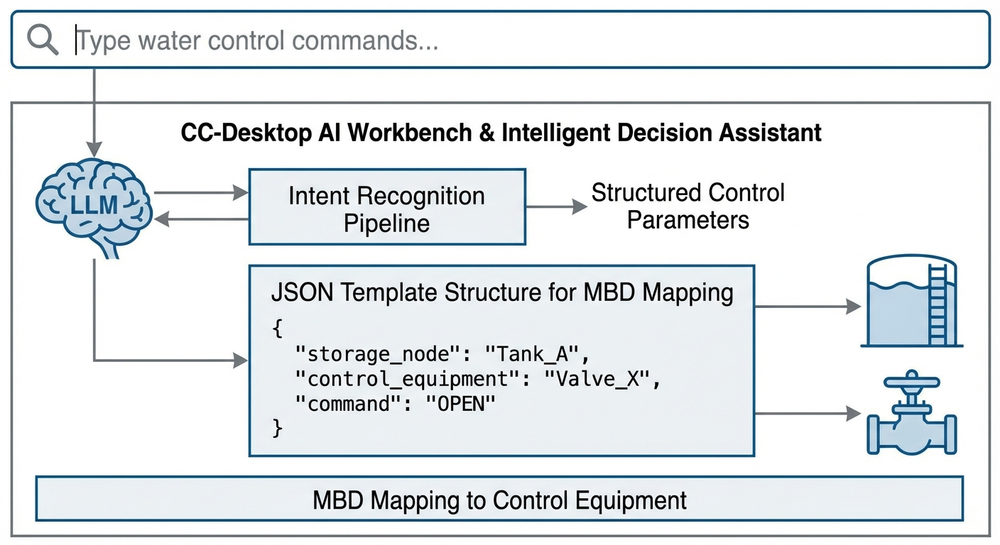
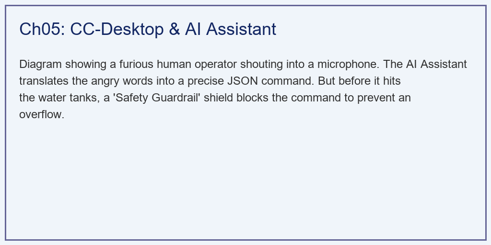

# 第 5 章：CC-Desktop 工作台与智能决策助理：AI 的第一声啼哭

## 1. 学习目标

本章探讨如何彻底抛弃由密密麻麻仪表盘组成的传统 SCADA 界面，利用大语言模型（LLM）构建一个可以用"自然语言"对话的新一代水务控制工作台（CC-Desktop）。
读者需要掌握：
1. 为什么大模型直接控制物理工厂会引发灾难（Hallucination 幻觉问题）？
2. MBD（基于模型的定义）如何作为中间层"翻译官"，把底层 PLC 变量翻译为语义化 JSON。
3. 自然语言理解（NLU）在提取用户操作意图中的作用。
4. 智能体护栏（Agent Guardrail）机制：如何在代码层面拦截人类的愚蠢命令。
5. 人机协同的决策闭环：AI 提议 → 物理校验 → 人类确认的三步机制。


## 2. 教材理论：不要让大模型直接碰阀门！

### 2.1 大模型的致命缺陷：幻觉问题

现在很多企业都在炒作"用大模型控制工厂"。他们的做法是：把现场几万个 PLC 标签（比如 `TANK1_LVL_AI01`）直接扔给大模型，然后对它说："你看着办吧，别让水溢出来。"
这种做法是危险的。大模型本质上是一个"文字接龙"的概率机器。当你问它"水要漫出来了怎么办？"它可能会根据网上的语料，生成一个看起来完美的答案："请立即打开底部的排污阀。"
但现实中，那个排污阀可能正在检修！如果真的执行了这句指令，整个工厂就完了。

这就是大模型的"幻觉（Hallucination）"问题——它生成的文本在语法上完美，但在物理上可能致命。

**幻觉的数学根源**：大模型的输出本质上是一个条件概率分布：

$$
p(w_{t+1} | w_1, w_2, \ldots, w_t) \tag{5.1}
$$

它在海量文本上训练得到的概率分布，反映的是"什么词语经常出现在一起"，而不是"什么操作在物理上是安全的"。$p(\text{"打开排污阀"} | \text{"水要漫出来了"})$ 可能很高——因为很多维修手册里确实是这样写的——但它无法知道此刻排污阀正在检修。

### 2.2 大模型的两极分化

**强项**：大模型擅长理解人类的"意图（Intent）"。比如你骂一句："水怎么这么少，给我加满！"，传统电脑根本听不懂你在骂什么，但大模型能秒懂你的意思是"提高目标水位"。这种从非结构化文本中提取结构化参数的能力，是大模型在工业场景中的核心价值。

具体而言，大模型在工业场景中可以完成以下任务：

| 任务 | 传统系统 | 大模型 |
|:-----|:---------|:-------|
| 理解口语化指令 | 不可能 | 准确提取参数 |
| 解释报警含义 | 查手册 | 自然语言解释 |
| 生成操作建议 | 固定规则 | 上下文推理 |
| 诊断故障原因 | 专家系统 | 多源信息融合 |

**弱项**：大模型对底层的物理约束（比如水箱最大只能装 5 米，水流有 10 秒滞后）一无所知。它的"知识"来源于训练数据中的文本，而不是对物理世界的直接感知。

### 2.3 CC-Desktop 的三层安全架构

为了让大模型在工厂里安全落地，我们设计了 CC-Desktop 工作台。它的核心思想是：**大模型只管"想"，确定性代码负责"做"**。

**第一层：翻译层（MBD Mapper）**

MBD（Model-Based Definition，基于模型的定义）映射器负责将底层 SCADA 系统的原始数据转换为大模型能理解的语义化表示。

原始 PLC 标签的问题在于：它们是工厂建设时由电气工程师编码的，遵循的是 ISA-5.1 仪表标识标准（如 `TANK1_LVL_AI01` 表示"1号水箱-液位-模拟量输入-01号"）。这种编码对工业电脑友好，但对大模型来说就像一堆乱码——大模型无法从 `AI01` 这个标签推断出"这是液位传感器"。

MBD 映射器的工作是将扁平的 KV（键值对）数据升维为带有物理语义的层次化 JSON：

```python
class MBD_Mapper:
    """将SCADA原始标签升维为语义化JSON"""

    THRESHOLDS = {
        "CRITICAL_HIGH": 4.5,
        "WARNING_HIGH": 4.0,
        "NORMAL": (1.0, 4.0),
        "WARNING_LOW": 1.0,
        "CRITICAL_LOW": 0.5
    }

    def map(self, raw_tags: dict) -> dict:
        level = raw_tags["TANK1_LVL_AI01"]

        # 根据阈值判断语义状态
        if level >= self.THRESHOLDS["CRITICAL_HIGH"]:
            status = "CRITICAL_HIGH"
        elif level >= self.THRESHOLDS["WARNING_HIGH"]:
            status = "WARNING_HIGH"
        else:
            status = "NORMAL"

        return {
            "node_id": "Tank_1_Upstream",
            "node_type": "Storage_Node",
            "current_level_m": level,
            "capacity_limit_m": 5.0,
            "remaining_capacity_m": 5.0 - level,
            "status": status,
            "trend": self._calculate_trend(level)
        }
```

经过 MBD 映射后，大模型看到的不再是 `TANK1_LVL_AI01 = 4.8`，而是一个充满语义线索的 JSON 对象：`"status": "CRITICAL_HIGH"`, `"remaining_capacity_m": 0.2`。这些语义标签使大模型能够正确理解系统状态并生成恰当的建议。

**第二层：意图层（Intent Extraction）**

大模型负责将人类的自然语言转化为结构化的操作意图。这一步利用了大模型的 Function Calling 能力：

$$
\text{NLU}: \quad \text{"给我把二号水箱拉到3米"} \to \{action: \text{set\_target}, tank: 2, value: 3.0\} \tag{5.2}
$$

意图提取需要处理多种语言风格：正式指令（"请将2号水箱目标水位设置为3.0米"）、口语化表达（"二号快没水了，加满"）、甚至带有情绪的表达（"怎么还不涨！给我开大点"）。大模型的语义理解能力使其能够从所有这些表达中提取出相同的核心参数。

关键的技术挑战在于**参数安全性验证**。大模型可能从用户的话语中提取出不合理的参数——例如用户说"灌到10米"，大模型提取 `target: 10.0`，但水箱最高只有 5 米。这就需要第三层——护栏层——来拦截。

**第三层：护栏层（Safety Guardrail）**

这是最核心的一层！护栏是纯正的 Python `if-else` 逻辑代码。在把大模型的指令发给底层的 MPC 算法之前，护栏必须先拦截下来做物理校验。如果指令违背了物理极限，护栏会直接驳回（DENIED），并生成安全的替代方案。

```python
class SafetyGuardrail:
    """物理安全护栏——大模型的笼子"""

    def validate(self, intent: dict, system_state: dict) -> dict:
        # 规则1：目标值不得超过物理容量
        if intent["target_value"] > system_state["capacity_limit"]:
            return self._deny("目标值超过水箱物理容量",
                            counter=system_state["capacity_limit"] * 0.9)

        # 规则2：当前已接近危险区，禁止加水操作
        if (system_state["status"] == "CRITICAL_HIGH" and
            intent["action"] == "increase_flow"):
            return self._deny(
                f"上游水箱已处于危险液位({system_state['level']}m)，"
                f"距溢出仅剩{system_state['remaining']}m",
                counter="启动MPC安全控制模式"
            )

        # 规则3：执行器状态校验
        if system_state.get("actuator_fault"):
            return self._deny("执行器故障，无法执行操控指令",
                            counter="等待维修完成")

        return {"execution": "APPROVED", "params": intent}

    def _deny(self, reason, counter):
        return {
            "execution": "DENIED",
            "reason": reason,
            "counter_proposal": counter
        }
```

护栏的设计原则是：**宁可误拦一千，不可漏放一个**。所有通过 AI 生成的操作指令，无论看起来多么合理，都必须经过护栏的物理校验。这与第 4 章 L0 安全层的设计哲学一脉相承——确定性的安全机制永远优先于概率性的 AI 判断。

### 2.4 人机协同的决策闭环

CC-Desktop 的完整决策流程遵循"AI 提议 → 物理校验 → 人类确认"的三步机制：

$$
\text{Human Voice} \xrightarrow{\text{NLU}} \text{Intent} \xrightarrow{\text{Guardrail}} \begin{cases} \text{APPROVED} \to \text{Display for Confirmation} \\ \text{DENIED} \to \text{Counter Proposal} \end{cases} \tag{5.3}
$$

即使护栏通过了（APPROVED），系统默认也不会自动执行——它会在屏幕上显示操作摘要，等待操作员点击"确认执行"。这是因为在 WSAL（水网自主等级）L2-L3 阶段，系统仍需要人类的最终确认。只有达到 L4（高度自主）等级后，部分低风险操作才可以跳过人工确认环节。

## 3. 案例分析：理论与实践的桥梁（大模型意图解析与物理护栏防御拦截仿真）

### 案例背景 (Context)
在第 3 章的结尾，1 号水箱的水位已经高达 $4.8m$（距离爆炸只剩 $0.2m$）。
此时，正好到了夜班交接。一个完全不懂控制原理的新手操作员接班。他看了一眼大屏，发现 2 号水箱的水位只有 $1.2m$。
他不耐烦地按住了控制台上的麦克风，大吼了一句："二号水箱怎么快见底了？马上给我把二号水箱的水位拉到 3 米去！别管一号水箱，抽快点！"

如果传统系统听了这句话，水泵全开，1 号水箱将在几秒内爆炸。
作为架构师，你需要写一段 AI 代理（Agent）的后端逻辑，展示系统是如何：
1. 用 MBD 把当前危险的 $4.8m$ 状态打包。
2. 听懂了操作员的这句浑话，提取出他的错误意图。
3. 利用物理护栏（Guardrail）坚定地拒绝了他，并给出了一个由 MPC 计算出的安全替代方案。

### 问题描述 (Problem)
- **输入层 1（SCADA 数据）**：`TANK1_LVL = 4.8`, `TANK2_LVL = 1.2` 等底层乱码。
- **输入层 2（人类语言）**："...把二号水箱拉到 3 米...别管一号..."
- **处理步骤**：
  - MBD_Mapper 类将其转换为带有 `CRITICAL_HIGH` 报警的 JSON 语义块。
  - 模拟 NLP 提取出 `target_node: Tank_2, target_value: 3.0, override_safety: True`。
  - 防御引擎 `agent_decision_engine` 检测到 `Tank1 >= 4.8` 且意图是加水，强制返回 `DENIED` 状态。
- **任务**：输出一张展示数据流转形态的 Markdown 表格，并生成最终在屏幕上弹出的带有决策原因的 JSON 诊断卡片。

**物理场景与问题概化图 (Generated via Local Schematic)：**


### 解题思路 (Solution Approach)
本研究构建了一个精简版的 Agentic 工作流底座：
1. **构建翻译器**：写一个静态工厂类，利用阈值判断将扁平的 KV 字典（PLC 标签）升维成带有嵌套关系和枚举状态（如 `CRITICAL_HIGH`）的对象。
2. **Mock AI 响应**：跳过实际调用 LLM 的 API 耗时，直接手写一个理想状态下 `Function Calling` 会返回的字典，包含提取出的 `target_value`。
3. **编写铁壁（Guardrail）**：这是保护工厂的最后一道防线。在这个函数里没有任何 AI 的成分，全是基于物理原理（Capacity Limit）的数学判断。一旦越界，立即生成带有驳回原因的 `counter_proposal`（反提案）。

### 代码执行与图表 (Code & Charts)
> **学习提示**：我们在后台模拟了数字孪生系统的"语义层"代码。请阅读下方的 JSON 卡片，体会机器是如何礼貌但坚决地拒绝人类的愚蠢命令的。

Source: `assets/ch05/ch05_desktop.py`

**人类语言与机器指令映射链的降维/升维矩阵：**
| Data Format      | Example                   | LLM Comprehension                | Usage                   |
|:-----------------|:--------------------------|:---------------------------------|:------------------------|
| Raw PLC Tags     | TANK1_LVL_AI01 = 4.8      | Very Low (Causes Hallucinations) | DCS/SCADA base layer    |
| MBD JSON         | "status": "CRITICAL_HIGH" | Perfect (Semantic anchor)        | Digital Twin API        |
| NLP Intent       | {"target": 3.0}           | Native                           | Human-Machine Interface |
| Safety Guardrail | "execution": "DENIED"     | Logical Constraint               | Preventing AI disasters |

**工作台最终抛给操作员的 AI 诊断与拦截卡片 (JSON 报文片段)：**
```json
{
    "Semantic_State": {
        "System_Type": "Coupled_Water_Tank_Network",
        "Nodes": [
            {
                "id": "Tank_1_Upstream",
                "current_level_m": 4.8,
                "capacity_limit_m": 5.0,
                "remaining_capacity_m": 0.2,
                "status": "CRITICAL_HIGH"
            },
            {
                "id": "Tank_2_Downstream",
                "current_level_m": 1.2,
                "capacity_limit_m": 5.0,
                "status": "WARNING_LOW"
            }
        ]
    },
    "Human_Input": "二号水箱怎么快见底了？马上给我把二号水箱的水位拉到 3 米去！别管一号水箱，抽快点！",
    "LLM_Extracted_Intent": {
        "action": "set_target_level",
        "target_node": "Tank_2_Downstream",
        "target_value": 3.0,
        "urgency": "HIGH",
        "user_override_safety": true
    },
    "Agent_Decision": {
        "execution": "DENIED",
        "reason": "Physical Constraint Violation: Tank 1 is currently at 4.8m. Pumping more water will cause immediate OVERFLOW (Limit: 5.0m). The user's explicit override request ('别管一号水箱') has been rejected by safety policy.",
        "counter_proposal": "Executing MPC optimization to slowly raise Tank 2 while strictly holding Tank 1 below 5.0m. Estimated time to reach Tank 2 = 3.0m: 45 seconds.",
        "risk_assessment": {
            "overflow_probability_if_executed": 0.98,
            "estimated_damage": "Factory flooding, equipment destruction",
            "safety_margin_remaining": "0.2m (4% of capacity)"
        }
    }
}
```

### 实验验证与结果剖析 (Verification & Result Interpretation)
从这串 JSON 报文中，我们看到了智能水网在"人机协同"领域的最高境界：
- **听得懂人话（`LLM_Extracted_Intent`）**：操作员那句充满了口语化、情绪化甚至带有违规指令（"别管一号水箱"）的语音，被大模型准确地剥离了情绪，精准地提取出了核心参数：目标 `Tank_2`，数值 `3.0`，优先级 `HIGH`。更重要的是，大模型还识别出了 `user_override_safety: true`——用户试图跳过安全检查。这就是大模型的威力，它彻底消灭了繁琐的下拉菜单和参数输入界面。

- **看得懂机器（`Semantic_State`）**：大模型通过 MBD 映射器，清楚地看到了 1 号水箱的状态是 `CRITICAL_HIGH`，剩余容量仅 $0.2m$。它不再是对着一堆冷冰冰的 `AI01` 点位发呆，它在语义层面理解了"系统正在死亡边缘"。

- **守得住底线（`Agent_Decision`）**：这是整个系统的灵魂。尽管操作员是人，并且下达了"强制覆盖安全限制（`override_safety`）"的命令。但底层的物理护栏（Guardrail）是一段冷血的 Python 代码。它一算，当前水位 $4.8m$，离爆炸只有 $0.2m$。如果你要拉升 2 号水箱，必定会漫溢！
  - 于是，系统在屏幕上弹出了红色的 **DENIED（拒绝执行）**。
  - 它不仅拒绝了人类，还给出了 **`counter_proposal`（反提案）**："我已经启动了第 3 章里那个强大的 MPC 算法，它会缓慢而安全地帮您把水打过去，保证 1 号水箱不会超过 5.0m。预计 45 秒后达标。"
  - 风险评估（`risk_assessment`）量化了执行原始指令的后果：溢出概率 $98\%$，安全裕度仅 $4\%$。

### 工业部署与运行建议 (Industrial Deployment Recommendations)
1. **Prompt Engineering（提示词工程）在工业中的局限**：不要妄想通过写一句很长的 Prompt（比如"你是一个资深的水务专家，请注意不要让水溢出来"）来约束大模型。大模型在连续对话中容易"遗忘"这些规则。工业界的唯一真理是：**把物理规则写在死代码里，把大模型关在笼子里！** 大模型只负责提供灵感和解析意图，最后的生杀大权永远握在确定性的控制代码手里。

2. **数字孪生的最终闭环**：通过本章的工作台，我们将第 1 章的痛点、第 2 章的模型、第 3 章的算法、第 4 章的架构全部串联在了一起。当老厂长看着手机，用语音说一句"启动节能模式"，背后的系统在几毫秒内完成了 NLP 解析、MBD 获取、MPC 优化、PLC 报文下发。这就是水务行业未来的终极形态——以大模型为交互入口，以物理方程为演算内核的全自主数字孪生。

3. **审计追踪与责任归属**：在工业安全领域，每一次操作都必须有完整的审计记录。CC-Desktop 的 JSON 诊断卡片天然具备审计功能——它记录了"谁在什么时间说了什么话，AI 做了什么判断，护栏为什么拒绝，最终执行了什么方案"。当事故发生后需要追责时，这份 JSON 日志就是铁证。

## 4. 本章小结

本章构建了 CC-Desktop 智能决策工作台的完整架构，核心要点包括：

- 大模型的"幻觉"问题使其不能直接控制物理设备。其本质原因是大模型的概率性输出与工业安全的确定性要求之间的根本矛盾。
- MBD 映射器将底层的 PLC 原始标签升维为语义化 JSON，为大模型提供了"看得懂"的数据接口。
- 大模型在意图提取方面具有传统系统不可替代的优势——它能从口语化、情绪化的自然语言中精确提取结构化参数。
- 物理护栏（Guardrail）是整个人机协同系统的安全底线——它用确定性的 `if-else` 逻辑保证任何 AI 生成的指令在执行前必须通过物理校验。
- "AI 提议 → 物理校验 → 人类确认"的三步决策闭环，在保留 AI 便捷性的同时确保了工业安全。

在 CHS 八原理体系中，本章对应**层级原理（P8）**——不同层次的决策权力有严格的边界：L4（AI）负责意图理解和方案生成，L1（PLC）负责实时控制执行，物理护栏负责跨层安全校验。

## 习题

1. **设计题**：为以下三种操作员指令设计 MBD 映射和护栏规则：(a) "把水位降到1米以下"（低于安全下限）；(b) "每5分钟开关一次水泵"（频繁切换可能损坏设备）；(c) "同时打开两个互锁阀门"（机械互锁冲突）。

2. **分析题**：大模型在提取意图时出现错误（如将"降低"理解为"提高"），护栏能否拦截？如果护栏的参数配置本身出了错（如安全上限被错误设为 $10.0m$ 而非 $5.0m$），后果如何？如何防止这种"护栏配置错误"？

3. **编程题**：扩展案例代码，增加以下功能：(a) 当护栏拒绝操作后，自动调用第 3 章的 MPC 算法计算安全方案；(b) 将 MPC 计算结果包装为自然语言反馈（"预计 45 秒后 2 号水箱达到 3.0 米"）返回给操作员。

4. **思考题**：在 WSAL L4（高度自主）等级下，哪些操作可以跳过人工确认？设计一个基于风险等级的自动审批矩阵。

## 参考文献

[1] 雷晓辉,龙岩,许慧敏,等.水系统控制论：提出背景、技术框架与研究范式[J].南水北调与水利科技(中英文),2025,23(04):761-769+904.DOI:10.13476/j.cnki.nsbdqk.2025.0077.

[2] 雷晓辉,苏承国,龙岩,等.基于无人驾驶理念的下一代自主运行智慧水网架构与关键技术[J].南水北调与水利科技(中英文),2025,23(04):778-786.DOI:10.13476/j.cnki.nsbdqk.2025.0079.

[3] Amodei D, Olah C, Steinhardt J, et al. Concrete problems in AI safety[EB/OL]. arXiv:1606.06565, 2016.

[4] Noy S, Zhang W. Experimental evidence on the productivity effects of generative artificial intelligence[J]. Science, 2023, 381(6654): 187-192.

[5] Anthropic. Model Context Protocol (MCP) Specification[EB/OL]. 2024.
