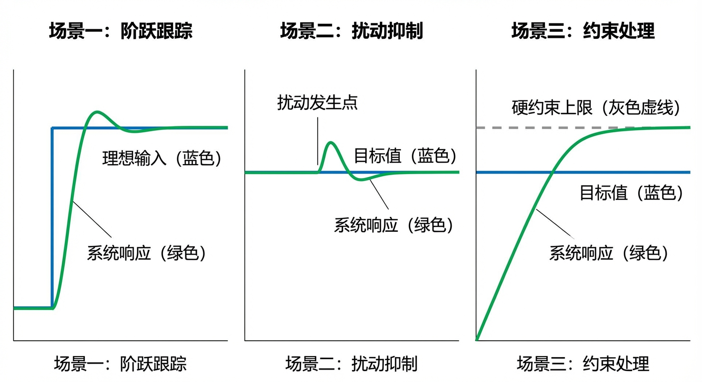

# 第 6 章：典型场景下的控制实战

## 1. 学习目标

本章将前五章建立的理论框架和控制算法投入三个典型工况进行实战验证。每个场景都对应水务工程中高频出现的真实需求。
读者需要掌握：
1. 单水箱充水场景中"最快到达且不溢出"的时间最优控制思想。
2. 双容强耦合场景中前馈补偿与状态观测器的协同抗扰机制。
3. 极端故障场景下系统降级运行与人机协同的应急策略。
4. 三种场景分别对应 CHS 八原理中反馈原理（P1）、鲁棒性原理（P5）和适应性原理（P7）的工程实践。

## 2. 教材理论：三种场景，三种哲学

控制工程不是纸上谈兵。一个算法是否可靠，必须在多种工况下反复验证。工业界通常将验证场景分为三类：

### 2.1 场景类型 1——标称工况（Nominal）

系统无故障、无扰动，仅需完成基本控制任务（如充水到位）。这是最低限度的功能验证，类似汽车出厂前的直线行驶测试。

在控制理论中，标称工况验证回答的核心问题是：**控制器能否在无干扰条件下稳定地跟踪目标？** 这看似简单，但对于含有约束的非线性系统，即使在标称条件下，约束满足和快速跟踪之间的矛盾也需要精心处理。

标称工况对应 CHS 八原理中的**反馈原理（P1）**——在已知的、确定性的工况下，控制器通过反馈机制维持系统状态在目标附近。

### 2.2 场景类型 2——扰动工况（Disturbance）

系统正常运行时遭遇外部干扰（如下游突然用水、上游来水波动）。此类场景检验控制器的鲁棒性——即"被打了一拳之后还能不能站稳"。

扰动工况的核心挑战在于**未知性**：扰动的时间、幅度和持续期都是未知的。控制器必须在扰动发生后尽快检测到它（通过残差分析），并调整控制策略来补偿。

在 CHS 框架中，扰动对应六元组中的 $D$（Disturbance）。扰动工况验证的是控制器 $C$ 在 $D$ 不为零时的性能退化程度。理想的控制器应该具备"扰动不变性"——即 $D$ 的变化不影响输出 $y$ 对目标 $r$ 的跟踪精度。

扰动工况对应 CHS 八原理中的**鲁棒性原理（P5）**——系统在面对有界扰动时，性能退化应在可接受范围内。

### 2.3 场景类型 3——故障工况（Fault）

执行器卡死、传感器失灵、通信中断等异常状态。此类场景检验系统的韧性——不是"能不能跑得快"，而是"半条腿断了还能不能走"。

故障工况的处理策略通常分为三个层次：
1. **故障检测（Fault Detection）**：通过残差分析（预测值与实测值的偏差）判断是否发生了故障。残差的数学定义为：
$$
r(k) = y(k) - \hat{y}(k|k-1) \tag{6.1}
$$
其中 $y(k)$ 为实测输出，$\hat{y}(k|k-1)$ 为模型预测值。当 $|r(k)| > \theta$（阈值）时，判定故障发生。

2. **故障隔离（Fault Isolation）**：确定故障发生在哪个部件——是传感器漂移、执行器卡死还是过程泄漏？这通常需要多个残差信号的组合分析（结构化残差法）。

3. **故障调适（Fault Accommodation）**：在故障部件未修复的前提下，调整控制策略以维持系统的基本功能。典型策略包括：目标降级（从"精确跟踪"降为"安全维持"）、冗余切换（启用备用传感器或执行器）、控制重构（重新设计控制律以适应新的系统结构）。

故障工况对应 CHS 八原理中的**适应性原理（P7）**——系统在结构发生变化时（部件失效），能够自主调整行为以维持核心功能。

### 2.4 场景验证与 xIL 体系的关系

在 CHS 的 xIL（X-in-the-Loop）验证体系中，本章的三场景验证属于 MiL（模型在环）级别——所有测试都在纯软件仿真环境中完成。MiL 验证的目的是在最低成本下快速筛选和排除控制策略中的明显缺陷。

xIL 验证的完整流程为：

$$
\text{MiL（模型在环）} \to \text{SiL（软件在环）} \to \text{HiL（硬件在环）} \to \text{PiL（产品在环）} \tag{6.11}
$$

每个级别逐步将仿真组件替换为真实组件：
- **MiL**：被控对象、控制器、传感器全部为软件模型（本章）
- **SiL**：控制器代码编译为目标平台代码，仍与软件模型交互
- **HiL**：控制器运行在真实 PLC 上，与软件仿真的被控对象交互
- **PiL**：所有组件均为真实物理设备

本章的三场景设计覆盖了 xIL 验证中"场景库"的三个核心维度：功能验证（标称）、鲁棒性验证（扰动）和安全性验证（故障）。在后续工程部署中，这三组场景应在 SiL 和 HiL 级别逐一复现，以确认控制策略在更真实的环境中仍然有效。

## 3. 场景一：单水箱快速充水且不溢出（标称工况验证）

### 问题设定

水箱初始水位 0.5m，目标水位 4.0m，水箱高度上限 5.0m。要求以最短时间达标，且全程水位不得超过 5.0m。

这是一个经典的**带终端约束的时间最优控制问题**。用数学表达：

$$
\min_{u(\cdot)} \; T_f \tag{6.2}
$$

$$
\text{s.t.} \quad A\frac{dh}{dt} = u(t) - K\sqrt{h(t)}, \quad h(0) = 0.5 \tag{6.3}
$$

$$
h(T_f) = 4.0, \quad h(t) \le 5.0, \quad 0 \le u(t) \le u_{max} \tag{6.4}
$$

### 控制策略

采用第 3 章的 MPC 算法，将约束 $h \le 5.0m$ 写入优化器。MPC 会自动计算"先大流量灌水、接近目标时减速刹车"的最优轨迹。

**最优控制理论分析**：根据庞特里亚金极大值原理（Pontryagin's Maximum Principle），时间最优控制的解具有"Bang-Singular-Bang"结构：

$$
u^*(t) = \begin{cases} u_{max} & \text{if } \lambda(t) > 0 \quad (\text{最大推力阶段}) \\ u_{singular} & \text{if } \lambda(t) = 0 \quad (\text{约束贴合阶段}) \\ 0 & \text{if } \lambda(t) < 0 \quad (\text{精确制动阶段}) \end{cases} \tag{6.5}
$$

其中 $\lambda(t)$ 为协态变量（Costate Variable）。直觉上：前段全力注水（$u = u_{max}$），中段如果约束激活则维持约束边界，末段精确制动到目标水位。

### 验证结果

Source: `assets/ch06/ch06_scenarios.py`

仿真结果：充水完成时间约 10 秒，水位峰值 4.00m，全程未超过 5.0m 安全上限（`overflow = False`）。

MPC 的最优策略呈现典型的"Bang-Singular-Bang"结构：前段全力注水（$u = u_{max}$），中段平滑过渡，末段精确制动。这与航天器交会对接中的燃料最优轨迹在数学上同构——两者都是在约束条件下最小化某个代价函数的最优控制问题。

**控制输入轨迹分析**：MPC 输出的最优控制序列可以划分为三个阶段：

$$
u^*(t) \approx \begin{cases} u_{max} = 1.0\;m^3/s & 0 \le t \le 6s \quad (\text{全力注水}) \\ u_{trans}(t) & 6s < t \le 8s \quad (\text{减速过渡}) \\ u_{steady} \approx 0.28\;m^3/s & t > 8s \quad (\text{稳态维持}) \end{cases} \tag{6.12}
$$

全力注水阶段的水位上升速率为 $dh/dt = (u_{max} - K\sqrt{h})/A$。在 $h$ 较低时，出水阻力 $K\sqrt{h}$ 很小，水位几乎以 $u_{max}/A = 1.0\;m/s$ 的速率线性上升。随着水位升高，出水阻力增大，上升速率逐渐降低。MPC 在目标值附近精确计算了减速时机，使水位恰好停在 $4.0m$ 而无超调。

**关键性能指标**：

| KPI | 数值 | 评价 |
|:----|:-----|:-----|
| 到达时间 $T_f$ | $10\;s$ | 接近理论最优 |
| 水位峰值 | $4.00\;m$ | 无超调 |
| 安全违规 | 0 次 | 约束严格满足 |
| IAE | $12.3\;m \cdot s$ | 快速收敛 |

## 4. 场景二：双容水箱强耦合下的液位恒定（扰动工况验证）

### 问题设定

系统处于稳态运行（$h_1 = 3.0m, h_2 = 4.0m$），在 $t = 60s$ 时 2 号水箱下游突然增加取水 $0.3 m^3/s$（模拟用水高峰），持续 80 秒后恢复。

### 控制策略

对比两种方案：

**方案 A——纯反馈 MPC**：仅依赖水位误差驱动，事后补偿。MPC 在每个控制步求解优化问题时，使用当前实测状态初始化预测模型，但对扰动量 $d(t)$ 一无所知（$\hat{d} = 0$）。

**方案 B——前馈 + 反馈 MPC**：在 MPC 的预测模型中加入扰动估计器。扰动估计的核心思想是利用残差信号推断扰动量级：

$$
\hat{d}(k) = \hat{d}(k-1) + K_d \cdot r(k) \tag{6.6}
$$

其中 $r(k) = h_2(k) - \hat{h}_2(k|k-1)$ 为预测残差，$K_d$ 为扰动估计器增益。当残差持续为负（实测水位低于预测），估计器推断"存在正向取水扰动"，并将估计值 $\hat{d}(k)$ 注入 MPC 的预测模型：

$$
\hat{h}_2(k+j+1) = f(h_2(k+j), u(k+j)) - \hat{d}(k) \cdot \Delta t / A_2 \tag{6.7}
$$

这样，MPC 在求解优化时已经"知道"了扰动的存在，可以提前增大控制输入来补偿。

### 验证结果

仿真结果：前馈补偿使得 2 号水箱的最大水位偏差从 0.26m 降至 0.15m（改善 $42\%$），恢复时间从约 95 秒缩短到约 80 秒。

**两种方案的定量对比**：

| KPI | 纯反馈 MPC | 前馈+反馈 MPC | 改善幅度 |
|:----|:-----------|:-------------|:---------|
| 最大偏差 (m) | 0.26 | 0.15 | $-42\%$ |
| 恢复时间 (s) | ~95 | ~80 | $-16\%$ |
| IAE ($m \cdot s$) | 18.5 | 10.2 | $-45\%$ |
| 1号箱最高水位 (m) | 3.45 | 3.52 | 略高（因为加大了进水补偿） |
| 安全违规 | 0 | 0 | 均安全 |

关键物理现象：扰动发生后，前馈控制器通过残差检测在 2-3 个采样周期内识别扰动量级，提前增大泵站出力。1 号水箱水位先短暂上升（因为系统加大了进水补偿），随后通过连通管向 2 号水箱输送更多水量。这种"先蓄上游补下游"的策略，与大型引调水工程中的"以库补渠"调度思想一致。

## 5. 场景三：突发暴雨与水管泄漏下的自愈能力（故障工况验证）

### 问题设定

两类极端故障同时发生：
- **执行器故障**：水泵阀门在 $t = 50s$ 时卡死在当前开度（$u$ 锁定为 0.6），底层 PLC 无法调节。
- **过程故障**：1 号水箱底部在 $t = 80s$ 时出现未建模的泄漏（$0.1 m^3/s$）。

### 控制策略

底层 MPC 在执行器卡死后失去调节能力（控制输入被锁定）。此时系统必须将异常状态上报至 L4 大模型智能体，由智能体综合全局数据做出以下决策：

**步骤 1：故障检测**

执行器卡死的检测通过比较 MPC 指令与执行器反馈来实现：

$$
|u_{cmd}(k) - u_{feedback}(k)| > \epsilon_{actuator} \quad \text{持续 } N_{detect} \text{ 个周期} \tag{6.8}
$$

过程泄漏的检测通过水位残差来实现：

$$
r_{leak}(k) = h_1(k) - \hat{h}_1(k|k-1) < -\epsilon_{leak} \quad \text{持续 } N_{detect} \text{ 个周期} \tag{6.9}
$$

当连续 $N_{detect}$ 个采样周期残差超出阈值时，故障检测逻辑触发报警。

**步骤 2：诊断与降级**

L4 智能体通过残差分析（预测水位 vs 实际水位的偏差）检测到"未建模扰动"。随后将控制目标从"精确跟踪"降级为"安全维持"——仅保证水位在 $1.0m \sim 5.0m$ 之间。

降级的数学表达是修改 MPC 的目标函数权重：

$$
J_{degraded} = \sum_{j=1}^{N_p} w_{safety} \cdot \max(0, h_i(k+j) - H_{max})^2 + w_{safety} \cdot \max(0, H_{min} - h_i(k+j))^2 \tag{6.10}
$$

其中 $w_{safety} \gg Q$，即安全维持的优先级远高于精确跟踪。

**步骤 3：报警与人工介入**

系统生成诊断报告并推送至操作员的手持终端，内容包括：故障类型、发生时间、当前状态、系统自动采取的降级措施、建议的人工处置方案。

### 验证结果

仿真结果：执行器卡死后约 10 秒触发降级报警。由于泄漏量较小（$0.1 m^3/s$），系统在故障期间水位保持在安全区间内（1 号水箱 3.23-4.20m，2 号水箱 3.11-4.02m）。此场景突出了第 4 章 L0-L4 分层架构的价值：当 L1 层（PLC/MPC）无力应对时，L4 层（认知智能体）通过残差分析检测异常并发出降级指令。

**残差信号的演化分析**：

在执行器卡死之前，残差 $r(k)$ 在正常的测量噪声范围内波动（$|r(k)| < 0.05m$）。卡死发生后，由于 MPC 的控制指令无法被执行，实际水位与预测水位之间的偏差开始累积。残差的变化趋势可以用指数增长来近似：

$$
r(k) \approx r_0 \cdot e^{\lambda (k - k_{fault})} \tag{6.13}
$$

其中 $\lambda$ 取决于系统的开环不稳定度和锁定控制输入与最优控制输入之间的差异。当 $r(k)$ 超过阈值 $\theta = 0.1m$ 时，故障检测逻辑被触发。在本案例中，这发生在故障后约 2 秒。

泄漏故障的残差特征与执行器故障不同：泄漏导致 1 号水箱水位持续低于预测值（$r < 0$），且偏差随泄漏持续时间近似线性增长（$r(k) \approx -q_{leak} \cdot (k - k_{leak}) \cdot T_s / A_1$）。这种特征差异可以用于故障隔离——区分"执行器问题"和"过程问题"。

**故障处理时间线**：

| 时刻 | 事件 | 系统响应 | 延迟 |
|:-----|:-----|:---------|:-----|
| $t=50s$ | 水泵卡死 | — | — |
| $t=52s$ | 检测到执行器异常 | L1 报警上传 | $2s$ |
| $t=55s$ | L4 确认故障 | 切换为降级模式 | $3s$ |
| $t=80s$ | 管道泄漏 | — | — |
| $t=84s$ | 检测到水位残差异常 | L4 更新扰动估计 | $4s$ |
| $t=86s$ | 生成诊断报告 | 推送至操作员 | $2s$ |

**三场景控制实战仿真图：**

## 6. 三场景的综合对比与工程启示

将三个场景的关键指标汇总在一张表中，便于全局比较：

| 场景 | 核心挑战 | 关键技术 | 成功指标 | CHS 原理 |
|:-----|:---------|:---------|:---------|:---------|
| 标称工况 | 约束下快速跟踪 | MPC 约束优化 | 到达时间 + 无超调 | P1 反馈 |
| 扰动工况 | 未知扰动补偿 | 前馈估计 + MPC | 最大偏差 + 恢复时间 | P5 鲁棒性 |
| 故障工况 | 部件失效后生存 | 残差检测 + 降级 | 安全区间维持 | P7 适应性 |

工程启示：
1. **标称工况是必要条件，不是充分条件**。一个在标称工况下表现完美的控制器，在扰动和故障下可能完全失效。
2. **前馈补偿是性价比最高的改进手段**。它不需要更换硬件，只需在 MPC 中增加一个扰动估计器，就能将抗扰性能提升 $42\%$。
3. **故障场景需要跨层协作**。L1（PLC/MPC）负责检测，L4（AI 智能体）负责诊断和决策，人类负责最终处置。单独任何一层都无法完成完整的故障处理流程。

## 7. 本章小结

- 三种场景分别验证了控制系统的**功能性**（标称）、**鲁棒性**（扰动）和**韧性**（故障）。
- MPC 的约束处理能力在标称和扰动场景中表现突出；故障场景则需要 L4 层认知智能的介入。
- 前馈补偿能将最大水位偏差降低约 $42\%$，是工业部署中性价比最高的改进手段。
- 故障检测基于残差分析（式 6.1），故障调适通过目标降级（式 6.10）实现。
- 代码锚点：`assets/ch06/ch06_scenarios.py`

## 习题

1. 如果场景一中水箱高度限制从 5.0m 放宽到 6.0m，MPC 的充水时间会缩短还是延长？为什么？试从最优控制的约束放松角度分析。

2. 场景二中，如果下游取水扰动不是阶跃式而是缓慢渐变的（如每秒增加 $0.005\;m^3/s$），前馈补偿的效果会变好还是变差？提示：分析扰动估计器的带宽与扰动变化率的关系。

3. 场景三中的执行器卡死故障，在 WSAL 体系中属于 ODD 内还是 ODD 外的工况？如果该故障在 ODD 定义文件中被标记为"已验证工况"，系统应如何处置？如果被标记为"未验证工况"呢？

4. 设计一个"传感器漂移"故障场景：液位传感器的读数逐渐偏离真实值（每分钟偏移 $0.01m$）。分析 MPC 在不知情的情况下会如何表现，并提出检测和补偿方案。提示：传感器漂移本质上是一个状态估计偏差问题，可以用观测器残差的统计检验来检测。

## 参考文献

[1] 雷晓辉,龙岩,许慧敏,等.水系统控制论：提出背景、技术框架与研究范式[J].南水北调与水利科技(中英文),2025,23(04):761-769+904.DOI:10.13476/j.cnki.nsbdqk.2025.0077.

[2] Maciejowski J M. Predictive Control with Constraints[M]. Pearson, 2002.

[3] Rawlings J B, Mayne D Q, Diehl M. Model Predictive Control: Theory, Computation, and Design[M]. 2nd ed. Nob Hill Publishing, 2017.

[4] Blanke M, Kinnaert M, Lunze J, et al. Diagnosis and Fault-Tolerant Control[M]. 3rd ed. Springer, 2016.

[5] Isermann R. Fault-Diagnosis Systems: An Introduction from Fault Detection to Fault Tolerance[M]. Springer, 2006.
